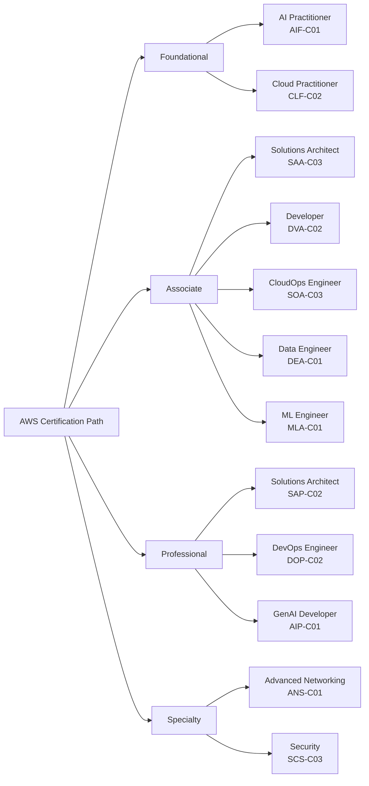
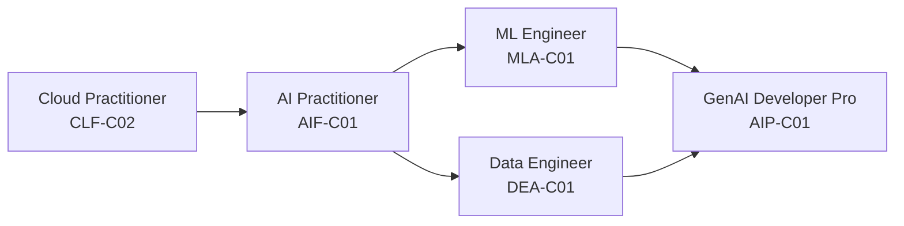
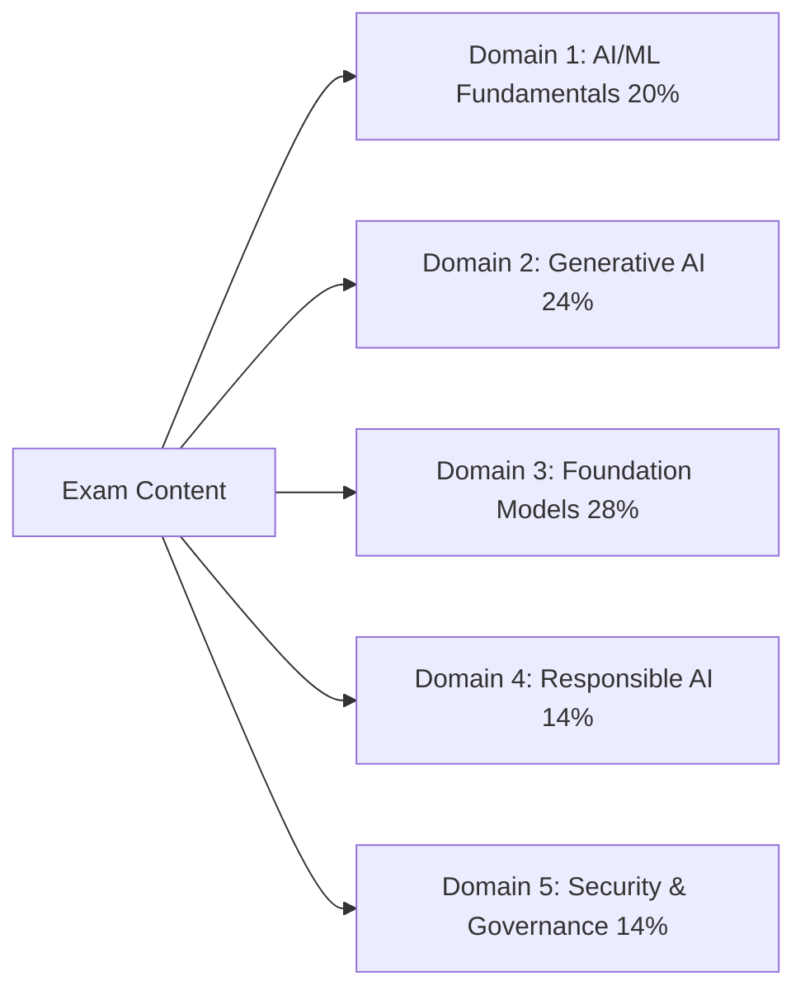
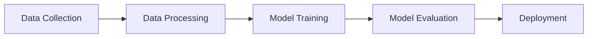

# AWS Certifications and the AI Practitioner Exam

## Introduction to AWS Certifications

AWS certifications validate expertise in cloud and AI technologies that power modern business operations. These industry-recognized credentials serve as benchmarks for technical proficiency and provide structured pathways for professionals to develop skills that effectively leverage AWS capabilities. For organizations undergoing digital transformation, certified professionals bring valuable expertise that drives innovation and operational efficiency.

Beyond validation, AWS certifications deliver tangible benefits including professional recognition, career advancement opportunities, and often higher earning potential. The skills acquired through certification directly apply to real-world business challenges, enabling professionals to implement effective cloud solutions. The certification process also promotes continuous learning, helping professionals stay current with rapidly evolving cloud technologies.

## AWS Certification Path

AWS offers a comprehensive certification program that covers a range of skills and expertise levels. This structured path helps professionals build strong foundations in cloud and AI technologies, progressing from basic knowledge to advanced specializations across four main categories: Foundational, Associate, Professional, and Specialty.



*Figure 0.2: AWS Certification Hierarchy. All current AWS certifications organized by level. The AI Practitioner (AIF-C01) sits at the Foundational level alongside Cloud Practitioner.*

This structure enables professionals to begin with fundamental knowledge and progress to specialized expertise aligned with their career goals. Note that the Machine Learning - Specialty (MLS-C01) exam is retiring on March 31, 2026 and is not shown above. AWS recommends the Machine Learning Engineer - Associate (MLA-C01) as the primary path for ML practitioners going forward.

For professionals building an AI and ML specialization on AWS, the recommended certification sequence is:



*Figure 0.3: Recommended AI/ML Certification Path. Starting from AI Practitioner, professionals can pursue the ML Engineer Associate and Data Engineer Associate before advancing to the Generative AI Developer Professional certification.*

This path represents increasing technical depth, moving from foundational AI literacy through hands-on ML engineering and data skills toward advanced generative AI solution development.

To maintain certification validity, AWS requires recertification every three years, ensuring certified individuals stay current with the latest AWS technologies and best practices.

## The AWS Certified AI Practitioner Certification

### Overview and Positioning

The AWS Certified AI Practitioner certification addresses the growing need for AI literacy across organizations. This certification occupies a strategic position in the AWS ecosystem, validating foundational knowledge of artificial intelligence, machine learning, and generative AI technologies with an emphasis on practical business applications.

This certification validates foundational knowledge of AI/ML and generative AI technologies on AWS. Designed for business analysts, product managers, and non-technical professionals who work with AI solutions, it bridges the gap between technical implementation and business objectives. By validating your ability to evaluate AI solutions and communicate with technical teams, it enables organizations to effectively leverage AI capabilities and drive innovation.

### How It Differs from Other AI/ML Certifications

The AWS Certified AI Practitioner sits at the Foundational level. Several other certifications cover AI and ML at greater technical depth. Understanding where AIF-C01 fits helps you plan your certification path after this exam.

*Table 0.4: AI/ML Certification Comparison.*

| Certification | Level | Audience | Focus |
|---|---|---|---|
| AI Practitioner (AIF-C01) | Foundational | Business professionals | Concepts, use cases, AWS AI services |
| ML Engineer Associate (MLA-C01) | Associate | ML engineers, data scientists | SageMaker, model training and deployment |
| GenAI Developer Pro (AIP-C01) | Professional | GenAI developers | RAG, agentic AI, FM integration |
| Data Engineer Associate (DEA-C01) | Associate | Data engineers | Pipelines, storage, data quality |

The **Machine Learning Engineer - Associate (MLA-C01)** is the natural next step after AIF-C01 for professionals moving toward technical implementation. It validates hands-on ability to build, train, and deploy ML models using Amazon SageMaker. It targets data scientists, ML engineers, and developers who write code and build production ML systems.

The **Generative AI Developer - Professional (AIP-C01)** is the advanced certification for professionals building production-grade generative AI applications. It covers RAG architectures, vector stores, agentic AI systems, FM integration patterns, and AI safety in depth. It requires substantial hands-on development experience.

The **Data Engineer - Associate (DEA-C01)** focuses on the data infrastructure that supports AI/ML systems -- pipelines, storage, ETL, and data quality. It targets professionals who build and maintain the data foundations that ML models depend on.

The **AI Practitioner (AIF-C01)** is distinct from all three. It requires no implementation experience and focuses on understanding AI capabilities, evaluating solutions, and applying responsible AI practices. Business analysts, product managers, and technical professionals who work with AI teams without building models are the primary audience.

## Exam Details and Structure

### Exam Overview

The AWS Certified AI Practitioner (AIF-C01) exam features 65 questions to be completed in 90 minutes. Available in English, Japanese, Korean, Portuguese (Brazil), and Simplified Chinese, it requires a passing score of 700 out of 1000 points.



Foundation Models and Generative AI comprise over half of the exam content, reflecting their growing importance in enterprise AI adoption. The exam assesses your ability to:
- Demonstrate comprehensive understanding of AI/ML concepts and AWS services
- Evaluate appropriate use cases for different AI technologies
- Make informed decisions about implementing AI solutions
- Apply responsible AI practices and governance principles

### Target Audience

The ideal candidate has approximately 6 months of exposure to AI/ML technologies on AWS. While you should have experience using AI/ML solutions, you're not expected to build them yourself. A strong foundation in **core AWS services** is essential, including Amazon EC2, Amazon S3, AWS Lambda, and Amazon SageMaker.

Candidates should understand the **AWS shared responsibility model**, AWS Identity and Access Management (IAM) principles, AWS global infrastructure, and AWS service pricing models.

Different professionals can benefit from this certification in unique ways:

Table 2. Roles Benefiting from AWS Certified AI Practitioner

| Role Category | Key Personnel | Primary Benefits | Key Activities |
|--------------|---------------|------------------|----------------|
| Business Decision Makers | Project Managers, Business Analysts, Executives | Strategic planning and evaluation capabilities | Evaluating AI initiatives, assessing feasibility, developing adoption roadmaps |
| Technology Professionals | IT Staff, Cloud Architects, Technical Consultants | Technical integration and support knowledge | Supporting AI systems, designing integrated solutions, platform evaluation |
| Domain Specialists | Industry Experts, Research Professionals, QA Specialists | Domain-specific AI application insights | Guiding implementations, ensuring quality, exploring applications |
| Support and Operations | Operations Teams, Customer Success Managers, Technical Writers | Operational excellence and support capability | Managing AI services, documenting systems, developing training programs |

This certification does not expect you to develop AI/ML models, implement data engineering techniques, perform hyperparameter tuning, build AI/ML pipelines, conduct mathematical analysis of models, or develop governance frameworks for AI/ML solutions.

### Exam Structure and Scoring

The exam contains 50 scored questions plus 15 unscored questions that AWS uses to evaluate potential future content. The unscored questions are distributed throughout the exam and aren't identified. There's no penalty for guessing, and unanswered questions are marked incorrect.

The exam employs a sophisticated scoring model that:
- Uses a scale of 100-1,000 points
- Requires a minimum passing score of 700
- Implements **compensatory scoring**, meaning you don't need to pass each section individually
- Uses scaled scoring to ensure fairness across different exam versions

Your score report includes:
- Overall pass/fail status
- Scaled score
- Performance feedback by exam section
- General information about strengths and weaknesses

The standard exam duration is 90 minutes. Non-native English speakers can request a 30-minute extension ("ESL +30" accommodation) when taking the exam in English, providing 120 minutes total exam time.

## Exam Question Types

The AWS Certified AI Practitioner exam includes several question formats to thoroughly assess your knowledge. Understanding these formats helps you prepare more effectively and approach the exam confidently.

### Multiple Choice Questions

Multiple choice questions present a scenario or concept with four possible answers - one correct answer and three incorrect options (distractors). The distractors test common misconceptions and validate your depth of understanding.

For example:

```
Which AWS service provides a fully managed environment for building, training, and deploying machine learning models at scale?

A) Amazon EC2 - Provides virtual servers but requires manual ML setup
B) Amazon S3 - Offers storage but not ML capabilities  
C) Amazon SageMaker - Purpose-built managed service for ML workflows
D) Amazon Redshift - Data warehouse service without native ML features

Correct Answer: C
```

The incorrect options represent related services that may support ML workflows but don't provide comprehensive ML capabilities.

### Multiple Response Questions 

Multiple response questions require selecting two or more correct answers from five or more options. You must identify ALL correct responses to receive credit - partial credit is not awarded.

```
Which TWO capabilities does Amazon SageMaker Studio provide? (Select TWO)

A) Integrated development environment (IDE) for ML
B) Automated model deployment and monitoring
C) Raw compute capacity for training
D) Object storage for datasets
E) Relational database management

Correct Answers: A, B
```

When approaching multiple response questions:
1. Read the question carefully to identify exactly how many answers are required
2. Evaluate each option independently
3. Double-check that you've selected the exact number of answers specified
4. Verify that ALL your selections are correct, as partial credit isn't given

### Ordering Questions

Ordering questions test your understanding of sequential processes in AWS AI and ML implementations. These questions present 3-5 items that must be arranged in the correct order to complete a specific task or process.



Each step builds upon previous ones in a logical sequence reflecting real-world AI/ML workflows. When answering ordering questions, consider:
- Dependencies between steps
- AWS service requirements and prerequisites  
- Industry standard workflows
- AWS best practices

### Matching Questions

Matching questions evaluate your ability to correctly associate related concepts, services, or components within the AWS AI/ML ecosystem. These questions present two lists of items that need to be paired based on their relationships.

A matching question typically contains:
- A list of 3-7 prompts (usually AWS services, features, or concepts)
- A corresponding list of descriptions or characteristics 
- Instructions to match each prompt with its correct corresponding item

Example matching question:

```
Match the AWS AI/ML service with its primary capability:

Prompts:
1. Amazon Bedrock
2. Amazon SageMaker Canvas
3. Amazon Comprehend
4. Amazon Rekognition

Descriptions:
A. No-code ML model building and inference
B. Natural language processing and text analysis
C. Foundation model access and deployment
D. Computer vision and image/video analysis

Correct matches: 1-C, 2-A, 3-B, 4-D
```

When approaching matching questions:
1. Read all items in both lists carefully before making any matches
2. Look for obvious matches first to narrow down remaining options
3. Use process of elimination for challenging pairs
4. Verify that each match aligns with your AWS knowledge

### Case Study Questions

Case study questions evaluate your ability to analyze real-world scenarios and apply AWS AI/ML knowledge to solve business problems. Each case study presents a scenario followed by multiple related questions that are scored independently.

Case study questions test your ability to:
- Analyze business requirements and constraints
- Select appropriate AWS AI services and features
- Apply AI/ML best practices and architectural patterns
- Consider factors like cost, performance, security and compliance

Example case study format:

```
Scenario: 
A global retail company wants to enhance their customer experience by implementing 
AI-powered product recommendations across their mobile app and website. They have:
- 50 million active customers
- Product catalog of 1 million items
- Customer purchase history going back 3 years
- Real-time clickstream data
- Requirement to update recommendations hourly

Question 1: 
Which combination of AWS services would you recommend to build this recommendation system?

Question 2:
What technical considerations are most important for the success of this implementation?
```

When approaching case studies:
1. Carefully read and analyze the full scenario
2. Note key requirements and constraints
3. Consider relevant AWS services and features
4. Evaluate tradeoffs between different approaches
5. Select solutions that best meet the stated needs

## Exam Preparation Tips

### Time Management

Effective time management is crucial for exam success:

1. Review the number of questions and time allowed
2. Allocate time proportionally to question types
3. Don't spend too long on any single question
4. Flag difficult questions to revisit if time permits
5. Leave time to review marked questions

### Focus Areas

The exam emphasizes practical application over memorization. Key areas include:

- Understanding core AI/ML concepts and terminology
- Identifying appropriate use cases for different AI technologies
- Knowing AWS AI services capabilities and limitations
- Comprehending **responsible AI principles**
- Recognizing security and compliance requirements

Remember that questions test your ability to apply knowledge in realistic scenarios rather than simply recalling facts.

### Preparation Resources

AWS offers comprehensive resources through AWS Skill Builder, a dedicated learning portal that provides both free and subscription-based training options to help professionals prepare for their certifications.

Table 1. Key Preparation Resources for AWS Certifications

| Resource Type | Description | Best For |
|--------------|-------------|-----------|
| Digital Training | Self-paced online courses | Understanding core concepts |
| Classroom Training | Instructor-led sessions | Interactive learning and direct guidance |
| Practice Exams | Sample questions and scenarios | Exam preparation and gap analysis |
| Documentation | Technical guides and whitepapers | Deep technical knowledge building |
| Hands-on Labs | Practical AWS console exercises | Real-world experience and skill validation |

For the AWS Certified AI Practitioner certification specifically, preparation should focus on core knowledge areas such as AI/ML fundamental concepts, key terminology and frameworks, and industry best practices. Additionally, candidates should familiarize themselves with AWS AI services, including Amazon SageMaker and Amazon Bedrock, as well as governance and best practices related to responsible AI, security requirements, and compliance standards.

## Conclusion

The AWS Certified AI Practitioner certification validates essential knowledge of modern AI technologies, generative AI capabilities, and responsible AI practices on AWS. Designed for business analysts, product managers, and professionals who work with AI solutions but don't build them, this certification demonstrates your ability to:

- Make informed decisions about AI technology adoption
- Effectively communicate with technical teams about AI initiatives
- Identify appropriate use cases for different AI solutions
- Apply responsible AI practices in your organization
- Navigate the rapidly evolving AI landscape on AWS

By earning this certification, you establish a foundation for understanding AI while focusing on business value rather than technical implementation. This makes it particularly valuable as organizations increasingly leverage AI capabilities through services like Amazon Bedrock, Amazon SageMaker, and other AWS AI tools.

AWS certifications serve as a vital pathway for validating cloud expertise and accelerating career growth in an AI-driven technology landscape. The AWS Certified AI Practitioner certification bridges technical and business domains during this transformative period of AI adoption.

As you work through this study guide, remember that the knowledge gained extends beyond exam preparation. These concepts provide essential context for evaluating AI/ML solutions, having informed discussions about AI capabilities and limitations, making responsible decisions about AI implementation, and effectively leveraging AWS's growing portfolio of AI services.
