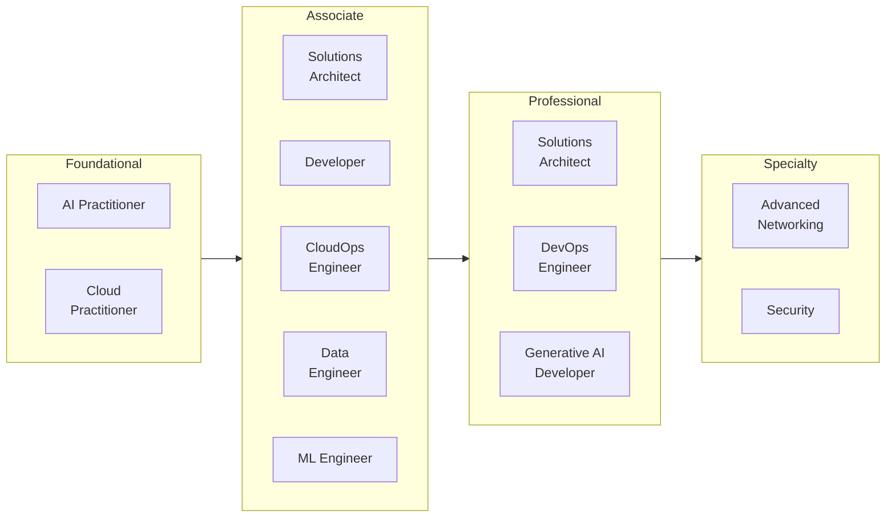
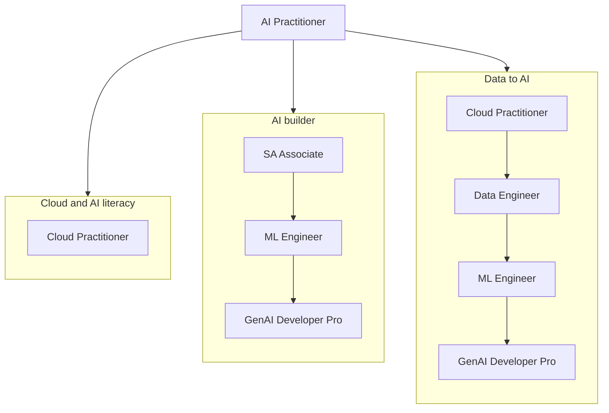
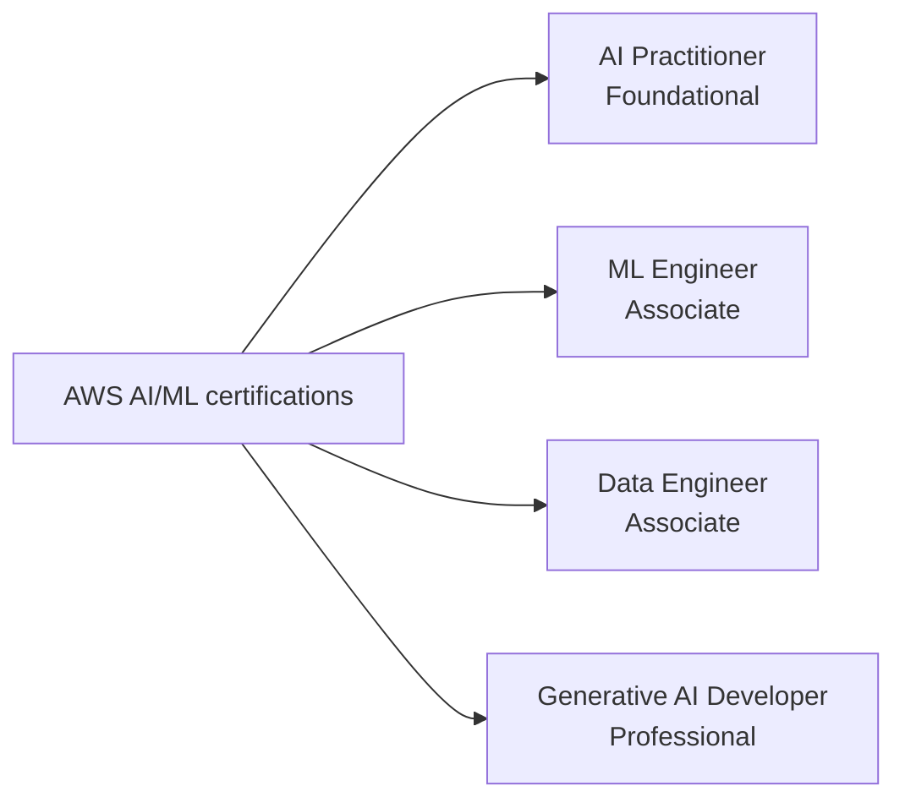
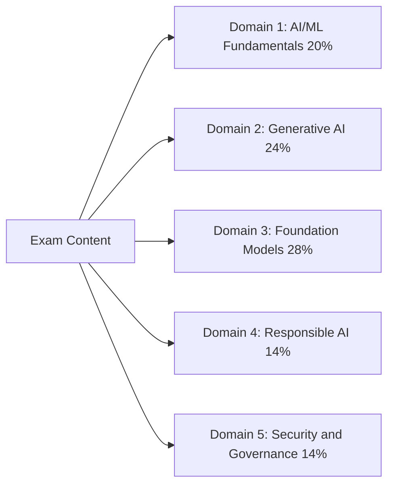
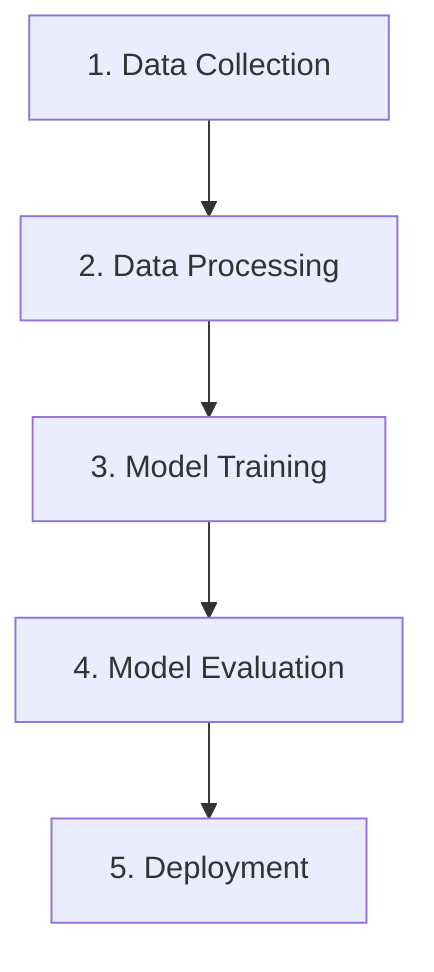

# AWS Certifications and the AI Practitioner Exam

## Introduction to AWS Certifications

AWS certifications validate expertise in cloud and AI technologies that underpin most of today's enterprise computing. They are recognized industry-wide as a proxy for technical proficiency and as a structured path for professionals who want to develop the skills needed to use AWS effectively. For organizations going through digital transformation, certified professionals bring expertise that translates directly into faster project delivery and fewer expensive mistakes.

The benefits go beyond the credential itself. Certified professionals report higher salaries, more interview pipeline, and better positioning for promotions and stretch assignments.[^006001] The skills behind the certification map to real-world challenges, and the recertification cycle keeps holders current as the AWS portfolio evolves.

## AWS Certification Path

AWS organizes its certification program into four levels: Foundational, Associate, Professional, and Specialty. The structure lets professionals begin with broad knowledge and progress into specialized expertise that aligns with their career goals.


```mermaid
flowchart LR    
    subgraph F["Foundational"]
        direction LR
        F1[AI Practitioner]
        F2[Cloud<br>Practitioner]
    end
    subgraph A["Associate"]
        direction LR
        A1[Solutions<br>Architect]
        A2[Developer]
        A3[CloudOps<br>Engineer]
        A4[Data<br>Engineer]
        A5[ML Engineer]
    end
    subgraph P["Professional"]
        direction LR
        P1[Solutions<br>Architect]
        P2[DevOps<br>Engineer]
        P3[Generative AI<br>Developer]
    end
    subgraph S["Specialty"]
        direction LR
        S1[Advanced<br>Networking]
        S2[Security]
    end
    F --> A
    A --> P
    P --> S
```

*Figure 0.6.1: The full AWS certification portfolio in May 2026, grouped by tier. Twelve active certifications cover roles from cloud literacy to deep AI engineering. AI Practitioner is one of two foundational certifications; Generative AI Developer at the Professional level extends the AI/ML track for deeper-skilled audiences.*

The diagram shows how the **AI Practitioner** certification fits next to **Cloud Practitioner** at the foundational level.[^006002] The Machine Learning Specialty certification, which used to anchor the deep technical AI/ML track, retired on March 31, 2026, and has been replaced by the **Machine Learning Engineer - Associate** and the **Generative AI Developer - Professional**.[^006003] AWS also renamed SysOps Administrator - Associate to **CloudOps Engineer - Associate** in 2025.

The AWS certification ladder is not a single straight line. Different roles take different paths to the same advanced credentials. The map below sketches three common multi-pass routes:


```mermaid
flowchart TB
    
    P[AI Practitioner]

    subgraph B[Cloud and AI literacy]
        direction TB
        B1[Cloud Practitioner]
    end

    subgraph A[AI builder]
        direction TB
        A2[SA Associate]
        A3[ML Engineer]
        A4[GenAI Developer Pro]
    end

    subgraph D[Data to AI]
        direction TB
        D1[Cloud Practitioner]
        D2[Data Engineer]
        D3[ML Engineer]
        D4[GenAI Developer Pro]
    end
    
    P --> B
    P --> A
    P --> D
    D1 --> D2 --> D3 --> D4
    A2 --> A3 --> A4
```

*Figure 0.6.2: Three representative paths through the AWS certification portfolio. The business-and-AI-literacy track stops at AI Practitioner. The AI-builder and data-to-AI tracks both converge on Generative AI Developer - Professional but enter through different associate-level credentials.*

A practitioner can stop after AI Practitioner if the goal is informed decision-making rather than hands-on engineering. A practitioner who plans to build AI agents in production typically benefits from at least the Solutions Architect - Associate and the Machine Learning Engineer - Associate before moving to the Generative AI Developer - Professional.

To maintain certification validity, AWS requires recertification every three years. This keeps holders current with the latest services and best practices.

## The AWS Certified AI Practitioner Certification

### Overview and Positioning

The AWS Certified AI Practitioner certification addresses the rapidly growing need for AI literacy across organizations. It validates foundational knowledge of artificial intelligence, machine learning, and generative AI on AWS, with an emphasis on practical business application rather than implementation detail.

The certification is aimed at business analysts, product managers, IT support staff, and other professionals who work alongside AI but do not necessarily build it. By validating your ability to evaluate AI options and communicate with engineering teams, it helps organizations adopt AI capabilities in a more informed way and avoid expensive missteps.

### How It Differs from Other AI/ML Certifications

The AWS AI/ML certifications now form a clearly tiered set. They target different audiences and different skill levels.


```mermaid
flowchart LR
    A[AWS AI/ML certifications] --> B[AI Practitioner<br/>Foundational]
    A --> C[ML Engineer<br/>Associate]
    A --> D[Data Engineer<br/>Associate]
    A --> E[Generative AI Developer<br/>Professional]
```

*Figure 0.6.3: The AWS AI/ML certification map. Each certification targets a specific audience and depth of skill, from business literacy at the foundational level to production architecture at the Professional level.*

The **Generative AI Developer - Professional** certification (AIP-C01) validates expertise in designing, building, and operationalizing generative AI solutions on AWS at scale. It targets architects and senior engineers who own AI systems end to end.

The **Machine Learning Engineer - Associate** (MLA-C01) validates the skills needed to build, deploy, and monitor ML models in production. It targets ML engineers and developers who own the ML side of an application.

The **Data Engineer - Associate** (DEA-C01) focuses on the data infrastructure that AI/ML projects depend on. It targets engineers who build and maintain the pipelines and storage layers that feed AI workloads.

In contrast, the **AI Practitioner** focuses on fundamentals and business application. It is designed for professionals who use AI/ML solutions, not the people who build them. Business analysts, product managers, and technically literate IT support staff are the primary audience.

This four-way tiering reflects the maturing AI/ML market. Building, deploying, and governing AI now require enough specialized skill that AWS offers a separate certification for each layer.

## Exam Details and Structure

### Exam Overview

The AWS Certified AI Practitioner (AIF-C01) exam contains 65 questions to be completed in 90 minutes. It is available in English, Japanese, Korean, Portuguese (Brazil), and Simplified Chinese. The minimum passing score is 700 on a 100 to 1,000 scale.

The current exam version is **V1.1**, published April 30, 2026, and effective on the exam approximately one month later.[^006004] V1.1 added agentic AI, Amazon Bedrock AgentCore, Strands Agents, Kiro, and Amazon Quick to the in-scope material. It also removed Amazon MemoryDB. The objective changes are consequential enough that any preparation material older than mid-2026 should be cross-referenced against the current exam guide.


```mermaid
flowchart LR
    A[Exam Content] --> B[Domain 1: AI/ML Fundamentals 20%]
    A --> C[Domain 2: Generative AI 24%]
    A --> D[Domain 3: Foundation Models 28%]
    A --> E[Domain 4: Responsible AI 14%]
    A --> F[Domain 5: Security and Governance 14%]
```

*Figure 0.6.4: AIF-C01 V1.1 domain weights. Domains 2 and 3 together cover generative AI and foundation-model applications and account for over half of the scored content.*

Foundation models and generative AI together cover more than half the exam, which is consistent with how rapidly those topics have moved into the center of enterprise AI work. The exam assesses your ability to:

- Demonstrate understanding of AI/ML and generative AI concepts and AWS services
- Evaluate appropriate use cases for different AI technologies
- Make informed decisions about implementing AI solutions
- Apply responsible AI practices and governance principles

### Target Audience

The ideal candidate has approximately six months of exposure to AI/ML technologies on AWS. You should be comfortable using AI/ML solutions, but you are not expected to build them yourself. A working familiarity with **core AWS services** is essential, including Amazon EC2, Amazon S3, AWS Lambda, Amazon Bedrock, and Amazon SageMaker AI.[^006005]

You should also have a working understanding of the **AWS shared responsibility model**, AWS Identity and Access Management (IAM), and AWS service pricing models.

Different professionals can benefit from this certification in different ways:

*Table 0.6.1: Roles benefiting from AWS Certified AI Practitioner.*

| Role category            | Key personnel                                                  | Primary benefits                               | Key activities                                                                 |
| ------------------------ | -------------------------------------------------------------- | ---------------------------------------------- | ------------------------------------------------------------------------------ |
| Business decision makers | Project managers, business analysts, executives                | Strategic planning and evaluation capabilities | Evaluating AI initiatives, assessing feasibility, developing adoption roadmaps |
| Technology professionals | IT staff, cloud architects, technical consultants              | Technical integration and support knowledge    | Supporting AI systems, designing integrated solutions, platform evaluation     |
| Domain specialists       | Industry experts, research professionals, QA specialists       | Domain-specific AI application insight         | Guiding implementations, ensuring quality, exploring applications              |
| Support and operations   | Operations teams, customer-success managers, technical writers | Operational excellence and support capability  | Managing AI services, documenting systems, developing training programs        |

The certification does not require you to develop AI/ML models, implement data engineering, perform hyperparameter tuning, build AI/ML pipelines, conduct mathematical analysis of models, or develop full governance frameworks. Those are the responsibilities of the higher-level certifications.

### Exam Structure and Scoring

The exam contains 50 scored questions plus 15 unscored questions that AWS uses to evaluate potential future content. The unscored questions are distributed throughout the exam and are not identified. There is no penalty for guessing, and unanswered questions are scored as incorrect.

The scoring model has four characteristics worth knowing:

- Scaled scoring on a 100 to 1,000 range
- Minimum passing score of 700
- Compensatory scoring, meaning you do not need to pass each section individually, only the overall exam
- Scaled scoring across multiple exam forms to keep difficulty fair across versions

Your score report includes overall pass or fail status, the scaled score, and section-level performance feedback that highlights strengths and weaknesses. The section-level feedback is general guidance, not a precise per-section grade.

The standard exam duration is 90 minutes. Non-native English speakers can request a 30-minute extension, called the "ESL +30" accommodation, when taking the exam in English, for a total of 120 minutes.

## Exam Question Types

The exam uses four question formats. Knowing the formats in advance helps you allocate time and avoid surprises.

### Multiple Choice Questions

Multiple-choice questions present a scenario or concept with four possible answers, one correct and three distractors. The distractors are designed to test common misconceptions and to validate that you understand the depth of the topic, not just the surface.

Example:

```
Which AWS service provides a fully managed environment for building, training, and
deploying machine learning models at scale?

A) Amazon EC2     - Provides virtual servers but requires manual ML setup
B) Amazon S3      - Offers storage but not ML capabilities
C) Amazon SageMaker AI - Purpose-built managed service for ML workflows
D) Amazon Redshift - Data warehouse service without native ML features

Correct Answer: C
```

The incorrect options are services that touch ML workflows in some way but do not provide the full managed-ML experience.

### Multiple Response Questions

Multiple-response questions require selecting two or more correct answers from five or more options. You must identify all correct responses to receive credit. Partial credit is not awarded.

```
Which TWO capabilities does Amazon SageMaker Studio provide? (Select TWO)

A) Integrated development environment (IDE) for ML
B) Automated model deployment and monitoring
C) Raw compute capacity for training
D) Object storage for datasets
E) Relational database management

Correct Answers: A, B
```

When you see a multiple-response question:

1. Read the question carefully and note exactly how many answers are required.
2. Evaluate each option independently before comparing them.
3. Verify that you have selected the exact number of answers specified.
4. Confirm that all of your selections are correct, since partial credit is not given.

### Ordering Questions

Ordering questions test your understanding of sequential processes. They present three to five items that must be arranged in the correct order to complete a task.


```mermaid
flowchart TD
    A[1. Data Collection] --> B[2. Data Processing]
    B --> C[3. Model Training]
    C --> D[4. Model Evaluation]
    D --> E[5. Deployment]
```

*Figure 0.6.5: A canonical ML workflow used as an ordering-question example. Each step depends on its predecessor, and the order reflects standard practice.*

When you see an ordering question, look for:

- Dependencies between steps
- AWS service requirements and prerequisites
- Industry-standard workflows
- AWS best practices

### Matching Questions

Matching questions ask you to associate items in two lists. They typically present three to seven prompts and a corresponding list of descriptions, and require you to match each prompt with its correct description.

A typical matching question:

```
Match the AWS AI/ML service with its primary capability:

Prompts:
1. Amazon Bedrock
2. Amazon SageMaker Canvas
3. Amazon Comprehend
4. Amazon Rekognition

Descriptions:
A. No-code ML model building and inference
B. Natural language processing and text analysis
C. Foundation model access and deployment
D. Computer vision and image and video analysis

Correct matches: 1-C, 2-A, 3-B, 4-D
```

When approaching matching questions:

1. Read all items in both lists carefully before making any matches.
2. Lock in the obvious matches first, then narrow the rest by elimination.
3. Use process of elimination for the remaining harder pairs.
4. Verify each match against your AWS knowledge.

## Exam Preparation Tips

### Time Management

Effective time management matters more than raw knowledge for many candidates. A few practical guidelines:

1. Note the question count and time allowed at the start.
2. Aim for roughly 80 seconds per question on the first pass.
3. Do not spend more than two minutes on any single question.
4. Flag difficult questions and revisit them after the first pass.
5. Leave at least five to ten minutes at the end for review.

If English is not your first language, AWS lets you request 30 minutes of extra exam time as an accommodation. The request must be submitted through your AWS Certification account before you book the exam, and once approved it applies to every AWS exam you schedule from that account.

### Focus Areas

The exam emphasizes practical application over memorization. Key areas:

- Core AI/ML concepts and terminology, including agentic AI, RAG, and MCP
- The right AI service for the right business problem
- AWS service capabilities and limitations, especially Amazon Bedrock and the AgentCore family
- Responsible AI principles including bias, fairness, transparency, and explainability
- Security, including Amazon Bedrock Guardrails and AWS shared responsibility for AI

The questions test your ability to apply knowledge in realistic scenarios, not your ability to recite a definition.

### Preparation Resources

AWS offers a range of preparation resources through AWS Skill Builder, including free and subscription-based content.[^006006]

*Table 0.6.2: Key preparation resources for AWS certifications.*

| Resource type      | Description                      | Best for                                   |
| ------------------ | -------------------------------- | ------------------------------------------ |
| Digital training   | Self-paced online courses        | Understanding core concepts                |
| Classroom training | Instructor-led sessions          | Interactive learning and direct guidance   |
| Practice exams     | Sample questions and scenarios   | Exam preparation and gap analysis          |
| Documentation      | Technical guides and whitepapers | Deep technical knowledge building          |
| Hands-on labs      | Practical AWS console exercises  | Real-world experience and skill validation |

For AIF-C01 specifically, focus on AI/ML fundamentals, the GenAI and FM domains, and the new agentic-AI material added in V1.1. Hands-on time with **Amazon Bedrock**, the model playground, and **Amazon Bedrock AgentCore** is the single best return on study time once the fundamentals are in place.

## Conclusion

The AWS Certified AI Practitioner certification validates essential knowledge of modern AI on AWS: classical ML, generative AI, agentic AI, and the responsible-AI practices that increasingly accompany them. Designed for business analysts, product managers, and other professionals who use AI rather than build it, the certification demonstrates your ability to:

- Make informed decisions about AI technology adoption
- Communicate with technical teams about AI initiatives
- Identify the right use cases for the right AI services
- Apply responsible AI practices in your organization
- Navigate the rapidly evolving AI landscape on AWS

By earning this certification you establish a foundation for understanding AI while focusing on business value rather than technical implementation. That makes it a useful credential as more organizations move from AI experimentation to AI production through services like Amazon Bedrock, Amazon Bedrock AgentCore, Amazon SageMaker AI, and Kiro.

AWS certifications remain a path for validating cloud expertise and accelerating career growth as AI moves into mainstream business operations. The AWS Certified AI Practitioner certification bridges technical and business roles during a period of rapid AI adoption, and the V1.1 update brings the exam content up to date with where the market actually is in 2026.

[^006001]: AWS Certifications. URL: [https://aws.amazon.com/certification/](https://aws.amazon.com/certification/)
    
[^006002]: AWS Certified AI Practitioner. URL: [https://aws.amazon.com/certification/certified-ai-practitioner/](https://aws.amazon.com/certification/certified-ai-practitioner/)
    
[^006003]: AWS Certified Machine Learning Engineer Associate. URL: [https://aws.amazon.com/certification/certified-machine-learning-engineer-associate/](https://aws.amazon.com/certification/certified-machine-learning-engineer-associate/)
    
[^006004]: AIF-C01 Exam Guide Revisions. URL: [https://docs.aws.amazon.com/aws-certification/latest/ai-practitioner-01/aif-01-revisions.html](https://docs.aws.amazon.com/aws-certification/latest/ai-practitioner-01/aif-01-revisions.html)
    
[^006005]: AIF-C01 Target Candidate Description. URL: [https://docs.aws.amazon.com/aws-certification/latest/ai-practitioner-01/ai-practitioner-01.html](https://docs.aws.amazon.com/aws-certification/latest/ai-practitioner-01/ai-practitioner-01.html)
    
[^006006]: AWS Skill Builder. URL: [https://skillbuilder.aws/](https://skillbuilder.aws/)
