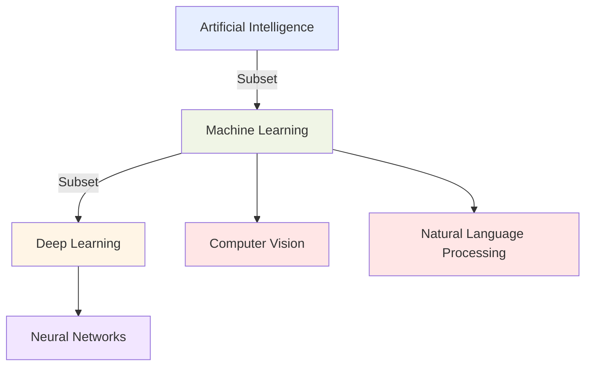
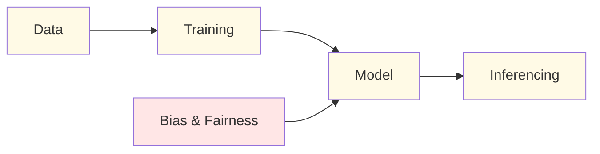
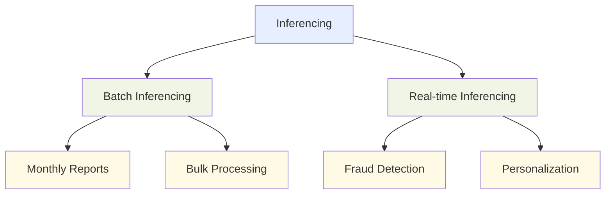
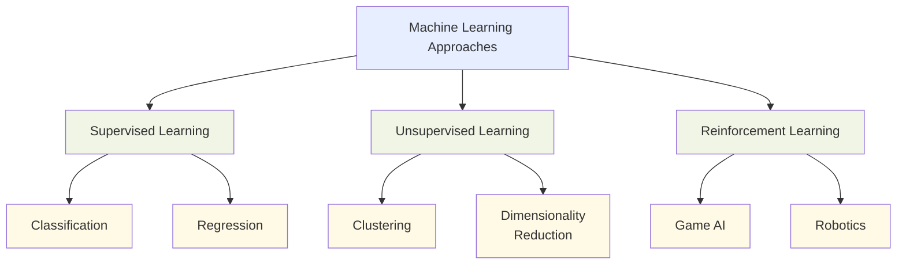

## 1.1 Basic AI Concepts and Terminologies

Understanding artificial intelligence (AI) and its related concepts has become essential for professionals across all industries. AI transforms business processes, decision-making, and customer experiences, making it vital to grasp the fundamental terminology and concepts that underpin this technology. This knowledge enables effective communication with technical teams and empowers business leaders to make informed decisions about AI adoption and strategy.

The AWS Certified AI Practitioner exam assesses your ability to explain basic AI concepts and their practical applications in business contexts.[^200] Mastering these foundational elements will equip you to identify opportunities for AI implementation, evaluate AI solutions, and contribute meaningfully to AI-driven initiatives within your organization.

### Defining Basic AI Terms

Artificial Intelligence (AI) encompasses a broad range of technologies and approaches designed to enable machines to perform tasks that typically require human intelligence. To navigate the AI landscape effectively, it's crucial to understand the following key terms:

- **Artificial Intelligence (AI)**: The overarching field of creating intelligent machines that can simulate human-like cognitive functions such as learning, problem-solving, and decision-making.[^201]

- **Machine Learning (ML)**: A subset of AI that focuses on developing algorithms and statistical models that enable computer systems to improve their performance on a specific task through experience, without being explicitly programmed.[^202]

- **Deep Learning**: A specialized subset of machine learning that uses artificial neural networks with multiple layers (deep neural networks) to model and process complex patterns in data.[^203]

- **Neural Networks**: Computing systems inspired by biological neural networks, consisting of interconnected nodes (neurons) that process and transmit information.[^204]

- **Computer Vision**: A field of AI that enables machines to interpret and understand visual information from the world, such as images and videos.[^205]

- **Natural Language Processing (NLP)**: The branch of AI focused on enabling machines to understand, interpret, and generate human language in a valuable way.[^206]

- **Model**: A mathematical representation of a real-world process, trained on data to make predictions or decisions without being explicitly programmed to perform the task.[^207]

- **Algorithm**: A set of rules or instructions given to an AI system to help it learn from data and make decisions.[^208]

- **Training**: The process of teaching a machine learning model to make predictions by showing it many examples of input data and the corresponding correct outputs.[^209]

- **Inferencing**: The process of using a trained model to make predictions on new, unseen data.[^210]

- **Bias**: Systematic errors in AI systems that can lead to unfair or inaccurate outcomes, often reflecting human biases present in the training data or algorithm design.[^211]

- **Fairness**: The principle of ensuring that AI systems do not discriminate against individuals or groups based on protected characteristics such as race, gender, or age.[^212]

- **Fit**: How well a machine learning model's predictions match the actual outcomes in the training data. A good fit means the model accurately captures the underlying patterns without overfitting or underfitting.[^213]
I'll add a bullet point about Generative AI that mentions it will be covered in detail in the next chapter:

- **Generative AI**: A category of artificial intelligence that can create new content, including text, images, code, and more. These systems learn patterns from training data and generate novel outputs that reflect those patterns. Generative AI is revolutionizing numerous fields and applications. We'll explore this transformative technology in depth in the next chapter.

- **Large Language Model (LLM)**: A type of AI model trained on vast amounts of text data, capable of understanding and generating human-like text across a wide range of topics and tasks.[^214]

To illustrate the relationships between these concepts, let's consider a diagram:

The above diagram illustrates the hierarchical relationship between key concepts in the AI landscape. Artificial Intelligence represents the broadest domain, encompassing all technologies that enable computers to mimic human intelligence. Machine Learning is a subset of AI focused on systems that learn from data without explicit programming. Deep Learning further narrows the scope as a specialized subset of Machine Learning, utilizing complex, multi-layered neural networks. The diagram also highlights important application areas of Machine Learning, including Computer Vision and Natural Language Processing. Understanding this hierarchy helps business professionals navigate AI terminology and conceptualize how specific technologies relate to broader AI initiatives.

This second diagram depicts the essential workflow in developing and deploying AI systems. The process begins with Data collection and preparation, which feeds into the Training phase where algorithms learn patterns from the data. This results in a Model that encapsulates the learned patterns. The model then performs Inferencing—applying what it has learned to new, unseen data. Importantly, considerations of Bias & Fairness must be integrated during model development to ensure ethical AI systems. Business leaders who understand this lifecycle can better manage AI projects, allocate appropriate resources at each stage, and implement proper governance frameworks to address ethical concerns throughout the development process.

### Similarities and Differences Between AI, ML, and Deep Learning

While AI, ML, and deep learning are closely related, they have distinct characteristics and applications:

**Artificial Intelligence (AI)**:
- Broadest category, encompassing all efforts to make machines intelligent
- Can include rule-based systems and symbolic AI, not just data-driven approaches
- Aims to create systems that can perform tasks requiring human-like intelligence

**Machine Learning (ML)**:
- Subset of AI focused on algorithms that improve through experience
- Relies on statistical techniques to enable computers to "learn" from data
- Includes various approaches such as supervised learning, unsupervised learning, and reinforcement learning

**Deep Learning**:
- Specialized subset of machine learning
- Uses artificial neural networks with multiple layers
- Particularly effective for processing unstructured data like images, audio, and text

Table 1.1.1. Comparison of AI, ML, and Deep Learning

| Aspect | Artificial Intelligence | Machine Learning | Deep Learning |
|--------|-------------------------|-------------------|----------------|
| Scope | Broadest | Subset of AI | Subset of ML |
| Approach | Various (rule-based, symbolic, statistical) | Statistical, data-driven | Neural networks with multiple layers |
| Data Requirements | Varies | Large datasets | Very large datasets |
| Interpretability | Can be high (e.g., rule-based systems) | Moderate to low | Generally low |
| Typical Applications | Expert systems, game AI, robotics | Predictive analytics, recommendation systems | Image recognition, natural language processing |

In practice, these technologies often work together in AI solutions. For example, a customer service chatbot might use:
- AI principles for overall design and decision-making
- ML algorithms for intent classification and entity recognition
- Deep learning models (like LLMs) for generating human-like responses

Understanding these distinctions helps business professionals choose the right approach for specific use cases and communicate more effectively with technical teams.

### Types of Inferencing

Inferencing, the process of using a trained model to make predictions on new data, can be performed in various ways depending on the business requirements and technical constraints. The two main types of inferencing are:

1. **Batch Inferencing**:
   - Processes large volumes of data at once, typically on a scheduled basis
   - Suitable for non-time-sensitive applications or when processing large datasets is more efficient
   - Examples: Monthly customer churn predictions, bulk product recommendations

2. **Real-time Inferencing**:
   - Processes data and returns predictions immediately, often within milliseconds
   - Crucial for applications requiring instant decisions or responses
   - Examples: Fraud detection for online transactions, real-time personalization in e-commerce

When choosing between batch and real-time inferencing, consider factors such as:
- Latency requirements
- Data volume and frequency
- Cost considerations (real-time inferencing often requires more resources)
- Integration with existing systems and processes

For example, a financial services company might use real-time inferencing for fraud detection on individual transactions, while employing batch inferencing for monthly risk assessments of their entire customer portfolio.[^215]

### Types of Data in AI Models

AI models can work with various types of data, each requiring different preprocessing techniques and model architectures. Understanding these data types is crucial for selecting appropriate AI solutions and preparing data for model training:

1. **Labeled vs. Unlabeled Data**:
   - Labeled data: Includes both input features and corresponding output labels (used in supervised learning)
   - Unlabeled data: Contains only input features without corresponding labels (used in unsupervised learning)

2. **Structured vs. Unstructured Data**:
   - Structured data: Organized in a predefined format (e.g., databases, spreadsheets)
   - Unstructured data: Lacks a predefined format (e.g., text documents, images, audio files)

3. **Specific Data Types**:
   - Tabular data: Organized in rows and columns (e.g., customer information, sales records)
   - Time-series data: Sequential data points indexed in time order (e.g., stock prices, sensor readings)
   - Image data: Visual information represented as pixel values
   - Text data: Natural language in various formats (e.g., documents, social media posts, customer reviews)

Table 1.1.2. Data Types and Their Characteristics

| Data Type | Structure | Typical Sources | Common AI Applications |
|-----------|-----------|-----------------|------------------------|
| Tabular | Structured | Databases, spreadsheets | Customer segmentation, fraud detection |
| Time-series | Structured | IoT sensors, financial markets | Forecasting, anomaly detection |
| Image | Unstructured | Cameras, medical imaging | Object recognition, quality control |
| Text | Unstructured | Documents, social media | Sentiment analysis, chatbots |

Different AI models and techniques are better suited for certain types of data. For instance:
- Tabular data often works well with traditional machine learning algorithms like decision trees or random forests
- Image data typically requires deep learning models such as convolutional neural networks (CNNs)[^216]
- Text data is often processed using natural language processing techniques and models like recurrent neural networks (RNNs) or transformers[^217]

By understanding these data types, business professionals can better assess the feasibility of AI projects and communicate data requirements effectively with technical teams.

### Supervised, Unsupervised, and Reinforcement Learning

Machine learning approaches can be categorized into three main types based on how they learn from data:

1. **Supervised Learning**:
   - Uses labeled data where both input features and corresponding output labels are provided
   - The model learns to predict the output given new input data
   - Examples: Classification (e.g., spam detection), regression (e.g., price prediction)

2. **Unsupervised Learning**:
   - Works with unlabeled data, finding patterns or structures without predefined outputs
   - Useful for discovering hidden patterns or grouping similar data points
   - Examples: Clustering (e.g., customer segmentation), dimensionality reduction

3. **Reinforcement Learning**:
   - Learns through interaction with an environment, receiving rewards or penalties for actions
   - Aims to maximize cumulative rewards over time
   - Examples: Game AI, robotics, autonomous vehicles

Each approach has its strengths and is suited for different types of problems:

**Supervised Learning**:
- Best for problems where you have a clear target variable to predict
- Requires high-quality labeled data, which can be expensive or time-consuming to obtain
- Widely used in business applications like customer churn prediction or credit scoring

**Unsupervised Learning**:
- Useful for exploratory data analysis and finding hidden patterns
- Doesn't require labeled data, making it suitable when labeling is impractical or expensive
- Often used in market segmentation, anomaly detection, or recommendation systems

**Reinforcement Learning**:
- Ideal for sequential decision-making problems
- Can learn complex strategies through trial and error
- Applicable in scenarios like optimizing trading strategies or managing industrial processes

In practice, many AI solutions combine these approaches. For example, a recommendation system might use:
- Supervised learning to predict user ratings for items
- Unsupervised learning to group similar items or users
- Reinforcement learning to optimize the recommendation strategy over time

Understanding these learning paradigms helps business professionals assess the feasibility of AI projects, estimate data requirements, and set realistic expectations for AI system capabilities.

By mastering these fundamental AI concepts and terminologies, business professionals can effectively navigate the AI landscape, communicate with technical teams, and make informed decisions about AI adoption and strategy. As AI continues to evolve and transform industries, this knowledge will be invaluable in leveraging AI's potential to drive innovation and competitive advantage.

### Questions for self-check

1. **A data scientist is working on a project to identify patterns in customer purchasing behavior without any predefined categories. Which type of machine learning approach is most suitable for this task?**

   A. Supervised learning
   B. Unsupervised learning
   C. Reinforcement learning
   D. Semi-supervised learning

2. **An AI-powered chatbot is designed to improve its responses over time based on user feedback. Which learning paradigm does this scenario best represent?**

   A. Supervised learning
   B. Unsupervised learning
   C. Reinforcement learning
   D. Transfer learning

3. **A financial services company wants to implement an AI system for real-time fraud detection on individual transactions. Which type of inferencing should they use?**

   A. Batch inferencing
   B. Real-time inferencing
   C. Offline inferencing
   D. Delayed inferencing

4. **Which of the following best describes the relationship between Artificial Intelligence (AI), Machine Learning (ML), and Deep Learning?**

   A. They are interchangeable terms for the same technology
   B. Deep Learning is a subset of AI, which is a subset of ML
   C. ML is a subset of AI, and Deep Learning is a subset of ML
   D. AI, ML, and Deep Learning are separate, unrelated fields

5. **A retail company has a large dataset of customer information stored in a structured database. Which type of data would this be classified as?**

   A. Unstructured data
   B. Time-series data
   C. Image data
   D. Tabular data

### Answers and Explanations

1. **Correct answer: B. Unsupervised learning**

   Explanation: Unsupervised learning is the most suitable approach for identifying patterns in data without predefined categories or labels. In this scenario, the data scientist is looking to discover hidden patterns in customer purchasing behavior without any prior categorization. Unsupervised learning algorithms, such as clustering, can group similar customers or products together based on their characteristics, revealing natural patterns in the data.[^218]

2. **Correct answer: C. Reinforcement learning**

   Explanation: This scenario best represents reinforcement learning. In reinforcement learning, an agent (in this case, the chatbot) learns to make decisions by interacting with its environment (user interactions) and receiving feedback (user responses). The chatbot improves its performance over time by maximizing positive feedback, which is a key characteristic of reinforcement learning. This approach allows the AI to adapt and optimize its behavior based on real-world interactions.[^219]

3. **Correct answer: B. Real-time inferencing**

   Explanation: For real-time fraud detection on individual transactions, real-time inferencing is the most appropriate choice. Real-time inferencing processes data and returns predictions immediately, often within milliseconds, which is crucial for applications requiring instant decisions. In the case of fraud detection for financial transactions, the system needs to make immediate decisions to approve or flag transactions as they occur, making real-time inferencing essential.[^220]

4. **Correct answer: C. ML is a subset of AI, and Deep Learning is a subset of ML**

   Explanation: This option correctly describes the relationship between AI, ML, and Deep Learning. Artificial Intelligence is the broadest field, encompassing various approaches to create intelligent machines. Machine Learning is a subset of AI that focuses on algorithms that can learn from data. Deep Learning is a further specialized subset of ML that uses neural networks with multiple layers to model complex patterns in data. This hierarchical relationship is fundamental to understanding the AI landscape.[^221]

5. **Correct answer: D. Tabular data**

   Explanation: The scenario describes customer information stored in a structured database, which is characteristic of tabular data. Tabular data is organized in rows and columns, similar to a spreadsheet or database table. This type of structured data is common in business applications and is well-suited for many traditional machine learning algorithms. Understanding data types is crucial for selecting appropriate AI models and preprocessing techniques.[^222]

[^200]: AWS Certified AI Practitioner Exam Guide. URL: <https://d1.awsstatic.com/training-and-certification/docs-ai-practitioner/AWS-Certified-AI-Practitioner_Exam-Guide.pdf>

[^201]: AWS Cloud Adoption Framework for Artificial Intelligence, Machine Learning. URL: <https://docs.aws.amazon.com/whitepapers/latest/aws-caf-for-ai/aws-caf-for-ai.html>

[^202]: Amazon SageMaker Developer Guide: What Is Machine Learning? URL: <https://docs.aws.amazon.com/sagemaker/latest/dg/what-is-machine-learning.html>

[^203]: AWS Machine Learning Decision Guide: Choosing an AWS machine learning service. URL: <https://docs.aws.amazon.com/decision-guides/latest/machine-learning-on-aws-how-to-choose/guide.html>

[^204]: What is a Neural Network? - Artificial Neural Network Explained - AWS. URL: <https://aws.amazon.com/what-is/neural-network/>

[^205]: Amazon Rekognition Developer Guide: What Is Amazon Rekognition? URL: <https://docs.aws.amazon.com/rekognition/latest/dg/what-is.html>

[^206]: Amazon Comprehend Developer Guide: What Is Amazon Comprehend? URL: <https://docs.aws.amazon.com/comprehend/latest/dg/what-is.html>

[^207]: How I Got Into The Top 2% In AWS DeepRacer. URL: <https://medium.com/@marsmans/how-i-got-into-the-top-2-in-aws-deepracer-32127a364212>

[^208]: Choosing an AWS machine learning service. URL: <https://docs.aws.amazon.com/decision-guides/latest/machine-learning-on-aws-how-to-choose/guide.html>

[^209]: Amazon SageMaker Developer Guide: Train a Model. URL: <https://docs.aws.amazon.com/sagemaker/latest/dg/how-it-works-training.html>

[^210]: Amazon SageMaker Developer Guide: Deploy a Model. URL: <https://docs.aws.amazon.com/sagemaker/latest/dg/how-it-works-deployment.html>

[^211]: Tune ML models for additional objectives like fairness with SageMaker Automatic Model Tuning. URL: <https://aws.amazon.com/blogs/machine-learning/tune-ml-models-for-additional-objectives-like-fairness-with-sagemaker-automatic-model-tuning/>

[^212]: Responsible AI – Building AI Responsibly – AWS. URL: <https://aws.amazon.com/ai/responsible-ai/>

[^213]: Ground truth curation and metric interpretation best practices for evaluating generative AI question-answering using FMEval. URL: <https://aws.amazon.com/blogs/machine-learning/ground-truth-curation-and-metric-interpretation-best-practices-for-evaluating-generative-ai-question-answering-using-fmeval/>

[^214]: What is LLM? - Large Language Models Explained - AWS. URL: <https://aws.amazon.com/what-is/large-language-model/>

[^215]: Build a GNN-based real-time fraud detection solution using Amazon SageMaker, Amazon Neptune, and the Deep Graph Library. URL: <https://aws.amazon.com/blogs/machine-learning/build-a-gnn-based-real-time-fraud-detection-solution-using-amazon-sagemaker-amazon-neptune-and-the-deep-graph-library/>

[^216]: What is a Neural Network? - Artificial Neural Network Explained - AWS. URL: <https://aws.amazon.com/what-is/neural-network/>

[^217]: What is NLP? - Natural Language Processing Explained - AWS. URL: <https://aws.amazon.com/what-is/nlp/>

[^218]: Supervised vs Unsupervised Learning - AWS. URL: <https://aws.amazon.com/compare/the-difference-between-machine-learning-supervised-and-unsupervised/>

[^219]: Optimize customer engagement with reinforcement learning | AWS Machine Learning Blog. URL: <https://aws.amazon.com/blogs/machine-learning/optimize-customer-engagement-with-reinforcement-learning/>

[^220]: Real-time inference - Amazon SageMaker AI. URL: <https://docs.aws.amazon.com/sagemaker/latest/dg/realtime-endpoints.html>

[^221]: AWS Machine Learning Blog: AI, ML, and Deep Learning Explained. URL: <https://aws.amazon.com/compare/the-difference-between-artificial-intelligence-and-machine-learning/>

[^222]: AWS Machine Learning Blog: Working with Tabular Data in Amazon SageMaker. URL: <https://docs.aws.amazon.com/sagemaker/latest/dg/algorithms-tabular.html>