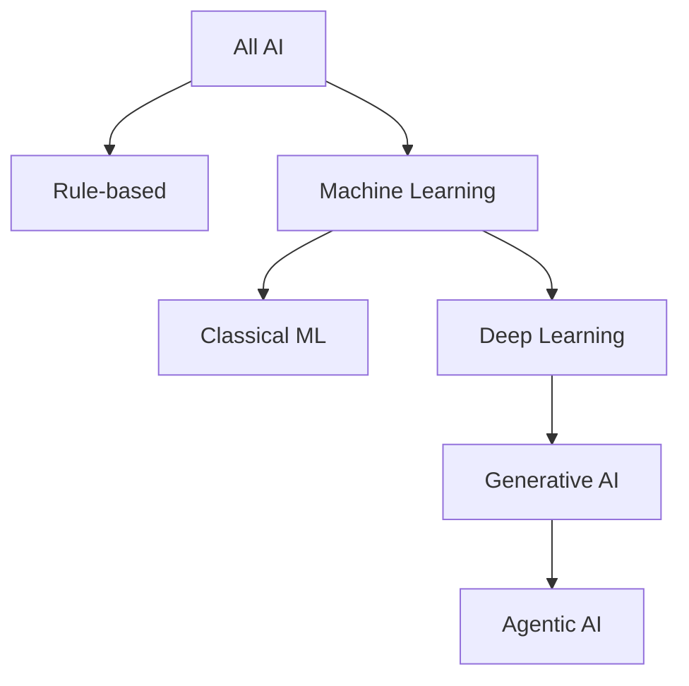
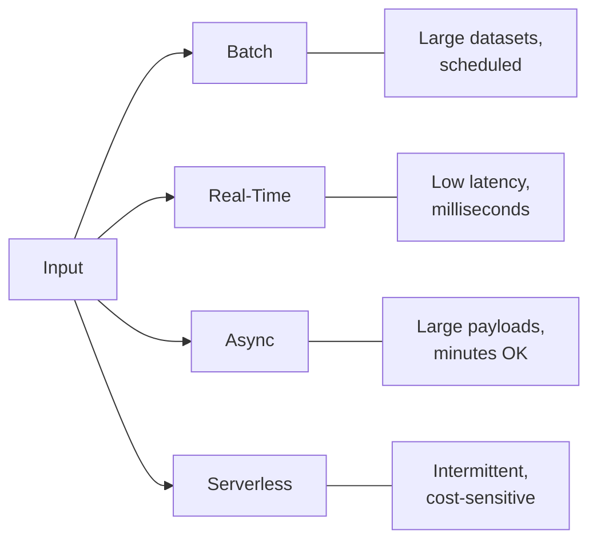
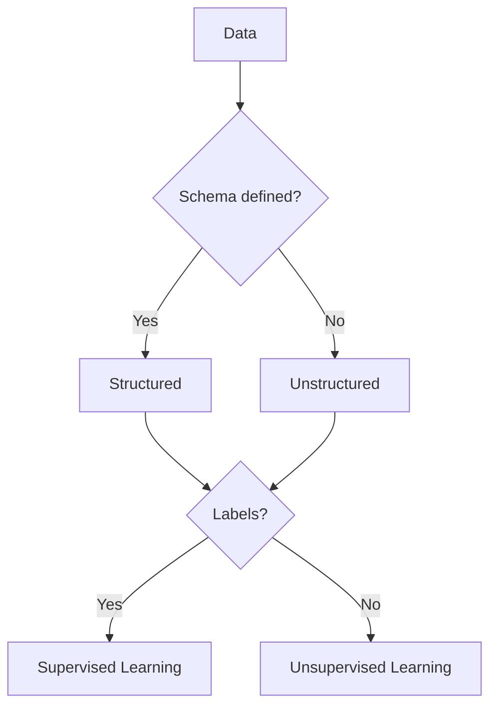
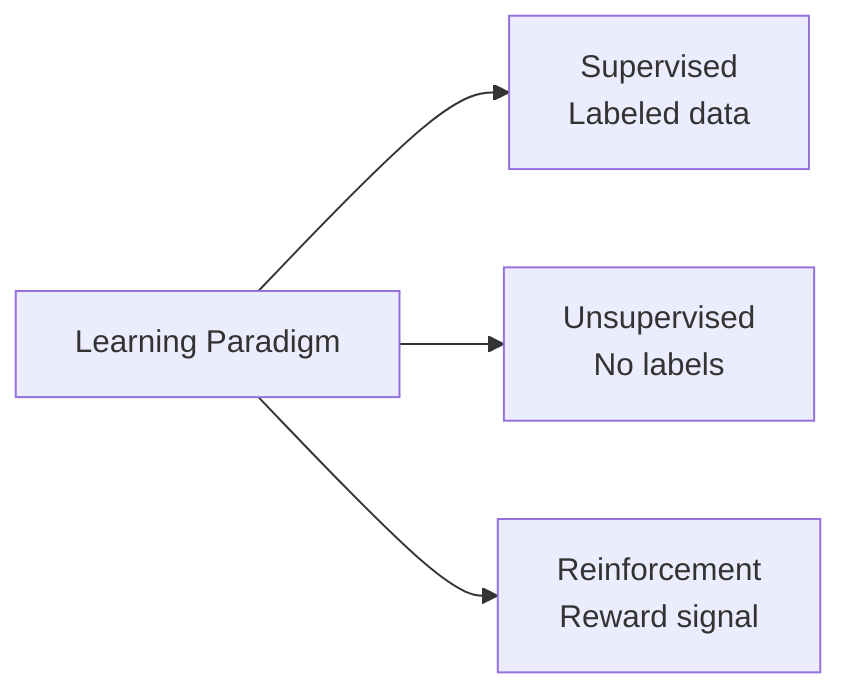

## Task Statement 1.1: Explain basic AI concepts and terminologies

The vocabulary of AI is the shared language between business professionals and the engineering teams they work with. Before a product manager can approve a model deployment or an executive can assess an AI vendor proposal, everyone at the table needs the same definitions for terms such as training, inferencing, bias, and fairness. This task statement establishes that common vocabulary and maps each term to the AWS services and exam objectives where it appears.[^101001]

### 1.1.1 Define basic AI terms

Understanding AI starts with precise definitions. The exam tests whether you can distinguish neighboring terms from each other, and the business stakes are real because imprecise language leads to misaligned expectations between technical and non-technical stakeholders.

**Artificial intelligence (AI)** is the broad field of computer science concerned with building systems that can perform tasks that would ordinarily require human reasoning, such as recognizing images, understanding language, or making decisions under uncertainty.[^101002] AI is not a single technology; it is a category that includes many approaches, only some of which involve learning from data.

**Machine learning (ML)** is a subset of AI in which a system learns patterns from data rather than following rules written explicitly by a programmer.[^101003] For example, a traditional rule-based fraud detection system might flag any transaction above a fixed dollar threshold; an ML-based system instead learns from thousands of historical fraud cases and generalizes patterns that no fixed rule could capture.

**Deep learning** is a subset of ML that uses *neural networks* with many layers to represent increasingly abstract patterns.[^101004] The term "deep" refers to the depth of these layers. Deep learning powers most modern image recognition, speech recognition, and language understanding systems.

A **neural network** is a computational model loosely inspired by the structure of biological neurons. Data passes through layers of interconnected nodes, each of which applies a mathematical transformation. The network learns which transformations produce accurate outputs by adjusting its internal parameters during training. Shallow networks have two or three layers; deep networks may have hundreds.

**Computer vision (CV)** is the branch of AI that enables machines to interpret images and video.[^101006] Computer vision systems can classify objects in a photo, detect defects on a manufacturing line, or count vehicles in a parking lot. On AWS, computer vision capabilities are available through **Amazon Rekognition** for image and video analysis.[^101007]

**Natural language processing (NLP)** is the branch of AI that enables machines to read, understand, and generate human language.[^101008] NLP tasks include sentiment analysis, named entity recognition, translation, and document summarization. AWS surfaces NLP capabilities through services such as **Amazon Comprehend** for text analysis, **Amazon Translate** for language translation, and **Amazon Transcribe** for speech-to-text conversion.[^101009] These purpose-built services are the right choice for high-volume, well-defined tasks where cost per call and latency matter. For open-ended language work such as long-form generation, complex summarization, or multi-step reasoning, **large language models (LLMs)** accessed through Amazon Bedrock are the better fit; Domain 2 of this book covers them in depth.

An **algorithm** is the mathematical procedure used to train a model from data. Common ML algorithms include linear regression for predicting continuous values, decision trees for classification, and gradient boosting for structured tabular data. The algorithm choice determines how a model generalizes from training data to new inputs.

A **model** is the artifact produced when an algorithm is applied to a training dataset. The model captures the patterns the algorithm found and can then be used to make predictions on new, unseen data. Think of the algorithm as the recipe and the model as the finished dish.

**Training** is the process of exposing a model to labeled or unlabeled data so that its internal parameters adjust to minimize prediction error. Training is computationally intensive and usually runs on GPU-accelerated infrastructure. On AWS, training jobs most commonly run on **Amazon SageMaker AI**.

**Inferencing** (also called *inference* or *scoring*) is the process of using a trained model to generate a prediction or output for new input data.[^101014] Training happens once or periodically; inferencing happens continuously whenever a user or system requests a prediction.

**Bias** in AI refers to systematic errors in a model's outputs that arise from flawed training data, flawed algorithm design, or flawed problem framing.[^101015] For example, a hiring model trained on historical data from a company with a skewed hiring history may reproduce and amplify those patterns. Bias is a core concern in responsible AI governance.

**Fairness** is the property of a model that produces equitable outcomes across demographic groups defined by characteristics such as gender, race, or age. Fairness and bias are closely related: a model is considered fair when its bias toward any protected group is below an acceptable threshold. AWS provides **Amazon SageMaker Clarify** to help teams detect and measure bias in training data and trained models.[^101017]

**Fit** describes how well a model's learned patterns match the underlying structure of the data.[^101018] A model that fits its training data too closely is said to *overfit*: it memorizes noise rather than generalizing patterns, and its accuracy on new data drops sharply. A model that is too simple to capture real patterns is said to *underfit*: it performs poorly on both training data and new data. Good fit lies between these extremes.

A **large language model (LLM)** is a deep learning model, specifically a neural network trained on a massive corpus of text, that can generate, summarize, translate, and reason about language at a level of fluency and flexibility not possible with earlier NLP techniques.[^101019] LLMs such as Amazon Titan, Anthropic Claude, and Meta Llama underpin most modern generative AI applications. Their scale, measured in billions of parameters, gives them broad capability but also makes them expensive to train from scratch.

**Generative AI (GenAI)** is a class of AI that produces new content, such as text, images, audio, or code, in response to a prompt.[^101020] GenAI systems are typically built on LLMs or similar large-scale generative models. Unlike earlier ML models that classify or predict a single value, a generative AI system produces a variable-length, human-readable output. Generative AI and agentic AI were added to the exam guide in v1.1 to match how widely both have been adopted in enterprise projects since the original guide was published.

**Agentic AI** is an extension of generative AI in which a model is given a goal and a set of tools, then autonomously plans and executes multi-step actions to reach that goal without requiring human approval at each step.[^101021] The reasoning engine is still a generative model; agentic AI adds the planning loop, tool access, and memory that turn one-off generation into goal-driven action. An agentic AI system might browse a knowledge base, call external APIs, write code, and verify its results across several sequential steps before returning an answer. This is qualitatively different from a single-turn question-and-answer interaction. AWS supports agentic AI through **Amazon Bedrock** Agents and **Amazon Bedrock AgentCore**, which provide the infrastructure for multi-step orchestration, memory, and tool use.[^101022]

### 1.1.2 Differences between AI, ML, GenAI, deep learning, and agentic AI

These five terms describe a nested hierarchy, not separate technologies. Confusion about their relationships is one of the most common sources of miscommunication in AI project planning. Each term sits entirely within the scope of the term above it.

**Artificial intelligence** is the broadest term. It includes any technique that makes a computer system behave in a way that resembles human reasoning. This includes rule-based expert systems from the 1970s, statistical ML from the 1990s, and today's neural networks.

**Machine learning** is a subset of AI that limits the definition to systems that learn from data. A rule-based fraud filter written by a programmer is AI but not ML. A fraud model trained on transaction histories is both AI and ML.

**Deep learning** is a subset of ML that uses layered neural networks. A linear regression model is ML but not deep learning. A convolutional neural network that classifies chest X-rays is ML, deep learning, and AI.

**Generative AI** is a subset of deep learning that is specifically concerned with generating new content. Not all deep learning is generative: a deep learning model that classifies images into ten categories is discriminative, not generative. A model that produces a photo-realistic image from a text description is generative AI.

**Agentic AI** is an architectural pattern layered on top of generative AI. An agentic system uses an LLM or other generative model as its reasoning engine, then adds a planning loop, tool access, and memory so it can act over multiple steps. A single-turn chatbot using an LLM is generative AI but not agentic AI. A system that receives a high-level goal, breaks it into sub-tasks, uses tools to execute each sub-task, and synthesizes the results is agentic AI.

*Figure 1.1.1: Nesting of AI subfields. Each node is a proper subset of its parent; moving down the tree adds constraints and capabilities rather than replacing the parent concept.*

The exam frequently tests the boundary cases. A candidate who treats "AI" and "ML" as synonyms, or who confuses "generative AI" with "deep learning," will misread scenario questions that depend on knowing which subset applies. The practical business implication is equally concrete: a team that is deploying an agentic AI system faces different governance, cost, and security considerations than a team running a classical ML classification model, because agentic systems take real-world actions rather than producing static outputs.

*Table 1.1.1: Key distinctions between AI subfields*

| Term | Parent category | Defines by | Typical AWS example |
|------|-----------------|------------|---------------------|
| Artificial Intelligence | None | Reasoning-like behavior | Any AWS AI/ML service |
| Machine Learning | AI | Learns from data | Amazon SageMaker AI |
| Deep Learning | ML | Layered neural networks | SageMaker with GPU instances |
| Generative AI | Deep Learning | Produces new content | Amazon Bedrock |
| Agentic AI | Generative AI | Multi-step autonomous action | Bedrock Agents, Bedrock AgentCore |

One nuance worth noting: some researchers classify agentic AI as an architectural pattern rather than a technology subfield, because an agentic system is composed of existing technologies (LLMs, tools, orchestration logic) rather than being a new model type. For exam purposes, treat agentic AI as the most specialized layer in the hierarchy.

### 1.1.3 Types of inferencing

After a model is trained, it must be deployed so that it can generate predictions. The way those predictions are requested and returned defines the inferencing pattern. Exam guide v1.1 added asynchronous and serverless inferencing to the list because AWS expanded its managed inferencing options after the original exam launched.

The four standard inferencing patterns are batch, real-time, asynchronous, and serverless. Each solves a different combination of throughput and latency requirements, and choosing the wrong pattern for a use case is one of the most common causes of cost and performance problems in production AI systems.

**Batch inferencing** processes a large set of inputs in a single job, typically on a schedule.[^101024] The system collects inputs over a period of time, runs the model against all of them at once, and stores the results for later use. A retailer that generates product recommendations overnight for every customer in its database is using batch inferencing. On AWS, **Amazon SageMaker AI** Batch Transform runs batch inferencing jobs against data stored in **Amazon S3**, scaling the compute fleet for the duration of the job and shutting it down when complete.

**Real-time inferencing** processes a single input request and returns a prediction within milliseconds.[^101026] The model is deployed to a persistent endpoint that remains alive, accepting requests from applications. A fraud detection system that must score a credit card transaction before the customer's payment terminal times out requires real-time inferencing. On AWS, SageMaker AI real-time endpoints host models behind a persistent HTTPS endpoint and can apply *auto scaling* to handle variable request volumes.

**Asynchronous inferencing** (sometimes called *queued* or *near-batch* inferencing because it shares the queued-processing model of batch jobs while operating one request at a time) accepts a request, queues it, and returns the result through a callback or polling mechanism rather than within the original request's timeout window.[^101028] This pattern is appropriate when inputs are large or when the model takes longer to process than a web request can reasonably wait. For example, a document intelligence system that processes multi-page contracts may take 30 to 90 seconds per document: a synchronous web call would time out, but an asynchronous pattern lets the calling system check back for the result. On AWS, SageMaker AI Async Inference endpoints accept large payloads, queue them, and write outputs to S3 for retrieval.

**Serverless inferencing** runs the model on demand without requiring a persistent endpoint to be pre-provisioned.[^101030] The underlying compute scales to zero when idle, eliminating the fixed cost of a running endpoint. Serverless inferencing is well suited to intermittent or unpredictable workloads where the cost of idle compute exceeds the benefit of low latency. On AWS, SageMaker AI Serverless Inference provisions and de-provisions compute automatically, with the trade-off that the first request after a period of inactivity may experience a *cold start* delay.

*Figure 1.1.2: Inferencing pattern selection. The choice depends on the combination of input volume, acceptable latency, and cost constraints for the specific use case.*

*Table 1.1.2: Comparison of inferencing patterns*

| Pattern | Latency | Input size | Cost model | Best for |
|---------|---------|------------|------------|----------|
| Batch | Minutes to hours | Very large | Per job | Overnight scoring, bulk reporting |
| Real-time | Milliseconds | Small | Per endpoint-hour | Fraud detection, live recommendations |
| Asynchronous | Seconds to minutes | Large | Per request | Document processing, video analysis |
| Serverless | Seconds (cold), milliseconds (warm) | Small to medium | Per inference | Low-traffic APIs, intermittent usage |

Understanding the cost differences matters for business professionals: a persistent real-time endpoint accrues cost around the clock whether or not it receives traffic, while serverless inferencing charges only for actual use. For a system that processes requests only during business hours, the cost difference can be substantial.

### 1.1.4 Types of data in AI models

AI models are shaped by the data they learn from, and data comes in many forms. The type of data a model expects determines which algorithms are appropriate, what preprocessing steps are required, and how the model can be deployed. A business professional who can describe the data in their organization in these terms can communicate far more effectively with a data science team.

The first fundamental distinction is between **labeled data** and **unlabeled data**.[^101032] Labeled data includes both the input (for example, an image of a cat) and the correct answer (the label "cat"). Unlabeled data includes only the input, with no associated answer. Labeled datasets are more expensive to produce because they require human annotation, but they are necessary for supervised learning. Unlabeled datasets are abundant and cheap but require unsupervised or self-supervised techniques to extract patterns.

Beyond the labeled-unlabeled distinction, data also varies by structure and format:

- **Tabular data** is organized into rows and columns, as in a spreadsheet or relational database table. Each column represents a feature (for example, age, account balance, or transaction amount) and each row represents one observation. Classical ML algorithms such as gradient boosted trees work especially well on tabular data.
- **Time-series data** is a sequence of measurements recorded at regular time intervals. Stock prices, server CPU utilization, and patient heart-rate readings are time-series data. Models trained on time-series data learn temporal patterns such as trends, seasonality, and anomalies.
- **Image data** consists of pixel values organized in a two-dimensional grid, potentially with multiple color channels. Computer vision models learn to detect edges, shapes, textures, and objects from image data. Volume requirements are high: a meaningful image dataset typically contains tens of thousands to millions of labeled examples.
- **Text data** consists of sequences of words or characters in a natural language. NLP models learn grammar, semantics, and factual associations from text. Large language models are trained on text corpora containing hundreds of billions of words.

A second orthogonal distinction applies across all these formats: **structured data** has a well-defined schema, such as a database table with typed columns.[^101037] **Unstructured data** has no predefined schema: it includes free-form text, images, audio, and video. Structured data is more directly usable by classical ML algorithms; unstructured data typically requires a neural network-based model or a preprocessing step to extract structured features.

*Table 1.1.3: Data types in AI models*

| Data type | Structure | Typical ML approach | AWS example service |
|-----------|-----------|---------------------|---------------------|
| Tabular | Structured | Gradient boosting, linear models | SageMaker AI built-in algorithms |
| Time-series | Structured | Sequence models, LSTM, DeepAR | SageMaker AI DeepAR |
| Image | Unstructured | Convolutional neural networks | Amazon Rekognition, SageMaker AI |
| Text | Unstructured | Transformer models, LLMs | Amazon Comprehend, Amazon Bedrock |

**Amazon SageMaker Ground Truth** helps teams create labeled datasets by combining automated labeling with human review, reducing the time and cost of annotation at scale.[^101038]

In practice, real-world AI projects often combine data types. A customer churn model might use tabular CRM data alongside text from support tickets, requiring the team to build or select models that can handle both modalities. Knowing which data types the business already has in abundance helps constrain which AI approaches are feasible.

*Figure 1.1.3: Data type decision tree. Structure and label availability together determine which learning approach is feasible for a given dataset.*

### 1.1.5 Types of AI/ML learning

The way a model learns from data is called its *learning paradigm*. The learning paradigm determines what kind of data the model requires, how it generalizes, and what kinds of problems it can solve. The exam tests all three major paradigms: supervised, unsupervised, and reinforcement learning.

**Supervised learning** trains a model on a dataset in which every input is paired with a correct output label.[^101039] The model learns to map inputs to outputs by minimizing the difference between its predictions and the known labels. This is the most commonly used paradigm in commercial AI because it produces models that are straightforward to evaluate: you measure accuracy on a held-out test set of labeled examples.

Supervised learning covers two main problem types. *Regression* predicts a continuous numerical value, such as the expected revenue from a customer in the next quarter. *Classification* assigns an input to one of a discrete set of categories, such as labeling an email as spam or not spam. Most product recommendation, fraud detection, and medical diagnosis systems use supervised classification or regression models.

**Unsupervised learning** trains a model on data that has no labels.[^101041] The model must find structure in the data on its own, without guidance about what the correct answer is. The most common unsupervised technique is *clustering*, in which the model groups similar inputs together. For example, a marketing team might use unsupervised clustering on customer purchase histories to discover natural customer segments that can then receive targeted campaigns. Another common technique is *dimensionality reduction*, which compresses high-dimensional data into fewer dimensions while preserving its most important structure, making it easier to visualize or to feed into a downstream model.

**Reinforcement learning** trains an agent to take actions in an environment by rewarding it for good outcomes and penalizing it for bad ones.[^101043] The agent learns a *policy*: a mapping from observed state to action that maximizes cumulative reward over time. Reinforcement learning is the paradigm behind game-playing AI systems and increasingly behind industrial applications such as robotic control, supply chain optimization, and personalized content recommendation systems that optimize for long-term engagement rather than immediate click-through.

*Table 1.1.4: Comparison of AI/ML learning paradigms*

| Paradigm | Input data | Learns | Common use cases |
|----------|-----------|--------|-----------------|
| Supervised | Labeled | Input-output mapping | Classification, regression, fraud detection |
| Unsupervised | Unlabeled | Hidden structure | Customer segmentation, anomaly detection |
| Reinforcement | Reward signals | Optimal policy | Robotics, game playing, personalization |

Two additional learning paradigms appear at the edges of the exam scope. *Semi-supervised learning* combines a small amount of labeled data with a large amount of unlabeled data, which is useful when labeling is expensive.[^101045] *Self-supervised learning* generates labels automatically from the data itself, for example by masking a word in a sentence and training the model to predict the missing word. Self-supervised learning is the technique behind the pre-training phase of most modern large language models.

*Figure 1.1.4: Learning paradigm overview. The three core paradigms differ in the type of feedback the model receives during training.*

The learning paradigm choice is a practical business decision, not only a technical one. Supervised learning requires labeled data, which costs money to produce. Unsupervised learning avoids that cost but cannot directly optimize for a specific business outcome. Reinforcement learning can optimize for complex multi-step objectives, but it requires more careful design of the reward function and is harder to audit for fairness and bias. A business professional who understands these trade-offs can ask the right questions when a data science team proposes an approach.

## Self-check questions

**Question 1.** A retail company is building a system that automatically categorizes customer support tickets into one of five issue types (billing, returns, shipping, product quality, other). The team has a dataset of 50,000 tickets that have already been reviewed and categorized by human agents. Which type of ML learning paradigm is most appropriate for this use case?

A. Unsupervised learning, because the model must find structure in text data without human guidance.
B. Reinforcement learning, because the model must learn a policy for routing tickets to the correct team.
C. Supervised learning, because the team has labeled examples and the task is to classify new inputs into predefined categories.
D. Self-supervised learning, because the model must predict masked words in the ticket text.

**Answer: C.**

The defining characteristic of supervised learning is that every training example includes both an input and a known correct output label. In this scenario, the 50,000 tickets have already been categorized by human agents, which means each ticket has a label ("billing," "returns," etc.). The model's job is to learn the mapping from ticket text to category and then apply that mapping to new, unlabeled tickets. This is a textbook classification problem, which is a subtype of supervised learning.[^101047]

Unsupervised learning (option A) is incorrect because the dataset is labeled. Unsupervised techniques such as clustering would discover groups in the data, but those groups might not align with the five predefined business categories. Reinforcement learning (option B) is incorrect because there is no environment for an agent to act in and no delayed reward signal; the correct answer for each training example is known immediately. Self-supervised learning (option D) is a technique for pre-training language models by masking tokens and predicting them; it is not the right framing for a classification task where ground-truth labels are available.

---

**Question 2.** A financial services firm wants to deploy a fraud detection model that must return a prediction within 200 milliseconds for every card-present transaction at the point of sale. The model is a relatively small classification model. Which inferencing pattern should the team use?

A. Batch inferencing, because the high volume of transactions makes batch processing more cost-effective.
B. Real-time inferencing, because the use case requires a prediction before the transaction times out.
C. Asynchronous inferencing, because processing each transaction individually reduces queue contention.
D. Serverless inferencing, because card-present transactions occur intermittently.

**Answer: B.**

Real-time inferencing is the appropriate pattern when a prediction must be returned within the latency window of a user-facing or time-sensitive action.[^101048] A card-present transaction at a point-of-sale terminal typically times out in under one second, making a 200-millisecond requirement a hard constraint. Real-time endpoints in Amazon SageMaker AI maintain a persistent model behind an HTTPS endpoint that responds synchronously within milliseconds.

Batch inferencing (option A) is incorrect because batch jobs aggregate inputs and process them together on a schedule: the prediction would arrive hours after the transaction, making it useless for real-time fraud prevention. Asynchronous inferencing (option C) is incorrect because asynchronous patterns accept a request, queue it, and return the result later via callback or polling; the calling system does not get an immediate response. Serverless inferencing (option D) could meet the latency target if the endpoint is warm, but cold starts can take several seconds, which would violate the 200-millisecond requirement for the first request after an idle period. A persistent real-time endpoint avoids cold starts and is the standard pattern for latency-sensitive prediction.

---

**Question 3.** A data science team is preparing a training dataset for a customer churn model. Half of the dataset contains explicit churn labels (churned vs. retained) from historical records. The other half contains customer interaction logs with no churn outcome recorded. Which type of data does the labeled half represent?

A. Time-series data, because the records capture events over a period of time.
B. Unsupervised data, because the goal is to discover hidden customer segments.
C. Labeled data, because each record is paired with a known outcome (churned or retained).
D. Unstructured data, because the records contain free-form text fields from support interactions.

**Answer: C.**

Labeled data is defined by the presence of a correct output paired with each input.[^101049] In this scenario, the historical records include the outcome variable (churned or retained), which is the label the supervised model will learn to predict. The format of the data (tabular, in this case) is a separate dimension from the labeled-unlabeled distinction. A record can be both tabular and labeled.

Option A (time-series) is a separate data-type dimension; the records may or may not be time-stamped, but that does not define whether they are labeled. Option B is incorrect because "unsupervised" is a learning paradigm, not a data type, and the question asks about the data classification, not the technique a team would apply to it. Option D misapplies the structured-unstructured distinction: structured data is defined by having a schema (rows and columns), which is true of most CRM and transaction records regardless of whether free-form text fields are also present. The question asks specifically about the labeled half, making C the only correct description.

---

**Question 4.** An organization is building an AI system that will receive a high-level goal such as "prepare a market analysis report on competitor pricing," then independently search internal knowledge bases, retrieve pricing data from an external API, draft a summary, and verify its findings before delivering the result. Which category of AI BEST describes this system?

A. Classical machine learning, because the system uses a trained model to produce outputs from structured inputs.
B. Generative AI, because the system produces a new text document as its output.
C. Agentic AI, because the system plans and executes multiple sequential actions autonomously to achieve a goal.
D. Computer vision, because the system must analyze and interpret data from multiple sources.

**Answer: C.**

Agentic AI is distinguished by autonomous multi-step planning and execution: the system does not simply respond to a single prompt but instead breaks a high-level goal into sub-tasks, uses tools (knowledge base search, external API calls), evaluates intermediate results, and synthesizes a final output.[^101050] This is the defining characteristic of agentic systems and separates them from single-turn generative AI interactions.

Option B (generative AI) is partially correct in that the system produces a text document, but generative AI by itself describes only the output modality, not the autonomous planning and tool-use loop. A single-turn chatbot that generates text is generative AI but not agentic AI. Option A (classical ML) is incorrect because classical ML produces a single prediction from a structured input; it does not involve multi-step reasoning or tool orchestration. Option D (computer vision) is incorrect because CV is specifically the analysis of image and video data; the scenario involves text, APIs, and knowledge bases, not pixel data.

---

**Question 5.** A marketing analyst wants to understand which customers share similar purchasing behaviors, but the team has no predetermined categories and has not labeled any customer records. Which AI/ML paradigm is most appropriate?

A. Supervised learning, because purchase histories are structured tabular data.
B. Reinforcement learning, because the system must learn which customers to target.
C. Semi-supervised learning, because some records may be partially labeled by industry standards.
D. Unsupervised learning, because there are no labels and the goal is to discover natural groupings in the data.

**Answer: D.**

Unsupervised learning is the appropriate paradigm when the dataset has no labels and the objective is to find structure that is not predefined.[^101051] Clustering, an unsupervised technique, will partition the customer base into groups based on the similarity of purchase patterns. These groups can then be reviewed by the analyst and mapped to business segments.

Option A is incorrect because structured data format does not determine the learning paradigm. Supervised learning requires labels, which are explicitly absent in this scenario. Option B is incorrect because reinforcement learning requires an agent, an environment, and a reward signal tied to sequential actions; segmenting existing customers is not a sequential decision-making problem. Option C (semi-supervised) is incorrect because the question states that no records are labeled; semi-supervised learning requires at least some labeled examples to guide the model.

---

[^101001]: AWS Certification: AWS Certified AI Practitioner Exam Guide v1.1, Task Statement 1.1. URL: <https://docs.aws.amazon.com/aws-certification/latest/ai-practitioner-01/ai-practitioner-01-domain1.html>
[^101002]: NIST AI 100-1: Artificial Intelligence Risk Management Framework. URL: <https://airc.nist.gov/Home>
[^101003]: Amazon SageMaker AI Developer Guide: What Is Machine Learning? URL: <https://docs.aws.amazon.com/sagemaker/latest/dg/whatis.html>
[^101004]: AWS Machine Learning Blog: Deep Learning. URL: <https://aws.amazon.com/what-is/deep-learning/>
[^101006]: AWS: What Is Computer Vision? URL: <https://aws.amazon.com/what-is/computer-vision/>
[^101007]: Amazon Rekognition Developer Guide: What Is Amazon Rekognition? URL: <https://docs.aws.amazon.com/rekognition/latest/dg/what-is.html>
[^101008]: AWS: What Is Natural Language Processing? URL: <https://aws.amazon.com/what-is/natural-language-processing/>
[^101009]: Amazon Comprehend Developer Guide: What Is Amazon Comprehend? URL: <https://docs.aws.amazon.com/comprehend/latest/dg/what-is.html>
[^101014]: AWS: What Is ML Inference? URL: <https://aws.amazon.com/what-is/ml-inference/>
[^101015]: AWS: What Is AI Bias? URL: <https://aws.amazon.com/what-is/ai-bias/>
[^101017]: Amazon SageMaker Clarify Developer Guide: What Is Amazon SageMaker Clarify? URL: <https://docs.aws.amazon.com/sagemaker/latest/dg/clarify-what-is.html>
[^101018]: AWS: What Is Overfitting in Machine Learning? URL: <https://aws.amazon.com/what-is/overfitting/>
[^101019]: AWS: What Is a Large Language Model? URL: <https://aws.amazon.com/what-is/large-language-model/>
[^101020]: AWS: What Is Generative AI? URL: <https://aws.amazon.com/what-is/generative-ai/>
[^101021]: AWS: What Is Agentic AI? URL: <https://aws.amazon.com/what-is/agentic-ai/>
[^101022]: Amazon Bedrock AgentCore Documentation. URL: <https://docs.aws.amazon.com/bedrock/latest/userguide/agents.html>
[^101024]: Amazon SageMaker AI Developer Guide: Get Inferences for an Entire Dataset with Batch Transform. URL: <https://docs.aws.amazon.com/sagemaker/latest/dg/batch-transform.html>
[^101026]: Amazon SageMaker AI Developer Guide: Deploy Models for Inference. URL: <https://docs.aws.amazon.com/sagemaker/latest/dg/deploy-model.html>
[^101028]: Amazon SageMaker AI Developer Guide: Asynchronous Inference. URL: <https://docs.aws.amazon.com/sagemaker/latest/dg/async-inference.html>
[^101030]: Amazon SageMaker AI Developer Guide: Use Serverless Inference. URL: <https://docs.aws.amazon.com/sagemaker/latest/dg/serverless-endpoints.html>
[^101032]: AWS: What Is Labeled Data? URL: <https://aws.amazon.com/what-is/labeled-data/>
[^101037]: AWS: Structured vs Unstructured Data. URL: <https://aws.amazon.com/what-is/structured-data/>
[^101038]: Amazon SageMaker Ground Truth Developer Guide: Use Amazon SageMaker Ground Truth to Label Data. URL: <https://docs.aws.amazon.com/sagemaker/latest/dg/sms.html>
[^101039]: AWS: What Is Supervised Learning? URL: <https://aws.amazon.com/what-is/supervised-learning/>
[^101041]: AWS: What Is Unsupervised Learning? URL: <https://aws.amazon.com/what-is/unsupervised-learning/>
[^101043]: AWS: What Is Reinforcement Learning? URL: <https://aws.amazon.com/what-is/reinforcement-learning/>
[^101045]: AWS: Semi-Supervised Learning Overview. URL: <https://aws.amazon.com/what-is/semi-supervised-learning/>
[^101047]: Amazon SageMaker AI Developer Guide: Supervised Learning with SageMaker. URL: <https://docs.aws.amazon.com/sagemaker/latest/dg/algos.html>
[^101048]: Amazon SageMaker AI Developer Guide: Real-Time Inference. URL: <https://docs.aws.amazon.com/sagemaker/latest/dg/realtime-endpoints.html>
[^101049]: AWS: What Is Training Data? URL: <https://aws.amazon.com/what-is/training-data/>
[^101050]: Amazon Bedrock Agents Developer Guide: How Amazon Bedrock Agents Work. URL: <https://docs.aws.amazon.com/bedrock/latest/userguide/agents-how.html>
[^101051]: Amazon SageMaker AI Developer Guide: K-Means Clustering Algorithm. URL: <https://docs.aws.amazon.com/sagemaker/latest/dg/k-means.html>
