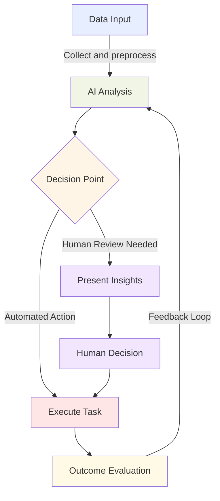
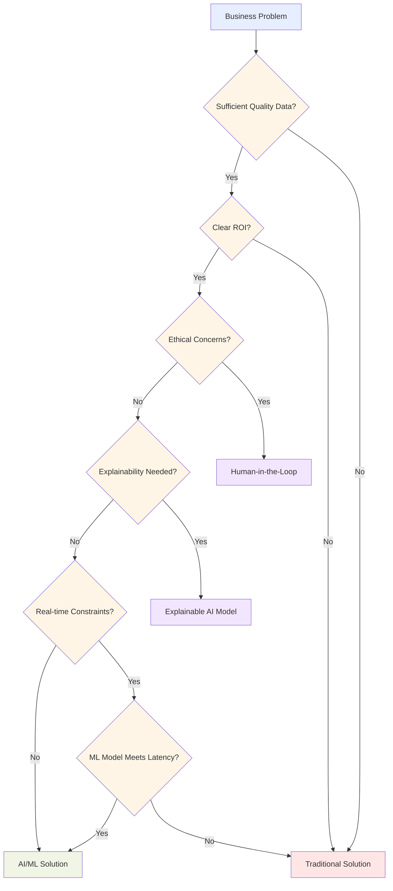
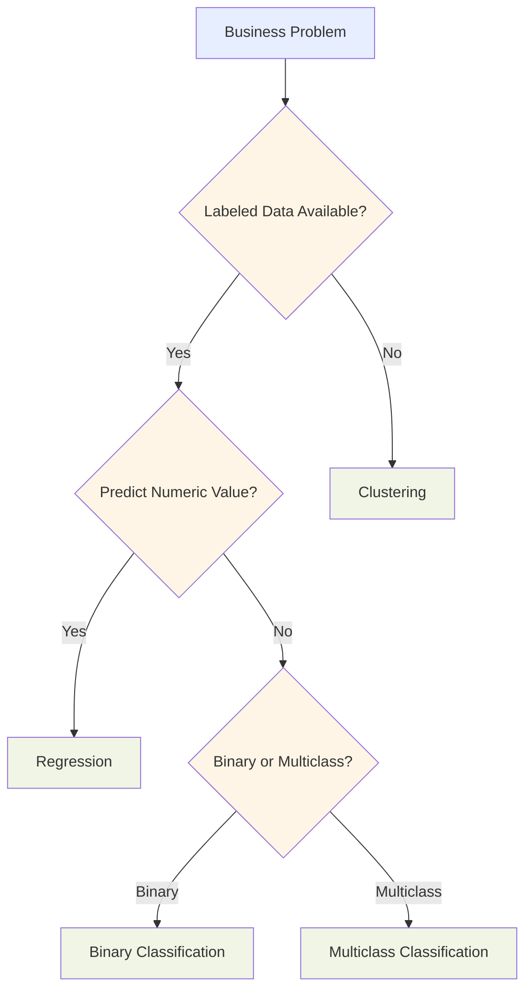
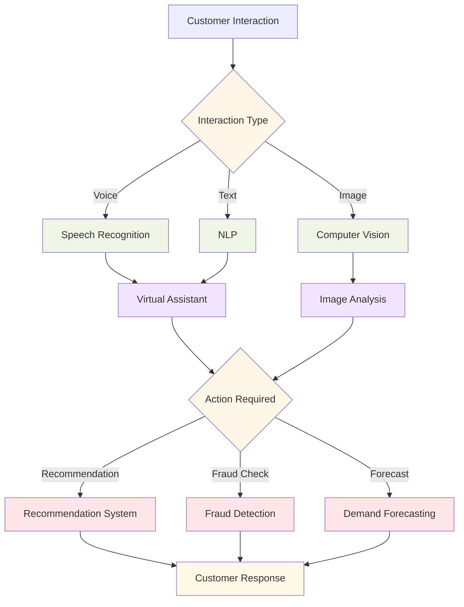
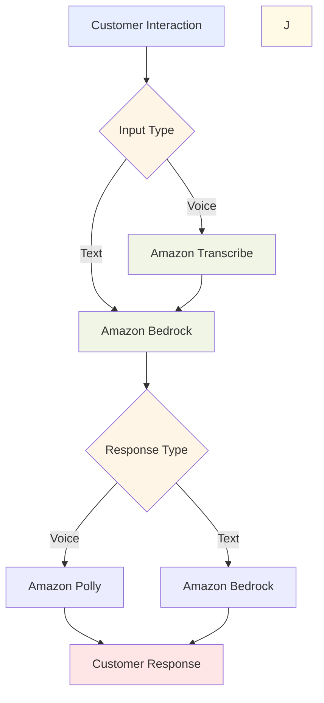

## 1.2 Identify practical use cases for AI

Artificial intelligence (AI) and machine learning (ML) have become powerful tools that transform how organizations operate, serve customers, and gain competitive advantages. Understanding where AI can deliver value—and where it might not be suitable—enables businesses to make strategic technology decisions. This subchapter explores practical AI applications, helps you identify appropriate use cases, and introduces the AWS services that can turn AI concepts into business solutions.

### Recognize applications where AI/ML can provide value

AI and ML technologies excel at analyzing large datasets, identifying patterns, and making predictions that enhance business operations in several key areas:

1. **Assisting human decision-making**: AI systems analyze vast amounts of data to provide insights that augment human expertise, leading to more informed decisions.

2. **Solution scalability**: ML models can process increasing volumes of data without proportional resource increases, enabling efficient business scaling.

3. **Automation**: AI-powered systems handle repetitive tasks, freeing human resources for strategic and creative work.

The following flowchart demonstrates how AI integrates into a typical business process:

*Figure 1.2.1: AI-Assisted Business Process Flow. This diagram illustrates how AI can be integrated into a typical business process, from data input to outcome evaluation, showing both automated actions and human decision points.*

Here are specific examples where AI/ML provides significant business value:

- **Customer Service**: AI-powered chatbots and virtual assistants handle routine customer inquiries 24/7, improving response times while allowing human agents to focus on complex issues. **Amazon Lex**, integrated with Amazon Connect, creates intelligent conversational interfaces that understand natural language.[^300]

- **Predictive Maintenance**: ML models analyze equipment sensor data to predict potential failures before they occur, reducing downtime and maintenance costs. **Amazon SageMaker** enables building, training, and deploying these predictive models at scale.[^301]

- **Personalized Recommendations**: E-commerce platforms use ML algorithms to analyze customer behavior and provide tailored product recommendations, increasing sales and satisfaction. **Amazon Personalize** offers a fully managed service to create real-time personalized recommendations.[^302]

- **Financial Fraud Detection**: Banks employ ML models to analyze transaction patterns and identify potentially fraudulent activities in real-time. **Amazon Fraud Detector** provides a fully managed service that uses ML to detect suspicious activities.[^303]

- **Supply Chain Optimization**: AI analyzes historical data, market trends, and external factors to optimize inventory levels, predict demand, and improve supply chain efficiency. **Amazon Forecast** generates accurate demand forecasts based on historical time series data.[^304]

These AI applications enable businesses to enhance operational efficiency, improve customer experiences, and gain competitive advantages in their markets.

### Determine when AI/ML solutions are not appropriate

Recognizing situations where AI may not be the optimal solution is equally important for making sound technology decisions. Several factors should influence whether to implement AI for a particular business challenge:

1. **Cost-benefit considerations**: AI implementation requires investments in data infrastructure, model development, and ongoing maintenance. For some problems, these costs may exceed potential benefits.

2. **Situations requiring specific outcomes**: When definitive, rule-based outcomes are needed (such as in regulatory compliance), traditional rule-based systems often work better than AI's probability-based approaches.

3. **Limited or poor-quality data**: AI/ML models depend on substantial high-quality data. Without sufficient quality data, predictions will be unreliable and potentially harmful to business operations.

4. **Ethical considerations**: Using AI for certain decision-making processes raises ethical concerns, particularly in sensitive areas like healthcare diagnostics or criminal justice. Human judgment remains essential for ensuring fair outcomes.

5. **Explainability requirements**: Some industries require clear explanations for decisions. While *explainable AI* has advanced, complex models like deep neural networks can be difficult to interpret, making them unsuitable when decision transparency is crucial.

6. **Real-time processing needs**: For ultra-low-latency applications, traditional rule-based systems may provide more reliable response times than some AI systems.

This flowchart helps determine whether an AI/ML solution fits a particular business need:

*Figure 1.2.2: AI/ML Solution Appropriateness Flowchart. This diagram outlines the decision-making process for determining whether an AI/ML solution is appropriate for a given business problem, considering factors such as data quality, ROI, ethical concerns, explainability needs, and real-time constraints.*

When evaluating AI solutions, ask these critical questions:

- Is there clear business value that outweighs implementation costs?
- Do we have sufficient high-quality data to train and maintain the model?
- Are there ethical or regulatory concerns with using AI for this application?
- Do we need to provide clear explanations for the system's decisions?
- Can we tolerate some uncertainty in the outcomes?

Sometimes a hybrid approach combining AI with human oversight or traditional systems provides the most effective solution.

### Select the appropriate ML techniques for specific use cases

Matching the right machine learning technique to your business problem significantly impacts project success. Different ML approaches suit different types of problems and data characteristics. Here are three fundamental ML techniques and their typical applications:

1. **Regression**:
   - **Purpose**: Predicts continuous numerical values based on input features.
   - **Use cases**: Sales forecasting, price prediction, demand estimation.
   - **Example**: Predicting house prices based on features like square footage, location, and number of bedrooms.

2. **Classification**:
   - **Purpose**: Categorizes input data into predefined classes or categories.
   - **Use cases**: Spam detection, sentiment analysis, image recognition.
   - **Example**: Determining whether an email is spam or legitimate based on its content and metadata.

3. **Clustering**:
   - **Purpose**: Groups similar data points without predefined categories.
   - **Use cases**: Customer segmentation, anomaly detection, recommendation systems.
   - **Example**: Grouping customers with similar purchasing behaviors for targeted marketing campaigns.

This table summarizes key ML techniques and their business applications:

*Table 1.2.1: ML Techniques and Their Business Applications*

| ML Technique | Description | Business Use Case | AWS Service |
|--------------|-------------|-------------------|-------------|
| Regression | Predicts continuous values | Sales forecasting | Amazon Forecast |
| Classification | Categorizes data into classes | Sentiment analysis | Amazon Comprehend |
| Clustering | Groups similar data points | Customer segmentation | Amazon SageMaker |

When selecting an ML technique, consider these factors:

1. **Nature of the problem**: Is it a prediction task (regression), a categorization task (classification), or an exploratory analysis (clustering)?

2. **Type of data available**: Is your data labeled (supervised learning) or unlabeled (unsupervised learning)?

3. **Desired outcome**: Do you need a specific numerical prediction, a category assignment, or insights into data patterns?

4. **Interpretability requirements**: Some techniques (e.g., decision trees) are more easily interpretable than others (e.g., neural networks).

5. **Scalability needs**: Consider the volume of data you'll be processing and the frequency of predictions required.

This decision flow helps select an appropriate ML technique:

*Figure 1.2.3: ML Technique Selection Flowchart. This diagram illustrates the decision-making process for selecting an appropriate ML technique based on the nature of the data and the desired outcome.*

In real-world scenarios, combining multiple techniques or employing more advanced methods may deliver optimal results. The key is aligning the technical approach with your specific business needs and data characteristics.

### Identify examples of real-world AI applications

AI technology has transformed operations across numerous industries. Understanding these practical applications can inspire new implementation ideas for your organization. Here are prominent examples of AI applications in various domains:

1. **Computer Vision**:
   - **Application**: Object detection and recognition in images and videos.
   - **Use case**: Autonomous vehicles use computer vision to identify road signs, pedestrians, and other vehicles.
   - **AWS service**: **Amazon Rekognition** provides pre-trained computer vision capabilities for image and video analysis.[^305]

2. **Natural Language Processing (NLP)**:
   - **Application**: Understanding and generating human language.
   - **Use case**: Chatbots that comprehend and respond to customer queries in natural language.
   - **AWS service**: **Amazon Comprehend** offers NLP capabilities for extracting insights from text.[^306]

3. **Speech Recognition**:
   - **Application**: Converting spoken language into text.
   - **Use case**: Voice-controlled virtual assistants like Alexa or Siri.
   - **AWS service**: **Amazon Transcribe** converts speech to text in real-time.[^307]

4. **Recommendation Systems**:
   - **Application**: Suggesting relevant items based on user preferences and behavior.
   - **Use case**: E-commerce platforms recommending products based on browsing and purchase history.
   - **AWS service**: **Amazon Personalize** provides custom recommendation capabilities.[^308]

5. **Fraud Detection**:
   - **Application**: Identifying unusual patterns that may indicate fraudulent activity.
   - **Use case**: Banks detecting and preventing credit card fraud in real-time.
   - **AWS service**: **Amazon Fraud Detector** identifies potentially fraudulent online activities.[^309]

6. **Forecasting**:
   - **Application**: Predicting future trends based on historical data.
   - **Use case**: Retailers forecasting product demand to optimize inventory.
   - **AWS service**: **Amazon Forecast** generates accurate demand forecasts from historical data.[^310]

This diagram illustrates how these AI applications integrate into a business ecosystem:

*Figure 1.2.4: Integrated AI Applications in Business. This diagram shows how various AI applications can be integrated into a business ecosystem, from initial customer interaction to final response, incorporating different AI technologies based on the interaction type and required action.*

These real-world applications demonstrate AI's versatility in solving complex business problems. By understanding these applications, you can identify similar opportunities within your organization to leverage AI for improved efficiency, customer experience, and decision-making.

### Explain the capabilities of AWS managed AI/ML services

AWS offers comprehensive managed AI/ML services that enable businesses to implement AI solutions without extensive in-house expertise or infrastructure. These services range from foundational tools for building custom ML models to pre-trained AI services for specific tasks:

*Table 1.2.2. AWS AI Services Comparison*

| Service | Capability | Features | Use Case |
|---------|------------|----------|----------|
| **Amazon SageMaker** | End-to-end ML platform for building, training, and deploying ML models at scale. | Integrated development environment (IDE) for ML, automated model tuning, distributed training, and model deployment. | Developing custom ML models for various business applications.[^311] |
| **Amazon Transcribe** | Automatic speech recognition service that converts speech to text. | Real-time transcription, custom vocabulary, speaker identification, and language detection. | Transcribing customer service calls for analysis and quality assurance.[^312] |
| **Amazon Translate** | Neural machine translation service providing fast, high-quality language translation. | Support for multiple languages, custom terminology, and batch translation. | Translating product descriptions and customer reviews for global e-commerce platforms.[^313] |
| **Amazon Comprehend** | Natural language processing service for extracting insights from text. | Entity recognition, key phrase extraction, sentiment analysis, and topic modeling. | Analyzing customer feedback to identify common issues and sentiment trends.[^314] |
| **Amazon Lex** | Service for building conversational interfaces using voice and text. | Automatic speech recognition, natural language understanding, and dialog management. | Creating chatbots for customer service and support.[^315] |
| **Amazon Polly** | Text-to-speech service that converts text into lifelike speech. | Multiple languages and voices, speech marks for synchronization, and custom lexicons. | Generating voice prompts for interactive voice response systems.[^316] |
| **Amazon Bedrock** | Fully managed service providing access to foundation models (FMs) from leading AI companies through a single API. | Access to models from AI21 Labs, Anthropic, Stability AI, and Amazon; fine-tuning capabilities; and enterprise-grade security. | Building generative AI applications for content creation, summarization, and question-answering.[^317] |

This diagram shows how AWS managed AI/ML services integrate into a comprehensive solution:

*Figure 1.2.5: Integrated AWS AI/ML Services. This diagram illustrates how various AWS managed AI/ML services can be combined to create a comprehensive AI solution for customer interactions, from input processing to response generation.*

Key advantages of AWS managed AI/ML services include:

1. **Reduced complexity**: These services abstract away infrastructure and ML complexities, allowing developers to focus on building applications.

2. **Scalability**: AWS manages resource scaling based on demand, ensuring consistent performance under varying loads.

3. **Cost-effectiveness**: Pay-as-you-go pricing allows businesses to start small and scale without large upfront investments.

4. **Continuous updates**: AWS regularly updates services with the latest AI/ML advancements, providing access to state-of-the-art capabilities.

5. **Integration**: These services easily integrate with other AWS services and existing applications through APIs and SDKs.

6. **Security and compliance**: AWS provides robust security features and compliance certifications, addressing common AI adoption concerns.

By leveraging these managed services, businesses of all sizes can rapidly prototype, develop, and deploy AI solutions without extensive in-house AI expertise or infrastructure.

Understanding practical AI use cases, recognizing when AI solutions are appropriate, selecting the right ML techniques, and leveraging AWS managed services are crucial skills for business professionals in the AI era. These capabilities enable you to drive AI initiatives and position your organization for success in an increasingly AI-driven world.

### Questions for self-check

1. **A retail company wants to implement an AI solution to improve its inventory management. Which of the following AWS services would be most appropriate for generating accurate demand forecasts based on historical sales data?**

   A. Amazon Rekognition
   B. Amazon Comprehend
   C. Amazon Forecast
   D. Amazon Personalize

2. **An AI project team is evaluating whether to implement a machine learning solution for a critical business process. Which of the following factors would NOT typically be a reason to avoid using an AI/ML solution?**

   A. The process requires clear explanations for all decisions made
   B. The company has access to large amounts of high-quality historical data
   C. The process involves sensitive ethical considerations
   D. The desired outcome is a definitive, rule-based result

3. **A financial services company wants to implement an AI system to detect potentially fraudulent transactions in real-time. Which machine learning technique would be most appropriate for this use case?**

   A. Regression
   B. Clustering
   C. Classification
   D. Dimensionality reduction

4. **A global e-commerce platform is developing an AI-powered customer service system. Which combination of AWS services would be most appropriate for creating a multilingual chatbot that can understand and respond to customer queries in various languages?**

   A. Amazon Polly and Amazon Rekognition
   B. Amazon Bedrock and Amazon Translate
   C. Amazon SageMaker and Amazon Forecast
   D. Amazon Comprehend and Amazon Personalize

5. **A data scientist is explaining the concept of overfitting to a business team. Which of the following statements best describes the potential business impact of an overfitted machine learning model?**

   A. The model will consistently underperform on all datasets, leading to poor business decisions
   B. The model will require significantly more computational resources, increasing operational costs
   C. The model will perform exceptionally well in production, potentially automating all related business processes
   D. The model will fail to generalize to new data, potentially leading to inaccurate predictions in real-world scenarios

### Answers and Explanations

1. **Correct answer: C. Amazon Forecast**

   Explanation: Amazon Forecast is specifically designed for generating accurate demand forecasts based on historical time series data, which is exactly what the retail company needs for improving inventory management.[^318] Amazon Rekognition (image and video analysis), Amazon Comprehend (natural language processing), and Amazon Personalize (personalized recommendations) are not suitable for this particular use case of demand forecasting.

2. **Correct answer: B. The company has access to large amounts of high-quality historical data**

   Explanation: Having access to large amounts of high-quality historical data is actually a positive factor for implementing an AI/ML solution, not a reason to avoid it. AI and ML models typically require substantial, high-quality data to perform well. The other options are valid reasons to be cautious about implementing AI/ML: the need for clear explanations (A) can be challenging for some complex ML models, ethical considerations (C) may require human oversight, and definitive rule-based outcomes (D) might be better served by traditional systems.

3. **Correct answer: C. Classification**

   Explanation: For detecting potentially fraudulent transactions in real-time, classification is the most appropriate machine learning technique. This is because fraud detection is essentially a binary classification problem (fraudulent or not fraudulent) based on transaction characteristics. Regression is used for predicting continuous values, clustering for grouping similar data points without predefined categories, and dimensionality reduction for reducing the number of input variables, none of which directly address the fraud detection use case.

4. **Correct answer: B. Amazon Bedrock and Amazon Translate**

   Explanation: To create a multilingual chatbot, the combination of Amazon Bedrock and Amazon Translate would be most appropriate. Amazon Bedrock provides the Large Language Models for building chatbots, while Amazon Translate enables real-time translation between languages. This combination allows the chatbot to understand and respond to customer queries in various languages. Also, many LLMs support multiple languages and can be used directly without translation.

5. **Correct answer: D. The model will fail to generalize to new data, potentially leading to inaccurate predictions in real-world scenarios**

   Explanation: This statement accurately describes the business impact of an overfitted model. Overfitting occurs when a model learns the training data too well, including its noise and peculiarities. As a result, while it may perform exceptionally well on the training data, it fails to generalize to new, unseen data. In a business context, this means the model may make inaccurate predictions when applied to real-world scenarios, potentially leading to poor decision-making. This highlights the importance of proper model validation and testing in AI projects.

[^300]: Amazon Lex Overview. URL: <https://aws.amazon.com/lex/>
[^301]: Amazon SageMaker Overview. URL: <https://aws.amazon.com/sagemaker/>
[^302]: Amazon Personalize Overview. URL: <https://aws.amazon.com/personalize/>
[^303]: Amazon Fraud Detector Overview. URL: <https://aws.amazon.com/fraud-detector/>
[^304]: Amazon Forecast Overview. URL: <https://aws.amazon.com/forecast/>
[^305]: Amazon Rekognition Overview. URL: <https://aws.amazon.com/rekognition/>
[^306]: Amazon Comprehend Overview. URL: <https://aws.amazon.com/comprehend/>
[^307]: Amazon Transcribe Overview. URL: <https://aws.amazon.com/transcribe/>
[^308]: Amazon Personalize Overview. URL: <https://aws.amazon.com/personalize/>
[^309]: Amazon Fraud Detector Overview. URL: <https://aws.amazon.com/fraud-detector/>
[^310]: Amazon Forecast Overview. URL: <https://aws.amazon.com/forecast/>
[^311]: Amazon SageMaker Overview. URL: <https://aws.amazon.com/sagemaker/>
[^312]: Amazon Transcribe Overview. URL: <https://aws.amazon.com/transcribe/>
[^313]: Amazon Translate Overview. URL: <https://aws.amazon.com/translate/>
[^314]: Amazon Comprehend Overview. URL: <https://aws.amazon.com/comprehend/>
[^315]: Amazon Lex Overview. URL: <https://aws.amazon.com/lex/>
[^316]: Amazon Polly Overview. URL: <https://aws.amazon.com/polly/>
[^317]: Amazon Bedrock Overview. URL: <https://aws.amazon.com/bedrock/>
[^318]: Amazon Forecast Documentation. URL: <https://docs.aws.amazon.com/forecast/>