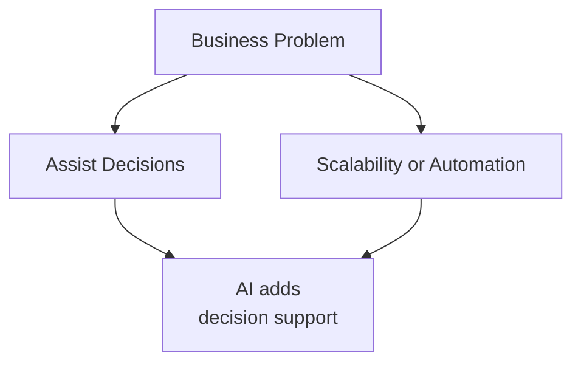
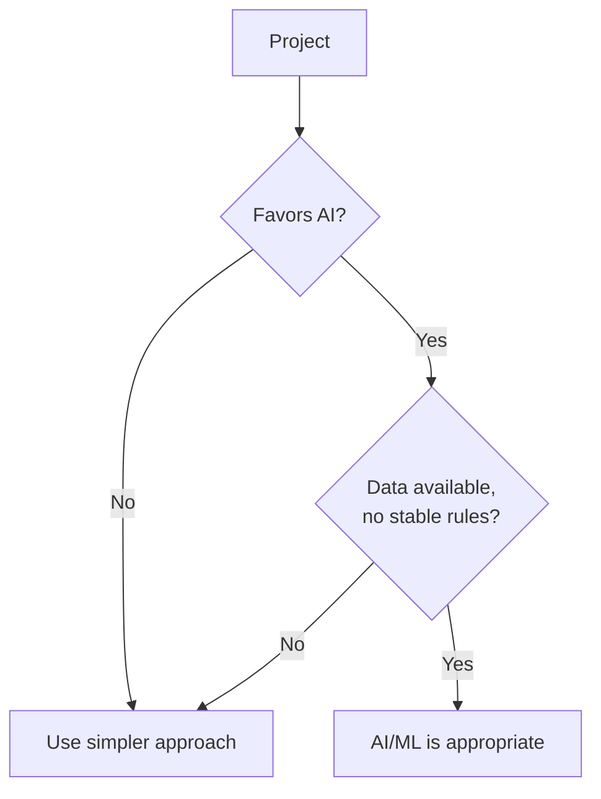
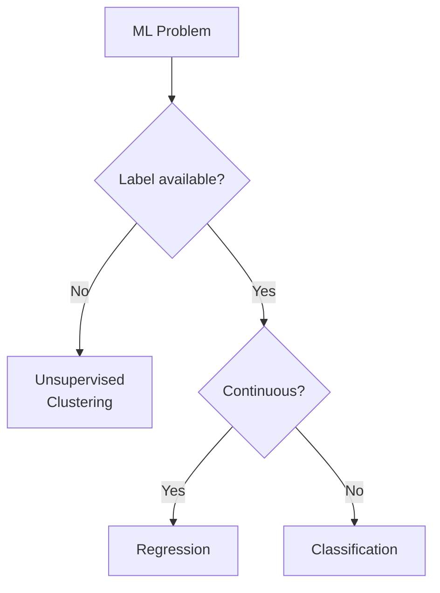
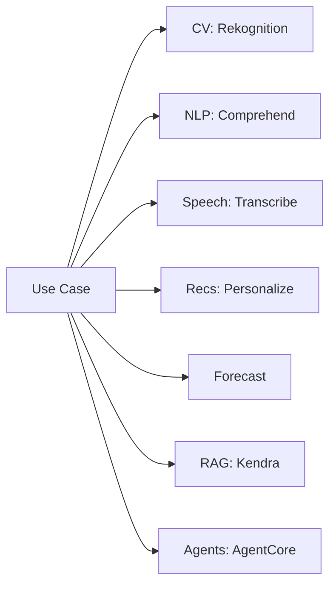
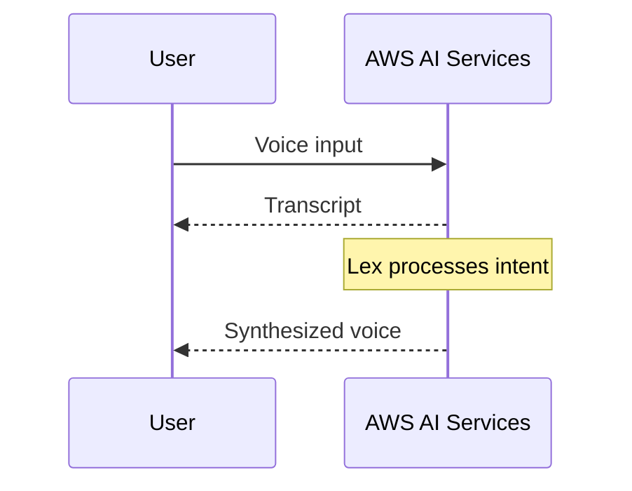
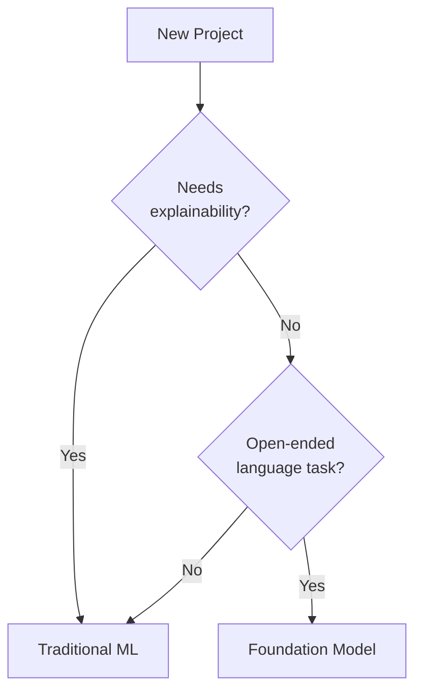

## Task Statement 1.2: Identify practical use cases for AI

Knowing that AI and ML exist is not enough for a business professional to act on them effectively. The real question is: where do they produce better results than the alternatives, and where do they not? Task Statement 1.2 answers that question. It moves from theory to practice by mapping categories of business problems to appropriate AI techniques, cataloging the AWS managed services that reduce the engineering burden, and introducing a new v1.1 decision point: when a traditional ML model is more appropriate than a foundation model. The objectives covered here are 1.2.1 through 1.2.6.[^102001]

### 1.2.1 Recognize where AI/ML provides value

Three categories of business need define most of the situations where AI and ML outperform simpler alternatives: assisting human decision-making, enabling solution scalability, and automating repetitive tasks. These are not mutually exclusive, and many production deployments combine all three. Understanding each category on its own terms, however, makes it easier to frame an AI proposal to stakeholders.

**Assisting human decision making** is the oldest and arguably most durable value driver for ML. A model does not replace the decision maker; it narrows the range of options a human must consider and attaches a probability estimate to each remaining option. A mortgage underwriter, for example, reviews dozens of signals when evaluating a loan application. An ML model trained on historical loan performance can rank those signals by predictive weight and flag applications that fall outside normal patterns, so the underwriter focuses attention where it matters most. The human retains accountability and authority; the model reduces the cognitive load and the chance of missing a signal buried in a large feature set.[^102002]

**Solution scalability** is the capability that most directly aligns with cloud economics. A deterministic rule engine written by a developer hits a ceiling when business logic grows complex enough that maintaining the rules manually becomes slower than the business changes. An ML model trained on outcomes scales differently: as the input volume grows, the model runs the same inference computation regardless of how many business rules would have been needed to replicate its output. A fraud detection model that scores ten thousand payment transactions per second requires no additional engineering effort compared with one scoring one hundred transactions per second; only compute resources change, and those are elastic in AWS.[^102003]

**Automation** covers the substitution of ML inference for a task that previously required human time. Document classification, image quality inspection on a manufacturing line, and call-center routing based on sentiment analysis are all examples. Automation value is clearest when the task is repetitive, the volume is high, the acceptable error rate is well understood, and the cost of errors is recoverable rather than catastrophic. Automation does not mean unattended operation; most production AI automation systems include a human review path for the cases the model assigns low confidence to.[^102004]

*Figure 1.2.1: Three primary drivers of AI/ML business value. The diagram shows how different business pressures map to distinct AI value categories, each with its own operational pattern.*

Two other categories appear less frequently in exam questions but are worth noting. *Solution personalization* applies ML to tailor content, offers, or workflows to individual users based on behavioral history, which is particularly common in retail and media. *Predictive maintenance* applies time-series models to sensor data from equipment, flagging the probability of failure before it occurs and allowing maintenance teams to act on a schedule rather than in response to downtime.

### 1.2.2 When AI/ML solutions are not appropriate

The exam treats this objective as high-yield, and the reason is practical: organizations that apply AI indiscriminately waste budget and sometimes cause harm. Four conditions reliably indicate that AI is the wrong choice.

**Cost-benefit mismatch** is the most common disqualifier in real projects. Building and maintaining an ML model requires labeling data, training runs, infrastructure, model monitoring, and periodic retraining as the underlying distribution shifts. For a business problem that affects a small number of records per day or whose outcome varies within a narrow, predictable range, a simple lookup table or a twenty-line decision script is faster to build, cheaper to operate, and easier to audit. The break-even point depends on volume and complexity, but the principle is consistent: if the cost of developing and operating the ML system exceeds the value it returns over a reasonable planning horizon, a simpler solution is correct.[^102005]

**Deterministic-outcome requirements** arise when a business or regulatory process demands a specific, reproducible answer for a given input rather than a probabilistic estimate. Tax calculations, regulatory eligibility checks, and contractual billing formulas fall in this category. ML models produce outputs drawn from a learned distribution; the same input may receive slightly different scores at different times if the model is retrained, and the model cannot guarantee that it will never deviate from the rule. Rule-based systems guarantee exact reproducibility. When the requirement is "the answer must always be X when the conditions are Y," ML is not the right tool.[^102006]

**Low-data scenarios** undermine the core requirement of supervised learning. A model trained on fewer records than needed to cover the variation in the real world will generalize poorly. The threshold varies by technique and problem type, but a rough heuristic is that supervised classification needs at least several hundred labeled examples per class, and regression benefits from several thousand records with meaningful variation across the feature space. Organizations that want to apply ML to a new product line, a recently acquired data source, or a rare event type often find that they do not yet have enough data to train a reliable model.[^102007]

**Simple rule-based problems** are situations where the logic that maps inputs to outputs can be stated clearly in a decision tree no deeper than four or five levels. If a human expert can enumerate all the cases, the conditions, and the correct outputs in a single afternoon, and if those rules are stable over time, then encoding them explicitly is more auditable, more explainable, and less expensive than training a model. Customer return eligibility based on purchase date and item category is a classic example: the rules are known, fixed, and few enough to maintain manually.

*Figure 1.2.2: Two summary checks for AI/ML appropriateness. The first gate filters out projects that fail the cost-benefit or determinism test; the second filters out projects that lack data or already have stable rules. A project must clear both gates to justify AI/ML over a simpler approach.*

Two additional considerations are worth mentioning even though they appear less directly in exam wording. *Ethical and regulatory constraints* can limit where a probabilistic model may operate, particularly in high-stakes domains such as credit scoring, hiring, and clinical diagnosis. *Latency constraints* matter when an application needs a response in single-digit milliseconds; certain complex models require more inference time than that, and a hard-coded decision path may be the only option that meets the SLA.

### 1.2.3 Select appropriate AI/ML techniques

Choosing the right technique begins with the nature of the labeled signal available in the training data. Three fundamental supervised and unsupervised techniques appear explicitly in the exam objectives; two additional techniques appear in the objectives as passing mentions.

**Regression** predicts a continuous numerical output given a set of input features.[^102008] The model learns the relationship between features and a target variable that can take any value in a range, such as expected revenue, hours until equipment failure, or temperature at a given location and time. A retail chain predicting weekly sales volume by store location uses regression. The output is not a category; it is a number the business can act on directly in an inventory or staffing plan.

**Classification** assigns an input to one of a finite set of categories.[^102009] When the category set has two members, the problem is *binary classification*; when it has more than two, it is *multiclass classification*. Spam detection (spam or not spam), loan default prediction (default or no default), and image labeling (cat, dog, or bird) are all classification problems. The model output is typically a probability score for each class, and the application picks the class with the highest score, optionally combined with a confidence threshold that routes low-confidence predictions to a human reviewer.

**Clustering** groups records by similarity without a predefined label.[^102010] Because no labeled target variable exists, clustering is an unsupervised technique. The model discovers structure in the data that the analyst did not pre-specify. Customer segmentation is the canonical example: given purchase history, browsing behavior, and demographic signals, the model might identify five distinct customer archetypes that the marketing team can then design distinct campaigns for. Anomaly detection is a related application: records that do not fit any cluster tightly are flagged as unusual.

Two additional techniques merit brief mention because the exam objectives name them in passing. *Dimensionality reduction* compresses a high-dimensional feature space into fewer dimensions, which reduces compute cost and can improve downstream model performance by removing correlated or irrelevant features. *Anomaly detection* identifies data points that deviate significantly from the learned distribution of normal behavior, which is a distinct framing from classification even though some classification models are adapted for this purpose.

*Table 1.2.1: ML technique selection by problem type*

| Technique | Input label | Output type | Canonical business example |
|-----------|-------------|-------------|---------------------------|
| Regression | Required (numeric target) | Continuous number | Demand forecasting, price prediction |
| Binary classification | Required (two-class) | Class + probability | Fraud flag, churn prediction |
| Multiclass classification | Required (multi-class) | Class + probability | Document routing, defect category |
| Clustering | Not required | Cluster assignment | Customer segmentation, topic discovery |
| Anomaly detection | Optional | Anomaly score | Network intrusion, sensor fault |

*Figure 1.2.3: ML technique selection decision tree. The primary branch separates supervised from unsupervised problems; the supervised branch then separates by the nature of the target variable.*

**Amazon SageMaker AI** supports all of the techniques in Table 1.2.1 through its built-in algorithms and the broader framework ecosystem it hosts.[^102011] For teams without data science staff, the AutoML capability within SageMaker AI can select and tune algorithms automatically given a labeled dataset, making technique selection a guided configuration task rather than a research problem.

### 1.2.4 Real-world AI applications

Exam objective 1.2.4 expanded in v1.1 to include knowledge bases and agentic AI alongside the six categories present in v1.0. These eight categories represent the full scope of what the exam may ask candidates to recognize.

**Computer vision** systems interpret images or video frames to extract structured information.[^102012] Object detection identifies and locates specific items within an image; image classification assigns a label to the whole image; optical character recognition reads printed or handwritten text from a scan. A logistics company uses computer vision to read package labels on a conveyor belt and route them without human intervention. A retail chain uses shelf-scanning cameras to detect when a product is out of stock. **Amazon Rekognition** is the AWS managed service for computer vision; it provides pre-trained models for object and scene detection, text recognition, and face analysis, and it accepts both individual images and video streams.[^102013]

**Natural language processing (NLP)** enables systems to derive meaning from unstructured text.[^102014] Sentiment analysis determines whether a body of text expresses positive, negative, or neutral sentiment. Entity recognition extracts named entities such as product names, locations, and people from a document. Topic modeling groups a collection of documents by theme. A customer success team runs sentiment analysis against support tickets every night to identify emerging product complaints before they escalate. **Amazon Comprehend** is the primary AWS managed NLP service, providing sentiment analysis, entity recognition, key phrase extraction, and custom classification.[^102015]

**Speech recognition** converts spoken audio to text, enabling voice interfaces, meeting transcription, and call analysis.[^102016] The challenge in production is handling diverse accents, background noise, domain-specific vocabulary, and real-time latency constraints. **Amazon Transcribe** converts audio to text and supports custom vocabulary, speaker identification, and automatic punctuation in real-time and batch modes.[^102017]

**Recommendation systems** predict which items a user is most likely to engage with, given behavioral history and contextual signals.[^102018] An e-commerce platform recommends products based on what a customer browsed and purchased previously. A streaming service recommends shows based on viewing history and ratings. The underlying technique is typically collaborative filtering, which identifies users with similar behavior and transfers preferences across the group, or content-based filtering, which matches items whose attributes resemble items the user already engaged with. **Amazon Personalize** is a managed recommendation service that handles the training, deployment, and real-time serving pipeline without requiring ML expertise from the application team.[^102019]

**Fraud detection** identifies transactions or account activities that deviate from the learned pattern of legitimate behavior.[^102020] Banks apply fraud detection at the payment authorization stage, scoring each transaction in real time and declining or flagging those above a risk threshold. Insurance companies apply it to claims submitted for reimbursement. The ML approach outperforms static rules because fraud patterns evolve continuously, and a model can be retrained as new fraud tactics emerge. The underlying technique is often binary classification with an anomaly detection layer on top. **Amazon Fraud Detector** is the AWS managed service that packages this pattern, with pre-built models for online fraud, transaction fraud, and account takeover.

**Forecasting** produces predictions of future values for a time-series variable, such as product demand, energy consumption, or call-center staffing requirements.[^102021] The inputs are historical observations of the target variable plus optional *related time series* (such as promotions, holidays, and weather) that the model can use to improve accuracy. **Amazon Forecast** is a managed forecasting service that automatically selects among statistical and deep learning algorithms, computes *quantile forecasts* (for example, p50 and p90 demand levels), and writes results to Amazon S3 for downstream consumption.[^102022]

**Knowledge bases** are structured stores of information that AI systems can query at inference time to ground their responses in verified content rather than relying solely on the patterns encoded in model weights.[^102023] A knowledge base for a financial services company might contain regulatory documents, product specifications, and approved response templates. When a customer asks a question through an AI assistant, the system retrieves the relevant section from the knowledge base and uses it to formulate a factually grounded answer. This pattern is formally called *retrieval-augmented generation (RAG)*, which Domain 3 of this book covers in depth. **Amazon Kendra** is a managed enterprise search service that underpins many knowledge base implementations, indexing document repositories and returning relevant passages in response to natural-language queries.[^102024]

**Agentic AI** describes systems in which one or more AI models plan and execute multi-step tasks autonomously, calling tools and APIs to interact with external systems.[^102025] A single-agent system might handle an end-to-end customer service workflow: interpret the customer's request, look up account information in a CRM, check product inventory, draft a resolution, and send a confirmation email, all without a human operator. A multi-agent system distributes subtasks across specialized agents; an orchestrator agent assigns work, subagents execute it, and the orchestrator compiles the results. Business applications for agentic AI include IT operations (an agent that monitors alerts, diagnoses root cause, and applies a fix from a runbook), document processing (an agent that reads invoices, extracts line items, and enters them into an ERP), and customer onboarding (an agent that collects required documents, validates them, and triggers account provisioning).

**Amazon Bedrock AgentCore** is the AWS managed runtime for production agentic AI workloads, providing memory management, tool orchestration, and session persistence for agents built on foundation models.[^102026] For teams developing agentic applications, **Strands Agents** is an open-source SDK that simplifies multi-agent composition, while **Amazon Bedrock** agents provide a fully managed orchestration layer that connects foundation models to action groups defined as Lambda functions or API schemas.[^102027]

*Figure 1.2.4: Real-world AI application categories and the primary AWS managed service that implements each. Fraud detection is not shown because it spans multiple services (Amazon Fraud Detector and SageMaker AI) depending on the implementation approach.*

### 1.2.5 AWS managed AI/ML services

AWS managed AI services remove the requirement for in-house model development by providing pre-trained capabilities through APIs. Exam objective 1.2.5 names six services explicitly and the in-scope service list adds four more that appear in practice and in exam distractors.

The six named services divide neatly by function. **Amazon SageMaker AI** is the end-to-end ML platform for building, training, and deploying custom models at any scale.[^102028] It is not a pre-trained service but a managed environment that handles the infrastructure for every stage of the ML lifecycle. Teams that need a model trained on their own data, rather than a generic pre-trained API, start with SageMaker AI. **Amazon Transcribe** converts speech to text and is the foundation of any workflow that needs to ingest audio.[^102029] **Amazon Translate** provides neural machine translation across a wide range of language pairs, supporting content localization, real-time multilingual chat, and batch document translation.[^102030] Amazon Comprehend, introduced earlier in this section, handles the text-analysis stage on whatever transcript Amazon Transcribe produces.[^102031] **Amazon Lex** builds conversational interfaces that understand natural language intents and manage dialog state, and it integrates with **Amazon Polly**, which converts text to lifelike speech for voice-channel responses.[^102032][^102033]

Four additional in-scope services appear regularly in exam questions and real architectures. **Amazon Rekognition** handles image and video analysis, including object detection, text recognition, and content moderation.[^102034] **Amazon Textract** goes beyond optical character recognition to extract structured data, such as form fields and table values, from scanned documents.[^102035] **Amazon Personalize** delivers personalized recommendations trained on interaction data the customer provides.[^102036] **Amazon Kendra** is an enterprise search service that indexes internal documents and returns relevant passages in response to natural-language questions, serving as the retrieval layer in knowledge base architectures.[^102037]

*Table 1.2.2: AWS managed AI/ML services grouped by capability*

| Capability | Service | Primary function |
|------------|---------|-----------------|
| Custom model development | Amazon SageMaker AI | Build, train, and deploy custom ML models |
| Speech to text | Amazon Transcribe | Automatic speech recognition with speaker ID |
| Text to speech | Amazon Polly | Neural text-to-speech across multiple voices |
| Language translation | Amazon Translate | Neural machine translation, batch and real-time |
| Text analysis | Amazon Comprehend | Sentiment, entities, key phrases, custom classification |
| Conversational AI | Amazon Lex | Intent recognition and dialog management |
| Computer vision | Amazon Rekognition | Object detection, text recognition, content moderation |
| Document data extraction | Amazon Textract | Structured field and table extraction from documents |
| Recommendations | Amazon Personalize | Real-time personalized recommendations |
| Enterprise search | Amazon Kendra | Natural-language search over internal document repositories |

A common exam trap is conflating services with overlapping surface areas. **Amazon Transcribe** produces a text transcript; **Amazon Comprehend** analyzes that transcript for meaning. **Amazon Lex** understands conversational intents in real time; **Amazon Polly** speaks the response back. **Amazon Textract** reads structured data from a scanned page; **Amazon Rekognition** detects objects and scenes in the same image. These pairs often appear together in architecture questions, and knowing which service belongs at which stage is the key to selecting the right answer.

*Figure 1.2.5: Conceptual voice channel flow. The user speaks to a chain of AWS AI services that transcribes the audio, interprets the intent, and synthesizes a spoken reply; the specific service handoffs (Transcribe to Lex to Comprehend to Polly) are described in the preceding paragraph.*

### 1.2.6 Traditional ML vs. foundation models

Objective 1.2.6 is new in v1.1, reflecting the practical question every AI team now faces: when is a foundation model (FM) the right tool, and when is a traditional ML model built and trained from scratch the better choice?[^102038] The decision is not about the sophistication of either option. It is about fit: matching the characteristics of the available data, the required outputs, the regulatory environment, and the operational budget to the capabilities of each approach.

**Traditional ML models** are trained on labeled data for a specific, well-bounded task. They are fully interpretable in the sense that the feature importance and decision logic can be extracted and audited. They run inference at low latency, typically in single-digit milliseconds on modest hardware. Their computational cost is predictable and often low. They require domain-labeled training data, which can be expensive to acquire, but once trained they have no ongoing token-based compute charge.[^102039]

**Foundation models** are pre-trained on broad, general-purpose corpora and can handle a wide range of language and multi-modal tasks with minimal additional configuration.[^102040] They excel at tasks that require natural language understanding, content generation, code synthesis, or reasoning across loosely related topics. They accept conversational prompts and adjust their behavior based on instructions without retraining. Their cost model is typically token-based, meaning every inference call is priced by the number of tokens in the input and output. Latency is higher than traditional ML, typically in the hundreds of milliseconds to seconds range.

*Table 1.2.3: Decision criteria for traditional ML vs. foundation models*

| Criterion | Traditional ML | Foundation model |
|-----------|---------------|-----------------|
| Task scope | Single, well-defined task | Broad or general tasks |
| Training data | Domain-labeled dataset required | Pre-trained; prompt or fine-tune |
| Explainability | High; feature importance available | Lower; emergent reasoning |
| Latency | Low (single-digit ms) | Higher (hundreds of ms to seconds) |
| Inference cost | Predictable; no per-token charge | Token-based; variable with input length |
| Regulatory fit | Strong; full auditability | Weaker; output variability concerns |
| Multi-modal support | Limited to trained modalities | Broad (text, image, audio depending on model) |
| High-volume single task | High; scales horizontally | Low; token cost grows with volume |

Four conditions strongly favor choosing a traditional ML model. First, regulatory or compliance requirements demand a fully auditable, reproducible decision path. Credit-risk scoring under banking regulation, for example, typically requires the ability to explain any individual decision, and a gradient-boosted tree or logistic regression model can provide that explanation in a format regulators accept.[^102041] Second, the prediction task has a single well-defined output (a number, a category, or a score) and enough labeled training data to reach acceptable accuracy without general-purpose reasoning. Third, latency and cost are tightly constrained; the application runs at high volume and must return predictions in milliseconds at a fraction of a cent per inference. Fourth, the organization has sufficient ML engineering capacity to manage the training and retraining pipeline.

Four conditions favor a foundation model. First, the task requires generating coherent prose, reasoning about ambiguous questions, or synthesizing information from multiple sources, which are capabilities that traditional ML models cannot provide. Second, the organization has minimal labeled training data but has access to a well-defined task description it can express as a prompt, making few-shot or zero-shot inference viable. Third, the use case is conversational, and the model needs to maintain context across multiple turns without explicit state management logic. Fourth, the application volume is low enough that token-based cost is acceptable, or the tasks are sufficiently unique that a general-purpose model amortizes the cost of a specialized model build.

*Figure 1.2.6: Decision flow for choosing between a traditional ML model and a foundation model. Regulatory requirements and task type are the two leading filters; latency and data availability refine the choice.*

The NIST AI Risk Management Framework and the EU AI Act both impose traceability requirements on AI systems used in high-stakes decisions.[^102042] In practice, organizations subject to those frameworks often adopt a hybrid pattern: a traditional ML model handles the core prediction task and generates the auditable output, while a foundation model handles the adjacent language tasks such as generating the customer-facing explanation of the decision or summarizing supporting evidence from unstructured documents.

The line between the two approaches is moving. AWS model distillation capabilities within **Amazon Bedrock** allow teams to transfer reasoning behavior from a large foundation model into a smaller, faster, cheaper model that is tuned to a specific task.[^102043] The result is a model that behaves like a foundation model within its narrow domain but runs at a cost and latency profile closer to a traditional ML model. This technique appears in objective 3.1.5 and is worth flagging here as a bridge between the two categories.

**What this section covered:** Task Statement 1.2 established how to recognize where AI and ML add value, when to avoid them, how to match techniques to problem types, and which AWS managed services handle each application category. It also introduced the new v1.1 decision framework for choosing between traditional ML models and foundation models. Task Statement 1.3, which follows, covers the end-to-end AI/ML development lifecycle and maps each stage to the AWS services that support it.

## Self-check questions

**Question 1**

A retail company processes 50,000 customer support emails per day and needs to route each email to the correct department based on its topic. The company has 12 months of historical emails that are already labeled with the correct department. Which approach BEST fits this problem?

A. Regression, because the model needs to predict a score for each department and the highest score determines routing.

B. Multiclass classification, because the output is one of several predefined departments and labeled data is available.

C. Clustering, because there is too much data to label manually and the departments are not yet defined.

D. A foundation model with zero-shot prompting, because the labeled data makes fine-tuning unnecessary and prompting is simpler.

With 12 months of labeled emails and a fixed set of known departments, this is a textbook multiclass classification problem. The labeled data is sufficient to train a traditional ML model, the output is one of a finite number of categories, and the volume (50,000 per day) makes the predictable cost and low latency of a trained classifier preferable to token-based FM inference. Regression predicts continuous numbers, not categories. Clustering would be appropriate if the departments were unknown or if there were no labels, but neither condition applies here. A foundation model with zero-shot prompting can categorize text, but at 50,000 emails per day the token cost accumulates rapidly and latency is higher than a trained classifier; the labeled data should be used to train a purpose-built model rather than discarded.[^102044]

**Question 2**

A financial services firm must explain every lending decision to regulators, including which input features most influenced the outcome. The firm is evaluating whether to use a traditional ML model or a foundation model. Which factor MOST strongly favors the traditional ML approach?

A. The firm has a large volume of labeled training data from past loan applications.

B. The regulatory requirement for explainability and auditable decision logic.

C. The inference latency requirement is under 200 milliseconds per request.

D. The firm wants to avoid token-based pricing to control inference costs.

Regulatory explainability is the decisive factor here. Traditional ML models such as logistic regression and gradient-boosted trees expose feature importance scores and decision paths that satisfy audit requirements. Foundation models produce outputs through emergent reasoning that is difficult to attribute to specific features in a form regulators accept. The presence of labeled training data (A) is a supporting factor for traditional ML but is not the strongest differentiator when compared with regulatory requirements. Latency under 200ms (C) traditional ML models do meet, but many foundation model deployments also meet this threshold. Token-based pricing (D) is a cost consideration but not as binding as regulatory compliance.[^102045]

**Question 3**

A manufacturing company wants to identify which machines on its production floor are likely to fail within the next 72 hours, based on sensor readings collected every minute. The model must return a prediction, not a static rule. There is no labeled failure history. Which ML approach is MOST appropriate?

A. Binary classification using historical sensor data labeled with failure events.

B. Regression using the number of past maintenance calls as the target variable.

C. Unsupervised anomaly detection on the sensor time series, flagging readings that deviate from each machine's learned normal profile.

D. Multiclass classification to categorize failure severity as low, medium, or high.

Without a labeled failure history, supervised approaches (A, B, D) cannot be applied directly. Unsupervised anomaly detection learns the normal pattern of sensor readings for each machine and flags departures from that pattern; on AWS, **Amazon SageMaker AI** offers Random Cut Forest and DeepAR for exactly this style of time-series anomaly detection, and the resulting anomaly scores serve as an unsupervised proxy for failure risk. Binary classification (A) is the ideal approach once labels are available, and the organization should plan to collect labeled failure events for future supervised model training. Regression (B) requires a numeric target variable; the number of past maintenance calls is a proxy but does not directly predict future failure within a specific window. Multiclass classification (D) also requires labeled severity categories that do not exist yet.[^102046]

**Question 4**

A company is evaluating an AI solution to automate the calculation of employee bonuses under a collective bargaining agreement. The formula is specified precisely in the agreement, applies identically to every employee in the same job grade, and has not changed in five years. Which determination is MOST appropriate?

A. Implement a classification model to determine which bonus tier each employee falls into.

B. Implement a regression model to predict bonus amounts from salary and performance data.

C. Do not use AI/ML; implement the formula as deterministic code, because the outcome must be exact and reproducible.

D. Use a foundation model to interpret the agreement text and calculate the appropriate bonus.

This is a deterministic-outcome scenario. The bonus calculation is a fixed formula with no probabilistic element; the same inputs must always produce the same output with no variance. A rule-based or formula implementation guarantees exact reproducibility and is trivially auditable. A classification model (A) would introduce a probability estimate and could not guarantee that the exact boundary conditions in the agreement are respected. A regression model (B) predicts a continuous value from learned patterns, but the correct value is already specified by formula; using ML here adds complexity without benefit. A foundation model (D) can interpret text but would not guarantee arithmetic exactness and introduces latency and cost for a task that requires none of FM's capabilities.[^102047]

**Question 5**

A technology company wants to build a customer service assistant that can handle questions in any of 15 languages, maintain conversational context across multiple turns, and generate personalized responses that draw on the company's internal product documentation. The company has no labeled question-answer training data. Which approach is BEST?

A. Train a multiclass classification model to route questions to pre-written answers in each language.

B. Use a foundation model with retrieval from an Amazon Kendra knowledge base, combined with Amazon Translate for language handling.

C. Use Amazon Lex for dialog management and Amazon Comprehend for sentiment analysis, with no foundation model.

D. Build separate regression models for each language, each trained to score the relevance of candidate answers.

This scenario has three requirements that collectively favor a foundation model architecture: conversational multi-turn context, content generation from internal documents, and multi-language support without labeled training data. Connecting a foundation model to an Amazon Kendra knowledge base provides retrieval-augmented generation, grounding the model's responses in the company's actual documentation. Many foundation models handle multiple languages natively, but Amazon Translate can supplement for languages the FM handles less well. A classification model (A) can route to static answers but cannot generate personalized responses or maintain context across turns. Amazon Lex and Comprehend (C) manage dialog and sentiment but do not retrieve from internal documentation or generate novel responses; this combination alone would not meet the generation requirement. Regression models (D) could score answer candidates but cannot generate new responses or maintain conversational state, and the approach would require building and maintaining 15 separate models.[^102048]

---

[^102001]: AWS Certification: AWS Certified AI Practitioner (AIF-C01) Exam Guide v1.1, Task Statement 1.2. URL: <https://docs.aws.amazon.com/aws-certification/latest/ai-practitioner-01/ai-practitioner-01-domain1.html>
[^102002]: Amazon SageMaker AI Developer Guide: Human-in-the-loop workflows. URL: <https://docs.aws.amazon.com/sagemaker/latest/dg/a2i-use-augmented-ai-a2i-human-review-loops.html>
[^102003]: Amazon SageMaker AI: Model deployment and real-time inference. URL: <https://docs.aws.amazon.com/sagemaker/latest/dg/deploy-model.html>
[^102004]: Amazon Augmented AI (A2I) Developer Guide: What is Amazon A2I? URL: <https://docs.aws.amazon.com/sagemaker/latest/dg/a2i-getting-started.html>
[^102005]: AWS Well-Architected Framework: Machine Learning Lens - Cost optimization pillar. URL: <https://docs.aws.amazon.com/wellarchitected/latest/machine-learning-lens/cost-optimization.html>
[^102006]: NIST AI Risk Management Framework (AI RMF 1.0): Trustworthiness characteristic - Explainability. URL: <https://airc.nist.gov/Home>
[^102007]: Amazon SageMaker AI Developer Guide: Prepare your data. URL: <https://docs.aws.amazon.com/sagemaker/latest/dg/data-prep.html>
[^102008]: Amazon SageMaker AI Developer Guide: Linear Learner algorithm. URL: <https://docs.aws.amazon.com/sagemaker/latest/dg/linear-learner.html>
[^102009]: Amazon SageMaker AI Developer Guide: XGBoost algorithm. URL: <https://docs.aws.amazon.com/sagemaker/latest/dg/xgboost.html>
[^102010]: Amazon SageMaker AI Developer Guide: K-Means algorithm. URL: <https://docs.aws.amazon.com/sagemaker/latest/dg/k-means.html>
[^102011]: Amazon SageMaker AI overview. URL: <https://aws.amazon.com/sagemaker/>
[^102012]: Amazon Rekognition Developer Guide: What is Amazon Rekognition? URL: <https://docs.aws.amazon.com/rekognition/latest/dg/what-is.html>
[^102013]: Amazon Rekognition product page. URL: <https://aws.amazon.com/rekognition/>
[^102014]: Amazon Comprehend Developer Guide: What is Amazon Comprehend? URL: <https://docs.aws.amazon.com/comprehend/latest/dg/what-is.html>
[^102015]: Amazon Comprehend product page. URL: <https://aws.amazon.com/comprehend/>
[^102016]: Amazon Transcribe Developer Guide: What is Amazon Transcribe? URL: <https://docs.aws.amazon.com/transcribe/latest/dg/what-is.html>
[^102017]: Amazon Transcribe product page. URL: <https://aws.amazon.com/transcribe/>
[^102018]: Amazon Personalize Developer Guide: What is Amazon Personalize? URL: <https://docs.aws.amazon.com/personalize/latest/dg/what-is-personalize.html>
[^102019]: Amazon Personalize product page. URL: <https://aws.amazon.com/personalize/>
[^102020]: Amazon Fraud Detector product page. URL: <https://aws.amazon.com/fraud-detector/>
[^102021]: Amazon Forecast Developer Guide: What is Amazon Forecast? URL: <https://docs.aws.amazon.com/forecast/latest/dg/what-is-forecast.html>
[^102022]: Amazon Forecast product page. URL: <https://aws.amazon.com/forecast/>
[^102023]: Amazon Kendra Developer Guide: What is Amazon Kendra? URL: <https://docs.aws.amazon.com/kendra/latest/dg/what-is-kendra.html>
[^102024]: Amazon Kendra product page. URL: <https://aws.amazon.com/kendra/>
[^102025]: Amazon Bedrock User Guide: Agents for Amazon Bedrock. URL: <https://docs.aws.amazon.com/bedrock/latest/userguide/agents.html>
[^102026]: Amazon Bedrock AgentCore product page. URL: <https://aws.amazon.com/bedrock/agentcore/>
[^102027]: Strands Agents SDK on GitHub. URL: <https://github.com/strands-agents/sdk-python>
[^102028]: Amazon SageMaker AI Developer Guide: What is Amazon SageMaker AI? URL: <https://docs.aws.amazon.com/sagemaker/latest/dg/whatis.html>
[^102029]: Amazon Transcribe Developer Guide: Real-time transcription. URL: <https://docs.aws.amazon.com/transcribe/latest/dg/getting-started-streaming.html>
[^102030]: Amazon Translate Developer Guide: What is Amazon Translate? URL: <https://docs.aws.amazon.com/translate/latest/dg/what-is.html>
[^102031]: Amazon Comprehend Developer Guide: Sentiment analysis. URL: <https://docs.aws.amazon.com/comprehend/latest/dg/how-sentiment.html>
[^102032]: Amazon Lex Developer Guide: What is Amazon Lex? URL: <https://docs.aws.amazon.com/lexv2/latest/dg/what-is.html>
[^102033]: Amazon Polly Developer Guide: What is Amazon Polly? URL: <https://docs.aws.amazon.com/polly/latest/dg/what-is.html>
[^102034]: Amazon Rekognition Developer Guide: Detecting objects and scenes. URL: <https://docs.aws.amazon.com/rekognition/latest/dg/labels.html>
[^102035]: Amazon Textract Developer Guide: What is Amazon Textract? URL: <https://docs.aws.amazon.com/textract/latest/dg/what-is.html>
[^102036]: Amazon Personalize Developer Guide: Getting recommendations. URL: <https://docs.aws.amazon.com/personalize/latest/dg/getting-recommendations.html>
[^102037]: Amazon Kendra Developer Guide: Querying an index. URL: <https://docs.aws.amazon.com/kendra/latest/dg/searching-example.html>
[^102038]: AWS Certification: AIF-C01 v1.1 revisions - Objectives added in v1.1, objective 1.2.6. URL: <https://docs.aws.amazon.com/aws-certification/latest/ai-practitioner-01/aif-01-revisions.html>
[^102039]: Amazon SageMaker AI Developer Guide: Training models. URL: <https://docs.aws.amazon.com/sagemaker/latest/dg/how-it-works-training.html>
[^102040]: Amazon Bedrock User Guide: Foundation models in Amazon Bedrock. URL: <https://docs.aws.amazon.com/bedrock/latest/userguide/foundation-models.html>
[^102041]: NIST AI Risk Management Framework AI RMF 1.0 - Govern function: Policies and accountability. URL: <https://airc.nist.gov/Home>
[^102042]: EU Artificial Intelligence Act, Article 13: Transparency and provision of information to users. URL: <https://eur-lex.europa.eu/legal-content/EN/TXT/?uri=CELEX:32024R1689>
[^102043]: Amazon Bedrock User Guide: Model distillation. URL: <https://docs.aws.amazon.com/bedrock/latest/userguide/model-distillation.html>
[^102044]: Amazon SageMaker AI Developer Guide: Multi-class classification. URL: <https://docs.aws.amazon.com/sagemaker/latest/dg/xgboost.html>
[^102045]: Amazon SageMaker Clarify Developer Guide: Explainability. URL: <https://docs.aws.amazon.com/sagemaker/latest/dg/clarify-model-explainability.html>
[^102046]: Amazon SageMaker AI Developer Guide: Random Cut Forest algorithm for time-series anomaly detection. URL: <https://docs.aws.amazon.com/sagemaker/latest/dg/randomcutforest.html>
[^102047]: AWS Well-Architected Machine Learning Lens: Operational Excellence - Model governance. URL: <https://docs.aws.amazon.com/wellarchitected/latest/machine-learning-lens/operational-excellence.html>
[^102048]: Amazon Bedrock User Guide: Knowledge bases for Amazon Bedrock. URL: <https://docs.aws.amazon.com/bedrock/latest/userguide/knowledge-base.html>
