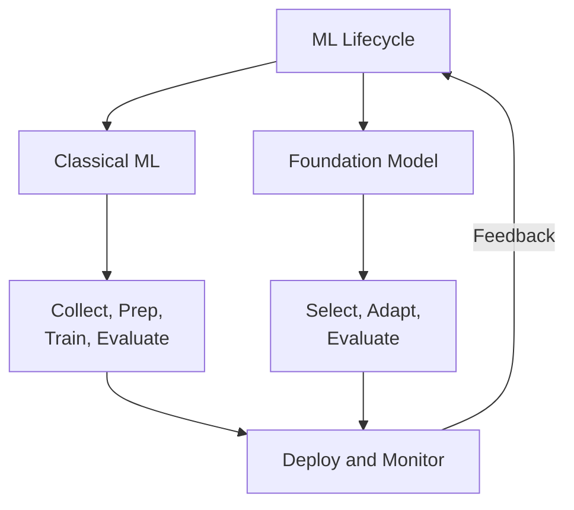
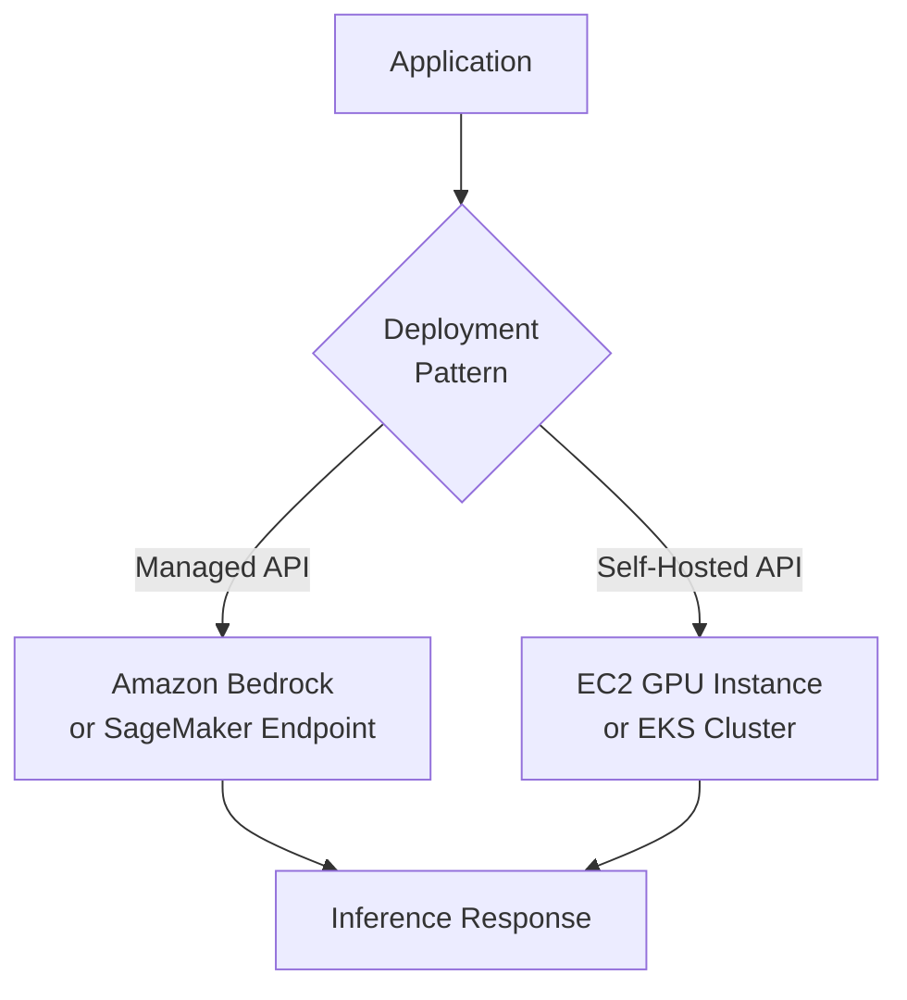
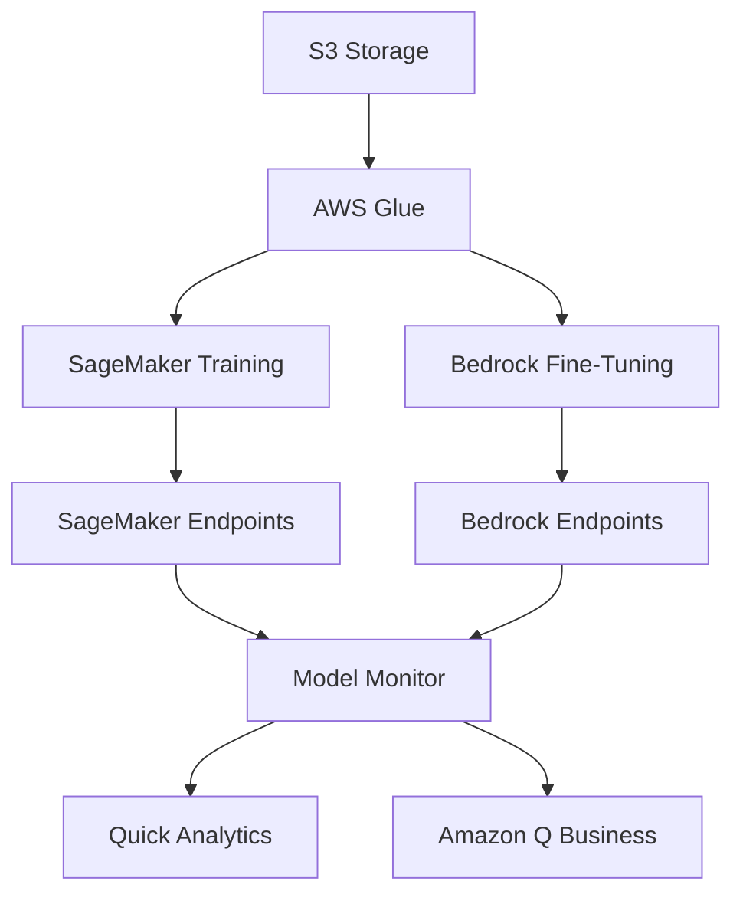
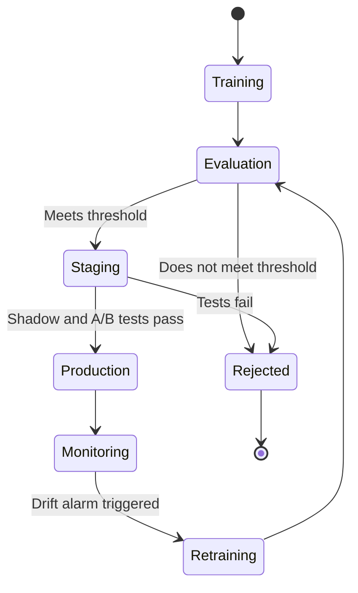
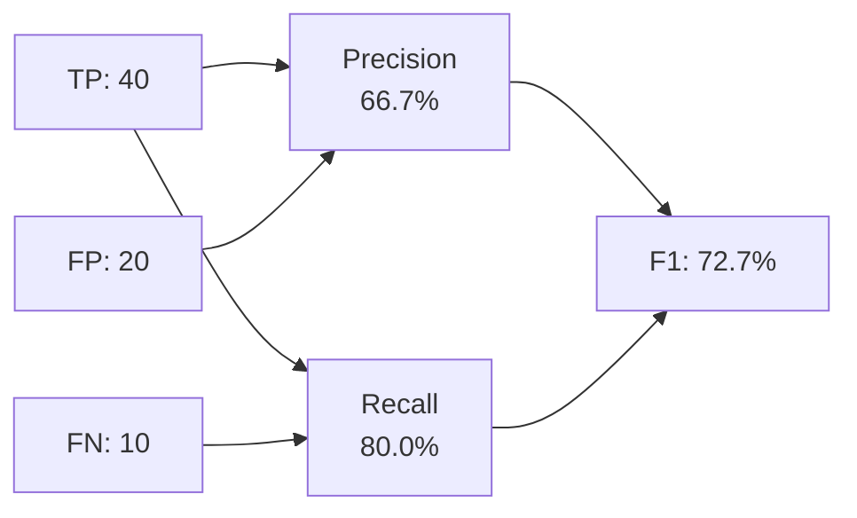

## Task Statement 1.3: Describe the AI/ML development lifecycle

The AI/ML development lifecycle is the structured sequence of activities that takes a business idea from raw data to a production system that generates value over time. Domain 1 established the vocabulary and the use-case landscape; this task statement puts those ideas in motion by showing how AI and ML projects are actually built and managed. Understanding the lifecycle lets business professionals set realistic expectations, ask the right questions at each gate, and recognize where AWS services reduce the cost and complexity of each stage.[^103001]

### 1.3.1 Components of an AI/ML pipeline

A pipeline is the sequence of steps a team executes to go from raw data to a working model. The word is borrowed from software engineering and carries the same meaning: each stage receives an artifact from the previous step, transforms it, and passes the result forward. The pipeline concept matters to business professionals because it gives a common vocabulary for discussing progress, cost, and quality at each point in an AI project.[^103048]

Classical machine learning pipelines and foundation-model pipelines share a structural logic but differ in their middle stages. A classical ML pipeline starts from the ground up: a team gathers labeled data, engineers features, selects an algorithm, trains a model on owned data, tunes it, evaluates it, and then deploys and monitors the result. A foundation-model pipeline skips most of the heavy data and training work. Instead, the team selects an existing pre-trained model, decides how to adapt it to their task (through prompt engineering, fine-tuning, or retrieval-augmented generation), evaluates the adapted model, and deploys it. Both tracks end at the same two stages: deployment and monitoring.

*Figure 1.3.1: Dual-track AI/ML pipeline. Classical ML and foundation-model tracks converge at deployment and monitoring; feedback signals loop back into whichever track is active.*

The stages of the classical ML track are the following. **Data collection** is the process of gathering the labeled or unlabeled records the model will learn from; quality problems at this stage propagate through every subsequent step.[^103002] **Exploratory data analysis (EDA)** is the examination of collected data to understand its distribution, relationships, and anomalies before any modeling begins.[^103003] **Data pre-processing** covers cleaning, imputing missing values, removing duplicates, and converting data to a format an algorithm can consume.[^103004] **Feature engineering** is the creation or transformation of input variables to make underlying patterns more accessible to the model; for example, converting raw transaction timestamps into a "days since last purchase" feature for a churn model.[^103005] **Model training** is the optimization process by which an algorithm finds the parameter values that minimize prediction error on the training dataset.[^103006] **Hyperparameter tuning** adjusts the settings that govern training behavior rather than the learned weights themselves; examples include the learning rate and the maximum tree depth in a gradient-boosted model.[^103007]

The foundation-model track begins with **data selection**, which here means choosing the documents or examples used for fine-tuning rather than training from scratch. **Model selection** is the choice of which pre-trained FM to adapt, a decision driven by capability, cost, latency, and licensing constraints (discussed in Section 1.3.2). **Adaptation** covers the three main techniques for making a general FM perform well on a specific task: prompt engineering, which crafts instructions without changing model weights; fine-tuning, which updates a subset of weights using domain-specific examples; and *retrieval-augmented generation (RAG)*, which extends the model's knowledge by fetching relevant documents at inference time.[^103008] Domain 3 treats each adaptation technique in depth; here it is enough to know that they exist and where they fit in the lifecycle.

Both tracks then enter the **evaluation** stage, where the adapted or trained model is tested on held-out data and scored against performance metrics (see Section 1.3.6). A model that passes evaluation proceeds to **deployment**. A model that fails returns to an earlier stage, commonly feature engineering or hyperparameter tuning in the classical track, or a revised adaptation strategy in the FM track.

**Monitoring** is the final stage and the one most often underestimated in planning. Once a model is in production, the real world does not hold still. User behavior changes, data pipelines evolve, and the statistical patterns the model learned may no longer match what it sees. Monitoring detects these deviations and triggers corrective action, whether that is data refresh, retraining, or prompt revision.[^103009]

### 1.3.2 Sources of FM models

Foundation models require enormous computational resources to train from scratch. A single large-language model training run can consume millions of GPU-hours and cost tens of millions of dollars.[^103010] As a result, most organizations do not train their own FMs; they obtain them from external sources and adapt them. The three principal sources differ in cost, control, licensing terms, and capability.

**Open-source pre-trained models** are models whose weights and, in most cases, the training code are publicly released. The most prominent examples available as of 2025 to 2026 include Meta's Llama family (now in its 4th generation, with the Llama 4 Scout and Maverick variants offering very long context windows; consult Meta's current model cards for served context-window sizes on Amazon Bedrock), Mistral and Mixtral from Mistral AI, TII's Falcon series, and Stability AI's Stable Diffusion for image generation.[^103011] The appeal of open-source models is direct: there is no per-token API cost, the weights can be downloaded and run in the organization's own infrastructure, and the model can be fine-tuned without any vendor involvement. The drawback is operational complexity. The team must provision and manage compute, handle model updates, and take responsibility for security and compliance. Licensing also varies. Llama models carry a community license with usage-based commercial restrictions; check the current Llama license text for the active threshold. Mistral models carry an Apache 2.0 license with no such restriction.[^103012] Business teams should verify the applicable license before committing to an open-source FM in a production product.

**Commercial foundation models** are offered by AI companies as a managed API service. The consuming organization pays per token processed rather than managing infrastructure. The leading commercial FMs accessible through AWS include Anthropic Claude (multiple generations, ranging from Haiku for cost-sensitive tasks to Opus and Sonnet for complex reasoning), Amazon Nova (Amazon's own family spanning Nova Micro, Lite, Pro, and Premier), AI21 Labs' Jamba models, and Cohere's Command and Embed families.[^103013] Commercial models require no infrastructure management and are continuously updated by the vendor, but the organization has less visibility into training data and weights, which can raise compliance questions in regulated industries.

**Custom models trained from scratch** are the rarest option. Training a new large-scale FM from scratch is appropriate only when an organization has a domain so specialized that no existing FM covers it adequately (for example, a genomics company whose vocabulary and reasoning patterns have no overlap with any public training corpus) and has the budget and ML engineering depth to do so. The cost and timeline are substantial; most organizations evaluate this path and conclude that fine-tuning a commercial or open-source FM is a better use of resources.[^103014]

*Table 1.3.1: FM source options compared*

| Source | Typical cost structure | Control over weights | Operational complexity | Example models |
|--------|----------------------|---------------------|----------------------|----------------|
| Open-source pre-trained | Infrastructure cost only | Full access | High | Llama 4, Mistral, Falcon |
| Commercial managed API | Per-token pricing | No access | Low | Claude, Amazon Nova, Cohere |
| Custom trained from scratch | Multi-million dollar capex | Full ownership | Very high | Proprietary |

The selection between these sources is rarely an all-or-nothing decision. Many production architectures layer all three: a commercial API for general-purpose queries, a fine-tuned open-source model for a cost-sensitive high-volume task, and traditional ML models for narrow prediction problems where explainability is mandatory.[^103049]

### 1.3.3 Methods to use a model in production

Getting a trained or selected model into production means making its predictions available to users and applications. The two primary deployment patterns the exam covers are the **managed API service** and the **self-hosted API**. Choosing between them requires weighing latency requirements, call volume, customization needs, and compliance constraints.

A **managed API service** abstracts all infrastructure concerns from the consuming application. The application sends an HTTP request to an endpoint managed by AWS, receives a prediction in response, and never touches the compute layer directly. **Amazon Bedrock** is the primary AWS-managed API for foundation models, giving access to Claude, Amazon Nova, Cohere, AI21, Meta Llama, and other models through a single unified API without the need to manage servers or GPUs.[^103015] For organizations that have trained custom classical ML models or fine-tuned FMs, **Amazon SageMaker AI** real-time inference endpoints provide the same abstraction: the team registers a model artifact, configures an endpoint, and SageMaker handles instance provisioning, load balancing, and auto-scaling.[^103016] The advantages of managed API services are speed to production, built-in scaling, and removal of infrastructure operations from the team's responsibility. The limitation is that fine-grained control over the serving stack (for example, custom tokenization or GPU memory management) is not available.

A **self-hosted API** runs the model on infrastructure the organization controls and exposes it as its own API. The most common AWS patterns are hosting the model container on **Amazon EC2** GPU instances for full flexibility, or deploying it as a Kubernetes workload on **Amazon EKS** for container orchestration at scale.[^103017] Self-hosting is appropriate when compliance requirements prohibit sending data to a vendor's API, when the call volume is high enough that reserved or spot EC2 capacity is cheaper than per-token charges, or when the team needs to modify the inference stack in ways a managed service does not permit. The tradeoff is operational overhead: the team manages instance scaling, model updates, security patching, and monitoring.

*Figure 1.3.2: Model deployment patterns. An application routes inference requests to either a managed API or a self-hosted API depending on the team's latency, compliance, and cost priorities.*

*Table 1.3.2: Managed API vs. self-hosted API decision criteria*

| Criterion | Managed API | Self-Hosted API |
|-----------|-------------|-----------------|
| Infrastructure management | AWS-managed | Team-managed |
| Scaling | Automatic | Manual or auto-scaling config required |
| Customization of serving stack | Limited | Full |
| Data path | Customer data flows through the managed-service control plane in the customer's AWS account; no model-weight access | Data stays on team-controlled infrastructure; full weight access |
| Cost model | Per-token or per-request | Reserved or spot compute |
| Time to first deployment | Hours | Days to weeks |

Beyond these two patterns, organizations sometimes use **batch inference** for high-volume tasks that are not time-sensitive. Amazon SageMaker Batch Transform reads a dataset from Amazon S3, passes each record through the model, and writes results back to S3, making it suitable for tasks like monthly risk scoring across an entire customer portfolio.[^103018] Batch inference is not an endpoint in the traditional sense; it runs as a job on demand and incurs cost only while processing.

### 1.3.4 AWS services for each pipeline stage

The AIF-C01 v1.1 exam specifically names five services by family that span the AI/ML pipeline: **Amazon Bedrock**, **Amazon Q**, **Amazon Quick**, **Kiro**, and **Amazon SageMaker AI**. Understanding what each does and where it fits avoids confusing them on the exam.

**Amazon Bedrock** sits at the FM adaptation and deployment stages of the pipeline. It provides access to a curated catalog of foundation models through a managed API, along with tools for fine-tuning those models on private data and for building RAG pipelines using knowledge bases backed by vector stores.[^103019] For business teams, Bedrock is the entry point for building GenAI-powered applications without managing any ML infrastructure.

**Amazon SageMaker AI** covers the full classical ML pipeline from data preparation through training, evaluation, and deployment. SageMaker Studio is the integrated development environment; SageMaker Pipelines provides ML-native CI/CD for automating the pipeline end to end; SageMaker Feature Store manages feature definitions and values; and SageMaker Model Monitor tracks deployed model health.[^103020] SageMaker also hosts fine-tuned and custom models as endpoints, so it participates in the FM track when an organization fine-tunes an open-source model rather than using a commercial API.

**Amazon Q** is a family of AI-powered assistants oriented toward specific professional audiences. **Amazon Q Business** is a conversational assistant for enterprise employees; it connects to company data sources (SharePoint, Confluence, S3 buckets, ticketing systems) and answers questions grounded in organizational content.[^103021] **Amazon Q Developer** is a coding assistant integrated into IDEs that suggests code, explains logic, and identifies security vulnerabilities. As of 2025 to 2026, Amazon Q Developer is being superseded in the IDE for full software development workflows by **Kiro**. Teams doing new IDE-based AI development projects should evaluate Kiro rather than Q Developer, though Q Developer remains available and is still cited in the exam guide.

**Kiro** is Amazon's AI-powered integrated development environment, announced in 2025.[^103022] Where Q Developer is primarily a code completion and chat overlay inside existing IDEs such as VS Code or JetBrains, Kiro is a full IDE built around agentic AI workflows. Kiro can receive a specification, generate implementation plans, write code across multiple files, run tests, and iterate until the plan is satisfied. For the exam, the key distinction is that Kiro targets the AI-assisted software development lifecycle, not end-user Q&A or data analysis.

**Amazon Quick** is the v1.1 exam guide's name for the AWS business-user analytics and AI assistant family.[^103023] The capabilities historically delivered through Amazon QuickSight (BI dashboards) and Amazon Q Business (conversational answers over enterprise content) are converging under this name, with the goal of letting a business analyst build dashboards, ask natural-language questions about data, and receive AI-generated narrative summaries without switching tools. For the exam, recognize Amazon Quick as the answer to "self-service BI augmented by generative AI for business users"; verify the current product page before procurement decisions, since the brand and tier structure are still settling in 2025 to 2026.

For exam recall, the table below summarises which assistant family targets which audience and how each maps to v1.1 status.

*Table 1.3.3: Amazon Q, Kiro, and Amazon Quick at a glance*

| Service | What it does | Audience | Status for AIF-C01 v1.1 |
|---------|--------------|----------|--------------------------|
| Amazon Q Business | Enterprise Q&A grounded in company content | Knowledge workers | In scope; converging into Amazon Quick |
| Amazon Q Developer | Code completion and chat overlay inside existing IDEs | Developers using VS Code, JetBrains | In scope; superseded for full IDE workflows by Kiro |
| Kiro | Full IDE built around agentic AI workflows | Developers building AI-assisted features | In scope (new in v1.1); the answer for "AI-powered IDE" |
| Amazon Quick | Self-service BI plus generative AI assistant | Business analysts and operations | In scope (new in v1.1); the answer for "BI + GenAI for business users" |

*Table 1.3.4: AWS AI/ML services by pipeline stage*

| Pipeline stage | AWS service | Role |
|----------------|-------------|------|
| Data storage and prep | Amazon S3, AWS Glue | Dataset storage; ETL and cataloging |
| Feature engineering | SageMaker Feature Store | Centralized feature registry |
| Classical model training | SageMaker AI Training | Managed distributed training jobs |
| Hyperparameter tuning | SageMaker Automatic Model Tuning | Bayesian and random search over param space |
| FM adaptation (prompting/RAG) | Amazon Bedrock Knowledge Bases | Vector-store-backed RAG pipelines |
| FM adaptation (fine-tuning) | Amazon Bedrock Fine-Tuning, SageMaker AI | Supervised fine-tuning on private data |
| Evaluation | SageMaker Model Monitor, Bedrock Model Evaluation | Performance and quality scoring |
| Deployment (FM) | Amazon Bedrock Endpoints | Managed FM inference API |
| Deployment (custom ML) | SageMaker AI Endpoints, Batch Transform | Real-time and batch custom model inference |
| Monitoring | SageMaker Model Monitor | Data drift and model quality detection |
| Business analytics | Amazon Quick | BI dashboards and natural-language data Q&A |
| Enterprise Q&A | Amazon Q Business | Conversational answers on company content |
| Developer productivity | Kiro, Amazon Q Developer | AI-assisted software development |

*Figure 1.3.3: AWS service map across the AI/ML pipeline. Storage and ETL feed both classical training and FM fine-tuning; outputs converge at monitoring and then flow to end-user tools.*

### 1.3.5 Fundamental concepts of MLOps

**MLOps** (Machine Learning Operations) is the discipline of applying software-engineering rigor to the ML lifecycle to make model delivery repeatable, scalable, and maintainable over time.[^103024] The term is modeled on DevOps: just as DevOps brought automation, version control, and continuous integration to application development, MLOps brings those same practices to the work of building and operating ML models. The exam covers seven core MLOps concepts.

**Experimentation** is the practice of tracking every run of a model-building attempt so that results can be reproduced and compared. Without systematic tracking, a team that achieves a good validation score cannot reliably reproduce it after modifying the code. **Amazon SageMaker Experiments** records the hyperparameters, metrics, and artifact versions associated with each training run.[^103025] The outcome is a searchable history that answers the question: "Which run produced that result, and what configuration was it?"

**Repeatable processes** replace ad hoc scripts with versioned, parameterized pipelines that produce consistent outputs from consistent inputs. **Amazon SageMaker Pipelines** is the native MLOps orchestration service; it defines pipeline steps in code, stores each step's output as a versioned artifact, and integrates with the SageMaker model registry to gate deployments on evaluation thresholds.[^103026] When a pipeline is defined this way, re-running it with new data produces a new model version with an auditable lineage back to the input data.

**Scalable systems** ensure that the infrastructure supporting training, evaluation, and inference can grow with demand without manual reconfiguration. SageMaker handles distributed training across GPU clusters and scales inference endpoints up and down based on request volume through auto-scaling policies backed by **Amazon CloudWatch** metrics.[^103027]

**Managing technical debt** in ML means preventing the accumulation of hidden assumptions in pipelines, undocumented feature transformations, and model versions that no one can trace back to their training data. Concrete practices include keeping feature definitions in SageMaker Feature Store (so the same transformation is used consistently in training and inference), storing model artifacts in the SageMaker model registry with metadata, and reviewing pipelines for components that are no longer used.[^103028]

**Achieving production readiness** means a model has passed a defined quality bar before it reaches customers. This involves shadow testing (running the new model in parallel with the live model and comparing outputs), A/B testing (routing a percentage of traffic to the new version), and load testing (verifying that the endpoint handles peak traffic without degraded latency). Only after these gates does a new version replace the production model.[^103029]

**Model monitoring** is the continuous evaluation of a deployed model's behavior against baselines established at the time of deployment. Two drift types are particularly important. *Data drift* (also called *covariate shift*) occurs when the statistical distribution of input features changes over time; for example, a fraud model trained on 2023 transaction patterns may see different feature distributions as spending habits evolve.[^103030] *Concept drift* occurs when the relationship between inputs and the correct output changes; for example, a churn model's definition of at-risk behavior may shift as the product itself changes. **Amazon SageMaker Model Monitor** continuously compares live inference data against a baseline dataset and raises alarms when drift exceeds a threshold.[^103031]

**Model retraining** is the response to monitoring signals. A retraining strategy should specify the trigger (scheduled, metric-threshold, or human-approved), the data window used (all historical data, a recent rolling window, or a specific date range), and the deployment gate (pass/fail thresholds the retrained model must clear before it replaces the previous version). SageMaker Pipelines supports trigger-based execution, so a CloudWatch alarm raised by Model Monitor can automatically initiate a retraining run.[^103032]

*Figure 1.3.4: MLOps model lifecycle states. A model moves from training through evaluation and staging gates before reaching production, then re-enters the cycle when monitoring detects drift.*

### 1.3.6 Performance and business metrics

Evaluating an AI/ML model requires two parallel perspectives. Technical performance metrics tell the team whether the model is making accurate predictions. Business metrics tell the organization whether those accurate predictions are generating the intended value. A model can score well on technical metrics and still fail to produce a business return if it solves the wrong problem or is too expensive to operate at scale.

#### Technical performance metrics

The AIF-C01 v1.1 exam guide replaced *AUC* from the v1.0 list with *precision* and *recall*. The four metrics explicitly named are accuracy, precision, recall, and F1 score, all of which apply to classification problems.[^103033]

**Accuracy** is the proportion of all predictions that the model got right. For a model that classifies customer emails as complaint or non-complaint, accuracy is (number of correctly classified emails) / (total emails). Accuracy is simple but misleading when classes are imbalanced. If 95 percent of emails are non-complaints, a model that always predicts non-complaint has 95 percent accuracy but zero utility.[^103034]

A **confusion matrix** is the foundation for understanding all other classification metrics. It is a two-by-two table (for binary classification) that counts outcomes in four cells.

*Table 1.3.5: Confusion matrix structure*

| | Predicted Positive | Predicted Negative |
|---|---|---|
| Actual Positive | True Positive (TP) | False Negative (FN) |
| Actual Negative | False Positive (FP) | True Negative (TN) |

**Precision** is the fraction of positive predictions that were correct: TP / (TP + FP). A fraud detection model with high precision raises few false alarms; most flagged transactions are genuinely fraudulent. When false positives are costly (for example, blocking a legitimate customer transaction), maximizing precision is the priority.[^103035]

**Recall** (also called *sensitivity*) is the fraction of actual positives the model successfully identified: TP / (TP + FN). A medical screening model with high recall catches most true cases of the condition. When false negatives are costly (for example, missing a cancer diagnosis), maximizing recall is the priority.[^103036]

Precision and recall trade off against each other. Lowering the classification threshold raises recall but lowers precision; raising it raises precision but lowers recall. The **F1 score** is the harmonic mean of precision and recall: 2 x (Precision x Recall) / (Precision + Recall). Because it uses the harmonic mean rather than the arithmetic mean, it is sensitive to low values in either metric, making it a reliable single-number summary when both false positives and false negatives are important.[^103037]

An example makes the tradeoffs concrete. A fraud detection model is evaluated on a test set of 1,000 transactions, of which 50 are fraudulent. The model flags 60 transactions as fraud; 40 of those flags are correct, and 10 genuine frauds are missed.

- Accuracy: (40 + 940) / 1,000 = 98.0%
- Precision: 40 / 60 = 66.7%
- Recall: 40 / 50 = 80.0%
- F1 score: 2 x (0.667 x 0.800) / (0.667 + 0.800) = 72.7%

The 98 percent accuracy figure looks strong, but the F1 score of 72.7 percent gives a more honest picture of the model's performance on the class that matters.

*Figure 1.3.5: Precision, recall, and F1 calculation for the fraud detection example. The diagram traces how true positives, false positives, and false negatives combine into the summary F1 score.*

#### Business metrics

Technical metrics answer whether the model works. Business metrics answer whether the model is worth operating. The four business metrics in the exam guide are cost per user, development costs, customer feedback, and return on investment.[^103038]

**Cost per user** is the total inference cost (compute, API charges, and operational overhead) divided by the number of users served in a period. This metric makes the ongoing economics of a model visible. A model that costs $0.001 per user per month at 10,000 users may become unaffordable at 10 million users if the cost does not scale down with volume. Monitoring cost per user over time also reveals when a model's efficiency is degrading, often a sign that input payloads are growing or that the model is being called more than necessary.[^103039]

**Development costs** are the one-time (or per-iteration) investments in people, data, compute, and tooling required to build and deploy a model. For a fine-tuned FM on Bedrock, development costs include the data labeling effort and the fine-tuning job compute. For a custom-trained model, they include months of ML engineer time and GPU cluster hours. Tracking development costs against delivered business value answers the build-vs-buy question for future projects.[^103040]

**Customer feedback** covers qualitative and quantitative signals about user satisfaction with the AI-powered feature. Common instruments include Net Promoter Score surveys, in-product thumbs-up or thumbs-down ratings on AI responses, and customer support ticket volume tagged to the AI feature. Customer feedback often detects problems that technical metrics miss: a model may have high precision and recall but generate outputs that users perceive as unhelpful or off-brand.[^103041]

**Return on investment (ROI)** is the ratio of net financial benefit to total cost over a defined period. A fraud detection model that prevents $2 million in annual losses against a total annual cost (development amortized plus inference) of $400,000 has an ROI of 400 percent. ROI is the metric that justifies AI investment to financial leadership and determines whether a project receives continued funding after its initial deployment.[^103042]

*Table 1.3.6: Aligning technical and business metrics by use case*

| Use case | Technical metric | Business metric |
|----------|-----------------|-----------------|
| Fraud detection | F1 score on fraud class | Fraud losses prevented / false-alarm handling cost |
| Customer churn prediction | Recall on churning customers | Revenue retained from at-risk customers |
| Document classification | Precision on each category | Staff hours saved per week |
| Product recommendation | Accuracy of clicked recommendation | Average order value increase |
| Medical screening | Recall on positive cases | Cost per case detected vs. late-stage treatment cost |

Effective AI program management requires tracking both columns. A model with a strong F1 score but negative ROI should be redesigned or replaced. A model with strong ROI but declining recall needs retraining before business outcomes erode.[^103050]

---

**What this section built:** Task Statement 1.3 covered the structure of the AI/ML lifecycle: the dual-track pipeline, FM sourcing, production deployment patterns, and the AWS services that map to each stage. It also introduced the MLOps practices that keep production models healthy and the technical and business metrics that determine whether a model is working. Task Statement 2.1 will take several of these concepts deeper, focusing specifically on how generative AI works and the unique vocabulary it introduces.

---

## Self-check questions

1. A data science team has built a customer churn prediction model and deployed it six months ago. A business analyst notices that the model's recall has dropped from 82 percent to 54 percent even though the input data volume and format have not changed. The team suspects that customer behavior patterns have shifted since the model was trained. Which MLOps concept BEST describes the root cause of this recall drop?

   A. Hyperparameter drift
   B. Concept drift
   C. Pipeline technical debt
   D. Feature store invalidation

   Concept drift occurs when the relationship between input features and the correct output changes over time, even when the input data distribution appears stable. In this scenario, the team specifically attributes the change to evolved customer behavior changing the input-to-outcome relationship, which is concept drift, not a shift in the feature distribution. Recall falls because the signals that previously indicated churn no longer have the same predictive relationship to actual churn events; the model is missing genuine at-risk customers whose current behavior differs from the training-era patterns. Data drift (covariate shift) would mean the *distribution* of the input features themselves had shifted, but the stem rules that out. Hyperparameter drift is not a recognized term in the MLOps vocabulary. Feature store invalidation would produce errors or missing values rather than a gradual decline in recall. The correct response is concept drift, which signals that the model needs retraining on more recent labeled data.[^103043]

2. A retail company is evaluating foundation model options for a high-volume product description generation service that will process approximately 50 million requests per month. The team requires full control over model weights for compliance reasons and wants to minimize ongoing per-unit costs. Which FM source approach is MOST appropriate?

   A. Commercial managed API with a large-parameter model such as Claude Opus
   B. Open-source pre-trained model hosted on self-managed EC2 GPU instances
   C. Amazon Bedrock with on-demand pricing
   D. Custom-trained model built from scratch on proprietary product data

   The scenario specifies two constraints that together narrow the choice: compliance requires weight-level control, and high volume requires economics better than per-token API pricing. Open-source pre-trained models (option B) address both constraints. They provide full access to weights (satisfying compliance) and, once deployed on reserved or spot EC2 instances, reduce marginal cost significantly at 50 million monthly requests compared with commercial per-token rates. Commercial managed APIs (options A and C) do not provide weight-level control, which the scenario explicitly requires; they also carry per-token costs that compound at high volume. (Note that Amazon Bedrock keeps customer prompts within the customer's AWS account boundary; "data leaves the organization" is not the disqualifier here, the lack of weight-level control is.) Building from scratch (option D) is far more expensive than adapting an existing open-source model and is only justified when no existing model covers the domain adequately. The MOST appropriate choice is option B.[^103044]

3. A business analyst is reviewing a fraud detection model and sees the following confusion matrix results: TP=80, FP=40, FN=20, TN=860. The analyst needs to report the metric that BEST reflects the model's ability to avoid incorrectly flagging legitimate transactions as fraudulent. Which metric should be reported?

   A. Accuracy
   B. Recall
   C. F1 score
   D. Precision

   The question asks for the metric that reflects how often positive predictions (fraud flags) are actually correct, which is the definition of precision. Precision = TP / (TP + FP) = 80 / (80 + 40) = 66.7 percent. A false positive in this context is a legitimate transaction that was incorrectly flagged as fraud; a bank or retailer pays a real cost when genuine customers are declined. Precision directly measures the false-positive rate from the model's perspective. Recall (TP / (TP + FN) = 80 / 100 = 80%) measures the model's ability to catch actual fraudulent transactions, not to avoid mis-flagging legitimate ones. Accuracy includes all four cells and is dominated by the large number of true negatives, making it less informative here. F1 is a combined metric; it does not isolate precision behavior. The BEST metric to report is precision.[^103045]

4. An organization wants to build a conversational assistant that answers employee questions grounded in internal company documents stored across SharePoint, Confluence, and Amazon S3. They do not want to manage any model infrastructure. Which AWS service is MOST directly designed for this use case?

   A. Amazon SageMaker AI with a custom-trained model
   B. Kiro
   C. Amazon Q Business
   D. Amazon Bedrock with manual prompt engineering

   Amazon Q Business is the AWS service specifically designed for enterprise conversational assistants that answer questions grounded in an organization's own documents and data sources. It includes built-in connectors for SharePoint, Confluence, S3, and dozens of other enterprise systems, handles chunking, indexing, and retrieval automatically, and exposes the assistant through a managed web interface and API without requiring infrastructure management. Kiro is an AI-powered IDE for software development tasks, not an enterprise Q&A service. SageMaker AI with a custom-trained model would require the organization to build the retrieval, grounding, and answer-generation components from scratch, which is not a "no infrastructure management" path. Amazon Bedrock with manual prompt engineering would require the team to build all connector and retrieval logic themselves, which is substantially more work than using Q Business directly. The MOST directly designed service is Amazon Q Business.[^103046]

5. A project team is presenting the results of a newly deployed product recommendation model to the CFO. The model achieved an accuracy of 91 percent and an F1 score of 84 percent on the test set. The CFO asks what the model has actually done for the business in the first quarter of operation. Which metric BEST answers the CFO's question?

   A. F1 score of 84 percent
   B. Accuracy of 91 percent
   C. Return on investment expressed as revenue impact versus operating cost
   D. Recall on the positive class

   The CFO's question is explicitly about business outcome, not model quality. Technical metrics such as accuracy, F1 score, and recall describe how the model performs on labeled test data; they do not translate directly into financial terms that a CFO uses to evaluate whether a project was worth funding. Return on investment (ROI), expressed as the net revenue or cost benefit generated by the model relative to the cost of building and operating it, is the business metric that directly answers whether the investment was justified. For a recommendation system, ROI might be calculated as the incremental revenue attributable to recommendation-driven purchases minus the total cost of the model for the quarter. This framing is directly actionable for a CFO deciding whether to continue funding the project or expand it. The BEST metric is ROI.[^103047]

---

[^103001]: AWS Certified AI Practitioner Exam Guide v1.1, Task Statement 1.3. URL: <https://docs.aws.amazon.com/aws-certification/latest/ai-practitioner-01/ai-practitioner-01-domain1.html>
[^103002]: Amazon SageMaker Data Wrangler: Preparing ML data. URL: <https://docs.aws.amazon.com/sagemaker/latest/dg/data-wrangler.html>
[^103003]: Exploratory Data Analysis with Amazon SageMaker Studio. URL: <https://docs.aws.amazon.com/sagemaker/latest/dg/studio.html>
[^103004]: Data preprocessing concepts in ML. URL: <https://docs.aws.amazon.com/wellarchitected/latest/machine-learning-lens/data-preprocessing.html>
[^103005]: Amazon SageMaker Feature Store overview. URL: <https://docs.aws.amazon.com/sagemaker/latest/dg/feature-store.html>
[^103006]: Amazon SageMaker Training: training jobs overview. URL: <https://docs.aws.amazon.com/sagemaker/latest/dg/train-model.html>
[^103007]: Amazon SageMaker Automatic Model Tuning. URL: <https://docs.aws.amazon.com/sagemaker/latest/dg/automatic-model-tuning.html>
[^103008]: Amazon Bedrock retrieval-augmented generation overview. URL: <https://docs.aws.amazon.com/bedrock/latest/userguide/knowledge-base.html>
[^103009]: Amazon SageMaker Model Monitor: continuous monitoring of deployed models. URL: <https://docs.aws.amazon.com/sagemaker/latest/dg/model-monitor.html>
[^103010]: AWS Blog: Training large language models at scale. URL: <https://aws.amazon.com/blogs/machine-learning/training-large-language-models-on-amazon-sagemaker/>
[^103011]: Meta Llama model family overview. URL: <https://llama.meta.com/>
[^103012]: Mistral AI open-source model licensing. URL: <https://mistral.ai/news/announcing-mistral-7b/>
[^103013]: Amazon Bedrock supported foundation models. URL: <https://docs.aws.amazon.com/bedrock/latest/userguide/models-supported.html>
[^103014]: AWS ML Blog: When to train a custom model vs. use a pre-trained FM. URL: <https://aws.amazon.com/blogs/machine-learning/>
[^103015]: Amazon Bedrock: Fully managed FM service overview. URL: <https://docs.aws.amazon.com/bedrock/latest/userguide/what-is-bedrock.html>
[^103016]: Amazon SageMaker real-time inference endpoints. URL: <https://docs.aws.amazon.com/sagemaker/latest/dg/realtime-endpoints.html>
[^103017]: Running ML inference on Amazon EC2 GPU instances. URL: <https://docs.aws.amazon.com/AWSEC2/latest/UserGuide/accelerated-computing-instances.html>
[^103018]: Amazon SageMaker Batch Transform. URL: <https://docs.aws.amazon.com/sagemaker/latest/dg/batch-transform.html>
[^103019]: Amazon Bedrock Knowledge Bases for RAG. URL: <https://docs.aws.amazon.com/bedrock/latest/userguide/knowledge-base.html>
[^103020]: Amazon SageMaker AI overview: features and capabilities. URL: <https://docs.aws.amazon.com/sagemaker/latest/dg/whatis.html>
[^103021]: Amazon Q Business overview. URL: <https://docs.aws.amazon.com/amazonq/latest/qbusiness-ug/what-is.html>
[^103022]: Kiro: AI-powered IDE from AWS. URL: <https://kiro.dev/>
[^103023]: AIF-C01 v1.1 in-scope service list (Amazon Quick), AWS QuickSight product page, and Amazon Q Business product page. URLs: <https://docs.aws.amazon.com/aws-certification/latest/ai-practitioner-01/aif-01-in-scope-services.html>, <https://aws.amazon.com/quicksight/>, and <https://aws.amazon.com/q/business/>
[^103024]: AWS What is MLOps? URL: <https://aws.amazon.com/what-is/mlops/>
[^103025]: Amazon SageMaker Experiments documentation. URL: <https://docs.aws.amazon.com/sagemaker/latest/dg/experiments.html>
[^103026]: Amazon SageMaker Pipelines: ML CI/CD. URL: <https://docs.aws.amazon.com/sagemaker/latest/dg/pipelines.html>
[^103027]: Amazon SageMaker auto-scaling for inference endpoints. URL: <https://docs.aws.amazon.com/sagemaker/latest/dg/endpoint-auto-scaling.html>
[^103028]: Amazon SageMaker Feature Store: consistent feature transforms. URL: <https://docs.aws.amazon.com/sagemaker/latest/dg/feature-store-use-with-studio.html>
[^103029]: Amazon SageMaker shadow testing for deployments. URL: <https://docs.aws.amazon.com/sagemaker/latest/dg/shadow-tests.html>
[^103030]: Data drift detection with Amazon SageMaker Model Monitor. URL: <https://docs.aws.amazon.com/sagemaker/latest/dg/model-monitor-data-quality.html>
[^103031]: Amazon SageMaker Model Monitor: how it works. URL: <https://docs.aws.amazon.com/sagemaker/latest/dg/model-monitor-how-it-works.html>
[^103032]: Triggering SageMaker Pipelines with CloudWatch alarms. URL: <https://docs.aws.amazon.com/sagemaker/latest/dg/pipeline-eventbridge.html>
[^103033]: AWS Certified AI Practitioner Exam Guide v1.1, Objective 1.3.6. URL: <https://docs.aws.amazon.com/aws-certification/latest/ai-practitioner-01/ai-practitioner-01-domain1.html>
[^103034]: ML classification accuracy limitations. URL: <https://docs.aws.amazon.com/machine-learning/latest/dg/binary-classification.html>
[^103035]: Precision metric in binary classification. URL: <https://docs.aws.amazon.com/machine-learning/latest/dg/binary-classification.html>
[^103036]: Recall (sensitivity) in classification models. URL: <https://docs.aws.amazon.com/machine-learning/latest/dg/binary-classification.html>
[^103037]: F1 score definition and calculation. URL: <https://docs.aws.amazon.com/machine-learning/latest/dg/multiclass-model-insights.html>
[^103038]: AWS Certified AI Practitioner Exam Guide v1.1, business metrics in objective 1.3.6. URL: <https://docs.aws.amazon.com/aws-certification/latest/ai-practitioner-01/ai-practitioner-01-domain1.html>
[^103039]: Amazon Bedrock pricing model and cost management. URL: <https://aws.amazon.com/bedrock/pricing/>
[^103040]: AWS ML cost optimization guidance. URL: <https://aws.amazon.com/blogs/machine-learning/optimizing-costs-for-machine-learning-on-aws/>
[^103041]: Amazon Bedrock human-loop feedback integration. URL: <https://docs.aws.amazon.com/bedrock/latest/userguide/human-loop.html>
[^103042]: Measuring business value of ML with AWS. URL: <https://aws.amazon.com/blogs/machine-learning/measuring-the-business-impact-of-amazon-sagemaker/>
[^103043]: Concept drift and data drift in Amazon SageMaker Model Monitor. URL: <https://docs.aws.amazon.com/sagemaker/latest/dg/model-monitor-model-quality.html>
[^103044]: Deploying open-source models on Amazon EC2 GPU instances. URL: <https://docs.aws.amazon.com/AWSEC2/latest/UserGuide/accelerated-computing-instances.html>
[^103045]: Binary classification metrics: precision and recall. URL: <https://docs.aws.amazon.com/machine-learning/latest/dg/binary-classification.html>
[^103046]: Amazon Q Business: connecting enterprise data sources. URL: <https://docs.aws.amazon.com/amazonq/latest/qbusiness-ug/connectors-list.html>
[^103047]: Business metrics for evaluating ML models. URL: <https://aws.amazon.com/blogs/machine-learning/mlops-foundation-roadmap-for-enterprises-with-amazon-sagemaker/>
[^103048]: AWS Well-Architected Machine Learning Lens: ML lifecycle overview. URL: <https://docs.aws.amazon.com/wellarchitected/latest/machine-learning-lens/well-architected-machine-learning-lifecycle.html>
[^103049]: AWS Blog: Choosing between foundation models and custom ML. URL: <https://aws.amazon.com/blogs/machine-learning/choose-the-right-approach-for-your-generative-ai-use-cases/>
[^103050]: Amazon SageMaker MLOps: continuous evaluation and retraining. URL: <https://docs.aws.amazon.com/sagemaker/latest/dg/model-monitor.html>
