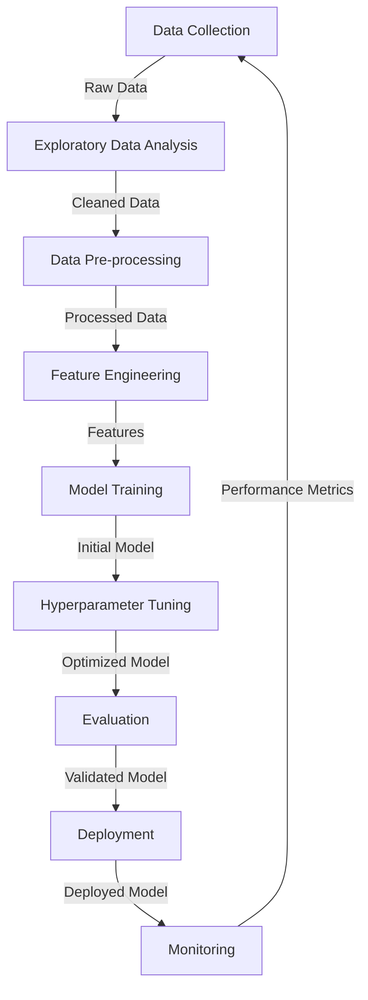

## 1.3 The ML Development Lifecycle

Understanding the machine learning (ML) development lifecycle is essential for leveraging AI effectively in business environments. This knowledge enables professionals to confidently oversee AI projects, communicate with technical teams, and make data-driven decisions about AI initiatives. The ML development lifecycle consists of interconnected stages from data collection to model deployment and monitoring.[^400] Mastering this process helps organizations streamline AI implementation, reduce time-to-market, and maximize return on investment from AI projects.

The following sections explore the ML development lifecycle with a focus on practical business applications and how AWS services support each stage. This understanding will prepare you for the AWS Certified AI Practitioner exam while equipping you with knowledge to drive AI innovation within your organization.

### Components of an ML Pipeline

ML pipelines form the foundation of AI projects, comprising several critical stages that transform raw data into valuable business insights. A clear understanding of these components enables effective management of ML projects and facilitates productive communication with data science teams.

*Figure 1.3.1: ML Pipeline Components. This diagram illustrates the key stages of the ML development lifecycle, showing the flow from data collection to model monitoring and the iterative nature of the process.*

1. **Data Collection**: High-quality, relevant data forms the foundation of successful ML projects. This stage involves gathering data from diverse sources such as customer interactions, IoT devices, or third-party datasets. For example, an e-commerce company might collect user browsing history, purchase data, and product information to build a recommendation system.[^401]

2. **Exploratory Data Analysis (EDA)**: Data scientists examine collected data to understand patterns, identify anomalies, and formulate initial hypotheses during this crucial step. EDA guides subsequent pipeline stages and informs data preparation decisions. Tools like Amazon SageMaker Studio provide interactive notebooks for performing efficient EDA.[^402]

3. **Data Pre-processing**: Raw data typically contains inconsistencies, missing values, or irrelevant information that must be addressed. Pre-processing involves cleaning data, handling missing values, and transforming it into a suitable format for ML algorithms. Amazon SageMaker Data Wrangler offers a visual interface for collaborative data preparation tasks.[^403]

4. **Feature Engineering**: This stage involves creating new machine learning features or transforming existing ones to enhance model performance. For instance, a customer churn prediction model might benefit from a feature representing total customer spending over the past year. Amazon SageMaker Feature Store allows teams to create, share, and manage features across different ML projects.[^404]

5. **Model Training**: With prepared data and engineered features, the next step involves training the ML model by selecting an appropriate algorithm and using training data to teach the model to make predictions. Amazon SageMaker provides numerous built-in algorithms while supporting custom algorithms for flexible model development.[^405]

6. **Hyperparameter Tuning**: ML models contain hyperparameters that control their behavior and significantly impact performance. Amazon SageMaker Automatic Model Tuning employs advanced techniques like Bayesian optimization to automatically identify optimal hyperparameter configurations.[^406]

7. **Evaluation**: Before deployment, model performance must be assessed using various metrics. This stage involves testing the model on separate datasets to ensure it generalizes well to new, unseen data. Amazon SageMaker Model Monitor helps evaluate model performance over time.[^407]

8. **Deployment**: Once a model meets performance requirements, it's deployed to a production environment where it can generate predictions on real-world data. Amazon SageMaker offers multiple deployment options, including real-time inference endpoints and batch transform jobs.[^408]

9. **Monitoring**: Post-deployment, continuous monitoring ensures the model maintains performance over time. This involves tracking metrics and retraining when necessary. Amazon SageMaker Model Monitor automates detection of concept drift and data quality issues.[^409]

Understanding these components helps business professionals effectively oversee ML projects, allocate resources appropriately, set realistic expectations, and communicate more effectively with data science teams throughout the AI development process.

### Sources of ML Models

When initiating an ML project, organizations can obtain models from several sources. Understanding these options helps decision-makers develop effective model strategies and optimize resource allocation.

1. **Open Source Pre-trained Models**: These models have been trained on large datasets and made freely available to the public, offering several advantages:

   - Reduced development time and cost
   - Access to state-of-the-art architectures
   - Community support and continuous improvements

   For example, BERT (Bidirectional Encoder Representations from Transformers) is a popular open-source model for natural language processing tasks. Using Amazon SageMaker, you can easily deploy and fine-tune BERT for specific use cases like sentiment analysis or text classification.[^410]

2. **Training Custom Models**: This approach involves developing models from scratch or fine-tuning existing models for specific business needs. Benefits include:

   - Tailored solutions for unique business problems
   - Greater control over model behavior and performance
   - Potential for competitive advantage through proprietary algorithms

   Amazon SageMaker provides a comprehensive environment for training custom models, from data preparation to deployment and monitoring.[^411]

3. **AWS Pre-trained AI Services**: AWS offers a range of AI services with pre-trained models that can be easily integrated into applications. These include:

   - Amazon Rekognition for image and video analysis
   - Amazon Comprehend for natural language processing
   - Amazon Forecast for time-series forecasting

   These services provide quick solutions for common AI tasks without the need for extensive ML expertise.[^412]

4. **Transfer Learning**: This technique involves using a pre-trained model as a starting point and fine-tuning it for a specific task. It combines the benefits of pre-trained models with customization for specific use cases. Amazon SageMaker supports transfer learning, allowing organizations to leverage existing models while adapting them to their unique requirements.[^413]

The choice between these sources depends on factors such as the specific business problem, available resources, required level of customization, and time-to-market considerations. For instance, a startup looking to quickly implement a chatbot might opt for Amazon Lex, while a large enterprise developing a complex fraud detection system might choose to train a custom model using Amazon SageMaker.

### Methods to Use a Model in Production

Deploying ML models to production environments is a critical step in generating business value from AI investments. Several deployment methods exist, each with distinct advantages and considerations.

1. **Managed API Services**: This approach involves deploying models as managed API endpoints that integrate easily with existing applications. AWS offers several services for this purpose:

   - Amazon SageMaker Endpoints: Provides real-time inference with automatic scaling and load balancing.
   - Amazon Bedrock: Offers API access to foundation models for generative AI applications.[^414]

   Benefits of managed API services include:
   - Simplified deployment and management
   - Automatic scaling to handle varying loads
   - Built-in monitoring and logging capabilities

2. **Self-hosted API**: Organizations with specific requirements or existing infrastructure may prefer self-hosting model APIs using:

   - Amazon EC2 instances with Docker containers
   - Amazon ECS (Elastic Container Service) for container orchestration
   - Amazon EKS (Elastic Kubernetes Service) for Kubernetes-based deployments[^415]

   Self-hosting offers:
   - Greater control over the deployment environment
   - Ability to customize the API interface and functionality
   - Potential for cost optimization in high-volume scenarios

3. **Batch Inference**: For use cases without real-time prediction requirements, batch inference provides an efficient option. Amazon SageMaker Batch Transform processes large datasets in batches, suitable for scenarios like:

   - Generating product recommendations for an e-commerce catalog
   - Scoring credit risk for a large portfolio of loans
   - Analyzing sentiment for a backlog of customer reviews[^416]

4. **Edge Deployment**: Applications requiring low-latency inference or operating with limited connectivity benefit from edge device deployment. AWS IoT Greengrass enables ML inference on edge devices, supporting use cases such as:

   - Predictive maintenance in industrial settings
   - Real-time video analysis for security systems
   - Autonomous vehicle decision-making
   - Smart home device intelligence

   Edge deployment is particularly valuable when immediate decisions are needed without cloud dependency or when connectivity is intermittent. AWS provides optimized solutions for deploying models to various edge devices while maintaining performance.[^417]

5. **Embedded Models**: Some applications benefit from ML models embedded directly into applications or devices, suitable for:

   - Mobile apps requiring offline functionality
   - IoT devices with limited processing power
   - Applications with strict privacy requirements

   AWS services like Amazon SageMaker Neo optimize models for deployment on various hardware platforms, ensuring efficient execution in resource-constrained environments.[^418]

The selection of deployment method depends on factors such as latency requirements, inference volume, available infrastructure, data privacy considerations, and integration with existing systems. For example, a financial services company might use Amazon SageMaker Endpoints for real-time fraud detection during transactions while employing batch inference for monthly risk assessments of its entire customer base.

### AWS Services for ML Pipeline Stages

AWS provides comprehensive services supporting each ML pipeline stage, enabling organizations to build, train, and deploy ML models efficiently. Understanding these services helps organizations effectively leverage AWS's AI/ML capabilities and optimize their ML development lifecycle.

*Table 1.3.1: AWS Services for ML Pipeline Stages*

| Pipeline Stage | AWS Service | Key Features |
|----------------|-------------|--------------|
| Data Collection | Amazon S3 | Scalable object storage for datasets |
| | AWS Glue | ETL service for data preparation |
| Exploratory Data Analysis | Amazon SageMaker Studio | Interactive notebooks for data exploration |
| | Amazon QuickSight | Business intelligence tool for data visualization |
| Data Pre-processing | Amazon SageMaker Data Wrangler | Visual interface for data preparation |
| | AWS Glue DataBrew | Visual data preparation tool |
| Feature Engineering | Amazon SageMaker Feature Store | Centralized repository for feature management |
| | Amazon SageMaker Processing | Distributed data processing for feature creation |
| Model Training | Amazon SageMaker Training | Managed environment for model training |
| | Amazon EC2 | Customizable compute instances for training |
| Hyperparameter Tuning | Amazon SageMaker Automatic Model Tuning | Automated hyperparameter optimization |
| Evaluation | Amazon SageMaker Model Monitor | Automated model evaluation and monitoring |
| | Amazon CloudWatch | Metrics and logging for model performance |
| Deployment | Amazon SageMaker Endpoints | Real-time inference endpoints |
| | Amazon SageMaker Batch Transform | Batch inference for large datasets |
| Monitoring | Amazon SageMaker Model Monitor | Continuous monitoring of deployed models |
| | AWS Lambda | Serverless functions for custom monitoring logic |

Key AWS services supporting the ML pipeline include:

1. **Data Collection and Storage**: Amazon S3 provides scalable, secure storage for large datasets, while AWS Glue offers ETL capabilities to prepare data for analysis.[^419]

2. **Exploratory Data Analysis**: Amazon SageMaker Studio provides Jupyter notebooks for interactive data exploration, while Amazon QuickSight enables creation of interactive dashboards for data visualization.[^420]

3. **Data Pre-processing**: Amazon SageMaker Data Wrangler offers a visual interface for data cleaning and transformation, streamlining data preparation for ML models.[^421]

4. **Feature Engineering**: Amazon SageMaker Feature Store allows teams to create, store, and share features across ML projects, promoting consistency and reducing duplication.[^422]

5. **Model Training**: Amazon SageMaker Training provides a managed environment for ML model training, supporting numerous algorithms and frameworks.[^423]

6. **Hyperparameter Tuning**: Amazon SageMaker Automatic Model Tuning uses advanced techniques to optimize hyperparameters, improving model performance while saving time.[^424]

7. **Evaluation**: Amazon SageMaker Model Monitor enables continuous evaluation of model performance, detecting issues like data drift or model degradation.[^425]

8. **Deployment**: Amazon SageMaker Endpoints offer scalable, real-time inference capabilities, while Amazon SageMaker Batch Transform supports high-volume batch predictions.[^426]

9. **Monitoring**: Amazon SageMaker Model Monitor, along with Amazon CloudWatch, provides comprehensive monitoring of deployed models, ensuring continued performance in production.[^427]

By leveraging these AWS services, organizations can streamline ML development, reduce time-to-market for AI solutions, and ensure ongoing effectiveness of their ML models. For example, a retail company could use Amazon S3 to store customer transaction data, Amazon SageMaker Data Wrangler to clean and prepare the data, Amazon SageMaker Feature Store to create customer behavior features, and Amazon SageMaker to train and deploy a personalized recommendation model.

### Fundamental Concepts of MLOps

**MLOps** (Machine Learning Operations) combines Machine Learning, DevOps, and Data Engineering to streamline and automate the end-to-end ML lifecycle. Organizations looking to scale AI initiatives effectively and maintain high-quality production models need a solid understanding of MLOps principles.[^428]

Key MLOps concepts include:

1. **Experimentation**: Systematic experimentation forms the foundation of effective model development through:
   - Version control for data, code, and models
   - Reproducible experiments ensuring consistency
   - A/B testing for model version comparison

   Amazon SageMaker Experiments helps track and organize machine learning experiments, making it easier to reproduce results and compare different approaches.[^429]

2. **Repeatable Processes**: Standardized ML workflows ensure consistency and reduce errors through:
   - Automated data preparation pipelines
   - Standardized model training procedures
   - Consistent evaluation metrics

   AWS Step Functions creates repeatable, automated ML workflows that integrate various AWS services.[^430]

3. **Scalable Systems**: As ML projects grow, scalability becomes essential through:
   - Distributed training for large datasets
   - Elastic inference to handle varying prediction loads
   - Auto-scaling infrastructure to optimize costs

   Amazon SageMaker supports distributed training and provides auto-scaling inference endpoints to handle varying workloads efficiently.[^431]

4. **Managing Technical Debt**: MLOps reduces technical debt in ML systems by:
   - Implementing modular, reusable code
   - Maintaining comprehensive documentation
   - Regular refactoring and optimization of ML pipelines

   Tools like AWS CodeCommit and AWS CodePipeline help manage code versions and automate deployment processes, reducing technical debt.[^432]

5. **Achieving Production Readiness**: Ensuring ML models are production-ready involves:
   - Rigorous testing and validation
   - Performance optimization
   - Security and compliance checks

   Amazon SageMaker Edge Manager helps optimize models for deployment on edge devices, ensuring they meet performance requirements in production environments.[^433]

6. **Model Monitoring**: Continuous monitoring of deployed models maintains effectiveness through:
   - Tracking prediction accuracy
   - Detecting data drift
   - Monitoring system performance

   Amazon SageMaker Model Monitor provides tools for automated monitoring of model accuracy, data quality, and bias drift.[^434]

7. **Model Re-training**: As data patterns evolve, models require updates through:
   - Automated triggers for model retraining
   - Version control for model iterations
   - Smooth rollout of updated models

   Amazon SageMaker Pipelines enables creation of automated CI/CD pipelines for ML models, facilitating regular retraining and deployment.[^435]

Implementing MLOps practices delivers significant organizational benefits:

- Faster time-to-market for ML projects
- Improved model quality and reliability
- Reduced operational costs through automation
- Enhanced collaboration between data science and IT teams
- Better governance and compliance in AI initiatives

For example, a financial services company implementing MLOps might use Amazon SageMaker Pipelines to create an automated workflow for their credit scoring model. This workflow could include daily data updates, automated retraining when performance drops below a threshold, and staged deployment of new model versions—ensuring model accuracy and regulatory compliance while minimizing manual intervention and error risk.

### Model Performance and Business Metrics

Evaluating ML model success requires examining both technical performance metrics and business impact metrics. Business professionals need to understand both perspectives to make informed AI investment decisions and effectively communicate value to stakeholders.

#### Model Performance Metrics

These technical metrics assess model accuracy and effectiveness:

1. **Accuracy**: The proportion of correct predictions among total cases examined. While intuitive, accuracy can be misleading with imbalanced datasets.[^436]

2. **Area Under the ROC Curve (AUC)**: Measures a model's ability to distinguish between classes. An AUC of 1.0 indicates perfect classification, while 0.5 suggests random guessing. Receiver Operating Characteristic (ROC) curve is a graphical representation of preformance of classification models across different threshold settings. [^437]

3. **F1 Score**: The harmonic mean of precision and recall, providing a balanced performance measure especially useful for imbalanced datasets.[^438]

4. **Mean Absolute Error (MAE)** and **Root Mean Square Error (RMSE)**: Used for regression problems to measure average prediction error magnitude.[^439]

5. **Confusion Matrix**: A table showing true positives, true negatives, false positives, and false negatives, providing comprehensive classification performance insights.[^440]

It is not required to memorize all these performance metrics for the exam. Amazon SageMaker provides built-in capabilities to calculate these metrics during model evaluation, facilitating model performance assessment and comparison.[^441]

#### Business Metrics

These metrics translate model performance into tangible business value:

1. **Cost per User**: The operational cost of running the ML model per user or transaction, helping assess model efficiency and scalability.

2. **Development Costs**: Total investment in developing and deploying the ML model, including data acquisition, infrastructure, and personnel costs.

3. **Customer Feedback**: Qualitative and quantitative feedback from users interacting with ML-powered features, measured through Net Promoter Score (NPS) or customer satisfaction surveys.

4. **Return on Investment (ROI)**: Financial returns generated by the ML model relative to its cost, typically calculated over a specific timeframe.

5. **Time-to-Market**: Duration from project initiation to deployment, often reduced through effective AWS services and MLOps practices.

6. **Operational Efficiency**: Improvements in process speed, resource utilization, or error reduction attributed to the ML model.

7. **Revenue Impact**: Direct or indirect revenue increases from the ML model, such as improved customer retention or increased sales through personalized recommendations.

Aligning these metrics with specific business objectives is crucial for effective evaluation:

*Table 1.3.2: Aligning ML Metrics with Business Objectives*

| Business Objective | Model Performance Metric | Business Metric |
|--------------------|--------------------------|-----------------|
| Reduce Customer Churn | AUC for churn prediction | Customer Retention Rate |
| Increase Sales | Accuracy of recommendation system | Average Order Value |
| Improve Fraud Detection | F1 Score for fraud classification | Fraud-related Losses |
| Enhance Customer Support | Accuracy of query classification | Customer Satisfaction Score |
| Optimize Inventory | RMSE of demand forecasting | Inventory Turnover Rate |

When presenting ML project results to stakeholders, translate technical metrics into business impact:

- "Our customer churn prediction model achieved an AUC of 0.85, which translated to a 15% reduction in customer churn rate, saving an estimated $500,000 in annual revenue."
- "The new product recommendation system improved accuracy by 20%, leading to a 10% increase in average order value and generating an additional $2 million in quarterly revenue."

Amazon SageMaker MLOps tools help continuously monitor both technical and business metrics, enabling organizations to:

- Detect performance degradation early and trigger model retraining
- Assess ongoing business impact of deployed models
- Make data-driven decisions about model updates or replacements
- Justify AI investments with clear, measurable outcomes

By effectively using both model performance and business metrics, organizations ensure ML initiatives remain aligned with business goals, demonstrate tangible value, and drive continuous improvement in AI-powered solutions.

### Questions for self-check

1. **A retail company wants to implement a machine learning solution for inventory management. Which stage of the ML development lifecycle would involve creating new features from existing data, such as calculating the average sales velocity for each product?**

   A. Data Collection
   B. Exploratory Data Analysis
   C. Feature Engineering
   D. Model Training

2. **An insurance company has deployed a fraud detection model using Amazon SageMaker Endpoints. Which AWS service should they use to continuously monitor the model's performance and detect data drift in production?**

   A. Amazon CloudWatch
   B. AWS Lambda
   C. Amazon SageMaker Model Monitor
   D. Amazon QuickSight

3. **A data scientist is preparing to train a machine learning model for predicting customer churn. Which of the following metrics would be most appropriate for evaluating the model's performance in this scenario?**

   A. Mean Absolute Error (MAE)
   B. Area Under the ROC Curve (AUC)
   C. Root Mean Square Error (RMSE)
   D. Perplexity

4. **A financial services company wants to implement MLOps practices to streamline their ML development process. Which of the following is NOT a key concept of MLOps?**

   A. Experimentation with version control for data, code, and models
   B. Manual intervention for each model deployment to ensure quality
   C. Continuous monitoring of deployed models
   D. Automated triggers for model retraining

5. **An e-commerce company has implemented a product recommendation system using machine learning. Which of the following metrics would best demonstrate the business impact of this ML model to stakeholders?**

   A. F1 Score of the model
   B. Time-to-Market for model deployment
   C. Average Order Value increase
   D. Number of features used in the model

### Answers and Explanations

1. **Correct answer: C. Feature Engineering**

   Explanation: Feature Engineering is the stage in the ML development lifecycle where new features are created from existing data to improve model performance. In this scenario, calculating the average sales velocity for each product is an example of feature engineering. This process involves transforming raw data into more meaningful representations that can help the model better understand patterns in inventory management.[^442]

2. **Correct answer: C. Amazon SageMaker Model Monitor**

   Explanation: Amazon SageMaker Model Monitor is specifically designed for continuous monitoring of deployed models, including detection of data drift and model performance degradation. While Amazon CloudWatch can be used for general monitoring and AWS Lambda for custom logic, SageMaker Model Monitor provides built-in capabilities for ML-specific monitoring tasks, making it the most appropriate choice for this scenario.[^443]

3. **Correct answer: B. Area Under the ROC Curve (AUC)**

   Explanation: For a customer churn prediction model, which is a binary classification problem, the Area Under the ROC Curve (AUC) is a highly appropriate metric. AUC measures the model's ability to distinguish between classes (in this case, churning and non-churning customers) across various thresholds. It's particularly useful for imbalanced datasets, which are common in churn prediction scenarios. MAE and RMSE are more suitable for regression problems, while perplexity is typically used in natural language processing tasks.[^444]

4. **Correct answer: B. Manual intervention for each model deployment to ensure quality**

   Explanation: MLOps practices aim to automate and streamline the ML lifecycle, including model deployment. Manual intervention for each deployment goes against the principles of MLOps, which emphasizes automation, repeatability, and scalability. The other options (experimentation with version control, continuous monitoring, and automated triggers for retraining) are all key concepts of MLOps that help in managing ML projects more efficiently and effectively.[^445]

5. **Correct answer: C. Average Order Value increase**

   Explanation: When demonstrating the business impact of an ML model to stakeholders, it's crucial to use metrics that directly relate to business outcomes. An increase in Average Order Value is a clear business metric that shows how the recommendation system is driving more sales. While the F1 Score is important for model performance, it doesn't directly translate to business value. Time-to-Market is relevant but doesn't show ongoing impact, and the number of features used is a technical detail that doesn't demonstrate business value.[^446]

[^400]: Machine Learning Lifecycle Overview. URL: <https://docs.aws.amazon.com/wellarchitected/latest/machine-learning-lens/well-architected-machine-learning-lifecycle.html>
[^401]: Data Collection in Machine Learning. URL: <https://aws.amazon.com/blogs/machine-learning/building-automating-managing-and-scaling-ml-workflows-using-amazon-sagemaker-pipelines/>
[^402]: Amazon SageMaker Studio for EDA. URL: <https://docs.aws.amazon.com/sagemaker/latest/dg/studio.html>
[^403]: Amazon SageMaker Data Wrangler. URL: <https://aws.amazon.com/sagemaker/data-wrangler/>
[^404]: Amazon SageMaker Feature Store. URL: <https://aws.amazon.com/sagemaker/feature-store/>
[^405]: Amazon SageMaker Training. URL: <https://docs.aws.amazon.com/sagemaker/latest/dg/train-model.html>
[^406]: Amazon SageMaker Automatic Model Tuning. URL: <https://docs.aws.amazon.com/sagemaker/latest/dg/automatic-model-tuning.html>
[^407]: Amazon SageMaker Model Monitor. URL: <https://docs.aws.amazon.com/sagemaker/latest/dg/model-monitor.html>
[^408]: Amazon SageMaker Deployment Options. URL: <https://docs.aws.amazon.com/sagemaker/latest/dg/deploy-model.html>
[^409]: Amazon SageMaker Model Monitor for Continuous Monitoring. URL: <https://aws.amazon.com/sagemaker/model-monitor/>
[^410]: Using BERT with Amazon SageMaker. URL: <https://aws.amazon.com/blogs/machine-learning/fine-tuning-a-pytorch-bert-model-and-deploying-it-with-amazon-elastic-inference-on-amazon-sagemaker/>
[^411]: Training Custom Models with Amazon SageMaker. URL: <https://docs.aws.amazon.com/sagemaker/latest/dg/train-model.html>
[^412]: AWS Pre-trained AI Services. URL: <https://aws.amazon.com/machine-learning/ai-services/>
[^413]: Transfer Learning with Amazon SageMaker. URL: <https://aws.amazon.com/blogs/machine-learning/amazon-sagemaker-ground-truth-using-a-pre-trained-model-for-faster-data-labeling/>
[^414]: Amazon Bedrock for Generative AI. URL: <https://aws.amazon.com/bedrock/>
[^415]: Self-hosting ML Models on AWS. URL: <https://docs.aws.amazon.com/sagemaker/latest/dg/deploy-model.html>
[^416]: Amazon SageMaker Batch Transform. URL: <https://docs.aws.amazon.com/sagemaker/latest/dg/batch-transform.html>
[^417]: AWS IoT Greengrass for Edge ML. URL: <https://aws.amazon.com/greengrass/>
[^418]: Amazon SageMaker Neo for Model Optimization. URL: <https://aws.amazon.com/sagemaker/neo/>
[^419]: Amazon S3 and AWS Glue for Data Storage and ETL. URL: <https://aws.amazon.com/blogs/big-data/build-a-data-lake-foundation-with-aws-glue-and-amazon-s3/>
[^420]: Amazon SageMaker Studio and Amazon QuickSight for Data Exploration. URL: <https://docs.aws.amazon.com/quicksight/latest/user/sagemaker-integration.html>
[^421]: Amazon SageMaker Data Wrangler for Data Preparation. URL: <https://aws.amazon.com/sagemaker/data-wrangler/>
[^422]: Amazon SageMaker Feature Store Overview. URL: <https://aws.amazon.com/sagemaker/feature-store/>
[^423]: Amazon SageMaker Training Capabilities. URL: <https://docs.aws.amazon.com/sagemaker/latest/dg/train-model.html>
[^424]: Amazon SageMaker Automatic Model Tuning. URL: <https://docs.aws.amazon.com/sagemaker/latest/dg/automatic-model-tuning.html>
[^425]: Amazon SageMaker Model Monitor for Evaluation. URL: <https://docs.aws.amazon.com/sagemaker/latest/dg/model-monitor.html>
[^426]: Amazon SageMaker Deployment Options. URL: <https://docs.aws.amazon.com/sagemaker/latest/dg/deploy-model.html>
[^427]: Amazon SageMaker Model Monitor and CloudWatch Integration. URL: <https://docs.aws.amazon.com/sagemaker/latest/dg/model-monitor.html>
[^428]: MLOps Overview. URL: <https://aws.amazon.com/blogs/machine-learning/mlops-foundation-roadmap-for-enterprises-with-amazon-sagemaker/>
[^429]: Amazon SageMaker Experiments. URL: <https://docs.aws.amazon.com/sagemaker/latest/dg/experiments.html>
[^430]: AWS Step Functions for ML Workflows. URL: <https://docs.aws.amazon.com/step-functions/latest/dg/use-cases.html>
[^431]: Amazon SageMaker Distributed Training. URL: <https://docs.aws.amazon.com/sagemaker/latest/dg/distributed-training.html>
[^432]: AWS CodeCommit and CodePipeline for ML Version Control. URL: <https://aws.amazon.com/blogs/machine-learning/building-machine-learning-workflows-with-amazon-sagemaker-processing-jobs-and-aws-step-functions/>
[^433]: Amazon SageMaker Edge Manager. URL: <https://aws.amazon.com/sagemaker/edge-manager/>
[^434]: Amazon SageMaker Model Monitor Features. URL: <https://docs.aws.amazon.com/sagemaker/latest/dg/model-monitor.html>
[^435]: Amazon SageMaker Pipelines for ML CI/CD. URL: <https://aws.amazon.com/sagemaker/pipelines/>
[^436]: Accuracy Metric in ML. URL: <https://scikit-learn.org/stable/modules/generated/sklearn.metrics.accuracy_score.html>
[^437]: AUC-ROC Curve Explanation. URL: <https://developers.google.com/machine-learning/crash-course/classification/roc-and-auc>
[^438]: ML model metrics in Amazon SageMaker <https://docs.aws.amazon.com/sagemaker/latest/dg/autopilot-metrics-validation.html>
[^439]: Multiclass Model Insights: <https://docs.aws.amazon.com/machine-learning/latest/dg/multiclass-model-insights.html>
[^440]: Confusion Matrix definition: <https://docs.aws.amazon.com/glue/latest/dg/machine-learning-terminology.html>
[^441]: Amazon SageMaker model metrics: <https://docs.aws.amazon.com/sagemaker/latest/dg/autopilot-metrics-validation.html> 
[^442]: Feature engineering in machine learning: <https://docs.aws.amazon.com/wellarchitected/latest/machine-learning-lens/feature-engineering.html>
[^443]: Amazon SageMaker Model Monitor: <https://docs.aws.amazon.com/sagemaker/latest/dg/model-monitor.html>
[^444]: Area Under the ROC Curve (AUC) explanation: <https://en.wikipedia.org/wiki/Receiver_operating_characteristic>
[^445]: MLOps principles and practices: <https://aws.amazon.com/what-is/mlops/>
[^446]: Business metrics for ML models: <https://aws.amazon.com/machine-learning/ml-use-cases/business-metrics-analysis/>

