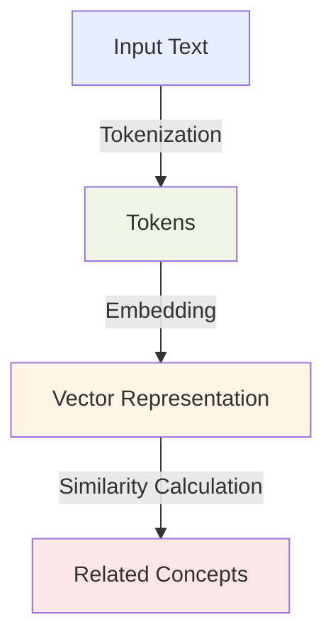
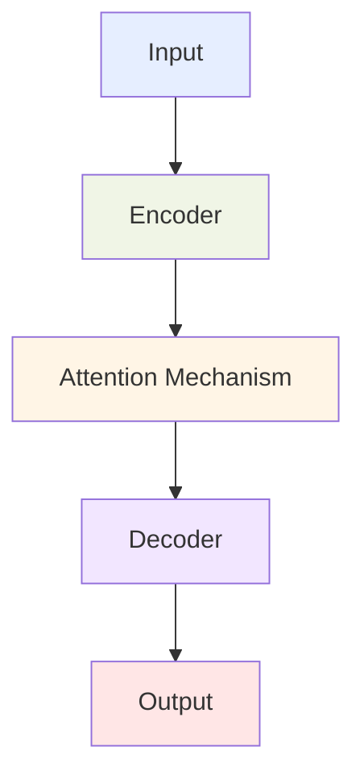
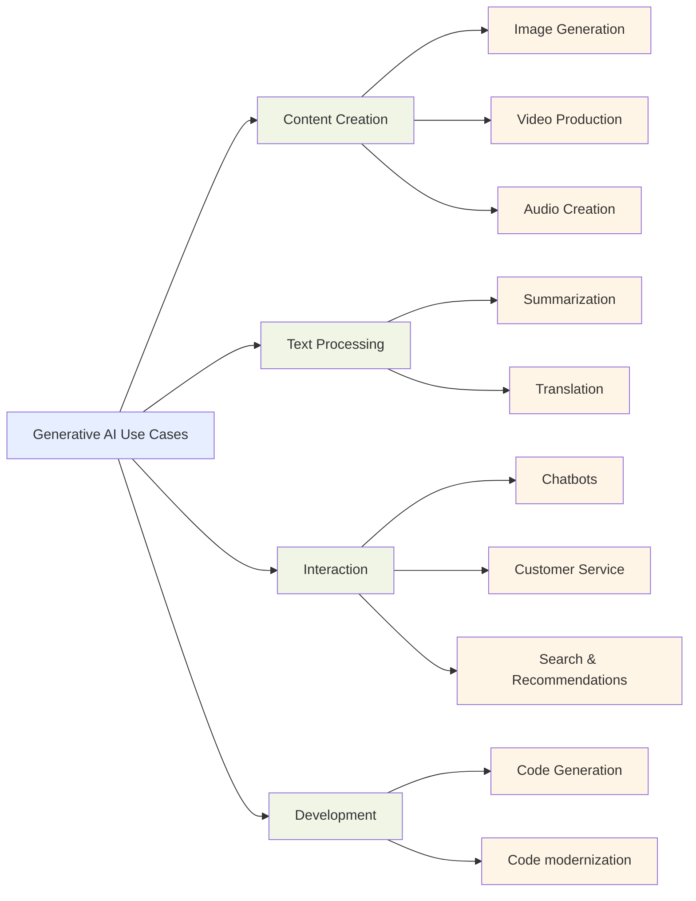
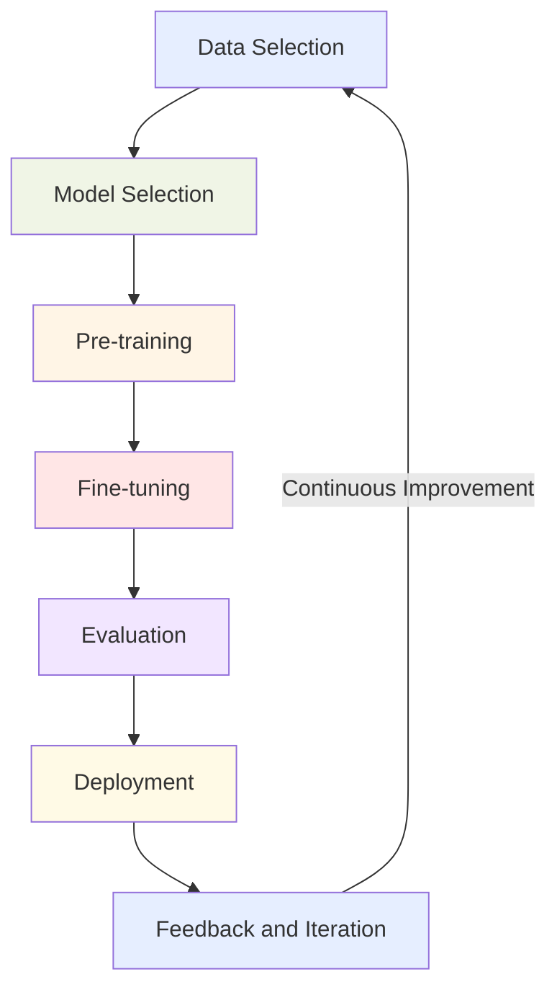

## 2.1 Basic concepts of generative AI

Generative AI transforms how businesses solve problems, foster creativity, and make decisions. This powerful technology creates new content, understands complex relationships, and automates tasks that once required significant human effort. Understanding these foundations is essential for anyone taking the AWS Certified AI Practitioner exam and professionals seeking to leverage AI in their organizations.

This subchapter explores generative AI's core concepts, practical applications, and the lifecycle of foundation models. Whether you're evaluating AI solutions or planning implementations, these insights will help you identify opportunities where generative AI can address business challenges and create value.

### Understanding foundational generative AI concepts

Generative AI systems combine several key technologies to create new content and solve complex problems. Let's examine the essential components that power these systems:

1. **Tokens and Chunking**

Tokens are the fundamental building blocks that generative AI models process. They can be words, word fragments, or characters, depending on the model's design. Chunking is the process of breaking down input text into these manageable tokens.[^200]

For example, the sentence "AWS is a cloud computing platform" might be tokenized as:
["AWS", "is", "a", "cloud", "comput", "ing", "platform"]. In reality tokenization also split longer words into smaller subwords, so in English, one word is roughly 1.3 tokens, in Chinese it is about 2.5 tokens, while in Arabic it's can be even 4 tokens. 

Understanding tokenization is crucial for businesses working with large language models (LLMs) as it affects model performance, cost (often based on token count), and the ability to handle different languages or specialized vocabularies.

2. **Embeddings and Vectors**

Embeddings are dense vector representations of tokens, words, or entire documents. These numerical representations capture *semantic meanings*, allowing AI models to understand relationships between different pieces of text. For example, questions "How old are you?" and "What is your age?" have the same semantic meaning, while don't have any common word. [^201]

*Figure 2.1.1: Embedding Process in Generative AI. This diagram illustrates the process of converting input text into vector representations, which are then used to find related concepts or perform other AI tasks.*

In a business context, embeddings enable powerful applications such as semantic search, where users can find information based on meaning rather than exact keyword matches. For instance, a customer support system using embeddings could understand that a query about "refund policy" is related to "return procedures" even if those exact words aren't used.

3. **Prompt Engineering**

Prompt engineering is the art and science of crafting input prompts to elicit desired outputs from generative AI models. It involves designing clear, specific instructions that guide the model to produce the most relevant and accurate responses.[^202]

For business professionals, effective prompt engineering can significantly enhance the value derived from generative AI tools. For example, when using Amazon Bedrock to generate marketing copy, a well-crafted prompt might include specific brand guidelines, target audience information, good and bad examples, and desired tone, resulting in more tailored and effective content generation.[^203]

4. **Transformer-based LLMs**

Transformer-based Large Language Models (LLMs) are the powerhouse behind many generative AI applications. These models use a neural network architecture called the Transformer, which allows them to process and generate human-like text with remarkable accuracy.[^204]

*Figure 2.1.2: Simplified Transformer Architecture. This diagram shows the basic components of a Transformer model, highlighting the key elements that enable its powerful language understanding and generation capabilities.*

Transformer-based LLMs have revolutionized natural language processing tasks, enabling more sophisticated chatbots, content generation systems, and language translation services. For businesses, this means more natural and context-aware interactions with customers, improved content creation workflows, and enhanced multilingual capabilities.

5. **Foundation Models**

Foundation models are large-scale AI models trained on vast amounts of data, capable of performing a wide range of tasks without task-specific training. These models serve as a starting point for many AI applications and can be fine-tuned for specific use cases.[^205]

In the AWS ecosystem, Amazon Bedrock provides access to various foundation models from leading AI companies, allowing businesses to leverage these powerful models without the need for extensive in-house AI expertise or infrastructure.[^206]

6. **Multi-modal Models**

Multi-modal models can process and generate content across different types of data, such as text, images, and audio. These models enable more comprehensive AI applications that can understand and create diverse forms of content.[^207]

For businesses, multi-modal models open up new possibilities in areas like:
- Enhanced product recommendations combining visual and textual data
- Improved accessibility features that can translate between text, speech, and images
- More sophisticated content moderation systems that can analyze both text and images

7. **Diffusion Models**

Diffusion models are a class of generative models particularly effective in image generation tasks. They work by gradually adding noise to data and then learning to reverse this process, allowing for the creation of high-quality, diverse images.[^208]

*Figure 2.1.3: Simplified Diffusion Model Process. This diagram illustrates the basic concept of diffusion models, where random noise is gradually transformed into a coherent image through a series of denoising steps.*

In a business context, diffusion models can be used for:
- Generating product images for e-commerce platforms
- Creating realistic 3D models for virtual reality applications
- Producing concept art for marketing campaigns or product design

Understanding these foundational concepts is crucial for business professionals looking to leverage generative AI effectively. By grasping these principles, you'll be better equipped to identify potential applications, communicate with technical teams, and make informed decisions about implementing generative AI solutions in your organization.

### Identify potential use cases for generative AI models

Generative AI models create new opportunities across industries by automating creative tasks, enhancing decision-making, and improving customer experiences. Recognizing these applications helps businesses identify where AI can drive the most value in their specific context. Here are key use cases that demonstrate generative AI's potential:

1. **Image, Video, and Audio Generation**

Generative AI has revolutionized content creation by enabling the production of high-quality visual and audio content. Some key applications include:

- **Product Visualization**: E-commerce businesses can use AI to generate realistic product images in various settings or colors, reducing the need for expensive photo shoots.
- **Video Production**: AI can create animated videos, visual effects, or even entire scenes, streamlining the video production process for marketing and entertainment industries.
- **Music and Sound Design**: Generative models can compose original music or create sound effects, assisting in content creation for games, films, and advertising.

2. **Summarization**

AI-powered summarization tools can distill large volumes of text into concise, coherent summaries. This capability is valuable for:

- **Business Intelligence**: Quickly summarizing market reports, competitor analyses, or customer feedback to support decision-making.
- **Legal Document Review**: Summarizing lengthy legal documents to highlight key points and save time for legal professionals.
- **News Aggregation**: Creating brief summaries of news articles to keep employees or customers informed about relevant industry developments.

3. **Chatbots and Virtual Assistants**

Advanced chatbots powered by generative AI can engage in more natural, context-aware conversations. Applications include:

- **Customer Support**: Providing 24/7 assistance for common queries, reducing the workload on human support teams.
- **Sales and Lead Generation**: Engaging potential customers, answering product questions, and qualifying leads.
- **Internal Help Desks**: Assisting employees with IT issues, HR queries, or company policy questions.

4. **Translation**

Generative AI has significantly improved machine translation, enabling more accurate and context-aware language translations. This is particularly useful for:

- **Global Business Communication**: Facilitating communication with international clients or partners.
- **Content Localization**: Quickly adapting marketing materials, product descriptions, or user manuals for different markets.
- **Real-time Interpretation**: Providing instant translation services for international conferences or meetings.

5. **Code Generation**

AI models can assist in software development by generating code snippets, completing partial code, or even creating entire functions. This can be applied in:

- **Accelerated Development**: Speeding up the coding process by suggesting completions or generating boilerplate code.
- **Code Refactoring**: Assisting developers in improving existing code by suggesting optimizations or alternative implementations.
- **Learning and Training**: Helping novice programmers learn coding practices by providing examples and explanations.

6. **Customer Service Agents**

AI-powered customer service agents can handle a wide range of customer interactions, offering:

- **Personalized Assistance**: Providing tailored product recommendations or support based on customer history and preferences.
- **Multilingual Support**: Offering customer service in multiple languages without the need for a large multilingual staff.
- **Scalable Support**: Handling high volumes of customer inquiries during peak times without long wait times.

7. **Search and Recommendation Engines**

Generative AI can enhance search functionality and recommendation systems by:

- **Semantic Search**: Understanding the intent behind user queries to provide more relevant results.
- **Personalized Recommendations**: Generating tailored product or content recommendations based on user behavior and preferences.
- **Content Discovery**: Helping users find relevant information or products they might not have explicitly searched for.

*Figure 2.1.4: Generative AI Use Cases. This diagram illustrates the diverse applications of generative AI across various business functions, highlighting the potential for innovation and efficiency improvements.*

By understanding these use cases, business professionals can identify opportunities to leverage generative AI in their own organizations. Whether it's improving customer interactions, streamlining content creation, or enhancing decision-making processes, generative AI has the potential to drive significant value across various business functions.

### Describe the foundation model lifecycle

Foundation models power modern AI applications through a structured development and deployment process. From initial data selection to ongoing improvements, each stage requires careful consideration to ensure the resulting AI solution meets business needs while remaining ethical and effective. Understanding this lifecycle helps organizations plan resources, set expectations, and maximize the value of their AI investments.

1. **Data Selection**

The first step in creating a foundation model is selecting the training data. This process involves:

- **Data Sourcing**: Identifying and collecting relevant, high-quality data from various sources.
- **Data Cleaning**: Removing errors, inconsistencies, and irrelevant information from the dataset.
- **Data Balancing**: Ensuring the dataset represents a diverse range of topics, styles, and perspectives to avoid biases.

For businesses, the quality and diversity of training data directly impact the model's performance and applicability. When using services like Amazon Bedrock, it's important to understand the nature of the data used to train the available models to ensure alignment with your specific use case.[^209]

2. **Model Selection**

Choosing the right model architecture is crucial for the success of the AI project. Considerations include:

- **Model Size**: Balancing performance requirements with computational resources and deployment constraints.
- **Model Architecture**: Selecting between different types of models (e.g., transformer-based, diffusion models) based on the intended application.
- **Pre-trained vs. Custom**: Deciding whether to use a pre-trained model or train a custom model from scratch.

In the AWS ecosystem, Amazon SageMaker provides a range of pre-built algorithms and the flexibility to use custom models, allowing businesses to choose the most suitable approach for their needs.[^210]

3. **Pre-training**

Pre-training is the process of training the foundation model on a large, diverse dataset to develop general language understanding or task-solving capabilities. This stage involves:

- **Computational Resources**: Utilizing high-performance computing infrastructure to process vast amounts of data.
- **Training Strategies**: Implementing techniques like distributed training to handle large-scale models efficiently.
- **Hyperparameter Tuning**: Optimizing model parameters to improve performance and generalization.

For most businesses, pre-training from scratch is resource-intensive and often unnecessary. Instead, leveraging pre-trained models available through services like Amazon Bedrock can provide a strong starting point for further customization.[^211]

4. **Fine-tuning**

Fine-tuning adapts a pre-trained model to specific tasks or domains. This process includes:

- **Task-specific Data Preparation**: Collecting and preparing data relevant to the target application.
- **Transfer Learning**: Adjusting the pre-trained model's parameters using the task-specific data.
- **Performance Optimization**: Iteratively refining the model to improve its performance on the target task.

Fine-tuning allows businesses to leverage the power of foundation models while tailoring them to specific industry needs or company data. Amazon SageMaker provides tools and workflows to streamline the fine-tuning process.[^212]

5. **Evaluation**

Rigorous evaluation ensures the model meets performance, fairness, and safety standards. Key aspects include:

- **Benchmark Testing**: Assessing the model's performance against established benchmarks in relevant tasks.
- **Bias Detection**: Identifying and mitigating unfair biases in the model's outputs.
- **Safety Checks**: Ensuring the model doesn't produce harmful or inappropriate content.

Thorough evaluation is crucial for businesses to ensure the AI solution meets regulatory requirements and aligns with company values.

6. **Deployment**

Deploying the model involves making it available for use in production environments. Considerations include:

- **Scalability**: Ensuring the infrastructure can handle varying loads and user demands.
- **Latency**: Optimizing response times for real-time applications.
- **Cost Management**: Balancing performance requirements with operational costs.

AWS provides various deployment options, from serverless solutions like AWS Lambda to container-based deployments with Amazon ECS or EKS, allowing businesses to choose the most suitable approach for their use case.[^213]

7. **Feedback and Iteration**

The final stage involves collecting user feedback and monitoring model performance to drive continuous improvement. This includes:

- **User Feedback Collection**: Gathering insights from end-users to identify areas for improvement.
- **Performance Monitoring**: Tracking key metrics to detect performance degradation or drift.
- **Model Updates**: Regularly updating the model with new data or improved architectures.

Implementing a robust feedback loop ensures the AI solution remains effective and relevant over time.

*Figure 2.1.5: Foundation Model Lifecycle. This diagram illustrates the cyclical nature of the foundation model lifecycle, emphasizing the continuous process of improvement and adaptation.*

Understanding the foundation model lifecycle is essential for business professionals involved in AI initiatives. It provides insights into the resources required, potential challenges, and opportunities for optimization at each stage. By leveraging AWS services like Amazon Bedrock, Amazon SageMaker, and associated tools, businesses can streamline this lifecycle, reducing the time and resources needed to develop and deploy effective AI solutions.

In conclusion, mastering the basic concepts of generative AI, identifying potential use cases, and understanding the foundation model lifecycle are crucial steps for business professionals looking to leverage AI in their organizations. These insights will not only prepare you for the AWS Certified AI Practitioner exam but also equip you with the knowledge to make informed decisions about AI adoption and implementation in your business context.

### Questions for self-check

1. **A marketing team wants to use generative AI to create personalized email campaigns. Which of the following is a key consideration when implementing this solution?**

   A. Tokenization of customer data
   B. Prompt engineering
   C. Diffusion model selection
   D. Multi-modal model training

2. **An e-commerce company is implementing a generative AI solution to improve product search functionality. Which of the following best describes how embeddings contribute to this process?**

   A. Breaking down search queries into individual words
   B. Generating new product descriptions
   C. Creating vector representations of products and queries
   D. Translating search queries into multiple languages

3. **A software development team is considering using generative AI to assist with code generation. Which AWS service would be most appropriate for accessing foundation models for this purpose?**

   A. Amazon SageMaker
   B. AWS Lambda
   C. Amazon Bedrock
   D. Amazon ECS

4. **During the foundation model lifecycle, at which stage would a company typically adapt a pre-trained model to their specific industry or company data?**

   A. Pre-training
   B. Model selection
   C. Fine-tuning
   D. Deployment

5. **A business analyst is explaining the concept of tokens in generative AI to stakeholders. Which of the following statements best describes tokens in this context?**

   A. Security keys used to authenticate API requests
   B. Basic units of text processed by AI models
   C. Reward points in reinforcement learning algorithms
   D. Encryption methods for protecting sensitive data

### Answers and Explanations

1. **Correct answer: B. Prompt engineering**

   Explanation: Prompt engineering is crucial for generative AI applications like personalized email campaigns. It involves crafting clear, specific instructions to guide the AI model in generating relevant and effective content. For personalized marketing, well-designed prompts would include customer data, brand guidelines, and desired outcomes, ensuring the generated emails are tailored to individual recipients and align with the company's marketing strategy.[^214]

2. **Correct answer: C. Creating vector representations of products and queries**

   Explanation: Embeddings in generative AI are dense vector representations that capture semantic meanings. In an e-commerce search context, embeddings allow the system to understand the relationships between products and search queries based on their meaning, not just exact keyword matches. This enables more intelligent and context-aware search functionality, improving the relevance of search results and enhancing the overall user experience.[^215]

3. **Correct answer: C. Amazon Bedrock**

   Explanation: Amazon Bedrock is the most appropriate AWS service for accessing foundation models for code generation. As mentioned in the subchapter, Amazon Bedrock provides access to various foundation models from leading AI companies, allowing businesses to leverage these powerful models without extensive in-house AI expertise or infrastructure. This makes it ideal for software development teams looking to implement AI-assisted code generation.[^216]

4. **Correct answer: C. Fine-tuning**

   Explanation: Fine-tuning is the stage in the foundation model lifecycle where a pre-trained model is adapted to specific tasks or domains. This is when a company would typically customize the model to their industry or company-specific data. Fine-tuning allows businesses to leverage the general knowledge of foundation models while tailoring them to their unique needs, improving performance on specific tasks relevant to their operations.[^217]

5. **Correct answer: B. Basic units of text processed by AI models**

   Explanation: In the context of generative AI, tokens are the basic units of text that models process. As explained in the subchapter, tokens can be words, parts of words, or even individual characters, depending on the model's design. Understanding tokenization is important for stakeholders as it affects model performance, cost (often based on token count), and the ability to handle different languages or specialized vocabularies in AI applications.[^218]

[^200]: Understanding Tokenization in NLP. URL: <https://www.analyticsvidhya.com/blog/2020/05/what-is-tokenization-nlp/>

[^201]: Word Embeddings: Explained. URL: <https://medium.com/@manansuri/a-dummys-guide-to-word2vec-456444f3c673>

[^202]: Prompt Engineering Guide. URL: <https://www.promptingguide.ai/>

[^203]: Amazon Bedrock - Foundation Models. URL: <https://aws.amazon.com/bedrock/>

[^204]: Attention Is All You Need. URL: <https://arxiv.org/abs/1706.03762>

[^205]: Foundation Models: What They Are and Why They Matter. URL: <https://hai.stanford.edu/news/what-foundation-model-explainer-non-experts>

[^206]: Amazon Bedrock - Foundation Model Provider. URL: <https://docs.aws.amazon.com/bedrock/latest/userguide/models-supported.html>

[^207]: Multi-modal AI: The Future of Artificial Intelligence. URL: <https://www.v7labs.com/blog/chatgpt-with-vision-guide>

[^208]: Understanding Diffusion Models: A Unified Perspective. URL: <https://arxiv.org/abs/2208.11970>

[^209]: Amazon Bedrock - Responsible AI. URL: <https://aws.amazon.com/ai/responsible-ai/>

[^210]: Amazon SageMaker - Built-in Algorithms. URL: <https://docs.aws.amazon.com/sagemaker/latest/dg/algos.html>

[^211]: Amazon Bedrock - Getting Started. URL: <https://docs.aws.amazon.com/bedrock/latest/userguide/getting-started.html>

[^212]: Amazon SageMaker - Fine-tuning a Pre-trained Model. URL: <https://docs.aws.amazon.com/sagemaker/latest/dg/jumpstart-fine-tune.html>

[^213]: AWS AI Services - Deployment Options. URL: <https://aws.amazon.com/machine-learning/ai-services/>

[^214]: Prompt Engineering Techniques. URL: <https://www.promptingguide.ai/techniques>

[^215]: Vector Embeddings for E-commerce Search. URL: <https://docs.pinecone.io/guides/data/understanding-hybrid-search>

[^216]: Amazon Bedrock for Code Generation. URL: <https://aws.amazon.com/blogs/aws/amazon-bedrock-is-now-generally-available-build-and-scale-generative-ai-applications-with-foundation-models/>

[^217]: Fine-tuning Large Language Models. URL: <https://www.deeplearning.ai/short-courses/finetuning-large-language-models/>

[^218]: Tokenization in NLP. URL: <https://www.analyticsvidhya.com/blog/2020/05/what-is-tokenization-nlp/>