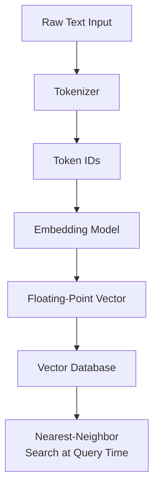
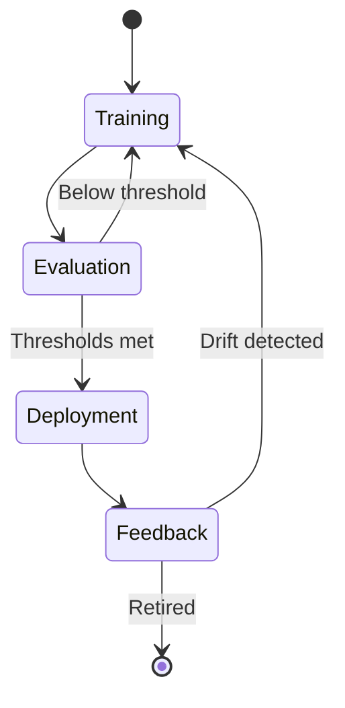
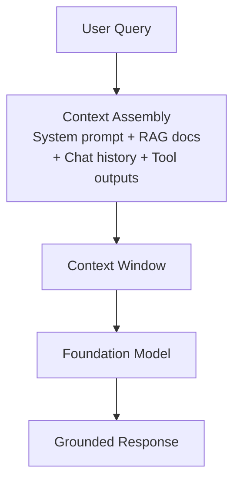
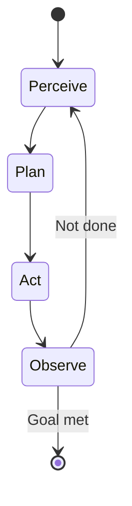
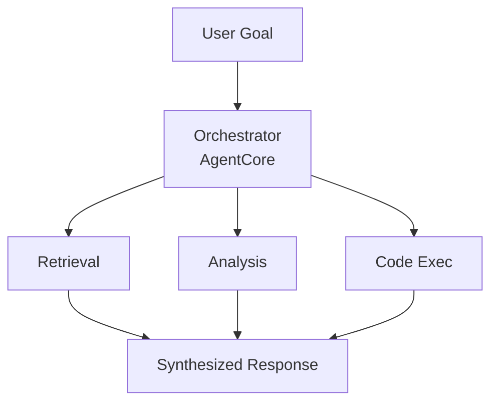

## Task Statement 2.1: Explain the basic concepts of generative AI (GenAI)

Generative AI produces new content rather than predicting a label or classifying an input. That distinction shapes everything: the model architectures used to build these systems, the way they are priced, the failure modes they exhibit, and the new discipline of context engineering that determines what information the model sees before it responds. This task statement covers six objective areas, three of which are new in exam guide v1.1 and reflect how quickly this technology has moved from research into production deployments.[^201001]

The domain intro established that generative AI carries 24% of the exam weight and that its cost and failure profile differ substantially from classical machine learning. This task statement grounds those claims in the underlying mechanics. By the time you finish it, you will be able to explain what a token is and why the token count of a prompt directly affects the bill, describe how an FM moves from raw text to a deployed service, explain what context engineering means and how it relates to prompt engineering, and articulate the patterns that multi-agent systems use when they need to coordinate across multiple AI components.

### 2.1.1 Foundational GenAI concepts

Generative AI models share a core set of abstractions that appear throughout AWS documentation, vendor pricing pages, and design reviews. Understanding these abstractions is the prerequisite for everything else in Domain 2.

**Tokenization** is the first step in processing text with a language model. A *token* is the smallest unit of text that the model operates on. In most English text, a token is roughly three to four characters, so the word "tokenization" becomes two or three tokens depending on the tokenizer, while the word "cat" is one token. Numbers, punctuation, and non-English characters often produce more tokens per word than standard English prose.[^201002] The total token count for a request is the sum of input tokens (the text you send) plus output tokens (the text the model generates back). Both counts appear on the invoice.

**Chunking** is the process of breaking a large document into smaller segments before embedding or retrieving it. A 50-page PDF cannot fit into a model's context window as a single block, so it is divided into overlapping chunks of a few hundred tokens each. The chunk size and the overlap percentage are tunable parameters that affect retrieval accuracy: chunks that are too small lose surrounding context, while chunks that are too large waste token budget when inserted into a prompt.[^201003] Chunking is a preparation step, not a model capability, and it runs at index-build time rather than at inference time.

*Embeddings* are numerical representations of text (or images, or audio) that encode semantic meaning as vectors in a high-dimensional space. Two pieces of text with similar meanings will have embedding vectors that are geometrically close to each other, which is what makes similarity search over a document collection possible. **Amazon Bedrock** exposes embedding models such as Amazon Titan Embeddings and Cohere Embed that accept text and return a floating-point vector.[^201004] Those vectors are then stored in a vector database, which is a specialized data store optimized for nearest-neighbor lookups. Common vector databases available on AWS include **Amazon OpenSearch Service** with the k-NN plugin, **Amazon Aurora** and **Amazon RDS for PostgreSQL** with the pgvector extension, and **Amazon Neptune Analytics** with vector search.[^201005]

*Figure 2.1.1: Tokenization and embedding pipeline. Text is first converted to token IDs by the tokenizer, then mapped to a high-dimensional vector by the embedding model, and finally stored in a vector database for similarity retrieval.*

**Prompt engineering** is the practice of crafting the text inputs sent to a model to improve the quality, accuracy, or format of its outputs. A well-designed prompt can include an instruction, context, examples, and an explicit output format. Task Statement 3.2 covers specific prompt engineering techniques in detail; at this stage the key point is that prompt engineering is the most immediate lever a practitioner has over model behavior without changing the model itself.[^201006]

**Transformer-based large language models (LLMs)** are the dominant architecture for modern language tasks. The *transformer* architecture, introduced in 2017, uses a mechanism called *self-attention* to weigh the relevance of every token in a sequence against every other token when producing each output token.[^201007] Self-attention is what allows a transformer to maintain long-range dependencies in text, such as knowing that the pronoun "it" refers to a noun introduced three sentences earlier. The mathematics of attention are not tested on the AIF-C01 exam, but the concept matters for understanding why longer contexts are more computationally expensive and why the context window has a finite size.

**Foundation models (FMs)** are large models trained on broad, general-purpose datasets at enormous scale.[^201008] An FM is not trained for one specific task; instead, it learns general representations of language (or images, or code) that can then be adapted to many downstream tasks through prompting, retrieval, or fine-tuning. Examples available through Amazon Bedrock include Anthropic Claude, Meta Llama, Amazon Nova, and Mistral AI models, among others.[^201009]

**Multi-modal models** accept and produce more than one type of data. A multi-modal FM might accept an image plus a text question and return a text answer, or accept text and return both text and an image. Within the Amazon Nova family on Amazon Bedrock, Lite, Pro, and Premier process text, images, video, and documents; Nova Micro is text-only and is the lowest-cost option for pure-text use cases.[^201010]

**Diffusion models** generate outputs by learning to reverse a noise-addition process. During training, the model sees data with increasing amounts of random noise added, and it learns to predict and remove that noise step by step. At inference time, it starts with pure noise and iteratively denoises it into a coherent image, audio clip, or other artifact.[^201011] Diffusion models are the basis for image generation capabilities. Amazon Bedrock includes Stability AI's Stable Diffusion as an image-generation model in this category.[^201012]

### 2.1.2 Potential use cases for GenAI models

Generative AI covers a wider range of business tasks than most classical ML systems because the underlying models generalize across domains. The practical question is not whether a generative model could help with a given task, but whether it is the right economic and accuracy trade-off for that specific case.

*Table 2.1.1: Common GenAI use cases and representative business scenarios*

| Use Case | What the Model Does | Representative Business Scenario |
|---|---|---|
| Image generation | Produces new images from text or image prompts | Marketing teams generate product lifestyle imagery without a photo shoot |
| Video generation | Generates short video clips from text descriptions | Media companies produce draft explainer videos for review |
| Audio generation | Synthesizes speech or music | E-learning platforms generate narration for course updates overnight |
| Summarization | Condenses long documents into shorter versions | Legal departments summarize contracts to highlight key obligations |
| AI assistants | Answers questions, drafts content, explains concepts | Internal knowledge-base bots answer employee HR questions |
| Translation | Converts text from one language to another | Global retailers localize product descriptions into 20 languages |
| Code generation | Writes, reviews, and explains source code | Developers accelerate routine feature implementation and unit test writing |
| Customer service agents | Handles customer inquiries through conversation | Contact centers deflect common questions without live-agent involvement |
| Search | Returns semantically relevant results rather than keyword matches | Enterprise document portals surface the right policy page even when the query uses different phrasing |
| Recommendation engines | Suggests items based on user behavior or stated preferences | Streaming services recommend content using hybrid semantic and collaborative signals |

Each use case type places different demands on the underlying model. Summarization and translation are primarily language tasks that favor LLMs. Image and video generation require diffusion or other generative visual models. Code generation benefits from models specifically fine-tuned on programming languages. Customer service agents benefit from low latency, strong instruction-following, and the ability to call external tools, which connects directly to the agentic patterns covered in objective 2.1.6. Search and recommendation use the embedding and vector-similarity capabilities from objective 2.1.1, typically combining them with a retrieval-augmented generation (RAG) pattern covered in Task 3.1.

### 2.1.3 The FM lifecycle

A foundation model does not spring from training data straight into production. It passes through a defined lifecycle that has more stages than the classical ML lifecycle described in Task 1.3. The classical pipeline focuses on a labeled dataset, a model, and a prediction endpoint. The FM lifecycle begins much earlier, with decisions about what raw data to pre-train on, and it adds post-deployment feedback loops that continuously refine model behavior.

*Figure 2.1.2: Foundation model lifecycle. The path is not strictly linear: evaluation failures loop back to fine-tuning, and production feedback can trigger further adaptation cycles.*

The seven stages of the FM lifecycle are:

- **Data selection**: Curating the training corpus. For pre-training, this is massive and broad (web crawls, books, code repositories). For fine-tuning, it is domain-specific and much smaller. Data quality at this stage directly determines model behavior, including its biases.[^201013]
- **Model selection**: Choosing an architecture (transformer variant, diffusion model, multi-modal), size in parameters, and whether to train from scratch or start from an existing FM. Most business deployments skip from-scratch pre-training entirely and choose from available FMs through a service such as Amazon Bedrock.[^201014]
- **Pre-training**: Learning general representations from the broad dataset using large amounts of compute (GPU clusters running for weeks or months). This is the stage that produces the base FM weights. Pre-training is expensive enough that virtually no business outside hyperscalers does it.[^201015]
- **Fine-tuning**: Updating the base FM weights on a smaller, task-specific or domain-specific dataset. Fine-tuning adapts the model's behavior without repeating the full pre-training cost. Amazon Bedrock supports custom fine-tuning jobs, and Amazon SageMaker AI supports both fine-tuning and more advanced parameter-efficient fine-tuning techniques.[^201016]
- **Evaluation**: Measuring model quality on held-out test data. For generative models, evaluation includes automatic metrics such as ROUGE and BLEU for text, plus human evaluation and, increasingly, LLM-as-a-judge methods. Task 3.4 covers evaluation in depth.
- **Deployment**: Serving the model through an API endpoint where applications can send prompts and receive completions. Amazon Bedrock manages the underlying infrastructure for supported models, while Amazon SageMaker AI gives teams direct control over the endpoint configuration.[^201017]
- **Feedback**: Collecting signals from production traffic (latency, accuracy, user satisfaction, error rates) and using them to detect drift or to build new fine-tuning datasets. This closes the loop and distinguishes the FM lifecycle from a one-and-done training run.

The key distinction from the classical ML lifecycle in Task 1.3 is the pre-training stage. Classical ML pipelines start with a labeled dataset specific to the problem. The FM lifecycle starts with self-supervised learning on unlabeled text at a scale that creates general capabilities, and only later narrows to specific tasks through fine-tuning or prompting. Business practitioners generally enter the FM lifecycle at the fine-tuning or deployment stage, not at pre-training.

### 2.1.4 Token-based pricing model

Classical ML inference is typically priced per-prediction or per-endpoint-hour. Token-based pricing is different: you pay for the number of tokens consumed, both coming in and going out, rather than for the compute resource that ran the request. Understanding token economics is directly relevant to budget planning for any generative AI project.

**Input tokens** are the tokens in the prompt you send to the model: the system prompt, any retrieved documents, conversation history, tool outputs, and the user's message. **Output tokens** are the tokens the model generates in response. Amazon Bedrock, like most cloud FM providers, charges separately for input and output tokens, and output tokens are priced higher because generating a token is computationally more expensive than processing an input token.[^201018]

*Table 2.1.2: Token pricing structure and cost levers*

| Pricing Factor | Description | Effect on Cost |
|---|---|---|
| Input token price | Cost per 1,000 input tokens (varies by model) | Directly proportional to prompt length |
| Output token price | Cost per 1,000 output tokens, typically 3x to 5x input price | Directly proportional to response length |
| Prompt caching | Re-use of previously processed prompt prefixes | Reduces effective input cost for repeated context |
| Batch inference | Asynchronous processing of many requests together | Typical discount of 50% versus on-demand pricing |
| Provisioned throughput | Reserved capacity for sustained high-volume workloads | Predictable cost but requires volume commitment |

To make this concrete, consider a customer service scenario. A single interaction might include a 500-token system prompt, a 1,000-token retrieved document, a 50-token user message, and a 200-token model response. That is 1,550 input tokens and 200 output tokens. For a model priced at $0.003 per 1,000 input tokens and $0.015 per 1,000 output tokens, the per-interaction cost is approximately $0.0077 ($0.00465 input + $0.003 output). At 100,000 interactions per month, the bill is roughly $770 for that single model call per interaction. If the workflow calls the model multiple times per interaction (for routing, for retrieval re-ranking, for response generation), those numbers multiply accordingly.[^201019]

**Prompt caching** allows the model provider to store the processed representation of a repeated prompt prefix so that subsequent requests that share that prefix do not re-process those tokens from scratch. When the same system prompt is sent with every request, caching that prefix can reduce the effective input cost for the cached portion by 80 to 90 percent.[^201020] Amazon Bedrock supports prompt caching for applicable models.

**Batch inference** in Amazon Bedrock processes requests asynchronously rather than in real time. Instead of submitting one request and waiting for the response, you submit a batch of requests and retrieve the results after processing is complete. The trade-off is latency: batch responses arrive minutes to hours after submission rather than seconds. For use cases that tolerate latency (document summarization queues, overnight translation jobs, bulk content generation), batch inference is a straightforward cost lever.[^201021]

The practical implication for business planning is that token costs compound with architecture decisions. A RAG pattern that retrieves three 500-token documents per query adds 1,500 input tokens to every request. An agentic workflow that makes five model calls per user request multiplies the per-request cost by roughly five. Designing for token efficiency, through shorter prompts, prompt caching, batch processing where tolerable, and right-sizing the retrieval chunk count, is as important as choosing the right model.

### 2.1.5 Context engineering in FM applications

Prompt engineering focuses on the wording and structure of a single prompt: how to phrase an instruction, how to format an example, how many examples to include. **Context engineering** is a broader discipline that asks what information should enter the model's context window at all, in what form, and in what order.[^201022] A model does not see the world; it sees only what fits inside its context window at inference time. Context engineering is the practice of curating that content deliberately.

The context window is the maximum number of tokens a model can process in a single forward pass, including both the input and the output. Amazon Bedrock model context windows range from tens of thousands to more than a million tokens depending on the model family (for example, certain Anthropic Claude variants reach one million tokens with the 1M-context beta header, and Amazon Nova Premier and Meta Llama 4 Maverick offer one-million-token windows on Bedrock).[^201023] A large context window does not mean an application should fill it entirely: longer contexts increase latency and cost, and models can exhibit *lost-in-the-middle* behavior where relevant information buried in the middle of a long context receives less attention than information at the beginning or end.[^201024]

*Figure 2.1.3: Context assembly for FM applications. Context engineering governs what enters each slot of the context window and how the assembled input is ordered before the model processes it.*

The components that typically make up an assembled context include:

- **System prompt**: The standing instruction that defines the model's role, tone, output format, and constraints. The system prompt is usually constant across all requests in an application, which makes it a good candidate for prompt caching.
- **Retrieved documents**: Output from a RAG pipeline. The retrieval step selects the most semantically relevant chunks from a vector database, but context engineering determines how many chunks to include, how to rank them, and whether to summarize chunks before including them in order to save tokens.
- **Conversation history**: Prior turns of a multi-turn conversation. Because context windows are finite, a long conversation eventually exceeds the window. Context engineering strategies for history include truncation (dropping the oldest turns), summarization (replacing old turns with a rolling summary), and selective retention (keeping only turns that are flagged as high-value).
- **Tool outputs**: When an agent calls an external function (a database query, a web search, an API call), the result is injected back into the context for the model to reason over. The format of tool outputs affects how reliably the model interprets them.
- **Structured data**: Tables, JSON records, or key-value pairs that provide factual grounding. Structured data is more token-efficient than prose descriptions of the same facts when the model needs to reference specific values.

The distinction from prompt engineering is scope. Prompt engineering answers "how should I word this instruction?" Context engineering answers "what should be in the context window, how much of it, in what form, and in what sequence?" Both disciplines are relevant to production FM applications, but context engineering is the one that scales with application complexity. A simple chatbot can be prompt-engineered once. A complex agent that coordinates retrievals, tool calls, and multi-turn history requires ongoing context engineering to stay within token budgets and maintain response quality.

*Table 2.1.3: Context engineering techniques and their trade-offs*

| Technique | What It Does | Trade-off |
|---|---|---|
| Context-window summarization | Compresses old conversation turns into a shorter summary | Loses exact wording; introduces potential distortion |
| Selective retrieval | Retrieves only the top-k most relevant chunks rather than all candidates | May miss relevant documents if the retrieval model ranks poorly |
| Chunk pre-summarization | Summarizes each retrieved document before including it | Reduces tokens per document at the cost of additional model calls |
| Prompt caching | Stores processed representations of repeated prefixes | Requires prompt structure that keeps the cached portion stable |
| Tool output formatting | Converts raw API responses into compact, model-readable formats | Requires per-tool formatting logic in the application layer |

### 2.1.6 Foundational agentic AI concepts

An AI agent is a system in which an FM does not just respond to a single prompt but instead operates in a loop: it perceives a goal or an observation, plans a course of action, executes that action (often by calling an external tool), and then observes the result before deciding whether the goal is complete.[^201025] A single-shot FM call produces one response and stops. An agent runs until a stopping condition is met, which could be completing a multi-step task, exhausting a turn limit, or determining that the task is impossible with available tools.

*Figure 2.1.4: The agent loop. An agent cycles through perceive, plan, act, and observe until a stopping condition is met.*

Single-agent architectures handle many tasks, but complex workflows often require multiple agents operating in coordination. **Multi-agent systems** distribute the work across specialized agents, each responsible for one aspect of the overall task.[^201026] The exam tests awareness of four coordination patterns:

- **Orchestrator/worker pattern**: A central orchestrator agent receives the user's goal, decomposes it into sub-tasks, dispatches each sub-task to a specialized worker agent, collects the results, and synthesizes a final response. The orchestrator does not execute the work itself; it manages the workflow.
- **Hierarchical pattern**: A tree structure in which a top-level agent manages mid-level agents, which in turn manage leaf-level agents. This is an extension of the orchestrator/worker pattern to multiple levels of decomposition, suited to tasks that have natural hierarchical structure (for example, a research task that decomposes into topic areas, each of which decomposes into source retrieval and analysis).
- **Sequential pattern**: Agents are arranged in a pipeline where the output of one agent is the input to the next. This is appropriate when each step must complete before the next can begin, and when there is no need for the downstream agent to influence the upstream agent's behavior.
- **Debate pattern**: Multiple agents independently produce responses to the same query, then evaluate or critique each other's outputs, with a final agent synthesizing the best answer. This improves accuracy on tasks where different reasoning approaches reach different conclusions.

**The Model Context Protocol (MCP)** is a standardized protocol for connecting AI agents to external tools, data sources, and services.[^201027] Without a common protocol, each agent integration with an external system requires custom code to handle authentication, request formatting, and response parsing. MCP defines a standard client-server interface so that an agent can discover available tools, call them with structured arguments, and receive structured results without integration-specific code. AWS has stated support for MCP within the Amazon Bedrock ecosystem, and **Strands Agents**, the AWS open-source SDK for building agentic applications, implements the MCP client interface.[^201028]

Multi-agent communication patterns describe how agents exchange messages. Agents can communicate directly (peer-to-peer), through a shared message queue, or through a centralized broker. The choice of communication pattern affects reliability, ordering guarantees, and the ability to audit what each agent said to what other agent. In production systems, message queues are preferred over direct agent-to-agent calls because they decouple the sending agent from the receiving agent and provide a durable record of all inter-agent messages.

*Table 2.1.4: Memory types in agentic AI systems*

| Memory Type | Scope | Where Stored | Use Case |
|---|---|---|---|
| Short-term (working) | Current session or agent loop | Context window | Reasoning over the current task |
| Long-term (persistent) | Across sessions | External database or vector store | Remembering user preferences, past decisions |
| Episodic | Specific past events or interactions | Retrievable record store | Recalling what happened in a prior engagement |
| Semantic | General world or domain knowledge | Embedded in model weights or RAG index | Answering factual questions |

**Memory management** is the practice of deciding which information an agent retains, in which memory tier, and for how long.[^201029] Short-term memory is the context window itself. When an agent's working context approaches its window limit, the memory management layer must decide what to compress, summarize, or offload to long-term storage. Long-term memory typically uses a vector database (as described in objective 2.1.1) so that the agent can retrieve relevant past experiences semantically rather than scanning a full log.

**Tool usage** in agentic systems refers to the agent's ability to call external functions and incorporate the results into its reasoning.[^201030] A tool can be a web search, a database query, a REST API call, a code interpreter, or any function that returns a result the agent can observe. Tools are defined by their input schema and output schema; the FM uses these schemas to decide when to call a tool and what arguments to pass. This is sometimes called *function calling* in API documentation.

**Workflow orchestration** coordinates the execution of multi-step agentic processes, handling sequencing, error recovery, and state management across agent calls.[^201031] **Amazon Bedrock AgentCore**, the newer managed runtime layer for agentic workloads on Amazon Bedrock, handles this orchestration layer for production agentic applications, providing execution infrastructure so that teams do not need to build and operate their own agent runtime.[^201032] Strands Agents is the open-source SDK that sits above the runtime and gives developers a Python-based way to define agents, tools, and memory behaviors, with built-in MCP client support.[^201033]

*Figure 2.1.5: Multi-agent orchestrator/worker pattern on Amazon Bedrock AgentCore. The orchestrator manages worker agents and assembles their outputs into a final response.*

The business relevance of agentic AI is that it unlocks use cases that single-shot prompting cannot handle: tasks that require multiple tool lookups, tasks that must adapt mid-execution based on intermediate results, and tasks that involve coordination across specialized sub-systems. At the same time, agentic systems are more complex to design, more expensive to run (each agent loop iteration consumes tokens), and harder to audit than single-shot calls. Task Statement 3.1 revisits AI agents from the design perspective, covering when to use agents versus simpler patterns.

---

This section built the conceptual vocabulary for all of Domain 2. You can now define the core generative-AI primitives (tokens, embeddings, vectors, attention, foundation models, diffusion models), explain the FM lifecycle and how it differs from the classical ML pipeline, calculate rough token-based costs for a given architecture, describe what context engineering means and how it differs from prompt engineering, and articulate the main patterns for multi-agent systems and the role of MCP. Task Statement 2.2 takes the next step: given these capabilities, what are the real limits of generative AI, and how should a business weigh those limits when selecting a generative solution?

---

## Self-check questions

**Question 1**

A company is building a document question-answering system that chunks a 200-page PDF, embeds the chunks, and stores them in a vector database. When a user asks a question, the system retrieves the three most relevant chunks and includes them in the prompt to an LLM. A developer reports that the model sometimes ignores relevant information that appears in the middle of long retrieved chunks.

Which of the following BEST explains this behavior and the MOST appropriate mitigation?

A. The model's tokenizer is discarding middle-of-document tokens before the embedding model processes them. Reduce the chunk size to fewer than 50 tokens so the tokenizer retains all content.

B. Large language models can exhibit lost-in-the-middle behavior, where content in the middle of a long context receives less attention than content at the beginning or end. Shorter chunks or chunk summarization before inclusion can reduce this effect.

C. The vector database is performing keyword-based search rather than semantic search, so it is retrieving chunks based on word frequency rather than meaning. Switch to a full-text search index.

D. Diffusion models are not designed for text retrieval tasks. Replace the LLM with a diffusion model trained on document understanding.

*Explanation.* Option B is correct. The lost-in-the-middle phenomenon is a documented behavior of transformer-based LLMs in which information positioned in the middle of a long context window receives proportionally less attention weight than information at the beginning or end of the context.[^201034] This is a context engineering problem, not a tokenizer problem (A is incorrect), not a vector database search problem (C is incorrect), and not a question about model class selection (D is incorrect and diffusion models do not perform text retrieval). Mitigations include shortening chunk size so each chunk carries a tighter scope, summarizing chunks before including them to reduce token count, and ordering the most relevant chunks at the beginning of the prompt rather than burying them in the middle. These are all context engineering decisions: they govern what enters the context window, in what form, and in what order, which is exactly the discipline described in objective 2.1.5.[^201035]

---

**Question 2**

An organization is evaluating the cost of running a generative AI customer service application on Amazon Bedrock. Each customer interaction includes a 600-token system prompt, an average of 900 tokens of retrieved documents, a 100-token user message, and a 300-token model response. The application handles 500,000 interactions per month.

Which pricing factor would have the MOST significant impact if the organization wants to reduce monthly costs without changing the model or the quality of responses?

A. Switching from provisioned throughput to on-demand pricing for all requests.

B. Applying prompt caching to the system prompt, which is identical for every request.

C. Increasing the number of retrieved document chunks from 3 to 6 per interaction.

D. Reducing the maximum output token limit from 300 to 100 tokens.

*Explanation.* Option B is correct. In each interaction, the system prompt is 600 tokens and is identical across all 500,000 requests. Prompt caching allows the provider to store the processed representation of that repeated prefix and charge a substantially lower rate (typically 80 to 90 percent less) for cache hits on those 600 tokens.[^201036] At 500,000 requests, the savings on the cached portion are material. Option A is incorrect because provisioned throughput provides a reserved capacity discount over on-demand; switching from provisioned to on-demand would increase cost, not reduce it. Option C is incorrect because adding more retrieved chunks increases the input token count per request, which increases cost. Option D could reduce output token costs, but the question specifies no change to response quality; arbitrarily truncating output is likely to reduce quality. Prompt caching targets the highest-repetition portion of the prompt and reduces cost without changing the content sent to the model.[^201037]

---

**Question 3**

A business analyst is reviewing a proposal for an agentic AI system that will handle customer refund requests. The proposed system uses an orchestrator agent that receives the refund request, calls a worker agent to look up the order history, calls a second worker agent to check the refund policy, and then generates a decision. Each step involves a separate model call.

Which of the following is the PRIMARY consideration the analyst should raise regarding the cost of this architecture compared to a single-shot LLM call for the same task?

A. Multi-agent systems are not supported by Amazon Bedrock AgentCore, so the team will need to build a custom orchestration layer that adds engineering cost.

B. The agent loop makes multiple model calls per user request, and each call consumes input and output tokens. Total per-request token cost will be higher than a single-shot call that includes all the context in one prompt.

C. Agentic systems use diffusion models internally, which have higher per-token pricing than transformer-based LLMs on Amazon Bedrock.

D. The orchestrator/worker pattern requires that all worker agents use the same foundation model, which eliminates the ability to use a cheaper model for the lookup steps.

*Explanation.* Option B is correct. Each model call in an agentic loop incurs input and output token costs. An orchestrator agent that makes three model calls (one to decompose the task, one to call each worker, and one to synthesize the result) will consume several times more tokens per user request than a single-shot prompt that includes all the relevant context. This is the core cost trade-off for agentic architectures and is directly addressed in objective 2.1.4 on token-based pricing and objective 2.1.6 on agentic AI.[^201038] Option A is incorrect because Amazon Bedrock AgentCore Runtime is specifically designed to support multi-agent orchestration. Option C is incorrect because agentic systems use LLMs (transformer-based models) for reasoning, not diffusion models; diffusion models generate images and other media, not the reasoning steps in an agent loop. Option D is incorrect because the orchestrator/worker pattern supports heterogeneous models across workers; using cheaper, faster models for lookup steps is a common cost-optimization technique.[^201039]

---

**Question 4**

A development team is building an enterprise chatbot on Amazon Bedrock. They notice that the context window fills up after approximately 20 conversation turns because each turn appends the full prior conversation to the next request. The team wants to maintain conversational coherence past 20 turns without changing the model.

Which context engineering technique MOST directly addresses this problem?

A. Replace the transformer-based LLM with a diffusion model, which does not use context windows and therefore has no turn limit.

B. Switch from on-demand pricing to provisioned throughput, which allocates a larger context window for the application.

C. Apply context-window summarization: replace old conversation turns with a rolling summary generated by the model, and include only the summary plus recent turns in each request.

D. Increase the chunk size of retrieved documents to reduce the number of chunks included in the context, freeing space for more conversation history.

*Explanation.* Option C is correct. Context-window summarization is a standard context engineering technique for multi-turn conversations: as the accumulated history approaches the window limit, the application uses the model to produce a compressed summary of the oldest turns, replaces those turns with the summary, and appends only recent turns in full.[^201040] This preserves the substance of the conversation without exceeding the window. Option A is incorrect; diffusion models generate images and audio, not text conversation, and they do not resolve context-window limitations. Option B is incorrect; provisioned throughput is a pricing construct that reserves compute capacity, not a mechanism for expanding the context window size. Option D addresses a different context slot (retrieved documents) and would only help if the context were dominated by retrieval output rather than conversation history, which the scenario does not indicate.[^201041]

---

**Question 5**

A company wants to integrate its internal tools, including a CRM system, a ticketing database, and an inventory API, with an AI agent so that the agent can look up customer records, create service tickets, and check stock levels within a single conversation. A developer recommends using the Model Context Protocol (MCP).

Which statement BEST describes MCP's role in this integration?

A. MCP is a data format standard that converts CRM records, tickets, and inventory data into tokens before they are sent to the foundation model.

B. MCP is a pricing tier within Amazon Bedrock that reduces the cost of model calls made by agents that access external tools.

C. MCP defines a standard client-server interface that allows an agent to discover available tools, call them with structured arguments, and receive structured results without writing custom integration code for each system.

D. MCP is a memory management protocol that determines which conversation turns to retain in long-term storage and which to discard after each agent loop iteration.

*Explanation.* Option C is correct. The Model Context Protocol defines a standardized interface between an AI agent (the MCP client) and external tools or services (MCP servers). When a CRM system, a ticketing system, and an inventory API each expose an MCP server endpoint, the agent can discover and call all three through the same protocol without the development team writing three separate custom integration layers.[^201042] Strands Agents, the AWS open-source SDK, includes built-in MCP client support, and Amazon Bedrock AgentCore provides the runtime environment in which such agents execute. Option A is incorrect; MCP is not a tokenization or data format conversion standard. Option B is incorrect; MCP is not a pricing construct. Option D is incorrect; memory management is a separate concern from tool connectivity, and MCP does not govern what an agent retains in memory between turns.[^201043]

---

**Question 6**

A foundation model was pre-trained on a large general corpus and then fine-tuned on a company's internal technical documentation. The model is now deployed through Amazon Bedrock. Six months later, the team observes that the model's responses about newer products released after the fine-tuning date are inaccurate.

Which stage of the FM lifecycle MOST directly addresses this problem, and what is the recommended action?

A. Pre-training: the company should repeat the full pre-training run with an updated corpus that includes the newer product documentation.

B. Data selection: the company should change the tokenizer used to process the new product documents before they are fed into the existing model.

C. Feedback and fine-tuning: production feedback shows the knowledge cutoff problem; the team should run a new fine-tuning job on a dataset that includes the newer product documentation, or implement RAG to retrieve current product information at inference time.

D. Deployment: the company should switch the serving endpoint from Amazon Bedrock to Amazon SageMaker AI, which automatically updates the model with new data from the production environment.

*Explanation.* Option C is correct. The FM lifecycle includes a feedback stage where production signals (in this case, inaccuracy on newer products) trigger a return to fine-tuning with updated data.[^201044] The knowledge cutoff problem is a standard FM lifecycle management challenge: the model does not know about events or documents that post-date its training. Two standard remedies exist: run a new fine-tuning job that adds the newer product data to the training corpus, or implement retrieval-augmented generation (RAG) so that current product documentation is retrieved from a regularly updated index and injected into the context at inference time. RAG is often the faster path because it does not require a new training run. Option A is incorrect; repeating full pre-training is prohibitively expensive and unnecessary when the goal is to add domain-specific updates. Option B is incorrect; the tokenizer processes text into tokens regardless of content recency and is not the cause of knowledge cutoffs. Option D is incorrect; switching serving infrastructure does not update model weights; Amazon SageMaker AI does not automatically retrain a deployed model from production traffic.[^201045]

---

[^201001]: AWS Certification. AIF-C01 Exam Guide v1.1. URL: <https://docs.aws.amazon.com/aws-certification/latest/ai-practitioner-01/ai-practitioner-01.html>
[^201002]: Anthropic. Token counting in Claude models. URL: <https://docs.anthropic.com/en/docs/about-claude/models>
[^201003]: AWS Documentation. Chunking strategies in Amazon Bedrock Knowledge Bases. URL: <https://docs.aws.amazon.com/bedrock/latest/userguide/kb-chunking-parsing.html>
[^201004]: AWS Documentation. Amazon Titan Embeddings models in Amazon Bedrock. URL: <https://docs.aws.amazon.com/bedrock/latest/userguide/titan-embedding-models.html>
[^201005]: AWS Documentation. Vector engine for Amazon OpenSearch Service. URL: <https://docs.aws.amazon.com/opensearch-service/latest/developerguide/knn.html>
[^201006]: AWS Documentation. Prompt engineering guidelines for Amazon Bedrock. URL: <https://docs.aws.amazon.com/bedrock/latest/userguide/prompt-engineering-guidelines.html>
[^201007]: Vaswani, A. et al. Attention Is All You Need. URL: <https://arxiv.org/abs/1706.03762>
[^201008]: AWS Documentation. What are foundation models? URL: <https://docs.aws.amazon.com/bedrock/latest/userguide/what-is-a-foundation-model.html>
[^201009]: AWS Documentation. Supported foundation models in Amazon Bedrock. URL: <https://docs.aws.amazon.com/bedrock/latest/userguide/models-supported.html>
[^201010]: AWS Documentation. Amazon Nova models overview. URL: <https://docs.aws.amazon.com/bedrock/latest/userguide/amazon-nova.html>
[^201011]: Ho, J. et al. Denoising Diffusion Probabilistic Models. URL: <https://arxiv.org/abs/2006.11239>
[^201012]: AWS Documentation. Stability AI models in Amazon Bedrock. URL: <https://docs.aws.amazon.com/bedrock/latest/userguide/stability-ai.html>
[^201013]: AWS Documentation. Data selection best practices for foundation model training. URL: <https://docs.aws.amazon.com/sagemaker/latest/dg/clarify-foundation-model-evaluate.html>
[^201014]: AWS Documentation. Model selection in Amazon Bedrock. URL: <https://docs.aws.amazon.com/bedrock/latest/userguide/model-selection.html>
[^201015]: AWS Blog. Training large language models at scale on AWS. URL: <https://aws.amazon.com/blogs/machine-learning/training-large-language-models-at-scale-on-aws/>
[^201016]: AWS Documentation. Fine-tuning models in Amazon Bedrock. URL: <https://docs.aws.amazon.com/bedrock/latest/userguide/custom-models.html>
[^201017]: AWS Documentation. Deploying models with Amazon Bedrock endpoints. URL: <https://docs.aws.amazon.com/bedrock/latest/userguide/inference.html>
[^201018]: AWS Documentation. Amazon Bedrock pricing. URL: <https://aws.amazon.com/bedrock/pricing/>
[^201019]: AWS Documentation. On-demand token pricing for Amazon Bedrock. URL: <https://aws.amazon.com/bedrock/pricing/>
[^201020]: AWS Documentation. Prompt caching in Amazon Bedrock. URL: <https://docs.aws.amazon.com/bedrock/latest/userguide/prompt-caching.html>
[^201021]: AWS Documentation. Batch inference jobs in Amazon Bedrock. URL: <https://docs.aws.amazon.com/bedrock/latest/userguide/batch-inference.html>
[^201022]: AWS Blog. Context engineering for large language model applications. URL: <https://aws.amazon.com/blogs/machine-learning/context-engineering-for-llm-applications/>
[^201023]: AWS Documentation. Amazon Bedrock supported models and context window sizes. URL: <https://docs.aws.amazon.com/bedrock/latest/userguide/models-supported.html>
[^201024]: Liu, N. F. et al. Lost in the Middle: How Language Models Use Long Contexts. URL: <https://arxiv.org/abs/2307.03172>
[^201025]: AWS Documentation. What are AI agents? Amazon Bedrock Agents overview. URL: <https://docs.aws.amazon.com/bedrock/latest/userguide/agents.html>
[^201026]: AWS Documentation. Multi-agent collaboration in Amazon Bedrock. URL: <https://docs.aws.amazon.com/bedrock/latest/userguide/agents-multi-agents.html>
[^201027]: Anthropic. Model Context Protocol specification. URL: <https://modelcontextprotocol.io/introduction>
[^201028]: AWS Blog. Strands Agents: open-source SDK for building AI agents on AWS. URL: <https://aws.amazon.com/blogs/machine-learning/strands-agents-open-source-sdk/>
[^201029]: AWS Documentation. Memory management in Amazon Bedrock Agents. URL: <https://docs.aws.amazon.com/bedrock/latest/userguide/agents-memory.html>
[^201030]: AWS Documentation. Action groups and tool use in Amazon Bedrock Agents. URL: <https://docs.aws.amazon.com/bedrock/latest/userguide/agents-action-groups.html>
[^201031]: AWS Documentation. Workflow orchestration with Amazon Bedrock Agents. URL: <https://docs.aws.amazon.com/bedrock/latest/userguide/agents.html>
[^201032]: AWS Documentation. Amazon Bedrock AgentCore. URL: <https://aws.amazon.com/bedrock/agentcore/>
[^201033]: AWS GitHub. Strands Agents SDK repository. URL: <https://github.com/strands-agents/sdk-python>
[^201034]: Liu, N. F. et al. Lost in the Middle: How Language Models Use Long Contexts. URL: <https://arxiv.org/abs/2307.03172>
[^201035]: AWS Documentation. Knowledge base chunking and retrieval settings. URL: <https://docs.aws.amazon.com/bedrock/latest/userguide/kb-chunking-parsing.html>
[^201036]: AWS Documentation. Prompt caching pricing in Amazon Bedrock. URL: <https://docs.aws.amazon.com/bedrock/latest/userguide/prompt-caching.html>
[^201037]: AWS Documentation. Amazon Bedrock cost optimization strategies. URL: <https://docs.aws.amazon.com/bedrock/latest/userguide/cost-optimization.html>
[^201038]: AWS Documentation. Token-based pricing for agents in Amazon Bedrock. URL: <https://aws.amazon.com/bedrock/pricing/>
[^201039]: AWS Documentation. Multi-agent collaboration patterns in Amazon Bedrock. URL: <https://docs.aws.amazon.com/bedrock/latest/userguide/agents-multi-agents.html>
[^201040]: AWS Blog. Managing long conversations with context-window summarization. URL: <https://aws.amazon.com/blogs/machine-learning/managing-long-conversations-llm/>
[^201041]: AWS Documentation. Context window management in Amazon Bedrock. URL: <https://docs.aws.amazon.com/bedrock/latest/userguide/inference.html>
[^201042]: Model Context Protocol. Introduction and specification. URL: <https://modelcontextprotocol.io/introduction>
[^201043]: AWS Blog. Using MCP with Strands Agents on Amazon Bedrock. URL: <https://aws.amazon.com/blogs/machine-learning/mcp-strands-agents-bedrock/>
[^201044]: AWS Documentation. FM lifecycle and feedback in Amazon Bedrock. URL: <https://docs.aws.amazon.com/bedrock/latest/userguide/custom-models.html>
[^201045]: AWS Documentation. Retrieval-augmented generation with Amazon Bedrock Knowledge Bases. URL: <https://docs.aws.amazon.com/bedrock/latest/userguide/knowledge-base.html>
