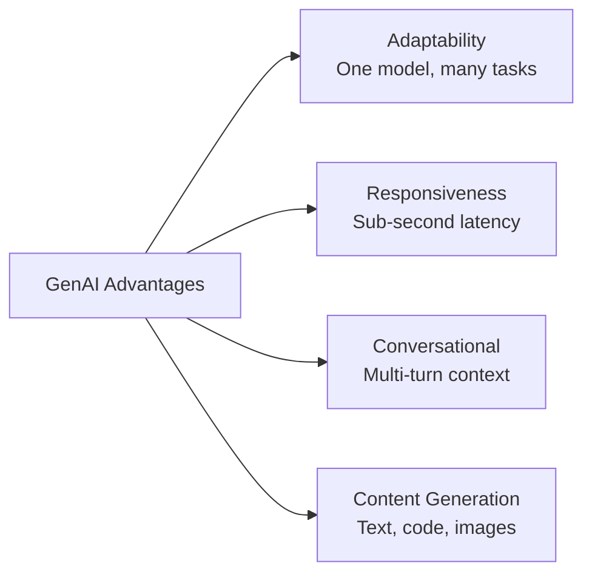
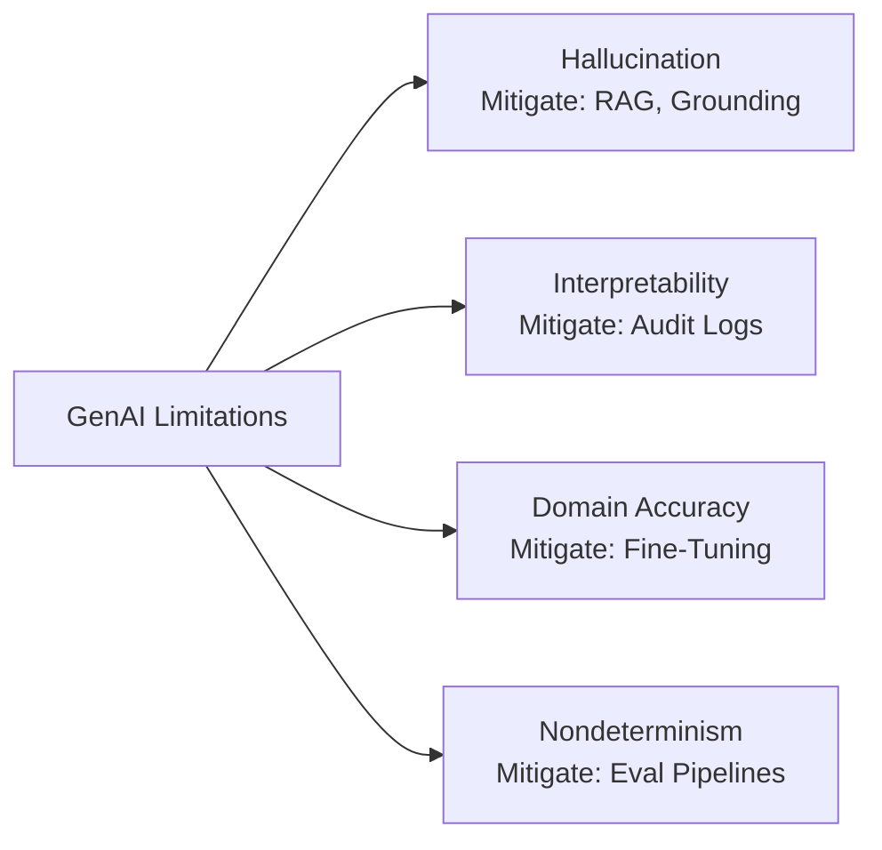
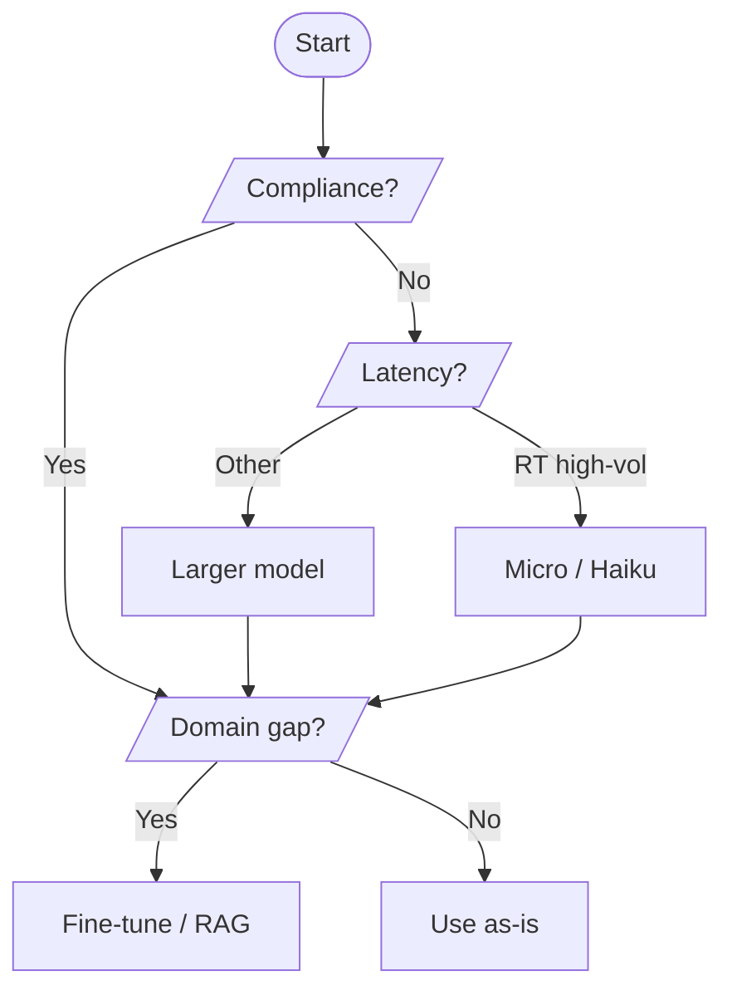
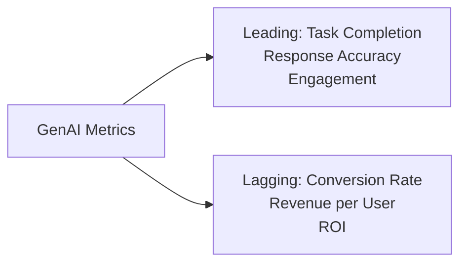

## Task Statement 2.2: Understand the capabilities and limitations of GenAI for solving business problems

Generative AI can produce content, hold extended conversations, and adapt to tasks that classical machine learning systems cannot handle without full retraining. At the same time, it hallucinates with authority, changes its answer between runs, and sometimes produces confident nonsense in specialized domains that were thinly represented in its training data. Business professionals who can articulate both sides of this equation are the ones who make sound decisions about when to commit to a generative AI project, when to add safeguards, and when to use a different tool entirely. This task statement covers the advantages, the limitations, the model-selection criteria, and the metrics you need to evaluate business value from a generative application.[^202001]

### 2.2.1 Advantages of GenAI

Classical machine learning models are built for one job: a fraud detection model detects fraud, a demand-forecasting model forecasts demand. Retraining each model for a new task takes months of labeling, training, and validation. Generative AI breaks this constraint. A single large language model can write marketing copy in the morning and summarize legal documents in the afternoon, without any retraining, simply by receiving a different prompt. That shift has practical consequences for how organizations staff AI projects and how quickly they can respond to new business requirements.

The exam lists four core advantages of generative AI: adaptability, responsiveness, conversational capabilities, and the ability to generate content. Each addresses a different limitation of earlier AI systems, and each translates into a concrete business benefit.

*Figure 2.2.1: Four core advantages of generative AI. Each advantage maps to a limitation of classical machine learning that generative models overcome.*

**Adaptability** is the ability of a single foundation model to handle a wide variety of tasks without retraining. A model trained on a broad corpus of text can draft emails, classify sentiment, extract named entities, generate SQL queries, and create product descriptions, all through prompt changes alone. For example, a retailer can use a single **Amazon Bedrock** model to generate product descriptions for new SKUs in the morning, translate those descriptions into French and Spanish at noon, and summarize customer reviews in the evening.[^202002] The operational savings are real: instead of maintaining a separate specialized model for each task, a single API endpoint handles all of them, and the skills that prompt engineers build for one use case transfer directly to others.

**Responsiveness** refers to the low-latency conversational interaction that generative models enable. Classical batch ML pipelines are optimized for throughput, not speed; they process thousands of records but may take minutes per run. Generative APIs, by contrast, return tokens in a streaming fashion within hundreds of milliseconds, which is fast enough for interactive user experiences.[^202003] A customer service application that once required a human agent to look up information can instead answer a question in under a second. For example, an insurance company deploying a policy-inquiry chatbot powered by Amazon Bedrock can return a fully formed answer to a coverage question in roughly the same time it takes a human to type a reply, without a human in the loop.

**Conversational capabilities** represent the ability of generative models to maintain context across multiple turns of dialogue. Unlike a rule-based chatbot that forgets the prior message after each response, a modern large language model keeps the full conversation history in its *context window* and can refer back to it naturally.[^202004] A user can say "What is the refund policy?" followed by "What if I bought it on sale?" and the model understands that "it" refers to the product mentioned earlier. This multi-turn coherence enables support agents, sales assistants, and internal knowledge tools that feel natural to use. For example, a bank can deploy a multi-turn loan inquiry assistant that collects the applicant's employment type, loan purpose, and income range over several conversational turns before presenting eligible products, an interaction pattern that would require complex state management in a traditional rules engine.

**Ability to generate content** means that generative models produce novel output rather than merely classifying or retrieving existing content. They can write a draft blog post, generate a Python function from a description, synthesize a photorealistic product image, or compose a customer email tailored to a specific order ID and sentiment.[^202005] This generative property is what separates foundation models from retrieval systems. A search engine retrieves documents that already exist; a generative model composes a new one. For example, a pharmaceutical company can generate a first draft of a clinical trial summary report from structured trial data, letting medical writers focus on review and refinement rather than initial composition.

### 2.2.2 Disadvantages of GenAI Solutions

Every advantage of generative AI comes paired with a limitation that must be understood before deploying a system to real users. The exam specifically identifies four disadvantages: hallucinations, interpretability problems, inaccuracy in specialized domains, and nondeterminism. None of these is a reason to avoid generative AI, but each is a reason to design mitigation into any production application.

*Figure 2.2.2: Four core limitations of generative AI and the mitigation approach for each. Recognizing the limitation leads directly to selecting the appropriate control.*

**Hallucinations** are the phenomenon where a generative model produces output that is fluent and grammatically correct but factually wrong, fabricated, or not grounded in any source document.[^202006] The model does not know that it does not know; it generates the most statistically probable continuation of the prompt, which may include invented names, false statistics, or nonexistent citations. For example, a legal research tool that uses a raw generative model may produce a citation to a case that does not exist, stated with the same confident tone as a real citation. The primary mitigation is *Retrieval Augmented Generation* (RAG), a pattern where the model is required to answer from retrieved documents rather than from parametric memory.[^202007] Amazon Bedrock Knowledge Bases implements this pattern by retrieving relevant chunks from a connected data store before the model generates a response, grounding the output in documents that can be verified. Additional controls include **Amazon Bedrock Guardrails**, whose contextual grounding check can detect and block responses that are not supported by the retrieved source documents.[^202008]

**Interpretability issues** arise because large language models are opaque. There is no straightforward way to trace which training examples caused a particular output, or to explain in human terms why the model chose one word over another.[^202009] This opacity creates problems in regulated industries. A bank's credit-decisioning system must provide an adverse action reason when it declines a loan; a black-box generative model cannot supply that explanation in the structured form regulators require. The mitigation is to reserve generative AI for tasks where interpretability is not a regulatory obligation, or to add a reasoning layer that forces the model to cite its sources. **Amazon SageMaker AI** and the broader explainability toolset in AWS can surface attention weights and token-level attributions, but these remain imperfect approximations rather than true causal explanations.[^202010]

**Inaccuracy on specialized domains without grounding** is a limitation distinct from hallucination. A model may correctly recall general facts about cardiology but fail on questions specific to a hospital's clinical protocols, insurance coding rules, or proprietary drug interactions, because those documents were never in its training corpus.[^202011] The mitigation is either fine-tuning (adjusting the model weights on domain-specific data) or RAG with a curated domain knowledge base. Fine-tuning through Amazon Bedrock's customization APIs can close accuracy gaps for narrowly defined tasks, while a well-structured knowledge base handles broader information retrieval without the cost and time of retraining.[^202012]

**Nondeterminism** means the model may produce a different response each time it receives the same prompt, even with all other conditions held constant. This property emerges from the sampling process inside most generative models: the model selects the next token probabilistically rather than deterministically, so two runs may diverge after just a few tokens.[^202013] For example, a model asked to summarize the same customer complaint twice may produce one response emphasizing shipping delay and a second emphasizing product quality, both valid but not identical. The *temperature* parameter controls how much randomness the model applies during sampling; lower temperature produces more consistent but less creative output. The mitigation for nondeterminism is rigorous evaluation pipelines that compare outputs across many samples and human review of edge cases before deployment. Amazon Bedrock's model evaluation capabilities support automated scoring across test prompt sets to detect unexpected variance.[^202014]

*Table 2.2.1: GenAI disadvantages, root cause, business risk, and primary mitigation*

| Disadvantage | Root Cause | Business Risk | Primary Mitigation |
|---|---|---|---|
| Hallucinations | Parametric generation without grounding | False information presented as fact | RAG, Bedrock Guardrails |
| Interpretability | Opaque neural network weights | Regulatory non-compliance | Reserve for non-regulated tasks; audit logging |
| Domain inaccuracy | Missing domain data in training corpus | Wrong answers in specialized workflows | Fine-tuning, domain knowledge bases |
| Nondeterminism | Probabilistic token sampling | Inconsistent output for compliance tasks | Evaluation pipelines, temperature tuning |

### 2.2.3 Factors When Selecting GenAI Models

Selecting a generative AI model for a business application is not primarily a technical decision; it is a trade-off decision. Different models perform differently on different tasks, carry different cost structures, support different context window sizes, and come with different compliance postures. The exam expects you to reason through eight factors: model types, performance requirements, capabilities, constraints, compliance, cost, latency, and model complexity. The v1.1 update explicitly added cost, latency, and model complexity to the objective, reflecting the practical reality that most production decisions are governed as much by economics and speed as by benchmark accuracy.

**Amazon Bedrock** is the primary AWS service for accessing third-party and Amazon-native foundation models via a unified API, without managing infrastructure.[^202015] The models available through Bedrock span a wide range of size, capability, and cost, which makes it the natural anchor for any model-selection discussion.

*Table 2.2.2: Example Amazon Bedrock models by capability tier and selection criteria*

| Model Family | Representative Models | Strengths | Typical Latency | Relative Cost | Best For |
|---|---|---|---|---|---|
| Amazon Nova | Nova Micro, Nova Lite, Nova Pro, Nova Premier | Strong on AWS-native tasks; multilingual; multimodal (Pro/Premier) | Micro: very low; Premier: moderate | Micro: lowest; Premier: moderate | High-volume low-cost tasks (Micro); multimodal enterprise apps (Premier) |
| Anthropic Claude | Claude Haiku 4.x, Sonnet 4.x, Opus 4.x | Long context window (200K standard, 1M with beta header for Opus and Sonnet); reasoning; instruction following | Haiku: low; Opus: high | Haiku: low; Opus: high | Customer support (Haiku); complex analysis (Opus) |
| Meta Llama | Llama 4 Scout, Llama 4 Maverick | Open weights; customizable; extended context windows (configuration-dependent on Bedrock; consult model cards) | Moderate | Low to moderate | Custom fine-tuning; long-document analysis; cost-sensitive inference |
| Mistral AI | Mistral 7B, Mixtral 8x7B | Efficient mixture-of-experts; code tasks | Low to moderate | Low | Code generation; developer tooling |

The eight factors from the exam objective interact with this model landscape as follows:

**Model types** refers to the architecture and modality of the model. Text-only models handle language tasks; multimodal models handle combinations of text, images, video, and audio.[^202016] A customer service application that only processes text can use a lighter, cheaper text model. A product inspection application that classifies images alongside text descriptions needs a multimodal model such as Amazon Nova Pro.

**Performance requirements** covers the accuracy and quality benchmarks a use case demands. A marketing copy generator can tolerate some variation in quality. A medical coding assistant, by contrast, must maintain high precision because coding errors result in claim denials. Benchmark scores such as MMLU (Massive Multitask Language Understanding) and HumanEval give a starting point, but the most reliable performance signal is evaluation on your own task-specific test set.[^202017]

**Capabilities** refers to specific features a model must have: tool use (function calling), code generation, structured output (JSON mode), or extended context windows. For example, an application that must call external APIs during reasoning requires a model that supports function calling, which not all models implement.[^202018]

**Constraints** covers organizational limitations including data residency requirements, approved vendor lists, and model size restrictions for on-device deployment. Amazon Bedrock's cross-region inference and provisioned throughput options let architects work within data-residency constraints while maintaining availability.[^202019]

**Compliance** covers regulatory and industry requirements. Healthcare applications governed by HIPAA must use models deployed within a HIPAA-eligible service boundary. Financial applications may face restrictions on data egress that rule out certain external model providers. AWS services with Business Associate Agreement support narrow the eligible model list for healthcare use cases.[^202020]

**Cost** is increasingly the deciding factor in mature deployments. Token-based pricing means the cost per inference grows with context length: longer system prompts, few-shot examples, and large retrieved chunks all increase the token count and therefore the bill.[^202021] Amazon Nova Micro is designed for high-volume, low-cost text tasks where affordability is the primary constraint. For a million API calls per day, the difference between a Micro-tier and a Premier-tier model can amount to tens of thousands of dollars per month.

**Latency** governs whether a model is suitable for real-time, interactive applications. A model that requires two seconds to respond is acceptable for a batch document-processing pipeline but unacceptable for a live customer chat widget where users expect responses within a few hundred milliseconds.[^202022] Amazon Nova Micro targets the lowest-latency tier in the Amazon Nova family. Provisioned throughput in Amazon Bedrock can reduce latency variance for latency-sensitive production workloads.

**Model complexity** refers to parameter count, architecture depth, and the size of the context window a model can hold. More complex models generally perform better on nuanced tasks but are slower and more expensive per token.[^202023] A 7-billion-parameter model may handle straightforward summarization adequately, while a 200-billion-parameter model may be required for multi-step reasoning across a 100,000-token legal document. Matching complexity to the actual difficulty of the task keeps costs manageable without sacrificing quality.

*Figure 2.2.3: A decision flow for GenAI model selection. Compliance, latency, volume, and domain-accuracy gaps each filter the viable model set in sequence; the same flow applies whether the underlying model is Amazon Nova, Anthropic Claude, Meta Llama, or Mistral.*

### 2.2.4 Business Value and Metrics for GenAI Applications

Adopting generative AI is a business investment, and every investment must be evaluated against measurable outcomes. The exam objective lists seven metrics: cross-domain performance, ROI, efficiency, conversion rate, average revenue per user, accuracy, and customer lifetime value. These metrics fall into two natural groups. *Leading indicators* are observable early in a deployment, often within weeks: task completion rate, engagement volume, response accuracy on test sets. *Lagging indicators* take longer to materialize because they depend on downstream customer behavior: revenue per user, customer lifetime value, churn rate. A mature AI measurement program tracks both, using leading indicators to tune the system before lagging indicators confirm business impact.

*Figure 2.2.4: Leading and lagging indicators for GenAI business value. Leading indicators signal system health; lagging indicators confirm that system health translates into financial outcomes.*

**Cross-domain performance** measures how well a generative model maintains quality when applied across multiple business functions.[^202024] A model that performs excellently on customer support but poorly on internal HR queries may need separate prompting strategies or separate fine-tuned variants for each domain. For example, a logistics company testing a single foundation model across shipment tracking, carrier negotiation assistance, and customs documentation finds that cross-domain accuracy scores reveal which domains need additional grounding before full deployment.

**ROI** (return on investment) quantifies the financial return on the cost of building and running a generative AI application against the value it generates.[^202025] The calculation compares operational savings (fewer human agents, faster document processing, reduced error correction costs) and revenue gains (higher conversion, new product capabilities) against the model inference costs, development labor, and ongoing evaluation overhead. A contact-center assistant that deflects 40% of tier-one inquiries to automation produces a measurable ROI as the deflection rate scales, because each deflected call eliminates a unit of labor cost. ROI was explicitly added to the exam objective in v1.1, reflecting that business stakeholders are now expected to evaluate AI projects with the same financial rigor they apply to any other technology investment.

**Efficiency** captures how much faster or cheaper a process runs with generative AI compared to the baseline.[^202026] Efficiency metrics include time-per-task (how long it takes an analyst to complete a research brief with AI assistance versus without), throughput (how many support tickets the system processes per hour), and cost-per-unit (the token cost of generating one product description compared to the labor cost of a copywriter producing the same item). For example, a legal firm that uses generative AI to produce first-draft contract summaries reduces the average attorney time spent on each contract from 45 minutes to 8 minutes, a documented efficiency ratio that justifies the platform cost.

**Conversion rate** measures the percentage of prospects or users who complete a desired action, such as completing a purchase, submitting a loan application, or booking a service appointment.[^202027] Generative AI affects conversion by personalizing the content that users see at key decision points. A recommendation engine that generates personalized promotional copy for each visitor, rather than displaying the same banner to everyone, can lift conversion rates measurably. For example, an e-commerce platform that uses an Amazon Bedrock model to generate dynamic product descriptions tailored to a visitor's browsing history reports a higher add-to-cart rate than the control group receiving static descriptions.

**Average revenue per user (ARPU)** measures total revenue divided by the number of active users over a period.[^202028] Generative AI can increase ARPU by surfacing upsell opportunities within a conversation (a chatbot that detects a user asking about a basic tier product and naturally mentions the premium option), by reducing service abandonment, or by generating personalized offers that match individual purchasing patterns. For example, a streaming service using generative AI to personalize content recommendations and compose subscriber-specific email campaigns reports a higher ARPU in the treatment group relative to the control group receiving generic messaging.

**Accuracy** in the business context means the proportion of generative AI outputs that are correct and complete enough to be used without human correction.[^202029] Accuracy is measured against a labeled evaluation set specific to the task. A model that answers 95 of 100 test questions correctly has 95% accuracy on that test set. Accuracy is the most direct quality metric for use cases where errors have costs, such as medical coding, financial compliance reporting, or automated legal clause extraction. Amazon Bedrock's model evaluation capabilities let teams run automated accuracy assessments against task-specific benchmark sets before and after model or prompt changes.[^202030]

**Customer lifetime value (CLV)** is the total net revenue a business expects from a customer relationship over its duration.[^202031] Generative AI affects CLV by improving retention (customers who receive better support stay longer), by expanding the scope of services a customer uses (a personalized assistant surfaces products the customer did not know existed), and by reducing churn through proactive engagement. CLV is a lagging indicator; it typically takes quarters to observe. For example, a financial institution deploying a generative AI advisory chatbot sees initial accuracy and engagement metrics within weeks, but the CLV improvement becomes visible only after six to twelve months as the cohort of AI-assisted customers shows lower attrition than the historical baseline.

*Table 2.2.3: GenAI business metrics: type, measurement approach, and business example*

| Metric | Indicator Type | How It Is Measured | Business Example |
|---|---|---|---|
| Cross-domain performance | Leading | Accuracy score per domain on held-out test sets | Logistics model tested on three functional areas before rollout |
| ROI | Lagging | (Cost savings + revenue gain) / total investment | Contact center deflection rate multiplied by average labor cost per ticket |
| Efficiency | Leading | Time-per-task or cost-per-unit before vs. after AI | Contract summary time reduced from 45 to 8 minutes |
| Conversion rate | Lagging | Completed actions / total opportunities | Add-to-cart rate higher for AI-generated vs. static descriptions |
| Average revenue per user | Lagging | Total revenue / active users per period | Streaming service ARPU lift from personalized campaigns |
| Accuracy | Leading | Correct outputs / total outputs on evaluation set | 95% accuracy on a 100-question coding benchmark |
| Customer lifetime value | Lagging | Projected net revenue over relationship duration | Lower attrition in AI-assisted cohort after 12 months |

A practical measurement program does not wait for lagging indicators before acting. The sequence is: deploy with leading indicators instrumented from day one, tune the model and the prompts until leading indicators reach target, then wait for lagging indicators to confirm that the operational improvement converts to financial value. **Amazon CloudWatch** metrics and custom dashboards in AWS can track inference latency, error rates, and model invocation counts as operational leading indicators, while business intelligence tools track the downstream revenue and retention metrics.[^202032]

---

## Self-check questions

**Question 1**

A retail company deploys a generative AI product description generator. During quality review, the team notices that the model occasionally invents nutritional attributes for food products that are not listed in the source data. Which disadvantage of generative AI BEST describes this behavior, and which mitigation should the team implement FIRST?

A. Nondeterminism; lower the model temperature to reduce output variance.
B. Hallucination; implement Retrieval Augmented Generation to ground responses in the product catalog.
C. Interpretability; add audit logging so reviewers can trace which training data influenced the response.
D. Domain inaccuracy; fine-tune the model on a curated food-product dataset.

Hallucination is the phenomenon where a generative model produces fluent, confident output that is not grounded in factual source material. The model's statistical next-token prediction process can produce plausible-sounding nutritional facts that do not appear anywhere in the product catalog. This is distinct from domain inaccuracy (which is about a lack of specialized knowledge in the training corpus) because the model is not merely uninformed; it is actively inventing content. Temperature reduction (answer A) reduces variance in output style but does not prevent the model from fabricating facts. Interpretability tooling (answer C) helps trace outputs but does not stop hallucinations from occurring. Fine-tuning (answer D) adjusts model weights and can help with domain inaccuracy, but for a catalog-specific factual grounding problem, RAG is faster to implement and more targeted: the model is constrained to generate responses from retrieved product records rather than from parametric memory. Amazon Bedrock Knowledge Bases provides a managed RAG implementation that connects the model to a searchable product catalog, ensuring that every attribute in the generated description can be traced to a source document.[^202033]

**Question 2**

A company is choosing between Amazon Nova Micro and Amazon Nova Premier for a high-volume customer support chatbot that must respond within 500 milliseconds and process approximately two million interactions per day. Which factor MOST directly drives the recommendation to use Nova Micro over Nova Premier for this workload?

A. Compliance requirements restrict the use of larger models in customer-facing applications.
B. Nova Premier has a smaller context window and cannot hold multi-turn conversation history.
C. Latency and cost make Nova Micro the appropriate choice for high-volume, latency-sensitive, cost-sensitive workloads.
D. Nova Micro supports multimodal input, making it better suited for chat applications.

The question describes a workload where two constraints are prominent: a 500-millisecond latency ceiling and a volume of two million daily interactions. Both constraints point to the same direction. Nova Micro is positioned as the lowest-latency, lowest-cost tier in the Amazon Nova family, designed precisely for high-volume tasks where affordability and speed are the primary requirements. Nova Premier is the most capable but also the most expensive and highest-latency option in the family, appropriate for complex multi-step reasoning tasks rather than high-volume conversational support. Answer A introduces a compliance rationale that is not stated in the scenario. Answer B is factually incorrect on both counts: Nova Premier has a larger context window than Nova Micro, and any Bedrock model can hold multi-turn conversation history up to its context-window limit, so conversational capability is not gated by tier. Answer D is incorrect because multimodal input is a capability of Nova Pro and Nova Premier, not Nova Micro. The correct answer is C: the latency requirement (under 500 ms) and the volume (two million calls per day) make cost and latency the dominant model-selection factors, and Nova Micro is the tier designed for that combination.[^202034]

**Question 3**

An enterprise AI team presents a business case for a generative AI document-processing solution. The CFO asks how the team will demonstrate financial value within the first 90 days of deployment. Which metric is MOST appropriate to demonstrate early financial impact?

A. Customer lifetime value, measured as the change in projected CLV for the user cohort.
B. Efficiency, measured as time-per-document and cost-per-document compared to the manual baseline.
C. Conversion rate, measured as the percentage of documents that trigger a follow-up sale.
D. Average revenue per user, measured over the first billing cycle after deployment.

Customer lifetime value and average revenue per user are lagging indicators that typically require months to quarters of observation before a statistically meaningful change is visible. Within the first 90 days, neither metric will have accumulated enough data to demonstrate a defensible conclusion. Conversion rate is a plausible metric for a sales-oriented application, but document processing is an internal operational workflow, not a customer-facing sales funnel, making conversion rate an awkward fit. Efficiency is the natural 90-day metric for an operational automation project: the team can measure how long it took analysts to process a document before the AI system was in place, measure the same task with AI assistance, and compute the time savings and labor cost reduction immediately after go-live. The CFO receives a concrete number (for example, "average document processing time fell from 42 minutes to 9 minutes, saving approximately 330 analyst-hours per week at the current document volume") that translates directly into dollars without requiring longitudinal customer data.[^202035]

**Question 4**

A healthcare technology company is evaluating generative AI models for a clinical documentation assistant. The solution must operate within a HIPAA-eligible service boundary and must cite the source sentence from the patient record for every claim it makes in a generated summary. Which TWO model selection factors are MOST relevant to this evaluation?

A. Model complexity and conversion rate.
B. Compliance and capabilities.
C. Latency and average revenue per user.
D. Cost and cross-domain performance.

The scenario presents two distinct requirements. The first is regulatory: the solution must operate within HIPAA-eligible boundaries, which is a compliance factor that directly limits the set of eligible models and deployment configurations. Not all models available through Amazon Bedrock are accessible within a HIPAA-eligible configuration, so compliance is a gating criterion that must be resolved before any other factor is evaluated. The second requirement is that the model must cite source sentences, which is a capability requirement: the model must support a citation or source-attribution mechanism, either natively through structured output or through a RAG architecture that returns source references alongside the generated text. Conversion rate (answer A) and average revenue per user (answer C) are business outcome metrics, not model selection criteria. Cost and cross-domain performance (answer D) matter in any deployment but are not the MOST relevant factors given the explicit HIPAA and citation requirements stated in the scenario. The correct answer is B.[^202036]

**Question 5**

A product team deploys a generative AI assistant and notices that the same support question sometimes receives an answer emphasizing one resolution path and sometimes a different resolution path, even though both answers are technically correct. The team wants to understand which property of generative AI BEST explains this behavior before deciding on a mitigation.

A. Hallucination, because the model is generating content that does not appear in the knowledge base.
B. Interpretability issues, because the model cannot explain why it chose one resolution path over another.
C. Nondeterminism, because the model samples probabilistically from a distribution of likely next tokens at each step.
D. Domain inaccuracy, because the model was not trained on the specific support scenarios.

The scenario describes a situation where both outputs are technically correct but different. This is the defining characteristic of nondeterminism: the model's sampling process introduces variability between runs even when both outputs are valid. Hallucination (answer A) involves the model generating factually incorrect content; the scenario explicitly states both answers are correct. Interpretability (answer B) is about the inability to explain model decisions, not about output variability between runs. Domain inaccuracy (answer D) would manifest as incorrect or incomplete answers, not as two different correct answers. The mitigation for nondeterminism in a support context depends on the business requirement. If consistency is mandatory (for example, in regulated financial advice), the team can lower the temperature parameter to reduce sampling variance and can add an evaluation pipeline that flags high-variance prompts for human review. Amazon Bedrock's model invocation logging captures each request and response, which allows the team to audit variance across runs and identify which question types produce the most divergent outputs.[^202037]

---

[^202001]: AWS Certification Exam Guide AIF-C01 v1.1, Task Statement 2.2. URL: <https://docs.aws.amazon.com/aws-certification/latest/ai-practitioner-01/ai-practitioner-01-domain2.html>
[^202002]: Amazon Bedrock User Guide: Supported foundation models. URL: <https://docs.aws.amazon.com/bedrock/latest/userguide/models-supported.html>
[^202003]: Amazon Bedrock User Guide: Invoke a model to run inference. URL: <https://docs.aws.amazon.com/bedrock/latest/userguide/inference.html>
[^202004]: Amazon Bedrock User Guide: Conversation history and context windows. URL: <https://docs.aws.amazon.com/bedrock/latest/userguide/conversation-inference.html>
[^202005]: Amazon Bedrock User Guide: Content generation with foundation models. URL: <https://docs.aws.amazon.com/bedrock/latest/userguide/what-is-bedrock.html>
[^202006]: NIST AI 600-1: Artificial Intelligence Risk Management Framework: Generative AI. URL: <https://nvlpubs.nist.gov/nistpubs/ai/nist.ai.600-1.pdf>
[^202007]: Amazon Bedrock User Guide: Knowledge Bases for Amazon Bedrock. URL: <https://docs.aws.amazon.com/bedrock/latest/userguide/knowledge-base.html>
[^202008]: Amazon Bedrock User Guide: Amazon Bedrock Guardrails. URL: <https://docs.aws.amazon.com/bedrock/latest/userguide/guardrails.html>
[^202009]: AWS Machine Learning Blog: Explainability in large language models. URL: <https://aws.amazon.com/blogs/machine-learning/>
[^202010]: Amazon SageMaker AI Developer Guide: Amazon SageMaker Clarify. URL: <https://docs.aws.amazon.com/sagemaker/latest/dg/clarify-model-explainability.html>
[^202011]: Amazon Bedrock User Guide: Custom model fine-tuning. URL: <https://docs.aws.amazon.com/bedrock/latest/userguide/custom-models.html>
[^202012]: Amazon Bedrock User Guide: Fine-tuning and continued pre-training. URL: <https://docs.aws.amazon.com/bedrock/latest/userguide/custom-models.html>
[^202013]: Hugging Face Documentation: Text generation and sampling strategies. URL: <https://huggingface.co/docs/transformers/generation_strategies>
[^202014]: Amazon Bedrock User Guide: Model evaluation in Amazon Bedrock. URL: <https://docs.aws.amazon.com/bedrock/latest/userguide/model-evaluation.html>
[^202015]: Amazon Bedrock User Guide: What is Amazon Bedrock? URL: <https://docs.aws.amazon.com/bedrock/latest/userguide/what-is-bedrock.html>
[^202016]: Amazon Nova User Guide: Amazon Nova model capabilities. URL: <https://docs.aws.amazon.com/nova/latest/userguide/what-is-nova.html>
[^202017]: Papers With Code: MMLU Benchmark. URL: <https://paperswithcode.com/dataset/mmlu>
[^202018]: Amazon Bedrock User Guide: Tool use (function calling) with Amazon Bedrock. URL: <https://docs.aws.amazon.com/bedrock/latest/userguide/tool-use.html>
[^202019]: Amazon Bedrock User Guide: Cross-region inference. URL: <https://docs.aws.amazon.com/bedrock/latest/userguide/inference-profiles-cross-region.html>
[^202020]: AWS Compliance: HIPAA Eligible Services. URL: <https://aws.amazon.com/compliance/hipaa-eligible-services-reference/>
[^202021]: Amazon Bedrock Pricing. URL: <https://aws.amazon.com/bedrock/pricing/>
[^202022]: Amazon Bedrock User Guide: Provisioned throughput. URL: <https://docs.aws.amazon.com/bedrock/latest/userguide/prov-throughput.html>
[^202023]: Amazon Nova User Guide: Choosing the right Amazon Nova model. URL: <https://docs.aws.amazon.com/nova/latest/userguide/nova-pro-overview.html>
[^202024]: AWS Well-Architected Framework: Machine Learning Lens: Performance pillar. URL: <https://docs.aws.amazon.com/wellarchitected/latest/machine-learning-lens/performance-pillar.html>
[^202025]: AWS Executive Insights: Measuring ROI for generative AI. URL: <https://aws.amazon.com/executive-insights/content/calculating-roi-of-generative-ai/>
[^202026]: McKinsey Global Institute: The economic potential of generative AI. URL: <https://www.mckinsey.com/capabilities/mckinsey-digital/our-insights/the-economic-potential-of-generative-ai>
[^202027]: Amazon Personalize Developer Guide: Measuring recommendation effectiveness. URL: <https://docs.aws.amazon.com/personalize/latest/dg/getting-started.html>
[^202028]: AWS Retail Competency: AI-driven personalization and ARPU. URL: <https://aws.amazon.com/retail/>
[^202029]: Amazon Bedrock User Guide: Evaluate model accuracy with model evaluations. URL: <https://docs.aws.amazon.com/bedrock/latest/userguide/model-evaluation.html>
[^202030]: Amazon Bedrock User Guide: Automated model evaluation jobs. URL: <https://docs.aws.amazon.com/bedrock/latest/userguide/model-evaluation-jobs.html>
[^202031]: AWS Customer Experience: Improving customer lifetime value with AI. URL: <https://aws.amazon.com/customer-engagement/>
[^202032]: Amazon CloudWatch User Guide: Metrics, alarms, and dashboards. URL: <https://docs.aws.amazon.com/AmazonCloudWatch/latest/monitoring/working_with_metrics.html>
[^202033]: Amazon Bedrock User Guide: Retrieval Augmented Generation with Knowledge Bases. URL: <https://docs.aws.amazon.com/bedrock/latest/userguide/knowledge-base-overview.html>
[^202034]: Amazon Nova User Guide: Amazon Nova Micro model overview. URL: <https://docs.aws.amazon.com/nova/latest/userguide/nova-micro-overview.html>
[^202035]: AWS Well-Architected Framework: Operational Excellence pillar: measuring improvement. URL: <https://docs.aws.amazon.com/wellarchitected/latest/operational-excellence-pillar/welcome.html>
[^202036]: AWS Compliance: HIPAA and Health Information Portability. URL: <https://aws.amazon.com/compliance/hipaa-compliance/>
[^202037]: Amazon Bedrock User Guide: Model invocation logging. URL: <https://docs.aws.amazon.com/bedrock/latest/userguide/model-invocation-logging.html>
