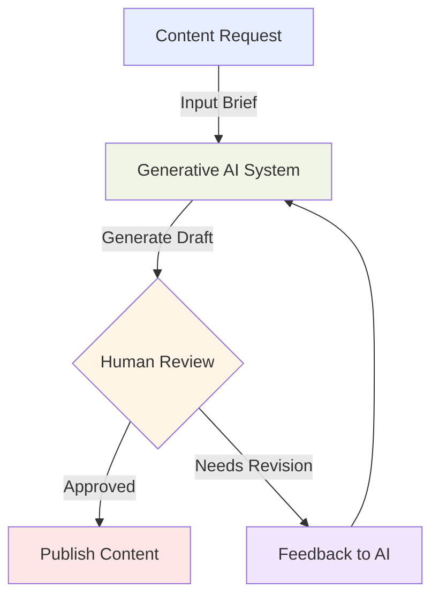
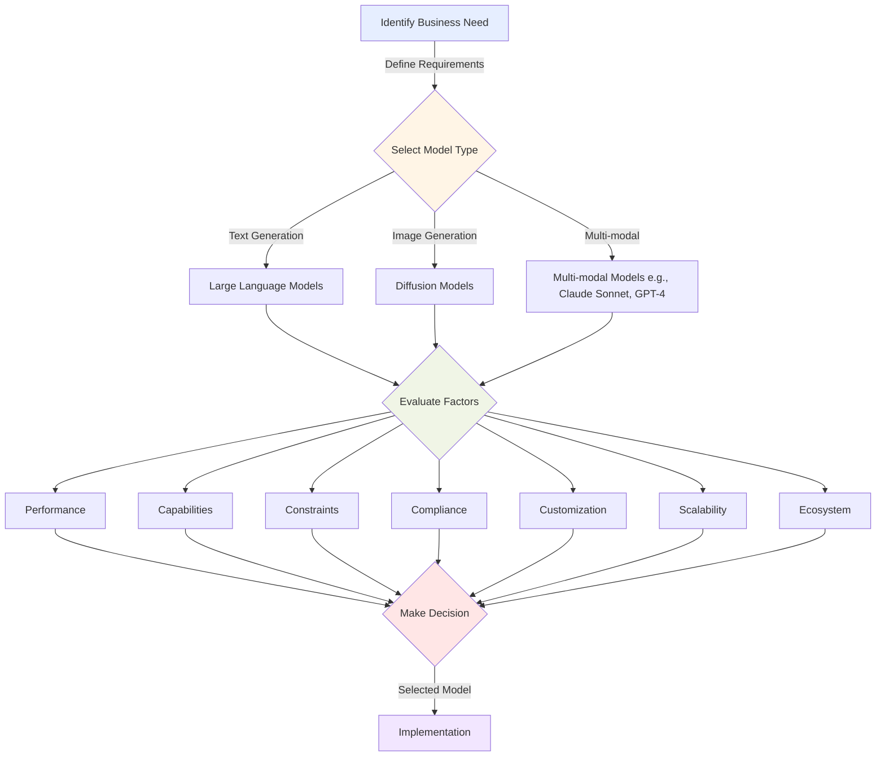

## 2.2 Capabilities and limitations of generative AI

Generative AI represents a powerful tool for solving complex business challenges across industries, creating new opportunities for innovation and efficiency. This transformative technology can produce human-like text, images, and code, opening possibilities for automation, personalization, and creative problem-solving. However, realizing its full potential requires understanding both its strengths and limitations.

Organizations that successfully implement generative AI solutions can enhance customer experiences, streamline internal processes, and drive innovation. Yet success depends on selecting appropriate models, setting realistic expectations, and addressing challenges like potential inaccuracies and ethical considerations.

This chapter explores the advantages and disadvantages of generative AI, providing guidance on selecting the right models for specific business needs and evaluating their impact using key performance metrics. With this knowledge, you'll be equipped to leverage generative AI effectively while aligning with strategic objectives and mitigating potential risks.

### Describe the advantages of generative AI

Generative AI offers several compelling advantages that make it an attractive solution for businesses across various sectors:

1. **Adaptability**

Generative AI systems demonstrate remarkable adaptability across diverse tasks and industries, often with minimal domain-specific training. This flexibility allows businesses to:

- Quickly pivot to new use cases as needs evolve
- Address diverse challenges with a single technology investment
- Explore innovative applications without extensive development time

For example, a generative AI model trained on customer service interactions can be adapted to generate marketing copy, product descriptions, or technical documentation with relatively minor adjustments.[^301]

2. **Responsiveness**

Generative AI systems excel at providing rapid, context-aware responses to user inputs. This high level of responsiveness enables:

- Real-time customer interactions through chatbots and virtual assistants
- Instant content generation for dynamic websites and applications
- Quick prototyping of ideas and concepts

Consider a financial services company using generative AI to power its customer support chatbot. The system can instantly provide personalized responses to complex queries about account information, investment strategies, or market trends, enhancing customer satisfaction and reducing workload on human agents.[^302]

3. **Simplicity**

Despite their underlying complexity, generative AI systems often present a simple interface for end-users. This simplicity manifests in several ways:

- Natural language interfaces that allow users to interact using everyday language
- Automated content creation that requires minimal human input
- Intuitive tools for non-technical users to leverage AI capabilities

For instance, Amazon Bedrock provides a user-friendly interface for businesses to access and deploy powerful generative AI models without needing deep technical expertise in machine learning.[^303]

4. **Scalability**

Generative AI solutions can easily scale to handle increasing workloads and user demands. This scalability is particularly valuable for:

- Handling peak traffic periods without performance degradation
- Supporting business growth without proportional increases in human resources
- Delivering consistent experiences across multiple channels and touchpoints

A media company using generative AI for content creation can rapidly scale its output to meet sudden increases in demand or expand into new markets without a corresponding increase in writing staff.[^304]

5. **Creativity and Innovation**

Generative AI has the unique ability to produce novel ideas and solutions, often combining concepts in unexpected ways. This capability drives:

- Enhanced brainstorming and ideation processes
- Generation of diverse content variations for A/B testing
- Discovery of new patterns and insights in data

For example, a product design team might use generative AI to explore thousands of potential designs based on a set of parameters, inspiring innovative solutions that human designers might not have considered.[^305]

6. **Consistency**

While generative AI can produce diverse outputs, it can also maintain a high level of consistency when needed. This is particularly valuable for:

- Ensuring brand voice across multiple content pieces
- Standardizing responses in customer service scenarios
- Maintaining quality control in content production

A global corporation could use generative AI to ensure that its messaging remains consistent across different languages and cultural contexts, maintaining brand integrity while adapting to local nuances.[^306]

7. **Cost-effectiveness**

By automating tasks that would traditionally require significant human effort, generative AI can lead to substantial cost savings. Benefits include:

- Reduced labor costs for repetitive tasks
- Faster time-to-market for content and products
- Lower training and onboarding costs for certain roles

Consider a software company using generative AI to assist with code generation and documentation. This could significantly reduce development time and costs while allowing human developers to focus on more complex, high-value tasks.[^307]

To illustrate how these advantages come together in a business context, let's examine a flowchart depicting the integration of generative AI into a content creation process:

*Figure 2.2.1: Generative AI Content Creation Process. This diagram illustrates how generative AI can be integrated into a content creation workflow, showcasing its adaptability, responsiveness, and ability to work alongside human creators for optimal results.*

In this process, the generative AI system demonstrates its adaptability by handling various content types, its responsiveness in quickly generating drafts, and its simplicity in integrating with existing workflows. The human review stage ensures quality control, while the feedback loop allows for continuous improvement, highlighting the system's ability to learn and adapt over time.

By leveraging these advantages, businesses can significantly enhance their operations, drive innovation, and stay competitive in an increasingly AI-driven marketplace. However, it's equally important to understand the limitations of generative AI, which we'll explore in the next section.

### Identify disadvantages of generative AI solutions

While generative AI offers numerous benefits, it also comes with several challenges and limitations that businesses must carefully consider:

1. **Hallucinations**

One of the most significant challenges with generative AI is its tendency to produce "hallucinations" &mdash; outputs that are plausible-sounding but factually incorrect or nonsensical. This issue can manifest in several ways:

- Generation of false or misleading information
- Creation of non-existent references or citations
- Fabrication of details in response to ambiguous queries

For example, a generative AI system used for customer support might confidently provide incorrect product specifications or troubleshooting steps, leading to customer frustration and potential brand damage.[^308]

2. **Interpretability**

Many generative AI models, particularly **large language models** (LLMs), operate as "black boxes," making it difficult to understand how they arrive at specific outputs. This lack of interpretability poses several challenges:

- Difficulty in auditing decision-making processes
- Challenges in explaining AI-generated content to stakeholders
- Potential legal and regulatory compliance issues

In fields like healthcare or finance, where decision transparency is crucial, the opacity of generative AI models can be a significant drawback.[^309]

3. **Inaccuracy**

While generative AI can produce high-quality outputs in many cases, it's not immune to errors and inaccuracies. These can stem from:

- Biases in training data
- Limitations in the model's knowledge cutoff date
- Misinterpretation of context or nuanced queries

A business relying on generative AI for market analysis might receive outdated or incorrect information, potentially leading to misguided strategic decisions.[^310]

4. **Nondeterminism**

Generative AI models often produce different outputs for the same input, even with identical parameters. This nondeterministic behavior can be problematic in scenarios requiring:

- Consistent and reproducible results
- Exact replication of previous outputs
- Predictable performance in critical applications

For instance, a legal firm using generative AI to draft contracts might find inconsistencies between documents generated at different times, necessitating careful human review.[^311]

5. **Data Privacy and Security Concerns**

Generative AI models often require access to large amounts of data, which can raise privacy and security issues:

- Risk of exposing sensitive information in model outputs
- Potential for data breaches during training or deployment
- Challenges in ensuring GDPR and other regulatory compliance

Organizations handling sensitive customer data must be particularly cautious when implementing generative AI solutions to avoid inadvertent data exposure.[^312]

6. **Ethical and Bias Issues**

Generative AI systems can inadvertently perpetuate or amplify biases present in their training data, leading to:

- Unfair or discriminatory outputs
- Reinforcement of stereotypes
- Potential for misuse in creating misleading content

For example, a generative AI system used in hiring processes might produce biased job descriptions or candidate evaluations if not carefully monitored and adjusted.[^313]

7. **Resource Intensity**

Training and running sophisticated generative AI models can be computationally expensive and energy-intensive. This leads to:

- High infrastructure costs for deployment and scaling
- Significant energy consumption and associated environmental impact
- Potential performance issues for real-time applications

Small to medium-sized businesses may find the resource requirements for cutting-edge generative AI models prohibitively expensive.[^314]

8. **Dependency and Skill Gap**

As organizations increasingly rely on generative AI, they may face challenges related to:

- Over-dependence on AI-generated content or decisions
- Skill gaps in the workforce for effectively managing and interpreting AI outputs
- Difficulty in maintaining and updating AI systems as technology evolves

Understanding these limitations is crucial for businesses to implement generative AI responsibly and effectively. By acknowledging these challenges, organizations can develop strategies to mitigate risks, ensure quality control, and maximize the benefits of generative AI while minimizing potential drawbacks.

### Understand various factors to select appropriate generative AI models

Selecting the right generative AI model for your business needs is a critical decision that can significantly impact the success of your AI initiatives. Various factors must be considered to ensure the chosen model aligns with your specific requirements, constraints, and objectives:

1. **Model Types**

Different generative AI models are designed for specific tasks and data types. Common types include:

- **Large Language Models** (LLMs) for text generation and understanding
- **Diffusion Models** for image and video generation
- **Variational Autoencoders** (VAEs) for data compression and generation
- **Generative Adversarial Networks** (GANs) for realistic image creation

For example, if your business needs to generate product descriptions, an LLM like GPT-3 or Claude 2 (available through Amazon Bedrock) would be more appropriate than a diffusion model designed for image generation.[^315]

2. **Performance Requirements**

Consider the specific performance metrics that are crucial for your use case:

- Inference speed for real-time applications
- Output quality and coherence
- Ability to handle specific domain knowledge
- Multilingual capabilities if required

A customer service chatbot, for instance, would prioritize fast inference times and multilingual support, while a content generation tool for long-form articles might focus more on output quality and domain-specific knowledge.[^316]

3. **Capabilities**

Assess the range of tasks the model can perform and how well they align with your business needs:

- Text generation, summarization, or translation
- Image or video creation
- Code generation or completion
- Multi-modal capabilities (handling text, images, and other data types)

For example, if your business requires both text and image generation for marketing materials, you might consider a multi-modal model like GPT-4 or a combination of specialized models for each task.[^317]

4. **Constraints**

Identify any limitations or restrictions that might affect your choice:

- Computational resources available (GPU/CPU requirements)
- Latency requirements for real-time applications
- Data privacy and on-premises deployment needs
- Budget constraints for model licensing or API usage

A small startup might opt for a smaller, more efficient model that can run on limited hardware, while a large enterprise might prioritize a more powerful model that can be deployed on-premises for data security reasons.[^318]

5. **Compliance**

Ensure the chosen model aligns with relevant regulations and industry standards:

- GDPR, CCPA, or other data protection regulations
- Industry-specific compliance (e.g., HIPAA for healthcare)
- Ethical AI guidelines and fairness considerations
- Explainability requirements for decision-making processes

Financial institutions, for example, might need to select models that provide a certain level of explainability to comply with regulatory requirements for AI-driven decisions.[^319]

6. **Customization and Fine-tuning**

Consider whether you need a model that can be customized for your specific use case:

- Ability to fine-tune on domain-specific data
- Support for few-shot or zero-shot learning
- Ease of integration with existing systems and workflows

A legal firm might choose a model that can be fine-tuned on legal documents and precedents to improve its performance in legal analysis and document generation.[^320]

7. **Scalability**

Evaluate the model's ability to grow with your business needs:

- Handling increasing volumes of requests
- Adapting to new domains or use cases
- Upgrading to newer versions or architectures

E-commerce businesses might prioritize models that can scale to handle seasonal traffic spikes and expand to support new product categories.[^321]

8. **Vendor Ecosystem and Support**

Consider the broader ecosystem and support available for the model:

- Integration with cloud platforms (e.g., AWS services)
- Available tools for monitoring and management
- Community support and documentation
- Vendor track record and future development roadmap

Choosing a model supported by Amazon Bedrock, for instance, provides the advantage of seamless integration with other AWS services and robust support infrastructure.[^322]

To illustrate how these factors interrelate in the decision-making process, consider the following flowchart:

*Figure 2.2.3: Generative AI Model Selection Process. This flowchart outlines the decision-making process for selecting an appropriate generative AI model, highlighting the various factors that need to be considered and how they feed into the final decision.*

In this diagram, we see how the process begins with identifying the business need, which informs the initial selection of model type. The various factors are then evaluated in parallel, considering the specific requirements and constraints of the business. The final decision is made based on a holistic assessment of all these factors.

By carefully considering these factors, businesses can select generative AI models that not only meet their immediate needs but also align with their long-term strategic goals and operational constraints. This thoughtful approach to model selection is crucial for maximizing the benefits of generative AI while mitigating potential risks and challenges.

### Determine business value and metrics for generative AI applications

Assessing the business value of generative AI applications is crucial for justifying investments, guiding implementation strategies, and measuring success. To effectively evaluate the impact of generative AI on your organization, it's important to establish relevant metrics that align with your business objectives:

1. **Cross-domain Performance**

Measure how well the generative AI solution performs across different areas of your business:

- Consistency of output quality across departments
- Adaptability to various use cases
- Reduction in time-to-market for new initiatives

*Metric Example:* Percentage increase in successfully completed projects across different departments using generative AI tools.

2. **Efficiency**

Evaluate the impact on operational efficiency:

- Time saved on repetitive tasks
- Reduction in manual errors
- Increased throughput for content creation or data processing

*Metric Example:* Decrease in average time to complete specific tasks (e.g., report generation, customer query resolution) compared to manual processes.

3. **Conversion Rate**

For customer-facing applications, measure the impact on sales and engagement:

- Improvement in lead generation quality
- Increase in successful customer interactions
- Enhanced personalization leading to higher conversion

*Metric Example:* Percentage increase in conversion rate for marketing campaigns using AI-generated content compared to traditional methods.

4. **Average Revenue Per User (ARPU)**

Assess the financial impact of generative AI on customer value:

- Increase in upsell and cross-sell opportunities
- Enhanced customer satisfaction leading to higher spending
- Improved retention rates due to personalized experiences

*Metric Example:* Year-over-year growth in ARPU for customers interacting with AI-powered systems versus traditional channels.

5. **Accuracy**

Measure the precision and reliability of generative AI outputs:

- Reduction in error rates for automated processes
- Improvement in decision-making accuracy
- Consistency of AI-generated content with brand guidelines

*Metric Example:* Percentage of AI-generated outputs that meet or exceed quality standards set by human experts.

6. **Customer Lifetime Value (CLV)**

Evaluate the long-term impact on customer relationships:

- Increased customer satisfaction and loyalty
- Reduction in churn rate
- Growth in repeat business and referrals

*Metric Example:* Percentage increase in CLV for customers who regularly engage with AI-powered services compared to those who don't.

7. **Cost Savings**

Quantify the reduction in operational expenses:

- Decreased labor costs for routine tasks
- Reduced training and onboarding expenses
- Lower costs associated with error correction and quality control

*Metric Example:* Total annual cost savings achieved through the implementation of generative AI solutions across different business functions.

8. **Innovation Rate**

Measure the impact on creativity and new idea generation:

- Increase in the number of new product or feature ideas
- Reduction in time from concept to prototype
- Growth in successful patent applications

*Metric Example:* Percentage increase in successfully launched new products or features developed with generative AI assistance.

9. **Employee Satisfaction and Productivity**

Assess the impact on workforce effectiveness and morale:

- Improvement in employee engagement scores
- Reduction in turnover rates for roles augmented by AI
- Increase in time spent on high-value tasks

*Metric Example:* Percentage increase in employee productivity (measured by output per hour) in teams using generative AI tools.

10. **Scalability and Growth**

Evaluate how generative AI enables business expansion:

- Ability to handle increased workload without proportional increase in resources
- Expansion into new markets or product lines
- Growth in capacity to serve customers across different time zones or languages

*Metric Example:* Percentage increase in business capacity (e.g., number of customers served, markets entered) without a corresponding increase in operational costs.

To illustrate how these metrics can be used to assess the business value of generative AI applications, consider the following table comparing performance before and after implementation:

*Table 2.2.1: Generative AI Impact Metrics*

| Metric | Before AI Implementation | After AI Implementation | Improvement |
|--------|--------------------------|-------------------------|-------------|
| Content Creation Time | 4 hours/article | 1 hour/article | 75% reduction |
| Customer Query Resolution | 24 hour avg. response time | 2 hour avg. response time | 92% reduction |
| Marketing Campaign Conversion Rate | 2.5% | 3.8% | 52% increase |
| Employee Productivity | 100 tasks/week | 150 tasks/week | 50% increase |
| Cost per Customer Interaction | $15 | $8 | 47% reduction |
| New Product Ideation | 10 ideas/month | 25 ideas/month | 150% increase |

This table provides a clear visualization of the impact generative AI can have across various business metrics. By comparing pre- and post-implementation data, organizations can quantify the value added by their AI investments.[^323]

To effectively measure and communicate the business value of generative AI applications, consider the following best practices:

1. Establish baseline metrics before implementation for accurate comparison.
2. Use a combination of quantitative and qualitative measures to capture the full impact.
3. Regularly review and update metrics to ensure they remain aligned with evolving business goals.
4. Conduct A/B testing to directly compare AI-driven processes with traditional methods.
5. Gather feedback from employees and customers to assess intangible benefits and areas for improvement.
6. Consider long-term impacts and potential for future scalability when evaluating ROI.

By systematically tracking these metrics and analyzing the results, businesses can make data-driven decisions about their generative AI investments, optimize their implementations, and demonstrate the tangible value of these technologies to stakeholders. This approach ensures that generative AI applications are not just technological innovations, but strategic assets that drive measurable business growth and competitive advantage.

### Questions for self-check

1. **A marketing team wants to use generative AI to create personalized product descriptions. Which of the following is NOT an advantage of using generative AI for this task?**

   A. Increased adaptability to different product types
   B. Improved consistency in brand voice across descriptions
   C. Guaranteed elimination of all factual errors in content
   D. Faster generation of large volumes of descriptions

2. **A financial services company is considering implementing a generative AI chatbot for customer support. Which of the following represents the most significant risk associated with this implementation?**

   A. Increased response time to customer queries
   B. Higher operational costs compared to human agents
   C. Potential for providing inaccurate or hallucinated information
   D. Inability to handle complex financial terminology

3. **When selecting an appropriate generative AI model for a business application, which factor is LEAST important to consider?**

   A. The model's ability to generate viral social media content
   B. Compliance with relevant industry regulations
   C. The model's performance requirements and capabilities
   D. Data privacy and security considerations

4. **A retail company has implemented a generative AI system to assist with inventory management and demand forecasting. Which metric would be MOST relevant in determining the business value of this AI application?**

   A. Number of AI-generated social media posts
   B. Reduction in inventory holding costs
   C. Increase in employee satisfaction scores
   D. Growth in website traffic

5. **Which of the following statements best describes the concept of "hallucinations" in generative AI models?**

   A. The model's ability to generate creative and innovative ideas
   B. The tendency of the model to produce plausible but factually incorrect information
   C. The model's capacity to understand and interpret human emotions
   D. The process of fine-tuning a model on domain-specific data

### Answers and Explanations

1. **Correct answer: C. Guaranteed elimination of all factual errors in content**

   Explanation: While generative AI offers many advantages for creating personalized product descriptions, including adaptability (A), consistency (B), and speed (D), it cannot guarantee the elimination of all factual errors. This is one of the key limitations of generative AI systems. They can produce inaccuracies or "hallucinations," especially when dealing with specific product details. Human oversight is still necessary to ensure factual accuracy in AI-generated content.[^324]

2. **Correct answer: C. Potential for providing inaccurate or hallucinated information**

   Explanation: The most significant risk in implementing a generative AI chatbot for financial services customer support is the potential for providing inaccurate or hallucinated information. This is particularly critical in the financial sector where incorrect information could lead to serious consequences for customers and the company. While generative AI can typically provide faster responses (not A) and often at lower operational costs (not B), and can be trained to handle complex terminology (not D), the risk of inaccuracies remains a primary concern that requires careful management and human oversight.[^325]

3. **Correct answer: A. The model's ability to generate viral social media content**

   Explanation: When selecting a generative AI model for business applications, the least important factor among these options is the model's ability to generate viral social media content. This is a very specific use case and not universally relevant to all businesses. In contrast, compliance with industry regulations (B), performance requirements and capabilities (C), and data privacy and security considerations (D) are critical factors that directly impact the model's suitability, legal compliance, and effectiveness in a business context.[^326]

4. **Correct answer: B. Reduction in inventory holding costs**

   Explanation: For a retail company using generative AI in inventory management and demand forecasting, the most relevant metric to determine business value would be the reduction in inventory holding costs. This directly relates to the efficiency and accuracy of the AI system in optimizing inventory levels. While other metrics like employee satisfaction (C) or website traffic (D) might be indirectly affected, they are less directly tied to the specific application of AI in inventory management. The number of AI-generated social media posts (A) is not relevant to this particular use case.[^327]

5. **Correct answer: B. The tendency of the model to produce plausible but factually incorrect information**

   Explanation: "Hallucinations" in generative AI refer to the model's tendency to produce outputs that sound plausible but are factually incorrect or nonsensical. This is a significant limitation of generative AI systems and a key concern for businesses implementing these technologies. It's not about creativity (A), emotional understanding (C), or the process of fine-tuning (D). Understanding this concept is crucial for businesses to implement appropriate safeguards and quality control measures when using generative AI.[^328]

[^300]: Generative AI capabilities and applications. URL: <https://aws.amazon.com/what-is/generative-ai/>
[^301]: Adaptability of generative AI models. URL: <https://aws.amazon.com/blogs/machine-learning/build-and-deploy-a-scalable-machine-learning-system-on-kubernetes-with-kubeflow-on-aws/>
[^302]: Real-time customer interactions with generative AI. URL: <https://aws.amazon.com/blogs/machine-learning/creating-a-question-and-answer-bot-with-amazon-lex-and-amazon-alexa/>
[^303]: Amazon Bedrock overview. URL: <https://aws.amazon.com/bedrock/>
[^304]: Scalability of generative AI solutions. URL: <https://aws.amazon.com/blogs/machine-learning/amazon-sagemaker-inference-launches-faster-auto-scaling-for-generative-ai-models/>
[^305]: Generative AI in product design. URL: <https://aws.amazon.com/blogs/machine-learning/simplify-data-prep-for-gen-ai-with-amazon-sagemaker-data-wrangler/>
[^306]: Consistency in generative AI outputs. URL: <https://aws.amazon.com/bedrock/guardrails/>
[^307]: Cost-effectiveness of generative AI in software development. URL: <https://aws.amazon.com/blogs/aws/reimagine-software-development-with-codewhisperer-as-your-ai-coding-companion/>
[^308]: Hallucinations in generative AI models. URL: <https://aws.amazon.com/blogs/aws/prevent-factual-errors-from-llm-hallucinations-with-mathematically-sound-automated-reasoning-checks-preview/>
[^309]: Interpretability challenges in generative AI. URL: <https://aws.amazon.com/sagemaker-ai/clarify/>
[^310]: Inaccuracies in generative AI outputs. URL: <https://aws.amazon.com/blogs/machine-learning/quickly-build-high-accuracy-generative-ai-applications-on-enterprise-data-using-amazon-kendra-langchain-and-large-language-models/>
[^311]: Nondeterminism in generative AI models. URL: <https://aws.amazon.com/blogs/machine-learning/enhance-performance-of-generative-language-models-with-self-consistency-prompting-on-amazon-bedrock/>
[^312]: Data privacy in generative AI applications. URL: <https://aws.amazon.com/blogs/security/securing-generative-ai-data-compliance-and-privacy-considerations/>
[^313]: Ethical considerations in generative AI. URL: <https://aws.amazon.com/ai/responsible-ai/>
[^314]: Resource requirements for generative AI models. URL: <https://docs.aws.amazon.com/sagemaker/latest/dg/model-optimize.html>
[^315]: Generative AI model types and selection. URL: <https://aws.amazon.com/bedrock/features/>
[^316]: Performance considerations for generative AI models. URL: <https://aws.amazon.com/blogs/machine-learning/deploy-large-models-at-high-performance-using-fastertransformer-on-amazon-sagemaker/>
[^317]: Capabilities of different generative AI models. URL: <https://docs.aws.amazon.com/bedrock/latest/userguide/models-supported.html>
[^318]: Constraints in generative AI model selection. URL: <https://docs.aws.amazon.com/sagemaker/latest/dg/jumpstart-foundation-models.html>
[^319]: Compliance considerations for generative AI. URL: <https://aws.amazon.com/blogs/security/securing-generative-ai-data-compliance-and-privacy-considerations/>
[^320]: Customization and fine-tuning of generative AI models. URL: <https://docs.aws.amazon.com/sagemaker/latest/dg/jumpstart-fine-tune.html>
[^321]: Scalability in generative AI implementations. URL: <https://aws.amazon.com/about-aws/whats-new/2024/07/amazon-sagemaker-faster-auto-scaling-generative-ai-models>
[^322]: AWS ecosystem for generative AI. URL: <https://aws.amazon.com/ai/generative-ai/>
[^323]: Measuring business value of generative AI. URL: <https://aws.amazon.com/executive-insights/podcast/calculating-the-cost-and-roi-of-generative-ai/>
[^324]: Limitations of generative AI in content accuracy. URL: <https://aws.amazon.com/blogs/machine-learning/high-quality-human-feedback-for-your-generative-ai-applications-from-amazon-sagemaker-ground-truth-plus/>
[^325]: Risks of generative AI in financial services. URL: <https://aws.amazon.com/blogs/machine-learning/authenticate-users-with-one-time-passwords-in-amazon-lex-chatbots/>
[^326]: Factors in selecting generative AI models. URL: <https://docs.aws.amazon.com/sagemaker/latest/dg/studio-jumpstart.html>
[^327]: Business value metrics for generative AI in retail
[^328]: Understanding hallucinations in generative AI models. URL: <https://aws.amazon.com/blogs/aws/prevent-factual-errors-from-llm-hallucinations-with-mathematically-sound-automated-reasoning-checks-preview/>