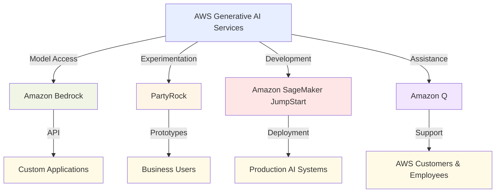
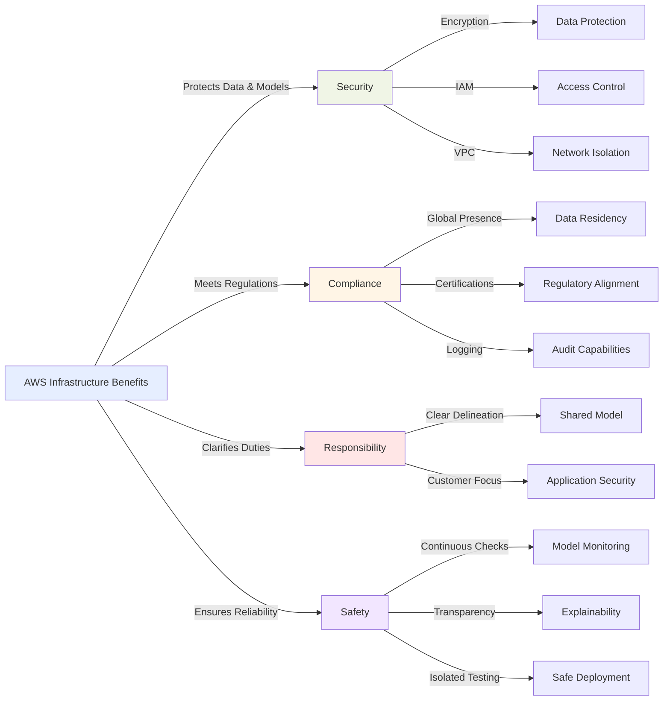

## 2.3 AWS infrastructure and technologies for building generative AI applications

Generative AI has emerged as a transformative technology for organizations seeking to innovate, streamline operations, and enhance customer experiences. AWS provides robust infrastructure and cutting-edge technologies that enable businesses of all sizes to build and deploy powerful generative AI applications.[^400] For business professionals preparing for the AWS Certified AI Practitioner exam, understanding these tools and services is essential for both certification success and implementing effective AI initiatives. AWS's generative AI ecosystem offers comprehensive services that reduce development time, ensure security and compliance, and enable scalable AI solutions that deliver measurable business value.

### AWS services and features for developing generative AI applications

AWS offers an extensive ecosystem of services designed to simplify and accelerate generative AI development. These tools support the complete AI lifecycle, from experimentation to enterprise-scale deployment, making advanced AI capabilities accessible regardless of technical expertise.

#### Amazon SageMaker JumpStart

Amazon SageMaker JumpStart is a capability within Amazon SageMaker that provides a library of pre-built machine learning solutions, including generative AI models.[^401] It offers a **low-code approach** to AI development, allowing business professionals to quickly prototype and deploy AI applications without deep technical expertise.

Key features of SageMaker JumpStart include:

- Pre-trained models: Access to a wide range of **foundation models**, including large language models (LLMs) and image generation models.
- One-click deployment: Easily deploy models to SageMaker endpoints for inference.
- Fine-tuning capabilities: Customize pre-trained models with your own data to improve performance on specific tasks.
- Solution templates: Pre-built notebooks and scripts for common AI use cases.

For example, a marketing team could use SageMaker JumpStart to quickly deploy a text generation model for creating personalized email campaigns, significantly reducing the time and technical expertise required to implement AI-driven marketing strategies.[^402]

#### Amazon Bedrock

Amazon Bedrock is a fully managed service that provides access to high-performance foundation models (FMs) from leading AI companies through a single API.[^403] It's designed to simplify the process of building and scaling generative AI applications.

Key features of Amazon Bedrock include:

- Access to multiple FMs: Choose from models by Anthropic, AI21 Labs, Stability AI, and Amazon's own models.
- Customization options: Fine-tune models with your own data to improve performance on specific tasks.
- Serverless infrastructure: Pay only for the compute and storage you use, with no need to manage underlying infrastructure.
- Integration with AWS services: Easily connect with other AWS services for data processing, storage, and analytics.

A practical application of Amazon Bedrock could be in customer service, where a company might use it to build an intelligent chatbot that can handle complex queries, reducing call center workload and improving customer satisfaction.[^404]

#### PartyRock: An Amazon Bedrock Playground

PartyRock is a web-based playground for Amazon Bedrock that allows users to experiment with generative AI models and create simple applications without writing code.[^405] It's an excellent tool to explore the capabilities of AI and prototype ideas quickly.

Key features of PartyRock include:

- No-code interface: Create AI-powered apps using a visual interface.
- Rapid prototyping: Quickly test different models and prompts to find the best fit for your use case.
- Shareable apps: Easily share your creations with colleagues for feedback and collaboration.
- Learning resource: Gain hands-on experience with AI capabilities without technical barriers.

For instance, a product manager could use PartyRock to create a prototype of an AI-powered product description generator, demonstrating the concept to stakeholders before committing resources to full development.

#### Amazon Q

Amazon Q is an AI-powered assistant designed to help AWS customers and employees with a wide range of tasks, from answering questions about AWS services to helping with code generation and troubleshooting.[^406]

Key features of Amazon Q include:

- Natural language interaction: Ask questions and receive answers in plain language.
- AWS expertise: Deep knowledge of AWS services and best practices.
- Code assistance: Help with writing, explaining, and debugging code.
- Customization: Can be tailored to understand company-specific information and policies.

A practical application of Amazon Q could be in IT support, where it can assist support staff in quickly diagnosing and resolving AWS-related issues, improving response times and reducing the need for escalations.

> **Note**: Amazon Q has two specialized services: Amazon Q Business and Amazon Q Developer. These services will be covered in detail in the next sections, where we'll explore their specific capabilities, use cases, and implementation strategies for business and development scenarios.

*Figure 2.3.1: AWS Generative AI Services Ecosystem. This diagram illustrates the relationships between key AWS services for generative AI, showing how they cater to different stages of AI development and user needs.*

These services form the core of AWS's generative AI offering, providing a comprehensive toolkit for businesses to explore, develop, and deploy AI applications. By understanding these tools, business professionals can better navigate the AI landscape and identify opportunities for innovation within their organizations.

### Advantages of using AWS generative AI services

AWS generative AI services deliver significant benefits that accelerate development, reduce costs, and improve outcomes for AI initiatives. These advantages enable organizations to implement sophisticated AI capabilities that previously required specialized expertise and substantial resources.

#### Accessibility and lower barrier to entry

AWS generative AI services democratize access to advanced AI capabilities, making them available to organizations regardless of their size or technical expertise. This accessibility is achieved through:

- Pre-trained models: Eliminating the need for extensive data collection and model training.
- User-friendly interfaces: Simplifying interaction with complex AI systems.
- Documentation and support: Providing comprehensive resources for learning and troubleshooting.

For example, a small e-commerce business could use Amazon Bedrock to implement product recommendation systems that were previously only feasible for large tech companies, leveling the playing field in customer experience.[^407]

#### Efficiency and cost-effectiveness

AWS's pay-as-you-go model and managed services significantly reduce the financial and operational burden of AI development:

- Reduced infrastructure costs: No need for upfront investment in expensive hardware.
- Optimized resource utilization: Automatic scaling based on demand.
- Managed services: Lower operational overhead for maintenance and updates.

A medium-sized financial services company, for instance, could use SageMaker JumpStart to develop and deploy fraud detection models without the need for a large, specialized data science team, resulting in substantial cost savings.[^408]

#### Speed to market

AWS generative AI services accelerate the development and deployment of AI applications:

- Ready-to-use models: Shortening the time from concept to production.
- Integration with AWS ecosystem: Streamlining data flow and application deployment.
- Continuous updates: Ensuring access to the latest AI advancements without manual upgrades.

This speed can be crucial in competitive markets. For example, a media company could quickly develop and launch an AI-powered content recommendation system using Amazon Bedrock, gaining a competitive edge in user engagement.[^409]

#### Ability to meet business objectives

The flexibility and scalability of AWS generative AI services allow businesses to align AI initiatives with specific organizational goals:

- Customization options: Tailoring models to specific industry needs.
- Scalability: Growing AI capabilities in line with business expansion.
- Integration capabilities: Incorporating AI into existing business processes and applications.

A healthcare provider, for instance, could use SageMaker JumpStart to develop a patient triage system that integrates with their existing electronic health records, improving patient care while optimizing resource allocation.[^410]

These advantages collectively enable businesses to innovate faster, operate more efficiently, and compete more effectively in the AI-driven marketplace. By leveraging AWS generative AI services, organizations can focus on creating value rather than managing complex AI infrastructure.

### Benefits of AWS infrastructure for generative AI applications

AWS provides a robust infrastructure foundation that ensures generative AI applications meet enterprise requirements for reliability, security, and compliance. These infrastructure benefits are particularly important for applications handling sensitive data or operating in regulated industries.

#### Security

AWS provides a comprehensive security framework that addresses the unique challenges of AI applications:[^411]

- Data encryption: At rest and in transit, protecting sensitive training data and model outputs.
- **Identity and Access Management (IAM)**: Fine-grained control over who can access AI resources and models.
- Network isolation: **Virtual Private Cloud (VPC)** capabilities to secure AI workloads.
- Compliance certifications: Meeting industry-specific security standards (e.g., HIPAA, PCI DSS).

For example, a financial institution using Amazon Bedrock for credit risk assessment can ensure that customer financial data remains secure and compliant with regulatory requirements throughout the AI pipeline.

#### Compliance

AWS's commitment to compliance helps businesses meet regulatory requirements when deploying AI applications:[^412]

- Global infrastructure: Data centers in multiple regions to meet data residency requirements.
- Compliance programs: Support for various international standards and regulations.
- Audit trails: Detailed logging and monitoring capabilities for AI model usage and data access.

A multinational corporation, for instance, could use SageMaker JumpStart to develop AI models that comply with GDPR in Europe and CCPA in California, ensuring consistent global operations while meeting local regulations.

#### Responsibility

AWS operates under a **shared responsibility model**, clearly delineating the security responsibilities between AWS and the customer:[^413]

- AWS responsibilities: Securing the underlying infrastructure, including hardware, software, and networking.
- Customer responsibilities: Securing data, managing access, and configuring AI services appropriately.

This model allows businesses to focus on securing their AI applications and data while relying on AWS to maintain the security of the underlying infrastructure.

#### Safety

AWS provides tools and best practices to ensure the safe development and deployment of AI applications:[^414]

- Model monitoring: Capabilities to detect drift and ensure ongoing model performance.
- **Explainability features**: Tools to understand model decisions and identify potential biases.
- Sandboxing environments: Isolated testing environments for AI models before production deployment.

For example, a healthcare provider using Amazon SageMaker for diagnostic AI models can implement continuous monitoring to ensure the model's predictions remain accurate and unbiased over time, crucial for patient safety.

*Figure 2.3.3: AWS Infrastructure Benefits for Generative AI. This flowchart illustrates the key infrastructure benefits provided by AWS for generative AI applications, highlighting the interconnected nature of security, compliance, responsibility, and safety features.*

By leveraging these infrastructure benefits, businesses can build generative AI applications that are not only powerful and innovative but also secure, compliant, and trustworthy. This foundation is essential for the responsible development and deployment of AI solutions in enterprise environments.

### Cost tradeoffs of AWS generative AI services

Effective implementation of generative AI requires understanding the financial implications and tradeoffs involved. Knowledge of these cost factors enables informed decision-making and budget optimization for AI initiatives that deliver maximum value.

#### Responsiveness vs. Cost

The responsiveness of generative AI models often correlates with their computational requirements and, consequently, cost:

- Higher-end models: Offer faster response times but at a higher cost per inference.
- Lower-end models: More cost-effective but may have slower response times.

For example, a customer service chatbot using a high-performance model on Amazon Bedrock might provide quicker, more accurate responses, but at a higher operational cost compared to a simpler model.[^415]

#### Availability and Redundancy

Ensuring high availability for AI applications can impact costs:

- Multi-region deployment: Improves availability but increases data transfer and storage costs.
- Redundant systems: Enhance reliability but require additional resources.

A global e-commerce platform might deploy its product recommendation AI across multiple AWS regions to ensure low latency for all customers, accepting higher costs for improved user experience.[^416]

#### Performance Optimization

Balancing performance and cost often involves tradeoffs:

- Model optimization: Techniques like **quantization** can reduce costs but may slightly impact model quality.
- Caching strategies: Can improve response times and reduce compute costs but require additional storage.

For instance, a financial services company might optimize its fraud detection model for faster inference, accepting a small accuracy trade-off for significant cost savings in high-volume transactions.[^417]

#### Regional Coverage

AWS's pricing can vary by region, affecting the overall cost of AI services:

- Popular regions: Often have more competitive pricing but may be more congested.
- Less common regions: Might have higher prices but could offer better performance or meet specific compliance requirements.

A media streaming service might choose to deploy its content recommendation AI in a less popular AWS region to balance costs with performance and regional content delivery requirements.[^418]

#### Token-based Pricing

Many generative AI services use **token-based pricing**, which can affect costs based on usage patterns:[^419]

- Input tokens: Charged for the text sent to the model.
- Output tokens: Charged for the text generated by the model.

Understanding this pricing model is crucial. For example, a legal document analysis application might need to carefully manage prompt engineering to minimize input tokens while still getting comprehensive outputs.

#### Provisioned Throughput vs. On-demand

AWS offers different pricing models for AI service usage:

- Provisioned throughput: Lower per-unit costs but requires upfront commitment.
- On-demand pricing: Higher per-unit costs but offers flexibility.

A startup developing an AI-powered app might opt for on-demand pricing initially, switching to provisioned throughput as usage patterns stabilize and become more predictable.[^420]

#### Custom Models vs. Pre-trained Models

The decision to use custom or pre-trained models impacts both development and operational costs:

- Custom models: Higher upfront costs for training but potentially lower inference costs and better performance for specific tasks.
- Pre-trained models: Lower initial costs but potentially higher operational costs for general-purpose use.

For example, a specialized manufacturing company might invest in training a custom computer vision model on SageMaker, accepting higher initial costs for long-term benefits in accuracy and reduced inference costs.[^421]

Table 2.3.1: Cost Tradeoff Comparison for AWS Generative AI Services

| Factor | Higher Cost Option | Lower Cost Option | Considerations |
|--------|---------------------|-------------------|----------------|
| Model Performance | High-end models | Lower-end models | Response time vs. budget |
| Availability | Multi-region deployment | Single region | Redundancy needs vs. cost |
| Optimization | Unoptimized models | Optimized models | Performance vs. development effort |
| Regional Choice | Popular regions | Less common regions | Pricing vs. performance/compliance |
| Usage Pattern | High volume, complex tasks | Low volume, simple tasks | Token consumption management |
| Pricing Model | On-demand | Provisioned throughput | Flexibility vs. cost savings |
| Model Type | Custom models | Pre-trained models | Specificity vs. development cost |

Understanding these cost tradeoffs is essential for making informed decisions about implementing generative AI solutions. By carefully considering these factors, business professionals can balance the powerful capabilities of AWS generative AI services with their organization's budget constraints and performance requirements.

In conclusion, AWS provides a comprehensive ecosystem for building and deploying generative AI applications, offering powerful tools, robust infrastructure, and flexible pricing options. By understanding the services available, their advantages, and the associated cost considerations, business professionals can effectively leverage AWS generative AI technologies to drive innovation and create value for their organizations. As you prepare for the AWS Certified AI Practitioner exam, keep in mind that a thorough understanding of these concepts will not only help you succeed in the certification but also equip you with the knowledge to make strategic decisions about AI implementation in real-world business scenarios.

### Questions for self-check

1. **A marketing team wants to quickly prototype an AI-powered email campaign generator. Which AWS service would be most suitable for this task?**

   A. Amazon EC2
   B. Amazon SageMaker JumpStart
   C. Amazon Redshift
   D. AWS Lambda

2. **A healthcare provider is developing an AI application for patient triage. Which AWS infrastructure benefit is MOST critical for ensuring the safe deployment of this system?**

   A. Global data center presence
   B. Virtual Private Cloud capabilities
   C. Model monitoring and explainability features
   D. Shared responsibility model

3. **A financial services company is considering using Amazon Bedrock for a high-volume transaction processing AI. Which cost tradeoff should they be MOST aware of when designing their solution?**

   A. Multi-region deployment vs. single region
   B. Custom models vs. pre-trained models
   C. Provisioned throughput vs. on-demand pricing
   D. Higher-end models vs. lower-end models

4. **Which AWS service provides a no-code interface for business professionals to experiment with generative AI models and create simple applications?**

   A. Amazon SageMaker
   B. Amazon Comprehend
   C. PartyRock
   D. Amazon Textract

5. **A multinational corporation needs to develop AI models that comply with different data protection regulations across various countries. Which AWS infrastructure benefit directly addresses this requirement?**

   A. Data encryption at rest and in transit
   B. Global infrastructure with multiple regions
   C. Identity and Access Management (IAM)
   D. Audit trails and detailed logging

### Answers and Explanations

1. **Correct answer: B. Amazon SageMaker JumpStart**

   Explanation: Amazon SageMaker JumpStart is the most suitable service for quickly prototyping an AI-powered email campaign generator. It provides pre-built machine learning solutions and models, including those for text generation, which aligns perfectly with the marketing team's needs. SageMaker JumpStart offers a low-code approach, allowing business professionals to rapidly prototype AI applications without deep technical expertise, making it ideal for the marketing team's quick prototyping requirement.[^422]

2. **Correct answer: C. Model monitoring and explainability features**

   Explanation: For a healthcare provider developing a patient triage AI application, the most critical safety benefit is model monitoring and explainability features. These capabilities allow the healthcare provider to continuously monitor the AI model's performance, detect any drift in accuracy, and understand the reasoning behind the model's decisions. In a healthcare context, where patient safety is paramount, being able to explain and validate the AI's decision-making process is crucial for ensuring safe and ethical deployment of the system.[^423]

3. **Correct answer: D. Higher-end models vs. lower-end models**

   Explanation: For a financial services company using Amazon Bedrock for high-volume transaction processing, the most important cost tradeoff to consider is between higher-end and lower-end models. Higher-end models offer faster response times but at a higher cost per inference, while lower-end models are more cost-effective but may have slower response times. In high-volume transaction processing, balancing the need for quick responses with cost efficiency is crucial. This tradeoff directly impacts the operational costs and performance of the AI system in a high-transaction environment.[^424]

4. **Correct answer: C. PartyRock**

   Explanation: PartyRock is the AWS service that provides a no-code interface for business professionals to experiment with generative AI models and create simple applications. It's described in the subchapter as a web-based playground for Amazon Bedrock that allows users to create AI-powered apps using a visual interface, without writing code. This makes it an ideal tool for business professionals to explore AI capabilities and prototype ideas quickly without technical barriers.[^425]

5. **Correct answer: B. Global infrastructure with multiple regions**

   Explanation: For a multinational corporation needing to comply with different data protection regulations across various countries, AWS's global infrastructure with multiple regions is the most relevant benefit. This feature allows the company to store and process data in specific geographic locations, meeting data residency requirements that are often part of data protection regulations like GDPR in Europe or CCPA in California. By leveraging AWS's global presence, the corporation can ensure that its AI models and data processing comply with local regulations in different countries, maintaining consistent global operations while meeting diverse regulatory requirements.[^426]

[^400]: AWS Generative AI Services Overview. URL: <https://aws.amazon.com/generative-ai/>
[^401]: Amazon SageMaker JumpStart Overview. URL: <https://aws.amazon.com/sagemaker/jumpstart/>
[^402]: AWS Case Study: Personalized Marketing with AI. URL: <https://aws.amazon.com/solutions/case-studies/launchmetrics-case-study/>
[^403]: Amazon Bedrock Overview. URL: <https://aws.amazon.com/bedrock/>
[^404]: AWS Contact Center Intelligence and Conversational AI. URL: <https://aws.amazon.com/machine-learning/ml-use-cases/contact-center-intelligence/>
[^405]: Announcing PartyRock, an Amazon Bedrock Playground. URL: <https://aws.amazon.com/about-aws/whats-new/2023/11/partyrock-amazon-bedrock-playground/>
[^407]: Personalization Use Cases - Generative AI - AWS. URL: <https://aws.amazon.com/ai/generative-ai/use-cases/personalization/>
[^408]: AWS Financial Services Industry Solutions. URL: <https://aws.amazon.com/financial-services/>
[^409]: AWS Media and Entertainment Industry Solutions. URL: <https://aws.amazon.com/media/>
[^410]: AWS Healthcare and Life Sciences Solutions. URL: <https://aws.amazon.com/health/>
[^411]: AWS Security, Identity, and Compliance. URL: <https://aws.amazon.com/products/security/>
[^412]: AWS Compliance Programs. URL: <https://aws.amazon.com/compliance/programs/>
[^413]: AWS Shared Responsibility Model. URL: <https://aws.amazon.com/compliance/shared-responsibility-model/>
[^414]: AWS AI/ML Security and Governance. URL: <https://aws.amazon.com/machine-learning/responsible-ai/>
[^415]: AWS Pricing Calculator for AI/ML Services. URL: <https://calculator.aws/#/addService/MachineLearning>
[^416]: AWS Global Infrastructure Overview. URL: <https://aws.amazon.com/about-aws/global-infrastructure/>
[^417]: AWS Performance Optimization for Machine Learning. URL: <https://docs.aws.amazon.com/sagemaker/latest/dg/model-performance-optimization.html>
[^418]: AWS Regional Services List. URL: <https://aws.amazon.com/about-aws/global-infrastructure/regional-product-services/>
[^419]: Amazon Bedrock Pricing. URL: <https://aws.amazon.com/bedrock/pricing/>
[^420]: AWS Pricing Models Overview. URL: <https://aws.amazon.com/pricing/>
[^421]: Amazon SageMaker. URL: <https://aws.amazon.com/sagemaker/>
[^422]: Amazon SageMaker JumpStart Features. URL: <https://docs.aws.amazon.com/sagemaker/latest/dg/studio-jumpstart.html>
[^423]: Whitepaper: Machine Learning Best Practices in Healthcare and Life Sciences. URL: <https://aws.amazon.com/blogs/machine-learning/whitepaper-machine-learning-best-practices-in-healthcare-and-life-sciences/>
[^424]: Amazon Bedrock Model Selection Guide. URL: <https://docs.aws.amazon.com/bedrock/latest/userguide/model-selection.html>
[^425]: Build AI apps with PartyRock and Amazon Bedrock | AWS News Blog. URL: <https://aws.amazon.com/blogs/aws/build-ai-apps-with-partyrock-and-amazon-bedrock/>
[^426]: AWS Digital Sovereignty. URL: <https://aws.amazon.com/compliance/digital-sovereignty/>
[^406]: Amazon Q Overview. URL: <https://aws.amazon.com/q/>