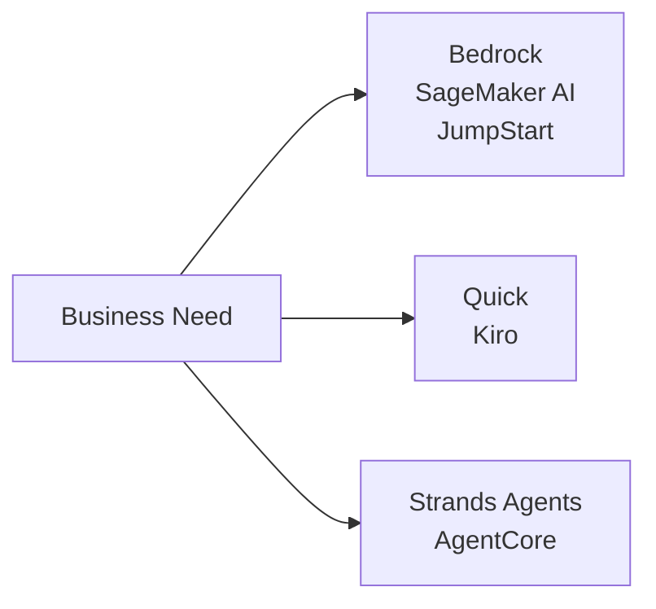
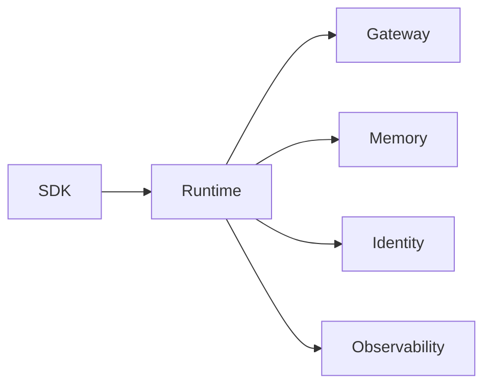
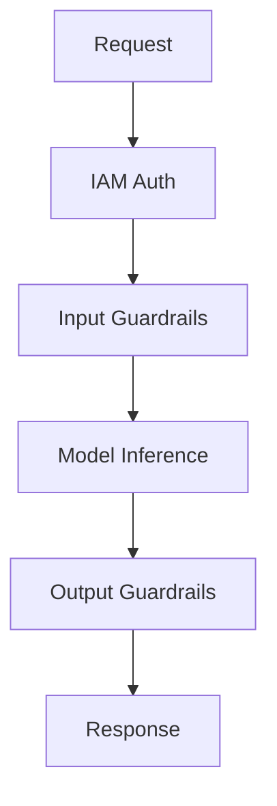
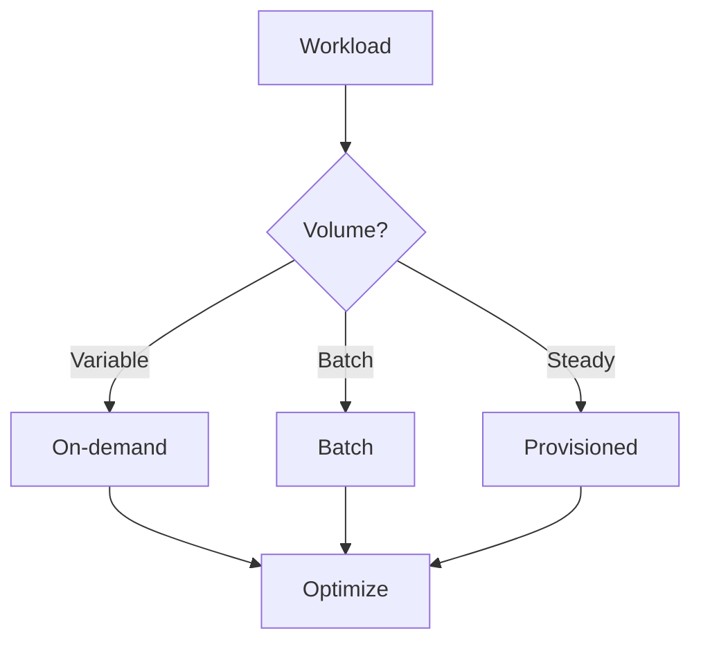
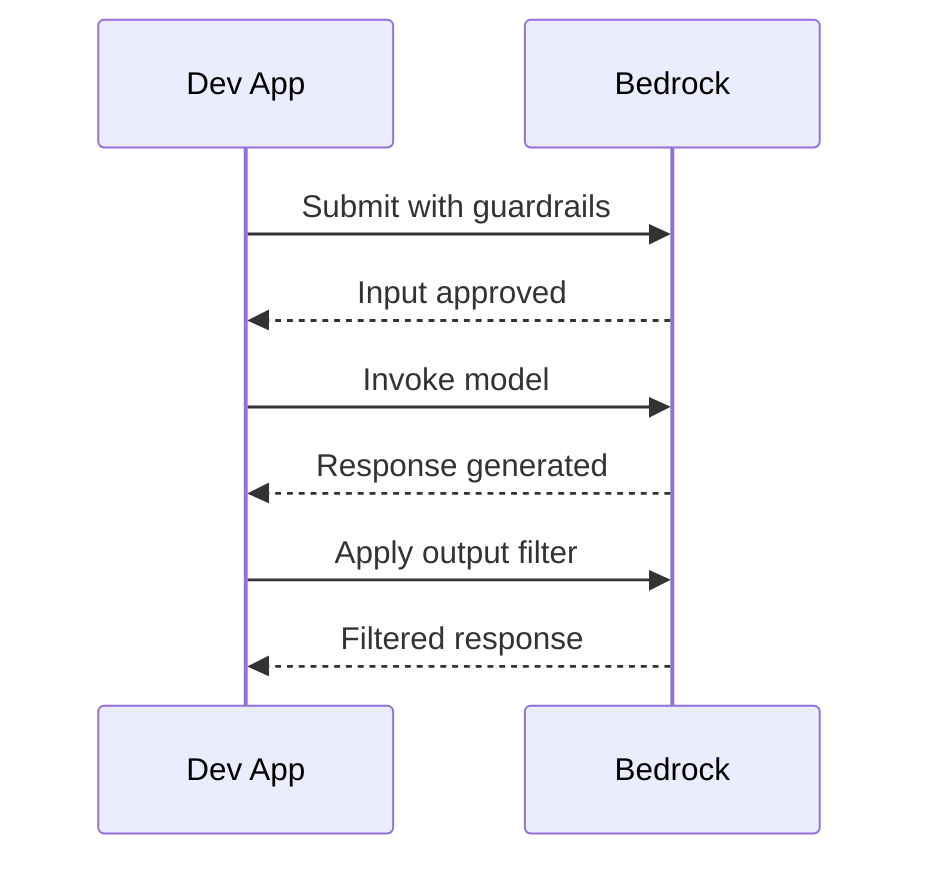

## Task Statement 2.3: Describe AWS infrastructure and technologies for building GenAI applications

Building a generative AI application on AWS requires choosing among a growing set of managed services and developer tools, each targeting a different point in the development spectrum. Task 2.3 covers four objectives: the AWS services named in the v1.1 exam guide, the advantages of using them, the security and compliance properties they inherit from AWS, and the cost decisions teams face in production.[^203001]

*Figure 2.3.1: Three entry points for GenAI work on AWS. The Bedrock and SageMaker family covers managed model APIs and custom training, Quick and Kiro cover business and developer assistants, and Strands Agents and AgentCore cover agent frameworks and runtimes.*

The services in this task statement do not compete with one another in a single dimension. A team might use **Amazon Bedrock** as its model API, deploy that application through **Amazon Bedrock AgentCore**, automate development work inside **Kiro**, and query business data through **Amazon Quick**, all within the same project. The sections that follow explain each service, the combined advantages of using the AWS platform, the security and compliance infrastructure beneath it, and the pricing mechanics that determine total cost of ownership.

### 2.3.1 AWS services and features for GenAI applications

The AWS v1.1 exam guide names seven services and tool families for building generative AI applications: Amazon Bedrock, Amazon SageMaker AI, Amazon SageMaker JumpStart, Amazon Quick, Kiro, Strands Agents, and Amazon Bedrock AgentCore.[^203002] Each occupies a specific niche, and understanding where each fits prevents both over-engineering and under-investing in platform capabilities.

**Amazon Bedrock** is a fully managed service that provides API access to a curated catalogue of foundation models from multiple providers, without requiring you to provision or manage any GPU infrastructure.[^203003] A team calls a single endpoint, specifies the model identifier, and receives a generated response billed by the token. The underlying infrastructure, model weights, and scaling logic are entirely invisible to the caller.

The model catalogue available through Amazon Bedrock spans Amazon's own models, third-party research labs, and open-weight options:

- **Amazon Nova** models (Nova Micro, Nova Lite, Nova Pro, Nova Premier) are Amazon's own series, ranging from a text-only, low-latency tier up to a multimodal flagship capable of processing images, video, and documents.[^203004]
- **Anthropic Claude** (the Claude 4.x generation: Haiku 4.x, Sonnet 4.x, Opus 4.x) excels at reasoning, structured output, and long-context analysis. Claude Opus and Sonnet support 200,000-token context windows by default and one million tokens with the 1M-context beta header.[^203005]
- **Meta Llama** models are open-weight large language models suitable for text generation, coding, and dialogue tasks.[^203006]
- **Mistral AI** models, including Mixtral, are strong on instruction-following and multilingual tasks with efficient token consumption.[^203007]
- **AI21 Labs Jamba** targets enterprise text generation and long-context processing.[^203008]
- **Cohere Command** models are optimized for retrieval, classification, and enterprise search.[^203009]
- **Stability AI** models handle image and multimodal generation tasks.[^203010]

Beyond raw model access, Amazon Bedrock bundles a suite of capabilities for building production-grade applications. **Knowledge Bases for Amazon Bedrock** manages the full *retrieval-augmented generation* (RAG) pipeline: ingesting documents from Amazon S3 or other sources, chunking them, generating vector embeddings, storing them in a managed vector store, and retrieving relevant chunks at inference time.[^203011] **Amazon Bedrock Guardrails** applies configurable content policies to both the input prompt and the model output, filtering harmful categories, blocking denied topics, redacting *personally identifiable information* (PII), and running *contextual grounding checks* that compare responses against the source material to detect hallucinations.[^203012] **Amazon Bedrock Prompt Management** stores, versions, and shares prompt templates across a team so that the same optimized prompts are used consistently in production.[^203013] **Amazon Bedrock Model Evaluation** runs automated and human-evaluated benchmark jobs that score model responses on accuracy, robustness, toxicity, and task-specific metrics, allowing teams to compare models before committing to one.[^203014] **Agents for Amazon Bedrock** coordinates multi-step agentic workflows by allowing the model to call external APIs, query Knowledge Bases, and execute AWS Lambda functions as *tools* within a single orchestrated session.[^203015] **Amazon Bedrock Flows** provides a visual workflow builder for chaining prompts and sub-agents into structured pipelines without writing orchestration code.[^203016]

**Amazon SageMaker AI** is AWS's full-featured machine learning platform for teams that need to train, fine-tune, evaluate, and host their own models.[^203017] Where Amazon Bedrock abstracts the model entirely, Amazon SageMaker AI exposes the full training and inference stack. A data science team uses SageMaker AI to run distributed training jobs on GPU clusters, register models in the SageMaker Model Registry, deploy them to real-time inference endpoints, and monitor for data drift in production. For generative AI specifically, SageMaker AI is the service of choice when a team needs to fine-tune an open-weight foundation model on proprietary data at scale, or when inference latency or throughput requirements demand custom container deployments rather than a shared API endpoint.

**Amazon SageMaker JumpStart** is a feature of SageMaker AI that accelerates the starting point by providing a catalogue of pre-trained models, solution templates, and one-click deployment actions.[^203018] A practitioner can browse models from Hugging Face, TII (the Falcon series), and other providers, then deploy a chosen model to a private SageMaker endpoint with a few clicks or a single API call, without writing training code. JumpStart bridges the gap between the convenience of Amazon Bedrock and the full flexibility of custom SageMaker AI deployments: the model runs in your account's infrastructure, you control the endpoint, and you can fine-tune further if needed.

**Amazon Quick** is AWS's unified business-user analytics and AI assistant family. In 2025 AWS rebranded Amazon QuickSight and the BI-facing parts of Amazon Q under this single name, with existing QuickSight customers migrated to the new product.[^203019] Business users interact with Amazon Quick through a natural-language interface to query data warehouses, generate charts, write SQL, and summarize reports without involving engineering teams. Amazon Quick is structured around four tiers: Free, Plus, Professional, and Enterprise. The Enterprise tier integrates with Amazon Q Business indexes, allowing the assistant to search across organizational knowledge bases (SharePoint, Confluence, S3, and other connectors) as well as tabular data. For the exam, Amazon Quick is the correct answer to questions about enabling *self-service BI* augmented by generative AI for business users, not developers.

**Kiro** is AWS's AI-powered software development environment, released as generally available in late 2025.[^203020] Kiro is a fork of Code OSS (the open-source base of Visual Studio Code) extended with an agentic AI assistant that integrates directly into the editing workflow. It replaces Amazon Q Developer as the primary AI development tool in the AWS IDE ecosystem. Kiro is available in four tiers: Free, Pro, Pro+, and Power, with higher tiers providing more included agent interaction hours and access to more capable underlying models. Kiro's distinguishing feature is *spec-driven development*. Where most AI coding assistants suggest the next line as you type, spec-driven development asks the developer to describe the whole feature first; Kiro then writes a structured specification document (requirements, architecture, implementation tasks) and edits multiple files to implement it. For the exam, Kiro is the correct answer to questions about AI assistance inside a development environment, not about deploying or hosting AI models.

**Strands Agents** is an open-source SDK from AWS for building AI agents in Python and TypeScript.[^203021] It follows a *model-driven agent* design: you define a set of tools (Python functions annotated with type hints), pass them to the Strands agent alongside a system prompt, and the SDK handles the loop of model reasoning, tool selection, tool execution, and result synthesis. Strands Agents is model-agnostic and works with Amazon Bedrock, local models, and third-party model APIs.

The agent surface area on AWS has three named things that sound similar and are easy to confuse. Agents for Amazon Bedrock (also called Amazon Bedrock Agents) is the original in-console orchestration feature. AgentCore is the newer, separately-deployable runtime for production-grade agents that can be built with Bedrock Agents, Strands, or other frameworks. Strands Agents is the open-source SDK developers use to write the agent code in the first place. For the exam, Strands Agents is the developer SDK, Bedrock Agents is the in-console orchestration feature, and AgentCore is the production runtime layer.

**Amazon Bedrock AgentCore** is a production agent deployment platform released by AWS in 2025 to address the gap between writing an agent with a framework like Strands and running that agent reliably at enterprise scale.[^203022] AgentCore bundles the infrastructure concerns that teams would otherwise build themselves. Its components include:

- **AgentCore Runtime**: A managed execution environment that runs agent code, handles autoscaling, and manages session lifecycle.[^203023]
- **AgentCore Gateway**: An MCP (*Model Context Protocol*) server that exposes enterprise tools and APIs to agents through a standardized interface, removing the need to write custom tool integrations for each data source.[^203024] Model Context Protocol is an open standard, originally proposed by Anthropic and now adopted across the industry, that lets agents connect to tools and data sources without writing custom integration code for each one.
- **AgentCore Memory**: A persistent memory store that retains conversation history, user preferences, and learned facts across sessions, enabling agents to remember context between interactions.[^203025]
- **AgentCore Identity**: An OAuth 2.0-based authentication layer that allows agents to authenticate to third-party services on behalf of users without storing long-lived credentials in agent code.[^203026]
- **AgentCore Policy**: A governance layer that enforces which tools an agent may call, under what conditions, and what data it may access, supporting audit trails for regulated industries.[^203027]
- **AgentCore Evaluations**: An automated testing harness for agent workflows that measures task completion rate, tool selection accuracy, and response quality over benchmark interaction sets.[^203028]
- **AgentCore Observability**: Distributed tracing and metrics for agent sessions, integrating with Amazon CloudWatch so operators can diagnose failures in multi-step workflows.[^203029]
- **AgentCore Code Interpreter**: A sandboxed execution environment that allows an agent to run Python code generated at runtime, enabling data analysis, mathematical computation, and dynamic report generation.[^203030]
- **AgentCore Browser**: A managed headless browser that allows an agent to navigate web pages, extract content, and interact with web-based tools programmatically.[^203031]

*Table 2.3.1: AWS GenAI services mapped to primary use cases*

| Service | Primary User | Key Capability | Typical Use Case |
|---------|-------------|----------------|-----------------|
| Amazon Bedrock | Developer | Managed FM API with RAG, Guardrails, Agents | Chatbots, summarization, document Q&A |
| Amazon SageMaker AI | ML Engineer | Full training and hosting platform | Custom model fine-tuning, batch inference |
| SageMaker JumpStart | Data Scientist | One-click pre-trained model deployment | Rapid prototyping with open-weight models |
| Amazon Quick | Business Analyst | Natural-language BI and data queries | Self-service analytics, executive dashboards |
| Kiro | Software Developer | Agentic IDE with spec-driven development | Code generation, multi-file refactoring |
| Strands Agents | Developer | Open-source agent SDK (Python/TypeScript) | Custom agent pipelines, tool composition |
| Amazon Bedrock AgentCore | Platform Team | Production agent runtime and tooling | Enterprise agent deployment, MCP gateway |

The boundaries between these services matter for the exam. Amazon Bedrock is the managed model API; Amazon Bedrock AgentCore is the production runtime for agent applications. Kiro is the IDE tool; Strands Agents is the coding framework used to write agents outside the IDE. Amazon SageMaker AI is the full ML platform; SageMaker JumpStart is its model catalogue shortcut. Amazon Quick is the business user-facing analytics assistant, not a developer tool.

*Figure 2.3.2: Amazon Bedrock AgentCore architecture. A Strands-built agent is deployed to AgentCore Runtime, which coordinates all production infrastructure components including tool access, memory, identity, policy enforcement, and observability.*

### 2.3.2 Advantages of using AWS GenAI services to build applications

The six advantages listed in objective 2.3.2 are not marketing claims: each addresses a specific friction point that organizations encounter when building generative AI outside a managed cloud platform.[^203032]

**Accessibility** means that any developer with an AWS account and IAM credentials can call a frontier-class foundation model through a standard HTTPS API within minutes. There is no hardware procurement cycle, no CUDA driver configuration, no model weight download that can span hundreds of gigabytes. A team that previously needed specialized ML infrastructure staff to evaluate a new model can now do it with a few lines of code. This removes the evaluation barrier that previously slowed down AI adoption in organizations without dedicated AI infrastructure teams.

**Lower barrier to entry** goes beyond hardware. Using Amazon Bedrock, a developer does not need to understand transformer architecture, quantization strategies, or attention mechanisms to produce useful AI-powered features. The managed API accepts a plain text prompt and returns a plain text response. Knowledge Bases for Amazon Bedrock removes the need to understand vector databases or embedding pipelines. Guardrails removes the need to build content moderation from scratch. The result is that the domain expertise required to build a production-quality AI feature is front-end and business-logic skill, not ML engineering skill.

**Efficiency** comes from the auto-scaling architecture of managed services. A single Amazon Bedrock API endpoint handles a handful of requests per second during an overnight batch job and hundreds of requests per second during peak business hours without any capacity-planning work by the application team. The same property applies to Amazon SageMaker AI endpoints with auto-scaling policies, and to AgentCore Runtime's session management. Teams do not pay for idle GPU capacity between peaks.

**Cost-effectiveness** on AWS GenAI services follows a *pay-per-token* model: charges accumulate only when inference actually runs, not when models sit idle. This contrasts with self-hosting a model on a dedicated GPU instance, where the instance runs and accrues charges around the clock regardless of request volume. For low-to-medium volume applications, the on-demand API model consistently costs less than dedicated infrastructure, and the threshold where dedicated infrastructure becomes cheaper is high enough that most enterprise applications never reach it.

**Speed to market** is the aggregate effect of the previous points. A team that evaluates three models, chooses one, builds a RAG pipeline on Knowledge Bases, adds Guardrails for content policy, and deploys through AgentCore can complete all those steps in days or weeks. The equivalent build on self-managed infrastructure, including selecting a vector database, provisioning GPU instances, writing orchestration code, and building a content moderation layer, typically takes months. The gap is largest during the initial build and remains significant for subsequent model upgrades, because swapping one model for another in Amazon Bedrock requires only a configuration change, not an infrastructure migration.

**Ability to meet business objectives** refers to the service-level characteristics of managed infrastructure: guaranteed uptime commitments backed by AWS SLAs, compliance certifications that remove blockers for regulated industry deployments, and geographic coverage that allows applications to serve users in required regions without standing up separate regional stacks. An application built on Amazon Bedrock inherits AWS's availability architecture and the model's throughput limits, which are predictable enough to be written into business capability commitments.

### 2.3.3 Benefits of AWS infrastructure for GenAI applications

AWS infrastructure delivers four categories of benefit to GenAI applications: security, compliance, responsibility, and safety.[^203033] These benefits are structural properties of the platform, not features that must be enabled separately for each application.

**Security** in the AWS GenAI context is built from the same primitives as the rest of the AWS platform. Data sent to Amazon Bedrock is encrypted in transit using TLS and encrypted at rest using **AWS Key Management Service (AWS KMS)**.[^203034] Customer prompts and responses are never used to train or improve the underlying base models, which means proprietary data passed at inference time remains private to the account. Network isolation is available through **Amazon VPC** integration: organizations can route Bedrock API calls over a VPC endpoint using **AWS PrivateLink**, ensuring that inference traffic never traverses the public internet.[^203035] **AWS Identity and Access Management (IAM)** controls which identities, roles, and services are permitted to call which models, with the granularity of specific model ARNs and specific Bedrock actions such as `bedrock:InvokeModel` and `bedrock:InvokeAgent`.[^203036]

For agent applications specifically, Amazon Bedrock AgentCore Identity handles delegated authentication to third-party services using OAuth 2.0 tokens managed by the platform, so agent code never handles raw credentials for external systems. This is a material security improvement over agent frameworks where secrets must be stored in environment variables or secrets managers and rotated manually.

**Compliance** is addressed at the infrastructure level by the same AWS compliance programme that covers all other AWS services. AWS Artifact provides on-demand access to third-party audit reports covering SOC 1, SOC 2, PCI DSS, ISO 27001, and HIPAA.[^203037] **AWS Audit Manager** automates evidence collection for continuous compliance frameworks, and Amazon Bedrock falls within the scope of AWS's Control Tower governance guardrails, meaning organizations using Control Tower can apply service control policies to restrict which accounts may use which models.[^203038] For EU-based organizations, data residency requirements are satisfied by selecting a Bedrock-supported region within the EU boundary.

**Responsibility** refers to the shared responsibility model as it applies to managed AI services. With Amazon Bedrock, AWS is responsible for the security of the model weights, the underlying GPU infrastructure, the API endpoints, and the managed features (Knowledge Bases, Guardrails, Agents). The customer is responsible for the prompts they send, the data they store in Knowledge Bases, the Guardrails configuration they apply, and the IAM policies that control access.[^203039] This division is more favorable to the customer than self-hosting: the customer retains control over what the model says and to whom, without owning the operational burden of the hardware and software that runs the model. AgentCore Policy extends the responsibility model to agentic workflows by giving operators formal control over what tools agents are permitted to invoke, enforcing human-readable policies that can be audited independently of the agent code.

**Safety** is enforced primarily through Amazon Bedrock Guardrails, which applies configurable content policies at the API layer before responses are returned to the application. Content filter thresholds are adjustable per category (hate, insults, sexual content, violence, misconduct, prompt injection). The contextual grounding check compares each response to the source documents retrieved by Knowledge Bases and blocks responses that assert facts not supported by the source, directly reducing the risk of hallucinated output reaching users.[^203040] Because Guardrails operates at the API layer, it applies uniformly regardless of which underlying model is being called, including models hosted outside Amazon Bedrock through the Converse API cross-model compatibility layer.

*Figure 2.3.3: Security and safety controls in an Amazon Bedrock request. The request passes through IAM authorization, input filtering, model inference, output filtering, and grounding verification before returning to the caller, with network and encryption controls applied at the API layer.*

### 2.3.4 Cost trade-offs of AWS GenAI services

Every cost decision for a GenAI application involves trading one desirable property against another. The exam covers eight specific trade-off dimensions: responsiveness, availability, redundancy, performance, regional coverage, token-based pricing, provisioned throughput, and custom models.[^203041]

**Responsiveness versus cost** is the most fundamental trade-off. Smaller, lighter models respond faster and cost fewer tokens per request. A model in the Nova Micro tier completes a simple text classification task in tens of milliseconds and costs a fraction of a cent per thousand input tokens. A larger multimodal flagship model produces richer, more accurate output for complex tasks but takes longer to respond and costs significantly more per token. The right choice depends on the task: structured extraction from a form benefits from a small, fast model; analyzing a complex medical research paper benefits from a larger reasoning model.

**Availability versus cost** becomes relevant when an application requires guaranteed uptime across model disruptions. Amazon Bedrock includes built-in *cross-region inference* routing that automatically fails over to a replica of the model in a secondary region when the primary region experiences a service event.[^203042] Cross-region inference improves availability but increases latency for users far from the secondary region and may incur inter-region data transfer charges. Teams that require high availability without latency compromise must weigh those costs against the probability and frequency of regional disruptions.

**Redundancy** in a GenAI context applies at both the infrastructure layer (multi-AZ deployment, which Amazon Bedrock handles automatically) and the model layer (having a fallback model configured when a primary model hits quota limits or is temporarily unavailable). Maintaining a fallback model adds operational complexity and may require prompt adjustments if the primary and fallback models behave differently, but it reduces the risk of complete service unavailability during model outages.

**Performance versus cost** interacts with model selection in a second dimension: context window size. Processing a long document requires either a model with a large context window, which costs more per token, or a chunking strategy that splits the document and processes it in pieces, which costs fewer tokens per chunk but requires additional orchestration logic and may produce less coherent responses. Teams must quantify their typical document lengths and query patterns before committing to a model tier.

**Regional coverage** is a practical constraint that the exam tests directly: not every model is available in every AWS region.[^203043] A team building for European users may find that a specific preferred model is available only in US regions, requiring either a cross-region inference request (adding latency and data residency considerations) or a switch to an alternative model available in the desired region. Regional availability expands over time as AWS onboards new model providers to additional regions, but at any given point in time the available model catalogue varies by region.

**Token-based pricing** is the standard billing model for Amazon Bedrock on-demand inference. Charges accrue separately for input tokens (the prompt, system context, retrieved Knowledge Base chunks) and output tokens (the generated response). Input and output token prices differ and vary by model.[^203044] A prompt that includes a large system message and extensive Knowledge Base context will accumulate significant input token charges even for a short user question. Optimizing prompts to reduce unnecessary context is therefore a direct cost-reduction lever, not just a quality concern.

*Table 2.3.2: Amazon Bedrock pricing models compared*

| Pricing Model | How It Works | Best For | Cost Characteristic |
|---------------|-------------|----------|---------------------|
| On-demand | Pay per input and output token, no commitment | Variable or unpredictable workloads | Highest per-token rate; no wasted spend during idle periods |
| Batch inference | Submit a batch job; up to 50% discount vs on-demand | Non-time-sensitive processing of large datasets | Lower rate; accepts higher latency |
| Provisioned Throughput | Purchase a fixed tokens-per-minute capacity for a period | High-volume, latency-sensitive production workloads | Predictable cost; unused capacity is still charged |
| Prompt Caching | Repeated context prefix cached; billed at reduced rate | Applications with consistent system prompts | Large savings when system prompts are long and reused often |
| Custom Model Units | Per-model-unit pricing for fine-tuned models deployed on provisioned capacity | Custom fine-tuned models in production | Higher baseline cost; justified by task-specific performance gains |

**Provisioned throughput** is a commitment purchase: a team reserves a specified number of model units for a set period, guaranteeing a minimum tokens-per-minute throughput level.[^203045] Provisioned throughput eliminates the throttling risk that on-demand inference faces at high request rates, which matters for customer-facing applications where token-limit errors produce visible failures. The trade-off is that unused capacity within a commitment period is still charged, so provisioned throughput reduces total cost relative to on-demand only when actual utilization is consistently high; teams typically run pricing comparisons before committing.

**Custom models** introduce a cost category distinct from inference pricing. Training a fine-tuned model in Amazon Bedrock charges for the compute time used during the fine-tuning job, measured in *custom model units*.[^203046] Deploying a fine-tuned model then requires purchasing provisioned throughput, because custom models cannot be served through the shared on-demand inference pool. The total cost of a custom model deployment therefore includes fine-tuning compute, provisioned throughput, and ongoing maintenance as the base model evolves. For most use cases, prompt engineering and RAG deliver sufficient quality improvement without the overhead of model customization, and custom model investments are justified only when the task is highly specialized, the volume is large enough to amortize the fixed costs, and the quality gap between a prompted base model and a fine-tuned one is measurable and significant.

*Figure 2.3.4: Pricing model selection decision flow. Teams start by characterizing their volume profile and work through the pricing model options, returning to optimization levers when costs exceed targets.*

*Table 2.3.3: Cost trade-off dimensions for GenAI services*

| Trade-off | Lower Cost Option | Higher Cost Option | What You Give Up |
|-----------|------------------|-------------------|-----------------|
| Responsiveness | Small, fast model | Large, capable model | Output quality for complex tasks |
| Availability | Single-region inference | Cross-region inference | Availability SLA in regional disruptions |
| Redundancy | No fallback model | Fallback model configured | Resilience during model quota events |
| Performance | Chunked context with small window | Large context window model | Response coherence across long documents |
| Regional coverage | Cross-region request to available region | Wait for local region support | Latency and data residency compliance |
| Throughput guarantee | On-demand (shared pool, throttling risk) | Provisioned throughput | Predictability under high concurrent load |

*Table 2.3.4: When to use SageMaker AI versus Amazon Bedrock for generative workloads*

| Factor | Amazon Bedrock | Amazon SageMaker AI |
|--------|---------------|---------------------|
| Model ownership | AWS manages model weights | You control weights and container |
| Customization depth | Fine-tuning via Bedrock console | Full training, RLHF, custom containers |
| Inference flexibility | Managed API; limited runtime config | Custom inference code, batching strategies |
| Cost at low volume | Lower (pay-per-token, no idle charge) | Higher (instance cost even at low utilization) |
| Cost at high volume | On-demand rates apply; provisioned option available | Dedicated instances can be cheaper at sustained high throughput |
| Compliance control | AWS manages base model compliance | Organization controls the full stack |
| Time to first response | Minutes (API call) | Days to weeks (training, registration, deployment) |

*Figure 2.3.5: Request flow in a production Bedrock application. The developer's application coordinates Knowledge Bases retrieval, Guardrails filtering, model invocation, and observability in sequence, with each step adding latency and cost that must be weighed against the quality and safety benefits.*

**What this section built.** This task statement gave you the service catalogue for AWS GenAI plus the four lenses you need to compare them: capability (objective 2.3.1), platform advantages (2.3.2), infrastructure properties (2.3.3), and pricing trade-offs (2.3.4). The earlier table at the top of 2.3.1 carries the recall load for the named services. Task Statement 2.3 closes Domain 2. Domain 3 picks up where it leaves off, examining in depth how foundation models are applied: design considerations for FM applications, prompt engineering techniques, training and fine-tuning processes, and evaluation methods.

---

## Self-check questions

1. A retail company wants to allow its business analysts to ask natural-language questions about sales data in Amazon Redshift and automatically generate charts, without writing SQL or involving the data engineering team. Which AWS service is MOST appropriate for this requirement?

    A. Amazon Bedrock with Knowledge Bases connected to Redshift  
    B. Amazon SageMaker JumpStart with a pre-trained text-to-SQL model  
    C. Amazon Quick with the data warehouse connected as a data source  
    D. Strands Agents with a custom SQL tool defined in Python  

    Amazon Quick is designed specifically for business users who need natural-language access to data warehouses and BI dashboards. It connects to Amazon Redshift natively, translates natural-language questions into SQL queries, executes them, and returns visualizations, all without requiring analysts to write code or engineers to build custom pipelines. Amazon Bedrock with Knowledge Bases is suited for document retrieval and Q&A, not structured data query generation at the BI layer. SageMaker JumpStart provides pre-trained models for deployment but does not include a built-in BI interface. Strands Agents is a developer SDK that would require significant custom development to replicate what Amazon Quick provides out of the box, making it the wrong choice when the goal is rapid enablement of non-technical users.[^203047]

2. A software development team is adopting an AI-powered IDE that can generate a structured requirements and implementation plan from a natural-language feature description, then autonomously implement the plan across multiple files in the codebase. Which AWS tool is MOST aligned with this workflow?

    A. Amazon Bedrock Agents  
    B. Kiro  
    C. Amazon SageMaker JumpStart  
    D. Amazon Bedrock Flows  

    Kiro is AWS's AI-powered software development environment built on Code OSS, specifically designed for *spec-driven development* workflows where the developer describes a feature, Kiro generates a specification document covering requirements, architecture, and implementation tasks, and then executes those tasks autonomously across the codebase. It is the replacement for Amazon Q Developer as the primary AI-assisted development tool in the AWS IDE ecosystem. Amazon Bedrock Agents orchestrates multi-step AI workflows through APIs but is not an IDE product. SageMaker JumpStart deploys pre-trained ML models and is unrelated to software development workflows. Amazon Bedrock Flows builds prompt-chaining pipelines in the Bedrock console, not development environment tooling.[^203048]

3. An organization is deploying a generative AI chatbot that must never recommend specific investment products. It must also redact any account numbers that appear in user messages before they reach the model. Which Amazon Bedrock feature combination BEST addresses both requirements?

    A. Knowledge Bases with a filtered document corpus plus fine-tuning on compliant conversations  
    B. Guardrails with denied topics configured for investment recommendations plus sensitive information filters for PII  
    C. Prompt Management with compliance-focused system prompts plus Model Evaluation to verify behavior  
    D. Provisioned Throughput with a compliance-specific model unit plus VPC endpoint isolation  

    Amazon Bedrock Guardrails directly addresses both requirements. The denied topics capability allows operators to define topic categories the model must not engage with, including investment product recommendations, and Guardrails enforces this policy on every request regardless of how the user phrases the question. The sensitive information filter detects and redacts specified PII patterns, including account numbers, from input prompts before they reach the model. Fine-tuning changes model behavior during training but cannot provide the same deterministic enforcement at inference time. Prompt Management controls the prompts teams use but cannot prevent a user from asking prohibited questions. Provisioned Throughput and VPC isolation address capacity and network security, not content control.[^203049]

4. A company's generative AI application runs well at low request volumes on Amazon Bedrock on-demand pricing but experiences throttling errors during business-hours peaks that handle thousands of requests per minute. The team wants to eliminate throttling while maintaining cost control. Which pricing model should they adopt?

    A. Batch inference, because it processes requests in bulk at lower cost  
    B. Provisioned Throughput, because it reserves a guaranteed tokens-per-minute capacity  
    C. Custom model deployment on dedicated instances, because it provides unlimited throughput  
    D. Cross-region inference, because it distributes load across multiple regions  

    Provisioned Throughput purchases a reserved throughput capacity measured in model units, each representing a defined number of tokens per minute. This guarantees that requests up to the provisioned limit are never throttled, directly solving the peak-hour problem. The trade-off is that unused capacity within the commitment period is still charged, so the team must verify that utilization at peak is consistent enough to justify the commitment. Batch inference solves a different problem: it processes large volumes of non-time-sensitive work asynchronously, which would not eliminate real-time throttling for a user-facing application. Custom model deployment does not automatically provide unlimited throughput and introduces additional cost and operational complexity. Cross-region inference addresses regional availability, not throughput limits within a region.[^203050]

5. A regulated financial services firm is evaluating Amazon Bedrock for a customer-facing advisory tool. The security team needs to confirm that customer prompts and responses never traverse the public internet and that the firm retains control over encryption keys for data at rest. Which combination of two AWS features satisfies these requirements?

    A. Amazon Bedrock Guardrails and Amazon Bedrock Model Evaluation  
    B. AWS PrivateLink VPC endpoint for Amazon Bedrock and AWS Key Management Service customer-managed keys  
    C. IAM resource-based policies on Bedrock models and Amazon Bedrock Prompt Management  
    D. Amazon Bedrock cross-region inference and AWS Artifact compliance reports  

    AWS PrivateLink enables organizations to create a VPC endpoint for Amazon Bedrock so that all API traffic between the application and the Bedrock service travels over the AWS private network backbone rather than the public internet, satisfying the network isolation requirement. AWS Key Management Service with customer-managed keys (CMK) allows the firm to own and control the encryption keys used to protect data at rest in Amazon Bedrock managed features, including Knowledge Bases and stored prompts, satisfying the encryption control requirement. Guardrails and Model Evaluation address content safety and quality, not network or encryption controls. IAM policies control access authorization but do not affect network routing. Cross-region inference and Artifact address availability and compliance reporting respectively.[^203051]

6. An engineering team has built a customer support agent using Strands Agents. The agent needs to authenticate to the company's CRM system on behalf of each user, persist conversation context between sessions so returning users do not repeat themselves, and generate Python code dynamically to calculate refund amounts. Which three Amazon Bedrock AgentCore components address these specific requirements?

    A. AgentCore Gateway, AgentCore Evaluations, and AgentCore Observability  
    B. AgentCore Identity, AgentCore Memory, and AgentCore Code Interpreter  
    C. AgentCore Runtime, AgentCore Policy, and AgentCore Browser  
    D. AgentCore Memory, AgentCore Gateway, and AgentCore Code Interpreter  

    AgentCore Identity manages OAuth 2.0 delegated authentication so the agent can authenticate to the company's CRM on behalf of each user without storing credentials in agent code. AgentCore Memory provides a persistent store for conversation history and user context across sessions, so returning users receive continuity without re-explaining their situation. AgentCore Code Interpreter provides a sandboxed Python execution environment that allows the agent to run dynamically generated code, such as refund calculation logic, safely at runtime. The other components serve important but different purposes: Gateway manages MCP-based tool connections, Evaluations runs automated testing, Observability handles distributed tracing, Runtime is the execution environment for the agent itself, Policy enforces governance rules, and Browser enables web navigation. Only Identity, Memory, and Code Interpreter map directly to the three stated requirements.[^203052]

---

[^203001]: AWS Certified AI Practitioner Exam Guide v1.1, Task Statement 2.3. URL: <https://docs.aws.amazon.com/aws-certification/latest/ai-practitioner-01/ai-practitioner-01-domain2.html>

[^203002]: AWS Certified AI Practitioner Exam Guide v1.1, Objective 2.3.1. URL: <https://docs.aws.amazon.com/aws-certification/latest/ai-practitioner-01/ai-practitioner-01-domain2.html>

[^203003]: What is Amazon Bedrock? - Amazon Bedrock User Guide. URL: <https://docs.aws.amazon.com/bedrock/latest/userguide/what-is-bedrock.html>

[^203004]: Amazon Nova Foundation Models - Amazon Bedrock User Guide. URL: <https://docs.aws.amazon.com/bedrock/latest/userguide/models-supported.html>

[^203005]: Anthropic Claude models in Amazon Bedrock. URL: <https://docs.aws.amazon.com/bedrock/latest/userguide/models-supported.html>

[^203006]: Meta Llama models in Amazon Bedrock. URL: <https://docs.aws.amazon.com/bedrock/latest/userguide/models-supported.html>

[^203007]: Mistral AI models in Amazon Bedrock. URL: <https://docs.aws.amazon.com/bedrock/latest/userguide/models-supported.html>

[^203008]: AI21 Labs models in Amazon Bedrock. URL: <https://docs.aws.amazon.com/bedrock/latest/userguide/models-supported.html>

[^203009]: Cohere models in Amazon Bedrock. URL: <https://docs.aws.amazon.com/bedrock/latest/userguide/models-supported.html>

[^203010]: Stability AI models in Amazon Bedrock. URL: <https://docs.aws.amazon.com/bedrock/latest/userguide/models-supported.html>

[^203011]: Knowledge Bases for Amazon Bedrock - Amazon Bedrock User Guide. URL: <https://docs.aws.amazon.com/bedrock/latest/userguide/knowledge-base.html>

[^203012]: Amazon Bedrock Guardrails - Amazon Bedrock User Guide. URL: <https://docs.aws.amazon.com/bedrock/latest/userguide/guardrails.html>

[^203013]: Amazon Bedrock Prompt Management. URL: <https://docs.aws.amazon.com/bedrock/latest/userguide/prompt-management.html>

[^203014]: Model evaluation in Amazon Bedrock. URL: <https://docs.aws.amazon.com/bedrock/latest/userguide/model-evaluation.html>

[^203015]: Agents for Amazon Bedrock. URL: <https://docs.aws.amazon.com/bedrock/latest/userguide/agents.html>

[^203016]: Amazon Bedrock Flows. URL: <https://docs.aws.amazon.com/bedrock/latest/userguide/flows.html>

[^203017]: Amazon SageMaker AI - Developer Guide. URL: <https://docs.aws.amazon.com/sagemaker/latest/dg/whatis.html>

[^203018]: Amazon SageMaker JumpStart - Developer Guide. URL: <https://docs.aws.amazon.com/sagemaker/latest/dg/studio-jumpstart.html>

[^203019]: Amazon Quick - User Guide. URL: <https://docs.aws.amazon.com/quicksight/latest/user/amazon-q-in-quicksight.html>

[^203020]: Kiro - AWS AI-powered development environment. URL: <https://kiro.dev/>

[^203021]: Strands Agents SDK - AWS Developer Tools. URL: <https://strandsagents.com/>

[^203022]: Amazon Bedrock AgentCore - Overview. URL: <https://docs.aws.amazon.com/bedrock/latest/userguide/agentcore.html>

[^203023]: Amazon Bedrock AgentCore Runtime. URL: <https://docs.aws.amazon.com/bedrock/latest/userguide/agentcore-runtime.html>

[^203024]: Amazon Bedrock AgentCore Gateway and MCP. URL: <https://docs.aws.amazon.com/bedrock/latest/userguide/agentcore-gateway.html>

[^203025]: Amazon Bedrock AgentCore Memory. URL: <https://docs.aws.amazon.com/bedrock/latest/userguide/agentcore-memory.html>

[^203026]: Amazon Bedrock AgentCore Identity. URL: <https://docs.aws.amazon.com/bedrock/latest/userguide/agentcore-identity.html>

[^203027]: Amazon Bedrock AgentCore Policy. URL: <https://docs.aws.amazon.com/bedrock/latest/userguide/agentcore-policy.html>

[^203028]: Amazon Bedrock AgentCore Evaluations. URL: <https://docs.aws.amazon.com/bedrock/latest/userguide/agentcore-evaluations.html>

[^203029]: Amazon Bedrock AgentCore Observability. URL: <https://docs.aws.amazon.com/bedrock/latest/userguide/agentcore-observability.html>

[^203030]: Amazon Bedrock AgentCore Code Interpreter. URL: <https://docs.aws.amazon.com/bedrock/latest/userguide/agentcore-code-interpreter.html>

[^203031]: Amazon Bedrock AgentCore Browser. URL: <https://docs.aws.amazon.com/bedrock/latest/userguide/agentcore-browser.html>

[^203032]: AWS Certified AI Practitioner Exam Guide v1.1, Objective 2.3.2. URL: <https://docs.aws.amazon.com/aws-certification/latest/ai-practitioner-01/ai-practitioner-01-domain2.html>

[^203033]: AWS Certified AI Practitioner Exam Guide v1.1, Objective 2.3.3. URL: <https://docs.aws.amazon.com/aws-certification/latest/ai-practitioner-01/ai-practitioner-01-domain2.html>

[^203034]: Amazon Bedrock Security and Privacy. URL: <https://aws.amazon.com/bedrock/security-and-privacy/>

[^203035]: AWS PrivateLink for Amazon Bedrock. URL: <https://docs.aws.amazon.com/bedrock/latest/userguide/vpc-interface-endpoints.html>

[^203036]: Controlling access to Amazon Bedrock using IAM. URL: <https://docs.aws.amazon.com/bedrock/latest/userguide/security-iam.html>

[^203037]: AWS Artifact - Compliance Reports. URL: <https://aws.amazon.com/artifact/>

[^203038]: AWS Audit Manager and Amazon Bedrock compliance. URL: <https://aws.amazon.com/audit-manager/>

[^203039]: Shared responsibility model for Amazon Bedrock. URL: <https://aws.amazon.com/compliance/shared-responsibility-model/>

[^203040]: Amazon Bedrock Guardrails contextual grounding checks. URL: <https://docs.aws.amazon.com/bedrock/latest/userguide/guardrails-grounding.html>

[^203041]: AWS Certified AI Practitioner Exam Guide v1.1, Objective 2.3.4. URL: <https://docs.aws.amazon.com/aws-certification/latest/ai-practitioner-01/ai-practitioner-01-domain2.html>

[^203042]: Amazon Bedrock cross-region inference. URL: <https://docs.aws.amazon.com/bedrock/latest/userguide/cross-region-inference.html>

[^203043]: Amazon Bedrock model availability by region. URL: <https://docs.aws.amazon.com/bedrock/latest/userguide/models-regions.html>

[^203044]: Amazon Bedrock pricing - on-demand token pricing. URL: <https://aws.amazon.com/bedrock/pricing/>

[^203045]: Amazon Bedrock provisioned throughput pricing. URL: <https://aws.amazon.com/bedrock/pricing/>

[^203046]: Amazon Bedrock custom model pricing. URL: <https://aws.amazon.com/bedrock/pricing/>

[^203047]: Amazon Quick - Getting Started. URL: <https://docs.aws.amazon.com/quicksight/latest/user/amazon-q-in-quicksight.html>

[^203048]: Kiro spec-driven development documentation. URL: <https://kiro.dev/docs/>

[^203049]: Amazon Bedrock Guardrails - denied topics and PII filters. URL: <https://docs.aws.amazon.com/bedrock/latest/userguide/guardrails.html>

[^203050]: Amazon Bedrock provisioned throughput - when to use it. URL: <https://docs.aws.amazon.com/bedrock/latest/userguide/prov-throughput.html>

[^203051]: Amazon Bedrock VPC endpoints and KMS encryption. URL: <https://docs.aws.amazon.com/bedrock/latest/userguide/vpc-interface-endpoints.html>

[^203052]: Amazon Bedrock AgentCore components overview. URL: <https://docs.aws.amazon.com/bedrock/latest/userguide/agentcore.html>
