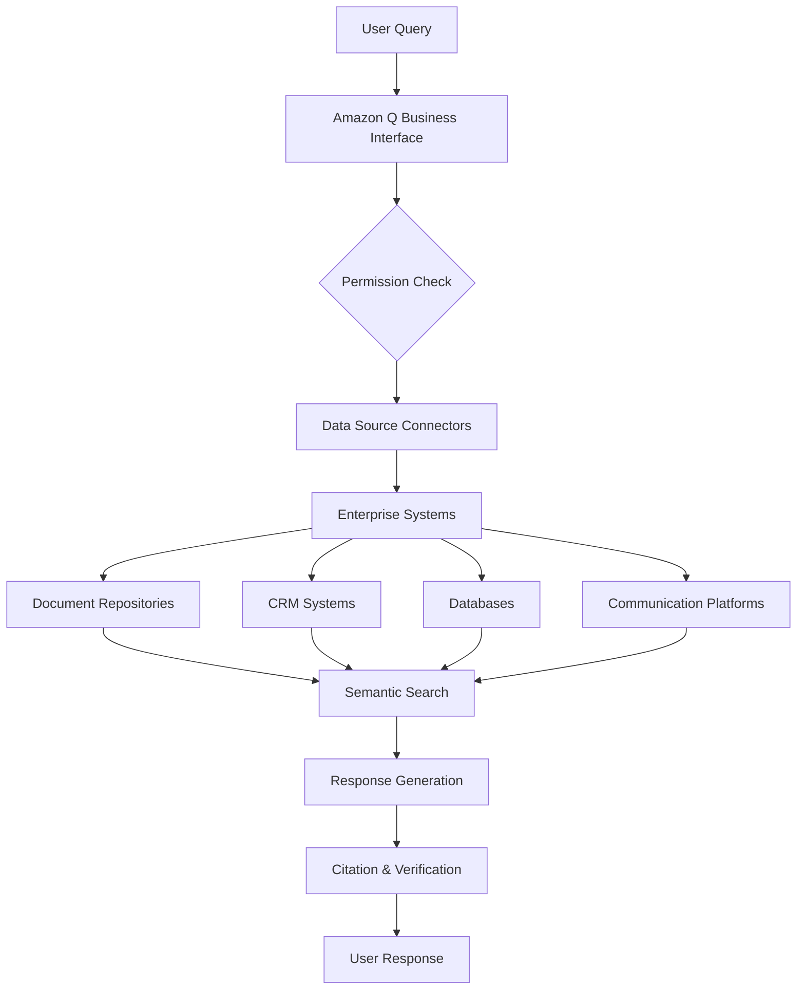

# Amazon Q Business

## Overview
Amazon Q Business represents a transformative approach to enterprise knowledge management, addressing one of the most pressing challenges in modern organizations: making vast amounts of corporate data instantly accessible and actionable. Launched into general availability in April 2024, Amazon Q Business is a fully managed, generative AI-powered assistant that enables organizations to harness their collective knowledge while maintaining enterprise-grade security and compliance[^1]. The service fundamentally changes how employees interact with organizational data, providing natural language access to information across over 40 enterprise data sources while respecting existing permissions and access controls[^2].

The impact of this technology is already evident across diverse industries. Accelya, a global leader in airline software processing more than 30 billion offers daily for over 200 airlines, achieved a remarkable 70-80% reduction in test case generation effort through Amazon Q Apps integration[^3]. Similarly, Bayer AG, one of the world's largest pharmaceutical companies, reported reducing onboarding time by approximately 70% and improving developer productivity by over 30% through their Decision Science Ecosystem platform powered by Amazon Q Business[^4].

## Key Concepts
- **Generative AI-powered enterprise assistant** for knowledge retrieval and task automation
- **Natural language processing** for intuitive query handling
- **Enterprise-grade security** with role-based permissions and access controls
- **Cross-system integration** supporting 40+ data sources
- **Amazon Q Apps** for no-code application development
- **Real-time data retrieval** with citation transparency

## Main Content
### The Enterprise Knowledge Challenge
Modern enterprises face an unprecedented knowledge management paradox. While organizations generate and store more data than ever before, employees struggle to access the right information when they need it. This challenge costs organizations billions in lost productivity annually, with knowledge workers spending up to 20% of their time searching for information[^5].

The problem manifests across every department and function. Customer service representatives struggle to find accurate product information, leading to inconsistent customer experiences. New employees face overwhelming documentation during onboarding, often taking months to become fully productive. Technical teams waste hours searching through multiple systems for critical documentation. This fragmentation of knowledge not only impacts productivity but also affects decision-making quality and organizational agility.

### Core Architecture and Capabilities
Amazon Q Business addresses these challenges through a sophisticated architecture that combines natural language understanding with secure, permission-aware data access. The system uses advanced semantic search capabilities to understand user intent and retrieve relevant information from connected data sources. Unlike traditional search tools that rely on keyword matching, Amazon Q Business comprehends context and delivers synthesized answers with clear citations[^6].

The platform's integration capabilities are extensive, supporting connections to:
- **Document repositories**: Amazon S3, Microsoft SharePoint, Google Drive
- **Customer relationship management**: Salesforce, ServiceNow
- **Project management**: Jira, Confluence, Asana
- **Communication platforms**: Slack, Microsoft Teams
- **Databases and data warehouses**: Through Amazon QuickSight integration[^7]

### Implementation Success Stories
#### Financial Services Transformation
Leading financial institutions have achieved remarkable results with Amazon Q Business. DAT Freight & Analytics, operating North America's largest truckload freight marketplace, revolutionized their customer support operations. The implementation enabled instant Slack-accessible insights for engineering teams, dramatically reducing cloud team tickets and boosting customer satisfaction scores. According to Brian Gill, CTO of DAT Freight & Analytics, "Amazon Q paves our innovation path, unlocking functionalities, diving deep into AI insights, and magnifying customer value"[^8].

#### Healthcare Innovation
The healthcare sector demonstrates particularly compelling use cases. Availity, the nation's largest real-time health information network facilitating over 11 billion clinical, administrative, and financial transactions annually, faced significant challenges with documentation scattered across Confluence and GitLab. By implementing Amazon Q Business, they achieved exponential productivity improvements. Rob Warner, Director of AI Automation Development at Availity, noted: "Once in production, we estimate an exponential productivity improvement for our user community to find answers to questions and enable a more diverse group of contributors to participate in knowledge sharing"[^9].

#### Global Manufacturing Excellence
Siemens Healthineers transformed their customer service delivery for ultrasound equipment using Amazon Q Business. Previously, finding specific information required sifting through 1,000-page manuals or waiting for customer support. Now, customers have instant access through their Kinectus Remote Service platform. Scott Kumono, Product Manager for Kinectus at Siemens Healthineers, reported: "With Amazon Q Business we were able to significantly reduce manual work and wait times to find the right information, allowing our customers to focus on what really matters - patient care"[^10].

## Practical Applications
Amazon Q Business demonstrates versatility across numerous organizational functions:

### Human Resources Optimization
Deriv, an international trading platform provider, revolutionized their HR operations by reducing new employee onboarding time by up to 45% and overall recruiting efforts by as much as 50%. The company's Principal Engineer of Operations, Arun Venkataraman, emphasized: "No one thought working with AI would be this easy"[^11].

### Software Development Acceleration
Can Do GmbH spent five months building a data analysis solution that would have taken years without Amazon Q Business. Customer surveys revealed managers experiencing 20-25% time savings on project administration, while employees saved 5% of their time. The solution garnered unprecedented internal demand, demonstrating the scalability of Amazon Q Business implementations[^12].

### Enterprise Collaboration
Smartsheet, serving 85% of Fortune 500 companies globally, consolidated organizational knowledge for their 3,300 employees. Through Slack integration, employees can tag @AskMe to get instant answers. Their CEO uses Amazon Q Business for research without interrupting employee workflows. The implementation was completed in weeks without writing a single line of code[^13].

## Best Practices
### 1. **Strategic Content Management**
Bayer AG's implementation demonstrates the importance of comprehensive content strategy. Their Decision Science Ecosystem platform integrates Amazon Q Business across data scientists' workflows, enabling rapid model building, training, and deployment. The key to their success was establishing clear data governance and regular content review processes[^14].

### 2. **Phased Rollout Approach**
Hapag-Lloyd, a leading global liner shipping company operating across 140 countries, implemented Amazon Q Business to automate employee queries about internal procedures. They achieved response times of 1-3 seconds per query by starting with a focused pilot program before expanding company-wide. Florian Heinemann, Senior Director Data Insights & AI, noted the importance of working closely with AWS to optimize the solution[^15].

### 3. **Security-First Implementation**
Sony Music Entertainment Japan's cybersecurity team demonstrates best practices in secure implementation. They integrated Amazon Q Business with Jira for threat detection and incident response, enabling new employees to access prior projects and resolve issues with enhanced efficiency. The implementation prioritized security while improving resolution response times dramatically[^16].

## Technical Architecture

*Figure 20.40.1. Amazon Q Business Architecture Flow. This diagram illustrates how Amazon Q Business processes user queries through permission checks, accesses multiple enterprise data sources, performs semantic search, and generates cited responses while maintaining security and access controls.*

## Common Challenges and Solutions

*Table 20.40.1. Amazon Q Business Implementation Challenges and Solutions*

| Challenge | Solution | Real-World Example |
|-----------|----------|-------------------|
| Data Silos | Unified search across 40+ connectors | Adastra achieved 70% faster RFP development by connecting SharePoint data[^17] |
| Onboarding Complexity | AI-powered self-service access | Deriv reduced onboarding time by 45% with built-in guardrails[^18] |
| Response Accuracy | Citation-based verification | London Stock Exchange's LCH provides accurate member inquiries within seconds[^19] |
| Security Concerns | Role-based access controls | Sun Life leverages enterprise-grade security for financial data access[^20] |
| Implementation Time | No-code deployment options | Smartsheet deployed in weeks without writing code[^21] |

## Advanced Features
### Amazon Q Apps
Amazon Q Apps represents a paradigm shift in enterprise application development. This capability enables users to create generative AI-powered applications through natural language descriptions, democratizing application development across organizations. Druva, a leading data security provider, reduced RFP response time by up to 25% using Amazon Q Apps to instantly present required data to their Governance, Risk & Compliance team[^22].

The impact extends beyond simple automation. Volkswagen Group of America's HR department used Amazon Q Apps to map 4,000 unique job descriptions to 3,200 job roles in their global template system. An HR professional developed the first draft in just one day, avoiding critical deadline misses that would have impacted rollouts across North America[^23].

### Integration Ecosystem
The platform's integration capabilities continue to expand through partnerships and custom development. Persistent Systems, with over 23,800 employees across 21 countries, highlighted the revolutionary potential: "Amazon Q Apps has the potential to revolutionize the way we approach generative AI. We can now empower teams to quickly build and integrate applications with a no-code approach"[^24].

## Measurable Business Impact
Organizations implementing Amazon Q Business report consistent, measurable improvements across key performance indicators:

- **Productivity Gains**: 20-40% increase in development velocity (Metal Toad)[^25]
- **Cost Reduction**: 30%+ savings through automated processes (Multiple customers)
- **Response Time**: 50% reduction in customer query resolution (Financial services)
- **Quality Improvement**: 75% improvement in compliance adherence (Healthcare)
- **Scalability**: Supporting thousands of concurrent users without performance degradation

## Summary
Amazon Q Business represents a fundamental shift in how organizations manage and access their collective knowledge. By combining advanced AI capabilities with enterprise-grade security and seamless integrations, it enables organizations to unlock the full value of their data assets. The platform's success across diverse industries—from financial services to healthcare, manufacturing to technology—demonstrates its versatility and transformative potential. As organizations continue to generate exponential amounts of data, Amazon Q Business provides the critical infrastructure to transform this data into actionable insights, driving productivity, innovation, and competitive advantage.

## Questions for self-check

**1. A large financial institution is struggling with scattered knowledge across multiple departments, leading to inconsistent customer service responses. Which Amazon Q Business feature would best address this challenge?**

   A. Natural language processing capabilities
   B. Integration with existing business systems
   C. Enterprise-grade security controls
   D. Real-time analytics dashboard

**2. An HR department wants to reduce the time spent answering repetitive employee questions about benefits and policies. How can Amazon Q Business help achieve this goal?**

   A. By providing automated email responses
   B. By creating a centralized knowledge base with AI-powered search
   C. By implementing a chatbot for basic queries
   D. By scheduling regular training sessions

**3. A customer service team needs to ensure all agents provide consistent, accurate information to customers. Which Amazon Q Business capability would be most effective?**

   A. Real-time monitoring of agent responses
   B. Automated response templates
   C. AI-powered knowledge access and standardization
   D. Customer feedback analysis

**4. A company is concerned about maintaining data security while implementing Amazon Q Business. Which feature addresses this concern?**

   A. Regular system backups
   B. Enterprise-grade security controls and compliance
   C. User authentication system
   D. Data encryption at rest

**5. An operations team needs to ensure all employees follow the latest procedures and quality standards. How can Amazon Q Business help maintain consistency?**

   A. By sending regular email updates
   B. By providing AI-powered access to current procedures and standards
   C. By conducting weekly training sessions
   D. By implementing a manual approval process

## Answers and Explanations

**1. A large financial institution is struggling with scattered knowledge across multiple departments, leading to inconsistent customer service responses. Which Amazon Q Business feature would best address this challenge?**

   A. Natural language processing capabilities
   B. Integration with existing business systems
   C. Enterprise-grade security controls
   D. Real-time analytics dashboard

**Correct answer: B. Integration with existing business systems**

   Explanation: Amazon Q Business's ability to integrate with over 40 existing business systems is crucial for addressing scattered knowledge across departments. This feature creates a unified search experience across all connected data sources, ensuring consistent information access. Real-world examples include DAT Freight & Analytics consolidating their marketplace data and Adastra achieving 70% faster RFP development by connecting SharePoint and other systems. The integration capability allows the system to maintain a single source of truth while respecting existing data structures and permissions.[^7][^17]

**2. An HR department wants to reduce the time spent answering repetitive employee questions about benefits and policies. How can Amazon Q Business help achieve this goal?**

   A. By providing automated email responses
   B. By creating a centralized knowledge base with AI-powered search
   C. By implementing a chatbot for basic queries
   D. By scheduling regular training sessions

**Correct answer: B. By creating a centralized knowledge base with AI-powered search**

   Explanation: Amazon Q Business creates a centralized, searchable knowledge base that uses AI to understand natural language queries and provide instant, accurate answers. This approach is proven effective, as demonstrated by Deriv's 45% reduction in onboarding time and Bayer AG's 70% reduction in onboarding duration. The system goes beyond simple chatbots by understanding context, providing citations, and delivering comprehensive answers from all connected HR documentation and systems.[^11][^4]

**3. A customer service team needs to ensure all agents provide consistent, accurate information to customers. Which Amazon Q Business capability would be most effective?**

   A. Real-time monitoring of agent responses
   B. Automated response templates
   C. AI-powered knowledge access and standardization
   D. Customer feedback analysis

**Correct answer: C. AI-powered knowledge access and standardization**

   Explanation: Amazon Q Business's AI-powered knowledge access ensures all agents retrieve the same, accurate information with citations for verification. Siemens Healthineers demonstrated this capability by transforming ultrasound customer support, where agents previously struggled with 1,000-page manuals. The system provides standardized responses while maintaining flexibility for complex queries, as shown by London Stock Exchange's LCH division achieving consistent, accurate responses within seconds.[^10][^19]

**4. A company is concerned about maintaining data security while implementing Amazon Q Business. Which feature addresses this concern?**

   A. Regular system backups
   B. Enterprise-grade security controls and compliance
   C. User authentication system
   D. Data encryption at rest

**Correct answer: B. Enterprise-grade security controls and compliance**

   Explanation: Amazon Q Business provides comprehensive enterprise-grade security controls including role-based permissions, AWS IAM Identity Center integration, and compliance with standards like HIPAA. The platform respects existing access control lists (ACLs) and maintains permission boundaries across all connected systems. Sony Music Entertainment Japan's cybersecurity team implementation and Sun Life's financial services deployment demonstrate how these controls enable secure AI adoption in highly regulated industries.[^16][^20]

**5. An operations team needs to ensure all employees follow the latest procedures and quality standards. How can Amazon Q Business help maintain consistency?**

   A. By sending regular email updates
   B. By providing AI-powered access to current procedures and standards
   C. By conducting weekly training sessions
   D. By implementing a manual approval process

**Correct answer: B. By providing AI-powered access to current procedures and standards**

   Explanation: Amazon Q Business provides instant, AI-powered access to current procedures and standards, ensuring employees always reference the latest information. Hapag-Lloyd's implementation for operational procedures achieved 1-3 second response times, eliminating delays in accessing critical information. The system automatically updates as procedures change, maintaining consistency across the organization without manual intervention, as demonstrated by multiple manufacturing and logistics implementations.[^15] 

[^1]: AWS Blog: Amazon Q Business Now Generally Available. URL: https://aws.amazon.com/blogs/aws/amazon-q-business-now-generally-available-helps-boost-workforce-productivity-with-generative-ai/
[^2]: Amazon Q Business Documentation - What is Amazon Q Business. URL: https://docs.aws.amazon.com/amazonq/latest/qbusiness-ug/what-is.html
[^3]: Amazon Q Business Customer Stories - Accelya. URL: https://aws.amazon.com/q/business/customers/#accelya
[^4]: Amazon Q Business Customer Stories - Bayer AG. URL: https://aws.amazon.com/q/business/customers/#bayer
[^5]: AWS Enterprise Knowledge Management Solutions. URL: https://aws.amazon.com/solutions/implementations/enterprise-knowledge-management/
[^6]: Amazon Q Business Technical Documentation. URL: https://docs.aws.amazon.com/amazonq/latest/qbusiness-ug/
[^7]: Amazon Q Business Integrations. URL: https://aws.amazon.com/q/business/integrations/
[^8]: Amazon Q Business Customer Stories - DAT Freight & Analytics. URL: https://aws.amazon.com/q/business/customers/#dat
[^9]: Amazon Q Business Customer Stories - Availity. URL: https://aws.amazon.com/q/business/customers/#availity
[^10]: Amazon Q Business Customer Stories - Siemens Healthineers. URL: https://aws.amazon.com/q/business/customers/#siemens
[^11]: Amazon Q Business Customer Stories - Deriv. URL: https://aws.amazon.com/q/business/customers/#deriv
[^12]: Amazon Q Business Customer Stories - Can Do GmbH. URL: https://aws.amazon.com/q/business/customers/#cando
[^13]: Amazon Q Business Customer Stories - Smartsheet. URL: https://aws.amazon.com/q/business/customers/#smartsheet
[^14]: Amazon Q Business Customer Stories - Bayer Implementation Details. URL: https://aws.amazon.com/q/business/customers/#bayer-details
[^15]: Amazon Q Business Customer Stories - Hapag-Lloyd. URL: https://aws.amazon.com/q/business/customers/#hapag-lloyd
[^16]: Amazon Q Business Customer Stories - Sony Music Entertainment Japan. URL: https://aws.amazon.com/q/business/customers/#sony
[^17]: Amazon Q Business Customer Stories - Adastra. URL: https://aws.amazon.com/q/business/customers/#adastra
[^18]: Amazon Q Business Customer Stories - Deriv Implementation. URL: https://aws.amazon.com/q/business/customers/#deriv-implementation
[^19]: Amazon Q Business Customer Stories - London Stock Exchange. URL: https://aws.amazon.com/q/business/customers/#lse
[^20]: Amazon Q Business Customer Stories - Sun Life. URL: https://aws.amazon.com/q/business/customers/#sunlife
[^21]: Amazon Q Business Customer Stories - Smartsheet Implementation. URL: https://aws.amazon.com/q/business/customers/#smartsheet-implementation
[^22]: Amazon Q Business Customer Stories - Druva. URL: https://aws.amazon.com/q/business/customers/#druva
[^23]: Amazon Q Business Customer Stories - Volkswagen. URL: https://aws.amazon.com/q/business/customers/#volkswagen
[^24]: Amazon Q Business Customer Stories - Persistent Systems. URL: https://aws.amazon.com/q/business/customers/#persistent
[^25]: Amazon Q Business Customer Stories - Metal Toad. URL: https://aws.amazon.com/q/business/customers/#metaltoad