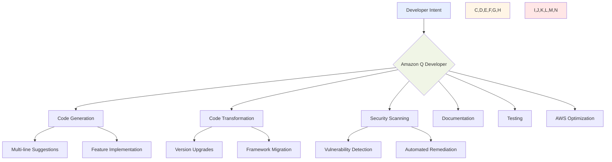

# Amazon Q Developer

## Overview

Amazon Q Developer represents a transformative advancement in how developers and IT professionals approach software development and cloud operations. As organizations increasingly rely on software to drive innovation and competitive advantage, developers face mounting pressure to deliver high-quality code faster while managing complex infrastructure and security requirements. **Amazon Q Developer** addresses these challenges by serving as an AI-powered coding companion that understands context, generates accurate code, and assists with the entire software development lifecycle.

The significance of Amazon Q Developer extends beyond simple code completion. It fundamentally changes how developers interact with their development environment, transforming hours of manual work into minutes of AI-assisted productivity. By leveraging advanced **foundation models** trained on vast amounts of code and AWS expertise, Amazon Q Developer enables developers to focus on creative problem-solving rather than repetitive tasks. This shift not only accelerates development velocity but also improves code quality and security across organizations.

## Key Concepts

Understanding Amazon Q Developer requires familiarity with several foundational concepts that define its capabilities and integration within the development ecosystem:

**Generative AI-powered development** refers to the use of artificial intelligence models that can generate, analyze, and transform code based on natural language instructions and existing code context. Unlike traditional code completion tools, generative AI understands the intent behind developer requests and can create complex, multi-file implementations.

**Code transformation** represents the ability to automatically upgrade and modernize existing codebases between different language versions or frameworks. This capability goes beyond simple syntax updates to include architectural improvements and security enhancements.

**Autonomous agents** in Amazon Q Developer are AI-powered capabilities that can independently perform complex, multi-step tasks such as implementing entire features, conducting code reviews, or performing security remediation across a codebase.

**Context-aware assistance** means that Amazon Q Developer understands not just the immediate code being written, but the broader project structure, coding patterns, and organizational standards to provide more relevant and accurate suggestions.

**Enterprise-grade security** encompasses the comprehensive security measures built into Amazon Q Developer, including data isolation, encryption, and compliance with organizational access controls.

## Main Content

### The Evolution of AI-Powered Development

The software development landscape has undergone significant transformation with the advent of generative AI. Traditional development workflows often required developers to spend only 30% of their time actually writing code, with the remainder consumed by research, debugging, documentation, and maintenance tasks. This inefficiency not only slows innovation but also contributes to developer burnout and project delays.

Amazon Q Developer emerged from the recognition that developers needed more than just better tools—they needed an intelligent partner that could understand context, anticipate needs, and automate routine tasks. Built on **Amazon Bedrock**, the service leverages multiple foundation models optimized for different aspects of software development. This multi-model approach ensures that whether a developer is writing a complex algorithm, debugging an issue, or seeking AWS best practices, they receive the most accurate and helpful assistance possible.

The integration of Amazon Q Developer into the development workflow represents a paradigm shift in how code is created and maintained. Rather than replacing developers, it amplifies their capabilities, allowing them to operate at a higher level of abstraction and tackle more complex challenges. This human-AI collaboration model has proven particularly effective in enterprise environments where code quality, security, and compliance are paramount.

### Core Capabilities and Features

Amazon Q Developer's capabilities span the entire software development lifecycle, providing comprehensive support that adapts to different development contexts and requirements:

*Figure 20.50.1: Amazon Q Developer Capability Architecture. This diagram illustrates how Amazon Q Developer processes developer intent through various specialized capabilities, each designed to address specific aspects of the development lifecycle.*

The code generation capabilities of Amazon Q Developer go far beyond simple autocompletion. When a developer begins typing, the system analyzes the surrounding context, including imported libraries, project structure, and coding patterns, to generate relevant suggestions. These suggestions range from single-line completions to entire functions or classes. The system has achieved industry-leading acceptance rates, with organizations like BT Group reporting 37% acceptance of suggestions and National Australia Bank achieving 50% acceptance rates.

**Amazon Q Developer Agents** represent a revolutionary approach to automated development tasks. These agents can autonomously implement complete features based on natural language descriptions. For example, a developer can request "implement a user authentication system with OAuth 2.0 support," and the agent will analyze the existing codebase, create an implementation plan, and generate all necessary code, tests, and documentation. This capability has achieved top scores on the SWE-Bench Leaderboard, demonstrating its effectiveness in real-world development scenarios.

The security scanning and remediation features address one of the most critical aspects of modern software development. Amazon Q Developer continuously scans code for vulnerabilities, including hard-to-detect issues like exposed credentials, SQL injection risks, and cross-site scripting vulnerabilities. When issues are detected, the system doesn't just flag them—it provides specific, context-aware remediation suggestions that developers can apply with a single click.

### Customization and Enterprise Integration

Organizations can enhance Amazon Q Developer's effectiveness by leveraging its customization capabilities. By securely connecting to internal code repositories, Amazon Q Developer learns from an organization's specific coding patterns, architectural decisions, and best practices. This customization ensures that generated code aligns with organizational standards and leverages existing internal libraries and frameworks.

The customization process maintains complete data isolation and security. Customer code used for customization never leaves the organization's control and is not used to train models for other customers. This approach ensures that proprietary code patterns and business logic remain confidential while still benefiting from AI-powered assistance.

Integration with existing development workflows is seamless through support for popular IDEs including Visual Studio Code, JetBrains IDEs, Visual Studio, and Eclipse. Amazon Q Developer also integrates with command-line interfaces, AWS Management Console, and collaboration platforms like Slack and Microsoft Teams. This comprehensive integration ensures developers can access AI assistance wherever they work.

### Transforming Legacy Applications

One of Amazon Q Developer's most impactful capabilities is its ability to modernize legacy applications. The code transformation feature can automatically upgrade applications between language versions, saving organizations months or even years of manual effort. This capability is particularly valuable for enterprises maintaining large codebases that require regular updates for security and compliance reasons.

The transformation process involves sophisticated analysis of existing code to understand its structure and dependencies. Amazon Q Developer then generates upgraded code that maintains the original functionality while incorporating modern language features and best practices. During a remarkable demonstration of this capability, a five-person team at Amazon used Q Developer to upgrade more than 1,000 production applications from Java 8 to Java 17 in just two days, with an average transformation time of less than 10 minutes per application.

Beyond version upgrades, Amazon Q Developer can assist with framework migrations and architectural improvements. The system understands common migration patterns and can help teams move from legacy frameworks to modern alternatives while preserving business logic and maintaining system stability.

### AWS Expertise and Cloud Optimization

Amazon Q Developer's deep integration with AWS services makes it an invaluable tool for cloud development and operations. The system has been trained on over 17 years of AWS experience and best practices, enabling it to provide expert guidance on service selection, architecture design, and cost optimization.

When working in the AWS Management Console, developers can ask natural language questions about their infrastructure and receive immediate, contextual responses. For example, queries like "What instances are running in us-east-1?" or "What were my EC2 costs by region last month?" return precise information with relevant links for deeper exploration. This capability transforms how teams interact with their cloud infrastructure, making it more accessible and manageable.

The system also provides proactive recommendations for improving cloud deployments. It can identify opportunities for cost optimization, suggest more appropriate instance types for specific workloads, and recommend architectural improvements based on AWS Well-Architected Framework principles. This guidance helps organizations maximize the value of their cloud investments while maintaining security and performance standards.

## Practical Applications

Amazon Q Developer finds application across diverse development scenarios and organizational contexts. Understanding these applications helps teams identify where the technology can deliver the most value:

In **rapid prototyping and feature development**, teams use Amazon Q Developer to quickly implement new features and test ideas. The AI assistant can generate boilerplate code, implement common patterns, and create working prototypes in a fraction of the traditional time. This acceleration enables more experimentation and faster iteration on product ideas.

For **code review and quality assurance**, Amazon Q Developer serves as an automated reviewer that catches bugs, identifies potential security issues, and suggests improvements. The system's ability to understand code intent and identify anti-patterns helps maintain high code quality standards across large development teams.

**Legacy system modernization** projects benefit significantly from Amazon Q Developer's transformation capabilities. Organizations with aging codebases can systematically upgrade their applications, improving security and performance while reducing technical debt. The automated nature of these transformations reduces risk and ensures consistency across large-scale modernization efforts.

In **documentation and knowledge management**, Amazon Q Developer automatically generates comprehensive documentation for code, including inline comments, API documentation, and architectural diagrams. This capability addresses one of the most neglected aspects of software development, ensuring that code remains maintainable and understandable over time.

## Best Practices

Successfully implementing Amazon Q Developer requires thoughtful integration into existing development workflows and clear guidelines for its use:

1. **Establish Clear Usage Guidelines**

Organizations should develop clear policies for how developers interact with Amazon Q Developer. This includes guidelines on code ownership, review processes for AI-generated code, and standards for when human oversight is required. Establishing these guidelines early prevents confusion and ensures consistent usage across teams.

Training developers on effective prompt engineering improves the quality of AI assistance. Teaching teams how to provide clear, specific instructions and context helps them get more accurate and useful suggestions from Amazon Q Developer. Regular workshops and sharing of best practices can significantly improve adoption and effectiveness.

2. **Implement Gradual Adoption Strategies**

Rather than attempting to transform all development processes at once, organizations should adopt Amazon Q Developer incrementally. Starting with low-risk applications like documentation generation or test creation allows teams to build confidence before applying AI assistance to critical production code.

Measuring and sharing success metrics helps build organizational buy-in. Teams should track metrics like code acceptance rates, time saved on routine tasks, and improvements in code quality. These metrics demonstrate value and help identify areas for further optimization.

3. **Maintain Security and Compliance Standards**

While Amazon Q Developer includes robust security features, organizations must ensure their usage aligns with internal security policies. This includes configuring appropriate access controls, establishing code review processes for AI-generated content, and maintaining audit trails for compliance purposes.

Regular security assessments of AI-generated code ensure that automated suggestions don't introduce vulnerabilities. Organizations should integrate Amazon Q Developer's security scanning capabilities into their existing security workflows and establish processes for addressing identified issues.

## Common Challenges and Solutions

Organizations implementing Amazon Q Developer may encounter several challenges, each with established solutions:

| Challenge | Solution |
|-----------|----------|
| Developer skepticism about AI-generated code | Provide training on AI capabilities and limitations; share success stories; start with non-critical applications |
| Integration with existing workflows | Leverage IDE plugins and API integrations; customize to match organizational patterns |
| Maintaining code quality standards | Implement review processes for AI-generated code; use Amazon Q's built-in quality checks |
| Managing customization complexity | Start with standard features; gradually add customizations based on proven value |
| Ensuring consistent usage across teams | Develop organizational standards; provide regular training; share best practices |

## Case Studies

### National Australia Bank: Transforming Developer Experience

National Australia Bank (NAB), one of Australia's largest financial institutions with over 10 million customers, successfully implemented Amazon Q Developer to transform their software development practices. With more than 3,000 developers across Australia, India, and Vietnam managing millions of lines of code, NAB faced challenges in maintaining security, compliance, and quality standards while accelerating development.

The results were remarkable:
- **50% code acceptance rate** from Amazon Q Developer suggestions
- **40% of production code** now comes from AI-generated suggestions
- **18% overall productivity increase** across development teams
- Transformed dozens of applications from Java 8 to Java 17 in hours instead of weeks

NAB's Chief Technology Officer, Steve Day, stated: "Amazon Q Developer is more than just a single product; it has completely changed the way we develop code. It was incredible to see dozens of applications uplifted in a couple of hours instead of weeks."[^6]

### BT Group: Enterprise-Scale Adoption

BT Group, the UK telecommunications giant, rolled out Amazon Q Developer to 1,200 developers after successful initial trials. The company integrated the AI-powered assistant into their development workflow to address the challenge of maintaining consistent code quality across multiple projects.[^8]

Key achievements include:
- **37% acceptance rate** of code suggestions by software engineers
- **200,000 lines of code** written with AI assistance
- **12% automation** of tedious and repetitive coding tasks
- Significant improvement in code quality metrics

The tool proved particularly effective with languages including Java, JavaScript, TypeScript, and Python, with developers reporting increased productivity and more time for innovation rather than routine tasks.

### Healthcare Technology: Ensuring Compliance at Speed

Netsmart, a leading technology provider for community-based care, implemented Amazon Q Developer to meet the exponentially growing demand for healthcare technology while maintaining strict compliance standards.[^9]

Their implementation delivered:
- **35% code suggestion acceptance rate**
- Accelerated development cycles for healthcare applications
- Efficient generation of HIPAA-compliant code patterns
- Significant reduction in manual effort for documentation
- Faster implementation of new features while maintaining security standards

Paul Snider, VP of Engineering at Netsmart, noted: "Amazon Q Developer can transform the way our engineering team approaches research, design, and coding... allowing our engineers to efficiently generate high-quality code and documentation."

## Summary

Amazon Q Developer represents a fundamental shift in how software is created, maintained, and optimized. By combining advanced AI capabilities with deep AWS expertise, it enables developers to focus on innovation rather than repetitive tasks. The system's ability to generate accurate code, transform legacy applications, ensure security, and provide expert guidance makes it an essential tool for modern development teams.

The impact of Amazon Q Developer extends beyond individual productivity gains. It enables organizations to tackle technical debt, improve code quality, and accelerate innovation at scale. As the technology continues to evolve, its integration with development workflows will become even more seamless, further amplifying developer capabilities and enabling new possibilities in software creation.

For organizations embarking on their AI-assisted development journey, Amazon Q Developer provides a secure, scalable, and effective path forward. By following best practices, addressing challenges proactively, and leveraging the full range of capabilities, teams can transform their development processes and deliver greater value to their organizations.

## Questions for self-check

**1. A development team is considering using Amazon Q Developer to accelerate their workflow. Which of the following represents the most significant advantage of implementing Amazon Q Developer?**

   A. Eliminating the need for human code review
   B. Achieving industry-leading code suggestion acceptance rates
   C. Automatically deploying code to production
   D. Replacing senior developers with AI

**2. An organization wants to modernize their Java 8 applications to Java 17. Which Amazon Q Developer feature would be most appropriate for this task?**

   A. Real-time code suggestions
   B. Security vulnerability scanning
   C. Code transformation capability
   D. Documentation generation

**3. A financial services company is concerned about using AI-powered development tools due to data security requirements. Which aspect of Amazon Q Developer best addresses their concerns?**

   A. The ability to work offline without internet connectivity
   B. Automatic code obfuscation features
   C. Data isolation and customer content not being used for model training
   D. Built-in blockchain verification

**4. A developer wants Amazon Q Developer to help implement a complete user authentication feature. Which capability enables this level of autonomous development?**

   A. Inline code completion
   B. Amazon Q Developer Agents
   C. Security scanning
   D. AWS service integration

**5. An enterprise is evaluating the ROI of Amazon Q Developer implementation. Which metric would best demonstrate the tool's impact on development efficiency?**

   A. Number of lines of code generated
   B. Code suggestion acceptance rate and time saved on routine tasks
   C. Total number of developers using the tool
   D. Amount of documentation automatically generated

## Answers and Explanations

**1. A development team is considering using Amazon Q Developer to accelerate their workflow. Which of the following represents the most significant advantage of implementing Amazon Q Developer?**

   A. Eliminating the need for human code review
   B. Achieving industry-leading code suggestion acceptance rates
   C. Automatically deploying code to production
   D. Replacing senior developers with AI

**Correct answer: B. Achieving industry-leading code suggestion acceptance rates**

   Explanation: Amazon Q Developer's most significant advantage is its industry-leading code suggestion acceptance rates, with organizations like BT Group reporting 37% and National Australia Bank achieving 50% acceptance rates. This high acceptance rate directly translates to improved developer productivity and faster development cycles. Option A is incorrect because human code review remains essential for quality assurance. Option C is incorrect as Amazon Q Developer focuses on code generation and transformation, not deployment. Option D is incorrect because Amazon Q Developer is designed to augment, not replace, human developers.

**2. An organization wants to modernize their Java 8 applications to Java 17. Which Amazon Q Developer feature would be most appropriate for this task?**

   A. Real-time code suggestions
   B. Security vulnerability scanning
   C. Code transformation capability
   D. Documentation generation

**Correct answer: C. Code transformation capability**

   Explanation: Amazon Q Developer's code transformation capability is specifically designed for upgrading applications between language versions. As demonstrated by Amazon's internal team that upgraded over 1,000 applications from Java 8 to Java 17 in just two days, this feature automates the complex process of version migration. While the other features are valuable, they don't directly address the version upgrade requirement. The transformation capability analyzes existing code, understands dependencies, and generates upgraded code that maintains functionality while incorporating modern language features.

**3. A financial services company is concerned about using AI-powered development tools due to data security requirements. Which aspect of Amazon Q Developer best addresses their concerns?**

   A. The ability to work offline without internet connectivity
   B. Automatic code obfuscation features
   C. Data isolation and customer content not being used for model training
   D. Built-in blockchain verification

**Correct answer: C. Data isolation and customer content not being used for model training**

   Explanation: Amazon Q Developer Pro provides enterprise-grade security with complete data isolation, ensuring that customer content is not used for service improvement or model training for other customers. This is crucial for financial services companies that must maintain strict data confidentiality. The service implements comprehensive security measures including encryption, access controls, and compliance with regulatory requirements. Options A, B, and D are not primary security features of Amazon Q Developer.

**4. A developer wants Amazon Q Developer to help implement a complete user authentication feature. Which capability enables this level of autonomous development?**

   A. Inline code completion
   B. Amazon Q Developer Agents
   C. Security scanning
   D. AWS service integration

**Correct answer: B. Amazon Q Developer Agents**

   Explanation: Amazon Q Developer Agents are specifically designed to autonomously perform complex, multi-step tasks like implementing entire features. When a developer requests a complete feature implementation, the agent analyzes the existing codebase, creates an implementation plan, and generates all necessary code, tests, and documentation. This capability has achieved top scores on the SWE-Bench Leaderboard, demonstrating its effectiveness in real-world feature implementation. Inline code completion (A) is for smaller suggestions, while security scanning (C) and AWS integration (D) serve different purposes.

**5. An enterprise is evaluating the ROI of Amazon Q Developer implementation. Which metric would best demonstrate the tool's impact on development efficiency?**

   A. Number of lines of code generated
   B. Code suggestion acceptance rate and time saved on routine tasks
   C. Total number of developers using the tool
   D. Amount of documentation automatically generated

**Correct answer: B. Code suggestion acceptance rate and time saved on routine tasks**

   Explanation: Code suggestion acceptance rate combined with time saved on routine tasks provides the most comprehensive measure of Amazon Q Developer's impact on development efficiency. These metrics directly correlate with productivity improvements and can be translated into tangible business value. High acceptance rates indicate that the AI-generated suggestions are relevant and useful, while time saved quantifies the efficiency gains. Simply counting lines of code (A) or users (C) doesn't reflect quality or effectiveness, and documentation generation (D) is just one aspect of the tool's capabilities.

[^1]: Amazon Q Developer Features - Code Suggestions and Acceptance Rates. URL: <https://aws.amazon.com/q/developer/features/>
[^2]: AWS Announces General Availability of Amazon Q Developer - Code Transformation. URL: <https://press.aboutamazon.com/2024/4/aws-announces-general-availability-of-amazon-q-the-most-capable-generative-ai-powered-assistant-for-accelerating-software-development-and-leveraging-companies-internal-data>
[^3]: Amazon Q Developer - Security and Privacy. URL: <https://aws.amazon.com/q/developer/>
[^4]: Amazon Q Developer - Autonomous Agents and Feature Implementation. URL: <https://docs.aws.amazon.com/prescriptive-guidance/latest/best-practices-code-generation/advanced-capabilities.html>
[^5]: Amazon Q Developer - Business Value and Metrics. URL: <https://www.aboutamazon.com/news/aws/amazon-q-generative-ai-assistant-aws>
[^6]: National Australia Bank Case Study - Transforming the Developer Experience with Amazon Q. URL: <https://aws.amazon.com/solutions/case-studies/generative-ai-national-australia-bank/>
[^7]: National Australia Bank on AWS - Customer Success Story. URL: <https://aws.amazon.com/solutions/case-studies/innovators/national-australia-bank/>
[^8]: BT Group Amazon Q Developer Case Study. URL: <https://www.computerweekly.com/news/366588627/Case-study-BT-rolls-out-Amazons-generative-AI-developer-tool-to-more-coders>
[^9]: Amazon Q Developer Customers - Netsmart Testimonial. URL: <https://aws.amazon.com/q/developer/customers/> 