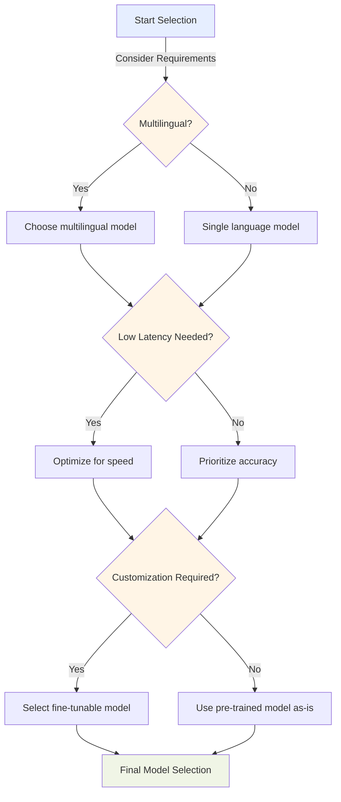
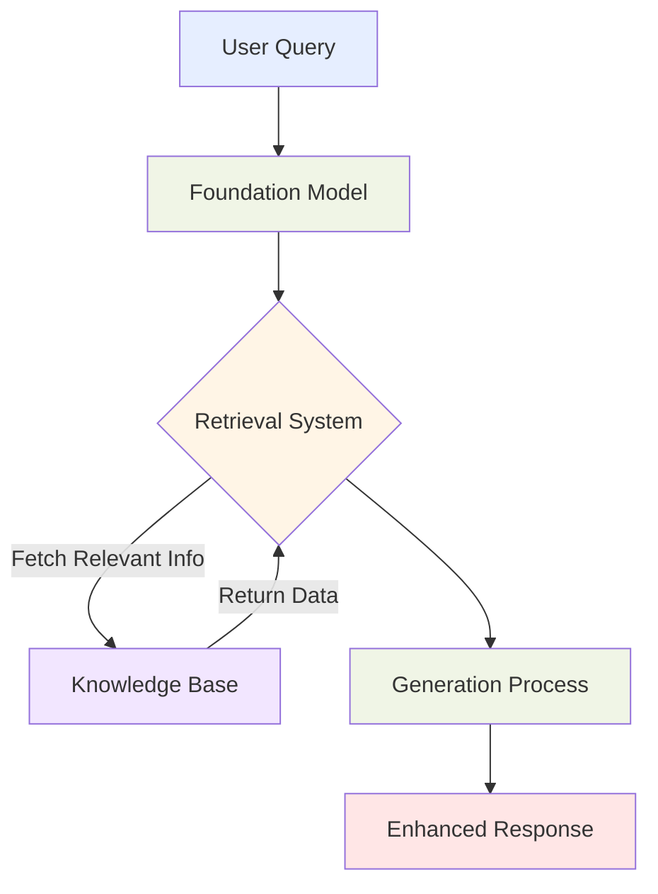
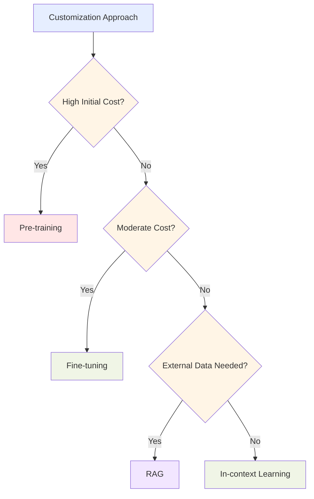
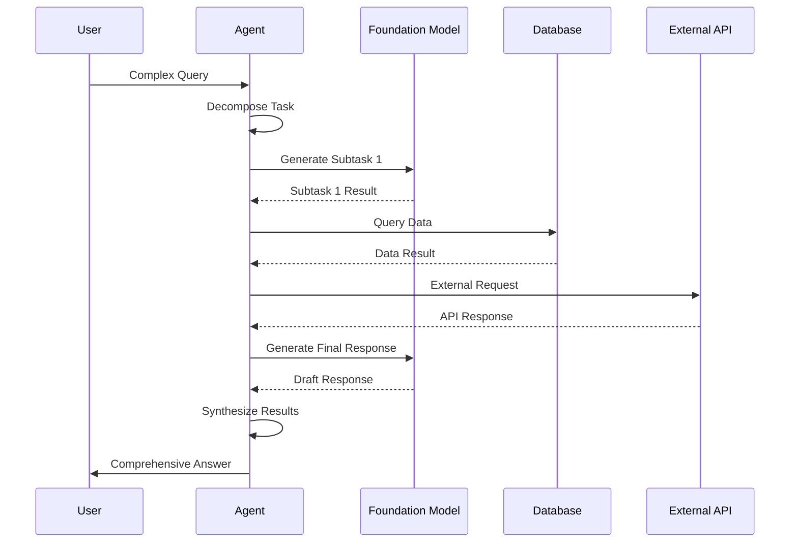

## 3.1 Design considerations for applications that use foundation models

Foundation models represent a significant advancement in artificial intelligence, offering powerful capabilities in natural language processing, image generation, and complex problem-solving. These sophisticated AI models, available through services like Amazon Bedrock[^600], have transformed how organizations approach AI implementation. Understanding design considerations for applications leveraging these models is essential for both AWS Certified AI Practitioner exam preparation and real-world implementation.

Effectively designing and implementing applications with foundation models has become a critical competency as AI adoption accelerates across industries. Each design decision—from model selection to parameter configuration and implementation of techniques like **Retrieval Augmented Generation (RAG)**[^601]—significantly impacts performance, cost, and overall success. Staying current with AWS services and best practices for model customization and deployment provides organizations with a competitive advantage in an increasingly AI-driven marketplace.

### Identifying selection criteria for pre-trained models

Selecting the appropriate pre-trained model is a foundational step that significantly impacts the performance, cost, and effectiveness of your AI solution. Consider these key selection criteria:

1. **Cost**: Financial implications vary widely between models. Larger, more complex models typically incur higher computational costs for both training and inference, requiring careful budget consideration.

2. **Modality**: Foundation models handle various data types including text, images, audio, and multimodal inputs. Selecting a model aligned with your application's primary data type ensures optimal performance.

3. **Latency**: Real-time applications such as chatbots or recommendation systems require low latency. Smaller models or those optimized for inference speed often perform better in these scenarios.

4. **Multi-lingual support**: For global applications, models with robust multi-lingual capabilities enable seamless communication across different languages and markets.

5. **Model size and complexity**: Larger models typically offer higher accuracy but demand more computational resources. This requires balancing performance needs against available infrastructure.

6. **Customization options**: Some models are more amenable to fine-tuning or domain-specific adaptation. Applications requiring specialized knowledge benefit from models supporting efficient customization.

7. **Input/output length**: Models have varying limitations on input processing and output generation length. Ensure your selected model handles your expected data dimensions.

To illustrate the selection process, consider a global e-commerce company designing an AI-powered customer service chatbot:

*Figure 3.1.1: Model Selection Flowchart. This diagram illustrates the decision-making process for selecting an appropriate foundation model based on key criteria such as multilingual support, latency requirements, and customization needs.*

In this scenario, the company might prioritize a multilingual model with low latency and customization options to handle diverse customer inquiries efficiently across different markets. They could leverage Amazon Bedrock to access a variety of foundation models and choose one that best fits these criteria, such as the Anthropic Claude model[^602] for its strong multilingual capabilities and customization options.

### Understanding the effect of inference parameters on model responses

Once you've selected a suitable foundation model, optimizing inference parameters becomes crucial for fine-tuning the model's responses to meet specific application needs. Two key parameters that significantly influence model output are temperature and input/output length.

1. **Temperature**: This parameter controls the randomness or creativity of the model's output. 
   - Lower temperature (e.g., 0.2) results in more deterministic, focused responses.
   - Higher temperature (e.g., 0.8) leads to more diverse and creative outputs.

2. **Input/Output Length**: These parameters define the maximum token count for input prompts and generated responses.
   - Longer inputs provide more context but may increase processing time and costs.
   - Longer outputs allow for more detailed responses but can also introduce irrelevant information.

Let's examine how these parameters might affect a customer service chatbot:

*Table 3.1.1: Effect of Temperature on Model Responses*
| Feature | Low Temperature (0.2) | High Temperature (0.8) |
|---------|----------------------|------------------------|
| **Response Style** | Concise, factual responses | Creative, varied responses |
| **Information** | Consistent, reliable information | Exploratory, diverse suggestions |
| **Best Use Cases** | Specific queries, factual information | Brainstorming, creative tasks |
| **Predictability** | High predictability | More randomness |
| **Use cases** | - Question answering   - Factual information retrieval   - Technical explanations   - Consistent outputs across multiple runs   - Precise instructions following  | - Creative writing  - Idea generation  - Multiple alternative solutions  - Conversational variety - Exploration of possibilities |

In practice, businesses might adjust these parameters based on the specific use case. For instance, when handling technical support queries, a lower temperature setting could ensure more precise and consistent answers. Conversely, for product recommendations or creative content generation, a higher temperature might be preferred to generate diverse suggestions.

### Defining Retrieval Augmented Generation (RAG) and its business applications

**Retrieval Augmented Generation (RAG)** is an innovative approach that enhances foundation models by incorporating external knowledge bases. This technique allows models to access and utilize up-to-date, domain-specific information, significantly improving the accuracy and relevance of their outputs[^603].

Key components of RAG:
1. **Foundation Model**: The core language model (e.g., GPT-3, BERT)
2. **Knowledge Base**: External data source containing relevant information
3. **Retrieval System**: Mechanism to fetch pertinent information from the knowledge base
4. **Generation Process**: Combines retrieved information with the model's inherent knowledge

RAG offers several advantages for business applications:
- **Improved Accuracy**: By incorporating current and specific information
- **Reduced Hallucinations**: Minimizes the generation of false or irrelevant content
- **Customization**: Allows tailoring of responses to specific business domains
- **Up-to-date Information**: Enables access to the latest data without constant model retraining

*Figure 3.1.3: Retrieval Augmented Generation Process. This diagram illustrates the flow of information in a RAG system, from the initial user query through the foundation model, retrieval system, and knowledge base, culminating in an enhanced response.*

Business applications of RAG using Amazon Bedrock[^604]:
1. **Customer Support**: Integrating company-specific product information and policies for accurate responses
2. **Financial Analysis**: Incorporating real-time market data for informed decision-making
3. **Healthcare**: Accessing up-to-date medical research for patient care recommendations
4. **Legal Services**: Retrieving current case law and regulations for legal advice
5. **E-commerce**: Enhancing product recommendations with real-time inventory and pricing data

By leveraging RAG through Amazon Bedrock, businesses can create more intelligent and context-aware AI applications that provide accurate, relevant, and up-to-date information to users.

### Identifying AWS services for storing embeddings within vector databases

**Embeddings** are crucial components in modern AI applications, representing complex data (like text or images) as dense vectors. These vectors capture semantic relationships, enabling efficient similarity searches and enhancing the performance of AI models. AWS offers several services that can be used to store and manage these embeddings within vector databases:

1. **Amazon OpenSearch Service**[^605]: 
   - Supports vector search capabilities
   - Ideal for large-scale, real-time search and analytics
   - Offers high performance for similarity searches

2. **Amazon Aurora**[^606]: 
   - PostgreSQL-compatible edition supports vector operations
   - Integrates well with existing relational database workflows
   - Suitable for applications requiring both traditional and vector-based queries

3. **Amazon Neptune**[^607]: 
   - Graph database with vector search capabilities
   - Excellent for relationship-based queries and recommendations
   - Supports complex data structures and relationships

4. **Amazon DocumentDB (with MongoDB compatibility)**[^608]: 
   - Document database supporting vector search
   - Ideal for semi-structured data and flexible schemas
   - Compatible with MongoDB drivers and tools

5. **Amazon RDS for PostgreSQL**[^609]: 
   - Managed relational database with vector extension support
   - Suitable for applications requiring ACID compliance
   - Integrates well with existing PostgreSQL-based systems

To illustrate how these services might be used in a real-world scenario, consider the following table comparing their characteristics:

*Table 3.1.2: Comparison of AWS Vector Database Services*

| Service | Vector Search Capability | Best For | Scalability | Integration |
|---------|--------------------------|----------|-------------|-------------|
| Amazon OpenSearch Service | Native support | Large-scale, real-time search | High | Elasticsearch API |
| Amazon Aurora | Via pgvector extension | Hybrid relational/vector workloads | High | SQL |
| Amazon Neptune | Built-in support | Graph-based recommendations | High | Gremlin, SPARQL |
| Amazon DocumentDB | Via Atlas Vector Search | Flexible, document-based data | Moderate | MongoDB API |
| Amazon RDS for PostgreSQL | Via pgvector extension | Traditional RDBMS with vector support | Moderate | SQL |

Choosing the right service depends on factors such as:
- Existing data infrastructure
- Required query patterns
- Scale of vector operations
- Integration needs with other AWS services

For instance, a recommendation system for an e-commerce platform might leverage Amazon Neptune to store product embeddings and customer relationship data, enabling complex recommendation queries that consider both item similarity and user behavior.

### Explaining cost tradeoffs of foundation model customization approaches

Customizing foundation models to suit specific business needs is a crucial aspect of AI application development. However, different customization approaches come with varying cost implications. Understanding these tradeoffs is essential for making informed decisions about model deployment and optimization.

Let's explore the main customization approaches and their associated cost considerations:

1. **Pre-training**:
   - Process: Training a model from scratch on domain-specific data
   - Costs: Highest initial investment in computational resources and time
   - Benefits: Fully customized model tailored to specific domain
   - Best for: Large organizations with substantial data and unique requirements

2. **Fine-tuning**:
   - Process: Adjusting pre-trained model weights on domain-specific data
   - Costs: Moderate computational resources, shorter training time than pre-training
   - Benefits: Improved performance on specific tasks while leveraging general knowledge
   - Best for: Organizations with moderate data and specific use cases

3. **In-context learning**:
   - Process: Providing examples or instructions within the input prompt
   - Costs: Minimal additional computational cost, no training required
   - Benefits: Quick adaptation to new tasks without model modification
   - Best for: Rapid prototyping or handling diverse, low-volume tasks

4. **Retrieval Augmented Generation (RAG)**:
   - Process: Enhancing model responses with external knowledge base
   - Costs: Additional storage and retrieval costs, minimal training required
   - Benefits: Improved accuracy and up-to-date information without full retraining
   - Best for: Applications requiring current, domain-specific knowledge

To visualize the cost-benefit tradeoffs of these approaches, consider the following diagram:

*Figure 3.1.4: Cost-Benefit Decision Tree for Model Customization. This diagram illustrates the decision-making process for choosing a model customization approach based on cost considerations and specific needs.*

When leveraging Amazon Bedrock for foundation model customization, businesses can optimize costs by:
- Starting with in-context learning for quick experiments
- Utilizing RAG for incorporating domain knowledge without full retraining
- Employing fine-tuning for specific use cases with moderate data volumes
- Considering pre-training only for large-scale, unique applications

By carefully evaluating these tradeoffs, organizations can balance performance requirements with budget constraints, ensuring efficient and effective AI implementations.

### Understanding the role of agents in multi-step tasks

**Agents** in AI applications, particularly those built on foundation models, play a crucial role in handling complex, multi-step tasks. These agents act as intelligent intermediaries, breaking down complex queries into manageable steps, orchestrating multiple AI services, and providing coherent responses to users. Amazon Bedrock offers Agents capabilities[^610] that significantly enhance the ability of foundation models to perform sophisticated, multi-step operations.

Key aspects of AI agents:
1. **Task Decomposition**: Breaking complex queries into smaller, manageable subtasks
2. **Service Orchestration**: Coordinating multiple AI and cloud services to complete tasks
3. **Context Management**: Maintaining context across multiple interactions or steps
4. **Decision Making**: Choosing appropriate actions based on intermediate results
5. **Response Synthesis**: Combining results from multiple steps into coherent outputs

Let's explore how agents might handle a complex business scenario:

*Figure 3.1.5: Agent Workflow for Multi-step Tasks. This diagram illustrates how an AI agent orchestrates various components to handle a complex query, from task decomposition through interaction with multiple services to final response synthesis.*

Business applications of agents in Amazon Bedrock:
1. **Customer Service**: Handling complex inquiries that require accessing multiple databases, policies, and external services
2. **Financial Planning**: Orchestrating market analysis, risk assessment, and personalized recommendation generation
3. **Supply Chain Optimization**: Coordinating inventory checks, demand forecasting, and logistics planning
4. **Healthcare Diagnostics**: Managing patient data analysis, symptom checking, and treatment recommendation processes
5. **Travel Planning**: Orchestrating flight searches, hotel bookings, and itinerary optimization based on user preferences

By leveraging agents in Amazon Bedrock, businesses can create more sophisticated AI applications capable of handling complex, multi-step tasks that closely mimic human problem-solving processes. This approach not only enhances the capabilities of AI systems but also improves user experience by providing comprehensive, context-aware responses to complex queries.

In conclusion, designing applications that effectively utilize foundation models requires careful consideration of various factors, from model selection and parameter tuning to advanced techniques like RAG and the use of AI agents. By understanding these design considerations and leveraging the powerful capabilities of Amazon Bedrock and related AWS services, businesses can create AI applications that are not only powerful and efficient but also tailored to their specific needs and constraints. As the field of AI continues to evolve rapidly, staying informed about these design principles and best practices will be crucial for business professionals aiming to harness the full potential of AI in their organizations.

### Questions for self-check

1. **When selecting a pre-trained foundation model for an AI application, which of the following is NOT typically a key consideration?**

   A. Model size and complexity
   B. Multi-lingual support
   C. The model's training dataset size
   D. Input/output length limitations

2. **A company is developing an AI-powered customer service chatbot that needs to provide consistent, factual responses. Which temperature setting would be most appropriate for this use case?**

   A. 0.2
   B. 0.5
   C. 0.8
   D. 1.0

3. **Which AWS service is best suited for storing embeddings in a vector database when the application requires both traditional relational queries and vector-based similarity searches?**

   A. Amazon OpenSearch Service
   B. Amazon Aurora
   C. Amazon Neptune
   D. Amazon DocumentDB

4. **A startup is developing an AI application that needs to leverage up-to-date industry-specific information without constant model retraining. Which approach would be most suitable for this scenario?**

   A. Pre-training
   B. Fine-tuning
   C. In-context learning
   D. Retrieval Augmented Generation (RAG)

5. **In the context of AI agents handling multi-step tasks, which of the following is NOT a key aspect of their functionality?**

   A. Task decomposition
   B. Service orchestration
   C. Model pre-training
   D. Response synthesis

### Answers and Explanations

1. **Correct answer: C. The model's training dataset size**

   Explanation: While the size of the training dataset is important for the overall quality of a foundation model, it is not typically a key consideration when selecting a pre-trained model for an application. The subchapter mentions cost, modality, latency, multi-lingual support, model size and complexity, customization options, and input/output length as primary selection criteria. The training dataset size is generally not directly relevant to the application-specific needs and is more of an internal characteristic of the model's development[^611].

2. **Correct answer: A. 0.2**

   Explanation: For a customer service chatbot that needs to provide consistent, factual responses, a lower temperature setting is more appropriate. The subchapter explains that lower temperature values (e.g., 0.2) result in more deterministic, focused responses, which is ideal for scenarios requiring factual and consistent information. Higher temperatures (like 0.8) lead to more diverse and creative outputs, which is not desirable for this specific use case where accuracy and consistency are prioritized[^612].

3. **Correct answer: B. Amazon Aurora**

   Explanation: According to the subchapter, Amazon Aurora (PostgreSQL-compatible edition) supports vector operations and integrates well with existing relational database workflows. It is described as suitable for applications requiring both traditional and vector-based queries. This makes it the ideal choice for a scenario where both relational queries and vector-based similarity searches are needed, offering a balance between traditional database functionality and vector search capabilities[^613].

4. **Correct answer: D. Retrieval Augmented Generation (RAG)**

   Explanation: Retrieval Augmented Generation (RAG) is the most suitable approach for this scenario. The subchapter describes RAG as a technique that enhances foundation models by incorporating external knowledge bases, allowing access to up-to-date, domain-specific information without constant model retraining. This aligns perfectly with the startup's need to leverage current industry-specific information without frequent model updates, making it more efficient and cost-effective than alternatives like pre-training or fine-tuning[^614].

5. **Correct answer: C. Model pre-training**

   Explanation: Model pre-training is not listed as a key aspect of AI agents' functionality in handling multi-step tasks. The subchapter outlines the key aspects of AI agents as task decomposition, service orchestration, context management, decision making, and response synthesis. Model pre-training is a separate process that occurs before the deployment of the foundation model and is not part of the agent's role in managing complex, multi-step tasks[^615].

[^600]: Amazon Bedrock Overview. URL: <https://aws.amazon.com/bedrock/>
[^601]: Foundation Models for RAG - Amazon Bedrock Knowledge Bases. URL: <https://aws.amazon.com/bedrock/knowledge-bases/>
[^602]: Anthropic Claude on Amazon Bedrock. URL: <https://aws.amazon.com/bedrock/claude/>
[^603]: Retrieve data and generate AI responses with Amazon Bedrock Knowledge Bases. URL: <https://docs.aws.amazon.com/bedrock/latest/userguide/knowledge-base.html>
[^604]: Build Generative AI Applications with Foundation Models - Amazon Bedrock. URL: <https://aws.amazon.com/bedrock/>
[^605]: Amazon OpenSearch Service Vector Search. URL: <https://docs.aws.amazon.com/opensearch-service/latest/developerguide/vector-search.html>
[^606]: Amazon Aurora PostgreSQL Vector Support. URL: <https://docs.aws.amazon.com/AmazonRDS/latest/AuroraUserGuide/postgresql-vector.html>
[^607]: Amazon Neptune Vector Search. URL: <https://docs.aws.amazon.com/neptune/latest/userguide/vector-search.html>
[^608]: Amazon DocumentDB Vector Search. URL: <https://docs.aws.amazon.com/documentdb/latest/developerguide/vector-search.html>
[^609]: Amazon RDS for PostgreSQL Vector Support. URL: <https://docs.aws.amazon.com/AmazonRDS/latest/UserGuide/PostgreSQL_vector.html>
[^610]: Amazon Bedrock Agents Overview. URL: <https://docs.aws.amazon.com/bedrock/latest/userguide/agents.html>
[^611]: AWS Foundation Model Selection Guide. URL: <https://docs.aws.amazon.com/bedrock/latest/userguide/model-selection.html>
[^612]: AWS Foundation Model Inference Parameters. URL: <https://docs.aws.amazon.com/bedrock/latest/userguide/inference-parameters.html>
[^613]: Building AI-powered search in PostgreSQL using Amazon SageMaker and pgvector. URL: <https://aws.amazon.com/blogs/database/building-ai-powered-search-in-postgresql-using-amazon-sagemaker-and-pgvector/>
[^614]: Retrieve data and generate AI responses with Amazon Bedrock Knowledge Bases. URL: <https://docs.aws.amazon.com/bedrock/latest/userguide/knowledge-base.html>
[^615]: Amazon Bedrock Agents Functionality. URL: <https://docs.aws.amazon.com/bedrock/latest/userguide/agents-functionality.html>