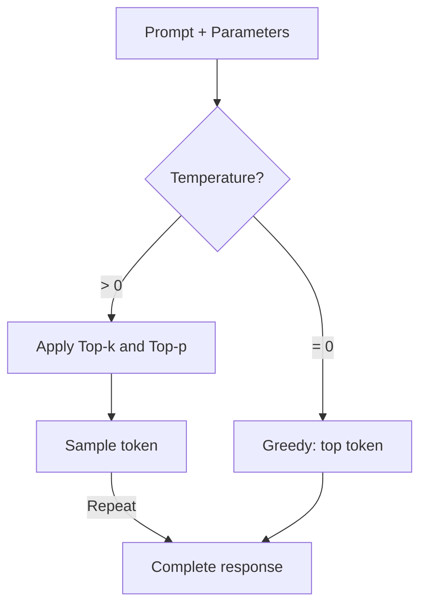
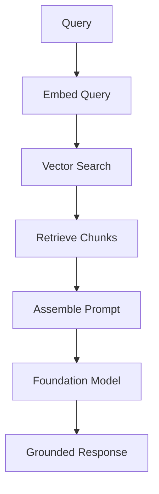
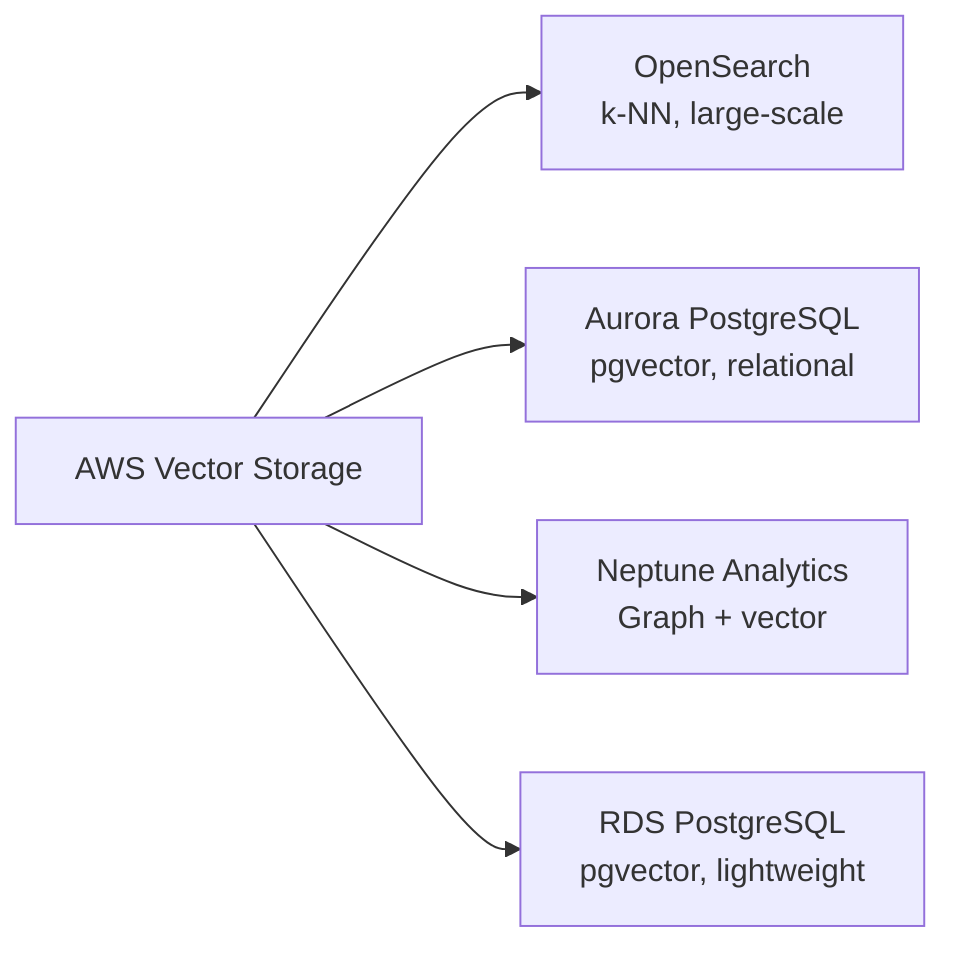
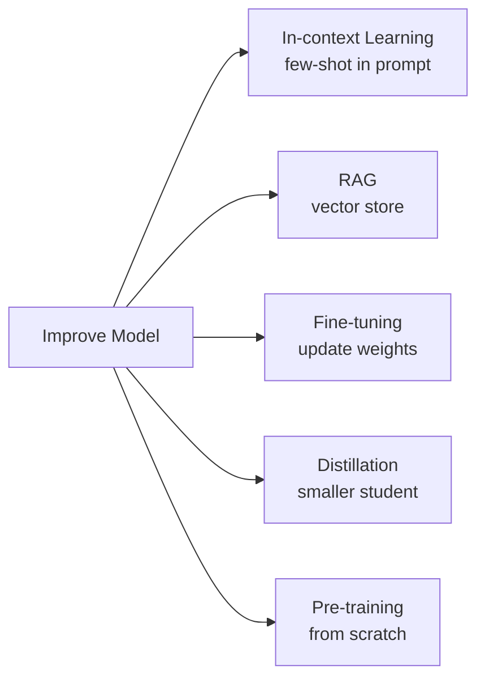
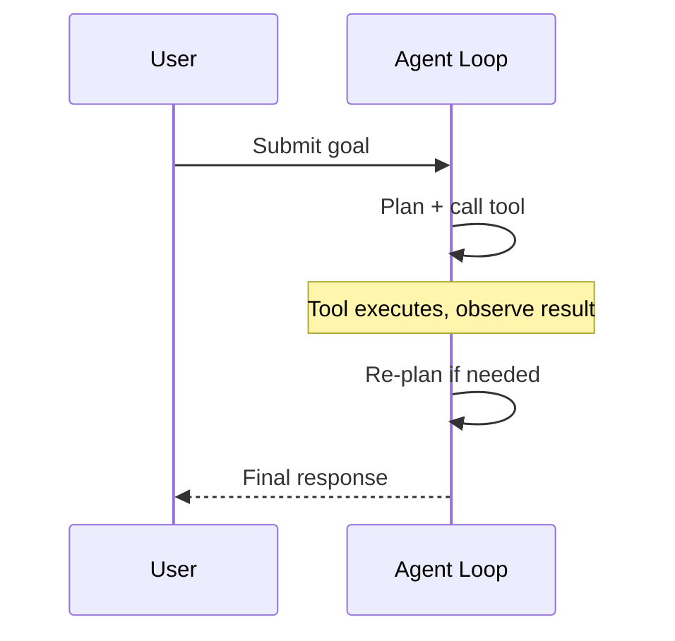

## Task Statement 3.1: Describe design considerations for applications that use foundation models (FMs)

Building a production application on a foundation model starts long before the first prompt. The decisions you make at design time, which model to use, how to tune its outputs, how to ground it in private data, where to store that data, and how to scale the knowledge over time, determine whether the project delivers value or stalls at the pilot stage. This task statement covers those decisions in the order a business architect would face them.[^301001]

### 3.1.1 Selection criteria to choose FMs

Choosing a foundation model is not a one-time technical decision; it recurs every time the business requirements change. A model that performed acceptably in a pilot may become too expensive at production volume. A model that answered English customer questions well may need replacement when the product expands to Spanish-speaking markets. Understanding the selection criteria keeps those decisions systematic rather than reactive.

The criteria the exam covers fall into three groups. Cost and performance criteria govern how much the model costs to run and how fast it responds. Capability criteria govern what the model can do. Flexibility criteria govern how much the model can be changed to fit the business.

**Cost** is measured per token, where a token is roughly three-quarters of an English word (or about four characters of English text).[^301036] Input tokens (the prompt) and output tokens (the response) are priced separately, and output tokens are consistently more expensive.[^301002] A customer-service assistant that reads a 500-word customer history and produces a 100-word reply will consume roughly 670 input tokens and 130 output tokens per interaction. At production scale that arithmetic matters enormously. **Prompt caching** reduces effective cost by reusing the model's processed representation of a static prefix, such as a long system prompt or a product catalogue, across multiple calls. Amazon Bedrock supports prompt caching for select models, including Anthropic Claude on Bedrock, making it a meaningful cost lever when a large context block is reused across thousands of daily requests.[^301003]

**Modality** refers to what types of input a model can accept and what types of output it can produce.[^301037] A *text-only* model reads text and produces text. A *multimodal* model can also read images, documents, or audio. If a business application needs to classify scanned invoices or answer questions about product photos, a multimodal model is mandatory, and the cost per interaction will be higher. Selecting a text-only model for a text-only task avoids paying for multimodal capability that goes unused.

**Latency** is the time from the moment a request is sent to the moment the first token of the response appears.[^301038] Interactive applications such as chatbots require low latency; a five-second pause breaks the conversational experience. Batch applications such as overnight document summarization can tolerate higher latency in exchange for lower cost. Model size is one of the largest drivers of latency: smaller models run faster but have lower reasoning capacity, while larger models reason better but take longer to respond. **Model size** is measured in billions of parameters, the learned numerical weights inside the network. A 7-billion-parameter model typically responds in under one second on appropriate infrastructure; a 70-billion-parameter model may take several seconds for the same prompt.[^301004]

**Model complexity** relates to the architectural design choices that go beyond parameter count. Some models are dense, meaning all parameters activate for every token; others use *mixture-of-experts* (MoE) architectures that activate only a subset of parameters per token, achieving better quality at lower inference cost.[^301039] From a selection perspective, complexity matters because it affects inference throughput and the infrastructure tier needed to serve the model.

**Multilingual support** covers the language breadth of the model's pre-training data.[^301040] A model trained primarily on English text produces lower-quality outputs in other languages. For global deployments, checking a model's documented language support before selection avoids painful quality regressions when expanding markets.

**Customization** refers to whether the model can be fine-tuned or continuously pre-trained on proprietary data.[^301041] Not all commercially available models support fine-tuning. If a project requires teaching the model domain-specific terminology or proprietary workflows, verifying fine-tuning availability before signing a contract is essential. Section 3.1.5 covers the cost trade-offs between customization approaches.

**Context window size** sets the maximum number of tokens the model can read in a single call, counting both the input and the output.[^301042] A model with a 200,000-token context window can process an entire legal contract in one request; a model with a 4,096-token window cannot. Several flagship models on Amazon Bedrock now offer one-million-token windows (Anthropic Claude Opus and Sonnet through the 1M-context beta header, Amazon Nova Premier, and Meta Llama 4 Maverick), which can hold an entire codebase or a year of correspondence in a single prompt. Longer context windows cost more per call but may eliminate the need for complex chunking strategies in RAG pipelines (see Section 3.1.3).

*Table 3.1.1* below compares the major model families available through Amazon Bedrock at the time of writing. Exact prices change; the relative positioning between model tiers within a family is stable.[^301005]

*Table 3.1.1: Foundation model comparison by tier and capability*

| Model family | Tier | Relative cost | Modality | Context window | Typical use case |
|---|---|---|---|---|---|
| Anthropic Claude Opus | Flagship | High | Multimodal | 200K standard, 1M with beta header | Complex reasoning, legal/medical |
| Anthropic Claude Sonnet | Balanced | Medium | Multimodal | 200K standard, 1M with beta header | General enterprise tasks |
| Anthropic Claude Haiku | Fast | Low | Multimodal | 200K tokens | High-volume customer interactions |
| Amazon Nova Premier | Flagship | High | Multimodal | 1M tokens | Complex cross-modal, very long documents |
| Amazon Nova Pro | Balanced | Medium | Multimodal | 300K tokens | Enterprise workflows |
| Amazon Nova Lite | Fast | Low | Multimodal | 300K tokens | Cost-sensitive production |
| Amazon Nova Micro | Fastest | Lowest | Text only | 128K tokens | Ultra-low latency or cost |
| Meta Llama 4 Maverick | Open | Variable | Multimodal | 1M tokens | Customizable, long-context deployments |
| Mistral Large 2 | Balanced | Medium | Text only | 128K tokens | European language tasks |

The exam does not expect memorized pricing. It does expect you to match a business scenario (high volume, multilingual, image-analysis, tight budget) to the right tier of model using these criteria.

### 3.1.2 Effect of inference parameters on model responses

Even a correctly selected model can produce inappropriate outputs if its inference parameters are misconfigured. Inference parameters are settings passed at runtime, alongside the prompt, that tell the model how to sample from the probability distribution of possible next tokens. Adjusting them changes the model's behavior without retraining.

**Temperature** controls the degree of randomness in the sampling process.[^301043] At a temperature of 0 the model always selects the token with the highest probability, producing deterministic, consistent output. At a temperature of 1 the model samples according to the raw probability distribution, producing more varied and creative output. Values above 1 amplify lower-probability tokens, increasing creativity at the cost of coherence.[^301006] The business implication is direct: a legal-document summarization tool should run at temperature 0 or very close to it, because consistency and accuracy matter more than variety. A marketing-copy generator might use temperature 0.8 or higher to produce diverse creative options from the same brief.

**Top-p** (also called *nucleus sampling*) is a complementary randomness control.[^301044] Instead of adjusting token probabilities by a multiplier, top-p defines a cumulative probability threshold. The model samples only from the smallest set of tokens whose combined probability reaches the threshold. At top-p = 0.9, the model considers only the tokens that together account for 90% of the probability mass, discarding low-probability outliers. Lower top-p values make the output more focused; higher values allow more variety.[^301007]

**Top-k** restricts sampling to the k tokens with the highest individual probabilities, regardless of their combined probability.[^301045] At top-k = 50, the model samples only from the 50 most likely next tokens. Top-k and top-p are often used together; the model first filters by top-k and then applies the top-p threshold to the remaining candidates.

Temperature and top-p interact in practice. Setting temperature = 0 makes top-p irrelevant because there is no stochastic sampling to govern. Setting top-p = 1.0 disables nucleus sampling, leaving temperature as the only active control. A common production configuration for a high-accuracy assistant is temperature = 0.1 and top-p = 0.9, producing output that is mostly deterministic while allowing the occasional alternative phrasing when the model is genuinely uncertain.

**Stop sequences** are character strings that tell the model to stop generating as soon as it produces them.[^301046] For example, a prompt template that uses an explicit end marker might include `"\n###END###"` as a stop sequence so the model halts immediately after producing the marker. Stop sequences are useful for enforcing output format in applications where a downstream system must parse the response, and they should be picked to be unambiguous in the expected output (a literal `}` is a poor choice for nested JSON because the inner brace would terminate generation before the outer object closes).

**Input and output length** parameters cap the number of tokens the model reads (input) or generates (output). Capping output length controls cost on high-volume endpoints. Capping input length at the API level prevents clients from sending prompts that exceed the model's context window and triggering an error. Both caps should be set based on the realistic maximum size of a valid request, not the maximum the model supports.

```
Example inference parameter configuration:
  temperature:     0.1
  top_p:           0.9
  top_k:           50
  max_new_tokens:  512
  stop_sequences:  ["###END###"]
```

The configuration above suits a document-extraction assistant that must produce short, structured outputs reliably. A creative-writing assistant would increase temperature, increase top-p, and remove the stop sequence.


*Figure 3.1.1: Token sampling pipeline. The model selects each output token by filtering candidates through top-k and top-p before applying temperature-scaled stochastic sampling.*

### 3.1.3 Define RAG and its business applications

Foundation models are trained on large public datasets, but they have no access to information that postdates their training cutoff and no access to proprietary organizational data. A model trained through late 2024 cannot answer questions about a product release in early 2025. A general-purpose model has never seen your internal HR policy, your customer contract templates, or your engineering runbooks. **Retrieval Augmented Generation (RAG)** is the architectural pattern that addresses this limitation by connecting the model to an external knowledge store at query time, rather than baking knowledge into the model's weights through training.[^301008]

The mechanics of RAG proceed in five steps. First, the user's question is converted into a numerical vector called an *embedding* that captures its semantic meaning.[^301047] Second, that vector is compared against a database of pre-computed embeddings derived from the organization's private documents. Third, the documents whose embeddings are most similar to the query embedding are retrieved. Fourth, those documents are assembled into a context block and prepended to the user's original question to form the full prompt. Fifth, the foundation model reads the enriched prompt and generates a response grounded in the retrieved content rather than in its parametric memory alone.[^301009]


*Figure 3.1.2: RAG request pipeline. The user query is embedded, matched against stored document vectors, and the retrieved chunks are merged with the original query before the foundation model generates its response.*

**Amazon Bedrock Knowledge Bases** is AWS's fully managed implementation of this pattern.[^301010] It handles the ingestion pipeline, the embedding generation, the vector-store integration, and the retrieval API, letting an organization adopt RAG without building or operating any of the underlying infrastructure. The administrator configures a Knowledge Base by specifying a data source, a chunking strategy, an embedding model, and a vector storage backend; Bedrock then synchronizes the documents automatically.

Data sources supported by Amazon Bedrock Knowledge Bases include Amazon S3 buckets (the most common choice for document archives), Atlassian Confluence spaces, Microsoft SharePoint sites, Salesforce objects, and web URLs via a built-in web crawler.[^301011] Each data source is synchronized on a schedule or on demand; updates to source documents are reflected in the vector store without manual re-indexing.[^301048]

*Chunking* is the process of splitting source documents into segments small enough to fit inside a context window alongside the original query.[^301049] Bedrock Knowledge Bases supports fixed-size chunking (split every N tokens), semantic chunking (split at natural topic boundaries identified by a secondary model), and hierarchical chunking (produce both a parent summary chunk and smaller child detail chunks so retrieval can operate at two levels of granularity).[^301012]

Business applications of RAG span several categories:

- **Internal question-and-answer**: Employees ask the system questions about HR policies, IT procedures, or product specifications. The system retrieves the relevant policy paragraphs and generates a precise answer with the source document cited.
- **Customer support**: A support agent or self-service chatbot retrieves relevant troubleshooting steps from a knowledge base and presents them in conversational language, reducing average handle time.
- **Contract and legal analysis**: Legal teams ingest contract libraries. The model answers questions such as "Which contracts contain a termination-for-convenience clause?" or "What is the liability cap in the Master Service Agreement with Vendor X?"
- **Research assistance**: Scientists, analysts, or product managers query a corpus of internal research reports. The model synthesizes findings across multiple documents rather than returning a list of links.

RAG is preferred over fine-tuning when the knowledge base changes frequently, because updating a vector store takes minutes while retraining a model takes hours or days.[^301050] It is also preferred when the source documents must be auditable; because the retrieved chunks are visible in the prompt, a developer can inspect exactly which documents influenced the response.[^301051]

### 3.1.4 AWS services for storing embeddings in vector databases

RAG requires a place to store the pre-computed embeddings and to search them quickly using *approximate nearest-neighbor* (ANN) or *k-nearest-neighbor* (k-NN) algorithms.[^301052] AWS provides four managed services that support vector storage, each suited to different scale, architectural, and query requirements.[^301053]


*Figure 3.1.3: AWS vector storage services. Each service supports embedding storage but differs in scale, query model, and complementary capabilities.*

**Amazon OpenSearch Service** has supported approximate nearest-neighbor vector search since the k-NN plugin was introduced, and its *vector engine* is optimized for large-scale, high-throughput semantic search workloads.[^301013] It supports the Hierarchical Navigable Small World (HNSW) index algorithm, which delivers sub-millisecond retrieval at billions of vectors.[^301054] OpenSearch is the most capable option when the retrieval dataset is large (millions of documents or more), when the search must combine vector similarity with traditional keyword filters (hybrid search), or when the application already uses OpenSearch for log analytics and can share the cluster. Amazon Bedrock Knowledge Bases uses OpenSearch Service as its default vector backend when no alternative is specified.[^301055]

**Amazon Aurora** with the pgvector extension adds vector storage to the PostgreSQL-compatible relational database.[^301014] This option is appropriate when the application already stores structured data in Aurora and wants to add semantic search without operating a separate vector store. A product catalogue stored as rows in Aurora can gain embedding columns; queries can then combine relational predicates ("products in the Electronics category") with vector similarity ("similar to this product description") in a single SQL statement.[^301056] The trade-off is scale: pgvector on Aurora performs well for datasets in the range of hundreds of thousands to low millions of vectors but does not match OpenSearch Service at very large scales.

**Amazon Neptune Analytics** extends the Neptune graph database with vector search capability, enabling queries that combine graph traversal with semantic similarity.[^301015] A knowledge graph that models relationships between people, organizations, and documents can use Neptune Analytics to answer questions like "Find documents most semantically similar to this query that were authored by someone in the legal department and cite at least one regulation."[^301057] This combination of graph reasoning and vector retrieval is difficult to replicate with a purely relational or purely search-based store. Neptune Analytics is the right choice when the retrieval problem has an inherent graph structure, such as supply-chain analysis, fraud investigation, or biomedical research.

**Amazon RDS for PostgreSQL** provides the same pgvector capability as Aurora but runs on the standard RDS infrastructure rather than the Aurora serverless or provisioned cluster.[^301016] It is appropriate for smaller workloads where the existing RDS instance is already running PostgreSQL and adding the pgvector extension is the path of least resistance.[^301058] Development environments and lightweight internal tools frequently use this option to keep infrastructure simple while still supporting vector search.

For a quick rule of thumb on choosing between these stores: pgvector (on RDS or Aurora) handles up to a few million vectors comfortably; Amazon OpenSearch Service is the default once a workload crosses into the tens of millions and beyond, where its HNSW index keeps retrieval latency low at very large scale. Neptune Analytics is the right answer when the data is fundamentally graph-structured.

*Table 3.1.2: AWS vector storage service comparison*

| Service | Index algorithm | Scale | Complementary capability | Best for |
|---|---|---|---|---|
| OpenSearch Service | HNSW, IVF | Very large (billions) | Hybrid keyword + vector, analytics | High-volume RAG, enterprise search |
| Aurora PostgreSQL (pgvector) | IVFFlat, HNSW | Medium (millions) | Relational SQL joins | Apps already on Aurora |
| Neptune Analytics | Graph + vector | Medium | Graph traversal, relationship queries | Graph-structured knowledge bases |
| RDS for PostgreSQL (pgvector) | IVFFlat, HNSW | Small to medium | Relational SQL, simple setup | Dev environments, internal tools |

Amazon Bedrock Knowledge Bases can be configured to use any of these four backends.[^301017] The default, when no backend is specified, is OpenSearch Service.[^301059] Organizations that already operate Aurora or RDS for PostgreSQL can point a Knowledge Base at their existing cluster, avoiding the cost of a separate search service. Neptune Analytics is selected explicitly when the knowledge base has graph structure.

Note: Amazon MemoryDB was listed as a vector storage option in earlier versions of the AIF-C01 exam guide. It was removed in version 1.1 of the guide. Do not expect exam questions about MemoryDB in the context of vector search.

### 3.1.5 Cost tradeoffs of FM customization

When a foundation model's default behavior is not good enough for a specific business task, there are five broad strategies for improving it. They differ substantially in cost, time, data requirements, and the durability of the improvement.

**Pre-training** is the process of training a model from scratch on a large corpus of text (or other data).[^301060] Pre-training determines the model's fundamental knowledge and language understanding. It requires enormous compute resources (hundreds to thousands of GPUs running for weeks), petabytes of curated training data, and a team of machine learning researchers to supervise the process. Very few organizations outside the major AI labs conduct pre-training. It is relevant on the exam as the baseline from which all other techniques depart, not as a practical option for most businesses.[^301018]

**Fine-tuning** starts from an existing pre-trained model and continues training on a smaller, task-specific dataset.[^301061] The model's weights are updated to shift its behavior toward the target domain. Fine-tuning requires labeled examples in the hundreds to tens of thousands, GPU hours in the range of hours to days rather than weeks, and a data preparation process that produces question-answer pairs or instruction-response pairs. Amazon Bedrock supports fine-tuning for select models.[^301019] The result is a model that produces outputs better aligned to the specific task, stored as a separate model version that incurs hosting costs even when idle.[^301062]

**In-context learning** requires no weight updates.[^301063] Instead, examples of the desired behavior are placed directly inside the prompt. A zero-shot prompt gives no examples; a few-shot prompt gives two to five examples. The model uses pattern matching within its context window to generalize from those examples to the current input. In-context learning is the cheapest and fastest customization strategy and requires no infrastructure beyond what a normal inference call uses. The limitation is that the improvement lasts only for the duration of the prompt; the model does not retain the examples between calls, and the examples consume tokens that could otherwise carry content.[^301020]

**RAG** (covered in detail in Section 3.1.3) is not typically described as a customization technique, but it has similar business effects: it grounds the model in domain-specific knowledge and reduces hallucination on proprietary topics. Its cost profile is distinct from the others. The setup cost involves building and synchronizing the vector store and integrating the retrieval layer. The per-query cost is slightly higher than a plain inference call because the retrieval step and the larger augmented prompt both consume compute and tokens. The knowledge update cost, however, is very low: adding new documents to the vector store takes minutes rather than the hours a fine-tuning job requires.[^301021]

**Model distillation** is the newest technique in the v1.1 exam guide. In distillation, a large, high-quality *teacher model* generates outputs for a set of prompts, and those input-output pairs become the training dataset for a smaller *student model*.[^301064] The student learns to approximate the teacher's behavior in a specific task domain without having access to the teacher's weights.[^301022] The business benefit is that inference at production scale is served by the smaller, faster, cheaper student model while the quality of the responses approaches that of the expensive teacher. Amazon Bedrock supports model distillation as a first-class workflow, allowing organizations to use a Bedrock model as the teacher and produce a fine-tuned version of a smaller model as the student.[^301023] Distillation shifts cost from inference (which is ongoing) to a one-time training job (which can be amortized over thousands of subsequent inference calls).[^301065]


*Figure 3.1.4: FM customization selection guide. The appropriate technique depends on available labeled data, update frequency, budget, and inference volume.*

*Table 3.1.3: Cost and effort comparison of FM customization approaches*

| Approach | Compute cost | Data needed | Update speed | Per-query cost | Exam scenarios |
|---|---|---|---|---|---|
| Pre-training | Very high | Petabytes | Weeks | Normal | Academic baseline only |
| Fine-tuning | Medium | Hundreds to thousands of labeled pairs | Hours to days | Normal + hosting | Stable domain specialization |
| In-context learning | None | A few examples | Immediate | Higher (larger prompt) | Fast prototyping, low volume |
| RAG | Low setup | Existing documents | Minutes | Slightly higher | Frequently updated knowledge |
| Model distillation | Medium (one-time) | Teacher-generated pairs | Hours to days | Lower (smaller model) | High-volume cost optimization |

The exam frequently presents scenarios where a business must choose between these approaches. The decision logic is: if the knowledge changes often, choose RAG. If the task requires consistent tone or specialized terminology on a stable domain and data is available, choose fine-tuning. If volume is very high and cost per query is the primary concern, evaluate distillation. If neither budget nor time is available, use in-context learning with few-shot examples. Pre-training is never the right answer for a production-readiness scenario unless the question explicitly establishes that a novel domain exists for which no pre-trained model is available.

### 3.1.6 Role of AI agents and business applications

A foundation model that receives one prompt and returns one response operates in a *single-shot* mode. Many real business tasks cannot be completed in a single step. Booking a flight requires checking availability, comparing options, selecting seats, and confirming payment. Investigating a security alert requires querying log data, looking up threat intelligence, correlating events, and drafting a report. These multi-step tasks require a different architecture.

**An AI agent** is a system that combines a foundation model with the ability to perceive its environment, plan a sequence of actions, execute those actions using external tools, observe the results, and revise its plan based on what it learned.[^301024] The model in an agent is not just generating text; it is reasoning about what to do next, deciding which tool to call, evaluating whether the result is sufficient, and continuing until the task is complete or a stopping condition is reached.[^301066]

The agent loop has four phases. In the *perceive* phase, the agent receives the user's goal and any available context about the current state of the world.[^301067] In the *plan* phase, the model reasons about what action to take next, selecting from a defined set of tools (APIs, database queries, code executors, web search). In the *act* phase, the agent calls the selected tool and passes it the arguments the model determined. In the *observe* phase, the agent reads the tool's response and updates its understanding of progress toward the goal. The loop repeats until the agent determines that the task is complete.[^301025]


*Figure 3.1.5: AI agent perceive-plan-act-observe loop. The foundation model reasons about which tool to call at each step, and the loop continues until the task goal is met.*

The difference between an agent and a plain LLM call matters in business terms. A plain LLM call is fast, cheap, and stateless. An agent call is slower, more expensive, and stateful across multiple tool invocations.[^301068] Agents are appropriate when the task cannot be encoded in a single prompt, when it requires information from external systems, or when it involves multiple sequential decisions where each depends on the previous result.

AWS provides two primary entry points for building agents. **Amazon Bedrock Agents** is the established managed service for creating, configuring, and deploying agents backed by any Bedrock-supported foundation model.[^301026] It handles orchestration, tool routing (called *action groups* in Bedrock terminology), session state management, and integration with Knowledge Bases for RAG. **Amazon Bedrock AgentCore** is the newer runtime and management layer for production-grade agents, adding observability, memory, security controls, and the infrastructure to run agents at scale.[^301027] **Strands Agents** is an open-source SDK from AWS that allows Python developers to build agents using a straightforward decorator-based API, with agents deployable to AgentCore for managed execution.[^301028]

Business applications for AI agents include:

- **Customer service automation**: An agent handles the full resolution of a service request, querying the CRM, checking order status, initiating a return, and sending a confirmation, without a human agent involved unless the situation exceeds the defined scope.
- **IT operations**: An agent investigates a performance alert by querying CloudWatch metrics, identifying the affected resources, cross-referencing the change log, and proposing a remediation action for an operator to approve.
- **Document processing**: An agent reads incoming contracts, extracts key terms, checks them against a standard template, flags deviations, and creates a draft summary for a legal reviewer, all without manual triage.
- **Data analysis**: An agent accepts a business question in natural language, writes a SQL query, executes it against a database, interprets the result, and produces a natural-language summary with a recommendation.

*Multi-agent* architectures, where one orchestrating agent delegates subtasks to specialized sub-agents, extend the pattern to problems that are too large or too diverse for a single agent to handle reliably.[^301069] Amazon Bedrock Agents supports multi-agent collaboration natively.[^301029] The design principles for multi-agent systems, including how to partition tasks, how to route between agents, and how to maintain coherent session state, were covered earlier in Domain 2 (chapter on the basic concepts of GenAI) alongside the broader agentic AI architecture material.

*Table 3.1.4: AI agent vs. plain LLM call comparison*

| Characteristic | Plain LLM call | AI agent |
|---|---|---|
| Task scope | Single-step, single prompt | Multi-step, iterative |
| External tool access | None (model weights only) | APIs, databases, code executors |
| State across steps | None | Maintained within session |
| Latency per task | Milliseconds to seconds | Seconds to minutes |
| Cost per task | Low (one inference call) | Higher (multiple inference + tool calls) |
| Appropriate for | Classification, summarization, generation | Research, booking, IT ops, document workflows |

The exam treats agents as a distinct architectural pattern, not as an enhancement to prompting. When a question describes a multi-step task that requires querying external systems or making sequential decisions, the answer involves an agent, not a more sophisticated prompt.

## Self-check questions

**Question 1.** A retail company wants to deploy a customer-facing chatbot that answers questions about its product catalogue in six languages. The catalogue contains 50,000 SKUs; daily updates touch fewer than one percent of SKUs while the system prompt and product taxonomy block are static across calls. Which combination of selection criteria should MOST directly govern the choice of foundation model?

A. Model size, fine-tuning availability, and stop sequence support  
B. Multilingual support, context window size, and prompt caching eligibility  
C. Output modality, pre-training data recency, and top-p default value  
D. Training cost, GPU memory footprint, and temperature sensitivity  

**Explanation:** The scenario has three drivers: six-language support (multilingual support), a large but mostly stable catalogue context that must fit inside a prompt or be retrieved efficiently (context window size), and cost control at scale (prompt caching applies to the static system-prompt and taxonomy block, not to the daily-changing SKU rows, which keep RAG as the right tool for the volatile portion). Answer A is wrong because fine-tuning would not address the daily-update problem and stop sequences are not a selection criterion. Answer C is wrong because output modality is text-only (a chatbot), pre-training recency is irrelevant since the catalogue is injected at runtime, and top-p is an inference parameter, not a model selection criterion. Answer D is wrong because training cost is not a runtime consideration for a consumer of a managed FM, and GPU footprint is an infrastructure detail abstracted away by Amazon Bedrock. Answer B directly addresses all three business constraints.[^301030]

---

**Question 2.** A legal team uses a foundation model to summarize contract clauses. They notice that the summaries are inconsistent: the same clause produces slightly different summaries on each run. The team requires word-for-word reproducibility when re-running a summary. Which inference parameter change is MOST likely to resolve this?

A. Increase top-k from 50 to 200  
B. Increase temperature from 0.7 to 1.0  
C. Set temperature to 0  
D. Set top-p to 1.0  

**Explanation:** Temperature controls how deterministic the sampling process is. At temperature = 0 the model always selects the highest-probability next token, making the output deterministic for a fixed prompt. This is the correct answer (C). Increasing top-k (Answer A) expands the pool of candidate tokens, which would increase variability, not eliminate it. Increasing temperature from 0.7 to 1.0 (Answer B) increases randomness, making the problem worse. Setting top-p to 1.0 (Answer D) disables nucleus sampling but does not make sampling deterministic on its own; if temperature is still greater than 0, the model will still sample stochastically from the full probability distribution. Only setting temperature to exactly 0 collapses the sampling process to the greedy deterministic mode the legal team needs.[^301031]

---

**Question 3.** A financial services company wants to give its analysts a tool that can answer questions about internal research reports. The reports are updated weekly. The company does not want to retrain or fine-tune a model. Which architecture BEST addresses these requirements?

A. Pre-train a domain-specific model on the research reports  
B. Fine-tune a foundation model every week when new reports are published  
C. Use RAG with a vector store synchronized from the report repository  
D. Use in-context learning by pasting the relevant reports into the prompt  

**Explanation:** RAG (Answer C) is purpose-built for this scenario. It allows the analyst to ask natural-language questions and retrieves the relevant sections from the vector store, which can be updated in minutes when new reports arrive. It requires no model retraining. Pre-training (Answer A) is ruled out by cost, by the no-retraining requirement, and by the weekly update cadence. Fine-tuning (Answer B) is ruled out by the no-retraining requirement and by the fact that weekly fine-tuning cycles are impractical for a knowledge-update problem. In-context learning (Answer D) is infeasible at scale; pasting entire research reports into a prompt would exceed the context window for a library of hundreds of documents, and the approach does not work for retrospective search across an archive. Amazon Bedrock Knowledge Bases with a synchronized S3 data source is the concrete AWS implementation of the correct approach.[^301032]

---

**Question 4.** A company runs a high-volume customer support application powered by a large foundation model. Inference costs are growing faster than revenue. A machine learning engineer proposes using model distillation. What is the PRIMARY business benefit of this approach?

A. The student model learns new facts that the teacher model did not know  
B. The student model produces identical outputs to the teacher model on all inputs  
C. Inference at scale is served by a smaller, faster, cheaper model that approximates the teacher's quality  
D. The teacher model's weights are compressed and served directly, reducing memory cost  

**Explanation:** Model distillation (Answer C) trains a smaller student model to approximate the behavior of a larger teacher model on the target task domain. Once distillation is complete, production inference uses the student model, which is faster and cheaper per call. This directly addresses the cost growth problem in a high-volume application. Answer A is wrong because distillation teaches the student to mimic the teacher's outputs, not to learn facts the teacher does not know. Answer B is wrong because the student approximates but does not exactly reproduce the teacher; on edge cases and novel inputs the outputs will differ. Answer D describes model quantization or pruning, not distillation; distillation involves training a separate model, not compressing the teacher's weights. The exam introduced distillation in v1.1 specifically as a cost-optimization technique for high-volume inference scenarios.[^301033]

---

**Question 5.** A manufacturing company wants to automate the process of responding to supplier inquiries. The process requires checking the company's ERP system for inventory levels, querying a procurement policy database, calculating whether an order meets approval thresholds, and drafting a response. Which architecture is MOST appropriate?

A. A single-shot foundation model call with all supplier information in the prompt  
B. A RAG pipeline that retrieves relevant policy documents and generates a response  
C. An AI agent with action groups that connect to the ERP system, policy database, and calculation tool  
D. A fine-tuned model trained on historical supplier responses  

**Explanation:** The task description is the textbook case for an AI agent (Answer C). The process is multi-step: three distinct data retrieval operations (ERP, policy database, threshold calculation) must occur in sequence, and each step's result influences subsequent steps. A plain single-shot call (Answer A) cannot query live external systems; it can only use information placed in the prompt. A RAG pipeline (Answer B) retrieves relevant documents but does not execute business logic or perform calculations; it is a retrieval layer, not an orchestration layer. A fine-tuned model (Answer D) would still have no access to live ERP or policy data and would produce responses based on patterns in historical training data, not current inventory or policy state. Amazon Bedrock Agents, configured with action groups pointing to the ERP API, the policy database, and a Lambda function for threshold calculation, is the concrete AWS implementation of the correct approach.[^301034]

---

**Question 6.** A company is evaluating whether to use Amazon OpenSearch Service or Amazon RDS for PostgreSQL with pgvector for its RAG knowledge base. The knowledge base will contain approximately 200,000 document chunks. The application team already operates an RDS for PostgreSQL cluster for transactional data and wants to minimize new infrastructure. Which recommendation is MOST appropriate?

A. Use OpenSearch Service because it is the only AWS service that supports vector search  
B. Use OpenSearch Service because 200,000 vectors requires the HNSW algorithm at scale  
C. Use RDS for PostgreSQL because the existing cluster can be extended with pgvector, avoiding a new service  
D. Use Neptune Analytics because graph-structured retrieval is always more accurate than k-NN search  

**Explanation:** At 200,000 vectors, both services are technically capable. The deciding factor in this scenario is operational simplicity: the team already runs an RDS for PostgreSQL cluster, and pgvector can be enabled with a single extension installation. This avoids provisioning, securing, and operating a separate OpenSearch Service domain (Answer C). Answer A is wrong because Aurora, RDS for PostgreSQL, and Neptune Analytics also support vector search; OpenSearch is not the exclusive option. Answer B is wrong because 200,000 vectors is well within the capability of pgvector on RDS, which is designed for datasets in this scale range; the HNSW algorithm at scale argument applies when datasets reach tens of millions of vectors. Answer D is wrong because Neptune Analytics is appropriate when the problem has a graph structure, not as a universal accuracy improvement; applying graph traversal to a general document retrieval problem adds complexity without a corresponding benefit.[^301035]

[^301001]: AWS Certification. AI Practitioner (AIF-C01) Exam Guide v1.1, Domain 3. URL: <https://docs.aws.amazon.com/aws-certification/latest/ai-practitioner-01/ai-practitioner-01-domain3.html>
[^301002]: Amazon Bedrock. Amazon Bedrock pricing. URL: <https://aws.amazon.com/bedrock/pricing/>
[^301003]: Amazon Bedrock. Prompt caching for Amazon Bedrock. URL: <https://docs.aws.amazon.com/bedrock/latest/userguide/prompt-caching.html>
[^301004]: Kaplan, J., et al. Scaling Laws for Neural Language Models (2020). URL: <https://arxiv.org/abs/2001.08361>
[^301005]: Amazon Bedrock. Supported foundation models in Amazon Bedrock. URL: <https://docs.aws.amazon.com/bedrock/latest/userguide/models-supported.html>
[^301006]: Amazon Bedrock. Inference parameters for foundation models. URL: <https://docs.aws.amazon.com/bedrock/latest/userguide/inference-parameters.html>
[^301007]: Holtzman, A., et al. The Curious Case of Neural Text Degeneration (2019). URL: <https://arxiv.org/abs/1904.09751>
[^301008]: Lewis, P., et al. Retrieval-Augmented Generation for Knowledge-Intensive NLP Tasks (2020). URL: <https://arxiv.org/abs/2005.11401>
[^301009]: Amazon Bedrock. How Amazon Bedrock Knowledge Bases works. URL: <https://docs.aws.amazon.com/bedrock/latest/userguide/knowledge-base-overview.html>
[^301010]: Amazon Bedrock. Amazon Bedrock Knowledge Bases. URL: <https://docs.aws.amazon.com/bedrock/latest/userguide/knowledge-base.html>
[^301011]: Amazon Bedrock. Data sources for Amazon Bedrock Knowledge Bases. URL: <https://docs.aws.amazon.com/bedrock/latest/userguide/knowledge-base-ds.html>
[^301012]: Amazon Bedrock. Chunking strategies for Amazon Bedrock Knowledge Bases. URL: <https://docs.aws.amazon.com/bedrock/latest/userguide/kb-chunking-parsing.html>
[^301013]: Amazon OpenSearch Service. k-NN search in Amazon OpenSearch Service. URL: <https://docs.aws.amazon.com/opensearch-service/latest/developerguide/knn.html>
[^301014]: Amazon Aurora. Using pgvector to store embeddings in Amazon Aurora PostgreSQL. URL: <https://docs.aws.amazon.com/AmazonRDS/latest/AuroraUserGuide/AuroraPostgreSQL.VectorSearch.html>
[^301015]: Amazon Neptune. Vector search in Amazon Neptune Analytics. URL: <https://docs.aws.amazon.com/neptune-analytics/latest/userguide/vector-search.html>
[^301016]: Amazon RDS. Using the pgvector extension with Amazon RDS for PostgreSQL. URL: <https://docs.aws.amazon.com/AmazonRDS/latest/UserGuide/Appendix.PostgreSQL.CommonDBATasks.pgvector.html>
[^301017]: Amazon Bedrock. Vector store options for Amazon Bedrock Knowledge Bases. URL: <https://docs.aws.amazon.com/bedrock/latest/userguide/knowledge-base-setup.html>
[^301018]: Brown, T., et al. Language Models are Few-Shot Learners (GPT-3 paper, 2020). URL: <https://arxiv.org/abs/2005.14165>
[^301019]: Amazon Bedrock. Fine-tuning foundation models in Amazon Bedrock. URL: <https://docs.aws.amazon.com/bedrock/latest/userguide/custom-models.html>
[^301020]: Min, S., et al. Rethinking the Role of Demonstrations: What Makes In-Context Learning Work? (2022). URL: <https://arxiv.org/abs/2202.12837>
[^301021]: Amazon Bedrock. Retrieval Augmented Generation using Knowledge Bases. URL: <https://docs.aws.amazon.com/bedrock/latest/userguide/knowledge-base-retrieveandgenerate.html>
[^301022]: Hinton, G., et al. Distilling the Knowledge in a Neural Network (2015). URL: <https://arxiv.org/abs/1503.02531>
[^301023]: Amazon Bedrock. Model distillation in Amazon Bedrock. URL: <https://docs.aws.amazon.com/bedrock/latest/userguide/model-distillation.html>
[^301024]: Yao, S., et al. ReAct: Synergizing Reasoning and Acting in Language Models (2022). URL: <https://arxiv.org/abs/2210.03629>
[^301025]: Amazon Bedrock. How Amazon Bedrock Agents works. URL: <https://docs.aws.amazon.com/bedrock/latest/userguide/agents-how-it-works.html>
[^301026]: Amazon Bedrock. Amazon Bedrock Agents. URL: <https://docs.aws.amazon.com/bedrock/latest/userguide/agents.html>
[^301027]: Amazon Bedrock. Amazon Bedrock AgentCore overview. URL: <https://docs.aws.amazon.com/bedrock/latest/userguide/agent-core.html>
[^301028]: AWS. Strands Agents SDK. URL: <https://strandsagents.com/>
[^301029]: Amazon Bedrock. Multi-agent collaboration in Amazon Bedrock Agents. URL: <https://docs.aws.amazon.com/bedrock/latest/userguide/agents-multi-agent-collaboration.html>
[^301030]: Amazon Bedrock. Multilingual model support and prompt caching overview. URL: <https://docs.aws.amazon.com/bedrock/latest/userguide/prompt-caching.html>
[^301031]: Amazon Bedrock. Temperature and sampling parameters for inference. URL: <https://docs.aws.amazon.com/bedrock/latest/userguide/inference-parameters.html>
[^301032]: Amazon Bedrock. Knowledge Bases for Amazon Bedrock: use cases. URL: <https://docs.aws.amazon.com/bedrock/latest/userguide/knowledge-base-overview.html>
[^301033]: Amazon Bedrock. Model distillation use cases and cost benefits. URL: <https://docs.aws.amazon.com/bedrock/latest/userguide/model-distillation.html>
[^301034]: Amazon Bedrock. Creating and configuring action groups for Amazon Bedrock Agents. URL: <https://docs.aws.amazon.com/bedrock/latest/userguide/agents-action-groups.html>
[^301035]: Amazon RDS. pgvector support for RDS for PostgreSQL: scale and performance characteristics. URL: <https://docs.aws.amazon.com/AmazonRDS/latest/UserGuide/Appendix.PostgreSQL.CommonDBATasks.pgvector.html>
[^301036]: Amazon Bedrock. Tokens and token pricing in Amazon Bedrock. URL: <https://docs.aws.amazon.com/bedrock/latest/userguide/inference-invoke.html>
[^301037]: Amazon Bedrock. Multimodal capabilities for foundation models. URL: <https://docs.aws.amazon.com/bedrock/latest/userguide/models-supported.html>
[^301038]: Amazon Bedrock. Latency and performance considerations for Amazon Bedrock. URL: <https://docs.aws.amazon.com/bedrock/latest/userguide/model-ids.html>
[^301039]: Fedus, W., et al. Switch Transformers: Scaling to Trillion Parameter Models with Simple and Efficient Sparsity (2021). URL: <https://arxiv.org/abs/2101.03961>
[^301040]: Amazon Bedrock. Language support for foundation models in Amazon Bedrock. URL: <https://docs.aws.amazon.com/bedrock/latest/userguide/models-supported.html>
[^301041]: Amazon Bedrock. Customization options for foundation models in Amazon Bedrock. URL: <https://docs.aws.amazon.com/bedrock/latest/userguide/custom-models.html>
[^301042]: Amazon Bedrock. Context window sizes for foundation models in Amazon Bedrock. URL: <https://docs.aws.amazon.com/bedrock/latest/userguide/models-supported.html>
[^301043]: Amazon Bedrock. Temperature parameter for inference requests. URL: <https://docs.aws.amazon.com/bedrock/latest/userguide/inference-parameters.html>
[^301044]: Holtzman, A., et al. The Curious Case of Neural Text Degeneration: nucleus sampling definition (2019). URL: <https://arxiv.org/abs/1904.09751>
[^301045]: Fan, A., et al. Hierarchical Neural Story Generation: top-k sampling (2018). URL: <https://arxiv.org/abs/1805.04833>
[^301046]: Amazon Bedrock. Stop sequences for inference in Amazon Bedrock. URL: <https://docs.aws.amazon.com/bedrock/latest/userguide/inference-parameters.html>
[^301047]: Amazon Bedrock. Embedding models for Amazon Bedrock Knowledge Bases. URL: <https://docs.aws.amazon.com/bedrock/latest/userguide/knowledge-base-setup-emb.html>
[^301048]: Amazon Bedrock. Syncing data sources for Amazon Bedrock Knowledge Bases. URL: <https://docs.aws.amazon.com/bedrock/latest/userguide/knowledge-base-ingest.html>
[^301049]: Amazon Bedrock. Chunking configurations for Amazon Bedrock Knowledge Bases. URL: <https://docs.aws.amazon.com/bedrock/latest/userguide/kb-chunking-parsing.html>
[^301050]: Amazon Bedrock. Comparing RAG and fine-tuning for FM customization. URL: <https://docs.aws.amazon.com/bedrock/latest/userguide/knowledge-base-overview.html>
[^301051]: Amazon Bedrock. Source attribution in RAG responses from Knowledge Bases. URL: <https://docs.aws.amazon.com/bedrock/latest/userguide/knowledge-base-retrieveandgenerate.html>
[^301052]: Johnson, J., et al. Billion-scale similarity search with GPUs (FAISS paper, 2017). URL: <https://arxiv.org/abs/1702.08734>
[^301053]: Amazon Bedrock. Supported vector stores for Amazon Bedrock Knowledge Bases. URL: <https://docs.aws.amazon.com/bedrock/latest/userguide/knowledge-base-setup.html>
[^301054]: Amazon OpenSearch Service. HNSW algorithm for k-NN in OpenSearch. URL: <https://docs.aws.amazon.com/opensearch-service/latest/developerguide/knn-index.html>
[^301055]: Amazon Bedrock. Default vector store configuration for Amazon Bedrock Knowledge Bases. URL: <https://docs.aws.amazon.com/bedrock/latest/userguide/knowledge-base-setup-osscr.html>
[^301056]: Amazon Aurora. Combining relational and vector queries with pgvector in Aurora PostgreSQL. URL: <https://docs.aws.amazon.com/AmazonRDS/latest/AuroraUserGuide/AuroraPostgreSQL.VectorSearch.html>
[^301057]: Amazon Neptune Analytics. Graph and vector search use cases in Neptune Analytics. URL: <https://docs.aws.amazon.com/neptune-analytics/latest/userguide/vector-search.html>
[^301058]: Amazon RDS. Installing the pgvector extension on Amazon RDS for PostgreSQL. URL: <https://docs.aws.amazon.com/AmazonRDS/latest/UserGuide/Appendix.PostgreSQL.CommonDBATasks.pgvector.html>
[^301059]: Amazon Bedrock. OpenSearch Service as default vector store for Knowledge Bases. URL: <https://docs.aws.amazon.com/bedrock/latest/userguide/knowledge-base-setup-osscr.html>
[^301060]: Bommasani, R., et al. On the Opportunities and Risks of Foundation Models (Stanford CRFM, 2021). URL: <https://arxiv.org/abs/2108.07258>
[^301061]: Howard, J., and Ruder, S. Universal Language Model Fine-tuning for Text Classification (ULMFiT, 2018). URL: <https://arxiv.org/abs/1801.06146>
[^301062]: Amazon Bedrock. Provisioned throughput for custom models in Amazon Bedrock. URL: <https://docs.aws.amazon.com/bedrock/latest/userguide/prov-throughput.html>
[^301063]: Brown, T., et al. Language Models are Few-Shot Learners (in-context learning definition, 2020). URL: <https://arxiv.org/abs/2005.14165>
[^301064]: Gou, J., et al. Knowledge Distillation: A Survey (2021). URL: <https://arxiv.org/abs/2006.05525>
[^301065]: Amazon Bedrock. Cost savings with model distillation in Amazon Bedrock. URL: <https://docs.aws.amazon.com/bedrock/latest/userguide/model-distillation.html>
[^301066]: Wang, L., et al. A Survey on Large Language Model Based Autonomous Agents (2023). URL: <https://arxiv.org/abs/2308.11432>
[^301067]: Wooldridge, M., and Jennings, N. Intelligent Agents: Theory and Practice (1995). URL: <https://doi.org/10.1017/S0269888900007524>
[^301068]: Amazon Bedrock. Session management and state in Amazon Bedrock Agents. URL: <https://docs.aws.amazon.com/bedrock/latest/userguide/agents-session-state.html>
[^301069]: Amazon Bedrock. Multi-agent collaboration patterns in Amazon Bedrock. URL: <https://docs.aws.amazon.com/bedrock/latest/userguide/agents-multi-agent-collaboration.html>
