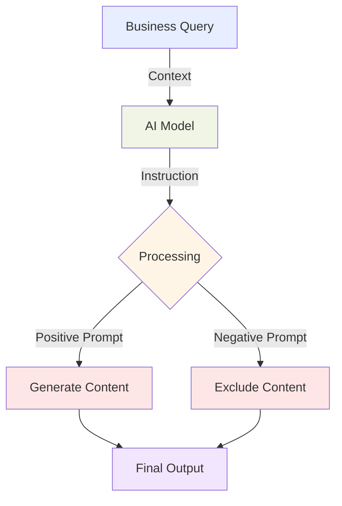
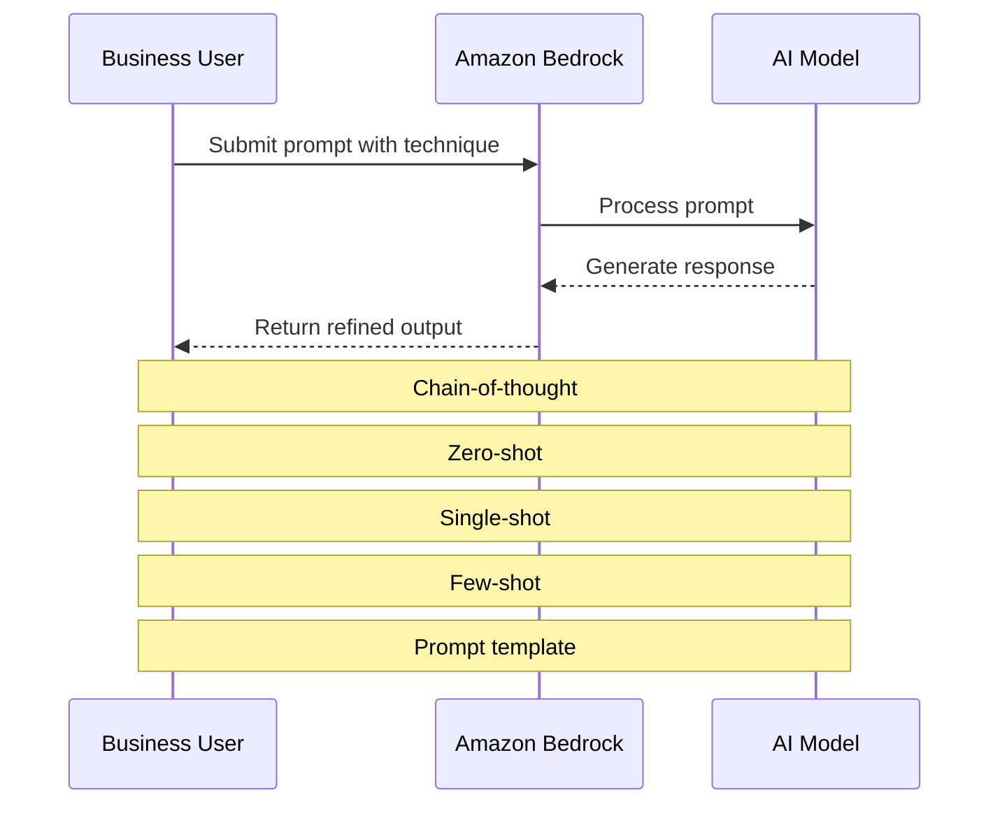
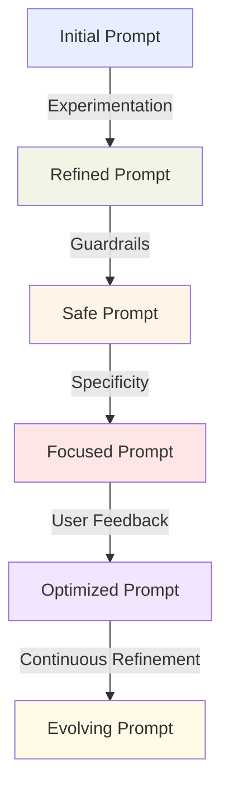
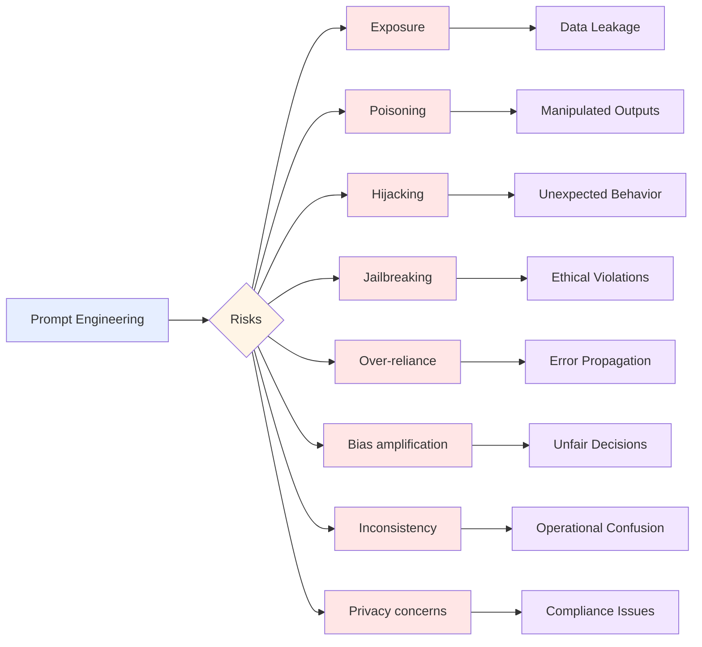

## 3.2 Choose effective prompt engineering techniques

Prompt engineering is a critical skill for maximizing the value of foundation models in business. This specialized discipline focuses on crafting input queries that elicit optimal responses from AI models, particularly large language models (LLMs) available through Amazon Bedrock.[^701] As organizations adopt AI-driven solutions, the ability to design effective prompts directly impacts the quality of insights generated, content produced, and problems solved.

Business professionals who master prompt engineering gain significant advantages in extracting value from AI investments. Whether developing customer service chatbots, generating marketing content, or analyzing complex datasets, the quality of AI outputs largely depends on the prompts provided. Across industries—from finance and healthcare to retail and manufacturing—prompt engineering continues to drive innovation and competitive advantage.[^702]

This subchapter explores prompt engineering fundamentals, advanced techniques, implementation best practices, and potential limitations. Understanding these elements enables business professionals to harness foundation models effectively, enhance decision-making, and create more sophisticated AI-powered solutions.

### Concepts and constructs of prompt engineering

Prompt engineering is built upon several key concepts that form the foundation for effective AI model interaction. Understanding these elements is crucial for crafting prompts that yield accurate, relevant, and useful responses.

1. **Context**: Background information provided to the AI model that frames the task or question. Proper context helps the model understand the specific domain, situation, or perspective needed for generating an appropriate response. For example, when analyzing financial data, specifying the industry, time period, or company significantly improves relevance and accuracy.

2. **Instruction**: Explicit directives given to the model about what task to perform or how to process the input. Clear, precise instructions guide the model's behavior and output format. Examples include "Summarize the following text in three bullet points" or "Translate this sentence from English to French."

3. **Negative prompts**: Instructions that tell the model what to avoid or exclude in its response. This technique refines outputs and prevents unwanted content. For instance, "Generate a product description without mentioning price or competitors" focuses the model's output by explicitly stating exclusions.

4. **Model latent space**: The high-dimensional representation of knowledge within the AI model. While not directly manipulable, understanding this concept informs strategies for navigating the model's knowledge base more effectively to retrieve relevant information.[^703]

The following diagram illustrates how these concepts work together in a business context:



*Figure 3.2.1: Prompt Engineering Workflow. This diagram illustrates the process of prompt engineering, showing how context, instructions, and both positive and negative prompts interact with the AI model to produce the final output.*

In practice, a marketing team using Amazon Bedrock to generate product descriptions might craft prompts that include:[^704]

- Context: "You are an expert copywriter for a luxury watch brand."
- Instruction: "Write a 100-word product description for our new smartwatch."
- Positive prompt: "Highlight its elegant design and advanced health tracking features."
- Negative prompt: "Do not mention battery life or compare it to competitors."

By applying these prompt engineering constructs strategically, businesses can guide AI models to produce more targeted, relevant outputs that better serve their specific needs and improve decision-making processes.

### Techniques for prompt engineering

Prompt engineering encompasses various techniques that enable sophisticated interactions with AI models. These methods allow business professionals to extract more nuanced and contextually appropriate responses from foundation models:

1. **Chain-of-thought**: Breaking down complex problems into a series of intermediate steps, guiding the AI model through a logical reasoning process. This technique leads to more accurate and explainable results, particularly for tasks requiring multi-step reasoning.[^705]

2. **Zero-shot learning**: Asking the model to perform a task without providing any specific examples. This technique leverages the model's general knowledge to address novel situations, making it valuable for handling unexpected queries or exploring new problem domains.[^706]

3. **Single-shot learning**: Providing one example to illustrate the desired output format or approach. This technique calibrates the model's response style and improves consistency in outputs.

4. **Few-shot learning**: Offering multiple examples (typically 2-5) to guide the model's understanding of the task. This approach significantly enhances performance on specific tasks by demonstrating patterns and expectations through examples.[^707]

5. **Prompt templates**: Pre-designed structures for prompts that can be customized for specific use cases. Templates maintain consistency across different interactions and can be optimized over time for better performance.

The following diagram illustrates how these techniques are applied in a business context using Amazon Bedrock:



*Figure 3.2.2: Prompt Engineering Techniques in Action. This sequence diagram shows how different prompt engineering techniques are applied when interacting with an AI model through Amazon Bedrock.*

Practical applications of these techniques include:

1. **Chain-of-thought example**:
   Prompt: "Calculate the total revenue for Q1 2025. Step 1: List monthly revenues. Step 2: Sum the monthly figures. Step 3: Present the total."

2. **Zero-shot example**:
   Prompt: "Suggest three innovative features for a smart home device targeting elderly users."

3. **Single-shot example**:
   Prompt: "Summarize customer feedback in one sentence. Example: 'Product X received positive reviews for its durability but criticism for its high price.' Now summarize feedback for Product Y."

4. **Few-shot example**:
   Prompt: "Classify the sentiment of customer reviews:
   1. 'Great product!' - Positive
   2. 'Terrible experience.' - Negative
   3. 'It's okay.' - Neutral
   Now classify: 'I'm satisfied with my purchase.'"

5. **Prompt template example**:
   Template: "As a [ROLE], provide [NUMBER] [TYPE] for [CONTEXT]. Focus on [ASPECT] and avoid [EXCLUSION]."
   Filled template: "As a financial analyst, provide 3 insights for our Q1 2025 earnings report. Focus on revenue growth and avoid mentioning specific clients."

Mastering these techniques enables business professionals to extract valuable insights and generate high-quality outputs from AI models across various applications—from analyzing market trends to generating creative content and solving complex business problems.

### Benefits and best practices for prompt engineering

Effective prompt engineering delivers substantial benefits for businesses using AI technologies while following best practices ensures consistent, high-quality results.

**Benefits of Effective Prompt Engineering:**

1. **Response quality improvement**: Well-crafted prompts enhance the relevance, accuracy, and usefulness of AI-generated outputs, leading to more reliable insights and better decision-making.

2. **Increased efficiency**: Strategic prompting reduces the need for multiple iterations or human intervention, streamlining workflows and saving valuable time.

3. **Customization and flexibility**: Prompt engineering tailors AI responses to specific needs, industries, or brand voices without requiring extensive model retraining.

4. **Cost optimization**: Efficient prompts reduce computational resources and API calls, potentially lowering costs associated with AI usage.[^708]

5. **Enhanced user experience**: For customer-facing applications, better prompts create more natural and helpful AI interactions, improving overall user satisfaction.

**Best Practices for Prompt Engineering:**

1. **Experimentation**: Test different prompt structures and techniques to identify what works best for specific tasks. A/B testing can be particularly effective in optimizing prompts for consistent results.

2. **Guardrails implementation**: Incorporate safeguards in prompts to ensure AI outputs align with business policies, ethical guidelines, and legal requirements. This includes specifying tone, content restrictions, and required disclaimers.[^709]

3. **Discovery-oriented prompting**: Use open-ended prompts to explore new possibilities or generate creative ideas during brainstorming sessions or product development.

4. **Specificity and concision**: Craft clear, specific prompts that provide necessary context without overwhelming the model. Avoid ambiguity and unnecessary verbosity.

5. **Using multiple prompts**: For complex tasks, break down the problem into multiple prompts, each addressing a specific aspect. This approach leads to more comprehensive and accurate results.

6. **Continuous refinement**: Regularly review and update prompts based on performance metrics, user feedback, and evolving business needs to ensure ongoing improvement.

The following diagram illustrates the prompt refinement process:



*Figure 3.2.3: Prompt Refinement Process. This diagram illustrates the iterative process of refining prompts based on best practices and feedback, leading to continuously improving AI interactions.*

A practical application using Amazon Bedrock might look like this:

**Scenario**: A retail company wants to generate product descriptions for a new line of eco-friendly home goods.

**Initial Prompt**: "Write a product description for an eco-friendly water bottle."

**Refined Prompt** (after applying best practices):

```
Context: You are a copywriter for EcoHome, a brand known for sustainable home products.

Task: Generate a product description for our new stainless steel water bottle.

Specifications:
- 20 oz capacity
- Double-wall insulation
- Made from 100% recycled materials
- Available in 3 colors: Ocean Blue, Forest Green, and Sunset Orange

Style Guidelines:
- Emphasize sustainability and durability
- Use a friendly, conversational tone
- Include at least one emotional appeal to eco-conscious consumers
- Keep the description between 75-100 words

Constraints:
- Do not mention specific prices
- Avoid comparisons to other brands
- Ensure all claims are factually accurate and avoid greenwashing

Output Format:
Provide the product description followed by 3 suggested social media hashtags for promotion.
```

This refined prompt incorporates specificity, guardrails, and clear instructions to generate a more targeted and effective product description. By consistently applying these best practices and refining prompts based on performance and feedback, businesses can significantly enhance their AI-driven processes.

### Potential risks and limitations of prompt engineering

While prompt engineering offers significant benefits, businesses must understand its inherent risks and limitations to implement effective safeguards. Key concerns include:

1. **Exposure**: Inadvertent disclosure of sensitive information when prompts contain confidential data or when AI responses reveal proprietary information.[^710]

2. **Poisoning**: Adversarial attacks where malicious inputs manipulate the model's behavior, resulting in biased or harmful outputs that could damage reputation or decision-making processes.[^711]

3. **Hijacking**: Occurs when inputs override the intended behavior of the AI system, leading to unexpected or malicious responses that compromise application integrity.[^712]

4. **Jailbreaking**: Attempts to bypass ethical guidelines or content restrictions by crafting prompts specifically designed to circumvent model safeguards.

5. **Over-reliance**: Excessive dependence on AI-generated outputs without human oversight, allowing errors to propagate through business processes.

6. **Bias amplification**: Poorly designed prompts can reinforce or amplify biases present in training data, leading to unfair or discriminatory outputs.[^713]

7. **Inconsistency**: Different prompts for similar tasks yielding variable results, potentially causing confusion or errors in business operations.

8. **Privacy concerns**: Prompts containing personal or sensitive information may create privacy issues, especially when using third-party AI services.[^714]

The following diagram illustrates these risks and their potential business impacts:



*Figure 3.2.4: Risks and Impacts of Prompt Engineering. This flowchart illustrates the various risks associated with prompt engineering and their potential impacts on business operations.*

To mitigate these risks, businesses should implement robust safeguards:

1. **Data sanitization**: Remove sensitive information from prompts before sending them to AI models.

2. **Input validation**: Develop strong validation mechanisms to detect and prevent potentially malicious prompts.

3. **Output filtering**: Implement post-processing filters to screen AI-generated outputs for inappropriate or sensitive content.

4. **Human-in-the-loop**: Maintain human oversight in critical decision-making processes, using AI as a supportive tool rather than a replacement for human judgment.[^715]

5. **Regular auditing**: Conduct periodic audits of AI interactions to identify potential biases, inconsistencies, or security vulnerabilities.

6. **Ethical guidelines**: Establish clear ethical guidelines for AI usage and ensure all employees receive proper training.

7. **Privacy-preserving techniques**: Utilize technologies such as federated learning or differential privacy when handling sensitive data.[^716]

8. **Continuous monitoring**: Implement real-time monitoring systems to detect unusual patterns or potential attacks.

By acknowledging these limitations and implementing appropriate safeguards, businesses can harness prompt engineering's power while minimizing associated risks. As AI technologies evolve, staying informed about potential vulnerabilities and adapting security measures accordingly remains crucial for maintaining the integrity of AI-driven business processes.

In conclusion, prompt engineering is a powerful capability that significantly enhances AI applications in business contexts. By understanding its concepts, mastering various techniques, implementing best practices, and addressing potential risks, organizations can leverage foundation models to drive innovation, improve decision-making, and gain competitive advantages. The ability to craft effective prompts is becoming an essential skill for business professionals across industries, enabling them to unlock the full potential of AI in solving complex business challenges.

### Questions for self-check

1. **Which prompt engineering technique involves breaking down complex problems into a series of intermediate steps to guide the AI model through a logical reasoning process?**

   A. Zero-shot learning
   B. Chain-of-thought
   C. Few-shot learning
   D. Prompt templates

2. **A marketing team wants to generate product descriptions for a new line of eco-friendly products without providing specific examples. Which prompt engineering technique is most appropriate?**

   A. Single-shot learning
   B. Few-shot learning
   C. Zero-shot learning
   D. Chain-of-thought

3. **Which of the following is NOT a benefit of effective prompt engineering in business contexts?**

   A. Improved response quality
   B. Increased efficiency
   C. Elimination of all biases in AI outputs
   D. Cost optimization

4. **A financial analyst is concerned about potential data leakage when using AI models for market analysis. Which prompt engineering risk does this scenario primarily relate to?**

   A. Jailbreaking
   B. Exposure
   C. Poisoning
   D. Hijacking

5. **Which best practice for prompt engineering involves regularly testing different prompt structures and techniques to identify what works best for specific tasks or domains?**

   A. Guardrails implementation
   B. Specificity and concision
   C. Experimentation
   D. Continuous refinement

### Answers and Explanations

1. **Correct answer: B. Chain-of-thought**

   Explanation: Chain-of-thought is a prompt engineering technique that involves breaking down complex problems into a series of intermediate steps, guiding the AI model through a logical reasoning process. This technique is particularly useful for tasks that require multi-step reasoning and can lead to more accurate and explainable results. Zero-shot learning, few-shot learning, and prompt templates are other prompt engineering techniques but do not specifically involve breaking down problems into intermediate steps.[^717]

2. **Correct answer: C. Zero-shot learning**

   Explanation: Zero-shot prompts ask the model to perform a task or answer a question without any specific examples or prior training on that exact task. This technique leverages the model's general knowledge to address novel situations, making it particularly useful for handling unexpected queries or exploring new problem domains. In this scenario, the marketing team wants to generate product descriptions without providing specific examples, which aligns perfectly with the zero-shot learning approach.[^718]

3. **Correct answer: C. Elimination of all biases in AI outputs**

   Explanation: While effective prompt engineering offers numerous benefits, including improved response quality, increased efficiency, and cost optimization, it cannot completely eliminate all biases in AI outputs. Biases can be inherent in the training data or the model itself, and while prompt engineering can help mitigate some biases, it cannot guarantee their complete elimination. The other options (A, B, and D) are all genuine benefits of effective prompt engineering as mentioned in the subchapter.[^719]

4. **Correct answer: B. Exposure**

   Explanation: The scenario describes a concern about potential data leakage when using AI models for market analysis, which directly relates to the risk of exposure in prompt engineering. Exposure occurs when prompts inadvertently contain or reveal sensitive information. In financial analysis, there's a high risk of exposing confidential market data or proprietary information if prompts are not carefully managed. This is distinct from jailbreaking (bypassing ethical guidelines), poisoning (malicious inputs manipulating model behavior), or hijacking (overriding intended behavior).[^720]

5. **Correct answer: C. Experimentation**

   Explanation: Experimentation is the best practice that involves regularly testing different prompt structures and techniques to identify what works best for specific tasks or domains. The subchapter explicitly mentions that "Regularly test different prompt structures and techniques to identify what works best for specific tasks or domains. A/B testing can be particularly effective in optimizing prompts." This approach allows businesses to continuously improve their prompt engineering strategies and adapt to changing needs or contexts.[^721]

[^700]: AWS AI Services Overview. URL: <https://aws.amazon.com/machine-learning/ai-services/>

[^701]: Amazon Bedrock Overview. URL: <https://aws.amazon.com/bedrock/>

[^702]: Gartner Forecasts Worldwide Artificial Intelligence Software Market to Reach $62 Billion in 2022. URL: <https://www.gartner.com/en/newsroom/press-releases/2021-11-22-gartner-forecasts-worldwide-artificial-intelligence-software-market-to-reach-62-billion-in-2022>

[^703]: Understanding Latent Space in Machine Learning. URL: <https://towardsdatascience.com/understanding-latent-space-in-machine-learning-de5a7c687d8d>

[^704]: Amazon Bedrock Prompt Engineering Guide. URL: <https://docs.aws.amazon.com/bedrock/latest/userguide/prompt-engineering.html>

[^705]: Chain-of-Thought Prompting Elicits Reasoning in Large Language Models. URL: <https://arxiv.org/abs/2201.11903>

[^706]: Zero-Shot Learning - A Comprehensive Evaluation of the Good, the Bad and the Ugly. URL: <https://arxiv.org/abs/1707.00600>

[^707]: Few-Shot Learning: A Survey. URL: <https://arxiv.org/abs/1904.05046>

[^708]: AWS Cost Optimization for Machine Learning. URL: <https://aws.amazon.com/blogs/machine-learning/cost-optimization-for-machine-learning-in-the-cloud/>

[^709]: AWS AI Service Cards. URL: <https://aws.amazon.com/machine-learning/ai-services/ai-service-cards/>

[^710]: AWS Security Best Practices for Machine Learning. URL: <https://docs.aws.amazon.com/whitepapers/latest/security-best-practices-for-machine-learning/security-best-practices-for-machine-learning.html>

[^711]: Prompt Injection Attacks Against GPT-3. URL: <https://arxiv.org/abs/2206.11349>

[^712]: Defending Against Prompt Injection Attacks. URL: <https://docs.anthropic.com/en/docs/test-and-evaluate/strengthen-guardrails/mitigate-jailbreaks>

[^713]: Bias in AI: Sources and Mitigation Strategies. URL: <https://aws.amazon.com/blogs/publicsector/framework-mitigate-bias-improve-outcomes-new-age-ai/>

[^714]: AWS Privacy Considerations for Machine Learning. URL: <https://www.ibm.com/think/insights/ai-privacy>

[^715]: Human-in-the-Loop Machine Learning. URL: <https://aws.amazon.com/blogs/machine-learning/automated-exploratory-data-analysis-and-model-operationalization-framework-with-a-human-in-the-loop/>

[^716]: AWS Privacy-Preserving Machine Learning. URL: <https://aws.amazon.com/blogs/machine-learning/large-language-model-inference-over-confidential-data-using-aws-nitro-enclaves/>

[^717]: Chain-of-Thought Prompting Elicits Reasoning in Large Language Models. URL: <https://arxiv.org/abs/2201.11903>

[^718]: Zero-Shot Learning - A Comprehensive Evaluation of the Good, the Bad and the Ugly. URL: <https://arxiv.org/abs/1707.00600>

[^719]: Mitigating Bias in Artificial Intelligence (AI) Models. URL: <https://aws.amazon.com/blogs/publicsector/framework-mitigate-bias-improve-outcomes-new-age-ai/>

[^720]: AWS Security Best Practices for Machine Learning. URL: <https://docs.aws.amazon.com/whitepapers/latest/security-best-practices-for-machine-learning/security-best-practices-for-machine-learning.html>

[^721]: Amazon SageMaker Experiments - Organize, Track, and Compare Your Machine Learning Trainings. URL: <https://aws.amazon.com/blogs/aws/amazon-sagemaker-experiments-organize-track-and-compare-your-machine-learning-trainings/>