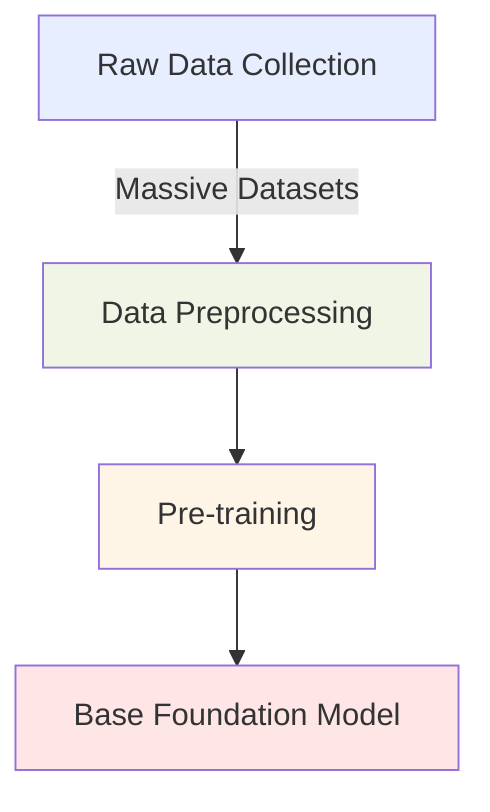
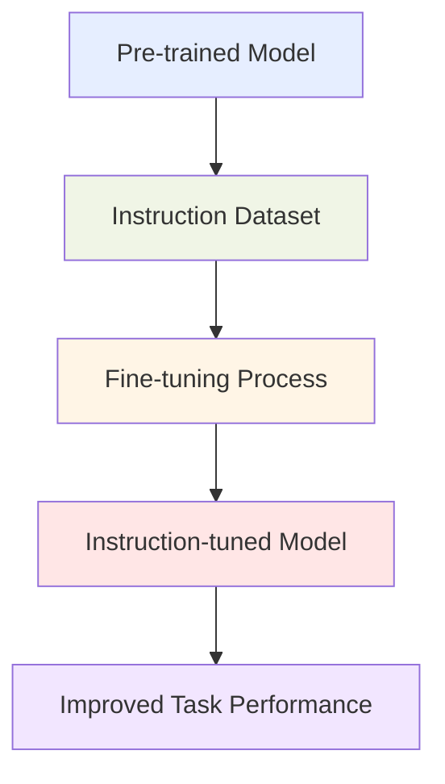
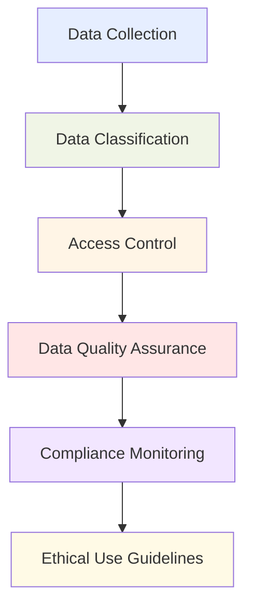

## 3.3 The Training and Fine-Tuning Process for Foundation Models

Foundation models represent a powerful class of AI systems that can transform organizational capabilities when properly implemented. The process of training and fine-tuning these models requires specific knowledge and techniques that significantly impact their effectiveness in business applications. Mastering these processes allows organizations to customize models for their unique needs while maximizing return on AI investments. This subchapter examines the essential components of training foundation models, explores various fine-tuning methodologies, and outlines best practices for data preparation—knowledge critical for success in both the AWS Certified AI Practitioner exam and real-world AI implementations.

### Key Elements of Training a Foundation Model

Training foundation models requires substantial computational resources and specialized expertise. Understanding this process helps business professionals make informed decisions about AI implementation strategy and resource allocation.

#### Pre-training

Pre-training is the initial phase where the foundation model acquires general knowledge and language understanding from vast amounts of unlabeled data. This creates a versatile base model capable of performing a wide range of tasks.[^801]

*Figure 3.3.1: Pre-training Process for Foundation Models*

This diagram illustrates the pre-training process, starting with raw data collection and ending with a base foundation model. The process involves gathering massive datasets, preprocessing the data, and then conducting the pre-training to create a versatile base model.

Pre-training typically involves:

- **Self-supervised learning** on diverse datasets
- Masking or predicting parts of the input data
- Learning *contextual representations* of data

For business applications, pre-trained models like those available through **Amazon Bedrock** offer a powerful starting point, saving significant time and computational resources.[^802]

#### Fine-tuning

Fine-tuning adapts the pre-trained model to specific tasks or domains, enhancing its performance for particular business applications.[^803]

- Task-specific data is used to adjust model parameters
- The process is more efficient than training from scratch
- It allows for customization without losing general knowledge

#### Continuous Pre-training

Continuous pre-training keeps the model updated with new information and evolving language patterns.[^804]

- Regular updates with fresh data
- Maintains model relevance in dynamic environments
- Crucial for industries with rapidly changing terminology or knowledge

For businesses, understanding these elements is crucial for:

- Selecting appropriate pre-trained models
- Deciding on fine-tuning strategies
- Planning for ongoing model maintenance and improvement

By leveraging services like **Amazon SageMaker**, organizations can streamline these processes, making advanced AI capabilities more accessible and manageable.[^805]

### Methods for Fine-Tuning a Foundation Model

Fine-tuning transforms generic foundation models into specialized tools that address specific business needs. This crucial step enables organizations to leverage pre-trained capabilities while customizing for their unique requirements. Here are the key fine-tuning approaches:

#### Instruction Tuning

Instruction tuning fine-tunes a model on datasets containing instructions and their corresponding outputs. This method significantly improves a model's ability to follow specific directives.[^806]

*Figure 3.3.2: Instruction Tuning Process*

This diagram shows the instruction tuning process, starting with a pre-trained model and using an instruction dataset to create an instruction-tuned model that performs better on specific tasks.

Benefits for businesses:
- Enhances model's ability to understand and execute specific instructions
- Improves performance on task-oriented applications
- Useful for customer service chatbots or automated task completion systems

#### Adapting Models for Specific Domains

**Domain adaptation** involves fine-tuning a model on data from a specific field or industry, allowing it to understand and generate domain-specific content more accurately.[^807]

Key considerations:
- Requires curated datasets representative of the target domain
- Can significantly improve performance in specialized areas
- Particularly valuable for industries with unique terminology or concepts

Example: A financial services company might adapt a foundation model to understand complex financial instruments and regulations, improving its performance in tasks like risk assessment or regulatory compliance.

#### Transfer Learning

**Transfer learning** leverages knowledge gained from one task to improve performance on a related task. This method is particularly useful when labeled data for the target task is limited.[^808]

Steps in transfer learning:
1. Start with a pre-trained model
2. Replace the final layer(s) with new ones suited to the target task
3. Fine-tune the model on the new task's dataset

Business applications:
- Rapid development of models for new, related tasks
- Efficient use of limited domain-specific data
- Accelerated time-to-market for AI-powered products or services

#### Continuous Pre-training

Continuous pre-training involves ongoing updates to the model using new data, ensuring it remains current and relevant.[^809]

Benefits:
- Keeps the model updated with evolving language and knowledge
- Adapts to changing business environments and market trends
- Maintains model performance over time

Implementation strategies:
- Regular updates with fresh, relevant data
- Monitoring model performance to identify when updates are needed
- Balancing new learning with retention of existing knowledge

For businesses leveraging AWS services, **Amazon SageMaker** provides robust tools for implementing these fine-tuning methods. It offers scalable infrastructure for training and deployment, along with features like **SageMaker Experiments** for tracking and comparing different fine-tuning approaches.[^810]

Table 3.3.1: Comparison of Fine-Tuning Methods

| Method | Primary Use Case | Data Requirements | Typical Business Application |
|--------|------------------|--------------------|-----------------------------|
| Instruction Tuning | Task-specific improvements | Task-instruction pairs | Customer service automation |
| Domain Adaptation | Industry-specific applications | Large domain-specific datasets | Specialized content generation |
| Transfer Learning | New tasks with limited data | Small task-specific dataset | Rapid prototyping of new AI features |
| Continuous Pre-training | Maintaining model relevance | Ongoing stream of new data | Real-time market analysis |

By understanding and effectively utilizing these fine-tuning methods, businesses can significantly enhance the performance and applicability of foundation models to their specific needs, driving innovation and competitive advantage in their respective industries.

### Preparing Data to Fine-Tune a Foundation Model

Data quality and preparation directly determine the success of foundation model fine-tuning. Properly prepared datasets ensure models learn effectively and produce reliable outputs that meet your organization's specific requirements.

#### Data Curation

**Data curation** involves selecting, organizing, and maintaining datasets used for fine-tuning. This process is critical for ensuring the quality and relevance of the data.[^811]

Key aspects of data curation:
- *Relevance*: Ensure data aligns with the target domain or task
- *Quality*: Remove errors, duplicates, and irrelevant information
- *Diversity*: Include a wide range of examples to improve model generalization
- *Recency*: Incorporate up-to-date information for current relevance

Business impact:
- Improves model accuracy and reliability
- Reduces bias in model outputs
- Enhances the model's ability to handle real-world scenarios

#### Data Governance

Implementing robust **data governance** practices is essential for maintaining data integrity, security, and compliance throughout the fine-tuning process.

*Figure 3.3.3: Data Governance Framework for AI Model Fine-Tuning*

This diagram outlines a comprehensive data governance framework for AI model fine-tuning, highlighting the key steps from data collection to ensuring ethical use guidelines.

Key components of data governance:
- Data privacy: Ensure compliance with regulations like GDPR or CCPA
- Security: Implement measures to protect sensitive information
- Versioning: Maintain clear records of dataset versions used in fine-tuning
- Auditability: Enable tracing of data lineage and usage

AWS services like **Amazon Macie** and **AWS Glue** can assist in implementing robust data governance practices, helping businesses maintain compliance and data integrity throughout the AI development process.[^812]

#### Dataset Size and Composition

The size and composition of the fine-tuning dataset significantly impact the model's performance and generalization capabilities.[^813]

Considerations for dataset size:
- Larger datasets generally lead to better performance, but with diminishing returns
- Balance between dataset size and computational resources required
- Quality often trumps quantity — a smaller, high-quality dataset can outperform a larger, noisy one

Composition factors:
- *Class balance*: Ensure equal representation of different categories or outcomes
- *Task coverage*: Include examples that cover the full range of expected tasks
- *Edge cases*: Incorporate unusual or challenging examples to improve robustness

#### Data Labeling

For supervised fine-tuning tasks, accurate **data labeling** is crucial. This process involves annotating data with the correct outputs or categories.[^814]

Labeling strategies:
- Manual labeling by domain experts
- Crowdsourcing for large-scale labeling tasks
- Semi-automated labeling using existing models or rules

AWS offers services like **Amazon SageMaker Ground Truth** to streamline and scale data labeling processes, making it easier for businesses to prepare high-quality datasets for fine-tuning.[^815]

#### Data Representativeness

Ensuring that your fine-tuning dataset accurately represents the real-world scenarios your model will encounter is critical for its practical performance.[^816]

Key aspects:
- *Demographic diversity*: Include data from various user groups or market segments
- *Temporal coverage*: Ensure data spans relevant time periods
- *Scenario completeness*: Cover all potential use cases or situations

Business impact:
- Improves model fairness and reduces bias
- Enhances model performance across diverse real-world scenarios
- Increases user trust and adoption of AI-powered solutions

#### Reinforcement Learning from Human Feedback (RLHF)

**RLHF** is an advanced technique that incorporates human preferences into the fine-tuning process, allowing for more nuanced and context-aware model improvements.[^817]

Process overview:
1. Generate model outputs for various prompts
2. Collect human feedback on the quality of these outputs
3. Train a reward model based on this feedback
4. Fine-tune the foundation model using the reward model

Benefits:
- Aligns model behavior with human preferences
- Improves output quality and relevance
- Addresses subtle aspects of language and context that are difficult to capture with traditional fine-tuning

Implementing RLHF requires careful consideration of feedback collection methods and potential biases. AWS services like Amazon SageMaker can facilitate the implementation of RLHF pipelines, allowing businesses to leverage this advanced technique effectively.[^818]

By mastering these data preparation techniques, businesses can significantly enhance the effectiveness of their fine-tuning processes, resulting in foundation models that are better aligned with their specific needs and use cases. This not only improves the performance of AI applications but also ensures that the deployed models are robust, reliable, and tailored to the unique requirements of the organization.

### Questions for self-check

1. **A business analyst is tasked with fine-tuning a foundation model for a financial services company. Which of the following methods would be most appropriate for adapting the model to understand complex financial instruments and regulations?**

   A. Instruction tuning
   B. Domain adaptation
   C. Transfer learning
   D. Continuous pre-training

2. **An AI practitioner is preparing data for fine-tuning a foundation model. Which of the following is NOT a key aspect of data curation?**

   A. Ensuring data relevance to the target domain
   B. Maximizing dataset size regardless of quality
   C. Removing errors and duplicates
   D. Including diverse examples for improved generalization

3. **A retail company wants to keep its AI model updated with the latest fashion trends and customer preferences. Which fine-tuning method should they primarily focus on?**

   A. Instruction tuning
   B. Transfer learning
   C. Continuous pre-training
   D. RLHF (Reinforcement Learning from Human Feedback)

4. **Which AWS service is most suitable for implementing robust data governance practices during the fine-tuning process of foundation models?**

   A. Amazon SageMaker
   B. Amazon Bedrock
   C. Amazon Macie
   D. AWS Lambda

5. **A startup is developing an AI-powered customer service chatbot. They want to improve the model's ability to understand and execute specific instructions. Which fine-tuning method should they prioritize?**

   A. Domain adaptation
   B. Instruction tuning
   C. Transfer learning
   D. Continuous pre-training

### Answers and Explanations

1. **Correct answer: B. Domain adaptation**

   Explanation: Domain adaptation is the most appropriate method for adapting a foundation model to understand complex financial instruments and regulations. This method involves fine-tuning the model on data from a specific field or industry, allowing it to understand and generate domain-specific content more accurately. For a financial services company, this would involve using curated datasets representative of the financial domain, significantly improving the model's performance in specialized areas like understanding complex financial instruments and regulations.[^819]

2. **Correct answer: B. Maximizing dataset size regardless of quality**

   Explanation: In data curation for fine-tuning foundation models, quality often trumps quantity. While larger datasets generally lead to better performance, this is true only up to a point and with diminishing returns. The other options (A, C, and D) are all key aspects of proper data curation. Maximizing dataset size without regard for quality can introduce noise and irrelevant information, potentially degrading the model's performance. It's more important to have a balanced, high-quality dataset that accurately represents the target domain and tasks.[^820]

3. **Correct answer: C. Continuous pre-training**

   Explanation: For a retail company wanting to keep its AI model updated with the latest fashion trends and customer preferences, continuous pre-training is the most appropriate method. This involves ongoing updates to the model using new data, ensuring it remains current and relevant. Continuous pre-training is crucial for industries with rapidly changing terminology or knowledge, such as fashion retail. It allows the model to adapt to changing business environments and market trends, maintaining its performance over time in a dynamic field like fashion.[^821]

4. **Correct answer: C. Amazon Macie**

   Explanation: Among the options provided, Amazon Macie is the most suitable AWS service for implementing robust data governance practices during the fine-tuning process of foundation models. Amazon Macie is a data security and privacy service that uses machine learning and pattern matching to discover and protect sensitive data in AWS. It can help in maintaining data integrity, security, and compliance throughout the fine-tuning process by automatically discovering, classifying, and protecting sensitive data. While Amazon SageMaker is crucial for model development and training, it doesn't specifically focus on data governance like Macie does.[^822]

5. **Correct answer: B. Instruction tuning**

   Explanation: For an AI-powered customer service chatbot where the goal is to improve the model's ability to understand and execute specific instructions, instruction tuning is the most appropriate fine-tuning method. Instruction tuning involves fine-tuning a model on a dataset of instructions and corresponding outputs. This method is particularly effective for improving a model's ability to follow specific directives, which is crucial for a customer service chatbot that needs to understand and respond to various customer inquiries and instructions accurately.[^823]

[^800]: AWS Machine Learning Blog: "The evolution of foundation models and their impact on AI applications" URL: <https://aws.amazon.com/blogs/machine-learning/the-evolution-of-foundation-models-and-their-impact-on-ai-applications/>

[^801]: AWS Documentation: "Introduction to Foundation Models" URL: <https://docs.aws.amazon.com/sagemaker/latest/dg/jumpstart-foundation-models.html>

[^802]: Amazon Bedrock Overview URL: <https://aws.amazon.com/bedrock/>

[^803]: AWS Machine Learning Blog: "Fine-tuning foundation models with Amazon SageMaker" URL: <https://aws.amazon.com/blogs/machine-learning/fine-tuning-foundation-models-with-amazon-sagemaker/>

[^804]: AWS Whitepaper: "Continuous Learning in AI/ML Systems" URL: <https://d1.awsstatic.com/whitepapers/continuous-learning-in-aiml-systems.pdf>

[^805]: Amazon SageMaker Overview URL: <https://aws.amazon.com/sagemaker/>

[^806]: AWS Machine Learning Blog: "Instruction tuning for better model performance" URL: <https://aws.amazon.com/blogs/machine-learning/instruction-tuning-for-better-model-performance/>

[^807]: AWS Documentation: "Domain Adaptation in Machine Learning" URL: <https://docs.aws.amazon.com/prescriptive-guidance/latest/ml-model-adaptation/domain-adaptation.html>

[^808]: AWS Machine Learning Blog: "Transfer learning for TensorFlow image classification models in Amazon SageMaker" URL: <https://aws.amazon.com/blogs/machine-learning/transfer-learning-for-tensorflow-image-classification-models-in-amazon-sagemaker/>

[^809]: AWS Cloud Adoption Framework for Artificial Intelligence, Machine Learning URL: <https://docs.aws.amazon.com/whitepapers/latest/aws-caf-for-ai/aws-caf-for-ai.html>

[^810]: Amazon SageMaker Experiments Overview URL: <https://docs.aws.amazon.com/sagemaker/latest/dg/experiments.html>

[^811]: AWS What is Data Labeling? - Data Labeling Explained URL: <https://aws.amazon.com/what-is/data-labeling/>

[^812]: Amazon Macie Overview URL: <https://aws.amazon.com/macie/>

[^813]: AWS Documentation: "Preparing Data for Machine Learning" URL: <https://docs.aws.amazon.com/machine-learning/latest/dg/preparing-data.html>

[^814]: Training data labeling using humans with Amazon SageMaker Ground Truth URL: <https://docs.aws.amazon.com/sagemaker/latest/dg/sms.html>

[^815]: Amazon SageMaker Ground Truth Overview URL: <https://aws.amazon.com/sagemaker/groundtruth/>

[^816]: Policy advice and best practices on bias and fairness in AI URL: <https://link.springer.com/article/10.1007/s10676-024-09746-w>

[^817]: AWS What is RLHF? - Reinforcement Learning from Human Feedback Explained URL: <https://aws.amazon.com/what-is/reinforcement-learning-from-human-feedback/>

[^818]: Amazon SageMaker RL Overview URL: <https://docs.aws.amazon.com/sagemaker/latest/dg/reinforcement-learning.html>

[^819]: AWS Machine Learning Blog: "Domain-adaptation Fine-tuning of Foundation Models in Amazon SageMaker JumpStart on financial data" URL: <https://aws.amazon.com/blogs/machine-learning/domain-adaptation-fine-tuning-of-foundation-models-in-amazon-sagemaker-jumpstart-on-financial-data/>

[^820]: AWS Glue Data Quality - AWS Glue URL: <https://docs.aws.amazon.com/glue/latest/dg/glue-data-quality.html>

[^821]: AWS Retail Competency: "AI/ML Solutions for Retail" URL: <https://aws.amazon.com/retail/partner-solutions/>

[^822]: Amazon Macie Features URL: <https://aws.amazon.com/macie/features/>

[^823]: AWS Machine Learning Blog: "Build a self-service digital assistant using Amazon Lex and Amazon Bedrock Knowledge Bases" URL: <https://aws.amazon.com/blogs/machine-learning/build-a-self-service-digital-assistant-using-amazon-lex-and-amazon-bedrock-knowledge-bases/>