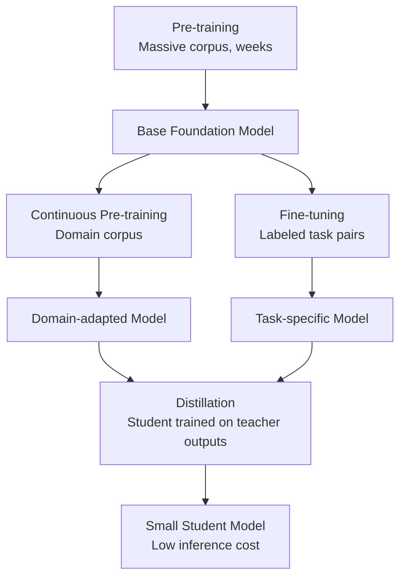
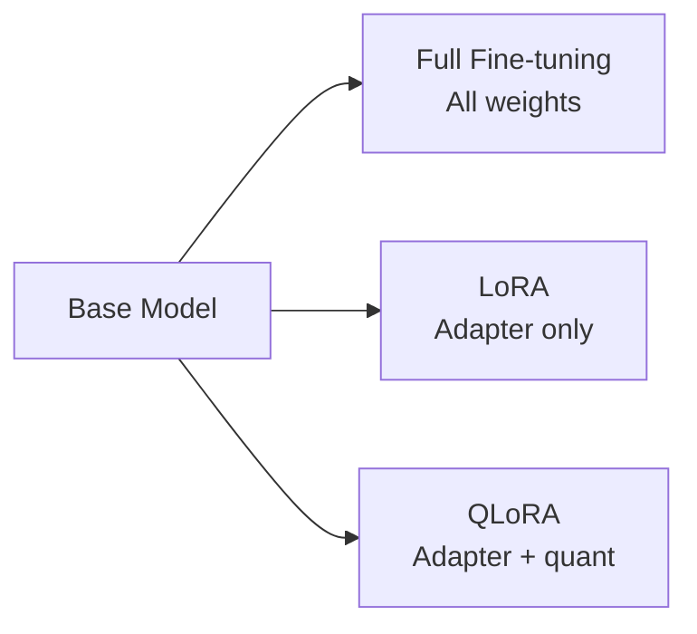
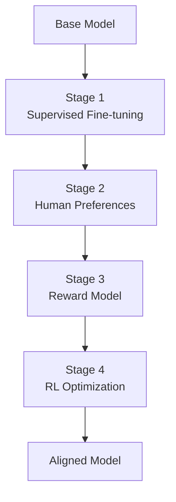
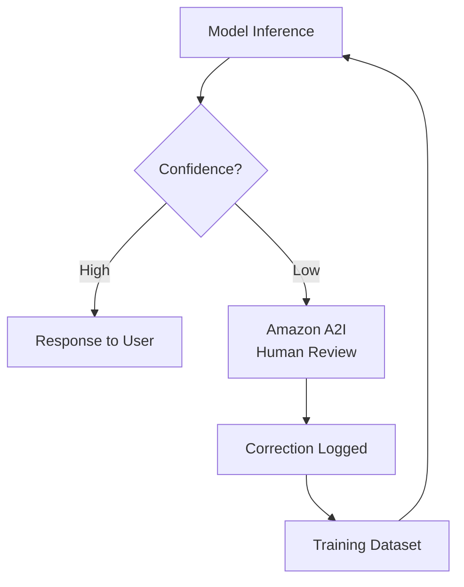
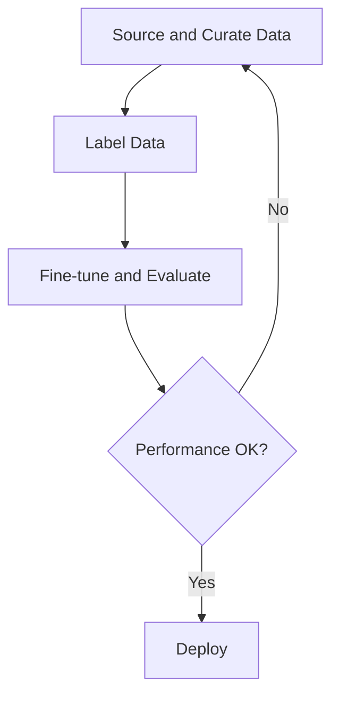

## Task Statement 3.3: Describe the training and fine-tuning process for FMs

Foundation models do not arrive ready for every business purpose. They are built in stages, each layer adding specificity at a cost that rises steeply with ambition. Understanding how models are built and adapted is not primarily a technical exercise for the business professional; it is a budgeting and scoping exercise. Knowing the difference between pre-training, fine-tuning, continuous pre-training, and distillation lets you ask the right questions when an engineering team proposes a customization project, evaluate the proposed timeline and budget, and recognize when a simpler approach would produce comparable results.[^303001]

The three objectives in this task statement follow a logical sequence. The first covers the taxonomy of training techniques and their cost profiles. The second covers the specific methods used when fine-tuning is the right choice. The third covers how data must be prepared before any fine-tuning job can begin, including the human-feedback processes that align a model's behavior with business expectations. Together they provide the framing a business sponsor needs to commission and oversee a model customization project without needing to write a line of training code.

### 3.3.1 Key elements of training an FM

Training a foundation model is not a single activity. It is a progression of stages, each building on the previous, and each available as an entry point depending on what a business needs and how much it can invest. The exam covers four stages: pre-training, fine-tuning, continuous pre-training, and distillation. They are arranged roughly by cost from most expensive to least, and by scope of change from broadest to narrowest.

The four techniques are not alternatives to each other in the way that fine-tuning and RAG are alternatives. Pre-training creates the foundation. Fine-tuning and continuous pre-training adjust what already exists. Distillation compresses the result into a smaller package. A business may use several in sequence: start from a pre-trained model provided by a third party, apply continuous pre-training to teach it domain vocabulary, then distill the result for cost-efficient production inference.

**Pre-training** is the process of training a neural network from random initial weights on an enormous corpus of text and other data.[^303002] The model learns statistical patterns across billions of examples: grammar, factual associations, reasoning chains, and the relationships between concepts. Pre-training creates the model's parametric memory, the knowledge embedded in its weights that it can draw on even when no external documents are provided. The scale required is prohibitive for most organizations. A training run for a modern large language model consumes thousands of GPU-hours over weeks or months, requires petabytes of curated data, and costs millions of dollars before the model produces its first coherent sentence.[^303003] Pre-training is relevant on the exam as the baseline from which all other techniques depart, not as a practical action item for any business outside the major AI research labs.

**Fine-tuning** starts from an existing pre-trained model and continues training on a much smaller, domain-specific dataset.[^303004] The objective is to shift the model's behavior toward a target task: answer customer-service questions in a particular tone, extract structured fields from medical records, or generate code in a company's internal framework. Fine-tuning adjusts the model's weights, so the resulting model is a distinct artifact that must be stored and served. It requires labeled examples, typically hundreds to tens of thousands of input-output pairs, and GPU compute in the range of hours to days rather than weeks. **Amazon Bedrock** supports fine-tuning for a subset of its hosted models, including Amazon Nova, Meta Llama, and select Anthropic Claude Haiku versions, producing a customized model that can then be deployed with provisioned throughput.[^303005] Fine-tuning is the right choice when the task is stable (the target behavior does not change month to month), when the business can produce sufficient labeled examples, and when the performance improvement justifies the training and hosting cost.

**Continuous pre-training** (also called *continued pre-training*) is a middle technique between pre-training and fine-tuning.[^303006] Instead of labeled input-output pairs, continuous pre-training uses unlabeled domain text, the same type of unsupervised corpus used in original pre-training, but drawn from a specific domain such as medical literature, financial filings, or legal case law. The goal is not to teach the model a new task but to teach it domain vocabulary, terminology, and factual associations that were underrepresented in the original pre-training corpus. A model that was pre-trained on general internet text may treat "gross margin," "net present value," and "EBITDA" as financial jargon it recognizes but does not deeply understand in context. Continuous pre-training on a corpus of annual reports, analyst notes, and earnings call transcripts improves that understanding without requiring labeled pairs. Amazon Bedrock supports continuous pre-training as a customization option for select models.[^303007]

**Distillation** takes a different approach to the cost problem. Rather than training a smaller model from scratch, distillation trains a compact *student model* to mimic the outputs of a larger, more capable *teacher model* on a target set of prompts.[^303008] The teacher generates responses to a large collection of prompts; those prompt-response pairs become the student's training data. The student learns to approximate the teacher's quality without ever accessing the teacher's weights. Once distillation is complete, production inference is served by the student, which is faster and cheaper per call than the teacher. Amazon Bedrock supports model distillation as a managed workflow, allowing organizations to designate a Bedrock model as the teacher, specify the target prompt distribution, and produce a fine-tuned smaller model as the student.[^303009] The economics of distillation favor high-volume applications where the one-time training cost is quickly recovered by the savings on inference.

*Figure 3.3.1: FM training technique hierarchy. Each technique builds on an existing model rather than starting from scratch, with cost and data requirements decreasing from left to right as the starting point becomes richer.*

*Table 3.3.1: Comparison of FM training and adaptation techniques*

| Technique | Training data | Compute cost | Time to deploy | Primary outcome | AWS entry point |
|---|---|---|---|---|---|
| Pre-training | Petabytes, unlabeled | Very high (millions of GPU-hours) | Months | General-purpose base model | Not applicable (buy from provider) |
| Continuous pre-training | Gigabytes to terabytes, unlabeled | Medium (days) | Days | Domain vocabulary and factual associations | Amazon Bedrock custom models |
| Fine-tuning | Hundreds to thousands of labeled pairs | Low to medium (hours) | Hours to days | Task-specific behavior and tone | Amazon Bedrock, SageMaker JumpStart |
| Distillation | Teacher-generated prompt-response pairs | Medium (one-time) | Hours to days | Small model approximating large model quality | Amazon Bedrock model distillation |

The exam frequently presents scenarios that ask which technique matches a given constraint. The decision logic is: if the model needs to learn a new vocabulary or factual domain without a labeled dataset, use continuous pre-training. If the model needs to learn a specific task behavior and labeled data is available, use fine-tuning. If the resulting model needs to be cheaper and faster at inference and training cost is acceptable, add distillation. Pre-training is the answer only when the question explicitly states that no suitable pre-trained model exists at all, which is essentially never in a real business scenario.

### 3.3.2 Methods for fine-tuning an FM

Fine-tuning is the most commonly discussed customization technique in enterprise AI projects because its cost profile sits in a practical range and its output is a model that an organization controls. Several distinct methods exist within the broad category of fine-tuning, and the exam expects familiarity with each.

The common thread across all fine-tuning methods is that the pre-trained model's weights are the starting point, and training on domain-specific data shifts those weights. What differs is the format of the training data, the portion of the model's architecture that is modified, and the specific learning objective.

**Instruction tuning** is fine-tuning on a dataset of prompt-and-response pairs, where each prompt is written as an explicit instruction and each response demonstrates the desired behavior.[^303010] For example, a prompt might be "Summarize the following customer complaint in one sentence:" followed by a customer email, and the response would be the target summary. The model learns to follow the instruction format reliably, not just to produce plausible-sounding text in the domain. Instruction tuning is what transforms a base model, which simply predicts the next token in a sequence, into an assistant model that responds to commands. Most commercially available models that are described as "chat" or "instruct" variants have already undergone instruction tuning; fine-tuning them on additional instruction pairs extends this capability to a specific business task or vocabulary.

**Adapting models for specific domains** describes the general goal of instruction tuning and supervised fine-tuning when applied to professional fields.[^303011] A healthcare organization might fine-tune on clinical note templates and diagnostic coding examples so the model produces outputs formatted for electronic health record systems. A legal team might fine-tune on contract clause libraries to improve the model's ability to identify specific clause types. A financial services firm might fine-tune on earnings call transcripts and analyst reports to improve the model's handling of specialized financial terminology. The key requirement is that the training examples accurately represent the distribution of inputs the deployed model will encounter; training on clinical notes from one specialty that are then used on a different specialty produces degraded results.

**Transfer learning** is the broader theoretical concept that underlies fine-tuning.[^303012] Transfer learning refers to the principle of taking a model that was trained for one task and reusing its learned representations as the starting point for a different task. In the context of large language models, every fine-tuning operation is an instance of transfer learning: the model transfers its general language understanding from pre-training to the specific task domain. The exam uses transfer learning as the umbrella term and fine-tuning as the specific technique. Recognizing that a question asking about "applying knowledge learned on one task to improve performance on a different task" is describing transfer learning helps align the answer correctly.

**Continuous pre-training** (covered in 3.3.1) is mentioned here only to flag the common two-stage pattern: first apply continuous pre-training on the unlabeled corpus to establish domain vocabulary and factual grounding, then apply instruction tuning on a smaller labeled dataset to teach the task-specific behavior.[^303013] The two-stage approach produces better results than either technique used alone when the domain is highly specialized.

**Parameter-efficient fine-tuning** (PEFT) addresses one of fine-tuning's main practical constraints: full fine-tuning updates every weight in the model, which requires the same memory and compute capacity as training the model in the first place.[^303014] PEFT methods reduce this burden by freezing most of the model's weights and training only a small set of additional parameters. **LoRA** (*Low-Rank Adaptation*) is the most widely used PEFT method. It inserts small trainable matrices into certain layers of the transformer architecture; only these adapter matrices are updated during training while the original weights remain frozen.[^303015] The number of trainable parameters in a LoRA configuration might be one percent of the full model's parameter count, reducing GPU memory requirements by a corresponding factor. **QLoRA** (*Quantized LoRA*) combines LoRA with *quantization*, which is the compression of model weights from 32-bit or 16-bit floating-point values to 4-bit integers, enabling fine-tuning of models that would otherwise not fit on available hardware.[^303016] For business purposes, LoRA and QLoRA matter because they make fine-tuning of larger, higher-quality models accessible without requiring the most expensive GPU instances.

*Figure 3.3.2: Parameter-efficient fine-tuning methods. LoRA and QLoRA reduce the number of parameters that require gradient updates, making fine-tuning accessible on smaller hardware configurations.*

AWS provides two primary entry points for fine-tuning. **Amazon Bedrock** supports fine-tuning for its hosted models through a managed workflow: the customer uploads a training dataset to **Amazon S3**, configures the fine-tuning job in the Bedrock console or API, and Bedrock handles the infrastructure, the training run, and the storage of the resulting custom model.[^303017] The custom model is then available for inference through provisioned throughput, which reserves dedicated capacity and is billed per hour regardless of request volume, or through a serverless mode for lower-volume use cases. **Amazon SageMaker JumpStart** provides a catalog of pre-trained open-source models, including Meta Llama, Mistral, and Falcon families, along with one-click fine-tuning workflows that deploy the training job to SageMaker managed infrastructure.[^303018] JumpStart is appropriate when the business requires a model it can run inside its own AWS account on its own compute, rather than relying on Bedrock's hosted API. It also supports LoRA and QLoRA configurations for models where full fine-tuning would exceed available GPU memory.

*Table 3.3.2: AWS fine-tuning entry points compared*

| Capability | Amazon Bedrock | Amazon SageMaker JumpStart |
|---|---|---|
| Model availability | Bedrock-hosted models (Amazon Nova, Meta Llama, select Anthropic Claude Haiku versions) | Open-source models (Llama, Mistral, Falcon, and others) |
| Infrastructure management | Fully managed by AWS | Managed training and deployment on SageMaker |
| Training data location | Amazon S3 | Amazon S3 |
| PEFT support (LoRA/QLoRA) | Varies by model | Supported for compatible models |
| Inference mode | Provisioned throughput or on-demand | SageMaker real-time endpoint or batch transform |
| Best for | Commercial closed-weight models with managed hosting | Open-source models, full model ownership |

The choice between Bedrock and JumpStart is primarily a model ownership question. Bedrock fine-tuning adjusts the behavior of a hosted model that AWS continues to serve; the business does not possess the resulting weights. JumpStart fine-tuning produces a model artifact in the customer's own S3 bucket, giving full portability and control over the weights. For organizations in regulated industries where model artifacts must be auditable and controllable within their own environment, JumpStart is the preferred path.

### 3.3.3 How to prepare data to fine-tune an FM

Data quality is the single largest variable in a fine-tuning project. A model trained on flawed data learns flawed behavior reliably. A model trained on excellent data can achieve substantial quality improvements over a base model even with a relatively small number of examples. The data preparation process involves several distinct activities that must be planned before any training job begins.

**Data curation** is the process of selecting, filtering, and cleaning examples to include in the training dataset.[^303019] Curation starts with a candidate pool, which may be existing customer interactions, internal documents, labeled historical outputs, or purpose-created examples, and systematically removes items that are incorrect, ambiguous, or unrepresentative. Concrete curation activities include removing duplicate examples (which can cause the model to overfit to common patterns), filtering out examples that contain factual errors or outdated information, removing examples that are too short to be informative, and balancing the distribution of example types so that the model does not learn a skewed version of the task. For instruction-tuning datasets, curation also means verifying that the instruction and the response are actually aligned; a dataset that pairs a question about billing with an answer about technical support will teach the model an incorrect association.

**Data governance** covers the legal, ethical, and operational controls that apply to training data.[^303020] Three concerns are most prominent. First, *personally identifiable information* (PII) handling: training data must be screened for names, email addresses, account numbers, health information, and other PII. Including PII in training data creates a risk that the model will reproduce it in responses, which violates privacy regulations in most jurisdictions. Automated PII detection tools, such as **Amazon Comprehend**'s entity recognition capability, can screen documents at scale before they enter the training pipeline.[^303021] Second, consent: data used for training must have been collected with terms that permit its use for this purpose. Third, *data lineage*: the organization should be able to trace each training example back to its source, verify that the source is licensed for training use, and reproduce the training dataset if a compliance audit requires it. Maintaining a manifest of training data sources and their provenance satisfies this requirement.

**Dataset size** for fine-tuning is smaller than the intuitions from pre-training would suggest, but it is not trivial.[^303022] A typical instruction-tuning job for task adaptation requires hundreds to several thousand high-quality labeled examples to produce measurable improvement. The quality-versus-quantity principle applies directly: five hundred carefully curated, accurate, diverse examples consistently outperform five thousand examples that include duplicates, errors, and off-topic items. The practical minimum for meaningful fine-tuning is usually in the range of two hundred to five hundred examples; below that, the model does not encounter sufficient variety to generalize reliably. At the upper end, improvements in task performance typically plateau after several thousand examples for a narrowly defined task, at which point adding more data produces diminishing returns unless the new examples cover genuinely new sub-scenarios.

**Labeling** is the process of creating or verifying the output side of each training example.[^303023] For instruction tuning, labeling means writing or reviewing the target response for each prompt. Labeling quality has an outsized effect on fine-tuning outcomes because the model treats every labeled example as ground truth. Label errors teach the model incorrect behavior, and the model may generalize those errors to inputs it has never seen. Consistent labeling guidelines, reviewed by more than one annotator and adjudicated when annotators disagree, are the operational foundation of a reliable training dataset. **Amazon SageMaker Ground Truth** is the AWS managed service for organizing human labeling workflows at scale, supporting both built-in task types (image classification, text classification, named entity recognition) and custom task interfaces for domain-specific labeling needs.[^303024] **Amazon SageMaker Ground Truth Plus** extends the service with a managed workforce provided by AWS, eliminating the need to recruit and manage external annotators directly.[^303025]

**Representativeness** is the property of a training dataset that ensures the examples collectively cover the distribution of inputs the deployed model will actually encounter.[^303026] A dataset that is not representative produces a model with a hidden weakness: it performs well on the inputs it was trained on and degrades on the inputs it was not. For example, a customer-service model trained exclusively on English interactions with users in one region will perform poorly when deployed globally to users whose phrasing reflects different cultural conventions. Representativeness requires intentionally constructing the training dataset to include edge cases, linguistic variety, topic diversity, and any sub-populations that the deployed model is expected to serve. Checking representativeness is an ongoing responsibility; as the deployed model's input distribution shifts over time, the training dataset may need to be refreshed.

**Reinforcement learning from human feedback (RLHF)** is a training methodology that improves a model's alignment with human preferences rather than just its accuracy on a labeled task.[^303027] Production RLHF pipelines typically begin with a supervised fine-tuning (SFT) warm-up that aligns the base model on instruction-following before any preference data is collected; that SFT step is shown as the first box in Figure 3.3.3. The remaining stages are: human annotators rank multiple model-generated responses to the same prompt from best to worst, a separate *reward model* is trained to predict those human rankings (given a prompt and a response, the reward model predicts the score a human annotator would assign), and the main model is then fine-tuned using a *reinforcement learning* algorithm, specifically *Proximal Policy Optimization* (PPO) in the original formulation, with the reward model providing the training signal.[^303028] The model learns to generate responses that the reward model scores highly, which corresponds to responses that human annotators prefer. RLHF is the technique that transformed base large language models into the helpful, instruction-following assistants that most people use today; it is the training phase that teaches the model to be helpful rather than just fluent.

*Figure 3.3.3: RLHF pipeline. Human preference data trains a reward model, which then guides reinforcement learning to align the main model with annotator preferences.*

**Amazon A2I** (**Amazon Augmented AI**) addresses a related but distinct problem: not model training, but ongoing human review of model outputs in production.[^303029] Where RLHF collects human judgments to improve model weights, A2I routes specific inference outputs to human reviewers when the model's confidence falls below a threshold or when the task type mandates human oversight. For example, a financial document processing workflow might send every output where the model's confidence is below 90% to a human reviewer queue, with the reviewer's corrections feeding back into a future fine-tuning cycle. A2I integrates with SageMaker models and supports custom human review task interfaces, making it a natural complement to Ground Truth in the end-to-end data flywheel.

*Figure 3.3.4: Human-in-the-loop data flywheel. Amazon A2I routes low-confidence outputs to human reviewers; corrections flow back through Ground Truth into the next fine-tuning cycle, continuously improving the model.*

*Table 3.3.3: Data preparation activities and AWS tools*

| Activity | What it addresses | AWS tool or service |
|---|---|---|
| PII detection and removal | Privacy compliance, data governance | Amazon Comprehend entity recognition |
| Human labeling at scale | Labeled dataset creation, label quality | Amazon SageMaker Ground Truth |
| Managed labeling workforce | Annotator sourcing and management | Amazon SageMaker Ground Truth Plus |
| Human review of model outputs | Ongoing quality assurance, feedback collection | Amazon Augmented AI (A2I) |
| Training data storage | Secure, scalable input to training jobs | Amazon S3 |
| Training job execution | Fine-tuning compute and orchestration | Amazon Bedrock custom models, SageMaker JumpStart |

The data preparation process for a fine-tuning project is iterative, not linear. An initial dataset is curated, the model is trained, its outputs are evaluated, errors are diagnosed, and the training data is corrected or augmented before the next training run. This cycle typically repeats two to four times before the model reaches target quality. Organizations that treat data preparation as a one-time activity before training end up repeating training jobs more often and at higher total cost than those that invest in a systematic data pipeline from the start.

*Figure 3.3.5: End-to-end fine-tuning data preparation workflow. Data curation, labeling, and evaluation form an iterative cycle; gaps identified in evaluation drive targeted additions to the training dataset.*

A business sponsor overseeing a fine-tuning project should expect to invest time in data preparation that roughly equals the time spent on model training and evaluation combined. The training compute is measurable and often quoted first by engineering teams; the data preparation labor is frequently underestimated, particularly when labeling requires domain experts (physicians, lawyers, financial analysts) rather than general-purpose annotators. Budgeting for both halves of the effort upfront produces more reliable project plans.

## Self-check questions

**Question 1.** A healthcare company wants to use a foundation model to assist physicians with clinical documentation. The company has a large archive of de-identified clinical notes but no labeled question-answer pairs. The model's primary weakness is unfamiliarity with medical terminology. Which customization technique is MOST appropriate as a first step?

A. Fine-tuning the model on instruction-response pairs drawn from the clinical notes  
B. Continuous pre-training the model on the unlabeled clinical note archive  
C. Distilling the model into a smaller student model using physician-generated prompts  
D. Using in-context learning by pasting clinical notes into each prompt at runtime  

**Explanation:** The scenario has two defining features: a large unlabeled corpus exists, and the primary weakness is domain vocabulary rather than task behavior. Continuous pre-training (Answer B) is designed precisely for this situation. It uses unlabeled domain text to teach the model terminology and factual associations from the target domain without requiring labeled examples. This is the correct first step before any instruction tuning. Fine-tuning on instruction-response pairs (Answer A) would require a labeled dataset that the company does not yet have and would not address the root vocabulary gap as efficiently as unsupervised training on the raw notes. Distillation (Answer C) produces a smaller model that mimics a teacher's outputs; it does not address domain vocabulary weaknesses directly and requires a capable teacher model as the starting point. In-context learning (Answer D) cannot scale to the level of domain coverage needed and consumes context window space that could otherwise carry the patient's actual clinical data. The correct sequence for this organization is continuous pre-training first, followed by instruction tuning once a labeled dataset is available.[^303030]

---

**Question 2.** An engineering team proposes fine-tuning a 70-billion-parameter open-source model using SageMaker JumpStart. The available GPU instance has 24 GB of VRAM. The team estimates that full fine-tuning would require approximately 140 GB of GPU memory. Which parameter-efficient fine-tuning technique is MOST appropriate for this constraint?

A. Instruction tuning with a larger prompt template to compensate for the parameter gap  
B. QLoRA, which combines adapter-matrix training with 4-bit quantization to reduce memory requirements  
C. Continuous pre-training on the unlabeled base-model corpus, which reduces the trainable parameter count  
D. Distillation, which compresses the 70-billion-parameter model to fit in 24 GB  

**Explanation:** The constraint is GPU memory: full fine-tuning requires 140 GB but only 24 GB is available. QLoRA (Answer B) directly solves this. It applies 4-bit quantization to the frozen base model weights, dramatically reducing their memory footprint, and then trains only small LoRA adapter matrices on top. The combined memory requirement of a quantized base model plus LoRA adapters typically falls well within a single GPU's VRAM even for large models. Instruction tuning with a larger prompt template (Answer A) is a data formatting approach, not a memory reduction technique; it would make no difference to the GPU memory requirement. Continuous pre-training (Answer C) is a separate technique that updates all weights using unlabeled domain text; it does not address GPU memory constraints and would require even more memory than the supervised fine-tuning the team is trying to run. Distillation (Answer D) is a separate technique that creates a new smaller model; it does not compress an existing model to run on smaller hardware in the way QLoRA does, and it would itself require a capable teacher to generate training data rather than producing the fine-tuned 70B model the team wants.[^303031]

---

**Question 3.** A company has fine-tuned a foundation model for customer support and wants to continuously improve it based on real production interactions. The team plans to route model responses below a confidence threshold to human reviewers and incorporate the reviewed corrections into the next training cycle. Which AWS service is MOST directly designed to support the human review routing step?

A. Amazon SageMaker Ground Truth  
B. Amazon Comprehend  
C. Amazon Augmented AI (A2I)  
D. Amazon SageMaker JumpStart  

**Explanation:** Amazon Augmented AI (A2I) (Answer C) is the service specifically designed to route production inference outputs to human reviewers when defined conditions are met, such as a model confidence score falling below a threshold. It manages the reviewer queue, the task interface, and the output of reviewed decisions. This is exactly the step described in the question. Amazon SageMaker Ground Truth (Answer A) is used to create labeled training datasets through organized human labeling workflows; it is the tool for the correction-logging and future fine-tuning step in the flywheel, not for routing live production outputs to reviewers. Amazon Comprehend (Answer B) is a natural language processing service used for tasks such as sentiment analysis and entity extraction; it does not route model outputs for review. Amazon SageMaker JumpStart (Answer D) is a model training and deployment service; it does not provide a human review routing capability for production inference outputs. The correct answer is A2I for the review routing step, with Ground Truth used in the subsequent step to convert reviewed corrections into a labeled training dataset.[^303032]

---

**Question 4.** A legal services company wants to fine-tune a model on internal contract data. The legal team is concerned that the training dataset may include personally identifiable information from real client contracts. Which approach BEST addresses this concern before the training job begins?

A. Use Amazon SageMaker JumpStart to apply LoRA, which prevents the model from memorizing specific client details  
B. Apply Amazon Comprehend entity recognition to detect and remove PII from the training corpus  
C. Use Amazon Bedrock Guardrails at inference time to prevent PII from appearing in model responses  
D. Restrict the fine-tuning dataset to contracts that are fewer than five years old  

**Explanation:** The concern is that PII will be present in the training data before the training job runs. The correct approach is to detect and remove PII from the training corpus at data preparation time (Answer B). Amazon Comprehend's entity recognition capability can identify names, addresses, account numbers, and other PII categories at scale across large document collections, enabling automated pre-training screening. LoRA (Answer A) reduces the number of parameters trained but does not prevent the model from learning and reproducing patterns present in the training data, including PII; parameter-efficient fine-tuning is a compute optimization, not a data governance control. Amazon Bedrock Guardrails (Answer C) filters model outputs at inference time, which is a useful defense in depth but does not address the root problem that the model was trained on PII and may have internalized it. Restricting by contract age (Answer D) addresses data recency but has no bearing on whether contracts contain PII; old and new contracts alike can contain sensitive client information. The correct answer is to screen and sanitize the training corpus before training begins.[^303033]

---

**Question 5.** A company has completed fine-tuning a model for processing insurance claims. During evaluation, the model performs excellently on straightforward claims but poorly on claims involving unusual circumstances. The engineering team suspects the training dataset underrepresents edge cases. Which action MOST directly addresses this representativeness problem?

A. Increase the number of training epochs to allow the model more time to learn the edge cases  
B. Apply QLoRA to reduce memory requirements, which will free compute for more diverse training  
C. Augment the training dataset with additional examples specifically covering the underrepresented edge case types  
D. Switch from Amazon Bedrock fine-tuning to SageMaker JumpStart to gain access to a larger model  

**Explanation:** The root cause is a representativeness gap in the training data: edge cases are present in production but absent or severely underrepresented in the training set. The correct action is to augment the training dataset with additional examples covering those specific edge cases (Answer C). This directly addresses the distribution mismatch. Increasing training epochs (Answer A) trains the model more times on the same data; if that data does not include the edge cases, more epochs will not teach the model to handle them and may cause overfitting to the examples that are present. QLoRA (Answer B) is a memory optimization for fine-tuning; it has no effect on the distribution of the training data or the model's coverage of edge cases. Switching to SageMaker JumpStart or a larger model (Answer D) might increase the model's capacity, but a larger model trained on the same representative-deficient dataset will still perform poorly on edge cases; model capacity is not the constraint here, training data coverage is. The correct answer follows directly from the representativeness principle: fix the data distribution to match the target input distribution.[^303034]

[^303001]: AWS Certification. AI Practitioner (AIF-C01) Exam Guide v1.1, Task Statement 3.3. URL: <https://docs.aws.amazon.com/aws-certification/latest/ai-practitioner-01/ai-practitioner-01-domain3.html>
[^303002]: Bommasani, R., et al. On the Opportunities and Risks of Foundation Models (Stanford CRFM, 2021). URL: <https://arxiv.org/abs/2108.07258>
[^303003]: Patterson, D., et al. Carbon Emissions and Large Neural Network Training (2021). URL: <https://arxiv.org/abs/2104.10350>
[^303004]: Howard, J., and Ruder, S. Universal Language Model Fine-tuning for Text Classification (ULMFiT, 2018). URL: <https://arxiv.org/abs/1801.06146>
[^303005]: Amazon Bedrock. Fine-tuning foundation models in Amazon Bedrock. URL: <https://docs.aws.amazon.com/bedrock/latest/userguide/custom-models.html>
[^303006]: Amazon Bedrock. Continued pre-training in Amazon Bedrock. URL: <https://docs.aws.amazon.com/bedrock/latest/userguide/custom-models-continued-pretraining.html>
[^303007]: Amazon Bedrock. Customization options for foundation models in Amazon Bedrock. URL: <https://docs.aws.amazon.com/bedrock/latest/userguide/custom-models.html>
[^303008]: Hinton, G., et al. Distilling the Knowledge in a Neural Network (2015). URL: <https://arxiv.org/abs/1503.02531>
[^303009]: Amazon Bedrock. Model distillation in Amazon Bedrock. URL: <https://docs.aws.amazon.com/bedrock/latest/userguide/model-distillation.html>
[^303010]: Wei, J., et al. Finetuned Language Models Are Zero-Shot Learners (FLAN, 2021). URL: <https://arxiv.org/abs/2109.01652>
[^303011]: Amazon Bedrock. Use cases for fine-tuning in Amazon Bedrock. URL: <https://docs.aws.amazon.com/bedrock/latest/userguide/custom-models.html>
[^303012]: Pan, S.J., and Yang, Q. A Survey on Transfer Learning (2010). URL: <https://doi.org/10.1109/TKDE.2009.191>
[^303013]: Amazon Bedrock. Continued pre-training vs. fine-tuning in Amazon Bedrock. URL: <https://docs.aws.amazon.com/bedrock/latest/userguide/custom-models-continued-pretraining.html>
[^303014]: Ding, N., et al. Parameter-Efficient Fine-Tuning of Large-Scale Pre-trained Language Models (2023). URL: <https://arxiv.org/abs/2303.15647>
[^303015]: Hu, E., et al. LoRA: Low-Rank Adaptation of Large Language Models (2021). URL: <https://arxiv.org/abs/2106.09685>
[^303016]: Dettmers, T., et al. QLoRA: Efficient Finetuning of Quantized LLMs (2023). URL: <https://arxiv.org/abs/2305.14314>
[^303017]: Amazon Bedrock. Training data requirements for fine-tuning in Amazon Bedrock. URL: <https://docs.aws.amazon.com/bedrock/latest/userguide/model-customization-prepare.html>
[^303018]: Amazon SageMaker. Amazon SageMaker JumpStart foundation models. URL: <https://docs.aws.amazon.com/sagemaker/latest/dg/studio-jumpstart.html>
[^303019]: Allamanis, M., et al. A Survey of Machine Learning for Big Code and Naturalness (2018). URL: <https://arxiv.org/abs/1709.06182>
[^303020]: NIST. AI Risk Management Framework (AI RMF 1.0), Measure 2.2. URL: <https://airc.nist.gov/RMF>
[^303021]: Amazon Comprehend. Detecting personally identifiable information (PII) using Amazon Comprehend. URL: <https://docs.aws.amazon.com/comprehend/latest/dg/how-pii.html>
[^303022]: Kaplan, J., et al. Scaling Laws for Neural Language Models (2020). URL: <https://arxiv.org/abs/2001.08361>
[^303023]: Northcutt, C., et al. Pervasive Label Errors in Test Sets Destabilize Machine Learning Benchmarks (2021). URL: <https://arxiv.org/abs/2103.14749>
[^303024]: Amazon SageMaker. Amazon SageMaker Ground Truth. URL: <https://docs.aws.amazon.com/sagemaker/latest/dg/sms.html>
[^303025]: Amazon SageMaker. Amazon SageMaker Ground Truth Plus. URL: <https://docs.aws.amazon.com/sagemaker/latest/dg/gtp.html>
[^303026]: Mehrabi, N., et al. A Survey on Bias and Fairness in Machine Learning (2021). URL: <https://arxiv.org/abs/1908.09635>
[^303027]: Ouyang, L., et al. Training language models to follow instructions with human feedback (InstructGPT, 2022). URL: <https://arxiv.org/abs/2203.02155>
[^303028]: Schulman, J., et al. Proximal Policy Optimization Algorithms (2017). URL: <https://arxiv.org/abs/1707.06347>
[^303029]: Amazon Augmented AI. Amazon Augmented AI (Amazon A2I) overview. URL: <https://docs.aws.amazon.com/sagemaker/latest/dg/a2i-use-augmented-ai-a2i-human-review-loops.html>
[^303030]: Amazon Bedrock. Continued pre-training for domain adaptation in Amazon Bedrock. URL: <https://docs.aws.amazon.com/bedrock/latest/userguide/custom-models-continued-pretraining.html>
[^303031]: Dettmers, T., et al. QLoRA: Efficient Finetuning of Quantized LLMs (2023). URL: <https://arxiv.org/abs/2305.14314>
[^303032]: Amazon Augmented AI. When to use Amazon A2I for human review loops. URL: <https://docs.aws.amazon.com/sagemaker/latest/dg/a2i-use-augmented-ai-a2i-human-review-loops.html>
[^303033]: Amazon Comprehend. PII detection and redaction with Amazon Comprehend. URL: <https://docs.aws.amazon.com/comprehend/latest/dg/how-pii.html>
[^303034]: Amazon Bedrock. Preparing training datasets for fine-tuning in Amazon Bedrock. URL: <https://docs.aws.amazon.com/bedrock/latest/userguide/model-customization-prepare.html>
