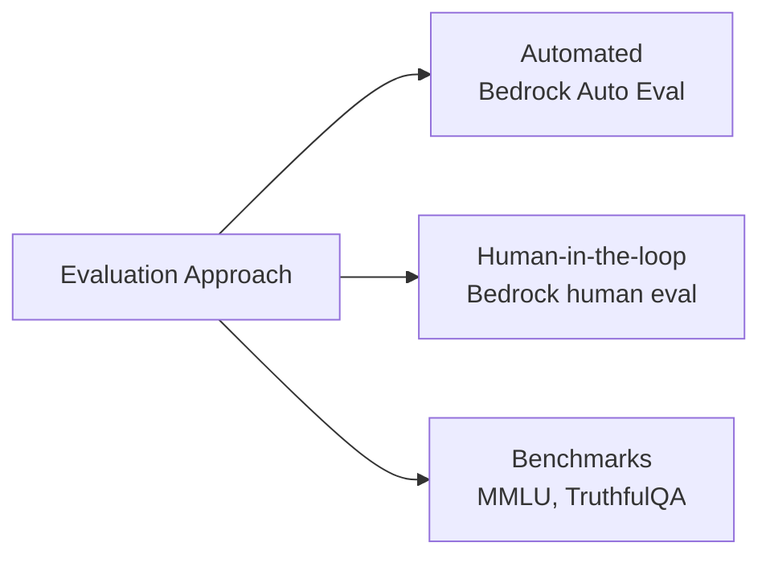
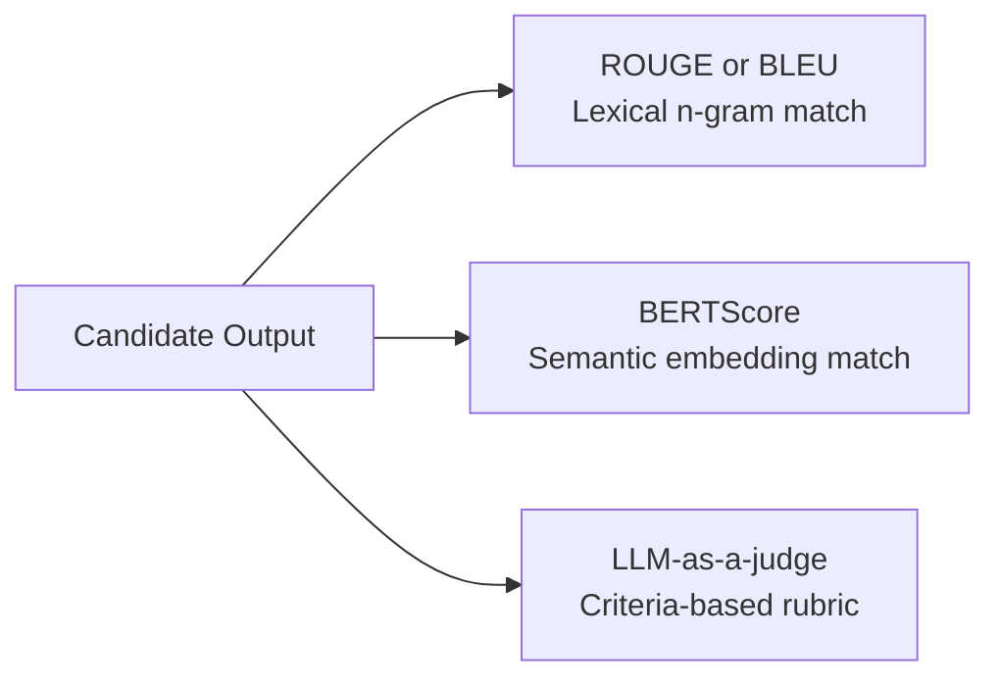
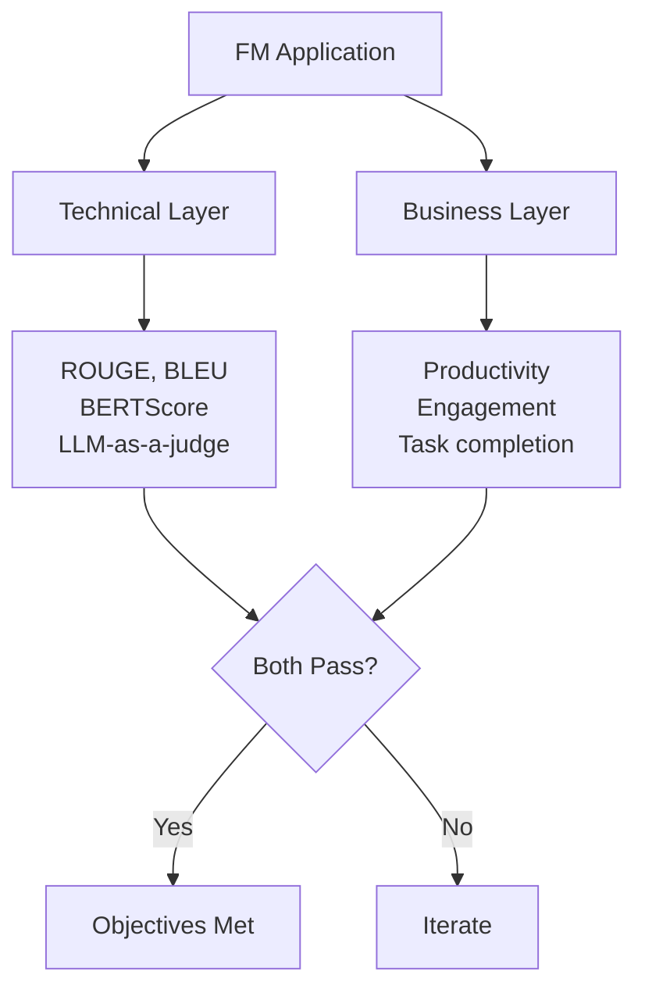
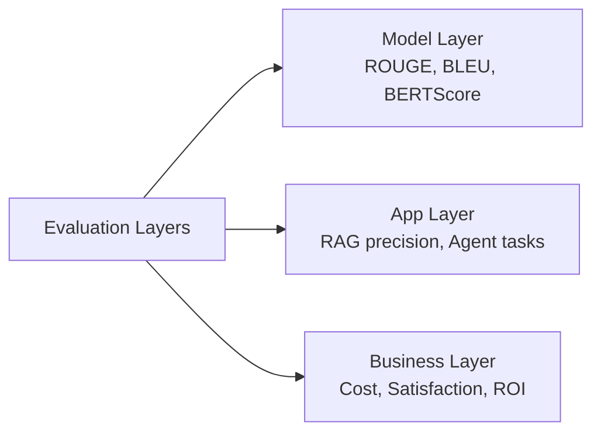

## Task Statement 3.4: Describe methods to evaluate FM performance

Shipping a foundation model application without a structured evaluation plan is the equivalent of releasing software without testing. A model may score well on generic benchmarks yet fail the business task it was built for, or it may meet technical accuracy targets while users quietly stop engaging with it. This task statement covers how to measure FM performance at three distinct layers: the model itself, the application built on top of it, and the business outcome it was deployed to produce.[^304001]

### 3.4.1 Approaches to evaluate FM performance

Most organizations spend more time selecting a foundation model than evaluating whether it actually performs adequately on their data and tasks. That inversion is costly. A model that passes a general-purpose leaderboard may still underperform on the specialized vocabulary, document lengths, or reasoning patterns your organization's workflows require. Evaluation must be treated as a first-class activity planned before deployment, not a diagnostic run after problems emerge.

There are three complementary approaches to FM evaluation. The first uses human reviewers to judge outputs directly. The second uses curated benchmark datasets to measure performance on standardized tasks. The third uses a managed service, **Amazon Bedrock Model Evaluation**, to run both automatic and human evaluations within a controlled, auditable workflow.[^304002]

**Human-in-the-loop evaluation** is the practice of incorporating qualified human reviewers into the evaluation process to assess model outputs against criteria that automated metrics cannot capture, such as factual correctness on proprietary topics, tone appropriateness, or safety.[^304003] The exam updated this term from "human evaluation" to "human-in-the-loop evaluation" in v1.1 to emphasize that humans are not running the evaluation end to end; they are inserted at specific judgment points within a larger automated pipeline.

Three common human-in-the-loop patterns appear in production:

- **Side-by-side comparison**: Two model outputs for the same prompt are presented to a reviewer, who selects the better one without knowing which model produced each. This design removes anchoring bias and produces a relative ranking between model versions or between candidate models. It is the standard format for preference collection in *reinforcement learning from human feedback (RLHF)* studies.
- **Expert review**: Subject-matter experts (physicians, attorneys, engineers) assess whether outputs are factually correct and domain-appropriate. Crowd workers can judge fluency and tone; domain experts are required to judge correctness in specialized fields.
- **Rubric-based scoring**: Reviewers score outputs on a 1-to-5 scale across defined dimensions, such as relevance, coherence, safety, and citation accuracy. Rubric-based scoring produces numerical data that can be aggregated and tracked over time.

**Amazon Mechanical Turk** (for high-volume annotation) and **Amazon SageMaker Ground Truth** (for managed labeling workflows) can supply the human reviewer workforce for these patterns.[^304004] **Amazon Augmented AI (A2I)** provides the human-review workflow layer for SageMaker-hosted models and custom inference pipelines: it routes inference outputs to a review team when developer-defined conditions are met, collects ratings, and returns the results.[^304005] A2I is particularly useful for production monitoring scenarios where a model handles thousands of requests per day and only a sampled subset requires human review. **Amazon Bedrock Model Evaluation** provides its own human-evaluation jobs that can be configured with an internal reviewer team or an AWS-managed workforce; that path is the default for evaluating Bedrock-hosted foundation models and is covered later in this section.

Benchmark datasets are standardized collections of prompts and reference answers used to measure a model's performance across specific capability dimensions.[^304006] Four benchmarks appear consistently in exam-relevant literature:

- **MMLU** (*Massive Multitask Language Understanding*): 57 academic subjects spanning STEM, humanities, law, and medicine. Tests general knowledge and reasoning breadth.[^304007]
- **HellaSwag**: Commonsense reasoning and sentence completion. Measures whether a model can predict the most plausible continuation of an everyday scenario.[^304008]
- **TruthfulQA**: Questions designed to probe whether a model produces factually correct answers on topics where popular misconceptions exist. A model optimized for plausibility rather than accuracy will score poorly here.[^304009]
- **HumanEval**: A set of programming problems with test cases, used to measure a model's code-generation capability. A model passes a problem if the code it produces passes the associated unit tests.[^304010]

Benchmarks provide a standardized, reproducible baseline across model versions and vendors, but they have a well-documented limitation called *benchmark saturation*: models trained after a benchmark is published can inadvertently absorb the benchmark's answers through web-crawled training data, inflating scores beyond genuine capability improvements.[^304011] Business teams should treat benchmark rankings as a filtering tool, not a final verdict.

**Amazon Bedrock Model Evaluation** is AWS's managed service for running both automatic and human evaluations against models available through Amazon Bedrock.[^304012] It supports two job types. An *automatic evaluation* job runs the selected model against a built-in or custom prompt dataset and scores responses using metrics such as accuracy, robustness, and toxicity without requiring human reviewers. A *human evaluation* job routes model outputs to a reviewer workforce, configurable as an internal team or as an AWS-managed workforce, and collects their ratings on defined criteria.[^304013]

Built-in automatic metrics in Bedrock Model Evaluation include accuracy (for question-answering tasks with a reference answer), robustness (measured by perturbing prompts and checking for output consistency), and toxicity (scored by a classifier that flags harmful or offensive content).[^304014] Custom prompt datasets allow organizations to evaluate on their own representative inputs rather than relying on generic datasets, closing the gap between benchmark performance and production behavior.

*Figure 3.4.1: Three FM evaluation approaches. Automatic metrics, human-in-the-loop review, and standardized benchmarks each cover what the others miss; production programs typically use all three in combination.*

### 3.4.2 Relevant metrics to assess FM performance

Choosing the right metric depends on what the model is being asked to produce. A summarization model and a translation model produce text, but the quality of that text is best measured differently. A model generating code is best measured by whether the code runs correctly. This section covers the four metrics the exam specifies: ROUGE, BLEU, BERTScore, and LLM-as-a-judge.

**ROUGE** (*Recall-Oriented Understudy for Gisting Evaluation*) measures the overlap between a generated summary and one or more reference summaries written by humans.[^304015] The most common variant, ROUGE-L, counts the longest common subsequence of words between the candidate and the reference. A high ROUGE score means the model used many of the same words as the human-written reference. ROUGE is the standard metric for summarization evaluation because summarization has a clear criterion for success: the key information from the source document must be present in the summary.

ROUGE has a known limitation: it is a surface-level lexical measure. If the model produces a summary that says "the client terminated the agreement" while the reference says "the customer cancelled the contract," ROUGE scores will be low despite the two sentences being semantically identical. For this reason, ROUGE is most reliable when the reference summaries are themselves diverse (covering multiple valid phrasings) and when the evaluation corpus is large enough to smooth out phrasing variation across many examples.

**BLEU** (*Bilingual Evaluation Understudy*) was developed specifically for machine translation and measures *precision*: what fraction of the n-grams (word sequences) in the candidate output appear in the reference translation.[^304016] Unlike ROUGE, which is recall-oriented, BLEU penalizes candidates that produce short outputs to game recall and then adds a brevity penalty to discount overly short translations. BLEU remains the standard metric in machine translation benchmarking. Its limitation mirrors ROUGE's: it rewards exact word-level overlap and cannot credit a translation that uses synonyms or restructures phrases without changing meaning.

**BERTScore** addresses the lexical-matching limitation of both ROUGE and BLEU by using a pre-trained BERT model to compute *semantic similarity* between the candidate and the reference at the token level.[^304017] Instead of counting exact word matches, BERTScore encodes both texts into high-dimensional vectors and measures the cosine similarity between corresponding tokens. A candidate sentence that uses different words to express the same meaning will score higher on BERTScore than on ROUGE or BLEU. BERTScore is more robust to paraphrasing and is increasingly used in summarization, translation, and general text-quality evaluation, particularly when output diversity is expected or desirable.

The practical trade-off between the three metrics is that ROUGE and BLEU are fast, deterministic, and require no additional inference calls, while BERTScore requires running the BERT encoder on both the candidate and the reference, adding compute cost and latency. For large-scale automated evaluation pipelines, teams often compute ROUGE and BLEU for speed and add BERTScore as a secondary check on a sampled subset.

**LLM-as-a-judge** is a newer approach, added to the v1.1 exam guide, in which a separate, high-quality *judge model* evaluates the outputs of the model under test against defined criteria.[^304018] The judge receives a prompt that contains the original question, the model's answer, and a scoring rubric, and it returns a score or a comparative preference judgment. The approach is faster and cheaper than human evaluation: a single judge model inference call replaces the time and cost of a human reviewer. It also scales without a reviewer workforce, making it practical for evaluating models on tens of thousands of examples.

The caveats are real and matter for exam answers. LLM-as-a-judge has three well-documented biases.[^304019] *Positional bias* is the tendency to favor whichever candidate appears first in the prompt. *Length bias* is the tendency to score longer answers higher even when accuracy is unchanged. *Self-enhancement bias* is what happens when a model is used to judge its own outputs: it favors text that resembles its own style. For these reasons, production LLM-as-a-judge pipelines typically use a judge model that is different from and generally larger than the model being evaluated, rotate the order of candidates in side-by-side comparisons, and calibrate judge outputs against a held-out set of human ratings.

*Table 3.4.1: Comparison of FM output quality metrics*

| Metric | Task domain | What it measures | Strengths | Limitations |
|---|---|---|---|---|
| ROUGE | Summarization | Word-level recall vs. reference | Fast, standard, no model needed | Penalizes valid paraphrases |
| BLEU | Translation | Word-level precision vs. reference | Fast, standard, brevity-penalized | Penalizes valid synonyms |
| BERTScore | General text quality | Semantic similarity via BERT embeddings | Robust to paraphrase | Requires BERT inference, compute cost |
| LLM-as-a-judge | Any generative task | Criteria-based scoring by a judge model | Scalable, flexible criteria | Positional, length, and self-enhancement bias |

*Figure 3.4.2: Output quality metric selection. Lexical metrics are fast but surface-level; semantic metrics tolerate paraphrase; criteria-based metrics are flexible but require bias controls.*

### 3.4.3 Determine whether an FM meets business objectives

Technical metrics answer the question "is the model producing good text?" Business objectives answer a different question: "is the model solving the problem we deployed it to solve?" The distinction matters because a model that scores 0.72 on ROUGE may or may not be improving analyst productivity. A model that achieves a high BERTScore on customer-service responses may or may not be reducing ticket escalation rates.

Determining whether an FM meets business objectives requires connecting the model's behavior to measurable outcomes that business stakeholders care about. The exam identifies three categories: productivity, user engagement, and task engineering.

**Productivity** measures time or effort saved per task.[^304020] A legal team that uses an FM to draft contract summaries should be able to report that each attorney now spends 20 minutes on summary review rather than 90 minutes on manual drafting. A developer tools team using a code-completion model should measure pull-request throughput or time-to-first-commit before and after adoption. Productivity improvements are the most direct financial case for FM deployment and are best measured through controlled pilots where a treatment group uses the FM-powered tool and a control group does not.

**User engagement** covers whether users actually use the system, how deeply they interact with it, and whether they return.[^304021] Relevant indicators include sessions per user per week, average session depth (number of turns before the user ends the conversation or abandons the task), and return rate (the proportion of users who use the system again after their first session). Engagement data signals whether the FM application is solving a problem users value or whether users are abandoning it after a poor initial experience. An FM that produces technically accurate outputs but is framed confusingly or responds too slowly will show declining engagement even if its ROUGE scores are stable.

**Task engineering** is the AWS exam term for whether the FM-powered workflow actually completes the business task end to end, without requiring human fallback at rates that negate the efficiency gain.[^304022] (Outside the AWS materials, the same idea is more commonly called *workflow-completion rate* or *autonomous-completion rate*.) A customer service bot that resolves 80% of inquiries autonomously is achieving its task-engineering goal if the target was 75%. A document-review workflow that requires a human to correct 60% of FM-generated summaries before filing is not. Task engineering at this objective focuses on the workflow as deployed; section 3.4.5 introduces *task completion rate* as the user-goal-level version of the same idea, applied to whether the user's underlying business task got done.

The practical implication for exam scenarios is that a question describing symptoms such as "users are not returning" or "the FM completes the first step but a human must finish the rest" should direct your thinking to engagement and task-engineering metrics respectively, not to ROUGE or BLEU. The model may be technically proficient but failing at the workflow level.

*Figure 3.4.3: Dual evaluation framework. A model must pass both technical and business evaluation layers to be considered fit for the intended deployment.*

### 3.4.4 Evaluate the performance of applications built with FM

A foundation model is rarely deployed in isolation. Production applications layer retrieval systems, agent orchestration, and multi-step workflows on top of the base model. Each layer introduces its own failure modes. Evaluating only the base model leaves the application-layer failures invisible until they surface in production complaints.

The exam identifies three application architectures that each require their own evaluation approach: RAG pipelines, AI agents, and multi-step workflows.

**RAG evaluation** splits into two independent concerns: retrieval quality and generation quality.[^304023] Retrieval quality measures whether the vector store returned the right documents when given the user's query. Generation quality measures whether the model produced an accurate and faithful answer given the retrieved documents. A failure in either sub-system produces a bad answer, but the root cause and the fix are different.

Retrieval quality is typically measured using *precision@k* and *recall@k*, where k is the number of documents retrieved.[^304024] Precision@k asks: of the k documents retrieved, what fraction were actually relevant? Recall@k asks: of all the relevant documents in the corpus, what fraction appeared in the top-k results? A retrieval system with high precision but low recall finds reliable documents but misses important ones. A system with high recall but low precision returns everything relevant but buries it in noise.

Generation quality for RAG is measured by *groundedness* (whether the model's answer is supported by the retrieved documents, not invented from parametric memory), *answer faithfulness* (whether the claims in the answer accurately reflect what the retrieved documents say), and *citation accuracy* (whether the cited sources actually contain the information attributed to them).[^304025] Tools such as **Ragas** provide an open-source evaluation framework that computes these metrics automatically by running a judge model over the retrieved documents and the generated answer.[^304026]

**Agent evaluation** measures whether an AI agent completes assigned tasks accurately, efficiently, and at acceptable cost.[^304027] Because agents execute multi-step plans using external tools, their evaluation surface is larger than a single-response model. Relevant metrics include:

- **Task completion rate**: The percentage of assigned tasks the agent completes without human intervention or error-state exit.
- **Tool selection accuracy**: Whether the agent chose the correct tool at each step (relevant when the agent has access to multiple APIs and the right choice is deterministic given the task description).
- **Step efficiency**: The number of tool calls required to complete a task, compared to the minimum number a well-designed plan would require. High step counts suggest the agent is replanning unnecessarily or producing incorrect tool arguments that trigger retries.
- **Cost per task**: The total inference and tool-call cost required to complete one task. This is a direct business metric for agents that run at scale.

Amazon Bedrock provides agent evaluation capabilities for Bedrock Agents and AgentCore-deployed agents, including test harnesses, per-step traces, and built-in evaluation jobs aligned with the agent metrics above; consult the current Amazon Bedrock User Guide for the exact feature names and scope, since the agent-evaluation surface continues to evolve.[^304028]

**Workflow evaluation** applies to multi-step pipelines that combine FM calls, RAG retrievals, business logic, and human handoffs into a complete business process.[^304029] Metrics include end-to-end success rate (what proportion of workflow instances complete without an error exit or forced human override), error category distribution (which step produces failures most often), and fallback rate (how frequently the workflow routes to a human fallback path).

*Table 3.4.2: Evaluation metrics by application architecture*

| Architecture | Retrieval metrics | Generation metrics | Business metrics |
|---|---|---|---|
| Base FM only | Not applicable | ROUGE, BLEU, BERTScore, LLM-as-a-judge | Productivity, engagement |
| RAG pipeline | Precision@k, Recall@k | Groundedness, Faithfulness, Citation accuracy | Task completion, user satisfaction |
| AI agent | Tool selection accuracy, Step efficiency | Answer correctness, Hallucination rate | Task completion rate, Cost per task |
| Multi-step workflow | Not applicable | Error category distribution | End-to-end success rate, Fallback rate |

*Figure 3.4.4: Layered evaluation architecture. Each layer of the application stack requires its own evaluation approach; failures at any layer affect the business outcome.*

### 3.4.5 Business objective alignment metrics for AI applications

The metrics in Section 3.4.2 tell you whether the model is performing well technically. The metrics in Section 3.4.4 tell you whether the application is running correctly. Business objective alignment metrics answer the question that the sponsoring executive actually cares about: is this AI investment delivering value?

The v1.1 exam guide added this as a distinct objective, signaling that the exam expects candidates to understand the gap between technical measurement and business accountability and to know which instruments close that gap.

**Task completion rate** is the percentage of user-initiated tasks that the AI application completes successfully without requiring the user to abandon the task, seek help from another channel, or escalate to a human agent.[^304030] It is distinct from agent task completion rate (Section 3.4.4) in scope: agent task completion measures whether the orchestration layer finished its plan, while business task completion measures whether the user's underlying goal was met. A user who asked the AI to book a conference room, received a confirmation, but later found the room was already occupied did not experience a completed task from a business perspective, even if the agent's API calls all returned success codes.

Task completion rate is the single metric that most directly connects FM application behavior to the business case for deployment. If the application was deployed to reduce the number of support tickets that reach a human agent, task completion rate measures exactly how well it is achieving that goal. For exam scenarios, task completion rate is the BEST answer when the question asks how to measure whether an AI application is meeting its primary business objective.

**User satisfaction** captures how users perceive the quality of their interactions with the AI application.[^304031] Common instruments include post-interaction surveys (*CSAT*, the Customer Satisfaction Score, where users rate their experience on a numeric scale), *NPS* (Net Promoter Score, which asks whether the user would recommend the application to a colleague), and in-product feedback (thumbs-up/thumbs-down ratings collected at the end of each response). Unlike task completion rate, which is an objective measure of what happened, user satisfaction is a subjective measure of how the user felt about it. Both are necessary. An expense-report assistant that resolves submissions in two clicks but uses a curt tone may see CSAT drop below 3.5 even when its task completion rate stays above 90 percent; users will look for a different tool when one becomes available.

**Cost per interaction** measures the total cloud and licensing cost incurred to serve one user request through the full application stack, from the API call to the retrieval step (if present) to the FM inference call and any downstream processing.[^304032] In a RAG pipeline, cost per interaction includes the embedding model call, the vector search operation, and the FM generation call. In an agent workflow, it includes every tool-call and inference step in the plan. Cost per interaction must be tracked against revenue or value per interaction to determine whether the application's unit economics are viable at scale. An application that costs $0.05 per interaction and generates $0.10 of measured value (through ticket deflection savings, for example) is sustainable. One that costs $0.08 per interaction for the same $0.10 value leaves little margin for infrastructure headroom.

Tracking these metrics requires connecting the AI application's telemetry to a business intelligence layer. **Amazon CloudWatch** collects operational metrics, logs, and traces from Amazon Bedrock and application code, including latency, error rates, and invocation counts per model.[^304033] These operational signals can be combined with application-layer events (task completed, user gave thumbs down, interaction cost logged) to build a complete picture. **Amazon QuickSight** connects to CloudWatch data and to other data sources to produce dashboards that present task completion rate, user satisfaction trends, and cost per interaction in formats accessible to business stakeholders who do not read CloudWatch metric graphs directly.[^304034]

*Table 3.4.3: Business alignment metrics for AI applications*

| Metric | What it measures | Data source | Stakeholder | Decision it informs |
|---|---|---|---|---|
| Task completion rate | Whether user goals are met | Application event logs | Product, Operations | Adjust scope or fallback logic |
| User satisfaction (CSAT, NPS) | User perception of quality | Post-interaction surveys, thumbs feedback | Product, CX | Improve response quality or UX |
| Cost per interaction | Unit economics of AI delivery | CloudWatch billing and invocation data | Finance, Engineering | Optimize model tier, caching, or workflow |

A well-designed evaluation program monitors all three business metrics continuously, not just at launch. Task completion rate may decline as user queries drift from the patterns the model was tested on. User satisfaction may decline as novelty wears off and users compare the AI to improved alternatives. Cost per interaction may increase if usage patterns shift toward longer, more complex queries. Regular review of all three metrics against defined thresholds is the operational discipline that distinguishes a managed AI product from a prototype that was shipped and forgotten.

## Self-check questions

**Question 1.** A healthcare organization is deploying an FM-powered tool that helps nurses retrieve information from clinical protocols. Before going live, the team wants to verify that the model produces factually accurate, domain-appropriate responses on specialized medical vocabulary. Which evaluation approach is MOST appropriate for this requirement?

A. Run the model against the MMLU benchmark and accept it if the score exceeds 70%  
B. Use Amazon Bedrock Model Evaluation with an automatic toxicity-detection job  
C. Use Amazon Augmented AI (A2I) to route model outputs to clinical experts for rubric-based scoring  
D. Compute BLEU scores against a set of reference clinical summaries  

**Explanation:** The key constraint in this scenario is domain-specific factual correctness assessed by people who can judge whether a medical answer is clinically accurate. Crowd workers and automated metrics cannot make that judgment. Answer C is correct: Amazon A2I supports human-in-the-loop evaluation workflows that can route outputs to a defined reviewer pool, such as a panel of clinical nurses or physicians, who rate responses on a rubric covering accuracy, clarity, and appropriateness. Answer A is wrong because MMLU is a general academic benchmark; scoring 70% on 57 academic subjects does not tell you whether the model handles clinical protocol queries correctly, and the threshold has no relationship to clinical safety requirements. Answer B is wrong because a toxicity job measures whether the model produces harmful or offensive content; it does not assess clinical accuracy. Answer D is wrong because BLEU measures word-level precision against a reference text and would not capture whether the clinical information conveyed is correct; a plausible-sounding but factually wrong answer could score well on BLEU if it shares vocabulary with the reference.[^304035]

---

**Question 2.** An organization is comparing two foundation models for a news summarization task. Both models produce fluent English. The evaluation team has a set of 500 human-written reference summaries for the same articles. Which metric is MOST appropriate as the primary evaluation signal for this task?

A. BERTScore, because it measures semantic similarity and tolerates paraphrase  
B. BLEU, because it was designed for evaluating text generation against references  
C. ROUGE, because it was designed specifically for summarization and measures recall of key content  
D. LLM-as-a-judge, because a judge model can score coherence without a reference summary  

**Explanation:** ROUGE (Answer C) was developed specifically for summarization evaluation and its design reflects the core requirement of that task: a good summary must contain the key information from the source document, which is a recall problem. ROUGE-L, the most common variant, measures the longest common subsequence of words between the candidate and the reference, rewarding summaries that cover the main points in any order. Answer A is technically valid as a secondary metric, but BERTScore requires running a BERT encoder on every candidate-reference pair, adding computational cost; it is most valuable when the reference summaries use varied vocabulary and lexical overlap would unfairly penalize valid paraphrases. If the organization wants to add semantic robustness to the evaluation, BERTScore is an appropriate complement, not a replacement. Answer B is wrong because BLEU is a precision-oriented metric designed for translation, where the exact wording of the target language matters; summarization prioritizes recall of content rather than precision of phrasing. Answer D is wrong because LLM-as-a-judge is most valuable when there is no reference summary and human-style judgment is required; when 500 reference summaries are available, reference-based metrics are the more reliable and reproducible primary signal.[^304036]

---

**Question 3.** A company deployed a RAG-powered internal Q&A tool three months ago. Users report that the tool often gives answers that sound confident but contain information not found in the company's documents. Which evaluation metric MOST directly identifies this failure mode?

A. ROUGE-L score against human-written reference answers  
B. Groundedness score measuring whether answers are supported by retrieved documents  
C. Precision@k measuring whether the top retrieved documents are relevant  
D. Task completion rate measuring whether users find the tool useful  

**Explanation:** The symptom described (confident answers that contain information not in the source documents) is the definition of poor *groundedness*: the model is generating content from its parametric memory rather than from the retrieved documents. Answer B is correct. Groundedness is evaluated by checking each claim in the generated answer against the retrieved document set and scoring what fraction of claims are supported by at least one retrieved document. Tools such as Ragas compute this metric automatically. Answer A is wrong because ROUGE-L measures word overlap with a human reference answer; it would not detect hallucinated content that uses plausible words not in the reference. Answer C is wrong because precision@k measures the quality of retrieval, not of generation; a retrieval system could be returning highly relevant documents while the model still ignores them and generates from parametric memory. Answer D is wrong because task completion rate measures whether the user's goal was met; the symptom described may be causing low satisfaction without triggering the formal task-failure path the application tracks.[^304037]

---

**Question 4.** An AI product manager is presenting the business case for an FM-powered customer support chat application to the CFO. The CFO asks for a single metric that shows whether the application is financially sustainable at scale. Which metric BEST addresses this question?

A. BLEU score on the support response corpus  
B. Average session depth per user  
C. Cost per interaction compared to value delivered per interaction  
D. Fallback rate to human agents  

**Explanation:** The CFO's question is about unit economics: does each interaction deliver value that justifies its cost? Cost per interaction (Answer C) measures the total cloud and licensing expense for each user request through the full application stack. When compared to the measured value per interaction (for example, the average cost of a human agent handling the same request), it establishes whether the application is financially viable at the current and projected usage scale. Answer A is wrong because BLEU is a text-quality metric; it has no relationship to cost or financial sustainability. Answer B (session depth) is an engagement metric that signals whether users find the application valuable, but it does not tell the CFO anything about cost structure. Answer D (fallback rate) is a useful operational metric that contributes to understanding economics, since every fallback to a human agent incurs the full human cost rather than the AI cost, but it is a component input to the financial picture, not the complete unit-economics view the CFO is asking for. Cost per interaction, compared directly to value per interaction, is the metric that answers the CFO's question.[^304038]

---

**Question 5.** A team is evaluating a new FM version to replace the current production model. They want to determine whether the new model produces outputs that human reviewers prefer, without requiring the reviewers to know which model produced each answer. Which evaluation approach MOST directly addresses this requirement?

A. Run both models against the TruthfulQA benchmark and compare percentile rankings  
B. Use LLM-as-a-judge with the current production model as the judge model  
C. Use side-by-side human comparison with reviewer identities blinded to model identity  
D. Compute BERTScore for both models against the same set of reference outputs  

**Explanation:** The requirement has two parts: human preference judgment and blinding (reviewers must not know which model produced which output). Answer C is the human-in-the-loop evaluation pattern specifically designed for this use case. Side-by-side comparison presents two outputs to a reviewer for the same prompt, the reviewer selects the preferred output, and the design prevents anchoring bias by not labeling which model produced each. This directly produces a preference ranking between the two model versions. Answer A is wrong because TruthfulQA is a benchmark for factual accuracy on misconception-prone topics; it does not measure general output quality preference, and the question does not mention factual accuracy as the criterion. Answer B is wrong in a subtle but important way: using the current production model as the judge model introduces self-enhancement bias; the current model will tend to rate outputs similar to its own style more highly, making the comparison unfair to the new model. Answer D is wrong because BERTScore computes semantic similarity against reference texts, not human preference between two candidate outputs; it does not capture the qualitative judgment the team is seeking.[^304039]

---

**Question 6.** An organization launched an FM-powered procurement assistant six weeks ago. Usage data shows that 45% of users who try the assistant do not return after their first session. The model's ROUGE scores on summarization tests are in the top quartile for its model family. Which business metric MOST directly diagnoses whether this engagement problem stems from the model's output quality or from the application design?

A. User satisfaction (CSAT or thumbs feedback) collected immediately after each interaction  
B. BERTScore computed against a reference answer set for procurement queries  
C. Task completion rate measured by the application event log  
D. Precision@k for the RAG retrieval layer  

**Explanation:** The scenario presents a dissociation: ROUGE scores are strong (suggesting the model produces text that overlaps well with references) but return rate is low (suggesting users are not finding the application valuable enough to use again). To diagnose whether the problem is output quality or application design, the organization needs a signal from actual users reflecting their subjective experience, not a signal from automated text-overlap metrics. User satisfaction collected immediately after each interaction (Answer A) captures whether users found the response helpful, accurate, and delivered in a way that made them want to return. A pattern of low CSAT despite high ROUGE would indicate that the reference summaries used for ROUGE evaluation do not reflect what users actually value in the procurement context, pointing to an output-quality or framing problem. A pattern of moderate CSAT with low return rate would point to application design factors (UX, speed, trust) rather than the model itself. Answer B is wrong because BERTScore is another automated text-quality metric that, like ROUGE, measures similarity to references; it would not explain the gap between technical scores and user behavior. Task completion rate (Answer C) would tell you whether the workflow finished, but in this scenario the workflow already produces strong technical scores; the missing signal is the user's subjective judgment about that completed interaction, which only CSAT or thumbs feedback captures. Answer D is wrong because precision@k diagnoses retrieval quality; while poor retrieval could contribute to poor answers, it would be a secondary investigation step after establishing user satisfaction data.[^304040]

[^304001]: AWS Certification. AI Practitioner (AIF-C01) Exam Guide v1.1, Task Statement 3.4. URL: <https://docs.aws.amazon.com/aws-certification/latest/ai-practitioner-01/ai-practitioner-01-domain3.html>
[^304002]: Amazon Bedrock. Amazon Bedrock Model Evaluation overview. URL: <https://docs.aws.amazon.com/bedrock/latest/userguide/model-evaluation.html>
[^304003]: Amazon A2I. How Amazon Augmented AI works. URL: <https://docs.aws.amazon.com/sagemaker/latest/dg/a2i-how-it-works.html>
[^304004]: Amazon SageMaker. Amazon SageMaker Ground Truth labeling workflows. URL: <https://docs.aws.amazon.com/sagemaker/latest/dg/sms.html>
[^304005]: Amazon A2I. Use Amazon Augmented AI for human review. URL: <https://docs.aws.amazon.com/sagemaker/latest/dg/a2i-use-augmented-ai-a2i-human-review-loops.html>
[^304006]: Liang, P., et al. Holistic Evaluation of Language Models (HELM, 2022). URL: <https://arxiv.org/abs/2211.09110>
[^304007]: Hendrycks, D., et al. Measuring Massive Multitask Language Understanding (MMLU, 2020). URL: <https://arxiv.org/abs/2009.03300>
[^304008]: Zellers, R., et al. HellaSwag: Can a Machine Really Finish Your Sentence? (2019). URL: <https://arxiv.org/abs/1905.07830>
[^304009]: Lin, S., et al. TruthfulQA: Measuring How Models Mimic Human Falsehoods (2021). URL: <https://arxiv.org/abs/2109.07958>
[^304010]: Chen, M., et al. Evaluating Large Language Models Trained on Code (HumanEval, 2021). URL: <https://arxiv.org/abs/2107.03374>
[^304011]: Kiela, D., et al. Dynabench: Rethinking Benchmarking in NLP (2021). URL: <https://arxiv.org/abs/2104.14337>
[^304012]: Amazon Bedrock. Amazon Bedrock Model Evaluation jobs. URL: <https://docs.aws.amazon.com/bedrock/latest/userguide/model-evaluation-jobs.html>
[^304013]: Amazon Bedrock. Human evaluation using Amazon Bedrock Model Evaluation. URL: <https://docs.aws.amazon.com/bedrock/latest/userguide/model-evaluation-human.html>
[^304014]: Amazon Bedrock. Automatic evaluation metrics in Amazon Bedrock Model Evaluation. URL: <https://docs.aws.amazon.com/bedrock/latest/userguide/model-evaluation-automatic.html>
[^304015]: Lin, C.-Y. ROUGE: A Package for Automatic Evaluation of Summaries (2004). URL: <https://aclanthology.org/W04-1013>
[^304016]: Papineni, K., et al. BLEU: a Method for Automatic Evaluation of Machine Translation (2002). URL: <https://aclanthology.org/P02-1040>
[^304017]: Zhang, T., et al. BERTScore: Evaluating Text Generation with BERT (2019). URL: <https://arxiv.org/abs/1904.09675>
[^304018]: Zheng, L., et al. Judging LLM-as-a-Judge with MT-Bench and Chatbot Arena (2023). URL: <https://arxiv.org/abs/2306.05685>
[^304019]: Wang, P., et al. Large Language Models are not Fair Evaluators (2023). URL: <https://arxiv.org/abs/2305.17926>
[^304020]: Microsoft Research. The Total Economic Impact of GitHub Copilot (2023). URL: <https://resources.github.com/downloads/The-Total-Economic-Impact-of-GitHub-Copilot.pdf>
[^304021]: Amazon CloudWatch. Using Amazon CloudWatch to track user engagement metrics for AI applications. URL: <https://docs.aws.amazon.com/AmazonCloudWatch/latest/monitoring/working_with_metrics.html>
[^304022]: Amazon Bedrock. Evaluating agent task completion in Amazon Bedrock. URL: <https://docs.aws.amazon.com/bedrock/latest/userguide/agents-evaluation.html>
[^304023]: Es, S., et al. RAGAS: Automated Evaluation of Retrieval Augmented Generation (2023). URL: <https://arxiv.org/abs/2309.15217>
[^304024]: Manning, C., et al. Introduction to Information Retrieval: Precision and Recall at k (2008). URL: <https://nlp.stanford.edu/IR-book/>
[^304025]: Es, S., et al. RAGAS: Faithfulness and Answer Relevance Metrics (2023). URL: <https://arxiv.org/abs/2309.15217>
[^304026]: Ragas. Ragas: Evaluation framework for RAG pipelines. URL: <https://docs.ragas.io/>
[^304027]: Amazon Bedrock. Evaluating Amazon Bedrock Agents. URL: <https://docs.aws.amazon.com/bedrock/latest/userguide/agents-evaluation.html>
[^304028]: Amazon Bedrock User Guide. Evaluation capabilities for Bedrock Agents and AgentCore. URL: <https://docs.aws.amazon.com/bedrock/latest/userguide/agents.html>
[^304029]: Amazon Bedrock. Multi-step workflow evaluation with Amazon Bedrock. URL: <https://docs.aws.amazon.com/bedrock/latest/userguide/agents-test.html>
[^304030]: Amazon Bedrock. Measuring task completion in Amazon Bedrock application monitoring. URL: <https://docs.aws.amazon.com/bedrock/latest/userguide/model-evaluation.html>
[^304031]: Amazon Connect. Customer satisfaction scoring and AI contact center metrics. URL: <https://docs.aws.amazon.com/connect/latest/adminguide/metrics-definitions.html>
[^304032]: Amazon Bedrock. Monitoring Amazon Bedrock usage and costs with AWS Cost Explorer. URL: <https://docs.aws.amazon.com/bedrock/latest/userguide/monitoring-overview.html>
[^304033]: Amazon CloudWatch. Monitoring Amazon Bedrock with Amazon CloudWatch. URL: <https://docs.aws.amazon.com/bedrock/latest/userguide/monitoring-cloudwatch.html>
[^304034]: Amazon QuickSight. Getting started with Amazon QuickSight dashboards. URL: <https://docs.aws.amazon.com/quicksight/latest/user/getting-started.html>
[^304035]: Amazon A2I. Setting up a human review workflow with Amazon Augmented AI. URL: <https://docs.aws.amazon.com/sagemaker/latest/dg/a2i-create-flow-definition.html>
[^304036]: Lin, C.-Y. ROUGE: A Package for Automatic Evaluation of Summaries: task applicability (2004). URL: <https://aclanthology.org/W04-1013>
[^304037]: Es, S., et al. RAGAS: Groundedness evaluation for RAG pipelines (2023). URL: <https://arxiv.org/abs/2309.15217>
[^304038]: Amazon Bedrock. Tracking Amazon Bedrock invocation costs per application. URL: <https://docs.aws.amazon.com/bedrock/latest/userguide/monitoring-overview.html>
[^304039]: Zheng, L., et al. Judging LLM-as-a-Judge: bias characteristics and mitigations (2023). URL: <https://arxiv.org/abs/2306.05685>
[^304040]: Amazon CloudWatch. Collecting user feedback events in AI application telemetry. URL: <https://docs.aws.amazon.com/AmazonCloudWatch/latest/monitoring/working_with_metrics.html>
