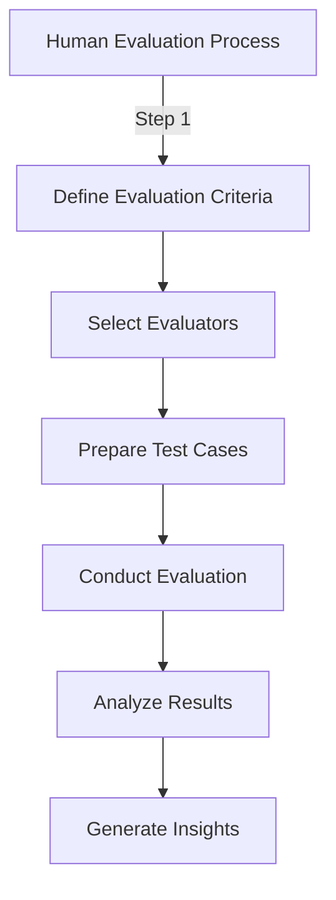
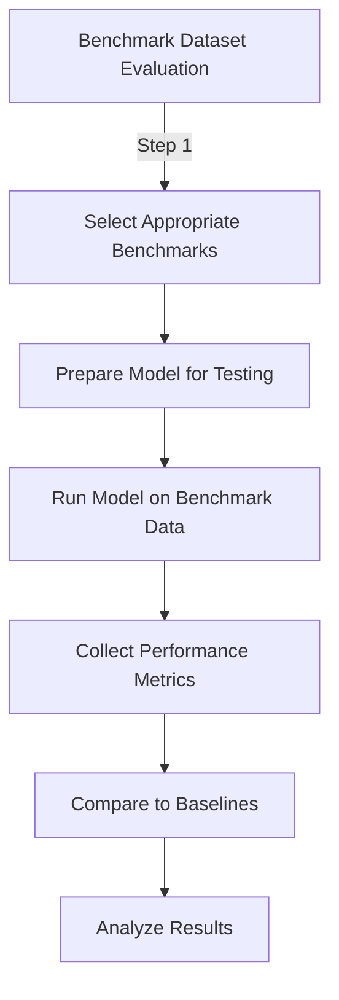
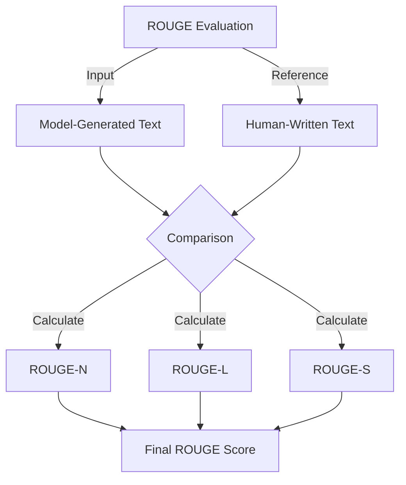
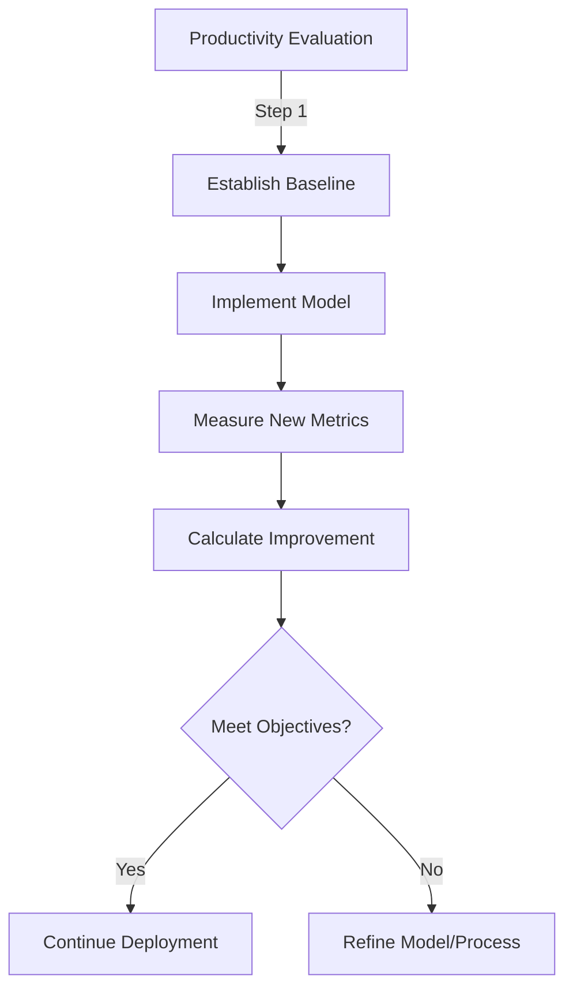

## 3.4 Methods to evaluate foundation model performance

Foundation models power numerous AI applications across businesses today, from natural language processing to image generation. Accurately evaluating these models' performance is critical for ensuring they deliver business value and identifying optimization opportunities. For AWS Certified AI Practitioner candidates, understanding evaluation methods enables informed decision-making about AI implementations and helps demonstrate the value of AI initiatives to stakeholders.

This subchapter explores approaches to evaluating foundation model performance, examines relevant assessment metrics, and discusses strategies for determining whether models effectively meet business objectives. Mastering these concepts will equip you to navigate AI implementation challenges and drive successful outcomes for your organization.

### Approaches to evaluate foundation model performance

Evaluating foundation model performance requires both quantitative and qualitative methods. Two primary approaches stand out: human evaluation and benchmark datasets. Each provides unique insights into model capabilities and limitations.

#### Human evaluation

**Human evaluation** involves having experts or end-users interact with a foundation model and assess its outputs based on predefined criteria. This approach is especially valuable for tasks requiring subjective judgment, contextual understanding, or creativity assessment.[^900]

*Figure 3.4.1: Human Evaluation Process. This diagram illustrates the steps involved in conducting a human evaluation of foundation model performance, from defining criteria to generating insights.*

Key aspects of human evaluation include:

- **Diverse evaluator pool**: Ensuring a diverse group of evaluators helps capture different perspectives and reduces bias in the assessment.
- **Structured evaluation criteria**: Developing clear, consistent criteria for evaluators to follow ensures more objective and comparable results.
- **Task-specific assessments**: Tailoring evaluation tasks to match real-world use cases provides more relevant insights into model performance.
- **Qualitative feedback**: Collecting detailed feedback from evaluators can uncover nuanced issues or opportunities for improvement that quantitative metrics might miss.

Human evaluation is particularly useful for assessing:

- Natural language generation quality
- Contextual appropriateness of responses
- Creativity and originality in content creation
- User experience and satisfaction with model interactions

While human evaluation provides valuable insights, it can be time-consuming and potentially subjective. To complement this approach, organizations often turn to benchmark datasets for more standardized and quantitative assessments.

#### Benchmark datasets

**Benchmark datasets** are standardized collections of data designed to evaluate model performance across various tasks and domains. These datasets typically include input-output pairs or specific challenges that models must address, allowing for consistent comparisons between different models or versions of the same model.[^901]

*Figure 3.4.2: Benchmark Dataset Evaluation Process. This diagram outlines the steps involved in evaluating foundation model performance using benchmark datasets, from selection to analysis.*

Key advantages of using benchmark datasets include:

- **Standardization**: Allows for consistent comparisons across different models and research efforts.
- **Efficiency**: Automated evaluation processes can quickly assess model performance on large datasets.
- **Reproducibility**: Results can be easily verified and reproduced by other researchers or organizations.
- **Comprehensive coverage**: Benchmarks often cover a wide range of tasks and scenarios, providing a broad view of model capabilities.

Popular benchmark datasets for foundation models include:

- **GLUE** (General Language Understanding Evaluation): A collection of tasks for evaluating natural language understanding.[^902]
- **SuperGLUE**: An extension of GLUE with more challenging tasks.[^903]
- **SQuAD** (Stanford Question Answering Dataset): For evaluating question-answering capabilities.[^904]
- **ImageNet**: A large-scale dataset for image classification and object detection tasks.[^905]

When using benchmark datasets, consider:

- **Relevance to business objectives**: Choose benchmarks that align with your specific use cases and goals.
- **Potential limitations**: Be aware of any biases or limitations in the benchmark datasets that might affect their applicability to your specific context.
- **Continuous updates**: As AI technology evolves, new benchmarks emerge. Stay informed about the latest relevant datasets for your domain.

Most organizations combine human evaluation and benchmark datasets to gain a comprehensive understanding of foundation model performance. This hybrid approach provides both quantitative comparisons and qualitative insights for a more robust evaluation framework.

### Relevant metrics to assess foundation model performance

Standardized metrics help quantify various aspects of model output quality, enabling comparisons between models and tracking improvements over time. While metric selection depends on specific tasks and business objectives, several have become industry standards for evaluating foundation model performance.

#### ROUGE (Recall-Oriented Understudy for Gisting Evaluation)

**ROUGE** is a set of metrics primarily used for evaluating automatic summarization and machine translation. It compares model-generated text against one or more reference texts, typically human-written.[^906]

Key ROUGE metrics include:

- **ROUGE-N**: Measures the overlap of n-grams between the generated and reference texts.
- **ROUGE-L**: Considers the longest common subsequence between the generated and reference texts.
- **ROUGE-S**: Evaluates the overlap of skip-bigrams between the texts.

*Figure 3.4.3: ROUGE Evaluation Process. This diagram illustrates the steps involved in calculating ROUGE scores for assessing foundation model performance in text generation tasks.*

ROUGE is particularly useful for:
- Evaluating text summarization quality
- Assessing machine translation accuracy
- Measuring the coherence and relevance of generated text

#### BLEU (Bilingual Evaluation Understudy)

**BLEU** is another widely used metric for evaluating machine translation and text generation tasks. It measures the similarity between the model-generated text and one or more reference translations.[^907]

Key aspects of BLEU:

- Calculates precision by comparing n-grams in the generated text to those in the reference text(s)
- Applies a brevity penalty to account for length differences
- Scores range from 0 to 1, with higher scores indicating better performance

BLEU is valuable for:
- Assessing machine translation quality
- Evaluating text generation in multilingual contexts
- Comparing different language models on translation tasks

#### BERTScore

**BERTScore** is a more recent metric that leverages pre-trained language models (specifically BERT) to compute similarity scores between generated and reference texts. It aims to capture semantic similarity beyond simple n-gram overlap.[^908]

Key features of BERTScore:

- Uses contextual embeddings to capture semantic meaning
- Computes precision, recall, and F1 scores based on token similarities
- Can handle paraphrases and synonyms better than traditional metrics

BERTScore is particularly useful for:
- Evaluating text generation quality in tasks requiring semantic understanding
- Assessing paraphrasing and text style transfer
- Complementing other metrics for a more comprehensive evaluation

When applying these metrics, consider:

- **Task-specific relevance**: Choose metrics that align with your specific use case and business objectives.
- **Limitations**: Understand the strengths and weaknesses of each metric to interpret results accurately.
- **Multiple metric approach**: Use a combination of metrics for a more comprehensive evaluation.
- **Human judgment correlation**: Validate metric results against human evaluations to ensure relevance.

Table 3.4.1: Comparison of Foundation Model Evaluation Metrics

| Metric | Strengths | Limitations | Best Use Cases |
|--------|-----------|-------------|----------------|
| ROUGE  | - Well-established for summarization - Multiple variants for different aspects | - Focuses on lexical overlap - May miss semantic similarities | - Text summarization - Content generation evaluation |
| BLEU   | - Industry standard for translation - Easy to compute and interpret | - Doesn't capture meaning well - Favors shorter translations | - Machine translation - Cross-lingual text generation |
| BERTScore | - Captures semantic similarity - Handles paraphrases well | - Computationally intensive - Requires pre-trained models | - Semantic evaluation of generated text - Paraphrase assessment |

By leveraging these metrics effectively, organizations can gain valuable insights into their foundation model's performance and make data-driven decisions for improvement and optimization.

### Determining foundation model effectiveness for business objectives

The ultimate measure of success for a foundation model is how well it meets specific business objectives. Evaluating business effectiveness requires a holistic approach that goes beyond raw performance scores.

#### Productivity enhancement

One primary goal of implementing foundation models is to enhance productivity. This can be measured by assessing:

- **Time savings**: Compare task completion time with and without the model's assistance.
- **Output quality**: Evaluate the accuracy and relevance of model-generated content or insights.
- **Error reduction**: Measure the decrease in errors or inconsistencies in processes where the model is applied.

To evaluate productivity gains:

1. Establish baseline metrics for current processes
2. Implement the foundation model in a controlled environment
3. Measure the same metrics after implementation
4. Calculate the percentage improvement in productivity

*Figure 3.4.4: Productivity Evaluation Process. This diagram illustrates the steps involved in assessing the productivity gains from implementing a foundation model in a business context.*

#### User engagement

For customer-facing applications, user engagement is a critical measure of effectiveness. Key indicators include:

- **User satisfaction scores**: Conduct surveys or analyze feedback to gauge user satisfaction with model interactions.
- **Engagement metrics**: Track metrics such as time spent interacting with the model, frequency of use, and return rates.
- **Conversion rates**: For e-commerce or lead generation applications, measure the impact on conversion rates.

To evaluate user engagement:

1. Define key engagement metrics relevant to your business
2. Implement tracking mechanisms for these metrics
3. Analyze trends in engagement data over time
4. Correlate engagement metrics with business outcomes (e.g., revenue, customer retention)

#### Task engineering

**Task engineering** involves optimizing how foundation models are applied to specific business tasks. This process includes:

- **Prompt design**: Crafting effective prompts that elicit the desired responses from the model.
- **Workflow integration**: Seamlessly incorporating the model into existing business processes.
- **Output refinement**: Fine-tuning the model's outputs to match specific business needs.

To evaluate task engineering effectiveness:

1. Identify key performance indicators (KPIs) for the specific task
2. Experiment with different prompt designs and workflow integrations
3. Measure the impact on KPIs for each iteration
4. Implement the most effective approach based on results

Table 3.4.2: Task Engineering Evaluation Framework

| Aspect | Metrics | Evaluation Method |
|--------|---------|-------------------|
| Prompt Design | - Response relevance - Output consistency - Task completion rate | - A/B testing of different prompts - Expert review of outputs |
| Workflow Integration | - Process efficiency - User adoption rate - Error reduction | - Time and motion studies - User surveys - Error log analysis |
| Output Refinement | - Accuracy improvement - Customization level - Business impact | - Comparison with baseline outputs - Stakeholder feedback - ROI analysis |

When determining whether a foundation model effectively meets business objectives, consider these best practices:

1. **Align evaluation criteria with strategic goals**: Ensure metrics and evaluation methods directly relate to your organization's strategic objectives.

2. **Implement continuous monitoring**: Set up systems to continuously track model performance and business impact over time.

3. **Gather diverse feedback**: Collect input from various stakeholders, including end-users, domain experts, and business leaders.

4. **Conduct regular reviews**: Schedule periodic reviews of model performance and its alignment with business objectives.

5. **Iterate and improve**: Use evaluation insights to refine the model, adjust implementation strategies, and optimize business processes.

6. **Consider long-term impact**: Look beyond immediate performance gains and assess the model's potential for long-term value creation.

By systematically evaluating foundation model performance across productivity, user engagement, and task engineering dimensions, businesses can ensure their AI investments deliver tangible value aligned with strategic objectives. This comprehensive approach enables data-driven decisions about model deployment, refinement, and scaling to maximize business impact.

### Questions for self-check

1. **A company is evaluating the performance of its newly implemented foundation model for customer service chatbots. Which of the following approaches would be most effective for assessing the model's ability to handle nuanced customer inquiries?**

   A. Running the model through a series of benchmark datasets
   B. Conducting human evaluation with a diverse group of evaluators
   C. Calculating BLEU scores for the model's responses
   D. Measuring the model's processing speed for various inputs

2. **An AI researcher is comparing different text summarization models using the ROUGE metric. Which of the following best describes what ROUGE measures?**

   A. The semantic similarity between generated and reference summaries
   B. The grammatical accuracy of the generated summaries
   C. The overlap of n-grams between generated and reference summaries
   D. The coherence and readability of the generated summaries

3. **A business is implementing a foundation model to enhance productivity in its content creation process. Which of the following metrics would be LEAST relevant in determining the model's effectiveness for this business objective?**

   A. Time saved in content generation compared to manual processes
   B. Reduction in errors or inconsistencies in generated content
   C. User engagement metrics for the model's interface
   D. Improvement in the quality and relevance of generated content

4. **When evaluating a foundation model's performance using benchmark datasets, which of the following is a key consideration?**

   A. Ensuring the datasets are as large as possible
   B. Using only proprietary datasets developed in-house
   C. Selecting benchmarks that align with specific use cases and goals
   D. Focusing solely on datasets that test the model's weakest areas

5. **A company is using BERTScore to evaluate its language translation model. What advantage does BERTScore offer over traditional metrics like BLEU?**

   A. It provides faster computation times for large-scale evaluations
   B. It captures semantic similarity beyond simple n-gram overlap
   C. It eliminates the need for human evaluation entirely
   D. It offers perfect correlation with human judgments of quality

### Answers and Explanations

1. **Correct answer: B. Conducting human evaluation with a diverse group of evaluators**

   Explanation: For assessing a model's ability to handle nuanced customer inquiries, human evaluation is the most effective approach. Human evaluators can assess subjective aspects like contextual appropriateness, creativity, and the ability to handle complex scenarios that may not be captured by automated metrics or benchmark datasets. A diverse group of evaluators helps ensure a comprehensive assessment from different perspectives, which is crucial for customer service applications where understanding nuance and context is important.[^909]

2. **Correct answer: C. The overlap of n-grams between generated and reference summaries**

   Explanation: ROUGE (Recall-Oriented Understudy for Gisting Evaluation) primarily measures the overlap of n-grams between the model-generated text and one or more reference texts. Specifically, ROUGE-N calculates this overlap for different sizes of n-grams. While ROUGE is widely used for evaluating text summarization, it focuses on lexical overlap rather than semantic similarity (which is better captured by metrics like BERTScore) or grammatical accuracy.[^910]

3. **Correct answer: C. User engagement metrics for the model's interface**

   Explanation: In the context of enhancing productivity in content creation, user engagement metrics for the model's interface are the least directly relevant. While important for user-facing applications, this metric doesn't directly measure productivity enhancement. The other options - time saved, error reduction, and improvement in content quality - are all directly related to productivity in content creation and would be more relevant for determining the model's effectiveness in meeting this specific business objective.[^911]

4. **Correct answer: C. Selecting benchmarks that align with specific use cases and goals**

   Explanation: When evaluating a foundation model using benchmark datasets, it's crucial to choose benchmarks that are relevant to the specific use cases and goals of the organization. This ensures that the evaluation results are meaningful and applicable to the intended application of the model. While large datasets can be useful, size alone doesn't guarantee relevance. Using only in-house datasets or focusing solely on weak areas would provide a limited and potentially biased evaluation.[^912]

5. **Correct answer: B. It captures semantic similarity beyond simple n-gram overlap**

   Explanation: BERTScore offers an advantage over traditional metrics like BLEU by capturing semantic similarity beyond simple n-gram overlap. It uses contextual embeddings from pre-trained language models (like BERT) to compute similarity scores, allowing it to better handle paraphrases and synonyms. While this makes BERTScore more sophisticated, it doesn't provide faster computation times or eliminate the need for human evaluation. No metric offers perfect correlation with human judgments, as human evaluation still plays a crucial role in assessing language quality.[^913]

[^900]: Human Evaluation of AI Systems. URL: <https://aws.amazon.com/sagemaker-ai/groundtruth/>

[^901]: AWS Machine Learning Benchmark Datasets. URL: <https://docs.aws.amazon.com/marketplace/latest/userguide/ml-service-restrictions-and-limits.html>

[^902]: GLUE Benchmark. URL: <https://gluebenchmark.com/>

[^903]: SuperGLUE Benchmark. URL: <https://super.gluebenchmark.com/>

[^904]: Stanford Question Answering Dataset (SQuAD). URL: <https://rajpurkar.github.io/SQuAD-explorer/>

[^905]: ImageNet. URL: <https://www.image-net.org/>

[^906]: ROUGE: A Package for Automatic Evaluation of Summaries. URL: <https://aclanthology.org/W04-1013.pdf>

[^907]: BLEU: a Method for Automatic Evaluation of Machine Translation. URL: <https://aclanthology.org/P02-1040.pdf>

[^908]: BERTScore: Evaluating Text Generation with BERT. URL: <https://arxiv.org/abs/1904.09675>

[^909]: AWS SageMaker Clarify for Model Evaluation. URL: <https://docs.aws.amazon.com/sagemaker/latest/dg/clarify-model-explainability.html>

[^910]: Evaluation Metrics for Language Models. URL: <https://huggingface.co/docs/evaluate/index>

[^911]: AWS Machine Learning Productivity Tools. URL: <https://docs.aws.amazon.com/whitepapers/latest/aws-overview/machine-learning.html>

[^912]: AWS Machine Learning Benchmark Datasets. URL: <https://docs.aws.amazon.com/marketplace/latest/userguide/ml-service-restrictions-and-limits.html>

[^913]: BERTScore: Evaluating Text Generation with BERT. URL: <https://arxiv.org/abs/1904.09675>