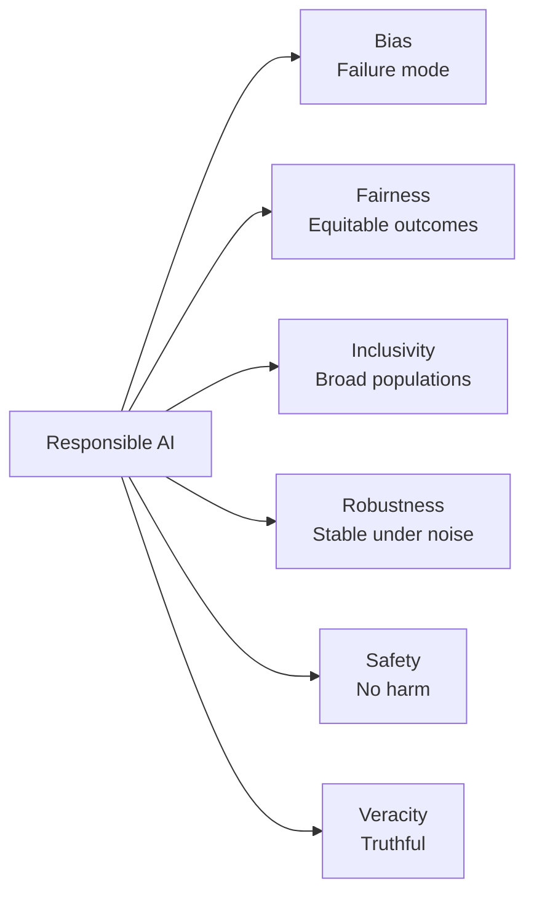
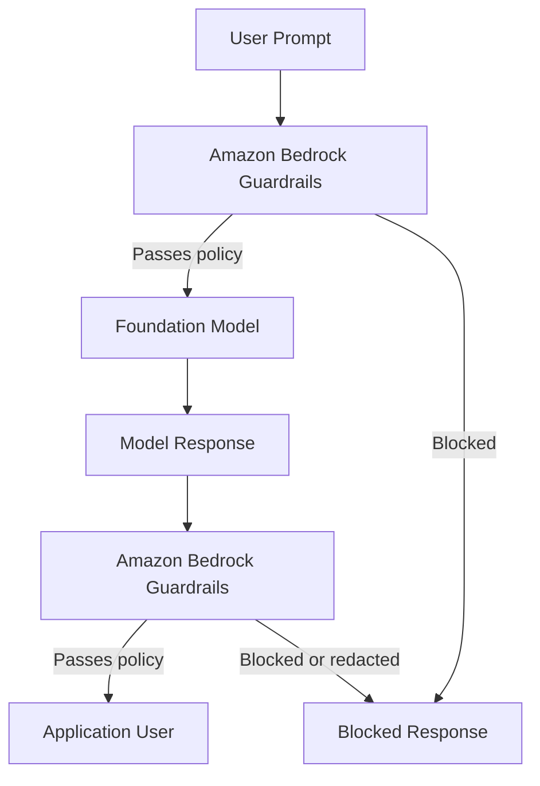
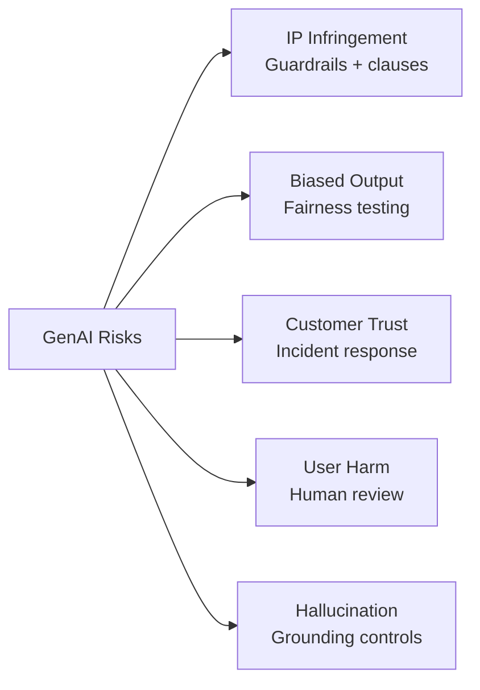
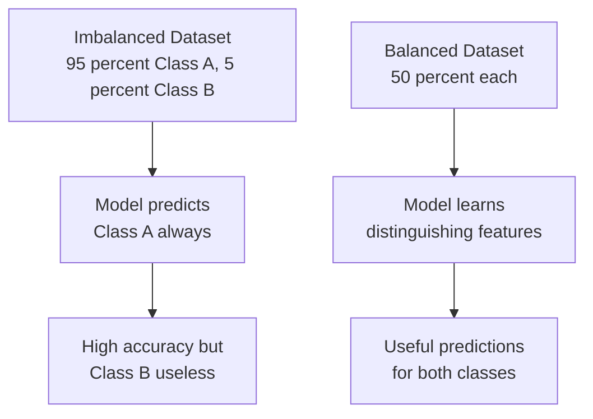
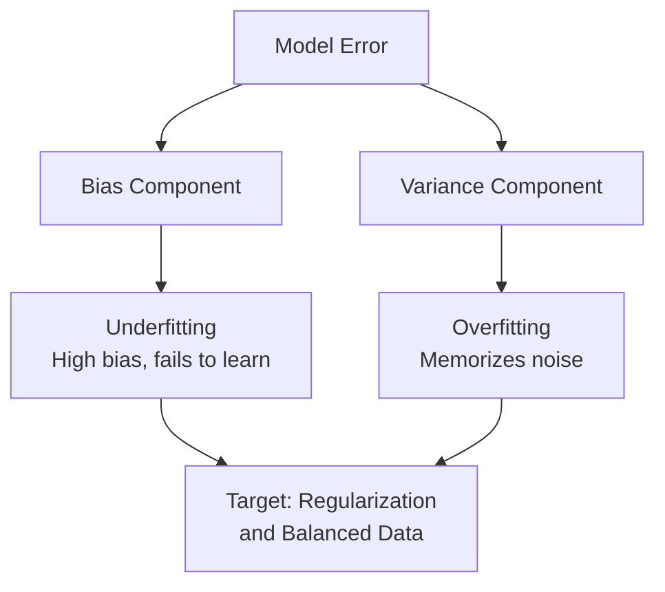

## Task Statement 4.1: Explain the development of AI systems that are responsible

Responsible AI is a set of engineering and governance commitments that determine whether an AI system produces outputs that are fair, accurate, and safe across the full range of people it will affect. This chapter covers the seven objectives in Task Statement 4.1: the defining features of responsible AI, the AWS tools that enforce and detect those features, responsible practices for model selection, the legal risks unique to generative AI, the dataset characteristics that support responsible systems, the mechanics of bias and variance, and the monitoring tools that sustain responsible behavior in production.[^401001]

### 4.1.1 Features of responsible AI

An AI system that is described as "responsible" is not responsible in the abstract. Responsibility is expressed through five concrete, testable properties (fairness, inclusivity, robustness, safety, and veracity), each defined in opposition to a specific failure mode such as bias, exclusion, brittleness, harm, or hallucination. *Bias* is the failure mode that fairness addresses, and the AIF-C01 v1.1 exam guide lists "bias" alongside the five positive properties because bias is the most commonly tested failure pattern in scenario questions; in this book we cover all six together so the failure-mode-to-property pairing is explicit.

The properties are distinct but related. A system can fail at one while passing others. A loan-decisioning model might be robust against noisy inputs yet systematically unfair to a protected demographic group. A medical-advice chatbot might be safe and inclusive yet frequently inaccurate. Exam questions test whether candidates can name and distinguish these properties, so each definition matters on its own.[^401002] The NIST AI Risk Management Framework groups these properties under what it calls "trustworthiness characteristics," and exam candidates who recognize that framing will answer scenario questions more accurately.[^401050]

The properties are:

- **Bias** (the failure mode that fairness addresses): A systematic skew in a model's predictions that consistently favors or penalizes a particular group. For example, a resume-screening model trained primarily on historical hires from a male-dominated industry may rank identical resumes lower when a female name appears at the top. Bias in this sense is not random error; it is a predictable and directional error that concentrates harm on specific populations.[^401003]
- **Fairness**: Consistent treatment of individuals across demographic groups. A lending model is fair if it applies the same decision criteria regardless of the applicant's race, gender, or age. Fairness is often measured numerically, for instance by comparing approval rates or false-positive rates between groups to ensure no group is disproportionately disadvantaged.[^401004]
- **Inclusivity**: The model works well for a broad set of users, including those who may be underrepresented in training data. An image-recognition model built primarily on photos of lighter-skinned faces may perform poorly for darker-skinned users. *Inclusivity* addresses that coverage gap by ensuring the model was trained and tested across the full population it will serve.[^401005]
- **Robustness**: Graceful, predictable behavior under unexpected or adversarial inputs. A customer-service chatbot should not return harmful content when a user submits a misspelled query, and a fraud-detection model should not collapse in accuracy when transaction volumes spike unexpectedly. Robustness measures how well a system maintains its intended behavior at the edges of its input distribution.[^401006]
- **Safety**: The model does not cause harm to users, third parties, or society. Safety covers physical risks (a model that controls machinery), informational risks (a model that provides dangerous medical advice without caveats), and systemic risks (a model that amplifies misinformation at scale). Regulators in the EU explicitly categorize AI systems by safety risk level and attach legal obligations to each category.[^401007]
- **Veracity**: The model produces outputs that are truthful and factually grounded. This is particularly important for large language models that can generate confident-sounding text on topics where the training data is thin, incomplete, or out of date. *Hallucinations* are the canonical veracity failure: a model fabricates a citation, a statistic, or a person and presents it as fact.[^401008]

*Figure 4.1.1: The exam-listed responsible AI properties. Bias is the failure mode the other five positive properties are designed to prevent.*

These properties do not exist in isolation. A dataset that lacks demographic diversity (low inclusivity at the data level) will produce biased predictions (the bias failure) and create unfair outcomes (failing the fairness property). The properties reinforce one another when met and compound failures when violated; the same dataset gap can simultaneously trigger bias, unfairness, and lack of inclusivity.[^401051]

### 4.1.2 Tools to identify features of responsible AI

Knowing the six responsible-AI properties is useful only if there are practical mechanisms to enforce them at the system level. AWS provides two primary tools for this: **Amazon Bedrock Guardrails** for generative AI applications and **Amazon SageMaker Clarify** for classical machine learning models. Each targets a different point in the AI pipeline and a different type of risk.[^401009]

**Amazon Bedrock Guardrails** applies a configurable policy layer between an application and any foundation model accessed through Amazon Bedrock. When a user sends a prompt or when the model returns a response, Guardrails evaluates the content against the configured policy and either allows it through, modifies it, or blocks it entirely. This happens transparently to the underlying model, which means the same guardrail can protect multiple models without changing the model itself.[^401010]

Guardrails groups its controls into several filter types:

- **Content filters**: Block or redact content in five predefined harm categories: *hate*, *insults*, *sexual*, *violence*, and *misconduct*. Each category can be set to a threshold from low to high depending on the sensitivity of the application. A children's education platform would set all thresholds to maximum restriction; a cybersecurity research tool might permit more technical content.[^401011]
- **Prompt-attack filter**: A separate detector for jailbreak and prompt-injection patterns in user input, distinct from the harm categories above. This is the policy that catches attempts to override the system prompt or bypass content rules.
- **Topic filters**: Deny-list topics that the application must not discuss. A financial services company might configure Guardrails to refuse any response that provides specific investment advice, routing such queries to a licensed advisor instead. The company defines what counts as a denied topic using plain-language descriptions, and Guardrails uses semantic matching to intercept related queries even when phrased differently.[^401012]
- **Word filters**: Block specific words or phrases regardless of context, including a built-in profanity list that can be enabled without custom configuration. This layer handles profanity, brand names of competitors, or internal code names that should not appear in customer-facing responses.[^401013]
- **Sensitive-information filters**: Detect personally identifiable information such as names, phone numbers, email addresses, social security numbers, and credit-card numbers. The filter can either block the request or redact the detected value with a placeholder before the response reaches the user, helping organizations meet data-minimization requirements under privacy regulations.[^401014][^401016]
- **Contextual grounding checks**: Evaluate whether a model's response is grounded in the source documents provided to it (for retrieval-augmented generation applications) and whether the response is relevant to the user's query. This is the primary veracity control in Guardrails: it assigns a grounding score and a relevance score and can block responses that fall below configurable thresholds.[^401015]

At the conceptual level, a Guardrails policy reads as a structured set of rules: "Block hate speech at the HIGH threshold. Deny topics related to investment advice. Redact any email address in responses. Require a grounding score of at least 0.75 for retrieval responses." An architect configures these rules once and attaches the guardrail to any inference call made through Bedrock.[^401053] Guardrails supports independent evaluation of both the user's input prompt and the model's output response, so a single guardrail can stop a harmful query before it reaches the model or block a harmful response before it reaches the user.[^401054]

**Amazon SageMaker Clarify** addresses bias in classical machine learning models rather than generative AI. It analyzes training data and model predictions to compute bias metrics such as the difference in positive-prediction rates between demographic groups. A credit-risk model, for instance, can be tested against Clarify to determine whether approval rates differ statistically between age brackets or geographic regions.[^401017]

*Figure 4.1.2: Amazon Bedrock Guardrails intercepts both the prompt and the model response, applying the configured policy at each direction of traffic.*

### 4.1.3 Responsible practices to select a model

Choosing a foundation model or a machine learning model is not only a technical decision about accuracy and latency. A responsible selection process accounts for the environmental cost of the model, its long-term sustainability, and whether its size matches the task at hand.

Training and running large models requires significant *compute footprint*: the electricity drawn by GPUs during training, the water used to cool the data centers that host those GPUs, and the carbon emissions associated with that energy mix. A model that achieves 95% accuracy on a classification task but requires 10 times the compute of a smaller model that achieves 93% accuracy may not be the responsible choice when those two points of accuracy do not materially affect the business outcome.[^401018]

Responsible model selection follows a hierarchy. Start with the smallest model that meets the task's accuracy threshold. If a distilled or quantized model matches the performance of its larger parent on your specific use case, prefer the smaller model. Distilled models are compressed versions of larger models that preserve much of the parent's capability at a fraction of the compute cost. They exist for many of the models available through Amazon Bedrock, and they are the right starting point for latency-sensitive or cost-constrained applications.[^401019]

When model size is comparable across candidates, consider *regional placement*. AWS regions differ in their energy mix. Regions closer to renewable energy sources (hydroelectric, wind, solar) have lower carbon intensity per compute hour. Placing a workload in a lower-carbon region is a concrete sustainability action that can be measured and reported.[^401020]

AWS provides the **AWS Customer Carbon Footprint Tool** to help organizations measure and track the carbon emissions associated with their AWS usage. The tool breaks down emissions by service, region, and time period, giving procurement and sustainability teams the data they need to set targets and track progress.[^401021]

The responsible-model-selection decision can be summarized as a set of criteria applied in order: Does the smaller model meet the accuracy threshold? Can a distilled version do the same work? Is the deployment region low-carbon? Are there model-card disclosures from the provider about training data, environmental cost, and intended use? Answering those questions before committing to a model is the responsible practice the exam expects candidates to describe.[^401055]

*Table 4.1.1: Responsible model selection criteria*

| Criterion | Question to answer | Preferred outcome |
|-----------|-------------------|------------------|
| Accuracy threshold | Does the model meet the minimum required accuracy? | Smallest model that passes |
| Compute cost | What GPU-hours and energy does inference require? | Lowest compute that meets SLA |
| Model size | Is a distilled or quantized version available? | Use distilled when available |
| Regional carbon intensity | Is the region's energy mix low-carbon? | Deploy in low-carbon region |
| Transparency | Does the provider publish a model card? | Model card exists and is current |

### 4.1.4 Legal risks of working with generative AI

Generative AI introduces a category of legal risk that did not exist with traditional machine learning because the model produces novel content rather than predictions derived from structured inputs. Legal teams examining generative AI deployments typically raise five areas of concern, and a business professional responsible for AI oversight should be able to describe each.

**Intellectual property infringement claims** arise because large language models and image models are trained on vast corpora of text and images collected from the internet. Much of that content is copyrighted. When a model generates text that closely reproduces copyrighted material, or when an image model generates artwork in the style of a living artist, the originator of the source material may have a claim against the organization operating the model. Several lawsuits in the United States and Europe have already been filed on precisely this theory.[^401022] Many commercial foundation model providers include *indemnification clauses* in their licenses that shift the IP liability from the customer back to the provider, but those clauses often require the customer to use the model only within defined parameters and without modifications that override safety controls.[^401023]

**Biased model outputs** create legal exposure under employment and civil-rights law. If a model used in hiring, lending, housing, or healthcare produces outputs that systematically disadvantage a protected class, the organization deploying the model may face claims under the Equal Employment Opportunity Commission (EEOC) framework in the United States or equivalent bodies in other jurisdictions. The EU AI Act classifies AI systems used in employment and credit as *high-risk* applications that must undergo conformity assessments before deployment.[^401024]

**Loss of customer trust** is a legal and reputational risk that is harder to quantify but no less real. When a widely publicized AI failure occurs, such as a customer-service chatbot that provides offensive responses or a medical-advice tool that suggests harmful treatments, the organization loses customer confidence. In regulated industries that trust often carries contractual and regulatory dimensions, compounding the reputational damage with potential regulatory action.[^401025]

**End-user risk** is the risk that a user acts on model output in a domain where errors have serious consequences. A legal services chatbot that provides incorrect advice, a medical triage assistant that misclassifies a symptom, or a financial planning tool that recommends unsuitable products each exposes the deploying organization to professional-liability and negligence claims. Organizations mitigate this by ensuring that high-stakes domains include human review in the decision loop and by displaying clear disclaimers about the advisory nature of the AI output.[^401026]

**Hallucinations** are a veracity failure with direct legal consequences. When a model asserts a fabricated fact with confidence, a user who acts on that assertion may suffer harm. An attorney who submitted a legal brief containing AI-fabricated case citations received court sanctions when the citations proved non-existent. Organizations deploying generative AI in legal, financial, or medical contexts must implement grounding controls (as described in Section 4.1.2) and document those controls as evidence of due diligence.[^401027]

The EU AI Act, which entered into force in August 2024, imposes fines of up to 35 million euros or 7% of global annual turnover (whichever is higher) for violations of its prohibited-practices provisions, and up to 15 million euros or 3% of turnover for other infringements.[^401028] These penalty levels mean that a single unmitigated responsible-AI failure in an EU-regulated context can exceed the total development cost of the AI system itself.

*Figure 4.1.3: The five legal risk categories of generative AI and their primary mitigations. Each risk requires a different control strategy.*

### 4.1.5 Characteristics of datasets

The properties of the dataset used to train or fine-tune a model determine, to a large degree, the responsible-AI properties of the resulting system. A model cannot learn to treat demographic groups fairly if the training data contains no examples from some of those groups. Dataset characteristics are therefore upstream controls: getting them right prevents problems that are expensive to remediate after the model is trained.

Four dataset characteristics appear directly in the exam objectives:

- **Inclusivity**: The dataset contains examples from the full range of demographic groups, languages, dialects, and scenarios that the model will encounter in production. An inclusivity failure is when a speech-recognition model is trained primarily on American English speakers and then deployed globally, producing high error rates for non-native speakers and regional accents.[^401029]
- **Diversity**: Beyond demographic coverage, the dataset covers varied scenarios, edge cases, and rare events. A fraud-detection model trained only on common fraud patterns will miss novel attack methods. Diversity in this context means the training distribution is wide enough to capture the variability of the real world, not just its most frequent patterns.[^401030]
- **Curated data sources**: The data has known provenance, has been collected with appropriate consent, and has a clear licensing status. Curated data is traceable: you can answer the question "Where did this record come from and do we have the right to use it?" For generative AI, curation also means screening training content for toxic, biased, or copyrighted material before it enters the model.[^401031]
- **Balanced datasets**: No class label or demographic group is so overrepresented that the model learns to predict that class as a shortcut rather than learning the underlying signal. An unbalanced dataset for fraud detection might contain 999 legitimate transactions for every 1 fraudulent transaction. A model trained on that data can achieve 99.9% accuracy simply by predicting "legitimate" for everything, while completely failing at its actual task.[^401032]

*Figure 4.1.4: The effect of class imbalance on model learning. An imbalanced dataset produces a model that maximizes overall accuracy at the expense of minority-class performance.*

Curated data sources and balanced datasets are not mutually exclusive requirements. A balanced dataset assembled from poorly sourced or unconsented data still carries IP and privacy risk. A well-curated dataset that covers only a narrow demographic still produces an exclusive model. All four characteristics must be present together for a dataset to be considered responsible.[^401057] The EU AI Act requires that training datasets for high-risk AI systems be subject to data governance practices covering collection purpose, processing operations, and compliance with data-protection law.[^401058]

*Table 4.1.2: Dataset characteristics and the responsible-AI failures they prevent*

| Dataset characteristic | Failure it prevents | Example |
|-----------------------|--------------------|---------| 
| Inclusivity | Models that fail for underrepresented populations | Speech recognition that errors on non-native speakers |
| Diversity | Brittleness to edge cases and novel inputs | Fraud model that misses new attack patterns |
| Curated data sources | IP, privacy, and toxic-content violations | Training data scraped without consent or screening |
| Balanced datasets | Accuracy that masks minority-class failure | Fraud model that never predicts fraud |

### 4.1.6 Effects of bias and variance

Bias and variance are the two fundamental sources of error in machine learning models. They exist in tension: reducing one tends to increase the other. Understanding how each manifests, and what downstream effects each produces, is essential background for responsible AI because both have consequences for fairness and accuracy.

**Bias** in the statistical sense is systematic error: the model is consistently wrong in the same direction. A biased model has learned a pattern that does not match reality, either because the training data was unrepresentative, the model architecture was too simple to capture the true relationship, or both. The error is not random; it is reproducible. If you run the same input through the model a hundred times, you get the same wrong answer each time.[^401033]

**Variance** is sensitivity to small changes in input. A high-variance model has essentially memorized the training data and responds unpredictably when it encounters inputs that differ even slightly from what it saw during training. The error is not systematic; it is erratic. Two very similar inputs may produce very different outputs, which makes the model unreliable in production even if it performed well on the training set.[^401034]

The two classic failure modes that combine bias and variance are *overfitting* and *underfitting*:

- **Overfitting** occurs when a model has low bias but high variance. The model fits the training data very precisely, including its noise and anomalies, so its training-set accuracy is high. When new data arrives, the model has no generalizable pattern to apply and performs poorly. An overfitted fraud model memorizes the exact transaction amounts and merchants associated with historical fraud cases but fails on any fraud that uses different amounts or merchants.[^401035]
- **Underfitting** occurs when a model has high bias and low variance. The model has not learned the training data well enough to capture the real signal, so it performs poorly on both the training set and new data. An underfitted model for churn prediction might learn only that customers who have never logged in are at risk of churning, missing every other pattern that predicts churn.[^401036]

The effects of bias and variance on demographic groups are where these technical properties intersect with responsible AI. A model with systematic bias will produce consistent errors for groups that were underrepresented or misrepresented in the training data. Those consistent errors become *disparate impact*: the model's failures are not evenly distributed across the population but are concentrated on specific groups. A credit-scoring model with high bias may consistently underestimate the creditworthiness of applicants from a particular region, not because those applicants are riskier, but because the training data contained fewer examples of creditworthy individuals from that region.[^401037]

*Table 4.1.3: Bias and variance: causes, failure modes, and demographic effects*

| Property | Definition | Classic failure mode | Demographic effect |
|----------|-----------|---------------------|--------------------|
| High bias | Systematic, directional error | Underfitting | Consistent errors for underrepresented groups |
| High variance | Sensitivity to small input changes | Overfitting | Unpredictable errors; inconsistent treatment |
| Low bias, low variance | Target state | Neither | Consistent, fair predictions |
| Low bias, high variance | Overfitting state | Overfitting | Accurate on training distribution, fails on others |
| High bias, low variance | Underfitting state | Underfitting | Systematically wrong across all groups |

*Figure 4.1.5: The bias-variance trade-off and its responsible-AI consequences. Both high bias and high variance produce failures that can concentrate harm on specific demographic groups.*

A well-tuned model minimizes both bias and variance simultaneously, which requires enough high-quality, representative training data and an architecture that is complex enough to capture the signal but not so complex that it memorizes noise. The techniques for achieving this balance (regularization, cross-validation, data augmentation) are covered in the machine-learning lifecycle material in Domain 1; the responsible-AI significance is that those techniques are also bias-mitigation tools.[^401059] SageMaker Clarify can quantify the contribution of each technique by comparing bias metrics before and after their application, giving teams evidence that mitigation efforts produced measurable results.[^401060]

### 4.1.7 Tools to detect and monitor bias, trustworthiness, and truthfulness

Building responsible properties into a dataset and a model at training time is necessary but not sufficient. Models can degrade in production as the world changes, as user populations shift, and as adversarial actors probe for weaknesses. A responsible AI program requires ongoing monitoring to detect when a deployed model has drifted from its intended behavior.

AWS provides a set of tools specifically designed to detect and monitor bias, trustworthiness, and truthfulness across the model lifecycle. The exam expects candidates to know what each tool does and when to apply it.

**Analyzing label quality** is a foundational detection practice that does not require a specific tool. It involves examining the training dataset's labels for patterns of inconsistency or systematic error. If a labeling team consistently assigned "positive" to certain demographic groups at higher rates than the underlying data justified, the label quality is biased and will produce a biased model. Label-quality analysis looks for inter-rater disagreement (two labelers assigning different labels to the same example), class-specific error rates, and temporal drift in how labels were assigned across different labeling sessions.[^401038]

**Human audits** apply expert judgment to samples of model outputs. Rather than automated metrics alone, a human auditor reviews a representative sample of predictions and evaluates them for accuracy, fairness, and appropriateness. Human audits catch failure modes that automated metrics may not be designed to detect, such as subtly offensive language that passes content filters or reasoning errors in complex analytical questions. They are expensive and do not scale to 100% of outputs, but they are the most reliable quality signal available for many high-stakes applications.[^401039]

**Subgroup analysis** measures model performance metrics separately for each relevant demographic group rather than across the overall population. An overall accuracy of 92% can mask an accuracy of 98% for the majority group and 71% for a minority group. Subgroup analysis makes those disparities visible by computing precision, recall, false-positive rate, and false-negative rate per subgroup and comparing the results against an acceptable-disparity threshold defined in the responsible-AI policy.[^401040]

**Amazon SageMaker Clarify** automates bias detection and model explainability for classical machine learning models. At training time, Clarify computes pre-training bias metrics that identify whether the training data is skewed, and post-training bias metrics that measure whether the trained model treats groups differently even when given identical inputs. In production, Clarify can be integrated with SageMaker Model Monitor to continuously recompute those bias metrics as new inference data accumulates.[^401041]

**Amazon SageMaker Model Monitor** watches a deployed model endpoint in production and raises alerts when the incoming data or the model's output distribution diverges from the baseline established at deployment. It tracks four types of drift:

- *Data quality drift*: Changes in the statistical distribution of input features. If a loan-application model was trained on data where 30% of applicants had college degrees and the live traffic now shows 60% college-degree holders, the input distribution has shifted and the model's training may no longer be representative.
- *Model quality drift*: Decline in the model's accuracy or other performance metrics as measured against ground-truth labels received after inference.
- *Bias drift*: Changes in the bias metrics computed by SageMaker Clarify, indicating that the model is becoming more or less biased over time as the real-world distribution shifts.
- *Feature attribution drift*: Changes in which input features the model is relying on most heavily to make predictions, detected by comparing SHAP (SHapley Additive exPlanations) values over time.[^401042]

**Amazon Augmented AI (Amazon A2I)** integrates human review into the inference pipeline for low-confidence predictions. When a model's confidence score falls below a developer-defined threshold, A2I routes the prediction to a human reviewer before the output reaches the end user. A2I integrates declaratively with services such as Amazon Textract and Amazon Rekognition; for custom SageMaker models, the application code calls A2I to start a human-review loop when the developer-defined trigger condition is met. Reviewers see the input, the model's prediction, and the confidence score, and they provide a corrected label if the model was wrong. Those corrected labels can feed back into a retraining pipeline.[^401043]

*Table 4.1.4: AWS tools for detecting and monitoring responsible-AI properties*

| Tool | What it detects | When to use |
|------|----------------|-------------|
| SageMaker Clarify (training) | Pre-training and post-training bias in datasets and models | Before deployment, when evaluating model fairness |
| SageMaker Clarify (production) | Ongoing bias metrics as inference data accumulates | After deployment, integrated with Model Monitor |
| SageMaker Model Monitor | Data drift, model quality drift, bias drift, feature attribution drift | Continuously in production |
| Amazon A2I | Low-confidence predictions requiring human review | For high-stakes decisions where model uncertainty is unacceptable |
| Label quality analysis | Systematic errors in training labels | During dataset preparation and periodic audits |
| Human audits | Qualitative failures not captured by automated metrics | Periodically, especially in high-stakes domains |
| Subgroup analysis | Metric disparities between demographic groups | Before deployment and periodically in production |

Together, these tools create a closed loop for responsible AI. Clarify identifies bias before deployment. Model Monitor detects drift after deployment. A2I catches low-confidence predictions at inference time. Human audits provide a qualitative check that automated tools cannot replace. The exam expects candidates to match each tool to its purpose and to describe the monitoring pattern, not to configure the tools at a technical level.[^401044] Amazon SageMaker also provides Model Cards, which document model purpose, evaluation results, and intended use cases, giving audit teams a written record of the responsible-AI decisions made during development.[^401061] For generative AI applications in Amazon Bedrock, the Bedrock Model Evaluation feature allows teams to benchmark foundation models against custom criteria including safety, coherence, and relevance before committing to production deployment.[^401062]

---

**What this section covered:** This chapter explained the six features of responsible AI (bias, fairness, inclusivity, robustness, safety, veracity), the AWS tools that enforce and detect those features (Amazon Bedrock Guardrails, Amazon SageMaker Clarify, SageMaker Model Monitor, Amazon A2I), the legal risks specific to generative AI deployment, the dataset characteristics that support responsible systems, and the mechanics of bias and variance and their effects on demographic groups. The next chapter (Task Statement 4.2) covers transparency and explainability: how to distinguish opaque models from transparent ones, which AWS tools document model behavior, and how human-centered design principles apply to explainable AI.

---

## Self-check questions

**Question 1**

A company's customer-service chatbot uses a large language model accessed through Amazon Bedrock. The legal team requires that the chatbot never discuss competitor products and that it redact customer email addresses from all responses. Which Amazon Bedrock Guardrails control types BEST address these two requirements?

A. Content filters set to HIGH for the violence category, and word filters listing competitor product names  
B. Topic filters configured to deny competitor-product discussions, and sensitive-information filters for email-address redaction  
C. Contextual grounding checks with a relevance threshold of 0.9, and profanity filters  
D. Sensitive-information filters for competitor product names, and content filters for PII  

Topic filters allow an organization to define categories of subjects the model must not discuss, using plain-language descriptions that Guardrails matches semantically, which directly addresses the requirement to block competitor-product discussions. Sensitive-information filters detect and redact specific PII types including email addresses from model responses. Content filters address harm categories (hate, violence, etc.) and would not restrict competitor mentions. Word filters block specific strings literally and would not reliably intercept all phrasings of competitor product discussions. Contextual grounding checks evaluate whether responses are factually grounded in source documents, which is unrelated to either requirement. Option B is the correct pairing of controls to requirements.[^401045]

**Question 2**

A machine learning team has trained a fraud-detection model. The overall test-set accuracy is 99.2%, but the fraud-recall rate (the percentage of actual fraud cases correctly identified) is 8%. Which dataset characteristic MOST likely explains this result?

A. The dataset lacks curated data sources with clear provenance  
B. The dataset is not diverse enough to cover edge-case fraud patterns  
C. The dataset is severely imbalanced, with far more legitimate transactions than fraudulent ones  
D. The dataset lacks inclusivity across geographic regions  

A recall rate of 8% for the minority class while overall accuracy is 99.2% is the textbook outcome of training on a severely imbalanced dataset. When legitimate transactions vastly outnumber fraudulent ones, a model can achieve very high overall accuracy by predicting "legitimate" for nearly every case. The 99.2% accuracy figure reflects the high prevalence of the majority class, not genuine predictive skill. Lack of data provenance or curation affects IP and privacy risk but does not produce this accuracy-recall pattern. Diversity addresses coverage of novel fraud patterns but would not produce a recall rate as low as 8% on all fraud. Inclusivity across geographies affects fairness but not the fundamental class-imbalance dynamic. Option C is the correct answer.[^401046]

**Question 3**

A company is selecting a foundation model for an internal HR policy-question application. Two candidate models achieve comparable accuracy on a benchmark relevant to the task. The sustainability team has asked that environmental impact be minimized. Which action BEST reflects the responsible-model-selection practice described by AWS?

A. Select the larger model because it has lower per-query latency at scale  
B. Select the model hosted in the AWS region closest to the company's headquarters  
C. Select the smaller or distilled model and deploy it in a region with lower carbon intensity  
D. Select the model with the highest number of parameters because more parameters indicate higher quality  

Responsible model selection begins by identifying the smallest model that meets the accuracy threshold. When two models achieve comparable accuracy, the smaller one requires less compute per inference and therefore has a lower energy and carbon footprint. Choosing the deployment region by carbon intensity rather than geographic proximity further reduces environmental impact. Larger models have higher parameter counts but that does not mean higher quality on a specific task; benchmark performance on the relevant task is what matters. Per-query latency is not an environmental metric. Option C is the correct answer.[^401047]

**Question 4**

A healthcare organization uses an AI model to assist nurses in triaging patients. The model's overall accuracy across the full patient population is 94%. A subgroup analysis reveals that the model's accuracy for patients over age 75 is 61%. Which responsible-AI property is MOST directly violated, and which monitoring approach would detect this ongoing?

A. Robustness; SageMaker Model Monitor tracking data quality drift  
B. Fairness; subgroup analysis integrated with SageMaker Clarify in production  
C. Veracity; Amazon A2I routing all elderly-patient predictions for human review  
D. Inclusivity; label quality analysis of training data labels for elderly patients  

When a model performs significantly worse for a specific demographic group (age 75 and older) compared to the overall population, the fairness property is violated: the model is not providing consistent quality of service across demographic groups. The appropriate ongoing monitoring mechanism is subgroup analysis using SageMaker Clarify bias metrics, scheduled through SageMaker Model Monitor's bias-drift monitor to recompute on each batch of incoming data and alert when the per-group accuracy gap exceeds the threshold defined in the responsible-AI policy. Robustness covers adversarial or noisy inputs, not demographic performance gaps. Veracity covers factual accuracy of assertions, not classification accuracy. Inclusivity at the dataset level is a contributing cause but the property violated in the deployed model's output is fairness. Option B is the correct answer.[^401048]

**Question 5**

A generative AI application used by a legal services firm produces a brief that cites three court cases. A subsequent review finds that two of the cited cases do not exist. Which legal risk does this represent, and which Amazon Bedrock Guardrails feature is MOST directly designed to mitigate it?

A. Intellectual property infringement; topic filters blocking discussion of specific legal topics  
B. End-user risk from biased outputs; content filters set to HIGH for misconduct  
C. Hallucination; contextual grounding checks requiring a minimum grounding score  
D. Loss of customer trust; word filters blocking fabricated case-name patterns  

The scenario describes a hallucination: the model generated non-existent court citations and presented them as real. This is the canonical veracity failure in generative AI. Amazon Bedrock Guardrails contextual grounding checks evaluate whether model responses are grounded in the source documents provided to the model (the retrieval-augmented context), assigning a grounding score. For a legal application using verified legal databases as source documents, a grounding check would detect that the fabricated citations do not appear in the source material and block or flag the response. Intellectual property infringement relates to reproduction of copyrighted content, not fabrication. Content filters address harm categories unrelated to citation fabrication. Word filters operate on literal strings and cannot detect structurally plausible but non-existent case names. Option C is the correct answer.[^401049]

---

[^401001]: AWS Certification: AIF-C01 Exam Guide v1.1, Domain 4. URL: <https://docs.aws.amazon.com/aws-certification/latest/ai-practitioner-01/ai-practitioner-01-domain4.html>
[^401002]: NIST AI Risk Management Framework (AI RMF 1.0). URL: <https://airc.nist.gov/Home>
[^401003]: Amazon Machine Learning: Fairness and Bias in Machine Learning. URL: <https://docs.aws.amazon.com/machine-learning/latest/dg/model-fit-underfitting-vs-overfitting.html>
[^401004]: Mehrabi, N. et al., A Survey on Bias and Fairness in Machine Learning, ACM Computing Surveys 54(6), 2022. URL: <https://dl.acm.org/doi/10.1145/3457607>
[^401005]: Microsoft Research: Fairness and Inclusivity in AI Systems. URL: <https://www.microsoft.com/en-us/research/group/fate/>
[^401006]: NIST AI 100-2: Adversarial Machine Learning: A Taxonomy and Terminology of Attacks and Mitigations. URL: <https://airc.nist.gov/Publications/1>
[^401007]: EU AI Act, Regulation (EU) 2024/1689, Title I, Article 3 (Definitions of Safety). URL: <https://eur-lex.europa.eu/legal-content/EN/TXT/?uri=CELEX:32024R1689>
[^401008]: Maynez, J. et al., On Faithfulness and Factuality in Abstractive Summarization, ACL 2020. URL: <https://aclanthology.org/2020.acl-main.173/>
[^401009]: Amazon Bedrock Guardrails Documentation: Overview. URL: <https://docs.aws.amazon.com/bedrock/latest/userguide/guardrails.html>
[^401010]: Amazon Bedrock Guardrails: How Guardrails Work. URL: <https://docs.aws.amazon.com/bedrock/latest/userguide/guardrails-how-it-works.html>
[^401011]: Amazon Bedrock Guardrails: Content Filters. URL: <https://docs.aws.amazon.com/bedrock/latest/userguide/guardrails-content-filters.html>
[^401012]: Amazon Bedrock Guardrails: Denied Topics. URL: <https://docs.aws.amazon.com/bedrock/latest/userguide/guardrails-topic-policy.html>
[^401013]: Amazon Bedrock Guardrails: Word Filters. URL: <https://docs.aws.amazon.com/bedrock/latest/userguide/guardrails-word-policy.html>
[^401014]: Amazon Bedrock Guardrails: Sensitive Information Filters. URL: <https://docs.aws.amazon.com/bedrock/latest/userguide/guardrails-sensitive-info.html>
[^401015]: Amazon Bedrock Guardrails: Contextual Grounding Checks. URL: <https://docs.aws.amazon.com/bedrock/latest/userguide/guardrails-grounding.html>
[^401016]: Amazon Bedrock Guardrails: PII Redaction Configuration. URL: <https://docs.aws.amazon.com/bedrock/latest/userguide/guardrails-sensitive-info.html>
[^401017]: Amazon SageMaker Clarify: Fairness and Explainability Overview. URL: <https://docs.aws.amazon.com/sagemaker/latest/dg/clarify-fairness-and-explainability.html>
[^401018]: AWS Sustainability: The Carbon Footprint of AI Workloads. URL: <https://sustainability.aboutamazon.com/environment/the-cloud>
[^401019]: Amazon Bedrock: Model Distillation Overview. URL: <https://docs.aws.amazon.com/bedrock/latest/userguide/model-distillation.html>
[^401020]: AWS Global Infrastructure: Sustainability by Region. URL: <https://aws.amazon.com/about-aws/global-infrastructure/>
[^401021]: AWS Customer Carbon Footprint Tool Documentation. URL: <https://docs.aws.amazon.com/awsaccountbilling/latest/aboutv2/ccft-overview.html>
[^401022]: Andersen v. Stability AI Ltd., Case No. 23-CV-00201 (N.D. Cal. 2023). URL: <https://www.courtlistener.com/docket/66732129/andersen-v-stability-ai-ltd/>
[^401023]: Amazon Bedrock: Intellectual Property Indemnification. URL: <https://aws.amazon.com/bedrock/faqs/>
[^401024]: EU AI Act, Annex III: High-Risk AI Systems. URL: <https://eur-lex.europa.eu/legal-content/EN/TXT/?uri=CELEX:32024R1689>
[^401025]: McKinsey Global Institute: The State of AI in 2024. URL: <https://www.mckinsey.com/capabilities/quantumblack/our-insights/the-state-of-ai>
[^401026]: FTC: Guidance on AI and Consumer Protection. URL: <https://www.ftc.gov/business-guidance/blog/2023/02/keep-your-ai-claims-in-check>
[^401027]: Matter of Park v. Kim, New York State Court of Appeals, 2024 (attorney sanctioned for AI-fabricated citations). URL: <https://casetext.com/case/park-v-kim-24>
[^401028]: EU AI Act, Article 99: Penalties. URL: <https://eur-lex.europa.eu/legal-content/EN/TXT/?uri=CELEX:32024R1689>
[^401029]: Tatman, R., Gender and Dialect Bias in YouTube's Automatic Captions, ACL Workshop on Ethics in NLP, 2017. URL: <https://aclanthology.org/W17-1606/>
[^401030]: Breck, E. et al., The ML Test Score: A Rubric for ML Production Readiness, IEEE Big Data 2017. URL: <https://research.google/pubs/the-ml-test-score-a-rubric-for-ml-production-readiness-and-technical-debt-reduction/>
[^401031]: AWS Data Exchange: Data Licensing and Provenance. URL: <https://docs.aws.amazon.com/data-exchange/latest/userguide/what-is.html>
[^401032]: He, H. and Garcia, E.A., Learning from Imbalanced Data, IEEE Transactions on Knowledge and Data Engineering 21(9), 2009. URL: <https://ieeexplore.ieee.org/document/5128907>
[^401033]: Hastie, T., Tibshirani, R., and Friedman, J., The Elements of Statistical Learning, 2nd ed., Springer, 2009. URL: <https://hastie.su.domains/ElemStatLearn/>
[^401034]: Amazon SageMaker Developer Guide: Model Fit: Underfitting versus Overfitting. URL: <https://docs.aws.amazon.com/sagemaker/latest/dg/model-fit-underfitting-vs-overfitting.html>
[^401035]: Chollet, F., Deep Learning with Python, Manning Publications, 2021. Chapter 5: Generalization.
[^401036]: AWS Machine Learning Blog: Techniques for Addressing Underfitting and Overfitting. URL: <https://aws.amazon.com/blogs/machine-learning/>
[^401037]: Barocas, S., Hardt, M., and Narayanan, A., Fairness and Machine Learning: Limitations and Opportunities, MIT Press, 2023. URL: <https://fairmlbook.org/>
[^401038]: Northcutt, C., Athalye, A., and Mueller, J., Pervasive Label Errors in Test Sets Destabilize Machine Learning Benchmarks, NeurIPS 2021. URL: <https://arxiv.org/abs/2103.14749>
[^401039]: Partnership on AI: AI Incident Database. URL: <https://incidentdatabase.ai/>
[^401040]: Amazon SageMaker Clarify: Measure Pre-training Bias. URL: <https://docs.aws.amazon.com/sagemaker/latest/dg/clarify-measure-data-bias.html>
[^401041]: Amazon SageMaker Clarify: Detect Post-training Data and Model Bias. URL: <https://docs.aws.amazon.com/sagemaker/latest/dg/clarify-detect-post-training-bias.html>
[^401042]: Amazon SageMaker Model Monitor: Monitor Data and Model Quality. URL: <https://docs.aws.amazon.com/sagemaker/latest/dg/model-monitor.html>
[^401043]: Amazon Augmented AI (A2I): Overview of Human Review Workflows. URL: <https://docs.aws.amazon.com/sagemaker/latest/dg/a2i-use-augmented-ai-a2i-human-review-loops.html>
[^401044]: AWS Well-Architected Framework: Machine Learning Lens, Responsible AI Pillar. URL: <https://docs.aws.amazon.com/wellarchitected/latest/machine-learning-lens/welcome.html>
[^401045]: Amazon Bedrock Guardrails: Create a Guardrail (Combining Policy Types). URL: <https://docs.aws.amazon.com/bedrock/latest/userguide/guardrails-create.html>
[^401046]: Amazon SageMaker Clarify: Class Imbalance Metric. URL: <https://docs.aws.amazon.com/sagemaker/latest/dg/clarify-bias-metric-class-imbalance.html>
[^401047]: AWS Sustainability: AWS Customer Carbon Footprint Tool. URL: <https://docs.aws.amazon.com/awsaccountbilling/latest/aboutv2/ccft-overview.html>
[^401048]: Amazon SageMaker Clarify: Monitor Bias Drift for Models in Production. URL: <https://docs.aws.amazon.com/sagemaker/latest/dg/clarify-model-monitor-bias-drift.html>
[^401049]: Amazon Bedrock Guardrails: Contextual Grounding Check Configuration. URL: <https://docs.aws.amazon.com/bedrock/latest/userguide/guardrails-grounding.html>
[^401050]: NIST AI RMF 1.0: Trustworthy AI Characteristics. URL: <https://airc.nist.gov/Docs/1>
[^401051]: AWS Responsible AI: Overview of Responsible AI Principles. URL: <https://aws.amazon.com/ai/responsible-ai/>
[^401053]: Amazon Bedrock Guardrails: Apply Guardrails to an Inference Request. URL: <https://docs.aws.amazon.com/bedrock/latest/userguide/guardrails-apply.html>
[^401054]: Amazon Bedrock Guardrails: Guardrail Components and Evaluation Order. URL: <https://docs.aws.amazon.com/bedrock/latest/userguide/guardrails-components.html>
[^401055]: Amazon Bedrock: Choosing a Foundation Model. URL: <https://docs.aws.amazon.com/bedrock/latest/userguide/model-evaluation.html>
[^401057]: ISO/IEC 42001:2023, AI Management Systems Standard, Clause 8.4: Data for AI Systems. URL: <https://www.iso.org/standard/81230.html>
[^401058]: EU AI Act, Article 10: Data and Data Governance for High-Risk AI Systems. URL: <https://eur-lex.europa.eu/legal-content/EN/TXT/?uri=CELEX:32024R1689>
[^401059]: Amazon SageMaker Developer Guide: Improve Model Accuracy. URL: <https://docs.aws.amazon.com/sagemaker/latest/dg/best-practice-model-accuracy.html>
[^401060]: Amazon SageMaker Clarify: Bias Metrics Reference. URL: <https://docs.aws.amazon.com/sagemaker/latest/dg/clarify-measure-data-bias.html>
[^401061]: Amazon SageMaker Model Cards Documentation. URL: <https://docs.aws.amazon.com/sagemaker/latest/dg/model-cards.html>
[^401062]: Amazon Bedrock Model Evaluation Documentation. URL: <https://docs.aws.amazon.com/bedrock/latest/userguide/model-evaluation.html>
