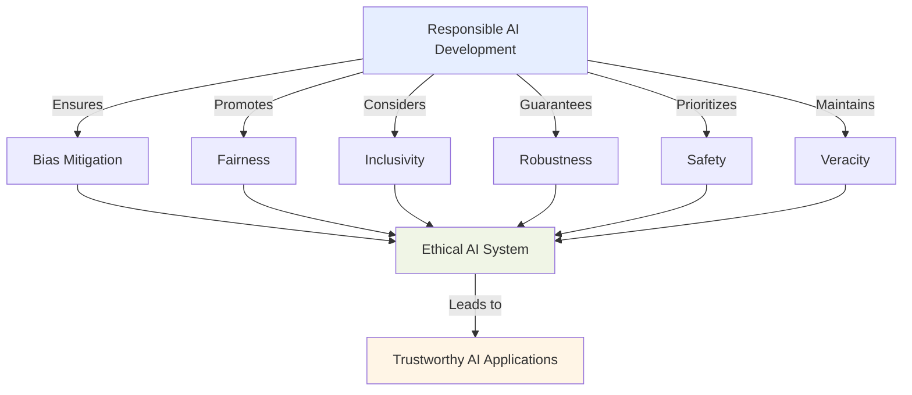
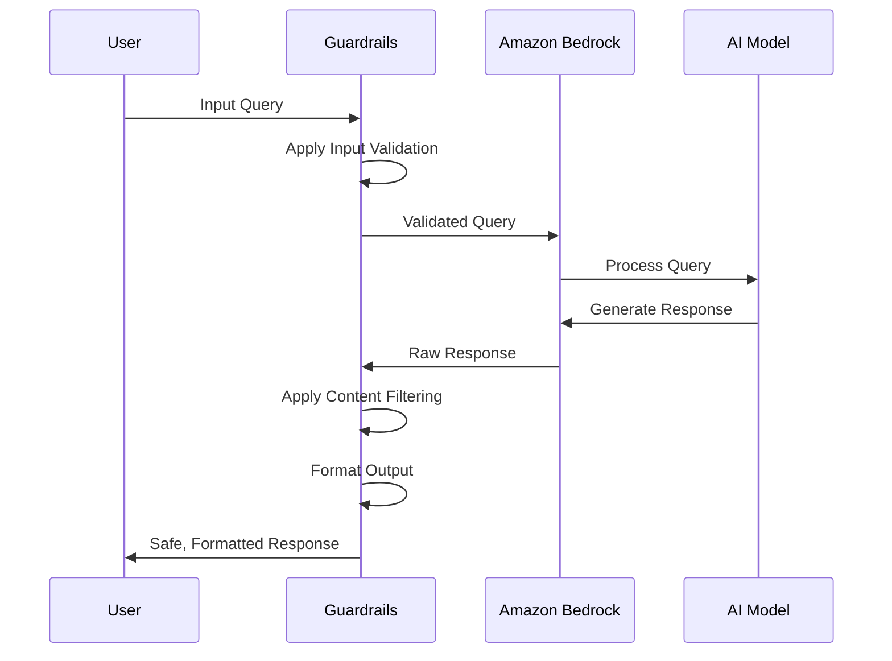
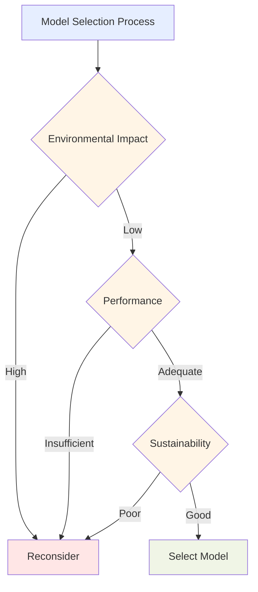
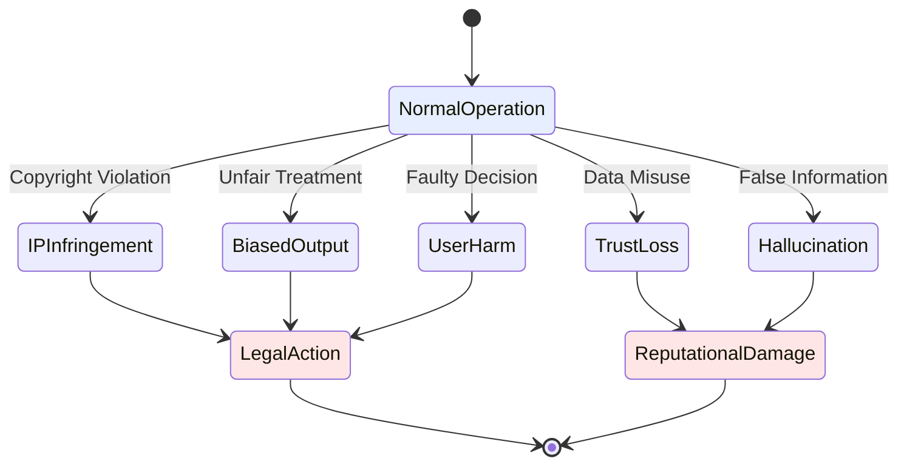
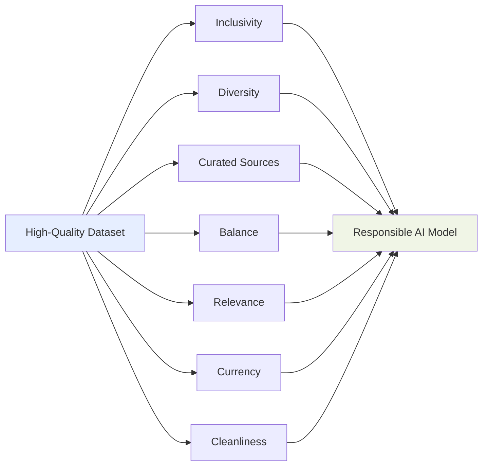
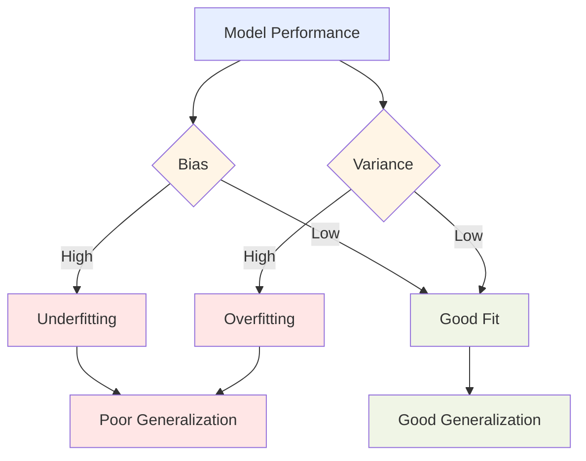

## 4.1 Responsible_AI_Systems

Responsible AI development has become a strategic imperative for organizations across all sectors. AI technologies continue to transform industries, requiring business professionals to understand the principles and practices that ensure these powerful tools are deployed ethically, safely, and in alignment with societal values. Responsible AI is not just a moral obligation; it's a **strategic necessity** that enhances brand reputation, mitigates risks, and fosters trust among stakeholders.[^1100] For business leaders preparing for the AWS Certified AI Practitioner exam, understanding responsible AI development enables informed decision-making about AI implementation, helps navigate potential pitfalls, and leverages AI's full potential while maintaining ethical integrity.

### Identifying Features of Responsible AI

Responsible AI systems incorporate several critical features that ensure ethical, fair, and beneficial development and deployment. These features build trust in AI technologies while mitigating potential risks associated with their use.

1. **Bias**: Responsible AI systems minimize bias in decision-making processes by carefully examining training data, algorithms, and outputs to prevent unfair discrimination against certain groups or perpetuation of existing societal biases.[^1101]

2. **Fairness**: AI systems should treat all individuals and groups equitably, providing equal opportunities and outcomes regardless of personal characteristics such as race, gender, or socioeconomic status.

3. **Inclusivity**: Responsible AI development considers diverse perspectives and ensures AI systems are accessible and beneficial to a wide range of users, including those with disabilities or from underrepresented communities.

4. **Robustness**: AI systems must perform consistently across various scenarios, including edge cases and unexpected inputs, requiring thorough testing and validation processes.

5. **Safety**: Ensuring AI system safety is paramount, particularly in critical applications such as healthcare or autonomous vehicles. This includes implementing safeguards against potential harm and considering long-term consequences.

6. **Veracity**: AI systems should provide accurate and truthful information, with mechanisms to detect and mitigate false or misleading outputs, especially in generative AI applications.[^1102]

To illustrate the interplay of these features in responsible AI development, consider the following diagram:

In practice, implementing these features requires a multifaceted approach. To address bias, companies might employ diverse data collection methods and use algorithmic fairness techniques. For inclusivity, they might conduct user research with various demographics and design accessible AI interfaces.

Robustness and safety can be enhanced through rigorous testing protocols, including adversarial testing to identify vulnerabilities. Veracity, particularly crucial in generative AI applications, might involve implementing fact-checking mechanisms or clearly labeling AI-generated content.

By prioritizing these features, businesses develop AI systems that not only perform well but also align with ethical standards and societal expectations, building trust with customers and stakeholders.

### Tools for Identifying Features of Responsible AI

AWS provides specialized tools that help organizations implement responsible AI practices effectively. **Guardrails for Amazon Bedrock** stands out as a powerful solution that ensures generative AI applications operate within predefined ethical and operational boundaries.[^1103]

Guardrails for Amazon Bedrock provides a structured approach to implementing responsible AI features:

1. **Content Filtering**: Prevents the generation of inappropriate or harmful content, addressing safety and veracity concerns.

2. **Input Validation**: Ensures user inputs meet specific criteria, enhancing robustness and safety.

3. **Output Formatting**: Structures AI-generated responses in a consistent format, improving inclusivity and usability.

4. **Prompt Engineering**: Allows fine-tuning of AI prompts to reduce bias and improve fairness in responses.

Here's a simplified diagram illustrating how Guardrails for Amazon Bedrock integrates into the AI development process:

This diagram shows how Guardrails acts as an intermediary layer, ensuring both inputs and outputs adhere to responsible AI principles.

In practice, businesses might use Guardrails to:

- Set up content filters that prevent the AI from generating offensive language or sensitive information
- Implement input validation rules that ensure user queries are within acceptable parameters
- Define output formats that present information clearly and consistently across different user interactions

By utilizing tools like Guardrails, businesses can more easily identify and implement features of responsible AI, ensuring their AI applications meet ethical standards and regulatory requirements.

### Responsible Practices for Model Selection

Model selection represents a critical decision point in responsible AI development that affects not only performance but also environmental impact and sustainability. Making informed choices in this area demonstrates commitment to both technical excellence and corporate responsibility.

**Environmental Considerations**:
- **Energy Efficiency**: Choose models that require less computational power and energy to train and run.[^1104]
- **Carbon Footprint**: Consider the carbon emissions associated with model training and deployment.
- **Hardware Requirements**: Opt for models that operate effectively on existing infrastructure to minimize the need for additional, energy-intensive hardware.

**Sustainability Practices**:
- **Model Reusability**: Select models that can be fine-tuned for multiple tasks, reducing the need for training new models from scratch.
- **Efficient Data Usage**: Prioritize models that learn effectively from smaller datasets, reducing data storage and processing requirements.
- **Longevity**: Choose model architectures likely to remain relevant, reducing the frequency of resource-intensive model replacements.

To illustrate the decision-making process for responsible model selection, consider the following flowchart:

This diagram outlines a decision-making process that prioritizes both environmental impact and sustainability alongside performance when selecting an AI model.

In practice, businesses might implement these responsible practices by:

1. Conducting energy consumption analyses of different model architectures
2. Utilizing cloud services like AWS that offer carbon-neutral computing options[^1105]
3. Implementing model compression techniques to reduce computational requirements
4. Regularly reviewing and updating model selection criteria to align with the latest sustainability standards

By adopting these responsible practices, businesses ensure their AI initiatives meet performance goals while contributing to broader sustainability objectives.

### Legal Risks of Working with Generative AI

Generative AI adoption brings significant legal and compliance challenges that organizations must proactively address. Understanding these risks is essential for implementing appropriate safeguards and maintaining legal compliance throughout the AI lifecycle.

Key legal risks include:

1. **Intellectual Property Infringement Claims**: Generative AI models trained on copyrighted material may produce outputs that infringe on existing intellectual property rights.[^1106]

2. **Biased Model Outputs**: AI systems producing biased results could lead to discrimination claims and regulatory violations.

3. **Loss of Customer Trust**: Misuse or mishandling of customer data in AI training or deployment can erode trust and potentially violate data protection laws.

4. **End User Risk**: AI-generated content or decisions that cause harm to end users could result in liability for the business.

5. **Hallucinations**: AI models producing false or misleading information (*hallucinations*) could lead to misinformation claims or reputational damage.[^1107]

To illustrate the interconnected nature of these risks, consider the following diagram:

This state diagram shows how various risks can lead to legal action or reputational damage, emphasizing the importance of proactive risk management in generative AI deployments.

To mitigate these risks, businesses can:

1. Implement robust content filtering and output validation processes
2. Conduct regular audits of AI model outputs for bias and accuracy
3. Establish clear data governance policies and obtain necessary permissions for training data
4. Develop transparent AI use policies and communicate them clearly to end users
5. Implement human oversight mechanisms for critical AI-driven decisions

By understanding and addressing these legal risks, businesses can harness generative AI's power while maintaining legal compliance and preserving stakeholder trust.

### Characteristics of High-Quality Datasets

Data quality forms the foundation of responsible AI systems. High-quality datasets exhibit specific characteristics that directly impact the fairness, accuracy, and reliability of AI models trained on them.

**Key Characteristics**:

1. **Inclusivity**: Datasets should represent diverse populations, ensuring the AI model performs equitably across different demographic groups.

2. **Diversity**: A wide range of scenarios, use cases, and data types enhances the model's ability to generalize.

3. **Curated Data Sources**: Data collected from reputable and verified sources ensures accuracy and reliability.

4. **Balanced Datasets**: The distribution of data across different categories should be balanced to prevent bias toward overrepresented groups.

5. **Relevance**: Data should be pertinent to the specific problem or domain the AI model addresses.

6. **Currency**: Datasets should be up-to-date and regularly refreshed to reflect current trends and information.

7. **Cleanliness**: Data should be free from errors, duplicates, and inconsistencies that could negatively impact model performance.[^1108]

To illustrate the interplay of these characteristics in creating high-quality datasets, consider the following diagram:

In practice, businesses can ensure dataset quality by:

1. Implementing data collection strategies that capture diverse perspectives and experiences
2. Regularly auditing datasets for balance and representation across different categories
3. Establishing partnerships with reputable data providers or curating in-house data collection processes
4. Developing data cleaning and preprocessing pipelines to maintain data integrity
5. Implementing version control for datasets to track changes and ensure currency

By prioritizing these characteristics in dataset creation and curation, businesses lay a strong foundation for developing AI models that are accurate, fair, and aligned with responsible AI principles.

### Understanding Effects of Bias and Variance

Bias and variance represent fundamental machine learning concepts that significantly affect AI model performance, fairness, and reliability. Understanding these concepts helps practitioners develop models that perform consistently across different scenarios and demographic groups.

**Bias**:
- **Definition**: Bias occurs when a model consistently underestimates or overestimates the true value, leading to systematic errors.
- **Effects on Demographic Groups**: Biased models can disproportionately affect certain demographic groups, leading to unfair or discriminatory outcomes.
- **Impact on Accuracy**: High bias can result in *underfitting*, where the model fails to capture the underlying patterns in the data.

**Variance**:
- **Definition**: Variance refers to the model's sensitivity to fluctuations in the training data.
- **Overfitting**: High variance can lead to *overfitting*, where the model performs well on training data but poorly on new, unseen data.
- **Underfitting**: Low variance (coupled with high bias) can result in underfitting, where the model is too simplistic to capture the data's complexity.[^1109]

To illustrate the relationship between bias, variance, and model performance, consider the following diagram:

This diagram shows how different combinations of bias and variance affect model performance and generalization ability.

In practice, businesses can address bias and variance issues by:

1. **Regularization**: Implementing techniques like L1/L2 regularization to prevent overfitting
2. **Cross-validation**: Using k-fold cross-validation to assess model performance across different data subsets
3. **Ensemble Methods**: Combining multiple models to reduce both bias and variance
4. **Feature Engineering**: Carefully selecting and creating features that are representative and non-discriminatory
5. **Data Augmentation**: Expanding the dataset with synthetic examples to improve representation and reduce bias

By understanding and addressing bias and variance effects, businesses can develop AI models that are more accurate, fair, and generalizable across different scenarios and demographic groups.

### Tools for Detecting and Monitoring Bias, Trustworthiness, and Truthfulness

Maintaining AI system integrity requires continuous monitoring throughout the model lifecycle. AWS provides specialized tools that help organizations detect and address issues related to bias, trustworthiness, and truthfulness in their AI solutions.

1. **Amazon SageMaker Clarify**:
   - Detects potential bias in training data and model predictions
   - Provides explanations for model predictions to enhance transparency
   - Generates reports on feature importance and bias metrics[^1110]

2. **SageMaker Model Monitor**:
   - Continuously monitors model performance in production
   - Detects data drift and concept drift that could impact model accuracy
   - Alerts teams to potential issues before they affect business outcomes[^1111]

3. **Amazon Augmented AI (Amazon A2I)**:
   - Implements human review workflows for sensitive AI predictions
   - Helps validate model outputs and identify potential biases or errors
   - Improves model accuracy through human feedback loops[^1112]

In addition to these AWS-specific tools, businesses can employ other techniques to enhance the trustworthiness and truthfulness of their AI systems:

1. **Analyzing Label Quality**:
   - Implement rigorous quality control processes for data labeling
   - Use consensus labeling with multiple annotators for critical datasets

2. **Human Audits**:
   - Conduct regular human audits of model outputs, especially for high-stakes decisions
   - Establish clear criteria for what constitutes acceptable model performance

3. **Subgroup Analysis**:
   - Perform detailed analyses of model performance across different demographic subgroups
   - Identify and address any disparities in model accuracy or fairness

By leveraging these tools and techniques, businesses can:
- Proactively identify and mitigate biases in their AI systems
- Enhance the transparency and explainability of AI decision-making processes
- Maintain ongoing monitoring to ensure AI models remain accurate and fair over time
- Build trust with stakeholders by demonstrating a commitment to responsible AI practices

Implementing a comprehensive approach to detecting and monitoring bias, trustworthiness, and truthfulness is essential for businesses aiming to develop and maintain responsible AI systems that align with ethical standards and regulatory requirements.

### Questions for self-check

1. **A company is implementing responsible AI practices and wants to ensure their AI models are fair and unbiased. Which of the following tools would be most appropriate for detecting potential bias in their training data and model predictions?**

   A. Amazon SageMaker Model Monitor
   B. Amazon SageMaker Clarify
   C. Amazon Augmented AI (A2I)
   D. Amazon SageMaker Feature Store

2. **An AI development team is concerned about the environmental impact of their large language models. Which of the following practices would be most effective in reducing the carbon footprint of their AI systems?**

   A. Increasing the size of training datasets
   B. Using more powerful GPUs for training
   C. Selecting models that require less computational power
   D. Implementing real-time inferencing for all applications

3. **A financial services company is developing an AI system to approve loan applications. Which of the following represents the greatest legal risk associated with using generative AI in this context?**

   A. Intellectual property infringement
   B. Biased model outputs leading to discrimination
   C. Loss of customer trust due to data misuse
   D. AI-generated content causing reputational damage

4. **In the context of responsible AI development, what does the term "hallucination" refer to?**

   A. AI models producing false or misleading information
   B. Users misinterpreting AI-generated content
   C. AI systems consuming excessive computational resources
   D. Unexpected patterns emerging in training data

5. **A data scientist is evaluating the performance of an AI model and notices that it performs well on the training data but poorly on new, unseen data. What does this scenario most likely indicate?**

   A. The model has high bias and low variance
   B. The model has low bias and high variance
   C. The model has achieved optimal performance
   D. The model requires more training data

### Answers and Explanations

1. **Correct answer: B. Amazon SageMaker Clarify**

   Explanation: Amazon SageMaker Clarify is specifically designed to detect potential bias in training data and model predictions, which aligns with the company's goal of ensuring fair and unbiased AI models.[^1113] It provides reports on feature importance and bias metrics, making it the most appropriate tool for this task. While SageMaker Model Monitor is useful for ongoing monitoring, and A2I helps with human review, they don't specifically focus on bias detection in training data and model predictions.

2. **Correct answer: C. Selecting models that require less computational power**

   Explanation: To reduce the carbon footprint of AI systems, selecting models that require less computational power is the most effective approach. This directly addresses the energy efficiency aspect of responsible AI practices.[^1114] Increasing dataset size or using more powerful GPUs would likely increase energy consumption, while real-time inferencing isn't necessarily related to reducing environmental impact.

3. **Correct answer: B. Biased model outputs leading to discrimination**

   Explanation: In the context of loan approval, biased model outputs that lead to discrimination represent the greatest legal risk. This could result in unfair treatment of certain demographic groups, potentially violating anti-discrimination laws and exposing the company to significant legal liabilities.[^1115] While the other options are concerns, they are less directly tied to the specific use case of loan approval and the legal risks associated with financial services.

4. **Correct answer: A. AI models producing false or misleading information**

   Explanation: In the context of responsible AI, "hallucination" refers to AI models, particularly large language models, producing false or misleading information.[^1116] This is a critical concern in responsible AI development as it can lead to misinformation and erode trust in AI systems. The other options, while potentially problematic, do not accurately describe the concept of hallucination in AI.

5. **Correct answer: B. The model has low bias and high variance**

   Explanation: This scenario describes a classic case of overfitting, which is characterized by low bias and high variance.[^1117] The model performs well on the training data (indicating low bias) but poorly on new, unseen data (indicating high variance). This suggests that the model has learned the noise in the training data too well, rather than generalizing the underlying patterns. It's a key concept in understanding the effects of bias and variance in machine learning models.

[^1100]: AWS Responsible AI. URL: <https://aws.amazon.com/machine-learning/responsible-ai/>

[^1101]: Amazon SageMaker Clarify - Detect bias in ML models. URL: <https://aws.amazon.com/sagemaker/clarify/>

[^1102]: AWS AI & ML Blog - Responsible AI: Trustworthy, Ethical, and Unbiased AI. URL: <https://aws.amazon.com/ai/responsible-ai/>

[^1103]: Amazon Bedrock - Guardrails for responsible AI. URL: <https://aws.amazon.com/bedrock/guardrails/>

[^1104]: AWS Sustainability - Carbon Footprint Tool. URL: <https://aws.amazon.com/aws-cost-management/aws-customer-carbon-footprint-tool/>

[^1105]: AWS Sustainability - 100% Renewable Energy by 2025. URL: <https://sustainability.aboutamazon.com/products-services/aws-cloud>

[^1106]: AWS Machine Learning Blog - Mitigating AI/ML Risks. URL: <https://aws.amazon.com/blogs/machine-learning/learn-how-to-assess-risk-of-ai-systems/>

[^1107]: AWS AI & ML Blog - Addressing AI/ML Model Hallucinations. URL: <https://aws.amazon.com/blogs/machine-learning/reducing-hallucinations-in-large-language-models-with-custom-intervention-using-amazon-bedrock-agents/>

[^1108]: Amazon SageMaker Data Wrangler - Clean and prepare ML data. URL: <https://aws.amazon.com/sagemaker/data-wrangler/>

[^1109]: AWS Machine Learning Blog - Understanding Bias-Variance Tradeoff. URL: <https://docs.aws.amazon.com/wellarchitected/latest/machine-learning-lens/mlper-09.html>

[^1110]: Amazon SageMaker Clarify Documentation. URL: <https://docs.aws.amazon.com/sagemaker/latest/dg/clarify-configure-processing-jobs.html>

[^1111]: Amazon SageMaker Model Monitor Documentation. URL: <https://docs.aws.amazon.com/sagemaker/latest/dg/model-monitor.html>

[^1112]: Amazon Augmented AI (A2I) Documentation. URL: <https://docs.aws.amazon.com/sagemaker/latest/dg/a2i-use-augmented-ai-a2i-human-review-loops.html>

[^1113]: Amazon SageMaker Clarify - Detect bias in ML models. URL: <https://aws.amazon.com/sagemaker/clarify/>

[^1114]: AWS Sustainability - Reducing Carbon Footprint in AI/ML. URL: <https://www.aboutamazon.com/news/aws/aws-carbon-footprint-ai-workload>

[^1115]: AWS Financial Services Blog - Responsible AI in Finance. URL: <https://aws.amazon.com/financial-services/generative-ai/>

[^1116]: AWS AI & ML Blog - Addressing AI/ML Model Hallucinations. URL: <https://aws.amazon.com/blogs/machine-learning/reducing-hallucinations-in-large-language-models-with-custom-intervention-using-amazon-bedrock-agents/>

[^1117]: AWS Machine Learning Blog - Understanding Bias-Variance Tradeoff. URL: <https://docs.aws.amazon.com/wellarchitected/latest/machine-learning-lens/mlper-09.html>