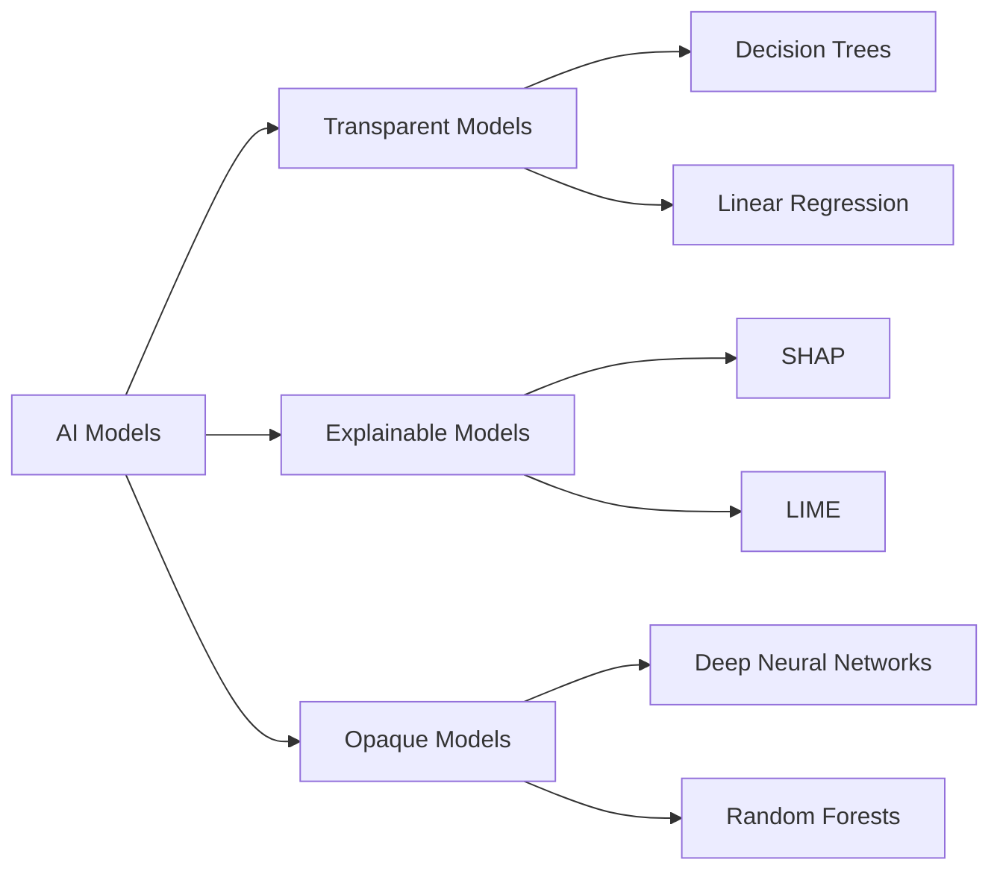
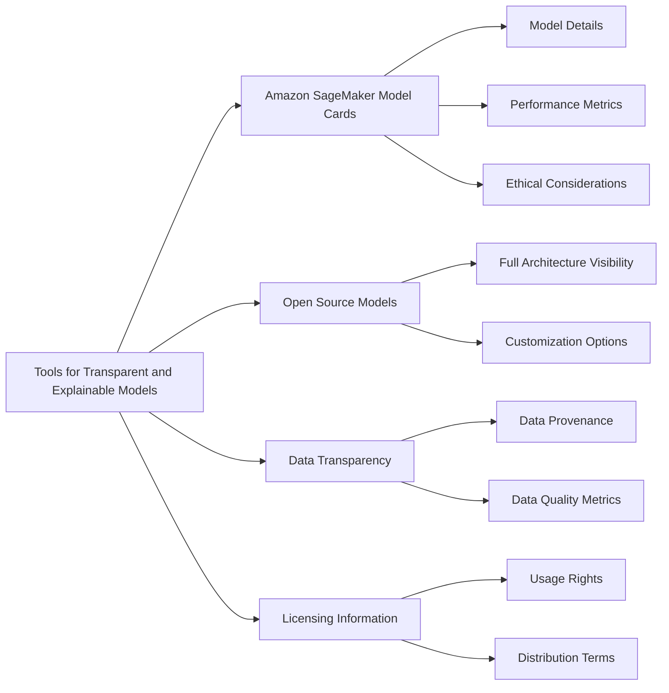
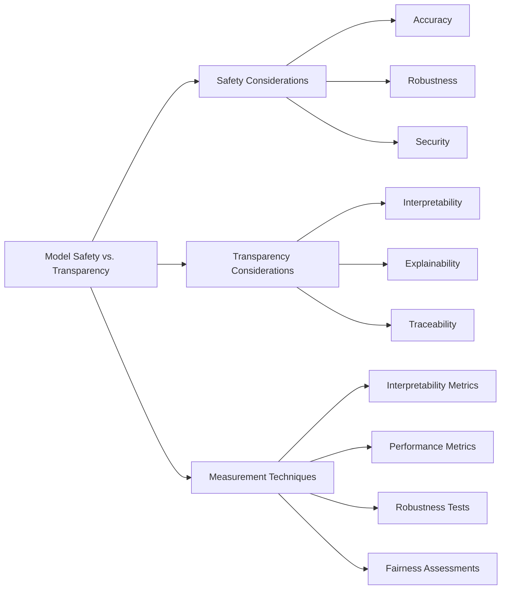
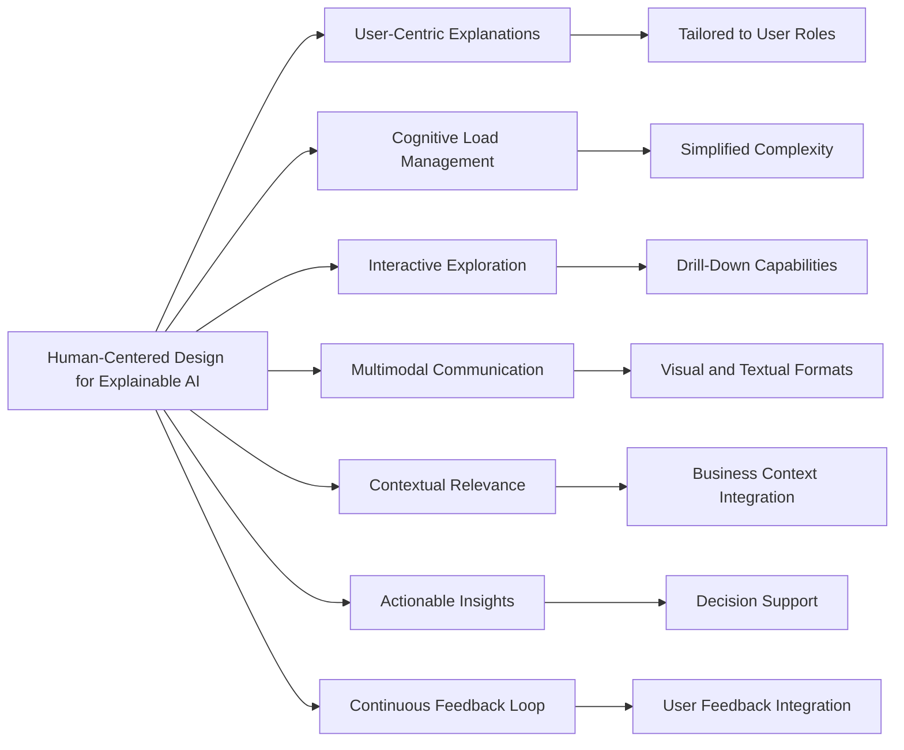

## 4.2 Transparent and Explainable Models: Building Trust in AI Systems

Transparency and explainability are foundational elements of responsible AI implementation. As organizations deploy AI systems for critical decision-making, understanding how these systems arrive at their conclusions becomes essential for stakeholder trust, regulatory compliance, and risk management. **Transparent and explainable AI** enables organizations to validate model behavior, identify potential biases, and justify AI-driven decisions to customers, regulators, and internal teams. Business professionals preparing for the AWS Certified AI Practitioner exam need to understand these concepts beyond theory—they must recognize how transparency affects AI deployment across industries like finance, healthcare, retail, and manufacturing. This chapter explores the distinctions between transparent and opaque models, examines tools for identifying explainable models, discusses the balance between model safety and transparency, and introduces human-centered design principles for creating AI systems that users can understand and trust.

### Understanding the differences between transparent and explainable models and opaque models

**Transparent and explainable models**, often called "white box" models, provide visibility into their decision-making processes, revealing how inputs lead to specific outputs. In contrast, **opaque models**, or "black box" models, offer minimal insight into their internal operations. This distinction significantly impacts AI implementation across regulatory compliance, user trust, and operational effectiveness.

Transparent models typically feature simpler architectures with interpretable algorithms such as decision trees, linear regression, or rule-based systems. These models allow direct examination of their logic and decision boundaries. For example, a decision tree used in customer churn prediction can be visualized to show exactly which features and thresholds determine specific classifications.

Explainable models may incorporate more complex structures but provide methods to interpret their decisions after they're made. These approaches include techniques like SHAP (SHapley Additive exPlanations) values or LIME (Local Interpretable Model-agnostic Explanations) that reveal feature importance and local decision boundaries.[^1200]

Opaque models, including deep neural networks and ensemble methods like random forests, often deliver superior performance at the expense of interpretability. While these models excel at capturing complex, non-linear relationships in data, their decision-making processes remain difficult for humans to comprehend.

*Figure 4.2.1. AI Model Types and Examples. This diagram illustrates the categorization of AI models into transparent, explainable, and opaque types, along with examples of each category.*

The selection between transparent, explainable, and opaque models depends on specific use cases and regulatory environments. Highly regulated industries such as finance or healthcare often require transparent or explainable models to ensure compliance and auditability. For instance, financial institutions using AI for credit scoring need to provide clear explanations for loan rejections to comply with fair lending laws.[^1201]

In applications where performance is paramount and explainability is less critical, such as image recognition or natural language processing, opaque models might be preferred. However, even in these scenarios, post-hoc explanation techniques are increasingly employed to provide some level of interpretability.

For business professionals, understanding these model differences matters for several reasons:

1. **Risk Management**: Transparent and explainable models enable better risk assessment and mitigation
2. **Regulatory Compliance**: Many industries mandate explainable AI decisions, particularly for impacts on individual rights or significant business outcomes
3. **Stakeholder Trust**: Explainable models build confidence with customers, employees, and partners by clarifying decision processes
4. **Model Improvement**: Understanding model logic facilitates effective debugging and iterative enhancement
5. **Ethical Considerations**: Transparent models simplify detection and correction of biases or unfair practices

As AI systems become increasingly central to business operations, the ability to distinguish between and appropriately apply transparent, explainable, and opaque models becomes a critical skill for AI practitioners and business leaders.

### Understanding tools to identify transparent and explainable models

Implementing transparent and explainable AI models requires familiarity with specialized tools and techniques. AWS offers several services that support model transparency and explainability, which serve both compliance requirements and trust-building initiatives.

**Amazon SageMaker Model Cards** provides a standardized framework for documenting essential machine learning model information.[^1202] These cards capture critical details that help users understand a model's behavior and potential biases.

Key components of Amazon SageMaker Model Cards include:

- Model details (architecture, training data, etc.)
- Intended uses and limitations
- Performance metrics across different subgroups
- Ethical considerations and potential biases
- Testing results and model behavior in various scenarios

By implementing Model Cards, organizations ensure all stakeholders have clear visibility into a model's capabilities and constraints, promoting responsible AI deployment.

**Open source models** represent another important aspect of model transparency. These models provide complete visibility into their architecture and training process, enabling thorough examination and customization. AWS supports deployment and management of diverse open source models through services like Amazon SageMaker and Amazon Bedrock.[^1203]

*Figure 4.2.2. Tools for Transparent and Explainable Models. This diagram illustrates various tools and components that contribute to model transparency and explainability, including Amazon SageMaker Model Cards, open source models, data transparency, and licensing information.*

**Data transparency** forms a critical foundation for model explainability. AWS provides specialized tools for tracking data lineage and provenance, ensuring that training and validation data is thoroughly documented and understood:

- **Amazon SageMaker Data Wrangler** for data preparation and feature engineering[^1204]
- **Amazon SageMaker Feature Store** for feature management and versioning[^1205]
- **AWS Glue Data Catalog** for maintaining a centralized metadata repository[^1206]

**Proper licensing** is also essential for transparent and explainable models. AWS provides clear licensing information for its AI services and supports various open source licenses. Understanding licensing terms helps organizations:

- Ensure compliance with usage restrictions
- Determine rights for model modification and distribution
- Assess potential legal risks associated with model deployment

For business professionals, these tools and practices offer significant advantages:

1. **Enhanced Compliance**: Detailed model documentation and transparent data practices satisfy regulatory requirements
2. **Improved Decision-Making**: Understanding model behavior enables more informed business decisions based on AI outputs
3. **Easier Troubleshooting**: Transparent models and clear data lineage simplify issue identification and resolution
4. **Stakeholder Communication**: Comprehensive documentation facilitates clear communication about AI capabilities and limitations to both technical and non-technical stakeholders
5. **Risk Mitigation**: Transparency in model architecture and data usage helps identify potential biases or ethical concerns early in development

By leveraging these AWS tools and prioritizing transparency in model selection, data handling, and licensing, organizations can build AI systems that deliver both performance and trustworthiness while maintaining regulatory compliance.

### Identifying tradeoffs between model safety and transparency

Organizations implementing responsible AI practices often encounter a fundamental tension between model safety and transparency. This tradeoff represents a critical consideration that impacts performance, trustworthiness, and regulatory compliance of AI systems.

**Model safety** encompasses the reliability, robustness, and security of an AI model, including:

- Accuracy and consistency of predictions
- Resilience against adversarial attacks
- Protection of sensitive information
- Stability across diverse input distributions

**Transparency** refers to the interpretability and explainability of the model's decision-making process, including:

- Clear understanding of feature importance
- Visibility into the model's internal logic
- Ability to trace specific outputs back to inputs
- Comprehensible explanations for model decisions

This tradeoff often manifests in choosing between simple, interpretable models and complex, high-performing ones. For example, a linear regression model offers high transparency but may lack the predictive power of a deep neural network, which typically provides less visibility into its operations.

To navigate this tradeoff effectively, organizations should consider several factors:

1. **Regulatory Requirements**: Some industries mandate explainable AI decisions, necessitating transparency even at the cost of performance
2. **Use Case Criticality**: High-stakes decisions may require more transparent models to ensure proper oversight and accountability
3. **Model Complexity**: More complex models often deliver better performance but reduced interpretability
4. **Data Sensitivity**: Models handling sensitive data may prioritize safety over transparency to protect privacy
5. **Stakeholder Trust**: In customer-facing applications, transparency may be crucial for building user trust

Organizations can employ various techniques to measure and balance these tradeoffs:

- **Interpretability Metrics**: Tools like SHAP values or LIME quantify how well a model's decisions can be explained[^1207]
- **Performance Metrics**: Traditional measures like accuracy, precision, and recall assess model effectiveness
- **Robustness Tests**: Techniques such as adversarial testing evaluate a model's resilience to unusual or malicious inputs
- **Fairness Assessments**: Metrics measuring bias across different subgroups help ensure ethical model behavior

*Figure 4.2.3. Model Safety vs. Transparency Tradeoffs. This diagram illustrates the key considerations in balancing model safety and transparency, along with techniques for measuring these aspects.*

AWS provides several tools to help organizations navigate these tradeoffs:

- **Amazon SageMaker Clarify**: Offers bias detection and explainability features to enhance transparency without compromising performance[^1208]
- **Amazon SageMaker Model Monitor**: Enables continuous performance monitoring and drift detection, balancing safety and transparency over time[^1209]
- **AWS Security Hub**: Provides comprehensive security and compliance visibility, ensuring model safety in deployment[^1210]

For business professionals, understanding and managing these tradeoffs delivers several benefits:

1. **Risk Management**: Balancing safety and transparency allows for better assessment and mitigation of AI-related risks
2. **Regulatory Compliance**: Many industries require specific levels of model explainability alongside performance standards
3. **Ethical AI Practices**: Transparent models facilitate ethical review and adjustment, essential for responsible AI deployment
4. **Stakeholder Communication**: Understanding model tradeoffs enables clearer communication about AI capabilities and limitations
5. **Continuous Improvement**: Recognizing the balance between safety and transparency guides ongoing model refinement efforts

By thoughtfully addressing these tradeoffs and leveraging appropriate tools and metrics, organizations can develop AI systems that deliver both high performance and responsible operation, meeting diverse requirements for performance, explainability, and ethical standards.

### Understanding principles of human-centered design for explainable AI

**Human-centered design** (HCD) for explainable AI focuses on creating systems that aren't just technically robust but also intuitive, accessible, and meaningful to human users. This approach ensures AI explanations provide genuine value to diverse stakeholders, from data scientists to business decision-makers and end-users.

Key principles of human-centered design for explainable AI include:

1. **User-Centric Explanations**: Tailoring explanations to match the specific needs, knowledge levels, and contexts of different user groups
2. **Cognitive Load Management**: Presenting information in ways that avoid overwhelming users with unnecessary complexity
3. **Interactive Exploration**: Enabling users to investigate deeper into explanations and examine different aspects of model decisions
4. **Multimodal Communication**: Using various formats (text, visuals, interactive elements) to effectively convey explanations
5. **Contextual Relevance**: Ensuring explanations are meaningful within specific business or operational contexts
6. **Actionable Insights**: Providing explanations that guide users toward informed decisions or concrete actions
7. **Continuous Feedback Loop**: Incorporating user input to iteratively improve the explainability of AI systems

Implementing these principles significantly enhances AI system effectiveness and adoption. For example, a credit scoring model might provide different explanation levels for a loan officer (detailed risk factors) versus a loan applicant (simplified, actionable feedback).

*Figure 4.2.4. Human-Centered Design Principles for Explainable AI. This diagram illustrates the key principles of human-centered design in the context of explainable AI, highlighting how these principles contribute to more effective and user-friendly AI explanations.*

AWS provides several tools and services supporting human-centered explainable AI:

- **Amazon SageMaker Canvas**: Offers a visual interface for creating and understanding ML models, making AI more accessible to non-technical users[^1211]
- **Amazon QuickSight Q**: Provides natural language querying capabilities, allowing users to explore data and AI insights intuitively[^1212]
- **Amazon Augmented AI (A2I)**: Facilitates human review of ML predictions, incorporating human judgment into AI systems[^1213]

For business professionals, applying these principles delivers substantial benefits:

1. **Enhanced User Adoption**: AI systems designed with human needs in mind are more likely to be accepted and effectively utilized
2. **Improved Decision-Making**: Clear, contextual explanations enable stakeholders to make more informed decisions based on AI outputs
3. **Increased Trust**: Transparent, user-friendly AI explanations build confidence in AI systems among internal and external stakeholders
4. **Regulatory Compliance**: Human-centered explainable AI helps satisfy regulatory requirements for AI transparency and fairness
5. **Efficient Problem-Solving**: When users understand AI decisions, they can more quickly identify and address issues or biases

Practical applications of human-centered explainable AI include:

- **Customer Service**: AI chatbots providing clear explanation for their responses, allowing human agents to understand and verify AI-generated information
- **Financial Services**: Risk assessment models offering interactive, visual explanations of credit decisions, helping both analysts and customers understand contributing factors
- **Healthcare**: Diagnostic AI systems presenting findings in ways that support, rather than replace, physician decision-making
- **Manufacturing**: Predictive maintenance systems providing actionable insights to technicians, explaining not just what might fail, but why and how to prevent it

By incorporating human-centered design principles, organizations create AI systems that are not only powerful and accurate but also understandable and valuable to human users. This approach bridges the gap between advanced AI capabilities and practical, real-world application, ensuring AI truly serves and empowers its users.

In conclusion, transparent and explainable models form the foundation of responsible AI implementation. By understanding different model types, leveraging appropriate tools, balancing safety and transparency, and applying human-centered design principles, organizations can develop AI systems that deliver both effectiveness and trustworthiness. As AI transforms business operations across industries, the ability to build and deploy explainable AI systems will differentiate organizations committed to ethical standards and regulatory compliance while maximizing AI's business value.

### Questions for self-check

1. **Which of the following best describes the difference between transparent and opaque AI models?**

   A. Transparent models are always more accurate than opaque models
   B. Opaque models provide clearer explanations of their decision-making process
   C. Transparent models allow for direct examination of their logic and decision boundaries
   D. Opaque models are required for compliance in highly regulated industries

2. **A financial institution is implementing an AI system for credit scoring. Which AWS tool would be most appropriate for documenting the model's intended use, performance characteristics, and limitations?**

   A. Amazon SageMaker Clarify
   B. Amazon SageMaker Model Cards
   C. AWS Security Hub
   D. Amazon QuickSight Q

3. **In the context of explainable AI, what does the principle of "cognitive load management" refer to?**

   A. Maximizing the amount of information presented to users
   B. Presenting information in a way that doesn't overwhelm users with unnecessary complexity
   C. Focusing solely on technical explanations for data scientists
   D. Avoiding visual representations of model decisions

4. **A company is developing an AI system for medical diagnosis. They want to balance model performance with the need for transparency. Which of the following statements best describes an appropriate approach?**

   A. Always choose the most complex model for highest accuracy
   B. Use only simple, fully transparent models to ensure explainability
   C. Consider regulatory requirements and use case criticality when balancing performance and transparency
   D. Prioritize model safety over transparency in all medical applications

5. **Which AWS service facilitates human review of machine learning predictions, supporting the human-centered design principle of continuous feedback loop in explainable AI?**

   A. Amazon SageMaker Canvas
   B. Amazon QuickSight Q
   C. Amazon Augmented AI (A2I)
   D. AWS Glue Data Catalog

### Answers and Explanations

1. **Correct answer: C. Transparent models allow for direct examination of their logic and decision boundaries**

   Explanation: Transparent models, often referred to as "white box" models, provide insight into their decision-making processes. They typically have simpler architectures that allow users to directly examine their logic and decision boundaries. This is in contrast to opaque or "black box" models, which offer little visibility into their internal workings. The other options are incorrect: accuracy is not inherently tied to transparency (A), opaque models by definition do not provide clearer explanations (B), and while transparent models may be preferred in regulated industries, opaque models are not universally required (D).[^1214]

2. **Correct answer: B. Amazon SageMaker Model Cards**

   Explanation: Amazon SageMaker Model Cards is specifically designed to provide a standardized way to document essential information about machine learning models, including their intended use, performance characteristics, and limitations. This tool is crucial for understanding a model's behavior and potential biases, making it ideal for the scenario described. While Amazon SageMaker Clarify (A) offers bias detection and explainability features, it doesn't provide comprehensive documentation like Model Cards. AWS Security Hub (C) is focused on security and compliance, not model documentation. Amazon QuickSight Q (D) is a business intelligence tool and not directly related to model documentation.[^1215]

3. **Correct answer: B. Presenting information in a way that doesn't overwhelm users with unnecessary complexity**

   Explanation: In the context of explainable AI, cognitive load management refers to the principle of presenting information in a way that is easily digestible and doesn't overwhelm users with unnecessary complexity. This is crucial for ensuring that AI explanations are meaningful and actionable for various stakeholders. The other options are incorrect: maximizing information (A) would likely increase cognitive load, focusing solely on technical explanations (C) doesn't consider different user needs, and avoiding visual representations (D) could actually increase cognitive load for many users.[^1216]

4. **Correct answer: C. Consider regulatory requirements and use case criticality when balancing performance and transparency**

   Explanation: When developing AI systems, especially for critical applications like medical diagnosis, it's important to balance model performance with the need for transparency. The appropriate approach is to consider factors such as regulatory requirements and use case criticality. This allows for a nuanced decision that may involve using more complex, high-performing models where necessary, while ensuring sufficient explainability to meet regulatory and ethical standards. The other options are too extreme: always choosing the most complex model (A) or only using simple models (B) doesn't allow for this balance, and while safety is important, categorically prioritizing it over transparency (D) may not meet all regulatory and ethical requirements in medical AI applications.[^1217]

5. **Correct answer: C. Amazon Augmented AI (A2I)**

   Explanation: Amazon Augmented AI (A2I) is specifically designed to facilitate human review of machine learning predictions. This service supports the human-centered design principle of continuous feedback loop in explainable AI by allowing human judgment to be incorporated into AI systems. This enables ongoing improvement and validation of AI outputs. The other options, while useful AWS services, do not directly facilitate human review of ML predictions: Amazon SageMaker Canvas (A) is a visual interface for creating ML models, Amazon QuickSight Q (B) provides natural language querying for data exploration, and AWS Glue Data Catalog (C) is a centralized metadata repository.[^1218]

[^1200]: Explainable AI: ML Explainability with Amazon SageMaker Debugger. URL: <https://aws.amazon.com/blogs/machine-learning/ml-explainability-with-amazon-sagemaker-debugger/>

[^1201]: Responsible AI: AWS Responsible AI Policy. URL: <https://aws.amazon.com/ai/responsible-ai/policy/>

[^1202]: Amazon SageMaker Model Cards. URL: <https://docs.aws.amazon.com/sagemaker/latest/dg/model-cards.html>

[^1203]: Amazon Bedrock. URL: <https://aws.amazon.com/bedrock/>

[^1204]: Amazon SageMaker Data Wrangler. URL: <https://aws.amazon.com/sagemaker/data-wrangler/>

[^1205]: Amazon SageMaker Feature Store. URL: <https://aws.amazon.com/sagemaker/feature-store/>

[^1206]: AWS Glue Data Catalog. URL: <https://docs.aws.amazon.com/glue/latest/dg/components-overview.html#data-catalog-intro>

[^1207]: Interpretable Machine Learning: Interpreting Machine Learning Models With SHAP. URL: <https://mindfulmodeler.substack.com/p/interpreting-machine-learning-models>

[^1208]: Amazon SageMaker Clarify. URL: <https://aws.amazon.com/sagemaker/clarify/>

[^1209]: Amazon SageMaker Model Monitor. URL: <https://docs.aws.amazon.com/sagemaker/latest/dg/model-monitor.html>

[^1210]: AWS Security Hub. URL: <https://aws.amazon.com/security-hub/>

[^1211]: Amazon SageMaker Canvas. URL: <https://aws.amazon.com/sagemaker/canvas/>

[^1212]: Amazon QuickSight Q. URL: <https://aws.amazon.com/quicksight/q/>

[^1213]: Amazon Augmented AI. URL: <https://docs.aws.amazon.com/sagemaker/latest/dg/a2i-api-references.html>

[^1214]: AWS Machine Learning: Model Explainability. URL: <https://docs.aws.amazon.com/sagemaker/latest/dg/clarify-model-explainability.html>

[^1215]: Amazon SageMaker Model Cards Documentation. URL: <https://docs.aws.amazon.com/sagemaker/latest/dg/model-cards.html>

[^1216]: AWS Responsible AI. URL: <https://aws.amazon.com/ai/responsible-ai/>

[^1217]: AWS for Healthcare & Life Sciences. URL: <https://aws.amazon.com/health/>

[^1218]: Use APIs in Amazon Augmented AI. URL: <https://docs.aws.amazon.com/sagemaker/latest/dg/a2i-api-references.html>