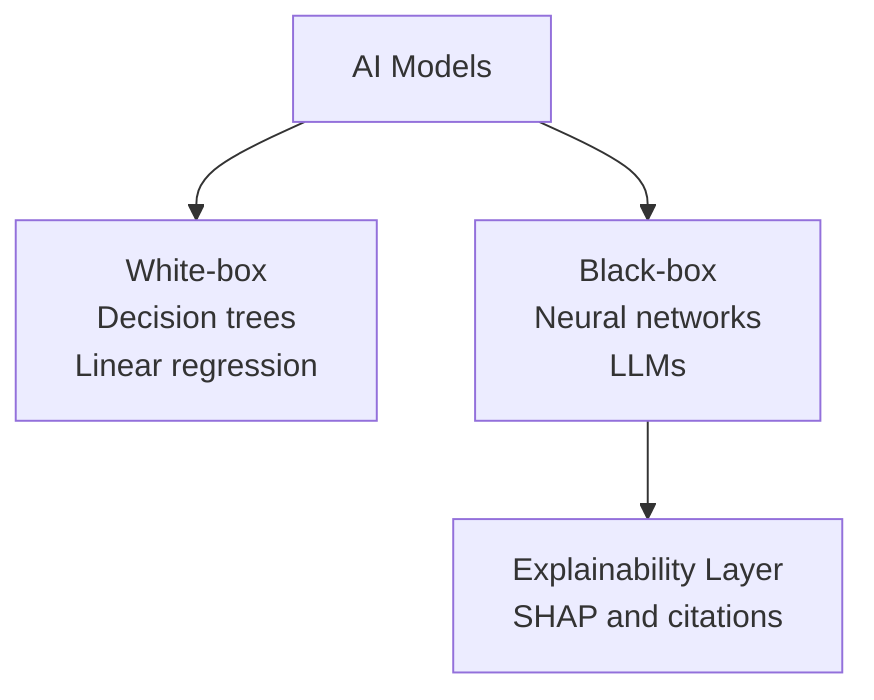
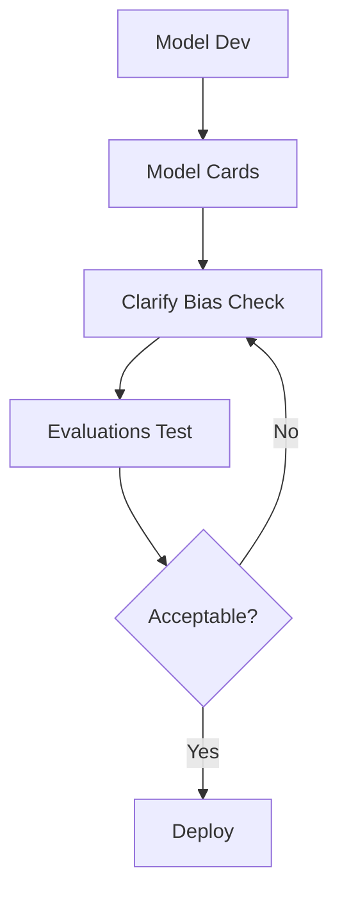
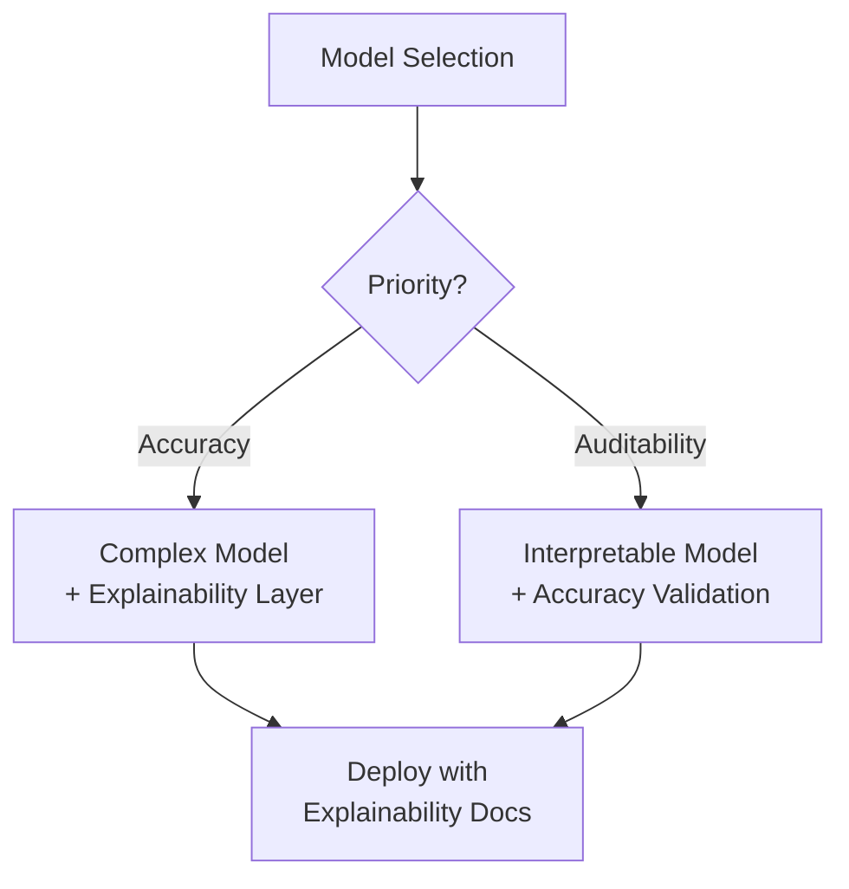
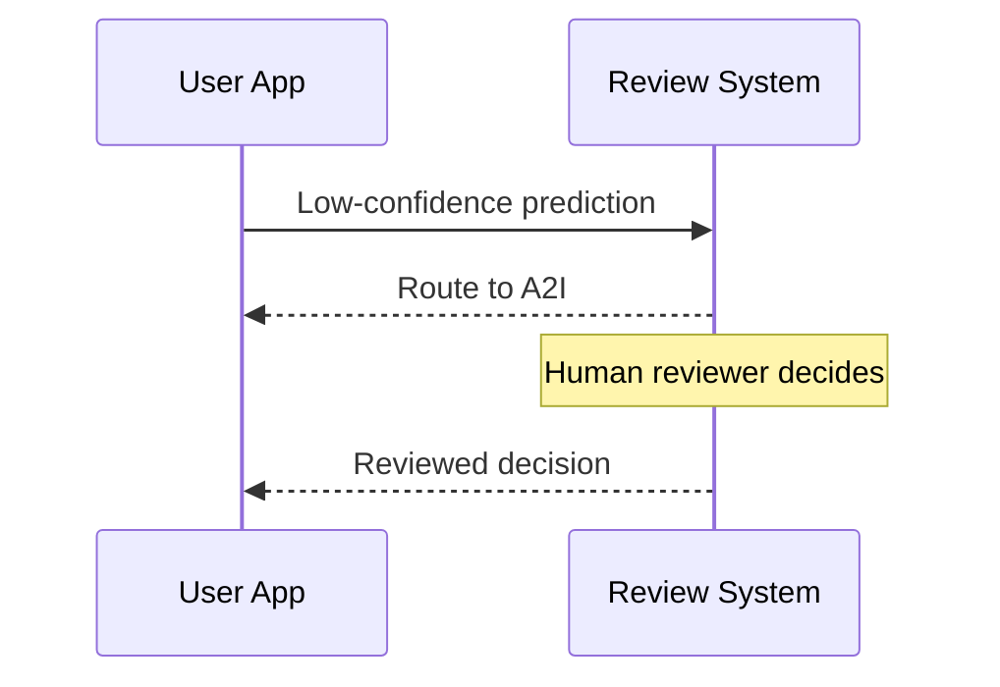

## Task Statement 4.2: Recognize the importance of transparent and explainable models

When an AI system makes a decision that affects a customer, an employee, or a business outcome, the people involved almost always ask the same question: why? The answer to that question is what transparency and explainability are about. This task statement covers how to tell the difference between models that can answer that question and models that cannot, the AWS tools that document and surface model behavior, the trade-offs between explainability and other properties such as safety and performance, and the design principles that keep humans meaningfully in the loop when AI systems are making consequential recommendations.[^402001]

### 4.2.1 Differences between transparent and explainable models and models that are not

Transparency and explainability are related but distinct properties. **Transparency** is the property of a model whose internal structure, training data, and decision logic can be inspected directly. A transparent model is one you can open up and read. **Explainability** is the property of a model whose outputs can be accompanied by a human-understandable reason, even if the internal structure remains complex. An explainable model may be opaque internally, but the system around it can produce a rationale that a person can evaluate.[^402002]

The distinction matters in practice. A classic *decision tree* is transparent: you can follow the branches from root to leaf and trace exactly which input values caused the model to reach a given conclusion.[^402031] A *deep neural network* with billions of parameters is not transparent in the same way; no human can read the weight matrix and understand why a particular token sequence produced a particular output. However, a well-designed system around that neural network can still be explainable: it can report the features that contributed most to the output, surface the source documents that most influenced a response, or assign a confidence score that signals how certain the model is.[^402032]

**White-box models** are those where the decision logic is inherently readable. Linear regression, logistic regression, decision trees, and rule-based classifiers all fall into this category.[^402003] A loan-underwriting model built as a decision tree can be described in plain English to a regulator: "Applications with a debt-to-income ratio above 40% and fewer than 24 months of employment history were declined." That sentence is the model. White-box models are the default choice in environments where regulatory accountability requires complete auditability of every individual decision, such as consumer credit, insurance underwriting, and some medical-device classifications.[^402033]

**Black-box models** are those where the internal computation is too complex to interpret directly.[^402004] Large language models, deep convolutional networks, and ensemble methods such as gradient-boosted trees trained on hundreds of features all behave as black boxes from a practical standpoint. The model produces a score or a token sequence, but the path from input to output passes through so many non-linear transformations that tracing it is computationally and conceptually intractable.[^402034] Most production AI systems in content moderation, medical imaging, fraud detection, and natural-language processing operate with black-box models.

*Figure 4.2.1: White-box vs. black-box model taxonomy. White-box models expose decision logic directly; black-box models require a separate explainability layer to produce human-understandable rationales.*

The reality of most production AI systems is that they sit somewhere between the two extremes. A gradient-boosted classifier may not be readable line by line, but it is less opaque than a deep neural network because *feature importance* scores can be computed for it directly from the model's structure.[^402035] A large language model is deeply opaque internally but can be configured to cite its sources, report its uncertainty, and explain its chain of reasoning in plain language before producing a final answer. The practical question is not whether a model is perfectly transparent but whether it is explainable enough for the accountability requirements of the use case.[^402036]

Three industries illustrate the spectrum well. In credit scoring, regulations in many jurisdictions require a lender to give an applicant the specific reasons a credit decision was made; white-box models or SHAP-attributed black-box models both satisfy this requirement, while an unexplained score does not.[^402005] In medical diagnosis, a radiologist using an AI tool to screen chest X-rays needs to see which regions of the image the model weighted most heavily so that the physician can confirm or override the model's hypothesis; here explainability supports human decision-making without replacing it.[^402037] In content moderation, the platform operator may not be required to explain individual moderation decisions to users, but internal audit teams need to verify that the classifier is applying consistent rules across demographic groups; here explainability is primarily an internal quality-assurance tool.[^402038]

### 4.2.2 Tools to identify transparent and explainable models

Recognizing that explainability is needed is different from knowing how to achieve it. AWS provides a set of tools that address explainability at different levels: the model's documentation, its behavior during inference, and the safety and quality of its outputs.[^402039]

**Amazon SageMaker Model Cards** is the tool AWS designed to standardize how model documentation is created and shared.[^402006] A Model Card is a structured human-readable document attached to a model artifact in SageMaker. It records the model's intended use cases, the training dataset and its provenance, performance metrics across relevant subgroups, known limitations, ethical considerations, and usage restrictions.[^402007] A business professional reviewing a Model Card before approving a model for production can determine whether the model was trained on data representative of the deployment population, what accuracy trade-offs were made, and what risks the development team has already identified.

The value of Model Cards extends beyond the initial deployment decision. When a model's behavior changes over time, or when a regulatory inquiry arrives, the Model Card provides an auditable record of what was known at the time of deployment.[^402040] Amazon SageMaker supports publishing Model Cards through the AWS Management Console and the SageMaker Python SDK, and cards can be versioned alongside the model artifact.[^402008]

**Amazon SageMaker Clarify** addresses explainability at the inference level.[^402009] Clarify uses a technique called *SHAP* (SHapley Additive exPlanations) to compute feature attribution scores for classical machine learning models.[^402010] Think of a SHAP value as "how much did this feature push the answer up or down compared to the average prediction across all applicants." Positive numbers push toward higher predicted risk; negative numbers push toward lower risk. For example, a Clarify explanation for a credit-risk model prediction might show that the applicant's debt-to-income ratio contributed +0.12 to the risk score while the credit history length contributed -0.08, giving the underwriter a quantitative basis for the decision and a starting point for any required explanation to the applicant. (For image models, the equivalent technique produces *saliency maps* that highlight the regions of an input image the model weighted most heavily.)

Beyond feature attribution, SageMaker Clarify measures *bias metrics* that reflect whether the model treats different demographic groups differently.[^402011] Pre-training bias metrics evaluate whether the training dataset itself is imbalanced. Post-training bias metrics evaluate whether the trained model's predictions differ systematically across groups defined by a sensitive attribute such as gender, age, or zip code.[^402041] This bias-detection capability connects directly to the responsible AI features covered in Task 4.1 and makes Clarify a dual-purpose tool: it both explains individual predictions and monitors population-level fairness.

**Amazon Bedrock Model Evaluations** is the tool AWS provides for evaluating the quality and safety of foundation model outputs.[^402012] Unlike Clarify, which addresses classical ML feature attribution, Bedrock Model Evaluations assesses LLM outputs on dimensions such as accuracy, fluency, coherence, and toxicity. The evaluation can be configured as an automated job using built-in scoring algorithms or as a human evaluation job with an internal team or AWS-managed workforce.[^402013] The safety evaluation dimension specifically checks for harmful, toxic, or inappropriate content, giving organizations a structured record of how a model performs on safety criteria before it is placed in production. Bedrock Model Evaluations produces a per-job report comparing outputs against criteria; it is not a standing governance document about the model itself, which is what Model Cards provide.

**Open-source models** deserve specific attention as a transparency tool. When an organization deploys a model whose weights and architecture are publicly available, such as models from the Meta Llama family or the Mistral family, it can inspect the architecture documentation, review the training data cards published by the model developers, and run third-party evaluations.[^402014] This is a qualitatively different level of transparency than is available for proprietary models accessed through an API, where the architecture and training data are not disclosed.[^402042] Deploying an open-source model on AWS through Amazon Bedrock or directly on Amazon SageMaker endpoints preserves this transparency advantage while retaining the operational benefits of managed infrastructure.[^402043]

**Data and licensing documentation** completes the picture. Explainability is only meaningful if the data that produced the model is traceable.[^402015] A model trained on data with undisclosed provenance carries risks that a Model Card cannot fully capture: if the training data turns out to contain protected personal data, copyrighted content, or systematically biased labels, the model's outputs inherit those problems.[^402044] Licensing terms for both the training data and the model weights determine what the organization can legally do with the model's outputs, and that determination is itself a form of transparency about the model's operational constraints.[^402045]

*Table 4.2.1: AWS tools for model transparency and explainability*

| Tool | What it explains | Technique | Primary audience |
|---|---|---|---|
| SageMaker Model Cards | Model intent, data, evaluation results, limitations | Structured documentation | Business reviewers, auditors |
| SageMaker Clarify | Individual prediction attribution, bias metrics | SHAP values, statistical tests | Data scientists, compliance |
| Bedrock Model Evaluations | LLM output quality and safety | Automated and human scoring | AI teams, safety reviewers |
| Open-source model inspection | Architecture and training data | Direct review of weights and docs | ML engineers, researchers |
| Data and licensing review | Training data provenance and usage rights | Provenance tracking, license review | Legal, compliance, procurement |

The exam expects you to match a scenario to the correct tool. When a question asks how an organization should document a model's intended use and known limitations for an audit, the answer is SageMaker Model Cards. When a question asks how to explain why a specific prediction was made by a classical ML model, the answer is SageMaker Clarify with SHAP. When a question asks how to evaluate whether a generative model's outputs are safe before production deployment, the answer is Bedrock Model Evaluations.[^402046]

*Figure 4.2.2: Explainability toolchain in the model lifecycle. Model Cards provide documentation context; Clarify measures pre- and post-training bias; Bedrock Model Evaluations validates output safety before deployment.*

### 4.2.3 Tradeoffs between model safety and transparency

Transparency and safety are not always aligned. Understanding where they reinforce each other and where they conflict is important for designing AI systems that are both trustworthy and secure.[^402047]

The most common conflict arises from the fact that revealing how a safety control works can allow an adversary to circumvent it. Consider a content-moderation system that blocks harmful outputs by detecting certain phrase patterns in the model's response. Publishing the exact phrase list would allow a bad actor to construct requests that avoid all blocked phrases while still eliciting harmful content. In this case, opacity in the safety control is intentional.[^402048] The same logic applies to prompt-injection defenses: a system prompt that instructs the model to ignore instructions that follow a certain template is less effective once that template is known.[^402016] Security systems routinely treat the details of their detection logic as confidential, and AI safety controls are no exception.

The conflict runs in the opposite direction as well. Opacity in a model can hide safety-relevant limitations that operators and users need to know about. A Model Card that accurately describes a model's failure modes, such as lower accuracy on non-native English speakers or higher hallucination rates on very recent events, allows operators to add compensating controls at deployment time.[^402017] Hiding or omitting those limitations means the operator cannot mitigate them. In this sense, transparency about limitations actively improves safety outcomes.[^402049]

The performance versus interpretability trade-off is a second tension the exam covers. In general, the models that achieve the highest accuracy on complex tasks are also the least interpretable. A deep neural network trained on millions of labeled images will outperform a decision tree on most image classification tasks, but the decision tree's predictions can be explained to a domain expert without any additional tooling.[^402018] A gradient-boosted ensemble trained on dozens of engineered features will often outperform logistic regression on tabular data, but logistic regression produces coefficients that a statistician can read directly as the contribution of each variable.[^402050]

*Figure 4.2.3: Performance vs. interpretability decision path. When accuracy is the primary requirement, add a post-hoc explainability layer; when auditability is primary, choose an interpretable model and verify its accuracy threshold.*

There is no single numerical measure of interpretability.[^402019] Interpretability is a property evaluated per use case, not a score on a leaderboard. A model that a radiologist considers sufficiently explainable for screening assistance may not be sufficiently explainable for generating a formal diagnosis that appears in a medical record.[^402051] A credit-risk model that satisfies the explanation requirements of one country's consumer-credit regulation may not satisfy another country's. The measurement question is therefore always: explainable enough for whom, for what purpose, and under which obligation?[^402052]

*Table 4.2.2: Transparency-safety interaction patterns*

| Scenario | Transparency effect | Safety effect | Resolution |
|---|---|---|---|
| Publishing prompt-injection defense details | High transparency | Reduced safety | Keep defense logic confidential; publish only high-level policy |
| Model Card documents hallucination failure modes | High transparency | Improved safety | Publish; operators add compensating controls |
| Revealing bias detection threshold values | Partial transparency | Risk of gaming | Publish category; keep exact thresholds confidential |
| Open-source model weights | Full transparency | Variable | Evaluate specific risks before open deployment |

The practical guidance for an exam scenario is: when a question describes a situation where revealing the mechanism of a control would allow an attacker to bypass it, less transparency is appropriate for safety. When a question describes a situation where hiding a model's known limitations prevents operators from mitigating them, more transparency is appropriate for safety.[^402053]

### 4.2.4 Principles of human-centered design for explainable AI

Explainability is not only a technical property of a model; it is also a design property of the system that presents the model's outputs to users. A model can produce SHAP attribution scores that no business user will ever see because the interface was not designed to surface them.[^402054] Human-centered design for explainable AI means building the presentation layer so that users receive the information they need to understand, trust, and appropriately override AI recommendations.[^402020]

The first principle is to surface confidence and uncertainty information when it is relevant to the decision. A model that assigns a high confidence score to a recommendation and a model that is nearly equally uncertain between two options should not look the same to a user. When a fraud-detection system flags a transaction with 97% confidence, an analyst may proceed quickly. When the same system flags a transaction with 54% confidence, the analyst should know that the model is uncertain and apply more scrutiny. Amazon Bedrock models can return probability scores and can be prompted to express uncertainty explicitly in their outputs; designing the application to display that information, rather than converting the model's output directly to a binary yes/no recommendation, is a deliberate design choice.[^402021]

The second principle is to show citations and sources for generated content. A RAG-based application that retrieves information from a document corpus and generates a natural-language answer should identify which source documents were used. This is not only a transparency measure; it is a practical tool that allows a user to verify the model's output against the original source and to identify cases where the model generalized beyond what the source actually said.[^402022] Amazon Bedrock Knowledge Bases returns source document references alongside generated responses, and application designs that surface those references to end users make the system materially more trustworthy.[^402055]

The third principle is to design feedback loops that capture user judgments about AI output quality. A thumbs-up or thumbs-down mechanism attached to a model's recommendation is the simplest form of this, but the design should also capture the reason for negative feedback: was the recommendation factually wrong, not applicable, or correct but presented in a confusing way? That structured feedback, routed back to the model development team, produces the labeled data needed to identify systematic failure modes and to improve the model over time. Amazon A2I, introduced in Task 4.1, fits this principle by routing low-confidence outputs to human reviewers and capturing their decisions as structured records.[^402023]

*Figure 4.2.4: Human-in-the-loop feedback flow. The application surfaces confidence scores to the user, routes low-confidence or disputed outputs to Amazon A2I for human review, and returns structured annotations to the development team.*

The fourth principle is to separate what the model said from what the system did. In a multi-layer AI application, the model produces a recommendation, and then a downstream system acts on it. A well-designed interface shows the user both layers: the model's recommendation and the system's action based on that recommendation.[^402056] This matters when the system adds business rules that modify or override the model's output. For example, a hiring-support tool might show a recruiter both the model's candidate ranking and the rule that the recruiter's company applied to filter out candidates below a statutory age threshold. The user can then evaluate the model's reasoning independently of the business-rule layer.[^402057]

The fifth principle is to respect user autonomy by making overrides easy and well-tracked. An AI recommendation that cannot be overridden is not a recommendation at all; it is an automated decision. Users who are required to use AI outputs but cannot override them lose their ability to apply professional judgment to edge cases, and the organization loses the signal that override data would have provided.[^402058] Designing override mechanisms that are prominent, low-friction, and audit-logged gives users genuine agency while also generating valuable feedback about where the model falls short.[^402024]

*Table 4.2.3: Human-centered design principles for explainable AI*

| Principle | Implementation example | AWS tool or pattern |
|---|---|---|
| Surface confidence and uncertainty | Display model confidence score alongside recommendation | Bedrock inference response metadata |
| Show citations and sources | List retrieved source documents with generated response | Bedrock Knowledge Bases source attribution |
| Capture structured feedback | Thumbs-down with reason; low-confidence auto-routing | Amazon A2I workflow configuration |
| Separate model output from system action | Show model score and applied business rule separately | Application layer design |
| Respect user autonomy | Prominent override button with audit log | Application layer design |

Accessibility is a practical consideration within human-centered design that the exam does not elaborate on but that any responsible implementation must address. Confidence scores presented only as numerical values exclude users who are less comfortable with probabilistic reasoning.[^402059] Explanations written in technical language exclude non-expert users. Designing explainability for the actual users of the system, not for the developers who built it, is the operational definition of human-centered design in this context.[^402060]

## Self-check questions

**Question 1.** A financial services company uses a gradient-boosted ensemble model to approve or decline loan applications. A regulator requires the company to provide each declined applicant with a specific reason for the decision. The model development team wants to meet this requirement without replacing the model. Which AWS tool or technique is MOST appropriate?

A. Replace the gradient-boosted model with a logistic regression model that is transparent by design  
B. Use Amazon SageMaker Clarify to generate SHAP-based feature attribution scores for each individual prediction  
C. Publish a SageMaker Model Card documenting the training data and evaluation metrics  
D. Use Amazon Bedrock Model Evaluations to score the model's output accuracy against a labeled dataset  

**Explanation:** The regulator requires a per-decision explanation, which means the system needs to attribute the specific prediction to specific input features for each individual application. Amazon SageMaker Clarify (Answer B) computes SHAP values that quantify how much each input feature contributed to the model's prediction, producing precisely the per-decision rationale the regulator requires. Answer A would satisfy the requirement but the question specifies the team wants to avoid replacing the model; also, replacing the model solely for interpretability sacrifices the accuracy advantage of the ensemble. Answer C addresses documentation of the model as a whole but does not generate per-decision explanations. Answer D evaluates aggregate accuracy of LLM outputs and is not designed for feature attribution on classical ML models. SageMaker Clarify is the purpose-built tool for individual prediction attribution on SageMaker-trained models.[^402026]

---

**Question 2.** A company is developing an AI-powered medical imaging assistant that highlights regions of a chest X-ray for a radiologist to review. The development team debates whether to use a deep convolutional network with higher diagnostic accuracy or a rule-based classifier with lower accuracy but fully auditable rules. The clinical team says they will only use the tool if they can understand why the tool is flagging a region. Which approach BEST addresses both the clinical team's requirement and the accuracy need?

A. Use the rule-based classifier because it is fully transparent and the clinical team can read its rules directly  
B. Use the deep convolutional network and add a post-hoc explainability layer that highlights the image regions the model weighted most heavily  
C. Use the deep convolutional network without an explainability layer and train the clinical team to trust the model's output  
D. Use Amazon Bedrock Model Evaluations to validate the deep convolutional network's outputs before each imaging session  

**Explanation:** The question identifies two competing requirements: high accuracy (favors the deep convolutional network) and understandability (favors the transparent model). Answer B resolves the tension by using the higher-accuracy model and adding a post-hoc explainability layer that produces *saliency maps* or equivalent visualizations showing which image regions the model weighted most heavily. This gives radiologists the regional rationale they need without sacrificing the accuracy advantage. Answer A accepts the accuracy limitation unnecessarily; the question does not say the rule-based classifier's accuracy is sufficient. Answer C ignores the stated clinical-team requirement and introduces patient-safety risk by deploying an unexplained system to clinicians who have said they need explanations. Answer D is the wrong tool category; Bedrock Model Evaluations addresses LLM output quality, not image classification attribution. The broader lesson is that the performance-versus-interpretability trade-off can often be resolved by keeping the high-performance model and adding an explainability layer rather than choosing between the two.[^402027]

---

**Question 3.** An organization is preparing to deploy a generative AI customer-service assistant. The compliance team requires documentation of the model's intended use, its known failure modes, and the evaluation metrics used to validate it, all in a format that a non-technical auditor can review. Which AWS capability is designed for this purpose?

A. Amazon SageMaker Clarify bias reports  
B. Amazon Bedrock Model Evaluations human review workflow  
C. Amazon SageMaker Model Cards  
D. Amazon Augmented AI (Amazon A2I) review task audit logs  

**Explanation:** Amazon SageMaker Model Cards (Answer C) is the purpose-built tool for structured model documentation. A Model Card records the model's intended use cases, training data provenance, evaluation results across subgroups, known limitations, ethical considerations, and usage restrictions in a standardized, human-readable format. This directly addresses all three compliance requirements: intended use, known failure modes, and evaluation metrics, in a form a non-technical auditor can navigate. Answer A produces per-prediction attribution scores and bias metrics for a deployed model, not summary documentation for an auditor. Answer B runs inference quality and safety evaluations but produces evaluation scores rather than the structured documentation a Model Card provides. Answer D produces audit records of individual human-review decisions, which is useful for monitoring but does not substitute for model documentation. Model Cards are the canonical answer when the exam describes an audit or compliance requirement for pre-deployment model documentation.[^402028]

---

**Question 4.** A company's AI product team has built a recommendation engine. User research shows that many users do not trust the recommendations because they cannot understand why a particular item was suggested. The team wants to apply human-centered design to increase user trust. Which option pairs two design changes that MOST directly address the trust gap?

A. Replace the recommendation model with a more accurate model and retrain on a larger dataset  
B. Display the model's confidence score alongside each recommendation and show the primary attributes of the user's history that drove the suggestion  
C. Remove the recommendation feature until the model achieves higher accuracy  
D. Add an Amazon A2I human review step to manually approve each recommendation before it is shown to a user  

**Explanation:** The user research identifies a trust problem caused by lack of understandability, not a problem caused by low accuracy or insufficient review. Answer B applies two human-centered design principles directly: surfacing confidence (so users can calibrate how much weight to give the recommendation) and showing the reasoning behind the recommendation (the attributes that drove it, which is a form of post-hoc attribution). Both changes address the stated trust gap. Answer A improves accuracy, which may or may not address trust; a more accurate model that is still unexplained does not solve the problem the user research identified. Answer C removes a product feature to avoid the problem rather than solving it. Answer D introduces human review for every recommendation, which is operationally impractical at recommendation-system scale and addresses quality control rather than user-facing explainability. The exam pattern here is that when user trust is the stated problem, the correct answer involves transparency and explanation design, not model replacement or manual review.[^402029]

---

**Question 5.** A data science team is evaluating whether to use an open-source model or a proprietary closed API model for a new application. The team's legal department requires visibility into the training data sources and licensing terms before approving the model for production use. Which characteristic of open-source models MOST directly addresses the legal department's requirement?

A. Open-source models are always cheaper to run than proprietary models accessed via API  
B. Open-source models can be fine-tuned on proprietary data, which allows the organization to own the resulting weights  
C. Open-source models publish architecture documentation, training data cards, and license terms that the legal team can review directly  
D. Open-source models automatically meet all regulatory requirements for AI transparency in the EU and US  

**Explanation:** The legal department's stated requirement is visibility into training data sources and licensing terms. Answer C addresses this directly. Publicly available models typically publish model cards and data cards (or equivalent documentation) that describe the training corpus composition, any known limitations, and the applicable license. The legal team can review the published license (such as an Apache 2.0 or a model-specific commercial license) to determine what uses are permitted and can review the training data documentation to assess data provenance risks. Answer A is a cost argument that does not address the legal requirement; open-source models are not universally cheaper once infrastructure and operational costs are included. Answer B addresses ownership of fine-tuned derivatives, which is a valid legal consideration but does not address the training data and licensing visibility requirement stated in the question. Answer D is incorrect; open-source status does not automatically satisfy any specific regulatory framework; compliance still requires evaluation against the relevant regulation's criteria. The broader lesson is that data and licensing transparency is a distinct dimension of model transparency, and open-source models provide a level of provenance visibility that is not available for models accessed only through a proprietary API.[^402030]

---

[^402001]: AWS Certification. AI Practitioner (AIF-C01) Exam Guide v1.1, Domain 4, Task Statement 4.2. URL: <https://docs.aws.amazon.com/aws-certification/latest/ai-practitioner-01/ai-practitioner-01-domain4.html>
[^402002]: Doshi-Velez, F., and Kim, B. Towards a Rigorous Science of Interpretable Machine Learning (2017). URL: <https://arxiv.org/abs/1702.08608>
[^402003]: Breiman, L. Classification and Regression Trees (1984). URL: <https://doi.org/10.1201/9781315139470>
[^402004]: Adadi, A., and Berrada, M. Peeking Inside the Black-Box: A Survey on Explainable AI. IEEE Access (2018). URL: <https://doi.org/10.1109/ACCESS.2018.2870052>
[^402005]: Consumer Financial Protection Bureau. Using Artificial Intelligence to Assist Adverse Action Explanations (2023). URL: <https://www.consumerfinance.gov/about-us/blog/cfpb-issues-guidance-on-credit-denials-by-lenders-using-artificial-intelligence/>
[^402006]: Amazon SageMaker. Amazon SageMaker Model Cards overview. URL: <https://docs.aws.amazon.com/sagemaker/latest/dg/model-cards.html>
[^402007]: Amazon SageMaker. Model Card components and structure. URL: <https://docs.aws.amazon.com/sagemaker/latest/dg/model-cards-create.html>
[^402008]: Amazon SageMaker. Versioning and sharing SageMaker Model Cards. URL: <https://docs.aws.amazon.com/sagemaker/latest/dg/model-cards-export.html>
[^402009]: Amazon SageMaker. Amazon SageMaker Clarify overview. URL: <https://docs.aws.amazon.com/sagemaker/latest/dg/clarify-configure-processing-jobs.html>
[^402010]: Lundberg, S., and Lee, S. A Unified Approach to Interpreting Model Predictions (SHAP, NeurIPS 2017). URL: <https://arxiv.org/abs/1705.07874>
[^402011]: Amazon SageMaker. Measuring bias with SageMaker Clarify. URL: <https://docs.aws.amazon.com/sagemaker/latest/dg/clarify-measure-data-bias.html>
[^402012]: Amazon Bedrock. Amazon Bedrock Model Evaluations overview. URL: <https://docs.aws.amazon.com/bedrock/latest/userguide/model-evaluation.html>
[^402013]: Amazon Bedrock. Human evaluation jobs in Amazon Bedrock Model Evaluations. URL: <https://docs.aws.amazon.com/bedrock/latest/userguide/model-evaluation-human.html>
[^402014]: Meta AI. Llama 3 model card and data documentation. URL: <https://ai.meta.com/research/publications/meta-llama-3/>
[^402015]: Mitchell, M., et al. Model Cards for Model Reporting (FAccT 2019). URL: <https://arxiv.org/abs/1810.03993>
[^402016]: Perez, F., and Ribeiro, I. Ignore Previous Prompt: Attack Techniques for Language Models (2022). URL: <https://arxiv.org/abs/2211.09527>
[^402017]: Raji, I., et al. Closing the AI Accountability Gap: Defining an End-to-End Framework for Internal Algorithmic Auditing (2020). URL: <https://arxiv.org/abs/2001.00973>
[^402018]: Rudin, C. Stop Explaining Black Box Machine Learning Models for High Stakes Decisions and Use Interpretable Models Instead. Nature Machine Intelligence (2019). URL: <https://doi.org/10.1038/s42256-019-0048-x>
[^402019]: Lipton, Z. The Mythos of Model Interpretability. Queue, ACM (2018). URL: <https://dl.acm.org/doi/10.1145/3236386.3241340>
[^402020]: Amershi, S., et al. Guidelines for Human-AI Interaction. CHI 2019. URL: <https://dl.acm.org/doi/10.1145/3290605.3300233>
[^402021]: Amazon Bedrock. Response metadata and confidence in Amazon Bedrock inference. URL: <https://docs.aws.amazon.com/bedrock/latest/userguide/model-invocation-logging.html>
[^402022]: Amazon Bedrock. Source attribution in Knowledge Bases responses. URL: <https://docs.aws.amazon.com/bedrock/latest/userguide/knowledge-base-retrieveandgenerate.html>
[^402023]: Amazon Augmented AI. Amazon A2I overview and human review workflows. URL: <https://docs.aws.amazon.com/sagemaker/latest/dg/a2i-getting-started.html>
[^402024]: Shneiderman, B. Human-Centered AI. Oxford University Press (2022). URL: <https://global.oup.com/academic/product/human-centered-ai-9780192845290>
[^402026]: Amazon SageMaker. Explainability with SageMaker Clarify: SHAP values for predictions. URL: <https://docs.aws.amazon.com/sagemaker/latest/dg/clarify-shapley-values.html>
[^402027]: Selvaraju, R., et al. Grad-CAM: Visual Explanations from Deep Networks via Gradient-Based Localization (2017). URL: <https://arxiv.org/abs/1610.02391>
[^402028]: Amazon SageMaker. Using Model Cards for compliance and auditability. URL: <https://docs.aws.amazon.com/sagemaker/latest/dg/model-cards.html>
[^402029]: Amershi, S., et al. Guidelines for Human-AI Interaction: Principle 7, Show contextual information. CHI 2019. URL: <https://dl.acm.org/doi/10.1145/3290605.3300233>
[^402030]: Linux Foundation AI and Data. Model and Data Card Standards for Open Source AI (2023). URL: <https://lfaidata.foundation/blog/2023/09/18/data-and-model-cards/>
[^402031]: Quinlan, J.R. Induction of Decision Trees. Machine Learning, vol. 1 (1986). URL: <https://doi.org/10.1007/BF00116251>
[^402032]: Guidotti, R., et al. A Survey of Methods for Explaining Black Box Models. ACM Computing Surveys (2018). URL: <https://dl.acm.org/doi/10.1145/3236009>
[^402033]: Board of Governors of the Federal Reserve System. SR 11-7: Guidance on Model Risk Management (2011). URL: <https://www.federalreserve.gov/supervisionreg/srletters/sr1107.htm>
[^402034]: Goodfellow, I., Bengio, Y., and Courville, A. Deep Learning. MIT Press (2016). URL: <https://www.deeplearningbook.org/>
[^402035]: Chen, T., and Guestrin, C. XGBoost: A Scalable Tree Boosting System. KDD 2016. URL: <https://arxiv.org/abs/1603.02754>
[^402036]: European Parliament. EU AI Act: Article 13, Transparency and provision of information to deployers (2024). URL: <https://eur-lex.europa.eu/legal-content/EN/TXT/?uri=CELEX:32024R1689>
[^402037]: Topol, E. High-performance medicine: the convergence of human and artificial intelligence. Nature Medicine (2019). URL: <https://doi.org/10.1038/s41591-018-0300-7>
[^402038]: Raji, I., and Buolamwini, J. Actionable Auditing: Investigating the Impact of Publicly Naming Biased Performance Results of Commercial AI Products. AIES 2019. URL: <https://dl.acm.org/doi/10.1145/3306618.3314244>
[^402039]: NIST. Artificial Intelligence Risk Management Framework (AI RMF 1.0), GOVERN 1.7. URL: <https://doi.org/10.6028/NIST.AI.100-1>
[^402040]: Amazon SageMaker. Model Card audit and governance use cases. URL: <https://docs.aws.amazon.com/sagemaker/latest/dg/model-cards-use-cases.html>
[^402041]: Amazon SageMaker. Post-training bias metrics in SageMaker Clarify. URL: <https://docs.aws.amazon.com/sagemaker/latest/dg/clarify-measure-post-training-bias.html>
[^402042]: Bommasani, R., et al. On the Opportunities and Risks of Foundation Models: Transparency section. Stanford CRFM (2021). URL: <https://arxiv.org/abs/2108.07258>
[^402043]: Amazon Bedrock. Supported open-source models in Amazon Bedrock. URL: <https://docs.aws.amazon.com/bedrock/latest/userguide/models-supported.html>
[^402044]: Gebru, T., et al. Datasheets for Datasets. Communications of the ACM (2021). URL: <https://doi.org/10.1145/3458723>
[^402045]: Open Source Initiative. The Open Source AI Definition, version 1.0 (2024). URL: <https://opensource.org/ai/open-source-ai-definition>
[^402046]: Amazon Bedrock. Choosing between automated and human evaluation in Bedrock Model Evaluations. URL: <https://docs.aws.amazon.com/bedrock/latest/userguide/model-evaluation.html>
[^402047]: Wachter, S., Mittelstadt, B., and Russell, C. Counterfactual Explanations Without Opening the Black Box: Automated Decisions and the GDPR. Harvard Journal of Law and Technology (2018). URL: <https://doi.org/10.2139/ssrn.3063289>
[^402048]: Amazon Bedrock. Amazon Bedrock Guardrails: content filtering configuration. URL: <https://docs.aws.amazon.com/bedrock/latest/userguide/guardrails-filters.html>
[^402049]: Floridi, L., et al. An Ethical Framework for a Good AI Society: Opportunities, Risks, Principles, and Recommendations. Minds and Machines (2018). URL: <https://doi.org/10.1007/s11023-018-9482-5>
[^402050]: Hastie, T., Tibshirani, R., and Friedman, J. The Elements of Statistical Learning, 2nd ed. Springer (2009). URL: <https://doi.org/10.1007/978-0-387-84858-7>
[^402051]: FDA. Artificial Intelligence and Machine Learning in Software as a Medical Device: Action Plan (2021). URL: <https://www.fda.gov/medical-devices/software-medical-device-samd/artificial-intelligence-and-machine-learning-software-medical-device>
[^402052]: European Parliament. EU AI Act: Article 86, Right of explanation of individual decision-making (2024). URL: <https://eur-lex.europa.eu/legal-content/EN/TXT/?uri=CELEX:32024R1689>
[^402053]: NIST. AI RMF Playbook: MAP 1.6, Risk of insufficient explainability. URL: <https://airc.nist.gov/Docs/2>
[^402054]: Yang, Q., et al. Investigating how and why practitioners use machine learning explanation methods. CHI 2023. URL: <https://dl.acm.org/doi/10.1145/3544548.3581219>
[^402055]: Amazon Bedrock. Citations and source attribution in Knowledge Bases responses. URL: <https://docs.aws.amazon.com/bedrock/latest/userguide/knowledge-base-retrieveandgenerate.html>
[^402056]: Cai, C.J., et al. Human-Centered Tools for Coping with Imperfect Algorithms During Medical Decision-Making. CHI 2019. URL: <https://dl.acm.org/doi/10.1145/3290605.3300234>
[^402057]: European Parliament. EU AI Act: Article 26, Obligations of deployers of high-risk AI systems (2024). URL: <https://eur-lex.europa.eu/legal-content/EN/TXT/?uri=CELEX:32024R1689>
[^402058]: Kuo, T., et al. Assessing the AI on AI: Examining the Influence of AI Recommendations on Human Decisions. CHI 2023. URL: <https://dl.acm.org/doi/10.1145/3544548.3581314>
[^402059]: Bunt, A., Lount, M., and Lauzon, C. Are explanations always important? A study of deployed, low-cost intelligent systems. IUI 2012. URL: <https://dl.acm.org/doi/10.1145/2166966.2166996>
[^402060]: Wang, D., et al. Designing Theory-Driven User-Centric Explainable AI. CHI 2019. URL: <https://dl.acm.org/doi/10.1145/3290605.3300831>
