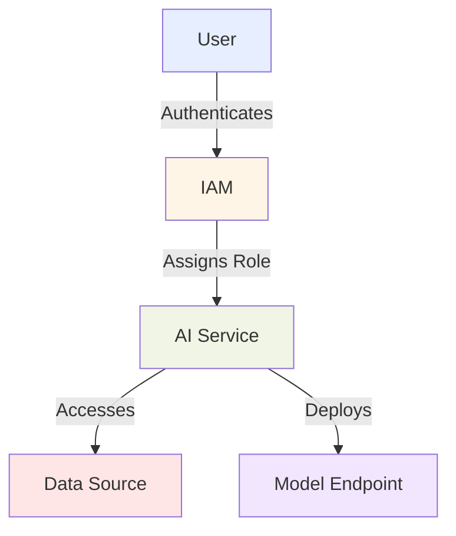
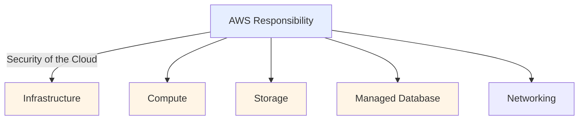
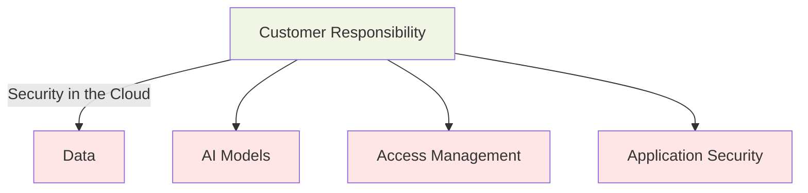
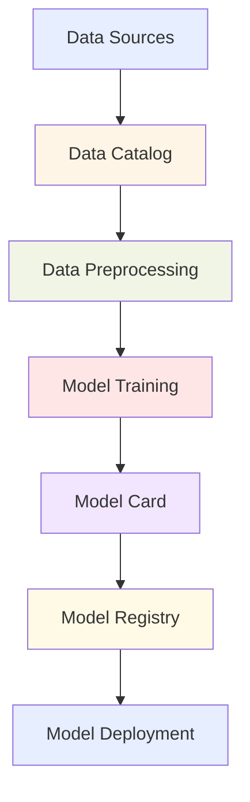
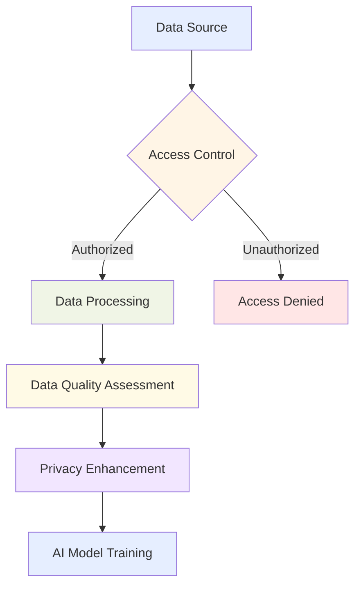
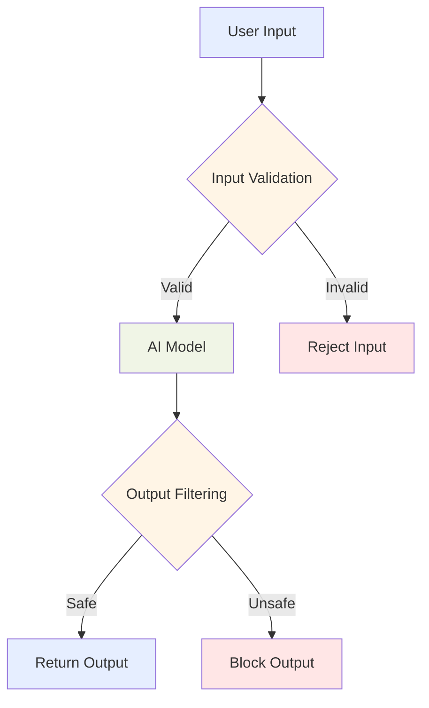

## 5.1 Methods to secure AI systems

Securing AI systems is a critical challenge for organizations leveraging machine learning technologies. As AI becomes embedded in core business processes, it introduces unique vulnerabilities that traditional security approaches may not address. For business professionals preparing for the AWS Certified AI Practitioner exam, understanding AI security methods is essential for building robust solutions that maintain data integrity, confidentiality, and availability.

The security landscape for AI encompasses multiple domains – from protecting sensitive training data to safeguarding model integrity and ensuring responsible deployment. A compromised AI system can lead to serious consequences, including data breaches, biased decisions, or manipulation of critical business processes. Implementing comprehensive security measures is therefore vital for regulatory compliance, customer trust, and organizational reputation.

This subchapter explores the multifaceted approach to securing AI systems on AWS, covering essential services, best practices, and key considerations. From AWS's robust identity management features to advanced data protection techniques, you'll gain practical knowledge of tools and strategies to secure your AI initiatives. These concepts will equip you to address security challenges and contribute to developing trustworthy, resilient AI solutions in your organization.

### Identify AWS services and features to secure AI systems

AWS provides a comprehensive suite of services designed to secure AI systems across all layers of the technology stack. Understanding these tools enables business professionals to protect their AI initiatives against potential threats and vulnerabilities effectively.

#### Identity and Access Management (IAM)

**IAM**[^1400] forms the foundation of AWS security by controlling access to AWS services and resources. For AI systems, IAM ensures that only authorized users and processes can interact with sensitive data and models.

Key IAM features for securing AI systems include:

- **IAM Roles**: Allow you to delegate permissions to AWS services without sharing long-term access keys. For example, you can create a role granting an Amazon **SageMaker**[^1401] notebook instance access to specific S3 buckets containing training data.

- **IAM Policies**: JSON documents defining permissions. You can create custom policies to fine-tune access to AI resources, such as allowing data scientists to train models while restricting production deployment capabilities.

- **IAM Permissions Boundaries**: Set maximum permissions an IAM entity can have, particularly useful in large organizations to prevent privilege escalation in AI projects.

*Figure 5.1.1: IAM Role-based Access Control for AI Services*

This diagram illustrates how IAM roles and policies control access to AI services and resources, ensuring that only authorized entities can interact with sensitive components of your AI system.

#### Encryption and Key Management

Protecting data at rest and in transit is crucial for AI systems that handle sensitive information. AWS provides several services for robust encryption:

- **AWS Key Management Service (KMS)**[^1402]: Creates and manages cryptographic keys used to encrypt your data. For AI workloads, KMS can encrypt training datasets, model artifacts, and inference results.

- **Amazon Macie**[^1403]: A data security service that uses machine learning to automatically discover, classify, and protect sensitive data. Particularly valuable for identifying personally identifiable information (PII) in datasets used for AI training.

- **AWS PrivateLink**[^1404]: Enables private access to AWS services without exposing traffic to the public internet. For AI systems, PrivateLink can securely connect your VPC to SageMaker endpoints or other AI services.

#### AWS Shared Responsibility Model

Understanding the **AWS Shared Responsibility Model**[^1405] is essential for securing AI systems in the cloud. This model clearly defines security responsibilities between AWS and customers:

- AWS is responsible for securing the underlying infrastructure running all AWS Cloud services.
- Customers are responsible for security "in" the cloud, including data encryption, access management, and application security.

For AI systems, while AWS secures the underlying compute resources and network infrastructure, you remain responsible for securing your AI models, training data, and applications consuming AI services.

*Figure 5.1.2: AWS Shared Responsibility Model for AI Systems*

This diagram illustrates the division of security responsibilities between AWS and the customer for AI systems, highlighting where each party should focus their security efforts.

By leveraging these AWS services and features, organizations can build a robust security foundation for their AI systems. Remember that security is an ongoing process requiring continuous monitoring and adaptation to emerging threats and vulnerabilities.

### Understand the concept of source citation and documenting data origins

Data integrity and provenance are fundamental to trustworthy AI systems. Documenting the origins of data used in AI development—known as *data lineage* or *source citation*—has become not just a best practice but increasingly a regulatory requirement across industries. This documentation ensures transparency, reproducibility, and accountability in AI models.

#### Data Lineage

**Data lineage** refers to the complete lifecycle of data, including its origins, movements, transformations, and destinations. For AI systems, proper data lineage helps:

- Trace the source of training data
- Document how data has been processed or transformed
- Identify potential biases or quality issues
- Ensure compliance with data usage regulations

AWS provides several tools to maintain data lineage:

- **AWS Glue Data Catalog**[^1406]: A fully managed metadata repository for storing, annotating, and sharing metadata about datasets used in AI projects.

- **Amazon SageMaker Data Wrangler**[^1407]: Provides visibility into data flows and transformations, helping data scientists document preprocessing steps applied to their datasets.

#### Data Cataloging

**Data cataloging** creates an organized inventory of data assets within an organization. For AI systems, a comprehensive data catalog:

- Facilitates data discovery for AI projects
- Provides context about data quality and relevance
- Enables governance and access control

AWS offers services that support data cataloging:

- **AWS Lake Formation**[^1408]: Helps build, secure, and manage data lakes, including a central catalog where you can register data and define access policies.

- **Amazon Athena**[^1409]: An interactive query service that works with the AWS Glue Data Catalog to query metadata about your datasets.

#### SageMaker Model Cards

**Amazon SageMaker Model Cards**[^1410] allows you to document essential information about machine learning models in a standardized format, including:

- Model purpose and intended use cases
- Training data sources and characteristics
- Model performance metrics
- Ethical considerations and potential biases

Model cards promote transparency and responsible AI practices by providing a clear record of a model's lineage and characteristics.

*Figure 5.1.3: Data and Model Lineage in AI Systems*

This diagram illustrates the flow of data and model information in an AI system, highlighting the role of data catalogs and model cards in documenting origins and characteristics.

Implementing robust source citation and data origin documentation practices is essential for:

1. **Regulatory Compliance**: Many industries require detailed records of data usage and model development processes.
2. **Model Governance**: Understanding data origins helps manage model versions and updates.
3. **Ethical AI**: Documenting data sources aids in identifying and mitigating potential biases.
4. **Reproducibility**: Detailed documentation enables model recreation and result validation.
5. **Trust and Transparency**: Clear documentation of data origins builds confidence among stakeholders and end-users.

By leveraging AWS tools and following best practices for source citation, organizations can build more trustworthy and compliant AI systems.

### Describe best practices for secure data engineering

Secure data engineering forms the critical foundation of robust AI systems. It encompasses practices designed to protect data integrity, ensure privacy, and maintain security throughout the data pipeline. For business professionals implementing AI on AWS, these best practices are essential for creating secure, compliant solutions.

#### Assessing Data Quality

Data quality directly affects AI model performance and reliability. Key practices for quality assessment include:

1. **Data Profiling**: Use **AWS Glue DataBrew**[^1411] to analyze data characteristics, identify anomalies, and understand distributions.

2. **Data Validation**: Implement checks to verify data accuracy, completeness, and consistency. SageMaker Data Wrangler provides features for validation and transformation.

3. **Data Cleansing**: Remove or correct inaccurate, incomplete, or irrelevant data. AWS Glue offers ETL capabilities for large-scale data cleansing.

4. **Monitoring Data Drift**: Continuously track changes in data distributions that could affect model performance. **Amazon SageMaker Model Monitor**[^1412] can detect data drift in production environments.

#### Implementing Privacy-Enhancing Technologies

Protecting sensitive information within datasets is crucial for maintaining privacy and compliance. AWS offers several privacy-enhancing technologies:

- **Amazon Macie**: Automatically discovers and protects sensitive data in AWS.
- **AWS Glue DataBrew**: Provides built-in transformations for data anonymization and pseudonymization.
- **AWS Encryption SDK**[^1413]: Enables easy encryption using industry-standard algorithms.

Best practices for implementing privacy-enhancing technologies include:

1. **Data Minimization**: Collect and retain only the data necessary for the specific AI task.
2. **Data Masking**: Use tokenization or hashing to protect sensitive fields.
3. **Differential Privacy**: Implement algorithms that add noise to data or query results to protect individual privacy while maintaining statistical accuracy.

#### Data Access Control

Implementing strict access controls ensures that only authorized personnel can interact with sensitive data:

1. **Principle of Least Privilege**: Grant users only the minimum permissions necessary to perform their tasks.
2. **Role-Based Access Control (RBAC)**: Use IAM roles to manage access based on job functions.
3. **Attribute-Based Access Control (ABAC)**: Implement fine-grained control using tags or other attributes.
4. **Data Encryption**: Use AWS KMS to manage encryption keys and encrypt data at rest and in transit.

*Figure 5.1.4: Secure Data Engineering Flow for AI Systems*

This diagram illustrates the key steps in secure data engineering for AI systems, highlighting access control, quality assessment, and privacy enhancement.

#### Ensuring Data Integrity

Maintaining data integrity throughout the AI pipeline is crucial for producing reliable models:

1. **Version Control**: Use **AWS CodeCommit**[^1414] or Amazon S3 versioning to track changes in datasets and code.
2. **Data Lineage Tracking**: Implement systems to record data transformations and processing steps.
3. **Checksums and Digital Signatures**: Verify data hasn't been tampered with during transfer or storage.
4. **Audit Trails**: Implement logging and monitoring using **AWS CloudTrail**[^1415] to track data access and modifications.

By implementing these best practices, organizations build a strong foundation for their AI initiatives, ensuring data quality, privacy, and integrity throughout the AI lifecycle.

### Understand security and privacy considerations for AI systems

AI systems present unique security and privacy challenges that extend beyond traditional IT security measures. A comprehensive approach is required to address the specific vulnerabilities associated with machine learning technologies and the sensitive data they process.

#### Application Security for AI Systems

Securing AI applications requires protecting both the model and its infrastructure:

1. **Model Integrity**: Ensure deployed models haven't been tampered with using **AWS SageMaker Model Registry**[^1416] to version and track models.

2. **Input Validation**: Implement robust validation to prevent *adversarial attacks* that manipulate model behavior, especially for models exposed through APIs.

3. **Output Sanitization**: Sanitize model outputs to prevent information leakage or injection attacks in downstream applications.

4. **API Security**: Use **Amazon API Gateway**[^1417] with **AWS WAF**[^1418] to protect AI model endpoints from common web exploits.

5. **Container Security**: For containerized AI applications, use **Amazon ECR**[^1419] scanning to detect vulnerabilities in container images.

#### Threat Detection and Vulnerability Management

Proactive security monitoring is essential for AI systems:

1. **Continuous Monitoring**: Use **Amazon GuardDuty**[^1420] to detect malicious activity and unauthorized behavior in your AWS environment.

2. **Vulnerability Scanning**: Regularly scan AI infrastructure with tools like **Amazon Inspector**[^1421].

3. **Penetration Testing**: Conduct regular tests to identify potential weaknesses, following AWS penetration testing policies.

4. **Incident Response**: Develop an AI-specific incident response plan. Use **AWS Security Hub**[^1422] to centralize security alerts and automate security checks.

#### Infrastructure Protection

Protecting the underlying infrastructure supporting AI systems is crucial:

1. **Network Segmentation**: Use **Amazon VPC**[^1423] to isolate AI workloads and implement network access controls.

2. **DDoS Protection**: Implement **AWS Shield**[^1424] to protect against Distributed Denial of Service attacks on AI model endpoints.

3. **Secure Communication**: Use AWS PrivateLink to establish private connectivity between VPCs and AWS services without exposing data to the public internet.

#### Prompt Injection Protection

*Prompt injection* represents a unique security concern for large language models (LLMs) and other generative AI systems:

1. **Input Sanitization**: Implement strict validation to prevent malicious prompts from being processed.

2. **Context Boundaries**: Establish clear boundaries between user inputs and system prompts to prevent unauthorized manipulation.

3. **Output Filtering**: Implement filters to detect and block potentially harmful outputs.

4. **Rate Limiting**: Use Amazon API Gateway to implement rate limiting and prevent abuse of AI endpoints.

*Figure 5.1.5: Prompt Injection Protection Flow*

This diagram illustrates the process of protecting against prompt injection attacks in AI systems, highlighting the importance of input validation and output filtering.

#### Encryption at Rest and in Transit

Protecting data confidentiality requires comprehensive encryption:

1. **Encryption at Rest**: Use AWS KMS to manage encryption keys for data stored in Amazon S3, Amazon EBS volumes, and other storage services.

2. **Encryption in Transit**: Implement TLS for all communications between AI system components. Use **AWS Certificate Manager**[^1425] to provision and manage SSL/TLS certificates.

3. **Client-Side Encryption**: For highly sensitive data, implement client-side encryption before uploading to AWS.

4. **Key Rotation**: Regularly rotate encryption keys to minimize the impact of potential key compromises.

By addressing these security and privacy considerations, organizations can build more resilient and trustworthy AI systems. Security in AI is an evolving field that requires staying informed about emerging threats and best practices to maintain a strong security posture.

Securing AI systems requires a multifaceted approach encompassing data protection, application security, infrastructure hardening, and ongoing vigilance. By leveraging AWS services and following best practices, business professionals can ensure their AI initiatives are not only innovative but also secure and compliant with regulatory requirements.

### Questions for self-check

1. **Which AWS service is most appropriate for implementing fine-grained access control to AI resources based on attributes such as user role, project, or data sensitivity?**

   A. AWS Key Management Service (KMS)
   B. Amazon Macie
   C. AWS Identity and Access Management (IAM)
   D. Amazon GuardDuty

2. **A data scientist is working on a machine learning project using sensitive customer data. Which of the following is NOT a recommended best practice for secure data engineering in this scenario?**

   A. Implementing data minimization techniques
   B. Using AWS Glue DataBrew for data anonymization
   C. Storing all data in a single Amazon S3 bucket for ease of access
   D. Encrypting data at rest using AWS KMS

3. **An AI team is concerned about potential prompt injection attacks on their large language model deployed on AWS. Which of the following is the MOST effective measure to mitigate this risk?**

   A. Implementing AWS Shield for DDoS protection
   B. Using Amazon SageMaker Model Monitor for data drift detection
   C. Applying strict input validation and sanitization
   D. Enabling versioning in Amazon S3 for model artifacts

4. **A company wants to ensure the integrity and provenance of data used in their AI models. Which AWS service would be MOST helpful in documenting the lifecycle and transformations of their datasets?**

   A. Amazon SageMaker Data Wrangler
   B. AWS Glue Data Catalog
   C. Amazon Athena
   D. AWS Lake Formation

5. **In the context of AI security on AWS, what is the primary purpose of Amazon SageMaker Model Cards?**

   A. To encrypt AI models during training and inference
   B. To detect vulnerabilities in containerized AI applications
   C. To document essential information about machine learning models
   D. To implement role-based access control for model deployment

### Answers and Explanations

1. **Correct answer: C. AWS Identity and Access Management (IAM)**

   Explanation: AWS IAM is the most appropriate service for implementing fine-grained access control to AI resources. It allows for the creation of detailed policies based on various attributes, including user roles, projects, and data sensitivity. While AWS KMS is crucial for encryption, Macie for data discovery, and GuardDuty for threat detection, IAM specifically handles the access control aspect, which is key to the question.[^1426]

2. **Correct answer: C. Storing all data in a single Amazon S3 bucket for ease of access**

   Explanation: Storing all data, especially sensitive customer data, in a single S3 bucket for ease of access is not a recommended best practice for secure data engineering. This approach violates the principle of least privilege and increases the risk of unauthorized access. The other options - data minimization, anonymization with AWS Glue DataBrew, and encryption with AWS KMS - are all recommended practices for handling sensitive data securely.[^1427]

3. **Correct answer: C. Applying strict input validation and sanitization**

   Explanation: To mitigate prompt injection attacks on large language models, applying strict input validation and sanitization is the most effective measure. This directly addresses the risk by preventing malicious prompts from being processed by the model. While the other options are important security measures, they don't specifically target prompt injection risks. AWS Shield protects against DDoS attacks, SageMaker Model Monitor detects data drift, and S3 versioning helps with model version control.[^1428]

4. **Correct answer: A. Amazon SageMaker Data Wrangler**

   Explanation: Amazon SageMaker Data Wrangler is the most helpful service for documenting the lifecycle and transformations of datasets used in AI models. It provides visibility into data flows and transformations, helping data scientists document the preprocessing steps applied to their datasets. While AWS Glue Data Catalog is useful for metadata storage, Athena for querying, and Lake Formation for data lake management, Data Wrangler specifically focuses on the data preparation and transformation process, which is key to maintaining data lineage.[^1429]

5. **Correct answer: C. To document essential information about machine learning models**

   Explanation: The primary purpose of Amazon SageMaker Model Cards is to document essential information about machine learning models. This includes details such as the model's purpose, intended use cases, training data sources, performance metrics, and ethical considerations. Model Cards play a crucial role in promoting transparency and responsible AI practices by providing a clear record of a model's lineage and characteristics. The other options, while important aspects of AI security, are not the primary functions of SageMaker Model Cards.[^1430]

[^1400]: AWS Identity and Access Management (IAM) Overview. URL: <https://aws.amazon.com/iam/>
[^1401]: Amazon SageMaker Overview. URL: <https://aws.amazon.com/sagemaker/>
[^1402]: AWS Key Management Service (KMS) Overview. URL: <https://aws.amazon.com/kms/>
[^1403]: Amazon Macie Overview. URL: <https://aws.amazon.com/macie/>
[^1404]: AWS PrivateLink Overview. URL: <https://aws.amazon.com/privatelink/>
[^1405]: AWS Shared Responsibility Model. URL: <https://aws.amazon.com/compliance/shared-responsibility-model/>
[^1406]: AWS Glue Data Catalog Overview. URL: <https://docs.aws.amazon.com/glue/latest/dg/components-overview.html#data-catalog-intro>
[^1407]: Amazon SageMaker Data Wrangler Overview. URL: <https://docs.aws.amazon.com/sagemaker/latest/dg/data-wrangler.html>
[^1408]: AWS Lake Formation Overview. URL: <https://aws.amazon.com/lake-formation/>
[^1409]: Amazon Athena Overview. URL: <https://aws.amazon.com/athena/>
[^1410]: Amazon SageMaker Model Cards Overview. URL: <https://docs.aws.amazon.com/sagemaker/latest/dg/model-cards.html>
[^1411]: AWS Glue DataBrew Overview. URL: <https://aws.amazon.com/glue/features/databrew/>
[^1412]: Amazon SageMaker Model Monitor Overview. URL: <https://docs.aws.amazon.com/sagemaker/latest/dg/model-monitor.html>
[^1413]: AWS Encryption SDK Overview. URL: <https://docs.aws.amazon.com/encryption-sdk/latest/developer-guide/introduction.html>
[^1414]: AWS CodeCommit Overview. URL: <https://aws.amazon.com/codecommit/>
[^1415]: AWS CloudTrail Overview. URL: <https://aws.amazon.com/cloudtrail/>
[^1416]: AWS SageMaker Model Registry Overview. URL: <https://docs.aws.amazon.com/sagemaker/latest/dg/model-registry.html>
[^1417]: Amazon API Gateway Overview. URL: <https://aws.amazon.com/api-gateway/>
[^1418]: AWS WAF (Web Application Firewall) Overview. URL: <https://aws.amazon.com/waf/>
[^1419]: Amazon Elastic Container Registry (ECR) Overview. URL: <https://aws.amazon.com/ecr/>
[^1420]: Amazon GuardDuty Overview. URL: <https://aws.amazon.com/guardduty/>
[^1421]: Amazon Inspector Overview. URL: <https://aws.amazon.com/inspector/>
[^1422]: AWS Security Hub Overview. URL: <https://aws.amazon.com/security-hub/>
[^1423]: Amazon Virtual Private Cloud (VPC) Overview. URL: <https://aws.amazon.com/vpc/>
[^1424]: AWS Shield Overview. URL: <https://aws.amazon.com/shield/>
[^1425]: AWS Certificate Manager Overview. URL: <https://aws.amazon.com/certificate-manager/>
[^1426]: AWS IAM Best Practices. URL: <https://docs.aws.amazon.com/IAM/latest/UserGuide/best-practices.html>
[^1427]: AWS Security Best Practices for S3. URL: <https://docs.aws.amazon.com/AmazonS3/latest/userguide/security-best-practices.html>
[^1428]: AWS Security Best Practices for AI/ML. URL: <https://docs.aws.amazon.com/whitepapers/latest/ml-best-practices-public-sector-organizations/security-and-compliance.html>
[^1429]: Amazon SageMaker Data Wrangler. URL: <https://docs.aws.amazon.com/sagemaker/latest/dg/data-wrangler.html>
[^1430]: Amazon SageMaker Model Cards Documentation. URL: <https://docs.aws.amazon.com/sagemaker/latest/dg/model-cards.html>