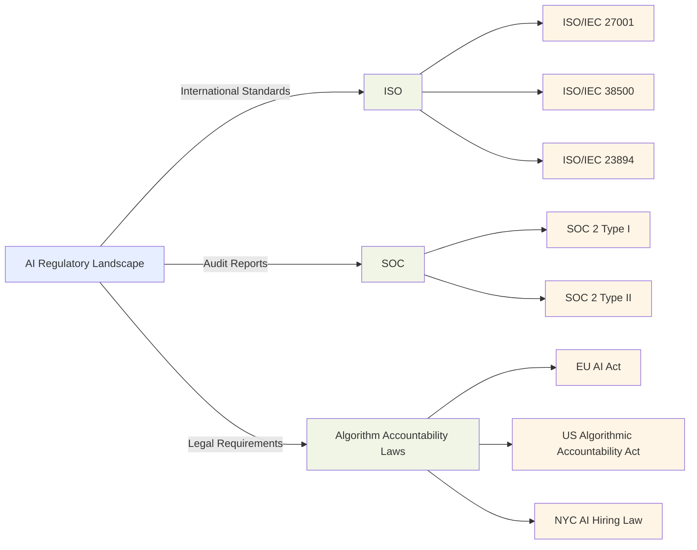
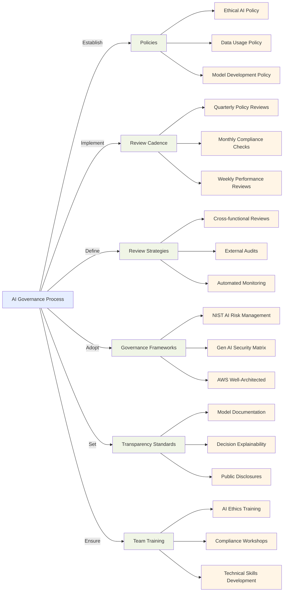

## 5.2 Recognize governance and compliance regulations for AI systems

Governance and compliance regulations form the foundation of responsible AI implementation. Organizations deploying AI systems must navigate regulatory requirements, ethical considerations, and industry standards to ensure their AI solutions operate within appropriate legal and ethical boundaries. **Regulatory frameworks** and **compliance protocols** protect sensitive data, ensure fair decision-making, and establish accountability for AI outcomes.

Understanding these regulations is essential not only for legal compliance but also for building stakeholder trust. Organizations demonstrating responsible AI practices gain competitive advantage through enhanced reputation and reduced regulatory risk. This knowledge represents a critical component for business professionals preparing for the AWS Certified AI Practitioner exam and implementing enterprise AI solutions.

### Identify regulatory compliance standards for AI systems

AI systems increasingly fall under various regulatory standards and compliance requirements designed to ensure responsible development and deployment with proper consideration for privacy, security, and ethics.

#### International Organization for Standardization (ISO)

ISO has developed several standards relevant to AI systems:

- ISO/IEC 27001: Information security management[^1500]
- ISO/IEC 38500: IT governance[^1501]
- ISO/IEC 23894: Artificial Intelligence &mdash; Risk Management[^1502]

These standards provide frameworks for managing information security, IT governance, and AI-specific risks. They help organizations establish **best practices** for AI development and deployment, ensuring that systems are secure, well-governed, and aligned with business objectives.

#### System and Organization Controls (SOC)

SOC reports, developed by the American Institute of Certified Public Accountants (AICPA), demonstrate the effectiveness of an organization's internal controls. For AI systems, **SOC 2 reports** are particularly relevant, focusing on security, availability, processing integrity, confidentiality, and privacy.[^1503]

- SOC 2 Type I: Assesses the design of controls at a specific point in time
- SOC 2 Type II: Evaluates the effectiveness of controls over a period (usually 6-12 months)

Organizations developing or using AI systems should consider obtaining SOC 2 certification to demonstrate their commitment to data protection and system integrity.

#### Algorithm Accountability Laws

Various jurisdictions are introducing laws specifically targeting the accountability of AI algorithms:

- EU Artificial Intelligence Act: Proposes a risk-based approach to regulating AI systems[^1504]
- US Algorithmic Accountability Act: Aims to increase transparency and accountability in automated decision systems[^1505]
- New York City's AI hiring law: Requires bias audits for AI-powered hiring tools[^1506]

These laws typically require organizations to:

- Conduct impact assessments for high-risk AI systems
- Ensure transparency in AI decision-making processes
- Implement measures to prevent bias and discrimination
- Provide mechanisms for human oversight and intervention

*Figure 5.2.1: AI Regulatory Landscape. This diagram illustrates the key components of the AI regulatory landscape, including international standards, audit reports, and legal requirements. It shows how these elements are interconnected and form a comprehensive framework for AI governance and compliance.*

To comply with these standards and laws, organizations must implement robust governance frameworks, conduct regular audits, and maintain comprehensive documentation of their AI systems. This includes detailing the data used for training, the decision-making processes, and the potential impacts on individuals and society.

### Identify AWS services and features to assist with governance and regulation compliance

AWS offers a comprehensive suite of services and features designed to help organizations meet governance and compliance obligations for AI systems. These tools streamline the implementation and maintenance of compliant AI solutions.

#### AWS Config

**AWS Config**[^1507] enables assessment, auditing, and evaluation of AWS resource configurations. For AI systems, it can:

- Monitor configuration changes in AI/ML resources
- Ensure resources meet predefined compliance rules
- Generate reports for auditing purposes

Example use case: Set up AWS Config rules to ensure that all Amazon SageMaker notebooks are encrypted and have proper access controls in place.

#### Amazon Inspector

**Amazon Inspector**[^1508] provides automated security assessment to improve security and compliance of applications deployed on AWS. For AI systems, it:

- Identifies security vulnerabilities in EC2 instances running AI workloads
- Checks for compliance with security best practices
- Provides detailed reports on findings and remediation steps

Example use case: Use Amazon Inspector to regularly scan the infrastructure hosting your AI models for vulnerabilities and compliance issues.

#### AWS Audit Manager

**AWS Audit Manager**[^1509] helps continuously audit AWS usage to simplify risk assessment and compliance with regulations and industry standards. For AI governance, it can:

- Map AWS resources to specific compliance requirements
- Automate evidence collection for audits
- Provide a centralized dashboard for compliance monitoring

Example use case: Create an Audit Manager assessment framework for AI systems that aligns with ISO/IEC 27001 requirements.

#### AWS Artifact

**AWS Artifact**[^1510] provides on-demand access to AWS security and compliance reports and select online agreements. For AI compliance, it offers:

- Access to AWS compliance reports (e.g., SOC reports, ISO certifications)
- Self-service access to AWS agreements
- A centralized repository for compliance documentation

Example use case: Use AWS Artifact to obtain the necessary compliance reports when undergoing a third-party audit of your AI systems.

#### AWS CloudTrail

**AWS CloudTrail**[^1511] records actions taken by users, roles, or AWS services in your account. For AI governance, it:

- Logs all API calls related to AI/ML resources
- Provides an audit trail for compliance and operational audits
- Enables security analysis and troubleshooting

Example use case: Set up CloudTrail to monitor and log all actions performed on your SageMaker resources, ensuring traceability of model development and deployment activities.

#### AWS Trusted Advisor

**AWS Trusted Advisor**[^1512] offers recommendations that help you follow AWS best practices. For AI systems, it can:

- Provide cost optimization suggestions for AI/ML workloads
- Identify security vulnerabilities in your AI infrastructure
- Offer performance improvement recommendations

Example use case: Use Trusted Advisor to optimize the cost and performance of your AI workloads running on Amazon EC2 instances.

By leveraging these AWS services, organizations can create a comprehensive governance and compliance framework for their AI systems. This approach not only helps meet regulatory requirements but also builds trust with stakeholders by demonstrating commitment to responsible AI practices.

### Describe data governance strategies

Effective data governance ensures the integrity, security, and compliance of AI systems. A robust data governance strategy encompasses multiple aspects of data management throughout its lifecycle.

#### Data Lifecycles

The **data lifecycle** in AI systems typically includes the following stages:

1. Data Collection: Gathering raw data from various sources
2. Data Preparation: Cleaning, transforming, and labeling data
3. Data Storage: Securely storing data in appropriate formats and locations
4. Data Usage: Utilizing data for model training and inference
5. Data Archival: Long-term storage of historical data
6. Data Deletion: Securely removing data when no longer needed

Implementing governance at each stage ensures data quality, security, and compliance throughout the AI system's lifecycle.

#### Logging

Comprehensive logging maintains an audit trail and ensures accountability in AI systems. Key aspects include:

- **Activity Logging**: Recording all actions performed on data and models
- **Access Logging**: Tracking who accessed data and when
- **Model Performance Logging**: Monitoring model predictions and outcomes

Tools like AWS CloudTrail and Amazon CloudWatch[^1513] implement robust logging practices for AI workloads on AWS.

#### Data Residency

**Data residency** refers to the geographic location where data is stored and processed. Considerations include:

- Compliance with local data protection laws (e.g., GDPR in the EU)
- Use of AWS Regions and Availability Zones to control data location
- Implementation of data transfer mechanisms that comply with regulations

Example: Use Amazon S3 Object Lock[^1514] to enforce data residency requirements by preventing data from being transferred out of specific AWS Regions.

#### Monitoring and Observation

Continuous monitoring of AI systems is crucial for maintaining governance and compliance. Key areas to monitor include:

- **Model Performance**: Tracking accuracy, bias, and drift
- **Data Quality**: Monitoring incoming data for anomalies or quality issues
- **System Health**: Observing infrastructure metrics and logs

AWS services like Amazon SageMaker Model Monitor[^1515] can automate the monitoring of production ML models.

#### Data Retention

Establishing clear data retention policies is essential for compliance and resource management:

- Define retention periods based on legal requirements and business needs
- Implement automated data lifecycle management using services like Amazon S3 Lifecycle policies[^1516]
- Ensure secure deletion of data at the end of its retention period

Example: Set up an S3 Lifecycle rule to automatically move data to Amazon S3 Glacier Deep Archive after a specified period and delete it after the required retention period.

Implementing these data governance strategies helps organizations maintain control over their data assets, ensure compliance with regulations, and build trust in their AI systems. Regular review and updating of these strategies keeps pace with evolving regulatory requirements and technological advancements.

### Describe processes to follow governance protocols

Implementing and following governance protocols ensures AI systems are developed and deployed responsibly. These processes help organizations maintain compliance, manage risks, and build stakeholder trust.

#### Policies

Developing comprehensive AI governance policies forms the foundation of responsible AI practices:

- **Ethical AI Policy**: Outlining principles for fair and unbiased AI development
- **Data Usage Policy**: Defining rules for data collection, storage, and processing
- **Model Development Policy**: Establishing standards for model creation and validation
- **Deployment Policy**: Setting guidelines for putting AI models into production

Example: Create an AI Ethics Board to oversee policy development and enforcement across the organization.

#### Review Cadence

Regular reviews maintain effective governance:

- Quarterly Policy Reviews: Assess and update governance policies
- Monthly Compliance Checks: Ensure ongoing adherence to regulations
- Weekly Model Performance Reviews: Monitor AI system outputs and impacts

Implement automated review processes using AWS services like Amazon SageMaker Model Monitor for continuous model evaluation.

#### Review Strategies

Effective review strategies ensure comprehensive governance:

- **Cross-functional Reviews**: Involve stakeholders from various departments
- **External Audits**: Engage third-party experts for unbiased assessments
- **Automated Monitoring**: Use tools to continuously track compliance metrics

Example: Implement a multi-stage review process for high-risk AI models, including technical, ethical, and legal assessments before deployment.

#### Governance Frameworks

Adopting established governance frameworks provides structure to AI governance efforts:

- **NIST AI Risk Management Framework**[^1517]: Provides guidelines for managing AI risks
- **Generative AI Security Scoping Matrix**[^1518]: Helps identify security considerations for generative AI systems
- **AWS Well-Architected Framework**[^1519]: Offers best practices for designing and operating reliable, secure, efficient, and cost-effective systems

Customize these frameworks to fit your organization's specific needs and AI use cases.

#### Transparency Standards

Implementing transparency standards builds trust and facilitates compliance:

- **Model Documentation**: Create detailed records of model architecture, training data, and performance metrics
- **Decision Explainability**: Implement techniques to make AI decisions interpretable
- **Public Disclosures**: Communicate AI usage and impacts to relevant stakeholders

Use tools like Amazon SageMaker Model Cards[^1520] to document and share information about your ML models.

#### Team Training Requirements

Ensuring team competency is crucial for effective governance:

- **AI Ethics Training**: Educate teams on ethical considerations in AI development
- **Compliance Workshops**: Conduct regular sessions on regulatory requirements
- **Technical Skills Development**: Provide ongoing training on AI technologies and best practices

Leverage AWS Training and Certification programs[^1521] to enhance your team's AI and ML skills.

*Figure 5.2.4: AI Governance Processes in Organization. This diagram illustrates the key components of an AI governance process. It shows how policies, review processes, governance frameworks, transparency standards, and team training requirements are interconnected to form a comprehensive governance strategy.*

By implementing these governance protocols, organizations ensure their AI systems are developed and deployed responsibly, in compliance with regulations, and aligned with ethical principles. Regular review and adaptation of these processes are essential to keep pace with the rapidly evolving AI landscape and regulatory environment.

In conclusion, recognizing and implementing governance and compliance regulations for AI systems is crucial for organizations leveraging AI technologies responsibly. By understanding regulatory standards, utilizing AWS services for compliance assistance, implementing robust data governance strategies, and following comprehensive governance protocols, businesses can build trust, mitigate risks, and unlock the full potential of AI while maintaining ethical and legal integrity.

### Questions for self-check

1. **Which AWS service provides automated security assessments to help improve the security and compliance of applications deployed on AWS?**

   A. AWS Config
   B. Amazon Inspector
   C. AWS Audit Manager
   D. AWS CloudTrail

2. **A company is implementing a data governance strategy for its AI systems. Which of the following is NOT typically considered a stage in the data lifecycle?**

   A. Data Collection
   B. Data Preparation
   C. Data Encryption
   D. Data Archival

3. **An organization wants to ensure that its AI models are developed and deployed responsibly. Which of the following is a key component of an effective AI governance process?**

   A. Maximizing model complexity
   B. Implementing transparency standards
   C. Avoiding external audits
   D. Limiting cross-functional reviews

4. **A financial services company needs to demonstrate compliance with industry standards for its AI systems. Which AWS service provides on-demand access to AWS security and compliance reports?**

   A. AWS Trusted Advisor
   B. Amazon SageMaker
   C. AWS Artifact
   D. AWS Config

5. **Which of the following best describes the purpose of the NIST AI Risk Management Framework in the context of AI governance?**

   A. It provides guidelines for optimizing AI model performance
   B. It offers best practices for designing cost-effective AI systems
   C. It helps identify security considerations for generative AI systems
   D. It provides guidelines for managing AI risks

### Answers and Explanations

1. **Correct answer: B. Amazon Inspector**

   Explanation: Amazon Inspector is an automated security assessment service that helps improve the security and compliance of applications deployed on AWS. It can identify security vulnerabilities in EC2 instances running AI workloads, check for compliance with security best practices, and provide detailed reports on findings and remediation steps.[^1522] AWS Config, AWS Audit Manager, and AWS CloudTrail serve different purposes in governance and compliance but do not provide automated security assessments like Amazon Inspector.

2. **Correct answer: C. Data Encryption**

   Explanation: While data encryption is an important aspect of data security, it is not typically considered a distinct stage in the data lifecycle for AI systems. The data lifecycle usually includes stages such as Data Collection, Data Preparation, Data Storage, Data Usage, Data Archival, and Data Deletion.[^1523] Data encryption is a security measure that can be applied across various stages of the lifecycle, rather than being a stage itself.

3. **Correct answer: B. Implementing transparency standards**

   Explanation: Implementing transparency standards is a key component of effective AI governance. It involves creating detailed documentation of model architecture, training data, and performance metrics, as well as implementing techniques to make AI decisions interpretable.[^1524] This builds trust and facilitates compliance. The other options are either incorrect (maximizing model complexity is not a governance goal) or contrary to good governance practices (avoiding external audits and limiting cross-functional reviews would hinder effective governance).

4. **Correct answer: C. AWS Artifact**

   Explanation: AWS Artifact provides on-demand access to AWS security and compliance reports and select online agreements. It offers a centralized repository for compliance documentation, including access to AWS compliance reports such as SOC reports and ISO certifications.[^1525] This makes it the ideal service for a financial services company needing to demonstrate compliance with industry standards. The other services mentioned do not provide this specific functionality.

5. **Correct answer: D. It provides guidelines for managing AI risks**

   Explanation: The NIST AI Risk Management Framework provides guidelines for managing AI risks. It offers a structured approach to identifying, assessing, and mitigating risks associated with the development and use of AI systems.[^1526] While the other options may be related to AI governance, they do not accurately describe the primary purpose of the NIST AI Risk Management Framework. This framework is crucial for organizations looking to implement responsible AI practices and ensure compliance with governance protocols.

[^1500]: ISO/IEC 27001 Information Security Management. URL: <https://www.iso.org/isoiec-27001-information-security.html>
[^1501]: ISO/IEC 38500 IT Governance. URL: <https://www.iso.org/standard/62816.html>
[^1502]: ISO/IEC 23894 Artificial Intelligence � Risk Management. URL: <https://www.iso.org/standard/77304.html>
[^1503]: AICPA SOC 2 - SOC for Service Organizations: Trust Services Criteria. URL: <https://us.aicpa.org/interestareas/frc/assuranceadvisoryservices/aicpasoc2report>
[^1504]: European Commission: Proposal for a Regulation on Artificial Intelligence. URL: <https://digital-strategy.ec.europa.eu/en/policies/regulatory-framework-ai>
[^1505]: US Algorithmic Accountability Act of 2022. URL: <https://www.congress.gov/bill/117th-congress/house-bill/6580>
[^1506]: New York City's AI hiring law. URL: <https://www.nyc.gov/site/dca/about/automated-employment-decision-tools.page>
[^1507]: AWS Config. URL: <https://aws.amazon.com/config/>
[^1508]: Amazon Inspector. URL: <https://aws.amazon.com/inspector/>
[^1509]: AWS Audit Manager. URL: <https://aws.amazon.com/audit-manager/>
[^1510]: AWS Artifact. URL: <https://aws.amazon.com/artifact/>
[^1511]: AWS CloudTrail. URL: <https://aws.amazon.com/cloudtrail/>
[^1512]: AWS Trusted Advisor. URL: <https://aws.amazon.com/premiumsupport/technology/trusted-advisor/>
[^1513]: Amazon CloudWatch. URL: <https://aws.amazon.com/cloudwatch/>
[^1514]: Amazon S3 Object Lock. URL: <https://docs.aws.amazon.com/AmazonS3/latest/userguide/object-lock.html>
[^1515]: Amazon SageMaker Model Monitor. URL: <https://docs.aws.amazon.com/sagemaker/latest/dg/model-monitor.html>
[^1516]: Amazon S3 Lifecycle policies. URL: <https://docs.aws.amazon.com/AmazonS3/latest/userguide/object-lifecycle-mgmt.html>
[^1517]: NIST AI Risk Management Framework. URL: <https://www.nist.gov/itl/ai-risk-management-framework>
[^1518]: AWS Generative AI Security Scoping Matrix. URL: <https://aws.amazon.com/ai/generative-ai/security/scoping-matrix/>
[^1519]: AWS Well-Architected Framework. URL: <https://aws.amazon.com/architecture/well-architected/>
[^1520]: Amazon SageMaker Model Cards. URL: <https://docs.aws.amazon.com/sagemaker/latest/dg/model-cards.html>
[^1521]: AWS Training and Certification. URL: <https://aws.amazon.com/training/>
[^1522]: Amazon Inspector Features. URL: <https://aws.amazon.com/inspector/features/>
[^1523]: AWS Machine Learning Lifecycle. URL: <https://docs.aws.amazon.com/wellarchitected/latest/machine-learning-lens/machine-learning-lifecycle.html>
[^1524]: AWS AI/ML Governance Best Practices. URL: <https://aws.amazon.com/blogs/enterprise-strategy/responsible-ai-best-practices-promoting-responsible-and-trustworthy-ai-systems/>
[^1525]: AWS Artifact Overview. URL: <https://aws.amazon.com/artifact/>
[^1526]: NIST AI Risk Management Framework Overview. URL: <https://www.nist.gov/itl/ai-risk-management-framework>