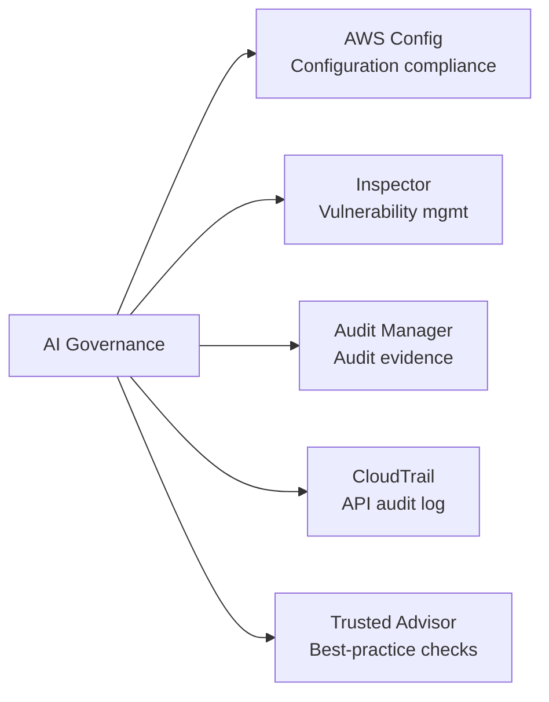
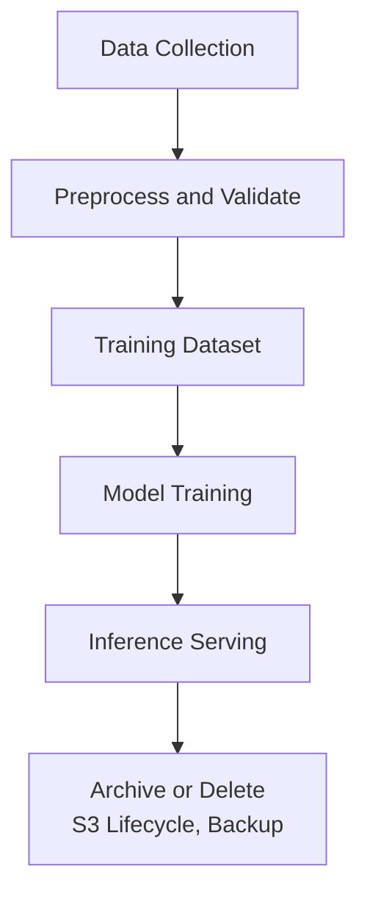
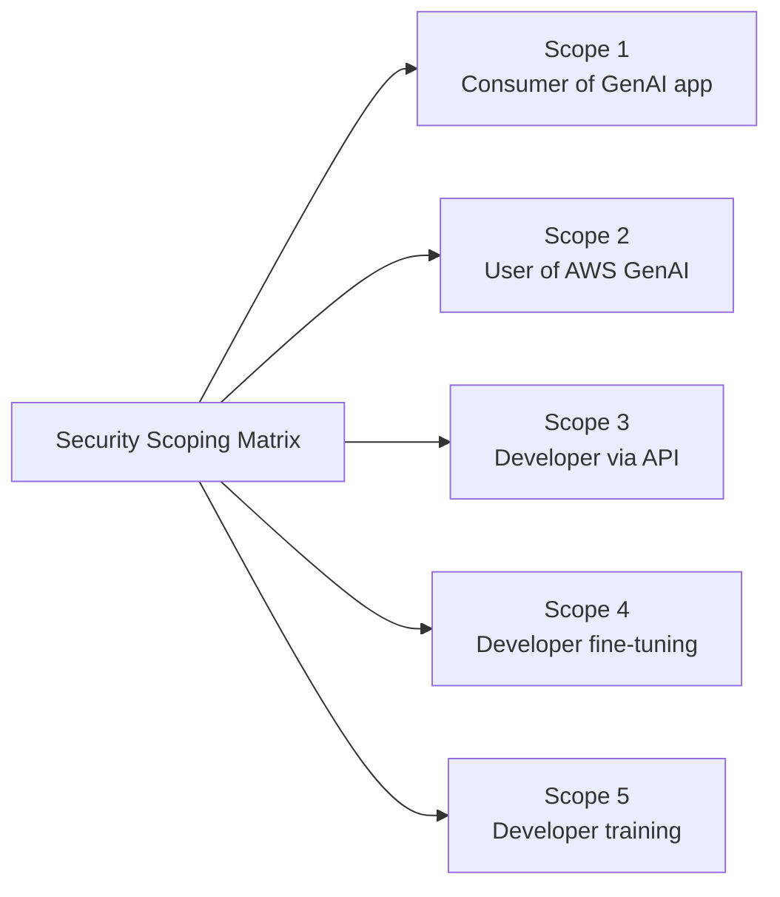
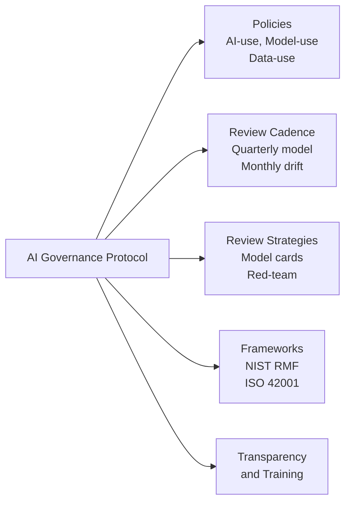

## Task Statement 5.2: Recognize governance and compliance regulations for AI systems

Governance and compliance translate the principles of responsible AI into organizational accountability. Where security controls protect the technical layer, governance structures create the policies, review cycles, audit trails, and regulatory evidence that let an organization explain, defend, and continuously improve its AI systems. This task statement covers the AWS services that support compliance evidence collection, the data governance strategies auditors expect, and the governance processes that give AI programs durable institutional backing.[^502001]

### 5.2.1 AWS services and features for governance and compliance

Compliance for an AI workload is not a single gate passed at deployment; it is an ongoing state maintained through continuous monitoring, evidence collection, and audit-readiness. AWS provides a set of managed services that collectively cover the full compliance lifecycle: configuration recording, vulnerability scanning, framework-aligned evidence collection, on-demand report retrieval, API audit logging, and best-practice checks. Used together, these services let an organization demonstrate to regulators, auditors, and internal stakeholders that its AI systems operate within defined boundaries.

The relationship between these services follows a logical division of labor. **AWS Config** tracks the configuration state of resources and evaluates whether they comply with defined rules. **Amazon Inspector** finds vulnerabilities in the compute and container layers that host AI workloads. **AWS Audit Manager** organizes compliance evidence into audit-ready packages aligned to specific frameworks. **AWS Artifact** gives authorized users access to AWS's own third-party compliance certifications. **AWS CloudTrail** creates the immutable API-activity log that proves who did what and when. **AWS Trusted Advisor** identifies configuration gaps against AWS best practices across cost, security, fault tolerance, and service limits.

*Figure 5.2.1: AWS compliance service categories. Each service addresses a distinct layer of the audit and governance stack for AI workloads.*

**AWS Config** is a configuration recording and rules-evaluation service that continuously tracks the state of AWS resources and checks them against policy-defined compliance rules.[^502002] When a resource changes, Config records the new configuration, compares it against the applicable rules, and flags any that are non-compliant. For AI workloads, three rule categories are particularly relevant. First, Bedrock model invocation logging can be verified: a Config rule can check that logging is enabled for Amazon Bedrock, ensuring that every model request is captured for audit and analysis.[^502003] Second, SageMaker notebook access can be controlled: a rule checking that Amazon SageMaker notebook instances require IAM-based access prevents direct internet exposure of notebook environments where training code and data live.[^502004] Third, encryption can be enforced: a rule verifying that Bedrock custom model artifacts and SageMaker training volumes are encrypted at rest ensures that sensitive model parameters and training data are always protected.[^502005]

Config rules can be grouped into *conformance packs*, which bundle multiple related rules into a deployable unit aligned to a specific compliance requirement such as NIST SP 800-53 or the AWS Foundational Security Best Practices standard.[^502006] When an organization wants to demonstrate that its AI environment meets a framework's control requirements, deploying the corresponding conformance pack and exporting its compliance dashboard provides a single, reproducible view of control status.

**Amazon Inspector** is a continuous vulnerability assessment service that scans Amazon EC2 instances, AWS Lambda functions, and container images stored in Amazon Elastic Container Registry (ECR) for known software vulnerabilities and unintended network exposures.[^502007] AI workloads frequently run on infrastructure that Inspector covers: SageMaker training jobs execute on EC2 instance fleets, inference containers are stored in ECR, and custom inference code may run as Lambda functions. Inspector correlates findings with the Common Vulnerabilities and Exposures (CVE) database and assigns a risk score, letting security teams prioritize which vulnerabilities to remediate first based on exploitability and impact.[^502008] For governance, Inspector's findings feed directly into AWS Security Hub, providing a centralized dashboard that auditors can review alongside other compliance signals.

**AWS Audit Manager** automates evidence collection for compliance audits.[^502009] Rather than manually extracting screenshots and log excerpts before each audit cycle, organizations configure Audit Manager with a framework, and the service continuously collects evidence from AWS Config rule results, CloudTrail API calls, and Security Hub findings. The service ships prebuilt frameworks for HIPAA, SOC 2, PCI DSS, ISO 27001, FedRAMP, and other standards, as well as tools to build custom frameworks for internal audit programs or emerging AI-specific requirements.[^502010] Evidence is stored in a structured assessment report that an auditor can review without requiring direct access to the AWS environment. For AI programs under HIPAA, for example, Audit Manager can collect evidence that training data is encrypted, that access to model endpoints is logged, and that changes to model configurations are recorded, producing an audit package that demonstrates control operation over a defined period.

**AWS Artifact** is the self-service portal where AWS customers can download AWS's own compliance certifications and agreements.[^502011] Reports available include SOC 1, SOC 2, and SOC 3 reports (system and organization controls audits performed by independent third parties), ISO 27001, ISO 27017, and ISO 27018 certifications (information security management and cloud privacy), PCI DSS Attestation of Compliance (for payment card workloads), and HIPAA Business Associate Addenda (BAA) for covered healthcare entities.[^502012] Artifact does not generate evidence about the customer's own workloads; it provides evidence about AWS's controls as the underlying infrastructure provider. This distinction matters for the shared responsibility model: the customer presents Artifact reports to demonstrate that the cloud platform itself meets the regulator's infrastructure requirements, while Audit Manager evidence demonstrates that the customer's configuration and operations meet the same requirements.

**AWS CloudTrail** records every API call made to AWS services and delivers event records to an Amazon S3 bucket within minutes of the call.[^502013] For AI workloads, this includes every Amazon Bedrock InvokeModel API call (capturing which model was invoked, by whom, at what time, and with what result code), every SageMaker CreateTrainingJob and CreateEndpoint call, and every IAM policy change that affects model access. CloudTrail also supports data events, which record object-level activity in Amazon S3. Enabling S3 data events on a training-data bucket produces a log of every read and write against training files, creating an auditable chain of custody that demonstrates no unauthorized modifications occurred between data preparation and model training.[^502014] CloudTrail Lake, the service's managed analytics layer, allows SQL-based queries against event history without requiring an external log analytics system, making it straightforward to answer auditor questions such as "Show me every time the production model endpoint configuration changed in the past 90 days."[^502015]

**AWS Trusted Advisor** evaluates AWS account configurations against AWS best practices across five categories: cost optimization, performance, security, fault tolerance, and service limits.[^502016] From a governance perspective, the security checks are most directly relevant to AI compliance programs. Trusted Advisor flags conditions such as S3 bucket public access, unrestricted security group rules, IAM access keys that have not been rotated, and root account usage. For AI workloads, service-limit checks matter too: a SageMaker endpoint that is approaching its instance-count limit may fail to scale during a peak inference period, which could constitute a service availability issue reportable under certain SLAs.[^502017] Trusted Advisor results are available in the AWS console and via API, so they can be ingested into compliance dashboards alongside Config, Inspector, and Security Hub findings.

*Table 5.2.1: AWS governance and compliance services mapped to AI use cases*

| Service | Primary function | AI-specific governance use case |
|---|---|---|
| AWS Config | Configuration recording and rules evaluation | Verify Bedrock logging enabled; enforce SageMaker IAM-only access; check encryption on model artifacts |
| Amazon Inspector | Vulnerability scanning for EC2, Lambda, ECR | Scan inference containers and Lambda functions for CVEs; detect unintended network exposure |
| AWS Audit Manager | Automated evidence collection for audit frameworks | Collect HIPAA, SOC 2, PCI evidence for AI workloads; produce audit-ready reports |
| AWS Artifact | Download AWS compliance certifications | Retrieve SOC, ISO, PCI, HIPAA BAA to demonstrate platform compliance to regulators |
| AWS CloudTrail | Immutable API audit log | Log every Bedrock InvokeModel call; record S3 data-event access on training buckets |
| AWS Trusted Advisor | Best-practice checks across security, cost, limits | Flag public S3 buckets, unrotated IAM keys, SageMaker service-limit risks |

Together, these six services form the compliance instrumentation layer for an AI workload on AWS. Config and Inspector monitor the current state. CloudTrail records the historical state. Audit Manager packages both into audit evidence. Artifact supplies AWS's own compliance certifications. Trusted Advisor identifies gaps before auditors or incidents do.

AWS Security Hub aggregates findings from Config, Inspector, and Macie into a single compliance dashboard. It is covered in Task 5.1 because it sits at the security-monitoring layer, but it is the natural consumer of the signals these six governance services produce. The next section covers how data governance strategies layer on top of this instrumentation to manage the information the AI systems process.

### 5.2.2 Data governance strategies

Data is the upstream input that determines what an AI system can know and how it will behave. Governing data for AI means managing its complete lifecycle, from initial collection through active use, archival, and final deletion, with defined controls at each stage. An AI system that processes customer health records, financial transactions, or personal communications carries the data-governance obligations of the organization that collected that data; a model does not create a legal exemption from privacy, residency, or retention requirements.

The discipline of *data governance* covers six practices the exam expects business professionals to recognize: lifecycle management, logging, residency, monitoring, observation, and retention. Each practice addresses a different category of governance risk.

**Data lifecycle management** traces the path data follows from the moment it is created or acquired to the moment it is deleted or archived.[^502018] For an AI training dataset, the lifecycle typically moves through collection and ingestion, preprocessing and validation, training and model-artifact storage, inference-time feature derivation, and final archival or deletion when the model is retired. Each stage should have a documented owner, defined quality standards, and an access policy that limits who can read or modify data at that stage. **AWS Glue Data Catalog** records the metadata of datasets at each stage: table schemas, data types, last-modified timestamps, and column-level descriptions.[^502019] When an auditor asks what data a specific model version was trained on, the Glue Data Catalog entry for the training dataset, linked to the SageMaker model card, provides the traceable answer.

**AWS Lake Formation** extends the Glue Data Catalog with fine-grained access control, allowing organizations to grant column-level, row-level, and cell-level permissions on datasets stored in Amazon S3.[^502020] For AI governance, this matters when a training dataset contains a mix of personally identifiable information (PII) columns and non-PII columns. Lake Formation can grant a machine learning engineer read access to the non-PII columns while preventing access to names, addresses, and identification numbers until a formal data-use agreement is in place. This *need-to-know* model at the column level is substantially more precise than bucket-level IAM policies and is the approach regulators expect for sensitive-data processing.

*Figure 5.2.2: AI data lifecycle. Data flows from collection through training and inference to archival, with governance controls applied at each stage.*

**Logging** in the data governance context refers to capturing what data was accessed, by which system or user, at what time, and for what purpose.[^502021] For an AI application, three logging surfaces are relevant. CloudTrail data events record reads and writes on S3 training buckets and model artifact buckets, providing the access log at the object level. Amazon Bedrock model invocation logging captures the input prompt, the model response, and metadata for every inference call, which matters when downstream regulations require that the organization be able to reconstruct what information was provided to users.[^502022] Amazon CloudWatch Logs retains application-level logs from Lambda functions, ECS containers, and SageMaker inference endpoints, capturing runtime errors and output patterns that may reveal unintended data exposure. Logging retention periods should be set to meet the governing regulation: HIPAA requires a minimum of six years for certain records, PCI DSS requires one year with 90 days of immediate availability, and many financial regulators require seven years.[^502023]

**Data residency** is the requirement that data remain within a defined geographic boundary, typically driven by law.[^502024] The European Union's General Data Protection Regulation (GDPR) restricts the transfer of EU residents' personal data to countries outside the European Economic Area unless specific safeguards are in place.[^502025] For AWS AI workloads, residency is controlled through region selection. Training data for an EU-regulated application should reside in S3 buckets in an `eu-*` region, model training jobs should be configured to run in that region, and Amazon Bedrock model invocations should use an endpoint in the same region. **Amazon Bedrock** respects the region designation: the model inference call is processed in the region where the endpoint is configured, and the input and output data do not leave that region except as explicitly configured.[^502026] Residency compliance requires disciplined region selection throughout the entire pipeline, not just at the storage layer.

**Monitoring** in data governance tracks whether data access and usage patterns remain within the boundaries defined by policy.[^502027] For an AI system, monitoring includes checking that the model is not being invoked with data categories it was not approved to process, that output responses do not contain PII that should have been suppressed, and that API call volumes do not spike in ways that suggest data exfiltration attempts. Amazon CloudWatch Metrics captures operational signals, **Amazon Macie** scans S3 buckets for PII content and unusual access patterns (discussed in Task 5.1 in the context of data security), and Bedrock invocation logging provides the raw material for custom detection rules built in CloudWatch Logs Insights. Where monitoring asks "is anyone breaking the rules?", observation (covered next) asks "is the data itself changing under us?"

**Observation** is the practice of continuously tracking the statistical properties of data flowing through an AI system to detect *data drift*.[^502028] Data drift occurs when the distribution of data seen in production differs meaningfully from the distribution used to train the model. For example, a fraud-detection model trained on 2022 transactions may have learned patterns that no longer characterize 2024 fraud behavior; the model's predictions degrade while its structural performance metrics remain unchanged. Observing data drift requires capturing a representative sample of inference inputs, computing their statistical properties, and comparing those properties against a baseline established from the training dataset. **Amazon SageMaker Model Monitor** automates this process, scheduling data quality and model quality baseline comparisons and raising CloudWatch alarms when drift exceeds configurable thresholds.[^502029]

**Retention** defines how long data must be kept and when it must be deleted.[^502030] Retention policy covers both a minimum (legal and regulatory minimum periods) and a maximum (privacy laws may prohibit keeping personal data longer than necessary for its original purpose). **Amazon S3 Lifecycle policies** automate the transition of objects through storage tiers (Standard to Standard-IA to Glacier to Glacier Deep Archive) on a defined schedule and enforce deletion at end-of-retention.[^502031] **AWS Backup** provides a centralized service for scheduling, monitoring, and enforcing backup and retention policies across S3, RDS, DynamoDB, EFS, and other services, with immutable recovery points that cannot be deleted before a configured retention period expires, a property regulators treat as equivalent to a legal hold.[^502032]

*Table 5.2.2: Data governance practices mapped to AWS services and AI risks*

| Governance practice | What it addresses | Relevant AWS service | AI-specific risk mitigated |
|---|---|---|---|
| Data lifecycle management | Tracing data from creation to deletion | AWS Glue Data Catalog, AWS Lake Formation | Inability to identify training data source during audit |
| Logging | Capturing access and usage records | AWS CloudTrail (data events), Bedrock invocation logging, CloudWatch Logs | Inability to reconstruct model interactions for regulatory inquiry |
| Data residency | Keeping data within geographic boundaries | Region selection, Amazon Bedrock region-locked endpoints | GDPR violation, cross-border data transfer without safeguards |
| Monitoring | Detecting policy violations in data access and output | Amazon Macie, CloudWatch Metrics, Bedrock logging | PII exposure in model output, unauthorized data access |
| Observation | Detecting drift in data distribution over time | Amazon SageMaker Model Monitor | Silent model degradation due to shifted input distribution |
| Retention | Enforcing minimum and maximum data retention | Amazon S3 Lifecycle policies, AWS Backup | Holding personal data beyond legal limit; premature deletion of evidence |

These six practices apply to every stage of the AI data lifecycle. Organizations that formalize each practice in written policy, map it to the specific AWS services in their environment, and run periodic checks against that mapping are in a substantially better position when regulators or internal auditors ask for evidence of data governance maturity. The following section covers how governance protocols connect the policies and services into a structured program.

### 5.2.3 Processes to follow governance protocols

Technical controls and data practices have limited organizational durability unless they are embedded in formal governance processes: written policies, repeating review cycles, established frameworks, and trained teams. This section covers the process layer of AI governance, with particular attention to the AWS Generative AI Security Scoping Matrix, which provides a practical way to calibrate governance responsibilities based on how an organization engages with AI.

**Policies** are the foundational governance documents that establish acceptable use, define accountabilities, and set boundaries for AI system development and operation.[^502033] Three categories of policy are relevant for an AI program. An *AI-use policy* defines which business use cases the organization is authorized to apply AI to, which categories of data AI systems may process, and which decisions AI is permitted to influence without human review. A *model-use policy* specifies acceptable models for different risk levels (for example, only approved AWS Bedrock foundation models for customer-facing applications, any model for internal productivity tools), the process for adding a new model to the approved list, and the prohibitions that apply regardless of use case. A *data-use policy* defines which datasets may be used to train or fine-tune models, what consent or anonymization is required before personal data enters a training pipeline, and what data classification levels require additional approval gates.

Policies need an owner, a version history, an annual review date, and a linkage to the technical controls that enforce them. A policy that says "all training data must be encrypted" should be traceable to the AWS Config rule that checks encryption status on the relevant S3 buckets and SageMaker training volumes.

**Review cadence** is the schedule on which governance decisions are revisited, adjusted, or reconfirmed.[^502034] AI systems are not static: models drift, threat landscapes evolve, regulations change, and business use cases expand. Three review frequencies address different categories of change. Quarterly model reviews assess whether deployed models continue to perform within acceptable accuracy, fairness, and safety bounds, using the metrics established in the model card. Monthly drift reviews examine SageMaker Model Monitor output and Bedrock invocation logs to detect distributional shifts or anomalous output patterns before they accumulate into a reportable incident. On-deployment threat-model reviews are conducted before any new model version, new data source, or new agent capability enters production; they assess whether the change introduces new attack vectors (for example, prompt injection risk from a new external data source) and whether existing controls are sufficient.

**Review strategies** are the structured methods used within a review cycle to evaluate AI system behavior.[^502035] Three strategies are commonly applied to AI systems. *Model-card reviews* use the formal model documentation (discussed in Task 5.1 in the context of data lineage) as the basis for a structured comparison of intended versus observed behavior, checking that the model's actual production performance matches the characteristics documented at deployment. *Red-team exercises* simulate adversarial use of the AI system: red-team participants attempt to elicit harmful outputs, bypass guardrails, extract training data, or cause the system to act outside its designed scope. Red-teaming produces a findings report that drives updates to guardrail configurations, prompt templates, and monitoring rules. *Customer-trust reviews* examine whether the organization's external communications about the AI system, including product documentation, data-handling disclosures, and model-capability descriptions, accurately reflect current system behavior; discrepancies between published claims and actual behavior expose the organization to regulatory and reputational risk.

**Governance frameworks** provide the structured vocabulary and control taxonomies that organizations use to build and communicate their AI governance programs.[^502036] Four frameworks appear in the exam objectives or in AWS's published guidance.

The **AWS Generative AI Security Scoping Matrix** is the most operationally specific of the four and the one the exam explicitly names.[^502037] It describes five deployment scopes that represent increasing levels of customer responsibility, from consuming a third-party GenAI application to training an entirely custom model. Each scope has a defined set of security and governance responsibilities that fall on the customer versus the provider.

*Figure 5.2.3: AWS Generative AI Security Scoping Matrix. Each scope represents a broader set of customer governance responsibilities.*

In **Scope 1**, an employee uses a publicly available GenAI consumer application. The organization's primary responsibility is acceptable-use policy enforcement: ensuring the employee does not enter sensitive corporate information into a system the organization does not control.

In **Scope 2**, the organization uses an enterprise SaaS application that has built-in GenAI features (for example, a CRM that summarizes account notes). The SaaS provider governs the model and most of the security posture; the customer governs which data the application is allowed to ingest, how it integrates with internal identity, and what disclosures are required to end users.

In **Scope 3**, a development team builds an application that calls a foundation model API such as Amazon Bedrock, writes its own prompt engineering logic, and integrates the model into a business workflow. The customer now governs the quality of prompts, the safety of outputs, and the integration architecture; AWS continues to govern the model infrastructure and the security of the underlying service.

In **Scope 4**, the customer fine-tunes a foundation model using proprietary data, taking on responsibility for the training dataset, the fine-tuning process, and the model artifact in addition to the Scope 3 responsibilities.

In **Scope 5**, the customer trains a model from scratch, taking on full responsibility for the model's behavior, the training infrastructure, and all associated data.[^502038]

The scoping matrix is a practical starting point for governance planning because it lets an organization quickly identify which of its AI activities fall into which scope and therefore which governance controls it needs to put in place that the provider will not cover. Most enterprises operate across multiple scopes simultaneously: employees use consumer GenAI tools (Scope 1), product teams build on Bedrock APIs (Scopes 2 and 3), and data science teams fine-tune domain-specific models (Scope 4).

*Table 5.2.3: AWS Generative AI Security Scoping Matrix summary*

| Scope | Customer activity | Model responsibility | Data responsibility | Key governance action |
|---|---|---|---|---|
| 1 | Consuming third-party GenAI app | Third party | Customer: what enters and exits app | Acceptable-use policy; employee training |
| 2 | Using an enterprise SaaS app with built-in GenAI | SaaS provider | Customer: ingestion data, integrations, disclosures | Vendor due diligence; integration policy |
| 3 | Building app on FM API (e.g., Bedrock) | AWS (infrastructure) | Customer: prompts, outputs, integrations | Prompt safety; guardrails; integration threat model |
| 4 | Fine-tuning a model | Shared (base model by provider) | Customer: fine-tuning dataset and artifact | Training data governance; artifact encryption |
| 5 | Training a custom model | Customer | Customer: all data and model | Full AI safety program; model card; comprehensive controls |

The **NIST AI Risk Management Framework (AI RMF)** is a voluntary framework from the National Institute of Standards and Technology that defines four functions for managing AI risk: Govern, Map, Measure, and Respond.[^502039] The Govern function establishes accountability structures and policies. The Map function identifies and categorizes AI risks in context. The Measure function quantifies risk levels and tracks mitigation effectiveness. The Respond function defines actions to address identified risks. The NIST AI RMF aligns well with the organizational governance practices discussed in this section and is widely cited by regulators and industry standards bodies as the recommended approach for AI risk management in the United States.

**ISO/IEC 42001** is the international standard for AI management systems published by the International Organization for Standardization.[^502040] It defines requirements for establishing, implementing, maintaining, and continually improving an AI management system within an organization, covering objectives, roles, risk assessment, and performance evaluation. ISO 42001 certification provides third-party validation that an organization's AI governance program meets the standard's requirements, which is increasingly recognized by enterprise procurement processes and government regulators outside the United States.

The **EU AI Act** classifies AI systems by risk level and assigns compliance obligations accordingly.[^502041] Systems in the highest risk tier, covering applications in critical infrastructure, employment decisions, education, credit scoring, law enforcement, and biometric identification, must meet requirements for transparency, human oversight, data governance, and accuracy before deployment in the EU. Lower-risk systems face lighter obligations, and some AI applications are prohibited entirely. For business professionals, the Act's risk classification is a governance input: when building an AI system, determining its EU AI Act risk tier drives the level of documentation, testing, and audit evidence required.

**Transparency standards** define what an organization discloses about its AI systems to internal stakeholders, external users, and regulators.[^502042] At minimum, internal transparency means publishing model cards for all production models, documenting known limitations, bias assessments, and intended scope, and making that documentation accessible to the security, legal, and compliance teams that oversee the system. External transparency means disclosing to users that they are interacting with an AI system when that interaction may not be obvious, describing the data categories used to personalize the experience, and communicating how the system's outputs are validated before being presented as factual.

**Team training requirements** recognize that governance programs fail when the people responsible for operating AI systems do not understand the relevant policies and risks.[^502043] Three levels of training apply to different roles. Annual AI literacy training, required for all employees, covers what AI is, how the organization's AI-use policy applies to their work, and what to do when they encounter an AI output they suspect is incorrect or harmful. Role-specific training for AI builders covers data governance requirements, model card documentation, the use of Amazon Bedrock Guardrails and SageMaker Model Monitor, and the threat model for generative AI systems. Role-specific training for reviewers and approvers, including product managers, compliance officers, and legal staff, covers how to evaluate model cards, how to interpret drift monitoring outputs, and how to conduct model-card reviews and red-team exercises. Training completion records should be maintained in the same governance repository as policy documents and audit evidence.

*Figure 5.2.4: AI governance protocol components. Each component addresses a distinct accountability gap in an AI governance program.*

An effective governance protocol connects these six components into a repeating cycle rather than treating them as independent checkboxes. Policies define the requirements. Frameworks provide the vocabulary for assessing compliance. Reviews apply that assessment at regular intervals. Transparency standards determine what evidence must be shared. Training ensures the people responsible for each component understand their role. Together, they create a governance program that can withstand external scrutiny and sustain its effectiveness as AI systems evolve.

Governance at this level does not require a dedicated AI-governance team from day one. Most organizations start by adapting existing change-management, risk, and compliance processes to include AI-specific considerations, using the AWS scoping matrix to identify which new controls the provider does not cover and filling those gaps systematically. The maturity of the program grows with the complexity of the AI portfolio.

This closes Task 5.2 and Domain 5. The companion chapter, Task 5.1, covered the technical security controls that the governance protocols described here are designed to oversee. Together, the two task statements give a complete view of how AI systems on AWS are kept secure, auditable, and compliant in production.

## Self-check questions

**Question 1.** A healthcare organization is preparing for a HIPAA compliance audit of its AI workload on AWS. The auditors require evidence that all changes to the Amazon Bedrock model configuration were logged and that the organization's S3 training-data buckets have not been publicly accessible at any point in the past year. Which combination of AWS services MOST directly produces this evidence?

A. AWS Trusted Advisor and Amazon Inspector  
B. AWS Audit Manager and AWS Config  
C. AWS CloudTrail and Amazon Macie  
D. AWS Artifact and Amazon Inspector  

**Explanation:** The scenario requires two types of evidence: an immutable log of configuration changes and a compliance record showing S3 public access has been blocked. AWS Audit Manager continuously collects evidence from AWS Config rule results and CloudTrail API calls, packages that evidence against the HIPAA framework, and produces a structured audit report without requiring the auditor to have direct AWS console access. AWS Config records the configuration state of resources over time, so a Config rule requiring S3 block-public-access settings provides historical compliance data.[^502044] Together, these services address both requirements. Answer A (Trusted Advisor and Inspector) does not produce historical compliance records; Trusted Advisor shows current state and Inspector finds software vulnerabilities, neither of which answers the auditor's historical questions. Answer C (CloudTrail and Macie) addresses logging and PII detection but does not package evidence against a HIPAA framework or confirm continuous S3 policy compliance. Answer D (Artifact and Inspector) is wrong because Artifact contains AWS's own compliance certifications, not evidence about the customer's configuration history, and Inspector scans for software vulnerabilities rather than access-control compliance.[^502045]

---

**Question 2.** A financial services company is deploying an AI model to support credit-scoring decisions for customers in the European Union. The company's data governance team asks which AWS mechanism BEST ensures that EU customer data used for model inference does not leave the EU. Which approach MOST directly addresses this requirement?

A. Enable AWS CloudTrail in all regions to track where data is accessed  
B. Use Amazon Macie to scan for PII and alert when EU data is detected outside EU buckets  
C. Configure Amazon Bedrock endpoints and all supporting storage in `eu-*` regions only, and do not configure cross-region replication to non-EU destinations  
D. Enable AWS Config conformance packs for GDPR and review the dashboard weekly  

**Explanation:** Data residency is controlled through geographic placement of compute and storage, not through post-hoc monitoring.[^502046] Configuring Amazon Bedrock endpoints in an `eu-*` region ensures that model inference requests are processed within EU infrastructure; Amazon Bedrock does not route inference traffic outside the configured region. Restricting all training and inference data buckets to EU regions and avoiding any cross-region replication configuration to non-EU destinations closes the replication path. This combination (Answer C) is the direct mechanism for residency compliance. Answer A is incorrect because CloudTrail records what happened but does not prevent data from leaving the EU. Answer B is incorrect because Macie detects PII and anomalous access patterns after the fact; it does not enforce geographic placement. Answer D is incorrect because a Config conformance pack checks configuration rules, but without the underlying S3 and Bedrock region controls in place, the conformance pack has nothing to check; the technical enforcement comes first.[^502047]

---

**Question 3.** A company has deployed a customer-facing product recommendation system that calls an Amazon Bedrock foundation model. The model was fine-tuned on the company's historical purchase data. Based on the AWS Generative AI Security Scoping Matrix, which scope BEST describes this deployment, and what is the PRIMARY governance responsibility the company holds that its AI model provider does not?

A. Scope 2; the company is responsible only for ensuring employees do not enter sensitive data into the application  
B. Scope 3; the company is responsible for the quality and safety of prompts, outputs, and the integration architecture  
C. Scope 4; the company is responsible for the fine-tuning dataset, the training process, and the resulting model artifact  
D. Scope 5; the company is responsible for the entire model including the base model's pre-training data  

**Explanation:** The company fine-tuned an existing foundation model using proprietary purchase data.[^502048] Fine-tuning a model places the deployment in Scope 4 of the AWS Generative AI Security Scoping Matrix, where the customer takes responsibility for the training dataset used in fine-tuning, the fine-tuning process itself, and the resulting custom model artifact (encryption, access control, version management). The model provider (AWS and the underlying FM developer) retains responsibility for the base pre-trained model's infrastructure and security, but the customer-specific behavioral modifications introduced through fine-tuning are the customer's responsibility.[^502049] Answer A describes Scope 1 (consuming a third-party consumer application), which does not apply to a custom-built product recommendation system. Answer B describes Scope 3, which applies when a developer calls an unmodified FM API; fine-tuning moves beyond Scope 3 because the customer has modified the model. Answer D describes Scope 5, which applies only when the customer trains a model entirely from scratch, not when fine-tuning an existing provider model.

---

**Question 4.** A company's compliance officer wants to download the AWS SOC 2 Type II report to present to a prospective enterprise customer as evidence that AWS infrastructure meets security and availability standards. Which AWS service provides this report?

A. AWS Audit Manager  
B. AWS Config  
C. AWS Artifact  
D. AWS Trusted Advisor  

**Explanation:** AWS Artifact is the self-service portal where AWS customers can download AWS's own third-party compliance certifications and agreements, including SOC 1, SOC 2, and SOC 3 reports, ISO certifications, PCI DSS Attestation of Compliance, and HIPAA Business Associate Addenda.[^502050] The SOC 2 Type II report is a report on AWS's controls, produced by an independent auditor; it is stored in Artifact and can be downloaded under NDA by authorized AWS customers to present to their own customers or regulators as evidence of platform-level security. Answer A (Audit Manager) collects evidence about the customer's own workloads and packages that evidence for the customer's audits; it does not hold AWS's own compliance reports. Answer B (Config) records the customer's resource configuration state; it has no connection to AWS's third-party audit reports. Answer D (Trusted Advisor) evaluates the customer's account against AWS best practices; it does not store or distribute compliance reports.[^502051]

---

**Question 5.** A company's AI model for loan approval has been in production for eight months. The data science team suspects the model's input data distribution has shifted because recent economic conditions differ substantially from the conditions in the training dataset. The compliance officer requires a documented process for detecting and acting on this concern. Which combination of tools and practices BEST addresses both the detection and governance requirements?

A. Enable AWS CloudTrail data events on the training S3 bucket and review access logs monthly  
B. Deploy Amazon Inspector on the inference EC2 instances and schedule weekly vulnerability scans  
C. Configure Amazon SageMaker Model Monitor with data quality baselines and route alerts to a CloudWatch alarm linked to a quarterly model review process  
D. Use AWS Audit Manager with the NIST AI RMF framework to collect quarterly evidence of model accuracy  

**Explanation:** The scenario describes *data drift*, the situation where production input data diverges from the training distribution, causing silent model degradation.[^502052] Amazon SageMaker Model Monitor is the AWS service designed specifically for this: it computes a statistical baseline from the training dataset, continuously samples inference inputs, and raises CloudWatch alarms when the production distribution diverges beyond a configured threshold. Routing those alarms into the quarterly model review process closes the governance loop by ensuring that detected drift triggers a documented, scheduled review rather than going unaddressed.[^502053] This is the combination that addresses both detection (Model Monitor) and governance (review cadence). Answer A (CloudTrail data events) records who accessed the training bucket but provides no insight into distribution shift in inference inputs. Answer B (Inspector vulnerability scans) identifies software vulnerabilities in the inference infrastructure; it does not analyze statistical properties of model inputs. Answer D (Audit Manager with NIST AI RMF) is useful for collecting compliance evidence and framing the governance program, but Audit Manager does not detect drift; it collects evidence about controls, not about model input statistics.[^502054]

---

[^502001]: AWS Certification. AI Practitioner (AIF-C01) Exam Guide v1.1, Domain 5. URL: <https://docs.aws.amazon.com/aws-certification/latest/ai-practitioner-01/ai-practitioner-01-domain5.html>
[^502002]: AWS Config. What Is AWS Config? URL: <https://docs.aws.amazon.com/config/latest/developerguide/WhatIsConfig.html>
[^502003]: AWS Config. Amazon Bedrock managed rules. URL: <https://docs.aws.amazon.com/config/latest/developerguide/bedrock-model-invocation-logging-enabled.html>
[^502004]: AWS Config. SageMaker notebook instance managed rules. URL: <https://docs.aws.amazon.com/config/latest/developerguide/sagemaker-notebook-instance-inside-vpc.html>
[^502005]: AWS Config. Encryption-at-rest managed rules for SageMaker. URL: <https://docs.aws.amazon.com/config/latest/developerguide/sagemaker-endpoint-configuration-kms-key-configured.html>
[^502006]: AWS Config. Conformance packs in AWS Config. URL: <https://docs.aws.amazon.com/config/latest/developerguide/conformance-packs.html>
[^502007]: Amazon Inspector. What is Amazon Inspector? URL: <https://docs.aws.amazon.com/inspector/latest/user/what-is-inspector.html>
[^502008]: Amazon Inspector. Understanding Amazon Inspector findings. URL: <https://docs.aws.amazon.com/inspector/latest/user/findings-understanding.html>
[^502009]: AWS Audit Manager. What is AWS Audit Manager? URL: <https://docs.aws.amazon.com/audit-manager/latest/userguide/what-is.html>
[^502010]: AWS Audit Manager. Prebuilt frameworks in AWS Audit Manager. URL: <https://docs.aws.amazon.com/audit-manager/latest/userguide/framework-library.html>
[^502011]: AWS Artifact. What is AWS Artifact? URL: <https://docs.aws.amazon.com/artifact/latest/ug/what-is-aws-artifact.html>
[^502012]: AWS Artifact. Reports available in AWS Artifact. URL: <https://docs.aws.amazon.com/artifact/latest/ug/downloading-documents.html>
[^502013]: AWS CloudTrail. What is AWS CloudTrail? URL: <https://docs.aws.amazon.com/awscloudtrail/latest/userguide/cloudtrail-user-guide.html>
[^502014]: AWS CloudTrail. Logging data events with AWS CloudTrail. URL: <https://docs.aws.amazon.com/awscloudtrail/latest/userguide/logging-data-events-with-cloudtrail.html>
[^502015]: AWS CloudTrail. CloudTrail Lake: querying CloudTrail event history. URL: <https://docs.aws.amazon.com/awscloudtrail/latest/userguide/cloudtrail-lake.html>
[^502016]: AWS Trusted Advisor. AWS Trusted Advisor check reference. URL: <https://docs.aws.amazon.com/awssupport/latest/user/trusted-advisor-check-reference.html>
[^502017]: AWS Trusted Advisor. Service limit checks in AWS Trusted Advisor. URL: <https://docs.aws.amazon.com/awssupport/latest/user/service-limits.html>
[^502018]: AWS Well-Architected Framework. Data lifecycle management best practices. URL: <https://docs.aws.amazon.com/wellarchitected/latest/framework/welcome.html>
[^502019]: AWS Glue. AWS Glue Data Catalog. URL: <https://docs.aws.amazon.com/glue/latest/dg/catalog-and-crawler.html>
[^502020]: AWS Lake Formation. AWS Lake Formation: fine-grained access control. URL: <https://docs.aws.amazon.com/lake-formation/latest/dg/access-control-overview.html>
[^502021]: Amazon Bedrock. Model invocation logging for Amazon Bedrock. URL: <https://docs.aws.amazon.com/bedrock/latest/userguide/model-invocation-logging.html>
[^502022]: Amazon Bedrock. Logging Amazon Bedrock API calls with CloudTrail. URL: <https://docs.aws.amazon.com/bedrock/latest/userguide/logging-using-cloudtrail.html>
[^502023]: U.S. Department of Health and Human Services. HIPAA Security Rule: record retention requirements. URL: <https://www.hhs.gov/hipaa/for-professionals/security/index.html>
[^502024]: European Parliament and Council. GDPR Article 44: transfers to third countries. URL: <https://gdpr-info.eu/art-44-gdpr/>
[^502025]: European Data Protection Board. Guidelines on transfers of personal data to third countries. URL: <https://edpb.europa.eu/our-work-tools/our-documents/guidelines/guidelines-052021-interplay-between-application-article-3-and_en>
[^502026]: Amazon Bedrock. Data protection in Amazon Bedrock: regional data processing. URL: <https://docs.aws.amazon.com/bedrock/latest/userguide/data-protection.html>
[^502027]: Amazon CloudWatch. Monitoring AWS resources with Amazon CloudWatch. URL: <https://docs.aws.amazon.com/AmazonCloudWatch/latest/monitoring/WhatIsCloudWatch.html>
[^502028]: Amazon SageMaker. What is Amazon SageMaker Model Monitor? URL: <https://docs.aws.amazon.com/sagemaker/latest/dg/model-monitor.html>
[^502029]: Amazon SageMaker. Schedule model quality monitoring jobs. URL: <https://docs.aws.amazon.com/sagemaker/latest/dg/model-monitor-model-quality.html>
[^502030]: Amazon S3. Managing your storage lifecycle in Amazon S3. URL: <https://docs.aws.amazon.com/AmazonS3/latest/userguide/object-lifecycle-mgmt.html>
[^502031]: Amazon S3. Transitioning objects using Amazon S3 Lifecycle. URL: <https://docs.aws.amazon.com/AmazonS3/latest/userguide/lifecycle-transition-general-considerations.html>
[^502032]: AWS Backup. AWS Backup: immutable backups and legal hold. URL: <https://docs.aws.amazon.com/aws-backup/latest/devguide/aws-backup-immutable-backups.html>
[^502033]: NIST. AI Policy Considerations for Federal Agencies. URL: <https://www.nist.gov/artificial-intelligence>
[^502034]: AWS. AWS Generative AI Security Scoping Matrix. URL: <https://aws.amazon.com/blogs/security/securing-generative-ai-an-introduction-to-the-generative-ai-security-scoping-matrix/>
[^502035]: NIST. AI Risk Management Framework Playbook: review and assessment strategies. URL: <https://airc.nist.gov/Docs/2>
[^502036]: ISO/IEC. ISO/IEC 42001:2023 Artificial Intelligence Management Systems. URL: <https://www.iso.org/standard/81230.html>
[^502037]: AWS Security Blog. Securing generative AI: an introduction to the Generative AI Security Scoping Matrix. URL: <https://aws.amazon.com/blogs/security/securing-generative-ai-an-introduction-to-the-generative-ai-security-scoping-matrix/>
[^502038]: AWS Security Blog. Generative AI Security Scoping Matrix: scope definitions. URL: <https://aws.amazon.com/blogs/security/securing-generative-ai-an-introduction-to-the-generative-ai-security-scoping-matrix/>
[^502039]: NIST. AI Risk Management Framework (AI RMF 1.0). URL: <https://doi.org/10.6028/NIST.AI.100-1>
[^502040]: ISO/IEC. ISO/IEC 42001:2023: Information technology, Artificial intelligence, Management system. URL: <https://www.iso.org/standard/81230.html>
[^502041]: European Parliament. EU Artificial Intelligence Act: risk classification tiers. URL: <https://eur-lex.europa.eu/legal-content/EN/TXT/?uri=CELEX:32024R1689>
[^502042]: AWS. Responsible AI transparency practices. URL: <https://aws.amazon.com/machine-learning/responsible-machine-learning/>
[^502043]: AWS. AWS AI/ML training and certification resources. URL: <https://aws.amazon.com/training/learn-about/machine-learning/>
[^502044]: AWS Audit Manager. Collecting evidence with AWS Audit Manager. URL: <https://docs.aws.amazon.com/audit-manager/latest/userguide/evidence-collection.html>
[^502045]: AWS Artifact. AWS Artifact reports and agreements for compliance. URL: <https://docs.aws.amazon.com/artifact/latest/ug/what-is-aws-artifact.html>
[^502046]: European Data Protection Board. GDPR data residency and processing location requirements. URL: <https://edpb.europa.eu/our-work-tools/our-documents/guidelines/guidelines-052021-interplay-between-application-article-3-and_en>
[^502047]: Amazon Bedrock. Regional endpoints and data processing boundaries. URL: <https://docs.aws.amazon.com/bedrock/latest/userguide/data-protection.html>
[^502048]: AWS Security Blog. Generative AI Security Scoping Matrix: Scope 4, fine-tuned models. URL: <https://aws.amazon.com/blogs/security/securing-generative-ai-an-introduction-to-the-generative-ai-security-scoping-matrix/>
[^502049]: Amazon Bedrock. Fine-tuning and custom model governance in Amazon Bedrock. URL: <https://docs.aws.amazon.com/bedrock/latest/userguide/custom-models.html>
[^502050]: AWS Artifact. AWS compliance reports available for download. URL: <https://docs.aws.amazon.com/artifact/latest/ug/downloading-documents.html>
[^502051]: AWS Artifact. Agreements available in AWS Artifact. URL: <https://docs.aws.amazon.com/artifact/latest/ug/manage-agreements.html>
[^502052]: Amazon SageMaker. Data quality monitoring with Amazon SageMaker Model Monitor. URL: <https://docs.aws.amazon.com/sagemaker/latest/dg/model-monitor-data-quality.html>
[^502053]: Amazon SageMaker. Integrating Model Monitor alerts with Amazon CloudWatch. URL: <https://docs.aws.amazon.com/sagemaker/latest/dg/model-monitor-scheduling.html>
[^502054]: AWS Audit Manager. Using AWS Audit Manager with the NIST AI RMF framework. URL: <https://docs.aws.amazon.com/audit-manager/latest/userguide/NIST-AI-RMF.html>
