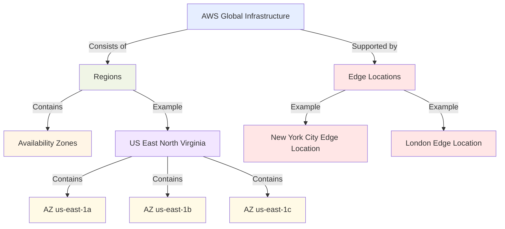
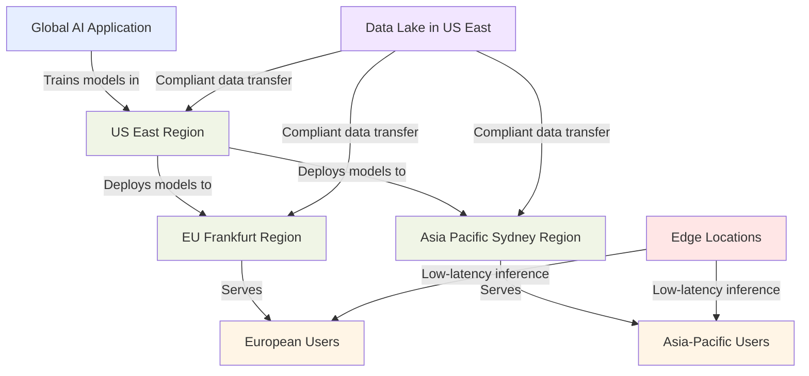
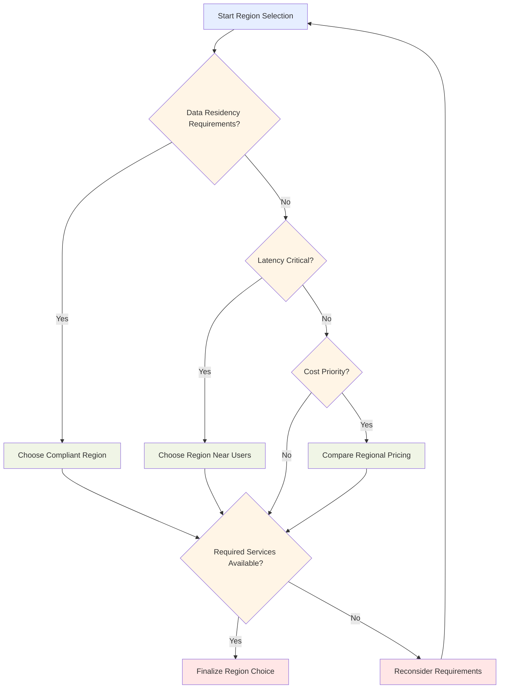

## 6.1 AWS Global Infrastructure

AWS Global Infrastructure serves as the foundation for delivering AI and machine learning solutions with global reach, high performance, and robust reliability. This worldwide network of computing resources enables organizations of all sizes to build, train, and deploy AI/ML workloads at scale, regardless of geographic location.[^1700] For business professionals implementing AI initiatives, understanding this infrastructure directly impacts application performance, regulatory compliance, and cost efficiency. Knowledge of AWS Global Infrastructure is also a core component of the AWS Certified AI Practitioner exam.

AWS's worldwide network empowers diverse AI implementations—from innovative startups creating new AI applications to global enterprises deploying organization-wide ML solutions. By leveraging this infrastructure, businesses can build resilient, compliant, and high-performing AI/ML solutions that operate efficiently across international boundaries, gaining competitive advantage in increasingly AI-driven markets.

### Understanding AWS Regions, Availability Zones, and Edge Locations

AWS Global Infrastructure consists of three key components that work together to provide a resilient environment for AI and ML workloads:

**AWS Regions** are discrete geographic areas containing multiple, isolated, and physically separate Availability Zones. Each Region functions independently of other Regions, enhancing fault tolerance and stability. AWS continues to expand its Region footprint worldwide, particularly in emerging markets where AI adoption is accelerating.[^1701]

**Availability Zones** (AZs) are distinct locations within a Region engineered to isolate failures from other AZs. These zones connect to each other through low-latency network links while maintaining physical separation. This architecture enables highly available, fault-tolerant applications and databases that surpass what a single data center could achieve.[^1702]

**Edge Locations** are sites used by Amazon CloudFront to cache content closer to end users, dramatically reducing latency.[^1703] Separate from Regions and AZs, Edge Locations typically operate in major cities and population centers. These locations are particularly valuable for AI/ML applications requiring low-latency processing, such as real-time image recognition or natural language processing services.

The relationship between these components is illustrated in the following diagram:

*Figure 6.1.1. AWS Global Infrastructure Components. This diagram illustrates the hierarchical structure of AWS Global Infrastructure, showing the relationship between Regions, Availability Zones, and Edge Locations.*

For AI and ML workloads, this infrastructure offers several critical advantages:

1. **High Availability**: Distributing AI applications across multiple AZs ensures operational continuity even if one zone experiences disruption.

2. **Low Latency**: Edge Locations enable faster content delivery for AI applications requiring real-time processing, such as voice assistants or recommendation engines.

3. **Data Sovereignty**: Multiple Region options allow organizations to keep data and AI processing within specific geographic boundaries to meet data residency requirements.

4. **Scalability**: The extensive network of Regions and AZs enables seamless scaling of AI and ML workloads globally as demand increases.

5. **Disaster Recovery**: The isolation between Regions facilitates robust disaster recovery strategies for mission-critical AI systems.

Understanding these components is essential for designing resilient AI architectures and effectively using services like Amazon SageMaker, which can operate across multiple AZs for enhanced reliability.[^1704]

### Benefits of AWS's Global Infrastructure for AI/ML Workloads

AWS's global infrastructure delivers specific advantages for AI and ML workloads that enable businesses to build, train, and deploy models with unprecedented efficiency and scale:

1. **Global Reach and Low Latency**

   The extensive network of Regions and Edge Locations allows deployment of AI services closer to end-users, reducing latency and improving experience. Multinational companies can train ML models in one Region and deploy inference endpoints in multiple Regions to serve global customers with minimal delay.[^1705]

2. **High Availability and Fault Tolerance**

   By leveraging multiple Availability Zones, AI applications achieve robust availability. Critical components—from model training pipelines to inference services—can be distributed across AZs to ensure continuous operation despite hardware failures or network issues.

3. **Scalability and Elasticity**

   The global infrastructure supports seamless scaling of AI workloads. Organizations can begin in one Region and expand to others as user bases grow—particularly beneficial for AI startups experiencing rapid adoption.

4. **Data Residency and Compliance**

   Multiple Regions give businesses control over where data is stored and processed, ensuring compliance with regulations like GDPR in Europe or CCPA in California. This capability is essential for AI applications handling sensitive personal information.[^1706]

5. **Cost Optimization**

   The global infrastructure enables cost optimization by selecting Regions with favorable pricing for specific AI/ML workloads. Services like Amazon EC2 Spot Instances can be leveraged across different AZs to significantly reduce the cost of training large ML models.[^1707]

6. **Access to Specialized Hardware**

   Certain Regions offer specialized hardware accelerators like GPUs and TPUs, critical for efficiently training and running complex AI models. The global infrastructure ensures these resources are accessible wherever needed.[^1708]

7. **Edge Computing Capabilities**

   AWS Edge Locations and services like AWS Outposts enable AI inference at the edge, closer to data sources. This capability is particularly valuable for IoT applications and scenarios requiring real-time processing with minimal latency.[^1709]

8. **Disaster Recovery and Business Continuity**

   The isolation between AWS Regions supports robust disaster recovery strategies. AI systems can be designed to fail over to different Regions during major outages, maintaining business continuity for critical AI applications.

The following diagram illustrates a global AI application architecture leveraging these benefits:

*Figure 6.1.2. Global AI Application Architecture. This diagram shows how a global AI application leverages AWS's infrastructure to train models centrally and deploy them globally, while maintaining data compliance and low-latency user experiences.*

In this architecture, AI models are trained in the US East Region (potentially using cost-effective GPU instances) and deployed to multiple Regions for low-latency user access. Edge Locations provide even faster inference for specific use cases. The data lake in US East ensures centralized data management with compliant transfer mechanisms to other Regions.

This global approach delivers multiple benefits:
- Centralized model training for consistency
- Distributed inference for low latency
- Edge computing for real-time processing
- Data residency compliance across regions
- High availability through multi-region deployment
- Cost optimization by selecting economical Regions for specific workloads

By leveraging AWS's global infrastructure this way, businesses create AI solutions that are truly global in scale yet locally optimized for performance and compliance.

### Choosing the Right AWS Region for AI/ML Projects

Selecting the appropriate AWS Region for AI/ML projects significantly impacts performance, compliance, and cost-effectiveness. Consider these key factors when making this decision:

1. **Data Residency and Compliance**

   For organizations handling sensitive information, regulatory compliance is paramount. Select a Region that aligns with your data residency requirements. If processing European citizens' data, for example, consider an EU Region to ensure GDPR compliance.[^1710]

2. **Latency and Performance**

   Choose Regions geographically close to your end-users or data sources to minimize latency. For global applications, implement a multi-region strategy using services like Amazon SageMaker Multi-Region Endpoints to deploy models closer to worldwide users.[^1711]

3. **Service Availability**

   Not all AWS services are available in every Region, especially newer or specialized AI/ML services. Verify that your chosen Region supports all required services for your project. Some cutting-edge AI services may initially launch in select Regions only.

4. **Pricing**

   Costs vary between Regions. Analyze pricing for services you'll use, particularly for compute-intensive workloads like training large language models. Sometimes less obvious Region choices can yield significant savings.[^1712]

5. **Disaster Recovery and High Availability**

   For business-critical AI/ML applications, consider multi-region architectures for disaster recovery. Select geographically diverse Regions that still comply with your data residency requirements.

6. **Ecosystem and Data Transfer**

   Consider locations of existing data stores and your service ecosystem. Choosing a Region where most data already resides reduces data transfer costs and latency.

7. **Specialized Hardware Availability**

   For projects requiring specific hardware accelerators (e.g., high-performance GPUs or quantum computing resources), check their availability across different Regions.[^1713]

8. **Sustainability**

   AWS continues to increase renewable energy usage across many Regions. If sustainability is important to your organization, consider Regions with higher percentages of renewable energy.[^1714]

This flowchart visualizes the decision-making process:

*Figure 6.1.3. AWS Region Selection Flowchart for AI/ML Projects. This flowchart illustrates the decision-making process for selecting an AWS Region, considering factors such as data residency, latency, service availability, and cost.*

This comparison table helps evaluate key factors across selected AWS Regions (note: this is a hypothetical comparison for illustration purposes):

*Table 6.1.1. AWS Region Comparison for AI/ML Workloads*

| Factor | US East (N. Virginia) | EU (Frankfurt) | Asia Pacific (Tokyo) | 
|--------|----------------------|-----------------|----------------------|
| Data Residency | US regulations | EU/GDPR compliant | Japan/APAC regulations |
| Latency to Major Markets | Low for North America | Low for Europe | Low for Asia |
| AI/ML Service Availability | Full suite available | Most services available | Most services available |
| Relative Compute Pricing | Moderate | Higher | Higher |
| Specialized AI Hardware | Latest GPUs, Quantum | Latest GPUs | Latest GPUs |
| Renewable Energy Usage | High | Very High | Moderate |

In practice, Region selection typically involves balancing multiple considerations:

- A fintech startup creating an AI fraud detection system might choose US East for comprehensive service availability and competitive pricing, while ensuring compliant data transfer to EU Regions for European customers.

- A healthcare AI research project handling sensitive patient data might select a Region within their country of operation, despite higher costs or fewer available services, to ensure strict compliance with local healthcare data regulations.

- A global e-commerce platform might train recommendation models in a cost-effective Region with high-performance computing resources, then deploy inference endpoints across multiple Regions for low-latency predictions worldwide.

By carefully weighing these factors against your project requirements, you can make informed decisions about the optimal AWS Region(s) for your AI/ML workloads. This foundational choice establishes a scalable, compliant, and efficient AI infrastructure that can evolve with your business needs.

### Questions for self-check

1. **A global AI company is designing its infrastructure on AWS. Which component of the AWS Global Infrastructure would be most suitable for caching AI model results to reduce latency for users worldwide?**

   A. Availability Zones
   B. AWS Regions
   C. Edge Locations
   D. Data Centers

2. **An AI startup is developing a machine learning model that processes sensitive healthcare data. Which factor should be their PRIMARY consideration when choosing an AWS Region for this project?**

   A. Latency to end-users
   B. Cost of compute resources
   C. Data residency and compliance requirements
   D. Availability of the latest GPU instances

3. **A multinational corporation wants to deploy its AI-powered customer service chatbot globally with minimal latency. Which AWS Global Infrastructure strategy would best achieve this goal?**

   A. Deploy the chatbot in a single centralized Region
   B. Use multiple Availability Zones within one Region
   C. Leverage Edge Locations for content delivery only
   D. Deploy the chatbot across multiple Regions and use Edge Locations

4. **An AI researcher is training a large language model and needs to ensure high availability and fault tolerance. How should they leverage AWS Availability Zones?**

   A. Train the model using instances in a single Availability Zone
   B. Distribute the training across multiple Availability Zones in different Regions
   C. Use instances in multiple Availability Zones within the same Region
   D. Rely solely on Edge Locations for distributed training

5. **A company is migrating its AI workloads to AWS and wants to optimize costs while maintaining performance. Which of the following is NOT a valid strategy for achieving this goal using AWS Global Infrastructure?**

   A. Choose Regions with lower pricing for compute resources
   B. Use Amazon EC2 Spot Instances across different Availability Zones
   C. Deploy all AI models to every available AWS Region
   D. Leverage Edge Locations for low-latency inference

### Answers and Explanations

1. **Correct answer: C. Edge Locations**

   Explanation: Edge Locations are specifically designed to cache content and reduce latency for end-users worldwide. They are part of Amazon CloudFront, AWS's content delivery network, and are ideal for caching AI model results or serving low-latency inference globally.[^1715] Availability Zones and Regions are more suited for hosting primary infrastructure, while Data Centers are the physical facilities that make up AZs.

2. **Correct answer: C. Data residency and compliance requirements**

   Explanation: When dealing with sensitive healthcare data, ensuring compliance with data protection regulations is paramount. The subchapter emphasizes that data residency and compliance should be the primary consideration when choosing a Region for projects involving sensitive data. While factors like latency, cost, and hardware availability are important, they are secondary to meeting legal and regulatory requirements in the healthcare sector.[^1716]

3. **Correct answer: D. Deploy the chatbot across multiple Regions and use Edge Locations**

   Explanation: To achieve global deployment with minimal latency, the best strategy is to leverage multiple AWS Regions and Edge Locations. This approach allows the chatbot to be hosted closer to users in different geographic areas (using Regions) while also utilizing Edge Locations for even faster content delivery and potentially for running inference at the edge. This strategy aligns with the global reach and low latency benefits discussed in the subchapter.[^1717]

4. **Correct answer: C. Use instances in multiple Availability Zones within the same Region**

   Explanation: To ensure high availability and fault tolerance, the best practice is to distribute resources across multiple Availability Zones within the same Region. This approach, as described in the subchapter, allows for continued operation even if one AZ experiences issues. Using multiple Regions would be unnecessary and potentially complicate data consistency, while using a single AZ or relying solely on Edge Locations would not provide the desired fault tolerance.[^1718]

5. **Correct answer: C. Deploy all AI models to every available AWS Region**

   Explanation: Deploying all AI models to every available AWS Region is not a cost-effective strategy. The subchapter emphasizes choosing the right Regions based on factors like user location, data residency, and specific service needs. Deploying everywhere would lead to unnecessary costs and complexity. The other options are valid cost-optimization strategies mentioned in the subchapter: choosing Regions with favorable pricing, using EC2 Spot Instances for training, and leveraging Edge Locations for low-latency inference are all recommended approaches.[^1719]

[^1700]: AWS Global Infrastructure Overview. URL: <https://aws.amazon.com/about-aws/global-infrastructure/>
[^1701]: AWS Global Infrastructure Regions & AZs. URL: <https://aws.amazon.com/about-aws/global-infrastructure/regions_az/>
[^1702]: AWS Availability Zones. URL: <https://docs.aws.amazon.com/AWSEC2/latest/UserGuide/using-regions-availability-zones.html>
[^1703]: Amazon CloudFront Key Features. URL: <https://aws.amazon.com/cloudfront/features/>
[^1704]: Amazon SageMaker Features. URL: <https://aws.amazon.com/sagemaker/features/>
[^1705]: AWS Global Infrastructure for AI/ML Workloads. URL: <https://aws.amazon.com/machine-learning/infrastructure/>
[^1706]: AWS Compliance Programs. URL: <https://aws.amazon.com/compliance/programs/>
[^1707]: Amazon EC2 Spot Instances. URL: <https://aws.amazon.com/ec2/spot/>
[^1708]: AWS Accelerated Computing. URL: <https://aws.amazon.com/ec2/instance-types/#Accelerated_Computing>
[^1709]: AWS Outposts. URL: <https://aws.amazon.com/outposts/>
[^1710]: AWS Compliance Resources. URL: <https://aws.amazon.com/compliance/resources/>
[^1711]: Amazon SageMaker Multi-Region Endpoints. URL: <https://docs.aws.amazon.com/sagemaker/latest/dg/multi-region-endpoints.html>
[^1712]: AWS Pricing Calculator. URL: <https://calculator.aws/#/>
[^1713]: AWS High Performance Computing. URL: <https://aws.amazon.com/hpc/>
[^1714]: AWS Sustainability. URL: <https://sustainability.aboutamazon.com/environment/the-cloud>
[^1715]: Amazon CloudFront Features. URL: <https://aws.amazon.com/cloudfront/features/>
[^1716]: AWS Healthcare & Life Sciences. URL: <https://aws.amazon.com/health/>
[^1717]: Creating a Multi-Region Application with AWS Services. URL: <https://aws.amazon.com/blogs/architecture/creating-a-multi-region-application-with-aws-services-part-1-compute-and-security/>
[^1718]: AWS Well-Architected Framework. URL: <https://aws.amazon.com/architecture/well-architected/>
[^1719]: AWS Cost Optimization. URL: <https://aws.amazon.com/aws-cost-management/>