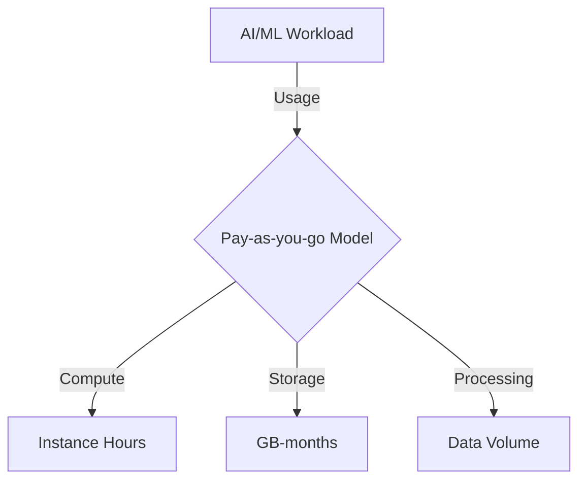
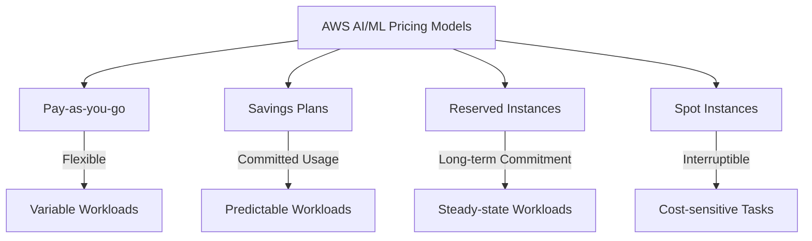
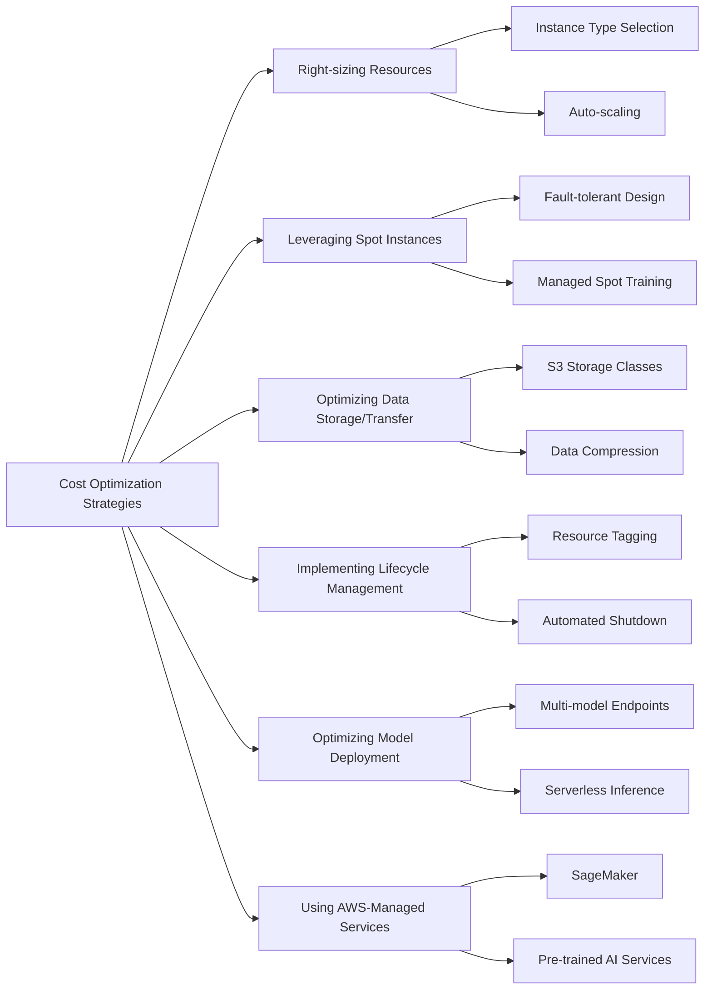
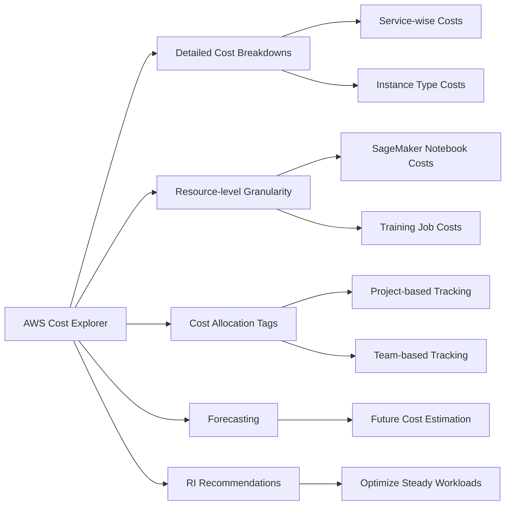
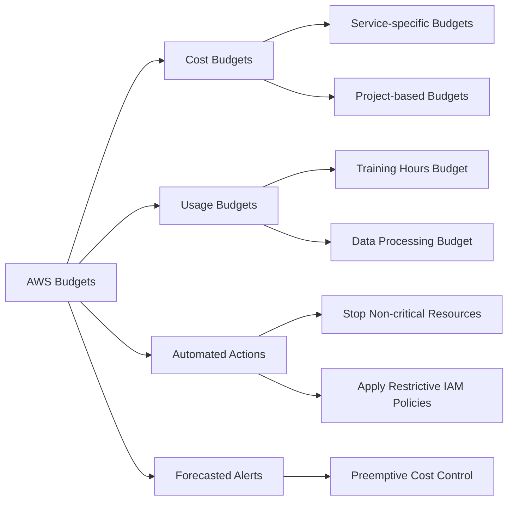

## 6.2 AWS Pricing and Cost Optimization for AI/ML

Leveraging artificial intelligence and machine learning (AI/ML) technologies gives organizations a competitive advantage, but these powerful capabilities come with significant financial considerations. Understanding AWS pricing models and implementing effective cost optimization strategies for AI/ML projects is essential for maximizing return on investment while maintaining budget control. This knowledge forms a critical component of the AWS Certified AI Practitioner exam, as it addresses the important balance between technological capabilities and financial prudence.

AI/ML workloads are inherently resource-intensive and potentially costly. Mastering AWS pricing structures and cost optimization techniques enables professionals to make informed decisions, allocate resources efficiently, and justify AI investments to stakeholders. With the rapid advancement of technologies like large language models and generative AI, the ability to manage and optimize costs will become increasingly crucial for sustainable AI adoption and scaling within organizations by 2025. According to Statista, the global AI market is projected to reach $243.72 billion by 2025 and $826.73 billion by 2030, with a CAGR of 27.67% from 2025-2030.[^1800]

### Understanding AWS Pricing Models for AI/ML Services

AWS offers diverse pricing models for its AI/ML services, each designed to accommodate different usage patterns and business requirements. Understanding these models can significantly impact the overall cost of AI/ML projects.

#### Pay-as-you-go Model

The pay-as-you-go approach is the most common pricing model for AWS AI/ML services. This model eliminates upfront costs or long-term commitments, allowing businesses to pay only for the resources they consume. For variable and unpredictable AI/ML workloads, this model offers key advantages:

- **Flexibility** to scale resources up or down based on demand
- No risk of over-provisioning or under-utilization
- Ability to experiment with different AI/ML services without significant financial commitment

For example, Amazon SageMaker charges based on the compute instances, storage, and data processing used.[^1801] Similarly, Amazon Comprehend bills based on the volume of text analyzed.[^1802]

*Figure 6.2.1: Pay-as-you-go Model for AI/ML Services. This diagram illustrates the components of the pay-as-you-go pricing model for AI/ML services on AWS, showing how costs are incurred based on compute usage, storage, and data processing volumes.*

#### Savings Plans

For organizations with predictable AI/ML workloads, AWS Savings Plans provide significant discounts in exchange for a commitment to a consistent amount of usage (measured in dollars per hour) for a 1 or 3-year term. Two types of Savings Plans are particularly relevant to AI/ML workloads:

1. **Compute Savings Plans**: These offer maximum flexibility, applying to EC2 instances, Fargate, and SageMaker, regardless of instance family, size, OS, or region.[^1803]

2. **SageMaker Savings Plans**: Specifically for SageMaker usage, providing up to 64% savings compared to on-demand pricing.[^1804]

Savings Plans are particularly valuable for businesses running continuous AI/ML workloads, such as production inference endpoints or long-running training jobs.

#### Reserved Instances

Reserved Instances (RIs) provide a significant discount (up to 72%) compared to on-demand pricing in exchange for a 1 or 3-year commitment to a specific instance type in a particular region.[^1805] While less common for AI/ML workloads due to their often dynamic nature, RIs can be valuable for:

- Baseline AI/ML infrastructure that runs continuously
- Predictable, steady-state workloads like scheduled batch processing jobs
- Long-running model training tasks on dedicated instances

#### Spot Instances

Spot Instances leverage unused EC2 capacity at steep discounts (up to 90% off on-demand prices). Though they can be interrupted with short notice, Spot Instances are well-suited for certain AI/ML tasks:[^1806]

- Distributed training jobs that can handle interruptions
- Batch inference workloads with flexible completion times
- Exploratory data analysis and feature engineering tasks

Amazon SageMaker supports Spot Instances for training jobs, potentially leading to significant cost savings for non-time-sensitive workloads.[^1807]

*Figure 6.2.2: AWS AI/ML Pricing Models Overview. This diagram showcases the different pricing models available for AI/ML services on AWS, highlighting their characteristics and suitable use cases.*

By choosing the right pricing model or combination of models for different workloads, businesses can significantly reduce their AI/ML expenses while maintaining the flexibility to scale and innovate.

### Strategies for Optimizing Costs in AI/ML Projects on AWS

Effective cost optimization strategies not only reduce expenses but also improve the overall efficiency of AI/ML workloads on AWS. These practical approaches help maximize the value of your AI investments.

#### Right-sizing Resources

One of the most impactful strategies for cost optimization is ensuring that resources allocated to AI/ML workloads are appropriately sized. This involves:

- Analyzing performance metrics to identify over-provisioned resources
- Choosing the right instance types for specific AI/ML tasks
- Utilizing auto-scaling to match resource allocation with workload demands

For example, when training machine learning models on Amazon SageMaker, selecting the optimal EC2 instance type based on the model's computational requirements can lead to significant cost savings. Similarly, for inference workloads, using Amazon SageMaker Neo to optimize models for specific hardware can reduce compute costs.[^1808]

#### Leveraging Spot Instances

Spot Instances can offer substantial cost savings for interruptible AI/ML workloads. To effectively use Spot Instances:

- Design workloads to be **fault-tolerant** and able to handle interruptions
- Use Amazon SageMaker Managed Spot Training for model training jobs
- Implement checkpointing to save progress and resume from the last saved state

By leveraging Spot Instances for suitable workloads, organizations can reduce their AI/ML compute costs by up to 90%.[^1809]

#### Optimizing Data Storage and Transfer

Data is a crucial component of AI/ML workloads, and optimizing its storage and transfer can lead to significant cost savings:

- Use Amazon S3 storage classes (e.g., S3 Intelligent-Tiering, S3 Glacier) for cost-effective storage of training data and model artifacts[^1810]
- Compress data before transfer to reduce data transfer costs
- Utilize Amazon FSx for Lustre for high-performance file systems in ML workflows[^1811]

#### Implementing Lifecycle Management

Proper lifecycle management of AI/ML resources prevents unnecessary costs:

- Automatically shut down idle resources (e.g., SageMaker notebooks, EC2 instances)
- Implement tagging strategies to track resource usage and ownership
- Use AWS Lambda functions to schedule the starting and stopping of resources based on usage patterns[^1812]

#### Optimizing Model Deployment

Efficient model deployment strategies can significantly reduce inference costs:

- Use Amazon SageMaker multi-model endpoints to host multiple models on a single endpoint[^1813]
- Implement Amazon SageMaker serverless inference for workloads with unpredictable or infrequent traffic[^1814]
- Utilize Amazon SageMaker Edge Manager for optimizing and deploying models to edge devices[^1815]

#### Leveraging AWS-Managed Services

AWS-managed services can often be more cost-effective than self-managed solutions:

- Use Amazon SageMaker for end-to-end ML workflows instead of managing your own infrastructure
- Leverage pre-trained AI services like Amazon Rekognition, Amazon Comprehend, or Amazon Bedrock for common AI tasks[^1816]
- Utilize Amazon EMR for big data processing tasks related to AI/ML workflows[^1817]

*Figure 6.2.3: AI/ML Cost Optimization Strategies on AWS. This diagram illustrates various strategies for optimizing costs in AI/ML projects on AWS, showcasing the interconnected nature of different approaches and their specific implementations.*

By implementing these strategies, organizations can significantly reduce their AI/ML costs on AWS while maintaining or even improving the performance and scalability of their workloads. Regular review and adjustment of these strategies is essential as AI/ML workloads evolve and new AWS services become available.

### Using AWS Cost Explorer and AWS Budgets for Managing AI/ML Expenses

Effective cost management for AI/ML projects requires continuous monitoring and analysis of expenses. AWS provides powerful tools like AWS Cost Explorer and AWS Budgets to help organizations gain visibility into their AI/ML costs and proactively manage their spending.

#### AWS Cost Explorer

AWS Cost Explorer enables you to visualize, understand, and manage your AWS costs and usage over time. For AI/ML projects, it offers several key features:[^1818]

1. **Detailed Cost Breakdowns**: View costs segmented by services, instance types, or custom tags. This is particularly useful for understanding the cost distribution across different components of your AI/ML pipeline (e.g., data preparation, model training, inference).

2. **Resource-level Granularity**: Drill down to see costs associated with specific resources, such as individual SageMaker notebooks or training jobs.

3. **Cost Allocation Tags**: Use tags to categorize and track costs for different AI/ML projects, teams, or environments.

4. **Forecasting**: Leverage AWS-generated cost forecasts to anticipate future AI/ML expenses based on historical usage patterns.

5. **Reserved Instance Recommendations**: Receive recommendations for Reserved Instance purchases that could optimize costs for steady-state AI/ML workloads.

To effectively use Cost Explorer for AI/ML projects:

- Set up detailed tagging strategies to accurately allocate costs to specific projects or teams
- Regularly review cost trends to identify unexpected spikes or opportunities for optimization
- Use the forecasting feature to budget for future AI/ML initiatives

*Figure 6.2.4: AWS Cost Explorer Features for AI/ML Projects. This diagram illustrates the key features of AWS Cost Explorer that are particularly useful for managing and analyzing costs in AI/ML projects on AWS.*

#### AWS Budgets

AWS Budgets allows you to set custom budgets and receive alerts when your costs or usage exceed (or are forecasted to exceed) your budgeted amount. For AI/ML projects, AWS Budgets offers several benefits:[^1819]

1. **Proactive Cost Management**: Set budgets for specific AI/ML services (e.g., SageMaker, Comprehend) or projects to prevent overspending.

2. **Usage-based Budgets**: Create budgets based on usage metrics relevant to AI/ML, such as the number of training hours or the amount of data processed.

3. **Automated Actions**: Configure actions to be taken automatically when a budget threshold is reached, such as stopping non-critical resources or applying restrictive IAM policies.

4. **Forecasted Budget Alerts**: Receive notifications when your AI/ML costs are projected to exceed the budget, allowing for preemptive action.

To effectively use AWS Budgets for AI/ML cost management:

- Set up separate budgets for development, testing, and production AI/ML environments
- Create budgets for individual AI/ML projects or initiatives to track their costs independently
- Configure alerts at different thresholds (e.g., 50%, 80%, 100% of budget) to provide early warnings
- Use automated actions to enforce cost controls on non-critical AI/ML resources

*Figure 6.2.5: AWS Budgets Features for AI/ML Cost Management. This diagram showcases the key features of AWS Budgets that are particularly useful for managing and controlling costs in AI/ML projects on AWS.*

By leveraging both AWS Cost Explorer and AWS Budgets, organizations can gain comprehensive visibility into their AI/ML expenses, set up proactive cost controls, and make data-driven decisions to optimize their AI/ML investments on AWS.

Mastering AWS pricing models, implementing cost optimization strategies, and effectively using cost management tools are crucial skills for professionals working with AI/ML on AWS. These competencies help control expenses while maximizing the value derived from AI/ML investments. As AI technologies continue to evolve, efficient cost management will remain a critical factor in successful AI/ML adoption and scaling.

### Questions for self-check

1. **A company is running continuous AI/ML workloads on AWS and wants to optimize costs. Which pricing model would be most appropriate for this scenario?**

   A. Pay-as-you-go
   B. Savings Plans
   C. Spot Instances
   D. On-demand pricing

2. **An organization wants to reduce costs for its SageMaker training jobs that can handle interruptions. Which AWS feature should they consider using?**

   A. Reserved Instances
   B. Savings Plans
   C. Spot Instances
   D. On-demand pricing

3. **A data scientist wants to visualize the cost breakdown of different AI/ML projects across teams. Which AWS tool is most suitable for this task?**

   A. Amazon SageMaker
   B. AWS Cost Explorer
   C. AWS Budgets
   D. Amazon CloudWatch

4. **Which of the following is NOT a recommended strategy for optimizing costs in AI/ML projects on AWS?**

   A. Right-sizing resources
   B. Implementing lifecycle management
   C. Always using the largest instance types available
   D. Leveraging AWS-managed services

5. **A company wants to set up automated actions to stop non-critical AI/ML resources when a budget threshold is reached. Which AWS service should they use?**

   A. AWS Cost Explorer
   B. Amazon SageMaker
   C. AWS Budgets
   D. Amazon EC2 Auto Scaling

### Answers and Explanations

1. **Correct answer: B. Savings Plans**

   Explanation: For continuous AI/ML workloads, Savings Plans offer the most cost-effective option. They provide significant discounts (up to 72%) in exchange for a commitment to a consistent amount of usage over a 1 or 3-year term.[^1820] This is ideal for predictable, ongoing workloads. Pay-as-you-go and on-demand pricing are less cost-effective for continuous use, while Spot Instances are not suitable for workloads that require constant availability.

2. **Correct answer: C. Spot Instances**

   Explanation: Spot Instances are ideal for reducing costs on interruptible workloads, such as SageMaker training jobs that can handle interruptions. They offer discounts of up to 90% compared to on-demand pricing.[^1821] Reserved Instances and Savings Plans require longer-term commitments and are better suited for steady-state workloads. On-demand pricing doesn't provide cost savings for interruptible workloads.

3. **Correct answer: B. AWS Cost Explorer**

   Explanation: AWS Cost Explorer is the most suitable tool for visualizing cost breakdowns across different projects and teams. It provides detailed cost analysis, including the ability to use cost allocation tags to categorize expenses by project or team.[^1822] Amazon SageMaker is a machine learning platform, not a cost management tool. AWS Budgets is for setting cost limits and alerts, while Amazon CloudWatch is primarily for monitoring and observability.

4. **Correct answer: C. Always using the largest instance types available**

   Explanation: Always using the largest instance types available is not a recommended cost optimization strategy. In fact, it can lead to significant overspending. The correct approach is to right-size resources, matching the instance type to the specific requirements of each AI/ML task.[^1823] Other listed strategies - right-sizing resources, implementing lifecycle management, and leveraging AWS-managed services - are all recommended for optimizing costs in AI/ML projects.

5. **Correct answer: C. AWS Budgets**

   Explanation: AWS Budgets is the correct service for setting up automated actions based on budget thresholds. It allows users to configure actions to be taken automatically when a budget threshold is reached, such as stopping non-critical resources.[^1824] AWS Cost Explorer is for analyzing costs, not setting up automated actions. Amazon SageMaker is a machine learning platform, and Amazon EC2 Auto Scaling is for automatically adjusting compute capacity, not for budget-based actions.

[^1800]: Artificial Intelligence - Worldwide | Market Forecast. URL: <https://www.statista.com/outlook/tmo/artificial-intelligence/worldwide>

[^1801]: Amazon SageMaker Pricing. URL: <https://aws.amazon.com/sagemaker/pricing/>

[^1802]: Amazon Comprehend Pricing. URL: <https://aws.amazon.com/comprehend/pricing/>

[^1803]: AWS Savings Plans. URL: <https://aws.amazon.com/savingsplans/>

[^1804]: Amazon SageMaker Savings Plans. URL: <https://aws.amazon.com/sagemaker/pricing/#Amazon_SageMaker_Savings_Plans>

[^1805]: Amazon EC2 Reserved Instances. URL: <https://aws.amazon.com/ec2/pricing/reserved-instances/>

[^1806]: Amazon EC2 Spot Instances. URL: <https://aws.amazon.com/ec2/spot/>

[^1807]: Amazon SageMaker Managed Spot Training. URL: <https://docs.aws.amazon.com/sagemaker/latest/dg/model-managed-spot-training.html>

[^1808]: Amazon SageMaker Neo. URL: <https://aws.amazon.com/sagemaker/neo/>

[^1809]: Amazon EC2 Spot Instances Pricing. URL: <https://aws.amazon.com/ec2/spot/pricing/>

[^1810]: Amazon S3 Storage Classes. URL: <https://aws.amazon.com/s3/storage-classes/>

[^1811]: Amazon FSx for Lustre. URL: <https://aws.amazon.com/fsx/lustre/>

[^1812]: AWS Lambda. URL: <https://aws.amazon.com/lambda/>

[^1813]: Amazon SageMaker Multi-Model Endpoints. URL: <https://docs.aws.amazon.com/sagemaker/latest/dg/multi-model-endpoints.html>

[^1814]: Amazon SageMaker Serverless Inference. URL: <https://docs.aws.amazon.com/sagemaker/latest/dg/serverless-endpoints.html>

[^1815]: Amazon SageMaker Edge Manager. URL: <https://aws.amazon.com/sagemaker/edge-manager/>

[^1816]: AWS AI Services. URL: <https://aws.amazon.com/machine-learning/ai-services/>

[^1817]: Amazon EMR. URL: <https://aws.amazon.com/emr/>

[^1818]: AWS Cost Explorer. URL: <https://aws.amazon.com/aws-cost-management/aws-cost-explorer/>

[^1819]: AWS Budgets. URL: <https://aws.amazon.com/aws-cost-management/aws-budgets/>

[^1820]: AWS Savings Plans Pricing. URL: <https://aws.amazon.com/savingsplans/pricing/>

[^1821]: Amazon EC2 Spot Instances Savings. URL: <https://aws.amazon.com/ec2/spot/pricing/>

[^1822]: AWS Cost Explorer Features. URL: <https://aws.amazon.com/aws-cost-management/aws-cost-explorer/features/>

[^1823]: AWS Well-Architected Framework - Cost Optimization Pillar. URL: <https://docs.aws.amazon.com/wellarchitected/latest/cost-optimization-pillar/welcome.html>

[^1824]: AWS Budgets Actions. URL: <https://docs.aws.amazon.com/cost-management/latest/userguide/budgets-controls.html>