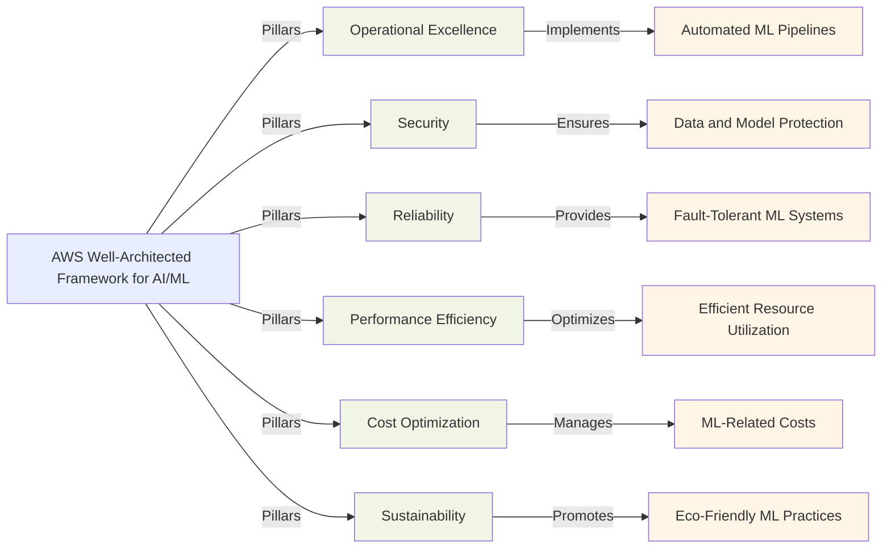

## 6.3 AWS Well-Architected Framework for AI/ML

The AWS Well-Architected Framework provides essential guidance for building robust, secure, and efficient cloud architectures. For organizations implementing artificial intelligence and machine learning (AI/ML) workloads on AWS, this framework addresses the unique challenges these systems present. AI/ML workloads typically involve complex computations, large datasets, and mission-critical decision-making processes that require special architectural considerations. Applying well-architected principles ensures these systems remain performant, reliable, secure, and cost-effective while addressing specialized concerns like model governance and data privacy. By 2025, as AI becomes more deeply integrated into business operations, organizations that design well-architected AI/ML solutions will gain significant competitive advantages.[^1900]

### Understanding the Six Pillars of the AWS Well-Architected Framework

The AWS Well-Architected Framework comprises six pillars that address critical aspects of cloud architecture. Each pillar has specific applications to AI/ML solutions that help organizations build robust systems.[^1901]

1. **Operational Excellence**

Operational Excellence for AI/ML focuses on efficiently running and monitoring systems to deliver business value while continuously improving processes. Key considerations include:

- Automating model training, deployment, and monitoring processes
- Implementing CI/CD pipelines for ML models
- Establishing clear procedures for model versioning and rollback
- Ensuring reproducibility of ML experiments and results

2. **Security**

The Security pillar protects information, systems, and assets through risk assessments and mitigation strategies. For AI/ML workloads, this includes:

- Securing sensitive training data and model artifacts
- Implementing fine-grained access controls for ML resources
- Encrypting data in transit and at rest
- Monitoring for and preventing adversarial attacks on ML models

3. **Reliability**

Reliability ensures systems can recover from disruptions, scale to meet demand, and mitigate service interruptions. AI/ML-specific considerations include:

- Designing fault-tolerant model training and inference pipelines
- Implementing automatic scaling for ML workloads
- Ensuring data integrity throughout the ML lifecycle
- Developing strategies for model performance degradation and drift

4. **Performance Efficiency**

Performance Efficiency involves using computing resources efficiently to meet requirements and maintain that efficiency as demand changes. For AI/ML, this means:

- Selecting appropriate instance types for training and inference
- Optimizing data preprocessing and feature engineering pipelines
- Leveraging distributed training for large models
- Implementing efficient model serving strategies (e.g., batch inference, caching)

5. **Cost Optimization**

Cost Optimization focuses on eliminating unnecessary expenses while maintaining business value. This is particularly important for AI/ML workloads due to their potential for high compute and storage costs:

- Right-sizing compute resources for training and inference
- Utilizing spot instances for non-critical ML workloads
- Implementing automated scaling based on demand
- Optimizing data storage and transfer costs

6. **Sustainability**

The Sustainability pillar aims to minimize the environmental impact of cloud workloads. For AI/ML, this includes:

- Selecting energy-efficient instance types for ML tasks
- Optimizing model architectures to reduce computational requirements
- Implementing strategies to reduce data transfer and storage
- Leveraging AWS's carbon-neutral regions for ML workloads[^1902]

*Figure 6.3.1. AWS Well-Architected Framework for AI/ML. This diagram illustrates the six pillars of the AWS Well-Architected Framework and their specific implementations in AI/ML contexts. Each pillar contributes to a well-architected AI/ML solution, addressing key aspects such as automation, security, reliability, efficiency, cost management, and sustainability.*

### Applying the Well-Architected Framework to AI/ML Solutions

Implementing the Well-Architected Framework for AI/ML requires consideration of machine learning's unique workflow characteristics. Here's how to apply each pillar effectively:

1. **Operational Excellence in AI/ML**

To achieve operational excellence in AI/ML, organizations should:

- Implement MLOps practices using services like AWS SageMaker MLOps[^1903]
- Automate model retraining and deployment using AWS Step Functions[^1904]
- Monitor model performance with Amazon CloudWatch and SageMaker Model Monitor[^1905]
- Document ML processes and maintain experiment tracking with tools like MLflow on AWS[^1906]

**Example application:** A retail company uses AWS SageMaker Pipelines to create an automated workflow for their product recommendation model. This pipeline includes data preprocessing, model training, evaluation, and deployment stages, all triggered automatically when new data becomes available.[^1907]

2. **Security in AI/ML**

Securing AI/ML workloads involves:

- Using AWS Identity and Access Management (IAM) for fine-grained access control to ML resources[^1908]
- Encrypting sensitive data with AWS Key Management Service (KMS)[^1909]
- Implementing network isolation for training jobs with Amazon VPC[^1910]
- Monitoring for unusual access patterns or potential data breaches using Amazon GuardDuty[^1911]

**Example application:** A healthcare company uses AWS Macie to automatically discover and protect sensitive patient data used in their disease prediction models, ensuring compliance with HIPAA regulations.[^1912]

3. **Reliability in AI/ML**

To build reliable AI/ML systems:

- Implement multi-AZ deployments for critical ML inference endpoints[^1913]
- Use AWS Auto Scaling to handle varying inference loads[^1914]
- Implement circuit breakers and fallback mechanisms for ML services
- Regularly backup training data and model artifacts to Amazon S3 with versioning enabled[^1915]

**Example application:** A financial services company deploys their fraud detection model across multiple Availability Zones using Amazon SageMaker Multi-Model Endpoints, ensuring high availability and fault tolerance.[^1916]

4. **Performance Efficiency in AI/ML**

Optimizing performance in AI/ML involves:

- Selecting appropriate instance types (e.g., GPU instances for deep learning) using Amazon EC2 Instance Explorer[^1917]
- Implementing distributed training for large models with SageMaker's distributed training libraries[^1918]
- Optimizing data access patterns using Amazon S3 Select for efficient data retrieval[^1919]
- Leveraging model compression techniques and quantization for faster inference

**Example application:** An autonomous vehicle company uses Amazon SageMaker Distributed Training to efficiently train large computer vision models across multiple GPU instances, significantly reducing training time.[^1920]

5. **Cost Optimization in AI/ML**

To optimize costs in AI/ML projects:

- Use Amazon SageMaker Managed Spot Training for non-time-critical training jobs[^1921]
- Implement automatic shutdown of idle notebook instances
- Optimize storage costs by using Amazon S3 Intelligent-Tiering for infrequently accessed datasets[^1922]
- Leverage Amazon Elastic Inference for cost-effective GPU acceleration during inference[^1923]

**Example application:** A startup uses Amazon SageMaker Managed Spot Training to reduce the cost of their daily model retraining jobs by up to 70%, allowing them to experiment with more complex models within their budget constraints.[^1924]

6. **Sustainability in AI/ML**

To promote sustainability in AI/ML:

- Choose AWS Regions with a lower carbon footprint for non-latency-sensitive workloads[^1925]
- Optimize model architectures to reduce computational requirements, using techniques like pruning and knowledge distillation
- Implement efficient data management practices to reduce storage and transfer needs
- Use AWS Graviton processors for ML inference tasks, which offer better performance per watt[^1926]

**Example application:** An e-commerce company optimizes their recommendation model using knowledge distillation, reducing the model size by 50% while maintaining similar accuracy. They deploy this model to AWS Graviton-based instances, significantly reducing energy consumption for inference.[^1927]

### Using the AWS Well-Architected Tool for Assessing AI/ML Architectures

The AWS Well-Architected Tool provides a systematic approach to evaluating AI/ML workloads against best practices and generating targeted improvement recommendations. Here's how to effectively use this tool for AI/ML projects:[^1928]

1. **Workload Definition**

Begin by defining your AI/ML workload in the AWS Well-Architected Tool:

- Specify the workload name (e.g., "Customer Churn Prediction Model")
- Select the industry type and relevant AWS Regions
- Identify the workload owner and key stakeholders

2. **Answer AI/ML-Specific Questions**

The tool provides questions for each pillar. For AI/ML workloads, focus on questions related to:

- Data management and preprocessing
- Model training and evaluation processes
- Inference deployment and scaling strategies
- ML-specific security and compliance requirements

3. **Review Recommendations**

Based on your answers, the tool generates improvement recommendations. For AI/ML workloads, these might include:

- Implementing automated model retraining pipelines
- Enhancing data encryption and access controls
- Optimizing instance selection for training and inference
- Implementing cost allocation tags for ML resources

4. **Prioritize Improvements**

Prioritize recommendations based on their impact and feasibility:

- **High Impact, Low Effort:** Implement these improvements first (e.g., enabling encryption for ML data stores)
- **High Impact, High Effort:** Plan these as part of your long-term strategy (e.g., refactoring ML pipelines for better scalability)
- **Low Impact:** Consider these improvements if they align with specific project goals

5. **Implement and Iterate**

Implement the prioritized improvements and re-assess your workload regularly:

- Use AWS CloudFormation or AWS CDK to implement infrastructure changes[^1929]
- Leverage AWS managed services like Amazon SageMaker to simplify ML operations[^1930]
- Continuously monitor and optimize your AI/ML workloads

**Example application:** A team developing a natural language processing (NLP) model for customer service automation uses the AWS Well-Architected Tool to assess their architecture. The tool identifies opportunities to improve data privacy controls and optimize training costs. The team implements Amazon Macie for sensitive data detection and switches to SageMaker Managed Spot Training, resulting in enhanced security and a 40% reduction in training costs.[^1931]

The AWS Well-Architected Framework provides a comprehensive approach to building high-quality AI/ML solutions on AWS. By applying the six pillars—Operational Excellence, Security, Reliability, Performance Efficiency, Cost Optimization, and Sustainability—organizations can create AI/ML systems that are technically sound and aligned with business objectives. The AWS Well-Architected Tool enhances this process by providing structured assessment and improvement recommendations. As AI and ML become increasingly essential to business operations, the ability to design well-architected solutions will differentiate organizations seeking to leverage these technologies effectively and responsibly.

### Questions for self-check

1. **A machine learning team is designing their AI/ML architecture on AWS. Which pillar of the Well-Architected Framework specifically addresses the need to implement fine-grained access controls for ML resources and encrypt data in transit and at rest?**

   A. Operational Excellence
   B. Security
   C. Reliability
   D. Performance Efficiency

2. **An e-commerce company wants to reduce the cost of their daily model retraining jobs while still maintaining the ability to experiment with complex models. Which AWS service should they use to achieve this goal?**

   A. Amazon EC2 Dedicated Instances
   B. Amazon SageMaker Managed Spot Training
   C. AWS Batch
   D. Amazon ECS

3. **A healthcare company is developing a disease prediction model using sensitive patient data. Which AWS service should they use to automatically discover and protect this data to ensure compliance with HIPAA regulations?**

   A. Amazon GuardDuty
   B. AWS Shield
   C. Amazon Inspector
   D. Amazon Macie

4. **Which of the following is NOT a recommended practice for achieving operational excellence in AI/ML workloads according to the AWS Well-Architected Framework?**

   A. Implementing MLOps practices using AWS SageMaker MLOps
   B. Manually retraining and deploying models on a fixed schedule
   C. Monitoring model performance with Amazon CloudWatch and SageMaker Model Monitor
   D. Documenting ML processes and maintaining experiment tracking with tools like MLflow on AWS

5. **A startup is using the AWS Well-Architected Tool to assess their AI/ML architecture. After receiving recommendations, what should be their next step according to the process outlined in the subchapter?**

   A. Immediately implement all recommendations
   B. Ignore recommendations that seem difficult to implement
   C. Prioritize improvements based on impact and feasibility
   D. Re-run the assessment with different answers

### Answers and Explanations

1. **Correct answer: B. Security**

   Explanation: The Security pillar of the AWS Well-Architected Framework specifically addresses protecting information, systems, and assets. In the context of AI/ML, this includes implementing fine-grained access controls for ML resources and encrypting data in transit and at rest. The subchapter explicitly mentions these aspects under the Security pillar, stating "Implementing fine-grained access controls for ML resources" and "Encrypting data in transit and at rest" as key considerations for AI/ML workloads.[^1932]

2. **Correct answer: B. Amazon SageMaker Managed Spot Training**

   Explanation: Amazon SageMaker Managed Spot Training is the correct solution for reducing the cost of daily model retraining jobs while still allowing for experimentation with complex models. The subchapter specifically mentions this service in the Cost Optimization section, stating "A startup uses Amazon SageMaker Managed Spot Training to reduce the cost of their daily model retraining jobs by up to 70%, allowing them to experiment with more complex models within their budget constraints." This service leverages EC2 Spot Instances to reduce training costs significantly.[^1933]

3. **Correct answer: D. Amazon Macie**

   Explanation: Amazon Macie is the correct AWS service for automatically discovering and protecting sensitive data to ensure compliance with regulations like HIPAA. The subchapter provides a specific example of this use case: "A healthcare company uses AWS Macie to automatically discover and protect sensitive patient data used in their disease prediction models, ensuring compliance with HIPAA regulations." Macie uses machine learning to automatically discover, classify, and protect sensitive data in AWS.[^1934]

4. **Correct answer: B. Manually retraining and deploying models on a fixed schedule**

   Explanation: Manually retraining and deploying models on a fixed schedule is not a recommended practice for achieving operational excellence in AI/ML workloads. The subchapter emphasizes automation and continuous improvement. It specifically mentions "Automating model training, deployment, and monitoring processes" and "Implementing CI/CD pipelines for ML models" as key aspects of operational excellence. Manual processes on fixed schedules go against these principles of automation and adaptability.[^1935]

5. **Correct answer: C. Prioritize improvements based on impact and feasibility**

   Explanation: After receiving recommendations from the AWS Well-Architected Tool, the next step should be to prioritize improvements based on their impact and feasibility. The subchapter outlines this process explicitly: "Prioritize the recommendations based on their impact and feasibility." It then provides examples of how to categorize improvements, such as "High Impact, Low Effort: Implement these improvements first" and "High Impact, High Effort: Plan these as part of your long-term strategy." This approach ensures that the most valuable and achievable improvements are addressed first.[^1936]

[^1900]: AWS Machine Learning Blog: The Future of AI/ML in Business. URL: <https://revstarconsulting.com/blog/the-future-of-it-embracing-ai-and-machine-learning-in-business-strategies>

[^1901]: AWS Well-Architected Framework Overview. URL: <https://aws.amazon.com/architecture/well-architected/>

[^1902]: AWS Sustainability Pillar - AWS Well-Architected Framework. URL: <https://docs.aws.amazon.com/wellarchitected/latest/sustainability-pillar/sustainability-pillar.html>

[^1903]: Amazon SageMaker MLOps Overview. URL: <https://aws.amazon.com/sagemaker/mlops/>

[^1904]: AWS Step Functions for Machine Learning Workflows. URL: <https://docs.aws.amazon.com/step-functions/latest/dg/use-cases.html>

[^1905]: Amazon SageMaker Model Monitor. URL: <https://docs.aws.amazon.com/sagemaker/latest/dg/model-monitor.html>

[^1906]: Running MLflow on Amazon SageMaker. URL: <https://aws.amazon.com/blogs/machine-learning/managing-your-machine-learning-lifecycle-with-mlflow-and-amazon-sagemaker/>

[^1907]: Amazon SageMaker Pipelines Overview. URL: <https://docs.aws.amazon.com/sagemaker/latest/dg/pipelines.html>

[^1908]: AWS IAM for Machine Learning Workloads. URL: <https://docs.aws.amazon.com/IAM/latest/UserGuide/id_roles_use_switch-role-ec2.html>

[^1909]: AWS KMS for Machine Learning Data Encryption. URL: <https://docs.aws.amazon.com/kms/latest/developerguide/services-sagemaker.html>

[^1910]: Amazon VPC for SageMaker Training Jobs. URL: <https://docs.aws.amazon.com/sagemaker/latest/dg/train-vpc.html>

[^1911]: Amazon GuardDuty for ML Workload Protection. URL: <https://aws.amazon.com/guardduty/>

[^1912]: AWS Macie for Sensitive Data Discovery. URL: <https://aws.amazon.com/macie/>

[^1913]: Amazon SageMaker Multi-AZ Deployments. URL: <https://docs.aws.amazon.com/sagemaker/latest/dg/multi-az-endpoints.html>

[^1914]: AWS Auto Scaling for SageMaker Endpoints. URL: <https://docs.aws.amazon.com/sagemaker/latest/dg/endpoint-auto-scaling.html>

[^1915]: Amazon S3 Versioning for ML Artifacts. URL: <https://docs.aws.amazon.com/AmazonS3/latest/userguide/Versioning.html>

[^1916]: Amazon SageMaker Multi-Model Endpoints. URL: <https://docs.aws.amazon.com/sagemaker/latest/dg/multi-model-endpoints.html>

[^1917]: Amazon EC2 Instance Explorer. URL: <https://aws.amazon.com/ec2/instance-explorer/>

[^1918]: SageMaker Distributed Training Libraries. URL: <https://docs.aws.amazon.com/sagemaker/latest/dg/distributed-training.html>

[^1919]: Amazon S3 Select for Efficient Data Retrieval. URL: <https://docs.aws.amazon.com/AmazonS3/latest/userguide/selecting-content-from-objects.html>

[^1920]: Amazon SageMaker Distributed Training Case Study. URL: <https://docs.aws.amazon.com/sagemaker/latest/dg/distributed-training.html>

[^1921]: Amazon SageMaker Managed Spot Training. URL: <https://docs.aws.amazon.com/sagemaker/latest/dg/model-managed-spot-training.html>

[^1922]: Amazon S3 Intelligent-Tiering. URL: <https://aws.amazon.com/s3/storage-classes/intelligent-tiering/>

[^1923]: Amazon Elastic Inference. URL: <https://aws.amazon.com/machine-learning/elastic-inference/>

[^1924]: SageMaker Managed Spot Training Case Study. URL: <https://aws.amazon.com/blogs/aws/managed-spot-training-save-up-to-90-on-your-amazon-sagemaker-training-jobs/>

[^1925]: AWS Sustainability - Choosing Low Carbon Regions. URL: <https://sustainability.aboutamazon.com/environment/the-cloud>

[^1926]: AWS Graviton Processors for ML Inference. URL: <https://aws.amazon.com/ec2/graviton/>

[^1927]: Knowledge Distillation for Model Optimization. URL: <https://aws.amazon.com/blogs/machine-learning/use-llama-3-1-405b-to-generate-synthetic-data-for-fine-tuning-tasks/>

[^1928]: AWS Well-Architected Tool Documentation. URL: <https://docs.aws.amazon.com/wellarchitected/latest/userguide/intro.html>

[^1929]: AWS CloudFormation for ML Infrastructure. URL: <https://aws.amazon.com/cloudformation/>

[^1930]: Amazon SageMaker Overview. URL: <https://aws.amazon.com/sagemaker/>

[^1931]: AWS Well-Architected Tool Case Study. URL: <https://aws.amazon.com/blogs/architecture/introducing-the-latest-machine-learning-lens-for-the-aws-well-architected-framework/>

[^1932]: AWS Well-Architected Framework - Security Pillar. URL: <https://docs.aws.amazon.com/wellarchitected/latest/security-pillar/welcome.html>

[^1933]: Amazon SageMaker Managed Spot Training Documentation. URL: <https://docs.aws.amazon.com/sagemaker/latest/dg/model-managed-spot-training.html>

[^1934]: Amazon Macie for HIPAA Compliance. URL: <https://aws.amazon.com/macie/features/>

[^1935]: AWS Well-Architected Framework - Operational Excellence Pillar. URL: <https://docs.aws.amazon.com/wellarchitected/latest/operational-excellence-pillar/welcome.html>

[^1936]: AWS Well-Architected Tool - Prioritizing Improvements. URL: <https://docs.aws.amazon.com/wellarchitected/latest/userguide/prioritize-improvements.html>