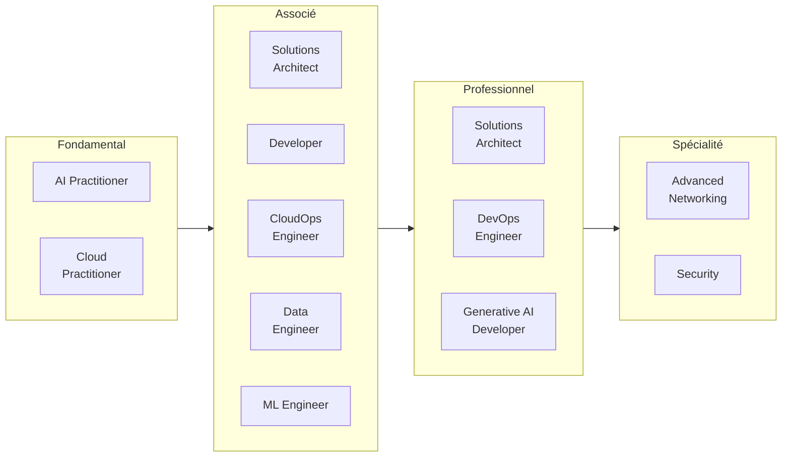
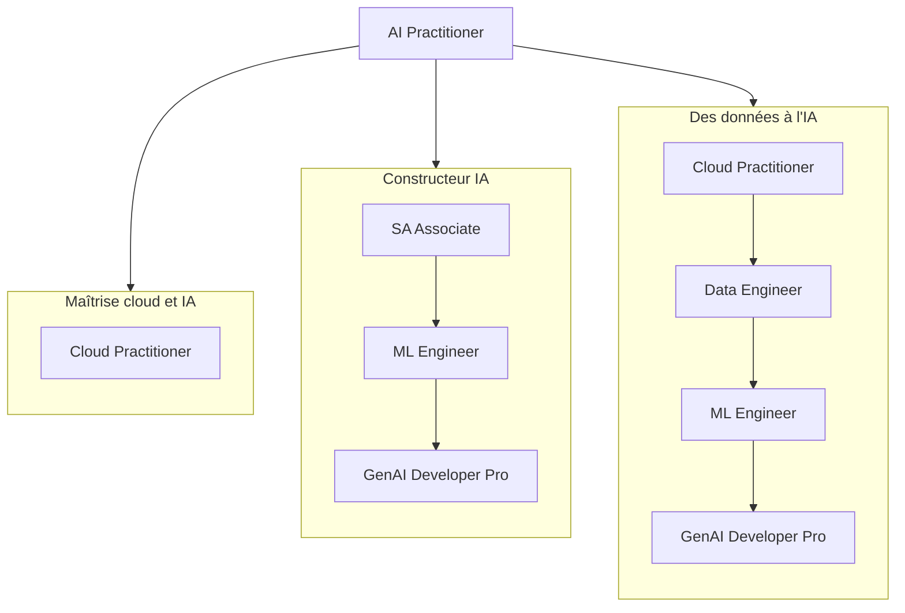
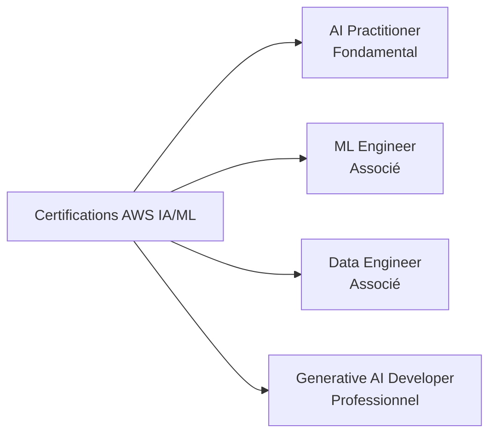
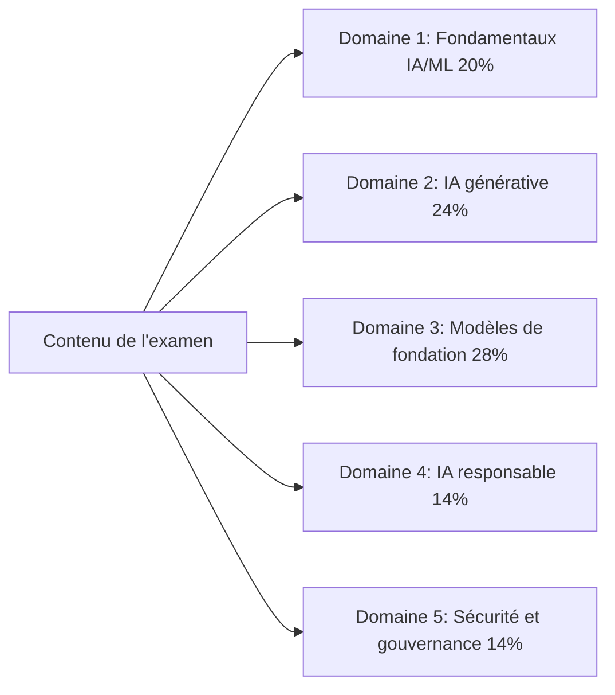
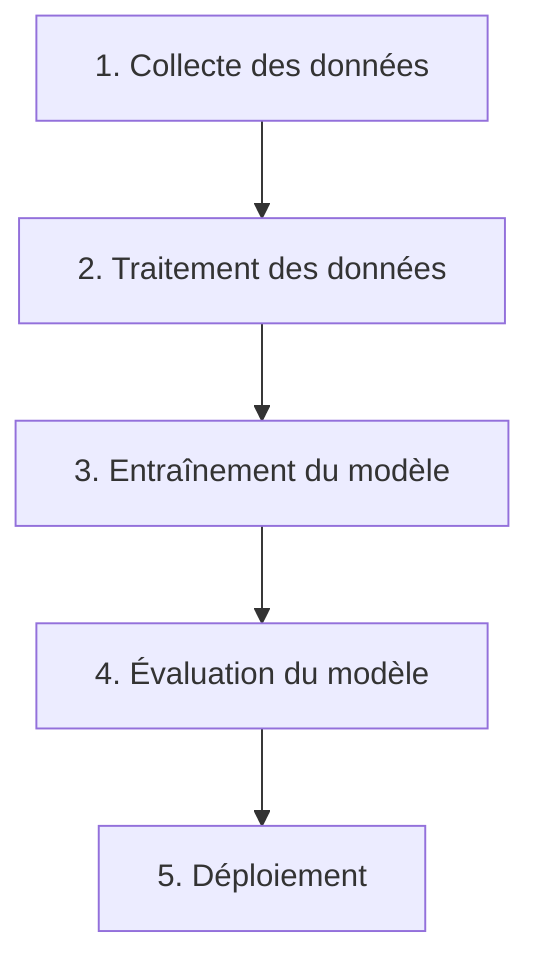

# Certifications AWS et l'examen AI Practitioner

## Introduction aux certifications AWS

Les certifications AWS valident l'expertise dans les technologies cloud et d'IA qui sous-tendent la majeure partie de l'informatique d'entreprise actuelle. Elles sont reconnues à l'échelle du secteur comme un indicateur de compétence technique et comme un parcours structuré pour les professionnels qui souhaitent développer les compétences nécessaires pour utiliser AWS efficacement. Pour les organisations en cours de transformation numérique, les professionnels certifiés apportent une expertise qui se traduit directement par une livraison de projets plus rapide et moins d'erreurs coûteuses.

Les avantages vont au-delà de la certification elle-même. Les professionnels certifiés font état de salaires plus élevés, d'une meilleure visibilité lors des recrutements et d'un meilleur positionnement pour les promotions et les affectations ambitieuses.[^006001] Les compétences derrière la certification correspondent à des défis concrets, et le cycle de recertification maintient les titulaires à jour à mesure que le portefeuille AWS évolue.

## Parcours de certification AWS

AWS organise son programme de certification en quatre niveaux : Fondamental, Associé, Professionnel et Spécialité. La structure permet aux professionnels de commencer par des connaissances générales et de progresser vers une expertise spécialisée alignée sur leurs objectifs de carrière.



*Figure 0.6.1: Le portefeuille complet de certifications AWS en mai 2026, regroupé par niveau. Douze certifications actives couvrent des rôles allant de la maîtrise du cloud à l'ingénierie IA avancée. AI Practitioner est l'une des deux certifications fondamentales; Generative AI Developer au niveau Professionnel prolonge le parcours IA/ML pour les publics plus spécialisés.*

Le diagramme montre comment la certification **AI Practitioner** se positionne aux côtés de **Cloud Practitioner** au niveau fondamental.[^006002] La certification Machine Learning Specialty, qui ancrait autrefois le parcours technique approfondi IA/ML, a été retirée le 31 mars 2026 et a été remplacée par le **Machine Learning Engineer - Associate** et le **Generative AI Developer - Professional**.[^006003] AWS a également renommé SysOps Administrator - Associate en **CloudOps Engineer - Associate** en 2025.

L'échelle de certifications AWS ne forme pas une ligne droite unique. Différents rôles empruntent différents chemins vers les mêmes certifications avancées. La carte ci-dessous esquisse trois itinéraires courants en plusieurs étapes :



*Figure 0.6.2: Trois parcours représentatifs dans le portefeuille de certifications AWS. Le parcours maîtrise du cloud et de l'IA s'arrête à AI Practitioner. Les parcours constructeur IA et données vers l'IA convergent tous deux vers Generative AI Developer - Professional, mais passent par des certifications associées différentes.*

Un praticien peut s'arrêter après AI Practitioner si l'objectif est la prise de décision éclairée plutôt que l'ingénierie en pratique. Un praticien qui envisage de construire des agents IA en production bénéficiera généralement d'au moins la Solutions Architect - Associate et la Machine Learning Engineer - Associate avant de passer au Generative AI Developer - Professional.

Pour maintenir la validité de la certification, AWS exige une recertification tous les trois ans. Cela permet aux titulaires de rester à jour avec les derniers services et les meilleures pratiques.

## La certification AWS Certified AI Practitioner

### Vue d'ensemble et positionnement

La certification AWS Certified AI Practitioner répond au besoin croissant de maîtrise de l'IA dans les organisations. Elle valide les connaissances fondamentales en intelligence artificielle, en apprentissage automatique et en IA générative sur AWS, avec un accent sur l'application pratique en entreprise plutôt que sur les détails d'implémentation.

La certification s'adresse aux analystes d'affaires, aux chefs de produit, au personnel du support informatique et aux autres professionnels qui travaillent aux côtés de l'IA sans nécessairement la construire. En validant votre capacité à évaluer les options d'IA et à communiquer avec les équipes d'ingénierie, elle aide les organisations à adopter les capacités d'IA de manière plus éclairée et à éviter des erreurs coûteuses.

### En quoi elle diffère des autres certifications IA/ML

Les certifications AWS IA/ML forment désormais un ensemble clairement hiérarchisé. Elles ciblent différents publics et différents niveaux de compétences.



*Figure 0.6.3: La carte des certifications AWS IA/ML. Chaque certification cible un public spécifique et un niveau de compétence précis, de la maîtrise des affaires au niveau fondamental à l'architecture de production au niveau Professionnel.*

La certification **Generative AI Developer - Professional** (AIP-C01) valide l'expertise en conception, construction et mise en œuvre opérationnelle de solutions d'IA générative sur AWS à grande échelle. Elle cible les architectes et les ingénieurs seniors qui gèrent les systèmes d'IA de bout en bout.

La certification **Machine Learning Engineer - Associate** (MLA-C01) valide les compétences nécessaires pour construire, déployer et surveiller des modèles ML en production. Elle cible les ingénieurs ML et les développeurs qui gèrent le côté ML d'une application.

La certification **Data Engineer - Associate** (DEA-C01) se concentre sur l'infrastructure de données dont dépendent les projets IA/ML. Elle cible les ingénieurs qui construisent et maintiennent les pipelines et les couches de stockage qui alimentent les charges de travail IA.

En revanche, le **AI Practitioner** se concentre sur les fondamentaux et l'application en entreprise. Il est conçu pour les professionnels qui utilisent les solutions IA/ML, pas pour ceux qui les construisent. Les analystes d'affaires, les chefs de produit et le personnel informatique techniquement compétent constituent le public principal.

Ce découpage en quatre niveaux reflète la maturité du marché IA/ML. Construire, déployer et gouverner l'IA exige désormais suffisamment de compétences spécialisées pour qu'AWS propose une certification distincte pour chaque couche.

## Détails et structure de l'examen

### Présentation de l'examen

L'examen AWS Certified AI Practitioner (AIF-C01) contient 65 questions à compléter en 90 minutes. Il est disponible en anglais, japonais, coréen, portugais (Brésil) et chinois simplifié. Le score minimal de réussite est de 700 sur une échelle de 100 à 1 000.

La version actuelle de l'examen est la **V1.1**, publiée le 30 avril 2026, et effective dans l'examen environ un mois plus tard.[^006004] La V1.1 a ajouté l'IA agentique, Amazon Bedrock AgentCore, Strands Agents, Kiro et Amazon Quick aux contenus en périmètre. Elle a également retiré Amazon MemoryDB. Les changements d'objectifs sont suffisamment conséquents pour que tout matériel de préparation antérieur à mi-2026 soit vérifié par rapport au guide d'examen actuel.



*Figure 0.6.4: Pondération des domaines AIF-C01 V1.1. Les domaines 2 et 3 couvrent ensemble l'IA générative et les applications de modèles de fondation, et représentent plus de la moitié du contenu noté.*

Les modèles de fondation et l'IA générative couvrent ensemble plus de la moitié de l'examen, ce qui est cohérent avec la rapidité avec laquelle ces sujets sont devenus centraux dans les projets IA d'entreprise. L'examen évalue votre capacité à :

- Démontrer votre compréhension des concepts IA/ML et d'IA générative et des services AWS
- Évaluer les cas d'usage appropriés pour différentes technologies d'IA
- Prendre des décisions éclairées sur la mise en œuvre de solutions d'IA
- Appliquer les pratiques d'IA responsable et les principes de gouvernance

### Public cible

Le candidat idéal a environ six mois d'exposition aux technologies IA/ML sur AWS. Vous devez être à l'aise pour utiliser des solutions IA/ML, sans pour autant être censé les construire vous-même. Une connaissance opérationnelle des **services AWS de base** est indispensable, notamment Amazon EC2, Amazon S3, AWS Lambda, Amazon Bedrock et Amazon SageMaker AI.[^006005]

Vous devez également avoir une compréhension opérationnelle du **modèle de responsabilité partagée d'AWS**, de la gestion des identités et des accès AWS (IAM) et des modèles de tarification des services AWS.

Différents professionnels peuvent tirer avantage de cette certification de différentes manières :

*Tableau 0.6.1: Rôles bénéficiant de la certification AWS Certified AI Practitioner.*

| Catégorie de rôle | Personnel clé | Avantages principaux | Activités clés |
|---|---|---|---|
| Décideurs métier | Chefs de projet, analystes d'affaires, dirigeants | Capacités de planification stratégique et d'évaluation | Évaluation des initiatives IA, évaluation de la faisabilité, élaboration de feuilles de route d'adoption |
| Professionnels de la technologie | Personnel informatique, architectes cloud, consultants techniques | Connaissances en intégration technique et support | Support des systèmes IA, conception de solutions intégrées, évaluation de plateformes |
| Spécialistes du domaine | Experts sectoriels, chercheurs, spécialistes QA | Perspectives sur les applications IA spécifiques au domaine | Guidage des implémentations, assurance qualité, exploration d'applications |
| Support et opérations | Équipes opérationnelles, responsables de succès client, rédacteurs techniques | Excellence opérationnelle et capacité de support | Gestion des services IA, documentation des systèmes, développement de programmes de formation |

La certification ne vous oblige pas à développer des modèles IA/ML, à implémenter de l'ingénierie de données, à effectuer du réglage d'hyperparamètres, à construire des pipelines IA/ML, à conduire des analyses mathématiques de modèles ou à développer des cadres de gouvernance complets. Ces responsabilités relèvent des certifications de niveau supérieur.

### Structure de l'examen et notation

L'examen contient 50 questions notées et 15 questions non notées qu'AWS utilise pour évaluer de futurs contenus potentiels. Les questions non notées sont distribuées tout au long de l'examen et ne sont pas identifiées. Il n'y a pas de pénalité pour les devinettes, et les questions sans réponse sont comptées comme incorrectes.

Le modèle de notation présente quatre caractéristiques à connaître :

- Notation calibrée sur une plage de 100 à 1 000
- Score minimal de réussite de 700
- Notation compensatoire, ce qui signifie que vous n'avez pas besoin de réussir chaque section individuellement, seulement l'examen global
- Notation calibrée entre plusieurs formes d'examen pour maintenir une difficulté équitable entre les versions

Votre rapport de score comprend le statut général de réussite ou d'échec, le score calibré et un retour sur les performances par section qui met en évidence les points forts et les points faibles. Le retour par section est une orientation générale, pas une note précise par section.

La durée standard de l'examen est de 90 minutes. Les locuteurs non natifs de l'anglais peuvent demander une extension de 30 minutes, appelée l'accommodation « ESL +30 », lors d'un examen en anglais, pour un total de 120 minutes.

## Types de questions à l'examen

L'examen utilise quatre formats de questions. Connaître les formats à l'avance vous aide à gérer votre temps et à éviter les surprises.

### Questions à choix multiple

Les questions à choix multiple présentent un scénario ou un concept avec quatre réponses possibles, une correcte et trois distracteurs. Les distracteurs sont conçus pour tester les idées fausses courantes et pour valider que vous comprenez la profondeur du sujet, pas seulement la surface.

Exemple :

```
Quel service AWS fournit un environnement entièrement géré pour la construction,
l'entraînement et le déploiement de modèles d'apprentissage automatique à grande échelle ?

A) Amazon EC2     - Fournit des serveurs virtuels mais nécessite une configuration ML manuelle
B) Amazon S3      - Offre du stockage mais pas de capacités ML
C) Amazon SageMaker AI - Service géré dédié aux flux de travail ML
D) Amazon Redshift - Service d'entrepôt de données sans fonctionnalités ML natives

Réponse correcte : C
```

Les options incorrectes sont des services qui interviennent d'une certaine manière dans les flux de travail ML, mais qui ne fournissent pas l'expérience ML gérée complète.

### Questions à réponses multiples

Les questions à réponses multiples nécessitent la sélection de deux réponses correctes ou plus parmi cinq options ou plus. Vous devez identifier toutes les réponses correctes pour obtenir des points. Les points partiels ne sont pas attribués.

```
Quelles sont les DEUX capacités qu'Amazon SageMaker Studio fournit ? (Sélectionnez DEUX)

A) Environnement de développement intégré (IDE) pour ML
B) Déploiement et surveillance automatisés des modèles
C) Capacité de calcul brute pour l'entraînement
D) Stockage d'objets pour les jeux de données
E) Gestion de bases de données relationnelles

Réponses correctes : A, B
```

Lorsque vous voyez une question à réponses multiples :

1. Lisez attentivement la question et notez exactement combien de réponses sont requises.
2. Évaluez chaque option indépendamment avant de les comparer.
3. Vérifiez que vous avez sélectionné le nombre exact de réponses spécifié.
4. Confirmez que toutes vos sélections sont correctes, car les points partiels ne sont pas attribués.

### Questions d'ordonnancement

Les questions d'ordonnancement testent votre compréhension des processus séquentiels. Elles présentent trois à cinq éléments qui doivent être disposés dans le bon ordre pour accomplir une tâche.



*Figure 0.6.5: Un flux de travail ML canonique utilisé comme exemple de question d'ordonnancement. Chaque étape dépend de la précédente, et l'ordre reflète les bonnes pratiques du secteur.*

Lorsque vous voyez une question d'ordonnancement, cherchez :

- Les dépendances entre les étapes
- Les exigences et prérequis des services AWS
- Les flux de travail standard du secteur
- Les bonnes pratiques AWS

### Questions d'association

Les questions d'association vous demandent d'associer des éléments de deux listes. Elles présentent généralement trois à sept éléments à mettre en correspondance avec une liste de descriptions, et vous demandent d'associer chaque élément à sa description correcte.

Une question d'association typique :

```
Associez le service AWS IA/ML à sa capacité principale :

Éléments :
1. Amazon Bedrock
2. Amazon SageMaker Canvas
3. Amazon Comprehend
4. Amazon Rekognition

Descriptions :
A. Construction et inférence de modèles ML sans code
B. Traitement du langage naturel et analyse de texte
C. Accès et déploiement de modèles de fondation
D. Vision par ordinateur et analyse d'images et de vidéos

Correspondances correctes : 1-C, 2-A, 3-B, 4-D
```

Pour aborder les questions d'association :

1. Lisez attentivement tous les éléments des deux listes avant de faire des associations.
2. Fixez d'abord les associations évidentes, puis réduisez les autres par élimination.
3. Utilisez l'élimination pour les paires restantes plus difficiles.
4. Vérifiez chaque association par rapport à vos connaissances AWS.

## Conseils de préparation à l'examen

### Gestion du temps

Une gestion efficace du temps est plus importante que les connaissances brutes pour de nombreux candidats. Quelques lignes directrices pratiques :

1. Notez le nombre de questions et le temps imparti au début.
2. Visez environ 80 secondes par question lors du premier passage.
3. Ne passez pas plus de deux minutes sur une seule question.
4. Marquez les questions difficiles et revenez-y après le premier passage.
5. Laissez au moins cinq à dix minutes à la fin pour la révision.

Si l'anglais n'est pas votre première langue, AWS vous permet de demander 30 minutes de temps supplémentaire comme accommodation. La demande doit être soumise via votre compte AWS Certification avant de réserver l'examen, et une fois approuvée, elle s'applique à tous les examens AWS que vous planifiez depuis ce compte.

### Points d'attention prioritaires

L'examen met l'accent sur l'application pratique plutôt que sur la mémorisation. Points clés :

- Concepts et terminologie de base IA/ML, incluant l'IA agentique, RAG et MCP
- Le bon service IA pour le bon problème métier
- Les capacités et les limites des services AWS, notamment Amazon Bedrock et la famille AgentCore
- Les principes d'IA responsable incluant biais, équité, transparence et explicabilité
- La sécurité, incluant Amazon Bedrock Guardrails et la responsabilité partagée AWS pour l'IA

Les questions testent votre capacité à appliquer des connaissances dans des scénarios réalistes, pas à réciter une définition.

### Ressources de préparation

AWS propose une gamme de ressources de préparation via AWS Skill Builder, incluant du contenu gratuit et sur abonnement.[^006006]

*Tableau 0.6.2: Ressources clés de préparation pour les certifications AWS.*

| Type de ressource | Description | Idéal pour |
|---|---|---|
| Formation numérique | Cours en ligne à votre propre rythme | Comprendre les concepts fondamentaux |
| Formation en classe | Sessions animées par un formateur | Apprentissage interactif et orientation directe |
| Examens pratiques | Questions et scénarios types | Préparation à l'examen et analyse des lacunes |
| Documentation | Guides techniques et livres blancs | Approfondissement des connaissances techniques |
| Laboratoires pratiques | Exercices pratiques dans la console AWS | Expérience concrète et validation des compétences |

Pour AIF-C01 spécifiquement, concentrez-vous sur les fondamentaux IA/ML, les domaines GenAI et FM, et le nouveau matériel sur l'IA agentique ajouté dans la V1.1. Le temps pratique avec **Amazon Bedrock**, le playground de modèles et **Amazon Bedrock AgentCore** constitue le meilleur retour sur investissement de temps d'étude une fois les fondamentaux en place.

## Conclusion

La certification AWS Certified AI Practitioner valide les connaissances essentielles de l'IA moderne sur AWS : ML classique, IA générative, IA agentique et les pratiques d'IA responsable qui les accompagnent de plus en plus. Conçue pour les analystes d'affaires, les chefs de produit et les autres professionnels qui utilisent l'IA plutôt que de la construire, la certification démontre votre capacité à :

- Prendre des décisions éclairées sur l'adoption des technologies d'IA
- Communiquer avec les équipes techniques sur les initiatives d'IA
- Identifier les bons cas d'usage pour les bons services d'IA
- Appliquer les pratiques d'IA responsable dans votre organisation
- Naviguer dans le paysage d'IA en rapide évolution sur AWS

En obtenant cette certification, vous établissez une base de compréhension de l'IA tout en vous concentrant sur la valeur métier plutôt que sur l'implémentation technique. Cela en fait une certification utile à mesure que de plus en plus d'organisations passent de l'expérimentation IA à la production IA via des services comme Amazon Bedrock, Amazon Bedrock AgentCore, Amazon SageMaker AI et Kiro.

Les certifications AWS restent un chemin pour valider l'expertise cloud et accélérer la progression de carrière à mesure que l'IA s'intègre dans les opérations commerciales ordinaires. La certification AWS Certified AI Practitioner fait le lien entre les rôles techniques et métier lors d'une période d'adoption rapide de l'IA, et la mise à jour V1.1 met le contenu de l'examen à jour avec la réalité du marché en 2026.

[^006001]: AWS Certifications. URL: [https://aws.amazon.com/certification/](https://aws.amazon.com/certification/)
    
[^006002]: AWS Certified AI Practitioner. URL: [https://aws.amazon.com/certification/certified-ai-practitioner/](https://aws.amazon.com/certification/certified-ai-practitioner/)
    
[^006003]: AWS Certified Machine Learning Engineer Associate. URL: [https://aws.amazon.com/certification/certified-machine-learning-engineer-associate/](https://aws.amazon.com/certification/certified-machine-learning-engineer-associate/)
    
[^006004]: AIF-C01 Exam Guide Revisions. URL: [https://docs.aws.amazon.com/aws-certification/latest/ai-practitioner-01/aif-01-revisions.html](https://docs.aws.amazon.com/aws-certification/latest/ai-practitioner-01/aif-01-revisions.html)
    
[^006005]: AIF-C01 Target Candidate Description. URL: [https://docs.aws.amazon.com/aws-certification/latest/ai-practitioner-01/ai-practitioner-01.html](https://docs.aws.amazon.com/aws-certification/latest/ai-practitioner-01/ai-practitioner-01.html)
    
[^006006]: AWS Skill Builder. URL: [https://skillbuilder.aws/](https://skillbuilder.aws/)
