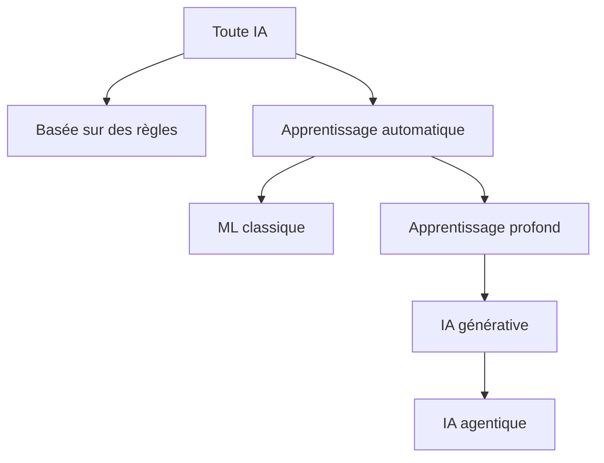
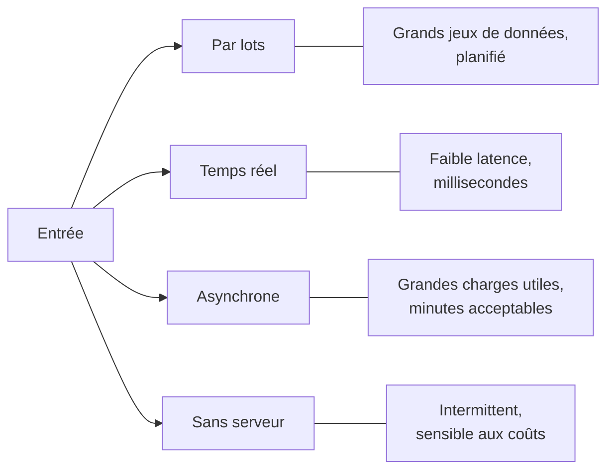
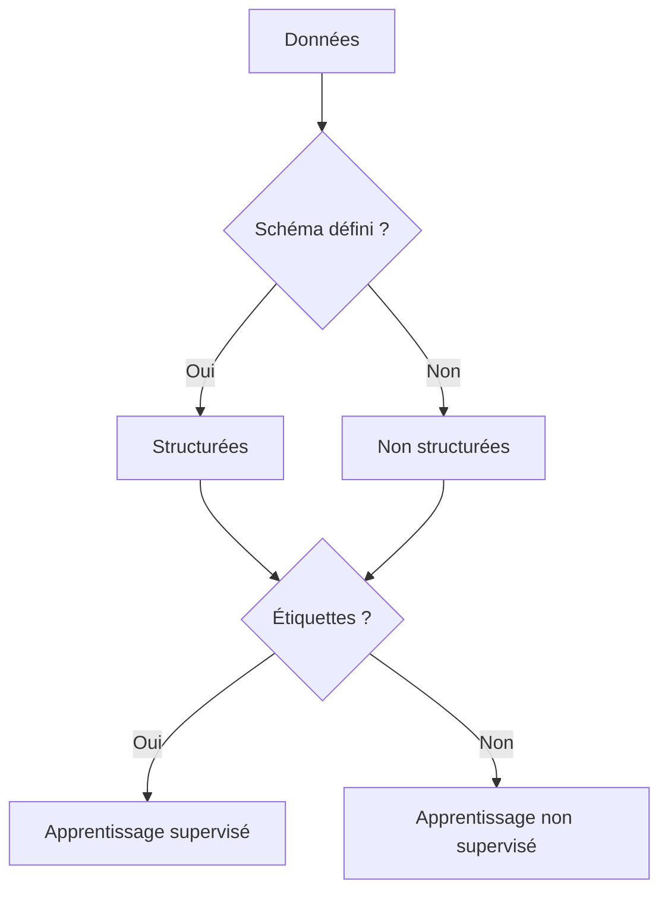
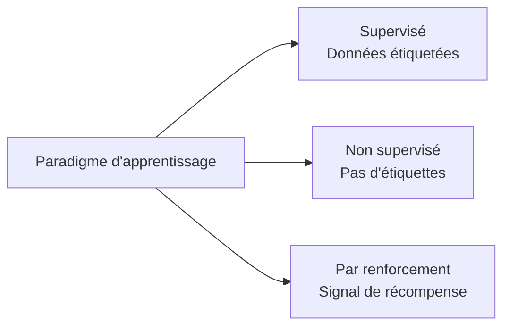

## Énoncé de tâche 1.1 : Expliquer les concepts et la terminologie de base de l'IA

Le vocabulaire de l'IA est le langage commun entre les professionnels des affaires et les équipes d'ingénierie avec lesquelles ils travaillent. Avant qu'un chef de produit puisse approuver le déploiement d'un modèle ou qu'un dirigeant puisse évaluer une proposition d'un fournisseur d'IA, tous les participants à la table doivent s'accorder sur les mêmes définitions de termes tels qu'entraînement, inférence, biais et équité. Cet énoncé de tâche établit ce vocabulaire commun et associe chaque terme aux services AWS et aux objectifs d'examen où il apparaît.[^101001]

### 1.1.1 Définir les termes de base de l'IA

Comprendre l'IA commence par des définitions précises. L'examen vérifie si vous pouvez distinguer les termes proches les uns des autres, et les enjeux métier sont réels parce qu'un langage imprécis engendre des attentes mal alignées entre les parties prenantes techniques et non techniques.

**L'intelligence artificielle (IA)** est le vaste domaine de l'informatique consacré à la construction de systèmes capables d'effectuer des tâches qui nécessiteraient normalement un raisonnement humain, comme reconnaître des images, comprendre le langage ou prendre des décisions face à l'incertitude.[^101002] L'IA n'est pas une technologie unique; c'est une catégorie qui inclut de nombreuses approches, dont seules certaines impliquent l'apprentissage à partir de données.

**L'apprentissage automatique (ML)** est un sous-ensemble de l'IA dans lequel un système apprend des schémas à partir de données plutôt que de suivre des règles explicitement écrites par un programmeur.[^101003] Par exemple, un système de détection de fraude traditionnel basé sur des règles pourrait signaler toute transaction dépassant un seuil fixe; un système basé sur le ML apprend plutôt à partir de milliers de cas de fraude historiques et généralise des schémas qu'aucune règle fixe ne pourrait capturer.

**L'apprentissage profond** est un sous-ensemble du ML qui utilise des *réseaux de neurones* avec de nombreuses couches pour représenter des schémas de plus en plus abstraits.[^101004] Le terme « profond » fait référence à la profondeur de ces couches. L'apprentissage profond alimente la plupart des systèmes modernes de reconnaissance d'images, de reconnaissance vocale et de compréhension du langage.

Un **réseau de neurones** est un modèle computationnel vaguement inspiré de la structure des neurones biologiques. Les données traversent des couches de nœuds interconnectés, chacun appliquant une transformation mathématique. Le réseau apprend quelles transformations produisent des résultats précis en ajustant ses paramètres internes pendant l'entraînement. Les réseaux peu profonds ont deux ou trois couches; les réseaux profonds peuvent en avoir des centaines.

**La vision par ordinateur (VO)** est la branche de l'IA qui permet aux machines d'interpréter des images et des vidéos.[^101006] Les systèmes de vision par ordinateur peuvent classer des objets sur une photo, détecter des défauts sur une ligne de fabrication ou compter des véhicules dans un parking. Sur AWS, les capacités de vision par ordinateur sont disponibles via **Amazon Rekognition** pour l'analyse d'images et de vidéos.[^101007]

**Le traitement du langage naturel (TLN)** est la branche de l'IA qui permet aux machines de lire, comprendre et générer le langage humain.[^101008] Les tâches de TLN comprennent l'analyse des sentiments, la reconnaissance d'entités nommées, la traduction et la synthèse de documents. AWS expose les capacités de TLN via des services tels qu'**Amazon Comprehend** pour l'analyse de texte, **Amazon Translate** pour la traduction de langues et **Amazon Transcribe** pour la conversion parole-texte.[^101009] Ces services spécialisés sont le bon choix pour les tâches à volume élevé et bien définies où le coût par appel et la latence sont importants. Pour les travaux de langage ouverts comme la génération de forme longue, la synthèse complexe ou le raisonnement en plusieurs étapes, les **grands modèles de langage (LLM)** accessibles via Amazon Bedrock sont plus adaptés; le domaine 2 de ce livre les traite en profondeur.

Un **algorithme** est la procédure mathématique utilisée pour entraîner un modèle à partir de données. Les algorithmes ML courants comprennent la régression linéaire pour prédire des valeurs continues, les arbres de décision pour la classification et le boosting par gradient pour les données tabulaires structurées. Le choix de l'algorithme détermine comment un modèle généralise des données d'entraînement à de nouvelles entrées.

Un **modèle** est l'artefact produit lorsqu'un algorithme est appliqué à un jeu de données d'entraînement. Le modèle capture les schémas que l'algorithme a trouvés et peut ensuite être utilisé pour faire des prédictions sur de nouvelles données inédites. Pensez à l'algorithme comme à la recette et au modèle comme au plat fini.

**L'entraînement** est le processus d'exposition d'un modèle à des données étiquetées ou non étiquetées pour que ses paramètres internes s'ajustent afin de minimiser l'erreur de prédiction. L'entraînement est intensif en calcul et s'exécute généralement sur une infrastructure accélérée par GPU. Sur AWS, les tâches d'entraînement s'exécutent le plus souvent sur **Amazon SageMaker AI**.

**L'inférence** (aussi appelée *scoring*) est le processus d'utilisation d'un modèle entraîné pour générer une prédiction ou une sortie pour de nouvelles données d'entrée.[^101014] L'entraînement se produit une fois ou périodiquement; l'inférence se produit continuellement chaque fois qu'un utilisateur ou un système demande une prédiction.

Le **biais** en IA désigne les erreurs systématiques dans les résultats d'un modèle qui proviennent de données d'entraînement défectueuses, d'une conception défectueuse de l'algorithme ou d'une formulation défectueuse du problème.[^101015] Par exemple, un modèle de recrutement entraîné sur des données historiques d'une entreprise ayant un historique d'embauche biaisé peut reproduire et amplifier ces schémas. Le biais est une préoccupation centrale de la gouvernance de l'IA responsable.

**L'équité** est la propriété d'un modèle qui produit des résultats équitables entre les groupes démographiques définis par des caractéristiques telles que le genre, la race ou l'âge. L'équité et le biais sont étroitement liés : un modèle est considéré comme équitable lorsque son biais envers tout groupe protégé est en dessous d'un seuil acceptable. AWS fournit **Amazon SageMaker Clarify** pour aider les équipes à détecter et mesurer le biais dans les données d'entraînement et les modèles entraînés.[^101017]

**L'ajustement** décrit dans quelle mesure les schémas appris par un modèle correspondent à la structure sous-jacente des données.[^101018] Un modèle qui s'ajuste trop étroitement à ses données d'entraînement est dit en *surapprentissage* : il mémorise le bruit plutôt que de généraliser des schémas, et son exactitude sur de nouvelles données chute fortement. Un modèle trop simple pour capturer des schémas réels est dit en *sous-apprentissage* : il performe mal sur les données d'entraînement comme sur de nouvelles données. Un bon ajustement se situe entre ces extrêmes.

Un **grand modèle de langage (LLM)** est un modèle d'apprentissage profond, plus précisément un réseau de neurones entraîné sur un vaste corpus de texte, capable de générer, synthétiser, traduire et raisonner sur le langage à un niveau de fluidité et de flexibilité impossible avec les techniques de TLN antérieures.[^101019] Les LLM tels qu'Amazon Titan, Anthropic Claude et Meta Llama constituent la base de la plupart des applications modernes d'IA générative. Leur échelle, mesurée en milliards de paramètres, leur confère de larges capacités mais les rend également coûteux à entraîner de zéro.

**L'IA générative (GenAI)** est une classe d'IA qui produit de nouveaux contenus, comme du texte, des images, de l'audio ou du code, en réponse à une invite.[^101020] Les systèmes d'IA générative sont généralement construits sur des LLM ou des modèles génératifs à grande échelle similaires. Contrairement aux anciens modèles ML qui classifient ou prédisent une valeur unique, un système d'IA générative produit une sortie de longueur variable, lisible par l'homme. L'IA générative et l'IA agentique ont été ajoutées au guide d'examen en V1.1 pour refléter leur adoption massive dans les projets d'entreprise depuis la publication du guide original.

**L'IA agentique** est une extension de l'IA générative dans laquelle un modèle reçoit un objectif et un ensemble d'outils, puis planifie et exécute de manière autonome des actions en plusieurs étapes pour atteindre cet objectif sans nécessiter l'approbation humaine à chaque étape.[^101021] Le moteur de raisonnement reste un modèle génératif; l'IA agentique ajoute la boucle de planification, l'accès aux outils et la mémoire qui transforment la génération ponctuelle en action orientée vers un objectif. Un système d'IA agentique peut parcourir une base de connaissances, appeler des API externes, écrire du code et vérifier ses résultats sur plusieurs étapes séquentielles avant de renvoyer une réponse. C'est qualitativement différent d'une interaction simple de questions-réponses. AWS prend en charge l'IA agentique via **Amazon Bedrock** Agents et **Amazon Bedrock AgentCore**, qui fournissent l'infrastructure pour l'orchestration en plusieurs étapes, la mémoire et l'utilisation d'outils.[^101022]

### 1.1.2 Différences entre IA, ML, GenAI, apprentissage profond et IA agentique

Ces cinq termes décrivent une hiérarchie imbriquée, pas des technologies séparées. La confusion sur leurs relations est l'une des sources les plus courantes de mauvaise communication dans la planification de projets d'IA. Chaque terme s'inscrit entièrement dans le périmètre du terme qui le précède.

**L'intelligence artificielle** est le terme le plus large. Il inclut toute technique qui fait se comporter un système informatique d'une manière qui ressemble au raisonnement humain. Cela inclut les systèmes experts basés sur des règles des années 1970, le ML statistique des années 1990 et les réseaux de neurones d'aujourd'hui.

**L'apprentissage automatique** est un sous-ensemble de l'IA qui limite la définition aux systèmes qui apprennent à partir de données. Un filtre anti-fraude basé sur des règles écrit par un programmeur est de l'IA mais pas du ML. Un modèle de fraude entraîné sur des historiques de transactions est à la fois de l'IA et du ML.

**L'apprentissage profond** est un sous-ensemble du ML qui utilise des réseaux de neurones en couches. Un modèle de régression linéaire est du ML mais pas de l'apprentissage profond. Un réseau de neurones convolutif qui classifie des radiographies thoraciques est du ML, de l'apprentissage profond et de l'IA.

**L'IA générative** est un sous-ensemble de l'apprentissage profond spécifiquement concerné par la génération de nouveaux contenus. Tout l'apprentissage profond n'est pas génératif : un modèle d'apprentissage profond qui classifie des images en dix catégories est discriminatif, pas génératif. Un modèle qui produit une image photoréaliste à partir d'une description textuelle est de l'IA générative.

**L'IA agentique** est un modèle architectural superposé à l'IA générative. Un système agentique utilise un LLM ou un autre modèle génératif comme moteur de raisonnement, puis ajoute une boucle de planification, un accès aux outils et une mémoire pour pouvoir agir sur plusieurs étapes. Un chatbot à tour unique utilisant un LLM est de l'IA générative mais pas de l'IA agentique. Un système qui reçoit un objectif de haut niveau, le décompose en sous-tâches, utilise des outils pour exécuter chaque sous-tâche et synthétise les résultats est de l'IA agentique.

*Figure 1.1.1: Imbrication des sous-domaines de l'IA. Chaque nœud est un sous-ensemble strict de son parent; descendre dans l'arbre ajoute des contraintes et des capacités sans remplacer le concept parent.*

L'examen teste fréquemment les cas limites. Un candidat qui traite « IA » et « ML » comme synonymes, ou qui confond « IA générative » et « apprentissage profond », lira mal les questions de scénario qui dépendent de savoir quel sous-ensemble s'applique. L'implication pratique pour les affaires est tout aussi concrète : une équipe qui déploie un système d'IA agentique fait face à des considérations de gouvernance, de coût et de sécurité différentes de celles d'une équipe qui exécute un modèle de classification ML classique, parce que les systèmes agentiques prennent des actions réelles plutôt que de produire des résultats statiques.

*Tableau 1.1.1: Distinctions clés entre les sous-domaines de l'IA*

| Terme | Catégorie parente | Se définit par | Exemple AWS typique |
|------|-----------------|------------|---------------------|
| Intelligence artificielle | Aucune | Comportement semblable au raisonnement | Tout service AWS IA/ML |
| Apprentissage automatique | IA | Apprend à partir de données | Amazon SageMaker AI |
| Apprentissage profond | ML | Réseaux de neurones en couches | SageMaker avec instances GPU |
| IA générative | Apprentissage profond | Produit de nouveaux contenus | Amazon Bedrock |
| IA agentique | IA générative | Action autonome en plusieurs étapes | Bedrock Agents, Bedrock AgentCore |

Une nuance à noter : certains chercheurs classent l'IA agentique comme un modèle architectural plutôt que comme un sous-domaine technologique, parce qu'un système agentique est composé de technologies existantes (LLM, outils, logique d'orchestration) plutôt que d'être un nouveau type de modèle. Pour l'examen, traitez l'IA agentique comme la couche la plus spécialisée de la hiérarchie.

### 1.1.3 Types d'inférence

Après l'entraînement d'un modèle, il doit être déployé pour pouvoir générer des prédictions. La façon dont ces prédictions sont demandées et renvoyées définit le mode d'inférence. Le guide d'examen V1.1 a ajouté l'inférence asynchrone et l'inférence sans serveur à la liste parce qu'AWS a étendu ses options d'inférence gérée après le lancement du premier examen.

Les quatre modes d'inférence standard sont par lots, temps réel, asynchrone et sans serveur. Chacun résout une combinaison différente d'exigences de débit et de latence, et choisir le mauvais mode pour un cas d'usage est l'une des causes les plus courantes de problèmes de coût et de performance dans les systèmes d'IA en production.

**L'inférence par lots** traite un grand ensemble d'entrées en un seul traitement, généralement selon un calendrier.[^101024] Le système collecte les entrées sur une période de temps, exécute le modèle sur toutes à la fois et stocke les résultats pour une utilisation ultérieure. Un détaillant qui génère des recommandations de produits du soir au lendemain pour chaque client de sa base de données utilise l'inférence par lots. Sur AWS, **Amazon SageMaker AI** Batch Transform exécute des traitements d'inférence par lots contre des données stockées dans **Amazon S3**, redimensionnant le parc de calcul pour la durée du traitement et l'arrêtant à la fin.

**L'inférence en temps réel** traite une seule demande d'entrée et renvoie une prédiction en quelques millisecondes.[^101026] Le modèle est déployé sur un point de terminaison persistant qui reste actif, acceptant les demandes des applications. Un système de détection de fraude qui doit évaluer une transaction par carte de crédit avant que le terminal de paiement du client n'expire nécessite une inférence en temps réel. Sur AWS, les points de terminaison en temps réel de SageMaker AI hébergent les modèles derrière un point de terminaison HTTPS persistant et peuvent appliquer *l'Auto Scaling* pour gérer des volumes de demandes variables.

**L'inférence asynchrone** (parfois appelée inférence *en file d'attente* car elle partage le modèle de traitement en file d'attente des traitements par lots tout en opérant une demande à la fois) accepte une demande, la met en file d'attente et renvoie le résultat via un mécanisme de rappel ou d'interrogation plutôt que dans la fenêtre de délai de la demande originale.[^101028] Ce mode est approprié lorsque les entrées sont volumineuses ou lorsque le modèle prend plus de temps à traiter qu'une requête web ne peut raisonnablement attendre. Par exemple, un système d'intelligence documentaire qui traite des contrats de plusieurs pages peut prendre 30 à 90 secondes par document : un appel web synchrone expirerait, mais un mode asynchrone permet au système appelant de revérifier ultérieurement le résultat. Sur AWS, les points de terminaison SageMaker AI Async Inference acceptent des charges utiles volumineuses, les mettent en file d'attente et écrivent les résultats dans S3 pour récupération.

**L'inférence sans serveur** exécute le modèle à la demande sans nécessiter de pré-provisionnement d'un point de terminaison persistant.[^101030] Le calcul sous-jacent se réduit à zéro lorsqu'il est inactif, éliminant le coût fixe d'un point de terminaison en fonctionnement. L'inférence sans serveur est bien adaptée aux charges de travail intermittentes ou imprévisibles où le coût du calcul inactif dépasse le bénéfice d'une faible latence. Sur AWS, SageMaker AI Serverless Inference provisionne et déprovisionne automatiquement le calcul, avec le compromis que la première demande après une période d'inactivité peut connaître un délai de *démarrage à froid*.

*Figure 1.1.2: Sélection du mode d'inférence. Le choix dépend de la combinaison de volume d'entrée, de latence acceptable et de contraintes de coût pour le cas d'usage spécifique.*

*Tableau 1.1.2: Comparaison des modes d'inférence*

| Mode | Latence | Taille d'entrée | Modèle de coût | Idéal pour |
|---------|---------|------------|------------|----------|
| Par lots | Minutes à heures | Très grande | Par traitement | Scoring nocturne, rapports en masse |
| Temps réel | Millisecondes | Petite | Par heure de point de terminaison | Détection de fraude, recommandations en direct |
| Asynchrone | Secondes à minutes | Grande | Par demande | Traitement de documents, analyse vidéo |
| Sans serveur | Secondes (froid), millisecondes (chaud) | Petite à moyenne | Par inférence | API à faible trafic, utilisation intermittente |

Comprendre les différences de coût est important pour les professionnels des affaires : un point de terminaison en temps réel persistant génère des coûts en permanence, qu'il reçoive du trafic ou non, tandis que l'inférence sans serveur ne facture que l'utilisation réelle. Pour un système qui traite des demandes uniquement pendant les heures ouvrables, la différence de coût peut être substantielle.

### 1.1.4 Types de données dans les modèles IA

Les modèles IA sont façonnés par les données dont ils apprennent, et les données se présentent sous de nombreuses formes. Le type de données qu'un modèle attend détermine quels algorithmes sont appropriés, quelles étapes de prétraitement sont nécessaires et comment le modèle peut être déployé. Un professionnel des affaires capable de décrire les données de son organisation en ces termes peut communiquer beaucoup plus efficacement avec une équipe de data science.

La première distinction fondamentale est entre les **données étiquetées** et les **données non étiquetées**.[^101032] Les données étiquetées incluent à la fois l'entrée (par exemple, une image d'un chat) et la bonne réponse (l'étiquette « chat »). Les données non étiquetées incluent uniquement l'entrée, sans réponse associée. Les jeux de données étiquetés sont plus coûteux à produire car ils nécessitent une annotation humaine, mais ils sont nécessaires pour l'apprentissage supervisé. Les jeux de données non étiquetés sont abondants et bon marché mais nécessitent des techniques non supervisées ou auto-supervisées pour extraire des schémas.

Au-delà de la distinction étiquetée-non étiquetée, les données varient également selon leur structure et leur format :

- Les **données tabulaires** sont organisées en lignes et colonnes, comme dans une feuille de calcul ou une table de base de données relationnelle. Chaque colonne représente une caractéristique (par exemple, âge, solde de compte ou montant de transaction) et chaque ligne représente une observation. Les algorithmes ML classiques comme les arbres boostés par gradient fonctionnent particulièrement bien sur les données tabulaires.
- Les **données de séries temporelles** sont une séquence de mesures enregistrées à intervalles de temps réguliers. Les cours boursiers, l'utilisation du CPU d'un serveur et les lectures de fréquence cardiaque d'un patient sont des données de séries temporelles. Les modèles entraînés sur des données de séries temporelles apprennent des schémas temporels comme les tendances, la saisonnalité et les anomalies.
- Les **données d'image** consistent en des valeurs de pixels organisées dans une grille bidimensionnelle, potentiellement avec plusieurs canaux de couleur. Les modèles de vision par ordinateur apprennent à détecter des bords, des formes, des textures et des objets à partir de données d'image. Les exigences en volume sont élevées : un jeu de données d'image significatif contient généralement des dizaines de milliers à des millions d'exemples étiquetés.
- Les **données textuelles** sont des séquences de mots ou de caractères en langage naturel. Les modèles TLN apprennent la grammaire, la sémantique et les associations factuelles à partir du texte. Les grands modèles de langage sont entraînés sur des corpus de texte contenant des centaines de milliards de mots.

Une deuxième distinction orthogonale s'applique à tous ces formats : les **données structurées** ont un schéma bien défini, comme une table de base de données avec des colonnes typées.[^101037] Les **données non structurées** n'ont pas de schéma prédéfini : elles incluent le texte libre, les images, l'audio et la vidéo. Les données structurées sont plus directement utilisables par les algorithmes ML classiques; les données non structurées nécessitent généralement un modèle basé sur des réseaux de neurones ou une étape de prétraitement pour extraire des caractéristiques structurées.

*Tableau 1.1.3: Types de données dans les modèles IA*

| Type de données | Structure | Approche ML typique | Exemple de service AWS |
|-----------|-----------|---------------------|---------------------|
| Tabulaire | Structurée | Boosting par gradient, modèles linéaires | Algorithmes intégrés SageMaker AI |
| Séries temporelles | Structurée | Modèles séquentiels, LSTM, DeepAR | SageMaker AI DeepAR |
| Image | Non structurée | Réseaux de neurones convolutifs | Amazon Rekognition, SageMaker AI |
| Texte | Non structurée | Modèles Transformer, LLM | Amazon Comprehend, Amazon Bedrock |

**Amazon SageMaker Ground Truth** aide les équipes à créer des jeux de données étiquetés en combinant l'étiquetage automatisé avec la révision humaine, réduisant le temps et le coût d'annotation à grande échelle.[^101038]

En pratique, les projets IA du monde réel combinent souvent des types de données. Un modèle de prédiction du taux d'attrition des clients peut utiliser des données CRM tabulaires en plus du texte des tickets de support, obligeant l'équipe à construire ou sélectionner des modèles capables de gérer les deux modalités. Savoir quels types de données l'entreprise possède en abondance aide à déterminer quelles approches IA sont réalisables.

*Figure 1.1.3: Arbre de décision pour les types de données. La structure et la disponibilité des étiquettes déterminent ensemble quelle approche d'apprentissage est réalisable pour un jeu de données donné.*

### 1.1.5 Types d'apprentissage IA/ML

La façon dont un modèle apprend à partir de données s'appelle son *paradigme d'apprentissage*. Le paradigme d'apprentissage détermine quel type de données le modèle requiert, comment il généralise et quels types de problèmes il peut résoudre. L'examen teste les trois principaux paradigmes : supervisé, non supervisé et par renforcement.

**L'apprentissage supervisé** entraîne un modèle sur un jeu de données dans lequel chaque entrée est associée à une étiquette de sortie correcte.[^101039] Le modèle apprend à associer les entrées aux sorties en minimisant la différence entre ses prédictions et les étiquettes connues. C'est le paradigme le plus couramment utilisé dans l'IA commerciale parce qu'il produit des modèles faciles à évaluer : vous mesurez l'exactitude sur un ensemble de test retenu d'exemples étiquetés.

L'apprentissage supervisé couvre deux types principaux de problèmes. La *régression* prédit une valeur numérique continue, comme le chiffre d'affaires attendu d'un client au cours du prochain trimestre. La *classification* assigne une entrée à l'une d'un ensemble discret de catégories, comme étiqueter un e-mail comme spam ou non-spam. La plupart des systèmes de recommandation de produits, de détection de fraude et de diagnostic médical utilisent des modèles de classification ou de régression supervisés.

**L'apprentissage non supervisé** entraîne un modèle sur des données sans étiquettes.[^101041] Le modèle doit trouver une structure dans les données par lui-même, sans indication sur ce qu'est la bonne réponse. La technique non supervisée la plus courante est le *regroupement*, dans laquelle le modèle groupe des entrées similaires ensemble. Par exemple, une équipe marketing pourrait utiliser le regroupement non supervisé sur des historiques d'achats de clients pour découvrir des segments de clients naturels qui peuvent ensuite recevoir des campagnes ciblées. Une autre technique courante est la *réduction de dimensionnalité*, qui compresse des données de haute dimensionnalité en moins de dimensions tout en préservant sa structure la plus importante, facilitant la visualisation ou l'alimentation d'un modèle en aval.

**L'apprentissage par renforcement** entraîne un agent à prendre des actions dans un environnement en le récompensant pour les bons résultats et en le pénalisant pour les mauvais.[^101043] L'agent apprend une *politique* : une correspondance entre l'état observé et l'action qui maximise la récompense cumulée dans le temps. L'apprentissage par renforcement est le paradigme derrière les systèmes IA jouant aux jeux et de plus en plus derrière des applications industrielles telles que le contrôle robotique, l'optimisation de la chaîne logistique et les systèmes de recommandation de contenu personnalisé qui optimisent pour l'engagement à long terme plutôt que le taux de clic immédiat.

*Tableau 1.1.4: Comparaison des paradigmes d'apprentissage IA/ML*

| Paradigme | Données d'entrée | Apprend | Cas d'usage courants |
|----------|-----------|--------|-----------------|
| Supervisé | Étiquetées | Correspondance entrée-sortie | Classification, régression, détection de fraude |
| Non supervisé | Non étiquetées | Structure cachée | Segmentation client, détection d'anomalies |
| Par renforcement | Signaux de récompense | Politique optimale | Robotique, jeux, personnalisation |

Deux paradigmes d'apprentissage supplémentaires apparaissent aux marges du périmètre de l'examen. *L'apprentissage semi-supervisé* combine une petite quantité de données étiquetées avec une grande quantité de données non étiquetées, ce qui est utile lorsque l'étiquetage est coûteux.[^101045] *L'apprentissage auto-supervisé* génère automatiquement des étiquettes à partir des données elles-mêmes, par exemple en masquant un mot dans une phrase et en entraînant le modèle à prédire le mot manquant. L'apprentissage auto-supervisé est la technique derrière la phase de préentraînement de la plupart des grands modèles de langage modernes.

*Figure 1.1.4: Vue d'ensemble des paradigmes d'apprentissage. Les trois paradigmes principaux diffèrent par le type de retour que le modèle reçoit pendant l'entraînement.*

Le choix du paradigme d'apprentissage est une décision pratique d'entreprise, pas seulement technique. L'apprentissage supervisé nécessite des données étiquetées, ce qui coûte de l'argent à produire. L'apprentissage non supervisé évite ce coût mais ne peut pas optimiser directement pour un résultat métier spécifique. L'apprentissage par renforcement peut optimiser pour des objectifs complexes en plusieurs étapes, mais il nécessite une conception plus soignée de la fonction de récompense et est plus difficile à auditer pour l'équité et le biais. Un professionnel des affaires qui comprend ces compromis peut poser les bonnes questions lorsqu'une équipe de data science propose une approche.

## Questions d'auto-évaluation

**Question 1.** Une entreprise de commerce de détail construit un système qui catégorise automatiquement les tickets de support client dans l'un des cinq types de problèmes (facturation, retours, livraison, qualité du produit, autre). L'équipe dispose d'un jeu de données de 50 000 tickets déjà examinés et catégorisés par des agents humains. Quel type de paradigme d'apprentissage ML est le plus approprié pour ce cas d'usage ?

A. L'apprentissage non supervisé, parce que le modèle doit trouver une structure dans les données textuelles sans guidage humain.
B. L'apprentissage par renforcement, parce que le modèle doit apprendre une politique pour acheminer les tickets vers la bonne équipe.
C. L'apprentissage supervisé, parce que l'équipe dispose d'exemples étiquetés et que la tâche consiste à classer les nouvelles entrées dans des catégories prédéfinies.
D. L'apprentissage auto-supervisé, parce que le modèle doit prédire des mots masqués dans le texte du ticket.

**Réponse : C.**

La caractéristique définissante de l'apprentissage supervisé est que chaque exemple d'entraînement inclut à la fois une entrée et une étiquette de sortie correcte connue. Dans ce scénario, les 50 000 tickets ont déjà été catégorisés par des agents humains, ce qui signifie que chaque ticket a une étiquette (« facturation », « retours », etc.). La tâche du modèle est d'apprendre la correspondance entre le texte du ticket et la catégorie, puis d'appliquer cette correspondance à de nouveaux tickets non étiquetés. Il s'agit d'un problème de classification classique, qui est un sous-type de l'apprentissage supervisé.[^101047]

L'apprentissage non supervisé (option A) est incorrect parce que le jeu de données est étiquetté. Les techniques non supervisées comme le regroupement découvriraient des groupes dans les données, mais ces groupes pourraient ne pas s'aligner avec les cinq catégories métier prédéfinies. L'apprentissage par renforcement (option B) est incorrect parce qu'il n'y a pas d'environnement pour un agent et pas de signal de récompense différé; la bonne réponse pour chaque exemple d'entraînement est connue immédiatement. L'apprentissage auto-supervisé (option D) est une technique pour le préentraînement de modèles de langage en masquant des jetons et en les prédisant; ce n'est pas le bon cadre pour une tâche de classification où des étiquettes de vérité terrain sont disponibles.

---

**Question 2.** Une société de services financiers souhaite déployer un modèle de détection de fraude qui doit renvoyer une prédiction dans les 200 millisecondes pour chaque transaction par carte présente au point de vente. Le modèle est un modèle de classification relativement petit. Quel mode d'inférence l'équipe devrait-elle utiliser ?

A. L'inférence par lots, parce que le volume élevé de transactions rend le traitement par lots plus économique.
B. L'inférence en temps réel, parce que le cas d'usage nécessite une prédiction avant l'expiration de la transaction.
C. L'inférence asynchrone, parce que le traitement de chaque transaction individuellement réduit la contention de file d'attente.
D. L'inférence sans serveur, parce que les transactions par carte présente se produisent de manière intermittente.

**Réponse : B.**

L'inférence en temps réel est le mode approprié lorsqu'une prédiction doit être renvoyée dans la fenêtre de latence d'une action orientée utilisateur ou sensible au temps.[^101048] Une transaction par carte présente à un terminal de point de vente expire généralement en moins d'une seconde, faisant de l'exigence de 200 millisecondes une contrainte stricte. Les points de terminaison en temps réel dans Amazon SageMaker AI maintiennent un modèle persistant derrière un point de terminaison HTTPS qui répond de manière synchrone en quelques millisecondes.

L'inférence par lots (option A) est incorrecte parce que les traitements par lots agrègent les entrées et les traitent ensemble selon un calendrier : la prédiction arriverait des heures après la transaction, la rendant inutile pour la prévention de la fraude en temps réel. L'inférence asynchrone (option C) est incorrecte parce que les modes asynchrones acceptent une demande, la mettent en file d'attente et renvoient le résultat plus tard via rappel ou interrogation; le système appelant n'obtient pas de réponse immédiate. L'inférence sans serveur (option D) pourrait atteindre l'objectif de latence si le point de terminaison est chaud, mais les démarrages à froid peuvent prendre plusieurs secondes, ce qui violerait l'exigence de 200 millisecondes pour la première demande après une période d'inactivité. Un point de terminaison en temps réel persistant évite les démarrages à froid et est le mode standard pour la prédiction sensible à la latence.

---

**Question 3.** Une équipe de data science prépare un jeu de données d'entraînement pour un modèle de prédiction du taux d'attrition des clients. La moitié du jeu de données contient des étiquettes d'attrition explicites (attrition vs. rétention) provenant d'enregistrements historiques. L'autre moitié contient des journaux d'interactions clients sans résultat d'attrition enregistré. Quel type de données la moitié étiquetée représente-t-elle ?

A. Des données de séries temporelles, parce que les enregistrements capturent des événements sur une période de temps.
B. Des données non supervisées, parce que l'objectif est de découvrir des segments de clients cachés.
C. Des données étiquetées, parce que chaque enregistrement est associé à un résultat connu (attrition ou rétention).
D. Des données non structurées, parce que les enregistrements contiennent des champs de texte libre issus des interactions de support.

**Réponse : C.**

Les données étiquetées sont définies par la présence d'une sortie correcte associée à chaque entrée.[^101049] Dans ce scénario, les enregistrements historiques incluent la variable de résultat (attrition ou rétention), qui est l'étiquette que le modèle supervisé apprendra à prédire. Le format des données (tabulaire, dans ce cas) est une dimension séparée de la distinction étiquetée-non étiquetée. Un enregistrement peut être à la fois tabulaire et étiqueté.

L'option A (séries temporelles) est une dimension de type de données séparée; les enregistrements peuvent ou non être horodatés, mais cela ne définit pas s'ils sont étiquetés. L'option B est incorrecte parce que « non supervisé » est un paradigme d'apprentissage, pas un type de données, et la question porte sur la classification des données, pas sur la technique qu'une équipe appliquerait. L'option D applique mal la distinction structurée-non structurée : les données structurées se définissent par la présence d'un schéma (lignes et colonnes), ce qui est vrai de la plupart des enregistrements CRM et de transactions, qu'il y ait ou non des champs de texte libre présents. La question porte spécifiquement sur la moitié étiquetée, faisant de C la seule description correcte.

---

**Question 4.** Une organisation construit un système IA qui recevra un objectif de haut niveau comme « préparer un rapport d'analyse de marché sur la tarification des concurrents », puis recherchera indépendamment dans des bases de connaissances internes, récupérera des données de tarification depuis une API externe, rédigera un résumé et vérifiera ses conclusions avant de livrer le résultat. Quelle catégorie d'IA décrit le MIEUX ce système ?

A. L'apprentissage automatique classique, parce que le système utilise un modèle entraîné pour produire des résultats à partir d'entrées structurées.
B. L'IA générative, parce que le système produit un nouveau document textuel comme résultat.
C. L'IA agentique, parce que le système planifie et exécute plusieurs actions séquentielles de manière autonome pour atteindre un objectif.
D. La vision par ordinateur, parce que le système doit analyser et interpréter des données provenant de plusieurs sources.

**Réponse : C.**

L'IA agentique se distingue par la planification et l'exécution autonomes en plusieurs étapes : le système ne répond pas simplement à une seule invite mais décompose plutôt un objectif de haut niveau en sous-tâches, utilise des outils (recherche dans la base de connaissances, appels d'API externes), évalue les résultats intermédiaires et synthétise un résultat final.[^101050] C'est la caractéristique définissante des systèmes agentiques qui les distingue des interactions IA générative à tour unique.

L'option B (IA générative) est partiellement correcte en ce que le système produit un document textuel, mais l'IA générative seule décrit uniquement la modalité de sortie, pas la boucle de planification et d'utilisation d'outils autonome. Un chatbot à tour unique qui génère du texte est de l'IA générative mais pas de l'IA agentique. L'option A (ML classique) est incorrecte parce que le ML classique produit une seule prédiction à partir d'une entrée structurée; il ne implique pas de raisonnement en plusieurs étapes ou d'orchestration d'outils. L'option D (vision par ordinateur) est incorrecte parce que la VO est spécifiquement l'analyse de données d'images et de vidéos; le scénario implique du texte, des API et des bases de connaissances, pas des données en pixels.

---

**Question 5.** Un analyste marketing veut comprendre quels clients partagent des comportements d'achat similaires, mais l'équipe n'a pas de catégories prédéterminées et n'a étiqueté aucun enregistrement client. Quel paradigme IA/ML est le plus approprié ?

A. L'apprentissage supervisé, parce que les historiques d'achats sont des données tabulaires structurées.
B. L'apprentissage par renforcement, parce que le système doit apprendre quels clients cibler.
C. L'apprentissage semi-supervisé, parce que certains enregistrements peuvent être partiellement étiquetés par des normes sectorielles.
D. L'apprentissage non supervisé, parce qu'il n'y a pas d'étiquettes et que l'objectif est de découvrir des regroupements naturels dans les données.

**Réponse : D.**

L'apprentissage non supervisé est le paradigme approprié lorsque le jeu de données n'a pas d'étiquettes et que l'objectif est de trouver une structure non prédéfinie.[^101051] Le regroupement, une technique non supervisée, partitionnera la base de clients en groupes basés sur la similarité des schémas d'achat. Ces groupes peuvent ensuite être examinés par l'analyste et associés à des segments métier.

L'option A est incorrecte parce que le format de données structurées ne détermine pas le paradigme d'apprentissage. L'apprentissage supervisé nécessite des étiquettes, qui sont explicitement absentes dans ce scénario. L'option B est incorrecte parce que l'apprentissage par renforcement nécessite un agent, un environnement et un signal de récompense lié à des actions séquentielles; la segmentation des clients existants n'est pas un problème de prise de décision séquentielle. L'option C (semi-supervisé) est incorrecte parce que la question indique qu'aucun enregistrement n'est étiqueté; l'apprentissage semi-supervisé nécessite au moins quelques exemples étiquetés pour guider le modèle.

---

[^101001]: AWS Certification: AWS Certified AI Practitioner Exam Guide v1.1, Task Statement 1.1. URL: <https://docs.aws.amazon.com/aws-certification/latest/ai-practitioner-01/ai-practitioner-01-domain1.html>
[^101002]: NIST AI 100-1: Artificial Intelligence Risk Management Framework. URL: <https://airc.nist.gov/Home>
[^101003]: Amazon SageMaker AI Developer Guide: What Is Machine Learning? URL: <https://docs.aws.amazon.com/sagemaker/latest/dg/whatis.html>
[^101004]: AWS Machine Learning Blog: Deep Learning. URL: <https://aws.amazon.com/what-is/deep-learning/>
[^101006]: AWS: What Is Computer Vision? URL: <https://aws.amazon.com/what-is/computer-vision/>
[^101007]: Amazon Rekognition Developer Guide: What Is Amazon Rekognition? URL: <https://docs.aws.amazon.com/rekognition/latest/dg/what-is.html>
[^101008]: AWS: What Is Natural Language Processing? URL: <https://aws.amazon.com/what-is/natural-language-processing/>
[^101009]: Amazon Comprehend Developer Guide: What Is Amazon Comprehend? URL: <https://docs.aws.amazon.com/comprehend/latest/dg/what-is.html>
[^101014]: AWS: What Is ML Inference? URL: <https://aws.amazon.com/what-is/ml-inference/>
[^101015]: AWS: What Is AI Bias? URL: <https://aws.amazon.com/what-is/ai-bias/>
[^101017]: Amazon SageMaker Clarify Developer Guide: What Is Amazon SageMaker Clarify? URL: <https://docs.aws.amazon.com/sagemaker/latest/dg/clarify-what-is.html>
[^101018]: AWS: What Is Overfitting in Machine Learning? URL: <https://aws.amazon.com/what-is/overfitting/>
[^101019]: AWS: What Is a Large Language Model? URL: <https://aws.amazon.com/what-is/large-language-model/>
[^101020]: AWS: What Is Generative AI? URL: <https://aws.amazon.com/what-is/generative-ai/>
[^101021]: AWS: What Is Agentic AI? URL: <https://aws.amazon.com/what-is/agentic-ai/>
[^101022]: Amazon Bedrock AgentCore Documentation. URL: <https://docs.aws.amazon.com/bedrock/latest/userguide/agents.html>
[^101024]: Amazon SageMaker AI Developer Guide: Get Inferences for an Entire Dataset with Batch Transform. URL: <https://docs.aws.amazon.com/sagemaker/latest/dg/batch-transform.html>
[^101026]: Amazon SageMaker AI Developer Guide: Deploy Models for Inference. URL: <https://docs.aws.amazon.com/sagemaker/latest/dg/deploy-model.html>
[^101028]: Amazon SageMaker AI Developer Guide: Asynchronous Inference. URL: <https://docs.aws.amazon.com/sagemaker/latest/dg/async-inference.html>
[^101030]: Amazon SageMaker AI Developer Guide: Use Serverless Inference. URL: <https://docs.aws.amazon.com/sagemaker/latest/dg/serverless-endpoints.html>
[^101032]: AWS: What Is Labeled Data? URL: <https://aws.amazon.com/what-is/labeled-data/>
[^101037]: AWS: Structured vs Unstructured Data. URL: <https://aws.amazon.com/what-is/structured-data/>
[^101038]: Amazon SageMaker Ground Truth Developer Guide: Use Amazon SageMaker Ground Truth to Label Data. URL: <https://docs.aws.amazon.com/sagemaker/latest/dg/sms.html>
[^101039]: AWS: What Is Supervised Learning? URL: <https://aws.amazon.com/what-is/supervised-learning/>
[^101041]: AWS: What Is Unsupervised Learning? URL: <https://aws.amazon.com/what-is/unsupervised-learning/>
[^101043]: AWS: What Is Reinforcement Learning? URL: <https://aws.amazon.com/what-is/reinforcement-learning/>
[^101045]: AWS: Semi-Supervised Learning Overview. URL: <https://aws.amazon.com/what-is/semi-supervised-learning/>
[^101047]: Amazon SageMaker AI Developer Guide: Supervised Learning with SageMaker. URL: <https://docs.aws.amazon.com/sagemaker/latest/dg/algos.html>
[^101048]: Amazon SageMaker AI Developer Guide: Real-Time Inference. URL: <https://docs.aws.amazon.com/sagemaker/latest/dg/realtime-endpoints.html>
[^101049]: AWS: What Is Training Data? URL: <https://aws.amazon.com/what-is/training-data/>
[^101050]: Amazon Bedrock Agents Developer Guide: How Amazon Bedrock Agents Work. URL: <https://docs.aws.amazon.com/bedrock/latest/userguide/agents-how.html>
[^101051]: Amazon SageMaker AI Developer Guide: K-Means Clustering Algorithm. URL: <https://docs.aws.amazon.com/sagemaker/latest/dg/k-means.html>
