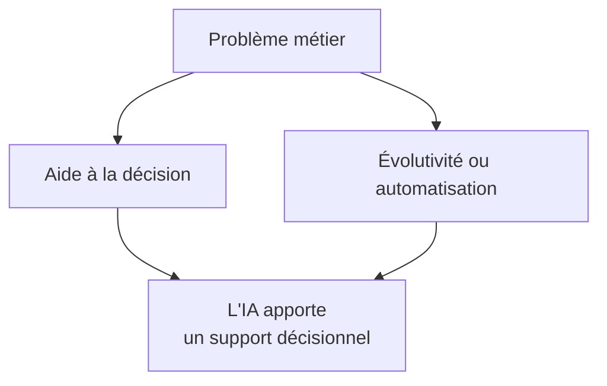
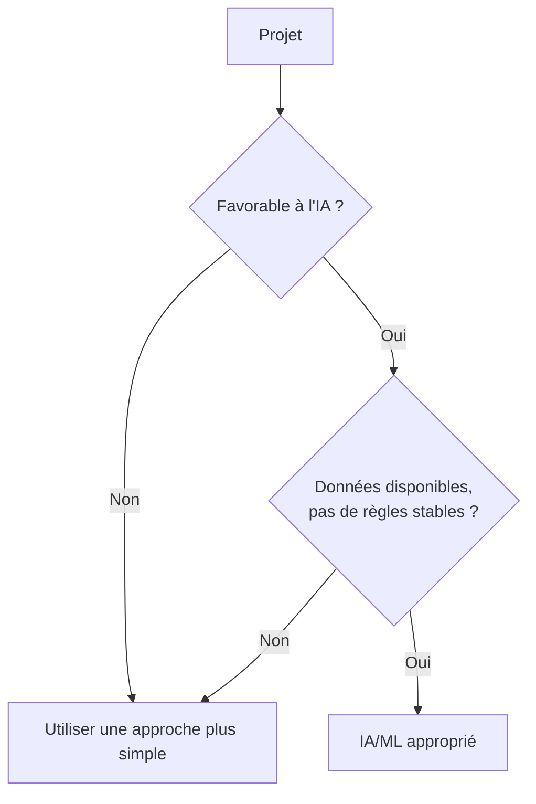
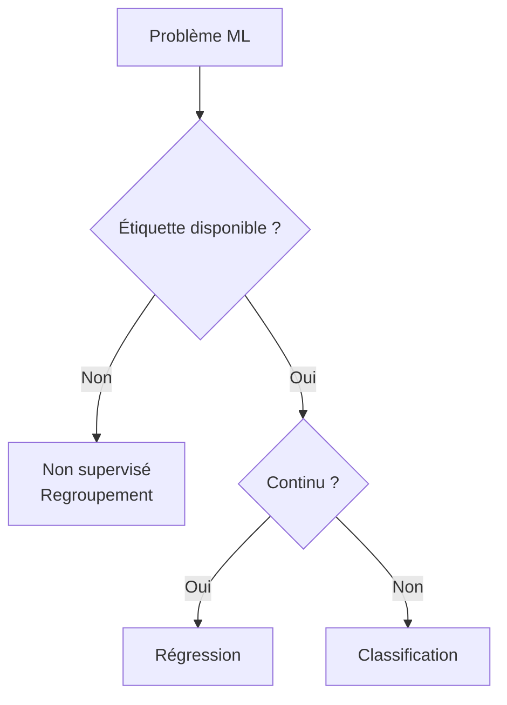
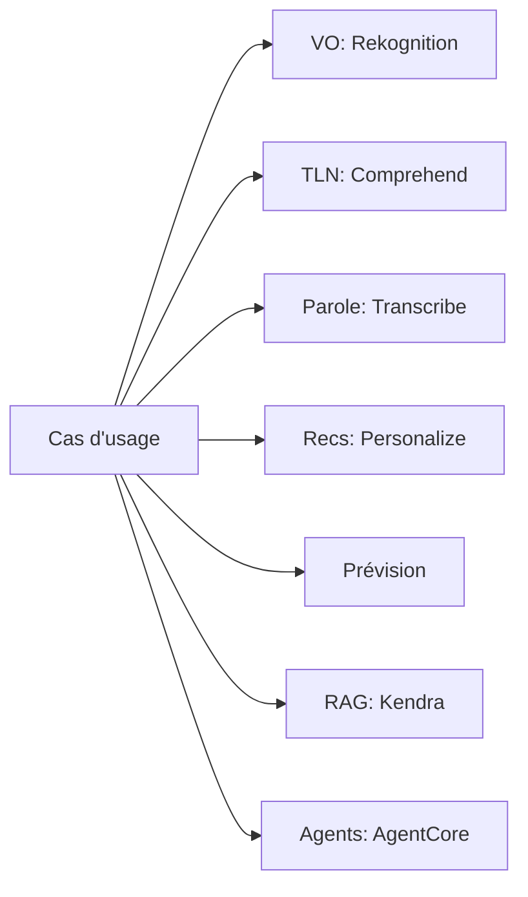
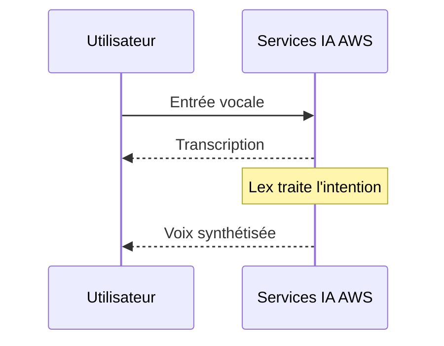
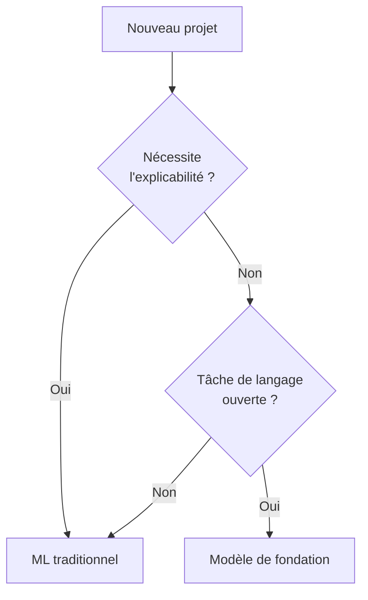

## Énoncé de tâche 1.2 : Identifier les cas d'usage pratiques de l'IA

Savoir que l'IA et le ML existent ne suffit pas à un professionnel des affaires pour les exploiter efficacement. La vraie question est : dans quels domaines produisent-ils de meilleurs résultats que les alternatives, et dans quels domaines ne le font-ils pas ? L'énoncé de tâche 1.2 répond à cette question. Il passe de la théorie à la pratique en associant des catégories de problèmes métier aux techniques IA appropriées, en cataloguant les services AWS gérés qui réduisent la charge d'ingénierie, et en introduisant un point de décision nouveau dans la V1.1 : quand un modèle ML traditionnel est plus approprié qu'un modèle de fondation. Les objectifs couverts ici sont les objectifs 1.2.1 à 1.2.6.[^102001]

### 1.2.1 Reconnaître où l'IA/ML apporte de la valeur

Trois catégories de besoins métier définissent la plupart des situations où l'IA et le ML surpassent des alternatives plus simples : l'aide à la décision humaine, l'évolutivité des solutions et l'automatisation des tâches répétitives. Ces catégories ne sont pas mutuellement exclusives, et de nombreux déploiements en production les combinent toutes les trois. Comprendre chacune en elle-même facilite cependant la présentation d'une proposition d'IA aux parties prenantes.

**L'aide à la décision humaine** est le moteur de valeur le plus ancien et, sans doute, le plus durable du ML. Un modèle ne remplace pas le décideur; il réduit l'éventail d'options qu'un humain doit considérer et attache une estimation de probabilité à chaque option restante. Un souscripteur hypothécaire, par exemple, examine des dizaines de signaux lors de l'évaluation d'une demande de prêt. Un modèle ML entraîné sur des performances historiques de prêts peut classer ces signaux par poids prédictif et signaler les demandes qui sortent des schémas normaux, afin que le souscripteur concentre son attention là où elle importe le plus. L'humain conserve la responsabilité et l'autorité; le modèle réduit la charge cognitive et le risque de manquer un signal enfoui dans un grand ensemble de caractéristiques.[^102002]

**L'évolutivité des solutions** est la capacité qui s'aligne le plus directement avec l'économie du cloud. Un moteur de règles déterministe écrit par un développeur atteint ses limites lorsque la logique métier devient suffisamment complexe pour que la maintenance manuelle des règles devienne plus lente que l'évolution de l'entreprise. Un modèle ML entraîné sur des résultats évolue différemment : à mesure que le volume d'entrée augmente, le modèle exécute le même calcul d'inférence quel que soit le nombre de règles métier qui auraient été nécessaires pour reproduire son résultat. Un modèle de détection de fraude qui évalue dix mille transactions de paiement par seconde ne nécessite aucun effort d'ingénierie supplémentaire par rapport à un modèle en évaluant cent par seconde; seules les ressources de calcul changent, et celles-ci sont élastiques dans AWS.[^102003]

**L'automatisation** couvre la substitution de l'inférence ML à une tâche qui nécessitait auparavant du temps humain. La classification de documents, l'inspection de la qualité des images sur une ligne de fabrication et l'acheminement du centre d'appels basé sur l'analyse des sentiments en sont des exemples. La valeur de l'automatisation est la plus claire lorsque la tâche est répétitive, le volume est élevé, le taux d'erreur acceptable est bien compris et le coût des erreurs est récupérable plutôt que catastrophique. L'automatisation ne signifie pas un fonctionnement sans surveillance; la plupart des systèmes d'automatisation IA en production incluent un parcours de révision humaine pour les cas auxquels le modèle attribue une faible confiance.[^102004]

*Figure 1.2.1: Trois moteurs principaux de valeur métier de l'IA/ML. Le diagramme montre comment différentes pressions métier se traduisent par des catégories de valeur IA distinctes, chacune avec son propre modèle opérationnel.*

Deux autres catégories apparaissent moins fréquemment dans les questions d'examen mais méritent d'être mentionnées. La *personnalisation des solutions* applique le ML pour adapter le contenu, les offres ou les flux de travail à des utilisateurs individuels en fonction de leur historique comportemental, particulièrement courant dans le commerce de détail et les médias. La *maintenance prédictive* applique des modèles de séries temporelles aux données de capteurs des équipements, signalant la probabilité de défaillance avant qu'elle ne se produise et permettant aux équipes de maintenance d'agir selon un calendrier plutôt qu'en réponse à des interruptions.

### 1.2.2 Quand les solutions IA/ML ne sont pas appropriées

L'examen traite cet objectif comme à haut rendement, et la raison est pratique : les organisations qui appliquent l'IA de manière indiscriminée gaspillent leur budget et causent parfois des préjudices. Quatre conditions indiquent de façon fiable que l'IA est le mauvais choix.

**Le décalage coût-bénéfice** est le facteur disqualifiant le plus courant dans les projets réels. La construction et la maintenance d'un modèle ML nécessitent l'étiquetage de données, des cycles d'entraînement, une infrastructure, une surveillance du modèle et un réentraînement périodique à mesure que la distribution sous-jacente évolue. Pour un problème métier qui affecte un petit nombre d'enregistrements par jour ou dont le résultat varie dans une plage étroite et prévisible, une simple table de correspondance ou un script de décision de vingt lignes est plus rapide à construire, moins cher à exploiter et plus facile à auditer. Le seuil de rentabilité dépend du volume et de la complexité, mais le principe est constant : si le coût du développement et de l'exploitation du système ML dépasse la valeur qu'il apporte sur un horizon de planification raisonnable, une solution plus simple est la bonne.[^102005]

**Les exigences de résultat déterministe** apparaissent lorsqu'un processus métier ou réglementaire exige une réponse spécifique et reproductible pour une entrée donnée plutôt qu'une estimation probabiliste. Les calculs fiscaux, les vérifications d'éligibilité réglementaires et les formules de facturation contractuelles appartiennent à cette catégorie. Les modèles ML produisent des résultats issus d'une distribution apprise; la même entrée peut recevoir des scores légèrement différents à des moments différents si le modèle est réentraîné, et le modèle ne peut pas garantir qu'il ne s'écartera jamais de la règle. Les systèmes basés sur des règles garantissent une reproductibilité exacte. Lorsque l'exigence est « la réponse doit toujours être X lorsque les conditions sont Y », le ML n'est pas le bon outil.[^102006]

**Les scénarios avec peu de données** compromettent l'exigence fondamentale de l'apprentissage supervisé. Un modèle entraîné sur moins d'enregistrements que nécessaire pour couvrir la variation du monde réel généralisera mal. Le seuil varie selon la technique et le type de problème, mais une heuristique approximative est que la classification supervisée a besoin d'au moins plusieurs centaines d'exemples étiquetés par classe, et la régression bénéficie de plusieurs milliers d'enregistrements avec une variation significative à travers l'espace de caractéristiques. Les organisations qui souhaitent appliquer le ML à une nouvelle ligne de produits, une source de données récemment acquise ou un type d'événement rare constatent souvent qu'elles n'ont pas encore suffisamment de données pour entraîner un modèle fiable.[^102007]

**Les problèmes simples basés sur des règles** sont des situations où la logique qui associe les entrées aux sorties peut être clairement énoncée dans un arbre de décision de quatre ou cinq niveaux de profondeur maximum. Si un expert humain peut énumérer tous les cas, les conditions et les résultats corrects en une seule après-midi, et si ces règles sont stables dans le temps, les encoder explicitement est plus auditable, plus explicable et moins coûteux que l'entraînement d'un modèle. L'éligibilité au retour client basée sur la date d'achat et la catégorie d'article est un exemple classique : les règles sont connues, fixes et suffisamment peu nombreuses pour être maintenues manuellement.

*Figure 1.2.2: Deux vérifications récapitulatives pour l'adéquation de l'IA/ML. Le premier filtre élimine les projets qui échouent au test coût-bénéfice ou de déterminisme; le second filtre élimine les projets qui manquent de données ou qui disposent déjà de règles stables. Un projet doit passer les deux filtres pour justifier l'IA/ML par rapport à une approche plus simple.*

### 1.2.3 Sélectionner les techniques IA/ML appropriées

Le choix de la bonne technique commence par la nature du signal étiqueté disponible dans les données d'entraînement. Trois techniques fondamentales supervisées et non supervisées apparaissent explicitement dans les objectifs de l'examen; deux techniques supplémentaires apparaissent dans les objectifs en mention passante.

**La régression** prédit une sortie numérique continue en fonction d'un ensemble de caractéristiques d'entrée.[^102008] Le modèle apprend la relation entre les caractéristiques et une variable cible qui peut prendre n'importe quelle valeur dans une plage, comme le chiffre d'affaires attendu, les heures avant la défaillance d'un équipement ou la température à un endroit et à un moment donnés. Une chaîne de vente au détail qui prédit le volume de ventes hebdomadaires par emplacement de magasin utilise la régression. Le résultat n'est pas une catégorie; c'est un nombre sur lequel l'entreprise peut agir directement dans un plan d'inventaire ou de personnel.

**La classification** assigne une entrée à l'une d'un ensemble fini de catégories.[^102009] Lorsque l'ensemble de catégories a deux membres, le problème est une *classification binaire*; lorsqu'il en a plus de deux, c'est une *classification multiclasse*. La détection de spam (spam ou non-spam), la prédiction de défaut de prêt (défaut ou non) et l'étiquetage d'images (chat, chien ou oiseau) sont tous des problèmes de classification. Le résultat du modèle est généralement un score de probabilité pour chaque classe, et l'application choisit la classe avec le score le plus élevé, combinée éventuellement à un seuil de confiance qui oriente les prédictions à faible confiance vers un examinateur humain.

**Le regroupement** groupe les enregistrements par similarité sans étiquette prédéfinie.[^102010] Comme il n'existe pas de variable cible étiquetée, le regroupement est une technique non supervisée. Le modèle découvre une structure dans les données que l'analyste n'a pas pré-spécifiée. La segmentation client est l'exemple canonique : à partir de l'historique des achats, du comportement de navigation et des signaux démographiques, le modèle peut identifier cinq archétypes de clients distincts pour lesquels l'équipe marketing peut concevoir des campagnes distinctes. La détection d'anomalies est une application connexe : les enregistrements qui ne correspondent pas étroitement à un cluster sont signalés comme inhabituels.

Deux techniques supplémentaires méritent une brève mention parce que les objectifs de l'examen les nomment en passant. La *réduction de dimensionnalité* compresse un espace de caractéristiques de haute dimensionnalité en moins de dimensions, ce qui réduit le coût de calcul et peut améliorer les performances du modèle en aval en supprimant les caractéristiques corrélées ou non pertinentes. La *détection d'anomalies* identifie les points de données qui s'écartent significativement de la distribution apprise du comportement normal, ce qui est un cadre distinct de la classification même si certains modèles de classification sont adaptés à cet effet.

*Tableau 1.2.1: Sélection des techniques ML selon le type de problème*

| Technique | Étiquette d'entrée | Type de sortie | Exemple métier canonique |
|-----------|-------------|-------------|---------------------------|
| Régression | Requise (cible numérique) | Nombre continu | Prévision de la demande, prédiction des prix |
| Classification binaire | Requise (deux classes) | Classe + probabilité | Indicateur de fraude, prédiction d'attrition |
| Classification multiclasse | Requise (multi-classes) | Classe + probabilité | Acheminement de documents, catégorie de défaut |
| Regroupement | Non requise | Attribution de groupe | Segmentation client, découverte de sujets |
| Détection d'anomalies | Optionnelle | Score d'anomalie | Intrusion réseau, défaillance de capteur |

*Figure 1.2.3: Arbre de décision pour la sélection de la technique ML. La branche principale sépare les problèmes supervisés des non supervisés; la branche supervisée se sépare ensuite en fonction de la nature de la variable cible.*

**Amazon SageMaker AI** prend en charge toutes les techniques du tableau 1.2.1 via ses algorithmes intégrés et l'écosystème de frameworks plus large qu'il héberge.[^102011] Pour les équipes sans personnel de data science, la capacité AutoML dans SageMaker AI peut sélectionner et régler automatiquement les algorithmes à partir d'un jeu de données étiqueté, rendant la sélection de la technique une tâche de configuration guidée plutôt qu'un problème de recherche.

### 1.2.4 Applications IA du monde réel

L'objectif 1.2.4 de l'examen s'est élargi dans la V1.1 pour inclure les bases de connaissances et l'IA agentique aux côtés des six catégories présentes dans la V1.0. Ces huit catégories représentent la portée complète de ce que l'examen peut demander aux candidats de reconnaître.

**Les systèmes de vision par ordinateur** interprètent des images ou des images vidéo pour extraire des informations structurées.[^102012] La détection d'objets identifie et localise des éléments spécifiques dans une image; la classification d'images attribue une étiquette à l'image entière; la reconnaissance optique de caractères lit le texte imprimé ou manuscrit d'une numérisation. Une entreprise logistique utilise la vision par ordinateur pour lire les étiquettes de colis sur un tapis roulant et les acheminer sans intervention humaine. Une chaîne de vente au détail utilise des caméras de balayage des rayons pour détecter quand un produit est en rupture de stock. **Amazon Rekognition** est le service AWS géré pour la vision par ordinateur; il fournit des modèles pré-entraînés pour la détection d'objets et de scènes, la reconnaissance de texte et l'analyse de visages, et accepte à la fois les images individuelles et les flux vidéo.[^102013]

**Le traitement du langage naturel (TLN)** permet aux systèmes d'extraire du sens du texte non structuré.[^102014] L'analyse des sentiments détermine si un corps de texte exprime un sentiment positif, négatif ou neutre. La reconnaissance d'entités extrait des entités nommées telles que des noms de produits, des lieux et des personnes d'un document. La modélisation de sujets regroupe une collection de documents par thème. Une équipe de succès client exécute l'analyse des sentiments sur les tickets de support chaque nuit pour identifier les plaintes de produits émergentes avant qu'elles n'escaladent. **Amazon Comprehend** est le service TLN géré principal d'AWS, fournissant l'analyse des sentiments, la reconnaissance d'entités, l'extraction de phrases clés et la classification personnalisée.[^102015]

**La reconnaissance vocale** convertit l'audio parlé en texte, permettant des interfaces vocales, la transcription de réunions et l'analyse d'appels.[^102016] Le défi en production est de gérer les accents divers, le bruit de fond, le vocabulaire spécifique au domaine et les contraintes de latence en temps réel. **Amazon Transcribe** convertit l'audio en texte et prend en charge le vocabulaire personnalisé, l'identification du locuteur et la ponctuation automatique en modes temps réel et par lots.[^102017]

**Les systèmes de recommandation** prédisent quels éléments un utilisateur est le plus susceptible d'utiliser, compte tenu de son historique comportemental et des signaux contextuels.[^102018] Une plateforme de commerce électronique recommande des produits en fonction de ce qu'un client a consulté et acheté précédemment. Un service de streaming recommande des émissions en fonction de l'historique de visionnage et des évaluations. La technique sous-jacente est généralement le filtrage collaboratif, qui identifie les utilisateurs au comportement similaire et transfère les préférences dans le groupe, ou le filtrage basé sur le contenu, qui correspond aux éléments dont les attributs ressemblent à des éléments avec lesquels l'utilisateur a déjà interagi. **Amazon Personalize** est un service de recommandation géré qui gère le pipeline d'entraînement, de déploiement et de service en temps réel sans nécessiter d'expertise ML de la part de l'équipe d'application.[^102019]

**La détection de fraude** identifie les transactions ou les activités de compte qui s'écartent du schéma appris du comportement légitime.[^102020] Les banques appliquent la détection de fraude au stade de l'autorisation de paiement, évaluant chaque transaction en temps réel et refusant ou signalant celles dépassant un seuil de risque. Les compagnies d'assurance l'appliquent aux demandes de remboursement soumises. L'approche ML surpasse les règles statiques parce que les schémas de fraude évoluent continuellement, et un modèle peut être réentraîné à mesure que de nouvelles tactiques de fraude émergent. La technique sous-jacente est souvent une classification binaire avec une couche de détection d'anomalies en plus. **Amazon Fraud Detector** est le service AWS géré qui empaquette ce modèle, avec des modèles pré-construits pour la fraude en ligne, la fraude sur les transactions et la prise de contrôle de compte.

**La prévision** produit des prédictions de valeurs futures pour une variable de séries temporelles, comme la demande de produits, la consommation d'énergie ou les besoins en personnel du centre d'appels.[^102021] Les entrées sont des observations historiques de la variable cible et des *séries temporelles connexes* optionnelles (comme les promotions, les jours fériés et la météo) que le modèle peut utiliser pour améliorer la précision. **Amazon Forecast** est un service de prévision géré qui sélectionne automatiquement parmi les algorithmes statistiques et d'apprentissage profond, calcule des *prévisions quantiles* (par exemple, niveaux de demande p50 et p90), et écrit les résultats dans Amazon S3 pour la consommation en aval.[^102022]

**Les bases de connaissances** sont des magasins d'informations structurés que les systèmes IA peuvent interroger au moment de l'inférence pour ancrer leurs réponses dans un contenu vérifié plutôt que de s'appuyer uniquement sur les schémas encodés dans les poids du modèle.[^102023] Une base de connaissances pour une société de services financiers pourrait contenir des documents réglementaires, des spécifications de produits et des modèles de réponse approuvés. Lorsqu'un client pose une question via un assistant IA, le système récupère la section pertinente de la base de connaissances et l'utilise pour formuler une réponse factuellement fondée. Ce modèle s'appelle formellement *génération augmentée par récupération (RAG)*, que le domaine 3 de ce livre traite en profondeur. **Amazon Kendra** est un service de recherche d'entreprise géré qui sous-tend de nombreuses implémentations de bases de connaissances, indexant les référentiels de documents et renvoyant des passages pertinents en réponse à des requêtes en langage naturel.[^102024]

**L'IA agentique** décrit les systèmes dans lesquels un ou plusieurs modèles IA planifient et exécutent des tâches en plusieurs étapes de manière autonome, appelant des outils et des API pour interagir avec des systèmes externes.[^102025] Un système à agent unique peut gérer un flux de travail de service client de bout en bout : interpréter la demande du client, rechercher des informations de compte dans un CRM, vérifier l'inventaire des produits, rédiger une résolution et envoyer un e-mail de confirmation, tout cela sans opérateur humain. Un système multi-agents distribue les sous-tâches à travers des agents spécialisés; un agent orchestrateur attribue le travail, les sous-agents l'exécutent et l'orchestrateur compile les résultats. Les applications métier de l'IA agentique incluent les opérations informatiques (un agent qui surveille les alertes, diagnostique la cause racine et applique un correctif à partir d'un runbook), le traitement de documents (un agent qui lit des factures, extrait des postes et les saisit dans un ERP) et l'intégration des clients (un agent qui collecte les documents requis, les valide et déclenche l'approvisionnement du compte).

**Amazon Bedrock AgentCore** est l'environnement d'exécution AWS géré pour les charges de travail d'IA agentique en production, fournissant la gestion de la mémoire, l'orchestration des outils et la persistance de session pour les agents construits sur des modèles de fondation.[^102026] Pour les équipes développant des applications agentiques, **Strands Agents** est un SDK open source qui simplifie la composition multi-agents, tandis que les **agents Amazon Bedrock** fournissent une couche d'orchestration entièrement gérée qui connecte les modèles de fondation à des groupes d'action définis comme des fonctions Lambda ou des schémas d'API.[^102027]

*Figure 1.2.4: Catégories d'applications IA du monde réel et le service AWS géré principal qui implémente chacune. La détection de fraude n'est pas affichée parce qu'elle s'étend sur plusieurs services (Amazon Fraud Detector et SageMaker AI) selon l'approche d'implémentation.*

### 1.2.5 Services AWS IA/ML gérés

Les services IA gérés d'AWS suppriment l'exigence de développement de modèles interne en fournissant des capacités pré-entraînées via des API. L'objectif d'examen 1.2.5 nomme six services explicitement et la liste des services en périmètre en ajoute quatre autres qui apparaissent en pratique et dans les distracteurs de l'examen.

Les six services nommés se divisent nettement par fonction. **Amazon SageMaker AI** est la plateforme ML de bout en bout pour la construction, l'entraînement et le déploiement de modèles personnalisés à n'importe quelle échelle.[^102028] Ce n'est pas un service pré-entraîné mais un environnement géré qui gère l'infrastructure pour chaque étape du cycle de vie ML. Les équipes qui ont besoin d'un modèle entraîné sur leurs propres données, plutôt qu'une API générique pré-entraînée, commencent avec SageMaker AI. **Amazon Transcribe** convertit la parole en texte et constitue la base de tout flux de travail qui doit ingérer de l'audio.[^102029] **Amazon Translate** fournit une traduction automatique neurale sur une large gamme de paires de langues, prenant en charge la localisation de contenu, le chat multilingue en temps réel et la traduction de documents par lots.[^102030] Amazon Comprehend, introduit plus tôt dans cette section, gère l'étape d'analyse du texte sur la transcription produite par Amazon Transcribe.[^102031] **Amazon Lex** construit des interfaces conversationnelles qui comprennent les intentions en langage naturel et gèrent l'état du dialogue, et il s'intègre avec **Amazon Polly**, qui convertit le texte en parole réaliste pour les réponses de canal vocal.[^102032][^102033]

Quatre services supplémentaires en périmètre apparaissent régulièrement dans les questions d'examen et les architectures réelles. **Amazon Rekognition** gère l'analyse d'images et de vidéos, y compris la détection d'objets, la reconnaissance de texte et la modération de contenu.[^102034] **Amazon Textract** va au-delà de la reconnaissance optique de caractères pour extraire des données structurées, tels que des champs de formulaires et des valeurs de tableaux, à partir de documents numérisés.[^102035] **Amazon Personalize** fournit des recommandations personnalisées entraînées sur les données d'interaction que le client fournit.[^102036] **Amazon Kendra** est un service de recherche d'entreprise qui indexe les documents internes et renvoie des passages pertinents en réponse à des questions en langage naturel, servant de couche de récupération dans les architectures de bases de connaissances.[^102037]

*Tableau 1.2.2: Services AWS IA/ML gérés groupés par capacité*

| Capacité | Service | Fonction principale |
|------------|---------|-----------------|
| Développement de modèle personnalisé | Amazon SageMaker AI | Construction, entraînement et déploiement de modèles ML personnalisés |
| Parole vers texte | Amazon Transcribe | Reconnaissance automatique de la parole avec identification du locuteur |
| Texte vers parole | Amazon Polly | Synthèse vocale neurale en plusieurs voix |
| Traduction de langues | Amazon Translate | Traduction automatique neurale, par lots et en temps réel |
| Analyse de texte | Amazon Comprehend | Sentiments, entités, phrases clés, classification personnalisée |
| IA conversationnelle | Amazon Lex | Reconnaissance d'intention et gestion du dialogue |
| Vision par ordinateur | Amazon Rekognition | Détection d'objets, reconnaissance de texte, modération de contenu |
| Extraction de données de documents | Amazon Textract | Extraction de champs structurés et de tableaux à partir de documents |
| Recommandations | Amazon Personalize | Recommandations personnalisées en temps réel |
| Recherche d'entreprise | Amazon Kendra | Recherche en langage naturel sur les référentiels de documents internes |

Un piège courant de l'examen est de confondre les services ayant des surfaces d'interface qui se chevauchent. **Amazon Transcribe** produit une transcription texte; **Amazon Comprehend** analyse cette transcription pour en extraire du sens. **Amazon Lex** comprend les intentions conversationnelles en temps réel; **Amazon Polly** prononce la réponse. **Amazon Textract** lit les données structurées d'une page numérisée; **Amazon Rekognition** détecte les objets et les scènes dans la même image. Ces paires apparaissent souvent ensemble dans les questions d'architecture, et savoir quel service appartient à quelle étape est la clé pour sélectionner la bonne réponse.

*Figure 1.2.5: Flux conceptuel du canal vocal. L'utilisateur parle à une chaîne de services IA AWS qui transcrit l'audio, interprète l'intention et synthétise une réponse orale; les transferts spécifiques entre services (Transcribe vers Lex vers Comprehend vers Polly) sont décrits dans le paragraphe précédent.*

### 1.2.6 ML traditionnel vs. modèles de fondation

L'objectif 1.2.6 est nouveau dans la V1.1, reflétant la question pratique à laquelle toute équipe IA est maintenant confrontée : quand un modèle de fondation (FM) est-il le bon outil, et quand un modèle ML traditionnel construit et entraîné à partir de zéro est-il le meilleur choix ?[^102038] La décision ne porte pas sur la sophistication de l'une ou l'autre option. Elle porte sur l'adéquation : faire correspondre les caractéristiques des données disponibles, les résultats requis, l'environnement réglementaire et le budget opérationnel aux capacités de chaque approche.

**Les modèles ML traditionnels** sont entraînés sur des données étiquetées pour une tâche spécifique et bien définie. Ils sont entièrement interprétables en ce sens que l'importance des caractéristiques et la logique de décision peuvent être extraites et auditées. Ils exécutent l'inférence à faible latence, généralement en quelques millisecondes sur du matériel modeste. Leur coût de calcul est prévisible et souvent bas. Ils nécessitent des données d'entraînement étiquetées spécifiques au domaine, ce qui peut être coûteux à acquérir, mais une fois entraînés, ils n'ont pas de frais de calcul continus basés sur des jetons.[^102039]

**Les modèles de fondation** sont préentraînés sur des corpus larges et généralistes et peuvent gérer un large éventail de tâches de langage et multimodales avec une configuration supplémentaire minimale.[^102040] Ils excellent dans les tâches qui nécessitent la compréhension du langage naturel, la génération de contenu, la synthèse de code ou le raisonnement sur des sujets vaguement liés. Ils acceptent des invites conversationnelles et ajustent leur comportement en fonction des instructions sans réentraînement. Leur modèle de coût est généralement basé sur des jetons, ce qui signifie que chaque appel d'inférence est tarifé par le nombre de jetons en entrée et en sortie. La latence est plus élevée que pour le ML traditionnel, généralement dans la plage de centaines de millisecondes à secondes.

*Tableau 1.2.3: Critères de décision pour ML traditionnel vs. modèles de fondation*

| Critère | ML traditionnel | Modèle de fondation |
|-----------|---------------|-----------------|
| Portée de la tâche | Tâche unique et bien définie | Tâches larges ou générales |
| Données d'entraînement | Jeu de données étiqueté requis | Préentraîné; invite ou ajustement fin |
| Explicabilité | Élevée; importance des caractéristiques disponible | Plus faible; raisonnement émergent |
| Latence | Faible (quelques ms) | Plus élevée (centaines de ms à secondes) |
| Coût d'inférence | Prévisible; pas de frais par jeton | Basé sur les jetons; variable avec la longueur de l'entrée |
| Adéquation réglementaire | Forte; pleine auditabilité | Plus faible; préoccupations de variabilité des sorties |
| Support multimodal | Limité aux modalités entraînées | Large (texte, image, audio selon le modèle) |
| Tâche unique à volume élevé | Élevée; évolutivité horizontale | Faible; le coût par jeton augmente avec le volume |

Quatre conditions favorisent fortement le choix d'un modèle ML traditionnel. Premièrement, les exigences réglementaires ou de conformité exigent un chemin de décision entièrement auditable et reproductible. L'évaluation du risque de crédit sous la réglementation bancaire, par exemple, nécessite généralement la capacité d'expliquer toute décision individuelle, et un arbre boosté par gradient ou un modèle de régression logistique peut fournir cette explication dans un format que les régulateurs acceptent.[^102041] Deuxièmement, la tâche de prédiction a une seule sortie bien définie (un nombre, une catégorie ou un score) et suffisamment de données d'entraînement étiquetées pour atteindre une exactitude acceptable sans raisonnement généraliste. Troisièmement, la latence et le coût sont fortement contraints; l'application s'exécute à volume élevé et doit renvoyer des prédictions en millisecondes à une fraction de centime par inférence. Quatrièmement, l'organisation a une capacité d'ingénierie ML suffisante pour gérer le pipeline d'entraînement et de réentraînement.

Quatre conditions favorisent un modèle de fondation. Premièrement, la tâche nécessite de générer de la prose cohérente, de raisonner sur des questions ambiguës ou de synthétiser des informations provenant de plusieurs sources, capacités que les modèles ML traditionnels ne peuvent pas fournir. Deuxièmement, l'organisation a des données d'entraînement étiquetées minimales mais a accès à une description de tâche bien définie qu'elle peut exprimer comme une invite, rendant l'inférence few-shot ou zero-shot viable. Troisièmement, le cas d'usage est conversationnel, et le modèle doit maintenir le contexte sur plusieurs tours sans logique de gestion d'état explicite. Quatrièmement, le volume de l'application est suffisamment faible pour que le coût basé sur les jetons soit acceptable, ou les tâches sont suffisamment uniques pour qu'un modèle généraliste amortisse le coût de la construction d'un modèle spécialisé.

*Figure 1.2.6: Flux de décision pour choisir entre un modèle ML traditionnel et un modèle de fondation. Les exigences réglementaires et le type de tâche sont les deux filtres principaux; la latence et la disponibilité des données affinent le choix.*

Le cadre de gestion des risques IA du NIST et l'EU AI Act imposent tous deux des exigences de traçabilité aux systèmes IA utilisés dans des décisions à enjeux élevés.[^102042] En pratique, les organisations soumises à ces cadres adoptent souvent un modèle hybride : un modèle ML traditionnel gère la tâche de prédiction principale et génère la sortie auditable, tandis qu'un modèle de fondation gère les tâches de langage adjacentes comme la génération de l'explication destinée au client de la décision ou la synthèse des preuves à l'appui de documents non structurés.

La frontière entre les deux approches se déplace. Les capacités de distillation de modèles AWS dans **Amazon Bedrock** permettent aux équipes de transférer le comportement de raisonnement d'un grand modèle de fondation vers un modèle plus petit, plus rapide et moins cher, réglé pour une tâche spécifique.[^102043] Le résultat est un modèle qui se comporte comme un modèle de fondation dans son domaine étroit mais fonctionne avec un profil de coût et de latence plus proche d'un modèle ML traditionnel. Cette technique apparaît dans l'objectif 3.1.5 et mérite d'être signalée ici comme pont entre les deux catégories.

**Ce que cette section a couvert :** L'énoncé de tâche 1.2 a établi comment reconnaître où l'IA et le ML ajoutent de la valeur, quand les éviter, comment associer les techniques aux types de problèmes et quels services AWS gérés gèrent chaque catégorie d'application. Il a également introduit le nouveau cadre de décision V1.1 pour choisir entre les modèles ML traditionnels et les modèles de fondation. L'énoncé de tâche 1.3, qui suit, couvre le cycle de vie du développement IA/ML de bout en bout et associe chaque étape aux services AWS qui le prennent en charge.

## Questions d'auto-évaluation

**Question 1**

Une entreprise de commerce de détail traite 50 000 e-mails de support client par jour et doit acheminer chaque e-mail vers le département approprié en fonction de son sujet. L'entreprise dispose de 12 mois d'e-mails historiques déjà étiquetés avec le département correct. Quelle approche convient le MIEUX à ce problème ?

A. La régression, parce que le modèle doit prédire un score pour chaque département et le score le plus élevé détermine l'acheminement.

B. La classification multiclasse, parce que le résultat est l'un des plusieurs départements prédéfinis et que des données étiquetées sont disponibles.

C. Le regroupement, parce qu'il y a trop de données à étiqueter manuellement et que les départements ne sont pas encore définis.

D. Un modèle de fondation avec des invites zero-shot, parce que les données étiquetées rendent l'ajustement fin inutile et que les invites sont plus simples.

Avec 12 mois d'e-mails étiquetés et un ensemble fixe de départements connus, c'est un problème de classification multiclasse par excellence. Les données étiquetées sont suffisantes pour entraîner un modèle ML traditionnel, le résultat est l'une d'un nombre fini de catégories, et le volume (50 000 par jour) rend le coût prévisible et la faible latence d'un classificateur entraîné préférable à l'inférence FM basée sur des jetons. La régression prédit des nombres continus, pas des catégories. Le regroupement serait approprié si les départements étaient inconnus ou s'il n'y avait pas d'étiquettes, mais aucune de ces deux conditions ne s'applique ici. Un modèle de fondation avec des invites zero-shot peut catégoriser du texte, mais à 50 000 e-mails par jour, le coût des jetons s'accumule rapidement et la latence est plus élevée qu'un classificateur entraîné; les données étiquetées doivent être utilisées pour entraîner un modèle spécialement conçu plutôt que d'être ignorées.[^102044]

**Question 2**

Une société de services financiers doit expliquer chaque décision de prêt aux régulateurs, y compris quelles caractéristiques d'entrée ont le plus influencé le résultat. La société évalue si elle doit utiliser un modèle ML traditionnel ou un modèle de fondation. Quel facteur favorise LE PLUS fortement l'approche ML traditionnelle ?

A. La société dispose d'un volume important de données d'entraînement étiquetées issues de demandes de prêts passées.

B. L'exigence réglementaire d'explicabilité et d'une logique de décision auditable.

C. L'exigence de latence d'inférence est inférieure à 200 millisecondes par demande.

D. La société souhaite éviter la tarification basée sur les jetons pour contrôler les coûts d'inférence.

L'explicabilité réglementaire est le facteur décisif ici. Les modèles ML traditionnels comme la régression logistique et les arbres boostés par gradient exposent des scores d'importance de caractéristiques et des chemins de décision qui satisfont aux exigences d'audit. Les modèles de fondation produisent des résultats via un raisonnement émergent difficile à attribuer à des caractéristiques spécifiques dans une forme que les régulateurs acceptent. La présence de données d'entraînement étiquetées (A) est un facteur favorable au ML traditionnel mais n'est pas le différenciateur le plus fort comparé aux exigences réglementaires. La latence inférieure à 200 ms (C) est atteinte par les modèles ML traditionnels, mais de nombreux déploiements de modèles de fondation atteignent également ce seuil. La tarification basée sur les jetons (D) est une considération de coût mais pas aussi contraignante que la conformité réglementaire.[^102045]

**Question 3**

Une entreprise manufacturière veut identifier quelles machines de sa ligne de production sont susceptibles de tomber en panne dans les 72 prochaines heures, sur la base de relevés de capteurs collectés chaque minute. Le modèle doit renvoyer une prédiction, pas une règle statique. Il n'y a pas d'historique de pannes étiquetées. Quelle approche ML est la PLUS appropriée ?

A. Classification binaire utilisant des données de capteurs historiques étiquetées avec des événements de panne.

B. Régression utilisant le nombre d'appels de maintenance passés comme variable cible.

C. Détection d'anomalies non supervisée sur les séries temporelles de capteurs, signalant les relevés qui s'écartent du profil normal appris de chaque machine.

D. Classification multiclasse pour catégoriser la gravité de la panne comme faible, moyenne ou élevée.

Sans historique de pannes étiquetées, les approches supervisées (A, B, D) ne peuvent pas être appliquées directement. La détection d'anomalies non supervisée apprend le schéma normal des relevés de capteurs pour chaque machine et signale les écarts par rapport à ce schéma; sur AWS, **Amazon SageMaker AI** offre Random Cut Forest et DeepAR précisément pour ce style de détection d'anomalies sur des séries temporelles, et les scores d'anomalie résultants servent de proxy non supervisé pour le risque de panne. La classification binaire (A) est l'approche idéale une fois que les étiquettes sont disponibles, et l'organisation devrait planifier la collecte d'événements de panne étiquetés pour l'entraînement futur de modèles supervisés. La régression (B) nécessite une variable cible numérique; le nombre d'appels de maintenance passés est un proxy mais ne prédit pas directement les pannes futures dans une fenêtre spécifique. La classification multiclasse (D) nécessite également des catégories de gravité étiquetées qui n'existent pas encore.[^102046]

**Question 4**

Une entreprise évalue une solution IA pour automatiser le calcul des primes des employés selon un accord de négociation collective. La formule est précisément spécifiée dans l'accord, s'applique de manière identique à chaque employé du même niveau d'emploi et n'a pas changé depuis cinq ans. Quelle décision est la PLUS appropriée ?

A. Implémenter un modèle de classification pour déterminer dans quel niveau de prime chaque employé se situe.

B. Implémenter un modèle de régression pour prédire les montants de primes à partir des données de salaire et de performance.

C. Ne pas utiliser l'IA/ML; implémenter la formule sous forme de code déterministe, parce que le résultat doit être exact et reproductible.

D. Utiliser un modèle de fondation pour interpréter le texte de l'accord et calculer la prime appropriée.

C'est un scénario à résultat déterministe. Le calcul des primes est une formule fixe sans élément probabiliste; les mêmes entrées doivent toujours produire la même sortie sans variance. Une implémentation basée sur des règles ou une formule garantit une reproductibilité exacte et est trivialement auditable. Un modèle de classification (A) introduirait une estimation de probabilité et ne pourrait pas garantir le respect exact des conditions limites de l'accord. Un modèle de régression (B) prédit une valeur continue à partir de schémas appris, mais la valeur correcte est déjà spécifiée par la formule; utiliser le ML ici ajoute de la complexité sans bénéfice. Un modèle de fondation (D) peut interpréter du texte mais ne garantirait pas l'exactitude arithmétique et introduit de la latence et des coûts pour une tâche qui n'a besoin d'aucune des capacités des FM.[^102047]

**Question 5**

Une société de technologie veut construire un assistant de service client capable de gérer des questions dans l'une des 15 langues, de maintenir le contexte conversationnel sur plusieurs tours et de générer des réponses personnalisées s'appuyant sur la documentation interne des produits de l'entreprise. L'entreprise ne dispose pas de données d'entraînement de questions-réponses étiquetées. Quelle approche est la MEILLEURE ?

A. Entraîner un modèle de classification multiclasse pour acheminer les questions vers des réponses préécrites dans chaque langue.

B. Utiliser un modèle de fondation avec récupération à partir d'une base de connaissances Amazon Kendra, combiné avec Amazon Translate pour la gestion des langues.

C. Utiliser Amazon Lex pour la gestion du dialogue et Amazon Comprehend pour l'analyse des sentiments, sans modèle de fondation.

D. Construire des modèles de régression séparés pour chaque langue, chacun entraîné pour évaluer la pertinence des réponses candidates.

Ce scénario a trois exigences qui favorisent collectivement une architecture de modèle de fondation : contexte conversationnel multi-tours, génération de contenu à partir de documents internes et support multilingue sans données d'entraînement étiquetées. Connecter un modèle de fondation à une base de connaissances Amazon Kendra fournit une génération augmentée par récupération, ancrant les réponses du modèle dans la documentation réelle de l'entreprise. De nombreux modèles de fondation gèrent plusieurs langues nativement, mais Amazon Translate peut compléter pour les langues que le FM gère moins bien. Un modèle de classification (A) peut acheminer vers des réponses statiques mais ne peut pas générer des réponses personnalisées ou maintenir le contexte sur plusieurs tours. Amazon Lex et Comprehend (C) gèrent le dialogue et les sentiments mais ne récupèrent pas à partir de la documentation interne ni ne génèrent de nouvelles réponses; cette combinaison seule ne répondrait pas à l'exigence de génération. Les modèles de régression (D) pourraient évaluer des candidats de réponses mais ne peuvent pas générer de nouvelles réponses ou maintenir l'état conversationnel, et l'approche nécessiterait de construire et maintenir 15 modèles séparés.[^102048]

---

[^102001]: AWS Certification: AWS Certified AI Practitioner (AIF-C01) Exam Guide v1.1, Task Statement 1.2. URL: <https://docs.aws.amazon.com/aws-certification/latest/ai-practitioner-01/ai-practitioner-01-domain1.html>
[^102002]: Amazon SageMaker AI Developer Guide: Human-in-the-loop workflows. URL: <https://docs.aws.amazon.com/sagemaker/latest/dg/a2i-use-augmented-ai-a2i-human-review-loops.html>
[^102003]: Amazon SageMaker AI: Model deployment and real-time inference. URL: <https://docs.aws.amazon.com/sagemaker/latest/dg/deploy-model.html>
[^102004]: Amazon Augmented AI (A2I) Developer Guide: What is Amazon A2I? URL: <https://docs.aws.amazon.com/sagemaker/latest/dg/a2i-getting-started.html>
[^102005]: AWS Well-Architected Framework: Machine Learning Lens - Cost optimization pillar. URL: <https://docs.aws.amazon.com/wellarchitected/latest/machine-learning-lens/cost-optimization.html>
[^102006]: NIST AI Risk Management Framework (AI RMF 1.0): Trustworthiness characteristic - Explainability. URL: <https://airc.nist.gov/Home>
[^102007]: Amazon SageMaker AI Developer Guide: Prepare your data. URL: <https://docs.aws.amazon.com/sagemaker/latest/dg/data-prep.html>
[^102008]: Amazon SageMaker AI Developer Guide: Linear Learner algorithm. URL: <https://docs.aws.amazon.com/sagemaker/latest/dg/linear-learner.html>
[^102009]: Amazon SageMaker AI Developer Guide: XGBoost algorithm. URL: <https://docs.aws.amazon.com/sagemaker/latest/dg/xgboost.html>
[^102010]: Amazon SageMaker AI Developer Guide: K-Means algorithm. URL: <https://docs.aws.amazon.com/sagemaker/latest/dg/k-means.html>
[^102011]: Amazon SageMaker AI overview. URL: <https://aws.amazon.com/sagemaker/>
[^102012]: Amazon Rekognition Developer Guide: What is Amazon Rekognition? URL: <https://docs.aws.amazon.com/rekognition/latest/dg/what-is.html>
[^102013]: Amazon Rekognition product page. URL: <https://aws.amazon.com/rekognition/>
[^102014]: Amazon Comprehend Developer Guide: What is Amazon Comprehend? URL: <https://docs.aws.amazon.com/comprehend/latest/dg/what-is.html>
[^102015]: Amazon Comprehend product page. URL: <https://aws.amazon.com/comprehend/>
[^102016]: Amazon Transcribe Developer Guide: What is Amazon Transcribe? URL: <https://docs.aws.amazon.com/transcribe/latest/dg/what-is.html>
[^102017]: Amazon Transcribe product page. URL: <https://aws.amazon.com/transcribe/>
[^102018]: Amazon Personalize Developer Guide: What is Amazon Personalize? URL: <https://docs.aws.amazon.com/personalize/latest/dg/what-is-personalize.html>
[^102019]: Amazon Personalize product page. URL: <https://aws.amazon.com/personalize/>
[^102020]: Amazon Fraud Detector product page. URL: <https://aws.amazon.com/fraud-detector/>
[^102021]: Amazon Forecast Developer Guide: What is Amazon Forecast? URL: <https://docs.aws.amazon.com/forecast/latest/dg/what-is-forecast.html>
[^102022]: Amazon Forecast product page. URL: <https://aws.amazon.com/forecast/>
[^102023]: Amazon Kendra Developer Guide: What is Amazon Kendra? URL: <https://docs.aws.amazon.com/kendra/latest/dg/what-is-kendra.html>
[^102024]: Amazon Kendra product page. URL: <https://aws.amazon.com/kendra/>
[^102025]: Amazon Bedrock User Guide: Agents for Amazon Bedrock. URL: <https://docs.aws.amazon.com/bedrock/latest/userguide/agents.html>
[^102026]: Amazon Bedrock AgentCore product page. URL: <https://aws.amazon.com/bedrock/agentcore/>
[^102027]: Strands Agents SDK on GitHub. URL: <https://github.com/strands-agents/sdk-python>
[^102028]: Amazon SageMaker AI Developer Guide: What is Amazon SageMaker AI? URL: <https://docs.aws.amazon.com/sagemaker/latest/dg/whatis.html>
[^102029]: Amazon Transcribe Developer Guide: Real-time transcription. URL: <https://docs.aws.amazon.com/transcribe/latest/dg/getting-started-streaming.html>
[^102030]: Amazon Translate Developer Guide: What is Amazon Translate? URL: <https://docs.aws.amazon.com/translate/latest/dg/what-is.html>
[^102031]: Amazon Comprehend Developer Guide: Sentiment analysis. URL: <https://docs.aws.amazon.com/comprehend/latest/dg/how-sentiment.html>
[^102032]: Amazon Lex Developer Guide: What is Amazon Lex? URL: <https://docs.aws.amazon.com/lexv2/latest/dg/what-is.html>
[^102033]: Amazon Polly Developer Guide: What is Amazon Polly? URL: <https://docs.aws.amazon.com/polly/latest/dg/what-is.html>
[^102034]: Amazon Rekognition Developer Guide: Detecting objects and scenes. URL: <https://docs.aws.amazon.com/rekognition/latest/dg/labels.html>
[^102035]: Amazon Textract Developer Guide: What is Amazon Textract? URL: <https://docs.aws.amazon.com/textract/latest/dg/what-is.html>
[^102036]: Amazon Personalize Developer Guide: Getting recommendations. URL: <https://docs.aws.amazon.com/personalize/latest/dg/getting-recommendations.html>
[^102037]: Amazon Kendra Developer Guide: Querying an index. URL: <https://docs.aws.amazon.com/kendra/latest/dg/searching-example.html>
[^102038]: AWS Certification: AIF-C01 v1.1 revisions - Objectives added in v1.1, objective 1.2.6. URL: <https://docs.aws.amazon.com/aws-certification/latest/ai-practitioner-01/aif-01-revisions.html>
[^102039]: Amazon SageMaker AI Developer Guide: Training models. URL: <https://docs.aws.amazon.com/sagemaker/latest/dg/how-it-works-training.html>
[^102040]: Amazon Bedrock User Guide: Foundation models in Amazon Bedrock. URL: <https://docs.aws.amazon.com/bedrock/latest/userguide/foundation-models.html>
[^102041]: NIST AI Risk Management Framework AI RMF 1.0 - Govern function: Policies and accountability. URL: <https://airc.nist.gov/Home>
[^102042]: EU Artificial Intelligence Act, Article 13: Transparency and provision of information to users. URL: <https://eur-lex.europa.eu/legal-content/EN/TXT/?uri=CELEX:32024R1689>
[^102043]: Amazon Bedrock User Guide: Model distillation. URL: <https://docs.aws.amazon.com/bedrock/latest/userguide/model-distillation.html>
[^102044]: Amazon SageMaker AI Developer Guide: Multi-class classification. URL: <https://docs.aws.amazon.com/sagemaker/latest/dg/xgboost.html>
[^102045]: Amazon SageMaker Clarify Developer Guide: Explainability. URL: <https://docs.aws.amazon.com/sagemaker/latest/dg/clarify-model-explainability.html>
[^102046]: Amazon SageMaker AI Developer Guide: Random Cut Forest algorithm for time-series anomaly detection. URL: <https://docs.aws.amazon.com/sagemaker/latest/dg/randomcutforest.html>
[^102047]: AWS Well-Architected Machine Learning Lens: Operational Excellence - Model governance. URL: <https://docs.aws.amazon.com/wellarchitected/latest/machine-learning-lens/operational-excellence.html>
[^102048]: Amazon Bedrock User Guide: Knowledge bases for Amazon Bedrock. URL: <https://docs.aws.amazon.com/bedrock/latest/userguide/knowledge-base.html>
