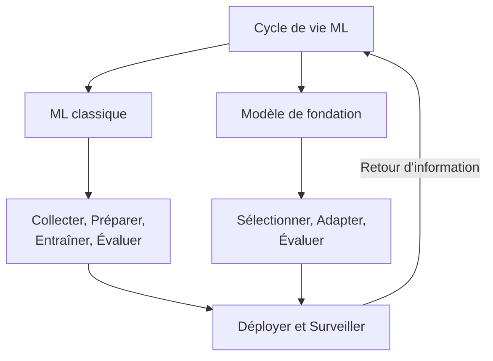
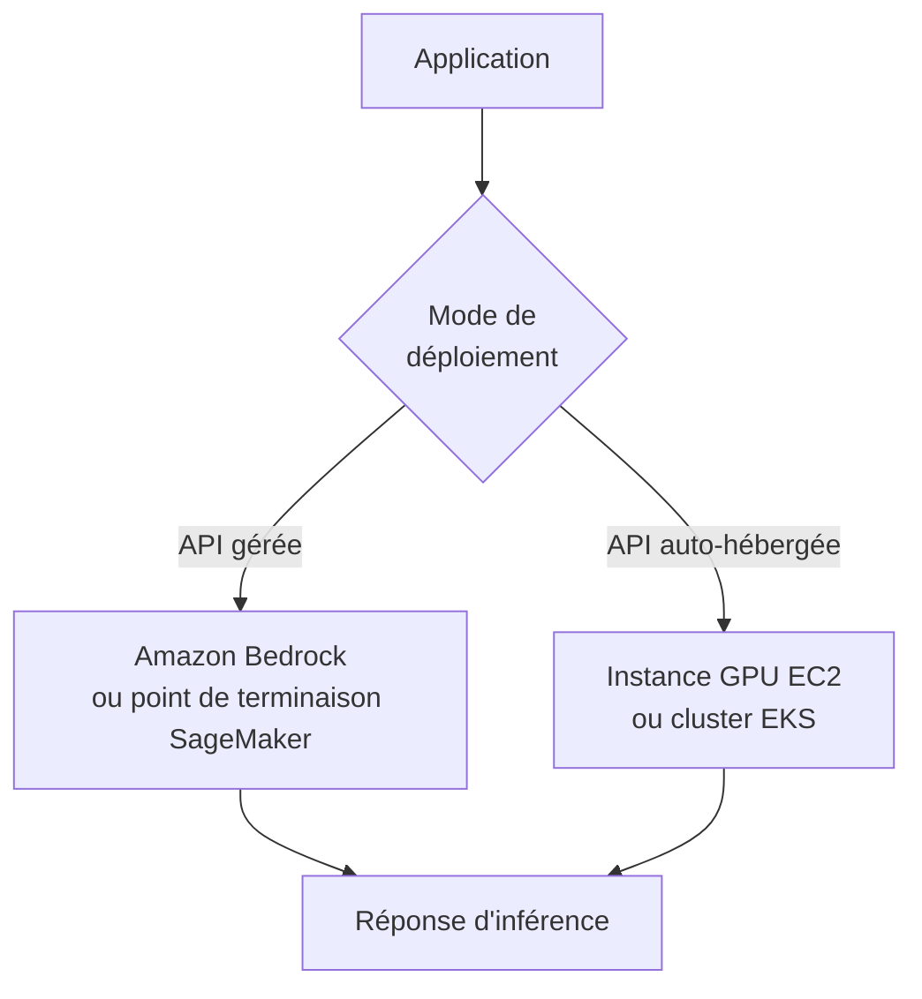
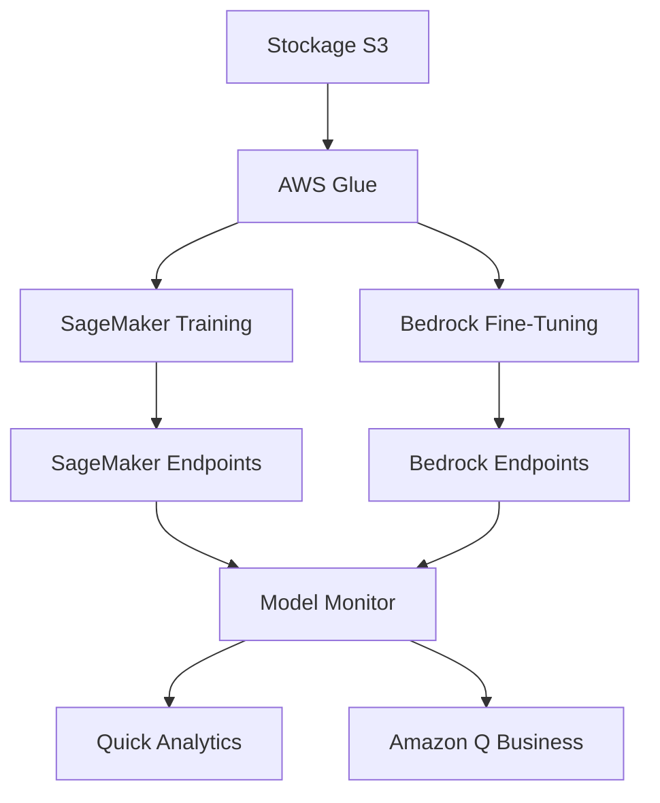
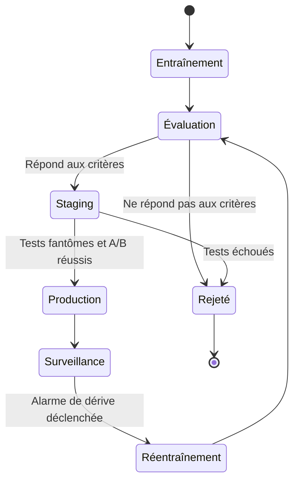
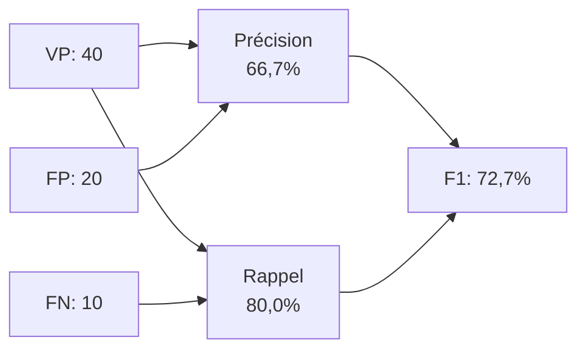

## Énoncé de tâche 1.3 : Décrire le cycle de vie du développement IA/ML

Le cycle de vie du développement IA/ML est la séquence structurée d'activités qui fait passer une idée métier des données brutes à un système en production générant de la valeur au fil du temps. Le domaine 1 a établi le vocabulaire et le paysage des cas d'usage; cet énoncé de tâche met ces idées en mouvement en montrant comment les projets IA et ML sont réellement construits et gérés. Comprendre le cycle de vie permet aux professionnels des affaires de définir des attentes réalistes, de poser les bonnes questions à chaque étape et de reconnaître où les services AWS réduisent le coût et la complexité de chaque phase.[^103001]

### 1.3.1 Composantes d'un pipeline IA/ML

Un pipeline est la séquence d'étapes qu'une équipe exécute pour passer des données brutes à un modèle opérationnel. Le terme est emprunté au génie logiciel et porte le même sens : chaque étape reçoit un artefact de l'étape précédente, le transforme et transmet le résultat. Le concept de pipeline est important pour les professionnels des affaires parce qu'il fournit un vocabulaire commun pour discuter de la progression, des coûts et de la qualité à chaque point d'un projet IA.[^103048]

Les pipelines ML classiques et les pipelines de modèles de fondation partagent une logique structurelle mais diffèrent dans leurs étapes intermédiaires. Un pipeline ML classique part de zéro : une équipe rassemble des données étiquetées, conçoit des caractéristiques, sélectionne un algorithme, entraîne un modèle sur des données propriétaires, le règle, l'évalue, puis déploie et surveille le résultat. Un pipeline de modèle de fondation passe la majeure partie du travail lourd de données et d'entraînement. L'équipe sélectionne plutôt un modèle préentraîné existant, décide comment l'adapter à sa tâche (par ingénierie des invites, ajustement fin ou génération augmentée par récupération), évalue le modèle adapté et le déploie. Les deux parcours se terminent aux mêmes deux étapes : déploiement et surveillance.

*Figure 1.3.1: Pipeline IA/ML à double parcours. Les parcours ML classique et modèle de fondation convergent au déploiement et à la surveillance; les signaux de retour d'information bouclent vers le parcours actif.*

Les étapes du parcours ML classique sont les suivantes. La **collecte de données** est le processus de rassemblement des enregistrements étiquetés ou non étiquetés dont le modèle apprendra; les problèmes de qualité à cette étape se propagent à chaque étape ultérieure.[^103002] **L'analyse exploratoire des données (AED)** est l'examen des données collectées pour comprendre leur distribution, leurs relations et leurs anomalies avant tout modélisation.[^103003] **Le prétraitement des données** couvre le nettoyage, l'imputation des valeurs manquantes, la suppression des doublons et la conversion des données dans un format utilisable par un algorithme.[^103004] **L'ingénierie des caractéristiques** est la création ou la transformation des variables d'entrée pour rendre les schémas sous-jacents plus accessibles au modèle; par exemple, convertir des horodatages de transactions brutes en caractéristique « jours depuis le dernier achat » pour un modèle d'attrition.[^103005] **L'entraînement du modèle** est le processus d'optimisation par lequel un algorithme trouve les valeurs de paramètres qui minimisent l'erreur de prédiction sur le jeu de données d'entraînement.[^103006] **Le réglage des hyperparamètres** ajuste les paramètres qui régissent le comportement de l'entraînement plutôt que les poids appris eux-mêmes; des exemples incluent le taux d'apprentissage et la profondeur maximale de l'arbre dans un modèle boosté par gradient.[^103007]

Le parcours du modèle de fondation commence par la **sélection des données**, qui signifie ici le choix des documents ou des exemples utilisés pour l'ajustement fin plutôt que l'entraînement de zéro. La **sélection du modèle** est le choix du FM préentraîné à adapter, une décision guidée par les capacités, le coût, la latence et les contraintes de licence (discutées à la section 1.3.2). **L'adaptation** couvre les trois principales techniques pour faire fonctionner correctement un FM généraliste sur une tâche spécifique : l'ingénierie des invites, qui élabore des instructions sans changer les poids du modèle; l'ajustement fin, qui met à jour un sous-ensemble de poids en utilisant des exemples spécifiques au domaine; et la *génération augmentée par récupération (RAG)*, qui étend la connaissance du modèle en récupérant des documents pertinents au moment de l'inférence.[^103008] Le domaine 3 traite chaque technique d'adaptation en profondeur; il suffit ici de savoir qu'elles existent et où elles s'inscrivent dans le cycle de vie.

Les deux parcours entrent ensuite dans l'étape **d'évaluation**, où le modèle adapté ou entraîné est testé sur des données retenues et évalué par rapport à des métriques de performance (voir section 1.3.6). Un modèle qui réussit l'évaluation passe au **déploiement**. Un modèle qui échoue retourne à une étape antérieure, généralement l'ingénierie des caractéristiques ou le réglage des hyperparamètres dans le parcours classique, ou une stratégie d'adaptation révisée dans le parcours FM.

La **surveillance** est l'étape finale et la plus souvent sous-estimée lors de la planification. Une fois qu'un modèle est en production, le monde réel ne reste pas immobile. Le comportement des utilisateurs change, les pipelines de données évoluent et les schémas statistiques que le modèle a appris peuvent ne plus correspondre à ce qu'il voit. La surveillance détecte ces écarts et déclenche une action corrective, qu'il s'agisse d'une actualisation des données, d'un réentraînement ou d'une révision des invites.[^103009]

### 1.3.2 Sources de modèles FM

Les modèles de fondation nécessitent d'énormes ressources de calcul pour être entraînés de zéro. Un seul cycle d'entraînement de grand modèle de langage peut consommer des millions d'heures GPU et coûter des dizaines de millions de dollars.[^103010] En conséquence, la plupart des organisations n'entraînent pas leurs propres FM; elles les obtiennent auprès de sources externes et les adaptent. Les trois sources principales diffèrent en termes de coût, de contrôle, de conditions de licence et de capacité.

**Les modèles préentraînés open source** sont des modèles dont les poids et, dans la plupart des cas, le code d'entraînement, sont publiés publiquement. Les exemples les plus importants disponibles en 2025 à 2026 incluent la famille Llama de Meta (maintenant dans sa 4e génération, avec les variantes Llama 4 Scout et Maverick offrant de très grandes fenêtres de contexte; consultez les fiches de modèles actuelles de Meta pour les tailles de fenêtre de contexte servies sur Amazon Bedrock), Mistral et Mixtral de Mistral AI, la série Falcon de TII, et Stable Diffusion de Stability AI pour la génération d'images.[^103011] L'attrait des modèles open source est direct : il n'y a pas de frais API par jeton, les poids peuvent être téléchargés et exécutés dans l'infrastructure de l'organisation, et le modèle peut être ajusté sans aucune implication du fournisseur. L'inconvénient est la complexité opérationnelle. L'équipe doit provisionner et gérer le calcul, gérer les mises à jour du modèle et assumer la responsabilité de la sécurité et de la conformité. Les licences varient également. Les modèles Llama sont soumis à une licence communautaire avec des restrictions commerciales basées sur l'utilisation; vérifiez le texte de la licence Llama actuelle pour le seuil en vigueur. Les modèles Mistral sont soumis à une licence Apache 2.0 sans cette restriction.[^103012] Les équipes métier doivent vérifier la licence applicable avant de s'engager avec un FM open source dans un produit en production.

**Les modèles de fondation commerciaux** sont proposés par des entreprises d'IA en tant que service d'API géré. L'organisation consommatrice paie par jeton traité plutôt que de gérer une infrastructure. Les principaux FM commerciaux accessibles via AWS incluent Anthropic Claude (plusieurs générations, allant de Haiku pour les tâches sensibles aux coûts à Opus et Sonnet pour le raisonnement complexe), Amazon Nova (la propre famille d'Amazon couvrant Nova Micro, Lite, Pro et Premier), les modèles Jamba d'AI21 Labs, et les familles Command et Embed de Cohere.[^103013] Les modèles commerciaux ne nécessitent aucune gestion d'infrastructure et sont continuellement mis à jour par le fournisseur, mais l'organisation a moins de visibilité sur les données d'entraînement et les poids, ce qui peut soulever des questions de conformité dans les industries réglementées.

**Les modèles personnalisés entraînés de zéro** sont l'option la plus rare. Entraîner un nouveau FM à grande échelle de zéro est approprié uniquement lorsqu'une organisation a un domaine si spécialisé qu'aucun FM existant ne le couvre adéquatement et dispose du budget et de la profondeur en ingénierie ML pour le faire. Le coût et le délai sont substantiels; la plupart des organisations évaluent cette voie et concluent que l'ajustement fin d'un FM commercial ou open source est une meilleure utilisation des ressources.[^103014]

*Tableau 1.3.1: Comparaison des options de source FM*

| Source | Structure de coût typique | Contrôle des poids | Complexité opérationnelle | Exemples de modèles |
|--------|----------------------|---------------------|----------------------|----------------|
| Préentraîné open source | Coût d'infrastructure uniquement | Accès complet | Élevée | Llama 4, Mistral, Falcon |
| API commerciale gérée | Tarification par jeton | Pas d'accès | Faible | Claude, Amazon Nova, Cohere |
| Entraîné de zéro | Investissement de plusieurs millions | Propriété complète | Très élevée | Propriétaire |

La sélection entre ces sources est rarement une décision binaire. De nombreuses architectures de production superposent les trois : une API commerciale pour les requêtes généralistes, un modèle open source ajusté pour une tâche à volume élevé et sensible aux coûts, et des modèles ML traditionnels pour les problèmes de prédiction étroits où l'explicabilité est obligatoire.[^103049]

### 1.3.3 Méthodes d'utilisation d'un modèle en production

Mettre un modèle entraîné ou sélectionné en production signifie rendre ses prédictions disponibles aux utilisateurs et aux applications. Les deux principaux modes de déploiement couverts par l'examen sont le **service d'API géré** et l'**API auto-hébergée**. Choisir entre eux nécessite de peser les exigences de latence, le volume d'appels, les besoins de personnalisation et les contraintes de conformité.

Un **service d'API géré** abstrait toutes les préoccupations d'infrastructure de l'application consommatrice. L'application envoie une requête HTTP à un point de terminaison géré par AWS, reçoit une prédiction en réponse et ne touche jamais directement la couche de calcul. **Amazon Bedrock** est la principale API AWS gérée pour les modèles de fondation, donnant accès à Claude, Amazon Nova, Cohere, AI21, Meta Llama et d'autres modèles via une API unifiée unique sans nécessité de gérer des serveurs ou des GPU.[^103015] Pour les organisations qui ont entraîné des modèles ML classiques personnalisés ou ajusté des FM, les points de terminaison d'inférence en temps réel **Amazon SageMaker AI** fournissent la même abstraction : l'équipe enregistre un artefact de modèle, configure un point de terminaison, et SageMaker gère le provisionnement d'instances, l'équilibrage de charge et la mise à l'échelle automatique.[^103016] Les avantages des services d'API gérés sont la rapidité de mise en production, la mise à l'échelle intégrée et la suppression des opérations d'infrastructure de la responsabilité de l'équipe. La limitation est que le contrôle fin sur la pile de service (par exemple, la tokenisation personnalisée ou la gestion de la mémoire GPU) n'est pas disponible.

Une **API auto-hébergée** exécute le modèle sur une infrastructure que l'organisation contrôle et l'expose comme sa propre API. Les modèles AWS les plus courants sont l'hébergement du conteneur de modèle sur des instances GPU **Amazon EC2** pour une flexibilité maximale, ou son déploiement comme charge de travail Kubernetes sur **Amazon EKS** pour l'orchestration de conteneurs à grande échelle.[^103017] L'auto-hébergement est approprié lorsque les exigences de conformité interdisent d'envoyer des données à l'API d'un fournisseur, lorsque le volume d'appels est suffisamment élevé pour que la capacité EC2 réservée ou spot soit moins chère que les frais par jeton, ou lorsque l'équipe a besoin de modifier la pile d'inférence d'une manière qu'un service géré ne permet pas. Le compromis est la charge opérationnelle : l'équipe gère la mise à l'échelle des instances, les mises à jour du modèle, les correctifs de sécurité et la surveillance.

*Figure 1.3.2: Modes de déploiement du modèle. Une application achemine les demandes d'inférence vers une API gérée ou une API auto-hébergée selon les priorités de latence, de conformité et de coût de l'équipe.*

*Tableau 1.3.2: Critères de décision API gérée vs. API auto-hébergée*

| Critère | API gérée | API auto-hébergée |
|-----------|-------------|-----------------|
| Gestion de l'infrastructure | Gérée par AWS | Gérée par l'équipe |
| Mise à l'échelle | Automatique | Configuration manuelle ou Auto Scaling requise |
| Personnalisation de la pile de service | Limitée | Complète |
| Chemin des données | Les données client transitent par le plan de contrôle du service géré dans le compte AWS du client; pas d'accès aux poids du modèle | Les données restent sur l'infrastructure contrôlée par l'équipe; accès complet aux poids |
| Modèle de coût | Par jeton ou par demande | Calcul réservé ou spot |
| Délai avant premier déploiement | Heures | Jours à semaines |

Au-delà de ces deux modes, les organisations utilisent parfois **l'inférence par lots** pour les tâches à volume élevé non sensibles au temps. Amazon SageMaker Batch Transform lit un jeu de données depuis Amazon S3, fait passer chaque enregistrement par le modèle et écrit les résultats dans S3, ce qui le rend adapté à des tâches comme l'évaluation mensuelle des risques sur l'ensemble d'un portefeuille de clients.[^103018] L'inférence par lots n'est pas un point de terminaison au sens traditionnel; elle s'exécute comme un traitement à la demande et n'entraîne des coûts que pendant le traitement.

### 1.3.4 Services AWS pour chaque étape du pipeline

Le guide d'examen AIF-C01 V1.1 nomme spécifiquement cinq familles de services qui couvrent le pipeline IA/ML : **Amazon Bedrock**, **Amazon Q**, **Amazon Quick**, **Kiro** et **Amazon SageMaker AI**. Comprendre ce que chacun fait et où il s'inscrit évite de les confondre à l'examen.

**Amazon Bedrock** se positionne aux étapes d'adaptation et de déploiement des FM dans le pipeline. Il fournit l'accès à un catalogue de modèles de fondation via une API gérée, ainsi que des outils pour ajuster ces modèles sur des données privées et pour construire des pipelines RAG en utilisant des bases de connaissances adossées à des magasins vectoriels.[^103019] Pour les équipes métier, Bedrock est le point d'entrée pour construire des applications propulsées par l'IA générative sans gérer d'infrastructure ML.

**Amazon SageMaker AI** couvre le pipeline ML classique complet, de la préparation des données à l'entraînement, l'évaluation et le déploiement. SageMaker Studio est l'environnement de développement intégré; SageMaker Pipelines fournit le CI/CD natif ML pour automatiser le pipeline de bout en bout; SageMaker Feature Store gère les définitions et les valeurs de caractéristiques; et SageMaker Model Monitor suit la santé des modèles déployés.[^103020] SageMaker héberge également des modèles ajustés et personnalisés comme points de terminaison, de sorte qu'il participe au parcours FM lorsqu'une organisation ajuste un modèle open source plutôt que d'utiliser une API commerciale.

**Amazon Q** est une famille d'assistants propulsés par l'IA orientés vers des publics professionnels spécifiques. **Amazon Q Business** est un assistant conversationnel pour les employés d'entreprise; il se connecte aux sources de données de l'entreprise (SharePoint, Confluence, compartiments S3, systèmes de tickets) et répond aux questions fondées sur le contenu organisationnel.[^103021] **Amazon Q Developer** est un assistant de codage intégré dans les IDE qui suggère du code, explique la logique et identifie les vulnérabilités de sécurité. En 2025 à 2026, Amazon Q Developer est progressivement remplacé dans l'IDE pour les flux de travail de développement logiciel complets par **Kiro**. Les équipes effectuant de nouveaux projets de développement IA en IDE devraient évaluer Kiro plutôt que Q Developer, bien que Q Developer reste disponible et soit toujours cité dans le guide d'examen.

**Kiro** est l'environnement de développement intégré propulsé par l'IA d'Amazon, annoncé en 2025.[^103022] Là où Q Developer est principalement une complétion de code et un overlay de chat dans des IDE existants comme VS Code ou JetBrains, Kiro est un IDE complet construit autour de flux de travail IA agentiques. Kiro peut recevoir une spécification, générer des plans d'implémentation, écrire du code sur plusieurs fichiers, exécuter des tests et itérer jusqu'à ce que le plan soit satisfait. Pour l'examen, la distinction clé est que Kiro cible le cycle de vie du développement logiciel assisté par l'IA, pas les Q&A d'utilisateurs finaux ou l'analyse de données.

**Amazon Quick** est le nom du guide d'examen V1.1 pour la famille d'analytique et d'assistant IA pour les utilisateurs métier d'AWS.[^103023] Les capacités historiquement livrées via Amazon QuickSight (tableaux de bord BI) et Amazon Q Business (réponses conversationnelles sur le contenu de l'entreprise) convergent sous ce nom, avec l'objectif de permettre à un analyste d'affaires de construire des tableaux de bord, de poser des questions en langage naturel sur les données et de recevoir des résumés narratifs générés par l'IA sans changer d'outil. Pour l'examen, Amazon Quick est la bonne réponse aux questions sur « la BI en self-service augmentée par l'IA générative pour les utilisateurs métier »; vérifiez la page produit actuelle avant les décisions d'achat, car la marque et la structure des niveaux se mettent encore en place en 2025 à 2026.

Pour la mémorisation à l'examen, le tableau ci-dessous résume quelle famille d'assistant cible quel public et comment chacune se positionne par rapport au statut V1.1.

*Tableau 1.3.3: Amazon Q, Kiro et Amazon Quick en un coup d'œil*

| Service | Ce qu'il fait | Public | Statut pour AIF-C01 V1.1 |
|---------|--------------|----------|--------------------------|
| Amazon Q Business | Q&A d'entreprise fondé sur le contenu de l'entreprise | Employés du savoir | En périmètre; en convergence vers Amazon Quick |
| Amazon Q Developer | Complétion de code et chat dans les IDE existants | Développeurs utilisant VS Code, JetBrains | En périmètre; remplacé pour les flux de travail IDE complets par Kiro |
| Kiro | IDE complet construit autour de flux de travail IA agentiques | Développeurs construisant des fonctionnalités assistées par l'IA | En périmètre (nouveau en V1.1); la réponse pour « IDE propulsé par l'IA » |
| Amazon Quick | BI en self-service + assistant IA générative | Analystes d'affaires et opérations | En périmètre (nouveau en V1.1); la réponse pour « BI + GenAI pour les utilisateurs métier » |

*Tableau 1.3.4: Services AWS IA/ML par étape du pipeline*

| Étape du pipeline | Service AWS | Rôle |
|----------------|-------------|------|
| Stockage et préparation des données | Amazon S3, AWS Glue | Stockage de jeux de données; ETL et catalogage |
| Ingénierie des caractéristiques | SageMaker Feature Store | Registre centralisé des caractéristiques |
| Entraînement classique du modèle | SageMaker AI Training | Traitements d'entraînement distribués gérés |
| Réglage des hyperparamètres | SageMaker Automatic Model Tuning | Recherche bayésienne et aléatoire dans l'espace de paramètres |
| Adaptation FM (invites/RAG) | Amazon Bedrock Knowledge Bases | Pipelines RAG adossés à des magasins vectoriels |
| Adaptation FM (ajustement fin) | Amazon Bedrock Fine-Tuning, SageMaker AI | Ajustement fin supervisé sur données privées |
| Évaluation | SageMaker Model Monitor, Bedrock Model Evaluation | Évaluation des performances et de la qualité |
| Déploiement (FM) | Amazon Bedrock Endpoints | API d'inférence FM gérée |
| Déploiement (ML personnalisé) | SageMaker AI Endpoints, Batch Transform | Inférence de modèle personnalisé temps réel et par lots |
| Surveillance | SageMaker Model Monitor | Détection de la dérive des données et de la qualité du modèle |
| Analytique métier | Amazon Quick | Tableaux de bord BI et Q&A sur les données en langage naturel |
| Q&A d'entreprise | Amazon Q Business | Réponses conversationnelles sur le contenu de l'entreprise |
| Productivité des développeurs | Kiro, Amazon Q Developer | Développement logiciel assisté par l'IA |

*Figure 1.3.3: Carte des services AWS sur le pipeline IA/ML. Le stockage et l'ETL alimentent à la fois l'entraînement classique et l'ajustement fin des FM; les résultats convergent à la surveillance puis s'écoulent vers les outils d'utilisateurs finaux.*

### 1.3.5 Concepts fondamentaux du MLOps

**Le MLOps** (Machine Learning Operations) est la discipline d'application de la rigueur du génie logiciel au cycle de vie ML pour rendre la livraison des modèles répétable, évolutive et maintenable dans le temps.[^103024] Le terme s'inspire du DevOps : tout comme le DevOps a apporté l'automatisation, le contrôle de version et l'intégration continue au développement d'applications, le MLOps apporte ces mêmes pratiques au travail de construction et d'exploitation des modèles ML. L'examen couvre sept concepts fondamentaux du MLOps.

**L'expérimentation** est la pratique de suivi de chaque exécution d'une tentative de construction de modèle afin que les résultats puissent être reproduits et comparés. Sans suivi systématique, une équipe qui atteint un bon score de validation ne peut pas le reproduire de façon fiable après modification du code. **Amazon SageMaker Experiments** enregistre les hyperparamètres, les métriques et les versions d'artefacts associés à chaque cycle d'entraînement.[^103025] Le résultat est un historique consultable qui répond à la question : « Quelle exécution a produit ce résultat, et quelle était sa configuration ? »

**Les processus reproductibles** remplacent les scripts ad hoc par des pipelines versionnés et paramétrés qui produisent des résultats cohérents à partir d'entrées cohérentes. **Amazon SageMaker Pipelines** est le service d'orchestration MLOps natif; il définit les étapes du pipeline dans le code, stocke la sortie de chaque étape comme artefact versionné et s'intègre au registre de modèles SageMaker pour conditionner les déploiements à des seuils d'évaluation.[^103026] Lorsqu'un pipeline est défini de cette façon, sa ré-exécution avec de nouvelles données produit une nouvelle version du modèle avec une traçabilité auditable jusqu'aux données d'entrée.

**Les systèmes évolutifs** garantissent que l'infrastructure supportant l'entraînement, l'évaluation et l'inférence peut croître avec la demande sans reconfiguration manuelle. SageMaker gère l'entraînement distribué sur des clusters GPU et met à l'échelle les points de terminaison d'inférence à la hausse et à la baisse en fonction du volume de demandes via des politiques de mise à l'échelle automatique adossées aux métriques **Amazon CloudWatch**.[^103027]

**La gestion de la dette technique** en ML signifie prévenir l'accumulation d'hypothèses cachées dans les pipelines, de transformations de caractéristiques non documentées et de versions de modèles que personne ne peut relier à leurs données d'entraînement. Les pratiques concrètes incluent le maintien des définitions de caractéristiques dans SageMaker Feature Store (afin que la même transformation soit utilisée de manière cohérente dans l'entraînement et l'inférence), le stockage des artefacts de modèles dans le registre de modèles SageMaker avec des métadonnées, et la révision des pipelines pour les composants qui ne sont plus utilisés.[^103028]

**Atteindre l'état de production** signifie qu'un modèle a passé un niveau de qualité défini avant d'atteindre les clients. Cela implique des tests fantômes (exécution du nouveau modèle en parallèle avec le modèle actif et comparaison des résultats), des tests A/B (acheminement d'un pourcentage du trafic vers la nouvelle version) et des tests de charge (vérification que le point de terminaison gère le trafic de pointe sans dégradation de la latence). Ce n'est qu'après ces étapes que la nouvelle version remplace le modèle en production.[^103029]

**La surveillance du modèle** est l'évaluation continue du comportement d'un modèle déployé par rapport aux bases de référence établies au moment du déploiement. Deux types de dérive sont particulièrement importants. La *dérive des données* (aussi appelée *glissement de covariables*) se produit lorsque la distribution statistique des caractéristiques d'entrée change au fil du temps; par exemple, un modèle de fraude entraîné sur des schémas de transactions de 2023 peut voir des distributions de caractéristiques différentes à mesure que les habitudes de dépenses évoluent.[^103030] La *dérive des concepts* se produit lorsque la relation entre les entrées et la sortie correcte change; par exemple, la définition du comportement à risque par un modèle d'attrition peut évoluer à mesure que le produit lui-même change. **Amazon SageMaker Model Monitor** compare continuellement les données d'inférence en direct par rapport à un jeu de données de référence et déclenche des alarmes lorsque la dérive dépasse un seuil.[^103031]

**Le réentraînement du modèle** est la réponse aux signaux de surveillance. Une stratégie de réentraînement doit spécifier le déclencheur (planifié, seuil de métrique ou approuvé humainement), la fenêtre de données utilisée (toutes les données historiques, une fenêtre glissante récente ou une plage de dates spécifique) et la porte de déploiement (les seuils de réussite/échec que le modèle réentraîné doit franchir avant de remplacer la version précédente). SageMaker Pipelines prend en charge l'exécution déclenchée par des événements, de sorte qu'une alarme CloudWatch déclenchée par Model Monitor peut initier automatiquement un cycle de réentraînement.[^103032]

*Figure 1.3.4: États du cycle de vie du modèle MLOps. Un modèle passe de l'entraînement aux étapes d'évaluation et de staging avant d'atteindre la production, puis réintègre le cycle lorsque la surveillance détecte une dérive.*

### 1.3.6 Métriques de performance et métriques métier

L'évaluation d'un modèle IA/ML nécessite deux perspectives parallèles. Les métriques de performance technique indiquent à l'équipe si le modèle fait des prédictions précises. Les métriques métier indiquent à l'organisation si ces prédictions précises génèrent la valeur prévue. Un modèle peut obtenir de bons scores sur les métriques techniques et ne pas produire de retour métier s'il résout le mauvais problème ou s'il est trop coûteux à exploiter à grande échelle.

#### Métriques de performance technique

Le guide d'examen AIF-C01 V1.1 a remplacé *AUC* de la liste V1.0 par *précision* et *rappel*. Les quatre métriques explicitement nommées sont l'exactitude, la précision, le rappel et le score F1, qui s'appliquent tous aux problèmes de classification.[^103033]

**L'exactitude** est la proportion de toutes les prédictions que le modèle a correctement effectuées. Pour un modèle qui classe les e-mails clients comme réclamation ou non-réclamation, l'exactitude est (nombre d'e-mails correctement classifiés) / (total des e-mails). L'exactitude est simple mais trompeuse lorsque les classes sont déséquilibrées. Si 95 % des e-mails ne sont pas des réclamations, un modèle qui prédit toujours non-réclamation a une exactitude de 95 % mais aucune utilité.[^103034]

Une **matrice de confusion** est la base pour comprendre toutes les autres métriques de classification. C'est un tableau deux par deux (pour la classification binaire) qui compte les résultats en quatre cellules.

*Tableau 1.3.5: Structure de la matrice de confusion*

| | Prédit Positif | Prédit Négatif |
|---|---|---|
| Réel Positif | Vrai Positif (VP) | Faux Négatif (FN) |
| Réel Négatif | Faux Positif (FP) | Vrai Négatif (VN) |

**La précision** est la fraction des prédictions positives qui étaient correctes : VP / (VP + FP). Un modèle de détection de fraude à haute précision déclenche peu de fausses alarmes; la plupart des transactions signalées sont réellement frauduleuses. Lorsque les faux positifs sont coûteux (par exemple, bloquer une transaction légitime d'un client), maximiser la précision est la priorité.[^103035]

**Le rappel** (aussi appelé *sensibilité*) est la fraction des positifs réels que le modèle a identifiés avec succès : VP / (VP + FN). Un modèle de dépistage médical à rappel élevé détecte la plupart des vrais cas de la maladie. Lorsque les faux négatifs sont coûteux (par exemple, manquer un diagnostic de cancer), maximiser le rappel est la priorité.[^103036]

La précision et le rappel se compensent l'un l'autre. Abaisser le seuil de classification augmente le rappel mais diminue la précision; l'élever augmente la précision mais diminue le rappel. Le **score F1** est la moyenne harmonique de la précision et du rappel : 2 x (Précision x Rappel) / (Précision + Rappel). Parce qu'il utilise la moyenne harmonique plutôt que la moyenne arithmétique, il est sensible aux valeurs faibles dans l'une ou l'autre métrique, en faisant un résumé fiable à chiffre unique lorsque les faux positifs et les faux négatifs sont tous les deux importants.[^103037]

Un exemple rend les compromis concrets. Un modèle de détection de fraude est évalué sur un ensemble de test de 1 000 transactions, dont 50 sont frauduleuses. Le modèle signale 60 transactions comme frauduleuses; 40 de ces signalements sont corrects et 10 fraudes réelles sont manquées.

- Exactitude : (40 + 940) / 1 000 = 98,0 %
- Précision : 40 / 60 = 66,7 %
- Rappel : 40 / 50 = 80,0 %
- Score F1 : 2 x (0,667 x 0,800) / (0,667 + 0,800) = 72,7 %

Le chiffre d'exactitude de 98 % semble fort, mais le score F1 de 72,7 % donne une image plus honnête de la performance du modèle sur la classe qui importe.

*Figure 1.3.5: Calcul de la précision, du rappel et du score F1 pour l'exemple de détection de fraude. Le diagramme montre comment les vrais positifs, les faux positifs et les faux négatifs se combinent pour former le score F1 récapitulatif.*

#### Métriques métier

Les métriques techniques répondent à la question de savoir si le modèle fonctionne. Les métriques métier répondent à la question de savoir si le modèle vaut la peine d'être exploité. Les quatre métriques métier dans le guide d'examen sont le coût par utilisateur, les coûts de développement, les retours des clients et le retour sur investissement.[^103038]

**Le coût par utilisateur** est le coût total d'inférence (calcul, frais API et frais généraux opérationnels) divisé par le nombre d'utilisateurs servis au cours d'une période. Cette métrique rend visibles l'économie continue d'un modèle. Un modèle qui coûte 0,001 $ par utilisateur par mois à 10 000 utilisateurs peut devenir inabordable à 10 millions d'utilisateurs si le coût ne diminue pas avec le volume. La surveillance du coût par utilisateur dans le temps révèle également quand l'efficacité d'un modèle se dégrade, souvent un signe que les charges utiles d'entrée augmentent ou que le modèle est appelé plus que nécessaire.[^103039]

**Les coûts de développement** sont les investissements ponctuels (ou par itération) en personnel, données, calcul et outillage nécessaires pour construire et déployer un modèle. Pour un FM ajusté sur Bedrock, les coûts de développement comprennent l'effort d'étiquetage des données et le calcul du traitement d'ajustement fin. Pour un modèle entraîné sur mesure, ils incluent des mois de temps d'ingénieur ML et des heures de cluster GPU. Le suivi des coûts de développement par rapport à la valeur métier livrée répond à la question de construire ou acheter pour les projets futurs.[^103040]

**Les retours des clients** couvrent les signaux qualitatifs et quantitatifs sur la satisfaction des utilisateurs avec la fonctionnalité propulsée par l'IA. Les instruments courants incluent des enquêtes Net Promoter Score, des évaluations pouces vers le haut ou vers le bas dans le produit sur les réponses de l'IA et le volume de tickets de support client étiquetés pour la fonctionnalité IA. Les retours des clients détectent souvent des problèmes que les métriques techniques manquent : un modèle peut avoir une haute précision et un rappel élevé mais générer des résultats que les utilisateurs perçoivent comme inutiles ou hors de la ligne éditoriale.[^103041]

**Le retour sur investissement (ROI)** est le rapport entre le bénéfice financier net et le coût total sur une période définie. Un modèle de détection de fraude qui prévient 2 millions de dollars de pertes annuelles pour un coût total annuel (développement amorti plus inférence) de 400 000 dollars a un ROI de 400 %. Le ROI est la métrique qui justifie l'investissement IA auprès de la direction financière et détermine si un projet reçoit un financement continu après son déploiement initial.[^103042]

*Tableau 1.3.6: Alignement des métriques techniques et métier par cas d'usage*

| Cas d'usage | Métrique technique | Métrique métier |
|----------|-----------------|-----------------|
| Détection de fraude | Score F1 sur la classe fraude | Pertes de fraude évitées / coût de gestion des fausses alarmes |
| Prédiction d'attrition | Rappel sur les clients qui se désabonnent | Chiffre d'affaires retenu des clients à risque |
| Classification de documents | Précision par catégorie | Heures de personnel économisées par semaine |
| Recommandation de produits | Exactitude des recommandations cliquées | Augmentation de la valeur moyenne des commandes |
| Dépistage médical | Rappel sur les cas positifs | Coût par cas détecté vs. coût de traitement tardif |

Une gestion efficace du programme IA nécessite le suivi des deux colonnes. Un modèle avec un fort score F1 mais un ROI négatif devrait être redessiné ou remplacé. Un modèle avec un fort ROI mais un rappel en baisse a besoin d'un réentraînement avant que les résultats métier ne se dégradent.[^103050]

---

**Ce que cette section a construit :** L'énoncé de tâche 1.3 a couvert la structure du cycle de vie IA/ML : le pipeline à double parcours, l'approvisionnement en FM, les modes de déploiement en production et les services AWS qui correspondent à chaque étape. Il a également introduit les pratiques MLOps qui maintiennent les modèles en production en bonne santé et les métriques techniques et métier qui déterminent si un modèle fonctionne. L'énoncé de tâche 2.1 approfondira plusieurs de ces concepts, en se concentrant spécifiquement sur le fonctionnement de l'IA générative et le vocabulaire unique qu'elle introduit.

---

## Questions d'auto-évaluation

1. Une équipe de data science a construit un modèle de prédiction d'attrition des clients et l'a déployé il y a six mois. Un analyste d'affaires remarque que le rappel du modèle est passé de 82 % à 54 % même si le volume et le format des données d'entrée n'ont pas changé. L'équipe soupçonne que les schémas de comportement des clients ont évolué depuis l'entraînement du modèle. Quel concept MLOps décrit le MIEUX la cause racine de cette baisse du rappel ?

   A. Dérive des hyperparamètres
   B. Dérive des concepts
   C. Dette technique du pipeline
   D. Invalidation du Feature Store

   La dérive des concepts se produit lorsque la relation entre les caractéristiques d'entrée et la sortie correcte change au fil du temps, même lorsque la distribution des données d'entrée semble stable. Dans ce scénario, l'équipe attribue spécifiquement le changement à l'évolution du comportement des clients changeant la relation entrée-résultat, ce qui correspond à la dérive des concepts, pas à un changement dans la distribution des caractéristiques. Le rappel diminue parce que les signaux qui indiquaient auparavant le désabonnement n'ont plus la même relation prédictive avec les événements d'attrition réels; le modèle manque les clients à risque dont le comportement actuel diffère des schémas de l'ère d'entraînement. La dérive des données (glissement de covariables) signifierait que la *distribution* des caractéristiques d'entrée elles-mêmes avait changé, mais l'énoncé l'exclut. La dérive des hyperparamètres n'est pas un terme reconnu dans le vocabulaire MLOps. L'invalidation du Feature Store produirait des erreurs ou des valeurs manquantes plutôt qu'un déclin progressif du rappel. La réponse correcte est la dérive des concepts, ce qui signale que le modèle a besoin d'un réentraînement sur des données étiquetées plus récentes.[^103043]

2. Une entreprise de commerce de détail évalue des options de modèle de fondation pour un service de génération de description de produits à volume élevé qui traitera environ 50 millions de demandes par mois. L'équipe requiert un contrôle total sur les poids du modèle pour des raisons de conformité et souhaite minimiser les coûts unitaires continus. Quelle approche de source FM est la PLUS appropriée ?

   A. API commerciale gérée avec un modèle à grand nombre de paramètres comme Claude Opus
   B. Modèle préentraîné open source hébergé sur des instances GPU EC2 auto-gérées
   C. Amazon Bedrock avec une tarification à la demande
   D. Modèle entraîné sur mesure à partir de zéro sur des données de produits propriétaires

   Le scénario spécifie deux contraintes qui réduisent ensemble le choix : la conformité nécessite un contrôle au niveau des poids, et le volume élevé nécessite une économie meilleure que la tarification API par jeton. Les modèles préentraînés open source (option B) répondent aux deux contraintes. Ils fournissent un accès complet aux poids (satisfaisant la conformité) et, une fois déployés sur des instances EC2 réservées ou spot, réduisent significativement le coût marginal à 50 millions de demandes mensuelles par rapport aux tarifs commerciaux par jeton. Les API commerciales gérées (options A et C) ne fournissent pas de contrôle au niveau des poids, que le scénario exige explicitement; elles comportent également des coûts par jeton qui s'accumulent à volume élevé. (Notez qu'Amazon Bedrock garde les invites des clients dans la limite du compte AWS du client; « les données quittent l'organisation » n'est pas le facteur disqualifiant ici, c'est le manque de contrôle au niveau des poids.) Construire de zéro (option D) est bien plus coûteux que d'adapter un modèle open source existant et n'est justifié que lorsqu'aucun modèle existant ne couvre adéquatement le domaine. Le choix le PLUS approprié est l'option B.[^103044]

3. Un analyste d'affaires examine un modèle de détection de fraude et voit les résultats de la matrice de confusion suivants : VP=80, FP=40, FN=20, VN=860. L'analyste doit rapporter la métrique qui MIEUX reflète la capacité du modèle à éviter de signaler incorrectement des transactions légitimes comme frauduleuses. Quelle métrique devrait être rapportée ?

   A. Exactitude
   B. Rappel
   C. Score F1
   D. Précision

   La question porte sur la métrique qui reflète la fréquence à laquelle les prédictions positives (signalements de fraude) sont réellement correctes, ce qui est la définition de la précision. Précision = VP / (VP + FP) = 80 / (80 + 40) = 66,7 %. Un faux positif dans ce contexte est une transaction légitime incorrectement signalée comme fraude; une banque ou un détaillant paie un coût réel lorsque des clients légitimes sont refusés. La précision mesure directement le taux de faux positifs du point de vue du modèle. Le rappel (VP / (VP + FN) = 80 / 100 = 80 %) mesure la capacité du modèle à détecter les transactions réellement frauduleuses, pas à éviter les signalements incorrects de transactions légitimes. L'exactitude inclut les quatre cellules et est dominée par le grand nombre de vrais négatifs, la rendant moins informative ici. Le F1 est une métrique combinée; il n'isole pas le comportement de précision. La MEILLEURE métrique à rapporter est la précision.[^103045]

4. Une organisation souhaite construire un assistant conversationnel qui répond aux questions des employés fondées sur des documents internes de l'entreprise stockés dans SharePoint, Confluence et Amazon S3. Ils ne veulent pas gérer d'infrastructure de modèle. Quel service AWS est le PLUS directement conçu pour ce cas d'usage ?

   A. Amazon SageMaker AI avec un modèle entraîné sur mesure
   B. Kiro
   C. Amazon Q Business
   D. Amazon Bedrock avec ingénierie des invites manuelle

   Amazon Q Business est le service AWS spécifiquement conçu pour les assistants conversationnels d'entreprise qui répondent aux questions fondées sur les propres documents et sources de données d'une organisation. Il inclut des connecteurs intégrés pour SharePoint, Confluence, S3 et des dizaines d'autres systèmes d'entreprise, gère automatiquement la segmentation, l'indexation et la récupération, et expose l'assistant via une interface web gérée et une API sans nécessiter de gestion d'infrastructure. Kiro est un IDE propulsé par l'IA pour les tâches de développement logiciel, pas un service Q&A d'entreprise. SageMaker AI avec un modèle entraîné sur mesure nécessiterait que l'organisation construise les composants de récupération, de fondement et de génération de réponses de zéro, ce qui n'est pas un chemin « sans gestion d'infrastructure ». Amazon Bedrock avec ingénierie des invites manuelle nécessiterait que l'équipe construise toute la logique de connecteur et de récupération elle-même, ce qui représente substantiellement plus de travail qu'utiliser directement Q Business. Le service le PLUS directement conçu est Amazon Q Business.[^103046]

5. Une équipe de projet présente les résultats d'un modèle de recommandation de produits nouvellement déployé au directeur financier. Le modèle a atteint une exactitude de 91 % et un score F1 de 84 % sur l'ensemble de test. Le directeur financier demande ce que le modèle a réellement apporté à l'entreprise au cours du premier trimestre d'exploitation. Quelle métrique répond le MIEUX à la question du directeur financier ?

   A. Score F1 de 84 %
   B. Exactitude de 91 %
   C. Retour sur investissement exprimé en impact sur le chiffre d'affaires versus coût opérationnel
   D. Rappel sur la classe positive

   La question du directeur financier porte explicitement sur le résultat métier, pas sur la qualité du modèle. Les métriques techniques comme l'exactitude, le score F1 et le rappel décrivent comment le modèle performe sur des données de test étiquetées; elles ne se traduisent pas directement en termes financiers qu'un directeur financier utilise pour évaluer si un projet valait la peine d'être financé. Le retour sur investissement (ROI), exprimé comme le bénéfice net en chiffre d'affaires ou en avantage de coût généré par le modèle par rapport au coût de sa construction et de son exploitation, est la métrique métier qui répond directement à la question de savoir si l'investissement était justifié. Pour un système de recommandation, le ROI pourrait être calculé comme le chiffre d'affaires incrémental attribuable aux achats déclenchés par les recommandations moins le coût total du modèle pour le trimestre. Ce cadrage est directement actionnable pour un directeur financier qui décide de continuer à financer le projet ou de l'élargir. La MEILLEURE métrique est le ROI.[^103047]

---

[^103001]: AWS Certified AI Practitioner Exam Guide v1.1, Task Statement 1.3. URL: <https://docs.aws.amazon.com/aws-certification/latest/ai-practitioner-01/ai-practitioner-01-domain1.html>
[^103002]: Amazon SageMaker Data Wrangler: Preparing ML data. URL: <https://docs.aws.amazon.com/sagemaker/latest/dg/data-wrangler.html>
[^103003]: Exploratory Data Analysis with Amazon SageMaker Studio. URL: <https://docs.aws.amazon.com/sagemaker/latest/dg/studio.html>
[^103004]: Data preprocessing concepts in ML. URL: <https://docs.aws.amazon.com/wellarchitected/latest/machine-learning-lens/data-preprocessing.html>
[^103005]: Amazon SageMaker Feature Store overview. URL: <https://docs.aws.amazon.com/sagemaker/latest/dg/feature-store.html>
[^103006]: Amazon SageMaker Training: training jobs overview. URL: <https://docs.aws.amazon.com/sagemaker/latest/dg/train-model.html>
[^103007]: Amazon SageMaker Automatic Model Tuning. URL: <https://docs.aws.amazon.com/sagemaker/latest/dg/automatic-model-tuning.html>
[^103008]: Amazon Bedrock retrieval-augmented generation overview. URL: <https://docs.aws.amazon.com/bedrock/latest/userguide/knowledge-base.html>
[^103009]: Amazon SageMaker Model Monitor: continuous monitoring of deployed models. URL: <https://docs.aws.amazon.com/sagemaker/latest/dg/model-monitor.html>
[^103010]: AWS Blog: Training large language models at scale. URL: <https://aws.amazon.com/blogs/machine-learning/training-large-language-models-on-amazon-sagemaker/>
[^103011]: Meta Llama model family overview. URL: <https://llama.meta.com/>
[^103012]: Mistral AI open-source model licensing. URL: <https://mistral.ai/news/announcing-mistral-7b/>
[^103013]: Amazon Bedrock supported foundation models. URL: <https://docs.aws.amazon.com/bedrock/latest/userguide/models-supported.html>
[^103014]: AWS ML Blog: When to train a custom model vs. use a pre-trained FM. URL: <https://aws.amazon.com/blogs/machine-learning/>
[^103015]: Amazon Bedrock: Fully managed FM service overview. URL: <https://docs.aws.amazon.com/bedrock/latest/userguide/what-is-bedrock.html>
[^103016]: Amazon SageMaker real-time inference endpoints. URL: <https://docs.aws.amazon.com/sagemaker/latest/dg/realtime-endpoints.html>
[^103017]: Running ML inference on Amazon EC2 GPU instances. URL: <https://docs.aws.amazon.com/AWSEC2/latest/UserGuide/accelerated-computing-instances.html>
[^103018]: Amazon SageMaker Batch Transform. URL: <https://docs.aws.amazon.com/sagemaker/latest/dg/batch-transform.html>
[^103019]: Amazon Bedrock Knowledge Bases for RAG. URL: <https://docs.aws.amazon.com/bedrock/latest/userguide/knowledge-base.html>
[^103020]: Amazon SageMaker AI overview: features and capabilities. URL: <https://docs.aws.amazon.com/sagemaker/latest/dg/whatis.html>
[^103021]: Amazon Q Business overview. URL: <https://docs.aws.amazon.com/amazonq/latest/qbusiness-ug/what-is.html>
[^103022]: Kiro: AI-powered IDE from AWS. URL: <https://kiro.dev/>
[^103023]: AIF-C01 v1.1 in-scope service list (Amazon Quick), AWS QuickSight product page, and Amazon Q Business product page. URLs: <https://docs.aws.amazon.com/aws-certification/latest/ai-practitioner-01/aif-01-in-scope-services.html>, <https://aws.amazon.com/quicksight/>, and <https://aws.amazon.com/q/business/>
[^103024]: AWS What is MLOps? URL: <https://aws.amazon.com/what-is/mlops/>
[^103025]: Amazon SageMaker Experiments documentation. URL: <https://docs.aws.amazon.com/sagemaker/latest/dg/experiments.html>
[^103026]: Amazon SageMaker Pipelines: ML CI/CD. URL: <https://docs.aws.amazon.com/sagemaker/latest/dg/pipelines.html>
[^103027]: Amazon SageMaker auto-scaling for inference endpoints. URL: <https://docs.aws.amazon.com/sagemaker/latest/dg/endpoint-auto-scaling.html>
[^103028]: Amazon SageMaker Feature Store: consistent feature transforms. URL: <https://docs.aws.amazon.com/sagemaker/latest/dg/feature-store-use-with-studio.html>
[^103029]: Amazon SageMaker shadow testing for deployments. URL: <https://docs.aws.amazon.com/sagemaker/latest/dg/shadow-tests.html>
[^103030]: Data drift detection with Amazon SageMaker Model Monitor. URL: <https://docs.aws.amazon.com/sagemaker/latest/dg/model-monitor-data-quality.html>
[^103031]: Amazon SageMaker Model Monitor: how it works. URL: <https://docs.aws.amazon.com/sagemaker/latest/dg/model-monitor-how-it-works.html>
[^103032]: Triggering SageMaker Pipelines with CloudWatch alarms. URL: <https://docs.aws.amazon.com/sagemaker/latest/dg/pipeline-eventbridge.html>
[^103033]: AWS Certified AI Practitioner Exam Guide v1.1, Objective 1.3.6. URL: <https://docs.aws.amazon.com/aws-certification/latest/ai-practitioner-01/ai-practitioner-01-domain1.html>
[^103034]: ML classification accuracy limitations. URL: <https://docs.aws.amazon.com/machine-learning/latest/dg/binary-classification.html>
[^103035]: Precision metric in binary classification. URL: <https://docs.aws.amazon.com/machine-learning/latest/dg/binary-classification.html>
[^103036]: Recall (sensitivity) in classification models. URL: <https://docs.aws.amazon.com/machine-learning/latest/dg/binary-classification.html>
[^103037]: F1 score definition and calculation. URL: <https://docs.aws.amazon.com/machine-learning/latest/dg/multiclass-model-insights.html>
[^103038]: AWS Certified AI Practitioner Exam Guide v1.1, business metrics in objective 1.3.6. URL: <https://docs.aws.amazon.com/aws-certification/latest/ai-practitioner-01/ai-practitioner-01-domain1.html>
[^103039]: Amazon Bedrock pricing model and cost management. URL: <https://aws.amazon.com/bedrock/pricing/>
[^103040]: AWS ML cost optimization guidance. URL: <https://aws.amazon.com/blogs/machine-learning/optimizing-costs-for-machine-learning-on-aws/>
[^103041]: Amazon Bedrock human-loop feedback integration. URL: <https://docs.aws.amazon.com/bedrock/latest/userguide/human-loop.html>
[^103042]: Measuring business value of ML with AWS. URL: <https://aws.amazon.com/blogs/machine-learning/measuring-the-business-impact-of-amazon-sagemaker/>
[^103043]: Concept drift and data drift in Amazon SageMaker Model Monitor. URL: <https://docs.aws.amazon.com/sagemaker/latest/dg/model-monitor-model-quality.html>
[^103044]: Deploying open-source models on Amazon EC2 GPU instances. URL: <https://docs.aws.amazon.com/AWSEC2/latest/UserGuide/accelerated-computing-instances.html>
[^103045]: Binary classification metrics: precision and recall. URL: <https://docs.aws.amazon.com/machine-learning/latest/dg/binary-classification.html>
[^103046]: Amazon Q Business: connecting enterprise data sources. URL: <https://docs.aws.amazon.com/amazonq/latest/qbusiness-ug/connectors-list.html>
[^103047]: Business metrics for evaluating ML models. URL: <https://aws.amazon.com/blogs/machine-learning/mlops-foundation-roadmap-for-enterprises-with-amazon-sagemaker/>
[^103048]: AWS Well-Architected Machine Learning Lens: ML lifecycle overview. URL: <https://docs.aws.amazon.com/wellarchitected/latest/machine-learning-lens/well-architected-machine-learning-lifecycle.html>
[^103049]: AWS Blog: Choosing between foundation models and custom ML. URL: <https://aws.amazon.com/blogs/machine-learning/choose-the-right-approach-for-your-generative-ai-use-cases/>
[^103050]: Amazon SageMaker MLOps: continuous evaluation and retraining. URL: <https://docs.aws.amazon.com/sagemaker/latest/dg/model-monitor.html>
