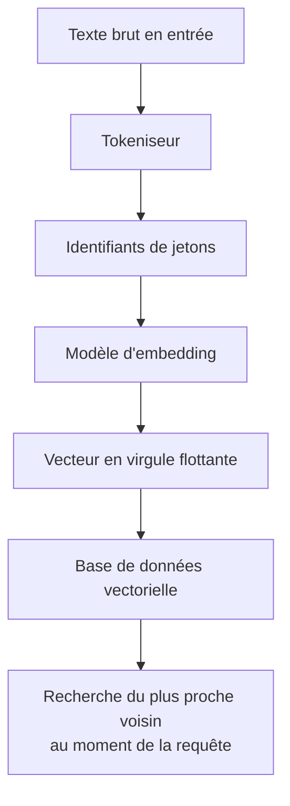
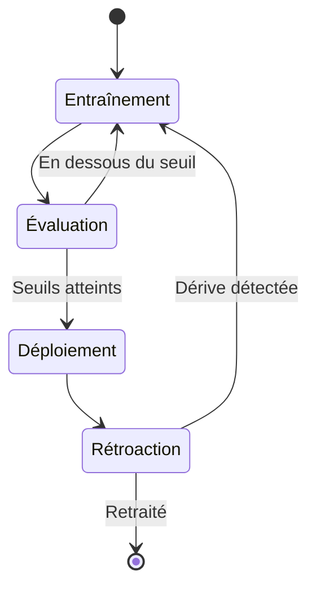
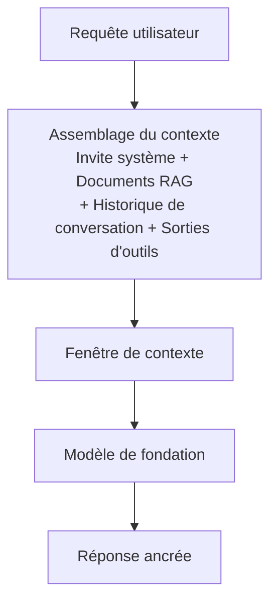
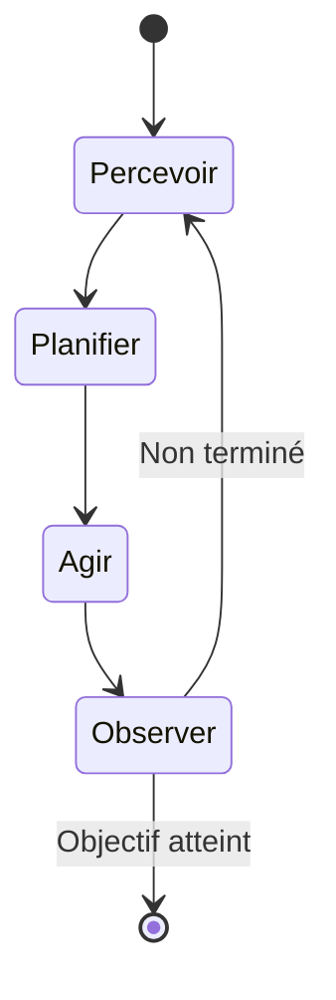
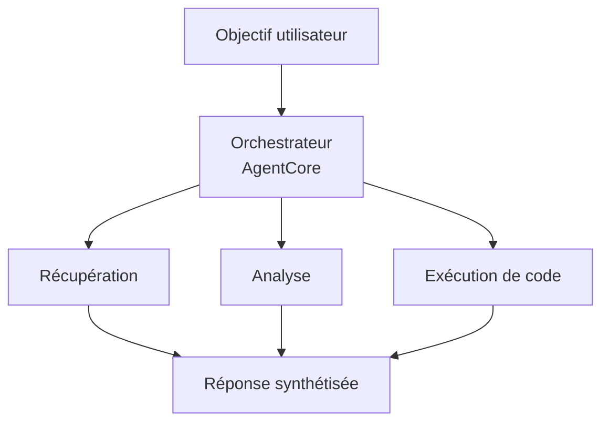

## Énoncé de tâche 2.1 : Expliquer les concepts de base de l'IA générative

L'IA générative produit un nouveau contenu plutôt que de prédire une étiquette ou de classer une entrée. Cette distinction structure tout le reste : les architectures de modèles utilisées pour construire ces systèmes, la façon dont ils sont facturés, les modes de défaillance qu'ils présentent et la nouvelle discipline de l'ingénierie de contexte qui détermine quelles informations le modèle voit avant de répondre. Cet énoncé de tâche couvre six domaines objectifs, dont trois sont nouveaux dans le guide d'examen v1.1 et reflètent la rapidité avec laquelle cette technologie est passée de la recherche aux déploiements en production.[^201001]

L'introduction du domaine a établi que l'IA générative représente 24 % du poids de l'examen et que son profil de coût et de défaillance diffère substantiellement de l'apprentissage automatique classique. Cet énoncé de tâche ancre ces affirmations dans la mécanique sous-jacente. À la fin de cette section, vous serez en mesure d'expliquer ce qu'est un jeton et pourquoi le nombre de jetons d'une invite affecte directement la facture, de décrire comment un FM passe du texte brut à un service déployé, d'expliquer ce que signifie l'ingénierie de contexte et comment elle se distingue de l'ingénierie d'invite, et d'articuler les schémas qu'utilisent les systèmes multi-agents pour coordonner plusieurs composants d'IA.

### 2.1.1 Concepts fondamentaux de l'IA générative

Les modèles d'IA générative partagent un ensemble d'abstractions de base qui apparaissent dans toute la documentation AWS, les pages de tarification des fournisseurs et les revues de conception. Comprendre ces abstractions est le prérequis de tout le reste du domaine 2.

**La tokenisation** est la première étape du traitement du texte par un modèle de langage. Un *jeton* est la plus petite unité de texte sur laquelle le modèle opère. Dans la plupart des textes en langue anglaise, un jeton représente approximativement trois à quatre caractères, de sorte que le mot « tokenization » devient deux ou trois jetons selon le tokeniseur, tandis que le mot « cat » est un seul jeton. Les chiffres, la ponctuation et les caractères non anglais produisent souvent plus de jetons par mot que la prose anglaise standard.[^201002] Le nombre total de jetons pour une requête est la somme des jetons d'entrée (le texte envoyé) et des jetons de sortie (le texte généré en retour par le modèle). Les deux comptages apparaissent sur la facture.

**Le découpage en fragments** (*chunking*) est le processus qui consiste à diviser un grand document en segments plus petits avant de l'indexer par embedding ou de le récupérer. Un PDF de 50 pages ne peut pas tenir dans la fenêtre de contexte d'un modèle en un seul bloc ; il est donc divisé en fragments superposés de quelques centaines de jetons chacun. La taille des fragments et le pourcentage de chevauchement sont des paramètres réglables qui influencent la précision de la récupération : des fragments trop petits perdent le contexte environnant, tandis que des fragments trop grands gaspillent le budget de jetons lorsqu'ils sont insérés dans une invite.[^201003] Le découpage en fragments est une étape de préparation, non une capacité du modèle, et il s'exécute au moment de la construction de l'index, non au moment de l'inférence.

Les *embeddings* sont des représentations numériques de texte (ou d'images, ou d'audio) qui codent le sens sémantique sous forme de vecteurs dans un espace à haute dimension. Deux fragments de texte au sens similaire auront des vecteurs d'embedding géométriquement proches l'un de l'autre, ce qui rend possible la recherche par similarité dans une collection de documents. **Amazon Bedrock** expose des modèles d'embedding tels qu'Amazon Titan Embeddings et Cohere Embed, qui acceptent du texte et retournent un vecteur en virgule flottante.[^201004] Ces vecteurs sont ensuite stockés dans une base de données vectorielle, un type de magasin de données spécialisé optimisé pour les recherches du plus proche voisin. Les bases de données vectorielles disponibles sur AWS incluent **Amazon OpenSearch Service** avec le plug-in k-NN, **Amazon Aurora** et **Amazon RDS for PostgreSQL** avec l'extension pgvector, ainsi qu'**Amazon Neptune Analytics** avec la recherche vectorielle.[^201005]

*Figure 2.1.1 : Pipeline de tokenisation et d'embedding. Le texte est d'abord converti en identifiants de jetons par le tokeniseur, puis mappé vers un vecteur de haute dimension par le modèle d'embedding, et enfin stocké dans une base de données vectorielle pour la récupération par similarité.*

**L'ingénierie d'invite** est la pratique qui consiste à concevoir les entrées textuelles envoyées à un modèle pour améliorer la qualité, la précision ou le format de ses sorties. Une invite bien conçue peut inclure une instruction, un contexte, des exemples et un format de sortie explicite. L'énoncé de tâche 3.2 couvre en détail les techniques spécifiques d'ingénierie d'invite ; à ce stade, l'essentiel à retenir est que l'ingénierie d'invite est le levier le plus immédiat dont dispose un praticien sur le comportement du modèle, sans modifier le modèle lui-même.[^201006]

**Les grands modèles de langage basés sur les transformeurs** (*Transformer-based large language models*, LLM) constituent l'architecture dominante pour les tâches modernes de langage. L'architecture *transformer*, introduite en 2017, utilise un mécanisme appelé *auto-attention* (*self-attention*) pour pondérer la pertinence de chaque jeton d'une séquence par rapport à tous les autres lors de la production de chaque jeton de sortie.[^201007] L'auto-attention est ce qui permet à un transformeur de maintenir des dépendances à longue portée dans un texte, comme reconnaître que le pronom « il » renvoie à un nom introduit trois phrases plus tôt. Les mathématiques de l'attention ne sont pas évaluées à l'examen AIF-C01, mais le concept importe pour comprendre pourquoi les contextes plus longs sont plus coûteux en calcul et pourquoi la fenêtre de contexte a une taille finie.

**Les modèles de fondation** (FM) sont de grands modèles entraînés sur des jeux de données vastes et polyvalents à une échelle considérable.[^201008] Un FM n'est pas entraîné pour une tâche spécifique unique ; il apporte plutôt des représentations générales du langage (ou des images, ou du code) qui peuvent ensuite être adaptées à de nombreuses tâches en aval par le biais d'invites, de récupération ou de fine-tuning. Les exemples disponibles via Amazon Bedrock incluent Anthropic Claude, Meta Llama, Amazon Nova et les modèles Mistral AI, entre autres.[^201009]

**Les modèles multimodaux** acceptent et produisent plus d'un type de données. Un FM multimodal peut accepter une image accompagnée d'une question textuelle et retourner une réponse textuelle, ou accepter du texte et retourner à la fois du texte et une image. Dans la famille Amazon Nova sur Amazon Bedrock, les modèles Lite, Pro et Premier traitent du texte, des images, des vidéos et des documents ; Nova Micro est uniquement textuel et constitue l'option la moins coûteuse pour les cas d'usage de texte pur.[^201010]

**Les modèles de diffusion** génèrent des sorties en apprenant à inverser un processus d'ajout de bruit. Lors de l'entraînement, le modèle voit des données auxquelles des quantités croissantes de bruit aléatoire ont été ajoutées, et il apprend à prédire et à supprimer ce bruit étape par étape. Au moment de l'inférence, il part d'un bruit pur et le débruite itérativement jusqu'à obtenir une image cohérente, un extrait audio ou tout autre artefact.[^201011] Les modèles de diffusion constituent la base des capacités de génération d'images. Amazon Bedrock inclut Stable Diffusion de Stability AI comme modèle de génération d'images dans cette catégorie.[^201012]

### 2.1.2 Cas d'usage potentiels des modèles d'IA générative

L'IA générative couvre un éventail de tâches métier plus large que la plupart des systèmes d'apprentissage automatique classique, car les modèles sous-jacents se généralisent à travers les domaines. La question pratique n'est pas de savoir si un modèle génératif pourrait aider pour une tâche donnée, mais s'il constitue le bon compromis économique et de précision pour ce cas précis.

*Tableau 2.1.1 : Cas d'usage courants de l'IA générative et scénarios métier représentatifs*

| Cas d'usage | Ce que fait le modèle | Scénario métier représentatif |
|---|---|---|
| Génération d'images | Produit de nouvelles images à partir d'invites textuelles ou d'images | Les équipes marketing génèrent des visuels de produits sans séance photo |
| Génération de vidéos | Génère de courtes séquences vidéo à partir de descriptions textuelles | Les entreprises médias produisent des vidéos explicatives provisoires pour révision |
| Génération audio | Synthétise de la parole ou de la musique | Les plateformes d'e-learning génèrent des narrations pour les mises à jour de cours durant la nuit |
| Résumé | Condense de longs documents en versions plus courtes | Les services juridiques résument les contrats pour mettre en évidence les obligations clés |
| Assistants IA | Répond aux questions, rédige des contenus, explique des concepts | Des robots de base de connaissances internes répondent aux questions RH des employés |
| Traduction | Convertit du texte d'une langue vers une autre | Les retailers mondiaux localisent les descriptions de produits en 20 langues |
| Génération de code | Écrit, révise et explique le code source | Les développeurs accélèrent l'implémentation de fonctionnalités courantes et l'écriture de tests unitaires |
| Agents de service client | Traite les demandes des clients par conversation | Les centres de contact déflectent les questions fréquentes sans intervention d'un agent humain |
| Recherche | Retourne des résultats sémantiquement pertinents plutôt que des correspondances par mots-clés | Les portails documentaires d'entreprise affichent la bonne page de politique même lorsque la requête utilise une formulation différente |
| Moteurs de recommandation | Suggère des éléments en fonction du comportement de l'utilisateur ou de ses préférences déclarées | Les services de streaming recommandent des contenus en combinant des signaux sémantiques et collaboratifs |

Chaque type de cas d'usage impose des exigences différentes au modèle sous-jacent. Le résumé et la traduction sont principalement des tâches de langage qui favorisent les LLM. La génération d'images et de vidéos nécessite des modèles de diffusion ou d'autres modèles génératifs visuels. La génération de code bénéficie de modèles spécifiquement ajustés sur des langages de programmation. Les agents de service client bénéficient d'une faible latence, d'un bon suivi des instructions et de la capacité à appeler des outils externes, ce qui est directement lié aux schémas agentiques couverts dans l'objectif 2.1.6. La recherche et la recommandation utilisent les capacités d'embedding et de similarité vectorielle de l'objectif 2.1.1, en les combinant généralement avec un schéma de génération augmentée par récupération (RAG) couvert dans la tâche 3.1.

### 2.1.3 Le cycle de vie des FM

Un modèle de fondation ne passe pas directement des données d'entraînement à la production. Il traverse un cycle de vie défini comportant davantage d'étapes que le cycle de vie classique de l'apprentissage automatique décrit dans la tâche 1.3. Le pipeline classique se concentre sur un jeu de données étiquetées, un modèle et un point de terminaison de prédiction. Le cycle de vie des FM commence bien plus tôt, avec des décisions sur les données brutes à utiliser pour le pré-entraînement, et il ajoute des boucles de rétroaction post-déploiement qui affinent continuellement le comportement du modèle.

*Figure 2.1.2 : Cycle de vie d'un modèle de fondation. Le parcours n'est pas strictement linéaire : les échecs d'évaluation rebouclent vers le fine-tuning, et la rétroaction de production peut déclencher d'autres cycles d'adaptation.*

Les sept étapes du cycle de vie des FM sont :

- **Sélection des données** : constitution du corpus d'entraînement. Pour le pré-entraînement, il est massif et diversifié (extractions du web, livres, dépôts de code). Pour le fine-tuning, il est spécifique au domaine et bien plus petit. La qualité des données à ce stade détermine directement le comportement du modèle, y compris ses biais.[^201013]
- **Sélection du modèle** : choix d'une architecture (variante de transformeur, modèle de diffusion, multimodal), d'une taille en paramètres, et décision d'entraîner depuis zéro ou de partir d'un FM existant. La plupart des déploiements métier sautent entièrement le pré-entraînement depuis zéro et choisissent parmi les FM disponibles via un service tel qu'Amazon Bedrock.[^201014]
- **Pré-entraînement** : apprentissage de représentations générales à partir du jeu de données large, en utilisant de grandes quantités de calcul (clusters de GPU fonctionnant pendant des semaines ou des mois). C'est l'étape qui produit les poids de base du FM. Le pré-entraînement est suffisamment coûteux pour que pratiquement aucune entreprise autre qu'un hyperscaler ne le réalise.[^201015]
- **Fine-tuning** : mise à jour des poids de base du FM sur un jeu de données plus petit, spécifique à une tâche ou à un domaine. Le fine-tuning adapte le comportement du modèle sans répéter le coût total du pré-entraînement. Amazon Bedrock prend en charge les travaux de fine-tuning personnalisés, et Amazon SageMaker AI prend en charge à la fois le fine-tuning et des techniques plus avancées de fine-tuning efficaces en paramètres.[^201016]
- **Évaluation** : mesure de la qualité du modèle sur des données de test mises de côté. Pour les modèles génératifs, l'évaluation comprend des métriques automatiques telles que ROUGE et BLEU pour le texte, plus l'évaluation humaine et, de plus en plus, les méthodes LLM-en-tant-que-juge. La tâche 3.4 couvre l'évaluation en profondeur.
- **Déploiement** : diffusion du modèle via un point de terminaison d'API où les applications peuvent envoyer des invites et recevoir des complétions. Amazon Bedrock gère l'infrastructure sous-jacente pour les modèles pris en charge, tandis qu'Amazon SageMaker AI donne aux équipes un contrôle direct sur la configuration du point de terminaison.[^201017]
- **Rétroaction** : collecte des signaux provenant du trafic de production (latence, précision, satisfaction des utilisateurs, taux d'erreur) et utilisation de ceux-ci pour détecter une dérive ou pour construire de nouveaux jeux de données de fine-tuning. Cela ferme la boucle et distingue le cycle de vie des FM d'un entraînement unique.

La distinction clé par rapport au cycle de vie classique de l'apprentissage automatique de la tâche 1.3 est l'étape de pré-entraînement. Les pipelines d'apprentissage automatique classique commencent avec un jeu de données étiqueté spécifique au problème. Le cycle de vie des FM commence par un apprentissage auto-supervisé sur du texte non étiqueté à une échelle qui crée des capacités générales, et ne se rétrécit vers des tâches spécifiques qu'ultérieurement, par le fine-tuning ou les invites. Les praticiens métier entrent généralement dans le cycle de vie des FM à l'étape du fine-tuning ou du déploiement, non au pré-entraînement.

### 2.1.4 Modèle de tarification à la consommation de jetons

L'inférence classique d'apprentissage automatique est généralement facturée à la prédiction ou à l'heure de point de terminaison. La tarification à la consommation de jetons est différente : vous payez le nombre de jetons consommés, aussi bien en entrée qu'en sortie, plutôt que pour la ressource de calcul qui a traité la requête. Comprendre l'économie des jetons est directement pertinent pour la planification budgétaire de tout projet d'IA générative.

**Les jetons d'entrée** sont les jetons de l'invite envoyée au modèle : l'invite système, les éventuels documents récupérés, l'historique de conversation, les sorties d'outils et le message de l'utilisateur. **Les jetons de sortie** sont les jetons que le modèle génère en réponse. Amazon Bedrock, comme la plupart des fournisseurs de FM en cloud, facture séparément les jetons d'entrée et les jetons de sortie, ces derniers étant tarifés plus haut car générer un jeton est computationnellement plus coûteux que traiter un jeton d'entrée.[^201018]

*Tableau 2.1.2 : Structure de tarification à la consommation de jetons et leviers de coût*

| Facteur de tarification | Description | Effet sur le coût |
|---|---|---|
| Prix du jeton d'entrée | Coût pour 1 000 jetons d'entrée (varie selon le modèle) | Directement proportionnel à la longueur de l'invite |
| Prix du jeton de sortie | Coût pour 1 000 jetons de sortie, généralement 3 à 5 fois le prix d'entrée | Directement proportionnel à la longueur de la réponse |
| Mise en cache de l'invite | Réutilisation des préfixes d'invite précédemment traités | Réduit le coût d'entrée effectif pour un contexte répété |
| Inférence par lots | Traitement asynchrone de nombreuses requêtes ensemble | Remise habituelle de 50 % par rapport à la tarification à la demande |
| Débit provisionné | Capacité réservée pour des charges de travail élevées et soutenues | Coût prévisible mais nécessite un engagement de volume |

Pour illustrer concrètement, considérons un scénario de service client. Une seule interaction peut inclure une invite système de 500 jetons, un document récupéré de 1 000 jetons, un message utilisateur de 50 jetons et une réponse du modèle de 200 jetons. Cela représente 1 550 jetons d'entrée et 200 jetons de sortie. Pour un modèle tarifé à 0,003 $ pour 1 000 jetons d'entrée et 0,015 $ pour 1 000 jetons de sortie, le coût par interaction est d'environ 0,0077 $ (0,00465 $ d'entrée + 0,003 $ de sortie). À 100 000 interactions par mois, la facture s'élève à environ 770 $ pour ce seul appel de modèle par interaction. Si le flux de travail appelle le modèle plusieurs fois par interaction (pour le routage, le reclassement de la récupération, la génération de réponse), ces chiffres se multiplient en conséquence.[^201019]

**La mise en cache de l'invite** permet au fournisseur de modèle de stocker la représentation traitée d'un préfixe d'invite répété, de sorte que les requêtes ultérieures partageant ce préfixe ne retraitent pas ces jetons depuis le début. Lorsque la même invite système est envoyée avec chaque requête, la mise en cache de ce préfixe peut réduire le coût d'entrée effectif de la partie mise en cache de 80 à 90 %.[^201020] Amazon Bedrock prend en charge la mise en cache des invites pour les modèles applicables.

**L'inférence par lots** dans Amazon Bedrock traite les requêtes de manière asynchrone plutôt qu'en temps réel. Au lieu de soumettre une requête et d'attendre la réponse, vous soumettez un lot de requêtes et récupérez les résultats une fois le traitement terminé. Le compromis est la latence : les réponses par lots arrivent quelques minutes à quelques heures après la soumission plutôt qu'en quelques secondes. Pour les cas d'usage qui tolèrent la latence (files d'attente de résumé de documents, travaux de traduction nocturne, génération de contenu en volume), l'inférence par lots est un levier de coût direct.[^201021]

L'implication pratique pour la planification métier est que les coûts de jetons se cumulent avec les décisions d'architecture. Un schéma RAG qui récupère trois documents de 500 jetons par requête ajoute 1 500 jetons d'entrée à chaque requête. Un flux de travail agentique qui effectue cinq appels de modèle par requête utilisateur multiplie le coût par requête par environ cinq. Concevoir pour l'efficacité des jetons, au moyen d'invites plus courtes, de mise en cache, de traitement par lots lorsque c'est tolérable et d'un bon dimensionnement du nombre de fragments récupérés, est aussi important que choisir le bon modèle.

### 2.1.5 Ingénierie de contexte dans les applications FM

L'ingénierie d'invite se concentre sur la formulation et la structure d'une seule invite : comment formuler une instruction, comment mettre en forme un exemple, combien d'exemples inclure. **L'ingénierie de contexte** est une discipline plus large qui se demande quelles informations doivent entrer dans la fenêtre de contexte du modèle, sous quelle forme et dans quel ordre.[^201022] Un modèle ne voit pas le monde ; il ne voit que ce qui tient dans sa fenêtre de contexte au moment de l'inférence. L'ingénierie de contexte est la pratique qui consiste à sélectionner délibérément ce contenu.

La fenêtre de contexte est le nombre maximum de jetons qu'un modèle peut traiter en un seul passage vers l'avant, y compris à la fois l'entrée et la sortie. Les fenêtres de contexte des modèles Amazon Bedrock varient de dizaines de milliers à plus d'un million de jetons selon la famille de modèles (par exemple, certaines variantes d'Anthropic Claude atteignent un million de jetons avec l'en-tête bêta 1M-context, et Amazon Nova Premier et Meta Llama 4 Maverick offrent des fenêtres d'un million de jetons sur Bedrock).[^201023] Une grande fenêtre de contexte ne signifie pas qu'une application doit la remplir entièrement : des contextes plus longs augmentent la latence et le coût, et les modèles peuvent présenter un comportement de *perdre le fil au milieu* (*lost-in-the-middle*) où les informations pertinentes enfouies au milieu d'un long contexte reçoivent moins d'attention que les informations au début ou à la fin.[^201024]

*Figure 2.1.3 : Assemblage du contexte pour les applications FM. L'ingénierie de contexte détermine ce qui entre dans chaque emplacement de la fenêtre de contexte et comment l'entrée assemblée est ordonnée avant le traitement par le modèle.*

Les composants qui constituent généralement un contexte assemblé comprennent :

- **Invite système** : l'instruction permanente qui définit le rôle du modèle, le ton, le format de sortie et les contraintes. L'invite système est généralement constante pour toutes les requêtes d'une application, ce qui en fait un bon candidat pour la mise en cache.
- **Documents récupérés** : sortie d'un pipeline RAG. L'étape de récupération sélectionne les fragments sémantiquement les plus pertinents d'une base de données vectorielle, mais l'ingénierie de contexte détermine combien de fragments inclure, comment les classer et s'il faut résumer les fragments avant de les inclure afin d'économiser des jetons.
- **Historique de conversation** : tours précédents d'une conversation à plusieurs tours. Comme les fenêtres de contexte sont finies, une longue conversation finit par dépasser la fenêtre. Les stratégies d'ingénierie de contexte pour l'historique comprennent la troncature (suppression des tours les plus anciens), la résumé (remplacement des anciens tours par un résumé évolutif) et la conservation sélective (conservation uniquement des tours signalés comme importants).
- **Sorties d'outils** : lorsqu'un agent appelle une fonction externe (une requête de base de données, une recherche web, un appel d'API), le résultat est réinjecté dans le contexte pour que le modèle puisse raisonner dessus. Le format des sorties d'outils influence la fiabilité avec laquelle le modèle les interprète.
- **Données structurées** : tableaux, enregistrements JSON ou paires clé-valeur qui fournissent un ancrage factuel. Les données structurées sont plus efficaces en termes de jetons que les descriptions en prose des mêmes faits lorsque le modèle doit référencer des valeurs spécifiques.

La distinction par rapport à l'ingénierie d'invite tient à la portée. L'ingénierie d'invite répond à la question : « comment formuler cette instruction ? » L'ingénierie de contexte répond à : « que doit contenir la fenêtre de contexte, en quelle quantité, sous quelle forme et dans quel ordre ? » Les deux disciplines sont pertinentes pour les applications FM en production, mais l'ingénierie de contexte est celle qui s'adapte à la complexité des applications. Un simple chatbot peut être optimisé par ingénierie d'invite une seule fois. Un agent complexe qui coordonne des récupérations, des appels d'outils et un historique à plusieurs tours nécessite une ingénierie de contexte continue pour rester dans les budgets de jetons et maintenir la qualité des réponses.

*Tableau 2.1.3 : Techniques d'ingénierie de contexte et leurs compromis*

| Technique | Ce qu'elle fait | Compromis |
|---|---|---|
| Résumé de la fenêtre de contexte | Compresse les anciens tours de conversation en un résumé plus court | Perd la formulation exacte ; introduit une distorsion potentielle |
| Récupération sélective | Ne récupère que les k fragments les plus pertinents plutôt que tous les candidats | Peut manquer des documents pertinents si le modèle de récupération classe mal |
| Pré-résumé des fragments | Résume chaque document récupéré avant de l'inclure | Réduit les jetons par document au prix d'appels de modèle supplémentaires |
| Mise en cache de l'invite | Stocke les représentations traitées des préfixes répétés | Nécessite une structure d'invite qui maintient la partie mise en cache stable |
| Formatage des sorties d'outils | Convertit les réponses brutes d'API en formats compacts lisibles par le modèle | Nécessite une logique de formatage spécifique à chaque outil dans la couche applicative |

### 2.1.6 Concepts fondamentaux de l'IA agentique

Un agent IA est un système dans lequel un FM ne se contente pas de répondre à une seule invite, mais opère en boucle : il perçoit un objectif ou une observation, planifie un plan d'action, exécute cette action (souvent en appelant un outil externe), puis observe le résultat avant de décider si l'objectif est atteint.[^201025] Un seul appel FM ponctuel produit une réponse et s'arrête. Un agent tourne jusqu'à ce qu'une condition d'arrêt soit remplie, ce qui peut être l'achèvement d'une tâche en plusieurs étapes, l'épuisement d'une limite de tours ou la détermination que la tâche est impossible avec les outils disponibles.

*Figure 2.1.4 : La boucle agentique. Un agent effectue des cycles de perception, planification, action et observation jusqu'à ce qu'une condition d'arrêt soit remplie.*

Les architectures à agent unique traitent de nombreuses tâches, mais les flux de travail complexes nécessitent souvent plusieurs agents opérant en coordination. **Les systèmes multi-agents** répartissent le travail entre des agents spécialisés, chacun responsable d'un aspect de la tâche globale.[^201026] L'examen teste la connaissance de quatre schémas de coordination :

- **Schéma orchestrateur/travailleur** : un agent orchestrateur central reçoit l'objectif de l'utilisateur, le décompose en sous-tâches, distribue chaque sous-tâche à un agent travailleur spécialisé, collecte les résultats et synthétise une réponse finale. L'orchestrateur n'exécute pas lui-même le travail ; il gère le flux de travail.
- **Schéma hiérarchique** : une structure arborescente dans laquelle un agent de premier niveau gère des agents intermédiaires, qui à leur tour gèrent des agents feuilles. Il s'agit d'une extension du schéma orchestrateur/travailleur à plusieurs niveaux de décomposition, adapté aux tâches qui ont une structure hiérarchique naturelle (par exemple, une tâche de recherche qui se décompose en domaines thématiques, chacun se décomposant en récupération de sources et analyse).
- **Schéma séquentiel** : les agents sont disposés en pipeline où la sortie d'un agent est l'entrée du suivant. Cela convient lorsque chaque étape doit être terminée avant que la suivante puisse commencer, et lorsqu'il n'est pas nécessaire que l'agent en aval influence le comportement de l'agent en amont.
- **Schéma de débat** : plusieurs agents produisent indépendamment des réponses à la même requête, puis évaluent ou critiquent les sorties des autres, un agent final synthétisant la meilleure réponse. Cela améliore la précision sur les tâches où différentes approches de raisonnement aboutissent à des conclusions différentes.

**Le Model Context Protocol (MCP)** est un protocole normalisé pour connecter des agents IA à des outils externes, des sources de données et des services.[^201027] Sans protocole commun, chaque intégration d'un agent avec un système externe nécessite du code personnalisé pour gérer l'authentification, le formatage des requêtes et l'analyse des réponses. Le MCP définit une interface client-serveur standard permettant à un agent de découvrir les outils disponibles, de les appeler avec des arguments structurés et de recevoir des résultats structurés sans code spécifique à chaque intégration. AWS a déclaré son soutien au MCP dans l'écosystème Amazon Bedrock, et **Strands Agents**, le SDK open source d'AWS pour la création d'applications agentiques, implémente l'interface client MCP.[^201028]

Les schémas de communication entre agents décrivent la façon dont les agents échangent des messages. Les agents peuvent communiquer directement (pair à pair), via une file de messages partagée ou via un courtier centralisé. Le choix du schéma de communication affecte la fiabilité, les garanties d'ordre et la capacité à auditer ce que chaque agent a dit à quel autre agent. Dans les systèmes de production, les files de messages sont préférées aux appels directs entre agents car elles découplent l'agent émetteur de l'agent récepteur et fournissent un enregistrement durable de tous les messages inter-agents.

*Tableau 2.1.4 : Types de mémoire dans les systèmes d'IA agentique*

| Type de mémoire | Portée | Lieu de stockage | Cas d'usage |
|---|---|---|---|
| Court terme (de travail) | Session ou boucle agentique courante | Fenêtre de contexte | Raisonnement sur la tâche en cours |
| Long terme (persistante) | Entre les sessions | Base de données externe ou magasin vectoriel | Mémorisation des préférences utilisateur, des décisions passées |
| Épisodique | Événements ou interactions passés spécifiques | Magasin d'enregistrements récupérable | Rappel de ce qui s'est passé lors d'un engagement antérieur |
| Sémantique | Connaissance générale du monde ou du domaine | Intégrée dans les poids du modèle ou l'index RAG | Réponse aux questions factuelles |

**La gestion de la mémoire** est la pratique qui consiste à décider quelles informations un agent conserve, dans quel niveau de mémoire et pendant combien de temps.[^201029] La mémoire à court terme est la fenêtre de contexte elle-même. Lorsque le contexte de travail d'un agent approche de sa limite de fenêtre, la couche de gestion de la mémoire doit décider quoi compresser, résumer ou décharger vers le stockage à long terme. La mémoire à long terme utilise généralement une base de données vectorielle (comme décrit dans l'objectif 2.1.1) afin que l'agent puisse récupérer sémantiquement des expériences passées pertinentes plutôt que d'analyser un journal complet.

**L'utilisation d'outils** dans les systèmes agentiques désigne la capacité de l'agent à appeler des fonctions externes et à intégrer les résultats dans son raisonnement.[^201030] Un outil peut être une recherche web, une requête de base de données, un appel d'API REST, un interpréteur de code ou toute fonction qui retourne un résultat que l'agent peut observer. Les outils sont définis par leur schéma d'entrée et leur schéma de sortie ; le FM utilise ces schémas pour décider quand appeler un outil et quels arguments passer. Cela est parfois appelé *appel de fonction* (*function calling*) dans la documentation d'API.

**L'orchestration de flux de travail** coordonne l'exécution de processus agentiques en plusieurs étapes, gérant le séquençage, la récupération d'erreurs et la gestion d'état entre les appels d'agents.[^201031] **Amazon Bedrock AgentCore**, la couche d'exécution gérée plus récente pour les charges de travail agentiques sur Amazon Bedrock, gère cette couche d'orchestration pour les applications agentiques en production, fournissant une infrastructure d'exécution afin que les équipes n'aient pas à construire et à exploiter leur propre environnement d'exécution d'agents.[^201032] Strands Agents est le SDK open source qui se situe au-dessus de l'environnement d'exécution et offre aux développeurs une façon basée sur Python de définir des agents, des outils et des comportements de mémoire, avec prise en charge intégrée du client MCP.[^201033]

*Figure 2.1.5 : Schéma orchestrateur/travailleur multi-agents sur Amazon Bedrock AgentCore. L'orchestrateur gère les agents travailleurs et assemble leurs sorties en une réponse finale.*

La pertinence métier de l'IA agentique est qu'elle débloque des cas d'usage que l'invite ponctuelle ne peut pas traiter : des tâches nécessitant de multiples recherches d'outils, des tâches qui doivent s'adapter en cours d'exécution en fonction de résultats intermédiaires, et des tâches impliquant une coordination entre des sous-systèmes spécialisés. En même temps, les systèmes agentiques sont plus complexes à concevoir, plus coûteux à exécuter (chaque itération de boucle agentique consomme des jetons) et plus difficiles à auditer que les appels ponctuels. L'énoncé de tâche 3.1 revisite les agents IA du point de vue de la conception, couvrant quand utiliser des agents plutôt que des schémas plus simples.

---

Cette section a construit le vocabulaire conceptuel pour l'ensemble du domaine 2. Vous pouvez maintenant définir les primitives fondamentales de l'IA générative (jetons, embeddings, vecteurs, attention, modèles de fondation, modèles de diffusion), expliquer le cycle de vie des FM et en quoi il diffère du pipeline classique d'apprentissage automatique, calculer des coûts approximatifs basés sur les jetons pour une architecture donnée, décrire ce que signifie l'ingénierie de contexte et en quoi elle se distingue de l'ingénierie d'invite, et articuler les principaux schémas pour les systèmes multi-agents et le rôle du MCP. L'énoncé de tâche 2.2 franchit l'étape suivante : compte tenu de ces capacités, quelles sont les véritables limites de l'IA générative, et comment une entreprise doit-elle peser ces limites lors du choix d'une solution générative ?

---

## Questions de contrôle

**Question 1**

Une entreprise construit un système de questions-réponses sur des documents qui découpe un PDF de 200 pages en fragments, calcule les embeddings des fragments et les stocke dans une base de données vectorielle. Lorsqu'un utilisateur pose une question, le système récupère les trois fragments les plus pertinents et les inclut dans l'invite envoyée à un LLM. Un développeur signale que le modèle ignore parfois des informations pertinentes qui apparaissent au milieu de longs fragments récupérés.

Laquelle des options suivantes explique le MIEUX ce comportement et propose la mitigation la PLUS appropriée ?

A. Le tokeniseur du modèle supprime les jetons situés au milieu du document avant que le modèle d'embedding ne les traite. Réduisez la taille des fragments à moins de 50 jetons pour que le tokeniseur conserve tout le contenu.

B. Les grands modèles de langage peuvent présenter un comportement de perdre le fil au milieu, où le contenu situé au milieu d'un long contexte reçoit moins d'attention que le contenu au début ou à la fin. Des fragments plus courts ou le résumé des fragments avant leur inclusion peuvent réduire cet effet.

C. La base de données vectorielle effectue une recherche par mots-clés plutôt qu'une recherche sémantique, donc elle récupère les fragments en fonction de la fréquence des mots plutôt que du sens. Passez à un index de recherche en texte intégral.

D. Les modèles de diffusion ne sont pas conçus pour les tâches de récupération de texte. Remplacez le LLM par un modèle de diffusion entraîné sur la compréhension de documents.

*Explication.* L'option B est correcte. Le phénomène de perdre le fil au milieu est un comportement documenté des LLM basés sur les transformeurs, dans lequel les informations positionnées au milieu d'une longue fenêtre de contexte reçoivent proportionnellement moins de poids d'attention que les informations au début ou à la fin du contexte.[^201034] Il s'agit d'un problème d'ingénierie de contexte, non d'un problème de tokeniseur (A est incorrect), non d'un problème de recherche dans la base de données vectorielle (C est incorrect), et non d'une question de sélection de classe de modèle (D est incorrect et les modèles de diffusion n'effectuent pas de récupération de texte). Les mitigations comprennent la réduction de la taille des fragments pour que chaque fragment ait une portée plus précise, le résumé des fragments avant leur inclusion pour réduire le nombre de jetons, et l'ordre des fragments les plus pertinents au début de l'invite plutôt que de les enfouir au milieu. Ce sont toutes des décisions d'ingénierie de contexte : elles déterminent ce qui entre dans la fenêtre de contexte, sous quelle forme et dans quel ordre, ce qui est exactement la discipline décrite dans l'objectif 2.1.5.[^201035]

---

**Question 2**

Une organisation évalue le coût d'exploitation d'une application d'IA générative de service client sur Amazon Bedrock. Chaque interaction client comprend une invite système de 600 jetons, une moyenne de 900 jetons de documents récupérés, un message utilisateur de 100 jetons et une réponse du modèle de 300 jetons. L'application traite 500 000 interactions par mois.

Quel facteur de tarification aurait l'impact le PLUS significatif si l'organisation souhaite réduire les coûts mensuels sans changer le modèle ni la qualité des réponses ?

A. Passer du débit provisionné à la tarification à la demande pour toutes les requêtes.

B. Appliquer la mise en cache de l'invite à l'invite système, qui est identique pour chaque requête.

C. Augmenter le nombre de fragments de documents récupérés de 3 à 6 par interaction.

D. Réduire la limite maximale de jetons de sortie de 300 à 100 jetons.

*Explication.* L'option B est correcte. Dans chaque interaction, l'invite système comporte 600 jetons et est identique pour les 500 000 requêtes. La mise en cache de l'invite permet au fournisseur de stocker la représentation traitée de ce préfixe répété et de facturer un tarif substantiellement inférieur (généralement 80 à 90 % de moins) pour les accès au cache sur ces 600 jetons.[^201036] À 500 000 requêtes, les économies sur la partie mise en cache sont significatives. L'option A est incorrecte car le débit provisionné offre une remise de capacité réservée par rapport à la demande ; passer du débit provisionné à la demande augmenterait le coût, non le réduirait. L'option C est incorrecte car l'ajout de fragments récupérés supplémentaires augmente le nombre de jetons d'entrée par requête, ce qui augmente le coût. L'option D pourrait réduire les coûts de jetons de sortie, mais la question spécifie qu'il ne faut pas modifier la qualité des réponses ; tronquer arbitrairement la sortie risque de réduire la qualité. La mise en cache de l'invite cible la portion à la plus haute répétition de l'invite et réduit le coût sans modifier le contenu envoyé au modèle.[^201037]

---

**Question 3**

Un analyste métier examine une proposition pour un système d'IA agentique qui traitera les demandes de remboursement des clients. Le système proposé utilise un agent orchestrateur qui reçoit la demande de remboursement, appelle un agent travailleur pour rechercher l'historique des commandes, appelle un deuxième agent travailleur pour vérifier la politique de remboursement, puis génère une décision. Chaque étape implique un appel de modèle séparé.

Laquelle des options suivantes est la principale considération que l'analyste devrait soulever concernant le coût de cette architecture par rapport à un appel LLM ponctuel pour la même tâche ?

A. Les systèmes multi-agents ne sont pas pris en charge par Amazon Bedrock AgentCore, donc l'équipe devra construire une couche d'orchestration personnalisée qui ajoute un coût d'ingénierie.

B. La boucle agentique effectue plusieurs appels de modèle par requête utilisateur, et chaque appel consomme des jetons d'entrée et de sortie. Le coût total des jetons par requête sera plus élevé qu'un appel ponctuel qui inclut tout le contexte dans une seule invite.

C. Les systèmes agentiques utilisent des modèles de diffusion en interne, qui ont une tarification par jeton plus élevée que les LLM basés sur les transformeurs sur Amazon Bedrock.

D. Le schéma orchestrateur/travailleur exige que tous les agents travailleurs utilisent le même modèle de fondation, ce qui élimine la possibilité d'utiliser un modèle moins coûteux pour les étapes de recherche.

*Explication.* L'option B est correcte. Chaque appel de modèle dans une boucle agentique engendre des coûts de jetons d'entrée et de sortie. Un agent orchestrateur qui effectue trois appels de modèle (un pour décomposer la tâche, un pour chaque travailleur et un pour synthétiser le résultat) consommera plusieurs fois plus de jetons par requête utilisateur qu'une invite ponctuelle qui inclut tout le contexte pertinent. C'est le compromis de coût fondamental pour les architectures agentiques, directement abordé dans l'objectif 2.1.4 sur la tarification basée sur les jetons et l'objectif 2.1.6 sur l'IA agentique.[^201038] L'option A est incorrecte car Amazon Bedrock AgentCore Runtime est spécifiquement conçu pour prendre en charge l'orchestration multi-agents. L'option C est incorrecte car les systèmes agentiques utilisent des LLM (modèles basés sur les transformeurs) pour le raisonnement, non des modèles de diffusion ; les modèles de diffusion génèrent des images et d'autres médias, non les étapes de raisonnement dans une boucle agentique. L'option D est incorrecte car le schéma orchestrateur/travailleur prend en charge des modèles hétérogènes entre les travailleurs ; l'utilisation de modèles moins coûteux et plus rapides pour les étapes de recherche est une technique courante d'optimisation des coûts.[^201039]

---

**Question 4**

Une équipe de développement construit un chatbot d'entreprise sur Amazon Bedrock. Elle constate que la fenêtre de contexte se remplit après environ 20 tours de conversation car chaque tour ajoute l'intégralité de la conversation précédente à la requête suivante. L'équipe souhaite maintenir la cohérence conversationnelle au-delà de 20 tours sans changer le modèle.

Quelle technique d'ingénierie de contexte répond le PLUS directement à ce problème ?

A. Remplacer le LLM basé sur les transformeurs par un modèle de diffusion, qui n'utilise pas de fenêtres de contexte et n'a donc pas de limite de tours.

B. Passer de la tarification à la demande au débit provisionné, qui alloue une fenêtre de contexte plus grande à l'application.

C. Appliquer le résumé de la fenêtre de contexte : remplacer les anciens tours de conversation par un résumé évolutif généré par le modèle, et n'inclure que le résumé plus les tours récents dans chaque requête.

D. Augmenter la taille des fragments des documents récupérés pour réduire le nombre de fragments inclus dans le contexte, libérant de l'espace pour plus d'historique de conversation.

*Explication.* L'option C est correcte. Le résumé de la fenêtre de contexte est une technique standard d'ingénierie de contexte pour les conversations à plusieurs tours : lorsque l'historique accumulé approche la limite de la fenêtre, l'application utilise le modèle pour produire un résumé compressé des tours les plus anciens, remplace ces tours par le résumé et n'ajoute que les tours récents dans leur intégralité.[^201040] Cela préserve le fond de la conversation sans dépasser la fenêtre. L'option A est incorrecte ; les modèles de diffusion génèrent des images et de l'audio, non des conversations textuelles, et ils ne résolvent pas les limitations de fenêtre de contexte. L'option B est incorrecte ; le débit provisionné est un modèle de tarification qui réserve une capacité de calcul, non un mécanisme pour étendre la taille de la fenêtre de contexte. L'option D traite un autre emplacement du contexte (les documents récupérés) et n'aiderait que si le contexte était dominé par les sorties de récupération plutôt que par l'historique de conversation, ce que le scénario n'indique pas.[^201041]

---

**Question 5**

Une entreprise souhaite intégrer ses outils internes, dont un système CRM, une base de données de tickets et une API d'inventaire, avec un agent IA afin que l'agent puisse consulter les dossiers clients, créer des tickets de service et vérifier les niveaux de stock dans une seule conversation. Un développeur recommande d'utiliser le Model Context Protocol (MCP).

Quelle affirmation décrit le MIEUX le rôle du MCP dans cette intégration ?

A. Le MCP est un standard de format de données qui convertit les enregistrements CRM, les tickets et les données d'inventaire en jetons avant qu'ils ne soient envoyés au modèle de fondation.

B. Le MCP est un niveau de tarification dans Amazon Bedrock qui réduit le coût des appels de modèle effectués par des agents qui accèdent à des outils externes.

C. Le MCP définit une interface client-serveur standard qui permet à un agent de découvrir les outils disponibles, de les appeler avec des arguments structurés et de recevoir des résultats structurés sans écrire de code d'intégration personnalisé pour chaque système.

D. Le MCP est un protocole de gestion de la mémoire qui détermine les tours de conversation à conserver dans le stockage à long terme et ceux à supprimer après chaque itération de boucle agentique.

*Explication.* L'option C est correcte. Le Model Context Protocol définit une interface standardisée entre un agent IA (le client MCP) et les outils ou services externes (les serveurs MCP). Lorsqu'un système CRM, un système de tickets et une API d'inventaire exposent chacun un point de terminaison serveur MCP, l'agent peut découvrir et appeler les trois via le même protocole sans que l'équipe de développement n'écrive trois couches d'intégration personnalisées distinctes.[^201042] Strands Agents, le SDK open source d'AWS, inclut la prise en charge intégrée du client MCP, et Amazon Bedrock AgentCore fournit l'environnement d'exécution dans lequel ces agents s'exécutent. L'option A est incorrecte ; le MCP n'est pas un standard de tokenisation ou de conversion de format de données. L'option B est incorrecte ; le MCP n'est pas un mécanisme de tarification. L'option D est incorrecte ; la gestion de la mémoire est une préoccupation distincte de la connectivité des outils, et le MCP ne détermine pas ce qu'un agent retient en mémoire entre les tours.[^201043]

---

**Question 6**

Un modèle de fondation a été pré-entraîné sur un large corpus général puis affiné (*fine-tuned*) sur la documentation technique interne d'une entreprise. Le modèle est maintenant déployé via Amazon Bedrock. Six mois plus tard, l'équipe observe que les réponses du modèle sur les nouveaux produits sortis après la date du fine-tuning sont inexactes.

Quelle étape du cycle de vie des FM traite le PLUS directement ce problème, et quelle est l'action recommandée ?

A. Pré-entraînement : l'entreprise doit répéter l'intégralité de l'exécution du pré-entraînement avec un corpus mis à jour qui comprend la documentation des nouveaux produits.

B. Sélection des données : l'entreprise doit modifier le tokeniseur utilisé pour traiter les nouveaux documents produits avant qu'ils ne soient transmis au modèle existant.

C. Rétroaction et fine-tuning : la rétroaction de production révèle le problème de coupure de connaissance ; l'équipe devrait effectuer un nouveau travail de fine-tuning sur un jeu de données incluant la documentation des nouveaux produits, ou implémenter la RAG pour récupérer les informations produit actuelles au moment de l'inférence.

D. Déploiement : l'entreprise devrait changer le point de terminaison de diffusion d'Amazon Bedrock vers Amazon SageMaker AI, qui met automatiquement à jour le modèle avec de nouvelles données provenant de l'environnement de production.

*Explication.* L'option C est correcte. Le cycle de vie des FM comprend une étape de rétroaction où les signaux de production (dans ce cas, l'inexactitude sur les nouveaux produits) déclenchent un retour au fine-tuning avec des données mises à jour.[^201044] Le problème de coupure de connaissance est un défi standard de gestion du cycle de vie des FM : le modèle ne sait rien des événements ou documents postérieurs à son entraînement. Deux remèdes standard existent : effectuer un nouveau travail de fine-tuning qui ajoute les données de nouveaux produits au corpus d'entraînement, ou implémenter la génération augmentée par récupération (RAG) afin que la documentation produit actuelle soit récupérée depuis un index régulièrement mis à jour et injectée dans le contexte au moment de l'inférence. La RAG est souvent la voie la plus rapide car elle ne nécessite pas d'exécution d'entraînement. L'option A est incorrecte ; répéter le pré-entraînement intégral est prohibitivement coûteux et inutile lorsque l'objectif est d'ajouter des mises à jour spécifiques à un domaine. L'option B est incorrecte ; le tokeniseur traite le texte en jetons indépendamment de la récence du contenu et n'est pas la cause des coupures de connaissance. L'option D est incorrecte ; changer l'infrastructure de diffusion ne met pas à jour les poids du modèle ; Amazon SageMaker AI ne réentraîne pas automatiquement un modèle déployé à partir du trafic de production.[^201045]

---

[^201001]: AWS Certification. AIF-C01 Exam Guide v1.1. URL: <https://docs.aws.amazon.com/aws-certification/latest/ai-practitioner-01/ai-practitioner-01.html>
[^201002]: Anthropic. Token counting in Claude models. URL: <https://docs.anthropic.com/en/docs/about-claude/models>
[^201003]: AWS Documentation. Chunking strategies in Amazon Bedrock Knowledge Bases. URL: <https://docs.aws.amazon.com/bedrock/latest/userguide/kb-chunking-parsing.html>
[^201004]: AWS Documentation. Amazon Titan Embeddings models in Amazon Bedrock. URL: <https://docs.aws.amazon.com/bedrock/latest/userguide/titan-embedding-models.html>
[^201005]: AWS Documentation. Vector engine for Amazon OpenSearch Service. URL: <https://docs.aws.amazon.com/opensearch-service/latest/developerguide/knn.html>
[^201006]: AWS Documentation. Prompt engineering guidelines for Amazon Bedrock. URL: <https://docs.aws.amazon.com/bedrock/latest/userguide/prompt-engineering-guidelines.html>
[^201007]: Vaswani, A. et al. Attention Is All You Need. URL: <https://arxiv.org/abs/1706.03762>
[^201008]: AWS Documentation. What are foundation models? URL: <https://docs.aws.amazon.com/bedrock/latest/userguide/what-is-a-foundation-model.html>
[^201009]: AWS Documentation. Supported foundation models in Amazon Bedrock. URL: <https://docs.aws.amazon.com/bedrock/latest/userguide/models-supported.html>
[^201010]: AWS Documentation. Amazon Nova models overview. URL: <https://docs.aws.amazon.com/bedrock/latest/userguide/amazon-nova.html>
[^201011]: Ho, J. et al. Denoising Diffusion Probabilistic Models. URL: <https://arxiv.org/abs/2006.11239>
[^201012]: AWS Documentation. Stability AI models in Amazon Bedrock. URL: <https://docs.aws.amazon.com/bedrock/latest/userguide/stability-ai.html>
[^201013]: AWS Documentation. Data selection best practices for foundation model training. URL: <https://docs.aws.amazon.com/sagemaker/latest/dg/clarify-foundation-model-evaluate.html>
[^201014]: AWS Documentation. Model selection in Amazon Bedrock. URL: <https://docs.aws.amazon.com/bedrock/latest/userguide/model-selection.html>
[^201015]: AWS Blog. Training large language models at scale on AWS. URL: <https://aws.amazon.com/blogs/machine-learning/training-large-language-models-at-scale-on-aws/>
[^201016]: AWS Documentation. Fine-tuning models in Amazon Bedrock. URL: <https://docs.aws.amazon.com/bedrock/latest/userguide/custom-models.html>
[^201017]: AWS Documentation. Deploying models with Amazon Bedrock endpoints. URL: <https://docs.aws.amazon.com/bedrock/latest/userguide/inference.html>
[^201018]: AWS Documentation. Amazon Bedrock pricing. URL: <https://aws.amazon.com/bedrock/pricing/>
[^201019]: AWS Documentation. On-demand token pricing for Amazon Bedrock. URL: <https://aws.amazon.com/bedrock/pricing/>
[^201020]: AWS Documentation. Prompt caching in Amazon Bedrock. URL: <https://docs.aws.amazon.com/bedrock/latest/userguide/prompt-caching.html>
[^201021]: AWS Documentation. Batch inference jobs in Amazon Bedrock. URL: <https://docs.aws.amazon.com/bedrock/latest/userguide/batch-inference.html>
[^201022]: AWS Blog. Context engineering for large language model applications. URL: <https://aws.amazon.com/blogs/machine-learning/context-engineering-for-llm-applications/>
[^201023]: AWS Documentation. Amazon Bedrock supported models and context window sizes. URL: <https://docs.aws.amazon.com/bedrock/latest/userguide/models-supported.html>
[^201024]: Liu, N. F. et al. Lost in the Middle: How Language Models Use Long Contexts. URL: <https://arxiv.org/abs/2307.03172>
[^201025]: AWS Documentation. What are AI agents? Amazon Bedrock Agents overview. URL: <https://docs.aws.amazon.com/bedrock/latest/userguide/agents.html>
[^201026]: AWS Documentation. Multi-agent collaboration in Amazon Bedrock. URL: <https://docs.aws.amazon.com/bedrock/latest/userguide/agents-multi-agents.html>
[^201027]: Anthropic. Model Context Protocol specification. URL: <https://modelcontextprotocol.io/introduction>
[^201028]: AWS Blog. Strands Agents: open-source SDK for building AI agents on AWS. URL: <https://aws.amazon.com/blogs/machine-learning/strands-agents-open-source-sdk/>
[^201029]: AWS Documentation. Memory management in Amazon Bedrock Agents. URL: <https://docs.aws.amazon.com/bedrock/latest/userguide/agents-memory.html>
[^201030]: AWS Documentation. Action groups and tool use in Amazon Bedrock Agents. URL: <https://docs.aws.amazon.com/bedrock/latest/userguide/agents-action-groups.html>
[^201031]: AWS Documentation. Workflow orchestration with Amazon Bedrock Agents. URL: <https://docs.aws.amazon.com/bedrock/latest/userguide/agents.html>
[^201032]: AWS Documentation. Amazon Bedrock AgentCore. URL: <https://aws.amazon.com/bedrock/agentcore/>
[^201033]: AWS GitHub. Strands Agents SDK repository. URL: <https://github.com/strands-agents/sdk-python>
[^201034]: Liu, N. F. et al. Lost in the Middle: How Language Models Use Long Contexts. URL: <https://arxiv.org/abs/2307.03172>
[^201035]: AWS Documentation. Knowledge base chunking and retrieval settings. URL: <https://docs.aws.amazon.com/bedrock/latest/userguide/kb-chunking-parsing.html>
[^201036]: AWS Documentation. Prompt caching pricing in Amazon Bedrock. URL: <https://docs.aws.amazon.com/bedrock/latest/userguide/prompt-caching.html>
[^201037]: AWS Documentation. Amazon Bedrock cost optimization strategies. URL: <https://docs.aws.amazon.com/bedrock/latest/userguide/cost-optimization.html>
[^201038]: AWS Documentation. Token-based pricing for agents in Amazon Bedrock. URL: <https://aws.amazon.com/bedrock/pricing/>
[^201039]: AWS Documentation. Multi-agent collaboration patterns in Amazon Bedrock. URL: <https://docs.aws.amazon.com/bedrock/latest/userguide/agents-multi-agents.html>
[^201040]: AWS Blog. Managing long conversations with context-window summarization. URL: <https://aws.amazon.com/blogs/machine-learning/managing-long-conversations-llm/>
[^201041]: AWS Documentation. Context window management in Amazon Bedrock. URL: <https://docs.aws.amazon.com/bedrock/latest/userguide/inference.html>
[^201042]: Model Context Protocol. Introduction and specification. URL: <https://modelcontextprotocol.io/introduction>
[^201043]: AWS Blog. Using MCP with Strands Agents on Amazon Bedrock. URL: <https://aws.amazon.com/blogs/machine-learning/mcp-strands-agents-bedrock/>
[^201044]: AWS Documentation. FM lifecycle and feedback in Amazon Bedrock. URL: <https://docs.aws.amazon.com/bedrock/latest/userguide/custom-models.html>
[^201045]: AWS Documentation. Retrieval-augmented generation with Amazon Bedrock Knowledge Bases. URL: <https://docs.aws.amazon.com/bedrock/latest/userguide/knowledge-base.html>
