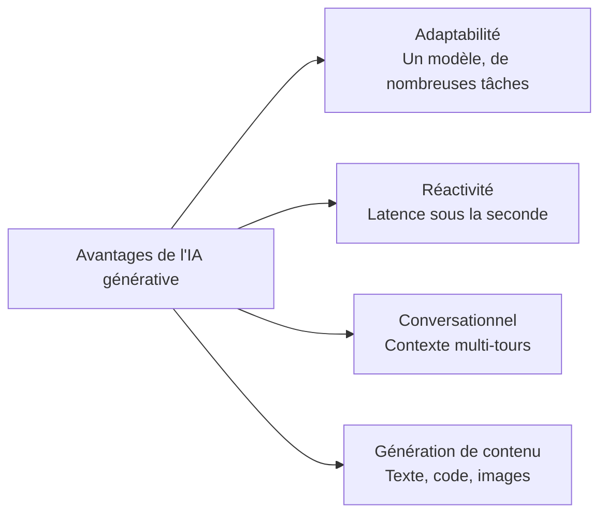
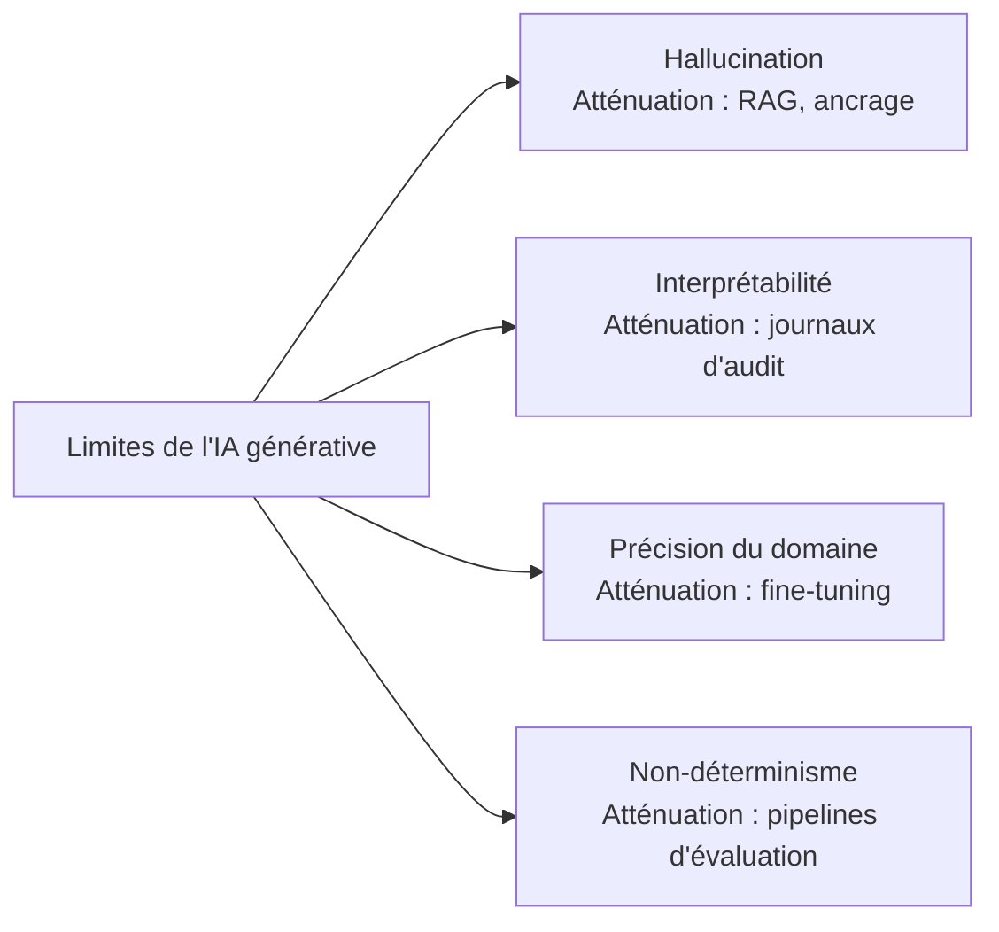
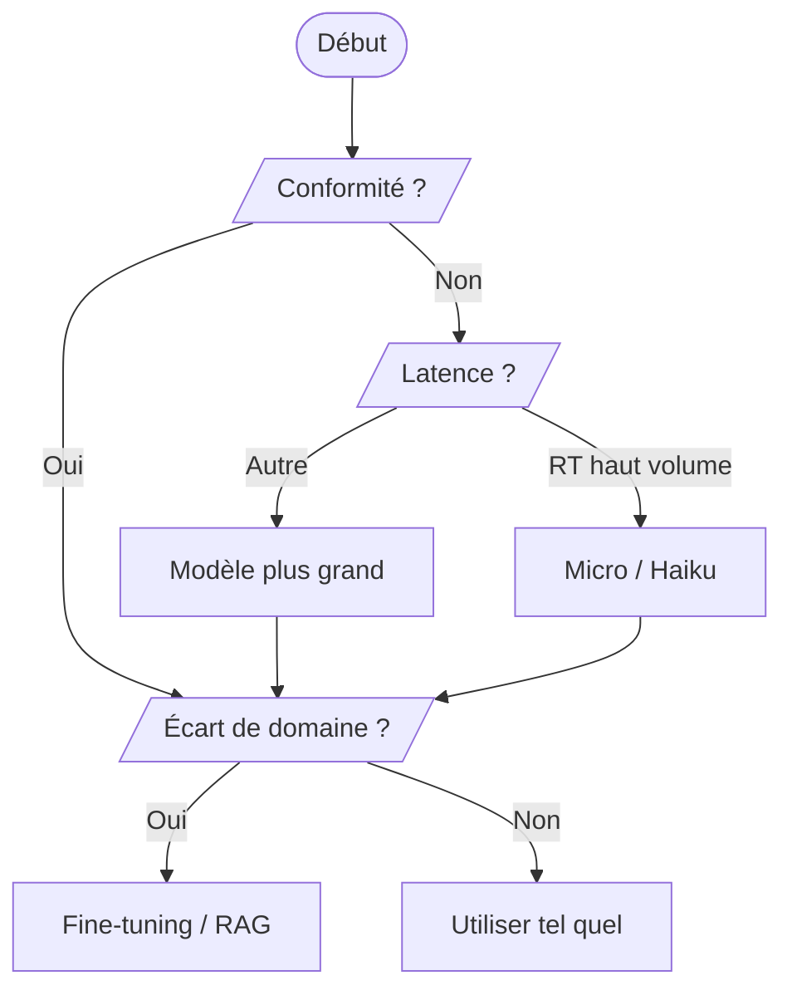
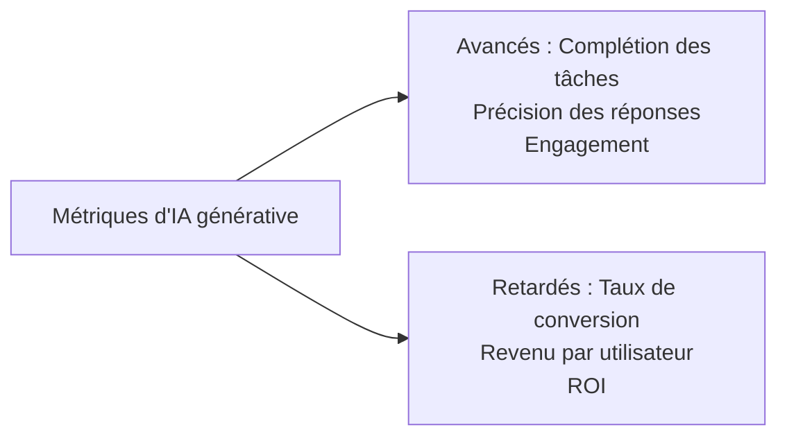

## Énoncé de tâche 2.2 : Comprendre les capacités et les limites de l'IA générative pour résoudre des problèmes métier

L'IA générative peut produire du contenu, tenir des conversations prolongées et s'adapter à des tâches que les systèmes d'apprentissage automatique classiques ne peuvent pas gérer sans un réentraînement complet. En même temps, elle hallucine avec assurance, modifie sa réponse entre les exécutions et produit parfois des absurdités confiantes dans des domaines spécialisés peu représentés dans ses données d'entraînement. Les professionnels métier capables d'articuler les deux faces de cette équation sont ceux qui prennent des décisions judicieuses quant au moment où s'engager dans un projet d'IA générative, quand ajouter des protections, et quand utiliser un outil différent. Cet énoncé de tâche couvre les avantages, les limites, les critères de sélection de modèles et les métriques nécessaires pour évaluer la valeur métier d'une application générative.[^202001]

### 2.2.1 Avantages de l'IA générative

Les modèles d'apprentissage automatique classiques sont construits pour une tâche unique : un modèle de détection de fraude détecte les fraudes, un modèle de prévision de la demande prédit la demande. Réentraîner chaque modèle pour une nouvelle tâche prend des mois d'étiquetage, d'entraînement et de validation. L'IA générative rompt cette contrainte. Un seul grand modèle de langage peut rédiger des supports marketing le matin et résumer des documents juridiques l'après-midi, sans aucun réentraînement, simplement en recevant une invite différente. Ce changement a des conséquences pratiques sur la façon dont les organisations constituent leurs équipes de projets IA et sur la rapidité avec laquelle elles peuvent répondre aux nouvelles exigences métier.

L'examen liste quatre avantages fondamentaux de l'IA générative : l'adaptabilité, la réactivité, les capacités conversationnelles et la capacité à générer du contenu. Chacun répond à une limitation différente des systèmes IA antérieurs, et chacun se traduit par un bénéfice métier concret.

*Figure 2.2.1 : Quatre avantages fondamentaux de l'IA générative. Chaque avantage correspond à une limitation de l'apprentissage automatique classique que les modèles génératifs surmontent.*

**L'adaptabilité** est la capacité d'un seul modèle de fondation à gérer une grande variété de tâches sans réentraînement. Un modèle entraîné sur un large corpus de texte peut rédiger des e-mails, classer des sentiments, extraire des entités nommées, générer des requêtes SQL et créer des descriptions de produits, tout cela uniquement par des changements d'invite. Par exemple, un détaillant peut utiliser un seul modèle **Amazon Bedrock** pour générer des descriptions de produits pour de nouvelles références le matin, traduire ces descriptions en français et en espagnol à midi, et résumer des avis clients le soir.[^202002] Les économies opérationnelles sont réelles : au lieu de maintenir un modèle spécialisé distinct pour chaque tâche, un seul point de terminaison d'API les gère toutes, et les compétences que les ingénieurs d'invite développent pour un cas d'usage se transfèrent directement à d'autres.

**La réactivité** désigne l'interaction conversationnelle à faible latence que permettent les modèles génératifs. Les pipelines d'apprentissage automatique par lots classiques sont optimisés pour le débit, non pour la vitesse ; ils traitent des milliers d'enregistrements mais peuvent prendre plusieurs minutes par exécution. Les API génératives, en revanche, retournent des jetons en mode flux en quelques centaines de millisecondes, une vitesse suffisante pour des expériences utilisateur interactives.[^202003] Une application de service client qui nécessitait autrefois qu'un agent humain recherche des informations peut désormais répondre à une question en moins d'une seconde. Par exemple, une compagnie d'assurance déployant un chatbot d'information sur les polices alimenté par Amazon Bedrock peut retourner une réponse complète à une question de couverture à peu près dans le même temps qu'il faudrait à un humain pour taper une réponse, sans intervention humaine.

**Les capacités conversationnelles** représentent la capacité des modèles génératifs à maintenir le contexte sur plusieurs tours de dialogue. Contrairement à un chatbot basé sur des règles qui oublie le message précédent après chaque réponse, un grand modèle de langage moderne conserve l'intégralité de l'historique de conversation dans sa *fenêtre de contexte* et peut y faire référence naturellement.[^202004] Un utilisateur peut demander « Quelle est la politique de remboursement ? » puis « Et si je l'avais acheté en solde ? » et le modèle comprend que « il » se réfère au produit mentionné auparavant. Cette cohérence multi-tours permet des assistants de support, des assistants commerciaux et des outils de connaissance internes qui semblent naturels à utiliser. Par exemple, une banque peut déployer un assistant multi-tours de demande de prêt qui collecte le type d'emploi, l'objet du prêt et la fourchette de revenus du demandeur sur plusieurs tours conversationnels avant de présenter les produits éligibles, un schéma d'interaction qui nécessiterait une gestion d'état complexe dans un moteur de règles traditionnel.

**La capacité à générer du contenu** signifie que les modèles génératifs produisent des sorties nouvelles plutôt que de simplement classer ou récupérer du contenu existant. Ils peuvent rédiger un brouillon d'article de blog, générer une fonction Python à partir d'une description, synthétiser une image de produit photoréaliste ou composer un e-mail client adapté à un identifiant de commande et un sentiment spécifiques.[^202005] Cette propriété générative est ce qui distingue les modèles de fondation des systèmes de récupération. Un moteur de recherche récupère des documents qui existent déjà ; un modèle génératif en compose un nouveau. Par exemple, une société pharmaceutique peut générer un premier brouillon d'un rapport de résumé d'essai clinique à partir de données d'essai structurées, laissant les rédacteurs médicaux se concentrer sur la révision et l'affinement plutôt que sur la composition initiale.

### 2.2.2 Inconvénients des solutions d'IA générative

Chaque avantage de l'IA générative s'accompagne d'une limitation qui doit être comprise avant de déployer un système auprès de vrais utilisateurs. L'examen identifie spécifiquement quatre inconvénients : les hallucinations, les problèmes d'interprétabilité, l'inexactitude dans les domaines spécialisés et le non-déterminisme. Aucun d'eux n'est une raison d'éviter l'IA générative, mais chacun est une raison d'intégrer des mesures d'atténuation dans toute application en production.

*Figure 2.2.2 : Quatre limites fondamentales de l'IA générative et l'approche d'atténuation pour chacune. Reconnaître la limitation mène directement au choix du contrôle approprié.*

**Les hallucinations** sont le phénomène par lequel un modèle génératif produit des sorties fluides et grammaticalement correctes mais factuellement erronées, fabriquées ou sans ancrage dans aucun document source.[^202006] Le modèle ne sait pas qu'il ne sait pas ; il génère la continuation statistiquement la plus probable de l'invite, qui peut inclure des noms inventés, de fausses statistiques ou des citations inexistantes. Par exemple, un outil de recherche juridique utilisant un modèle génératif brut peut produire une citation à une affaire qui n'existe pas, formulée avec le même ton assuré qu'une vraie citation. L'atténuation principale est la *génération augmentée par récupération* (RAG), un schéma dans lequel le modèle est tenu de répondre à partir de documents récupérés plutôt que de la mémoire paramétrique.[^202007] Amazon Bedrock Knowledge Bases implémente ce schéma en récupérant les fragments pertinents d'un magasin de données connecté avant que le modèle ne génère une réponse, ancrant la sortie dans des documents vérifiables. Les contrôles supplémentaires incluent **Amazon Bedrock Guardrails**, dont la vérification d'ancrage contextuel peut détecter et bloquer les réponses non soutenues par les documents sources récupérés.[^202008]

**Les problèmes d'interprétabilité** surviennent parce que les grands modèles de langage sont opaques. Il n'existe pas de moyen simple de retracer quels exemples d'entraînement ont causé une sortie particulière, ni d'expliquer en termes humains pourquoi le modèle a choisi un mot plutôt qu'un autre.[^202009] Cette opacité crée des problèmes dans les secteurs réglementés. Le système de décision de crédit d'une banque doit fournir une raison d'action défavorable lorsqu'il refuse un prêt ; un modèle génératif boîte noire ne peut pas fournir cette explication sous la forme structurée qu'exigent les régulateurs. L'atténuation consiste à réserver l'IA générative aux tâches où l'interprétabilité n'est pas une obligation réglementaire, ou à ajouter une couche de raisonnement qui force le modèle à citer ses sources. **Amazon SageMaker AI** et l'ensemble des outils d'explicabilité d'AWS peuvent exposer les pondérations d'attention et les attributions au niveau des jetons, mais ceux-ci restent des approximations imparfaites plutôt que de véritables explications causales.[^202010]

**L'inexactitude dans les domaines spécialisés sans ancrage** est une limitation distincte de l'hallucination. Un modèle peut rappeler correctement des faits généraux sur la cardiologie mais échouer sur des questions spécifiques aux protocoles cliniques d'un hôpital, aux règles de codage des assurances ou aux interactions médicamenteuses propriétaires, car ces documents n'étaient jamais dans son corpus d'entraînement.[^202011] L'atténuation est soit le fine-tuning (ajustement des poids du modèle sur des données spécifiques au domaine), soit la RAG avec une base de connaissances de domaine organisée. Le fine-tuning via les API de personnalisation d'Amazon Bedrock peut combler les lacunes de précision pour des tâches étroitement définies, tandis qu'une base de connaissances bien structurée gère la récupération d'informations plus large sans le coût et le temps d'un réentraînement.[^202012]

**Le non-déterminisme** signifie que le modèle peut produire une réponse différente chaque fois qu'il reçoit la même invite, même si toutes les autres conditions sont maintenues constantes. Cette propriété émerge du processus d'échantillonnage dans la plupart des modèles génératifs : le modèle sélectionne le prochain jeton de manière probabiliste plutôt que déterministe, de sorte que deux exécutions peuvent diverger après seulement quelques jetons.[^202013] Par exemple, un modèle invité à résumer la même réclamation client deux fois peut produire une réponse mettant l'accent sur le délai de livraison et une deuxième mettant l'accent sur la qualité du produit, toutes deux valides mais non identiques. Le paramètre *température* contrôle le degré d'aléatoire que le modèle applique lors de l'échantillonnage ; une température plus basse produit une sortie plus cohérente mais moins créative. L'atténuation du non-déterminisme est constituée de pipelines d'évaluation rigoureux qui comparent les sorties sur de nombreux échantillons et d'une révision humaine des cas limites avant le déploiement. Les capacités d'évaluation des modèles d'Amazon Bedrock prennent en charge le scoring automatisé sur des ensembles d'invites de test pour détecter une variance inattendue.[^202014]

*Tableau 2.2.1 : Inconvénients de l'IA générative, cause profonde, risque métier et atténuation principale*

| Inconvénient | Cause profonde | Risque métier | Atténuation principale |
|---|---|---|---|
| Hallucinations | Génération paramétrique sans ancrage | Fausses informations présentées comme des faits | RAG, Amazon Bedrock Guardrails |
| Interprétabilité | Poids de réseau neuronal opaques | Non-conformité réglementaire | Réserver aux tâches non réglementées ; journalisation d'audit |
| Inexactitude du domaine | Données de domaine manquantes dans le corpus d'entraînement | Réponses erronées dans les flux de travail spécialisés | Fine-tuning, bases de connaissances du domaine |
| Non-déterminisme | Échantillonnage probabiliste des jetons | Sortie incohérente pour les tâches de conformité | Pipelines d'évaluation, réglage de la température |

### 2.2.3 Facteurs de sélection des modèles d'IA générative

La sélection d'un modèle d'IA générative pour une application métier n'est pas principalement une décision technique ; c'est une décision de compromis. Différents modèles ont des performances différentes sur différentes tâches, supportent des structures de coûts différentes, prennent en charge des tailles de fenêtre de contexte différentes et s'accompagnent de postures de conformité différentes. L'examen vous demande de raisonner sur huit facteurs : les types de modèles, les exigences de performance, les capacités, les contraintes, la conformité, le coût, la latence et la complexité du modèle. La mise à jour v1.1 a explicitement ajouté le coût, la latence et la complexité du modèle à l'objectif, reflétant la réalité pratique que la plupart des décisions de production sont gouvernées autant par l'économie et la vitesse que par la précision des benchmarks.

**Amazon Bedrock** est le principal service AWS pour accéder aux modèles de fondation tiers et natifs d'Amazon via une API unifiée, sans gérer d'infrastructure.[^202015] Les modèles disponibles via Bedrock couvrent un large éventail de taille, de capacité et de coût, ce qui en fait le point d'ancrage naturel pour toute discussion sur la sélection de modèles.

*Tableau 2.2.2 : Exemples de modèles Amazon Bedrock par niveau de capacité et critères de sélection*

| Famille de modèles | Modèles représentatifs | Points forts | Latence typique | Coût relatif | Idéal pour |
|---|---|---|---|---|---|
| Amazon Nova | Nova Micro, Nova Lite, Nova Pro, Nova Premier | Performant sur les tâches natives AWS ; multilingue ; multimodal (Pro/Premier) | Micro : très faible ; Premier : modérée | Micro : le plus bas ; Premier : modéré | Tâches à haut volume et faible coût (Micro) ; applications d'entreprise multimodales (Premier) |
| Anthropic Claude | Claude Haiku 4.x, Sonnet 4.x, Opus 4.x | Grande fenêtre de contexte (200K standard, 1M avec en-tête bêta pour Opus et Sonnet) ; raisonnement ; suivi des instructions | Haiku : faible ; Opus : élevée | Haiku : faible ; Opus : élevé | Support client (Haiku) ; analyse complexe (Opus) |
| Meta Llama | Llama 4 Scout, Llama 4 Maverick | Poids ouverts ; personnalisable ; fenêtres de contexte étendues (selon la configuration sur Bedrock ; consulter les fiches du modèle) | Modérée | Faible à modéré | Fine-tuning personnalisé ; analyse de longs documents ; inférence sensible aux coûts |
| Mistral AI | Mistral 7B, Mixtral 8x7B | Mélange d'experts efficace ; tâches de code | Faible à modérée | Faible | Génération de code ; outils pour développeurs |

Les huit facteurs de l'objectif d'examen interagissent avec ce paysage de modèles comme suit :

**Les types de modèles** désignent l'architecture et la modalité du modèle. Les modèles textuels uniquement gèrent les tâches de langage ; les modèles multimodaux gèrent les combinaisons de texte, d'images, de vidéos et d'audio.[^202016] Une application de service client qui ne traite que du texte peut utiliser un modèle textuel plus léger et moins cher. Une application d'inspection de produits qui classifie des images avec des descriptions textuelles nécessite un modèle multimodal tel qu'Amazon Nova Pro.

**Les exigences de performance** couvrent les benchmarks de précision et de qualité qu'un cas d'usage exige. Un générateur de texte marketing peut tolérer une certaine variation de qualité. Un assistant de codage médical, en revanche, doit maintenir une haute précision car les erreurs de codage entraînent des refus de remboursement. Les scores de benchmark tels que MMLU (Massive Multitask Language Understanding) et HumanEval donnent un point de départ, mais le signal de performance le plus fiable est l'évaluation sur votre propre jeu de test spécifique à la tâche.[^202017]

**Les capacités** désignent les fonctionnalités spécifiques qu'un modèle doit posséder : utilisation d'outils (appel de fonctions), génération de code, sortie structurée (mode JSON) ou fenêtres de contexte étendues. Par exemple, une application qui doit appeler des API externes lors du raisonnement nécessite un modèle qui prend en charge l'appel de fonctions, que tous les modèles n'implémentent pas.[^202018]

**Les contraintes** couvrent les limitations organisationnelles, notamment les exigences de résidence des données, les listes de fournisseurs approuvés et les restrictions de taille de modèle pour le déploiement sur l'appareil. Les options d'inférence inter-régions et de débit provisionné d'Amazon Bedrock permettent aux architectes de travailler dans les contraintes de résidence des données tout en maintenant la disponibilité.[^202019]

**La conformité** couvre les exigences réglementaires et sectorielles. Les applications de santé régies par HIPAA doivent utiliser des modèles déployés dans une limite de service éligible HIPAA. Les applications financières peuvent faire face à des restrictions sur l'exportation des données qui excluent certains fournisseurs de modèles externes. Les services AWS avec prise en charge des accords d'association commerciale restreignent la liste des modèles éligibles pour les cas d'usage de santé.[^202020]

**Le coût** est de plus en plus le facteur décisif dans les déploiements matures. La tarification à la consommation de jetons signifie que le coût par inférence augmente avec la longueur du contexte : des invites système plus longues, des exemples few-shot et de grands fragments récupérés augmentent tous le nombre de jetons et donc la facture.[^202021] Amazon Nova Micro est conçu pour les tâches textuelles à haut volume et faible coût où l'accessibilité financière est la principale contrainte. Pour un million d'appels API par jour, la différence entre un modèle de niveau Micro et de niveau Premier peut représenter des dizaines de milliers de dollars par mois.

**La latence** détermine si un modèle est adapté aux applications interactives en temps réel. Un modèle qui nécessite deux secondes pour répondre est acceptable pour un pipeline de traitement de documents par lots mais inacceptable pour un widget de chat client en direct où les utilisateurs attendent des réponses en quelques centaines de millisecondes.[^202022] Amazon Nova Micro cible le niveau de latence le plus bas dans la famille Amazon Nova. Le débit provisionné dans Amazon Bedrock peut réduire la variance de latence pour les charges de travail de production sensibles à la latence.

**La complexité du modèle** désigne le nombre de paramètres, la profondeur de l'architecture et la taille de la fenêtre de contexte qu'un modèle peut tenir. Les modèles plus complexes ont généralement de meilleures performances sur les tâches nuancées, mais sont plus lents et plus chers par jeton.[^202023] Un modèle à 7 milliards de paramètres peut gérer un résumé simple de façon adéquate, tandis qu'un modèle à 200 milliards de paramètres peut être nécessaire pour un raisonnement en plusieurs étapes sur un document juridique de 100 000 jetons. Faire correspondre la complexité à la difficulté réelle de la tâche maintient les coûts gérables sans sacrifier la qualité.

*Figure 2.2.3 : Flux de décision pour la sélection de modèles d'IA générative. La conformité, la latence, le volume et les écarts de précision du domaine filtrent chacun l'ensemble des modèles viables en séquence ; le même flux s'applique que le modèle sous-jacent soit Amazon Nova, Anthropic Claude, Meta Llama ou Mistral.*

### 2.2.4 Valeur métier et métriques des applications d'IA générative

L'adoption de l'IA générative est un investissement métier, et chaque investissement doit être évalué par rapport à des résultats mesurables. L'objectif de l'examen liste sept métriques : la performance inter-domaines, le ROI, l'efficacité, le taux de conversion, le revenu moyen par utilisateur, la précision et la valeur vie client. Ces métriques se répartissent en deux groupes naturels. Les *indicateurs avancés* sont observables tôt dans un déploiement, souvent dans les premières semaines : taux de complétion des tâches, volume d'engagement, précision des réponses sur les jeux de test. Les *indicateurs retardés* prennent plus de temps à se matérialiser car ils dépendent du comportement client en aval : revenu par utilisateur, valeur vie client, taux de désabonnement. Un programme de mesure IA mature suit les deux, utilisant les indicateurs avancés pour affiner le système avant que les indicateurs retardés ne confirment l'impact métier.

*Figure 2.2.4 : Indicateurs avancés et retardés pour la valeur métier de l'IA générative. Les indicateurs avancés signalent l'état du système ; les indicateurs retardés confirment que l'état du système se traduit en résultats financiers.*

**La performance inter-domaines** mesure la qualité qu'un modèle génératif maintient lorsqu'il est appliqué à plusieurs fonctions métier.[^202024] Un modèle qui performe excellemment sur le service client mais mal sur les requêtes RH internes peut nécessiter des stratégies d'invite distinctes ou des variantes fine-tunées distinctes pour chaque domaine. Par exemple, une entreprise logistique testant un seul modèle de fondation sur le suivi des expéditions, l'assistance à la négociation avec les transporteurs et la documentation douanière constate que les scores de précision inter-domaines révèlent quels domaines nécessitent un ancrage supplémentaire avant le déploiement complet.

**Le ROI** (retour sur investissement) quantifie le retour financier sur le coût de construction et d'exploitation d'une application d'IA générative par rapport à la valeur qu'elle génère.[^202025] Le calcul compare les économies opérationnelles (moins d'agents humains, traitement plus rapide des documents, réduction des coûts de correction des erreurs) et les gains de revenus (conversion plus élevée, nouvelles capacités produit) aux coûts d'inférence du modèle, au travail de développement et aux frais généraux d'évaluation continue. Un assistant de centre de contact qui dévie 40 % des demandes de premier niveau vers l'automatisation produit un ROI mesurable à mesure que le taux de déviation monte en charge, car chaque appel dévié élimine une unité de coût de main-d'œuvre. Le ROI a été explicitement ajouté à l'objectif de l'examen dans la v1.1, reflétant que les parties prenantes métier doivent désormais évaluer les projets IA avec la même rigueur financière qu'elles appliquent à tout autre investissement technologique.

**L'efficacité** mesure combien plus vite ou moins cher un processus se déroule avec l'IA générative par rapport au niveau de référence.[^202026] Les métriques d'efficacité comprennent le temps par tâche (combien de temps il faut à un analyste pour compléter un résumé de recherche avec l'aide de l'IA par rapport à sans), le débit (combien de tickets de support le système traite par heure) et le coût par unité (le coût en jetons de la génération d'une description de produit par rapport au coût en main-d'œuvre d'un rédacteur produisant le même élément). Par exemple, un cabinet juridique qui utilise l'IA générative pour produire des premiers brouillons de résumés de contrats réduit le temps moyen d'un avocat consacré à chaque contrat de 45 minutes à 8 minutes, un ratio d'efficacité documenté qui justifie le coût de la plateforme.

**Le taux de conversion** mesure le pourcentage de prospects ou d'utilisateurs qui accomplissent une action souhaitée, comme finaliser un achat, soumettre une demande de prêt ou réserver un rendez-vous de service.[^202027] L'IA générative affecte la conversion en personnalisant le contenu que les utilisateurs voient aux points de décision clés. Un moteur de recommandation qui génère un contenu promotionnel personnalisé pour chaque visiteur, plutôt que d'afficher la même bannière à tout le monde, peut augmenter les taux de conversion de façon mesurable. Par exemple, une plateforme de commerce électronique qui utilise un modèle Amazon Bedrock pour générer des descriptions de produits dynamiques adaptées à l'historique de navigation d'un visiteur rapporte un taux d'ajout au panier plus élevé que le groupe de contrôle recevant des descriptions statiques.

**Le revenu moyen par utilisateur (ARPU)** mesure le revenu total divisé par le nombre d'utilisateurs actifs sur une période.[^202028] L'IA générative peut augmenter l'ARPU en faisant émerger des opportunités de vente incitative dans une conversation (un chatbot qui détecte qu'un utilisateur s'enquiert d'un produit de niveau basique et mentionne naturellement l'option premium), en réduisant l'abandon du service, ou en générant des offres personnalisées correspondant aux habitudes d'achat individuelles. Par exemple, un service de streaming utilisant l'IA générative pour personnaliser les recommandations de contenu et composer des campagnes d'e-mail spécifiques aux abonnés rapporte un ARPU plus élevé dans le groupe traitement par rapport au groupe de contrôle recevant des messages génériques.

**La précision** dans le contexte métier signifie la proportion des sorties d'IA générative qui sont suffisamment correctes et complètes pour être utilisées sans correction humaine.[^202029] La précision est mesurée par rapport à un jeu d'évaluation étiqueté spécifique à la tâche. Un modèle qui répond correctement à 95 des 100 questions de test a une précision de 95 % sur ce jeu de test. La précision est la métrique de qualité la plus directe pour les cas d'usage où les erreurs ont des coûts, tels que le codage médical, les rapports de conformité financière ou l'extraction automatisée de clauses juridiques. Les capacités d'évaluation des modèles d'Amazon Bedrock permettent aux équipes d'effectuer des évaluations de précision automatisées sur des ensembles de benchmarks spécifiques aux tâches avant et après les changements de modèle ou d'invite.[^202030]

**La valeur vie client** (VVC ou CLV) est le revenu net total qu'une entreprise attend d'une relation client sur sa durée.[^202031] L'IA générative affecte la VVC en améliorant la rétention (les clients qui reçoivent un meilleur support restent plus longtemps), en élargissant la portée des services qu'un client utilise (un assistant personnalisé fait émerger des produits que le client ne savait pas exister) et en réduisant le désabonnement par un engagement proactif. La VVC est un indicateur retardé ; il faut généralement des trimestres pour l'observer. Par exemple, une institution financière déployant un chatbot consultatif d'IA générative voit les métriques initiales de précision et d'engagement en quelques semaines, mais l'amélioration de la VVC ne devient visible qu'après six à douze mois lorsque la cohorte de clients assistés par l'IA affiche un taux d'attrition plus faible que le niveau de référence historique.

*Tableau 2.2.3 : Métriques métier de l'IA générative : type, approche de mesure et exemple métier*

| Métrique | Type d'indicateur | Comment elle est mesurée | Exemple métier |
|---|---|---|---|
| Performance inter-domaines | Avancé | Score de précision par domaine sur des jeux de test mis de côté | Modèle logistique testé sur trois domaines fonctionnels avant le déploiement |
| ROI | Retardé | (Économies de coûts + gain de revenus) / investissement total | Taux de déviation du centre de contact multiplié par le coût moyen de main-d'œuvre par ticket |
| Efficacité | Avancé | Temps par tâche ou coût par unité avant et après l'IA | Temps de résumé de contrat réduit de 45 à 8 minutes |
| Taux de conversion | Retardé | Actions complétées / total des opportunités | Taux d'ajout au panier plus élevé pour les descriptions générées par l'IA par rapport aux descriptions statiques |
| Revenu moyen par utilisateur | Retardé | Revenu total / utilisateurs actifs par période | Augmentation de l'ARPU du service de streaming grâce aux campagnes personnalisées |
| Précision | Avancé | Sorties correctes / total des sorties sur le jeu d'évaluation | 95 % de précision sur un benchmark de 100 questions de codage |
| Valeur vie client | Retardé | Revenu net projeté sur la durée de la relation | Attrition plus faible dans la cohorte assistée par l'IA après 12 mois |

Un programme de mesure pratique n'attend pas les indicateurs retardés avant d'agir. La séquence est : déployer avec les indicateurs avancés instrumentés dès le premier jour, affiner le modèle et les invites jusqu'à ce que les indicateurs avancés atteignent leur cible, puis attendre que les indicateurs retardés confirment que l'amélioration opérationnelle se traduit en valeur financière. Les métriques **Amazon CloudWatch** et les tableaux de bord personnalisés dans AWS peuvent suivre la latence d'inférence, les taux d'erreur et les comptages d'invocations de modèles comme indicateurs avancés opérationnels, tandis que les outils de business intelligence suivent les métriques de revenus et de rétention en aval.[^202032]

---

## Questions de contrôle

**Question 1**

Une entreprise de vente au détail déploie un générateur de descriptions de produits par IA générative. Lors de la révision de la qualité, l'équipe constate que le modèle invente parfois des attributs nutritionnels pour des produits alimentaires qui ne sont pas listés dans les données source. Quel inconvénient de l'IA générative décrit le MIEUX ce comportement, et quelle atténuation l'équipe devrait-elle implémenter EN PREMIER ?

A. Non-déterminisme ; abaisser la température du modèle pour réduire la variance de sortie.
B. Hallucination ; implémenter la génération augmentée par récupération pour ancrer les réponses dans le catalogue produits.
C. Interprétabilité ; ajouter la journalisation d'audit afin que les réviseurs puissent retracer quelles données d'entraînement ont influencé la réponse.
D. Inexactitude du domaine ; affiner le modèle sur un jeu de données de produits alimentaires organisé.

L'hallucination est le phénomène par lequel un modèle génératif produit une sortie fluide et assurée qui n'est pas ancrée dans du matériel source factuel. Le processus de prédiction du jeton suivant statistiquement par le modèle peut produire des faits nutritionnels plausibles qui n'apparaissent nulle part dans le catalogue produits. Cela se distingue de l'inexactitude du domaine (qui concerne un manque de connaissances spécialisées dans le corpus d'entraînement) car le modèle n'est pas simplement mal informé ; il invente activement du contenu. La réduction de la température (réponse A) réduit la variance dans le style de sortie mais n'empêche pas le modèle de fabriquer des faits. Les outils d'interprétabilité (réponse C) aident à retracer les sorties mais n'arrêtent pas les hallucinations. Le fine-tuning (réponse D) ajuste les poids du modèle et peut aider avec l'inexactitude du domaine, mais pour un problème d'ancrage factuel spécifique à un catalogue, la RAG est plus rapide à implémenter et plus ciblée : le modèle est contraint de générer des réponses à partir des enregistrements de produits récupérés plutôt qu'à partir de la mémoire paramétrique. Amazon Bedrock Knowledge Bases fournit une implémentation RAG gérée qui connecte le modèle à un catalogue produits consultable, garantissant que chaque attribut dans la description générée peut être retracé vers un document source.[^202033]

**Question 2**

Une entreprise choisit entre Amazon Nova Micro et Amazon Nova Premier pour un chatbot de support client à haut volume qui doit répondre dans un délai de 500 millisecondes et traiter environ deux millions d'interactions par jour. Quel facteur guide le PLUS directement la recommandation d'utiliser Nova Micro plutôt que Nova Premier pour cette charge de travail ?

A. Les exigences de conformité restreignent l'utilisation de modèles plus grands dans les applications orientées client.
B. Nova Premier a une fenêtre de contexte plus petite et ne peut pas maintenir l'historique de conversation multi-tours.
C. La latence et le coût font de Nova Micro le choix approprié pour les charges de travail à haut volume, sensibles à la latence et aux coûts.
D. Nova Micro prend en charge les entrées multimodales, ce qui le rend plus adapté aux applications de chat.

La question décrit une charge de travail où deux contraintes sont prééminentes : un plafond de latence de 500 millisecondes et un volume de deux millions d'interactions quotidiennes. Les deux contraintes pointent dans la même direction. Nova Micro est positionné comme le niveau de latence la plus faible et de coût le plus bas dans la famille Amazon Nova, conçu précisément pour les tâches à haut volume où l'accessibilité financière et la vitesse sont les principales exigences. Nova Premier est la capacité la plus grande mais aussi la plus coûteuse et la plus latente de la famille, appropriée pour des tâches de raisonnement complexes en plusieurs étapes plutôt que pour un support conversationnel à haut volume. La réponse A introduit une justification de conformité qui n'est pas indiquée dans le scénario. La réponse B est factuellement incorrecte sur les deux points : Nova Premier a une fenêtre de contexte plus grande que Nova Micro, et tout modèle Bedrock peut maintenir l'historique de conversation multi-tours jusqu'à sa limite de fenêtre de contexte, donc la capacité conversationnelle n'est pas limitée par le niveau. La réponse D est incorrecte car les entrées multimodales sont une capacité de Nova Pro et Nova Premier, non de Nova Micro. La bonne réponse est C : l'exigence de latence (moins de 500 ms) et le volume (deux millions d'appels par jour) font du coût et de la latence les facteurs dominants de sélection de modèle, et Nova Micro est le niveau conçu pour cette combinaison.[^202034]

**Question 3**

Une équipe IA d'entreprise présente un dossier métier pour une solution de traitement de documents par IA générative. Le directeur financier demande comment l'équipe va démontrer la valeur financière dans les 90 premiers jours du déploiement. Quelle métrique est la PLUS appropriée pour démontrer un impact financier précoce ?

A. La valeur vie client, mesurée comme le changement de VVC projetée pour la cohorte d'utilisateurs.
B. L'efficacité, mesurée comme le temps par document et le coût par document par rapport au niveau de référence manuel.
C. Le taux de conversion, mesuré comme le pourcentage de documents qui déclenchent une vente de suivi.
D. Le revenu moyen par utilisateur, mesuré sur le premier cycle de facturation après le déploiement.

La valeur vie client et le revenu moyen par utilisateur sont des indicateurs retardés qui nécessitent généralement des mois à des trimestres d'observation avant qu'un changement statistiquement significatif soit visible. Dans les 90 premiers jours, ni l'une ni l'autre métrique n'aura accumulé suffisamment de données pour démontrer une conclusion défendable. Le taux de conversion est une métrique plausible pour une application orientée vente, mais le traitement de documents est un flux de travail opérationnel interne, non un entonnoir de vente orienté client, ce qui rend le taux de conversion inadapté. L'efficacité est la métrique naturelle sur 90 jours pour un projet d'automatisation opérationnelle : l'équipe peut mesurer le temps nécessaire aux analystes pour traiter un document avant que le système IA ne soit en place, mesurer la même tâche avec l'assistance de l'IA, et calculer les économies de temps et de coût de main-d'œuvre immédiatement après la mise en service. Le directeur financier reçoit un chiffre concret (par exemple, « le temps moyen de traitement des documents est passé de 42 minutes à 9 minutes, économisant environ 330 heures d'analyste par semaine au volume de documents actuel ») qui se traduit directement en dollars sans nécessiter de données longitudinales sur les clients.[^202035]

**Question 4**

Une société de technologie de santé évalue des modèles d'IA générative pour un assistant de documentation clinique. La solution doit fonctionner dans une limite de service éligible HIPAA et doit citer la phrase source du dossier patient pour chaque affirmation qu'elle fait dans un résumé généré. Quels DEUX facteurs de sélection de modèles sont les PLUS pertinents pour cette évaluation ?

A. La complexité du modèle et le taux de conversion.
B. La conformité et les capacités.
C. La latence et le revenu moyen par utilisateur.
D. Le coût et la performance inter-domaines.

Le scénario présente deux exigences distinctes. La première est réglementaire : la solution doit opérer dans des limites éligibles HIPAA, ce qui est un facteur de conformité qui limite directement l'ensemble des modèles et configurations de déploiement éligibles. Tous les modèles disponibles via Amazon Bedrock ne sont pas accessibles dans une configuration éligible HIPAA, donc la conformité est un critère de seuil qui doit être résolu avant tout autre facteur. La deuxième exigence est que le modèle doit citer les phrases sources, ce qui est une exigence de capacité : le modèle doit prendre en charge un mécanisme de citation ou d'attribution de source, soit nativement via la sortie structurée, soit via une architecture RAG qui retourne des références sources avec le texte généré. Le taux de conversion (réponse A) et le revenu moyen par utilisateur (réponse C) sont des métriques de résultats métier, non des critères de sélection de modèles. Le coût et la performance inter-domaines (réponse D) comptent dans tout déploiement mais ne sont pas les facteurs les PLUS pertinents étant donné les exigences HIPAA et de citation explicitement indiquées dans le scénario. La bonne réponse est B.[^202036]

**Question 5**

Une équipe produit déploie un assistant IA génératif et constate que la même question de support reçoit parfois une réponse mettant l'accent sur un chemin de résolution et parfois un chemin différent, même si les deux réponses sont techniquement correctes. L'équipe souhaite comprendre quelle propriété de l'IA générative explique le MIEUX ce comportement avant de décider d'une atténuation.

A. Hallucination, parce que le modèle génère du contenu qui n'apparaît pas dans la base de connaissances.
B. Problèmes d'interprétabilité, parce que le modèle ne peut pas expliquer pourquoi il a choisi un chemin de résolution plutôt qu'un autre.
C. Non-déterminisme, parce que le modèle échantillonne de manière probabiliste à partir d'une distribution des jetons suivants les plus probables à chaque étape.
D. Inexactitude du domaine, parce que le modèle n'a pas été entraîné sur les scénarios de support spécifiques.

Le scénario décrit une situation où les deux sorties sont techniquement correctes mais différentes. C'est la caractéristique déterminante du non-déterminisme : le processus d'échantillonnage du modèle introduit une variabilité entre les exécutions même lorsque les deux sorties sont valides. L'hallucination (réponse A) implique que le modèle génère du contenu factuellement incorrect ; le scénario indique explicitement que les deux réponses sont correctes. L'interprétabilité (réponse B) concerne l'incapacité à expliquer les décisions du modèle, non la variabilité des sorties entre les exécutions. L'inexactitude du domaine (réponse D) se manifesterait par des réponses incorrectes ou incomplètes, non par deux réponses correctes différentes. L'atténuation du non-déterminisme dans un contexte de support dépend des exigences métier. Si la cohérence est obligatoire (par exemple, dans des conseils financiers réglementés), l'équipe peut abaisser le paramètre de température pour réduire la variance d'échantillonnage et peut ajouter un pipeline d'évaluation qui signale les invites à forte variance pour révision humaine. La journalisation d'invocation de modèle d'Amazon Bedrock capture chaque requête et réponse, ce qui permet à l'équipe d'auditer la variance entre les exécutions et d'identifier quels types de questions produisent les sorties les plus divergentes.[^202037]

---

[^202001]: AWS Certification Exam Guide AIF-C01 v1.1, Task Statement 2.2. URL: <https://docs.aws.amazon.com/aws-certification/latest/ai-practitioner-01/ai-practitioner-01-domain2.html>
[^202002]: Amazon Bedrock User Guide: Supported foundation models. URL: <https://docs.aws.amazon.com/bedrock/latest/userguide/models-supported.html>
[^202003]: Amazon Bedrock User Guide: Invoke a model to run inference. URL: <https://docs.aws.amazon.com/bedrock/latest/userguide/inference.html>
[^202004]: Amazon Bedrock User Guide: Conversation history and context windows. URL: <https://docs.aws.amazon.com/bedrock/latest/userguide/conversation-inference.html>
[^202005]: Amazon Bedrock User Guide: Content generation with foundation models. URL: <https://docs.aws.amazon.com/bedrock/latest/userguide/what-is-bedrock.html>
[^202006]: NIST AI 600-1: Artificial Intelligence Risk Management Framework: Generative AI. URL: <https://nvlpubs.nist.gov/nistpubs/ai/nist.ai.600-1.pdf>
[^202007]: Amazon Bedrock User Guide: Knowledge Bases for Amazon Bedrock. URL: <https://docs.aws.amazon.com/bedrock/latest/userguide/knowledge-base.html>
[^202008]: Amazon Bedrock User Guide: Amazon Bedrock Guardrails. URL: <https://docs.aws.amazon.com/bedrock/latest/userguide/guardrails.html>
[^202009]: AWS Machine Learning Blog: Explainability in large language models. URL: <https://aws.amazon.com/blogs/machine-learning/>
[^202010]: Amazon SageMaker AI Developer Guide: Amazon SageMaker Clarify. URL: <https://docs.aws.amazon.com/sagemaker/latest/dg/clarify-model-explainability.html>
[^202011]: Amazon Bedrock User Guide: Custom model fine-tuning. URL: <https://docs.aws.amazon.com/bedrock/latest/userguide/custom-models.html>
[^202012]: Amazon Bedrock User Guide: Fine-tuning and continued pre-training. URL: <https://docs.aws.amazon.com/bedrock/latest/userguide/custom-models.html>
[^202013]: Hugging Face Documentation: Text generation and sampling strategies. URL: <https://huggingface.co/docs/transformers/generation_strategies>
[^202014]: Amazon Bedrock User Guide: Model evaluation in Amazon Bedrock. URL: <https://docs.aws.amazon.com/bedrock/latest/userguide/model-evaluation.html>
[^202015]: Amazon Bedrock User Guide: What is Amazon Bedrock? URL: <https://docs.aws.amazon.com/bedrock/latest/userguide/what-is-bedrock.html>
[^202016]: Amazon Nova User Guide: Amazon Nova model capabilities. URL: <https://docs.aws.amazon.com/nova/latest/userguide/what-is-nova.html>
[^202017]: Papers With Code: MMLU Benchmark. URL: <https://paperswithcode.com/dataset/mmlu>
[^202018]: Amazon Bedrock User Guide: Tool use (function calling) with Amazon Bedrock. URL: <https://docs.aws.amazon.com/bedrock/latest/userguide/tool-use.html>
[^202019]: Amazon Bedrock User Guide: Cross-region inference. URL: <https://docs.aws.amazon.com/bedrock/latest/userguide/inference-profiles-cross-region.html>
[^202020]: AWS Compliance: HIPAA Eligible Services. URL: <https://aws.amazon.com/compliance/hipaa-eligible-services-reference/>
[^202021]: Amazon Bedrock Pricing. URL: <https://aws.amazon.com/bedrock/pricing/>
[^202022]: Amazon Bedrock User Guide: Provisioned throughput. URL: <https://docs.aws.amazon.com/bedrock/latest/userguide/prov-throughput.html>
[^202023]: Amazon Nova User Guide: Choosing the right Amazon Nova model. URL: <https://docs.aws.amazon.com/nova/latest/userguide/nova-pro-overview.html>
[^202024]: AWS Well-Architected Framework: Machine Learning Lens: Performance pillar. URL: <https://docs.aws.amazon.com/wellarchitected/latest/machine-learning-lens/performance-pillar.html>
[^202025]: AWS Executive Insights: Measuring ROI for generative AI. URL: <https://aws.amazon.com/executive-insights/content/calculating-roi-of-generative-ai/>
[^202026]: McKinsey Global Institute: The economic potential of generative AI. URL: <https://www.mckinsey.com/capabilities/mckinsey-digital/our-insights/the-economic-potential-of-generative-ai>
[^202027]: Amazon Personalize Developer Guide: Measuring recommendation effectiveness. URL: <https://docs.aws.amazon.com/personalize/latest/dg/getting-started.html>
[^202028]: AWS Retail Competency: AI-driven personalization and ARPU. URL: <https://aws.amazon.com/retail/>
[^202029]: Amazon Bedrock User Guide: Evaluate model accuracy with model evaluations. URL: <https://docs.aws.amazon.com/bedrock/latest/userguide/model-evaluation.html>
[^202030]: Amazon Bedrock User Guide: Automated model evaluation jobs. URL: <https://docs.aws.amazon.com/bedrock/latest/userguide/model-evaluation-jobs.html>
[^202031]: AWS Customer Experience: Improving customer lifetime value with AI. URL: <https://aws.amazon.com/customer-engagement/>
[^202032]: Amazon CloudWatch User Guide: Metrics, alarms, and dashboards. URL: <https://docs.aws.amazon.com/AmazonCloudWatch/latest/monitoring/working_with_metrics.html>
[^202033]: Amazon Bedrock User Guide: Retrieval Augmented Generation with Knowledge Bases. URL: <https://docs.aws.amazon.com/bedrock/latest/userguide/knowledge-base-overview.html>
[^202034]: Amazon Nova User Guide: Amazon Nova Micro model overview. URL: <https://docs.aws.amazon.com/nova/latest/userguide/nova-micro-overview.html>
[^202035]: AWS Well-Architected Framework: Operational Excellence pillar: measuring improvement. URL: <https://docs.aws.amazon.com/wellarchitected/latest/operational-excellence-pillar/welcome.html>
[^202036]: AWS Compliance: HIPAA and Health Information Portability. URL: <https://aws.amazon.com/compliance/hipaa-compliance/>
[^202037]: Amazon Bedrock User Guide: Model invocation logging. URL: <https://docs.aws.amazon.com/bedrock/latest/userguide/model-invocation-logging.html>
