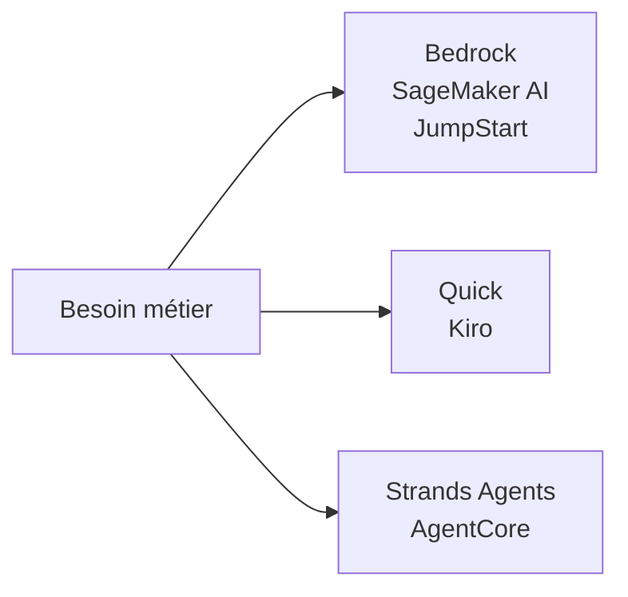
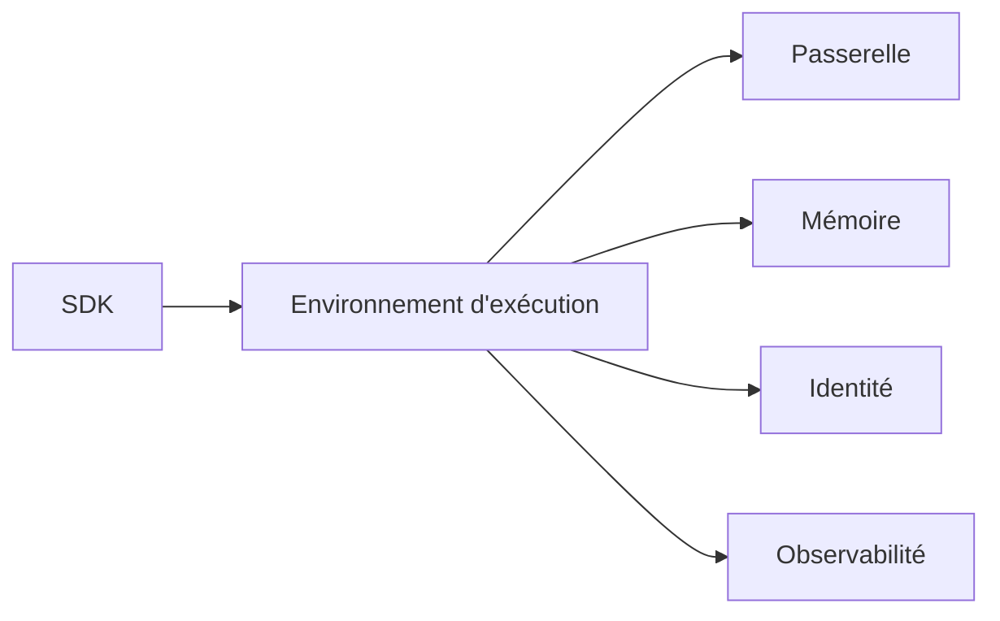
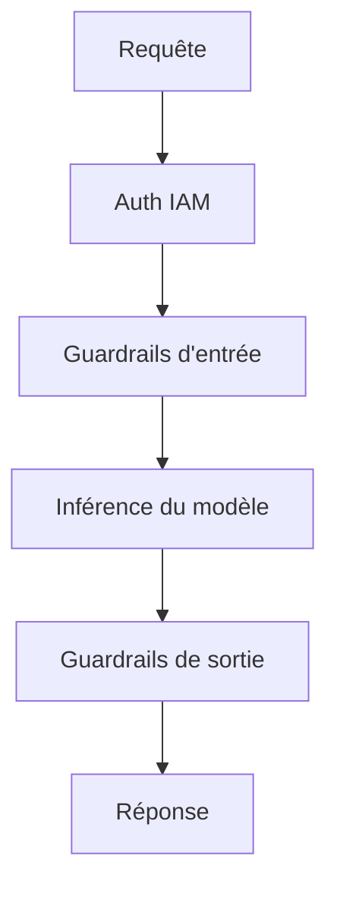
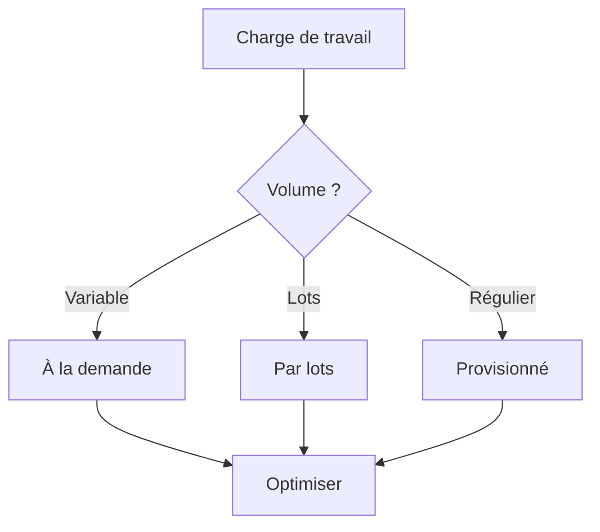
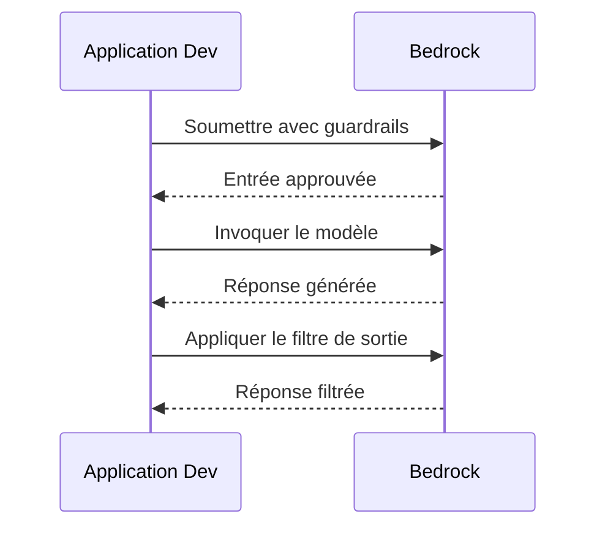

## Énoncé de tâche 2.3 : Décrire l'infrastructure et les technologies AWS pour la création d'applications d'IA générative

La construction d'une application d'IA générative sur AWS nécessite de choisir parmi un ensemble croissant de services gérés et d'outils pour développeurs, chacun ciblant un point différent du spectre de développement. La tâche 2.3 couvre quatre objectifs : les services AWS nommés dans le guide d'examen v1.1, les avantages de leur utilisation, les propriétés de sécurité et de conformité qu'ils héritent d'AWS, et les décisions de coûts auxquelles les équipes font face en production.[^203001]

*Figure 2.3.1 : Trois points d'entrée pour les travaux d'IA générative sur AWS. La famille Bedrock et SageMaker couvre les API de modèles gérés et l'entraînement personnalisé, Quick et Kiro couvrent les assistants métier et développeurs, et Strands Agents et AgentCore couvrent les frameworks et environnements d'exécution agentiques.*

Les services de cet énoncé de tâche ne se font pas concurrence sur une seule dimension. Une équipe peut utiliser **Amazon Bedrock** comme API de modèle, déployer cette application via **Amazon Bedrock AgentCore**, automatiser les travaux de développement dans **Kiro** et interroger des données métier via **Amazon Quick**, tout cela au sein du même projet. Les sections qui suivent expliquent chaque service, les avantages combinés de l'utilisation de la plateforme AWS, l'infrastructure de sécurité et de conformité sous-jacente, et la mécanique de tarification qui détermine le coût total de possession.

### 2.3.1 Services et fonctionnalités AWS pour les applications d'IA générative

Le guide d'examen AWS v1.1 nomme sept services et familles d'outils pour la création d'applications d'IA générative : Amazon Bedrock, Amazon SageMaker AI, Amazon SageMaker JumpStart, Amazon Quick, Kiro, Strands Agents et Amazon Bedrock AgentCore.[^203002] Chacun occupe une niche spécifique, et comprendre où chacun s'inscrit évite à la fois la sur-ingénierie et le sous-investissement dans les capacités de la plateforme.

**Amazon Bedrock** est un service entièrement géré qui fournit un accès API à un catalogue organisé de modèles de fondation provenant de plusieurs fournisseurs, sans avoir à provisionner ni à gérer d'infrastructure GPU.[^203003] Une équipe appelle un seul point de terminaison, spécifie l'identifiant du modèle et reçoit une réponse générée facturée à la consommation de jetons. L'infrastructure sous-jacente, les poids du modèle et la logique de mise à l'échelle sont entièrement invisibles pour l'appelant.

Le catalogue de modèles disponible via Amazon Bedrock couvre les propres modèles d'Amazon, des laboratoires de recherche tiers et des options à poids ouverts :

- Les modèles **Amazon Nova** (Nova Micro, Nova Lite, Nova Pro, Nova Premier) constituent la propre série d'Amazon, allant d'un niveau textuel uniquement à faible latence jusqu'à un modèle phare multimodal capable de traiter des images, des vidéos et des documents.[^203004]
- **Anthropic Claude** (la génération Claude 4.x : Haiku 4.x, Sonnet 4.x, Opus 4.x) excelle dans le raisonnement, la sortie structurée et l'analyse à long contexte. Claude Opus et Sonnet prennent en charge des fenêtres de contexte de 200 000 jetons par défaut et un million de jetons avec l'en-tête bêta 1M-context.[^203005]
- Les modèles **Meta Llama** sont des grands modèles de langage à poids ouverts adaptés aux tâches de génération de texte, de codage et de dialogue.[^203006]
- Les modèles **Mistral AI**, dont Mixtral, sont performants dans le suivi d'instructions et les tâches multilingues avec une consommation efficace de jetons.[^203007]
- **AI21 Labs Jamba** cible la génération de texte d'entreprise et le traitement de contextes longs.[^203008]
- Les modèles **Cohere Command** sont optimisés pour la récupération, la classification et la recherche d'entreprise.[^203009]
- Les modèles **Stability AI** gèrent les tâches de génération d'images et multimodales.[^203010]

Au-delà de l'accès brut aux modèles, Amazon Bedrock regroupe un ensemble de capacités pour créer des applications de qualité production. **Knowledge Bases for Amazon Bedrock** gère l'intégralité du pipeline de *génération augmentée par récupération* (RAG) : ingestion de documents depuis Amazon S3 ou d'autres sources, découpage en fragments, génération d'embeddings vectoriels, stockage dans un magasin vectoriel géré et récupération des fragments pertinents au moment de l'inférence.[^203011] **Amazon Bedrock Guardrails** applique des politiques de contenu configurables à la fois à l'invite d'entrée et à la sortie du modèle, filtrant les catégories nuisibles, bloquant les sujets refusés, expurgeant les *informations personnellement identifiables* (PII) et effectuant des *vérifications d'ancrage contextuel* qui comparent les réponses au matériel source pour détecter les hallucinations.[^203012] **Amazon Bedrock Prompt Management** stocke, gère les versions et partage les modèles d'invite au sein d'une équipe afin que les mêmes invites optimisées soient utilisées de façon cohérente en production.[^203013] **Amazon Bedrock Model Evaluation** exécute des travaux de benchmarking automatisés et évalués par des humains qui scorent les réponses du modèle sur la précision, la robustesse, la toxicité et des métriques spécifiques aux tâches, permettant aux équipes de comparer les modèles avant d'en choisir un.[^203014] **Agents for Amazon Bedrock** coordonne des flux de travail agentiques en plusieurs étapes en permettant au modèle d'appeler des API externes, d'interroger des bases de connaissances et d'exécuter des fonctions AWS Lambda comme *outils* dans une seule session orchestrée.[^203015] **Amazon Bedrock Flows** fournit un concepteur de flux de travail visuel pour enchaîner des invites et des sous-agents en pipelines structurés sans écrire de code d'orchestration.[^203016]

**Amazon SageMaker AI** est la plateforme d'apprentissage automatique complète d'AWS pour les équipes qui ont besoin d'entraîner, de fine-tuner, d'évaluer et d'héberger leurs propres modèles.[^203017] Là où Amazon Bedrock abstrait entièrement le modèle, Amazon SageMaker AI expose l'intégralité de la pile d'entraînement et d'inférence. Une équipe de science des données utilise SageMaker AI pour exécuter des travaux d'entraînement distribués sur des clusters GPU, enregistrer les modèles dans le registre de modèles SageMaker, les déployer sur des points de terminaison d'inférence en temps réel et surveiller la dérive des données en production. Pour l'IA générative spécifiquement, SageMaker AI est le service de choix lorsqu'une équipe a besoin de fine-tuner un modèle de fondation à poids ouverts sur des données propriétaires à grande échelle, ou lorsque les exigences de latence ou de débit d'inférence nécessitent des déploiements de conteneurs personnalisés plutôt qu'un point de terminaison d'API partagé.

**Amazon SageMaker JumpStart** est une fonctionnalité de SageMaker AI qui accélère le point de départ en fournissant un catalogue de modèles pré-entraînés, de modèles de solutions et d'actions de déploiement en un clic.[^203018] Un praticien peut parcourir les modèles de Hugging Face, TII (la série Falcon) et d'autres fournisseurs, puis déployer un modèle choisi sur un point de terminaison SageMaker privé avec quelques clics ou un seul appel d'API, sans écrire de code d'entraînement. JumpStart comble le fossé entre la commodité d'Amazon Bedrock et la pleine flexibilité des déploiements SageMaker AI personnalisés : le modèle s'exécute dans l'infrastructure de votre compte, vous contrôlez le point de terminaison et vous pouvez affiner davantage si nécessaire.

**Amazon Quick** est la famille unifiée d'analytique et d'assistant IA pour les utilisateurs métier d'AWS. En 2025, AWS a rebaptisé Amazon QuickSight et les parties de Amazon Q orientées BI sous ce nom unique, avec migration des clients QuickSight existants vers le nouveau produit.[^203019] Les utilisateurs métier interagissent avec Amazon Quick via une interface en langage naturel pour interroger des entrepôts de données, générer des graphiques, écrire du SQL et résumer des rapports sans faire appel aux équipes d'ingénierie. Amazon Quick est structuré autour de quatre niveaux : Gratuit, Plus, Professionnel et Entreprise. Le niveau Entreprise s'intègre aux index Amazon Q Business, permettant à l'assistant de rechercher dans les bases de connaissances organisationnelles (SharePoint, Confluence, S3 et d'autres connecteurs) ainsi que dans les données tabulaires. Pour l'examen, Amazon Quick est la bonne réponse aux questions sur l'activation de la *BI en libre-service* augmentée par l'IA générative pour les utilisateurs métier, non les développeurs.

**Kiro** est l'environnement de développement logiciel alimenté par l'IA d'AWS, mis à disposition généralement en fin 2025.[^203020] Kiro est un fork de Code OSS (la base open source de Visual Studio Code) étendu avec un assistant IA agentique qui s'intègre directement dans le flux de travail d'édition. Il remplace Amazon Q Developer comme principal outil de développement assisté par l'IA dans l'écosystème IDE d'AWS. Kiro est disponible en quatre niveaux : Gratuit, Pro, Pro+ et Power, les niveaux supérieurs offrant davantage d'heures d'interaction agentique incluses et l'accès à des modèles sous-jacents plus performants. La fonctionnalité distinctive de Kiro est le *développement piloté par les spécifications*. Là où la plupart des assistants de codage IA suggèrent la ligne suivante au fur et à mesure de la frappe, le développement piloté par les spécifications demande au développeur de décrire d'abord l'ensemble de la fonctionnalité ; Kiro rédige ensuite un document de spécification structuré (exigences, architecture, tâches d'implémentation) et modifie plusieurs fichiers pour l'implémenter. Pour l'examen, Kiro est la bonne réponse aux questions sur l'assistance IA dans un environnement de développement, non sur le déploiement ou l'hébergement de modèles IA.

**Strands Agents** est un SDK open source d'AWS pour construire des agents IA en Python et TypeScript.[^203021] Il suit une conception d'*agent piloté par le modèle* : vous définissez un ensemble d'outils (fonctions Python annotées avec des indications de type), vous les transmettez à l'agent Strands avec une invite système, et le SDK gère la boucle de raisonnement du modèle, de sélection des outils, d'exécution des outils et de synthèse des résultats. Strands Agents est agnostique au modèle et fonctionne avec Amazon Bedrock, les modèles locaux et les API de modèles tierces.

La surface d'agent sur AWS comprend trois entités nommées qui se ressemblent et peuvent être facilement confondues. Agents for Amazon Bedrock (également appelé Amazon Bedrock Agents) est la fonctionnalité d'orchestration originale dans la console. AgentCore est l'environnement d'exécution déployable séparément, plus récent, pour les agents de qualité production qui peuvent être construits avec Bedrock Agents, Strands ou d'autres frameworks. Strands Agents est le SDK open source que les développeurs utilisent pour écrire le code d'agent en premier lieu. Pour l'examen, Strands Agents est le SDK développeur, Bedrock Agents est la fonctionnalité d'orchestration dans la console, et AgentCore est la couche d'exécution de production.

**Amazon Bedrock AgentCore** est une plateforme de déploiement d'agents de production publiée par AWS en 2025 pour combler le fossé entre l'écriture d'un agent avec un framework comme Strands et son exécution fiable à l'échelle de l'entreprise.[^203022] AgentCore regroupe les préoccupations d'infrastructure que les équipes devraient autrement construire elles-mêmes. Ses composants comprennent :

- **AgentCore Runtime** : un environnement d'exécution géré qui exécute le code d'agent, gère la mise à l'échelle automatique et le cycle de vie des sessions.[^203023]
- **AgentCore Gateway** : un serveur *Model Context Protocol* (MCP) qui expose les outils et API d'entreprise aux agents via une interface standardisée, éliminant le besoin d'écrire des intégrations d'outils personnalisées pour chaque source de données.[^203024] Le Model Context Protocol est une norme ouverte, proposée initialement par Anthropic et maintenant adoptée dans l'ensemble du secteur, qui permet aux agents de se connecter aux outils et sources de données sans écrire de code d'intégration personnalisé pour chacun.
- **AgentCore Memory** : un magasin de mémoire persistante qui conserve l'historique de conversation, les préférences utilisateur et les faits appris entre les sessions, permettant aux agents de se souvenir du contexte entre les interactions.[^203025]
- **AgentCore Identity** : une couche d'authentification basée sur OAuth 2.0 qui permet aux agents de s'authentifier auprès de services tiers au nom des utilisateurs sans stocker d'identifiants de longue durée dans le code d'agent.[^203026]
- **AgentCore Policy** : une couche de gouvernance qui impose quels outils un agent peut appeler, dans quelles conditions, et quelles données il peut accéder, prenant en charge les pistes d'audit pour les secteurs réglementés.[^203027]
- **AgentCore Evaluations** : un harnais de tests automatisés pour les flux de travail d'agents qui mesure le taux d'achèvement des tâches, la précision de la sélection des outils et la qualité des réponses sur des ensembles d'interactions de référence.[^203028]
- **AgentCore Observability** : traçage distribué et métriques pour les sessions d'agents, s'intégrant à Amazon CloudWatch afin que les opérateurs puissent diagnostiquer les défaillances dans les flux de travail en plusieurs étapes.[^203029]
- **AgentCore Code Interpreter** : un environnement d'exécution en bac à sable qui permet à un agent d'exécuter du code Python généré à l'exécution, permettant l'analyse de données, le calcul mathématique et la génération de rapports dynamiques.[^203030]
- **AgentCore Browser** : un navigateur sans interface géré qui permet à un agent de naviguer sur des pages web, d'extraire du contenu et d'interagir avec des outils web de façon programmatique.[^203031]

*Tableau 2.3.1 : Services d'IA générative AWS mappés aux cas d'usage principaux*

| Service | Utilisateur principal | Capacité clé | Cas d'usage typique |
|---------|-------------|----------------|-----------------|
| Amazon Bedrock | Développeur | API FM gérée avec RAG, Guardrails, Agents | Chatbots, résumé, questions-réponses sur documents |
| Amazon SageMaker AI | Ingénieur ML | Plateforme complète d'entraînement et d'hébergement | Fine-tuning de modèles personnalisés, inférence par lots |
| SageMaker JumpStart | Data Scientist | Déploiement de modèles pré-entraînés en un clic | Prototypage rapide avec des modèles à poids ouverts |
| Amazon Quick | Analyste métier | BI et requêtes de données en langage naturel | Analytique en libre-service, tableaux de bord exécutifs |
| Kiro | Développeur logiciel | IDE agentique avec développement piloté par les spécifications | Génération de code, refactorisation multi-fichiers |
| Strands Agents | Développeur | SDK d'agents open source (Python/TypeScript) | Pipelines d'agents personnalisés, composition d'outils |
| Amazon Bedrock AgentCore | Équipe plateforme | Environnement d'exécution d'agents de production et outillage | Déploiement d'agents d'entreprise, passerelle MCP |

Les frontières entre ces services comptent pour l'examen. Amazon Bedrock est l'API de modèles gérés ; Amazon Bedrock AgentCore est l'environnement d'exécution de production pour les applications agentiques. Kiro est l'outil IDE ; Strands Agents est le framework de codage utilisé pour écrire des agents en dehors de l'IDE. Amazon SageMaker AI est la plateforme ML complète ; SageMaker JumpStart est le raccourci de son catalogue de modèles. Amazon Quick est l'assistant analytique orienté utilisateur métier, non un outil développeur.

*Figure 2.3.2 : Architecture d'Amazon Bedrock AgentCore. Un agent construit avec Strands est déployé dans AgentCore Runtime, qui coordonne tous les composants d'infrastructure de production, notamment l'accès aux outils, la mémoire, l'identité, l'application des politiques et l'observabilité.*

### 2.3.2 Avantages de l'utilisation des services d'IA générative AWS pour créer des applications

Les six avantages listés dans l'objectif 2.3.2 ne sont pas des arguments commerciaux : chacun répond à un point de friction spécifique que les organisations rencontrent lors de la création d'IA générative en dehors d'une plateforme cloud gérée.[^203032]

**L'accessibilité** signifie que tout développeur disposant d'un compte AWS et d'identifiants IAM peut appeler un modèle de fondation de classe frontale via une API HTTPS standard en quelques minutes. Il n'y a pas de cycle d'approvisionnement matériel, pas de configuration de pilote CUDA, pas de téléchargement de poids de modèle qui peut s'étendre sur des centaines de gigaoctets. Une équipe qui avait auparavant besoin d'un personnel spécialisé en infrastructure ML pour évaluer un nouveau modèle peut maintenant le faire avec quelques lignes de code. Cela supprime la barrière d'évaluation qui ralentissait auparavant l'adoption de l'IA dans les organisations sans équipes d'infrastructure IA dédiées.

**Une barrière à l'entrée plus faible** va au-delà du matériel. En utilisant Amazon Bedrock, un développeur n'a pas besoin de comprendre l'architecture des transformeurs, les stratégies de quantification ou les mécanismes d'attention pour produire des fonctionnalités utiles alimentées par l'IA. L'API gérée accepte une invite en texte simple et retourne une réponse en texte simple. Knowledge Bases for Amazon Bedrock supprime la nécessité de comprendre les bases de données vectorielles ou les pipelines d'embedding. Guardrails supprime la nécessité de construire la modération de contenu depuis zéro. Le résultat est que l'expertise de domaine requise pour créer une fonctionnalité IA de qualité production est la compétence front-end et logique métier, non la compétence en ingénierie ML.

**L'efficacité** provient de l'architecture à mise à l'échelle automatique des services gérés. Un seul point de terminaison API Amazon Bedrock gère une poignée de requêtes par seconde pendant un travail par lots nocturne et des centaines de requêtes par seconde pendant les heures de pointe des affaires sans aucun travail de planification de capacité par l'équipe d'application. La même propriété s'applique aux points de terminaison Amazon SageMaker AI avec des politiques de mise à l'échelle automatique, et à la gestion de sessions d'AgentCore Runtime. Les équipes ne paient pas pour une capacité GPU inactive entre les pics.

**La rentabilité** des services d'IA générative AWS suit un modèle de *paiement par jeton* : les charges s'accumulent uniquement lorsque l'inférence s'exécute réellement, non lorsque les modèles sont inactifs. Cela contraste avec l'auto-hébergement d'un modèle sur une instance GPU dédiée, où l'instance s'exécute et accumule des charges en permanence indépendamment du volume des requêtes. Pour les applications à volume faible à moyen, le modèle d'API à la demande coûte systématiquement moins cher que l'infrastructure dédiée, et le seuil auquel l'infrastructure dédiée devient moins chère est suffisamment élevé pour que la plupart des applications d'entreprise ne l'atteignent jamais.

**La rapidité de mise sur le marché** est l'effet cumulatif des points précédents. Une équipe qui évalue trois modèles, en choisit un, construit un pipeline RAG sur Knowledge Bases, ajoute Guardrails pour la politique de contenu et déploie via AgentCore peut accomplir toutes ces étapes en quelques jours ou semaines. La construction équivalente sur une infrastructure autogérée, notamment la sélection d'une base de données vectorielle, le provisionnement d'instances GPU, l'écriture de code d'orchestration et la construction d'une couche de modération de contenu, prend généralement des mois. L'écart est le plus important lors de la construction initiale et reste significatif pour les mises à niveau ultérieures des modèles, car l'échange d'un modèle contre un autre dans Amazon Bedrock ne nécessite qu'un changement de configuration, non une migration d'infrastructure.

**La capacité à atteindre les objectifs métier** fait référence aux caractéristiques de niveau de service de l'infrastructure gérée : des engagements de disponibilité garantis soutenus par les SLA d'AWS, des certifications de conformité qui suppriment les obstacles pour les déploiements dans les secteurs réglementés, et une couverture géographique qui permet aux applications de desservir les utilisateurs dans les régions requises sans mettre en place des piles régionales séparées. Une application construite sur Amazon Bedrock hérite de l'architecture de disponibilité d'AWS et des limites de débit du modèle, qui sont suffisamment prévisibles pour être intégrées dans les engagements de capacité métier.

### 2.3.3 Avantages de l'infrastructure AWS pour les applications d'IA générative

L'infrastructure AWS offre quatre catégories d'avantages aux applications d'IA générative : sécurité, conformité, responsabilité et sûreté.[^203033] Ces avantages sont des propriétés structurelles de la plateforme, non des fonctionnalités qui doivent être activées séparément pour chaque application.

**La sécurité** dans le contexte de l'IA générative AWS est construite à partir des mêmes primitives que le reste de la plateforme AWS. Les données envoyées à Amazon Bedrock sont chiffrées en transit en utilisant TLS et chiffrées au repos en utilisant **AWS Key Management Service (AWS KMS)**.[^203034] Les invites et réponses des clients ne sont jamais utilisées pour entraîner ou améliorer les modèles de base sous-jacents, ce qui signifie que les données propriétaires transmises au moment de l'inférence restent privées au compte. L'isolation réseau est disponible via l'intégration **Amazon VPC** : les organisations peuvent acheminer les appels à l'API Bedrock via un point de terminaison VPC en utilisant **AWS PrivateLink**, garantissant que le trafic d'inférence ne traverse jamais l'internet public.[^203035] **AWS Identity and Access Management (IAM)** contrôle quelles identités, rôles et services sont autorisés à appeler quels modèles, avec la granularité des ARN de modèles spécifiques et des actions Bedrock spécifiques telles que `bedrock:InvokeModel` et `bedrock:InvokeAgent`.[^203036]

Pour les applications agentiques spécifiquement, Amazon Bedrock AgentCore Identity gère l'authentification déléguée aux services tiers en utilisant des jetons OAuth 2.0 gérés par la plateforme, de sorte que le code d'agent ne gère jamais de justificatifs bruts pour les systèmes externes. Il s'agit d'une amélioration de sécurité significative par rapport aux frameworks d'agents où les secrets doivent être stockés dans des variables d'environnement ou des gestionnaires de secrets et renouvelés manuellement.

**La conformité** est traitée au niveau de l'infrastructure par le même programme de conformité AWS qui couvre tous les autres services AWS. AWS Artifact fournit un accès à la demande aux rapports d'audit de tiers couvrant SOC 1, SOC 2, PCI DSS, ISO 27001 et HIPAA.[^203037] **AWS Audit Manager** automatise la collecte de preuves pour les cadres de conformité continus, et Amazon Bedrock entre dans le périmètre des garde-fous de gouvernance AWS Control Tower, ce qui signifie que les organisations utilisant Control Tower peuvent appliquer des politiques de contrôle de service pour restreindre quels comptes peuvent utiliser quels modèles.[^203038] Pour les organisations basées dans l'UE, les exigences de résidence des données sont satisfaites en sélectionnant une région prise en charge par Bedrock au sein de la limite de l'UE.

**La responsabilité** fait référence au modèle de responsabilité partagée tel qu'il s'applique aux services IA gérés. Avec Amazon Bedrock, AWS est responsable de la sécurité des poids du modèle, de l'infrastructure GPU sous-jacente, des points de terminaison API et des fonctionnalités gérées (Knowledge Bases, Guardrails, Agents). Le client est responsable des invites qu'il envoie, des données qu'il stocke dans Knowledge Bases, de la configuration des Guardrails qu'il applique et des politiques IAM qui contrôlent l'accès.[^203039] Cette division est plus favorable au client que l'auto-hébergement : le client conserve le contrôle sur ce que le modèle dit et à qui, sans posséder la charge opérationnelle du matériel et des logiciels qui exécutent le modèle. AgentCore Policy étend le modèle de responsabilité aux flux de travail agentiques en donnant aux opérateurs un contrôle formel sur les outils que les agents sont autorisés à invoquer, en appliquant des politiques lisibles par l'homme qui peuvent être auditées indépendamment du code d'agent.

**La sûreté** est principalement appliquée via Amazon Bedrock Guardrails, qui applique des politiques de contenu configurables à la couche API avant que les réponses ne soient retournées à l'application. Les seuils des filtres de contenu sont réglables par catégorie (haine, insultes, contenu sexuel, violence, comportements répréhensibles, injection d'invite). La vérification d'ancrage contextuel compare chaque réponse aux documents sources récupérés par Knowledge Bases et bloque les réponses qui affirment des faits non soutenus par la source, réduisant directement le risque que des sorties hallucinnées atteignent les utilisateurs.[^203040] Comme Guardrails opère à la couche API, il s'applique uniformément quel que soit le modèle sous-jacent appelé, y compris les modèles hébergés en dehors d'Amazon Bedrock via la couche de compatibilité inter-modèles de l'API Converse.

*Figure 2.3.3 : Contrôles de sécurité et de sûreté dans une requête Amazon Bedrock. La requête passe par l'autorisation IAM, le filtrage d'entrée, l'inférence du modèle, le filtrage de sortie et la vérification d'ancrage avant de revenir à l'appelant, avec les contrôles réseau et de chiffrement appliqués à la couche API.*

### 2.3.4 Compromis de coûts des services d'IA générative AWS

Chaque décision de coût pour une application d'IA générative implique d'échanger une propriété désirable contre une autre. L'examen couvre huit dimensions de compromis spécifiques : la réactivité, la disponibilité, la redondance, la performance, la couverture régionale, la tarification à la consommation de jetons, le débit provisionné et les modèles personnalisés.[^203041]

**La réactivité versus le coût** est le compromis le plus fondamental. Les modèles plus petits et plus légers répondent plus vite et coûtent moins de jetons par requête. Un modèle du niveau Nova Micro accomplit une tâche simple de classification de texte en dizaines de millisecondes et coûte une fraction de centime par millier de jetons d'entrée. Un modèle phare multimodal plus grand produit des sorties plus riches et plus précises pour des tâches complexes mais prend plus de temps à répondre et coûte significativement plus par jeton. Le bon choix dépend de la tâche : l'extraction structurée d'un formulaire bénéficie d'un modèle petit et rapide ; l'analyse d'un article de recherche médicale complexe bénéficie d'un modèle de raisonnement plus grand.

**La disponibilité versus le coût** devient pertinente lorsqu'une application nécessite une disponibilité garantie face aux perturbations de modèle. Amazon Bedrock inclut un routage d'*inférence inter-régions* intégré qui bascule automatiquement vers un réplica du modèle dans une région secondaire lorsque la région principale connaît un incident de service.[^203042] L'inférence inter-régions améliore la disponibilité mais augmente la latence pour les utilisateurs éloignés de la région secondaire et peut engendrer des frais de transfert de données inter-régions. Les équipes qui nécessitent une haute disponibilité sans compromis de latence doivent peser ces coûts par rapport à la probabilité et à la fréquence des perturbations régionales.

**La redondance** dans un contexte d'IA générative s'applique à la fois à la couche d'infrastructure (déploiement multi-AZ, qu'Amazon Bedrock gère automatiquement) et à la couche de modèle (avoir un modèle de secours configuré lorsqu'un modèle principal atteint ses limites de quota ou est temporairement indisponible). Maintenir un modèle de secours ajoute une complexité opérationnelle et peut nécessiter des ajustements d'invite si les modèles principal et de secours se comportent différemment, mais réduit le risque d'indisponibilité totale du service lors de pannes de modèle.

**La performance versus le coût** interagit avec la sélection de modèles dans une deuxième dimension : la taille de la fenêtre de contexte. Le traitement d'un long document nécessite soit un modèle avec une grande fenêtre de contexte, plus coûteux par jeton, soit une stratégie de découpage en fragments qui divise le document et le traite en morceaux, moins de jetons par fragment mais nécessitant une logique d'orchestration supplémentaire et pouvant produire des réponses moins cohérentes. Les équipes doivent quantifier leurs longueurs de documents typiques et leurs schémas de requêtes avant de s'engager sur un niveau de modèle.

**La couverture régionale** est une contrainte pratique que l'examen teste directement : tous les modèles ne sont pas disponibles dans toutes les régions AWS.[^203043] Une équipe construisant pour des utilisateurs européens peut constater qu'un modèle préféré spécifique n'est disponible que dans des régions américaines, nécessitant soit une requête d'inférence inter-régions (ajoutant de la latence et des considérations de résidence des données), soit un passage à un modèle alternatif disponible dans la région souhaitée. La disponibilité régionale s'élargit au fil du temps à mesure qu'AWS intègre de nouveaux fournisseurs de modèles dans des régions supplémentaires, mais à tout moment, le catalogue de modèles disponibles varie selon la région.

**La tarification à la consommation de jetons** est le modèle de facturation standard pour l'inférence à la demande d'Amazon Bedrock. Les charges s'accumulent séparément pour les jetons d'entrée (l'invite, le contexte système, les fragments de Knowledge Base récupérés) et les jetons de sortie (la réponse générée). Les prix des jetons d'entrée et de sortie diffèrent et varient selon le modèle.[^203044] Une invite qui comprend un grand message système et un contexte Knowledge Base étendu accumulera des charges significatives de jetons d'entrée même pour une courte question utilisateur. L'optimisation des invites pour réduire le contexte inutile est donc un levier de réduction des coûts direct, non seulement une préoccupation de qualité.

*Tableau 2.3.2 : Modèles de tarification Amazon Bedrock comparés*

| Modèle de tarification | Comment il fonctionne | Idéal pour | Caractéristique de coût |
|---------------|-------------|----------|---------------------|
| À la demande | Payer par jeton d'entrée et de sortie, sans engagement | Charges de travail variables ou imprévisibles | Taux par jeton le plus élevé ; pas de dépense gaspillée pendant les périodes d'inactivité |
| Inférence par lots | Soumettre un travail par lots ; jusqu'à 50 % de remise par rapport à la demande | Traitement non sensible au temps de grands jeux de données | Taux inférieur ; accepte une latence plus élevée |
| Débit provisionné | Acheter une capacité fixe de jetons par minute sur une période | Charges de travail de production à haut volume et sensibles à la latence | Coût prévisible ; la capacité inutilisée est tout de même facturée |
| Mise en cache de l'invite | Préfixe de contexte répété mis en cache ; facturé à un taux réduit | Applications avec des invites système cohérentes | Grandes économies lorsque les invites système sont longues et souvent réutilisées |
| Unités de modèle personnalisé | Tarification par unité de modèle pour les modèles fine-tunés déployés sur capacité provisionnée | Modèles fine-tunés personnalisés en production | Coût de base plus élevé ; justifié par les gains de performance spécifiques à la tâche |

**Le débit provisionné** est un achat d'engagement : une équipe réserve un nombre spécifié d'unités de modèle pour une période définie, garantissant un niveau de débit minimum de jetons par minute.[^203045] Le débit provisionné élimine le risque de limitation de débit (*throttling*) que l'inférence à la demande rencontre à des taux de requêtes élevés, ce qui compte pour les applications orientées client où les erreurs de limite de jetons produisent des défaillances visibles. Le compromis est que la capacité inutilisée dans une période d'engagement est tout de même facturée, de sorte que le débit provisionné réduit le coût total par rapport à la demande uniquement lorsque l'utilisation réelle est constamment élevée ; les équipes effectuent généralement des comparaisons de tarification avant de s'engager.

**Les modèles personnalisés** introduisent une catégorie de coût distincte de la tarification d'inférence. L'entraînement d'un modèle fine-tuné dans Amazon Bedrock facture pour le temps de calcul utilisé pendant le travail de fine-tuning, mesuré en *unités de modèle personnalisé*.[^203046] Le déploiement d'un modèle fine-tuné nécessite ensuite l'achat d'un débit provisionné, car les modèles personnalisés ne peuvent pas être servis via le pool d'inférence à la demande partagé. Le coût total d'un déploiement de modèle personnalisé comprend donc le calcul de fine-tuning, le débit provisionné et la maintenance continue à mesure que le modèle de base évolue. Pour la plupart des cas d'usage, l'ingénierie d'invite et la RAG offrent une amélioration de qualité suffisante sans la surcharge de la personnalisation du modèle, et les investissements dans des modèles personnalisés ne sont justifiés que lorsque la tâche est très spécialisée, le volume est suffisamment important pour amortir les coûts fixes, et l'écart de qualité entre un modèle de base sollicité par invite et un modèle fine-tuné est mesurable et significatif.

*Figure 2.3.4 : Flux de décision pour la sélection du modèle de tarification. Les équipes commencent par caractériser leur profil de volume et parcourent les options de modèle de tarification, en revenant aux leviers d'optimisation lorsque les coûts dépassent les cibles.*

*Tableau 2.3.3 : Dimensions de compromis de coûts pour les services d'IA générative*

| Compromis | Option à moindre coût | Option à coût plus élevé | Ce que vous sacrifiez |
|-----------|------------------|-------------------|-----------------|
| Réactivité | Modèle petit et rapide | Modèle grand et capable | Qualité de sortie pour les tâches complexes |
| Disponibilité | Inférence en région unique | Inférence inter-régions | SLA de disponibilité lors de perturbations régionales |
| Redondance | Pas de modèle de secours | Modèle de secours configuré | Résilience lors d'événements de quota de modèle |
| Performance | Contexte découpé avec petite fenêtre | Modèle avec grande fenêtre de contexte | Cohérence des réponses sur de longs documents |
| Couverture régionale | Requête inter-régions vers la région disponible | Attendre le support de la région locale | Latence et conformité de résidence des données |
| Garantie de débit | À la demande (pool partagé, risque de limitation) | Débit provisionné | Prévisibilité sous forte charge simultanée |

*Tableau 2.3.4 : Quand utiliser SageMaker AI versus Amazon Bedrock pour les charges de travail génératives*

| Facteur | Amazon Bedrock | Amazon SageMaker AI |
|--------|---------------|---------------------|
| Propriété du modèle | AWS gère les poids du modèle | Vous contrôlez les poids et le conteneur |
| Profondeur de personnalisation | Fine-tuning via la console Bedrock | Entraînement complet, RLHF, conteneurs personnalisés |
| Flexibilité d'inférence | API gérée ; configuration d'exécution limitée | Code d'inférence personnalisé, stratégies de lots |
| Coût à faible volume | Plus faible (paiement par jeton, pas de charge d'inactivité) | Plus élevé (coût d'instance même à faible utilisation) |
| Coût à haut volume | Taux à la demande appliqués ; option provisionnée disponible | Les instances dédiées peuvent être moins chères à haut débit soutenu |
| Contrôle de conformité | AWS gère la conformité du modèle de base | L'organisation contrôle l'ensemble de la pile |
| Délai avant première réponse | Minutes (appel API) | Jours à semaines (entraînement, enregistrement, déploiement) |

*Figure 2.3.5 : Flux de requête dans une application Bedrock de production. L'application du développeur coordonne la récupération par Knowledge Bases, le filtrage par Guardrails, l'invocation du modèle et l'observabilité en séquence, chaque étape ajoutant de la latence et du coût qui doivent être pesés par rapport aux avantages de qualité et de sûreté.*

**Ce que cette section a construit.** Cet énoncé de tâche vous a donné le catalogue de services AWS d'IA générative ainsi que les quatre prismes nécessaires pour les comparer : la capacité (objectif 2.3.1), les avantages de la plateforme (2.3.2), les propriétés de l'infrastructure (2.3.3) et les compromis de tarification (2.3.4). Le tableau présenté en début de section 2.3.1 prend en charge la charge de mémorisation pour les services nommés. L'énoncé de tâche 2.3 clôt le domaine 2. Le domaine 3 reprend là où il s'arrête, examinant en profondeur la façon dont les modèles de fondation sont appliqués : les considérations de conception pour les applications FM, les techniques d'ingénierie d'invite, les processus d'entraînement et de fine-tuning, et les méthodes d'évaluation.

---

## Questions de contrôle

1. Une entreprise de vente au détail souhaite permettre à ses analystes métier de poser des questions en langage naturel sur les données de vente dans Amazon Redshift et de générer automatiquement des graphiques, sans écrire de SQL ni impliquer l'équipe d'ingénierie des données. Quel service AWS est le PLUS approprié pour cette exigence ?

    A. Amazon Bedrock avec Knowledge Bases connectées à Redshift
    B. Amazon SageMaker JumpStart avec un modèle texte-vers-SQL pré-entraîné
    C. Amazon Quick avec l'entrepôt de données connecté comme source de données
    D. Strands Agents avec un outil SQL personnalisé défini en Python

    Amazon Quick est conçu spécifiquement pour les utilisateurs métier qui ont besoin d'un accès en langage naturel aux entrepôts de données et aux tableaux de bord BI. Il se connecte à Amazon Redshift nativement, traduit les questions en langage naturel en requêtes SQL, les exécute et retourne des visualisations, tout cela sans que les analystes aient à écrire du code ou que les ingénieurs aient à construire des pipelines personnalisés. Amazon Bedrock avec Knowledge Bases est adapté à la récupération de documents et aux questions-réponses, non à la génération de requêtes de données structurées au niveau BI. SageMaker JumpStart fournit des modèles pré-entraînés pour le déploiement mais n'inclut pas d'interface BI intégrée. Strands Agents est un SDK développeur qui nécessiterait un développement personnalisé significatif pour reproduire ce qu'Amazon Quick fournit immédiatement, ce qui en fait le mauvais choix lorsque l'objectif est une activation rapide des utilisateurs non techniques.[^203047]

2. Une équipe de développement logiciel adopte un IDE alimenté par l'IA qui peut générer un plan structuré d'exigences et d'implémentation à partir d'une description de fonctionnalité en langage naturel, puis implémenter ce plan de façon autonome sur plusieurs fichiers de la base de code. Quel outil AWS correspond le MIEUX à ce flux de travail ?

    A. Amazon Bedrock Agents
    B. Kiro
    C. Amazon SageMaker JumpStart
    D. Amazon Bedrock Flows

    Kiro est l'environnement de développement logiciel alimenté par l'IA d'AWS, construit sur Code OSS, spécifiquement conçu pour les flux de travail de *développement piloté par les spécifications* où le développeur décrit une fonctionnalité, Kiro génère un document de spécification couvrant les exigences, l'architecture et les tâches d'implémentation, puis exécute ces tâches de façon autonome dans la base de code. C'est le remplacement d'Amazon Q Developer comme principal outil de développement assisté par l'IA dans l'écosystème IDE d'AWS. Amazon Bedrock Agents orchestre des flux de travail IA en plusieurs étapes via des API mais n'est pas un produit IDE. SageMaker JumpStart déploie des modèles ML pré-entraînés et n'est pas lié aux flux de travail de développement logiciel. Amazon Bedrock Flows construit des pipelines d'enchaînement d'invites dans la console Bedrock, non des outils d'environnement de développement.[^203048]

3. Une organisation déploie un chatbot d'IA générative orienté client qui ne doit jamais recommander de produits d'investissement spécifiques. Il doit également expurger tout numéro de compte apparaissant dans les messages utilisateur avant qu'ils n'atteignent le modèle. Quelle combinaison de fonctionnalités Amazon Bedrock répond le MIEUX aux deux exigences ?

    A. Knowledge Bases avec un corpus de documents filtré plus fine-tuning sur des conversations conformes
    B. Guardrails avec des sujets refusés configurés pour les recommandations d'investissement plus des filtres d'informations sensibles pour les PII
    C. Prompt Management avec des invites système axées sur la conformité plus Model Evaluation pour vérifier le comportement
    D. Débit provisionné avec une unité de modèle spécifique à la conformité plus isolation du point de terminaison VPC

    Amazon Bedrock Guardrails répond directement aux deux exigences. La capacité de sujets refusés permet aux opérateurs de définir des catégories de sujets avec lesquels le modèle ne doit pas s'engager, notamment les recommandations de produits d'investissement, et Guardrails applique cette politique à chaque requête, quelle que soit la façon dont l'utilisateur formule la question. Le filtre d'informations sensibles détecte et expurge les schémas PII spécifiés, y compris les numéros de compte, des invites d'entrée avant qu'elles n'atteignent le modèle. Le fine-tuning modifie le comportement du modèle pendant l'entraînement mais ne peut pas fournir la même application déterministe au moment de l'inférence. Prompt Management contrôle les invites que les équipes utilisent mais ne peut pas empêcher un utilisateur de poser des questions interdites. Le débit provisionné et l'isolation VPC traitent respectivement la capacité et la sécurité réseau, non le contrôle du contenu.[^203049]

4. L'application d'IA générative d'une entreprise fonctionne bien à faible volume de requêtes avec la tarification à la demande d'Amazon Bedrock, mais rencontre des erreurs de limitation de débit pendant les pics des heures de bureau qui traitent des milliers de requêtes par minute. L'équipe souhaite éliminer la limitation de débit tout en maintenant le contrôle des coûts. Quel modèle de tarification devraient-ils adopter ?

    A. L'inférence par lots, car elle traite les requêtes en masse à moindre coût.
    B. Le débit provisionné, car il réserve une capacité de jetons par minute garantie.
    C. Le déploiement de modèle personnalisé sur des instances dédiées, car il fournit un débit illimité.
    D. L'inférence inter-régions, car elle distribue la charge sur plusieurs régions.

    Le débit provisionné achète une capacité de débit réservée mesurée en unités de modèle, chacune représentant un nombre défini de jetons par minute. Cela garantit que les requêtes jusqu'à la limite provisionnée ne sont jamais limitées, résolvant directement le problème des heures de pointe. Le compromis est que la capacité inutilisée dans la période d'engagement est tout de même facturée, donc l'équipe doit vérifier que l'utilisation aux heures de pointe est suffisamment constante pour justifier l'engagement. L'inférence par lots résout un problème différent : elle traite de grands volumes de travail non sensible au temps de façon asynchrone, ce qui n'éliminerait pas la limitation de débit en temps réel pour une application orientée utilisateur. Le déploiement de modèle personnalisé ne fournit pas automatiquement un débit illimité et introduit des coûts et une complexité opérationnelle supplémentaires. L'inférence inter-régions traite la disponibilité régionale, non les limites de débit dans une région.[^203050]

5. Une société de services financiers réglementée évalue Amazon Bedrock pour un outil consultatif orienté client. L'équipe de sécurité doit confirmer que les invites et réponses des clients ne traversent jamais l'internet public et que la société conserve le contrôle sur les clés de chiffrement pour les données au repos. Quelle combinaison de deux fonctionnalités AWS satisfait ces exigences ?

    A. Amazon Bedrock Guardrails et Amazon Bedrock Model Evaluation
    B. Point de terminaison VPC AWS PrivateLink pour Amazon Bedrock et clés gérées par le client AWS Key Management Service
    C. Politiques IAM basées sur les ressources pour les modèles Bedrock et Amazon Bedrock Prompt Management
    D. Inférence inter-régions Amazon Bedrock et rapports de conformité AWS Artifact

    AWS PrivateLink permet aux organisations de créer un point de terminaison VPC pour Amazon Bedrock afin que tout le trafic API entre l'application et le service Bedrock transite par le réseau privé d'AWS plutôt que par l'internet public, satisfaisant l'exigence d'isolation réseau. AWS Key Management Service avec les clés gérées par le client (CMK) permet à la société de posséder et de contrôler les clés de chiffrement utilisées pour protéger les données au repos dans les fonctionnalités gérées d'Amazon Bedrock, notamment Knowledge Bases et les invites stockées, satisfaisant l'exigence de contrôle du chiffrement. Guardrails et Model Evaluation traitent la sûreté du contenu et la qualité, non les contrôles réseau ou de chiffrement. Les politiques IAM contrôlent l'autorisation d'accès mais n'affectent pas le routage réseau. L'inférence inter-régions et Artifact traitent respectivement la disponibilité et les rapports de conformité.[^203051]

6. Une équipe d'ingénierie a construit un agent de support client en utilisant Strands Agents. L'agent doit s'authentifier auprès du système CRM de l'entreprise au nom de chaque utilisateur, conserver le contexte de conversation entre les sessions afin que les utilisateurs récurrents n'aient pas à se répéter, et générer du code Python dynamiquement pour calculer les montants de remboursement. Quels trois composants d'Amazon Bedrock AgentCore répondent à ces exigences spécifiques ?

    A. AgentCore Gateway, AgentCore Evaluations et AgentCore Observability
    B. AgentCore Identity, AgentCore Memory et AgentCore Code Interpreter
    C. AgentCore Runtime, AgentCore Policy et AgentCore Browser
    D. AgentCore Memory, AgentCore Gateway et AgentCore Code Interpreter

    AgentCore Identity gère l'authentification déléguée OAuth 2.0 afin que l'agent puisse s'authentifier auprès du CRM de l'entreprise au nom de chaque utilisateur sans stocker d'identifiants dans le code d'agent. AgentCore Memory fournit un magasin persistant pour l'historique de conversation et le contexte utilisateur entre les sessions, afin que les utilisateurs récurrents bénéficient d'une continuité sans réexpliquer leur situation. AgentCore Code Interpreter fournit un environnement d'exécution Python en bac à sable qui permet à l'agent d'exécuter du code généré dynamiquement, tel que la logique de calcul des remboursements, en toute sécurité à l'exécution. Les autres composants servent à des fins importantes mais différentes : Gateway gère les connexions d'outils basées sur MCP, Evaluations exécute des tests automatisés, Observability gère le traçage distribué, Runtime est l'environnement d'exécution de l'agent lui-même, Policy applique les règles de gouvernance et Browser permet la navigation web. Seuls Identity, Memory et Code Interpreter correspondent directement aux trois exigences indiquées.[^203052]

---

[^203001]: AWS Certified AI Practitioner Exam Guide v1.1, Task Statement 2.3. URL: <https://docs.aws.amazon.com/aws-certification/latest/ai-practitioner-01/ai-practitioner-01-domain2.html>
[^203002]: AWS Certified AI Practitioner Exam Guide v1.1, Objective 2.3.1. URL: <https://docs.aws.amazon.com/aws-certification/latest/ai-practitioner-01/ai-practitioner-01-domain2.html>
[^203003]: What is Amazon Bedrock? - Amazon Bedrock User Guide. URL: <https://docs.aws.amazon.com/bedrock/latest/userguide/what-is-bedrock.html>
[^203004]: Amazon Nova Foundation Models - Amazon Bedrock User Guide. URL: <https://docs.aws.amazon.com/bedrock/latest/userguide/models-supported.html>
[^203005]: Anthropic Claude models in Amazon Bedrock. URL: <https://docs.aws.amazon.com/bedrock/latest/userguide/models-supported.html>
[^203006]: Meta Llama models in Amazon Bedrock. URL: <https://docs.aws.amazon.com/bedrock/latest/userguide/models-supported.html>
[^203007]: Mistral AI models in Amazon Bedrock. URL: <https://docs.aws.amazon.com/bedrock/latest/userguide/models-supported.html>
[^203008]: AI21 Labs models in Amazon Bedrock. URL: <https://docs.aws.amazon.com/bedrock/latest/userguide/models-supported.html>
[^203009]: Cohere models in Amazon Bedrock. URL: <https://docs.aws.amazon.com/bedrock/latest/userguide/models-supported.html>
[^203010]: Stability AI models in Amazon Bedrock. URL: <https://docs.aws.amazon.com/bedrock/latest/userguide/models-supported.html>
[^203011]: Knowledge Bases for Amazon Bedrock - Amazon Bedrock User Guide. URL: <https://docs.aws.amazon.com/bedrock/latest/userguide/knowledge-base.html>
[^203012]: Amazon Bedrock Guardrails - Amazon Bedrock User Guide. URL: <https://docs.aws.amazon.com/bedrock/latest/userguide/guardrails.html>
[^203013]: Amazon Bedrock Prompt Management. URL: <https://docs.aws.amazon.com/bedrock/latest/userguide/prompt-management.html>
[^203014]: Model evaluation in Amazon Bedrock. URL: <https://docs.aws.amazon.com/bedrock/latest/userguide/model-evaluation.html>
[^203015]: Agents for Amazon Bedrock. URL: <https://docs.aws.amazon.com/bedrock/latest/userguide/agents.html>
[^203016]: Amazon Bedrock Flows. URL: <https://docs.aws.amazon.com/bedrock/latest/userguide/flows.html>
[^203017]: Amazon SageMaker AI - Developer Guide. URL: <https://docs.aws.amazon.com/sagemaker/latest/dg/whatis.html>
[^203018]: Amazon SageMaker JumpStart - Developer Guide. URL: <https://docs.aws.amazon.com/sagemaker/latest/dg/studio-jumpstart.html>
[^203019]: Amazon Quick - User Guide. URL: <https://docs.aws.amazon.com/quicksight/latest/user/amazon-q-in-quicksight.html>
[^203020]: Kiro - AWS AI-powered development environment. URL: <https://kiro.dev/>
[^203021]: Strands Agents SDK - AWS Developer Tools. URL: <https://strandsagents.com/>
[^203022]: Amazon Bedrock AgentCore - Overview. URL: <https://docs.aws.amazon.com/bedrock/latest/userguide/agentcore.html>
[^203023]: Amazon Bedrock AgentCore Runtime. URL: <https://docs.aws.amazon.com/bedrock/latest/userguide/agentcore-runtime.html>
[^203024]: Amazon Bedrock AgentCore Gateway and MCP. URL: <https://docs.aws.amazon.com/bedrock/latest/userguide/agentcore-gateway.html>
[^203025]: Amazon Bedrock AgentCore Memory. URL: <https://docs.aws.amazon.com/bedrock/latest/userguide/agentcore-memory.html>
[^203026]: Amazon Bedrock AgentCore Identity. URL: <https://docs.aws.amazon.com/bedrock/latest/userguide/agentcore-identity.html>
[^203027]: Amazon Bedrock AgentCore Policy. URL: <https://docs.aws.amazon.com/bedrock/latest/userguide/agentcore-policy.html>
[^203028]: Amazon Bedrock AgentCore Evaluations. URL: <https://docs.aws.amazon.com/bedrock/latest/userguide/agentcore-evaluations.html>
[^203029]: Amazon Bedrock AgentCore Observability. URL: <https://docs.aws.amazon.com/bedrock/latest/userguide/agentcore-observability.html>
[^203030]: Amazon Bedrock AgentCore Code Interpreter. URL: <https://docs.aws.amazon.com/bedrock/latest/userguide/agentcore-code-interpreter.html>
[^203031]: Amazon Bedrock AgentCore Browser. URL: <https://docs.aws.amazon.com/bedrock/latest/userguide/agentcore-browser.html>
[^203032]: AWS Certified AI Practitioner Exam Guide v1.1, Objective 2.3.2. URL: <https://docs.aws.amazon.com/aws-certification/latest/ai-practitioner-01/ai-practitioner-01-domain2.html>
[^203033]: AWS Certified AI Practitioner Exam Guide v1.1, Objective 2.3.3. URL: <https://docs.aws.amazon.com/aws-certification/latest/ai-practitioner-01/ai-practitioner-01-domain2.html>
[^203034]: Amazon Bedrock Security and Privacy. URL: <https://aws.amazon.com/bedrock/security-and-privacy/>
[^203035]: AWS PrivateLink for Amazon Bedrock. URL: <https://docs.aws.amazon.com/bedrock/latest/userguide/vpc-interface-endpoints.html>
[^203036]: Controlling access to Amazon Bedrock using IAM. URL: <https://docs.aws.amazon.com/bedrock/latest/userguide/security-iam.html>
[^203037]: AWS Artifact - Compliance Reports. URL: <https://aws.amazon.com/artifact/>
[^203038]: AWS Audit Manager and Amazon Bedrock compliance. URL: <https://aws.amazon.com/audit-manager/>
[^203039]: Shared responsibility model for Amazon Bedrock. URL: <https://aws.amazon.com/compliance/shared-responsibility-model/>
[^203040]: Amazon Bedrock Guardrails contextual grounding checks. URL: <https://docs.aws.amazon.com/bedrock/latest/userguide/guardrails-grounding.html>
[^203041]: AWS Certified AI Practitioner Exam Guide v1.1, Objective 2.3.4. URL: <https://docs.aws.amazon.com/aws-certification/latest/ai-practitioner-01/ai-practitioner-01-domain2.html>
[^203042]: Amazon Bedrock cross-region inference. URL: <https://docs.aws.amazon.com/bedrock/latest/userguide/cross-region-inference.html>
[^203043]: Amazon Bedrock model availability by region. URL: <https://docs.aws.amazon.com/bedrock/latest/userguide/models-regions.html>
[^203044]: Amazon Bedrock pricing - on-demand token pricing. URL: <https://aws.amazon.com/bedrock/pricing/>
[^203045]: Amazon Bedrock provisioned throughput pricing. URL: <https://aws.amazon.com/bedrock/pricing/>
[^203046]: Amazon Bedrock custom model pricing. URL: <https://aws.amazon.com/bedrock/pricing/>
[^203047]: Amazon Quick - Getting Started. URL: <https://docs.aws.amazon.com/quicksight/latest/user/amazon-q-in-quicksight.html>
[^203048]: Kiro spec-driven development documentation. URL: <https://kiro.dev/docs/>
[^203049]: Amazon Bedrock Guardrails - denied topics and PII filters. URL: <https://docs.aws.amazon.com/bedrock/latest/userguide/guardrails.html>
[^203050]: Amazon Bedrock provisioned throughput - when to use it. URL: <https://docs.aws.amazon.com/bedrock/latest/userguide/prov-throughput.html>
[^203051]: Amazon Bedrock VPC endpoints and KMS encryption. URL: <https://docs.aws.amazon.com/bedrock/latest/userguide/vpc-interface-endpoints.html>
[^203052]: Amazon Bedrock AgentCore components overview. URL: <https://docs.aws.amazon.com/bedrock/latest/userguide/agentcore.html>
