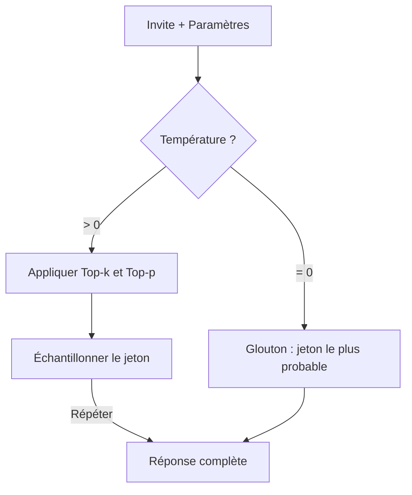
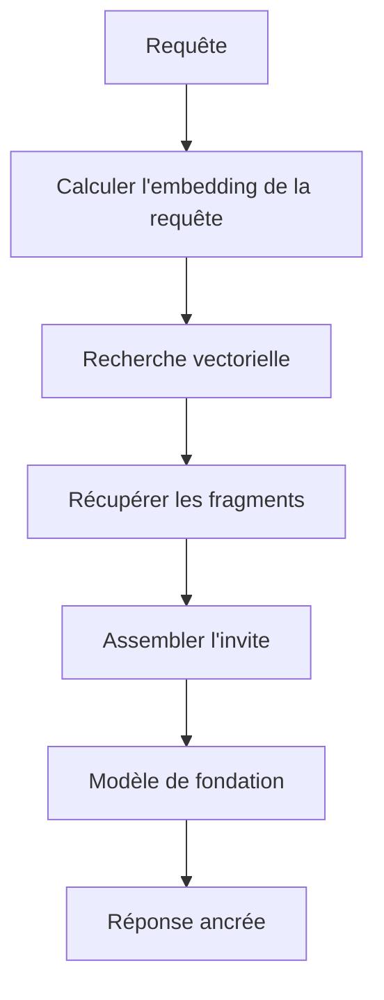
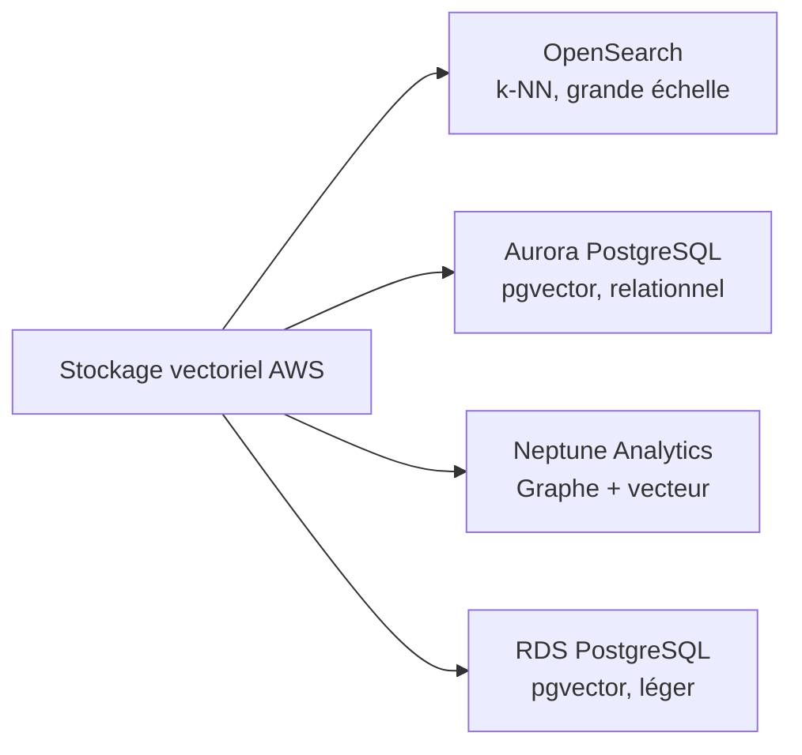
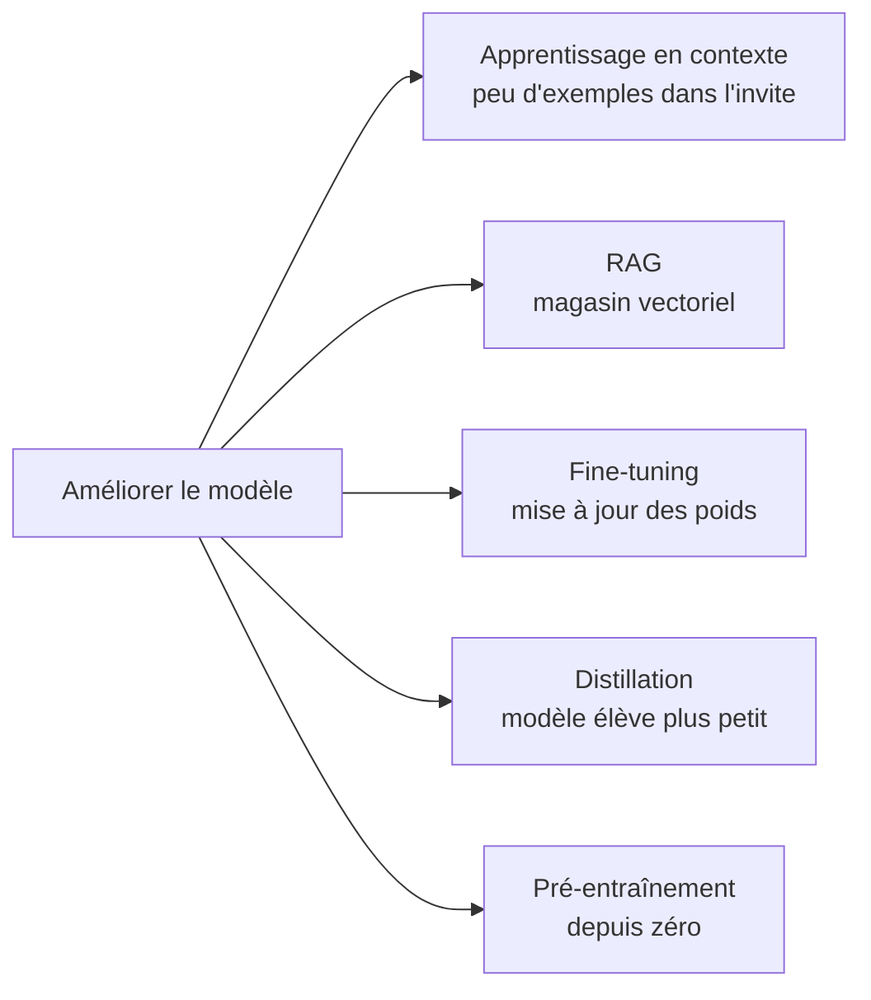
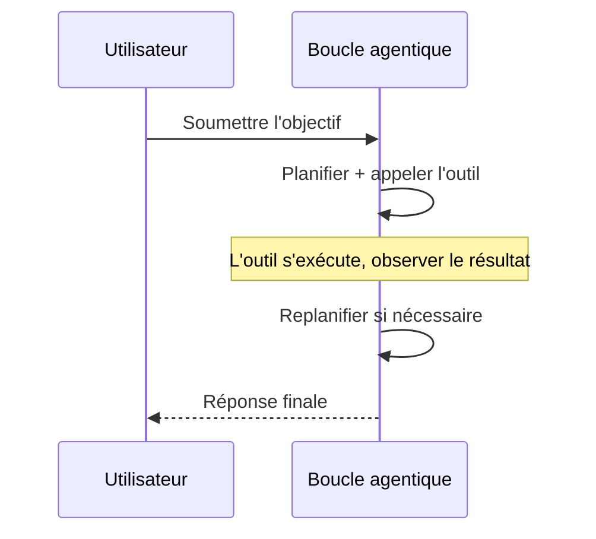

## Énoncé de tâche 3.1 : Décrire les considérations de conception pour les applications utilisant des modèles de fondation

La construction d'une application de production sur un modèle de fondation commence bien avant la première invite. Les décisions que vous prenez au moment de la conception, quel modèle utiliser, comment affiner ses sorties, comment l'ancrer dans des données privées, où stocker ces données et comment faire évoluer la connaissance dans le temps, déterminent si le projet apporte de la valeur ou reste bloqué au stade du pilote. Cet énoncé de tâche couvre ces décisions dans l'ordre auquel un architecte métier les rencontrerait.[^301001]

### 3.1.1 Critères de sélection pour choisir les FM

Choisir un modèle de fondation n'est pas une décision technique unique ; elle se répète chaque fois que les exigences métier changent. Un modèle qui fonctionnait de façon acceptable lors d'un pilote peut devenir trop coûteux au volume de production. Un modèle qui répondait bien aux questions de clients anglophones peut nécessiter un remplacement lorsque le produit s'étend aux marchés francophones. Comprendre les critères de sélection permet à ces décisions d'être systématiques plutôt que réactives.

Les critères couverts par l'examen se répartissent en trois groupes. Les critères de coût et de performance déterminent le coût d'exploitation du modèle et sa vitesse de réponse. Les critères de capacité déterminent ce que le modèle peut faire. Les critères de flexibilité déterminent dans quelle mesure le modèle peut être modifié pour s'adapter à l'entreprise.

**Le coût** est mesuré par jeton, où un jeton représente approximativement les trois quarts d'un mot anglais (ou environ quatre caractères de texte anglais).[^301036] Les jetons d'entrée (l'invite) et les jetons de sortie (la réponse) sont tarifés séparément, les jetons de sortie étant systématiquement plus chers.[^301002] Un assistant de service client qui lit un historique client de 500 mots et produit une réponse de 100 mots consommera environ 670 jetons d'entrée et 130 jetons de sortie par interaction. À l'échelle de la production, cette arithmétique est d'une importance capitale. **La mise en cache de l'invite** réduit le coût effectif en réutilisant la représentation traitée par le modèle d'un préfixe statique, tel qu'une longue invite système ou un catalogue produits, sur plusieurs appels. Amazon Bedrock prend en charge la mise en cache des invites pour certains modèles, notamment Anthropic Claude sur Bedrock, ce qui en fait un levier de coût significatif lorsqu'un grand bloc de contexte est réutilisé sur des milliers de requêtes quotidiennes.[^301003]

**La modalité** désigne les types d'entrée qu'un modèle peut accepter et les types de sortie qu'il peut produire.[^301037] Un modèle *uniquement textuel* lit du texte et produit du texte. Un modèle *multimodal* peut également lire des images, des documents ou de l'audio. Si une application métier doit classifier des factures numérisées ou répondre à des questions sur des photos de produits, un modèle multimodal est obligatoire, et le coût par interaction sera plus élevé. Sélectionner un modèle uniquement textuel pour une tâche uniquement textuelle évite de payer pour une capacité multimodale inutilisée.

**La latence** est le temps écoulé entre le moment où une requête est envoyée et le moment où le premier jeton de la réponse apparaît.[^301038] Les applications interactives telles que les chatbots nécessitent une faible latence ; une pause de cinq secondes brise l'expérience conversationnelle. Les applications par lots telles que le résumé de documents de nuit peuvent tolérer une latence plus élevée en échange d'un coût inférieur. La taille du modèle est l'un des plus grands facteurs de latence : les modèles plus petits sont plus rapides mais ont une capacité de raisonnement moindre, tandis que les modèles plus grands raisonnent mieux mais prennent plus de temps à répondre. **La taille du modèle** est mesurée en milliards de paramètres, les poids numériques appris dans le réseau. Un modèle à 7 milliards de paramètres répond généralement en moins d'une seconde sur une infrastructure appropriée ; un modèle à 70 milliards de paramètres peut prendre plusieurs secondes pour la même invite.[^301004]

**La complexité du modèle** est liée aux choix de conception architecturale qui vont au-delà du nombre de paramètres. Certains modèles sont denses, ce qui signifie que tous les paramètres s'activent pour chaque jeton ; d'autres utilisent des architectures de *mélange d'experts* (MoE) qui n'activent qu'un sous-ensemble de paramètres par jeton, obtenant une meilleure qualité à un coût d'inférence moindre.[^301039] Du point de vue de la sélection, la complexité compte car elle affecte le débit d'inférence et le niveau d'infrastructure nécessaire pour servir le modèle.

**La prise en charge multilingue** couvre l'étendue des langues des données de pré-entraînement du modèle.[^301040] Un modèle entraîné principalement sur du texte anglais produit des sorties de qualité inférieure dans d'autres langues. Pour les déploiements mondiaux, vérifier la prise en charge linguistique documentée d'un modèle avant la sélection évite des régressions de qualité douloureuses lors de l'expansion vers de nouveaux marchés.

**La personnalisation** désigne la possibilité d'affiner ou de pré-entraîner continûment le modèle sur des données propriétaires.[^301041] Tous les modèles disponibles commercialement ne prennent pas en charge le fine-tuning. Si un projet nécessite d'enseigner au modèle une terminologie spécifique au domaine ou des flux de travail propriétaires, il est essentiel de vérifier la disponibilité du fine-tuning avant de signer un contrat. La section 3.1.5 couvre les compromis de coût entre les approches de personnalisation.

**La taille de la fenêtre de contexte** fixe le nombre maximum de jetons que le modèle peut lire en un seul appel, comptant à la fois l'entrée et la sortie.[^301042] Un modèle avec une fenêtre de contexte de 200 000 jetons peut traiter un contrat juridique entier en une seule requête ; un modèle avec une fenêtre de 4 096 jetons ne le peut pas. Plusieurs modèles phares sur Amazon Bedrock offrent désormais des fenêtres d'un million de jetons (Anthropic Claude Opus et Sonnet via l'en-tête bêta 1M-context, Amazon Nova Premier et Meta Llama 4 Maverick), qui peuvent contenir l'intégralité d'une base de code ou une année de correspondance dans une seule invite. Des fenêtres de contexte plus longues coûtent plus cher par appel mais peuvent éliminer le besoin de stratégies de découpage complexes dans les pipelines RAG (voir section 3.1.3).

Le *tableau 3.1.1* ci-dessous compare les principales familles de modèles disponibles via Amazon Bedrock au moment de la rédaction. Les prix exacts évoluent ; le positionnement relatif entre les niveaux de modèles au sein d'une famille est stable.[^301005]

*Tableau 3.1.1 : Comparaison des modèles de fondation par niveau et capacité*

| Famille de modèles | Niveau | Coût relatif | Modalité | Fenêtre de contexte | Cas d'usage typique |
|---|---|---|---|---|---|
| Anthropic Claude Opus | Phare | Élevé | Multimodal | 200K standard, 1M avec en-tête bêta | Raisonnement complexe, juridique/médical |
| Anthropic Claude Sonnet | Équilibré | Moyen | Multimodal | 200K standard, 1M avec en-tête bêta | Tâches générales d'entreprise |
| Anthropic Claude Haiku | Rapide | Faible | Multimodal | 200K jetons | Interactions client à haut volume |
| Amazon Nova Premier | Phare | Élevé | Multimodal | 1M jetons | Multimodal complexe, très longs documents |
| Amazon Nova Pro | Équilibré | Moyen | Multimodal | 300K jetons | Flux de travail d'entreprise |
| Amazon Nova Lite | Rapide | Faible | Multimodal | 300K jetons | Production sensible aux coûts |
| Amazon Nova Micro | Le plus rapide | Le plus faible | Textuel uniquement | 128K jetons | Latence ultra-faible ou coût minimal |
| Meta Llama 4 Maverick | Ouvert | Variable | Multimodal | 1M jetons | Déploiements personnalisables à long contexte |
| Mistral Large 2 | Équilibré | Moyen | Textuel uniquement | 128K jetons | Tâches en langues européennes |

L'examen n'attend pas une mémorisation des tarifs. Il attend que vous fassiez correspondre un scénario métier (haut volume, multilingue, analyse d'images, budget serré) au bon niveau de modèle en utilisant ces critères.

### 3.1.2 Effet des paramètres d'inférence sur les réponses du modèle

Même un modèle correctement sélectionné peut produire des sorties inappropriées si ses paramètres d'inférence sont mal configurés. Les paramètres d'inférence sont des réglages passés à l'exécution, avec l'invite, qui indiquent au modèle comment échantillonner à partir de la distribution de probabilité des prochains jetons possibles. Les ajuster modifie le comportement du modèle sans réentraînement.

**La température** contrôle le degré d'aléatoire dans le processus d'échantillonnage.[^301043] À une température de 0, le modèle sélectionne toujours le jeton de probabilité la plus élevée, produisant une sortie déterministe et cohérente. À une température de 1, le modèle échantillonne selon la distribution de probabilité brute, produisant une sortie plus variée et créative. Des valeurs supérieures à 1 amplifient les jetons à probabilité plus faible, augmentant la créativité au détriment de la cohérence.[^301006] L'implication métier est directe : un outil de résumé de documents juridiques devrait fonctionner à une température de 0 ou très proche, car la cohérence et la précision comptent plus que la variété. Un générateur de texte marketing pourrait utiliser une température de 0,8 ou plus pour produire diverses options créatives à partir du même résumé.

**Top-p** (également appelé *échantillonnage par noyau*) est un contrôle complémentaire de l'aléatoire.[^301044] Au lieu d'ajuster les probabilités des jetons par un multiplicateur, top-p définit un seuil de probabilité cumulé. Le modèle n'échantillonne que parmi le plus petit ensemble de jetons dont la probabilité combinée atteint le seuil. À top-p = 0,9, le modèle ne considère que les jetons qui représentent ensemble 90 % de la masse de probabilité, éliminant les valeurs aberrantes à faible probabilité. Des valeurs de top-p plus faibles rendent la sortie plus concentrée ; des valeurs plus élevées permettent plus de variété.[^301007]

**Top-k** restreint l'échantillonnage aux k jetons avec les probabilités individuelles les plus élevées, indépendamment de leur probabilité combinée.[^301045] À top-k = 50, le modèle n'échantillonne que parmi les 50 jetons suivants les plus probables. Top-k et top-p sont souvent utilisés ensemble ; le modèle filtre d'abord par top-k puis applique le seuil top-p aux candidats restants.

La température et top-p interagissent en pratique. Fixer température = 0 rend top-p sans pertinence car il n'y a pas d'échantillonnage stochastique à gouverner. Fixer top-p = 1,0 désactive l'échantillonnage par noyau, laissant la température comme seul contrôle actif. Une configuration de production courante pour un assistant à haute précision est température = 0,1 et top-p = 0,9, produisant une sortie essentiellement déterministe tout en permettant une formulation alternative occasionnelle lorsque le modèle est véritablement incertain.

**Les séquences d'arrêt** sont des chaînes de caractères qui indiquent au modèle de cesser de générer dès qu'il les produit.[^301046] Par exemple, un modèle d'invite qui utilise un marqueur de fin explicite peut inclure `"\n###FIN###"` comme séquence d'arrêt afin que le modèle s'arrête immédiatement après avoir produit le marqueur. Les séquences d'arrêt sont utiles pour appliquer le format de sortie dans les applications où un système en aval doit analyser la réponse, et elles doivent être choisies pour être sans ambiguïté dans la sortie attendue (un `}` littéral est un mauvais choix pour du JSON imbriqué car l'accolade interne mettrait fin à la génération avant que l'objet externe ne se ferme).

**Les paramètres de longueur d'entrée et de sortie** plafonnent le nombre de jetons que le modèle lit (entrée) ou génère (sortie). Plafonner la longueur de sortie contrôle les coûts sur les points de terminaison à haut volume. Plafonner la longueur d'entrée au niveau de l'API empêche les clients d'envoyer des invites qui dépassent la fenêtre de contexte du modèle et provoquent une erreur. Les deux plafonds doivent être fixés en fonction de la taille maximale réaliste d'une requête valide, non du maximum que le modèle prend en charge.

```
Exemple de configuration de paramètres d'inférence :
  temperature:     0.1
  top_p:           0.9
  top_k:           50
  max_new_tokens:  512
  stop_sequences:  ["###FIN###"]
```

La configuration ci-dessus convient à un assistant d'extraction de documents qui doit produire des sorties courtes et structurées de façon fiable. Un assistant d'écriture créative augmenterait la température, augmenterait top-p et supprimerait la séquence d'arrêt.


*Figure 3.1.1 : Pipeline d'échantillonnage des jetons. Le modèle sélectionne chaque jeton de sortie en filtrant les candidats par top-k et top-p avant d'appliquer l'échantillonnage stochastique à l'échelle de la température.*

### 3.1.3 Définir la RAG et ses applications métier

Les modèles de fondation sont entraînés sur de grands jeux de données publics, mais ils n'ont pas accès aux informations postérieures à leur date de coupure d'entraînement et n'ont pas accès aux données propriétaires de l'organisation. Un modèle entraîné jusqu'à fin 2024 ne peut pas répondre aux questions sur une sortie de produit début 2025. Un modèle généraliste n'a jamais vu votre politique RH interne, vos modèles de contrats clients ou vos guides opérationnels d'ingénierie. **La génération augmentée par récupération** (RAG) est le schéma architectural qui répond à cette limitation en connectant le modèle à un magasin de connaissances externe au moment de la requête, plutôt qu'en intégrant la connaissance dans les poids du modèle par l'entraînement.[^301008]

La mécanique de la RAG se déroule en cinq étapes. Premièrement, la question de l'utilisateur est convertie en un vecteur numérique appelé *embedding* qui capture son sens sémantique.[^301047] Deuxièmement, ce vecteur est comparé à une base de données d'embeddings pré-calculés dérivés des documents privés de l'organisation. Troisièmement, les documents dont les embeddings sont les plus similaires à l'embedding de la requête sont récupérés. Quatrièmement, ces documents sont assemblés en un bloc de contexte et ajoutés en préfixe à la question originale de l'utilisateur pour former l'invite complète. Cinquièmement, le modèle de fondation lit l'invite enrichie et génère une réponse ancrée dans le contenu récupéré plutôt que dans sa mémoire paramétrique seule.[^301009]


*Figure 3.1.2 : Pipeline de requête RAG. La requête utilisateur est vectorisée, comparée aux vecteurs de documents stockés, et les fragments récupérés sont fusionnés avec la requête originale avant que le modèle de fondation ne génère sa réponse.*

**Amazon Bedrock Knowledge Bases** est l'implémentation entièrement gérée de ce schéma par AWS.[^301010] Il gère le pipeline d'ingestion, la génération des embeddings, l'intégration du magasin vectoriel et l'API de récupération, permettant à une organisation d'adopter la RAG sans construire ni exploiter aucune infrastructure sous-jacente. L'administrateur configure une base de connaissances en spécifiant une source de données, une stratégie de découpage, un modèle d'embedding et un backend de stockage vectoriel ; Bedrock synchronise ensuite les documents automatiquement.

Les sources de données prises en charge par Amazon Bedrock Knowledge Bases incluent les compartiments Amazon S3 (le choix le plus courant pour les archives de documents), les espaces Atlassian Confluence, les sites Microsoft SharePoint, les objets Salesforce et les URL web via un robot d'exploration web intégré.[^301011] Chaque source de données est synchronisée selon un calendrier ou à la demande ; les mises à jour des documents sources se reflètent dans le magasin vectoriel sans réindexation manuelle.[^301048]

*Le découpage en fragments* est le processus qui consiste à diviser les documents sources en segments suffisamment petits pour tenir dans une fenêtre de contexte aux côtés de la requête originale.[^301049] Bedrock Knowledge Bases prend en charge le découpage à taille fixe (diviser tous les N jetons), le découpage sémantique (diviser aux limites de thèmes naturels identifiées par un modèle secondaire) et le découpage hiérarchique (produire à la fois un fragment de résumé parent et des fragments de détail enfant plus petits afin que la récupération puisse fonctionner à deux niveaux de granularité).[^301012]

Les applications métier de la RAG couvrent plusieurs catégories :

- **Questions-réponses internes** : les employés posent des questions sur les politiques RH, les procédures informatiques ou les spécifications de produits. Le système récupère les paragraphes de politique pertinents et génère une réponse précise avec la source citée.
- **Support client** : un agent de support ou un chatbot en libre-service récupère les étapes de dépannage pertinentes depuis une base de connaissances et les présente dans un langage conversationnel, réduisant le temps de traitement moyen.
- **Analyse de contrats et juridique** : les équipes juridiques ingèrent des bibliothèques de contrats. Le modèle répond à des questions telles que « Quels contrats contiennent une clause de résiliation pour convenance ? » ou « Quel est le plafond de responsabilité dans l'accord-cadre de services avec le fournisseur X ? »
- **Assistance à la recherche** : des scientifiques, analystes ou chefs de produit interrogent un corpus de rapports de recherche internes. Le modèle synthétise les résultats sur plusieurs documents plutôt que de retourner une liste de liens.

La RAG est préférée au fine-tuning lorsque la base de connaissances change fréquemment, car la mise à jour d'un magasin vectoriel prend quelques minutes tandis que le réentraînement d'un modèle prend des heures ou des jours.[^301050] Elle est également préférée lorsque les documents sources doivent être auditables ; comme les fragments récupérés sont visibles dans l'invite, un développeur peut inspecter exactement quels documents ont influencé la réponse.[^301051]

### 3.1.4 Services AWS pour stocker des embeddings dans des bases de données vectorielles

La RAG nécessite un endroit pour stocker les embeddings pré-calculés et les rechercher rapidement en utilisant des algorithmes de *plus proche voisin approché* (ANN) ou de *k plus proches voisins* (k-NN).[^301052] AWS fournit quatre services gérés qui prennent en charge le stockage vectoriel, chacun adapté à différentes exigences d'échelle, d'architecture et de requête.[^301053]


*Figure 3.1.3 : Services de stockage vectoriel AWS. Chaque service prend en charge le stockage des embeddings mais diffère en termes d'échelle, de modèle de requête et de capacités complémentaires.*

**Amazon OpenSearch Service** prend en charge la recherche vectorielle par plus proche voisin approché depuis l'introduction du plug-in k-NN, et son *moteur vectoriel* est optimisé pour les charges de travail de recherche sémantique à grande échelle et à haut débit.[^301013] Il prend en charge l'algorithme d'index Hierarchical Navigable Small World (HNSW), qui offre une récupération en sous-milliseconde sur des milliards de vecteurs.[^301054] OpenSearch est l'option la plus capable lorsque le jeu de données de récupération est volumineux (des millions de documents ou plus), lorsque la recherche doit combiner la similarité vectorielle avec des filtres par mots-clés traditionnels (recherche hybride), ou lorsque l'application utilise déjà OpenSearch pour l'analyse des journaux et peut partager le cluster. Amazon Bedrock Knowledge Bases utilise OpenSearch Service comme backend vectoriel par défaut lorsqu'aucune alternative n'est spécifiée.[^301055]

**Amazon Aurora** avec l'extension pgvector ajoute le stockage vectoriel à la base de données relationnelle compatible PostgreSQL.[^301014] Cette option est appropriée lorsque l'application stocke déjà des données structurées dans Aurora et souhaite ajouter la recherche sémantique sans exploiter un magasin vectoriel séparé. Un catalogue produits stocké sous forme de lignes dans Aurora peut gagner des colonnes d'embedding ; les requêtes peuvent ensuite combiner des prédicats relationnels (« produits dans la catégorie Électronique ») avec la similarité vectorielle (« similaire à cette description de produit ») dans une seule instruction SQL.[^301056] Le compromis est l'échelle : pgvector sur Aurora fonctionne bien pour des jeux de données de l'ordre de centaines de milliers à quelques millions de vecteurs, mais n'égale pas Amazon OpenSearch Service aux très grandes échelles.

**Amazon Neptune Analytics** étend la base de données graphique Neptune avec la capacité de recherche vectorielle, permettant des requêtes qui combinent la traversée de graphe avec la similarité sémantique.[^301015] Un graphe de connaissances qui modélise les relations entre des personnes, des organisations et des documents peut utiliser Neptune Analytics pour répondre à des questions telles que « Trouver les documents les plus sémantiquement similaires à cette requête qui ont été rédigés par quelqu'un du département juridique et citent au moins une réglementation. »[^301057] Cette combinaison de raisonnement graphique et de récupération vectorielle est difficile à reproduire avec un magasin purement relationnel ou purement basé sur la recherche. Neptune Analytics est le bon choix lorsque le problème de récupération a une structure graphique inhérente, comme l'analyse de la chaîne d'approvisionnement, l'investigation de fraude ou la recherche biomédicale.

**Amazon RDS for PostgreSQL** fournit la même capacité pgvector qu'Aurora mais fonctionne sur l'infrastructure RDS standard plutôt que sur le cluster Aurora sans serveur ou provisionné.[^301016] Il est approprié pour les charges de travail plus petites où l'instance RDS existante exécute déjà PostgreSQL et où l'ajout de l'extension pgvector est le chemin de moindre résistance.[^301058] Les environnements de développement et les outils internes légers utilisent fréquemment cette option pour maintenir l'infrastructure simple tout en prenant en charge la recherche vectorielle.

Pour une règle empirique rapide sur le choix entre ces magasins : pgvector (sur RDS ou Aurora) gère confortablement jusqu'à quelques millions de vecteurs ; Amazon OpenSearch Service est le choix par défaut une fois qu'une charge de travail dépasse les dizaines de millions et plus, où son index HNSW maintient une faible latence de récupération à très grande échelle. Neptune Analytics est la bonne réponse lorsque les données sont fondamentalement structurées en graphe.

*Tableau 3.1.2 : Comparaison des services de stockage vectoriel AWS*

| Service | Algorithme d'index | Échelle | Capacité complémentaire | Idéal pour |
|---|---|---|---|---|
| OpenSearch Service | HNSW, IVF | Très grande (milliards) | Recherche hybride mots-clés + vecteur, analytique | RAG à haut volume, recherche d'entreprise |
| Aurora PostgreSQL (pgvector) | IVFFlat, HNSW | Moyenne (millions) | Jointures SQL relationnelles | Applications déjà sur Aurora |
| Neptune Analytics | Graphe + vecteur | Moyenne | Traversée de graphe, requêtes de relations | Bases de connaissances à structure graphique |
| RDS for PostgreSQL (pgvector) | IVFFlat, HNSW | Petite à moyenne | SQL relationnel, configuration simple | Environnements de développement, outils internes |

Amazon Bedrock Knowledge Bases peut être configuré pour utiliser l'un de ces quatre backends.[^301017] Le choix par défaut, lorsqu'aucun backend n'est spécifié, est OpenSearch Service.[^301059] Les organisations qui exploitent déjà Aurora ou RDS for PostgreSQL peuvent pointer une base de connaissances vers leur cluster existant, évitant le coût d'un service de recherche séparé. Neptune Analytics est sélectionné explicitement lorsque la base de connaissances a une structure graphique.

Remarque : Amazon MemoryDB était listé comme option de stockage vectoriel dans les versions précédentes du guide d'examen AIF-C01. Il a été supprimé dans la version 1.1 du guide. N'attendez pas de questions d'examen sur MemoryDB dans le contexte de la recherche vectorielle.

### 3.1.5 Compromis de coûts de la personnalisation des FM

Lorsque le comportement par défaut d'un modèle de fondation n'est pas suffisamment bon pour une tâche métier spécifique, il existe cinq grandes stratégies pour l'améliorer. Elles diffèrent substantiellement en termes de coût, de temps, d'exigences en données et de durabilité de l'amélioration.

**Le pré-entraînement** est le processus d'entraînement d'un modèle depuis zéro sur un large corpus de texte (ou d'autres données).[^301060] Le pré-entraînement détermine la connaissance fondamentale du modèle et sa compréhension du langage. Il nécessite des ressources de calcul énormes (des centaines à des milliers de GPU fonctionnant pendant des semaines), des pétaoctets de données d'entraînement organisées et une équipe de chercheurs en apprentissage automatique pour superviser le processus. Très peu d'organisations en dehors des principaux laboratoires d'IA réalisent un pré-entraînement. Il est pertinent pour l'examen comme point de départ à partir duquel toutes les autres techniques partent, non comme une option pratique pour la plupart des entreprises.[^301018]

**Le fine-tuning** commence à partir d'un modèle pré-entraîné existant et poursuit l'entraînement sur un jeu de données plus petit spécifique à la tâche.[^301061] Les poids du modèle sont mis à jour pour faire évoluer son comportement vers le domaine cible. Le fine-tuning nécessite des exemples étiquetés de quelques centaines à quelques dizaines de milliers, des heures de GPU de l'ordre de quelques heures à quelques jours plutôt que des semaines, et un processus de préparation des données qui produit des paires question-réponse ou instruction-réponse. Amazon Bedrock prend en charge le fine-tuning pour certains modèles.[^301019] Le résultat est un modèle qui produit des sorties mieux alignées sur la tâche spécifique, stocké comme une version de modèle distincte qui entraîne des coûts d'hébergement même lorsqu'il est inactif.[^301062]

**L'apprentissage en contexte** ne nécessite aucune mise à jour des poids.[^301063] Au lieu de cela, des exemples du comportement souhaité sont placés directement dans l'invite. Une invite zéro-coup ne donne aucun exemple ; une invite peu d'exemples en donne deux à cinq. Le modèle utilise la correspondance de schémas dans sa fenêtre de contexte pour généraliser à partir de ces exemples vers l'entrée actuelle. L'apprentissage en contexte est la stratégie de personnalisation la moins coûteuse et la plus rapide et ne nécessite aucune infrastructure au-delà de ce qu'utilise un appel d'inférence normal. La limitation est que l'amélioration ne dure que pour la durée de l'invite ; le modèle ne conserve pas les exemples entre les appels, et les exemples consomment des jetons qui pourraient autrement transporter du contenu.[^301020]

**La RAG** (couverte en détail à la section 3.1.3) n'est généralement pas décrite comme une technique de personnalisation, mais elle a des effets métier similaires : elle ancre le modèle dans des connaissances spécifiques au domaine et réduit les hallucinations sur des sujets propriétaires. Son profil de coût est distinct des autres. Le coût de configuration implique la construction et la synchronisation du magasin vectoriel et l'intégration de la couche de récupération. Le coût par requête est légèrement supérieur à un simple appel d'inférence car l'étape de récupération et l'invite augmentée plus grande consomment toutes deux du calcul et des jetons. Le coût de mise à jour des connaissances, cependant, est très faible : l'ajout de nouveaux documents au magasin vectoriel prend quelques minutes plutôt que les heures qu'un travail de fine-tuning nécessite.[^301021]

**La distillation de modèle** est la technique la plus récente dans le guide d'examen v1.1. Dans la distillation, un grand *modèle enseignant* de haute qualité génère des sorties pour un ensemble d'invites, et ces paires entrée-sortie deviennent le jeu de données d'entraînement pour un *modèle élève* plus petit.[^301064] L'élève apprend à approximer le comportement de l'enseignant dans un domaine de tâche spécifique sans avoir accès aux poids de l'enseignant.[^301022] L'avantage métier est que l'inférence à l'échelle de la production est servie par le modèle élève plus petit, plus rapide et moins cher, tandis que la qualité des réponses s'approche de celle du coûteux enseignant. Amazon Bedrock prend en charge la distillation de modèle comme flux de travail de première classe, permettant aux organisations d'utiliser un modèle Bedrock comme enseignant et de produire une version fine-tunée d'un modèle plus petit comme élève.[^301023] La distillation déplace le coût de l'inférence (qui est continue) vers un travail d'entraînement unique (qui peut être amorti sur des milliers d'appels d'inférence ultérieurs).[^301065]


*Figure 3.1.4 : Guide de sélection de la personnalisation des FM. La technique appropriée dépend des données étiquetées disponibles, de la fréquence de mise à jour, du budget et du volume d'inférence.*

*Tableau 3.1.3 : Comparaison du coût et de l'effort des approches de personnalisation des FM*

| Approche | Coût de calcul | Données nécessaires | Vitesse de mise à jour | Coût par requête | Scénarios d'examen |
|---|---|---|---|---|---|
| Pré-entraînement | Très élevé | Pétaoctets | Semaines | Normal | Référence académique uniquement |
| Fine-tuning | Moyen | Des centaines à des milliers de paires étiquetées | Heures à jours | Normal + hébergement | Spécialisation de domaine stable |
| Apprentissage en contexte | Aucun | Quelques exemples | Immédiat | Plus élevé (invite plus grande) | Prototypage rapide, faible volume |
| RAG | Faible (configuration) | Documents existants | Minutes | Légèrement plus élevé | Connaissances fréquemment mises à jour |
| Distillation de modèle | Moyen (unique) | Paires générées par l'enseignant | Heures à jours | Plus faible (modèle plus petit) | Optimisation des coûts à haut volume |

L'examen présente fréquemment des scénarios où une entreprise doit choisir entre ces approches. La logique de décision est : si la connaissance change souvent, choisir la RAG. Si la tâche nécessite un ton cohérent ou une terminologie spécialisée dans un domaine stable et que des données sont disponibles, choisir le fine-tuning. Si le volume est très élevé et que le coût par requête est la préoccupation principale, évaluer la distillation. Si ni le budget ni le temps ne sont disponibles, utiliser l'apprentissage en contexte avec des exemples peu nombreux. Le pré-entraînement n'est jamais la bonne réponse pour un scénario de préparation à la production, à moins que la question n'établisse explicitement qu'il existe un domaine inédit pour lequel aucun modèle pré-entraîné n'est disponible.

### 3.1.6 Rôle des agents IA et applications métier

Un modèle de fondation qui reçoit une invite et retourne une réponse opère en mode *coup unique*. De nombreuses tâches métier réelles ne peuvent pas être accomplies en une seule étape. Réserver un vol nécessite de vérifier la disponibilité, de comparer les options, de sélectionner les sièges et de confirmer le paiement. Enquêter sur une alerte de sécurité nécessite d'interroger les données de journal, de rechercher des renseignements sur les menaces, de corréler les événements et de rédiger un rapport. Ces tâches en plusieurs étapes nécessitent une architecture différente.

**Un agent IA** est un système qui combine un modèle de fondation avec la capacité de percevoir son environnement, de planifier une séquence d'actions, d'exécuter ces actions à l'aide d'outils externes, d'observer les résultats et de réviser son plan en fonction de ce qu'il a appris.[^301024] Le modèle dans un agent ne génère pas simplement du texte ; il raisonne sur l'action suivante, décide quel outil appeler, évalue si le résultat est suffisant, et continue jusqu'à ce que la tâche soit accomplie ou qu'une condition d'arrêt soit atteinte.[^301066]

La boucle agentique comporte quatre phases. Dans la phase *percevoir*, l'agent reçoit l'objectif de l'utilisateur et tout contexte disponible sur l'état actuel du monde.[^301067] Dans la phase *planifier*, le modèle raisonne sur l'action à prendre ensuite, sélectionnant parmi un ensemble défini d'outils (API, requêtes de base de données, exécuteurs de code, recherche web). Dans la phase *agir*, l'agent appelle l'outil sélectionné et lui passe les arguments déterminés par le modèle. Dans la phase *observer*, l'agent lit la réponse de l'outil et met à jour sa compréhension de la progression vers l'objectif. La boucle se répète jusqu'à ce que l'agent détermine que la tâche est accomplie.[^301025]


*Figure 3.1.5 : Boucle percevoir-planifier-agir-observer d'un agent IA. Le modèle de fondation raisonne sur quel outil appeler à chaque étape, et la boucle continue jusqu'à ce que l'objectif de la tâche soit atteint.*

La différence entre un agent et un simple appel LLM compte en termes métier. Un simple appel LLM est rapide, peu coûteux et sans état. Un appel d'agent est plus lent, plus coûteux et conserve un état sur plusieurs invocations d'outils.[^301068] Les agents sont appropriés lorsque la tâche ne peut pas être encodée dans une seule invite, lorsqu'elle nécessite des informations provenant de systèmes externes, ou lorsqu'elle implique plusieurs décisions séquentielles dont chacune dépend du résultat précédent.

AWS fournit deux principaux points d'entrée pour la construction d'agents. **Amazon Bedrock Agents** est le service géré établi pour créer, configurer et déployer des agents soutenus par tout modèle de fondation pris en charge par Bedrock.[^301026] Il gère l'orchestration, le routage des outils (appelés *groupes d'actions* dans la terminologie Bedrock), la gestion de l'état de session et l'intégration avec Knowledge Bases pour la RAG. **Amazon Bedrock AgentCore** est la couche d'exécution et de gestion plus récente pour les agents de qualité production, ajoutant l'observabilité, la mémoire, les contrôles de sécurité et l'infrastructure pour exécuter les agents à grande échelle.[^301027] **Strands Agents** est un SDK open source d'AWS qui permet aux développeurs Python de construire des agents en utilisant une API simple basée sur des décorateurs, avec des agents déployables vers AgentCore pour une exécution gérée.[^301028]

Les applications métier pour les agents IA comprennent :

- **Automatisation du service client** : un agent gère la résolution complète d'une demande de service, en interrogeant le CRM, en vérifiant le statut de la commande, en initiant un retour et en envoyant une confirmation, sans qu'un agent humain ne soit impliqué, à moins que la situation ne dépasse le périmètre défini.
- **Opérations informatiques** : un agent enquête sur une alerte de performance en interrogeant les métriques CloudWatch, en identifiant les ressources affectées, en faisant le recoupement avec le journal des modifications et en proposant une action corrective qu'un opérateur doit approuver.
- **Traitement de documents** : un agent lit les contrats entrants, extrait les termes clés, les vérifie par rapport à un modèle standard, signale les écarts et crée un résumé provisoire pour un réviseur juridique, tout cela sans triage manuel.
- **Analyse de données** : un agent accepte une question métier en langage naturel, écrit une requête SQL, l'exécute sur une base de données, interprète le résultat et produit un résumé en langage naturel avec une recommandation.

Les architectures *multi-agents*, où un agent orchestrateur délègue des sous-tâches à des sous-agents spécialisés, étendent le schéma aux problèmes trop volumineux ou trop diversifiés pour qu'un seul agent puisse les gérer de façon fiable.[^301069] Amazon Bedrock Agents prend en charge la collaboration multi-agents nativement.[^301029] Les principes de conception des systèmes multi-agents, notamment la façon de partitionner les tâches, de router entre les agents et de maintenir un état de session cohérent, ont été couverts précédemment dans le domaine 2 (chapitre sur les concepts de base de l'IA générative) avec le matériel plus large sur l'architecture de l'IA agentique.

*Tableau 3.1.4 : Comparaison d'un agent IA et d'un simple appel LLM*

| Caractéristique | Simple appel LLM | Agent IA |
|---|---|---|
| Portée de la tâche | Étape unique, invite unique | Plusieurs étapes, itératif |
| Accès à des outils externes | Aucun (poids du modèle uniquement) | API, bases de données, exécuteurs de code |
| État entre les étapes | Aucun | Maintenu dans la session |
| Latence par tâche | Millisecondes à secondes | Secondes à minutes |
| Coût par tâche | Faible (un seul appel d'inférence) | Plus élevé (inférences + appels d'outils multiples) |
| Approprié pour | Classification, résumé, génération | Recherche, réservation, opérations IT, flux documentaires |

L'examen traite les agents comme un schéma architectural distinct, non comme une amélioration de l'ingénierie d'invite. Lorsqu'une question décrit une tâche en plusieurs étapes nécessitant d'interroger des systèmes externes ou de prendre des décisions séquentielles, la réponse implique un agent, non une invite plus sophistiquée.

## Questions de contrôle

**Question 1.** Une entreprise de vente au détail souhaite déployer un chatbot orienté client qui répond aux questions sur son catalogue produits en six langues. Le catalogue contient 50 000 références ; les mises à jour quotidiennes touchent moins d'un pour cent des références tandis que l'invite système et le bloc de taxonomie produits sont statiques pour tous les appels. Quelle combinaison de critères de sélection devrait le PLUS directement gouverner le choix du modèle de fondation ?

A. Taille du modèle, disponibilité du fine-tuning et prise en charge des séquences d'arrêt
B. Prise en charge multilingue, taille de la fenêtre de contexte et éligibilité à la mise en cache de l'invite
C. Modalité de sortie, récence des données de pré-entraînement et valeur par défaut de top-p
D. Coût d'entraînement, empreinte mémoire GPU et sensibilité à la température

**Explication :** Le scénario a trois facteurs déterminants : la prise en charge de six langues (prise en charge multilingue), un grand contexte de catalogue largement stable qui doit tenir dans une invite ou être récupéré efficacement (taille de la fenêtre de contexte), et le contrôle des coûts à l'échelle (la mise en cache de l'invite s'applique à l'invite système statique et au bloc de taxonomie, non aux lignes de références qui changent quotidiennement, ce qui fait de la RAG le bon outil pour la portion volatile). La réponse A est fausse car le fine-tuning ne répondrait pas au problème de mise à jour quotidienne et les séquences d'arrêt ne sont pas un critère de sélection. La réponse C est fausse car la modalité de sortie est uniquement textuelle (un chatbot), la récence du pré-entraînement est sans pertinence puisque le catalogue est injecté à l'exécution, et top-p est un paramètre d'inférence, non un critère de sélection de modèle. La réponse D est fausse car le coût d'entraînement n'est pas une considération d'exécution pour un consommateur d'un FM géré, et l'empreinte GPU est un détail d'infrastructure abstrait par Amazon Bedrock. La réponse B répond directement à toutes les trois contraintes métier.[^301030]

---

**Question 2.** Une équipe juridique utilise un modèle de fondation pour résumer des clauses de contrats. Elle constate que les résumés sont incohérents : la même clause produit des résumés légèrement différents à chaque exécution. L'équipe nécessite une reproductibilité mot pour mot lors de la réexécution d'un résumé. Quel changement de paramètre d'inférence est le PLUS susceptible de résoudre ce problème ?

A. Augmenter top-k de 50 à 200
B. Augmenter la température de 0,7 à 1,0
C. Fixer la température à 0
D. Fixer top-p à 1,0

**Explication :** La température contrôle le degré de déterminisme du processus d'échantillonnage. À température = 0, le modèle sélectionne toujours le jeton suivant de probabilité la plus élevée, rendant la sortie déterministe pour une invite fixe. C'est la bonne réponse (C). Augmenter top-k (réponse A) élargit le pool de jetons candidats, ce qui augmenterait la variabilité, non l'éliminerait. Augmenter la température de 0,7 à 1,0 (réponse B) augmente l'aléatoire, aggravant le problème. Fixer top-p à 1,0 (réponse D) désactive l'échantillonnage par noyau mais ne rend pas l'échantillonnage déterministe par lui-même ; si la température est toujours supérieure à 0, le modèle échantillonnera toujours de façon stochastique à partir de la distribution de probabilité complète. Seule la fixation de la température exactement à 0 réduit le processus d'échantillonnage au mode glouton déterministe dont l'équipe juridique a besoin.[^301031]

---

**Question 3.** Une société de services financiers souhaite offrir à ses analystes un outil pour répondre aux questions sur des rapports de recherche internes. Les rapports sont mis à jour chaque semaine. La société ne souhaite pas réentraîner ou affiner un modèle. Quelle architecture répond le MIEUX à ces exigences ?

A. Pré-entraîner un modèle spécifique au domaine sur les rapports de recherche
B. Fine-tuner un modèle de fondation chaque semaine lorsque de nouveaux rapports sont publiés
C. Utiliser la RAG avec un magasin vectoriel synchronisé depuis le référentiel de rapports
D. Utiliser l'apprentissage en contexte en collant les rapports pertinents dans l'invite

**Explication :** La RAG (réponse C) est conçue précisément pour ce scénario. Elle permet à l'analyste de poser des questions en langage naturel et récupère les sections pertinentes du magasin vectoriel, qui peut être mis à jour en quelques minutes lorsque de nouveaux rapports arrivent. Elle ne nécessite aucun réentraînement du modèle. Le pré-entraînement (réponse A) est exclu par le coût, par l'exigence de non-réentraînement et par la cadence de mise à jour hebdomadaire. Le fine-tuning (réponse B) est exclu par l'exigence de non-réentraînement et par le fait que les cycles de fine-tuning hebdomadaires ne sont pas pratiques pour un problème de mise à jour des connaissances. L'apprentissage en contexte (réponse D) n'est pas réalisable à l'échelle ; coller des rapports de recherche entiers dans une invite dépasserait la fenêtre de contexte pour une bibliothèque de centaines de documents, et cette approche ne fonctionne pas pour la recherche rétrospective dans une archive. Amazon Bedrock Knowledge Bases avec une source de données S3 synchronisée est l'implémentation AWS concrète de l'approche correcte.[^301032]

---

**Question 4.** Une entreprise gère une application de support client à haut volume alimentée par un grand modèle de fondation. Les coûts d'inférence augmentent plus vite que les revenus. Un ingénieur en apprentissage automatique propose d'utiliser la distillation de modèle. Quel est le PRINCIPAL avantage métier de cette approche ?

A. Le modèle élève apprend de nouveaux faits que le modèle enseignant ne connaissait pas
B. Le modèle élève produit des sorties identiques au modèle enseignant sur toutes les entrées
C. L'inférence à grande échelle est servie par un modèle plus petit, plus rapide et moins cher qui approxime la qualité de l'enseignant
D. Les poids du modèle enseignant sont compressés et servis directement, réduisant le coût mémoire

**Explication :** La distillation de modèle (réponse C) entraîne un modèle élève plus petit pour approximer le comportement d'un modèle enseignant plus grand sur le domaine de tâche cible. Une fois la distillation terminée, l'inférence en production utilise le modèle élève, qui est plus rapide et moins cher par appel. Cela répond directement au problème de croissance des coûts dans une application à haut volume. La réponse A est fausse car la distillation enseigne à l'élève à imiter les sorties de l'enseignant, non à apprendre des faits que l'enseignant ne connaît pas. La réponse B est fausse car l'élève approxime mais ne reproduit pas exactement l'enseignant ; sur les cas limites et les entrées nouvelles, les sorties différeront. La réponse D décrit la quantification ou l'élagage du modèle, non la distillation ; la distillation implique l'entraînement d'un modèle séparé, non la compression des poids de l'enseignant. L'examen a introduit la distillation dans la v1.1 spécifiquement comme technique d'optimisation des coûts pour les scénarios d'inférence à haut volume.[^301033]

---

**Question 5.** Une entreprise manufacturière souhaite automatiser le processus de réponse aux demandes des fournisseurs. Le processus nécessite de vérifier le système ERP de l'entreprise pour les niveaux de stock, d'interroger une base de données des politiques d'achat, de calculer si une commande répond aux seuils d'approbation et de rédiger une réponse. Quelle architecture est la PLUS appropriée ?

A. Un seul appel de modèle de fondation ponctuel avec toutes les informations du fournisseur dans l'invite
B. Un pipeline RAG qui récupère les documents de politique pertinents et génère une réponse
C. Un agent IA avec des groupes d'actions qui se connectent au système ERP, à la base de données des politiques et à un outil de calcul
D. Un modèle fine-tuné entraîné sur les réponses historiques aux fournisseurs

**Explication :** La description de la tâche est le cas manuel d'un agent IA (réponse C). Le processus est en plusieurs étapes : trois opérations distinctes de récupération de données (ERP, base de données des politiques, calcul des seuils) doivent se produire en séquence, et le résultat de chaque étape influence les étapes suivantes. Un simple appel ponctuel (réponse A) ne peut pas interroger des systèmes externes en direct ; il ne peut utiliser que les informations placées dans l'invite. Un pipeline RAG (réponse B) récupère des documents pertinents mais n'exécute pas de logique métier ni ne réalise de calculs ; c'est une couche de récupération, non une couche d'orchestration. Un modèle fine-tuné (réponse D) n'aurait toujours pas accès aux données ERP ou de politique en direct et produirait des réponses basées sur des schémas dans les données d'entraînement historiques, non sur l'état actuel des stocks ou des politiques. Amazon Bedrock Agents, configuré avec des groupes d'actions pointant vers l'API ERP, la base de données des politiques et une fonction Lambda pour le calcul des seuils, est l'implémentation AWS concrète de l'approche correcte.[^301034]

---

**Question 6.** Une entreprise évalue l'utilisation d'Amazon OpenSearch Service ou d'Amazon RDS for PostgreSQL avec pgvector pour sa base de connaissances RAG. La base de connaissances contiendra environ 200 000 fragments de documents. L'équipe applicative exploite déjà un cluster RDS for PostgreSQL pour les données transactionnelles et souhaite minimiser la nouvelle infrastructure. Quelle recommandation est la PLUS appropriée ?

A. Utiliser OpenSearch Service car c'est le seul service AWS qui prend en charge la recherche vectorielle
B. Utiliser OpenSearch Service car 200 000 vecteurs nécessite l'algorithme HNSW à grande échelle
C. Utiliser RDS for PostgreSQL car le cluster existant peut être étendu avec pgvector, évitant un nouveau service
D. Utiliser Neptune Analytics car la récupération structurée en graphe est toujours plus précise que la recherche k-NN

**Explication :** À 200 000 vecteurs, les deux services sont techniquement capables. Le facteur décisif dans ce scénario est la simplicité opérationnelle : l'équipe exploite déjà un cluster RDS for PostgreSQL, et pgvector peut être activé avec une seule installation d'extension. Cela évite de provisionner, sécuriser et exploiter un domaine OpenSearch Service séparé (réponse C). La réponse A est fausse car Aurora, RDS for PostgreSQL et Neptune Analytics prennent également en charge la recherche vectorielle ; OpenSearch n'est pas l'option exclusive. La réponse B est fausse car 200 000 vecteurs est bien dans les capacités de pgvector sur RDS, qui est conçu pour les jeux de données à cette échelle ; l'argument HNSW à grande échelle s'applique lorsque les jeux de données atteignent des dizaines de millions de vecteurs. La réponse D est fausse car Neptune Analytics est approprié lorsque le problème a une structure graphique, non comme une amélioration universelle de la précision ; l'application de la traversée de graphe à un problème général de récupération de documents ajoute de la complexité sans avantage correspondant.[^301035]

[^301001]: AWS Certification. AI Practitioner (AIF-C01) Exam Guide v1.1, Domain 3. URL: <https://docs.aws.amazon.com/aws-certification/latest/ai-practitioner-01/ai-practitioner-01-domain3.html>
[^301002]: Amazon Bedrock. Amazon Bedrock pricing. URL: <https://aws.amazon.com/bedrock/pricing/>
[^301003]: Amazon Bedrock. Prompt caching for Amazon Bedrock. URL: <https://docs.aws.amazon.com/bedrock/latest/userguide/prompt-caching.html>
[^301004]: Kaplan, J., et al. Scaling Laws for Neural Language Models (2020). URL: <https://arxiv.org/abs/2001.08361>
[^301005]: Amazon Bedrock. Supported foundation models in Amazon Bedrock. URL: <https://docs.aws.amazon.com/bedrock/latest/userguide/models-supported.html>
[^301006]: Amazon Bedrock. Inference parameters for foundation models. URL: <https://docs.aws.amazon.com/bedrock/latest/userguide/inference-parameters.html>
[^301007]: Holtzman, A., et al. The Curious Case of Neural Text Degeneration (2019). URL: <https://arxiv.org/abs/1904.09751>
[^301008]: Lewis, P., et al. Retrieval-Augmented Generation for Knowledge-Intensive NLP Tasks (2020). URL: <https://arxiv.org/abs/2005.11401>
[^301009]: Amazon Bedrock. How Amazon Bedrock Knowledge Bases works. URL: <https://docs.aws.amazon.com/bedrock/latest/userguide/knowledge-base-overview.html>
[^301010]: Amazon Bedrock. Amazon Bedrock Knowledge Bases. URL: <https://docs.aws.amazon.com/bedrock/latest/userguide/knowledge-base.html>
[^301011]: Amazon Bedrock. Data sources for Amazon Bedrock Knowledge Bases. URL: <https://docs.aws.amazon.com/bedrock/latest/userguide/knowledge-base-ds.html>
[^301012]: Amazon Bedrock. Chunking strategies for Amazon Bedrock Knowledge Bases. URL: <https://docs.aws.amazon.com/bedrock/latest/userguide/kb-chunking-parsing.html>
[^301013]: Amazon OpenSearch Service. k-NN search in Amazon OpenSearch Service. URL: <https://docs.aws.amazon.com/opensearch-service/latest/developerguide/knn.html>
[^301014]: Amazon Aurora. Using pgvector to store embeddings in Amazon Aurora PostgreSQL. URL: <https://docs.aws.amazon.com/AmazonRDS/latest/AuroraUserGuide/AuroraPostgreSQL.VectorSearch.html>
[^301015]: Amazon Neptune. Vector search in Amazon Neptune Analytics. URL: <https://docs.aws.amazon.com/neptune-analytics/latest/userguide/vector-search.html>
[^301016]: Amazon RDS. Using the pgvector extension with Amazon RDS for PostgreSQL. URL: <https://docs.aws.amazon.com/AmazonRDS/latest/UserGuide/Appendix.PostgreSQL.CommonDBATasks.pgvector.html>
[^301017]: Amazon Bedrock. Vector store options for Amazon Bedrock Knowledge Bases. URL: <https://docs.aws.amazon.com/bedrock/latest/userguide/knowledge-base-setup.html>
[^301018]: Brown, T., et al. Language Models are Few-Shot Learners (GPT-3 paper, 2020). URL: <https://arxiv.org/abs/2005.14165>
[^301019]: Amazon Bedrock. Fine-tuning foundation models in Amazon Bedrock. URL: <https://docs.aws.amazon.com/bedrock/latest/userguide/custom-models.html>
[^301020]: Min, S., et al. Rethinking the Role of Demonstrations: What Makes In-Context Learning Work? (2022). URL: <https://arxiv.org/abs/2202.12837>
[^301021]: Amazon Bedrock. Retrieval Augmented Generation using Knowledge Bases. URL: <https://docs.aws.amazon.com/bedrock/latest/userguide/knowledge-base-retrieveandgenerate.html>
[^301022]: Hinton, G., et al. Distilling the Knowledge in a Neural Network (2015). URL: <https://arxiv.org/abs/1503.02531>
[^301023]: Amazon Bedrock. Model distillation in Amazon Bedrock. URL: <https://docs.aws.amazon.com/bedrock/latest/userguide/model-distillation.html>
[^301024]: Yao, S., et al. ReAct: Synergizing Reasoning and Acting in Language Models (2022). URL: <https://arxiv.org/abs/2210.03629>
[^301025]: Amazon Bedrock. How Amazon Bedrock Agents works. URL: <https://docs.aws.amazon.com/bedrock/latest/userguide/agents-how-it-works.html>
[^301026]: Amazon Bedrock. Amazon Bedrock Agents. URL: <https://docs.aws.amazon.com/bedrock/latest/userguide/agents.html>
[^301027]: Amazon Bedrock. Amazon Bedrock AgentCore overview. URL: <https://docs.aws.amazon.com/bedrock/latest/userguide/agent-core.html>
[^301028]: AWS. Strands Agents SDK. URL: <https://strandsagents.com/>
[^301029]: Amazon Bedrock. Multi-agent collaboration in Amazon Bedrock Agents. URL: <https://docs.aws.amazon.com/bedrock/latest/userguide/agents-multi-agent-collaboration.html>
[^301030]: Amazon Bedrock. Multilingual model support and prompt caching overview. URL: <https://docs.aws.amazon.com/bedrock/latest/userguide/prompt-caching.html>
[^301031]: Amazon Bedrock. Temperature and sampling parameters for inference. URL: <https://docs.aws.amazon.com/bedrock/latest/userguide/inference-parameters.html>
[^301032]: Amazon Bedrock. Knowledge Bases for Amazon Bedrock: use cases. URL: <https://docs.aws.amazon.com/bedrock/latest/userguide/knowledge-base-overview.html>
[^301033]: Amazon Bedrock. Model distillation use cases and cost benefits. URL: <https://docs.aws.amazon.com/bedrock/latest/userguide/model-distillation.html>
[^301034]: Amazon Bedrock. Creating and configuring action groups for Amazon Bedrock Agents. URL: <https://docs.aws.amazon.com/bedrock/latest/userguide/agents-action-groups.html>
[^301035]: Amazon RDS. pgvector support for RDS for PostgreSQL: scale and performance characteristics. URL: <https://docs.aws.amazon.com/AmazonRDS/latest/UserGuide/Appendix.PostgreSQL.CommonDBATasks.pgvector.html>
[^301036]: Amazon Bedrock. Tokens and token pricing in Amazon Bedrock. URL: <https://docs.aws.amazon.com/bedrock/latest/userguide/inference-invoke.html>
[^301037]: Amazon Bedrock. Multimodal capabilities for foundation models. URL: <https://docs.aws.amazon.com/bedrock/latest/userguide/models-supported.html>
[^301038]: Amazon Bedrock. Latency and performance considerations for Amazon Bedrock. URL: <https://docs.aws.amazon.com/bedrock/latest/userguide/model-ids.html>
[^301039]: Fedus, W., et al. Switch Transformers: Scaling to Trillion Parameter Models with Simple and Efficient Sparsity (2021). URL: <https://arxiv.org/abs/2101.03961>
[^301040]: Amazon Bedrock. Language support for foundation models in Amazon Bedrock. URL: <https://docs.aws.amazon.com/bedrock/latest/userguide/models-supported.html>
[^301041]: Amazon Bedrock. Customization options for foundation models in Amazon Bedrock. URL: <https://docs.aws.amazon.com/bedrock/latest/userguide/custom-models.html>
[^301042]: Amazon Bedrock. Context window sizes for foundation models in Amazon Bedrock. URL: <https://docs.aws.amazon.com/bedrock/latest/userguide/models-supported.html>
[^301043]: Amazon Bedrock. Temperature parameter for inference requests. URL: <https://docs.aws.amazon.com/bedrock/latest/userguide/inference-parameters.html>
[^301044]: Holtzman, A., et al. The Curious Case of Neural Text Degeneration: nucleus sampling definition (2019). URL: <https://arxiv.org/abs/1904.09751>
[^301045]: Fan, A., et al. Hierarchical Neural Story Generation: top-k sampling (2018). URL: <https://arxiv.org/abs/1805.04833>
[^301046]: Amazon Bedrock. Stop sequences for inference in Amazon Bedrock. URL: <https://docs.aws.amazon.com/bedrock/latest/userguide/inference-parameters.html>
[^301047]: Amazon Bedrock. Embedding models for Amazon Bedrock Knowledge Bases. URL: <https://docs.aws.amazon.com/bedrock/latest/userguide/knowledge-base-setup-emb.html>
[^301048]: Amazon Bedrock. Syncing data sources for Amazon Bedrock Knowledge Bases. URL: <https://docs.aws.amazon.com/bedrock/latest/userguide/knowledge-base-ingest.html>
[^301049]: Amazon Bedrock. Chunking configurations for Amazon Bedrock Knowledge Bases. URL: <https://docs.aws.amazon.com/bedrock/latest/userguide/kb-chunking-parsing.html>
[^301050]: Amazon Bedrock. Comparing RAG and fine-tuning for FM customization. URL: <https://docs.aws.amazon.com/bedrock/latest/userguide/knowledge-base-overview.html>
[^301051]: Amazon Bedrock. Source attribution in RAG responses from Knowledge Bases. URL: <https://docs.aws.amazon.com/bedrock/latest/userguide/knowledge-base-retrieveandgenerate.html>
[^301052]: Johnson, J., et al. Billion-scale similarity search with GPUs (FAISS paper, 2017). URL: <https://arxiv.org/abs/1702.08734>
[^301053]: Amazon Bedrock. Supported vector stores for Amazon Bedrock Knowledge Bases. URL: <https://docs.aws.amazon.com/bedrock/latest/userguide/knowledge-base-setup.html>
[^301054]: Amazon OpenSearch Service. HNSW algorithm for k-NN in OpenSearch. URL: <https://docs.aws.amazon.com/opensearch-service/latest/developerguide/knn-index.html>
[^301055]: Amazon Bedrock. Default vector store configuration for Amazon Bedrock Knowledge Bases. URL: <https://docs.aws.amazon.com/bedrock/latest/userguide/knowledge-base-setup-osscr.html>
[^301056]: Amazon Aurora. Combining relational and vector queries with pgvector in Aurora PostgreSQL. URL: <https://docs.aws.amazon.com/AmazonRDS/latest/AuroraUserGuide/AuroraPostgreSQL.VectorSearch.html>
[^301057]: Amazon Neptune Analytics. Graph and vector search use cases in Neptune Analytics. URL: <https://docs.aws.amazon.com/neptune-analytics/latest/userguide/vector-search.html>
[^301058]: Amazon RDS. Installing the pgvector extension on Amazon RDS for PostgreSQL. URL: <https://docs.aws.amazon.com/AmazonRDS/latest/UserGuide/Appendix.PostgreSQL.CommonDBATasks.pgvector.html>
[^301059]: Amazon Bedrock. OpenSearch Service as default vector store for Knowledge Bases. URL: <https://docs.aws.amazon.com/bedrock/latest/userguide/knowledge-base-setup-osscr.html>
[^301060]: Bommasani, R., et al. On the Opportunities and Risks of Foundation Models (Stanford CRFM, 2021). URL: <https://arxiv.org/abs/2108.07258>
[^301061]: Howard, J., and Ruder, S. Universal Language Model Fine-tuning for Text Classification (ULMFiT, 2018). URL: <https://arxiv.org/abs/1801.06146>
[^301062]: Amazon Bedrock. Provisioned throughput for custom models in Amazon Bedrock. URL: <https://docs.aws.amazon.com/bedrock/latest/userguide/prov-throughput.html>
[^301063]: Brown, T., et al. Language Models are Few-Shot Learners (in-context learning definition, 2020). URL: <https://arxiv.org/abs/2005.14165>
[^301064]: Gou, J., et al. Knowledge Distillation: A Survey (2021). URL: <https://arxiv.org/abs/2006.05525>
[^301065]: Amazon Bedrock. Cost savings with model distillation in Amazon Bedrock. URL: <https://docs.aws.amazon.com/bedrock/latest/userguide/model-distillation.html>
[^301066]: Wang, L., et al. A Survey on Large Language Model Based Autonomous Agents (2023). URL: <https://arxiv.org/abs/2308.11432>
[^301067]: Wooldridge, M., and Jennings, N. Intelligent Agents: Theory and Practice (1995). URL: <https://doi.org/10.1017/S0269888900007524>
[^301068]: Amazon Bedrock. Session management and state in Amazon Bedrock Agents. URL: <https://docs.aws.amazon.com/bedrock/latest/userguide/agents-session-state.html>
[^301069]: Amazon Bedrock. Multi-agent collaboration patterns in Amazon Bedrock. URL: <https://docs.aws.amazon.com/bedrock/latest/userguide/agents-multi-agent-collaboration.html>
