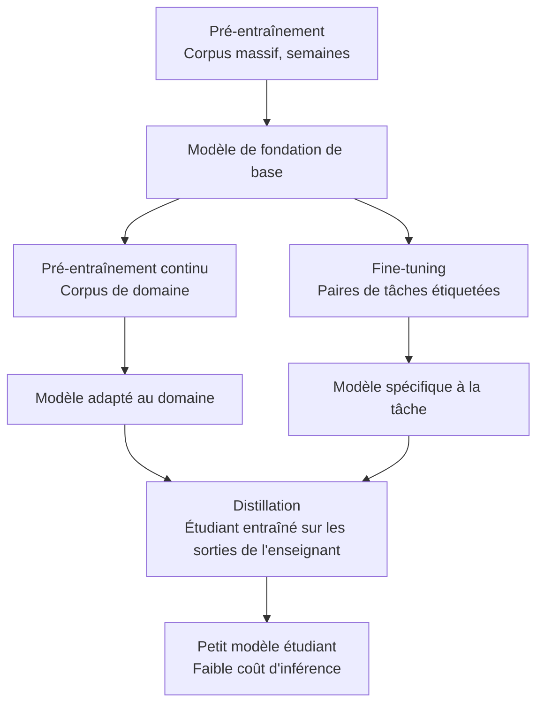
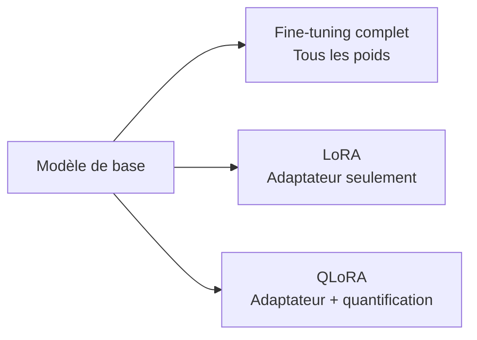
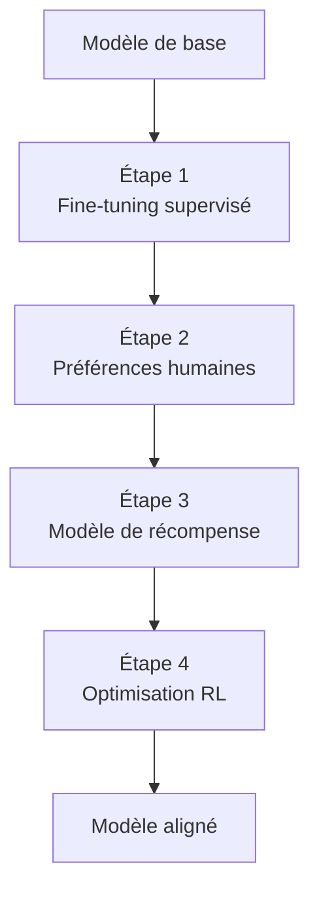
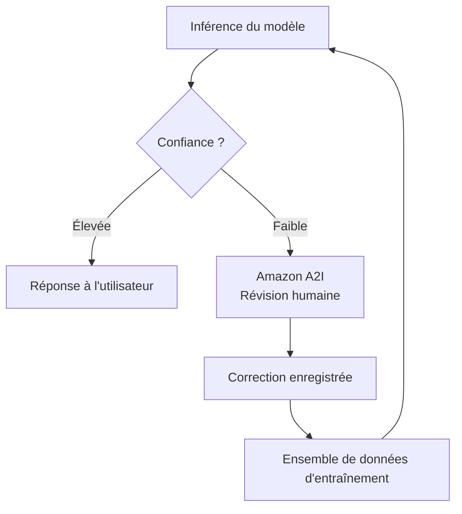
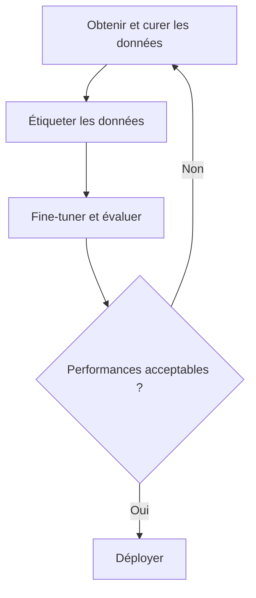

## Énoncé de tâche 3.3 : Décrire le processus d'entraînement et de fine-tuning des FM

Les modèles de fondation n'arrivent pas prêts pour chaque usage métier. Ils sont construits par étapes, chaque couche ajoutant de la spécificité à un coût qui augmente fortement avec l'ambition. Comprendre comment les modèles sont construits et adaptés n'est pas principalement un exercice technique pour le professionnel des affaires ; c'est un exercice de budgétisation et de cadrage. Connaître la différence entre le pré-entraînement, le fine-tuning, le pré-entraînement continu et la distillation vous permet de poser les bonnes questions lorsqu'une équipe d'ingénierie propose un projet de personnalisation, d'évaluer le calendrier et le budget proposés, et de reconnaître quand une approche plus simple produirait des résultats comparables.[^303001]

Les trois objectifs de cet énoncé de tâche suivent une séquence logique. Le premier couvre la taxonomie des techniques d'entraînement et leurs profils de coût. Le second couvre les méthodes spécifiques utilisées lorsque le fine-tuning est le bon choix. Le troisième couvre la façon dont les données doivent être préparées avant qu'un travail de fine-tuning puisse commencer, y compris les processus de retour humain qui alignent le comportement d'un modèle avec les attentes métier. Ensemble, ils fournissent le cadre dont un sponsor métier a besoin pour commander et superviser un projet de personnalisation de modèle sans avoir à écrire une seule ligne de code d'entraînement.

### 3.3.1 Éléments clés de l'entraînement d'un FM

L'entraînement d'un modèle de fondation n'est pas une activité unique. C'est une progression d'étapes, chacune s'appuyant sur la précédente, et chacune disponible comme point d'entrée selon ce dont une entreprise a besoin et combien elle peut investir. L'examen couvre quatre étapes : le pré-entraînement, le fine-tuning, le pré-entraînement continu et la distillation. Elles sont classées approximativement par coût du plus élevé au moins élevé, et par portée des changements du plus large au plus étroit.

Les quatre techniques ne sont pas des alternatives l'une à l'autre comme le fine-tuning et la RAG sont des alternatives. Le pré-entraînement crée le fondement. Le fine-tuning et le pré-entraînement continu ajustent ce qui existe déjà. La distillation comprime le résultat en un paquet plus petit. Une entreprise peut en utiliser plusieurs en séquence : partir d'un modèle pré-entraîné fourni par un tiers, appliquer le pré-entraînement continu pour lui enseigner le vocabulaire de son domaine, puis distiller le résultat pour une inférence de production économique.

**Le pré-entraînement** est le processus d'entraînement d'un réseau neuronal à partir de poids initiaux aléatoires sur un corpus énorme de texte et d'autres données.[^303002] Le modèle apprend des schémas statistiques à partir de milliards d'exemples : la grammaire, les associations factuelles, les chaînes de raisonnement et les relations entre les concepts. Le pré-entraînement crée la mémoire paramétrique du modèle, la connaissance intégrée dans ses poids sur laquelle il peut s'appuyer même quand aucun document externe n'est fourni. L'échelle requise est prohibitive pour la plupart des organisations. Une exécution d'entraînement pour un grand modèle de langage moderne consomme des milliers d'heures-GPU sur des semaines ou des mois, nécessite des pétaoctets de données curées, et coûte des millions de dollars avant que le modèle produise sa première phrase cohérente.[^303003] Le pré-entraînement est pertinent à l'examen comme point de référence à partir duquel toutes les autres techniques s'écartent, et non comme un élément d'action pratique pour toute entreprise en dehors des grands laboratoires de recherche en IA.

**Le fine-tuning** part d'un modèle pré-entraîné existant et continue l'entraînement sur un ensemble de données beaucoup plus petit et spécifique à un domaine.[^303004] L'objectif est de modifier le comportement du modèle vers une tâche cible : répondre aux questions du service client dans un ton particulier, extraire des champs structurés des dossiers médicaux, ou générer du code dans le cadre interne d'une entreprise. Le fine-tuning ajuste les poids du modèle, de sorte que le modèle résultant est un artefact distinct qui doit être stocké et servi. Il nécessite des exemples étiquetés, généralement des centaines à des dizaines de milliers de paires entrée-sortie, et un calcul GPU de l'ordre d'heures à jours plutôt que de semaines. **Amazon Bedrock** prend en charge le fine-tuning pour un sous-ensemble de ses modèles hébergés, notamment Amazon Nova, Meta Llama et certaines versions d'Anthropic Claude Haiku, produisant un modèle personnalisé qui peut ensuite être déployé avec un débit provisionné.[^303005] Le fine-tuning est le bon choix lorsque la tâche est stable (le comportement cible ne change pas d'un mois à l'autre), lorsque l'entreprise peut produire suffisamment d'exemples étiquetés, et lorsque l'amélioration des performances justifie le coût d'entraînement et d'hébergement.

**Le pré-entraînement continu** (également appelé *continued pre-training*) est une technique intermédiaire entre le pré-entraînement et le fine-tuning.[^303006] Au lieu de paires entrée-sortie étiquetées, le pré-entraînement continu utilise du texte de domaine non étiqueté, le même type de corpus non supervisé utilisé dans le pré-entraînement original, mais tiré d'un domaine spécifique comme la littérature médicale, les dépôts financiers ou la jurisprudence. L'objectif n'est pas d'apprendre au modèle une nouvelle tâche mais de lui apprendre le vocabulaire du domaine, la terminologie et les associations factuelles qui étaient sous-représentées dans le corpus de pré-entraînement original. Un modèle pré-entraîné sur du texte internet général peut traiter « marge brute », « valeur actualisée nette » et « EBITDA » comme du jargon financier qu'il reconnaît mais ne comprend pas profondément en contexte. Le pré-entraînement continu sur un corpus de rapports annuels, de notes d'analystes et de transcriptions d'appels de résultats améliore cette compréhension sans nécessiter de paires étiquetées. Amazon Bedrock prend en charge le pré-entraînement continu comme option de personnalisation pour certains modèles.[^303007]

**La distillation** adopte une approche différente du problème de coût. Plutôt que d'entraîner un modèle plus petit de zéro, la distillation entraîne un *modèle étudiant* compact à imiter les sorties d'un *modèle enseignant* plus grand et plus capable sur un ensemble cible d'invites.[^303008] L'enseignant génère des réponses à un large ensemble d'invites ; ces paires invite-réponse deviennent les données d'entraînement de l'étudiant. L'étudiant apprend à approximer la qualité de l'enseignant sans jamais accéder aux poids de l'enseignant. Une fois la distillation terminée, l'inférence de production est servie par l'étudiant, qui est plus rapide et moins coûteux par appel que l'enseignant. Amazon Bedrock prend en charge la distillation de modèle comme flux de travail géré, permettant aux organisations de désigner un modèle Bedrock comme enseignant, de spécifier la distribution d'invites cible, et de produire un modèle plus petit fine-tuné comme étudiant.[^303009] L'économie de la distillation favorise les applications à volume élevé où le coût d'entraînement unique est rapidement récupéré par les économies sur l'inférence.

*Figure 3.3.1 : Hiérarchie des techniques d'entraînement des FM. Chaque technique s'appuie sur un modèle existant plutôt que de partir de zéro, avec des exigences de coût et de données qui diminuent de gauche à droite à mesure que le point de départ devient plus riche.*

*Tableau 3.3.1 : Comparaison des techniques d'entraînement et d'adaptation des FM*

| Technique | Données d'entraînement | Coût de calcul | Délai de déploiement | Résultat principal | Point d'entrée AWS |
|---|---|---|---|---|---|
| Pré-entraînement | Pétaoctets, non étiquetés | Très élevé (millions d'heures-GPU) | Mois | Modèle de base à usage général | Non applicable (acheter auprès d'un fournisseur) |
| Pré-entraînement continu | Gigaoctets à téraoctets, non étiquetés | Moyen (jours) | Jours | Vocabulaire de domaine et associations factuelles | Modèles personnalisés Amazon Bedrock |
| Fine-tuning | Centaines à milliers de paires étiquetées | Faible à moyen (heures) | Heures à jours | Comportement et ton spécifiques à la tâche | Amazon Bedrock, SageMaker JumpStart |
| Distillation | Paires invite-réponse générées par l'enseignant | Moyen (unique) | Heures à jours | Petit modèle approximant la qualité d'un grand modèle | Distillation de modèle Amazon Bedrock |

L'examen présente fréquemment des scénarios qui demandent quelle technique correspond à une contrainte donnée. La logique de décision est la suivante : si le modèle doit apprendre un nouveau vocabulaire ou un domaine factuel sans ensemble de données étiqueté, utilisez le pré-entraînement continu. Si le modèle doit apprendre un comportement de tâche spécifique et que des données étiquetées sont disponibles, utilisez le fine-tuning. Si le modèle résultant doit être moins coûteux et plus rapide à l'inférence et que le coût d'entraînement est acceptable, ajoutez la distillation. Le pré-entraînement est la réponse uniquement lorsque la question indique explicitement qu'il n'existe aucun modèle pré-entraîné approprié, ce qui n'est pratiquement jamais le cas dans un scénario métier réel.

### 3.3.2 Méthodes de fine-tuning d'un FM

Le fine-tuning est la technique de personnalisation la plus couramment discutée dans les projets d'IA d'entreprise parce que son profil de coût se situe dans une plage pratique et que son résultat est un modèle que l'organisation contrôle. Plusieurs méthodes distinctes existent dans la large catégorie du fine-tuning, et l'examen attend une familiarité avec chacune.

Le fil conducteur de toutes les méthodes de fine-tuning est que les poids du modèle pré-entraîné sont le point de départ, et que l'entraînement sur des données spécifiques au domaine déplace ces poids. Ce qui diffère, c'est le format des données d'entraînement, la portion de l'architecture du modèle qui est modifiée et l'objectif d'apprentissage spécifique.

**L'instruction tuning** est le fine-tuning sur un ensemble de données de paires invite-réponse, où chaque invite est rédigée comme une instruction explicite et chaque réponse démontre le comportement souhaité.[^303010] Par exemple, une invite pourrait être « Résumez la plainte client suivante en une phrase : » suivie d'un e-mail client, et la réponse serait le résumé cible. Le modèle apprend à suivre le format d'instruction de manière fiable, et non pas seulement à produire du texte à consonance plausible dans le domaine. L'instruction tuning est ce qui transforme un modèle de base, qui prédit simplement le jeton suivant dans une séquence, en un modèle assistant qui répond aux commandes. La plupart des modèles disponibles dans le commerce décrits comme des variantes « chat » ou « instruct » ont déjà subi un instruction tuning ; les fine-tuner sur des paires d'instructions supplémentaires étend cette capacité à une tâche métier ou à un vocabulaire spécifique.

**L'adaptation des modèles à des domaines spécifiques** décrit l'objectif général de l'instruction tuning et du fine-tuning supervisé lorsqu'ils sont appliqués à des domaines professionnels.[^303011] Une organisation de santé pourrait fine-tuner sur des modèles de notes cliniques et des exemples de codage diagnostique afin que le modèle produise des sorties formatées pour les systèmes de dossiers de santé électroniques. Une équipe juridique pourrait fine-tuner sur des bibliothèques de clauses contractuelles pour améliorer la capacité du modèle à identifier des types de clauses spécifiques. Une société de services financiers pourrait fine-tuner sur des transcriptions d'appels de résultats et des rapports d'analystes pour améliorer la gestion par le modèle de la terminologie financière spécialisée. L'exigence clé est que les exemples d'entraînement représentent avec précision la distribution des entrées que le modèle déployé rencontrera ; l'entraînement sur des notes cliniques d'une spécialité puis l'utilisation sur une spécialité différente produit des résultats dégradés.

**L'apprentissage par transfert** est le concept théorique plus large qui sous-tend le fine-tuning.[^303012] L'apprentissage par transfert fait référence au principe de prendre un modèle qui a été entraîné pour une tâche et de réutiliser ses représentations apprises comme point de départ pour une tâche différente. Dans le contexte des grands modèles de langage, chaque opération de fine-tuning est une instance d'apprentissage par transfert : le modèle transfère sa compréhension générale du langage depuis le pré-entraînement vers le domaine de tâche spécifique. L'examen utilise l'apprentissage par transfert comme terme générique et le fine-tuning comme technique spécifique. Reconnaître qu'une question posant la question de « l'application des connaissances acquises sur une tâche pour améliorer les performances sur une tâche différente » décrit l'apprentissage par transfert aide à aligner correctement la réponse.

**Le pré-entraînement continu** (couvert en 3.3.1) est mentionné ici uniquement pour signaler le schéma courant en deux étapes : d'abord appliquer le pré-entraînement continu sur le corpus non étiqueté pour établir le vocabulaire de domaine et l'ancrage factuel, puis appliquer l'instruction tuning sur un ensemble de données étiqueté plus petit pour enseigner le comportement spécifique à la tâche.[^303013] L'approche en deux étapes produit de meilleurs résultats que l'une ou l'autre technique utilisée seule lorsque le domaine est très spécialisé.

**Le fine-tuning efficace en paramètres** (PEFT) répond à l'une des principales contraintes pratiques du fine-tuning : le fine-tuning complet met à jour chaque poids du modèle, ce qui nécessite la même capacité en mémoire et en calcul que l'entraînement du modèle en premier lieu.[^303014] Les méthodes PEFT réduisent cette charge en gelant la plupart des poids du modèle et en n'entraînant qu'un petit ensemble de paramètres supplémentaires. **LoRA** (*Low-Rank Adaptation*) est la méthode PEFT la plus largement utilisée. Elle insère de petites matrices entraînables dans certaines couches de l'architecture du transformeur ; seules ces matrices d'adaptateur sont mises à jour pendant l'entraînement tandis que les poids originaux restent gelés.[^303015] Le nombre de paramètres entraînables dans une configuration LoRA peut représenter un pour cent du nombre total de paramètres du modèle, réduisant les exigences en mémoire GPU d'un facteur correspondant. **QLoRA** (*Quantized LoRA*) combine LoRA avec la *quantification*, qui est la compression des poids du modèle de valeurs en virgule flottante 32 bits ou 16 bits à des entiers 4 bits, permettant le fine-tuning de modèles qui ne rentreraient autrement pas dans le matériel disponible.[^303016] Pour les besoins métier, LoRA et QLoRA sont importants parce qu'ils rendent le fine-tuning de modèles plus grands et de meilleure qualité accessible sans nécessiter les instances GPU les plus coûteuses.

*Figure 3.3.2 : Méthodes de fine-tuning efficaces en paramètres. LoRA et QLoRA réduisent le nombre de paramètres nécessitant des mises à jour de gradient, rendant le fine-tuning accessible sur des configurations matérielles plus petites.*

AWS fournit deux points d'entrée principaux pour le fine-tuning. **Amazon Bedrock** prend en charge le fine-tuning de ses modèles hébergés via un flux de travail géré : le client télécharge un ensemble de données d'entraînement vers **Amazon S3**, configure le travail de fine-tuning dans la console ou l'API Bedrock, et Bedrock gère l'infrastructure, l'exécution de l'entraînement et le stockage du modèle personnalisé résultant.[^303017] Le modèle personnalisé est ensuite disponible pour l'inférence via un débit provisionné, qui réserve une capacité dédiée et est facturé à l'heure quelle que soit le volume de requêtes, ou via un mode sans serveur pour les cas d'usage à faible volume. **Amazon SageMaker JumpStart** fournit un catalogue de modèles open source pré-entraînés, notamment les familles Meta Llama, Mistral et Falcon, ainsi que des flux de travail de fine-tuning en un clic qui déploient le travail d'entraînement sur l'infrastructure gérée de SageMaker.[^303018] JumpStart est approprié lorsque l'entreprise nécessite un modèle qu'elle peut exécuter dans son propre compte AWS sur son propre calcul, plutôt que de s'appuyer sur l'API hébergée de Bedrock. Il prend également en charge les configurations LoRA et QLoRA pour les modèles où le fine-tuning complet dépasserait la mémoire GPU disponible.

*Tableau 3.3.2 : Comparaison des points d'entrée AWS pour le fine-tuning*

| Capacité | Amazon Bedrock | Amazon SageMaker JumpStart |
|---|---|---|
| Disponibilité des modèles | Modèles hébergés Bedrock (Amazon Nova, Meta Llama, certaines versions d'Anthropic Claude Haiku) | Modèles open source (Llama, Mistral, Falcon et autres) |
| Gestion de l'infrastructure | Entièrement géré par AWS | Entraînement et déploiement gérés sur SageMaker |
| Emplacement des données d'entraînement | Amazon S3 | Amazon S3 |
| Prise en charge PEFT (LoRA/QLoRA) | Varie selon le modèle | Pris en charge pour les modèles compatibles |
| Mode d'inférence | Débit provisionné ou à la demande | Point de terminaison en temps réel SageMaker ou transformation par lot |
| Idéal pour | Modèles commerciaux à poids fermés avec hébergement géré | Modèles open source, propriété complète du modèle |

Le choix entre Bedrock et JumpStart est principalement une question de propriété du modèle. Le fine-tuning Bedrock ajuste le comportement d'un modèle hébergé qu'AWS continue de servir ; l'entreprise ne possède pas les poids résultants. Le fine-tuning JumpStart produit un artefact de modèle dans le compartiment S3 de l'organisation, donnant une portabilité et un contrôle complets sur les poids. Pour les organisations des secteurs réglementés où les artefacts de modèle doivent être auditables et contrôlables dans leur propre environnement, JumpStart est le chemin privilégié.

### 3.3.3 Comment préparer les données pour le fine-tuning d'un FM

La qualité des données est la variable la plus importante dans un projet de fine-tuning. Un modèle entraîné sur des données défectueuses apprend un comportement défectueux de manière fiable. Un modèle entraîné sur d'excellentes données peut obtenir des améliorations de qualité substantielles par rapport à un modèle de base même avec un nombre relativement faible d'exemples. Le processus de préparation des données implique plusieurs activités distinctes qui doivent être planifiées avant le début de tout travail d'entraînement.

**La curation des données** est le processus de sélection, de filtrage et de nettoyage des exemples à inclure dans l'ensemble de données d'entraînement.[^303019] La curation commence par un ensemble candidat, qui peut être des interactions client existantes, des documents internes, des sorties historiques étiquetées ou des exemples créés à des fins spécifiques, et supprime systématiquement les éléments incorrects, ambigus ou non représentatifs. Les activités concrètes de curation incluent la suppression des exemples dupliqués (qui peuvent amener le modèle à surappliquer des schémas communs), le filtrage des exemples contenant des erreurs factuelles ou des informations obsolètes, la suppression des exemples trop courts pour être informatifs, et l'équilibrage de la distribution des types d'exemples afin que le modèle n'apprenne pas une version biaisée de la tâche. Pour les ensembles de données d'instruction tuning, la curation signifie également vérifier que l'instruction et la réponse sont réellement alignées ; un ensemble de données qui associe une question sur la facturation à une réponse sur le support technique apprendra au modèle une association incorrecte.

**La gouvernance des données** couvre les contrôles légaux, éthiques et opérationnels qui s'appliquent aux données d'entraînement.[^303020] Trois préoccupations sont les plus importantes. Premièrement, la gestion des *informations personnellement identifiables* (IPI) : les données d'entraînement doivent être criblées pour les noms, adresses e-mail, numéros de compte, informations de santé et autres IPI. L'inclusion d'IPI dans les données d'entraînement crée un risque que le modèle les reproduise dans ses réponses, ce qui viole les réglementations sur la vie privée dans la plupart des juridictions. Les outils automatisés de détection des IPI, tels que la capacité de reconnaissance d'entités d'**Amazon Comprehend**, peuvent cribler les documents à grande échelle avant qu'ils n'entrent dans le pipeline d'entraînement.[^303021] Deuxièmement, le consentement : les données utilisées pour l'entraînement doivent avoir été collectées avec des conditions permettant leur utilisation à cette fin. Troisièmement, la *traçabilité des données* : l'organisation doit être capable de retracer chaque exemple d'entraînement jusqu'à sa source, de vérifier que la source est sous licence pour l'utilisation à des fins d'entraînement, et de reproduire l'ensemble de données d'entraînement si un audit de conformité l'exige. La tenue d'un manifeste des sources de données d'entraînement et de leur provenance satisfait à cette exigence.

**La taille de l'ensemble de données** pour le fine-tuning est plus petite que ce que les intuitions issues du pré-entraînement suggèreraient, mais elle n'est pas triviale.[^303022] Un travail d'instruction tuning typique pour l'adaptation à une tâche nécessite des centaines à plusieurs milliers d'exemples étiquetés de haute qualité pour produire une amélioration mesurable. Le principe qualité-quantité s'applique directement : cinq cents exemples soigneusement curés, précis et diversifiés surpassent systématiquement cinq mille exemples incluant des doublons, des erreurs et des éléments hors sujet. Le minimum pratique pour un fine-tuning significatif se situe généralement dans la plage de deux cents à cinq cents exemples ; en dessous de ce seuil, le modèle ne rencontre pas suffisamment de variété pour généraliser de manière fiable. À la limite supérieure, les améliorations des performances de la tâche plafonnent généralement après plusieurs milliers d'exemples pour une tâche étroitement définie, point auquel l'ajout de données supplémentaires produit des rendements décroissants à moins que les nouveaux exemples ne couvrent de véritables nouveaux sous-scénarios.

**L'étiquetage** est le processus de création ou de vérification du côté sortie de chaque exemple d'entraînement.[^303023] Pour l'instruction tuning, l'étiquetage signifie rédiger ou réviser la réponse cible pour chaque invite. La qualité de l'étiquetage a un effet disproportionné sur les résultats du fine-tuning parce que le modèle traite chaque exemple étiqueté comme une vérité terrain. Les erreurs d'étiquetage apprennent au modèle un comportement incorrect, et le modèle peut généraliser ces erreurs à des entrées qu'il n'a jamais vues. Des directives d'étiquetage cohérentes, examinées par plus d'un annotateur et arbitrées en cas de désaccord, constituent le fondement opérationnel d'un ensemble de données d'entraînement fiable. **Amazon SageMaker Ground Truth** est le service AWS géré pour organiser des flux de travail d'étiquetage humain à grande échelle, prenant en charge à la fois les types de tâches intégrés (classification d'images, classification de texte, reconnaissance d'entités nommées) et les interfaces de tâches personnalisées pour les besoins d'étiquetage spécifiques au domaine.[^303024] **Amazon SageMaker Ground Truth Plus** étend le service avec une main-d'œuvre gérée fournie par AWS, éliminant la nécessité de recruter et de gérer directement des annotateurs externes.[^303025]

**La représentativité** est la propriété d'un ensemble de données d'entraînement qui garantit que les exemples couvrent collectivement la distribution des entrées que le modèle déployé rencontrera réellement.[^303026] Un ensemble de données qui n'est pas représentatif produit un modèle avec une faiblesse cachée : il fonctionne bien sur les entrées sur lesquelles il a été entraîné et se dégrade sur les entrées sur lesquelles il ne l'a pas été. Par exemple, un modèle de service client entraîné exclusivement sur des interactions en anglais avec des utilisateurs d'une région fonctionnera mal lorsqu'il sera déployé globalement auprès d'utilisateurs dont la formulation reflète différentes conventions culturelles. La représentativité nécessite de construire intentionnellement l'ensemble de données d'entraînement pour inclure des cas limites, la variété linguistique, la diversité des sujets et toute sous-population que le modèle déployé est censé servir. La vérification de la représentativité est une responsabilité continue ; à mesure que la distribution des entrées du modèle déployé évolue au fil du temps, l'ensemble de données d'entraînement peut nécessiter une actualisation.

**L'apprentissage par renforcement à partir du retour humain (RLHF)** est une méthodologie d'entraînement qui améliore l'alignement d'un modèle avec les préférences humaines plutôt que simplement sa précision sur une tâche étiquetée.[^303027] Les pipelines RLHF de production commencent généralement par un préchauffage par fine-tuning supervisé (SFT) qui aligne le modèle de base sur le suivi des instructions avant que des données de préférence soient collectées ; cette étape SFT est représentée comme la première case de la Figure 3.3.3. Les étapes restantes sont les suivantes : des annotateurs humains classent plusieurs réponses générées par le modèle à la même invite du meilleur au pire, un *modèle de récompense* distinct est entraîné pour prédire ces classements humains (étant donné une invite et une réponse, le modèle de récompense prédit le score qu'un annotateur humain attribuerait), et le modèle principal est ensuite fine-tuné en utilisant un algorithme d'*apprentissage par renforcement*, spécifiquement l'*Optimisation de Politique Proximale* (PPO) dans la formulation originale, avec le modèle de récompense fournissant le signal d'entraînement.[^303028] Le modèle apprend à générer des réponses que le modèle de récompense note hautement, ce qui correspond aux réponses que les annotateurs humains préfèrent. Le RLHF est la technique qui a transformé les grands modèles de langage de base en assistants utiles et suivant des instructions que la plupart des gens utilisent aujourd'hui ; c'est la phase d'entraînement qui enseigne au modèle à être utile plutôt que simplement fluide.

*Figure 3.3.3 : Pipeline RLHF. Les données de préférence humaine entraînent un modèle de récompense, qui guide ensuite l'apprentissage par renforcement pour aligner le modèle principal avec les préférences des annotateurs.*

**Amazon A2I** (**Amazon Augmented AI**) répond à un problème connexe mais distinct : non pas l'entraînement du modèle, mais la révision humaine continue des sorties du modèle en production.[^303029] Là où le RLHF collecte des jugements humains pour améliorer les poids du modèle, A2I achemine des sorties d'inférence spécifiques vers des réviseurs humains lorsque la confiance du modèle tombe en dessous d'un seuil ou lorsque le type de tâche impose une supervision humaine. Par exemple, un flux de travail de traitement de documents financiers pourrait envoyer chaque sortie où la confiance du modèle est inférieure à 90 % à une file d'attente de réviseurs humains, avec les corrections des réviseurs alimentant un futur cycle de fine-tuning. A2I s'intègre avec les modèles SageMaker et prend en charge les interfaces de tâches de révision humaine personnalisées, en faisant un complément naturel de Ground Truth dans le volant de données de bout en bout.

*Figure 3.3.4 : Volant de données humain en boucle. Amazon A2I achemine les sorties à faible confiance vers des réviseurs humains ; les corrections reviennent via Ground Truth dans le prochain cycle de fine-tuning, améliorant continuellement le modèle.*

*Tableau 3.3.3 : Activités de préparation des données et outils AWS*

| Activité | Ce qu'elle traite | Outil ou service AWS |
|---|---|---|
| Détection et suppression des IPI | Conformité à la vie privée, gouvernance des données | Reconnaissance d'entités Amazon Comprehend |
| Étiquetage humain à grande échelle | Création d'ensemble de données étiqueté, qualité des étiquettes | Amazon SageMaker Ground Truth |
| Main-d'œuvre d'étiquetage gérée | Recrutement et gestion des annotateurs | Amazon SageMaker Ground Truth Plus |
| Révision humaine des sorties du modèle | Assurance qualité continue, collecte de retour | Amazon Augmented AI (A2I) |
| Stockage des données d'entraînement | Entrée sécurisée et évolutive pour les travaux d'entraînement | Amazon S3 |
| Exécution des travaux d'entraînement | Calcul et orchestration du fine-tuning | Modèles personnalisés Amazon Bedrock, SageMaker JumpStart |

Le processus de préparation des données pour un projet de fine-tuning est itératif, pas linéaire. Un ensemble de données initial est curé, le modèle est entraîné, ses sorties sont évaluées, les erreurs sont diagnostiquées, et les données d'entraînement sont corrigées ou augmentées avant la prochaine exécution d'entraînement. Ce cycle se répète généralement deux à quatre fois avant que le modèle atteigne la qualité cible. Les organisations qui traitent la préparation des données comme une activité ponctuelle avant l'entraînement finissent par répéter les travaux d'entraînement plus souvent et à un coût total plus élevé que celles qui investissent dès le départ dans un pipeline de données systématique.

*Figure 3.3.5 : Flux de travail de préparation des données de fine-tuning de bout en bout. La curation des données, l'étiquetage et l'évaluation forment un cycle itératif ; les lacunes identifiées lors de l'évaluation entraînent des ajouts ciblés à l'ensemble de données d'entraînement.*

Un sponsor métier supervisant un projet de fine-tuning devrait s'attendre à investir dans la préparation des données un temps qui équivaut approximativement au temps consacré à l'entraînement et à l'évaluation du modèle combinés. Le calcul d'entraînement est mesurable et souvent cité en premier par les équipes d'ingénierie ; le travail de préparation des données est fréquemment sous-estimé, notamment lorsque l'étiquetage nécessite des experts du domaine (médecins, avocats, analystes financiers) plutôt que des annotateurs polyvalents. Budgétiser les deux moitiés de l'effort dès le départ produit des plans de projet plus fiables.

## Questions d'auto-évaluation

**Question 1.** Une entreprise de santé souhaite utiliser un modèle de fondation pour aider les médecins avec la documentation clinique. L'entreprise dispose d'une grande archive de notes cliniques dépersonnalisées mais d'aucune paire question-réponse étiquetée. La principale faiblesse du modèle est sa méconnaissance de la terminologie médicale. Quelle technique de personnalisation est la PLUS appropriée comme première étape ?

A. Fine-tuner le modèle sur des paires instruction-réponse tirées des notes cliniques  
B. Appliquer le pré-entraînement continu au modèle sur l'archive de notes cliniques non étiquetées  
C. Distiller le modèle en un modèle étudiant plus petit à l'aide d'invites générées par des médecins  
D. Utiliser l'apprentissage en contexte en collant des notes cliniques dans chaque invite au moment de l'exécution  

**Explication :** Le scénario présente deux caractéristiques déterminantes : il existe un grand corpus non étiqueté et la principale faiblesse est le vocabulaire de domaine plutôt que le comportement de la tâche. Le pré-entraînement continu (réponse B) est conçu précisément pour cette situation. Il utilise du texte de domaine non étiqueté pour apprendre au modèle la terminologie et les associations factuelles du domaine cible sans nécessiter d'exemples étiquetés. C'est la première étape correcte avant tout instruction tuning. Le fine-tuning sur des paires instruction-réponse (réponse A) nécessiterait un ensemble de données étiqueté que l'entreprise ne possède pas encore et ne traiterait pas la lacune de vocabulaire racine aussi efficacement que l'entraînement non supervisé sur les notes brutes. La distillation (réponse C) produit un modèle plus petit qui imite les sorties d'un enseignant ; elle ne traite pas directement les faiblesses du vocabulaire de domaine et nécessite un modèle enseignant capable comme point de départ. L'apprentissage en contexte (réponse D) ne peut pas s'étendre au niveau de couverture de domaine nécessaire et consomme de l'espace de fenêtre de contexte qui pourrait autrement transporter les données cliniques réelles du patient. La séquence correcte pour cette organisation est d'abord le pré-entraînement continu, suivi de l'instruction tuning une fois qu'un ensemble de données étiqueté est disponible.[^303030]

---

**Question 2.** Une équipe d'ingénierie propose de fine-tuner un modèle open source de 70 milliards de paramètres à l'aide de SageMaker JumpStart. L'instance GPU disponible dispose de 24 Go de VRAM. L'équipe estime que le fine-tuning complet nécessiterait environ 140 Go de mémoire GPU. Quelle technique de fine-tuning efficace en paramètres est la PLUS appropriée pour cette contrainte ?

A. L'instruction tuning avec un modèle d'invite plus grand pour compenser l'écart de paramètres  
B. QLoRA, qui combine l'entraînement de matrices d'adaptateurs avec la quantification 4 bits pour réduire les exigences en mémoire  
C. Le pré-entraînement continu sur le corpus du modèle de base non étiqueté, qui réduit le nombre de paramètres entraînables  
D. La distillation, qui compresse le modèle de 70 milliards de paramètres pour tenir dans 24 Go  

**Explication :** La contrainte est la mémoire GPU : le fine-tuning complet nécessite 140 Go mais seulement 24 Go sont disponibles. QLoRA (réponse B) résout directement ce problème. Il applique la quantification 4 bits aux poids du modèle de base gelés, réduisant considérablement leur empreinte mémoire, puis entraîne uniquement de petites matrices d'adaptateur LoRA par-dessus. Les exigences en mémoire combinées d'un modèle de base quantifié plus des adaptateurs LoRA tombent généralement bien dans la VRAM d'un seul GPU même pour les grands modèles. L'instruction tuning avec un modèle d'invite plus grand (réponse A) est une approche de formatage des données, pas une technique de réduction de la mémoire ; cela ne changerait rien à l'exigence en mémoire GPU. Le pré-entraînement continu (réponse C) est une technique distincte qui met à jour tous les poids à l'aide de texte de domaine non étiqueté ; il ne traite pas les contraintes de mémoire GPU et nécessiterait encore plus de mémoire que le fine-tuning supervisé que l'équipe essaie d'exécuter. La distillation (réponse D) est une technique distincte qui crée un nouveau modèle plus petit ; elle ne compresse pas un modèle existant pour fonctionner sur un matériel plus petit comme le fait QLoRA, et elle nécessiterait elle-même un enseignant capable pour générer des données d'entraînement plutôt que de produire le modèle 70B fine-tuné que l'équipe souhaite.[^303031]

---

**Question 3.** Une entreprise a fine-tuné un modèle de fondation pour le support client et souhaite l'améliorer en continu sur la base des interactions de production réelles. L'équipe prévoit d'acheminer les réponses du modèle en dessous d'un seuil de confiance vers des réviseurs humains et d'incorporer les corrections examinées dans le prochain cycle d'entraînement. Quel service AWS est le PLUS directement conçu pour prendre en charge l'étape d'acheminement de la révision humaine ?

A. Amazon SageMaker Ground Truth  
B. Amazon Comprehend  
C. Amazon Augmented AI (A2I)  
D. Amazon SageMaker JumpStart  

**Explication :** Amazon Augmented AI (A2I) (réponse C) est le service spécifiquement conçu pour acheminer les sorties d'inférence de production vers des réviseurs humains lorsque des conditions définies sont remplies, par exemple un score de confiance du modèle tombant en dessous d'un seuil. Il gère la file d'attente des réviseurs, l'interface de tâche et la sortie des décisions examinées. C'est exactement l'étape décrite dans la question. Amazon SageMaker Ground Truth (réponse A) est utilisé pour créer des ensembles de données d'entraînement étiquetés via des flux de travail d'étiquetage humain organisés ; c'est l'outil pour l'étape d'enregistrement des corrections et de fine-tuning futur dans le volant, pas pour acheminer les sorties de production en direct vers les réviseurs. Amazon Comprehend (réponse B) est un service de traitement du langage naturel utilisé pour des tâches telles que l'analyse des sentiments et l'extraction d'entités ; il ne route pas les sorties du modèle pour révision. Amazon SageMaker JumpStart (réponse D) est un service d'entraînement et de déploiement de modèles ; il ne fournit pas de capacité d'acheminement de révision humaine pour les sorties d'inférence de production. La réponse correcte est A2I pour l'étape d'acheminement de la révision, avec Ground Truth utilisé dans l'étape suivante pour convertir les corrections examinées en un ensemble de données d'entraînement étiqueté.[^303032]

---

**Question 4.** Une société de services juridiques souhaite fine-tuner un modèle sur des données contractuelles internes. L'équipe juridique craint que l'ensemble de données d'entraînement puisse contenir des informations personnellement identifiables de vrais contrats clients. Quelle approche répond LE MIEUX à cette préoccupation avant le début du travail d'entraînement ?

A. Utiliser Amazon SageMaker JumpStart pour appliquer LoRA, ce qui empêche le modèle de mémoriser des détails spécifiques aux clients  
B. Appliquer la reconnaissance d'entités d'Amazon Comprehend pour détecter et supprimer les IPI du corpus d'entraînement  
C. Utiliser Amazon Bedrock Guardrails au moment de l'inférence pour empêcher les IPI d'apparaître dans les réponses du modèle  
D. Limiter l'ensemble de données de fine-tuning aux contrats de moins de cinq ans  

**Explication :** La préoccupation est que des IPI seront présentes dans les données d'entraînement avant l'exécution du travail d'entraînement. L'approche correcte consiste à détecter et supprimer les IPI du corpus d'entraînement au moment de la préparation des données (réponse B). La capacité de reconnaissance d'entités d'Amazon Comprehend peut identifier les noms, adresses, numéros de compte et autres catégories d'IPI à grande échelle dans de grandes collections de documents, permettant un criblage automatisé avant l'entraînement. LoRA (réponse A) réduit le nombre de paramètres entraînés mais n'empêche pas le modèle d'apprendre et de reproduire des schémas présents dans les données d'entraînement, y compris les IPI ; le fine-tuning efficace en paramètres est une optimisation du calcul, pas un contrôle de gouvernance des données. Amazon Bedrock Guardrails (réponse C) filtre les sorties du modèle au moment de l'inférence, ce qui est une défense en profondeur utile mais ne traite pas le problème racine que le modèle a été entraîné sur des IPI et peut les avoir internalisées. La restriction par âge du contrat (réponse D) traite la récence des données mais n'a aucun rapport avec le fait que les contrats contiennent des IPI ; les anciens et les nouveaux contrats peuvent également contenir des informations sensibles sur les clients. La réponse correcte est de cribler et d'assainir le corpus d'entraînement avant de commencer l'entraînement.[^303033]

---

**Question 5.** Une entreprise a terminé le fine-tuning d'un modèle pour le traitement des demandes d'indemnisation d'assurance. Lors de l'évaluation, le modèle fonctionne excellemment sur les demandes simples mais mal sur les demandes impliquant des circonstances inhabituelles. L'équipe d'ingénierie soupçonne que l'ensemble de données d'entraînement sous-représente les cas limites. Quelle action traite LE PLUS directement ce problème de représentativité ?

A. Augmenter le nombre d'époques d'entraînement pour permettre au modèle plus de temps pour apprendre les cas limites  
B. Appliquer QLoRA pour réduire les exigences en mémoire, ce qui libérera du calcul pour un entraînement plus diversifié  
C. Augmenter l'ensemble de données d'entraînement avec des exemples supplémentaires couvrant spécifiquement les types de cas limites sous-représentés  
D. Passer du fine-tuning Amazon Bedrock à SageMaker JumpStart pour accéder à un modèle plus grand  

**Explication :** La cause racine est un écart de représentativité dans les données d'entraînement : les cas limites sont présents en production mais absents ou très sous-représentés dans l'ensemble d'entraînement. L'action correcte est d'augmenter l'ensemble de données d'entraînement avec des exemples supplémentaires couvrant ces cas limites spécifiques (réponse C). Cela traite directement le décalage de distribution. L'augmentation des époques d'entraînement (réponse A) entraîne le modèle plus de fois sur les mêmes données ; si ces données n'incluent pas les cas limites, plus d'époques n'apprendront pas au modèle à les gérer et peuvent provoquer un surajustement aux exemples présents. QLoRA (réponse B) est une optimisation de la mémoire pour le fine-tuning ; il n'a aucun effet sur la distribution des données d'entraînement ni sur la couverture des cas limites par le modèle. Passer à SageMaker JumpStart ou à un modèle plus grand (réponse D) pourrait augmenter la capacité du modèle, mais un modèle plus grand entraîné sur le même ensemble de données insuffisamment représentatif fonctionnera toujours mal sur les cas limites ; la capacité du modèle n'est pas la contrainte ici, c'est la couverture des données d'entraînement qui l'est. La réponse correcte découle directement du principe de représentativité : corriger la distribution des données pour qu'elle corresponde à la distribution des entrées cibles.[^303034]

[^303001]: AWS Certification. AI Practitioner (AIF-C01) Exam Guide v1.1, Task Statement 3.3. URL: <https://docs.aws.amazon.com/aws-certification/latest/ai-practitioner-01/ai-practitioner-01-domain3.html>
[^303002]: Bommasani, R., et al. On the Opportunities and Risks of Foundation Models (Stanford CRFM, 2021). URL: <https://arxiv.org/abs/2108.07258>
[^303003]: Patterson, D., et al. Carbon Emissions and Large Neural Network Training (2021). URL: <https://arxiv.org/abs/2104.10350>
[^303004]: Howard, J., and Ruder, S. Universal Language Model Fine-tuning for Text Classification (ULMFiT, 2018). URL: <https://arxiv.org/abs/1801.06146>
[^303005]: Amazon Bedrock. Fine-tuning foundation models in Amazon Bedrock. URL: <https://docs.aws.amazon.com/bedrock/latest/userguide/custom-models.html>
[^303006]: Amazon Bedrock. Continued pre-training in Amazon Bedrock. URL: <https://docs.aws.amazon.com/bedrock/latest/userguide/custom-models-continued-pretraining.html>
[^303007]: Amazon Bedrock. Customization options for foundation models in Amazon Bedrock. URL: <https://docs.aws.amazon.com/bedrock/latest/userguide/custom-models.html>
[^303008]: Hinton, G., et al. Distilling the Knowledge in a Neural Network (2015). URL: <https://arxiv.org/abs/1503.02531>
[^303009]: Amazon Bedrock. Model distillation in Amazon Bedrock. URL: <https://docs.aws.amazon.com/bedrock/latest/userguide/model-distillation.html>
[^303010]: Wei, J., et al. Finetuned Language Models Are Zero-Shot Learners (FLAN, 2021). URL: <https://arxiv.org/abs/2109.01652>
[^303011]: Amazon Bedrock. Use cases for fine-tuning in Amazon Bedrock. URL: <https://docs.aws.amazon.com/bedrock/latest/userguide/custom-models.html>
[^303012]: Pan, S.J., and Yang, Q. A Survey on Transfer Learning (2010). URL: <https://doi.org/10.1109/TKDE.2009.191>
[^303013]: Amazon Bedrock. Continued pre-training vs. fine-tuning in Amazon Bedrock. URL: <https://docs.aws.amazon.com/bedrock/latest/userguide/custom-models-continued-pretraining.html>
[^303014]: Ding, N., et al. Parameter-Efficient Fine-Tuning of Large-Scale Pre-trained Language Models (2023). URL: <https://arxiv.org/abs/2303.15647>
[^303015]: Hu, E., et al. LoRA: Low-Rank Adaptation of Large Language Models (2021). URL: <https://arxiv.org/abs/2106.09685>
[^303016]: Dettmers, T., et al. QLoRA: Efficient Finetuning of Quantized LLMs (2023). URL: <https://arxiv.org/abs/2305.14314>
[^303017]: Amazon Bedrock. Training data requirements for fine-tuning in Amazon Bedrock. URL: <https://docs.aws.amazon.com/bedrock/latest/userguide/model-customization-prepare.html>
[^303018]: Amazon SageMaker. Amazon SageMaker JumpStart foundation models. URL: <https://docs.aws.amazon.com/sagemaker/latest/dg/studio-jumpstart.html>
[^303019]: Allamanis, M., et al. A Survey of Machine Learning for Big Code and Naturalness (2018). URL: <https://arxiv.org/abs/1709.06182>
[^303020]: NIST. AI Risk Management Framework (AI RMF 1.0), Measure 2.2. URL: <https://airc.nist.gov/RMF>
[^303021]: Amazon Comprehend. Detecting personally identifiable information (PII) using Amazon Comprehend. URL: <https://docs.aws.amazon.com/comprehend/latest/dg/how-pii.html>
[^303022]: Kaplan, J., et al. Scaling Laws for Neural Language Models (2020). URL: <https://arxiv.org/abs/2001.08361>
[^303023]: Northcutt, C., et al. Pervasive Label Errors in Test Sets Destabilize Machine Learning Benchmarks (2021). URL: <https://arxiv.org/abs/2103.14749>
[^303024]: Amazon SageMaker. Amazon SageMaker Ground Truth. URL: <https://docs.aws.amazon.com/sagemaker/latest/dg/sms.html>
[^303025]: Amazon SageMaker. Amazon SageMaker Ground Truth Plus. URL: <https://docs.aws.amazon.com/sagemaker/latest/dg/gtp.html>
[^303026]: Mehrabi, N., et al. A Survey on Bias and Fairness in Machine Learning (2021). URL: <https://arxiv.org/abs/1908.09635>
[^303027]: Ouyang, L., et al. Training language models to follow instructions with human feedback (InstructGPT, 2022). URL: <https://arxiv.org/abs/2203.02155>
[^303028]: Schulman, J., et al. Proximal Policy Optimization Algorithms (2017). URL: <https://arxiv.org/abs/1707.06347>
[^303029]: Amazon Augmented AI. Amazon Augmented AI (Amazon A2I) overview. URL: <https://docs.aws.amazon.com/sagemaker/latest/dg/a2i-use-augmented-ai-a2i-human-review-loops.html>
[^303030]: Amazon Bedrock. Continued pre-training for domain adaptation in Amazon Bedrock. URL: <https://docs.aws.amazon.com/bedrock/latest/userguide/custom-models-continued-pretraining.html>
[^303031]: Dettmers, T., et al. QLoRA: Efficient Finetuning of Quantized LLMs (2023). URL: <https://arxiv.org/abs/2305.14314>
[^303032]: Amazon Augmented AI. When to use Amazon A2I for human review loops. URL: <https://docs.aws.amazon.com/sagemaker/latest/dg/a2i-use-augmented-ai-a2i-human-review-loops.html>
[^303033]: Amazon Comprehend. PII detection and redaction with Amazon Comprehend. URL: <https://docs.aws.amazon.com/comprehend/latest/dg/how-pii.html>
[^303034]: Amazon Bedrock. Preparing training datasets for fine-tuning in Amazon Bedrock. URL: <https://docs.aws.amazon.com/bedrock/latest/userguide/model-customization-prepare.html>
