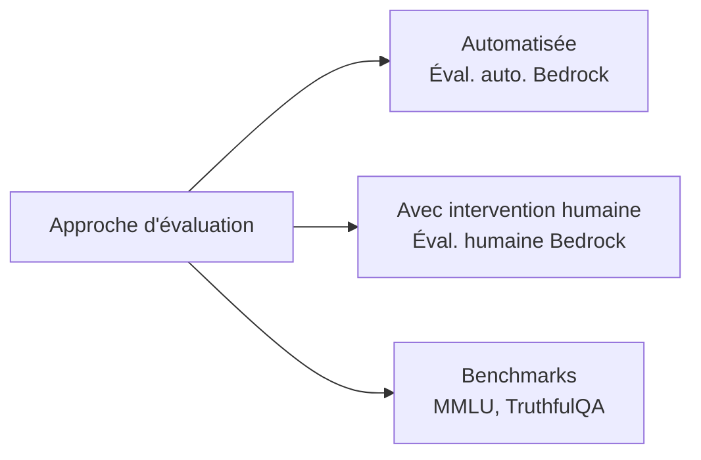
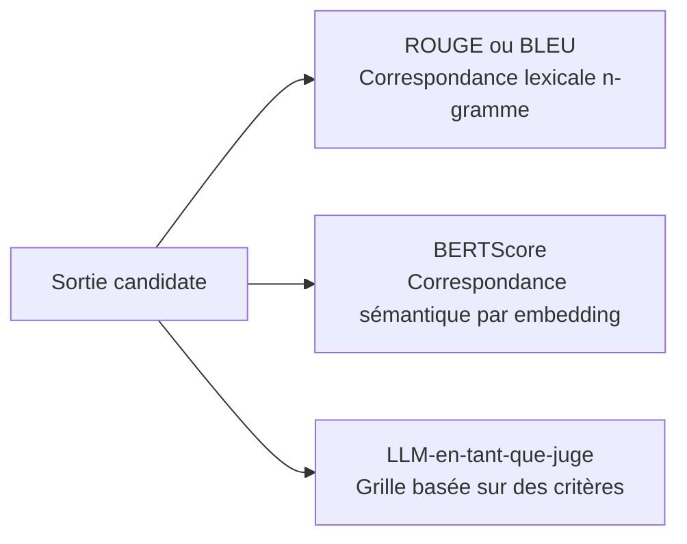
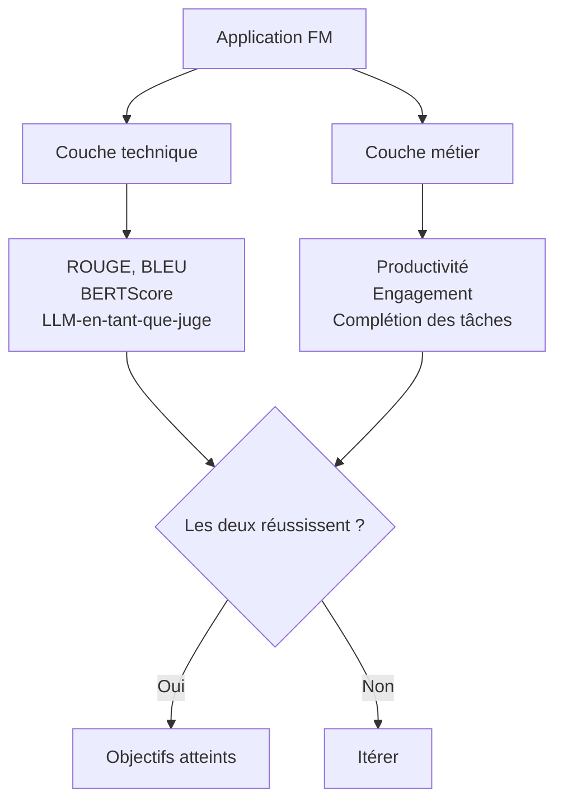
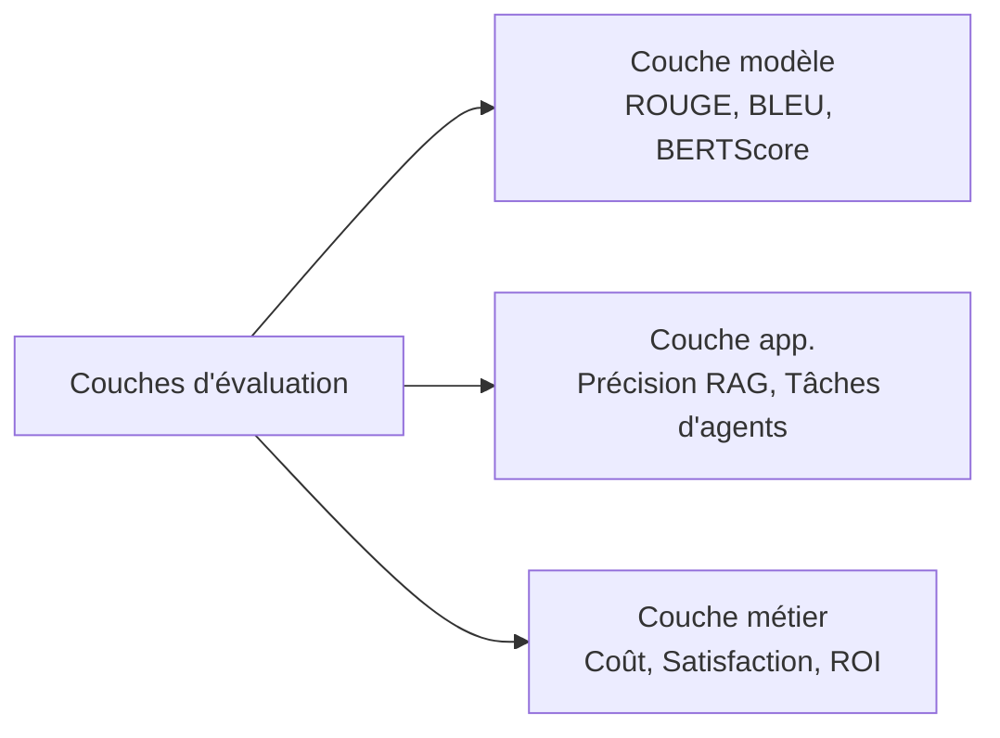

## Énoncé de tâche 3.4 : Décrire les méthodes d'évaluation des performances des FM

Déployer une application de modèle de fondation sans plan d'évaluation structuré équivaut à livrer un logiciel sans le tester. Un modèle peut obtenir de bons résultats sur des benchmarks génériques tout en échouant à la tâche métier pour laquelle il a été conçu, ou il peut atteindre les cibles de précision technique pendant que les utilisateurs cessent silencieusement de l'utiliser. Cet énoncé de tâche couvre comment mesurer les performances des FM à trois couches distinctes : le modèle lui-même, l'application construite par-dessus, et le résultat métier pour lequel il a été déployé.[^304001]

### 3.4.1 Approches pour évaluer les performances des FM

La plupart des organisations passent plus de temps à sélectionner un modèle de fondation qu'à vérifier s'il fonctionne réellement de manière adéquate sur leurs données et leurs tâches. Cette inversion est coûteuse. Un modèle qui passe un classement général peut quand même sous-performer sur le vocabulaire spécialisé, les longueurs de documents ou les schémas de raisonnement que les flux de travail de votre organisation exigent. L'évaluation doit être traitée comme une activité de premier ordre planifiée avant le déploiement, et non comme un diagnostic après l'apparition de problèmes.

Il existe trois approches complémentaires pour l'évaluation des FM. La première utilise des réviseurs humains pour juger directement les sorties. La deuxième utilise des ensembles de données de benchmarks curés pour mesurer les performances sur des tâches standardisées. La troisième utilise un service géré, **Amazon Bedrock Model Evaluation**, pour exécuter des évaluations automatiques et humaines dans un flux de travail contrôlé et auditables.[^304002]

**L'évaluation avec intervention humaine** est la pratique d'intégrer des réviseurs humains qualifiés dans le processus d'évaluation pour évaluer les sorties du modèle selon des critères que les métriques automatisées ne peuvent pas saisir, comme la correction factuelle sur des sujets propriétaires, la pertinence du ton ou la sécurité.[^304003] L'examen a mis à jour ce terme de « évaluation humaine » à « évaluation avec intervention humaine » dans la version 1.1 pour souligner que les humains ne gèrent pas l'évaluation de bout en bout ; ils sont insérés à des points de jugement spécifiques dans un pipeline automatisé plus large.

Trois schémas courants d'évaluation avec intervention humaine apparaissent en production :

- **Comparaison côte à côte** : deux sorties du modèle pour la même invite sont présentées à un réviseur, qui sélectionne la meilleure sans savoir quel modèle a produit chacune. Cette conception élimine le biais d'ancrage et produit un classement relatif entre les versions du modèle ou entre les modèles candidats. C'est le format standard de collecte de préférences dans les études d'*apprentissage par renforcement à partir du retour humain (RLHF)*.
- **Révision par des experts** : des experts du domaine (médecins, avocats, ingénieurs) évaluent si les sorties sont factuellement correctes et appropriées au domaine. Les travailleurs en foule peuvent juger la fluidité et le ton ; des experts du domaine sont nécessaires pour juger l'exactitude dans les domaines spécialisés.
- **Score basé sur une grille** : les réviseurs notent les sorties sur une échelle de 1 à 5 selon des dimensions définies, telles que la pertinence, la cohérence, la sécurité et la précision des citations. Le score basé sur une grille produit des données numériques qui peuvent être agrégées et suivies au fil du temps.

**Amazon Mechanical Turk** (pour l'annotation à volume élevé) et **Amazon SageMaker Ground Truth** (pour les flux de travail d'étiquetage gérés) peuvent fournir la main-d'œuvre de réviseurs humains pour ces schémas.[^304004] **Amazon Augmented AI (A2I)** fournit la couche de flux de travail de révision humaine pour les modèles hébergés sur SageMaker et les pipelines d'inférence personnalisés : il achemine les sorties d'inférence vers une équipe de révision lorsque des conditions définies par le développeur sont remplies, collecte les évaluations et renvoie les résultats.[^304005] A2I est particulièrement utile pour les scénarios de surveillance en production où un modèle gère des milliers de requêtes par jour et où seul un sous-ensemble échantillonné nécessite une révision humaine. **Amazon Bedrock Model Evaluation** fournit ses propres travaux d'évaluation humaine configurables avec une équipe de réviseurs interne ou une main-d'œuvre gérée par AWS ; ce chemin est la valeur par défaut pour évaluer les modèles de fondation hébergés sur Bedrock et est couvert plus loin dans cette section.

Les ensembles de données de benchmarks sont des collections standardisées d'invites et de réponses de référence utilisées pour mesurer les performances d'un modèle sur des dimensions de capacité spécifiques.[^304006] Quatre benchmarks apparaissent de manière constante dans la littérature pertinente pour l'examen :

- **MMLU** (*Massive Multitask Language Understanding*) : 57 matières académiques couvrant les sciences, les humanités, le droit et la médecine. Teste l'étendue des connaissances générales et du raisonnement.[^304007]
- **HellaSwag** : raisonnement de sens commun et complétion de phrases. Mesure si un modèle peut prédire la suite la plus plausible d'un scénario quotidien.[^304008]
- **TruthfulQA** : questions conçues pour tester si un modèle produit des réponses factuellement correctes sur des sujets où des idées fausses répandues existent. Un modèle optimisé pour la plausibilité plutôt que la précision obtiendra un mauvais score ici.[^304009]
- **HumanEval** : un ensemble de problèmes de programmation avec des cas de test, utilisé pour mesurer la capacité de génération de code d'un modèle. Un modèle réussit un problème si le code qu'il produit passe les tests unitaires associés.[^304010]

Les benchmarks fournissent une base standardisée et reproductible entre les versions de modèles et les fournisseurs, mais ils ont une limitation bien documentée appelée *saturation des benchmarks* : les modèles entraînés après la publication d'un benchmark peuvent absorber par inadvertance les réponses du benchmark via des données d'entraînement collectées sur le web, gonflant les scores au-delà des véritables améliorations de capacité.[^304011] Les équipes métier doivent traiter les classements des benchmarks comme un outil de filtrage, pas comme un verdict final.

**Amazon Bedrock Model Evaluation** est le service géré d'AWS pour exécuter des évaluations automatiques et humaines contre les modèles disponibles via Amazon Bedrock.[^304012] Il prend en charge deux types de travaux. Un travail d'*évaluation automatique* exécute le modèle sélectionné contre un ensemble de données d'invites intégré ou personnalisé et note les réponses en utilisant des métriques telles que la précision, la robustesse et la toxicité sans nécessiter de réviseurs humains. Un travail d'*évaluation humaine* achemine les sorties du modèle vers une main-d'œuvre de réviseurs, configurable comme une équipe interne ou une main-d'œuvre gérée par AWS, et collecte leurs évaluations sur des critères définis.[^304013]

Les métriques automatiques intégrées dans Bedrock Model Evaluation incluent la précision (pour les tâches de questions-réponses avec une réponse de référence), la robustesse (mesurée en perturbant les invites et en vérifiant la cohérence des sorties), et la toxicité (notée par un classifieur qui signale le contenu nuisible ou offensant).[^304014] Les ensembles de données d'invites personnalisés permettent aux organisations d'évaluer sur leurs propres entrées représentatives plutôt que de s'appuyer sur des ensembles de données génériques, comblant l'écart entre les performances sur les benchmarks et le comportement en production.

*Figure 3.4.1 : Trois approches d'évaluation des FM. Les métriques automatiques, la révision avec intervention humaine et les benchmarks standardisés couvrent chacun ce que les autres manquent ; les programmes de production utilisent généralement les trois en combinaison.*

### 3.4.2 Métriques pertinentes pour évaluer les performances des FM

Le choix de la bonne métrique dépend de ce que le modèle est invité à produire. Un modèle de résumé et un modèle de traduction produisent du texte, mais la qualité de ce texte se mesure mieux différemment. Un modèle générant du code se mesure mieux selon que le code s'exécute correctement. Cette section couvre les quatre métriques que l'examen spécifie : ROUGE, BLEU, BERTScore et LLM-en-tant-que-juge.

**ROUGE** (*Recall-Oriented Understudy for Gisting Evaluation*) mesure le chevauchement entre un résumé généré et un ou plusieurs résumés de référence rédigés par des humains.[^304015] La variante la plus courante, ROUGE-L, compte la plus longue sous-séquence commune de mots entre le candidat et la référence. Un score ROUGE élevé signifie que le modèle a utilisé beaucoup des mêmes mots que la référence rédigée par un humain. ROUGE est la métrique standard pour l'évaluation des résumés parce que les résumés ont un critère de succès clair : les informations clés du document source doivent être présentes dans le résumé.

ROUGE a une limitation connue : c'est une mesure lexicale de surface. Si le modèle produit un résumé indiquant « le client a résilié l'accord » tandis que la référence dit « le client a annulé le contrat », les scores ROUGE seront faibles malgré les deux phrases étant sémantiquement identiques. Pour cette raison, ROUGE est plus fiable lorsque les résumés de référence sont eux-mêmes diversifiés (couvrant plusieurs formulations valides) et lorsque le corpus d'évaluation est suffisamment large pour lisser la variation de formulation sur de nombreux exemples.

**BLEU** (*Bilingual Evaluation Understudy*) a été développé spécifiquement pour la traduction automatique et mesure la *précision* : quelle fraction des n-grammes (séquences de mots) dans la sortie candidate apparaît dans la traduction de référence.[^304016] Contrairement à ROUGE, qui est orienté vers le rappel, BLEU pénalise les candidats qui produisent des sorties courtes pour améliorer le rappel et ajoute ensuite une pénalité de brièveté pour réduire les traductions trop courtes. BLEU reste la métrique standard dans l'évaluation des benchmarks de traduction automatique. Sa limitation reflète celle de ROUGE : il récompense le chevauchement exact au niveau des mots et ne peut pas créditer une traduction qui utilise des synonymes ou restructure des phrases sans changer le sens.

**BERTScore** répond à la limitation de correspondance lexicale de ROUGE et BLEU en utilisant un modèle BERT pré-entraîné pour calculer la *similarité sémantique* entre le candidat et la référence au niveau du jeton.[^304017] Au lieu de compter les correspondances exactes de mots, BERTScore encode les deux textes en vecteurs de haute dimension et mesure la similarité cosinus entre les jetons correspondants. Une phrase candidate qui utilise des mots différents pour exprimer le même sens obtiendra un score plus élevé sur BERTScore que sur ROUGE ou BLEU. BERTScore est plus robuste à la paraphrase et est de plus en plus utilisé dans l'évaluation des résumés, de la traduction et de la qualité de texte générale, notamment lorsque la diversité des sorties est attendue ou souhaitable.

Le compromis pratique entre les trois métriques est que ROUGE et BLEU sont rapides, déterministes et ne nécessitent aucun appel d'inférence supplémentaire, tandis que BERTScore nécessite d'exécuter l'encodeur BERT sur le candidat et la référence, ajoutant un coût de calcul et une latence. Pour les pipelines d'évaluation automatisée à grande échelle, les équipes calculent souvent ROUGE et BLEU pour la rapidité et ajoutent BERTScore comme vérification secondaire sur un sous-ensemble échantillonné.

**LLM-en-tant-que-juge** est une approche plus récente, ajoutée au guide d'examen v1.1, dans laquelle un *modèle juge* séparé et de haute qualité évalue les sorties du modèle testé selon des critères définis.[^304018] Le juge reçoit une invite contenant la question originale, la réponse du modèle et une grille de notation, et renvoie un score ou un jugement de préférence comparative. L'approche est plus rapide et moins coûteuse que l'évaluation humaine : un seul appel d'inférence du modèle juge remplace le temps et le coût d'un réviseur humain. Elle s'adapte également sans main-d'œuvre de réviseurs, ce qui la rend pratique pour évaluer des modèles sur des dizaines de milliers d'exemples.

Les mises en garde sont réelles et importantes pour les réponses à l'examen. LLM-en-tant-que-juge présente trois biais bien documentés.[^304019] Le *biais de position* est la tendance à favoriser le candidat qui apparaît en premier dans l'invite. Le *biais de longueur* est la tendance à noter les réponses plus longues plus haut même lorsque la précision est inchangée. Le *biais d'auto-amélioration* se produit lorsqu'un modèle est utilisé pour juger ses propres sorties : il favorise le texte qui ressemble à son propre style. Pour ces raisons, les pipelines LLM-en-tant-que-juge de production utilisent généralement un modèle juge différent de et généralement plus grand que le modèle évalué, font tourner l'ordre des candidats dans les comparaisons côte à côte, et calibrent les sorties du juge par rapport à un ensemble retenu d'évaluations humaines.

*Tableau 3.4.1 : Comparaison des métriques de qualité de sortie des FM*

| Métrique | Domaine de tâche | Ce qu'elle mesure | Points forts | Limitations |
|---|---|---|---|---|
| ROUGE | Résumé | Rappel au niveau des mots vs. référence | Rapide, standard, pas de modèle requis | Pénalise les paraphrases valides |
| BLEU | Traduction | Précision au niveau des mots vs. référence | Rapide, standard, pénalisé pour brièveté | Pénalise les synonymes valides |
| BERTScore | Qualité générale du texte | Similarité sémantique via les embeddings BERT | Robuste à la paraphrase | Nécessite une inférence BERT, coût de calcul |
| LLM-en-tant-que-juge | Toute tâche générative | Score basé sur des critères par un modèle juge | Évolutif, critères flexibles | Biais de position, de longueur et d'auto-amélioration |

*Figure 3.4.2 : Sélection des métriques de qualité de sortie. Les métriques lexicales sont rapides mais superficielles ; les métriques sémantiques tolèrent la paraphrase ; les métriques basées sur des critères sont flexibles mais nécessitent des contrôles de biais.*

### 3.4.3 Déterminer si un FM répond aux objectifs métier

Les métriques techniques répondent à la question « le modèle produit-il du bon texte ? » Les objectifs métier répondent à une question différente : « le modèle résout-il le problème pour lequel il a été déployé ? » La distinction est importante parce qu'un modèle qui obtient 0,72 sur ROUGE peut ou non améliorer la productivité des analystes. Un modèle qui obtient un score BERTScore élevé sur les réponses au service client peut ou non réduire les taux d'escalade des tickets.

Déterminer si un FM répond aux objectifs métier nécessite de connecter le comportement du modèle à des résultats mesurables qui intéressent les parties prenantes métier. L'examen identifie trois catégories : la productivité, l'engagement des utilisateurs et l'ingénierie des tâches.

**La productivité** mesure le temps ou l'effort économisé par tâche.[^304020] Une équipe juridique qui utilise un FM pour rédiger des résumés de contrats devrait être en mesure de rapporter que chaque avocat passe maintenant 20 minutes sur la révision du résumé plutôt que 90 minutes sur la rédaction manuelle. Une équipe d'outils de développement utilisant un modèle de complétion de code devrait mesurer le débit des demandes de fusion ou le temps jusqu'au premier commit avant et après l'adoption. Les améliorations de productivité sont l'argument financier le plus direct pour le déploiement des FM et se mesurent mieux à travers des pilotes contrôlés où un groupe de traitement utilise l'outil alimenté par FM et un groupe de contrôle ne l'utilise pas.

**L'engagement des utilisateurs** couvre si les utilisateurs utilisent réellement le système, à quelle profondeur ils interagissent avec lui, et s'ils y reviennent.[^304021] Les indicateurs pertinents incluent les sessions par utilisateur par semaine, la profondeur moyenne des sessions (nombre de tours avant que l'utilisateur termine la conversation ou abandonne la tâche), et le taux de retour (la proportion d'utilisateurs qui utilisent le système à nouveau après leur première session). Les données d'engagement signalent si l'application FM résout un problème que les utilisateurs apprécient ou si les utilisateurs l'abandonnent après une mauvaise expérience initiale. Un FM qui produit des sorties techniquement précises mais présentées de manière confuse ou qui répond trop lentement montrera une baisse d'engagement même si ses scores ROUGE sont stables.

**L'ingénierie des tâches** est le terme de l'examen AWS pour indiquer si le flux de travail alimenté par FM complète réellement la tâche métier de bout en bout, sans nécessiter de recours humain à des taux qui annulent le gain d'efficacité.[^304022] (En dehors des documents AWS, la même idée est plus communément appelée *taux de complétion de flux de travail* ou *taux de complétion autonome*.) Un chatbot de service client qui résout 80 % des demandes de manière autonome atteint son objectif d'ingénierie des tâches si la cible était 75 %. Un flux de travail de révision de documents qui nécessite qu'un humain corrige 60 % des résumés générés par FM avant le dépôt ne l'atteint pas. L'ingénierie des tâches à cet objectif se concentre sur le flux de travail tel que déployé ; la section 3.4.5 introduit le *taux de complétion des tâches* comme la version au niveau de l'objectif utilisateur de la même idée, appliquée à la question de savoir si la tâche métier sous-jacente de l'utilisateur a été accomplie.

L'implication pratique pour les scénarios d'examen est qu'une question décrivant des symptômes tels que « les utilisateurs ne reviennent pas » ou « le FM complète la première étape mais un humain doit terminer le reste » devrait orienter votre réflexion respectivement vers les métriques d'engagement et d'ingénierie des tâches, et non vers ROUGE ou BLEU. Le modèle peut être techniquement compétent mais défaillant au niveau du flux de travail.

*Figure 3.4.3 : Cadre d'évaluation double. Un modèle doit réussir les couches d'évaluation technique et métier pour être considéré comme adapté au déploiement prévu.*

### 3.4.4 Évaluer les performances des applications construites avec des FM

Un modèle de fondation est rarement déployé de manière isolée. Les applications de production superposent des systèmes de récupération, l'orchestration d'agents et des flux de travail en plusieurs étapes sur le modèle de base. Chaque couche introduit ses propres modes de défaillance. Évaluer uniquement le modèle de base laisse les défaillances de la couche applicative invisibles jusqu'à ce qu'elles apparaissent dans des plaintes de production.

L'examen identifie trois architectures d'application qui nécessitent chacune leur propre approche d'évaluation : les pipelines RAG, les agents IA et les flux de travail en plusieurs étapes.

**L'évaluation RAG** se divise en deux préoccupations indépendantes : la qualité de la récupération et la qualité de la génération.[^304023] La qualité de la récupération mesure si la base de données vectorielle a retourné les bons documents lorsqu'on lui a soumis la requête de l'utilisateur. La qualité de la génération mesure si le modèle a produit une réponse précise et fidèle compte tenu des documents récupérés. Une défaillance dans l'un ou l'autre des sous-systèmes produit une mauvaise réponse, mais la cause racine et le correctif sont différents.

La qualité de la récupération est généralement mesurée par *précision@k* et *rappel@k*, où k est le nombre de documents récupérés.[^304024] La précision@k demande : parmi les k documents récupérés, quelle fraction était réellement pertinente ? Le rappel@k demande : parmi tous les documents pertinents dans le corpus, quelle fraction est apparue dans les k premiers résultats ? Un système de récupération avec une précision élevée mais un rappel faible trouve des documents fiables mais en manque des importants. Un système avec un rappel élevé mais une précision faible renvoie tout ce qui est pertinent mais le noie dans du bruit.

La qualité de la génération pour la RAG est mesurée par l'*ancrage* (si la réponse du modèle est soutenue par les documents récupérés, et non inventée à partir de la mémoire paramétrique), la *fidélité de la réponse* (si les affirmations dans la réponse reflètent avec précision ce que les documents récupérés disent), et la *précision des citations* (si les sources citées contiennent réellement les informations qui leur sont attribuées).[^304025] Des outils tels que **Ragas** fournissent un cadre d'évaluation open source qui calcule automatiquement ces métriques en exécutant un modèle juge sur les documents récupérés et la réponse générée.[^304026]

**L'évaluation des agents** mesure si un agent IA complète les tâches assignées avec précision, efficacité et à un coût acceptable.[^304027] Parce que les agents exécutent des plans en plusieurs étapes en utilisant des outils externes, leur surface d'évaluation est plus large qu'un modèle à réponse unique. Les métriques pertinentes incluent :

- **Taux de complétion des tâches** : le pourcentage de tâches assignées que l'agent complète sans intervention humaine ni sortie en état d'erreur.
- **Précision de sélection des outils** : si l'agent a choisi le bon outil à chaque étape (pertinent lorsque l'agent a accès à plusieurs API et que le bon choix est déterministe étant donné la description de la tâche).
- **Efficacité des étapes** : le nombre d'appels d'outils requis pour compléter une tâche, comparé au nombre minimum qu'un plan bien conçu nécessiterait. Des nombres d'étapes élevés suggèrent que l'agent replanifie inutilement ou produit des arguments d'outils incorrects qui déclenchent des nouvelles tentatives.
- **Coût par tâche** : le coût total d'inférence et d'appel d'outils requis pour compléter une tâche. Il s'agit d'une métrique métier directe pour les agents qui fonctionnent à grande échelle.

Amazon Bedrock fournit des capacités d'évaluation des agents pour Bedrock Agents et les agents déployés via AgentCore, y compris des harnais de test, des traces par étape et des travaux d'évaluation intégrés alignés avec les métriques d'agents ci-dessus ; consultez le Guide utilisateur Amazon Bedrock actuel pour les noms de fonctionnalités et la portée exacts, car la surface d'évaluation des agents continue d'évoluer.[^304028]

**L'évaluation des flux de travail** s'applique aux pipelines en plusieurs étapes qui combinent des appels FM, des récupérations RAG, de la logique métier et des transferts humains en un processus métier complet.[^304029] Les métriques incluent le taux de réussite de bout en bout (quelle proportion d'instances de flux de travail se terminent sans sortie d'erreur ni remplacement humain forcé), la distribution des catégories d'erreurs (quelle étape produit le plus souvent des défaillances), et le taux de repli (à quelle fréquence le flux de travail est acheminé vers un chemin de repli humain).

*Tableau 3.4.2 : Métriques d'évaluation par architecture d'application*

| Architecture | Métriques de récupération | Métriques de génération | Métriques métier |
|---|---|---|---|
| FM de base uniquement | Sans objet | ROUGE, BLEU, BERTScore, LLM-en-tant-que-juge | Productivité, engagement |
| Pipeline RAG | Précision@k, Rappel@k | Ancrage, Fidélité, Précision des citations | Complétion des tâches, satisfaction des utilisateurs |
| Agent IA | Précision de sélection des outils, Efficacité des étapes | Correction des réponses, Taux d'hallucination | Taux de complétion des tâches, Coût par tâche |
| Flux de travail en plusieurs étapes | Sans objet | Distribution des catégories d'erreurs | Taux de réussite de bout en bout, Taux de repli |

*Figure 3.4.4 : Architecture d'évaluation en couches. Chaque couche de la pile applicative nécessite sa propre approche d'évaluation ; les défaillances à n'importe quelle couche affectent le résultat métier.*

### 3.4.5 Métriques d'alignement des objectifs métier pour les applications IA

Les métriques de la section 3.4.2 vous indiquent si le modèle fonctionne bien techniquement. Les métriques de la section 3.4.4 vous indiquent si l'application fonctionne correctement. Les métriques d'alignement des objectifs métier répondent à la question que l'exécutif commanditaire se pose réellement : cet investissement en IA délivre-t-il de la valeur ?

Le guide d'examen v1.1 a ajouté ceci comme un objectif distinct, signalant que l'examen attend des candidats qu'ils comprennent l'écart entre la mesure technique et la responsabilité métier, et sachent quels instruments comblent cet écart.

**Le taux de complétion des tâches** est le pourcentage de tâches initiées par l'utilisateur que l'application IA complète avec succès sans que l'utilisateur ait à abandonner la tâche, chercher de l'aide sur un autre canal ou escalader vers un agent humain.[^304030] Il se distingue du taux de complétion des tâches d'agents (section 3.4.4) par sa portée : la complétion des tâches d'agents mesure si la couche d'orchestration a terminé son plan, tandis que la complétion des tâches métier mesure si l'objectif sous-jacent de l'utilisateur a été atteint. Un utilisateur qui a demandé à l'IA de réserver une salle de conférence, a reçu une confirmation, mais a ensuite découvert que la salle était déjà occupée n'a pas vécu une tâche complétée d'un point de vue métier, même si tous les appels API de l'agent ont retourné des codes de succès.

Le taux de complétion des tâches est la métrique unique qui connecte le plus directement le comportement de l'application FM à l'argument commercial du déploiement. Si l'application a été déployée pour réduire le nombre de tickets de support atteignant un agent humain, le taux de complétion des tâches mesure exactement dans quelle mesure elle atteint cet objectif. Pour les scénarios d'examen, le taux de complétion des tâches est la MEILLEURE réponse lorsque la question demande comment mesurer si une application IA atteint son principal objectif métier.

**La satisfaction des utilisateurs** capture comment les utilisateurs perçoivent la qualité de leurs interactions avec l'application IA.[^304031] Les instruments courants incluent les enquêtes post-interaction (*CSAT*, le score de satisfaction client, où les utilisateurs notent leur expérience sur une échelle numérique), le *NPS* (Net Promoter Score, qui demande si l'utilisateur recommanderait l'application à un collègue), et les retours dans le produit (notes pouce haut/pouce bas collectées à la fin de chaque réponse). Contrairement au taux de complétion des tâches, qui est une mesure objective de ce qui s'est passé, la satisfaction des utilisateurs est une mesure subjective de la façon dont l'utilisateur s'est senti. Les deux sont nécessaires. Un assistant de notes de frais qui résout les soumissions en deux clics mais utilise un ton brusque peut voir le CSAT tomber en dessous de 3,5 même lorsque son taux de complétion des tâches reste au-dessus de 90 pour cent ; les utilisateurs chercheront un autre outil lorsqu'il sera disponible.

**Le coût par interaction** mesure le coût total du cloud et des licences engagé pour traiter une requête utilisateur dans l'ensemble de la pile applicative, de l'appel API à l'étape de récupération (si présente) jusqu'à l'appel d'inférence FM et tout traitement en aval.[^304032] Dans un pipeline RAG, le coût par interaction inclut l'appel du modèle d'embedding, l'opération de recherche vectorielle et l'appel de génération FM. Dans un flux de travail d'agents, il inclut chaque appel d'outil et étape d'inférence dans le plan. Le coût par interaction doit être suivi par rapport à la valeur ou au revenu par interaction pour déterminer si les économies unitaires de l'application sont viables à l'échelle. Une application qui coûte 0,05 $ par interaction et génère 0,10 $ de valeur mesurée (par exemple, par des économies de déflexion de tickets) est viable. Une application qui coûte 0,08 $ par interaction pour la même valeur de 0,10 $ laisse peu de marge pour la capacité de réserve de l'infrastructure.

Le suivi de ces métriques nécessite de connecter la télémétrie de l'application IA à une couche d'intelligence métier. **Amazon CloudWatch** collecte des métriques opérationnelles, des journaux et des traces depuis Amazon Bedrock et le code applicatif, y compris la latence, les taux d'erreur et les nombres d'invocations par modèle.[^304033] Ces signaux opérationnels peuvent être combinés avec des événements de la couche applicative (tâche complétée, l'utilisateur a donné un pouce vers le bas, coût d'interaction enregistré) pour construire une image complète. **Amazon QuickSight** se connecte aux données CloudWatch et à d'autres sources de données pour produire des tableaux de bord qui présentent le taux de complétion des tâches, les tendances de satisfaction des utilisateurs et le coût par interaction dans des formats accessibles aux parties prenantes métier qui ne lisent pas directement les graphiques de métriques CloudWatch.[^304034]

*Tableau 3.4.3 : Métriques d'alignement métier pour les applications IA*

| Métrique | Ce qu'elle mesure | Source de données | Partie prenante | Décision qu'elle éclaire |
|---|---|---|---|---|
| Taux de complétion des tâches | Si les objectifs des utilisateurs sont atteints | Journaux d'événements applicatifs | Produit, Opérations | Ajuster la portée ou la logique de repli |
| Satisfaction des utilisateurs (CSAT, NPS) | Perception par l'utilisateur de la qualité | Enquêtes post-interaction, retours pouce | Produit, CX | Améliorer la qualité des réponses ou l'UX |
| Coût par interaction | Économies unitaires de la livraison IA | Données de facturation et d'invocation CloudWatch | Finance, Ingénierie | Optimiser le niveau du modèle, le cache ou le flux de travail |

Un programme d'évaluation bien conçu surveille les trois métriques métier en continu, pas seulement au lancement. Le taux de complétion des tâches peut décliner à mesure que les requêtes des utilisateurs s'écartent des schémas sur lesquels le modèle a été testé. La satisfaction des utilisateurs peut décliner à mesure que la nouveauté s'estompe et que les utilisateurs comparent l'IA à des alternatives améliorées. Le coût par interaction peut augmenter si les schémas d'utilisation évoluent vers des requêtes plus longues et plus complexes. L'examen régulier des trois métriques par rapport à des seuils définis est la discipline opérationnelle qui distingue un produit IA géré d'un prototype livré et oublié.

## Questions d'auto-évaluation

**Question 1.** Une organisation de santé déploie un outil alimenté par FM qui aide les infirmières à récupérer des informations à partir de protocoles cliniques. Avant la mise en service, l'équipe souhaite vérifier que le modèle produit des réponses factuellement précises et appropriées au domaine sur le vocabulaire médical spécialisé. Quelle approche d'évaluation est la PLUS appropriée pour cette exigence ?

A. Exécuter le modèle contre le benchmark MMLU et l'accepter si le score dépasse 70 %  
B. Utiliser Amazon Bedrock Model Evaluation avec un travail de détection automatique de la toxicité  
C. Utiliser Amazon Augmented AI (A2I) pour acheminer les sorties du modèle vers des experts cliniques pour une notation basée sur une grille  
D. Calculer les scores BLEU par rapport à un ensemble de résumés cliniques de référence  

**Explication :** La contrainte clé dans ce scénario est la correction factuelle spécifique au domaine évaluée par des personnes capables de juger si une réponse médicale est cliniquement précise. Les travailleurs en foule et les métriques automatisées ne peuvent pas porter ce jugement. La réponse C est correcte : Amazon A2I prend en charge les flux de travail d'évaluation avec intervention humaine qui peuvent acheminer les sorties vers un groupe de réviseurs défini, tel qu'un panel d'infirmières ou de médecins cliniques, qui notent les réponses sur une grille couvrant la précision, la clarté et la pertinence. La réponse A est incorrecte parce que MMLU est un benchmark académique général ; obtenir 70 % sur 57 matières académiques ne vous dit pas si le modèle gère correctement les requêtes sur les protocoles cliniques, et le seuil n'a aucun rapport avec les exigences de sécurité clinique. La réponse B est incorrecte parce qu'un travail de toxicité mesure si le modèle produit du contenu nuisible ou offensant ; il n'évalue pas la précision clinique. La réponse D est incorrecte parce que BLEU mesure la précision au niveau des mots par rapport à un texte de référence et ne permettrait pas de détecter si les informations cliniques transmises sont correctes ; une réponse plausible mais factuellement incorrecte pourrait obtenir un bon score BLEU si elle partage du vocabulaire avec la référence.[^304035]

---

**Question 2.** Une organisation compare deux modèles de fondation pour une tâche de résumé de nouvelles. Les deux modèles produisent de l'anglais fluide. L'équipe d'évaluation dispose d'un ensemble de 500 résumés de référence rédigés par des humains pour les mêmes articles. Quelle métrique est la PLUS appropriée comme signal d'évaluation principal pour cette tâche ?

A. BERTScore, parce qu'il mesure la similarité sémantique et tolère la paraphrase  
B. BLEU, parce qu'il a été conçu pour évaluer la génération de texte par rapport à des références  
C. ROUGE, parce qu'il a été conçu spécifiquement pour les résumés et mesure le rappel du contenu clé  
D. LLM-en-tant-que-juge, parce qu'un modèle juge peut noter la cohérence sans résumé de référence  

**Explication :** ROUGE (réponse C) a été développé spécifiquement pour l'évaluation des résumés et sa conception reflète l'exigence centrale de cette tâche : un bon résumé doit contenir les informations clés du document source, ce qui est un problème de rappel. ROUGE-L, la variante la plus courante, mesure la plus longue sous-séquence commune de mots entre le candidat et la référence, récompensant les résumés qui couvrent les points principaux dans n'importe quel ordre. La réponse A est techniquement valide comme métrique secondaire, mais BERTScore nécessite d'exécuter un encodeur BERT sur chaque paire candidat-référence, ajoutant un coût de calcul ; il est plus précieux lorsque les résumés de référence utilisent un vocabulaire varié et que le chevauchement lexical pénaliserait injustement les paraphrases valides. Si l'organisation souhaite ajouter de la robustesse sémantique à l'évaluation, BERTScore est un complément approprié, pas un remplacement. La réponse B est incorrecte parce que BLEU est une métrique orientée précision conçue pour la traduction, où la formulation exacte de la langue cible est importante ; les résumés privilégient le rappel du contenu plutôt que la précision de la formulation. La réponse D est incorrecte parce que LLM-en-tant-que-juge est le plus précieux lorsqu'il n'y a pas de résumé de référence et qu'un jugement de type humain est requis ; lorsque 500 résumés de référence sont disponibles, les métriques basées sur les références sont le signal principal plus fiable et reproductible.[^304036]

---

**Question 3.** Une entreprise a déployé un outil de questions-réponses interne alimenté par RAG il y a trois mois. Les utilisateurs signalent que l'outil donne souvent des réponses qui semblent confiantes mais contiennent des informations introuvables dans les documents de l'entreprise. Quelle métrique d'évaluation identifie LE PLUS directement ce mode de défaillance ?

A. Score ROUGE-L par rapport à des réponses de référence rédigées par des humains  
B. Score d'ancrage mesurant si les réponses sont soutenues par des documents récupérés  
C. Précision@k mesurant si les principaux documents récupérés sont pertinents  
D. Taux de complétion des tâches mesurant si les utilisateurs trouvent l'outil utile  

**Explication :** Le symptôme décrit (réponses confiantes contenant des informations absentes des documents sources) est la définition d'un mauvais *ancrage* : le modèle génère du contenu à partir de sa mémoire paramétrique plutôt qu'à partir des documents récupérés. La réponse B est correcte. L'ancrage est évalué en vérifiant chaque affirmation dans la réponse générée par rapport à l'ensemble de documents récupérés et en notant la fraction des affirmations soutenues par au moins un document récupéré. Des outils tels que Ragas calculent automatiquement cette métrique. La réponse A est incorrecte parce que ROUGE-L mesure le chevauchement de mots avec une réponse de référence humaine ; il ne détecterait pas le contenu halluciné qui utilise des mots plausibles absents de la référence. La réponse C est incorrecte parce que la précision@k mesure la qualité de la récupération, pas de la génération ; un système de récupération pourrait retourner des documents très pertinents pendant que le modèle les ignore et génère à partir de la mémoire paramétrique. La réponse D est incorrecte parce que le taux de complétion des tâches mesure si l'objectif de l'utilisateur a été atteint ; le symptôme décrit peut causer une faible satisfaction sans déclencher le chemin formel d'échec de tâche que l'application suit.[^304037]

---

**Question 4.** Un chef de produit IA présente l'argument commercial d'une application de chat de support client alimentée par FM au directeur financier. Le directeur financier demande une métrique unique montrant si l'application est financièrement viable à l'échelle. Quelle métrique répond LE MIEUX à cette question ?

A. Score BLEU sur le corpus de réponses de support  
B. Profondeur de session moyenne par utilisateur  
C. Coût par interaction comparé à la valeur délivrée par interaction  
D. Taux de repli vers des agents humains  

**Explication :** La question du directeur financier porte sur les économies unitaires : chaque interaction délivre-t-elle une valeur justifiant son coût ? Le coût par interaction (réponse C) mesure le coût total du cloud et des licences pour chaque requête utilisateur dans l'ensemble de la pile applicative. Comparé à la valeur mesurée par interaction (par exemple, le coût moyen d'un agent humain gérant la même requête), il établit si l'application est financièrement viable à l'échelle d'utilisation actuelle et projetée. La réponse A est incorrecte parce que BLEU est une métrique de qualité de texte ; elle n'a aucun rapport avec le coût ou la viabilité financière. La réponse B (profondeur des sessions) est une métrique d'engagement qui signale si les utilisateurs trouvent l'application précieuse, mais elle ne dit rien au directeur financier sur la structure des coûts. La réponse D (taux de repli) est une métrique opérationnelle utile qui contribue à la compréhension des économies, puisque chaque repli vers un agent humain entraîne le coût humain complet plutôt que le coût IA, mais c'est un apport partiel à la vision financière, pas la vue complète des économies unitaires que le directeur financier demande. Le coût par interaction, comparé directement à la valeur par interaction, est la métrique qui répond à la question du directeur financier.[^304038]

---

**Question 5.** Une équipe évalue une nouvelle version FM pour remplacer le modèle de production actuel. Elle souhaite déterminer si le nouveau modèle produit des sorties que les réviseurs humains préfèrent, sans que les réviseurs sachent quel modèle a produit chaque réponse. Quelle approche d'évaluation répond LE PLUS directement à cette exigence ?

A. Exécuter les deux modèles contre le benchmark TruthfulQA et comparer les classements par centile  
B. Utiliser LLM-en-tant-que-juge avec le modèle de production actuel comme modèle juge  
C. Utiliser la comparaison humaine côte à côte avec l'identité des réviseurs masquée quant à l'identité du modèle  
D. Calculer BERTScore pour les deux modèles par rapport au même ensemble de sorties de référence  

**Explication :** L'exigence comporte deux parties : le jugement de préférence humaine et l'anonymisation (les réviseurs ne doivent pas savoir quel modèle a produit quelle sortie). La réponse C est le schéma d'évaluation avec intervention humaine spécifiquement conçu pour ce cas d'usage. La comparaison côte à côte présente deux sorties à un réviseur pour la même invite, le réviseur sélectionne la sortie préférée, et la conception empêche le biais d'ancrage en ne labellisant pas quel modèle a produit chaque sortie. Cela produit directement un classement de préférence entre les deux versions du modèle. La réponse A est incorrecte parce que TruthfulQA est un benchmark pour la précision factuelle sur des sujets sujets à des idées fausses ; il ne mesure pas la préférence générale de qualité de sortie, et la question ne mentionne pas la précision factuelle comme critère. La réponse B est incorrecte de manière subtile mais importante : utiliser le modèle de production actuel comme modèle juge introduit un biais d'auto-amélioration ; le modèle actuel aura tendance à noter plus haut les sorties similaires à son propre style, rendant la comparaison injuste pour le nouveau modèle. La réponse D est incorrecte parce que BERTScore calcule la similarité sémantique par rapport à des textes de référence, pas la préférence humaine entre deux sorties candidates ; il ne capture pas le jugement qualitatif que l'équipe recherche.[^304039]

---

**Question 6.** Une organisation a lancé un assistant d'approvisionnement alimenté par FM il y a six semaines. Les données d'utilisation montrent que 45 % des utilisateurs qui essaient l'assistant ne reviennent pas après leur première session. Les scores ROUGE du modèle sur les tests de résumé se situent dans le premier quartile pour sa famille de modèles. Quelle métrique métier diagnostique LE PLUS directement si ce problème d'engagement provient de la qualité des sorties du modèle ou de la conception de l'application ?

A. Satisfaction des utilisateurs (CSAT ou retours pouce) collectée immédiatement après chaque interaction  
B. BERTScore calculé par rapport à un ensemble de réponses de référence pour les requêtes d'approvisionnement  
C. Taux de complétion des tâches mesuré par le journal d'événements de l'application  
D. Précision@k pour la couche de récupération RAG  

**Explication :** Le scénario présente une dissociation : les scores ROUGE sont forts (suggérant que le modèle produit du texte qui chevauche bien les références) mais le taux de retour est faible (suggérant que les utilisateurs ne trouvent pas l'application suffisamment précieuse pour y revenir). Pour diagnostiquer si le problème est lié à la qualité des sorties ou à la conception de l'application, l'organisation a besoin d'un signal émanant des utilisateurs réels reflétant leur expérience subjective, pas d'un signal provenant de métriques automatisées de chevauchement de texte. La satisfaction des utilisateurs collectée immédiatement après chaque interaction (réponse A) capture si les utilisateurs ont trouvé la réponse utile, précise et délivrée d'une manière qui les incite à revenir. Un schéma de CSAT faible malgré un ROUGE élevé indiquerait que les résumés de référence utilisés pour l'évaluation ROUGE ne reflètent pas ce que les utilisateurs apprécient réellement dans le contexte de l'approvisionnement, pointant vers un problème de qualité des sorties ou de cadrage. Un schéma de CSAT modéré avec un faible taux de retour pointerait vers des facteurs de conception de l'application (UX, vitesse, confiance) plutôt que vers le modèle lui-même. La réponse B est incorrecte parce que BERTScore est une autre métrique automatisée de qualité de texte qui, comme ROUGE, mesure la similarité aux références ; elle n'expliquerait pas l'écart entre les scores techniques et le comportement des utilisateurs. Le taux de complétion des tâches (réponse C) vous dirait si le flux de travail s'est terminé, mais dans ce scénario le flux de travail produit déjà de bons scores techniques ; le signal manquant est le jugement subjectif de l'utilisateur sur cette interaction complétée, que seul le CSAT ou les retours pouce capturent. La réponse D est incorrecte parce que la précision@k diagnostique la qualité de la récupération ; bien qu'une mauvaise récupération puisse contribuer à de mauvaises réponses, ce serait une étape d'investigation secondaire après avoir établi les données de satisfaction des utilisateurs.[^304040]

[^304001]: AWS Certification. AI Practitioner (AIF-C01) Exam Guide v1.1, Task Statement 3.4. URL: <https://docs.aws.amazon.com/aws-certification/latest/ai-practitioner-01/ai-practitioner-01-domain3.html>
[^304002]: Amazon Bedrock. Amazon Bedrock Model Evaluation overview. URL: <https://docs.aws.amazon.com/bedrock/latest/userguide/model-evaluation.html>
[^304003]: Amazon A2I. How Amazon Augmented AI works. URL: <https://docs.aws.amazon.com/sagemaker/latest/dg/a2i-how-it-works.html>
[^304004]: Amazon SageMaker. Amazon SageMaker Ground Truth labeling workflows. URL: <https://docs.aws.amazon.com/sagemaker/latest/dg/sms.html>
[^304005]: Amazon A2I. Use Amazon Augmented AI for human review. URL: <https://docs.aws.amazon.com/sagemaker/latest/dg/a2i-use-augmented-ai-a2i-human-review-loops.html>
[^304006]: Liang, P., et al. Holistic Evaluation of Language Models (HELM, 2022). URL: <https://arxiv.org/abs/2211.09110>
[^304007]: Hendrycks, D., et al. Measuring Massive Multitask Language Understanding (MMLU, 2020). URL: <https://arxiv.org/abs/2009.03300>
[^304008]: Zellers, R., et al. HellaSwag: Can a Machine Really Finish Your Sentence? (2019). URL: <https://arxiv.org/abs/1905.07830>
[^304009]: Lin, S., et al. TruthfulQA: Measuring How Models Mimic Human Falsehoods (2021). URL: <https://arxiv.org/abs/2109.07958>
[^304010]: Chen, M., et al. Evaluating Large Language Models Trained on Code (HumanEval, 2021). URL: <https://arxiv.org/abs/2107.03374>
[^304011]: Kiela, D., et al. Dynabench: Rethinking Benchmarking in NLP (2021). URL: <https://arxiv.org/abs/2104.14337>
[^304012]: Amazon Bedrock. Amazon Bedrock Model Evaluation jobs. URL: <https://docs.aws.amazon.com/bedrock/latest/userguide/model-evaluation-jobs.html>
[^304013]: Amazon Bedrock. Human evaluation using Amazon Bedrock Model Evaluation. URL: <https://docs.aws.amazon.com/bedrock/latest/userguide/model-evaluation-human.html>
[^304014]: Amazon Bedrock. Automatic evaluation metrics in Amazon Bedrock Model Evaluation. URL: <https://docs.aws.amazon.com/bedrock/latest/userguide/model-evaluation-automatic.html>
[^304015]: Lin, C.-Y. ROUGE: A Package for Automatic Evaluation of Summaries (2004). URL: <https://aclanthology.org/W04-1013>
[^304016]: Papineni, K., et al. BLEU: a Method for Automatic Evaluation of Machine Translation (2002). URL: <https://aclanthology.org/P02-1040>
[^304017]: Zhang, T., et al. BERTScore: Evaluating Text Generation with BERT (2019). URL: <https://arxiv.org/abs/1904.09675>
[^304018]: Zheng, L., et al. Judging LLM-as-a-Judge with MT-Bench and Chatbot Arena (2023). URL: <https://arxiv.org/abs/2306.05685>
[^304019]: Wang, P., et al. Large Language Models are not Fair Evaluators (2023). URL: <https://arxiv.org/abs/2305.17926>
[^304020]: Microsoft Research. The Total Economic Impact of GitHub Copilot (2023). URL: <https://resources.github.com/downloads/The-Total-Economic-Impact-of-GitHub-Copilot.pdf>
[^304021]: Amazon CloudWatch. Using Amazon CloudWatch to track user engagement metrics for AI applications. URL: <https://docs.aws.amazon.com/AmazonCloudWatch/latest/monitoring/working_with_metrics.html>
[^304022]: Amazon Bedrock. Evaluating agent task completion in Amazon Bedrock. URL: <https://docs.aws.amazon.com/bedrock/latest/userguide/agents-evaluation.html>
[^304023]: Es, S., et al. RAGAS: Automated Evaluation of Retrieval Augmented Generation (2023). URL: <https://arxiv.org/abs/2309.15217>
[^304024]: Manning, C., et al. Introduction to Information Retrieval: Precision and Recall at k (2008). URL: <https://nlp.stanford.edu/IR-book/>
[^304025]: Es, S., et al. RAGAS: Faithfulness and Answer Relevance Metrics (2023). URL: <https://arxiv.org/abs/2309.15217>
[^304026]: Ragas. Ragas: Evaluation framework for RAG pipelines. URL: <https://docs.ragas.io/>
[^304027]: Amazon Bedrock. Evaluating Amazon Bedrock Agents. URL: <https://docs.aws.amazon.com/bedrock/latest/userguide/agents-evaluation.html>
[^304028]: Amazon Bedrock User Guide. Evaluation capabilities for Bedrock Agents and AgentCore. URL: <https://docs.aws.amazon.com/bedrock/latest/userguide/agents.html>
[^304029]: Amazon Bedrock. Multi-step workflow evaluation with Amazon Bedrock. URL: <https://docs.aws.amazon.com/bedrock/latest/userguide/agents-test.html>
[^304030]: Amazon Bedrock. Measuring task completion in Amazon Bedrock application monitoring. URL: <https://docs.aws.amazon.com/bedrock/latest/userguide/model-evaluation.html>
[^304031]: Amazon Connect. Customer satisfaction scoring and AI contact center metrics. URL: <https://docs.aws.amazon.com/connect/latest/adminguide/metrics-definitions.html>
[^304032]: Amazon Bedrock. Monitoring Amazon Bedrock usage and costs with AWS Cost Explorer. URL: <https://docs.aws.amazon.com/bedrock/latest/userguide/monitoring-overview.html>
[^304033]: Amazon CloudWatch. Monitoring Amazon Bedrock with Amazon CloudWatch. URL: <https://docs.aws.amazon.com/bedrock/latest/userguide/monitoring-cloudwatch.html>
[^304034]: Amazon QuickSight. Getting started with Amazon QuickSight dashboards. URL: <https://docs.aws.amazon.com/quicksight/latest/user/getting-started.html>
[^304035]: Amazon A2I. Setting up a human review workflow with Amazon Augmented AI. URL: <https://docs.aws.amazon.com/sagemaker/latest/dg/a2i-create-flow-definition.html>
[^304036]: Lin, C.-Y. ROUGE: A Package for Automatic Evaluation of Summaries: task applicability (2004). URL: <https://aclanthology.org/W04-1013>
[^304037]: Es, S., et al. RAGAS: Groundedness evaluation for RAG pipelines (2023). URL: <https://arxiv.org/abs/2309.15217>
[^304038]: Amazon Bedrock. Tracking Amazon Bedrock invocation costs per application. URL: <https://docs.aws.amazon.com/bedrock/latest/userguide/monitoring-overview.html>
[^304039]: Zheng, L., et al. Judging LLM-as-a-Judge: bias characteristics and mitigations (2023). URL: <https://arxiv.org/abs/2306.05685>
[^304040]: Amazon CloudWatch. Collecting user feedback events in AI application telemetry. URL: <https://docs.aws.amazon.com/AmazonCloudWatch/latest/monitoring/working_with_metrics.html>
