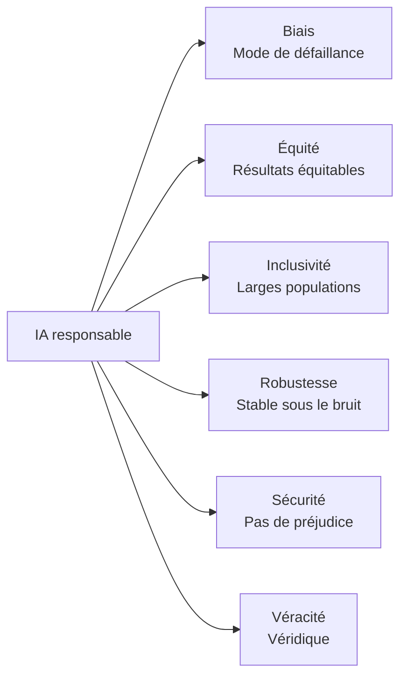
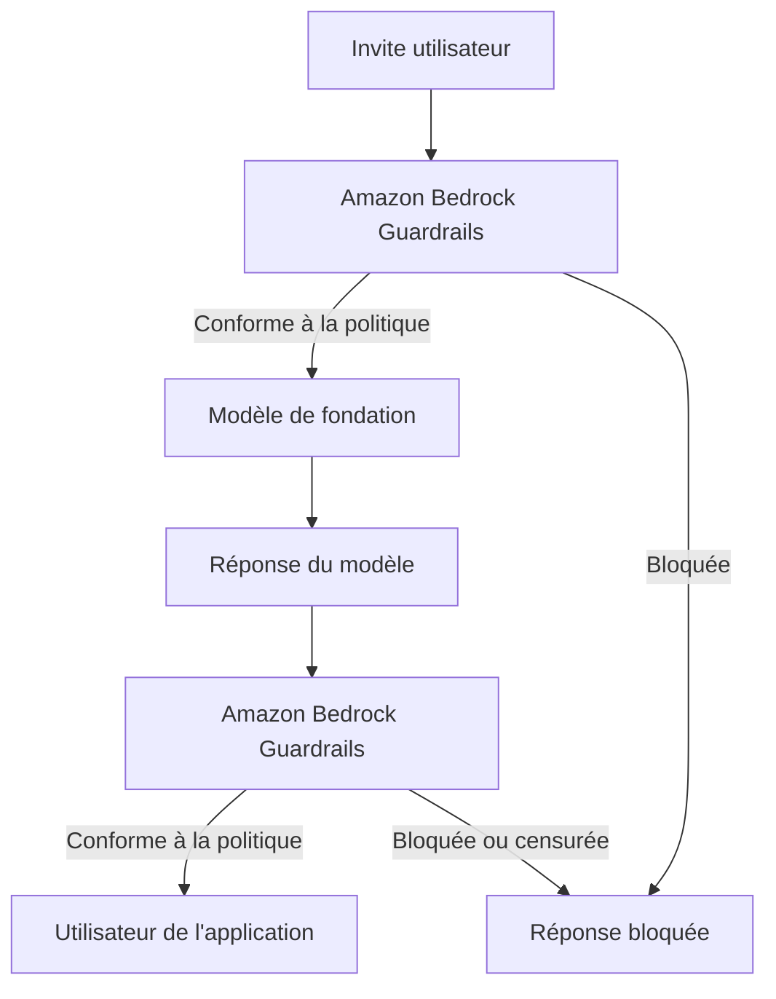
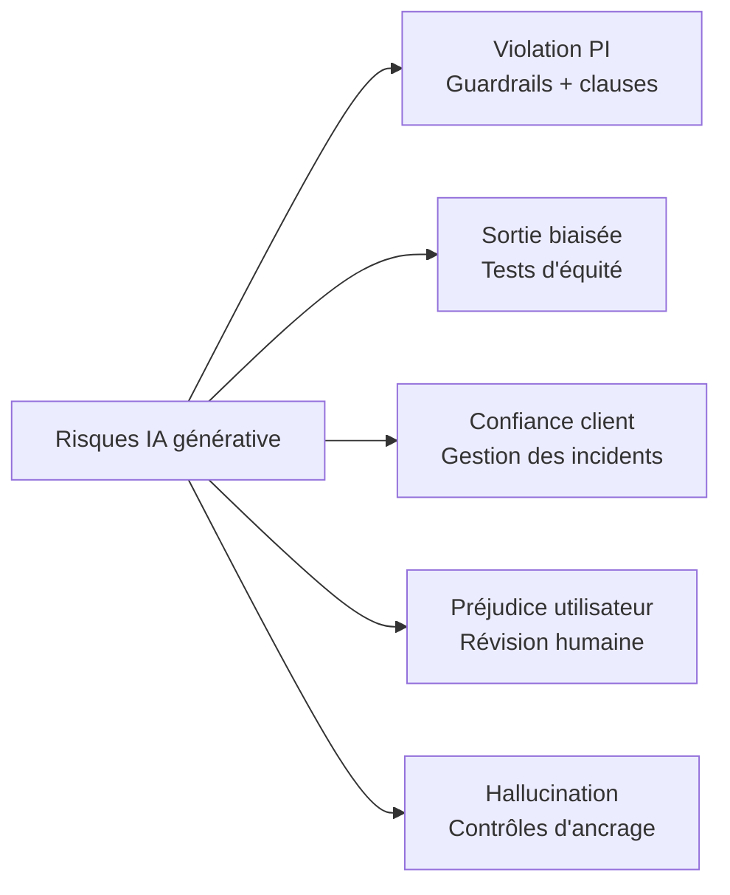
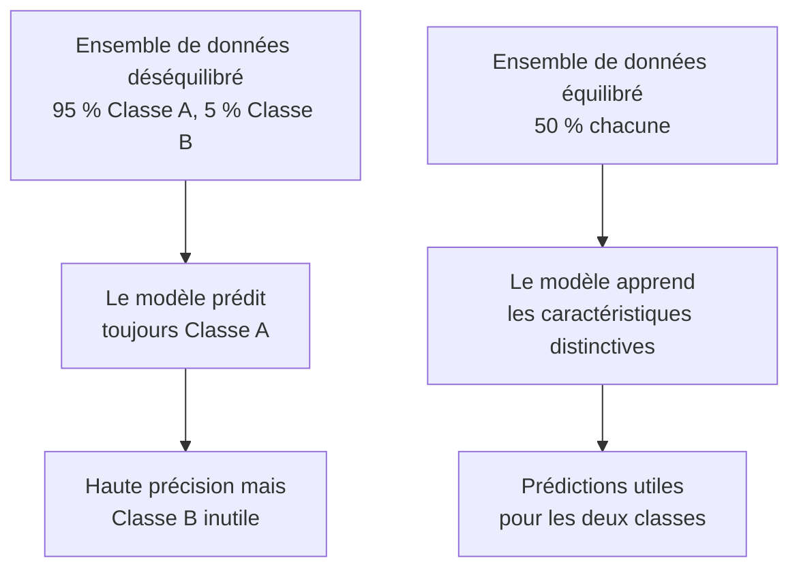
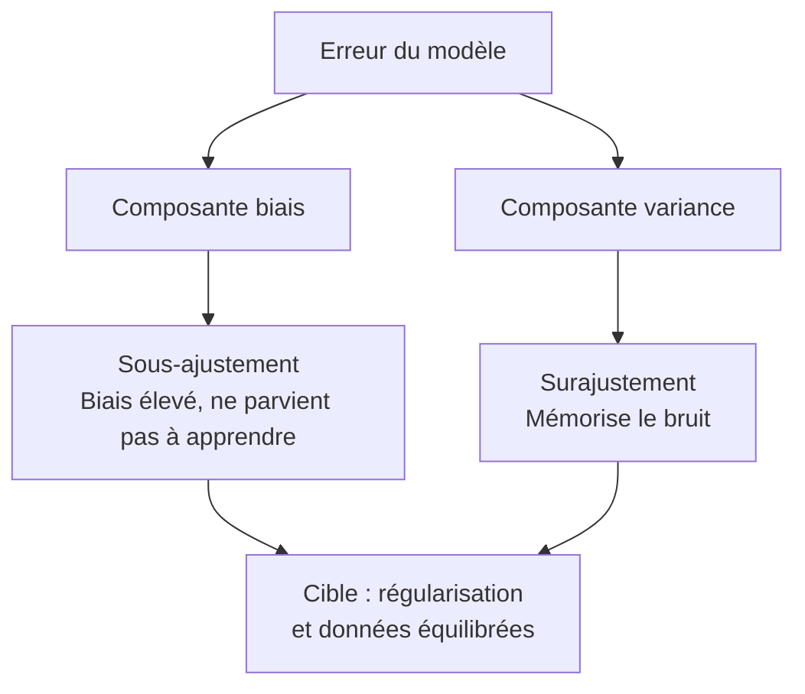

## Énoncé de tâche 4.1 : Expliquer le développement de systèmes d'IA responsables

L'IA responsable est un ensemble d'engagements d'ingénierie et de gouvernance qui déterminent si un système d'IA produit des sorties qui sont équitables, précises et sûres pour l'ensemble des personnes qu'il affectera. Ce chapitre couvre les sept objectifs de l'énoncé de tâche 4.1 : les caractéristiques définissant une IA responsable, les outils AWS qui appliquent et détectent ces caractéristiques, les pratiques responsables pour la sélection des modèles, les risques juridiques propres à l'IA générative, les caractéristiques des ensembles de données qui soutiennent les systèmes responsables, la mécanique du biais et de la variance, et les outils de surveillance qui maintiennent un comportement responsable en production.[^401001]

### 4.1.1 Caractéristiques d'une IA responsable

Un système d'IA décrit comme « responsable » n'est pas responsable de manière abstraite. La responsabilité s'exprime à travers cinq propriétés concrètes et testables (équité, inclusivité, robustesse, sécurité et véracité), chacune définie en opposition à un mode de défaillance spécifique tel que le biais, l'exclusion, la fragilité, le préjudice ou l'hallucination. Le *biais* est le mode de défaillance que l'équité traite, et le guide d'examen AIF-C01 v1.1 liste le « biais » aux côtés des cinq propriétés positives parce que le biais est le schéma de défaillance le plus souvent testé dans les questions de scénario ; dans ce livre, nous couvrons les six ensemble afin que le couplage mode de défaillance-propriété soit explicite.

Les propriétés sont distinctes mais connexes. Un système peut échouer sur l'une tout en réussissant les autres. Un modèle de décision de prêt peut être robuste contre les entrées bruitées mais systématiquement injuste envers un groupe démographique protégé. Un chatbot de conseil médical peut être sûr et inclusif mais souvent imprécis. Les questions d'examen testent si les candidats peuvent nommer et distinguer ces propriétés, donc chaque définition compte pour elle-même.[^401002] Le cadre de gestion des risques d'IA du NIST regroupe ces propriétés sous ce qu'il appelle les « caractéristiques de fiabilité », et les candidats à l'examen qui reconnaissent ce cadre répondront aux questions de scénario avec plus de précision.[^401050]

Les propriétés sont :

- **Biais** (le mode de défaillance que l'équité traite) : une distorsion systématique dans les prédictions d'un modèle qui favorise ou pénalise de manière constante un groupe particulier. Par exemple, un modèle de présélection de CV entraîné principalement sur des recrutements historiques dans une industrie à dominante masculine peut classer les mêmes CV plus bas lorsqu'un prénom féminin apparaît en tête. Le biais dans ce sens n'est pas une erreur aléatoire ; c'est une erreur prévisible et directionnelle qui concentre le préjudice sur des populations spécifiques.[^401003]
- **Équité** : traitement cohérent des individus dans les groupes démographiques. Un modèle de crédit est équitable s'il applique les mêmes critères de décision quelle que soit la race, le genre ou l'âge du demandeur. L'équité est souvent mesurée numériquement, par exemple en comparant les taux d'approbation ou les taux de faux positifs entre les groupes pour s'assurer qu'aucun groupe n'est désavantagé de manière disproportionnée.[^401004]
- **Inclusivité** : le modèle fonctionne bien pour un large ensemble d'utilisateurs, y compris ceux qui peuvent être sous-représentés dans les données d'entraînement. Un modèle de reconnaissance d'images construit principalement sur des photos de visages à peau claire peut mal fonctionner pour les utilisateurs à peau foncée. L'*inclusivité* traite cette lacune de couverture en s'assurant que le modèle a été entraîné et testé sur l'ensemble de la population qu'il servira.[^401005]
- **Robustesse** : comportement gracieux et prévisible sous des entrées inattendues ou adversariales. Un chatbot de service client ne devrait pas retourner du contenu nuisible lorsqu'un utilisateur soumet une requête mal orthographiée, et un modèle de détection de fraude ne devrait pas s'effondrer en précision lorsque les volumes de transactions augmentent de manière inattendue. La robustesse mesure dans quelle mesure un système maintient son comportement prévu aux limites de sa distribution d'entrée.[^401006]
- **Sécurité** : le modèle ne cause pas de préjudice aux utilisateurs, aux tiers ou à la société. La sécurité couvre les risques physiques (un modèle qui contrôle des machines), les risques informationnels (un modèle qui fournit des conseils médicaux dangereux sans réserves) et les risques systémiques (un modèle qui amplifie la désinformation à grande échelle). Les régulateurs de l'UE classifient explicitement les systèmes d'IA par niveau de risque pour la sécurité et attachent des obligations légales à chaque catégorie.[^401007]
- **Véracité** : le modèle produit des sorties qui sont véridiques et factuellement fondées. Cela est particulièrement important pour les grands modèles de langage qui peuvent générer du texte à consonance confiante sur des sujets pour lesquels les données d'entraînement sont minces, incomplètes ou obsolètes. Les *hallucinations* sont la défaillance de véracité canonique : un modèle fabrique une citation, une statistique ou une personne et la présente comme un fait.[^401008]

*Figure 4.1.1 : Les propriétés d'IA responsable listées à l'examen. Le biais est le mode de défaillance que les cinq autres propriétés positives sont conçues pour prévenir.*

Ces propriétés n'existent pas en isolation. Un ensemble de données manquant de diversité démographique (faible inclusivité au niveau des données) produira des prédictions biaisées (la défaillance du biais) et créera des résultats inéquitables (échec de la propriété d'équité). Les propriétés se renforcent mutuellement lorsqu'elles sont satisfaites et amplifient les défaillances lorsqu'elles sont violées ; la même lacune dans les données peut simultanément déclencher le biais, l'inéquité et le manque d'inclusivité.[^401051]

### 4.1.2 Outils pour identifier les caractéristiques d'une IA responsable

Connaître les six propriétés d'IA responsable n'est utile que s'il existe des mécanismes pratiques pour les appliquer au niveau du système. AWS fournit deux outils principaux à cette fin : **Amazon Bedrock Guardrails** pour les applications d'IA générative et **Amazon SageMaker Clarify** pour les modèles d'apprentissage automatique classiques. Chacun cible un point différent dans le pipeline d'IA et un type de risque différent.[^401009]

**Amazon Bedrock Guardrails** applique une couche de politique configurable entre une application et tout modèle de fondation accessible via Amazon Bedrock. Lorsqu'un utilisateur envoie une invite ou lorsque le modèle renvoie une réponse, Guardrails évalue le contenu par rapport à la politique configurée et soit le laisse passer, soit le modifie, soit le bloque entièrement. Cela se produit de manière transparente pour le modèle sous-jacent, ce qui signifie que le même garde-fou peut protéger plusieurs modèles sans modifier le modèle lui-même.[^401010]

Guardrails regroupe ses contrôles en plusieurs types de filtres :

- **Filtres de contenu** : bloquent ou censurent le contenu dans cinq catégories de préjudices prédéfinies : *haine*, *insultes*, *sexuel*, *violence* et *comportement répréhensible*. Chaque catégorie peut être réglée sur un seuil de bas à élevé selon la sensibilité de l'application. Une plateforme d'éducation pour enfants fixerait tous les seuils au niveau de restriction maximal ; un outil de recherche en cybersécurité pourrait permettre plus de contenu technique.[^401011]
- **Filtre d'attaque par invite** : un détecteur distinct pour les schémas de jailbreak et d'injection d'invite dans les entrées utilisateur, distinct des catégories de préjudices ci-dessus. C'est la politique qui intercepte les tentatives de remplacer l'invite système ou de contourner les règles de contenu.
- **Filtres de sujets** : liste de sujets refusés que l'application ne doit pas aborder. Une société de services financiers pourrait configurer Guardrails pour refuser toute réponse fournissant des conseils d'investissement spécifiques, acheminant ces requêtes vers un conseiller agréé à la place. L'entreprise définit ce qui constitue un sujet refusé à l'aide de descriptions en langage naturel, et Guardrails utilise la correspondance sémantique pour intercepter les requêtes connexes même formulées différemment.[^401012]
- **Filtres de mots** : bloquent des mots ou des phrases spécifiques quel que soit le contexte, incluant une liste de mots vulgaires intégrée qui peut être activée sans configuration personnalisée. Cette couche gère les grossièretés, les noms de marque de concurrents ou les noms de code internes qui ne devraient pas apparaître dans les réponses destinées aux clients.[^401013]
- **Filtres d'informations sensibles** : détectent les informations personnellement identifiables telles que les noms, numéros de téléphone, adresses e-mail, numéros de sécurité sociale et numéros de carte de crédit. Le filtre peut soit bloquer la requête, soit censurer la valeur détectée avec un espace réservé avant que la réponse n'atteigne l'utilisateur, aidant les organisations à répondre aux exigences de minimisation des données en vertu des réglementations sur la vie privée.[^401014][^401016]
- **Vérifications d'ancrage contextuel** : évaluent si la réponse d'un modèle est ancrée dans les documents sources qui lui sont fournis (pour les applications de génération augmentée par récupération) et si la réponse est pertinente par rapport à la requête de l'utilisateur. C'est le principal contrôle de véracité dans Guardrails : il attribue un score d'ancrage et un score de pertinence et peut bloquer les réponses qui tombent en dessous de seuils configurables.[^401015]

Au niveau conceptuel, une politique Guardrails se lit comme un ensemble structuré de règles : « Bloquer les discours haineux au seuil ÉLEVÉ. Refuser les sujets liés aux conseils d'investissement. Censurer toute adresse e-mail dans les réponses. Exiger un score d'ancrage d'au moins 0,75 pour les réponses de récupération. » Un architecte configure ces règles une fois et attache le garde-fou à tout appel d'inférence effectué via Bedrock.[^401053] Guardrails prend en charge l'évaluation indépendante à la fois de l'invite de l'utilisateur et de la réponse du modèle, de sorte qu'un seul garde-fou peut arrêter une requête nuisible avant qu'elle n'atteigne le modèle ou bloquer une réponse nuisible avant qu'elle n'atteigne l'utilisateur.[^401054]

**Amazon SageMaker Clarify** traite le biais dans les modèles d'apprentissage automatique classiques plutôt que dans l'IA générative. Il analyse les données d'entraînement et les prédictions du modèle pour calculer des métriques de biais telles que la différence dans les taux de prédiction positive entre les groupes démographiques. Un modèle de risque de crédit, par exemple, peut être testé avec Clarify pour déterminer si les taux d'approbation diffèrent statistiquement entre les tranches d'âge ou les régions géographiques.[^401017]

*Figure 4.1.2 : Amazon Bedrock Guardrails intercepte à la fois l'invite et la réponse du modèle, appliquant la politique configurée dans chaque sens du trafic.*

### 4.1.3 Pratiques responsables pour la sélection d'un modèle

Choisir un modèle de fondation ou un modèle d'apprentissage automatique n'est pas uniquement une décision technique sur la précision et la latence. Un processus de sélection responsable tient compte du coût environnemental du modèle, de sa durabilité à long terme, et de si sa taille correspond à la tâche à accomplir.

L'entraînement et l'exécution de grands modèles nécessite une *empreinte de calcul* significative : l'électricité consommée par les GPU pendant l'entraînement, l'eau utilisée pour refroidir les centres de données qui hébergent ces GPU, et les émissions de carbone associées à ce mix énergétique. Un modèle qui atteint 95 % de précision sur une tâche de classification mais nécessite 10 fois le calcul d'un modèle plus petit atteignant 93 % de précision peut ne pas être le choix responsable lorsque ces deux points de précision n'affectent pas matériellement le résultat métier.[^401018]

La sélection responsable des modèles suit une hiérarchie. Commencez par le plus petit modèle qui répond au seuil de précision de la tâche. Si un modèle distillé ou quantifié correspond aux performances de son modèle parent plus grand sur votre cas d'usage spécifique, préférez le modèle plus petit. Les modèles distillés sont des versions compressées de modèles plus grands qui préservent une grande partie de la capacité du parent à une fraction du coût de calcul. Ils existent pour de nombreux modèles disponibles via Amazon Bedrock, et ils sont le bon point de départ pour les applications sensibles à la latence ou contraintes par les coûts.[^401019]

Lorsque la taille des modèles est comparable entre les candidats, considérez le *placement régional*. Les régions AWS diffèrent dans leur mix énergétique. Les régions proches de sources d'énergie renouvelable (hydraulique, éolien, solaire) ont une intensité carbone plus faible par heure de calcul. Placer une charge de travail dans une région à faible empreinte carbone est une action concrète de durabilité qui peut être mesurée et rapportée.[^401020]

AWS fournit l'**outil d'empreinte carbone client AWS** pour aider les organisations à mesurer et suivre les émissions de carbone associées à leur utilisation d'AWS. L'outil décompose les émissions par service, région et période de temps, donnant aux équipes de procurement et de durabilité les données dont elles ont besoin pour fixer des objectifs et suivre les progrès.[^401021]

La décision de sélection responsable des modèles peut être résumée comme un ensemble de critères appliqués dans l'ordre : le modèle plus petit répond-il au seuil de précision ? Une version distillée peut-elle faire le même travail ? La région de déploiement est-elle à faible empreinte carbone ? Y a-t-il des divulgations de fiche de modèle du fournisseur sur les données d'entraînement, le coût environnemental et l'usage prévu ? Répondre à ces questions avant de s'engager sur un modèle est la pratique responsable que l'examen attend des candidats.[^401055]

*Tableau 4.1.1 : Critères de sélection responsable des modèles*

| Critère | Question à répondre | Résultat préféré |
|---|---|---|
| Seuil de précision | Le modèle répond-il à la précision minimale requise ? | Plus petit modèle qui passe |
| Coût de calcul | Combien d'heures-GPU et d'énergie l'inférence nécessite-t-elle ? | Calcul le plus faible qui respecte le SLA |
| Taille du modèle | Une version distillée ou quantifiée est-elle disponible ? | Utiliser la version distillée si disponible |
| Intensité carbone régionale | Le mix énergétique de la région est-il à faible empreinte carbone ? | Déployer dans une région à faible empreinte carbone |
| Transparence | Le fournisseur publie-t-il une fiche de modèle ? | La fiche de modèle existe et est à jour |

### 4.1.4 Risques juridiques liés au travail avec l'IA générative

L'IA générative introduit une catégorie de risques juridiques qui n'existait pas avec l'apprentissage automatique traditionnel parce que le modèle produit un nouveau contenu plutôt que des prédictions dérivées d'entrées structurées. Les équipes juridiques examinant les déploiements d'IA générative soulèvent généralement cinq domaines de préoccupation, et un professionnel des affaires responsable de la supervision de l'IA devrait être capable de décrire chacun.

**Les réclamations pour violation de propriété intellectuelle** surviennent parce que les grands modèles de langage et les modèles d'images sont entraînés sur de vastes corpus de textes et d'images collectés sur internet. Une grande partie de ce contenu est protégée par le droit d'auteur. Lorsqu'un modèle génère du texte qui reproduit étroitement du matériel protégé par le droit d'auteur, ou lorsqu'un modèle d'images génère des œuvres d'art dans le style d'un artiste vivant, le créateur du matériel source peut avoir une réclamation contre l'organisation exploitant le modèle. Plusieurs procès aux États-Unis et en Europe ont déjà été intentés précisément sur cette théorie.[^401022] De nombreux fournisseurs commerciaux de modèles de fondation incluent des *clauses d'indemnisation* dans leurs licences qui transfèrent la responsabilité de la propriété intellectuelle du client vers le fournisseur, mais ces clauses exigent souvent que le client utilise le modèle uniquement dans des paramètres définis et sans modifications qui contournent les contrôles de sécurité.[^401023]

**Les sorties de modèle biaisées** créent une exposition légale en vertu des lois sur l'emploi et les droits civils. Si un modèle utilisé dans l'embauche, le prêt, le logement ou les soins de santé produit des sorties qui désavantagent systématiquement une classe protégée, l'organisation déployant le modèle peut faire face à des réclamations en vertu du cadre de la Commission pour l'égalité des chances en matière d'emploi (EEOC) aux États-Unis ou d'organismes équivalents dans d'autres juridictions. La loi sur l'IA de l'UE classe les systèmes d'IA utilisés dans l'emploi et le crédit comme des applications à *haut risque* qui doivent subir des évaluations de conformité avant le déploiement.[^401024]

**La perte de confiance des clients** est un risque juridique et de réputation plus difficile à quantifier mais non moins réel. Lorsqu'un échec d'IA largement médiatisé se produit, tel qu'un chatbot de service client qui fournit des réponses offensantes ou un outil de conseil médical qui suggère des traitements nuisibles, l'organisation perd la confiance des clients. Dans les industries réglementées, cette confiance porte souvent des dimensions contractuelles et réglementaires, aggravant le dommage de réputation par une potentielle action réglementaire.[^401025]

**Le risque pour l'utilisateur final** est le risque qu'un utilisateur agisse sur la base d'une sortie de modèle dans un domaine où les erreurs ont de graves conséquences. Un chatbot de services juridiques qui fournit des conseils incorrects, un assistant de triage médical qui classe mal un symptôme, ou un outil de planification financière qui recommande des produits inadaptés exposent chacun l'organisation déployante à des réclamations de responsabilité professionnelle et de négligence. Les organisations atténuent ce risque en s'assurant que les domaines à enjeux élevés incluent une révision humaine dans la boucle de décision et en affichant des avertissements clairs sur la nature consultative de la sortie de l'IA.[^401026]

**Les hallucinations** sont une défaillance de véracité avec des conséquences juridiques directes. Lorsqu'un modèle affirme un fait fabriqué avec confiance, un utilisateur qui agit sur cette affirmation peut subir un préjudice. Un avocat qui a soumis un mémoire juridique contenant des citations de cas fabriquées par l'IA a reçu des sanctions du tribunal lorsque les citations se sont révélées inexistantes. Les organisations déployant l'IA générative dans des contextes juridiques, financiers ou médicaux doivent mettre en œuvre des contrôles d'ancrage (comme décrit à la section 4.1.2) et documenter ces contrôles comme preuve de diligence raisonnable.[^401027]

La loi sur l'IA de l'UE, entrée en vigueur en août 2024, impose des amendes allant jusqu'à 35 millions d'euros ou 7 % du chiffre d'affaires annuel mondial (le montant le plus élevé étant retenu) pour les violations de ses dispositions sur les pratiques interdites, et jusqu'à 15 millions d'euros ou 3 % du chiffre d'affaires pour d'autres infractions.[^401028] Ces niveaux de pénalités signifient qu'un seul échec d'IA responsable non atténué dans un contexte réglementé par l'UE peut dépasser le coût total de développement du système d'IA lui-même.

*Figure 4.1.3 : Les cinq catégories de risques juridiques de l'IA générative et leurs principales atténuations. Chaque risque nécessite une stratégie de contrôle différente.*

### 4.1.5 Caractéristiques des ensembles de données

Les propriétés de l'ensemble de données utilisé pour entraîner ou fine-tuner un modèle déterminent, dans une large mesure, les propriétés d'IA responsable du système résultant. Un modèle ne peut pas apprendre à traiter équitablement les groupes démographiques si les données d'entraînement ne contiennent aucun exemple de certains de ces groupes. Les caractéristiques des ensembles de données sont donc des contrôles en amont : les mettre en place correctement prévient des problèmes qui sont coûteux à corriger après l'entraînement du modèle.

Quatre caractéristiques des ensembles de données apparaissent directement dans les objectifs de l'examen :

- **Inclusivité** : l'ensemble de données contient des exemples de l'ensemble des groupes démographiques, langues, dialectes et scénarios que le modèle rencontrera en production. Une défaillance d'inclusivité se produit lorsqu'un modèle de reconnaissance vocale est entraîné principalement sur des locuteurs d'anglais américain puis déployé à l'échelle mondiale, produisant des taux d'erreur élevés pour les locuteurs non natifs et les accents régionaux.[^401029]
- **Diversité** : au-delà de la couverture démographique, l'ensemble de données couvre des scénarios variés, des cas limites et des événements rares. Un modèle de détection de fraude entraîné uniquement sur des schémas de fraude courants manquera les nouvelles méthodes d'attaque. La diversité dans ce contexte signifie que la distribution d'entraînement est suffisamment large pour capturer la variabilité du monde réel, pas seulement ses schémas les plus fréquents.[^401030]
- **Sources de données curées** : les données ont une provenance connue, ont été collectées avec un consentement approprié et ont un statut de licence clair. Les données curées sont traçables : vous pouvez répondre à la question « D'où vient cet enregistrement et avons-nous le droit de l'utiliser ? » Pour l'IA générative, la curation signifie également le criblage du contenu d'entraînement pour détecter le matériel toxique, biaisé ou protégé par le droit d'auteur avant qu'il n'entre dans le modèle.[^401031]
- **Ensembles de données équilibrés** : aucune étiquette de classe ou groupe démographique n'est si surreprésenté que le modèle apprend à prédire cette classe comme raccourci plutôt que d'apprendre le signal sous-jacent. Un ensemble de données déséquilibré pour la détection de fraude pourrait contenir 999 transactions légitimes pour chaque transaction frauduleuse. Un modèle entraîné sur ces données peut atteindre une précision de 99,9 % simplement en prédisant « légitime » pour tout, tout en échouant complètement à sa tâche réelle.[^401032]

*Figure 4.1.4 : L'effet du déséquilibre de classes sur l'apprentissage du modèle. Un ensemble de données déséquilibré produit un modèle qui maximise la précision globale au détriment des performances sur la classe minoritaire.*

Les sources de données curées et les ensembles de données équilibrés ne sont pas des exigences mutuellement exclusives. Un ensemble de données équilibré assemblé à partir de données mal sourcées ou non consenties présente toujours des risques de propriété intellectuelle et de vie privée. Un ensemble de données bien curé qui ne couvre qu'une démographie étroite produit toujours un modèle exclusif. Les quatre caractéristiques doivent être présentes ensemble pour qu'un ensemble de données soit considéré comme responsable.[^401057] La loi sur l'IA de l'UE exige que les ensembles de données d'entraînement pour les systèmes d'IA à haut risque soient soumis à des pratiques de gouvernance des données couvrant la finalité de la collecte, les opérations de traitement et la conformité avec la loi sur la protection des données.[^401058]

*Tableau 4.1.2 : Caractéristiques des ensembles de données et les défaillances d'IA responsable qu'elles préviennent*

| Caractéristique du jeu de données | Défaillance prévenue | Exemple |
|---|---|---|
| Inclusivité | Modèles qui échouent pour les populations sous-représentées | Reconnaissance vocale qui fait des erreurs sur les locuteurs non natifs |
| Diversité | Fragilité aux cas limites et aux nouvelles entrées | Modèle de fraude qui manque les nouveaux schémas d'attaque |
| Sources de données curées | Violations de PI, de vie privée et de contenu toxique | Données d'entraînement collectées sans consentement ni criblage |
| Ensembles de données équilibrés | Précision qui masque la défaillance sur la classe minoritaire | Modèle de fraude qui ne prédit jamais la fraude |

### 4.1.6 Effets du biais et de la variance

Le biais et la variance sont les deux sources fondamentales d'erreur dans les modèles d'apprentissage automatique. Ils existent en tension : réduire l'un a tendance à augmenter l'autre. Comprendre comment chacun se manifeste, et quels effets en aval chacun produit, est un contexte essentiel pour l'IA responsable car les deux ont des conséquences sur l'équité et la précision.

**Le biais** au sens statistique est une erreur systématique : le modèle est constamment dans le tort dans la même direction. Un modèle biaisé a appris un schéma qui ne correspond pas à la réalité, soit parce que les données d'entraînement n'étaient pas représentatives, soit parce que l'architecture du modèle était trop simple pour capturer la vraie relation, soit les deux. L'erreur n'est pas aléatoire ; elle est reproductible. Si vous exécutez la même entrée à travers le modèle cent fois, vous obtenez la même mauvaise réponse à chaque fois.[^401033]

**La variance** est la sensibilité aux petits changements d'entrée. Un modèle à haute variance a essentiellement mémorisé les données d'entraînement et répond de manière imprévisible lorsqu'il rencontre des entrées qui diffèrent même légèrement de ce qu'il a vu pendant l'entraînement. L'erreur n'est pas systématique ; elle est erratique. Deux entrées très similaires peuvent produire des sorties très différentes, ce qui rend le modèle peu fiable en production même s'il a bien fonctionné sur l'ensemble d'entraînement.[^401034]

Les deux modes de défaillance classiques qui combinent le biais et la variance sont le *surajustement* et le *sous-ajustement* :

- **Le surajustement** se produit lorsqu'un modèle a un faible biais mais une haute variance. Le modèle s'ajuste très précisément aux données d'entraînement, y compris leur bruit et leurs anomalies, de sorte que sa précision sur l'ensemble d'entraînement est élevée. Lorsque de nouvelles données arrivent, le modèle n'a pas de schéma généralisable à appliquer et fonctionne mal. Un modèle de fraude surajusté mémorise les montants de transactions exacts et les commerçants associés aux cas de fraude historiques mais échoue sur toute fraude utilisant des montants ou des commerçants différents.[^401035]
- **Le sous-ajustement** se produit lorsqu'un modèle a un biais élevé et une faible variance. Le modèle n'a pas suffisamment appris les données d'entraînement pour capturer le vrai signal, il fonctionne donc mal à la fois sur l'ensemble d'entraînement et sur les nouvelles données. Un modèle sous-ajusté pour la prédiction du désabonnement pourrait n'apprendre que les clients qui ne se sont jamais connectés sont à risque de désabonnement, manquant tous les autres schémas qui prédisent le désabonnement.[^401036]

Les effets du biais et de la variance sur les groupes démographiques sont là où ces propriétés techniques intersectent avec l'IA responsable. Un modèle avec un biais systématique produira des erreurs constantes pour les groupes qui étaient sous-représentés ou mal représentés dans les données d'entraînement. Ces erreurs constantes deviennent un *impact disparate* : les défaillances du modèle ne sont pas réparties uniformément dans la population mais se concentrent sur des groupes spécifiques. Un modèle de notation de crédit avec un biais élevé peut constamment sous-estimer la solvabilité des demandeurs d'une région particulière, non pas parce que ces demandeurs sont plus risqués, mais parce que les données d'entraînement contenaient moins d'exemples de personnes solvables de cette région.[^401037]

*Tableau 4.1.3 : Biais et variance : causes, modes de défaillance et effets démographiques*

| Propriété | Définition | Mode de défaillance classique | Effet démographique |
|---|---|---|---|
| Biais élevé | Erreur systématique et directionnelle | Sous-ajustement | Erreurs constantes pour les groupes sous-représentés |
| Variance élevée | Sensibilité aux petits changements d'entrée | Surajustement | Erreurs imprévisibles ; traitement incohérent |
| Faible biais, faible variance | État cible | Ni l'un ni l'autre | Prédictions cohérentes et équitables |
| Faible biais, haute variance | État de surajustement | Surajustement | Précis sur la distribution d'entraînement, échoue sur les autres |
| Biais élevé, faible variance | État de sous-ajustement | Sous-ajustement | Systématiquement faux dans tous les groupes |

*Figure 4.1.5 : Le compromis biais-variance et ses conséquences pour l'IA responsable. Un biais élevé et une variance élevée produisent tous deux des défaillances qui peuvent concentrer le préjudice sur des groupes démographiques spécifiques.*

Un modèle bien calibré minimise à la fois le biais et la variance simultanément, ce qui nécessite suffisamment de données d'entraînement de haute qualité et représentatives ainsi qu'une architecture suffisamment complexe pour capturer le signal sans pour autant mémoriser le bruit. Les techniques pour atteindre cet équilibre (régularisation, validation croisée, augmentation des données) sont couvertes dans le matériel sur le cycle de vie de l'apprentissage automatique du domaine 1 ; la signification pour l'IA responsable est que ces techniques sont également des outils d'atténuation du biais.[^401059] SageMaker Clarify peut quantifier la contribution de chaque technique en comparant les métriques de biais avant et après leur application, donnant aux équipes la preuve que les efforts d'atténuation ont produit des résultats mesurables.[^401060]

### 4.1.7 Outils pour détecter et surveiller le biais, la fiabilité et la véracité

Intégrer les propriétés responsables dans un ensemble de données et un modèle au moment de l'entraînement est nécessaire mais pas suffisant. Les modèles peuvent se dégrader en production à mesure que le monde change, que les populations d'utilisateurs évoluent et que des acteurs adversariaux sondent les faiblesses. Un programme d'IA responsable nécessite une surveillance continue pour détecter quand un modèle déployé s'est écarté de son comportement prévu.

AWS fournit un ensemble d'outils spécifiquement conçus pour détecter et surveiller le biais, la fiabilité et la véracité tout au long du cycle de vie du modèle. L'examen attend des candidats qu'ils sachent ce que fait chaque outil et quand l'appliquer.

**L'analyse de la qualité des étiquettes** est une pratique de détection fondamentale qui ne nécessite pas d'outil spécifique. Elle consiste à examiner les étiquettes de l'ensemble de données d'entraînement pour des schémas d'incohérence ou d'erreur systématique. Si une équipe d'étiquetage a constamment attribué « positif » à certains groupes démographiques à des taux plus élevés que ce que les données sous-jacentes justifiaient, la qualité des étiquettes est biaisée et produira un modèle biaisé. L'analyse de la qualité des étiquettes recherche le désaccord entre les évaluateurs (deux étiqueteurs attribuant des étiquettes différentes au même exemple), les taux d'erreur spécifiques à une classe et la dérive temporelle dans la façon dont les étiquettes ont été attribuées au cours de différentes sessions d'étiquetage.[^401038]

**Les audits humains** appliquent un jugement expert à des échantillons de sorties du modèle. Plutôt que des métriques automatisées seules, un auditeur humain révise un échantillon représentatif de prédictions et les évalue pour leur précision, leur équité et leur pertinence. Les audits humains détectent les modes de défaillance que les métriques automatisées peuvent ne pas être conçues pour détecter, comme le langage subtilement offensant qui passe les filtres de contenu ou les erreurs de raisonnement dans les questions analytiques complexes. Ils sont coûteux et ne s'appliquent pas à 100 % des sorties, mais ils sont le signal de qualité le plus fiable disponible pour de nombreuses applications à enjeux élevés.[^401039]

**L'analyse des sous-groupes** mesure les métriques de performance du modèle séparément pour chaque groupe démographique pertinent plutôt que sur l'ensemble de la population. Une précision globale de 92 % peut masquer une précision de 98 % pour le groupe majoritaire et de 71 % pour un groupe minoritaire. L'analyse des sous-groupes rend ces disparités visibles en calculant la précision, le rappel, le taux de faux positifs et le taux de faux négatifs par sous-groupe et en comparant les résultats à un seuil de disparité acceptable défini dans la politique d'IA responsable.[^401040]

**Amazon SageMaker Clarify** automatise la détection des biais et l'explicabilité des modèles pour les modèles d'apprentissage automatique classiques. Au moment de l'entraînement, Clarify calcule des métriques de biais avant l'entraînement qui identifient si les données d'entraînement sont biaisées, et des métriques de biais après l'entraînement qui mesurent si le modèle entraîné traite les groupes différemment même avec des entrées identiques. En production, Clarify peut être intégré à SageMaker Model Monitor pour recalculer continuellement ces métriques de biais à mesure que de nouvelles données d'inférence s'accumulent.[^401041]

**Amazon SageMaker Model Monitor** surveille un point de terminaison de modèle déployé en production et déclenche des alertes lorsque les données entrantes ou la distribution des sorties du modèle s'écarte du référentiel établi au déploiement. Il suit quatre types de dérive :

- *Dérive de la qualité des données* : changements dans la distribution statistique des caractéristiques d'entrée. Si un modèle de demande de prêt a été entraîné sur des données où 30 % des demandeurs avaient des diplômes universitaires et que le trafic en direct montre maintenant 60 % de titulaires de diplômes universitaires, la distribution d'entrée a changé et l'entraînement du modèle peut ne plus être représentatif.
- *Dérive de la qualité du modèle* : déclin de la précision du modèle ou d'autres métriques de performance mesurées par rapport aux étiquettes de vérité terrain reçues après l'inférence.
- *Dérive du biais* : changements dans les métriques de biais calculées par SageMaker Clarify, indiquant que le modèle devient plus ou moins biaisé au fil du temps à mesure que la distribution du monde réel évolue.
- *Dérive de l'attribution des caractéristiques* : changements dans les caractéristiques d'entrée sur lesquelles le modèle s'appuie le plus pour faire des prédictions, détectés en comparant les valeurs SHAP (SHapley Additive exPlanations) au fil du temps.[^401042]

**Amazon Augmented AI (Amazon A2I)** intègre la révision humaine dans le pipeline d'inférence pour les prédictions à faible confiance. Lorsque le score de confiance d'un modèle tombe en dessous d'un seuil défini par le développeur, A2I achemine la prédiction vers un réviseur humain avant que la sortie n'atteigne l'utilisateur final. A2I s'intègre de manière déclarative avec des services tels qu'Amazon Textract et Amazon Rekognition ; pour les modèles SageMaker personnalisés, le code applicatif appelle A2I pour démarrer une boucle de révision humaine lorsque la condition de déclenchement définie par le développeur est remplie. Les réviseurs voient l'entrée, la prédiction du modèle et le score de confiance, et ils fournissent une étiquette corrigée si le modèle avait tort. Ces étiquettes corrigées peuvent alimenter un pipeline de ré-entraînement.[^401043]

*Tableau 4.1.4 : Outils AWS pour détecter et surveiller les propriétés d'IA responsable*

| Outil | Ce qu'il détecte | Quand l'utiliser |
|---|---|---|
| SageMaker Clarify (entraînement) | Biais avant et après l'entraînement dans les ensembles de données et les modèles | Avant le déploiement, lors de l'évaluation de l'équité du modèle |
| SageMaker Clarify (production) | Métriques de biais continues à mesure que les données d'inférence s'accumulent | Après le déploiement, intégré à Model Monitor |
| SageMaker Model Monitor | Dérive des données, dérive de la qualité du modèle, dérive du biais, dérive de l'attribution des caractéristiques | En continu en production |
| Amazon A2I | Prédictions à faible confiance nécessitant une révision humaine | Pour les décisions à enjeux élevés où l'incertitude du modèle est inacceptable |
| Analyse de la qualité des étiquettes | Erreurs systématiques dans les étiquettes d'entraînement | Pendant la préparation du jeu de données et lors d'audits périodiques |
| Audits humains | Défaillances qualitatives non capturées par les métriques automatisées | Périodiquement, notamment dans les domaines à enjeux élevés |
| Analyse des sous-groupes | Disparités de métriques entre les groupes démographiques | Avant le déploiement et périodiquement en production |

Ensemble, ces outils créent une boucle fermée pour l'IA responsable. Clarify identifie les biais avant le déploiement. Model Monitor détecte la dérive après le déploiement. A2I intercepte les prédictions à faible confiance au moment de l'inférence. Les audits humains fournissent une vérification qualitative que les outils automatisés ne peuvent pas remplacer. L'examen attend des candidats qu'ils associent chaque outil à son objectif et qu'ils décrivent le schéma de surveillance, pas qu'ils configurent les outils à un niveau technique.[^401044] Amazon SageMaker fournit également des fiches de modèle (Model Cards), qui documentent l'objectif du modèle, les résultats d'évaluation et les cas d'usage prévus, donnant aux équipes d'audit un enregistrement écrit des décisions d'IA responsable prises pendant le développement.[^401061] Pour les applications d'IA générative dans Amazon Bedrock, la fonctionnalité Bedrock Model Evaluation permet aux équipes d'évaluer les modèles de fondation selon des critères personnalisés incluant la sécurité, la cohérence et la pertinence avant de s'engager sur un déploiement en production.[^401062]

---

**Ce que cette section a couvert :** Ce chapitre a expliqué les six caractéristiques de l'IA responsable (biais, équité, inclusivité, robustesse, sécurité, véracité), les outils AWS qui appliquent et détectent ces caractéristiques (Amazon Bedrock Guardrails, Amazon SageMaker Clarify, SageMaker Model Monitor, Amazon A2I), les risques juridiques spécifiques au déploiement de l'IA générative, les caractéristiques des ensembles de données qui soutiennent les systèmes responsables, et la mécanique du biais et de la variance et leurs effets sur les groupes démographiques. Le prochain chapitre (Énoncé de tâche 4.2) couvre la transparence et l'explicabilité : comment distinguer les modèles opaques des modèles transparents, quels outils AWS documentent le comportement des modèles et comment les principes de conception centrée sur l'humain s'appliquent à l'IA explicable.

---

## Questions d'auto-évaluation

**Question 1**

Le chatbot de service client d'une entreprise utilise un grand modèle de langage accessible via Amazon Bedrock. L'équipe juridique exige que le chatbot ne discute jamais des produits concurrents et qu'il censure les adresses e-mail des clients dans toutes les réponses. Quels types de contrôles Amazon Bedrock Guardrails répondent LE MIEUX à ces deux exigences ?

A. Filtres de contenu réglés sur ÉLEVÉ pour la catégorie violence, et filtres de mots listant les noms de produits concurrents  
B. Filtres de sujets configurés pour refuser les discussions sur les produits concurrents, et filtres d'informations sensibles pour la censure des adresses e-mail  
C. Vérifications d'ancrage contextuel avec un seuil de pertinence de 0,9, et filtres de mots vulgaires  
D. Filtres d'informations sensibles pour les noms de produits concurrents, et filtres de contenu pour les IPI  

Les filtres de sujets permettent à une organisation de définir des catégories de sujets que le modèle ne doit pas aborder, en utilisant des descriptions en langage naturel que Guardrails fait correspondre sémantiquement, ce qui répond directement à l'exigence de bloquer les discussions sur les produits concurrents. Les filtres d'informations sensibles détectent et censurent des types d'IPI spécifiques, y compris les adresses e-mail, dans les réponses du modèle. Les filtres de contenu traitent les catégories de préjudices (haine, violence, etc.) et ne restreindraient pas les mentions de concurrents. Les filtres de mots bloquent des chaînes spécifiques littéralement et n'intercepteraient pas de manière fiable toutes les formulations des discussions sur les produits concurrents. Les vérifications d'ancrage contextuel évaluent si les réponses sont factuellement ancrées dans les documents sources, ce qui n'est pas pertinent pour l'une ou l'autre des exigences. L'option B est le couplage correct des contrôles aux exigences.[^401045]

**Question 2**

Une équipe d'apprentissage automatique a entraîné un modèle de détection de fraude. La précision globale de l'ensemble de test est de 99,2 %, mais le taux de rappel de fraude (le pourcentage de cas de fraude réels correctement identifiés) est de 8 %. Quelle caractéristique de l'ensemble de données explique LE PLUS probablement ce résultat ?

A. L'ensemble de données manque de sources de données curées avec une provenance claire  
B. L'ensemble de données n'est pas suffisamment diversifié pour couvrir les schémas de fraude des cas limites  
C. L'ensemble de données est sévèrement déséquilibré, avec beaucoup plus de transactions légitimes que frauduleuses  
D. L'ensemble de données manque d'inclusivité dans les régions géographiques  

Un taux de rappel de 8 % pour la classe minoritaire alors que la précision globale est de 99,2 % est le résultat caractéristique de l'entraînement sur un ensemble de données sévèrement déséquilibré. Lorsque les transactions légitimes surpassent largement les transactions frauduleuses, un modèle peut atteindre une précision globale très élevée en prédisant « légitime » pour presque tous les cas. Le chiffre de précision de 99,2 % reflète la forte prévalence de la classe majoritaire, pas une véritable compétence prédictive. L'absence de provenance ou de curation des données affecte le risque de PI et de vie privée mais ne produit pas ce schéma précision-rappel. La diversité traite la couverture de nouveaux schémas de fraude mais ne produirait pas un taux de rappel aussi bas que 8 % sur toutes les fraudes. L'inclusivité géographique affecte l'équité mais pas la dynamique fondamentale du déséquilibre de classes. L'option C est la réponse correcte.[^401046]

**Question 3**

Une entreprise sélectionne un modèle de fondation pour une application de questions sur les politiques RH internes. Deux modèles candidats atteignent une précision comparable sur un benchmark pertinent pour la tâche. L'équipe de durabilité a demandé que l'impact environnemental soit minimisé. Quelle action reflète LE MIEUX la pratique de sélection responsable des modèles décrite par AWS ?

A. Sélectionner le modèle plus grand parce qu'il a une latence par requête plus faible à grande échelle  
B. Sélectionner le modèle hébergé dans la région AWS la plus proche du siège social de l'entreprise  
C. Sélectionner le modèle plus petit ou distillé et le déployer dans une région avec une intensité carbone plus faible  
D. Sélectionner le modèle avec le plus grand nombre de paramètres parce que plus de paramètres indiquent une qualité plus élevée  

La sélection responsable des modèles commence par identifier le plus petit modèle qui répond au seuil de précision de la tâche. Lorsque deux modèles atteignent une précision comparable, le plus petit nécessite moins de calcul par inférence et a donc une empreinte énergétique et carbone plus faible. Choisir la région de déploiement en fonction de l'intensité carbone plutôt que de la proximité géographique réduit davantage l'impact environnemental. Les modèles plus grands ont des nombres de paramètres plus élevés mais cela ne signifie pas une qualité plus élevée pour une tâche spécifique ; ce sont les performances du benchmark sur la tâche pertinente qui comptent. La latence par requête n'est pas une métrique environnementale. L'option C est la réponse correcte.[^401047]

**Question 4**

Une organisation de santé utilise un modèle IA pour aider les infirmières à trier les patients. La précision globale du modèle sur l'ensemble de la population de patients est de 94 %. Une analyse des sous-groupes révèle que la précision du modèle pour les patients de plus de 75 ans est de 61 %. Quelle propriété d'IA responsable est LE PLUS directement violée, et quelle approche de surveillance détecterait cela de manière continue ?

A. Robustesse ; SageMaker Model Monitor suivant la dérive de la qualité des données  
B. Équité ; analyse des sous-groupes intégrée à SageMaker Clarify en production  
C. Véracité ; Amazon A2I acheminant toutes les prédictions pour les patients âgés pour révision humaine  
D. Inclusivité ; analyse de la qualité des étiquettes des données d'entraînement pour les patients âgés  

Lorsqu'un modèle fonctionne nettement moins bien pour un groupe démographique spécifique (75 ans et plus) par rapport à la population globale, la propriété d'équité est violée : le modèle ne fournit pas une qualité de service cohérente dans les groupes démographiques. Le mécanisme de surveillance continue approprié est l'analyse des sous-groupes utilisant les métriques de biais de SageMaker Clarify, planifiée via le moniteur de dérive des biais de SageMaker Model Monitor pour recalculer sur chaque lot de données entrantes et alerter lorsque l'écart de précision par groupe dépasse le seuil défini dans la politique d'IA responsable. La robustesse couvre les entrées adversariales ou bruitées, pas les écarts de performance démographique. La véracité couvre la précision factuelle des assertions, pas la précision de la classification. L'inclusivité au niveau de l'ensemble de données est une cause contributrice mais la propriété violée dans les sorties du modèle déployé est l'équité. L'option B est la réponse correcte.[^401048]

**Question 5**

Une application d'IA générative utilisée par une société de services juridiques produit un mémoire qui cite trois affaires judiciaires. Un examen ultérieur révèle que deux des affaires citées n'existent pas. Quel risque juridique cela représente-t-il, et quelle fonctionnalité d'Amazon Bedrock Guardrails est LE PLUS directement conçue pour l'atténuer ?

A. Violation de propriété intellectuelle ; filtres de sujets bloquant les discussions sur des sujets juridiques spécifiques  
B. Risque pour l'utilisateur final dû aux sorties biaisées ; filtres de contenu réglés sur ÉLEVÉ pour le comportement répréhensible  
C. Hallucination ; vérifications d'ancrage contextuel nécessitant un score d'ancrage minimum  
D. Perte de confiance des clients ; filtres de mots bloquant les schémas de noms de cas fabriqués  

Le scénario décrit une hallucination : le modèle a généré des citations judiciaires inexistantes et les a présentées comme réelles. C'est la défaillance de véracité canonique dans l'IA générative. Les vérifications d'ancrage contextuel d'Amazon Bedrock Guardrails évaluent si les réponses du modèle sont ancrées dans les documents sources fournis au modèle (le contexte de récupération augmentée), attribuant un score d'ancrage. Pour une application juridique utilisant des bases de données juridiques vérifiées comme documents sources, une vérification d'ancrage détecterait que les citations fabriquées n'apparaissent pas dans le matériel source et bloquerait ou signalerait la réponse. La violation de propriété intellectuelle concerne la reproduction de contenu protégé par le droit d'auteur, pas la fabrication. Les filtres de contenu traitent des catégories de préjudices sans rapport avec la fabrication de citations. Les filtres de mots opèrent sur des chaînes littérales et ne peuvent pas détecter des noms de cas structurellement plausibles mais inexistants. L'option C est la réponse correcte.[^401049]

---

[^401001]: AWS Certification: AIF-C01 Exam Guide v1.1, Domain 4. URL: <https://docs.aws.amazon.com/aws-certification/latest/ai-practitioner-01/ai-practitioner-01-domain4.html>
[^401002]: NIST AI Risk Management Framework (AI RMF 1.0). URL: <https://airc.nist.gov/Home>
[^401003]: Amazon Machine Learning: Fairness and Bias in Machine Learning. URL: <https://docs.aws.amazon.com/machine-learning/latest/dg/model-fit-underfitting-vs-overfitting.html>
[^401004]: Mehrabi, N. et al., A Survey on Bias and Fairness in Machine Learning, ACM Computing Surveys 54(6), 2022. URL: <https://dl.acm.org/doi/10.1145/3457607>
[^401005]: Microsoft Research: Fairness and Inclusivity in AI Systems. URL: <https://www.microsoft.com/en-us/research/group/fate/>
[^401006]: NIST AI 100-2: Adversarial Machine Learning: A Taxonomy and Terminology of Attacks and Mitigations. URL: <https://airc.nist.gov/Publications/1>
[^401007]: EU AI Act, Regulation (EU) 2024/1689, Title I, Article 3 (Definitions of Safety). URL: <https://eur-lex.europa.eu/legal-content/EN/TXT/?uri=CELEX:32024R1689>
[^401008]: Maynez, J. et al., On Faithfulness and Factuality in Abstractive Summarization, ACL 2020. URL: <https://aclanthology.org/2020.acl-main.173/>
[^401009]: Amazon Bedrock Guardrails Documentation: Overview. URL: <https://docs.aws.amazon.com/bedrock/latest/userguide/guardrails.html>
[^401010]: Amazon Bedrock Guardrails: How Guardrails Work. URL: <https://docs.aws.amazon.com/bedrock/latest/userguide/guardrails-how-it-works.html>
[^401011]: Amazon Bedrock Guardrails: Content Filters. URL: <https://docs.aws.amazon.com/bedrock/latest/userguide/guardrails-content-filters.html>
[^401012]: Amazon Bedrock Guardrails: Denied Topics. URL: <https://docs.aws.amazon.com/bedrock/latest/userguide/guardrails-topic-policy.html>
[^401013]: Amazon Bedrock Guardrails: Word Filters. URL: <https://docs.aws.amazon.com/bedrock/latest/userguide/guardrails-word-policy.html>
[^401014]: Amazon Bedrock Guardrails: Sensitive Information Filters. URL: <https://docs.aws.amazon.com/bedrock/latest/userguide/guardrails-sensitive-info.html>
[^401015]: Amazon Bedrock Guardrails: Contextual Grounding Checks. URL: <https://docs.aws.amazon.com/bedrock/latest/userguide/guardrails-grounding.html>
[^401016]: Amazon Bedrock Guardrails: PII Redaction Configuration. URL: <https://docs.aws.amazon.com/bedrock/latest/userguide/guardrails-sensitive-info.html>
[^401017]: Amazon SageMaker Clarify: Fairness and Explainability Overview. URL: <https://docs.aws.amazon.com/sagemaker/latest/dg/clarify-fairness-and-explainability.html>
[^401018]: AWS Sustainability: The Carbon Footprint of AI Workloads. URL: <https://sustainability.aboutamazon.com/environment/the-cloud>
[^401019]: Amazon Bedrock: Model Distillation Overview. URL: <https://docs.aws.amazon.com/bedrock/latest/userguide/model-distillation.html>
[^401020]: AWS Global Infrastructure: Sustainability by Region. URL: <https://aws.amazon.com/about-aws/global-infrastructure/>
[^401021]: AWS Customer Carbon Footprint Tool Documentation. URL: <https://docs.aws.amazon.com/awsaccountbilling/latest/aboutv2/ccft-overview.html>
[^401022]: Andersen v. Stability AI Ltd., Case No. 23-CV-00201 (N.D. Cal. 2023). URL: <https://www.courtlistener.com/docket/66732129/andersen-v-stability-ai-ltd/>
[^401023]: Amazon Bedrock: Intellectual Property Indemnification. URL: <https://aws.amazon.com/bedrock/faqs/>
[^401024]: EU AI Act, Annex III: High-Risk AI Systems. URL: <https://eur-lex.europa.eu/legal-content/EN/TXT/?uri=CELEX:32024R1689>
[^401025]: McKinsey Global Institute: The State of AI in 2024. URL: <https://www.mckinsey.com/capabilities/quantumblack/our-insights/the-state-of-ai>
[^401026]: FTC: Guidance on AI and Consumer Protection. URL: <https://www.ftc.gov/business-guidance/blog/2023/02/keep-your-ai-claims-in-check>
[^401027]: Matter of Park v. Kim, New York State Court of Appeals, 2024 (attorney sanctioned for AI-fabricated citations). URL: <https://casetext.com/case/park-v-kim-24>
[^401028]: EU AI Act, Article 99: Penalties. URL: <https://eur-lex.europa.eu/legal-content/EN/TXT/?uri=CELEX:32024R1689>
[^401029]: Tatman, R., Gender and Dialect Bias in YouTube's Automatic Captions, ACL Workshop on Ethics in NLP, 2017. URL: <https://aclanthology.org/W17-1606/>
[^401030]: Breck, E. et al., The ML Test Score: A Rubric for ML Production Readiness, IEEE Big Data 2017. URL: <https://research.google/pubs/the-ml-test-score-a-rubric-for-ml-production-readiness-and-technical-debt-reduction/>
[^401031]: AWS Data Exchange: Data Licensing and Provenance. URL: <https://docs.aws.amazon.com/data-exchange/latest/userguide/what-is.html>
[^401032]: He, H. and Garcia, E.A., Learning from Imbalanced Data, IEEE Transactions on Knowledge and Data Engineering 21(9), 2009. URL: <https://ieeexplore.ieee.org/document/5128907>
[^401033]: Hastie, T., Tibshirani, R., and Friedman, J., The Elements of Statistical Learning, 2nd ed., Springer, 2009. URL: <https://hastie.su.domains/ElemStatLearn/>
[^401034]: Amazon SageMaker Developer Guide: Model Fit: Underfitting versus Overfitting. URL: <https://docs.aws.amazon.com/sagemaker/latest/dg/model-fit-underfitting-vs-overfitting.html>
[^401035]: Chollet, F., Deep Learning with Python, Manning Publications, 2021. Chapter 5: Generalization.
[^401036]: AWS Machine Learning Blog: Techniques for Addressing Underfitting and Overfitting. URL: <https://aws.amazon.com/blogs/machine-learning/>
[^401037]: Barocas, S., Hardt, M., and Narayanan, A., Fairness and Machine Learning: Limitations and Opportunities, MIT Press, 2023. URL: <https://fairmlbook.org/>
[^401038]: Northcutt, C., Athalye, A., and Mueller, J., Pervasive Label Errors in Test Sets Destabilize Machine Learning Benchmarks, NeurIPS 2021. URL: <https://arxiv.org/abs/2103.14749>
[^401039]: Partnership on AI: AI Incident Database. URL: <https://incidentdatabase.ai/>
[^401040]: Amazon SageMaker Clarify: Measure Pre-training Bias. URL: <https://docs.aws.amazon.com/sagemaker/latest/dg/clarify-measure-data-bias.html>
[^401041]: Amazon SageMaker Clarify: Detect Post-training Data and Model Bias. URL: <https://docs.aws.amazon.com/sagemaker/latest/dg/clarify-detect-post-training-bias.html>
[^401042]: Amazon SageMaker Model Monitor: Monitor Data and Model Quality. URL: <https://docs.aws.amazon.com/sagemaker/latest/dg/model-monitor.html>
[^401043]: Amazon Augmented AI (A2I): Overview of Human Review Workflows. URL: <https://docs.aws.amazon.com/sagemaker/latest/dg/a2i-use-augmented-ai-a2i-human-review-loops.html>
[^401044]: AWS Well-Architected Framework: Machine Learning Lens, Responsible AI Pillar. URL: <https://docs.aws.amazon.com/wellarchitected/latest/machine-learning-lens/welcome.html>
[^401045]: Amazon Bedrock Guardrails: Create a Guardrail (Combining Policy Types). URL: <https://docs.aws.amazon.com/bedrock/latest/userguide/guardrails-create.html>
[^401046]: Amazon SageMaker Clarify: Class Imbalance Metric. URL: <https://docs.aws.amazon.com/sagemaker/latest/dg/clarify-bias-metric-class-imbalance.html>
[^401047]: AWS Sustainability: AWS Customer Carbon Footprint Tool. URL: <https://docs.aws.amazon.com/awsaccountbilling/latest/aboutv2/ccft-overview.html>
[^401048]: Amazon SageMaker Clarify: Monitor Bias Drift for Models in Production. URL: <https://docs.aws.amazon.com/sagemaker/latest/dg/clarify-model-monitor-bias-drift.html>
[^401049]: Amazon Bedrock Guardrails: Contextual Grounding Check Configuration. URL: <https://docs.aws.amazon.com/bedrock/latest/userguide/guardrails-grounding.html>
[^401050]: NIST AI RMF 1.0: Trustworthy AI Characteristics. URL: <https://airc.nist.gov/Docs/1>
[^401051]: AWS Responsible AI: Overview of Responsible AI Principles. URL: <https://aws.amazon.com/ai/responsible-ai/>
[^401053]: Amazon Bedrock Guardrails: Apply Guardrails to an Inference Request. URL: <https://docs.aws.amazon.com/bedrock/latest/userguide/guardrails-apply.html>
[^401054]: Amazon Bedrock Guardrails: Guardrail Components and Evaluation Order. URL: <https://docs.aws.amazon.com/bedrock/latest/userguide/guardrails-components.html>
[^401055]: Amazon Bedrock: Choosing a Foundation Model. URL: <https://docs.aws.amazon.com/bedrock/latest/userguide/model-evaluation.html>
[^401057]: ISO/IEC 42001:2023, AI Management Systems Standard, Clause 8.4: Data for AI Systems. URL: <https://www.iso.org/standard/81230.html>
[^401058]: EU AI Act, Article 10: Data and Data Governance for High-Risk AI Systems. URL: <https://eur-lex.europa.eu/legal-content/EN/TXT/?uri=CELEX:32024R1689>
[^401059]: Amazon SageMaker Developer Guide: Improve Model Accuracy. URL: <https://docs.aws.amazon.com/sagemaker/latest/dg/best-practice-model-accuracy.html>
[^401060]: Amazon SageMaker Clarify: Bias Metrics Reference. URL: <https://docs.aws.amazon.com/sagemaker/latest/dg/clarify-measure-data-bias.html>
[^401061]: Amazon SageMaker Model Cards Documentation. URL: <https://docs.aws.amazon.com/sagemaker/latest/dg/model-cards.html>
[^401062]: Amazon Bedrock Model Evaluation Documentation. URL: <https://docs.aws.amazon.com/bedrock/latest/userguide/model-evaluation.html>
