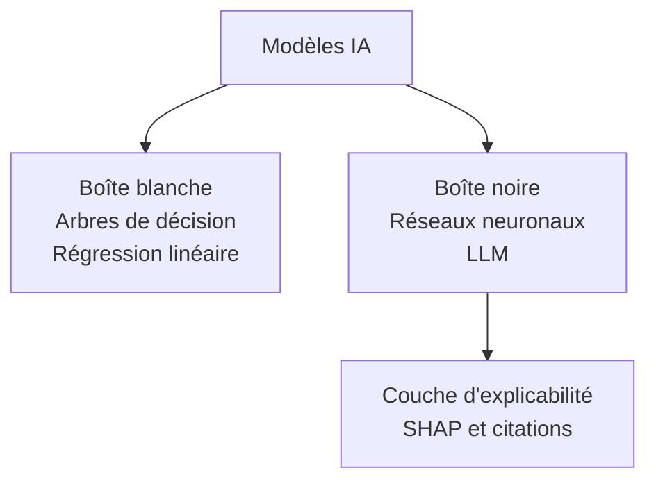
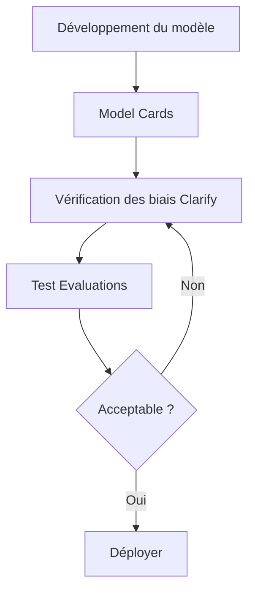
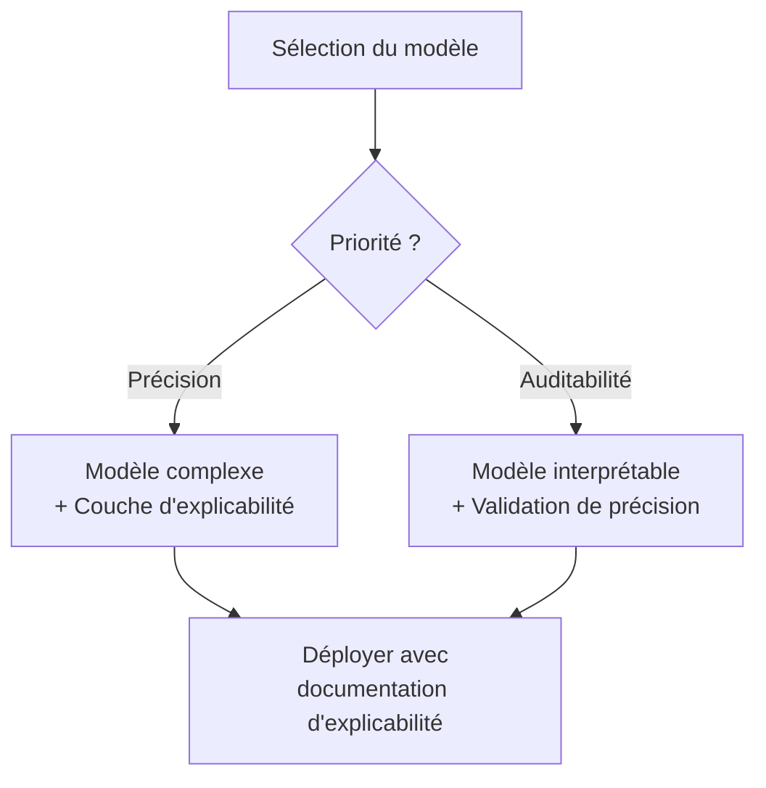
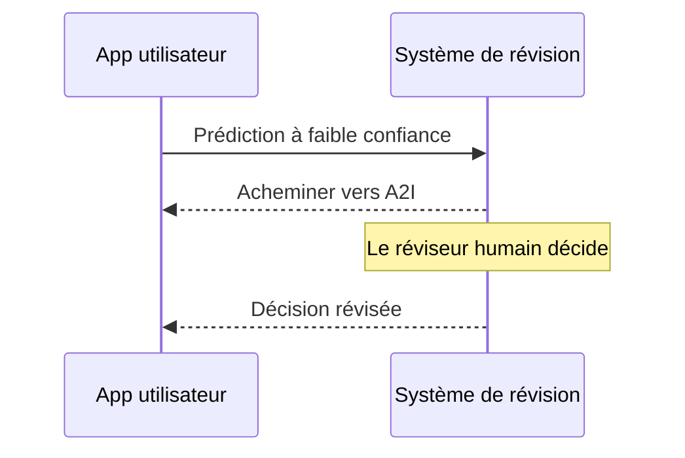

## Énoncé de tâche 4.2 : Reconnaître l'importance des modèles transparents et explicables

Lorsqu'un système d'IA prend une décision qui affecte un client, un employé ou un résultat métier, les personnes impliquées posent presque toujours la même question : pourquoi ? La réponse à cette question est ce dont parlent la transparence et l'explicabilité. Cet énoncé de tâche couvre comment distinguer les modèles capables de répondre à cette question de ceux qui ne le peuvent pas, les outils AWS qui documentent et présentent le comportement des modèles, les compromis entre l'explicabilité et d'autres propriétés telles que la sécurité et les performances, et les principes de conception qui maintiennent les humains de manière significative dans la boucle lorsque les systèmes d'IA font des recommandations conséquentes.[^402001]

### 4.2.1 Différences entre les modèles transparents et explicables et les modèles qui ne le sont pas

La transparence et l'explicabilité sont des propriétés connexes mais distinctes. **La transparence** est la propriété d'un modèle dont la structure interne, les données d'entraînement et la logique de décision peuvent être inspectées directement. Un modèle transparent est un modèle que vous pouvez ouvrir et lire. **L'explicabilité** est la propriété d'un modèle dont les sorties peuvent être accompagnées d'une raison compréhensible par un humain, même si la structure interne reste complexe. Un modèle explicable peut être opaque en interne, mais le système qui l'entoure peut produire un raisonnement qu'une personne peut évaluer.[^402002]

La distinction a une importance pratique. Un *arbre de décision* classique est transparent : vous pouvez suivre les branches de la racine à la feuille et retracer exactement quelles valeurs d'entrée ont amené le modèle à atteindre une conclusion donnée.[^402031] Un *réseau neuronal profond* avec des milliards de paramètres n'est pas transparent de la même façon ; aucun humain ne peut lire la matrice de poids et comprendre pourquoi une séquence de jetons particulière a produit une sortie particulière. Cependant, un système bien conçu autour de ce réseau neuronal peut quand même être explicable : il peut rapporter les caractéristiques qui ont le plus contribué à la sortie, présenter les documents sources qui ont le plus influencé une réponse, ou attribuer un score de confiance qui signale le niveau de certitude du modèle.[^402032]

**Les modèles en boîte blanche** sont ceux dont la logique de décision est intrinsèquement lisible. La régression linéaire, la régression logistique, les arbres de décision et les classifieurs basés sur des règles tombent tous dans cette catégorie.[^402003] Un modèle de souscription de prêt construit comme un arbre de décision peut être décrit en langage courant à un régulateur : « Les demandes avec un ratio dette/revenu supérieur à 40 % et moins de 24 mois d'historique d'emploi ont été refusées. » Cette phrase est le modèle. Les modèles en boîte blanche sont le choix par défaut dans les environnements où la responsabilité réglementaire exige une auditabilité complète de chaque décision individuelle, comme le crédit à la consommation, la souscription d'assurances et certaines classifications de dispositifs médicaux.[^402033]

**Les modèles en boîte noire** sont ceux dont le calcul interne est trop complexe pour être interprété directement.[^402004] Les grands modèles de langage, les réseaux convolutifs profonds et les méthodes d'ensemble telles que les arbres à gradient accéléré entraînés sur des centaines de caractéristiques se comportent tous comme des boîtes noires d'un point de vue pratique. Le modèle produit un score ou une séquence de jetons, mais le chemin de l'entrée à la sortie passe par tant de transformations non linéaires que le retracer est computationnellement et conceptuellement intraitable.[^402034] La plupart des systèmes d'IA de production en modération de contenu, imagerie médicale, détection de fraude et traitement du langage naturel fonctionnent avec des modèles en boîte noire.

*Figure 4.2.1 : Taxonomie boîte blanche vs. boîte noire. Les modèles en boîte blanche exposent la logique de décision directement ; les modèles en boîte noire nécessitent une couche d'explicabilité séparée pour produire des raisonnements compréhensibles par les humains.*

La réalité de la plupart des systèmes d'IA de production est qu'ils se situent quelque part entre les deux extrêmes. Un classifieur à gradient accéléré peut ne pas être lisible ligne par ligne, mais il est moins opaque qu'un réseau neuronal profond car des scores d'*importance des caractéristiques* peuvent être calculés directement à partir de la structure du modèle.[^402035] Un grand modèle de langage est profondément opaque en interne mais peut être configuré pour citer ses sources, rapporter son incertitude et expliquer sa chaîne de raisonnement en langage courant avant de produire une réponse finale. La question pratique n'est pas de savoir si un modèle est parfaitement transparent mais s'il est suffisamment explicable pour les exigences de responsabilité du cas d'usage.[^402036]

Trois industries illustrent bien ce spectre. Dans la notation de crédit, les réglementations dans de nombreuses juridictions exigent qu'un prêteur fournisse à un demandeur les raisons spécifiques pour lesquelles une décision de crédit a été prise ; les modèles en boîte blanche ou les modèles en boîte noire attribués par SHAP satisfont tous deux à cette exigence, alors qu'un score inexpliqué ne le fait pas.[^402005] Dans le diagnostic médical, un radiologue utilisant un outil IA pour dépister des radiographies thoraciques doit voir quelles régions de l'image le modèle a pondérées le plus fortement afin que le médecin puisse confirmer ou annuler l'hypothèse du modèle ; ici l'explicabilité soutient la prise de décision humaine sans la remplacer.[^402037] Dans la modération de contenu, l'opérateur de la plateforme peut ne pas être tenu d'expliquer les décisions individuelles de modération aux utilisateurs, mais les équipes d'audit internes doivent vérifier que le classifieur applique des règles cohérentes dans les groupes démographiques ; ici l'explicabilité est principalement un outil d'assurance qualité interne.[^402038]

### 4.2.2 Outils pour identifier les modèles transparents et explicables

Reconnaître que l'explicabilité est nécessaire est différent de savoir comment l'atteindre. AWS fournit un ensemble d'outils qui traitent l'explicabilité à différents niveaux : la documentation du modèle, son comportement pendant l'inférence et la sécurité et la qualité de ses sorties.[^402039]

**Amazon SageMaker Model Cards** est l'outil qu'AWS a conçu pour standardiser la façon dont la documentation du modèle est créée et partagée.[^402006] Une fiche de modèle est un document structuré lisible par un humain attaché à un artefact de modèle dans SageMaker. Elle enregistre les cas d'usage prévus du modèle, l'ensemble de données d'entraînement et sa provenance, les métriques de performance pour les sous-groupes pertinents, les limitations connues, les considérations éthiques et les restrictions d'utilisation.[^402007] Un professionnel des affaires révisant une fiche de modèle avant d'approuver un modèle pour la production peut déterminer si le modèle a été entraîné sur des données représentatives de la population de déploiement, quels compromis de précision ont été faits, et quels risques l'équipe de développement a déjà identifiés.

La valeur des fiches de modèle s'étend au-delà de la décision de déploiement initiale. Lorsque le comportement d'un modèle change au fil du temps, ou lorsqu'une enquête réglementaire arrive, la fiche de modèle fournit un enregistrement auditable de ce qui était connu au moment du déploiement.[^402040] Amazon SageMaker prend en charge la publication des fiches de modèle via la console de gestion AWS et le SDK Python SageMaker, et les fiches peuvent être versionnées avec l'artefact de modèle.[^402008]

**Amazon SageMaker Clarify** traite l'explicabilité au niveau de l'inférence.[^402009] Clarify utilise une technique appelée *SHAP* (SHapley Additive exPlanations) pour calculer des scores d'attribution de caractéristiques pour les modèles d'apprentissage automatique classiques.[^402010] Pensez à une valeur SHAP comme « dans quelle mesure cette caractéristique a-t-elle poussé la réponse vers le haut ou vers le bas par rapport à la prédiction moyenne pour l'ensemble des demandeurs. » Les nombres positifs poussent vers un risque prédit plus élevé ; les nombres négatifs poussent vers un risque plus faible. Par exemple, une explication de Clarify pour une prédiction de modèle de risque de crédit pourrait montrer que le ratio dette/revenu du demandeur a contribué +0,12 au score de risque tandis que la durée de l'historique de crédit a contribué -0,08, donnant à l'analyste une base quantitative pour la décision et un point de départ pour toute explication requise envers le demandeur. (Pour les modèles d'images, la technique équivalente produit des *cartes de saillance* qui mettent en évidence les régions d'une image d'entrée que le modèle a pondérées le plus fortement.)

Au-delà de l'attribution des caractéristiques, SageMaker Clarify mesure les *métriques de biais* qui reflètent si le modèle traite différemment les différents groupes démographiques.[^402011] Les métriques de biais avant l'entraînement évaluent si l'ensemble de données d'entraînement lui-même est déséquilibré. Les métriques de biais après l'entraînement évaluent si les prédictions du modèle entraîné diffèrent systématiquement entre les groupes définis par un attribut sensible tel que le genre, l'âge ou le code postal.[^402041] Cette capacité de détection des biais se connecte directement aux caractéristiques d'IA responsable couvertes dans la tâche 4.1 et fait de Clarify un outil à double usage : il explique les prédictions individuelles et surveille l'équité au niveau de la population.

**Amazon Bedrock Model Evaluations** est l'outil qu'AWS fournit pour évaluer la qualité et la sécurité des sorties des modèles de fondation.[^402012] Contrairement à Clarify, qui traite l'attribution de caractéristiques des modèles ML classiques, Bedrock Model Evaluations évalue les sorties LLM sur des dimensions telles que la précision, la fluidité, la cohérence et la toxicité. L'évaluation peut être configurée comme un travail automatisé utilisant des algorithmes de notation intégrés ou comme un travail d'évaluation humaine avec une équipe interne ou une main-d'œuvre gérée par AWS.[^402013] La dimension d'évaluation de la sécurité vérifie spécifiquement le contenu nuisible, toxique ou inapproprié, donnant aux organisations un enregistrement structuré de la façon dont un modèle fonctionne sur les critères de sécurité avant d'être mis en production. Bedrock Model Evaluations produit un rapport par travail comparant les sorties aux critères ; ce n'est pas un document de gouvernance permanent sur le modèle lui-même, ce que les fiches de modèle fournissent.

**Les modèles open source** méritent une attention spécifique en tant qu'outil de transparence. Lorsqu'une organisation déploie un modèle dont les poids et l'architecture sont publiquement disponibles, tels que les modèles de la famille Meta Llama ou de la famille Mistral, elle peut inspecter la documentation de l'architecture, examiner les fiches de données d'entraînement publiées par les développeurs du modèle et exécuter des évaluations tierces.[^402014] Il s'agit d'un niveau de transparence qualitativement différent de celui disponible pour les modèles propriétaires accessibles via une API, où l'architecture et les données d'entraînement ne sont pas divulguées.[^402042] Déployer un modèle open source sur AWS via Amazon Bedrock ou directement sur des points de terminaison Amazon SageMaker préserve cet avantage de transparence tout en conservant les avantages opérationnels de l'infrastructure gérée.[^402043]

**La documentation des données et des licences** complète le tableau. L'explicabilité n'est significative que si les données qui ont produit le modèle sont traçables.[^402015] Un modèle entraîné sur des données à provenance non divulguée présente des risques qu'une fiche de modèle ne peut pas entièrement capturer : si les données d'entraînement s'avèrent contenir des données personnelles protégées, du contenu protégé par le droit d'auteur ou des étiquettes systématiquement biaisées, les sorties du modèle héritent de ces problèmes.[^402044] Les termes de licence pour les données d'entraînement et les poids du modèle déterminent ce que l'organisation peut légalement faire avec les sorties du modèle, et cette détermination est elle-même une forme de transparence sur les contraintes opérationnelles du modèle.[^402045]

*Tableau 4.2.1 : Outils AWS pour la transparence et l'explicabilité des modèles*

| Outil | Ce qu'il explique | Technique | Public principal |
|---|---|---|---|
| SageMaker Model Cards | Intention du modèle, données, résultats d'évaluation, limitations | Documentation structurée | Réviseurs métier, auditeurs |
| SageMaker Clarify | Attribution des prédictions individuelles, métriques de biais | Valeurs SHAP, tests statistiques | Scientifiques des données, conformité |
| Bedrock Model Evaluations | Qualité et sécurité des sorties LLM | Notation automatisée et humaine | Équipes IA, réviseurs de sécurité |
| Inspection des modèles open source | Architecture et données d'entraînement | Révision directe des poids et de la documentation | Ingénieurs ML, chercheurs |
| Révision des données et des licences | Provenance des données d'entraînement et droits d'utilisation | Suivi de la provenance, révision des licences | Juridique, conformité, achats |

L'examen attend que vous associiez un scénario à l'outil correct. Lorsqu'une question demande comment une organisation devrait documenter l'utilisation prévue d'un modèle et ses limitations connues pour un audit, la réponse est SageMaker Model Cards. Lorsqu'une question demande comment expliquer pourquoi une prédiction spécifique a été faite par un modèle ML classique, la réponse est SageMaker Clarify avec SHAP. Lorsqu'une question demande comment évaluer si les sorties d'un modèle génératif sont sûres avant le déploiement en production, la réponse est Bedrock Model Evaluations.[^402046]

*Figure 4.2.2 : Chaîne d'outils d'explicabilité dans le cycle de vie du modèle. Les fiches de modèle fournissent le contexte de documentation ; Clarify mesure les biais avant et après l'entraînement ; Bedrock Model Evaluations valide la sécurité des sorties avant le déploiement.*

### 4.2.3 Compromis entre la sécurité et la transparence des modèles

La transparence et la sécurité ne sont pas toujours alignées. Comprendre où elles se renforcent mutuellement et où elles entrent en conflit est important pour concevoir des systèmes d'IA qui sont à la fois dignes de confiance et sécurisés.[^402047]

Le conflit le plus courant découle du fait que révéler comment un contrôle de sécurité fonctionne peut permettre à un adversaire de le contourner. Considérons un système de modération de contenu qui bloque les sorties nuisibles en détectant certains schémas de phrases dans la réponse du modèle. Publier la liste exacte des phrases permettrait à un mauvais acteur de construire des requêtes qui évitent toutes les phrases bloquées tout en suscitant quand même du contenu nuisible. Dans ce cas, l'opacité dans le contrôle de sécurité est intentionnelle.[^402048] La même logique s'applique aux défenses contre l'injection d'invite : une invite système qui demande au modèle d'ignorer les instructions suivant un certain modèle est moins efficace une fois ce modèle connu.[^402016] Les systèmes de sécurité traitent régulièrement les détails de leur logique de détection comme confidentiels, et les contrôles de sécurité de l'IA ne font pas exception.

Le conflit va également dans le sens opposé. L'opacité dans un modèle peut cacher des limitations pertinentes pour la sécurité que les opérateurs et les utilisateurs doivent connaître. Une fiche de modèle qui décrit avec précision les modes de défaillance d'un modèle, comme une précision plus faible pour les locuteurs non natifs de l'anglais ou des taux d'hallucination plus élevés sur les événements très récents, permet aux opérateurs d'ajouter des contrôles compensatoires au moment du déploiement.[^402017] Cacher ou omettre ces limitations signifie que l'opérateur ne peut pas les atténuer. En ce sens, la transparence sur les limitations améliore activement les résultats de sécurité.[^402049]

Le compromis performance-interprétabilité est une deuxième tension que l'examen couvre. En général, les modèles qui atteignent la précision la plus élevée sur les tâches complexes sont également les moins interprétables. Un réseau neuronal profond entraîné sur des millions d'images étiquetées surpassera un arbre de décision sur la plupart des tâches de classification d'images, mais les prédictions de l'arbre de décision peuvent être expliquées à un expert du domaine sans aucun outillage supplémentaire.[^402018] Un ensemble à gradient accéléré entraîné sur des dizaines de caractéristiques construites surpassera souvent la régression logistique sur des données tabulaires, mais la régression logistique produit des coefficients qu'un statisticien peut lire directement comme la contribution de chaque variable.[^402050]

*Figure 4.2.3 : Chemin de décision performance vs. interprétabilité. Lorsque la précision est l'exigence principale, ajoutez une couche d'explicabilité post-hoc ; lorsque l'auditabilité est principale, choisissez un modèle interprétable et vérifiez son seuil de précision.*

Il n'existe pas de mesure numérique unique de l'interprétabilité.[^402019] L'interprétabilité est une propriété évaluée par cas d'usage, pas un score sur un classement. Un modèle qu'un radiologue considère suffisamment explicable pour une assistance au dépistage peut ne pas être suffisamment explicable pour générer un diagnostic formel qui apparaît dans un dossier médical.[^402051] Un modèle de risque de crédit qui satisfait les exigences d'explication d'une réglementation sur le crédit à la consommation d'un pays peut ne pas satisfaire celles d'un autre pays. La question de mesure est donc toujours : suffisamment explicable pour qui, dans quel but et selon quelle obligation ?[^402052]

*Tableau 4.2.2 : Schémas d'interaction transparence-sécurité*

| Scénario | Effet sur la transparence | Effet sur la sécurité | Résolution |
|---|---|---|---|
| Publication des détails de défense contre l'injection d'invite | Haute transparence | Réduction de la sécurité | Garder la logique de défense confidentielle ; publier uniquement la politique de haut niveau |
| La fiche de modèle documente les modes de défaillance par hallucination | Haute transparence | Amélioration de la sécurité | Publier ; les opérateurs ajoutent des contrôles compensatoires |
| Révélation des valeurs de seuil de détection des biais | Transparence partielle | Risque de manipulation | Publier la catégorie ; garder les seuils exacts confidentiels |
| Poids du modèle open source | Transparence totale | Variable | Évaluer les risques spécifiques avant le déploiement ouvert |

Le conseil pratique pour un scénario d'examen est : lorsqu'une question décrit une situation où révéler le mécanisme d'un contrôle permettrait à un attaquant de le contourner, moins de transparence est appropriée pour la sécurité. Lorsqu'une question décrit une situation où cacher les limitations connues d'un modèle empêche les opérateurs de les atténuer, plus de transparence est appropriée pour la sécurité.[^402053]

### 4.2.4 Principes de conception centrée sur l'humain pour l'IA explicable

L'explicabilité n'est pas seulement une propriété technique d'un modèle ; c'est aussi une propriété de conception du système qui présente les sorties du modèle aux utilisateurs. Un modèle peut produire des scores d'attribution SHAP qu'aucun utilisateur métier ne verra jamais parce que l'interface n'a pas été conçue pour les afficher.[^402054] La conception centrée sur l'humain pour l'IA explicable signifie construire la couche de présentation de sorte que les utilisateurs reçoivent les informations dont ils ont besoin pour comprendre, faire confiance et annuler de manière appropriée les recommandations de l'IA.[^402020]

Le premier principe est de présenter les informations de confiance et d'incertitude lorsqu'elles sont pertinentes pour la décision. Un modèle qui attribue un score de confiance élevé à une recommandation et un modèle qui est presque également incertain entre deux options ne devraient pas sembler identiques à un utilisateur. Lorsqu'un système de détection de fraude signale une transaction avec 97 % de confiance, un analyste peut procéder rapidement. Lorsque le même système signale une transaction avec 54 % de confiance, l'analyste devrait savoir que le modèle est incertain et appliquer plus de rigueur. Les modèles Amazon Bedrock peuvent renvoyer des scores de probabilité et peuvent être invités à exprimer explicitement l'incertitude dans leurs sorties ; concevoir l'application pour afficher ces informations, plutôt que de convertir directement la sortie du modèle en une recommandation binaire oui/non, est un choix de conception délibéré.[^402021]

Le deuxième principe est de montrer les citations et les sources pour le contenu généré. Une application basée sur la RAG qui récupère des informations d'un corpus de documents et génère une réponse en langage naturel devrait identifier quels documents sources ont été utilisés. Ce n'est pas seulement une mesure de transparence ; c'est un outil pratique qui permet à un utilisateur de vérifier la sortie du modèle par rapport à la source originale et d'identifier les cas où le modèle a généralisé au-delà de ce que la source disait réellement.[^402022] Amazon Bedrock Knowledge Bases renvoie des références aux documents sources aux côtés des réponses générées, et les conceptions d'applications qui présentent ces références aux utilisateurs finaux rendent le système matériellement plus digne de confiance.[^402055]

Le troisième principe est de concevoir des boucles de retour qui capturent les jugements des utilisateurs sur la qualité des sorties de l'IA. Un mécanisme pouce haut ou pouce bas attaché à la recommandation d'un modèle est la forme la plus simple de ceci, mais la conception devrait également capturer la raison du retour négatif : la recommandation était-elle factuellement incorrecte, non applicable, ou correcte mais présentée de manière confuse ? Ce retour structuré, acheminé vers l'équipe de développement du modèle, produit les données étiquetées nécessaires pour identifier les modes de défaillance systématiques et améliorer le modèle au fil du temps. Amazon A2I, présenté dans la tâche 4.1, s'inscrit dans ce principe en acheminant les sorties à faible confiance vers des réviseurs humains et en capturant leurs décisions comme enregistrements structurés.[^402023]

*Figure 4.2.4 : Flux de retour humain en boucle. L'application présente les scores de confiance à l'utilisateur, achemine les sorties à faible confiance ou contestées vers Amazon A2I pour révision humaine, et renvoie les annotations structurées à l'équipe de développement.*

Le quatrième principe est de séparer ce que le modèle a dit de ce que le système a fait. Dans une application d'IA multicouche, le modèle produit une recommandation, puis un système en aval agit en conséquence. Une interface bien conçue montre à l'utilisateur les deux couches : la recommandation du modèle et l'action du système basée sur cette recommandation.[^402056] Cela est important lorsque le système ajoute des règles métier qui modifient ou annulent la sortie du modèle. Par exemple, un outil de support au recrutement pourrait montrer à un recruteur à la fois le classement des candidats par le modèle et la règle que l'entreprise du recruteur a appliquée pour filtrer les candidats en dessous d'un seuil d'âge légal. L'utilisateur peut alors évaluer le raisonnement du modèle indépendamment de la couche de règles métier.[^402057]

Le cinquième principe est de respecter l'autonomie des utilisateurs en rendant les substitutions faciles et bien suivies. Une recommandation d'IA qui ne peut pas être substituée n'est pas une recommandation du tout ; c'est une décision automatisée. Les utilisateurs qui sont tenus d'utiliser les sorties de l'IA mais ne peuvent pas les substituer perdent leur capacité à appliquer un jugement professionnel aux cas limites, et l'organisation perd le signal que les données de substitution auraient fourni.[^402058] Concevoir des mécanismes de substitution qui sont bien visibles, à faible friction et consignés dans des journaux d'audit donne aux utilisateurs une véritable autonomie tout en générant des retours précieux sur les lacunes du modèle.[^402024]

*Tableau 4.2.3 : Principes de conception centrée sur l'humain pour l'IA explicable*

| Principe | Exemple d'implémentation | Outil ou schéma AWS |
|---|---|---|
| Présenter la confiance et l'incertitude | Afficher le score de confiance du modèle aux côtés de la recommandation | Métadonnées de réponse d'inférence Bedrock |
| Montrer les citations et les sources | Lister les documents sources récupérés avec la réponse générée | Attribution de sources Bedrock Knowledge Bases |
| Capturer le retour structuré | Pouce bas avec raison ; acheminement automatique à faible confiance | Configuration du flux de travail Amazon A2I |
| Séparer la sortie du modèle de l'action du système | Afficher le score du modèle et la règle métier appliquée séparément | Conception de la couche applicative |
| Respecter l'autonomie de l'utilisateur | Bouton de substitution visible avec journal d'audit | Conception de la couche applicative |

L'accessibilité est une considération pratique dans la conception centrée sur l'humain que l'examen n'élabore pas mais que toute implémentation responsable doit traiter. Les scores de confiance présentés uniquement sous forme de valeurs numériques excluent les utilisateurs moins à l'aise avec le raisonnement probabiliste.[^402059] Les explications rédigées en langage technique excluent les utilisateurs non experts. Concevoir l'explicabilité pour les utilisateurs réels du système, pas pour les développeurs qui l'ont construit, est la définition opérationnelle de la conception centrée sur l'humain dans ce contexte.[^402060]

## Questions d'auto-évaluation

**Question 1.** Une société de services financiers utilise un modèle d'ensemble à gradient accéléré pour approuver ou refuser des demandes de prêt. Un régulateur exige que l'entreprise fournisse à chaque demandeur refusé une raison spécifique pour la décision. L'équipe de développement du modèle souhaite répondre à cette exigence sans remplacer le modèle. Quel outil ou technique AWS est LE PLUS approprié ?

A. Remplacer le modèle à gradient accéléré par un modèle de régression logistique qui est transparent par conception  
B. Utiliser Amazon SageMaker Clarify pour générer des scores d'attribution de caractéristiques basés sur SHAP pour chaque prédiction individuelle  
C. Publier une fiche de modèle SageMaker documentant les données d'entraînement et les métriques d'évaluation  
D. Utiliser Amazon Bedrock Model Evaluations pour noter la précision des sorties du modèle par rapport à un ensemble de données étiqueté  

**Explication :** Le régulateur exige une explication par décision, ce qui signifie que le système doit attribuer la prédiction spécifique à des caractéristiques d'entrée spécifiques pour chaque demande individuelle. Amazon SageMaker Clarify (réponse B) calcule des valeurs SHAP qui quantifient dans quelle mesure chaque caractéristique d'entrée a contribué à la prédiction du modèle, produisant précisément le raisonnement par décision que le régulateur exige. La réponse A satisferait l'exigence mais la question spécifie que l'équipe souhaite éviter de remplacer le modèle ; de plus, remplacer le modèle uniquement pour l'interprétabilité sacrifie l'avantage de précision de l'ensemble. La réponse C traite la documentation du modèle dans son ensemble mais ne génère pas d'explications par décision. La réponse D évalue la précision globale des sorties LLM et n'est pas conçue pour l'attribution de caractéristiques sur les modèles ML classiques. SageMaker Clarify est l'outil spécialement conçu pour l'attribution de prédictions individuelles sur les modèles entraînés par SageMaker.[^402026]

---

**Question 2.** Une entreprise développe un assistant d'imagerie médicale alimenté par IA qui met en évidence les régions d'une radiographie thoracique pour qu'un radiologue les révise. L'équipe de développement débat de l'utilisation d'un réseau convolutif profond avec une précision diagnostique plus élevée ou d'un classifieur basé sur des règles avec une précision plus faible mais des règles entièrement auditables. L'équipe clinique dit qu'elle n'utilisera l'outil que si elle peut comprendre pourquoi l'outil signale une région. Quelle approche répond LE MIEUX à la fois à l'exigence de l'équipe clinique et au besoin de précision ?

A. Utiliser le classifieur basé sur des règles parce qu'il est entièrement transparent et l'équipe clinique peut lire ses règles directement  
B. Utiliser le réseau convolutif profond et ajouter une couche d'explicabilité post-hoc qui met en évidence les régions de l'image que le modèle a pondérées le plus fortement  
C. Utiliser le réseau convolutif profond sans couche d'explicabilité et former l'équipe clinique à faire confiance à la sortie du modèle  
D. Utiliser Amazon Bedrock Model Evaluations pour valider les sorties du réseau convolutif profond avant chaque session d'imagerie  

**Explication :** La question identifie deux exigences concurrentes : haute précision (favorise le réseau convolutif profond) et compréhensibilité (favorise le modèle transparent). La réponse B résout la tension en utilisant le modèle de plus haute précision et en ajoutant une couche d'explicabilité post-hoc qui produit des *cartes de saillance* ou des visualisations équivalentes montrant quelles régions de l'image le modèle a pondérées le plus fortement. Cela donne aux radiologistes le raisonnement régional dont ils ont besoin sans sacrifier l'avantage de précision. La réponse A accepte la limitation de précision inutilement ; la question ne dit pas que la précision du classifieur basé sur des règles est suffisante. La réponse C ignore l'exigence déclarée de l'équipe clinique et introduit un risque pour la sécurité des patients en déployant un système inexpliqué auprès de cliniciens qui ont dit avoir besoin d'explications. La réponse D est la mauvaise catégorie d'outil ; Bedrock Model Evaluations traite la qualité des sorties LLM, pas l'attribution de classification d'images. La leçon plus large est que le compromis performance-interprétabilité peut souvent être résolu en gardant le modèle haute performance et en ajoutant une couche d'explicabilité plutôt qu'en choisissant entre les deux.[^402027]

---

**Question 3.** Une organisation se prépare à déployer un assistant de service client génératif IA. L'équipe de conformité exige la documentation de l'utilisation prévue du modèle, de ses modes de défaillance connus et des métriques d'évaluation utilisées pour le valider, le tout dans un format qu'un auditeur non technique peut réviser. Quelle capacité AWS est conçue à cette fin ?

A. Rapports de biais Amazon SageMaker Clarify  
B. Flux de travail de révision humaine Amazon Bedrock Model Evaluations  
C. Amazon SageMaker Model Cards  
D. Journaux d'audit de tâches de révision Amazon Augmented AI (Amazon A2I)  

**Explication :** Amazon SageMaker Model Cards (réponse C) est l'outil spécialement conçu pour la documentation structurée des modèles. Une fiche de modèle enregistre les cas d'usage prévus du modèle, la provenance des données d'entraînement, les résultats d'évaluation pour les sous-groupes, les limitations connues, les considérations éthiques et les restrictions d'utilisation dans un format standardisé et lisible par un humain. Cela répond directement aux trois exigences de conformité : utilisation prévue, modes de défaillance connus et métriques d'évaluation, dans une forme qu'un auditeur non technique peut naviguer. La réponse A produit des scores d'attribution par prédiction et des métriques de biais pour un modèle déployé, pas de documentation récapitulative pour un auditeur. La réponse B exécute des évaluations de qualité et de sécurité des inférences mais produit des scores d'évaluation plutôt que la documentation structurée qu'une fiche de modèle fournit. La réponse D produit des enregistrements d'audit de décisions de révision humaine individuelles, ce qui est utile pour la surveillance mais ne remplace pas la documentation du modèle. Les fiches de modèle sont la réponse canonique lorsque l'examen décrit une exigence d'audit ou de conformité pour la documentation du modèle avant le déploiement.[^402028]

---

**Question 4.** L'équipe produit IA d'une entreprise a construit un moteur de recommandation. La recherche utilisateur montre que de nombreux utilisateurs ne font pas confiance aux recommandations parce qu'ils ne peuvent pas comprendre pourquoi un article particulier a été suggéré. L'équipe souhaite appliquer une conception centrée sur l'humain pour augmenter la confiance des utilisateurs. Quelle option associe deux changements de conception qui répondent LE PLUS directement à l'écart de confiance ?

A. Remplacer le modèle de recommandation par un modèle plus précis et le ré-entraîner sur un ensemble de données plus large  
B. Afficher le score de confiance du modèle à côté de chaque recommandation et montrer les attributs principaux de l'historique de l'utilisateur qui ont motivé la suggestion  
C. Supprimer la fonctionnalité de recommandation jusqu'à ce que le modèle atteigne une précision plus élevée  
D. Ajouter une étape de révision humaine Amazon A2I pour approuver manuellement chaque recommandation avant qu'elle ne soit montrée à un utilisateur  

**Explication :** La recherche utilisateur identifie un problème de confiance causé par un manque de compréhensibilité, pas un problème causé par une faible précision ou une révision insuffisante. La réponse B applique deux principes de conception centrée sur l'humain directement : présenter la confiance (afin que les utilisateurs puissent calibrer le poids à donner à la recommandation) et montrer le raisonnement derrière la recommandation (les attributs qui l'ont motivée, ce qui est une forme d'attribution post-hoc). Les deux changements traitent directement l'écart de confiance déclaré. La réponse A améliore la précision, ce qui peut ou non traiter la confiance ; un modèle plus précis qui reste inexpliqué ne résout pas le problème identifié par la recherche utilisateur. La réponse C supprime une fonctionnalité de produit pour éviter le problème plutôt que de le résoudre. La réponse D introduit une révision humaine pour chaque recommandation, ce qui est opérationnellement impraticable à l'échelle d'un système de recommandation et traite le contrôle de qualité plutôt que l'explicabilité côté utilisateur. Le schéma d'examen ici est que lorsque la confiance des utilisateurs est le problème déclaré, la réponse correcte implique une conception de transparence et d'explication, pas le remplacement du modèle ou la révision manuelle.[^402029]

---

**Question 5.** Une équipe de science des données évalue si elle doit utiliser un modèle open source ou un modèle d'API fermé propriétaire pour une nouvelle application. Le département juridique de l'équipe exige une visibilité sur les sources de données d'entraînement et les termes de licence avant d'approuver le modèle pour une utilisation en production. Quelle caractéristique des modèles open source répond LE PLUS directement à l'exigence du département juridique ?

A. Les modèles open source sont toujours moins coûteux à exécuter que les modèles propriétaires accessibles via API  
B. Les modèles open source peuvent être fine-tunés sur des données propriétaires, ce qui permet à l'organisation de posséder les poids résultants  
C. Les modèles open source publient la documentation de l'architecture, les fiches de données d'entraînement et les termes de licence que l'équipe juridique peut réviser directement  
D. Les modèles open source satisfont automatiquement toutes les exigences réglementaires pour la transparence de l'IA dans l'UE et aux États-Unis  

**Explication :** L'exigence déclarée du département juridique est une visibilité sur les sources de données d'entraînement et les termes de licence. La réponse C y répond directement. Les modèles publiquement disponibles publient généralement des fiches de modèle et des fiches de données (ou la documentation équivalente) qui décrivent la composition du corpus d'entraînement, toute limitation connue et la licence applicable. L'équipe juridique peut examiner la licence publiée (comme une licence Apache 2.0 ou une licence commerciale spécifique au modèle) pour déterminer quelles utilisations sont autorisées et peut examiner la documentation des données d'entraînement pour évaluer les risques de provenance des données. La réponse A est un argument de coût qui ne répond pas à l'exigence légale ; les modèles open source ne sont pas universellement moins coûteux une fois les coûts d'infrastructure et opérationnels inclus. La réponse B traite la propriété des dérivés fine-tunés, ce qui est une considération juridique valide mais ne répond pas à l'exigence de visibilité sur les données d'entraînement et les licences déclarée dans la question. La réponse D est incorrecte ; le statut open source ne satisfait pas automatiquement un cadre réglementaire spécifique ; la conformité nécessite toujours une évaluation par rapport aux critères de la réglementation pertinente. La leçon plus large est que la transparence des données et des licences est une dimension distincte de la transparence des modèles, et les modèles open source fournissent un niveau de visibilité de la provenance qui n'est pas disponible pour les modèles accessibles uniquement via une API propriétaire.[^402030]

---

[^402001]: AWS Certification. AI Practitioner (AIF-C01) Exam Guide v1.1, Domain 4, Task Statement 4.2. URL: <https://docs.aws.amazon.com/aws-certification/latest/ai-practitioner-01/ai-practitioner-01-domain4.html>
[^402002]: Doshi-Velez, F., and Kim, B. Towards a Rigorous Science of Interpretable Machine Learning (2017). URL: <https://arxiv.org/abs/1702.08608>
[^402003]: Breiman, L. Classification and Regression Trees (1984). URL: <https://doi.org/10.1201/9781315139470>
[^402004]: Adadi, A., and Berrada, M. Peeking Inside the Black-Box: A Survey on Explainable AI. IEEE Access (2018). URL: <https://doi.org/10.1109/ACCESS.2018.2870052>
[^402005]: Consumer Financial Protection Bureau. Using Artificial Intelligence to Assist Adverse Action Explanations (2023). URL: <https://www.consumerfinance.gov/about-us/blog/cfpb-issues-guidance-on-credit-denials-by-lenders-using-artificial-intelligence/>
[^402006]: Amazon SageMaker. Amazon SageMaker Model Cards overview. URL: <https://docs.aws.amazon.com/sagemaker/latest/dg/model-cards.html>
[^402007]: Amazon SageMaker. Model Card components and structure. URL: <https://docs.aws.amazon.com/sagemaker/latest/dg/model-cards-create.html>
[^402008]: Amazon SageMaker. Versioning and sharing SageMaker Model Cards. URL: <https://docs.aws.amazon.com/sagemaker/latest/dg/model-cards-export.html>
[^402009]: Amazon SageMaker. Amazon SageMaker Clarify overview. URL: <https://docs.aws.amazon.com/sagemaker/latest/dg/clarify-configure-processing-jobs.html>
[^402010]: Lundberg, S., and Lee, S. A Unified Approach to Interpreting Model Predictions (SHAP, NeurIPS 2017). URL: <https://arxiv.org/abs/1705.07874>
[^402011]: Amazon SageMaker. Measuring bias with SageMaker Clarify. URL: <https://docs.aws.amazon.com/sagemaker/latest/dg/clarify-measure-data-bias.html>
[^402012]: Amazon Bedrock. Amazon Bedrock Model Evaluations overview. URL: <https://docs.aws.amazon.com/bedrock/latest/userguide/model-evaluation.html>
[^402013]: Amazon Bedrock. Human evaluation jobs in Amazon Bedrock Model Evaluations. URL: <https://docs.aws.amazon.com/bedrock/latest/userguide/model-evaluation-human.html>
[^402014]: Meta AI. Llama 3 model card and data documentation. URL: <https://ai.meta.com/research/publications/meta-llama-3/>
[^402015]: Mitchell, M., et al. Model Cards for Model Reporting (FAccT 2019). URL: <https://arxiv.org/abs/1810.03993>
[^402016]: Perez, F., and Ribeiro, I. Ignore Previous Prompt: Attack Techniques for Language Models (2022). URL: <https://arxiv.org/abs/2211.09527>
[^402017]: Raji, I., et al. Closing the AI Accountability Gap: Defining an End-to-End Framework for Internal Algorithmic Auditing (2020). URL: <https://arxiv.org/abs/2001.00973>
[^402018]: Rudin, C. Stop Explaining Black Box Machine Learning Models for High Stakes Decisions and Use Interpretable Models Instead. Nature Machine Intelligence (2019). URL: <https://doi.org/10.1038/s42256-019-0048-x>
[^402019]: Lipton, Z. The Mythos of Model Interpretability. Queue, ACM (2018). URL: <https://dl.acm.org/doi/10.1145/3236386.3241340>
[^402020]: Amershi, S., et al. Guidelines for Human-AI Interaction. CHI 2019. URL: <https://dl.acm.org/doi/10.1145/3290605.3300233>
[^402021]: Amazon Bedrock. Response metadata and confidence in Amazon Bedrock inference. URL: <https://docs.aws.amazon.com/bedrock/latest/userguide/model-invocation-logging.html>
[^402022]: Amazon Bedrock. Source attribution in Knowledge Bases responses. URL: <https://docs.aws.amazon.com/bedrock/latest/userguide/knowledge-base-retrieveandgenerate.html>
[^402023]: Amazon Augmented AI. Amazon A2I overview and human review workflows. URL: <https://docs.aws.amazon.com/sagemaker/latest/dg/a2i-getting-started.html>
[^402024]: Shneiderman, B. Human-Centered AI. Oxford University Press (2022). URL: <https://global.oup.com/academic/product/human-centered-ai-9780192845290>
[^402026]: Amazon SageMaker. Explainability with SageMaker Clarify: SHAP values for predictions. URL: <https://docs.aws.amazon.com/sagemaker/latest/dg/clarify-shapley-values.html>
[^402027]: Selvaraju, R., et al. Grad-CAM: Visual Explanations from Deep Networks via Gradient-Based Localization (2017). URL: <https://arxiv.org/abs/1610.02391>
[^402028]: Amazon SageMaker. Using Model Cards for compliance and auditability. URL: <https://docs.aws.amazon.com/sagemaker/latest/dg/model-cards.html>
[^402029]: Amershi, S., et al. Guidelines for Human-AI Interaction: Principle 7, Show contextual information. CHI 2019. URL: <https://dl.acm.org/doi/10.1145/3290605.3300233>
[^402030]: Linux Foundation AI and Data. Model and Data Card Standards for Open Source AI (2023). URL: <https://lfaidata.foundation/blog/2023/09/18/data-and-model-cards/>
[^402031]: Quinlan, J.R. Induction of Decision Trees. Machine Learning, vol. 1 (1986). URL: <https://doi.org/10.1007/BF00116251>
[^402032]: Guidotti, R., et al. A Survey of Methods for Explaining Black Box Models. ACM Computing Surveys (2018). URL: <https://dl.acm.org/doi/10.1145/3236009>
[^402033]: Board of Governors of the Federal Reserve System. SR 11-7: Guidance on Model Risk Management (2011). URL: <https://www.federalreserve.gov/supervisionreg/srletters/sr1107.htm>
[^402034]: Goodfellow, I., Bengio, Y., and Courville, A. Deep Learning. MIT Press (2016). URL: <https://www.deeplearningbook.org/>
[^402035]: Chen, T., and Guestrin, C. XGBoost: A Scalable Tree Boosting System. KDD 2016. URL: <https://arxiv.org/abs/1603.02754>
[^402036]: European Parliament. EU AI Act: Article 13, Transparency and provision of information to deployers (2024). URL: <https://eur-lex.europa.eu/legal-content/EN/TXT/?uri=CELEX:32024R1689>
[^402037]: Topol, E. High-performance medicine: the convergence of human and artificial intelligence. Nature Medicine (2019). URL: <https://doi.org/10.1038/s41591-018-0300-7>
[^402038]: Raji, I., and Buolamwini, J. Actionable Auditing: Investigating the Impact of Publicly Naming Biased Performance Results of Commercial AI Products. AIES 2019. URL: <https://dl.acm.org/doi/10.1145/3306618.3314244>
[^402039]: NIST. Artificial Intelligence Risk Management Framework (AI RMF 1.0), GOVERN 1.7. URL: <https://doi.org/10.6028/NIST.AI.100-1>
[^402040]: Amazon SageMaker. Model Card audit and governance use cases. URL: <https://docs.aws.amazon.com/sagemaker/latest/dg/model-cards-use-cases.html>
[^402041]: Amazon SageMaker. Post-training bias metrics in SageMaker Clarify. URL: <https://docs.aws.amazon.com/sagemaker/latest/dg/clarify-measure-post-training-bias.html>
[^402042]: Bommasani, R., et al. On the Opportunities and Risks of Foundation Models: Transparency section. Stanford CRFM (2021). URL: <https://arxiv.org/abs/2108.07258>
[^402043]: Amazon Bedrock. Supported open-source models in Amazon Bedrock. URL: <https://docs.aws.amazon.com/bedrock/latest/userguide/models-supported.html>
[^402044]: Gebru, T., et al. Datasheets for Datasets. Communications of the ACM (2021). URL: <https://doi.org/10.1145/3458723>
[^402045]: Open Source Initiative. The Open Source AI Definition, version 1.0 (2024). URL: <https://opensource.org/ai/open-source-ai-definition>
[^402046]: Amazon Bedrock. Choosing between automated and human evaluation in Bedrock Model Evaluations. URL: <https://docs.aws.amazon.com/bedrock/latest/userguide/model-evaluation.html>
[^402047]: Wachter, S., Mittelstadt, B., and Russell, C. Counterfactual Explanations Without Opening the Black Box: Automated Decisions and the GDPR. Harvard Journal of Law and Technology (2018). URL: <https://doi.org/10.2139/ssrn.3063289>
[^402048]: Amazon Bedrock. Amazon Bedrock Guardrails: content filtering configuration. URL: <https://docs.aws.amazon.com/bedrock/latest/userguide/guardrails-filters.html>
[^402049]: Floridi, L., et al. An Ethical Framework for a Good AI Society: Opportunities, Risks, Principles, and Recommendations. Minds and Machines (2018). URL: <https://doi.org/10.1007/s11023-018-9482-5>
[^402050]: Hastie, T., Tibshirani, R., and Friedman, J. The Elements of Statistical Learning, 2nd ed. Springer (2009). URL: <https://doi.org/10.1007/978-0-387-84858-7>
[^402051]: FDA. Artificial Intelligence and Machine Learning in Software as a Medical Device: Action Plan (2021). URL: <https://www.fda.gov/medical-devices/software-medical-device-samd/artificial-intelligence-and-machine-learning-software-medical-device>
[^402052]: European Parliament. EU AI Act: Article 86, Right of explanation of individual decision-making (2024). URL: <https://eur-lex.europa.eu/legal-content/EN/TXT/?uri=CELEX:32024R1689>
[^402053]: NIST. AI RMF Playbook: MAP 1.6, Risk of insufficient explainability. URL: <https://airc.nist.gov/Docs/2>
[^402054]: Yang, Q., et al. Investigating how and why practitioners use machine learning explanation methods. CHI 2023. URL: <https://dl.acm.org/doi/10.1145/3544548.3581219>
[^402055]: Amazon Bedrock. Citations and source attribution in Knowledge Bases responses. URL: <https://docs.aws.amazon.com/bedrock/latest/userguide/knowledge-base-retrieveandgenerate.html>
[^402056]: Cai, C.J., et al. Human-Centered Tools for Coping with Imperfect Algorithms During Medical Decision-Making. CHI 2019. URL: <https://dl.acm.org/doi/10.1145/3290605.3300234>
[^402057]: European Parliament. EU AI Act: Article 26, Obligations of deployers of high-risk AI systems (2024). URL: <https://eur-lex.europa.eu/legal-content/EN/TXT/?uri=CELEX:32024R1689>
[^402058]: Kuo, T., et al. Assessing the AI on AI: Examining the Influence of AI Recommendations on Human Decisions. CHI 2023. URL: <https://dl.acm.org/doi/10.1145/3544548.3581314>
[^402059]: Bunt, A., Lount, M., and Lauzon, C. Are explanations always important? A study of deployed, low-cost intelligent systems. IUI 2012. URL: <https://dl.acm.org/doi/10.1145/2166966.2166996>
[^402060]: Wang, D., et al. Designing Theory-Driven User-Centric Explainable AI. CHI 2019. URL: <https://dl.acm.org/doi/10.1145/3290605.3300831>
