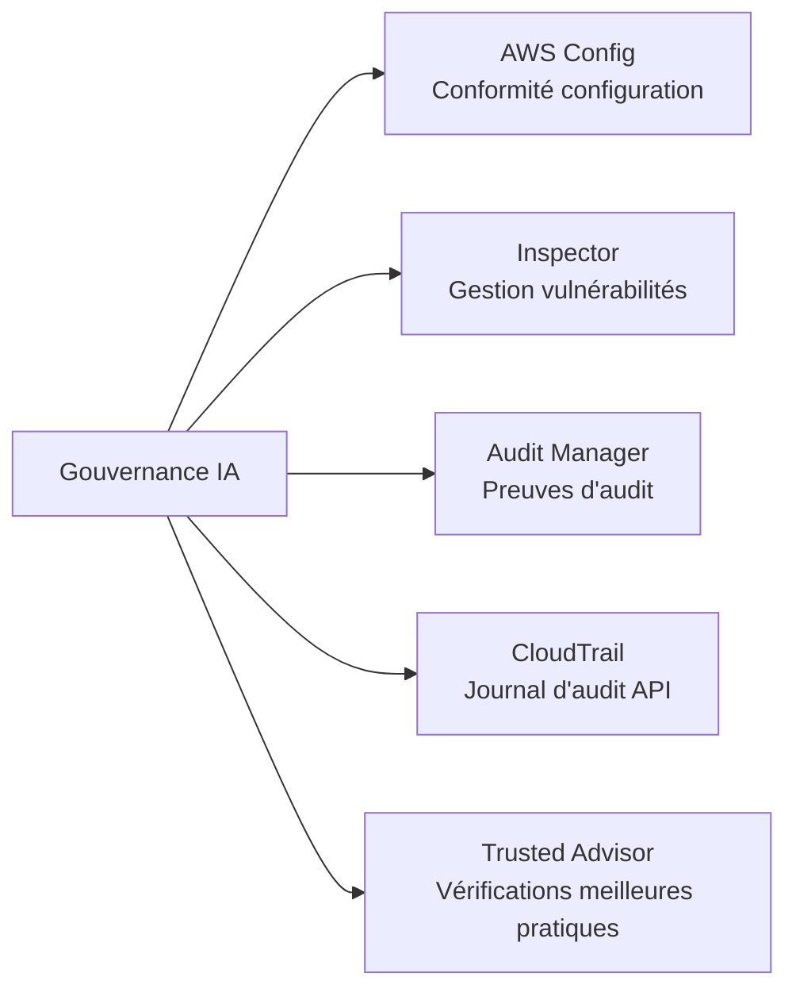
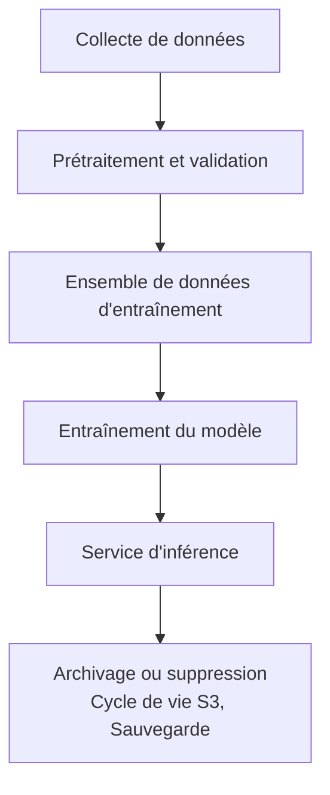
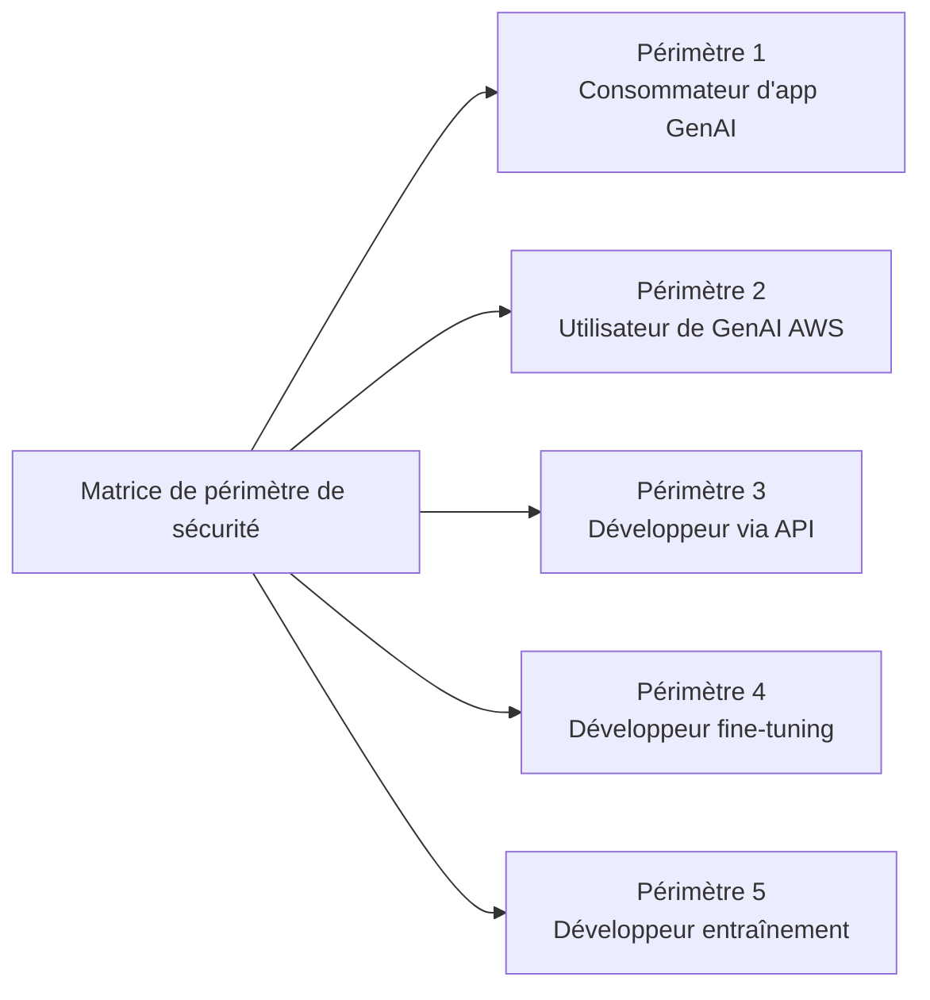
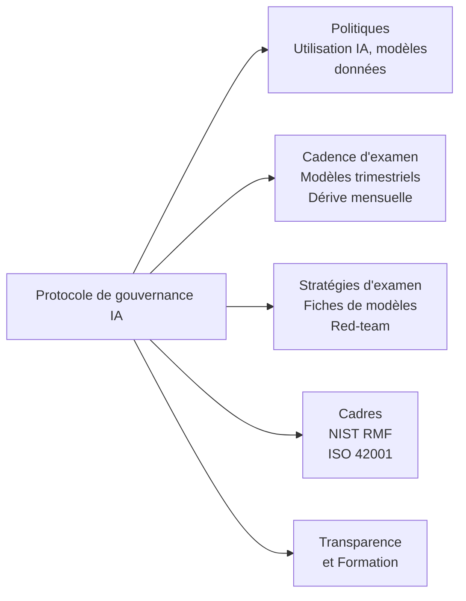

## Tâche 5.2 : Reconnaître les réglementations de gouvernance et de conformité pour les systèmes d'IA

La gouvernance et la conformité traduisent les principes d'une IA responsable en responsabilité organisationnelle. Là où les contrôles de sécurité protègent la couche technique, les structures de gouvernance créent les politiques, les cycles d'examen, les pistes d'audit et les preuves réglementaires qui permettent à une organisation d'expliquer, de défendre et d'améliorer continuellement ses systèmes d'IA. Cette tâche couvre les services AWS qui soutiennent la collecte de preuves de conformité, les stratégies de gouvernance des données que les auditeurs attendent, et les processus de gouvernance qui donnent aux programmes d'IA un ancrage institutionnel durable.[^502001]

### 5.2.1 Services et fonctionnalités AWS pour la gouvernance et la conformité

La conformité pour une charge de travail IA n'est pas une barrière franchie une seule fois au déploiement ; c'est un état continu maintenu grâce à une surveillance permanente, une collecte de preuves et une disponibilité à l'audit. AWS fournit un ensemble de services gérés qui couvrent collectivement le cycle de vie complet de la conformité : enregistrement de la configuration, analyse des vulnérabilités, collecte de preuves alignée sur les cadres réglementaires, récupération de rapports à la demande, journalisation des audits d'API et vérifications des meilleures pratiques. Utilisés ensemble, ces services permettent à une organisation de démontrer aux régulateurs, aux auditeurs et aux parties prenantes internes que ses systèmes d'IA fonctionnent dans des limites définies.

La relation entre ces services suit une division logique du travail. **AWS Config** suit l'état de configuration des ressources et évalue si elles sont conformes aux règles définies. **Amazon Inspector** détecte les vulnérabilités dans les couches de calcul et de conteneur qui hébergent les charges de travail IA. **AWS Audit Manager** organise les preuves de conformité en dossiers prêts pour l'audit, alignés sur des cadres spécifiques. **AWS Artifact** donne aux utilisateurs autorisés accès aux certifications de conformité tierces d'AWS. **AWS CloudTrail** crée le journal immuable de l'activité API qui prouve qui a fait quoi et quand. **AWS Trusted Advisor** identifie les lacunes de configuration par rapport aux meilleures pratiques AWS dans les domaines du coût, de la sécurité, de la tolérance aux pannes et des limites de service.

*Figure 5.2.1 : Catégories de services de conformité AWS. Chaque service adresse une couche distincte de la pile d'audit et de gouvernance pour les charges de travail IA.*

**AWS Config** est un service d'enregistrement de configuration et d'évaluation des règles qui suit continuellement l'état des ressources AWS et les compare à des règles de conformité définies par politique.[^502002] Lorsqu'une ressource change, Config enregistre la nouvelle configuration, la compare aux règles applicables et signale celles qui ne sont pas conformes. Pour les charges de travail IA, trois catégories de règles sont particulièrement pertinentes. Premièrement, la journalisation des invocations de modèles Bedrock peut être vérifiée : une règle Config peut contrôler que la journalisation est activée pour Amazon Bedrock, garantissant que chaque demande de modèle est capturée à des fins d'audit et d'analyse.[^502003] Deuxièmement, l'accès aux notebooks SageMaker peut être contrôlé : une règle vérifiant que les instances de notebook Amazon SageMaker nécessitent un accès basé sur IAM empêche l'exposition directe sur Internet des environnements de notebook où résident le code d'entraînement et les données.[^502004] Troisièmement, le chiffrement peut être appliqué : une règle vérifiant que les artefacts de modèles personnalisés Bedrock et les volumes d'entraînement SageMaker sont chiffrés au repos garantit que les paramètres sensibles des modèles et les données d'entraînement sont toujours protégés.[^502005]

Les règles Config peuvent être regroupées en *packs de conformité*, qui regroupent plusieurs règles connexes en une unité déployable alignée sur une exigence de conformité spécifique telle que NIST SP 800-53 ou le standard AWS Foundational Security Best Practices.[^502006] Lorsqu'une organisation souhaite démontrer que son environnement IA satisfait aux exigences de contrôle d'un cadre, le déploiement du pack de conformité correspondant et l'exportation de son tableau de bord de conformité fournissent une vue unique et reproductible de l'état des contrôles.

**Amazon Inspector** est un service d'évaluation continue des vulnérabilités qui analyse les instances Amazon EC2, les fonctions AWS Lambda et les images de conteneur stockées dans Amazon Elastic Container Registry (ECR) pour détecter les vulnérabilités logicielles connues et les expositions réseau involontaires.[^502007] Les charges de travail IA s'exécutent fréquemment sur une infrastructure couverte par Inspector : les tâches d'entraînement SageMaker s'exécutent sur des flottes d'instances EC2, les conteneurs d'inférence sont stockés dans ECR, et le code d'inférence personnalisé peut s'exécuter en tant que fonctions Lambda. Inspector met en corrélation les résultats avec la base de données Common Vulnerabilities and Exposures (CVE) et attribue un score de risque, permettant aux équipes de sécurité de prioriser les vulnérabilités à corriger en premier en fonction de leur exploitabilité et de leur impact.[^502008] Pour la gouvernance, les résultats d'Inspector s'intègrent directement dans AWS Security Hub, fournissant un tableau de bord centralisé que les auditeurs peuvent consulter aux côtés d'autres signaux de conformité.

**AWS Audit Manager** automatise la collecte de preuves pour les audits de conformité.[^502009] Plutôt que d'extraire manuellement des captures d'écran et des extraits de journaux avant chaque cycle d'audit, les organisations configurent Audit Manager avec un cadre, et le service collecte continuellement des preuves à partir des résultats des règles AWS Config, des appels API CloudTrail et des résultats Security Hub. Le service propose des cadres préconfigurés pour HIPAA, SOC 2, PCI DSS, ISO 27001, FedRAMP et d'autres normes, ainsi que des outils pour créer des cadres personnalisés pour les programmes d'audit internes ou les exigences émergentes spécifiques à l'IA.[^502010] Les preuves sont stockées dans un rapport d'évaluation structuré qu'un auditeur peut consulter sans avoir besoin d'un accès direct à l'environnement AWS. Pour les programmes IA relevant de HIPAA, par exemple, Audit Manager peut collecter des preuves que les données d'entraînement sont chiffrées, que l'accès aux points de terminaison des modèles est journalisé, et que les modifications apportées aux configurations de modèles sont enregistrées, produisant un dossier d'audit qui démontre le fonctionnement des contrôles sur une période définie.

**AWS Artifact** est le portail en libre-service où les clients AWS peuvent télécharger les certifications de conformité et les accords d'AWS.[^502011] Les rapports disponibles comprennent les rapports SOC 1, SOC 2 et SOC 3 (audits de contrôles des systèmes et des organisations effectués par des tiers indépendants), les certifications ISO 27001, ISO 27017 et ISO 27018 (gestion de la sécurité de l'information et confidentialité dans le cloud), l'attestation de conformité PCI DSS (pour les charges de travail liées aux cartes de paiement), et les accords de partenariat commercial HIPAA (BAA) pour les entités couvertes par le secteur de la santé.[^502012] Artifact ne génère pas de preuves sur les charges de travail propres au client ; il fournit des preuves sur les contrôles d'AWS en tant que fournisseur d'infrastructure sous-jacent. Cette distinction est importante pour le modèle de responsabilité partagée : le client présente les rapports Artifact pour démontrer que la plateforme cloud elle-même répond aux exigences d'infrastructure du régulateur, tandis que les preuves Audit Manager démontrent que la configuration et les opérations du client satisfont aux mêmes exigences.

**AWS CloudTrail** enregistre chaque appel API effectué aux services AWS et livre les enregistrements d'événements dans un compartiment Amazon S3 dans les minutes suivant l'appel.[^502013] Pour les charges de travail IA, cela inclut chaque appel API Amazon Bedrock InvokeModel (capturant quel modèle a été invoqué, par qui, à quel moment, et avec quel code de résultat), chaque appel SageMaker CreateTrainingJob et CreateEndpoint, et chaque modification de politique IAM affectant l'accès aux modèles. CloudTrail prend également en charge les événements de données, qui enregistrent l'activité au niveau des objets dans Amazon S3. L'activation des événements de données S3 sur un compartiment de données d'entraînement produit un journal de chaque lecture et écriture sur les fichiers d'entraînement, créant une chaîne de custody auditables qui démontre qu'aucune modification non autorisée n'a eu lieu entre la préparation des données et l'entraînement du modèle.[^502014] CloudTrail Lake, la couche d'analyse gérée du service, permet des requêtes SQL sur l'historique des événements sans nécessiter de système externe d'analyse des journaux, ce qui facilite la réponse aux questions des auditeurs telles que « Montrez-moi chaque fois que la configuration du point de terminaison du modèle de production a changé au cours des 90 derniers jours. »[^502015]

**AWS Trusted Advisor** évalue les configurations de compte AWS par rapport aux meilleures pratiques AWS dans cinq catégories : optimisation des coûts, performance, sécurité, tolérance aux pannes et limites de service.[^502016] Du point de vue de la gouvernance, les vérifications de sécurité sont les plus directement pertinentes pour les programmes de conformité IA. Trusted Advisor signale des conditions telles que l'accès public aux compartiments S3, les règles de groupe de sécurité non restreintes, les clés d'accès IAM qui n'ont pas été renouvelées, et l'utilisation du compte racine. Pour les charges de travail IA, les vérifications des limites de service comptent également : un point de terminaison SageMaker qui approche de sa limite de nombre d'instances peut ne pas se mettre à l'échelle lors d'une période d'inférence de pointe, ce qui pourrait constituer un problème de disponibilité de service reportable dans le cadre de certains SLA.[^502017] Les résultats de Trusted Advisor sont disponibles dans la console AWS et via API, de sorte qu'ils peuvent être intégrés dans des tableaux de bord de conformité aux côtés des résultats de Config, Inspector et Security Hub.

*Tableau 5.2.1 : Services AWS de gouvernance et de conformité mappés aux cas d'utilisation IA*

| Service | Fonction principale | Cas d'utilisation de gouvernance IA |
|---|---|---|
| AWS Config | Enregistrement de configuration et évaluation des règles | Vérifier que la journalisation Bedrock est activée ; appliquer l'accès IAM uniquement à SageMaker ; vérifier le chiffrement des artefacts de modèles |
| Amazon Inspector | Analyse des vulnérabilités pour EC2, Lambda, ECR | Analyser les conteneurs d'inférence et les fonctions Lambda pour les CVE ; détecter les expositions réseau involontaires |
| AWS Audit Manager | Collecte automatisée de preuves pour les cadres d'audit | Collecter des preuves HIPAA, SOC 2, PCI pour les charges de travail IA ; produire des rapports prêts pour l'audit |
| AWS Artifact | Télécharger les certifications de conformité AWS | Récupérer les rapports SOC, ISO, PCI, HIPAA BAA pour démontrer la conformité de la plateforme aux régulateurs |
| AWS CloudTrail | Journal d'audit API immuable | Journaliser chaque appel Bedrock InvokeModel ; enregistrer l'accès aux événements de données S3 sur les compartiments d'entraînement |
| AWS Trusted Advisor | Vérifications des meilleures pratiques en matière de sécurité, coût, limites | Signaler les compartiments S3 publics, les clés IAM non renouvelées, les risques liés aux limites de service SageMaker |

Ensemble, ces six services forment la couche d'instrumentation de conformité pour une charge de travail IA sur AWS. Config et Inspector surveillent l'état actuel. CloudTrail enregistre l'état historique. Audit Manager conditionne les deux en preuves d'audit. Artifact fournit les propres certifications de conformité d'AWS. Trusted Advisor identifie les lacunes avant que les auditeurs ou les incidents ne le fassent.

AWS Security Hub agrège les résultats de Config, Inspector et Macie dans un tableau de bord de conformité unique. Il est couvert dans la tâche 5.1 car il se situe au niveau de la couche de surveillance de la sécurité, mais il est le consommateur naturel des signaux que ces six services de gouvernance produisent. La section suivante couvre comment les stratégies de gouvernance des données se superposent à cette instrumentation pour gérer les informations traitées par les systèmes d'IA.

### 5.2.2 Stratégies de gouvernance des données

Les données sont l'intrant amont qui détermine ce qu'un système d'IA peut savoir et comment il se comportera. Gouverner les données pour l'IA signifie gérer leur cycle de vie complet, depuis la collecte initiale jusqu'à l'utilisation active, l'archivage et la suppression finale, avec des contrôles définis à chaque étape. Un système d'IA qui traite des dossiers médicaux de clients, des transactions financières ou des communications personnelles porte les obligations de gouvernance des données de l'organisation qui a collecté ces données ; un modèle ne crée pas d'exemption légale aux exigences de confidentialité, de résidence ou de conservation.

La discipline de la *gouvernance des données* couvre six pratiques que l'examen attend des professionnels des affaires à reconnaître : la gestion du cycle de vie, la journalisation, la résidence, la surveillance, l'observation et la conservation. Chaque pratique répond à une catégorie différente de risque de gouvernance.

**La gestion du cycle de vie des données** trace le chemin suivi par les données depuis le moment où elles sont créées ou acquises jusqu'au moment où elles sont supprimées ou archivées.[^502018] Pour un ensemble de données d'entraînement IA, le cycle de vie passe typiquement par la collecte et l'ingestion, le prétraitement et la validation, l'entraînement et le stockage des artefacts de modèles, la dérivation des fonctionnalités au moment de l'inférence, et l'archivage ou la suppression finale lorsque le modèle est retiré. Chaque étape devrait avoir un propriétaire documenté, des normes de qualité définies et une politique d'accès limitant qui peut lire ou modifier les données à cette étape. **AWS Glue Data Catalog** enregistre les métadonnées des ensembles de données à chaque étape : schémas de tables, types de données, horodatages de dernière modification et descriptions au niveau des colonnes.[^502019] Lorsqu'un auditeur demande quelles données ont été utilisées pour entraîner une version de modèle spécifique, l'entrée Glue Data Catalog pour l'ensemble de données d'entraînement, liée à la fiche de modèle SageMaker, fournit la réponse traçable.

**AWS Lake Formation** étend le Glue Data Catalog avec un contrôle d'accès granulaire, permettant aux organisations d'accorder des autorisations au niveau de la colonne, de la ligne et de la cellule sur les ensembles de données stockés dans Amazon S3.[^502020] Pour la gouvernance IA, cela est important lorsqu'un ensemble de données d'entraînement contient un mélange de colonnes d'informations personnellement identifiables (PII) et de colonnes non-PII. Lake Formation peut accorder à un ingénieur en apprentissage automatique un accès en lecture aux colonnes non-PII tout en empêchant l'accès aux noms, adresses et numéros d'identification jusqu'à ce qu'un accord formel d'utilisation des données soit en place. Ce modèle du *besoin d'en connaître* au niveau des colonnes est beaucoup plus précis que les politiques IAM au niveau des compartiments et correspond à l'approche que les régulateurs attendent pour le traitement des données sensibles.

*Figure 5.2.2 : Cycle de vie des données IA. Les données transitent de la collecte par l'entraînement et l'inférence jusqu'à l'archivage, avec des contrôles de gouvernance appliqués à chaque étape.*

**La journalisation** dans le contexte de la gouvernance des données désigne la capture des données auxquelles il a été accédé, par quel système ou utilisateur, à quel moment et dans quel but.[^502021] Pour une application IA, trois surfaces de journalisation sont pertinentes. Les événements de données CloudTrail enregistrent les lectures et écritures sur les compartiments S3 d'entraînement et les compartiments d'artefacts de modèles, fournissant le journal d'accès au niveau des objets. La journalisation des invocations de modèles Amazon Bedrock capture l'invite d'entrée, la réponse du modèle et les métadonnées pour chaque appel d'inférence, ce qui est important lorsque les réglementations en aval exigent que l'organisation soit en mesure de reconstituer les informations fournies aux utilisateurs.[^502022] Amazon CloudWatch Logs conserve les journaux au niveau applicatif des fonctions Lambda, des conteneurs ECS et des points de terminaison d'inférence SageMaker, capturant les erreurs d'exécution et les patterns de sortie pouvant révéler une exposition involontaire de données. Les périodes de conservation des journaux doivent être définies pour satisfaire à la réglementation applicable : HIPAA exige un minimum de six ans pour certains enregistrements, PCI DSS exige un an avec 90 jours de disponibilité immédiate, et de nombreux régulateurs financiers exigent sept ans.[^502023]

**La résidence des données** est l'exigence que les données restent dans une limite géographique définie, généralement imposée par la loi.[^502024] Le Règlement général sur la protection des données (RGPD) de l'Union européenne restreint le transfert des données personnelles des résidents de l'UE vers des pays situés en dehors de l'Espace économique européen, sauf si des garanties spécifiques sont en place.[^502025] Pour les charges de travail IA AWS, la résidence est contrôlée par la sélection de la région. Les données d'entraînement d'une application soumise à la réglementation européenne doivent résider dans des compartiments S3 dans une région `eu-*`, les tâches d'entraînement des modèles doivent être configurées pour s'exécuter dans cette région, et les invocations de modèles Amazon Bedrock doivent utiliser un point de terminaison dans la même région. **Amazon Bedrock** respecte la désignation de région : l'appel d'inférence du modèle est traité dans la région où le point de terminaison est configuré, et les données d'entrée et de sortie ne quittent pas cette région sauf configuration explicite contraire.[^502026] La conformité à la résidence exige une sélection disciplinée de la région tout au long du pipeline complet, pas seulement au niveau de la couche de stockage.

**La surveillance** dans la gouvernance des données suit si les patterns d'accès et d'utilisation des données restent dans les limites définies par la politique.[^502027] Pour un système IA, la surveillance inclut la vérification que le modèle n'est pas invoqué avec des catégories de données qu'il n'était pas autorisé à traiter, que les réponses en sortie ne contiennent pas de PII qui aurait dû être supprimée, et que les volumes d'appels API n'augmentent pas soudainement de manière à suggérer des tentatives d'exfiltration de données. Amazon CloudWatch Metrics capture les signaux opérationnels, **Amazon Macie** analyse les compartiments S3 à la recherche de contenu PII et de patterns d'accès inhabituels (abordé dans la tâche 5.1 dans le contexte de la sécurité des données), et la journalisation des invocations Bedrock fournit la matière première pour les règles de détection personnalisées construites dans CloudWatch Logs Insights. Là où la surveillance demande « quelqu'un enfreint-il les règles ? », l'observation (abordée ensuite) demande « les données elles-mêmes changent-elles sous nos yeux ? »

**L'observation** est la pratique de suivre continuellement les propriétés statistiques des données transitant par un système IA pour détecter la *dérive des données*.[^502028] La dérive des données se produit lorsque la distribution des données observées en production diffère significativement de la distribution utilisée pour entraîner le modèle. Par exemple, un modèle de détection de fraude entraîné sur des transactions de 2022 peut avoir appris des patterns qui ne caractérisent plus les comportements frauduleux de 2024 ; les prédictions du modèle se dégradent tandis que ses métriques de performance structurelles restent inchangées. L'observation de la dérive des données nécessite de capturer un échantillon représentatif des entrées d'inférence, de calculer leurs propriétés statistiques et de comparer ces propriétés à une base de référence établie à partir de l'ensemble de données d'entraînement. **Amazon SageMaker Model Monitor** automatise ce processus, planifiant des comparaisons de référence de qualité des données et de qualité des modèles, et déclenchant des alarmes CloudWatch lorsque la dérive dépasse des seuils configurables.[^502029]

**La conservation** définit combien de temps les données doivent être conservées et quand elles doivent être supprimées.[^502030] La politique de conservation couvre à la fois un minimum (périodes minimales légales et réglementaires) et un maximum (les lois sur la confidentialité peuvent interdire de conserver des données personnelles plus longtemps que nécessaire pour leur finalité originelle). Les **politiques de cycle de vie Amazon S3** automatisent la transition des objets à travers les niveaux de stockage (Standard vers Standard-IA vers Glacier vers Glacier Deep Archive) selon un calendrier défini et appliquent la suppression à la fin de la période de conservation.[^502031] **AWS Backup** fournit un service centralisé pour planifier, surveiller et appliquer les politiques de sauvegarde et de conservation dans S3, RDS, DynamoDB, EFS et d'autres services, avec des points de récupération immuables qui ne peuvent pas être supprimés avant l'expiration d'une période de conservation configurée, une propriété que les régulateurs traitent comme équivalente à un gel légal.[^502032]

*Tableau 5.2.2 : Pratiques de gouvernance des données mappées aux services AWS et aux risques IA*

| Pratique de gouvernance | Ce qu'elle adresse | Service AWS pertinent | Risque IA atténué |
|---|---|---|---|
| Gestion du cycle de vie des données | Tracer les données de la création à la suppression | AWS Glue Data Catalog, AWS Lake Formation | Incapacité à identifier la source des données d'entraînement lors d'un audit |
| Journalisation | Capturer les enregistrements d'accès et d'utilisation | AWS CloudTrail (événements de données), journalisation des invocations Bedrock, CloudWatch Logs | Incapacité à reconstituer les interactions du modèle pour une enquête réglementaire |
| Résidence des données | Maintenir les données dans des limites géographiques | Sélection de région, points de terminaison Amazon Bedrock verrouillés par région | Violation du RGPD, transfert transfrontalier de données sans garanties |
| Surveillance | Détecter les violations de politique dans l'accès et la sortie des données | Amazon Macie, CloudWatch Metrics, journalisation Bedrock | Exposition de PII dans la sortie du modèle, accès non autorisé aux données |
| Observation | Détecter la dérive de la distribution des données dans le temps | Amazon SageMaker Model Monitor | Dégradation silencieuse du modèle due à une distribution d'entrée modifiée |
| Conservation | Appliquer des durées de conservation minimales et maximales | Politiques de cycle de vie Amazon S3, AWS Backup | Conserver des données personnelles au-delà de la limite légale ; suppression prématurée de preuves |

Ces six pratiques s'appliquent à chaque étape du cycle de vie des données IA. Les organisations qui formalisent chaque pratique dans une politique écrite, la mappent aux services AWS spécifiques de leur environnement et effectuent des vérifications périodiques par rapport à ce mapping sont dans une position nettement meilleure lorsque les régulateurs ou les auditeurs internes demandent des preuves de maturité de la gouvernance des données. La section suivante couvre comment les protocoles de gouvernance connectent les politiques et les services en un programme structuré.

### 5.2.3 Processus pour suivre les protocoles de gouvernance

Les contrôles techniques et les pratiques de données ont une durabilité organisationnelle limitée s'ils ne sont pas intégrés dans des processus de gouvernance formels : des politiques écrites, des cycles d'examen récurrents, des cadres établis et des équipes formées. Cette section couvre la couche de processus de la gouvernance IA, en portant une attention particulière à la Matrice de périmètre de sécurité de l'IA générative AWS, qui fournit un moyen pratique de calibrer les responsabilités de gouvernance en fonction de la façon dont une organisation s'engage avec l'IA.

**Les politiques** sont les documents de gouvernance fondamentaux qui établissent l'utilisation acceptable, définissent les responsabilités et fixent les limites pour le développement et l'exploitation des systèmes d'IA.[^502033] Trois catégories de politiques sont pertinentes pour un programme IA. Une *politique d'utilisation de l'IA* définit à quels cas d'utilisation métier l'organisation est autorisée à appliquer l'IA, quelles catégories de données les systèmes IA peuvent traiter, et quelles décisions l'IA est autorisée à influencer sans révision humaine. Une *politique d'utilisation des modèles* spécifie les modèles acceptables pour différents niveaux de risque (par exemple, uniquement les modèles de fondation Amazon Bedrock approuvés pour les applications orientées clients, n'importe quel modèle pour les outils de productivité internes), le processus d'ajout d'un nouveau modèle à la liste approuvée, et les interdictions qui s'appliquent quel que soit le cas d'utilisation. Une *politique d'utilisation des données* définit quels ensembles de données peuvent être utilisés pour entraîner ou affiner des modèles, quel consentement ou quelle anonymisation est requis avant que des données personnelles entrent dans un pipeline d'entraînement, et quels niveaux de classification des données nécessitent des jalons d'approbation supplémentaires.

Les politiques ont besoin d'un propriétaire, d'un historique des versions, d'une date d'examen annuelle et d'un lien vers les contrôles techniques qui les appliquent. Une politique qui stipule « toutes les données d'entraînement doivent être chiffrées » doit être traçable jusqu'à la règle AWS Config qui vérifie l'état de chiffrement sur les compartiments S3 pertinents et les volumes d'entraînement SageMaker.

**La cadence d'examen** est le calendrier selon lequel les décisions de gouvernance sont revues, ajustées ou reconfirmées.[^502034] Les systèmes IA ne sont pas statiques : les modèles dérivent, les paysages de menaces évoluent, les réglementations changent et les cas d'utilisation métier s'élargissent. Trois fréquences d'examen répondent à différentes catégories de changement. Les examens trimestriels des modèles évaluent si les modèles déployés continuent à fonctionner dans des limites acceptables de précision, d'équité et de sécurité, en utilisant les métriques établies dans la fiche de modèle. Les examens mensuels de dérive examinent les sorties de SageMaker Model Monitor et les journaux d'invocations Bedrock pour détecter les décalages de distribution ou les patterns de sortie anormaux avant qu'ils ne s'accumulent en un incident reportable. Les examens du modèle de menaces au déploiement sont effectués avant que toute nouvelle version de modèle, nouvelle source de données ou nouvelle capacité d'agent n'entre en production ; ils évaluent si le changement introduit de nouveaux vecteurs d'attaque (par exemple, le risque d'injection d'invite d'une nouvelle source de données externe) et si les contrôles existants sont suffisants.

**Les stratégies d'examen** sont les méthodes structurées utilisées dans un cycle d'examen pour évaluer le comportement du système IA.[^502035] Trois stratégies sont couramment appliquées aux systèmes IA. Les *examens de fiches de modèles* utilisent la documentation formelle du modèle (abordée dans la tâche 5.1 dans le contexte de la traçabilité des données) comme base d'une comparaison structurée du comportement prévu par rapport au comportement observé, vérifiant que la performance réelle en production du modèle correspond aux caractéristiques documentées au déploiement. Les *exercices de red-team* simulent une utilisation adversariale du système IA : les participants red-team tentent de provoquer des sorties nuisibles, de contourner les garde-fous, d'extraire des données d'entraînement ou de faire agir le système en dehors de son périmètre conçu. Le red-teaming produit un rapport de résultats qui oriente les mises à jour des configurations des garde-fous, des templates d'invites et des règles de surveillance. Les *examens de confiance des clients* examinent si les communications externes de l'organisation sur le système IA, y compris la documentation produit, les divulgations sur la gestion des données et les descriptions des capacités du modèle, reflètent fidèlement le comportement actuel du système ; les divergences entre les affirmations publiées et le comportement réel exposent l'organisation à des risques réglementaires et de réputation.

**Les cadres de gouvernance** fournissent le vocabulaire structuré et les taxonomies de contrôle que les organisations utilisent pour construire et communiquer leurs programmes de gouvernance IA.[^502036] Quatre cadres apparaissent dans les objectifs de l'examen ou dans les conseils publiés par AWS.

La **Matrice de périmètre de sécurité de l'IA générative AWS** est le plus opérationnellement spécifique des quatre et celui que l'examen nomme explicitement.[^502037] Elle décrit cinq périmètres de déploiement qui représentent des niveaux croissants de responsabilité du client, allant de la consommation d'une application GenAI tierce à l'entraînement d'un modèle entièrement personnalisé. Chaque périmètre a un ensemble défini de responsabilités de sécurité et de gouvernance qui incombent au client par rapport au fournisseur.

*Figure 5.2.3 : Matrice de périmètre de sécurité de l'IA générative AWS. Chaque périmètre représente un ensemble plus large de responsabilités de gouvernance du client.*

Dans le **Périmètre 1**, un employé utilise une application GenAI grand public disponible publiquement. La responsabilité principale de l'organisation est l'application de la politique d'utilisation acceptable : s'assurer que l'employé n'entre pas d'informations d'entreprise sensibles dans un système que l'organisation ne contrôle pas.

Dans le **Périmètre 2**, l'organisation utilise une application SaaS d'entreprise dotée de fonctionnalités GenAI intégrées (par exemple, un CRM qui résume les notes de compte). Le fournisseur SaaS gouverne le modèle et la majeure partie de la posture de sécurité ; le client gouverne quelles données l'application est autorisée à ingérer, comment elle s'intègre à l'identité interne, et quelles divulgations sont requises pour les utilisateurs finaux.

Dans le **Périmètre 3**, une équipe de développement construit une application qui appelle une API de modèle de fondation telle qu'Amazon Bedrock, écrit sa propre logique d'ingénierie des invites et intègre le modèle dans un flux de travail métier. Le client gouverne désormais la qualité des invites, la sécurité des sorties et l'architecture d'intégration ; AWS continue de gouverner l'infrastructure du modèle et la sécurité du service sous-jacent.

Dans le **Périmètre 4**, le client affine un modèle de fondation en utilisant des données propriétaires, prenant la responsabilité de l'ensemble de données d'entraînement, du processus d'affinage et de l'artefact de modèle en plus des responsabilités du Périmètre 3.

Dans le **Périmètre 5**, le client entraîne un modèle de zéro, prenant la pleine responsabilité du comportement du modèle, de l'infrastructure d'entraînement et de toutes les données associées.[^502038]

La matrice de périmètre est un point de départ pratique pour la planification de la gouvernance car elle permet à une organisation d'identifier rapidement lesquelles de ses activités IA relèvent de quel périmètre et donc quels contrôles de gouvernance elle doit mettre en place que le fournisseur ne couvrira pas. La plupart des entreprises opèrent simultanément dans plusieurs périmètres : les employés utilisent des outils GenAI grand public (Périmètre 1), les équipes produit construisent sur les API Bedrock (Périmètres 2 et 3), et les équipes de science des données affinent des modèles spécifiques à un domaine (Périmètre 4).

*Tableau 5.2.3 : Résumé de la Matrice de périmètre de sécurité de l'IA générative AWS*

| Périmètre | Activité du client | Responsabilité du modèle | Responsabilité des données | Action de gouvernance clé |
|---|---|---|---|---|
| 1 | Consommation d'une app GenAI tierce | Tiers | Client : ce qui entre et sort de l'app | Politique d'utilisation acceptable ; formation des employés |
| 2 | Utilisation d'une app SaaS d'entreprise avec GenAI intégrée | Fournisseur SaaS | Client : données d'ingestion, intégrations, divulgations | Diligence raisonnable des fournisseurs ; politique d'intégration |
| 3 | Construction d'app sur API FM (ex. Bedrock) | AWS (infrastructure) | Client : invites, sorties, intégrations | Sécurité des invites ; garde-fous ; modèle de menaces d'intégration |
| 4 | Affinage d'un modèle | Partagée (modèle de base par le fournisseur) | Client : ensemble de données d'affinage et artefact | Gouvernance des données d'entraînement ; chiffrement des artefacts |
| 5 | Entraînement d'un modèle personnalisé | Client | Client : toutes les données et le modèle | Programme complet de sécurité IA ; fiche de modèle ; contrôles complets |

Le **Cadre de gestion des risques IA du NIST (AI RMF)** est un cadre volontaire du National Institute of Standards and Technology qui définit quatre fonctions pour gérer les risques IA : Gouverner, Cartographier, Mesurer et Répondre.[^502039] La fonction Gouverner établit des structures de responsabilité et des politiques. La fonction Cartographier identifie et catégorise les risques IA en contexte. La fonction Mesurer quantifie les niveaux de risque et suit l'efficacité des atténuations. La fonction Répondre définit les actions pour traiter les risques identifiés. Le NIST AI RMF s'aligne bien avec les pratiques de gouvernance organisationnelle abordées dans cette section et est largement cité par les régulateurs et les organismes de normalisation industriels comme l'approche recommandée pour la gestion des risques IA aux États-Unis.

**ISO/IEC 42001** est la norme internationale pour les systèmes de management de l'IA publiée par l'Organisation internationale de normalisation.[^502040] Elle définit les exigences pour l'établissement, la mise en œuvre, la maintenance et l'amélioration continue d'un système de management de l'IA au sein d'une organisation, couvrant les objectifs, les rôles, l'évaluation des risques et l'évaluation des performances. La certification ISO 42001 fournit une validation tierce que le programme de gouvernance IA d'une organisation satisfait aux exigences de la norme, ce qui est de plus en plus reconnu par les processus d'approvisionnement des entreprises et les régulateurs gouvernementaux en dehors des États-Unis.

Le **Règlement européen sur l'IA (EU AI Act)** classe les systèmes IA par niveau de risque et assigne des obligations de conformité en conséquence.[^502041] Les systèmes dans le niveau de risque le plus élevé, couvrant les applications dans les infrastructures critiques, les décisions d'emploi, l'éducation, la notation de crédit, l'application de la loi et l'identification biométrique, doivent satisfaire à des exigences de transparence, de supervision humaine, de gouvernance des données et de précision avant le déploiement dans l'UE. Les systèmes à risque plus faible font face à des obligations plus légères, et certaines applications IA sont totalement interdites. Pour les professionnels des affaires, la classification des risques de la loi est un intrant de gouvernance : lors de la construction d'un système IA, la détermination de son niveau de risque EU AI Act oriente le niveau de documentation, de tests et de preuves d'audit requis.

**Les normes de transparence** définissent ce qu'une organisation divulgue sur ses systèmes IA aux parties prenantes internes, aux utilisateurs externes et aux régulateurs.[^502042] Au minimum, la transparence interne signifie publier des fiches de modèles pour tous les modèles en production, documenter les limitations connues, les évaluations des biais et le périmètre d'utilisation prévu, et rendre cette documentation accessible aux équipes de sécurité, juridiques et de conformité qui supervisent le système. La transparence externe signifie divulguer aux utilisateurs qu'ils interagissent avec un système IA lorsque cette interaction peut ne pas être évidente, décrire les catégories de données utilisées pour personnaliser l'expérience, et communiquer comment les sorties du système sont validées avant d'être présentées comme factuelles.

**Les exigences de formation des équipes** reconnaissent que les programmes de gouvernance échouent lorsque les personnes responsables de l'exploitation des systèmes IA ne comprennent pas les politiques et les risques pertinents.[^502043] Trois niveaux de formation s'appliquent à différents rôles. La formation annuelle de sensibilisation à l'IA, requise pour tous les employés, couvre ce qu'est l'IA, comment la politique d'utilisation de l'IA de l'organisation s'applique à leur travail, et que faire lorsqu'ils rencontrent une sortie IA qu'ils soupçonnent d'être incorrecte ou nuisible. La formation spécifique au rôle pour les développeurs IA couvre les exigences de gouvernance des données, la documentation des fiches de modèles, l'utilisation d'Amazon Bedrock Guardrails et de SageMaker Model Monitor, et le modèle de menaces pour les systèmes d'IA générative. La formation spécifique au rôle pour les réviseurs et les approbateurs, y compris les chefs de produit, les responsables de la conformité et le personnel juridique, couvre comment évaluer les fiches de modèles, comment interpréter les sorties de surveillance de dérive, et comment mener des examens de fiches de modèles et des exercices de red-team. Les registres de complétion de formation doivent être maintenus dans le même référentiel de gouvernance que les documents de politique et les preuves d'audit.

*Figure 5.2.4 : Composants du protocole de gouvernance IA. Chaque composant adresse une lacune de responsabilité distincte dans un programme de gouvernance IA.*

Un protocole de gouvernance efficace connecte ces six composants en un cycle récurrent plutôt que de les traiter comme des cases à cocher indépendantes. Les politiques définissent les exigences. Les cadres fournissent le vocabulaire pour évaluer la conformité. Les examens appliquent cette évaluation à intervalles réguliers. Les normes de transparence déterminent quelles preuves doivent être partagées. La formation garantit que les personnes responsables de chaque composant comprennent leur rôle. Ensemble, ils créent un programme de gouvernance capable de résister à un examen externe et de maintenir son efficacité à mesure que les systèmes IA évoluent.

La gouvernance à ce niveau ne nécessite pas une équipe dédiée à la gouvernance IA dès le premier jour. La plupart des organisations commencent par adapter les processus existants de gestion du changement, de risque et de conformité pour inclure des considérations spécifiques à l'IA, en utilisant la matrice de périmètre AWS pour identifier quels nouveaux contrôles le fournisseur ne couvre pas et en comblant ces lacunes de façon systématique. La maturité du programme croît avec la complexité du portefeuille IA.

Ceci clôt la tâche 5.2 et le domaine 5. Le chapitre complémentaire, la tâche 5.1, a couvert les contrôles de sécurité technique que les protocoles de gouvernance décrits ici sont conçus à superviser. Ensemble, les deux tâches donnent une vue complète de la façon dont les systèmes IA sur AWS sont maintenus sécurisés, auditables et conformes en production.

## Questions d'auto-évaluation

**Question 1.** Un établissement de santé prépare un audit de conformité HIPAA de sa charge de travail IA sur AWS. Les auditeurs exigent des preuves que toutes les modifications apportées à la configuration du modèle Amazon Bedrock ont été journalisées et que les compartiments S3 de données d'entraînement de l'organisation n'ont pas été accessibles publiquement à aucun moment au cours de la dernière année. Quelle combinaison de services AWS produit LE PLUS directement ces preuves ?

A. AWS Trusted Advisor et Amazon Inspector  
B. AWS Audit Manager et AWS Config  
C. AWS CloudTrail et Amazon Macie  
D. AWS Artifact et Amazon Inspector  

**Explication :** Le scénario requiert deux types de preuves : un journal immuable des modifications de configuration et un enregistrement de conformité montrant que l'accès public S3 a été bloqué. AWS Audit Manager collecte continuellement des preuves à partir des résultats des règles AWS Config et des appels API CloudTrail, conditionne ces preuves par rapport au cadre HIPAA et produit un rapport d'audit structuré sans que l'auditeur ait besoin d'un accès direct à la console AWS. AWS Config enregistre l'état de configuration des ressources dans le temps, de sorte qu'une règle Config exigeant les paramètres de blocage d'accès public S3 fournit des données de conformité historiques.[^502044] Ensemble, ces services répondent aux deux exigences. La réponse A (Trusted Advisor et Inspector) ne produit pas d'enregistrements de conformité historiques ; Trusted Advisor affiche l'état actuel et Inspector détecte les vulnérabilités logicielles, aucun des deux ne répondant aux questions historiques de l'auditeur. La réponse C (CloudTrail et Macie) adresse la journalisation et la détection des PII mais ne conditionne pas les preuves par rapport à un cadre HIPAA ni ne confirme la conformité continue de la politique S3. La réponse D (Artifact et Inspector) est incorrecte car Artifact contient les propres certifications de conformité d'AWS, pas des preuves sur l'historique de configuration du client, et Inspector analyse les vulnérabilités logicielles plutôt que la conformité des contrôles d'accès.[^502045]

---

**Question 2.** Une société de services financiers déploie un modèle IA pour soutenir les décisions de notation de crédit pour des clients dans l'Union européenne. L'équipe de gouvernance des données de la société demande quel mécanisme AWS garantit LE MIEUX que les données des clients de l'UE utilisées pour l'inférence du modèle ne quittent pas l'UE. Quelle approche adresse LE PLUS directement cette exigence ?

A. Activer AWS CloudTrail dans toutes les régions pour suivre l'accès aux données  
B. Utiliser Amazon Macie pour analyser les PII et alerter lorsque des données de l'UE sont détectées hors des compartiments UE  
C. Configurer les points de terminaison Amazon Bedrock et tout le stockage de support dans les régions `eu-*` uniquement, et ne pas configurer la réplication inter-régions vers des destinations hors UE  
D. Activer les packs de conformité AWS Config pour le RGPD et examiner le tableau de bord chaque semaine  

**Explication :** La résidence des données est contrôlée par le placement géographique du calcul et du stockage, pas par une surveillance après coup.[^502046] La configuration des points de terminaison Amazon Bedrock dans une région `eu-*` garantit que les demandes d'inférence de modèle sont traitées dans l'infrastructure de l'UE ; Amazon Bedrock ne route pas le trafic d'inférence en dehors de la région configurée. Restreindre tous les compartiments de données d'entraînement et d'inférence aux régions de l'UE et éviter toute configuration de réplication inter-régions vers des destinations hors UE ferme le chemin de réplication. Cette combinaison (réponse C) est le mécanisme direct pour la conformité à la résidence. La réponse A est incorrecte car CloudTrail enregistre ce qui s'est passé mais n'empêche pas les données de quitter l'UE. La réponse B est incorrecte car Macie détecte les PII et les patterns d'accès anormaux après coup ; elle n'applique pas le placement géographique. La réponse D est incorrecte car un pack de conformité Config vérifie les règles de configuration, mais sans les contrôles sous-jacents de région S3 et Bedrock en place, le pack de conformité n'a rien à vérifier ; l'application technique vient en premier.[^502047]

---

**Question 3.** Une société a déployé un système de recommandation de produits orienté client qui appelle un modèle de fondation Amazon Bedrock. Le modèle a été affiné sur les données d'achats historiques de la société. D'après la Matrice de périmètre de sécurité de l'IA générative AWS, quel périmètre décrit LE MIEUX ce déploiement, et quelle est la responsabilité de gouvernance PRINCIPALE que la société détient et que son fournisseur de modèle IA ne détient pas ?

A. Périmètre 2 ; la société est responsable uniquement de s'assurer que les employés n'entrent pas de données sensibles dans l'application  
B. Périmètre 3 ; la société est responsable de la qualité et de la sécurité des invites, des sorties et de l'architecture d'intégration  
C. Périmètre 4 ; la société est responsable de l'ensemble de données d'affinage, du processus d'entraînement et de l'artefact de modèle résultant  
D. Périmètre 5 ; la société est responsable de l'ensemble du modèle, y compris les données de pré-entraînement du modèle de base  

**Explication :** La société a affiné un modèle de fondation existant en utilisant des données d'achats propriétaires.[^502048] L'affinage d'un modèle place le déploiement dans le Périmètre 4 de la Matrice de périmètre de sécurité de l'IA générative AWS, où le client prend la responsabilité de l'ensemble de données d'entraînement utilisé dans l'affinage, du processus d'affinage lui-même et de l'artefact de modèle personnalisé résultant (chiffrement, contrôle d'accès, gestion des versions). Le fournisseur de modèle (AWS et le développeur FM sous-jacent) conserve la responsabilité de l'infrastructure et de la sécurité du modèle de base pré-entraîné, mais les modifications comportementales spécifiques au client introduites par l'affinage sont de la responsabilité du client.[^502049] La réponse A décrit le Périmètre 1 (consommation d'une application grand public tierce), qui ne s'applique pas à un système de recommandation de produits construit sur mesure. La réponse B décrit le Périmètre 3, qui s'applique lorsqu'un développeur appelle une API FM non modifiée ; l'affinage va au-delà du Périmètre 3 car le client a modifié le modèle. La réponse D décrit le Périmètre 5, qui s'applique uniquement lorsque le client entraîne un modèle entièrement de zéro, pas lorsqu'il affine un modèle de fournisseur existant.

---

**Question 4.** Le responsable de la conformité d'une société souhaite télécharger le rapport AWS SOC 2 Type II pour le présenter à un client entreprise potentiel comme preuve que l'infrastructure AWS répond aux normes de sécurité et de disponibilité. Quel service AWS fournit ce rapport ?

A. AWS Audit Manager  
B. AWS Config  
C. AWS Artifact  
D. AWS Trusted Advisor  

**Explication :** AWS Artifact est le portail en libre-service où les clients AWS peuvent télécharger les propres certifications de conformité et accords d'AWS réalisés par des tiers, y compris les rapports SOC 1, SOC 2 et SOC 3, les certifications ISO, l'attestation de conformité PCI DSS et les accords de partenariat commercial HIPAA.[^502050] Le rapport SOC 2 Type II est un rapport sur les contrôles d'AWS, produit par un auditeur indépendant ; il est stocké dans Artifact et peut être téléchargé sous NDA par les clients AWS autorisés pour le présenter à leurs propres clients ou régulateurs comme preuve de sécurité au niveau de la plateforme. La réponse A (Audit Manager) collecte des preuves sur les charges de travail propres au client et conditionne ces preuves pour les audits du client ; il ne détient pas les propres rapports de conformité d'AWS. La réponse B (Config) enregistre l'état de configuration des ressources du client ; il n'a aucun lien avec les rapports d'audit tiers d'AWS. La réponse D (Trusted Advisor) évalue le compte du client par rapport aux meilleures pratiques AWS ; il ne stocke ni ne distribue des rapports de conformité.[^502051]

---

**Question 5.** Le modèle IA d'approbation de prêts d'une société est en production depuis huit mois. L'équipe de science des données soupçonne que la distribution des données d'entrée du modèle a dérivé car les conditions économiques récentes diffèrent substantiellement des conditions dans l'ensemble de données d'entraînement. Le responsable de la conformité exige un processus documenté pour détecter ce problème et y répondre. Quelle combinaison d'outils et de pratiques adresse LE MIEUX les deux exigences de détection et de gouvernance ?

A. Activer les événements de données AWS CloudTrail sur le compartiment S3 d'entraînement et examiner les journaux d'accès mensuellement  
B. Déployer Amazon Inspector sur les instances EC2 d'inférence et planifier des analyses de vulnérabilités hebdomadaires  
C. Configurer Amazon SageMaker Model Monitor avec des bases de référence de qualité des données et router les alertes vers une alarme CloudWatch liée à un processus d'examen trimestriel des modèles  
D. Utiliser AWS Audit Manager avec le cadre NIST AI RMF pour collecter des preuves trimestrielles de la précision du modèle  

**Explication :** Le scénario décrit la *dérive des données*, la situation où les données d'entrée en production divergent de la distribution d'entraînement, provoquant une dégradation silencieuse du modèle.[^502052] Amazon SageMaker Model Monitor est le service AWS conçu spécifiquement pour cela : il calcule une base de référence statistique à partir de l'ensemble de données d'entraînement, échantillonne continuellement les entrées d'inférence et déclenche des alarmes CloudWatch lorsque la distribution en production diverge au-delà d'un seuil configuré. Router ces alarmes dans le processus d'examen trimestriel des modèles ferme la boucle de gouvernance en garantissant que la dérive détectée déclenche un examen documenté et planifié plutôt que de rester sans suite.[^502053] C'est la combinaison qui adresse à la fois la détection (Model Monitor) et la gouvernance (cadence d'examen). La réponse A (événements de données CloudTrail) enregistre qui a accédé au compartiment d'entraînement mais ne fournit aucun aperçu sur le décalage de distribution dans les entrées d'inférence. La réponse B (analyses de vulnérabilités Inspector) identifie les vulnérabilités logicielles dans l'infrastructure d'inférence ; elle n'analyse pas les propriétés statistiques des entrées du modèle. La réponse D (Audit Manager avec NIST AI RMF) est utile pour collecter des preuves de conformité et cadrer le programme de gouvernance, mais Audit Manager ne détecte pas la dérive ; il collecte des preuves sur les contrôles, pas sur les statistiques d'entrée du modèle.[^502054]

---

[^502001]: AWS Certification. Guide d'examen AI Practitioner (AIF-C01) v1.1, Domaine 5. URL: <https://docs.aws.amazon.com/aws-certification/latest/ai-practitioner-01/ai-practitioner-01-domain5.html>
[^502002]: AWS Config. Qu'est-ce qu'AWS Config ? URL: <https://docs.aws.amazon.com/config/latest/developerguide/WhatIsConfig.html>
[^502003]: AWS Config. Règles gérées Amazon Bedrock. URL: <https://docs.aws.amazon.com/config/latest/developerguide/bedrock-model-invocation-logging-enabled.html>
[^502004]: AWS Config. Règles gérées pour les instances de notebook SageMaker. URL: <https://docs.aws.amazon.com/config/latest/developerguide/sagemaker-notebook-instance-inside-vpc.html>
[^502005]: AWS Config. Règles gérées de chiffrement au repos pour SageMaker. URL: <https://docs.aws.amazon.com/config/latest/developerguide/sagemaker-endpoint-configuration-kms-key-configured.html>
[^502006]: AWS Config. Packs de conformité dans AWS Config. URL: <https://docs.aws.amazon.com/config/latest/developerguide/conformance-packs.html>
[^502007]: Amazon Inspector. Qu'est-ce qu'Amazon Inspector ? URL: <https://docs.aws.amazon.com/inspector/latest/user/what-is-inspector.html>
[^502008]: Amazon Inspector. Comprendre les résultats d'Amazon Inspector. URL: <https://docs.aws.amazon.com/inspector/latest/user/findings-understanding.html>
[^502009]: AWS Audit Manager. Qu'est-ce qu'AWS Audit Manager ? URL: <https://docs.aws.amazon.com/audit-manager/latest/userguide/what-is.html>
[^502010]: AWS Audit Manager. Cadres préconfigurés dans AWS Audit Manager. URL: <https://docs.aws.amazon.com/audit-manager/latest/userguide/framework-library.html>
[^502011]: AWS Artifact. Qu'est-ce qu'AWS Artifact ? URL: <https://docs.aws.amazon.com/artifact/latest/ug/what-is-aws-artifact.html>
[^502012]: AWS Artifact. Rapports disponibles dans AWS Artifact. URL: <https://docs.aws.amazon.com/artifact/latest/ug/downloading-documents.html>
[^502013]: AWS CloudTrail. Qu'est-ce qu'AWS CloudTrail ? URL: <https://docs.aws.amazon.com/awscloudtrail/latest/userguide/cloudtrail-user-guide.html>
[^502014]: AWS CloudTrail. Journalisation des événements de données avec AWS CloudTrail. URL: <https://docs.aws.amazon.com/awscloudtrail/latest/userguide/logging-data-events-with-cloudtrail.html>
[^502015]: AWS CloudTrail. CloudTrail Lake : interroger l'historique des événements CloudTrail. URL: <https://docs.aws.amazon.com/awscloudtrail/latest/userguide/cloudtrail-lake.html>
[^502016]: AWS Trusted Advisor. Référence des vérifications AWS Trusted Advisor. URL: <https://docs.aws.amazon.com/awssupport/latest/user/trusted-advisor-check-reference.html>
[^502017]: AWS Trusted Advisor. Vérifications des limites de service dans AWS Trusted Advisor. URL: <https://docs.aws.amazon.com/awssupport/latest/user/service-limits.html>
[^502018]: AWS Well-Architected Framework. Meilleures pratiques de gestion du cycle de vie des données. URL: <https://docs.aws.amazon.com/wellarchitected/latest/framework/welcome.html>
[^502019]: AWS Glue. AWS Glue Data Catalog. URL: <https://docs.aws.amazon.com/glue/latest/dg/catalog-and-crawler.html>
[^502020]: AWS Lake Formation. AWS Lake Formation : contrôle d'accès granulaire. URL: <https://docs.aws.amazon.com/lake-formation/latest/dg/access-control-overview.html>
[^502021]: Amazon Bedrock. Journalisation des invocations de modèles pour Amazon Bedrock. URL: <https://docs.aws.amazon.com/bedrock/latest/userguide/model-invocation-logging.html>
[^502022]: Amazon Bedrock. Journalisation des appels API Amazon Bedrock avec CloudTrail. URL: <https://docs.aws.amazon.com/bedrock/latest/userguide/logging-using-cloudtrail.html>
[^502023]: U.S. Department of Health and Human Services. Règle de sécurité HIPAA : exigences de conservation des enregistrements. URL: <https://www.hhs.gov/hipaa/for-professionals/security/index.html>
[^502024]: European Parliament and Council. RGPD Article 44 : transferts vers des pays tiers. URL: <https://gdpr-info.eu/art-44-gdpr/>
[^502025]: European Data Protection Board. Lignes directrices sur les transferts de données personnelles vers des pays tiers. URL: <https://edpb.europa.eu/our-work-tools/our-documents/guidelines/guidelines-052021-interplay-between-application-article-3-and_en>
[^502026]: Amazon Bedrock. Protection des données dans Amazon Bedrock : traitement régional des données. URL: <https://docs.aws.amazon.com/bedrock/latest/userguide/data-protection.html>
[^502027]: Amazon CloudWatch. Surveillance des ressources AWS avec Amazon CloudWatch. URL: <https://docs.aws.amazon.com/AmazonCloudWatch/latest/monitoring/WhatIsCloudWatch.html>
[^502028]: Amazon SageMaker. Qu'est-ce qu'Amazon SageMaker Model Monitor ? URL: <https://docs.aws.amazon.com/sagemaker/latest/dg/model-monitor.html>
[^502029]: Amazon SageMaker. Planifier les tâches de surveillance de la qualité des modèles. URL: <https://docs.aws.amazon.com/sagemaker/latest/dg/model-monitor-model-quality.html>
[^502030]: Amazon S3. Gestion du cycle de vie de votre stockage dans Amazon S3. URL: <https://docs.aws.amazon.com/AmazonS3/latest/userguide/object-lifecycle-mgmt.html>
[^502031]: Amazon S3. Transition d'objets à l'aide du cycle de vie Amazon S3. URL: <https://docs.aws.amazon.com/AmazonS3/latest/userguide/lifecycle-transition-general-considerations.html>
[^502032]: AWS Backup. AWS Backup : sauvegardes immuables et gel légal. URL: <https://docs.aws.amazon.com/aws-backup/latest/devguide/aws-backup-immutable-backups.html>
[^502033]: NIST. Considérations politiques IA pour les agences fédérales. URL: <https://www.nist.gov/artificial-intelligence>
[^502034]: AWS. Matrice de périmètre de sécurité de l'IA générative AWS. URL: <https://aws.amazon.com/blogs/security/securing-generative-ai-an-introduction-to-the-generative-ai-security-scoping-matrix/>
[^502035]: NIST. Livret de jeu du cadre de gestion des risques IA : stratégies d'examen et d'évaluation. URL: <https://airc.nist.gov/Docs/2>
[^502036]: ISO/IEC. ISO/IEC 42001:2023 Systèmes de management de l'intelligence artificielle. URL: <https://www.iso.org/standard/81230.html>
[^502037]: AWS Security Blog. Sécuriser l'IA générative : une introduction à la Matrice de périmètre de sécurité de l'IA générative. URL: <https://aws.amazon.com/blogs/security/securing-generative-ai-an-introduction-to-the-generative-ai-security-scoping-matrix/>
[^502038]: AWS Security Blog. Matrice de périmètre de sécurité de l'IA générative : définitions des périmètres. URL: <https://aws.amazon.com/blogs/security/securing-generative-ai-an-introduction-to-the-generative-ai-security-scoping-matrix/>
[^502039]: NIST. Cadre de gestion des risques IA (AI RMF 1.0). URL: <https://doi.org/10.6028/NIST.AI.100-1>
[^502040]: ISO/IEC. ISO/IEC 42001:2023 : Technologies de l'information, Intelligence artificielle, Système de management. URL: <https://www.iso.org/standard/81230.html>
[^502041]: European Parliament. Règlement européen sur l'IA : niveaux de classification des risques. URL: <https://eur-lex.europa.eu/legal-content/EN/TXT/?uri=CELEX:32024R1689>
[^502042]: AWS. Pratiques de transparence de l'IA responsable. URL: <https://aws.amazon.com/machine-learning/responsible-machine-learning/>
[^502043]: AWS. Ressources de formation et certification AWS IA/ML. URL: <https://aws.amazon.com/training/learn-about/machine-learning/>
[^502044]: AWS Audit Manager. Collecte de preuves avec AWS Audit Manager. URL: <https://docs.aws.amazon.com/audit-manager/latest/userguide/evidence-collection.html>
[^502045]: AWS Artifact. Rapports et accords AWS Artifact pour la conformité. URL: <https://docs.aws.amazon.com/artifact/latest/ug/what-is-aws-artifact.html>
[^502046]: European Data Protection Board. Exigences du RGPD en matière de résidence et de lieu de traitement des données. URL: <https://edpb.europa.eu/our-work-tools/our-documents/guidelines/guidelines-052021-interplay-between-application-article-3-and_en>
[^502047]: Amazon Bedrock. Points de terminaison régionaux et limites de traitement des données. URL: <https://docs.aws.amazon.com/bedrock/latest/userguide/data-protection.html>
[^502048]: AWS Security Blog. Matrice de périmètre de sécurité de l'IA générative : Périmètre 4, modèles affinés. URL: <https://aws.amazon.com/blogs/security/securing-generative-ai-an-introduction-to-the-generative-ai-security-scoping-matrix/>
[^502049]: Amazon Bedrock. Affinage et gouvernance des modèles personnalisés dans Amazon Bedrock. URL: <https://docs.aws.amazon.com/bedrock/latest/userguide/custom-models.html>
[^502050]: AWS Artifact. Rapports de conformité AWS disponibles au téléchargement. URL: <https://docs.aws.amazon.com/artifact/latest/ug/downloading-documents.html>
[^502051]: AWS Artifact. Accords disponibles dans AWS Artifact. URL: <https://docs.aws.amazon.com/artifact/latest/ug/manage-agreements.html>
[^502052]: Amazon SageMaker. Surveillance de la qualité des données avec Amazon SageMaker Model Monitor. URL: <https://docs.aws.amazon.com/sagemaker/latest/dg/model-monitor-data-quality.html>
[^502053]: Amazon SageMaker. Intégration des alertes Model Monitor avec Amazon CloudWatch. URL: <https://docs.aws.amazon.com/sagemaker/latest/dg/model-monitor-scheduling.html>
[^502054]: AWS Audit Manager. Utilisation d'AWS Audit Manager avec le cadre NIST AI RMF. URL: <https://docs.aws.amazon.com/audit-manager/latest/userguide/NIST-AI-RMF.html>
