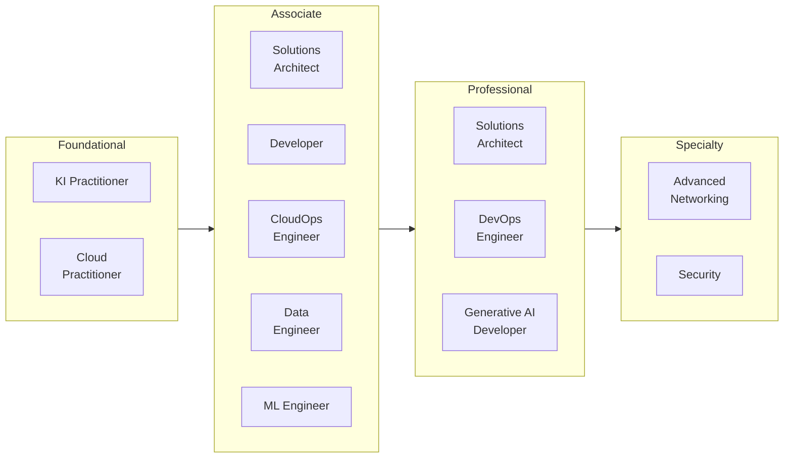
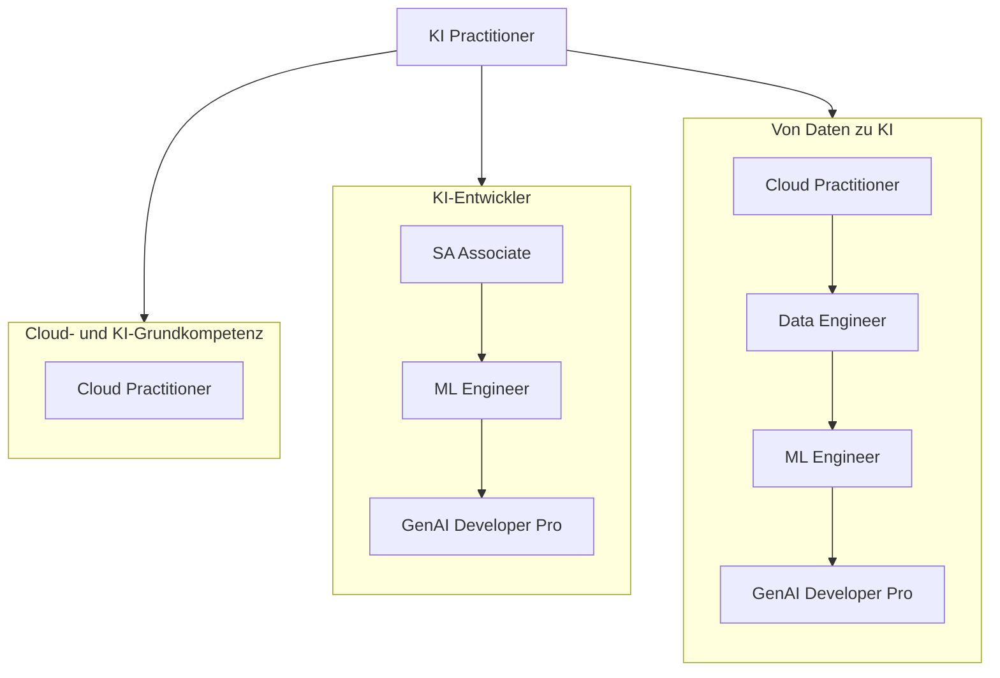
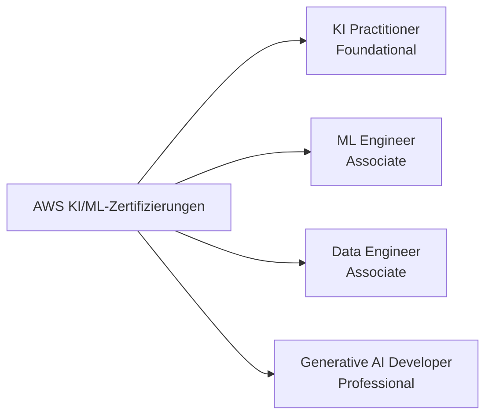
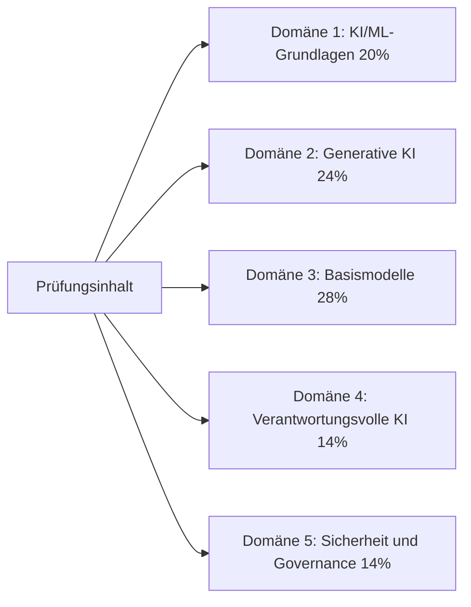
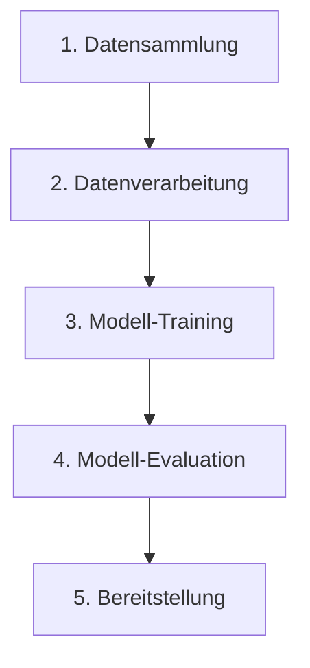

# AWS-Zertifizierungen und die KI-Practitioner-Prüfung

## Einführung in AWS-Zertifizierungen

AWS-Zertifizierungen bestätigen Expertise in Cloud- und KI-Technologien, auf denen ein Großteil des heutigen Unternehmenscomputings beruht. Sie werden branchenweit als Nachweis technischer Kompetenz anerkannt und bieten Fachleuten, die die notwendigen Kenntnisse für den effektiven Einsatz von AWS erwerben möchten, einen strukturierten Karriereweg. Für Organisationen, die sich im digitalen Wandel befinden, bringen zertifizierte Fachleute Expertise mit, die sich direkt in schnellerer Projektdurchführung und weniger kostspieligen Fehlern niederschlägt.

Die Vorteile gehen über den Berechtigungsnachweis selbst hinaus. Zertifizierte Fachleute berichten von höheren Gehältern, mehr Bewerbungsgesprächen und einer besseren Ausgangslage für Beförderungen und anspruchsvolle Aufgaben.[^006001] Die hinter der Zertifizierung stehenden Kenntnisse beziehen sich auf reale Herausforderungen, und der Rezertifizierungszyklus hält die Inhaber auf dem neuesten Stand, während sich das AWS-Portfolio weiterentwickelt.

## Der AWS-Zertifizierungsweg

AWS gliedert sein Zertifizierungsprogramm in vier Stufen: Foundational (Grundkenntnisse), Associate (Fachkenntnisse), Professional (Expertenwissen) und Specialty (Spezialisierung). Die Struktur ermöglicht es Fachleuten, mit breitem Grundwissen zu beginnen und sich in Spezialgebieten weiterzuentwickeln, die ihren Karrierezielen entsprechen.



*Abbildung 0.6.1: Das vollständige AWS-Zertifizierungsportfolio im Mai 2026, nach Stufen gegliedert. Zwölf aktive Zertifizierungen decken Rollen von der Cloud-Grundkompetenz bis zum vertieften KI-Engineering ab. AI Practitioner ist eine von zwei Foundational-Zertifizierungen; Generative AI Developer auf Professional-Ebene erweitert den KI/ML-Pfad für erfahrenere Zielgruppen.*

Das Diagramm zeigt, wie die **AI Practitioner**-Zertifizierung neben **Cloud Practitioner** auf der Foundational-Stufe positioniert ist.[^006002] Die Machine Learning Specialty-Zertifizierung, die früher den technischen KI/ML-Tiefenpfad verankerte, wurde am 31. März 2026 eingestellt und durch den **Machine Learning Engineer - Associate** sowie den **Generative AI Developer - Professional** ersetzt.[^006003] AWS hat den SysOps Administrator - Associate ebenfalls 2025 in **CloudOps Engineer - Associate** umbenannt.

Die AWS-Zertifizierungsleiter ist keine einzige gerade Linie. Verschiedene Rollen nehmen unterschiedliche Wege zu denselben höherwertigen Zertifizierungen. Die folgende Karte zeigt drei gängige Mehrfachdurchlaufwege:



*Abbildung 0.6.2: Drei repräsentative Wege durch das AWS-Zertifizierungsportfolio. Der Pfad für Business- und KI-Grundkompetenz endet beim AI Practitioner. Der KI-Entwickler- und der Daten-zu-KI-Pfad konvergieren beide beim Generative AI Developer - Professional, beginnen aber über unterschiedliche Associate-Zertifizierungen.*

Ein Praktiker kann nach dem AI Practitioner aufhören, wenn das Ziel fundierte Entscheidungsfindung und nicht praktisches Engineering ist. Ein Praktiker, der plant, KI-Agenten in der Produktion zu entwickeln, profitiert typischerweise mindestens vom Solutions Architect - Associate und vom Machine Learning Engineer - Associate, bevor er zum Generative AI Developer - Professional übergeht.

Um die Gültigkeit der Zertifizierung aufrechtzuerhalten, verlangt AWS alle drei Jahre eine Rezertifizierung. Dadurch bleiben die Inhaber mit den neuesten Services und Best Practices auf dem aktuellen Stand.

## Die AWS Certified AI Practitioner-Zertifizierung

### Überblick und Positionierung

Die AWS Certified AI Practitioner-Zertifizierung adressiert den stark wachsenden Bedarf an KI-Kompetenz in Organisationen. Sie bestätigt grundlegendes Wissen über Künstliche Intelligenz, Maschinelles Lernen und Generative KI auf AWS, mit einem Schwerpunkt auf praktischer Geschäftsanwendung anstatt auf Implementierungsdetails.

Die Zertifizierung richtet sich an Geschäftsanalysten, Produktmanager, IT-Supportmitarbeiter und andere Fachleute, die mit KI arbeiten, sie aber nicht unbedingt selbst entwickeln. Durch die Bestätigung Ihrer Fähigkeit, KI-Optionen zu bewerten und mit Technikteams zu kommunizieren, hilft sie Organisationen, KI-Fähigkeiten auf fundierter Basis einzusetzen und kostspielige Fehler zu vermeiden.

### Unterschied zu anderen KI/ML-Zertifizierungen

Die AWS KI/ML-Zertifizierungen bilden heute ein klar abgestuftes Set. Sie richten sich an unterschiedliche Zielgruppen und Kenntnisstufen.



*Abbildung 0.6.3: Die AWS KI/ML-Zertifizierungsübersicht. Jede Zertifizierung richtet sich an eine bestimmte Zielgruppe und Kompetenzstufe, von der Business-Grundkompetenz auf Foundational-Ebene bis zur Produktionsarchitektur auf Professional-Ebene.*

Die **Generative AI Developer - Professional**-Zertifizierung (AIP-C01) bestätigt Expertise bei der Konzeption, dem Aufbau und dem Betrieb generativer KI-Lösungen auf AWS im großen Maßstab. Sie richtet sich an Architekten und Senior-Engineers, die KI-Systeme von Ende zu Ende verantworten.

Der **Machine Learning Engineer - Associate** (MLA-C01) bestätigt die Kenntnisse, die zum Aufbau, zur Bereitstellung und zur Überwachung von ML-Modellen in der Produktion benötigt werden. Er richtet sich an ML-Engineers und Entwickler, die für die ML-Seite einer Anwendung verantwortlich sind.

Der **Data Engineer - Associate** (DEA-C01) konzentriert sich auf die Dateninfrastruktur, von der KI/ML-Projekte abhängen. Er richtet sich an Engineers, die die Pipelines und Speicherschichten aufbauen und warten, die KI-Workloads versorgen.

Im Gegensatz dazu konzentriert sich der **AI Practitioner** auf Grundlagen und Geschäftsanwendung. Er richtet sich an Fachleute, die KI/ML-Lösungen nutzen, nicht an diejenigen, die sie entwickeln. Geschäftsanalysten, Produktmanager und technisch versierte IT-Supportmitarbeiter sind die primäre Zielgruppe.

Diese vierstufige Abstufung spiegelt den reifenden KI/ML-Markt wider. Der Aufbau, die Bereitstellung und die Governance von KI erfordern nun genug Spezialkenntnisse, dass AWS für jede Schicht eine eigene Zertifizierung anbietet.

## Prüfungsdetails und -struktur

### Prüfungsüberblick

Die AWS Certified AI Practitioner (AIF-C01)-Prüfung enthält 65 Fragen, die in 90 Minuten beantwortet werden müssen. Sie ist auf Englisch, Japanisch, Koreanisch, Portugiesisch (Brasilien) und Vereinfachtes Chinesisch verfügbar. Die Mindestpunktzahl zum Bestehen beträgt 700 auf einer Skala von 100 bis 1.000.

Die aktuelle Prüfungsversion ist **V1.1**, veröffentlicht am 30. April 2026, und ca. einen Monat später in der Prüfung wirksam.[^006004] V1.1 hat agentische KI, Amazon Bedrock AgentCore, Strands Agents, Kiro und Amazon Quick zum prüfungsrelevanten Stoff hinzugefügt. Ebenfalls wurde Amazon MemoryDB entfernt. Die Zieländerungen sind bedeutsam genug, dass jedes Vorbereitungsmaterial, das älter als Mitte 2026 ist, mit dem aktuellen Prüfungsführer abgeglichen werden sollte.



*Abbildung 0.6.4: Domänengewichtungen der AIF-C01 V1.1. Domänen 2 und 3 zusammen decken Generative KI und Basismodell-Anwendungen ab und umfassen über die Hälfte des bewerteten Inhalts.*

Basismodelle und Generative KI decken zusammen mehr als die Hälfte der Prüfung ab, was damit übereinstimmt, wie schnell diese Themen in den Mittelpunkt der Unternehmens-KI-Arbeit gerückt sind. Die Prüfung bewertet Ihre Fähigkeit:

- Kenntnisse von KI/ML- und Generativer KI-Konzepten sowie AWS-Services zu demonstrieren
- Geeignete Anwendungsfälle für verschiedene KI-Technologien zu bewerten
- Fundierte Entscheidungen über die Implementierung von KI-Lösungen zu treffen
- Verantwortungsvolle KI-Praktiken und Governance-Grundsätze anzuwenden

### Zielgruppe

Der ideale Kandidat hat etwa sechs Monate Kontakt mit KI/ML-Technologien auf AWS. Sie sollten mit KI/ML-Lösungen umgehen können, müssen sie aber nicht selbst entwickeln. Eine grundlegende Vertrautheit mit **zentralen AWS-Services** ist unerlässlich, einschließlich Amazon EC2, Amazon S3, AWS Lambda, Amazon Bedrock und Amazon SageMaker AI.[^006005]

Sie sollten auch über ein grundlegendes Verständnis des **gemeinsamen AWS-Verantwortungsmodells**, von AWS Identity and Access Management (IAM) und der AWS-Service-Preismodelle verfügen.

Verschiedene Fachleute können von dieser Zertifizierung auf unterschiedliche Weise profitieren:

*Tabelle 0.6.1: Rollen, die von der AWS Certified AI Practitioner-Zertifizierung profitieren.*

| Rollenkategorie | Wichtige Personen | Hauptvorteile | Schlüsselaktivitäten |
|-----------------|-------------------|---------------|----------------------|
| Geschäftsentscheidungsträger | Projektmanager, Geschäftsanalysten, Führungskräfte | Strategische Planungs- und Bewertungsfähigkeiten | Bewertung von KI-Initiativen, Machbarkeitsbeurteilung, Entwicklung von Einführungsfahrplänen |
| Technologiefachleute | IT-Mitarbeiter, Cloud-Architekten, technische Berater | Technische Integrations- und Supportkenntnisse | Unterstützung von KI-Systemen, Konzeption integrierter Lösungen, Plattformbewertung |
| Fachspezialisten | Branchenexperten, Forschungsfachleute, QS-Spezialisten | Branchenspezifisches KI-Anwendungswissen | Lenkung von Implementierungen, Qualitätssicherung, Erkundung von Anwendungsmöglichkeiten |
| Support und Betrieb | Betriebsteams, Customer-Success-Manager, technische Redakteure | Betriebliche Exzellenz und Supportkapazität | Verwaltung von KI-Services, Systemdokumentation, Entwicklung von Schulungsprogrammen |

Die Zertifizierung setzt nicht voraus, dass Sie KI/ML-Modelle entwickeln, Data Engineering implementieren, Hyperparameter-Tuning durchführen, KI/ML-Pipelines aufbauen, mathematische Modellanalysen durchführen oder vollständige Governance-Frameworks entwickeln. Das sind die Zuständigkeiten der höherstufigen Zertifizierungen.

### Prüfungsstruktur und Bewertung

Die Prüfung enthält 50 bewertete Fragen sowie 15 unbewertete Fragen, die AWS zur Bewertung potenzieller zukünftiger Inhalte verwendet. Die unbewerteten Fragen sind über die gesamte Prüfung verteilt und werden nicht gekennzeichnet. Für falsche Antworten gibt es keine Strafe, und unbeantwortete Fragen werden als falsch gewertet.

Das Bewertungsmodell hat vier Merkmale, die es zu kennen gilt:

- Skalierte Bewertung auf einem Bereich von 100 bis 1.000
- Mindestpunktzahl zum Bestehen von 700
- Kompensatorische Bewertung, was bedeutet, dass Sie nicht jeden Abschnitt einzeln bestehen müssen, sondern nur die Gesamtprüfung
- Skalierte Bewertung über mehrere Prüfungsformen, um die Schwierigkeit über Versionen hinweg fair zu halten

Ihr Bewertungsbericht enthält den Gesamtstatus (bestanden/nicht bestanden), die skalierte Punktzahl und abschnittsbezogenes Leistungsfeedback, das Stärken und Schwächen aufzeigt. Das abschnittsbezogene Feedback ist eine allgemeine Orientierungshilfe, keine präzise Bereichsnote.

Die Standardprüfungsdauer beträgt 90 Minuten. Nicht-englische Muttersprachler können eine 30-minütige Verlängerung beantragen, die so genannte "ESL +30"-Unterstützung, wenn sie die Prüfung auf Englisch ablegen, für insgesamt 120 Minuten.

## Fragetypen der Prüfung

Die Prüfung verwendet vier Frageformate. Wenn Sie die Formate im Voraus kennen, können Sie Ihre Zeit einteilen und Überraschungen vermeiden.

### Multiple-Choice-Fragen

Multiple-Choice-Fragen präsentieren ein Szenario oder ein Konzept mit vier möglichen Antworten, einer richtigen und drei Ablenkern. Die Ablenker sind so konzipiert, dass sie gängige Missverständnisse testen und prüfen, ob Sie die Tiefe des Themas verstehen, nicht nur die Oberfläche.

Beispiel:

```
Welcher AWS-Service bietet eine vollständig verwaltete Umgebung für den Aufbau,
das Training und die Bereitstellung von Machine-Learning-Modellen im großen Maßstab?

A) Amazon EC2     - Bietet virtuelle Server, erfordert jedoch manuelles ML-Setup
B) Amazon S3      - Bietet Speicher, aber keine ML-Fähigkeiten
C) Amazon SageMaker AI - Zweckgebundener verwalteter Service für ML-Workflows
D) Amazon Redshift - Data-Warehouse-Service ohne native ML-Funktionen

Richtige Antwort: C
```

Die falschen Optionen sind Services, die ML-Workflows in gewisser Weise berühren, aber nicht die vollständige verwaltete ML-Erfahrung bieten.

### Fragen mit mehreren Antworten

Fragen mit mehreren Antworten erfordern die Auswahl von zwei oder mehr richtigen Antworten aus fünf oder mehr Optionen. Sie müssen alle richtigen Antworten identifizieren, um Punkte zu erhalten. Teilpunkte werden nicht vergeben.

```
Welche ZWEI Funktionen bietet Amazon SageMaker Studio? (Wählen Sie ZWEI)

A) Integrierte Entwicklungsumgebung (IDE) für ML
B) Automatisierte Modellbereitstellung und -überwachung
C) Rohe Rechenkapazität für das Training
D) Objektspeicher für Datensätze
E) Relationale Datenbankverwaltung

Richtige Antworten: A, B
```

Wenn Sie eine Frage mit mehreren Antworten sehen:

1. Lesen Sie die Frage sorgfältig durch und notieren Sie genau, wie viele Antworten erforderlich sind.
2. Bewerten Sie jede Option unabhängig, bevor Sie sie vergleichen.
3. Überprüfen Sie, ob Sie genau die angegebene Anzahl von Antworten ausgewählt haben.
4. Bestätigen Sie, dass alle Ihre Auswahlen korrekt sind, da keine Teilpunkte vergeben werden.

### Reihenfolge-Fragen

Reihenfolge-Fragen testen Ihr Verständnis sequentieller Prozesse. Sie präsentieren drei bis fünf Elemente, die in der richtigen Reihenfolge angeordnet werden müssen, um eine Aufgabe zu vervollständigen.



*Abbildung 0.6.5: Ein kanonischer ML-Workflow, der als Beispiel für eine Reihenfolge-Frage verwendet wird. Jeder Schritt hängt von seinem Vorgänger ab, und die Reihenfolge entspricht der Standardpraxis.*

Wenn Sie eine Reihenfolge-Frage sehen, achten Sie auf:

- Abhängigkeiten zwischen Schritten
- AWS-Service-Anforderungen und -Voraussetzungen
- Branchenübliche Workflows
- AWS Best Practices

### Zuordnungsfragen

Zuordnungsfragen bitten Sie, Elemente in zwei Listen zuzuordnen. Sie präsentieren typischerweise drei bis sieben Elemente und eine entsprechende Liste von Beschreibungen und verlangen, dass Sie jedes Element mit der richtigen Beschreibung verknüpfen.

Eine typische Zuordnungsfrage:

```
Ordnen Sie den AWS KI/ML-Service seiner primären Funktion zu:

Elemente:
1. Amazon Bedrock
2. Amazon SageMaker Canvas
3. Amazon Comprehend
4. Amazon Rekognition

Beschreibungen:
A. No-Code-ML-Modellentwicklung und -inferenz
B. Verarbeitung natürlicher Sprache und Textanalyse
C. Zugang und Bereitstellung von Basismodellen
D. Computer Vision und Bild- und Videoanalyse

Richtige Zuordnungen: 1-C, 2-A, 3-B, 4-D
```

Bei Zuordnungsfragen:

1. Lesen Sie alle Elemente in beiden Listen sorgfältig durch, bevor Sie Zuordnungen vornehmen.
2. Beginnen Sie mit den offensichtlichen Zuordnungen und grenzen Sie die restlichen durch Ausschluss ein.
3. Verwenden Sie das Ausschlussverfahren für die verbleibenden schwierigeren Paare.
4. Überprüfen Sie jede Zuordnung anhand Ihrer AWS-Kenntnisse.

## Tipps zur Prüfungsvorbereitung

### Zeitmanagement

Effektives Zeitmanagement ist für viele Kandidaten wichtiger als reines Wissen. Ein paar praktische Richtlinien:

1. Notieren Sie zu Beginn die Fragenanzahl und die verfügbare Zeit.
2. Streben Sie im ersten Durchgang etwa 80 Sekunden pro Frage an.
3. Verbringen Sie nicht mehr als zwei Minuten mit einer einzigen Frage.
4. Markieren Sie schwierige Fragen und überarbeiten Sie sie nach dem ersten Durchgang.
5. Lassen Sie am Ende mindestens fünf bis zehn Minuten für die Überprüfung.

Wenn Englisch nicht Ihre Muttersprache ist, können Sie bei AWS 30 Minuten zusätzliche Prüfungszeit als Unterstützung beantragen. Der Antrag muss über Ihr AWS-Zertifizierungskonto gestellt werden, bevor Sie die Prüfung buchen, und gilt nach Genehmigung für jede AWS-Prüfung, die Sie von diesem Konto aus anmelden.

### Schwerpunktbereiche

Die Prüfung betont praktische Anwendung gegenüber Auswendiglernen. Wichtige Bereiche:

- Grundlegende KI/ML-Konzepte und -Terminologie, einschließlich agentischer KI, RAG und MCP
- Der richtige KI-Service für das richtige Geschäftsproblem
- AWS-Service-Fähigkeiten und -Grenzen, insbesondere Amazon Bedrock und die AgentCore-Familie
- Grundsätze verantwortungsvoller KI einschließlich Verzerrung, Fairness, Transparenz und Erklärbarkeit
- Sicherheit, einschließlich Amazon Bedrock Guardrails und AWS geteilte Verantwortung für KI

Die Fragen testen Ihre Fähigkeit, Wissen in realistischen Szenarien anzuwenden, nicht Ihre Fähigkeit, eine Definition aufzusagen.

### Vorbereitungsressourcen

AWS bietet eine Reihe von Vorbereitungsressourcen über AWS Skill Builder an, einschließlich kostenloser und abonnementbasierter Inhalte.[^006006]

*Tabelle 0.6.2: Wichtige Vorbereitungsressourcen für AWS-Zertifizierungen.*

| Ressourcentyp | Beschreibung | Am besten geeignet für |
|---------------|--------------|------------------------|
| Digitales Training | Online-Kurse zum Selbststudium | Grundkonzepte verstehen |
| Präsenztraining | Lehrergestützte Sitzungen | Interaktives Lernen und direkte Anleitung |
| Übungsprüfungen | Beispielfragen und -szenarien | Prüfungsvorbereitung und Lückenanalyse |
| Dokumentation | Technische Leitfäden und Whitepapers | Aufbau von tiefem technischen Wissen |
| Praxislabore | Praktische AWS-Console-Übungen | Praxiserfahrung und Kompetenznachweise |

Konzentrieren Sie sich bei der AIF-C01-Vorbereitung speziell auf KI/ML-Grundlagen, die GenAI- und FM-Domänen sowie das neue agentische KI-Material aus V1.1. Praktische Zeit mit **Amazon Bedrock**, dem Modell-Playground und **Amazon Bedrock AgentCore** ist die beste Investition in die Lernzeit, sobald die Grundlagen vorhanden sind.

## Fazit

Die AWS Certified AI Practitioner-Zertifizierung bestätigt wesentliche Kenntnisse moderner KI auf AWS: klassisches ML, Generative KI, agentische KI und die verantwortungsvollen KI-Praktiken, die zunehmend damit einhergehen. Konzipiert für Geschäftsanalysten, Produktmanager und andere Fachleute, die KI nutzen anstatt sie zu entwickeln, demonstriert die Zertifizierung Ihre Fähigkeit:

- Fundierte Entscheidungen über die Einführung von KI-Technologie zu treffen
- Mit technischen Teams über KI-Initiativen zu kommunizieren
- Die richtigen Anwendungsfälle für die richtigen KI-Services zu identifizieren
- Verantwortungsvolle KI-Praktiken in Ihrer Organisation anzuwenden
- Die sich schnell verändernde KI-Landschaft auf AWS zu navigieren

Mit dieser Zertifizierung legen Sie ein Fundament für das Verständnis von KI und konzentrieren sich dabei auf den Geschäftswert anstatt auf technische Implementierung. Das macht sie zu einem nützlichen Berechtigungsnachweis, da immer mehr Organisationen über Services wie Amazon Bedrock, Amazon Bedrock AgentCore, Amazon SageMaker AI und Kiro von der KI-Experimentierphase zur KI-Produktion übergehen.

AWS-Zertifizierungen bleiben ein Weg zur Validierung von Cloud-Expertise und zur Beschleunigung des Karrierewachstums, da KI zunehmend in den regulären Geschäftsbetrieb einzieht. Die AWS Certified AI Practitioner-Zertifizierung überbrückt technische und kaufmännische Rollen in einer Phase der rasanten KI-Einführung, und das V1.1-Update bringt den Prüfungsinhalt auf den Stand, wo der Markt im Jahr 2026 tatsächlich steht.

[^006001]: AWS Certifications. URL: [https://aws.amazon.com/certification/](https://aws.amazon.com/certification/)
    
[^006002]: AWS Certified AI Practitioner. URL: [https://aws.amazon.com/certification/certified-ai-practitioner/](https://aws.amazon.com/certification/certified-ai-practitioner/)
    
[^006003]: AWS Certified Machine Learning Engineer Associate. URL: [https://aws.amazon.com/certification/certified-machine-learning-engineer-associate/](https://aws.amazon.com/certification/certified-machine-learning-engineer-associate/)
    
[^006004]: AIF-C01 Exam Guide Revisions. URL: [https://docs.aws.amazon.com/aws-certification/latest/ai-practitioner-01/aif-01-revisions.html](https://docs.aws.amazon.com/aws-certification/latest/ai-practitioner-01/aif-01-revisions.html)
    
[^006005]: AIF-C01 Target Candidate Description. URL: [https://docs.aws.amazon.com/aws-certification/latest/ai-practitioner-01/ai-practitioner-01.html](https://docs.aws.amazon.com/aws-certification/latest/ai-practitioner-01/ai-practitioner-01.html)
    
[^006006]: AWS Skill Builder. URL: [https://skillbuilder.aws/](https://skillbuilder.aws/)
