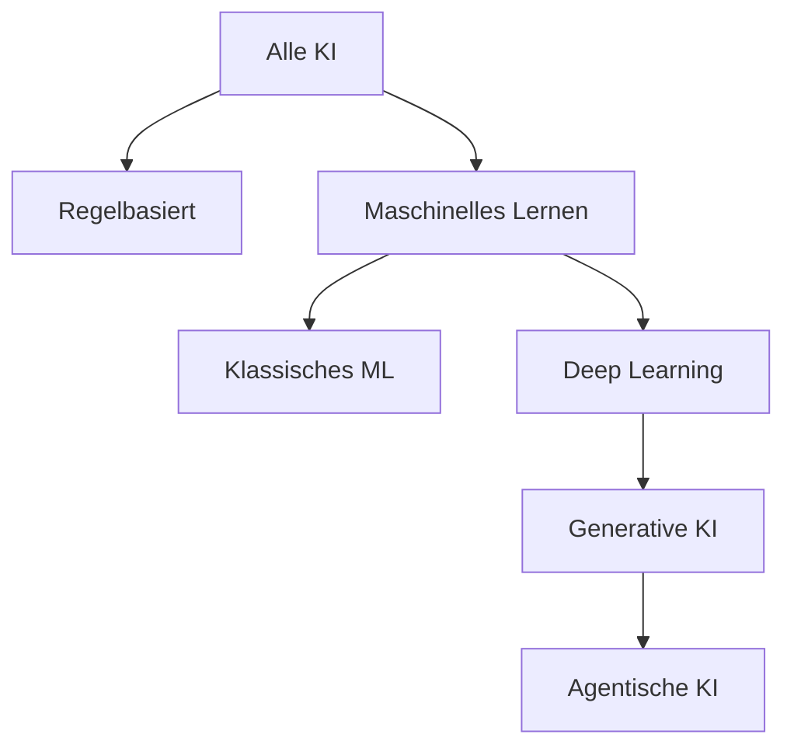
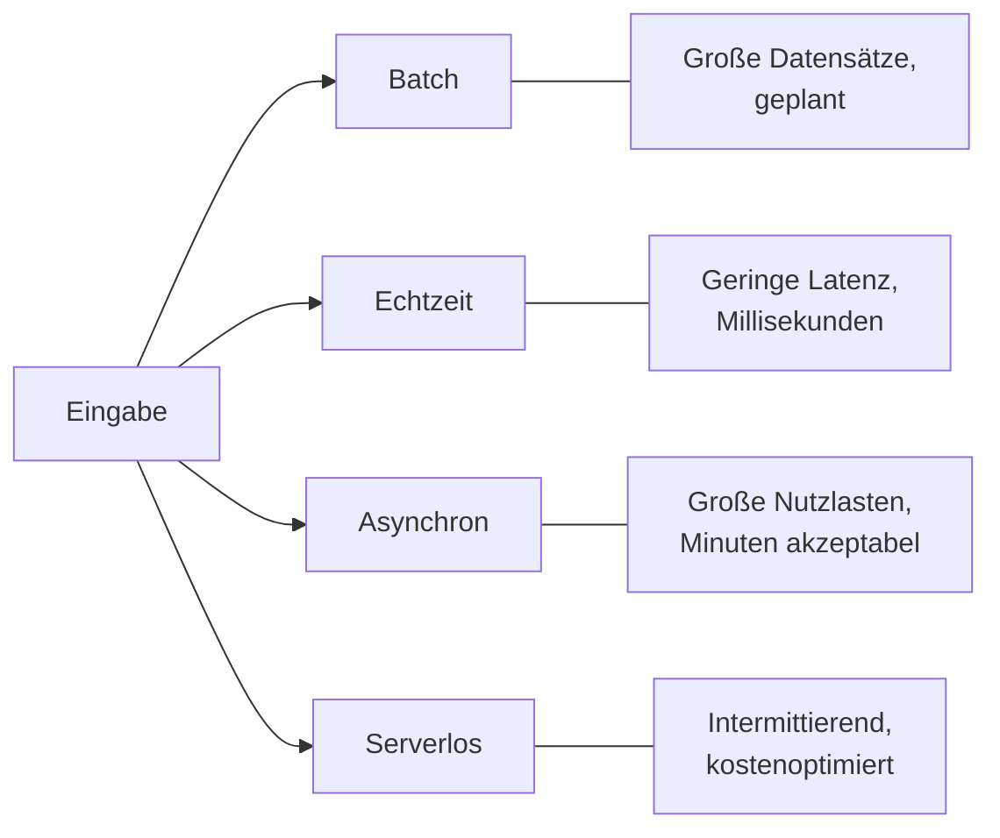
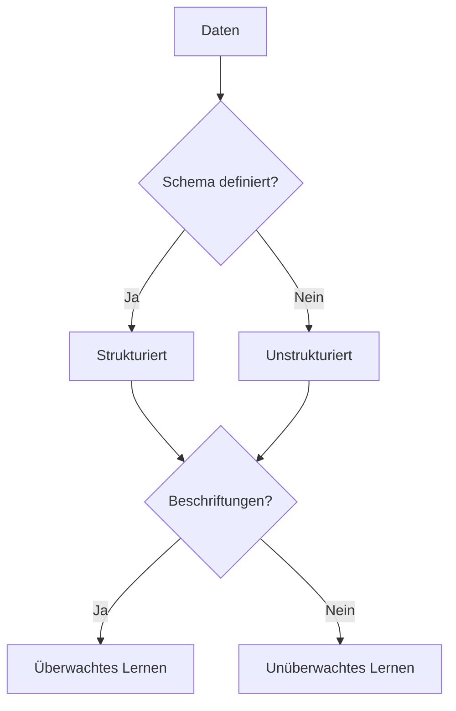
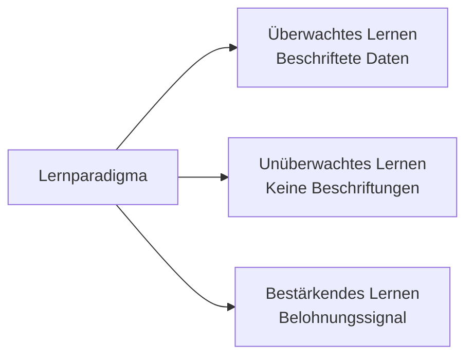

## Aufgabenstellung 1.1: Grundlegende KI-Konzepte und Fachbegriffe erklären

Das Vokabular der KI ist die gemeinsame Sprache zwischen Unternehmensprofis und den Ingenieurteams, mit denen sie zusammenarbeiten. Bevor ein Produktmanager die Bereitstellung eines Modells genehmigen oder eine Führungskraft ein Angebot eines KI-Anbieters bewerten kann, benötigen alle Beteiligten dieselben Definitionen für Begriffe wie Training, Inferenz, Verzerrung und Fairness. Diese Aufgabenstellung legt dieses gemeinsame Vokabular fest und ordnet jeden Begriff den AWS-Services und Prüfungszielen zu, in denen er vorkommt.[^101001]

### 1.1.1 Grundlegende KI-Begriffe definieren

Das Verständnis von KI beginnt mit präzisen Definitionen. Die Prüfung testet, ob Sie benachbarte Begriffe voneinander unterscheiden können. Die geschäftlichen Folgen sind real: Ungenaue Sprache führt zu falschen Erwartungen zwischen technischen und nicht-technischen Beteiligten.

**Künstliche Intelligenz (KI)** ist das breite Feld der Informatik, das sich mit dem Aufbau von Systemen befasst, die Aufgaben ausführen können, die normalerweise menschliches Denkvermögen erfordern, wie das Erkennen von Bildern, das Verstehen von Sprache oder das Treffen von Entscheidungen unter Unsicherheit.[^101002] KI ist keine einzelne Technologie, sondern eine Kategorie, die viele Ansätze umfasst, von denen nur einige das Lernen aus Daten beinhalten.

**Maschinelles Lernen (ML)** ist eine Teilmenge der KI, bei der ein System Muster aus Daten lernt, anstatt explizit von einem Programmierer geschriebenen Regeln zu folgen.[^101003] Ein regelbasiertes Betrugserkennungssystem könnte beispielsweise jede Transaktion über einem festen Betrag markieren; ein ML-basiertes System lernt stattdessen aus Tausenden historischer Betrugsfälle und verallgemeinert Muster, die keine feste Regel erfassen könnte.

**Deep Learning** ist eine Teilmenge des ML, die *Neuronale Netze* mit vielen Schichten verwendet, um zunehmend abstrakte Muster darzustellen.[^101004] Der Begriff "tief" bezieht sich auf die Tiefe dieser Schichten. Deep Learning treibt die meisten modernen Systeme zur Bilderkennung, Spracherkennung und zum Sprachverstehen an.

Ein **Neuronales Netz** ist ein Rechenmodell, das lose von der Struktur biologischer Neuronen inspiriert ist. Daten durchlaufen Schichten miteinander verbundener Knoten, von denen jeder eine mathematische Transformation anwendet. Das Netz lernt, welche Transformationen genaue Ausgaben erzeugen, indem es seine internen Parameter während des Trainings anpasst. Flache Netze haben zwei oder drei Schichten; tiefe Netze können Hunderte haben.

**Computer Vision (CV)** ist der Zweig der KI, der Maschinen ermöglicht, Bilder und Videos zu interpretieren.[^101006] Computer-Vision-Systeme können Objekte in einem Foto klassifizieren, Defekte in einer Fertigungslinie erkennen oder Fahrzeuge auf einem Parkplatz zählen. Bei AWS stehen Computer-Vision-Funktionen über **Amazon Rekognition** für die Bild- und Videoanalyse zur Verfügung.[^101007]

**Verarbeitung natürlicher Sprache (NLP)** ist der Zweig der KI, der Maschinen ermöglicht, menschliche Sprache zu lesen, zu verstehen und zu erzeugen.[^101008] NLP-Aufgaben umfassen Stimmungsanalyse, Erkennung benannter Entitäten, Übersetzung und Dokumentzusammenfassung. AWS stellt NLP-Funktionen über Services wie **Amazon Comprehend** für Textanalyse, **Amazon Translate** für Sprachübersetzung und **Amazon Transcribe** für die Sprache-zu-Text-Konvertierung bereit.[^101009] Diese spezialisierten Services sind die richtige Wahl für klar definierte Aufgaben mit hohem Volumen, bei denen Kosten pro Aufruf und Latenz entscheidend sind. Für offene Sprachaufgaben wie die Generierung langer Texte, komplexe Zusammenfassungen oder mehrstufige Schlussfolgerungen sind **Große Sprachmodelle (LLMs)**, auf die über Amazon Bedrock zugegriffen wird, die bessere Wahl. Domäne 2 dieses Buches behandelt sie ausführlich.

Ein **Algorithmus** ist das mathematische Verfahren, das verwendet wird, um ein Modell aus Daten zu trainieren. Gängige ML-Algorithmen umfassen lineare Regression zur Vorhersage kontinuierlicher Werte, Entscheidungsbäume zur Klassifizierung und Gradient Boosting für strukturierte Tabellendaten. Die Wahl des Algorithmus bestimmt, wie ein Modell von Trainingsdaten auf neue Eingaben verallgemeinert.

Ein **Modell** ist das Ergebnis, das entsteht, wenn ein Algorithmus auf einen Trainingsdatensatz angewendet wird. Das Modell erfasst die vom Algorithmus gefundenen Muster und kann dann verwendet werden, um Vorhersagen für neue, bislang ungesehene Daten zu treffen. Stellen Sie sich den Algorithmus als das Rezept und das Modell als das fertige Gericht vor.

**Training** ist der Prozess, bei dem ein Modell beschrifteten oder unbeschrifteten Daten ausgesetzt wird, damit seine internen Parameter sich anpassen und den Vorhersagefehler minimieren. Training ist rechenintensiv und läuft normalerweise auf GPU-beschleunigter Infrastruktur. Bei AWS werden Trainingsaufgaben am häufigsten auf **Amazon SageMaker AI** ausgeführt.

**Inferenz** (auch *Scoring* genannt) ist der Prozess, bei dem ein trainiertes Modell verwendet wird, um eine Vorhersage oder Ausgabe für neue Eingabedaten zu generieren.[^101014] Training findet einmalig oder periodisch statt; Inferenz erfolgt kontinuierlich, wann immer ein Benutzer oder ein System eine Vorhersage anfordert.

**Verzerrung** (Bias) in der KI bezieht sich auf systematische Fehler in den Ausgaben eines Modells, die aus fehlerhaften Trainingsdaten, fehlerhaftem Algorithmusdesign oder fehlerhafter Problemformulierung entstehen.[^101015] Ein Einstellungsmodell, das auf historischen Daten eines Unternehmens mit einer einseitigen Einstellungshistorie trainiert wurde, kann diese Muster reproduzieren und verstärken. Verzerrung ist ein zentrales Thema in der Governance verantwortungsvoller KI.

**Fairness** ist die Eigenschaft eines Modells, das gerechte Ergebnisse über demografische Gruppen hinweg erzeugt, die durch Merkmale wie Geschlecht, Rasse oder Alter definiert werden. Fairness und Verzerrung sind eng miteinander verbunden: Ein Modell gilt als fair, wenn seine Verzerrung gegenüber einer geschützten Gruppe unterhalb einer akzeptablen Schwelle liegt. AWS stellt **Amazon SageMaker Clarify** bereit, um Teams dabei zu helfen, Verzerrungen in Trainingsdaten und trainierten Modellen zu erkennen und zu messen.[^101017]

**Anpassungsgüte** beschreibt, wie gut die gelernten Muster eines Modells mit der zugrunde liegenden Struktur der Daten übereinstimmen.[^101018] Ein Modell, das sich zu eng an seine Trainingsdaten anpasst, wird als *überangepasst* bezeichnet: Es merkt sich Rauschen statt Muster zu verallgemeinern, und seine Genauigkeit bei neuen Daten sinkt stark. Ein Modell, das zu einfach ist, um echte Muster zu erfassen, wird als *unterangepasst* bezeichnet: Es schneidet sowohl bei Trainings- als auch bei neuen Daten schlecht ab. Eine gute Anpassungsgüte liegt zwischen diesen Extremen.

Ein **Großes Sprachmodell (LLM)** ist ein Deep-Learning-Modell, konkret ein Neuronales Netz, das auf einem riesigen Textkorpus trainiert wurde und Sprache mit einer Flüssigkeit und Flexibilität generieren, zusammenfassen, übersetzen und schlussfolgernd verarbeiten kann, die mit früheren NLP-Techniken nicht möglich war.[^101019] LLMs wie Amazon Titan, Anthropic Claude und Meta Llama bilden die Grundlage der meisten modernen Generative-KI-Anwendungen. Ihr Ausmaß, gemessen in Milliarden von Parametern, verleiht ihnen breite Fähigkeiten, macht sie aber auch teuer im Training von Grund auf.

**Generative KI (GenAI)** ist eine Klasse von KI, die als Reaktion auf eine Eingabeaufforderung neue Inhalte wie Text, Bilder, Audio oder Code erzeugt.[^101020] GenAI-Systeme werden typischerweise auf LLMs oder ähnlichen großskaligen generativen Modellen aufgebaut. Im Gegensatz zu früheren ML-Modellen, die einen einzelnen Wert klassifizieren oder vorhersagen, erzeugt ein generatives KI-System eine variable, für Menschen lesbare Ausgabe. Generative KI und agentische KI wurden in der Prüfungsanleitung v1.1 hinzugefügt, um widerzuspiegeln, wie weit beide in Unternehmensprojekten seit der Veröffentlichung der ursprünglichen Anleitung übernommen worden sind.

**Agentische KI** ist eine Erweiterung der Generativen KI, bei der einem Modell ein Ziel und eine Reihe von Werkzeugen vorgegeben werden und es dann autonom mehrstufige Aktionen plant und ausführt, um dieses Ziel zu erreichen, ohne bei jedem Schritt menschliche Genehmigung zu benötigen.[^101021] Die Schlussfolgerungsmaschine ist weiterhin ein generatives Modell; agentische KI fügt die Planungsschleife, den Zugriff auf Werkzeuge und das Gedächtnis hinzu, die aus einmaliger Generierung zielorientiertes Handeln machen. Ein agentisches KI-System kann eine Wissensbasis durchsuchen, externe APIs aufrufen, Code schreiben und seine Ergebnisse über mehrere sequenzielle Schritte hinweg verifizieren, bevor es eine Antwort zurückgibt. Dies unterscheidet sich qualitativ von einer einstufigen Frage-und-Antwort-Interaktion. AWS unterstützt agentische KI über **Amazon Bedrock Agents** und **Amazon Bedrock AgentCore**, die die Infrastruktur für mehrstufige Orchestrierung, Gedächtnis und Werkzeugnutzung bereitstellen.[^101022]

### 1.1.2 Unterschiede zwischen KI, ML, GenAI, Deep Learning und agentischer KI

Diese fünf Begriffe beschreiben eine verschachtelte Hierarchie, keine separaten Technologien. Verwirrung über ihre Beziehungen ist eine der häufigsten Ursachen für Missverständnisse bei der Planung von KI-Projekten. Jeder Begriff liegt vollständig im Geltungsbereich des übergeordneten Begriffs.

**Künstliche Intelligenz** ist der weiteste Begriff. Er umfasst jede Technik, die ein Computersystem dazu bringt, sich so zu verhalten, als würde es menschlichem Denkvermögen ähneln. Dazu gehören regelbasierte Expertensysteme aus den 1970er-Jahren, statistisches ML aus den 1990er-Jahren und heutige Neuronale Netze.

**Maschinelles Lernen** ist eine Teilmenge der KI, die die Definition auf Systeme beschränkt, die aus Daten lernen. Ein von einem Programmierer geschriebener regelbasierter Betrugsfilter ist KI, aber kein ML. Ein auf Transaktionshistorien trainiertes Betrugsmodell ist sowohl KI als auch ML.

**Deep Learning** ist eine Teilmenge des ML, die geschichtete Neuronale Netze verwendet. Ein lineares Regressionsmodell ist ML, aber kein Deep Learning. Ein konvolutionales Neuronales Netz, das Thorax-Röntgenaufnahmen klassifiziert, ist ML, Deep Learning und KI.

**Generative KI** ist eine Teilmenge des Deep Learnings, die sich speziell mit der Erzeugung neuer Inhalte befasst. Nicht jedes Deep Learning ist generativ: Ein Deep-Learning-Modell, das Bilder in zehn Kategorien klassifiziert, ist diskriminativ, nicht generativ. Ein Modell, das aus einer Textbeschreibung ein fotorealistisches Bild erzeugt, ist Generative KI.

**Agentische KI** ist ein Architekturmuster, das auf Generativer KI aufbaut. Ein agentisches System verwendet ein LLM oder ein anderes generatives Modell als Schlussfolgerungsmaschine und fügt dann eine Planungsschleife, Werkzeugzugriff und Gedächtnis hinzu, damit es über mehrere Schritte hinweg handeln kann. Ein einstufiger Chatbot, der ein LLM verwendet, ist Generative KI, aber keine agentische KI. Ein System, das ein übergeordnetes Ziel erhält, es in Teilaufgaben aufteilt, Werkzeuge zur Ausführung jeder Teilaufgabe einsetzt und die Ergebnisse zusammenfasst, ist agentische KI.

*Abbildung 1.1.1: Verschachtelung der KI-Teilgebiete. Jeder Knoten ist eine echte Teilmenge seines übergeordneten Knotens; das Absteigen im Baum fügt Einschränkungen und Fähigkeiten hinzu, anstatt das übergeordnete Konzept zu ersetzen.*

Die Prüfung testet häufig die Grenzfälle. Ein Kandidat, der "KI" und "ML" als Synonyme behandelt oder "Generative KI" mit "Deep Learning" verwechselt, wird Szenariofragen falsch lesen, die davon abhängen, welche Teilmenge angewendet wird. Die praktischen geschäftlichen Konsequenzen sind ebenso konkret: Ein Team, das ein agentisches KI-System einsetzt, sieht sich anderen Governance-, Kosten- und Sicherheitsanforderungen gegenüber als ein Team, das ein klassisches ML-Klassifizierungsmodell betreibt, weil agentische Systeme reale Aktionen ausführen statt statische Ausgaben zu erzeugen.

*Tabelle 1.1.1: Wesentliche Unterschiede zwischen KI-Teilgebieten*

| Begriff | Übergeordnete Kategorie | Definiert durch | Typisches AWS-Beispiel |
|---------|------------------------|-----------------|------------------------|
| Künstliche Intelligenz | Keine | Denkvermögen-ähnliches Verhalten | Jeder AWS-KI/ML-Service |
| Maschinelles Lernen | KI | Lernt aus Daten | Amazon SageMaker AI |
| Deep Learning | ML | Geschichtete Neuronale Netze | SageMaker mit GPU-Instanzen |
| Generative KI | Deep Learning | Erzeugt neue Inhalte | Amazon Bedrock |
| Agentische KI | Generative KI | Mehrstufige autonome Aktionen | Bedrock Agents, Bedrock AgentCore |

Es sei angemerkt: Einige Forscher klassifizieren agentische KI eher als Architekturmuster denn als technologisches Teilgebiet, da ein agentisches System aus bestehenden Technologien (LLMs, Werkzeuge, Orchestrierungslogik) zusammengesetzt ist und kein neuer Modelltyp ist. Für die Zwecke der Prüfung sollten Sie agentische KI als die speziellste Schicht in der Hierarchie behandeln.

### 1.1.3 Arten der Inferenz

Nachdem ein Modell trainiert wurde, muss es bereitgestellt werden, damit es Vorhersagen generieren kann. Die Art und Weise, wie diese Vorhersagen angefordert und zurückgegeben werden, definiert das Inferenzmuster. Die Prüfungsanleitung v1.1 hat asynchrone Inferenz und Serverlose Inferenz zur Liste hinzugefügt, weil AWS seine verwalteten Inferenzoptionen nach dem ursprünglichen Start der Prüfung erweitert hat.

Die vier Standard-Inferenzmuster sind Batch-Inferenz, Echtzeit-Inferenz, asynchrone Inferenz und Serverlose Inferenz. Jedes löst eine andere Kombination von Durchsatz- und Latenzanforderungen. Die Wahl des falschen Musters für einen Anwendungsfall ist eine der häufigsten Ursachen für Kosten- und Leistungsprobleme in KI-Produktionssystemen.

**Batch-Inferenz** verarbeitet eine große Menge von Eingaben in einem einzigen Job, typischerweise nach einem Zeitplan.[^101024] Das System sammelt Eingaben über einen Zeitraum, führt das Modell gegen alle auf einmal aus und speichert die Ergebnisse zur späteren Verwendung. Ein Einzelhändler, der nächtlich Produktempfehlungen für jeden Kunden in seiner Datenbank generiert, verwendet Batch-Inferenz. Bei AWS führt **Amazon SageMaker AI** Batch Transform Batch-Inferenzaufgaben gegen in **Amazon S3** gespeicherte Daten aus, skaliert die Rechenkapazität für die Dauer des Jobs und gibt sie nach Abschluss wieder frei.

**Echtzeit-Inferenz** verarbeitet eine einzelne Eingabeanforderung und gibt eine Vorhersage innerhalb von Millisekunden zurück.[^101026] Das Modell wird an einem dauerhaften Inferenzendpunkt bereitgestellt, der aktiv bleibt und Anforderungen von Anwendungen akzeptiert. Ein Betrugserkennungssystem, das eine Kreditkartentransaktion bewerten muss, bevor das Zahlungsterminal des Kunden ein Timeout erfährt, erfordert Echtzeit-Inferenz. Bei AWS hosten SageMaker AI-Echtzeit-Endpunkte Modelle hinter einem dauerhaften HTTPS-Endpunkt und können Auto Scaling anwenden, um variable Anforderungsvolumina zu bewältigen.

**Asynchrone Inferenz** (manchmal *Warteschlangen-* oder *Nahezu-Batch-*Inferenz genannt, weil sie das Warteschlangen-Verarbeitungsmodell von Batch-Jobs teilt und gleichzeitig eine Anforderung nach der anderen verarbeitet) akzeptiert eine Anforderung, stellt sie in eine Warteschlange und gibt das Ergebnis über einen Callback- oder Polling-Mechanismus zurück, statt innerhalb des Timeout-Fensters der ursprünglichen Anforderung.[^101028] Dieses Muster ist angemessen, wenn Eingaben groß sind oder wenn das Modell länger zur Verarbeitung braucht, als eine Webanforderung vernünftigerweise warten kann. Ein Dokumentenintelligenz-System, das mehrseitige Verträge verarbeitet, benötigt beispielsweise 30 bis 90 Sekunden pro Dokument: Ein synchroner Web-Aufruf würde ein Timeout erleben, aber ein asynchrones Muster lässt das aufrufende System das Ergebnis später abrufen. Bei AWS akzeptieren SageMaker AI Async Inference-Endpunkte große Nutzlasten, stellen sie in eine Warteschlange und schreiben Ausgaben in S3 zum Abruf.

**Serverlose Inferenz** führt das Modell auf Anforderung aus, ohne dass ein dauerhafter Inferenzendpunkt vorab bereitgestellt werden muss.[^101030] Der zugrunde liegende Rechenaufwand skaliert auf null, wenn er inaktiv ist, wodurch die Fixkosten eines laufenden Endpunkts entfallen. Serverlose Inferenz eignet sich gut für intermittierende oder unvorhersehbare Arbeitslasten, bei denen die Kosten für inaktiven Rechenaufwand den Vorteil geringer Latenz überwiegen. Bei AWS stellt SageMaker AI Serverless Inference den Rechenaufwand automatisch bereit und gibt ihn wieder frei, mit dem Kompromiss, dass die erste Anforderung nach einer Inaktivitätsperiode eine *Kaltstart*-Verzögerung erfahren kann.

*Abbildung 1.1.2: Auswahl des Inferenzmusters. Die Wahl hängt von der Kombination aus Eingabevolumen, akzeptabler Latenz und Kostenbeschränkungen für den jeweiligen Anwendungsfall ab.*

*Tabelle 1.1.2: Vergleich der Inferenzmuster*

| Muster | Latenz | Eingabegröße | Kostenmodell | Geeignet für |
|--------|--------|--------------|--------------|--------------|
| Batch | Minuten bis Stunden | Sehr groß | Pro Job | Nächtliche Auswertung, Massenberichte |
| Echtzeit | Millisekunden | Klein | Pro Endpunkt-Stunde | Betrugserkennung, Live-Empfehlungen |
| Asynchron | Sekunden bis Minuten | Groß | Pro Anforderung | Dokumentenverarbeitung, Videoanalyse |
| Serverlos | Sekunden (kalt), Millisekunden (warm) | Klein bis mittel | Pro Inferenz | APIs mit geringem Traffic, sporadische Nutzung |

Die Kostenunterschiede sind für Unternehmensprofis relevant: Ein dauerhafter Echtzeit-Endpunkt verursacht rund um die Uhr Kosten, unabhängig davon, ob er Anforderungen empfängt, während bei Serverloser Inferenz nur die tatsächliche Nutzung abgerechnet wird. Für ein System, das Anforderungen nur während der Geschäftszeiten verarbeitet, kann der Kostenunterschied erheblich sein.

### 1.1.4 Arten von Daten in KI-Modellen

KI-Modelle werden durch die Daten geprägt, aus denen sie lernen, und Daten gibt es in vielen Formen. Der Typ der Daten, den ein Modell erwartet, bestimmt, welche Algorithmen geeignet sind, welche Vorverarbeitungsschritte erforderlich sind und wie das Modell eingesetzt werden kann. Ein Unternehmensprofi, der die Daten seiner Organisation in diesen Begriffen beschreiben kann, kommuniziert mit einem Data-Science-Team wesentlich effektiver.

Die erste grundlegende Unterscheidung besteht zwischen **beschrifteten Daten** und **unbeschrifteten Daten**.[^101032] Beschriftete Daten enthalten sowohl die Eingabe (z. B. ein Bild einer Katze) als auch die richtige Antwort (die Bezeichnung "Katze"). Unbeschriftete Daten enthalten nur die Eingabe ohne zugehörige Antwort. Beschriftete Datensätze sind teurer in der Erstellung, weil sie menschliche Annotation erfordern, sind aber für Überwachtes Lernen notwendig. Unbeschriftete Datensätze sind reichlich vorhanden und günstig, erfordern aber unüberwachte oder selbstüberwachte Techniken, um Muster zu extrahieren.

Über die Unterscheidung beschriftet und unbeschriftet hinaus variieren Daten auch nach Struktur und Format:

- **Tabellendaten** sind in Zeilen und Spalten organisiert, wie in einer Tabellenkalkulation oder einer relationalen Datenbanktabelle. Jede Spalte stellt ein Merkmal dar (z. B. Alter, Kontostand oder Transaktionsbetrag), und jede Zeile stellt eine Beobachtung dar. Klassische ML-Algorithmen wie Gradient Boosting eignen sich besonders gut für Tabellendaten.
- **Zeitreihendaten** sind eine Folge von Messungen, die in regelmäßigen Zeitabständen aufgezeichnet werden. Aktienpreise, CPU-Auslastung eines Servers und Herzfrequenzmessungen eines Patienten sind Zeitreihendaten. Modelle, die auf Zeitreihendaten trainiert werden, lernen zeitliche Muster wie Trends, Saisonalität und Anomalien.
- **Bilddaten** bestehen aus Pixelwerten, die in einem zweidimensionalen Raster organisiert sind, möglicherweise mit mehreren Farbkanälen. Computer-Vision-Modelle lernen, Kanten, Formen, Texturen und Objekte aus Bilddaten zu erkennen. Der Volumenbedarf ist hoch: Ein aussagekräftiger Bilddatensatz enthält typischerweise Zehntausende bis Millionen beschrifteter Beispiele.
- **Textdaten** bestehen aus Folgen von Wörtern oder Zeichen in einer natürlichen Sprache. NLP-Modelle lernen Grammatik, Semantik und sachliche Zusammenhänge aus Text. Große Sprachmodelle werden auf Textkorpora trainiert, die Hunderte von Milliarden Wörter enthalten.

Eine zweite, davon unabhängige Unterscheidung gilt für alle diese Formate: **Strukturierte Daten** haben ein klar definiertes Schema, wie eine Datenbanktabelle mit typisierten Spalten.[^101037] **Unstrukturierte Daten** haben kein vordefiniertes Schema: Dazu gehören Freitext, Bilder, Audio und Video. Strukturierte Daten sind für klassische ML-Algorithmen direkter verwendbar; unstrukturierte Daten erfordern typischerweise ein auf Neuronalen Netzen basierendes Modell oder einen Vorverarbeitungsschritt zur Extraktion strukturierter Merkmale.

*Tabelle 1.1.3: Datentypen in KI-Modellen*

| Datentyp | Struktur | Typischer ML-Ansatz | Beispiel-AWS-Service |
|----------|---------|---------------------|----------------------|
| Tabellen | Strukturiert | Gradient Boosting, lineare Modelle | Integrierte SageMaker AI-Algorithmen |
| Zeitreihen | Strukturiert | Sequenzmodelle, LSTM, DeepAR | SageMaker AI DeepAR |
| Bild | Unstrukturiert | Konvolutionale Neuronale Netze | Amazon Rekognition, SageMaker AI |
| Text | Unstrukturiert | Transformer-Modelle, LLMs | Amazon Comprehend, Amazon Bedrock |

**Amazon SageMaker Ground Truth** hilft Teams dabei, beschriftete Datensätze zu erstellen, indem es automatisierte Beschriftung mit menschlicher Überprüfung kombiniert und so Zeit und Kosten der Annotation in großem Maßstab reduziert.[^101038]

In der Praxis kombinieren reale KI-Projekte häufig Datentypen. Ein Kundenabwanderungsmodell könnte tabellarische CRM-Daten zusammen mit Texten aus Support-Tickets verwenden, was erfordert, dass das Team Modelle baut oder auswählt, die beide Modalitäten verarbeiten können. Zu wissen, welche Datentypen das Unternehmen bereits in ausreichender Menge hat, hilft dabei, einzugrenzen, welche KI-Ansätze umsetzbar sind.

*Abbildung 1.1.3: Entscheidungsbaum für Datentypen. Struktur und Verfügbarkeit von Beschriftungen bestimmen gemeinsam, welcher Lernansatz für einen gegebenen Datensatz machbar ist.*

### 1.1.5 Arten des Lernens in KI/ML

Die Art und Weise, wie ein Modell aus Daten lernt, wird als sein *Lernparadigma* bezeichnet. Das Lernparadigma bestimmt, welche Art von Daten das Modell benötigt, wie es verallgemeinert und welche Arten von Problemen es lösen kann. Die Prüfung testet alle drei Hauptparadigmen: Überwachtes Lernen, Unüberwachtes Lernen und Bestärkendes Lernen.

**Überwachtes Lernen** trainiert ein Modell auf einem Datensatz, in dem jede Eingabe mit einer korrekten Ausgabebeschriftung gepaart ist.[^101039] Das Modell lernt, Eingaben auf Ausgaben abzubilden, indem es die Differenz zwischen seinen Vorhersagen und den bekannten Beschriftungen minimiert. Dies ist das am häufigsten verwendete Paradigma in der kommerziellen KI, da es Modelle produziert, die einfach zu bewerten sind: Die Genauigkeit wird an einem zurückgehaltenen Testdatensatz mit beschrifteten Beispielen gemessen.

Überwachtes Lernen umfasst zwei Hauptproblemtypen. *Regression* sagt einen kontinuierlichen numerischen Wert voraus, etwa den erwarteten Umsatz eines Kunden im nächsten Quartal. *Klassifizierung* ordnet eine Eingabe einer von mehreren diskreten Kategorien zu, zum Beispiel die Einstufung einer E-Mail als Spam oder Nicht-Spam. Die meisten Produktempfehlungs-, Betrugserkennungs- und medizinischen Diagnosesysteme verwenden überwachte Klassifizierungs- oder Regressionsmodelle.

**Unüberwachtes Lernen** trainiert ein Modell auf Daten ohne Beschriftungen.[^101041] Das Modell muss selbstständig Struktur in den Daten finden, ohne Anleitung darüber, was die richtige Antwort ist. Die häufigste unüberwachte Technik ist *Clustering*, bei dem das Modell ähnliche Eingaben gruppiert. Ein Marketingteam könnte beispielsweise unüberwachtes Clustering auf Kaufhistorien von Kunden anwenden, um natürliche Kundensegmente zu entdecken, die dann gezielte Kampagnen erhalten können. Eine weitere verbreitete Technik ist *Dimensionsreduktion*, die hochdimensionale Daten in weniger Dimensionen komprimiert, dabei aber ihre wichtigste Struktur bewahrt, um die Visualisierung zu erleichtern oder die Daten als Eingabe für ein nachgelagertes Modell aufzubereiten.

**Bestärkendes Lernen** trainiert einen Agenten darin, in einer Umgebung Aktionen auszuführen, indem er für gute Ergebnisse belohnt und für schlechte bestraft wird.[^101043] Der Agent lernt eine *Richtlinie*: eine Zuordnung von beobachtetem Zustand zu Aktion, die die kumulative Belohnung im Laufe der Zeit maximiert. Bestärkendes Lernen ist das Paradigma hinter KI-Systemen, die Spiele spielen, und zunehmend hinter industriellen Anwendungen wie Robotersteuerung, Lieferkettenoptimierung und personalisierten Inhaltsempfehlungssystemen, die langfristiges Engagement statt sofortiger Klicks optimieren.

*Tabelle 1.1.4: Vergleich der KI/ML-Lernparadigmen*

| Paradigma | Eingabedaten | Lernt | Typische Anwendungsfälle |
|-----------|-------------|-------|--------------------------|
| Überwachtes Lernen | Beschriftet | Eingabe-Ausgabe-Zuordnung | Klassifizierung, Regression, Betrugserkennung |
| Unüberwachtes Lernen | Unbeschriftet | Verborgene Struktur | Kundensegmentierung, Anomalieerkennung |
| Bestärkendes Lernen | Belohnungssignale | Optimale Richtlinie | Robotik, Spielen, Personalisierung |

Zwei weitere Lernparadigmen erscheinen am Rand des Prüfungsumfangs. *Halbüberwachtes Lernen* kombiniert eine kleine Menge beschrifteter Daten mit einer großen Menge unbeschrifteter Daten, was nützlich ist, wenn die Beschriftung kostspielig ist.[^101045] *Selbstüberwachtes Lernen* generiert Beschriftungen automatisch aus den Daten selbst, zum Beispiel indem es ein Wort in einem Satz maskiert und das Modell darauf trainiert, das fehlende Wort vorherzusagen. Selbstüberwachtes Lernen ist die Technik, die der Vortrainingsphase der meisten modernen Großen Sprachmodelle zugrunde liegt.

*Abbildung 1.1.4: Übersicht der Lernparadigmen. Die drei Kernparadigmen unterscheiden sich in der Art der Rückmeldung, die das Modell während des Trainings erhält.*

Die Wahl des Lernparadigmas ist eine praktische Geschäftsentscheidung, nicht nur eine technische. Überwachtes Lernen erfordert beschriftete Daten, deren Erstellung Geld kostet. Unüberwachtes Lernen vermeidet diese Kosten, kann aber nicht direkt für ein bestimmtes Geschäftsergebnis optimiert werden. Bestärkendes Lernen kann für komplexe mehrstufige Ziele optimiert werden, erfordert aber eine sorgfältigere Gestaltung der Belohnungsfunktion und ist schwieriger auf Fairness und Verzerrung zu prüfen. Ein Unternehmensprofi, der diese Abwägungen versteht, kann die richtigen Fragen stellen, wenn ein Data-Science-Team einen Ansatz vorschlägt.

## Wissensüberprüfung

**Frage 1.** Ein Einzelhandelsunternehmen baut ein System, das Kundenservicetickets automatisch in einen von fünf Problemtypen einordnet (Abrechnung, Rücksendungen, Versand, Produktqualität, Sonstiges). Das Team verfügt über einen Datensatz mit 50.000 Tickets, die bereits von menschlichen Agenten geprüft und kategorisiert wurden. Welches ML-Lernparadigma ist für diesen Anwendungsfall am geeignetsten?

A. Unüberwachtes Lernen, weil das Modell Struktur in Textdaten ohne menschliche Anleitung finden muss.
B. Bestärkendes Lernen, weil das Modell eine Richtlinie erlernen muss, um Tickets an das richtige Team weiterzuleiten.
C. Überwachtes Lernen, weil das Team beschriftete Beispiele hat und die Aufgabe darin besteht, neue Eingaben in vordefinierte Kategorien einzuordnen.
D. Selbstüberwachtes Lernen, weil das Modell maskierte Wörter im Tickettext vorhersagen muss.

**Antwort: C.**

Das definierte Merkmal des Überwachten Lernens ist, dass jedes Trainingsbeispiel sowohl eine Eingabe als auch eine bekannte korrekte Ausgabebeschriftung enthält. In diesem Szenario wurden die 50.000 Tickets bereits von menschlichen Agenten kategorisiert, was bedeutet, dass jedes Ticket eine Beschriftung hat ("Abrechnung", "Rücksendungen" usw.). Die Aufgabe des Modells besteht darin, die Zuordnung vom Tickettext zur Kategorie zu erlernen und diese Zuordnung dann auf neue, unbeschriftete Tickets anzuwenden. Dies ist ein Lehrbuch-Klassifizierungsproblem, das eine Unterart des Überwachten Lernens ist.[^101047]

Unüberwachtes Lernen (Option A) ist falsch, weil der Datensatz beschriftet ist. Unüberwachte Techniken wie Clustering würden Gruppen in den Daten entdecken, aber diese Gruppen entsprechen möglicherweise nicht den fünf vordefinierten Geschäftskategorien. Bestärkendes Lernen (Option B) ist falsch, weil es keine Umgebung gibt, in der ein Agent agiert, und kein verzögertes Belohnungssignal; die richtige Antwort für jedes Trainingsbeispiel ist sofort bekannt. Selbstüberwachtes Lernen (Option D) ist eine Technik zum Vortraining von Sprachmodellen durch Maskierung und Vorhersage von Tokens; es ist nicht die richtige Einordnung für eine Klassifizierungsaufgabe, bei der Referenzbeschriftungen verfügbar sind.

---

**Frage 2.** Ein Finanzdienstleister möchte ein Betrugserkennungsmodell einsetzen, das für jede Kartenpräsenztransaktion am Verkaufsort eine Vorhersage innerhalb von 200 Millisekunden zurückgeben muss. Das Modell ist ein relativ kleines Klassifizierungsmodell. Welches Inferenzmuster sollte das Team verwenden?

A. Batch-Inferenz, weil das hohe Transaktionsvolumen die Stapelverarbeitung kosteneffizienter macht.
B. Echtzeit-Inferenz, weil der Anwendungsfall eine Vorhersage erfordert, bevor die Transaktion ein Timeout erfährt.
C. Asynchrone Inferenz, weil die Verarbeitung jeder Transaktion einzeln die Warteschlangenkonflikte reduziert.
D. Serverlose Inferenz, weil Kartenpräsenztransaktionen intermittierend auftreten.

**Antwort: B.**

Echtzeit-Inferenz ist das geeignete Muster, wenn eine Vorhersage innerhalb des Latenzfensters einer benutzerorientierten oder zeitkritischen Aktion zurückgegeben werden muss.[^101048] Eine Kartenpräsenztransaktion an einem Verkaufsterminal hat typischerweise ein Timeout von unter einer Sekunde, was die Anforderung von 200 Millisekunden zu einer harten Einschränkung macht. Echtzeit-Endpunkte in Amazon SageMaker AI unterhalten ein dauerhaftes Modell hinter einem HTTPS-Endpunkt, der synchron innerhalb von Millisekunden antwortet.

Batch-Inferenz (Option A) ist falsch, weil Batch-Jobs Eingaben aggregieren und diese gemeinsam nach einem Zeitplan verarbeiten: Die Vorhersage würde Stunden nach der Transaktion eintreffen, was sie für die Betrugsprävention in Echtzeit nutzlos macht. Asynchrone Inferenz (Option C) ist falsch, weil asynchrone Muster eine Anforderung akzeptieren, sie in eine Warteschlange stellen und das Ergebnis später per Callback oder Polling zurückgeben; das aufrufende System erhält keine sofortige Antwort. Serverlose Inferenz (Option D) könnte das Latenz-Ziel erfüllen, wenn der Endpunkt warm ist, aber Kaltstarts können mehrere Sekunden dauern, was die 200-Millisekunden-Anforderung für die erste Anforderung nach einer Inaktivitätsperiode verletzen würde. Ein dauerhafter Echtzeit-Endpunkt vermeidet Kaltstarts und ist das Standardmuster für latenzempfindliche Vorhersagen.

---

**Frage 3.** Ein Data-Science-Team bereitet einen Trainingsdatensatz für ein Kundenabwanderungsmodell vor. Die Hälfte des Datensatzes enthält explizite Abwanderungsbeschriftungen (abgewandert vs. geblieben) aus historischen Aufzeichnungen. Die andere Hälfte enthält Kundeninteraktionsprotokolle ohne aufgezeichnetes Abwanderungsergebnis. Welchen Datentyp repräsentiert die beschriftete Hälfte?

A. Zeitreihendaten, weil die Aufzeichnungen Ereignisse über einen Zeitraum erfassen.
B. Unüberwachte Daten, weil das Ziel darin besteht, verborgene Kundensegmente zu entdecken.
C. Beschriftete Daten, weil jeder Datensatz mit einem bekannten Ergebnis gepaart ist (abgewandert oder geblieben).
D. Unstrukturierte Daten, weil die Datensätze Freitextfelder aus Support-Interaktionen enthalten.

**Antwort: C.**

Beschriftete Daten sind durch das Vorhandensein einer korrekten Ausgabe definiert, die mit jeder Eingabe gepaart ist.[^101049] In diesem Szenario enthalten die historischen Aufzeichnungen die Ergebnisvariable (abgewandert oder geblieben), also die Beschriftung, die das überwachte Modell lernen soll vorherzusagen. Das Format der Daten (in diesem Fall tabellarisch) ist eine separate Dimension von der Unterscheidung beschriftet und unbeschriftet. Ein Datensatz kann sowohl tabellarisch als auch beschriftet sein.

Option A (Zeitreihen) ist eine separate Datentypendimension; die Datensätze können mit einem Zeitstempel versehen sein oder nicht, aber das definiert nicht, ob sie beschriftet sind. Option B ist falsch, weil "unüberwacht" ein Lernparadigma und kein Datentyp ist, da nach der Datenklassifizierung gefragt wird, nicht nach der Technik, die ein Team darauf anwenden würde. Option D wendet die strukturiert-unstrukturiert-Unterscheidung falsch an: Strukturierte Daten werden durch das Vorhandensein eines Schemas (Zeilen und Spalten) definiert, was für die meisten CRM- und Transaktionsdatensätze zutrifft, unabhängig davon, ob auch Freitextfelder vorhanden sind. Die Frage fragt speziell nach der beschrifteten Hälfte, womit C die einzig richtige Beschreibung ist.

---

**Frage 4.** Eine Organisation baut ein KI-System, das ein übergeordnetes Ziel erhält, etwa "einen Marktanalysebericht über Konkurrenzpreise erstellen", und dann selbstständig interne Wissensbasen durchsucht, Preisdaten über eine externe API abruft, eine Zusammenfassung entwirft und seine Ergebnisse verifiziert, bevor es das Ergebnis liefert. Welche KI-Kategorie beschreibt dieses System am BESTEN?

A. Klassisches Maschinelles Lernen, weil das System ein trainiertes Modell verwendet, um aus strukturierten Eingaben Ausgaben zu erzeugen.
B. Generative KI, weil das System als Ausgabe ein neues Textdokument erzeugt.
C. Agentische KI, weil das System autonom mehrere sequenzielle Aktionen plant und ausführt, um ein Ziel zu erreichen.
D. Computer Vision, weil das System Daten aus mehreren Quellen analysieren und interpretieren muss.

**Antwort: C.**

Agentische KI zeichnet sich durch autonome mehrstufige Planung und Ausführung aus: Das System antwortet nicht einfach auf eine einzelne Eingabeaufforderung, sondern zerlegt ein übergeordnetes Ziel in Teilaufgaben, verwendet Werkzeuge (Wissensbasissuche, externe API-Aufrufe), bewertet Zwischenergebnisse und fasst eine abschließende Ausgabe zusammen.[^101050] Dies ist das definierende Merkmal agentischer Systeme und unterscheidet sie von einstufigen Generativen-KI-Interaktionen.

Option B (Generative KI) ist teilweise richtig, insofern das System ein Textdokument erzeugt, aber Generative KI allein beschreibt nur die Ausgabemodalität, nicht die autonome Planungs- und Werkzeugnutzungsschleife. Ein einstufiger Chatbot, der Text generiert, ist Generative KI, aber keine agentische KI. Option A (klassisches ML) ist falsch, weil klassisches ML eine einzelne Vorhersage aus einer strukturierten Eingabe erzeugt; es beinhaltet keine mehrstufige Schlussfolgerung oder Werkzeugorchestrierung. Option D (Computer Vision) ist falsch, weil CV speziell die Analyse von Bild- und Videodaten ist; das Szenario umfasst Text, APIs und Wissensbasen, keine Pixeldaten.

---

**Frage 5.** Ein Marketinganalyst möchte verstehen, welche Kunden ähnliche Kaufverhaltensweisen teilen, aber das Team hat keine vordefinierten Kategorien und hat keine Kundendatensätze beschriftet. Welches KI/ML-Paradigma ist am geeignetsten?

A. Überwachtes Lernen, weil Kaufhistorien strukturierte Tabellendaten sind.
B. Bestärkendes Lernen, weil das System lernen muss, welche Kunden es ansprechen soll.
C. Halbüberwachtes Lernen, weil einige Datensätze möglicherweise nach Branchenstandards teilweise beschriftet sind.
D. Unüberwachtes Lernen, weil keine Beschriftungen vorhanden sind und das Ziel darin besteht, natürliche Gruppierungen in den Daten zu entdecken.

**Antwort: D.**

Unüberwachtes Lernen ist das geeignete Paradigma, wenn der Datensatz keine Beschriftungen hat und das Ziel darin besteht, Struktur zu finden, die nicht vordefiniert ist.[^101051] Clustering, eine unüberwachte Technik, teilt den Kundenstamm anhand der Ähnlichkeit von Kaufmustern in Gruppen auf. Diese Gruppen können dann vom Analysten überprüft und Geschäftssegmenten zugeordnet werden.

Option A ist falsch, weil das Format strukturierter Daten das Lernparadigma nicht bestimmt. Überwachtes Lernen erfordert Beschriftungen, die in diesem Szenario explizit fehlen. Option B ist falsch, weil Bestärkendes Lernen einen Agenten, eine Umgebung und ein mit sequenziellen Aktionen verknüpftes Belohnungssignal erfordert; die Segmentierung bestehender Kunden ist kein sequenzielles Entscheidungsproblem. Option C (halbüberwachtes Lernen) ist falsch, weil die Frage angibt, dass keine Datensätze beschriftet sind; Halbüberwachtes Lernen erfordert mindestens einige beschriftete Beispiele, um das Modell zu führen.

---

[^101001]: AWS Certification: AWS Certified AI Practitioner Exam Guide v1.1, Task Statement 1.1. URL: <https://docs.aws.amazon.com/aws-certification/latest/ai-practitioner-01/ai-practitioner-01-domain1.html>
[^101002]: NIST AI 100-1: Artificial Intelligence Risk Management Framework. URL: <https://airc.nist.gov/Home>
[^101003]: Amazon SageMaker AI Developer Guide: What Is Machine Learning? URL: <https://docs.aws.amazon.com/sagemaker/latest/dg/whatis.html>
[^101004]: AWS Machine Learning Blog: Deep Learning. URL: <https://aws.amazon.com/what-is/deep-learning/>
[^101006]: AWS: What Is Computer Vision? URL: <https://aws.amazon.com/what-is/computer-vision/>
[^101007]: Amazon Rekognition Developer Guide: What Is Amazon Rekognition? URL: <https://docs.aws.amazon.com/rekognition/latest/dg/what-is.html>
[^101008]: AWS: What Is Natural Language Processing? URL: <https://aws.amazon.com/what-is/natural-language-processing/>
[^101009]: Amazon Comprehend Developer Guide: What Is Amazon Comprehend? URL: <https://docs.aws.amazon.com/comprehend/latest/dg/what-is.html>
[^101014]: AWS: Was ist ML-Inferenz? URL: <https://aws.amazon.com/what-is/ml-inference/>
[^101015]: AWS: Was ist KI-Verzerrung? URL: <https://aws.amazon.com/what-is/ai-bias/>
[^101017]: Amazon SageMaker Clarify Developer Guide: What Is Amazon SageMaker Clarify? URL: <https://docs.aws.amazon.com/sagemaker/latest/dg/clarify-what-is.html>
[^101018]: AWS: Was ist Überanpassung beim Maschinellen Lernen? URL: <https://aws.amazon.com/what-is/overfitting/>
[^101019]: AWS: Was ist ein Großes Sprachmodell? URL: <https://aws.amazon.com/what-is/large-language-model/>
[^101020]: AWS: Was ist Generative KI? URL: <https://aws.amazon.com/what-is/generative-ai/>
[^101021]: AWS: Was ist agentische KI? URL: <https://aws.amazon.com/what-is/agentic-ai/>
[^101022]: Amazon Bedrock AgentCore Documentation. URL: <https://docs.aws.amazon.com/bedrock/latest/userguide/agents.html>
[^101024]: Amazon SageMaker AI Developer Guide: Get Inferences for an Entire Dataset with Batch Transform. URL: <https://docs.aws.amazon.com/sagemaker/latest/dg/batch-transform.html>
[^101026]: Amazon SageMaker AI Developer Guide: Deploy Models for Inference. URL: <https://docs.aws.amazon.com/sagemaker/latest/dg/deploy-model.html>
[^101028]: Amazon SageMaker AI Developer Guide: Asynchronous Inference. URL: <https://docs.aws.amazon.com/sagemaker/latest/dg/async-inference.html>
[^101030]: Amazon SageMaker AI Developer Guide: Use Serverless Inference. URL: <https://docs.aws.amazon.com/sagemaker/latest/dg/serverless-endpoints.html>
[^101032]: AWS: Was sind beschriftete Daten? URL: <https://aws.amazon.com/what-is/labeled-data/>
[^101037]: AWS: Strukturierte vs. unstrukturierte Daten. URL: <https://aws.amazon.com/what-is/structured-data/>
[^101038]: Amazon SageMaker Ground Truth Developer Guide: Use Amazon SageMaker Ground Truth to Label Data. URL: <https://docs.aws.amazon.com/sagemaker/latest/dg/sms.html>
[^101039]: AWS: Was ist Überwachtes Lernen? URL: <https://aws.amazon.com/what-is/supervised-learning/>
[^101041]: AWS: Was ist Unüberwachtes Lernen? URL: <https://aws.amazon.com/what-is/unsupervised-learning/>
[^101043]: AWS: Was ist Bestärkendes Lernen? URL: <https://aws.amazon.com/what-is/reinforcement-learning/>
[^101045]: AWS: Halbüberwachtes Lernen: Überblick. URL: <https://aws.amazon.com/what-is/semi-supervised-learning/>
[^101047]: Amazon SageMaker AI Developer Guide: Supervised Learning with SageMaker. URL: <https://docs.aws.amazon.com/sagemaker/latest/dg/algos.html>
[^101048]: Amazon SageMaker AI Developer Guide: Real-Time Inference. URL: <https://docs.aws.amazon.com/sagemaker/latest/dg/realtime-endpoints.html>
[^101049]: AWS: Was sind Trainingsdaten? URL: <https://aws.amazon.com/what-is/training-data/>
[^101050]: Amazon Bedrock Agents Developer Guide: How Amazon Bedrock Agents Work. URL: <https://docs.aws.amazon.com/bedrock/latest/userguide/agents-how.html>
[^101051]: Amazon SageMaker AI Developer Guide: K-Means Clustering Algorithm. URL: <https://docs.aws.amazon.com/sagemaker/latest/dg/k-means.html>
