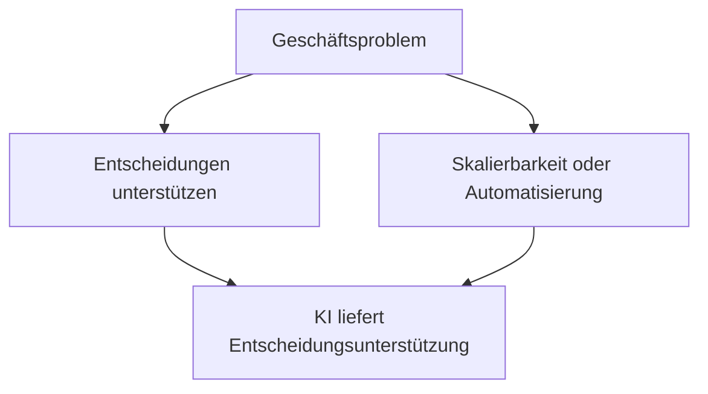
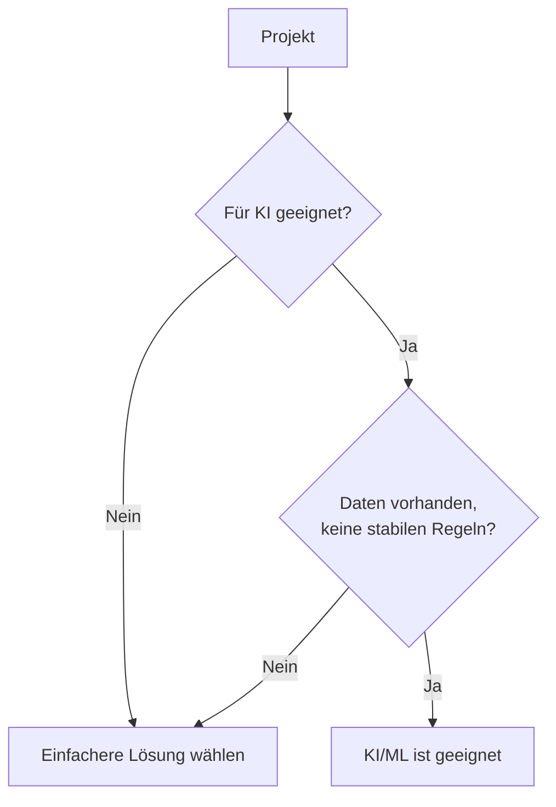
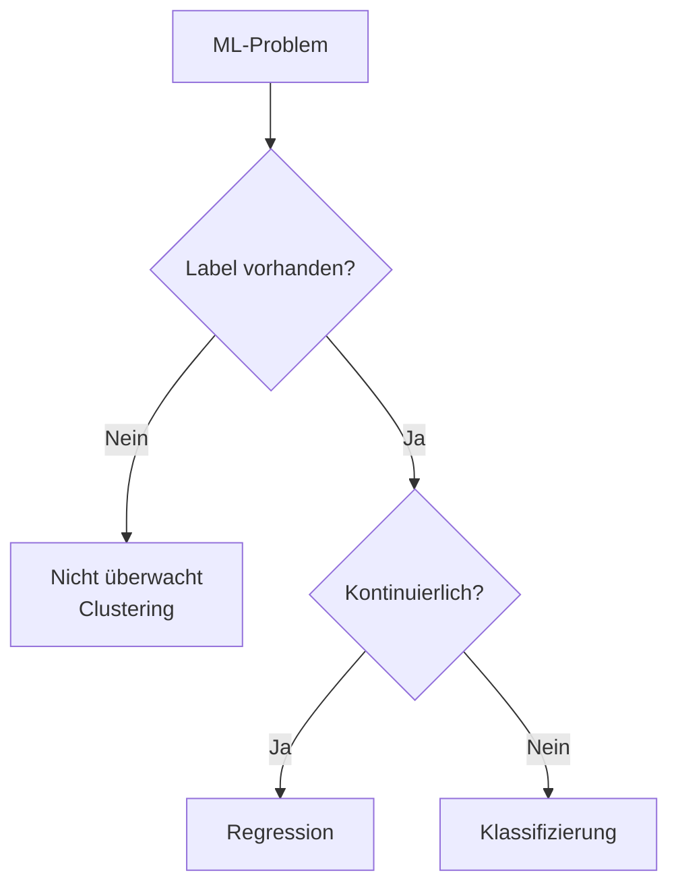
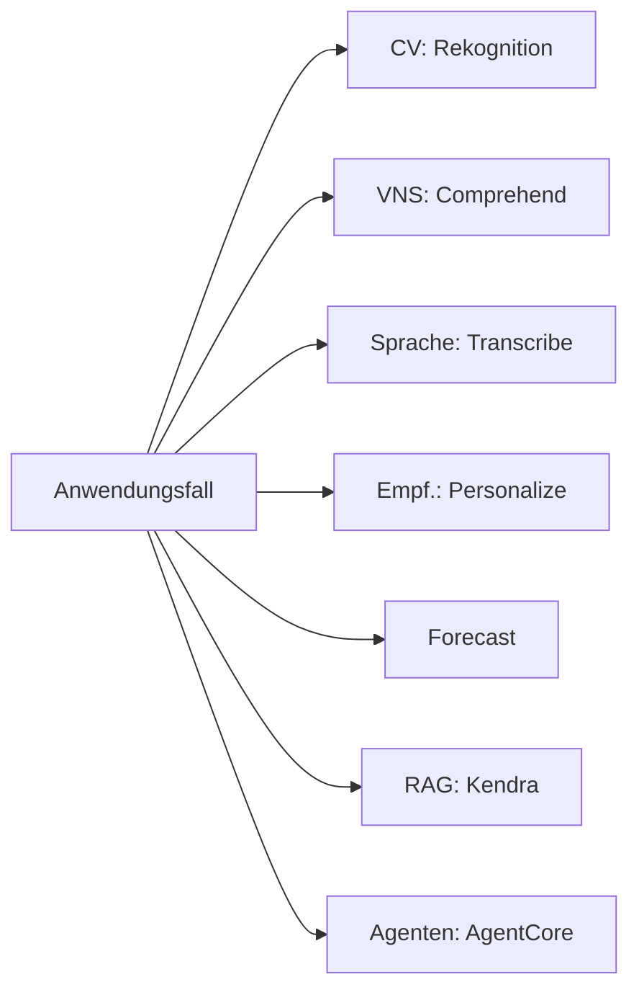
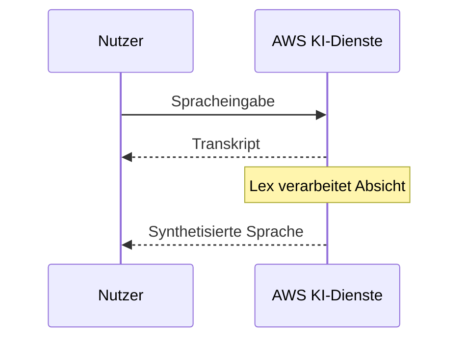
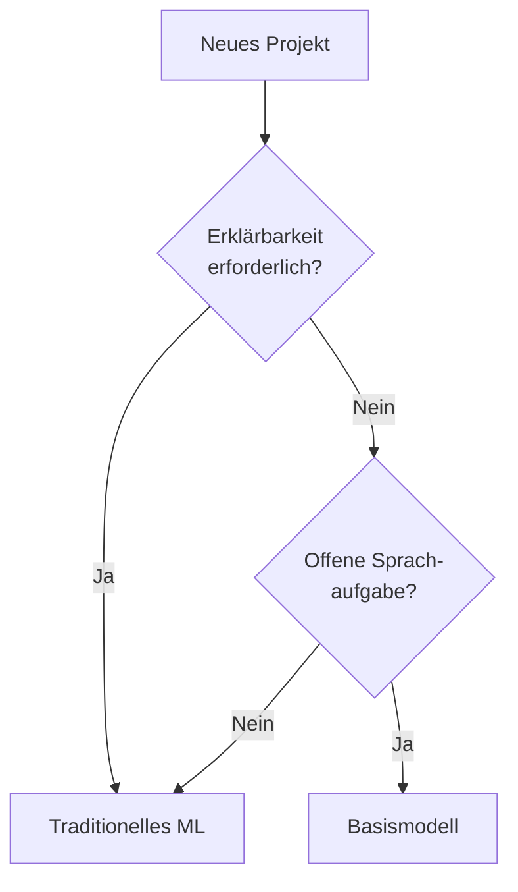

## Aufgabenstellung 1.2: Praktische Anwendungsfälle für KI identifizieren

Zu wissen, dass Künstliche Intelligenz (KI) und Maschinelles Lernen (ML) existieren, reicht für Unternehmensprofis nicht aus, um sie wirksam einzusetzen. Die eigentliche Frage lautet: Wo liefern sie bessere Ergebnisse als Alternativen, und wo nicht? Aufgabenstellung 1.2 beantwortet diese Frage. Sie führt von der Theorie in die Praxis, indem sie Kategorien von Geschäftsproblemen passenden KI-Techniken zuordnet, verwaltete AWS-Dienste katalogisiert, die den Ingenieursaufwand reduzieren, und einen neuen Entscheidungspunkt aus Version v1.1 einführt: wann ein traditionelles ML-Modell einem Basismodell vorzuziehen ist. Die hier behandelten Ziele sind 1.2.1 bis 1.2.6.[^102001]

### 1.2.1 Erkennen, wo KI/ML Mehrwert schafft

Drei Kategorien von Geschäftsbedarf definieren die meisten Situationen, in denen KI und ML einfacheren Alternativen überlegen sind: Unterstützung menschlicher Entscheidungen, Skalierbarkeit von Lösungen und Automatisierung repetitiver Aufgaben. Diese Kategorien schließen sich nicht gegenseitig aus, und viele Produktivimplementierungen kombinieren alle drei. Jede Kategorie für sich zu verstehen erleichtert es jedoch, einen KI-Vorschlag gegenüber Stakeholdern zu begründen.

**Die Unterstützung menschlicher Entscheidungen** ist der älteste und wohl dauerhafteste Werttreiber für ML. Ein Modell ersetzt den Entscheidungsträger nicht; es grenzt die Optionen ein, die ein Mensch berücksichtigen muss, und ordnet jeder verbleibenden Option eine Wahrscheinlichkeitsschätzung zu. Ein Hypothekenrisikoanalytiker prüft beispielsweise Dutzende von Signalen bei der Bewertung eines Kreditantrags. Ein ML-Modell, das auf historischen Kreditverläufen trainiert wurde, kann diese Signale nach Vorhersagegewicht ordnen und Anträge kennzeichnen, die außerhalb normaler Muster liegen, sodass der Analytiker seine Aufmerksamkeit dort konzentriert, wo sie am wichtigsten ist. Der Mensch behält Verantwortung und Entscheidungshoheit; das Modell reduziert die kognitive Belastung und die Chance, ein Signal zu übersehen, das in einem großen Merkmalssatz vergraben ist.[^102002]

**Lösungsskalierbarkeit** ist die Fähigkeit, die am unmittelbarsten mit der Cloud-Ökonomie übereinstimmt. Eine deterministische Regelmaschine, die ein Entwickler geschrieben hat, stößt an ihre Grenzen, wenn die Geschäftslogik so komplex wird, dass das manuelle Pflegen der Regeln langsamer ist als das Tempo des Geschäftswandels. Ein ML-Modell, das auf Ergebnissen trainiert wurde, skaliert anders: Mit wachsendem Eingangsvolumen führt das Modell dieselbe Inferenzberechnung durch, unabhängig davon, wie viele Geschäftsregeln benötigt würden, um seine Ausgabe nachzubilden. Ein Betrugserkennungsmodell, das zehntausend Zahlungstransaktionen pro Sekunde bewertet, erfordert keinen zusätzlichen Ingenieursaufwand im Vergleich zu einem, das hundert Transaktionen pro Sekunde bewertet; nur die Rechenressourcen ändern sich, und diese sind in AWS elastisch.[^102003]

**Automatisierung** umfasst den Ersatz einer Aufgabe, die zuvor menschliche Zeit erforderte, durch ML-Inferenz. Dokumentenklassifizierung, Bildqualitätsprüfung in einer Produktionslinie und die Weiterleitung von Call-Center-Anfragen auf Basis von Sentiment-Analysen sind allesamt Beispiele dafür. Der Wert der Automatisierung zeigt sich am deutlichsten, wenn die Aufgabe repetitiv ist, das Volumen hoch ist, die akzeptable Fehlerrate bekannt ist und die Kosten von Fehlern beherrschbar statt katastrophal sind. Automatisierung bedeutet nicht unbeaufsichtigten Betrieb; die meisten KI-Automatisierungssysteme in der Produktion umfassen einen Prüfpfad durch Menschen für die Fälle, denen das Modell eine geringe Konfidenz zuweist.[^102004]

*Abbildung 1.2.1: Drei primäre Werttreiber von KI/ML für Unternehmen. Das Diagramm zeigt, wie verschiedene Geschäftsanforderungen unterschiedlichen KI-Wertkategorien zugeordnet werden, jede mit ihrem eigenen Betriebsmuster.*

Zwei weitere Kategorien treten in Prüfungsfragen seltener auf, sind aber erwähnenswert. *Lösungspersonalisierung* setzt ML ein, um Inhalte, Angebote oder Arbeitsabläufe auf Basis von Verhaltenshistorie auf einzelne Nutzer zuzuschneiden, was besonders im Einzel- und Medienhandel verbreitet ist. *Vorausschauende Wartung* wendet Zeitreihenmodelle auf Sensordaten von Anlagen an, signalisiert die Ausfallwahrscheinlichkeit, bevor ein Ausfall eintritt, und ermöglicht Wartungsteams, nach Plan statt als Reaktion auf Ausfallzeiten zu handeln.

### 1.2.2 Wann KI/ML-Lösungen nicht geeignet sind

Die Prüfung behandelt dieses Ziel als besonders prüfungsrelevant, und der Grund ist praktisch: Organisationen, die KI wahllos einsetzen, verschwenden Budget und verursachen manchmal Schaden. Vier Bedingungen deuten zuverlässig darauf hin, dass KI die falsche Wahl ist.

**Kosten-Nutzen-Missverhältnis** ist der häufigste Ausschlussgrund in realen Projekten. Aufbau und Pflege eines ML-Modells erfordern Datenbeschriftung, Trainingsläufe, Infrastruktur, Modellüberwachung und regelmäßiges Nachtraining, wenn sich die zugrunde liegende Datenverteilung verschiebt. Für ein Geschäftsproblem, das täglich eine kleine Anzahl von Datensätzen betrifft oder dessen Ergebnis in einem engen, vorhersehbaren Bereich variiert, ist eine einfache Nachschlagetabelle oder ein zwanzigzeiliges Entscheidungsskript schneller zu erstellen, kostengünstiger zu betreiben und leichter zu prüfen. Der Break-even-Punkt hängt von Volumen und Komplexität ab, aber der Grundsatz ist einheitlich: Wenn die Kosten für Entwicklung und Betrieb des ML-Systems den Nutzen über einen angemessenen Planungshorizont übersteigen, ist eine einfachere Lösung die richtige Wahl.[^102005]

**Anforderungen an deterministische Ergebnisse** entstehen, wenn ein Geschäfts- oder Regulierungsprozess eine spezifische, reproduzierbare Antwort auf eine gegebene Eingabe verlangt, statt einer Wahrscheinlichkeitsschätzung. Steuerberechnungen, regulatorische Berechtigungsprüfungen und vertragliche Abrechnungsformeln fallen in diese Kategorie. ML-Modelle erzeugen Ausgaben aus einer erlernten Verteilung; dieselbe Eingabe kann bei unterschiedlichen Zeitpunkten leicht unterschiedliche Bewertungen erhalten, wenn das Modell neu trainiert wird, und das Modell kann nicht garantieren, dass es nie von der Regel abweicht. Regelbasierte Systeme garantieren exakte Reproduzierbarkeit. Wenn die Anforderung lautet: „Die Antwort muss immer X sein, wenn die Bedingungen Y sind", ist ML nicht das richtige Werkzeug.[^102006]

**Szenarien mit geringen Datenmengen** untergraben die grundlegende Voraussetzung des Überwachten Lernens. Ein Modell, das auf weniger Datensätzen trainiert wurde, als zur Abdeckung der Variation in der realen Welt erforderlich sind, wird schlecht generalisieren. Der Schwellenwert variiert je nach Technik und Problemtyp, aber eine grobe Faustregel besagt, dass die überwachte Klassifizierung mindestens mehrere hundert beschriftete Beispiele pro Klasse benötigt und die Regression von mehreren tausend Datensätzen mit bedeutsamer Variation im Merkmalsraum profitiert. Organisationen, die ML auf eine neue Produktlinie, eine kürzlich übernommene Datenquelle oder einen seltenen Ereignistyp anwenden wollen, stellen oft fest, dass sie noch nicht genug Daten haben, um ein zuverlässiges Modell zu trainieren.[^102007]

**Einfache regelbasierte Probleme** sind Situationen, in denen die Logik, die Eingaben auf Ausgaben abbildet, klar in einem Entscheidungsbaum mit maximal vier oder fünf Ebenen ausgedrückt werden kann. Wenn ein Fachexperte alle Fälle, Bedingungen und richtigen Ausgaben an einem einzigen Nachmittag aufzählen kann und diese Regeln stabil sind, ist ihre explizite Kodierung prüfbarer, erklärbarer und kostengünstiger als das Training eines Modells. Die Retourenberechtigungsprüfung auf Basis von Kaufdatum und Artikelkategorie ist ein klassisches Beispiel: Die Regeln sind bekannt, feststehend und klein genug, um sie manuell zu pflegen.

*Abbildung 1.2.2: Zwei Eignungsprüfungen für KI/ML. Das erste Tor filtert Projekte heraus, die den Kosten-Nutzen- oder Determinismus-Test nicht bestehen; das zweite filtert Projekte heraus, denen Daten fehlen oder die bereits stabile Regeln haben. Ein Projekt muss beide Tore passieren, um KI/ML gegenüber einem einfacheren Ansatz zu rechtfertigen.*

Zwei weitere Gesichtspunkte sind erwähnenswert, auch wenn sie in Prüfungsfragen weniger direkt auftauchen. *Ethische und regulatorische Einschränkungen* können begrenzen, wo ein Wahrscheinlichkeitsmodell eingesetzt werden darf, insbesondere in Bereichen mit hohem Risiko wie Kreditwürdigkeitsbewertung, Personalentscheidungen und klinischer Diagnostik. *Latenzanforderungen* sind relevant, wenn eine Anwendung eine Antwort im einstelligen Millisekundenbereich benötigt; bestimmte komplexe Modelle benötigen mehr Inferenzzeit, und ein fest kodierter Entscheidungspfad kann die einzige Option sein, die das SLA erfüllt.

### 1.2.3 Geeignete KI/ML-Techniken auswählen

Die Wahl der richtigen Technik beginnt mit der Art der verfügbaren Beschriftung in den Trainingsdaten. Drei grundlegende überwachte und nicht überwachte Techniken werden explizit in den Prüfungszielen genannt; zwei weitere Techniken werden in den Zielen als Randerwähnungen aufgeführt.

**Regression** sagt eine kontinuierliche numerische Ausgabe aus einer Menge von Eingabemerkmalen vorher.[^102008] Das Modell erlernt die Beziehung zwischen Merkmalen und einer Zielvariablen, die beliebige Werte in einem Bereich annehmen kann, wie erwarteter Umsatz, Stunden bis zum Geräteausfall oder Temperatur an einem bestimmten Ort und Zeitpunkt. Eine Einzelhandelskette, die das wöchentliche Verkaufsvolumen nach Filialstandort prognostiziert, verwendet Regression. Die Ausgabe ist keine Kategorie; es ist eine Zahl, auf die das Unternehmen direkt in einem Bestands- oder Personalplan reagieren kann.

**Klassifizierung** ordnet eine Eingabe einer von endlich vielen Kategorien zu.[^102009] Wenn die Kategorienmenge zwei Elemente hat, handelt es sich um *binäre Klassifizierung*; bei mehr als zwei um *Mehrklassenklassifizierung*. Spam-Erkennung (Spam oder kein Spam), Kreditausfallvorhersage (Ausfall oder kein Ausfall) und Bildkennzeichnung (Katze, Hund oder Vogel) sind allesamt Klassifizierungsprobleme. Die Modellausgabe ist typischerweise ein Wahrscheinlichkeitswert für jede Klasse; die Anwendung wählt die Klasse mit dem höchsten Wert, optional kombiniert mit einem Konfidenzschwellenwert, der Vorhersagen mit geringer Konfidenz an einen menschlichen Prüfer weiterleitet.

**Clustering** gruppiert Datensätze nach Ähnlichkeit ohne vordefiniertes Label.[^102010] Da keine beschriftete Zielvariable vorhanden ist, ist Clustering eine nicht überwachte Technik. Das Modell entdeckt Strukturen in den Daten, die der Analytiker nicht vorab festgelegt hat. Kundensegmentierung ist das klassische Beispiel: Aus Kaufhistorie, Surfverhalten und demografischen Signalen könnte das Modell fünf unterschiedliche Kundenarchetypen identifizieren, für die das Marketing-Team anschließend gezielte Kampagnen entwickeln kann. Anomalieerkennung ist eine verwandte Anwendung: Datensätze, die keinem Cluster gut zugeordnet werden können, werden als ungewöhnlich markiert.

Zwei weitere Techniken verdienen eine kurze Erwähnung, da die Prüfungsziele sie beiläufig benennen. *Dimensionsreduktion* komprimiert einen hochdimensionalen Merkmalsraum auf weniger Dimensionen, was die Rechenkosten senkt und die nachgelagerte Modellleistung verbessern kann, indem korrelierte oder irrelevante Merkmale entfernt werden. *Anomalieerkennung* identifiziert Datenpunkte, die erheblich von der erlernten Verteilung normalen Verhaltens abweichen; dies ist eine andere Problemstellung als Klassifizierung, auch wenn einige Klassifizierungsmodelle für diesen Zweck angepasst werden.

*Tabelle 1.2.1: Auswahl von ML-Techniken nach Problemtyp*

| Technik | Eingabelabel | Ausgabetyp | Kanonisches Unternehmensbeispiel |
|---------|-------------|------------|----------------------------------|
| Regression | Erforderlich (numerisches Ziel) | Kontinuierliche Zahl | Bedarfsprognose, Preisvorhersage |
| Binäre Klassifizierung | Erforderlich (zwei Klassen) | Klasse + Wahrscheinlichkeit | Betrugskennzeichen, Abwanderungsvorhersage |
| Mehrklassenklassifizierung | Erforderlich (mehrere Klassen) | Klasse + Wahrscheinlichkeit | Dokumentenweiterleitung, Fehlerkategorie |
| Clustering | Nicht erforderlich | Clusterzuweisung | Kundensegmentierung, Themenentdeckung |
| Anomalieerkennung | Optional | Anomalie-Score | Netzwerkeinbruch, Sensorfehler |

*Abbildung 1.2.3: Entscheidungsbaum zur Auswahl von ML-Techniken. Die primäre Verzweigung trennt überwachte von nicht überwachten Problemen; die überwachte Verzweigung trennt dann nach der Art der Zielvariablen.*

**Amazon SageMaker AI** unterstützt alle Techniken aus Tabelle 1.2.1 über seine integrierten Algorithmen und das breitere Framework-Ökosystem, das es bereitstellt.[^102011] Für Teams ohne Data-Science-Personal kann die AutoML-Funktion innerhalb von SageMaker AI bei einem beschrifteten Datensatz automatisch Algorithmen auswählen und abstimmen, wodurch die Technikauswahl zu einer geführten Konfigurationsaufgabe statt zu einem Forschungsproblem wird.

### 1.2.4 KI-Anwendungen in der Praxis

Prüfungsziel 1.2.4 wurde in Version v1.1 erweitert, um Wissensbasen und agentische KI neben den sechs in Version v1.0 enthaltenen Kategorien aufzunehmen. Diese acht Kategorien decken den gesamten Umfang dessen ab, was von Prüfungskandidaten erkannt werden kann.

**Computer Vision (CV)**-Systeme interpretieren Bilder oder Videoframes, um strukturierte Informationen zu extrahieren.[^102012] Objekterkennung identifiziert und lokalisiert bestimmte Elemente in einem Bild; Bildklassifizierung weist dem gesamten Bild ein Label zu; optische Zeichenerkennung liest gedruckten oder handgeschriebenen Text aus einem Scan. Ein Logistikunternehmen verwendet Computer Vision, um Paketetiketten auf einem Förderband zu lesen und sie ohne menschliches Eingreifen zu leiten. Eine Einzelhandelskette nutzt Regalscankameras, um zu erkennen, wenn ein Produkt nicht vorrätig ist. **Amazon Rekognition** ist der verwaltete AWS-Dienst für Computer Vision; er stellt vortrainierte Modelle für Objekt- und Szenenerkennung, Texterkennung und Gesichtsanalyse bereit und verarbeitet sowohl Einzelbilder als auch Videostreams.[^102013]

**Verarbeitung natürlicher Sprache (VNS)** ermöglicht es Systemen, aus unstrukturiertem Text Bedeutung abzuleiten.[^102014] Sentiment-Analyse bestimmt, ob ein Textkörper positive, negative oder neutrale Stimmung ausdrückt. Entitätserkennung extrahiert benannte Entitäten wie Produktnamen, Orte und Personen aus einem Dokument. Topic-Modellierung gruppiert eine Sammlung von Dokumenten nach Thema. Ein Customer-Success-Team führt jede Nacht eine Sentiment-Analyse der Support-Tickets durch, um aufkommende Produktbeschwerden zu erkennen, bevor sie eskalieren. **Amazon Comprehend** ist der primäre verwaltete AWS-Dienst für VNS und bietet Sentiment-Analyse, Entitätserkennung, Schlüsselphrasenextraktion und benutzerdefinierte Klassifizierung.[^102015]

**Spracherkennung** wandelt gesprochenes Audio in Text um und ermöglicht Sprachschnittstellen, Besprechungstranskription und Anrufanalysen.[^102016] Die Herausforderung in der Produktion liegt im Umgang mit verschiedenen Akzenten, Hintergrundgeräuschen, domänenspezifischem Vokabular und Echtzeit-Latenzanforderungen. **Amazon Transcribe** wandelt Audio in Text um und unterstützt benutzerdefiniertes Vokabular, Sprechererkennung und automatische Interpunktion sowohl im Echtzeit- als auch im Batch-Modus.[^102017]

**Empfehlungssysteme** sagen voraus, mit welchen Elementen ein Nutzer mit der größten Wahrscheinlichkeit interagieren wird, basierend auf Verhaltenshistorie und Kontextsignalen.[^102018] Eine E-Commerce-Plattform empfiehlt Produkte auf Basis dessen, was ein Kunde zuvor durchsucht und gekauft hat. Ein Streaming-Dienst empfiehlt Sendungen auf Basis der Sehhistorie und Bewertungen. Die zugrunde liegende Technik ist typischerweise kollaboratives Filtern, das Nutzer mit ähnlichem Verhalten identifiziert und Präferenzen in der Gruppe überträgt, oder inhaltsbasiertes Filtern, das Elemente mit Attributen findet, die Elementen ähneln, mit denen der Nutzer bereits interagiert hat. **Amazon Personalize** ist ein verwalteter Empfehlungsdienst, der die Trainings-, Bereitstellungs- und Echtzeit-Serving-Pipeline ohne ML-Expertise seitens des Anwendungsteams verwaltet.[^102019]

**Betrugserkennung** identifiziert Transaktionen oder Kontoaktivitäten, die vom erlernten Muster legitimen Verhaltens abweichen.[^102020] Banken wenden Betrugserkennung in der Zahlungsautorisierungsphase an und bewerten jede Transaktion in Echtzeit; diejenigen, die einen Risikoschwellenwert überschreiten, werden abgelehnt oder zur Prüfung markiert. Versicherungsunternehmen wenden sie auf zur Erstattung eingereichte Schadensansprüche an. Der ML-Ansatz übertrifft statische Regeln, weil sich Betrugsmuster kontinuierlich weiterentwickeln und ein Modell neu trainiert werden kann, sobald neue Betrugstaktiken auftauchen. Die zugrunde liegende Technik ist häufig binäre Klassifizierung mit einer darüber liegenden Anomalieerkennungsschicht. **Amazon Fraud Detector** ist der verwaltete AWS-Dienst, der dieses Muster verpackt, mit vordefinierten Modellen für Online-Betrug, Transaktionsbetrug und Kontoübernahme.

**Prognose** erstellt Vorhersagen zukünftiger Werte für eine Zeitreihenvariable, wie Produktnachfrage, Energieverbrauch oder Personalanforderungen für Call-Center.[^102021] Die Eingaben sind historische Beobachtungen der Zielvariablen plus optionale *verwandte Zeitreihen* (wie Werbeaktionen, Feiertage und Wetter), die das Modell zur Verbesserung der Genauigkeit nutzen kann. **Amazon Forecast** ist ein verwalteter Prognosedienst, der automatisch zwischen statistischen und Deep-Learning-Algorithmen auswählt, *Quantilsprognosen* berechnet (zum Beispiel p50- und p90-Nachfragewerte) und Ergebnisse für die nachgelagerte Verarbeitung in Amazon S3 schreibt.[^102022]

**Wissensbasen** sind strukturierte Informationsspeicher, die KI-Systeme zur Inferenzzeit abfragen können, um ihre Antworten auf verifizierten Inhalten zu stützen, statt ausschließlich auf den in den Modellgewichten kodierten Mustern.[^102023] Eine Wissensbasis für ein Finanzdienstleistungsunternehmen könnte regulatorische Dokumente, Produktspezifikationen und genehmigte Antwortvorlagen enthalten. Wenn ein Kunde über einen KI-Assistenten eine Frage stellt, ruft das System den relevanten Abschnitt aus der Wissensbasis ab und verwendet ihn, um eine sachlich fundierte Antwort zu formulieren. Dieses Muster wird formal als *Retrieval-Augmented Generation (RAG)* bezeichnet, was Domäne 3 dieses Buches ausführlich behandelt. **Amazon Kendra** ist ein verwalteter Enterprise-Suchdienst, der viele Wissensbasis-Implementierungen unterstützt, Dokumentenrepositorys indiziert und auf natürlichsprachliche Anfragen relevante Passagen zurückgibt.[^102024]

**Agentische KI** beschreibt Systeme, in denen ein oder mehrere KI-Modelle mehrstufige Aufgaben autonom planen und ausführen, dabei Werkzeuge und APIs aufrufen, um mit externen Systemen zu interagieren.[^102025] Ein Einzelagentensystem könnte einen End-to-End-Kundenservice-Workflow übernehmen: die Kundenanfrage interpretieren, Kontoinformationen in einem CRM nachschlagen, den Produktbestand prüfen, eine Lösung entwerfen und eine Bestätigungs-E-Mail senden, alles ohne menschlichen Betreiber. Ein Multi-Agenten-System verteilt Teilaufgaben auf spezialisierte Agenten; ein Orchestrierungsagent weist Arbeit zu, Unteragenten führen sie aus, und der Orchestrator kompiliert die Ergebnisse. Geschäftliche Anwendungen für agentische KI umfassen IT-Betrieb (ein Agent, der Warnungen überwacht, die Grundursache diagnostiziert und eine Korrektur aus einem Runbook anwendet), Dokumentenverarbeitung (ein Agent, der Rechnungen liest, Positionen extrahiert und sie in ein ERP eingibt) und Kunden-Onboarding (ein Agent, der erforderliche Dokumente sammelt, sie validiert und die Kontobereitstellung auslöst).

**Amazon Bedrock AgentCore** ist die verwaltete AWS-Laufzeitumgebung für produktive agentische KI-Workloads und bietet Speicherverwaltung, Werkzeugorchestrierung und Sitzungspersistenz für Agenten, die auf Basismodellen aufgebaut sind.[^102026] Für Teams, die agentische Anwendungen entwickeln, ist **Strands Agents** ein Open-Source-SDK, das die Komposition mehrerer Agenten vereinfacht, während **Amazon Bedrock**-Agenten eine vollständig verwaltete Orchestrierungsschicht bereitstellen, die Basismodelle mit Aktionsgruppen verbindet, die als AWS Lambda-Funktionen oder API-Schemata definiert sind.[^102027]

*Abbildung 1.2.4: Kategorien von KI-Anwendungen in der Praxis und der primäre verwaltete AWS-Dienst, der jeweils zum Einsatz kommt. Betrugserkennung wird nicht gezeigt, weil sie je nach Implementierungsansatz mehrere Dienste umfasst (Amazon Fraud Detector und SageMaker AI).*

### 1.2.5 Verwaltete KI/ML-Dienste von AWS

Verwaltete KI-Dienste von AWS beseitigen die Anforderung an interne Modellentwicklung, indem sie vortrainierte Fähigkeiten über APIs bereitstellen. Prüfungsziel 1.2.5 nennt sechs Dienste explizit; die Liste der im Geltungsbereich enthaltenen Dienste fügt vier weitere hinzu, die in der Praxis und als Prüfungsablenkungsoptionen auftreten.

Die sechs genannten Dienste lassen sich übersichtlich nach Funktion einteilen. **Amazon SageMaker AI** ist die End-to-End-ML-Plattform zum Aufbau, Training und zur Bereitstellung benutzerdefinierter Modelle in jeder Größenordnung.[^102028] Es ist kein vortrainierter Dienst, sondern eine verwaltete Umgebung, die die Infrastruktur für jede Phase des ML-Lebenszyklus verwaltet. Teams, die ein auf eigenen Daten trainiertes Modell benötigen statt einer generischen vortrainierten API, beginnen mit SageMaker AI. **Amazon Transcribe** wandelt Sprache in Text um und bildet die Grundlage jedes Workflows, der Audio verarbeiten muss.[^102029] **Amazon Translate** bietet neuronale maschinelle Übersetzung für ein breites Spektrum von Sprachpaaren und unterstützt Content-Lokalisierung, mehrsprachigen Echtzeit-Chat und Batch-Dokumentenübersetzung.[^102030] Amazon Comprehend, das früher in diesem Abschnitt eingeführt wurde, übernimmt die Textanalysephase bei Transkripten, die Amazon Transcribe erstellt.[^102031] **Amazon Lex** erstellt konversationelle Schnittstellen, die natürlichsprachliche Absichten verstehen und den Dialogzustand verwalten, und integriert sich mit **Amazon Polly**, das Text für Antworten im Sprachkanal in lebensechte Sprache umwandelt.[^102032][^102033]

Vier weitere Dienste im Geltungsbereich erscheinen regelmäßig in Prüfungsfragen und realen Architekturen. **Amazon Rekognition** übernimmt Bild- und Videoanalyse, einschließlich Objekterkennung, Texterkennung und Inhaltsmoderation.[^102034] **Amazon Textract** geht über die optische Zeichenerkennung hinaus und extrahiert strukturierte Daten, wie Formularfelder und Tabellenwerte, aus gescannten Dokumenten.[^102035] **Amazon Personalize** liefert personalisierte Empfehlungen, die auf Interaktionsdaten trainiert wurden, die der Kunde bereitstellt.[^102036] **Amazon Kendra** ist ein Enterprise-Suchdienst, der interne Dokumente indiziert und auf natürlichsprachliche Fragen relevante Passagen zurückgibt und so als Abrufschicht in Wissensbasisarchitekturen dient.[^102037]

*Tabelle 1.2.2: Verwaltete KI/ML-Dienste von AWS nach Fähigkeit gruppiert*

| Fähigkeit | Dienst | Primäre Funktion |
|-----------|--------|-----------------|
| Entwicklung benutzerdefinierter Modelle | Amazon SageMaker AI | Aufbau, Training und Bereitstellung benutzerdefinierter ML-Modelle |
| Sprache zu Text | Amazon Transcribe | Automatische Spracherkennung mit Sprecheridentifikation |
| Text zu Sprache | Amazon Polly | Neuronale Text-zu-Sprache-Umwandlung in mehreren Stimmen |
| Sprachübersetzung | Amazon Translate | Neuronale maschinelle Übersetzung, Batch und Echtzeit |
| Textanalyse | Amazon Comprehend | Sentiment, Entitäten, Schlüsselphrasen, benutzerdefinierte Klassifizierung |
| Konversations-KI | Amazon Lex | Absichtserkennung und Dialogverwaltung |
| Computer Vision | Amazon Rekognition | Objekterkennung, Texterkennung, Inhaltsmoderation |
| Dokumentdatenextraktion | Amazon Textract | Extraktion strukturierter Felder und Tabellen aus Dokumenten |
| Empfehlungen | Amazon Personalize | Echtzeit-personalisierte Empfehlungen |
| Enterprise-Suche | Amazon Kendra | Natürlichsprachliche Suche über interne Dokumentenrepositorys |

Eine häufige Prüfungsfalle besteht darin, Dienste mit überlappenden Aufgabenbereichen zu verwechseln. **Amazon Transcribe** erstellt ein Texttranskript; **Amazon Comprehend** analysiert dieses Transkript auf Bedeutung. **Amazon Lex** versteht konversationelle Absichten in Echtzeit; **Amazon Polly** spricht die Antwort zurück. **Amazon Textract** liest strukturierte Daten aus einer gescannten Seite; **Amazon Rekognition** erkennt Objekte und Szenen im selben Bild. Diese Paare erscheinen häufig gemeinsam in Architekturfragen, und zu wissen, welcher Dienst in welchem Stadium eingesetzt wird, ist der Schlüssel zur Auswahl der richtigen Antwort.

*Abbildung 1.2.5: Konzeptioneller Sprachkanal-Ablauf. Der Nutzer spricht eine Kette von AWS KI-Diensten an, die das Audio transkribiert, die Absicht interpretiert und eine gesprochene Antwort synthetisiert; die spezifischen Übergaben zwischen Diensten (Transcribe zu Lex zu Comprehend zu Polly) sind im vorangehenden Absatz beschrieben.*

### 1.2.6 Traditionelles ML vs. Basismodelle

Ziel 1.2.6 ist neu in Version v1.1 und spiegelt die praktische Frage wider, mit der jedes KI-Team heute konfrontiert ist: Wann ist ein Basismodell (FM) das richtige Werkzeug, und wann ist ein traditionelles ML-Modell, das von Grund auf aufgebaut und trainiert wird, die bessere Wahl?[^102038] Bei dieser Entscheidung geht es nicht um die Ausgereiftheit der jeweiligen Option. Es geht um Passung: die Merkmale der verfügbaren Daten, der erforderlichen Ausgaben, des regulatorischen Umfelds und des Betriebsbudgets mit den Fähigkeiten jedes Ansatzes abzugleichen.

**Traditionelle ML-Modelle** werden auf beschrifteten Daten für eine spezifische, klar abgegrenzte Aufgabe trainiert. Sie sind vollständig interpretierbar in dem Sinne, dass Merkmalswichtigkeit und Entscheidungslogik extrahiert und geprüft werden können. Sie führen Inferenz mit geringer Latenz durch, typischerweise im einstelligen Millisekundenbereich auf moderater Hardware. Ihre Rechenkosten sind vorhersehbar und oft gering. Sie erfordern domänenbeschriftete Trainingsdaten, die teuer in der Beschaffung sein können, aber nach dem Training entstehen keine laufenden token-basierten Rechenkosten.[^102039]

**Basismodelle** sind auf breiten, allgemeinen Korpora vortrainiert und können mit minimaler zusätzlicher Konfiguration ein weites Spektrum von Sprach- und multimodalen Aufgaben bewältigen.[^102040] Sie zeichnen sich bei Aufgaben aus, die natürlichsprachliches Verständnis, Inhaltsgenerierung, Code-Synthese oder Schlussfolgerungen über lose verwandte Themen erfordern. Sie akzeptieren konversationelle Eingabeaufforderungen und passen ihr Verhalten auf Basis von Anweisungen an, ohne Nachtraining zu erfordern. Ihr Kostenmodell ist typischerweise token-basiert, d.h. jeder Inferenzaufruf wird nach der Anzahl der Token in Eingabe und Ausgabe berechnet. Die Latenz ist höher als bei traditionellem ML, typischerweise im Bereich von Hunderten von Millisekunden bis Sekunden.

*Tabelle 1.2.3: Entscheidungskriterien für traditionelles ML vs. Basismodelle*

| Kriterium | Traditionelles ML | Basismodell |
|-----------|------------------|-------------|
| Aufgabenumfang | Einzelne, klar definierte Aufgabe | Breite oder allgemeine Aufgaben |
| Trainingsdaten | Domänenbeschrifteter Datensatz erforderlich | Vortrainiert; Eingabeaufforderung oder Feinabstimmung |
| Erklärbarkeit | Hoch; Merkmalswichtigkeit verfügbar | Geringer; emergentes Schlussfolgerungsvermögen |
| Latenz | Gering (einstelliger ms-Bereich) | Höher (Hunderte ms bis Sekunden) |
| Inferenzkosten | Vorhersehbar; keine token-basierte Abrechnung | Token-basiert; variabel mit Eingabelänge |
| Regulatorische Eignung | Hoch; vollständige Prüfbarkeit | Geringer; Bedenken zur Ausgabevariabilität |
| Multimodale Unterstützung | Auf trainierte Modalitäten beschränkt | Breit (Text, Bild, Audio je nach Modell) |
| Hochvolumige Einzelaufgabe | Hoch; skaliert horizontal | Gering; token-basierte Kosten wachsen mit Volumen |

Vier Bedingungen begünstigen klar die Wahl eines traditionellen ML-Modells. Erstens verlangen regulatorische oder Compliance-Anforderungen einen vollständig prüfbaren, reproduzierbaren Entscheidungspfad. Kreditrisikobewertung unter Bankenregulierung erfordert beispielsweise die Fähigkeit, jede einzelne Entscheidung zu erklären, und ein Gradient-Boosting-Baum oder ein logistisches Regressionsmodell kann diese Erklärung in einem Format liefern, das Regulatoren akzeptieren.[^102041] Zweitens hat die Vorhersageaufgabe eine einzige klar definierte Ausgabe (eine Zahl, eine Kategorie oder einen Score) und genügend beschriftete Trainingsdaten, um ohne allgemeines Schlussfolgerungsvermögen eine akzeptable Genauigkeit zu erreichen. Drittens sind Latenz und Kosten eng begrenzt; die Anwendung läuft mit hohem Volumen und muss Vorhersagen in Millisekunden zu einem Bruchteil eines Cents pro Inferenz zurückgeben. Viertens verfügt die Organisation über ausreichende ML-Engineering-Kapazitäten, um die Trainings- und Nachtraining-Pipeline zu verwalten.

Vier Bedingungen begünstigen ein Basismodell. Erstens erfordert die Aufgabe das Generieren kohärenter Prosa, das Schlussfolgerungsvermögen bei mehrdeutigen Fragen oder das Synthetisieren von Informationen aus mehreren Quellen, also Fähigkeiten, die traditionelle ML-Modelle nicht bieten können. Zweitens verfügt die Organisation über minimale beschriftete Trainingsdaten, hat aber Zugang zu einer klar definierten Aufgabenbeschreibung, die als Eingabeaufforderung ausgedrückt werden kann, sodass Few-Shot- oder Zero-Shot-Inferenz praktikabel ist. Drittens ist der Anwendungsfall konversationell, und das Modell muss den Kontext über mehrere Gesprächsrunden hinweg ohne explizite Zustandsverwaltungslogik beibehalten. Viertens ist das Anwendungsvolumen niedrig genug, dass token-basierte Kosten akzeptabel sind, oder die Aufgaben sind einzigartig genug, dass ein Universalmodell die Kosten eines spezialisierten Modellaufbaus amortisiert.

*Abbildung 1.2.6: Entscheidungsfluss zur Wahl zwischen einem traditionellen ML-Modell und einem Basismodell. Regulatorische Anforderungen und Aufgabentyp sind die beiden wichtigsten Filter; Latenz und Datenverfügbarkeit verfeinern die Entscheidung.*

Sowohl der NIST AI RMF als auch der EU AI Act schreiben Nachverfolgbarkeitsanforderungen für KI-Systeme vor, die bei risikobehafteten Entscheidungen eingesetzt werden.[^102042] In der Praxis übernehmen Organisationen, die diesen Rahmenwerken unterliegen, häufig ein hybrides Muster: Ein traditionelles ML-Modell übernimmt die eigentliche Vorhersageaufgabe und erstellt die prüfbare Ausgabe, während ein Basismodell die benachbarten Sprachaufgaben übernimmt, wie das Erstellen der kundengerichteten Erklärung der Entscheidung oder das Zusammenfassen von Belegen aus unstrukturierten Dokumenten.

Die Grenze zwischen beiden Ansätzen verschiebt sich. Die Modelldestillationsfähigkeiten innerhalb von **Amazon Bedrock** ermöglichen es Teams, Schlussfolgerungsverhalten von einem großen Basismodell auf ein kleineres, schnelleres, kostengünstigeres Modell zu übertragen, das auf eine bestimmte Aufgabe abgestimmt ist.[^102043] Das Ergebnis ist ein Modell, das sich innerhalb seines engen Fachbereichs wie ein Basismodell verhält, aber mit einem Kosten- und Latenzprofil läuft, das einem traditionellen ML-Modell näherkommt. Diese Technik wird in Ziel 3.1.5 behandelt und ist hier als Brücke zwischen den beiden Kategorien erwähnenswert.

**Was dieser Abschnitt behandelt hat:** Aufgabenstellung 1.2 hat erläutert, wie man erkennt, wo KI und ML Mehrwert schaffen, wann man sie vermeiden sollte, wie man Techniken mit Problemtypen abgleicht und welche verwalteten AWS-Dienste jede Anwendungskategorie abdecken. Außerdem wurde der neue Entscheidungsrahmen aus Version v1.1 zur Wahl zwischen traditionellen ML-Modellen und Basismodellen eingeführt. Aufgabenstellung 1.3, die folgt, behandelt den End-to-End-Entwicklungslebenszyklus für KI/ML und ordnet jede Phase den AWS-Diensten zu, die sie unterstützen.

## Selbstkontrollfragen

**Frage 1**

Ein Einzelhandelsunternehmen verarbeitet täglich 50.000 Kunden-Support-E-Mails und muss jede E-Mail anhand ihres Themas an die richtige Abteilung weiterleiten. Das Unternehmen verfügt über 12 Monate historischer E-Mails, die bereits mit der richtigen Abteilung beschriftet sind. Welcher Ansatz passt am BESTEN zu diesem Problem?

A. Regression, weil das Modell für jede Abteilung einen Score vorhersagen muss und der höchste Score die Weiterleitung bestimmt.

B. Mehrklassenklassifizierung, weil die Ausgabe eine von mehreren vordefinierten Abteilungen ist und beschriftete Daten verfügbar sind.

C. Clustering, weil zu viele Daten vorhanden sind, um sie manuell zu beschriften, und die Abteilungen noch nicht definiert sind.

D. Ein Basismodell mit Zero-Shot-Eingabeaufforderung, weil die beschrifteten Daten eine Feinabstimmung überflüssig machen und Eingabeaufforderungen einfacher sind.

Mit 12 Monaten beschrifteter E-Mails und einem festen Satz bekannter Abteilungen ist dies ein Lehrbuchbeispiel für Mehrklassenklassifizierung. Die beschrifteten Daten reichen aus, um ein traditionelles ML-Modell zu trainieren, die Ausgabe ist eine von endlich vielen Kategorien, und das Volumen (50.000 pro Tag) macht die vorhersehbaren Kosten und die geringe Latenz eines trainierten Klassifikators gegenüber token-basierter FM-Inferenz vorzuziehen. Regression sagt kontinuierliche Zahlen voraus, keine Kategorien. Clustering wäre geeignet, wenn die Abteilungen unbekannt wären oder keine Beschriftungen vorhanden wären, aber keine dieser Bedingungen trifft hier zu. Ein Basismodell mit Zero-Shot-Eingabeaufforderung kann Text kategorisieren, aber bei 50.000 E-Mails täglich summieren sich die token-basierten Kosten schnell und die Latenz ist höher als bei einem trainierten Klassifikator; die beschrifteten Daten sollten genutzt werden, um ein zweckorientiertes Modell zu trainieren, statt sie zu verwerfen.[^102044]

**Frage 2**

Ein Finanzdienstleistungsunternehmen muss Regulatoren jede Kreditentscheidung erklären, einschließlich der Eingabemerkmale, die das Ergebnis am stärksten beeinflusst haben. Das Unternehmen prüft, ob ein traditionelles ML-Modell oder ein Basismodell eingesetzt werden soll. Welcher Faktor begünstigt den traditionellen ML-Ansatz am STÄRKSTEN?

A. Das Unternehmen verfügt über ein großes Volumen beschrifteter Trainingsdaten aus vergangenen Kreditanträgen.

B. Die regulatorische Anforderung an Erklärbarkeit und prüfbare Entscheidungslogik.

C. Die Inferenz-Latenzanforderung beträgt unter 200 Millisekunden pro Anfrage.

D. Das Unternehmen möchte token-basierte Preisgestaltung vermeiden, um Inferenzkosten zu kontrollieren.

Regulatorische Erklärbarkeit ist hier der ausschlaggebende Faktor. Traditionelle ML-Modelle wie logistische Regression und Gradient-Boosting-Bäume legen Merkmalswichtigkeits-Scores und Entscheidungspfade offen, die Prüfungsanforderungen erfüllen. Basismodelle erzeugen Ausgaben durch emergentes Schlussfolgerungsvermögen, das schwer bestimmten Merkmalen in einer Form zuzuschreiben ist, die Regulatoren akzeptieren. Das Vorhandensein beschrifteter Trainingsdaten (A) ist ein unterstützender Faktor für traditionelles ML, aber nicht das stärkste Unterscheidungsmerkmal im Vergleich zu regulatorischen Anforderungen. Latenz unter 200 ms (C) erfüllen traditionelle ML-Modelle zwar, aber viele Basismodell-Bereitstellungen erfüllen diesen Schwellenwert ebenfalls. Token-basierte Preisgestaltung (D) ist ein Kostengesichtspunkt, aber nicht so bindend wie regulatorische Compliance.[^102045]

**Frage 3**

Ein Fertigungsunternehmen möchte erkennen, welche Maschinen auf seinem Produktionsgelände innerhalb der nächsten 72 Stunden wahrscheinlich ausfallen werden, basierend auf minütlich erfassten Sensorlesungen. Das Modell muss eine Vorhersage zurückgeben, keine statische Regel. Es gibt keine beschriftete Ausfall-Historie. Welcher ML-Ansatz ist am BESTEN geeignet?

A. Binäre Klassifizierung mit historischen Sensordaten, die mit Ausfallereignissen beschriftet sind.

B. Regression mit der Anzahl vergangener Wartungsaufrufe als Zielvariable.

C. Nicht überwachte Anomalieerkennung auf den Sensor-Zeitreihen, die Lesungen markiert, die vom erlernten Normalprofil jeder Maschine abweichen.

D. Mehrklassenklassifizierung zur Kategorisierung des Schweregrads des Ausfalls als niedrig, mittel oder hoch.

Ohne beschriftete Ausfall-Historie können überwachte Ansätze (A, B, D) nicht direkt angewendet werden. Nicht überwachte Anomalieerkennung erlernt das normale Muster der Sensorlesungen für jede Maschine und markiert Abweichungen von diesem Muster; auf AWS bietet **Amazon SageMaker AI** Random Cut Forest und DeepAR für genau diese Art der Zeitreihen-Anomalieerkennung an, und die resultierenden Anomalie-Scores dienen als nicht überwachter Proxy für das Ausfallrisiko. Binäre Klassifizierung (A) ist der ideale Ansatz, sobald Beschriftungen verfügbar sind, und die Organisation sollte planen, beschriftete Ausfallereignisse für zukünftiges überwachtes Modelltraining zu sammeln. Regression (B) erfordert eine numerische Zielvariable; die Anzahl vergangener Wartungsaufrufe ist ein Proxy, sagt aber nicht direkt einen zukünftigen Ausfall innerhalb eines bestimmten Zeitfensters voraus. Mehrklassenklassifizierung (D) erfordert ebenfalls beschriftete Schweregradkategorien, die noch nicht vorhanden sind.[^102046]

**Frage 4**

Ein Unternehmen prüft eine KI-Lösung zur Automatisierung der Bonusberechnung für Mitarbeiter gemäß einem Tarifvertrag. Die Formel ist im Vertrag präzise festgelegt, gilt identisch für alle Mitarbeiter der gleichen Lohngruppe und hat sich seit fünf Jahren nicht verändert. Welche Entscheidung ist am GEEIGNETSTEN?

A. Ein Klassifizierungsmodell implementieren, um zu bestimmen, in welche Bonusstufe jeder Mitarbeiter fällt.

B. Ein Regressionsmodell implementieren, um Bonusbeträge aus Gehalts- und Leistungsdaten vorherzusagen.

C. KI/ML nicht einsetzen; die Formel als deterministischen Code implementieren, weil das Ergebnis exakt und reproduzierbar sein muss.

D. Ein Basismodell verwenden, um den Vertragstext zu interpretieren und den entsprechenden Bonus zu berechnen.

Dies ist ein Szenario mit deterministischen Ergebnisanforderungen. Die Bonusberechnung ist eine feststehende Formel ohne Wahrscheinlichkeitselement; dieselben Eingaben müssen immer dieselbe Ausgabe ohne Abweichung erzeugen. Eine regelbasierte oder formelbasierte Implementierung garantiert exakte Reproduzierbarkeit und ist trivial prüfbar. Ein Klassifizierungsmodell (A) würde eine Wahrscheinlichkeitsschätzung einführen und könnte nicht garantieren, dass die im Vertrag festgelegten Grenzwerte stets eingehalten werden. Ein Regressionsmodell (B) sagt aus erlernten Mustern kontinuierliche Werte voraus, aber der korrekte Wert ist bereits durch die Formel festgelegt; der Einsatz von ML hier fügt Komplexität ohne Nutzen hinzu. Ein Basismodell (D) kann Text interpretieren, würde aber keine arithmetische Genauigkeit garantieren und bringt Latenz und Kosten für eine Aufgabe mit sich, die keine der FM-Fähigkeiten erfordert.[^102047]

**Frage 5**

Ein Technologieunternehmen möchte einen Kunden-Service-Assistenten aufbauen, der Fragen in einer von 15 Sprachen bearbeiten, den Konversationskontext über mehrere Gesprächsrunden hinweg aufrechterhalten und personalisierte Antworten generieren kann, die auf der internen Produktdokumentation des Unternehmens basieren. Das Unternehmen verfügt über keine beschrifteten Frage-Antwort-Trainingsdaten. Welcher Ansatz ist am BESTEN?

A. Ein Mehrklassenklassifizierungsmodell trainieren, um Fragen an vorformulierte Antworten in jeder Sprache weiterzuleiten.

B. Ein Basismodell mit Abruf aus einer Amazon Kendra-Wissensbasis verwenden, kombiniert mit Amazon Translate für die Sprachverarbeitung.

C. Amazon Lex für die Dialogverwaltung und Amazon Comprehend für die Sentiment-Analyse verwenden, ohne Basismodell.

D. Separate Regressionsmodelle für jede Sprache erstellen, die jeweils trainiert werden, um die Relevanz von Antwortkandiaten zu bewerten.

Dieses Szenario hat drei Anforderungen, die gemeinsam eine Basismodell-Architektur begünstigen: konversationeller Mehrfach-Gesprächsrunden-Kontext, Inhaltsgenerierung aus internen Dokumenten und mehrsprachige Unterstützung ohne beschriftete Trainingsdaten. Ein Basismodell mit einer Amazon Kendra-Wissensbasis zu verbinden, liefert Retrieval-Augmented Generation und verankert die Modellantworten in der tatsächlichen Dokumentation des Unternehmens. Viele Basismodelle verarbeiten mehrere Sprachen von Natur aus, aber Amazon Translate kann für Sprachen ergänzen, die das FM weniger gut beherrscht. Ein Klassifizierungsmodell (A) kann an statische Antworten weiterleiten, kann aber keine personalisierten Antworten generieren oder den Kontext über Gesprächsrunden aufrechterhalten. Amazon Lex und Comprehend (C) verwalten Dialog und Sentiment, rufen aber nicht aus internen Dokumenten ab und generieren keine neuen Antworten; diese Kombination allein würde die Generierungsanforderung nicht erfüllen. Regressionsmodelle (D) könnten Antwortkandidaten bewerten, können aber keine neuen Antworten generieren oder den Konversationszustand beibehalten, und der Ansatz würde den Aufbau und die Pflege von 15 separaten Modellen erfordern.[^102048]

---

[^102001]: AWS Certification: AWS Certified AI Practitioner (AIF-C01) Exam Guide v1.1, Task Statement 1.2. URL: <https://docs.aws.amazon.com/aws-certification/latest/ai-practitioner-01/ai-practitioner-01-domain1.html>
[^102002]: Amazon SageMaker AI Developer Guide: Human-in-the-loop workflows. URL: <https://docs.aws.amazon.com/sagemaker/latest/dg/a2i-use-augmented-ai-a2i-human-review-loops.html>
[^102003]: Amazon SageMaker AI: Model deployment and real-time inference. URL: <https://docs.aws.amazon.com/sagemaker/latest/dg/deploy-model.html>
[^102004]: Amazon Augmented AI (A2I) Developer Guide: What is Amazon A2I? URL: <https://docs.aws.amazon.com/sagemaker/latest/dg/a2i-getting-started.html>
[^102005]: AWS Well-Architected Framework: Machine Learning Lens - Cost optimization pillar. URL: <https://docs.aws.amazon.com/wellarchitected/latest/machine-learning-lens/cost-optimization.html>
[^102006]: NIST AI Risk Management Framework (AI RMF 1.0): Trustworthiness characteristic - Explainability. URL: <https://airc.nist.gov/Home>
[^102007]: Amazon SageMaker AI Developer Guide: Prepare your data. URL: <https://docs.aws.amazon.com/sagemaker/latest/dg/data-prep.html>
[^102008]: Amazon SageMaker AI Developer Guide: Linear Learner algorithm. URL: <https://docs.aws.amazon.com/sagemaker/latest/dg/linear-learner.html>
[^102009]: Amazon SageMaker AI Developer Guide: XGBoost algorithm. URL: <https://docs.aws.amazon.com/sagemaker/latest/dg/xgboost.html>
[^102010]: Amazon SageMaker AI Developer Guide: K-Means algorithm. URL: <https://docs.aws.amazon.com/sagemaker/latest/dg/k-means.html>
[^102011]: Amazon SageMaker AI overview. URL: <https://aws.amazon.com/sagemaker/>
[^102012]: Amazon Rekognition Developer Guide: What is Amazon Rekognition? URL: <https://docs.aws.amazon.com/rekognition/latest/dg/what-is.html>
[^102013]: Amazon Rekognition product page. URL: <https://aws.amazon.com/rekognition/>
[^102014]: Amazon Comprehend Developer Guide: What is Amazon Comprehend? URL: <https://docs.aws.amazon.com/comprehend/latest/dg/what-is.html>
[^102015]: Amazon Comprehend product page. URL: <https://aws.amazon.com/comprehend/>
[^102016]: Amazon Transcribe Developer Guide: What is Amazon Transcribe? URL: <https://docs.aws.amazon.com/transcribe/latest/dg/what-is.html>
[^102017]: Amazon Transcribe product page. URL: <https://aws.amazon.com/transcribe/>
[^102018]: Amazon Personalize Developer Guide: What is Amazon Personalize? URL: <https://docs.aws.amazon.com/personalize/latest/dg/what-is-personalize.html>
[^102019]: Amazon Personalize product page. URL: <https://aws.amazon.com/personalize/>
[^102020]: Amazon Fraud Detector product page. URL: <https://aws.amazon.com/fraud-detector/>
[^102021]: Amazon Forecast Developer Guide: What is Amazon Forecast? URL: <https://docs.aws.amazon.com/forecast/latest/dg/what-is-forecast.html>
[^102022]: Amazon Forecast product page. URL: <https://aws.amazon.com/forecast/>
[^102023]: Amazon Kendra Developer Guide: What is Amazon Kendra? URL: <https://docs.aws.amazon.com/kendra/latest/dg/what-is-kendra.html>
[^102024]: Amazon Kendra product page. URL: <https://aws.amazon.com/kendra/>
[^102025]: Amazon Bedrock User Guide: Agents for Amazon Bedrock. URL: <https://docs.aws.amazon.com/bedrock/latest/userguide/agents.html>
[^102026]: Amazon Bedrock AgentCore product page. URL: <https://aws.amazon.com/bedrock/agentcore/>
[^102027]: Strands Agents SDK on GitHub. URL: <https://github.com/strands-agents/sdk-python>
[^102028]: Amazon SageMaker AI Developer Guide: What is Amazon SageMaker AI? URL: <https://docs.aws.amazon.com/sagemaker/latest/dg/whatis.html>
[^102029]: Amazon Transcribe Developer Guide: Real-time transcription. URL: <https://docs.aws.amazon.com/transcribe/latest/dg/getting-started-streaming.html>
[^102030]: Amazon Translate Developer Guide: What is Amazon Translate? URL: <https://docs.aws.amazon.com/translate/latest/dg/what-is.html>
[^102031]: Amazon Comprehend Developer Guide: Sentiment analysis. URL: <https://docs.aws.amazon.com/comprehend/latest/dg/how-sentiment.html>
[^102032]: Amazon Lex Developer Guide: What is Amazon Lex? URL: <https://docs.aws.amazon.com/lexv2/latest/dg/what-is.html>
[^102033]: Amazon Polly Developer Guide: What is Amazon Polly? URL: <https://docs.aws.amazon.com/polly/latest/dg/what-is.html>
[^102034]: Amazon Rekognition Developer Guide: Detecting objects and scenes. URL: <https://docs.aws.amazon.com/rekognition/latest/dg/labels.html>
[^102035]: Amazon Textract Developer Guide: What is Amazon Textract? URL: <https://docs.aws.amazon.com/textract/latest/dg/what-is.html>
[^102036]: Amazon Personalize Developer Guide: Getting recommendations. URL: <https://docs.aws.amazon.com/personalize/latest/dg/getting-recommendations.html>
[^102037]: Amazon Kendra Developer Guide: Querying an index. URL: <https://docs.aws.amazon.com/kendra/latest/dg/searching-example.html>
[^102038]: AWS Certification: AIF-C01 v1.1 revisions - Objectives added in v1.1, objective 1.2.6. URL: <https://docs.aws.amazon.com/aws-certification/latest/ai-practitioner-01/aif-01-revisions.html>
[^102039]: Amazon SageMaker AI Developer Guide: Training models. URL: <https://docs.aws.amazon.com/sagemaker/latest/dg/how-it-works-training.html>
[^102040]: Amazon Bedrock User Guide: Foundation models in Amazon Bedrock. URL: <https://docs.aws.amazon.com/bedrock/latest/userguide/foundation-models.html>
[^102041]: NIST AI Risk Management Framework AI RMF 1.0 - Govern function: Policies and accountability. URL: <https://airc.nist.gov/Home>
[^102042]: EU Artificial Intelligence Act, Article 13: Transparency and provision of information to users. URL: <https://eur-lex.europa.eu/legal-content/EN/TXT/?uri=CELEX:32024R1689>
[^102043]: Amazon Bedrock User Guide: Model distillation. URL: <https://docs.aws.amazon.com/bedrock/latest/userguide/model-distillation.html>
[^102044]: Amazon SageMaker AI Developer Guide: Multi-class classification. URL: <https://docs.aws.amazon.com/sagemaker/latest/dg/xgboost.html>
[^102045]: Amazon SageMaker Clarify Developer Guide: Explainability. URL: <https://docs.aws.amazon.com/sagemaker/latest/dg/clarify-model-explainability.html>
[^102046]: Amazon SageMaker AI Developer Guide: Random Cut Forest algorithm for time-series anomaly detection. URL: <https://docs.aws.amazon.com/sagemaker/latest/dg/randomcutforest.html>
[^102047]: AWS Well-Architected Machine Learning Lens: Operational Excellence - Model governance. URL: <https://docs.aws.amazon.com/wellarchitected/latest/machine-learning-lens/operational-excellence.html>
[^102048]: Amazon Bedrock User Guide: Knowledge bases for Amazon Bedrock. URL: <https://docs.aws.amazon.com/bedrock/latest/userguide/knowledge-base.html>
