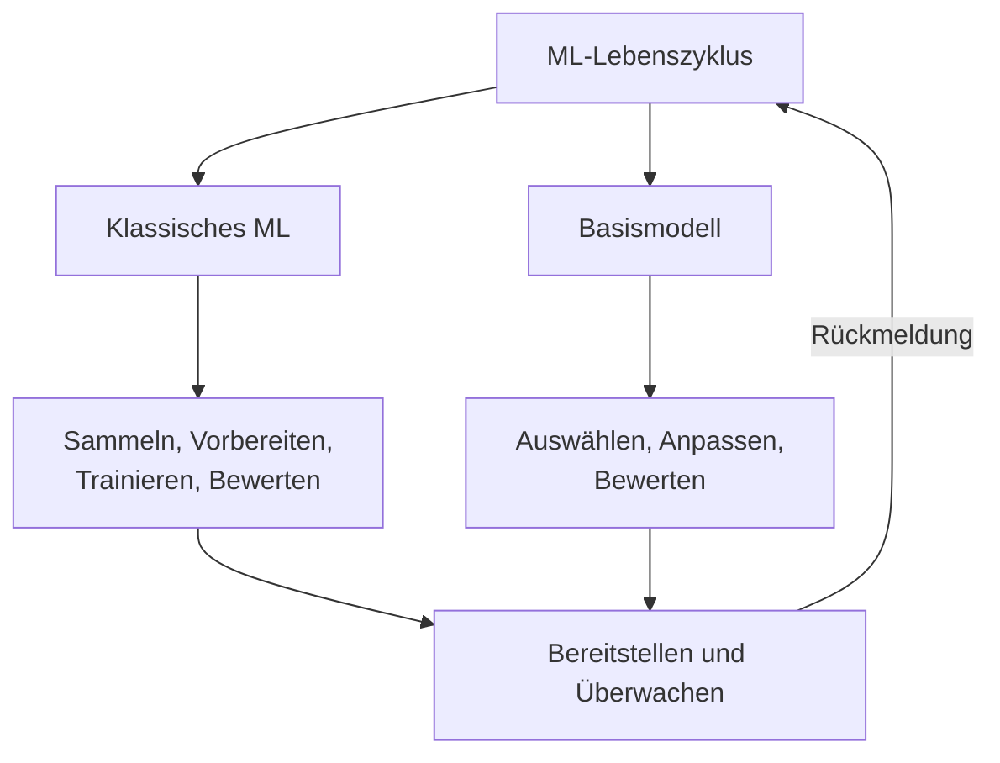
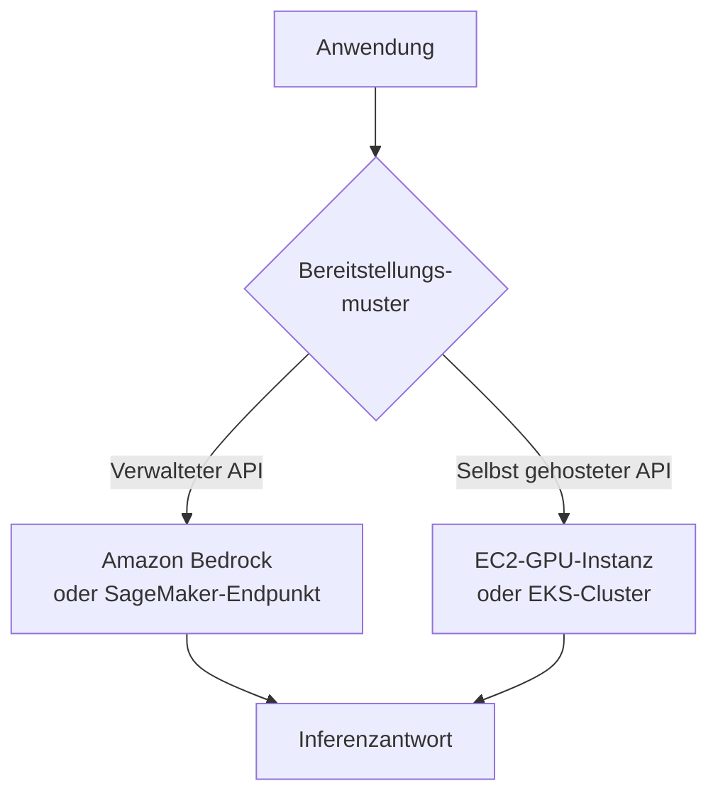
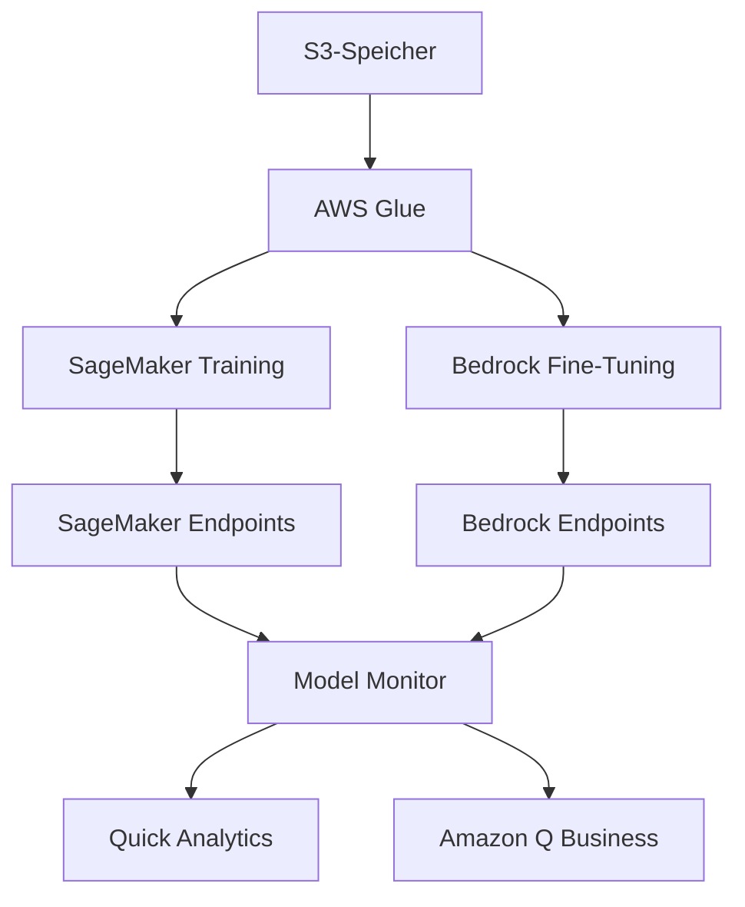
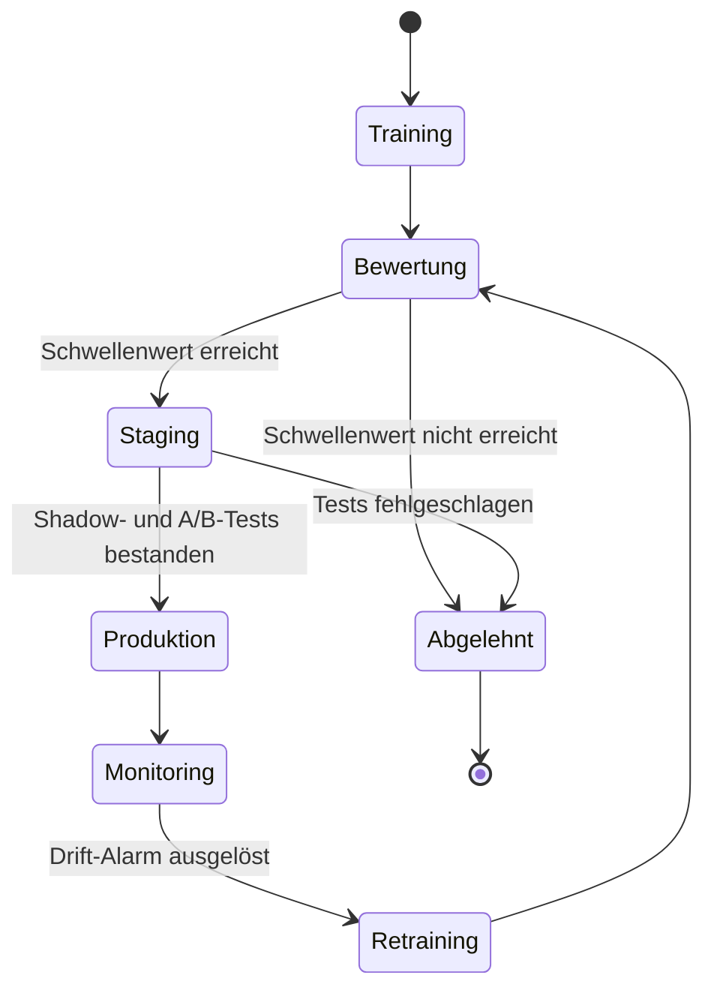
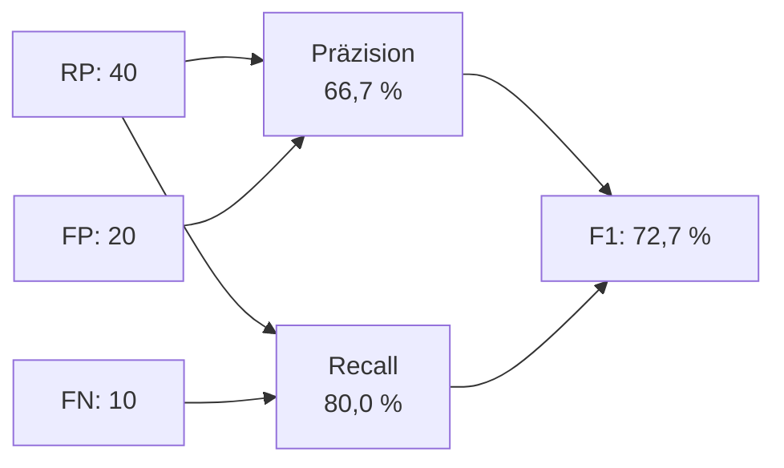

## Aufgabenstellung 1.3: Den KI/ML-Entwicklungslebenszyklus beschreiben

Der KI/ML-Entwicklungslebenszyklus ist die strukturierte Abfolge von Aktivitäten, die eine Geschäftsidee von Rohdaten bis zu einem Produktionssystem führt, das dauerhaft Mehrwert erzeugt. Domäne 1 hat das Vokabular und die Landschaft der Anwendungsfälle etabliert; diese Aufgabenstellung setzt diese Ideen in Bewegung, indem sie zeigt, wie KI- und ML-Projekte tatsächlich aufgebaut und verwaltet werden. Wer den Lebenszyklus versteht, kann als Unternehmensprofi realistische Erwartungen setzen, an jedem Kontrollpunkt die richtigen Fragen stellen und erkennen, wo AWS-Services die Kosten und Komplexität jeder Phase reduzieren.[^103001]

### 1.3.1 Komponenten einer KI/ML-Pipeline

Eine Pipeline ist die Abfolge von Schritten, die ein Team ausführt, um von Rohdaten zu einem funktionierenden Modell zu gelangen. Der Begriff stammt aus der Softwareentwicklung und trägt dieselbe Bedeutung: Jede Phase erhält ein Artefakt aus dem vorherigen Schritt, transformiert es und gibt das Ergebnis weiter. Das Pipeline-Konzept ist für Unternehmensprofis relevant, weil es ein gemeinsames Vokabular für die Diskussion über Fortschritt, Kosten und Qualität an jedem Punkt eines KI-Projekts bietet.[^103048]

Klassische ML-Pipelines und Basismodell-Pipelines teilen eine strukturelle Logik, unterscheiden sich jedoch in ihren mittleren Phasen. Eine klassische ML-Pipeline beginnt von Grund auf: Ein Team sammelt beschriftete Daten, betreibt Feature-Engineering, wählt einen Algorithmus aus, trainiert ein Modell mit eigenen Daten, stimmt es ab, bewertet es und stellt es anschließend bereit und überwacht das Ergebnis. Eine Basismodell-Pipeline überspringt den größten Teil der aufwendigen Daten- und Trainingsarbeit. Stattdessen wählt das Team ein vorhandenes vortrainiertes Modell aus, entscheidet, wie es an die eigene Aufgabe angepasst werden soll (durch Prompt-Engineering, Feinabstimmung oder Retrieval-Augmented Generation), bewertet das angepasste Modell und stellt es bereit. Beide Wege enden in denselben zwei Phasen: Bereitstellung und Monitoring.

*Abbildung 1.3.1: Zweigleisige KI/ML-Pipeline. Die klassische ML-Spur und die Basismodell-Spur laufen bei Bereitstellung und Monitoring zusammen; Rückmeldesignale fließen in die jeweils aktive Spur zurück.*

Die Phasen der klassischen ML-Spur sind die folgenden. **Datenerhebung** bezeichnet den Prozess des Sammelns von beschrifteten oder unbeschrifteten Datensätzen, aus denen das Modell lernen soll; Qualitätsprobleme in dieser Phase pflanzen sich durch jeden nachfolgenden Schritt fort.[^103002] **Explorative Datenanalyse (EDA)** ist die Untersuchung der gesammelten Daten, um ihre Verteilung, Beziehungen und Anomalien zu verstehen, bevor mit der Modellierung begonnen wird.[^103003] **Datenvorverarbeitung** umfasst das Bereinigen, Auffüllen fehlender Werte, Entfernen von Duplikaten und Konvertieren von Daten in ein Format, das ein Algorithmus verarbeiten kann.[^103004] **Feature-Engineering** ist das Erstellen oder Transformieren von Eingabevariablen, um dem Modell die zugrunde liegenden Muster zugänglicher zu machen; beispielsweise die Umwandlung von rohen Transaktions-Zeitstempeln in ein Merkmal "Tage seit dem letzten Kauf" für ein Abwanderungsmodell.[^103005] **Modelltraining** ist der Optimierungsprozess, bei dem ein Algorithmus diejenigen Parameterwerte findet, die den Vorhersagefehler auf dem Trainingsdatensatz minimieren.[^103006] **Hyperparameter-Abstimmung** passt die Einstellungen an, die das Trainingsverhalten steuern, nicht die erlernten Gewichte selbst; Beispiele sind die Lernrate und die maximale Baumtiefe in einem Gradient-Boosting-Modell.[^103007]

Die Basismodell-Spur beginnt mit der **Datenselektion**, die hier die Auswahl der Dokumente oder Beispiele für die Feinabstimmung bedeutet, anstatt von Grund auf zu trainieren. **Modellauswahl** ist die Entscheidung, welches vortrainierte FM angepasst werden soll, eine Entscheidung, die von Fähigkeiten, Kosten, Latenz und Lizenzbeschränkungen abhängt (besprochen in Abschnitt 1.3.2). **Anpassung** umfasst die drei wichtigsten Techniken, um ein allgemeines FM für eine bestimmte Aufgabe leistungsfähig zu machen: Prompt-Engineering, das Anweisungen formuliert, ohne die Modellgewichte zu verändern; Feinabstimmung, die eine Teilmenge der Gewichte mithilfe domänenspezifischer Beispiele aktualisiert; und *Retrieval-Augmented Generation (RAG)*, die das Wissen des Modells erweitert, indem relevante Dokumente zum Zeitpunkt der Inferenz abgerufen werden.[^103008] Domäne 3 behandelt jede Anpassungstechnik ausführlich; hier genügt es zu wissen, dass sie existieren und wo sie in den Lebenszyklus passen.

Beide Spuren gehen dann in die Phase der **Bewertung** über, in der das angepasste oder trainierte Modell an zurückgehaltenen Daten getestet und anhand von Leistungsmetriken bewertet wird (siehe Abschnitt 1.3.6). Ein Modell, das die Bewertung besteht, geht zur **Bereitstellung** über. Ein Modell, das nicht besteht, kehrt zu einer früheren Phase zurück, in der klassischen Spur häufig zum Feature-Engineering oder zur Hyperparameter-Abstimmung, in der FM-Spur zu einer überarbeiteten Anpassungsstrategie.

**Monitoring** ist die abschließende Phase und die, die bei der Planung am häufigsten unterschätzt wird. Sobald ein Modell in der Produktion ist, bleibt die reale Welt nicht stehen. Das Nutzerverhalten ändert sich, Datenpipelines entwickeln sich weiter, und die statistischen Muster, die das Modell gelernt hat, stimmen möglicherweise nicht mehr mit dem überein, was es sieht. Monitoring erkennt diese Abweichungen und löst Korrekturmaßnahmen aus, sei es eine Datenaktualisierung, ein erneutes Training oder eine Überarbeitung der Prompts.[^103009]

### 1.3.2 Quellen für Basismodelle

Basismodelle erfordern enorme Rechenressourcen, wenn sie von Grund auf trainiert werden. Ein einzelner Trainingsvorgang für ein großes Sprachmodell kann Millionen von GPU-Stunden verbrauchen und Dutzende von Millionen Dollar kosten.[^103010] Daher trainieren die meisten Organisationen keine eigenen FMs; sie beziehen sie aus externen Quellen und passen sie an. Die drei wichtigsten Quellen unterscheiden sich in Kosten, Kontrolle, Lizenzbedingungen und Leistungsfähigkeit.

**Open-Source-Vortrainingsmodelle** sind Modelle, deren Gewichte und in den meisten Fällen auch der Trainingscode öffentlich veröffentlicht werden. Zu den bekanntesten Beispielen, die 2025 bis 2026 verfügbar sind, gehören die Llama-Familie von Meta (inzwischen in der 4. Generation, mit den Varianten Llama 4 Scout und Maverick, die sehr lange Kontextfenster bieten; aktuelle Modellkarten auf Amazon Bedrock für die verfügbaren Kontextfenstergrößen sollten geprüft werden), Mistral und Mixtral von Mistral AI, die Falcon-Serie von TII sowie Stable Diffusion von Stability AI zur Bildgenerierung.[^103011] Der Vorteil von Open-Source-Modellen ist unmittelbar: Es fallen keine API-Kosten pro Token an, die Gewichte können heruntergeladen und in der eigenen Infrastruktur der Organisation betrieben werden, und das Modell kann ohne jegliche Anbietereinbindung feinabgestimmt werden. Der Nachteil ist die betriebliche Komplexität. Das Team muss Rechenkapazität bereitstellen und verwalten, Modellaktualisierungen handhaben und die Verantwortung für Sicherheit und Compliance übernehmen. Auch die Lizenzen variieren. Llama-Modelle unterliegen einer Community-Lizenz mit nutzungsbasierten kommerziellen Einschränkungen; der aktuelle Lizenztext sollte auf den geltenden Schwellenwert geprüft werden. Mistral-Modelle unterliegen einer Apache-2.0-Lizenz ohne solche Einschränkung.[^103012] Geschäftsteams sollten die geltende Lizenz prüfen, bevor sie sich auf ein Open-Source-FM in einem Produktionsprodukt festlegen.

**Kommerzielle Basismodelle** werden von KI-Unternehmen als verwalteter API-Service angeboten. Die verbrauchende Organisation zahlt pro verarbeitetem Token, anstatt Infrastruktur zu verwalten. Zu den führenden kommerziellen FMs, die über AWS zugänglich sind, gehören Anthropic Claude (mehrere Generationen, von Haiku für kostenempfindliche Aufgaben bis zu Opus und Sonnet für komplexes Schlussfolgern), Amazon Nova (Amazons eigene Familie mit Nova Micro, Lite, Pro und Premier), die Jamba-Modelle von AI21 Labs sowie die Command- und Embed-Familien von Cohere.[^103013] Kommerzielle Modelle erfordern keine Infrastrukturverwaltung und werden kontinuierlich vom Anbieter aktualisiert, doch hat die Organisation weniger Einblick in Trainingsdaten und Gewichte, was in regulierten Branchen Compliance-Fragen aufwerfen kann.

**Von Grund auf trainierte benutzerdefinierte Modelle** sind die seltenste Option. Ein neues großskaliges FM von Grund auf zu trainieren ist nur dann sinnvoll, wenn eine Organisation ein so spezialisiertes Fachgebiet hat, dass kein vorhandenes FM es ausreichend abdeckt (zum Beispiel ein Genomik-Unternehmen, dessen Vokabular und Denkmuster keine Überschneidung mit einem öffentlichen Trainingskorpus aufweisen) und über das Budget sowie die ML-Engineering-Tiefe verfügt, um dies zu tun. Die Kosten und der Zeitrahmen sind erheblich; die meisten Organisationen prüfen diesen Weg und kommen zu dem Schluss, dass die Feinabstimmung eines kommerziellen oder Open-Source-FM eine bessere Ressourcenverwendung darstellt.[^103014]

*Tabelle 1.3.1: Vergleich der FM-Quelloptionen*

| Quelle | Typische Kostenstruktur | Kontrolle über Gewichte | Betriebliche Komplexität | Beispielmodelle |
|--------|------------------------|------------------------|--------------------------|-----------------|
| Open-Source vortrainiert | Nur Infrastrukturkosten | Voller Zugriff | Hoch | Llama 4, Mistral, Falcon |
| Kommerzieller verwalteter API | Pro-Token-Preise | Kein Zugriff | Niedrig | Claude, Amazon Nova, Cohere |
| Von Grund auf benutzerdefiniert trainiert | Mehrere Millionen Investitionskosten | Vollständiges Eigentum | Sehr hoch | Proprietär |

Die Auswahl zwischen diesen Quellen ist selten eine Alles-oder-Nichts-Entscheidung. Viele Produktionsarchitekturen kombinieren alle drei: eine kommerzielle API für allgemeine Anfragen, ein feinabgestimmtes Open-Source-Modell für eine kostenempfindliche Aufgabe mit hohem Volumen und klassische ML-Modelle für eng gefasste Vorhersageprobleme, bei denen Erklärbarkeit zwingend erforderlich ist.[^103049]

### 1.3.3 Methoden zur Verwendung eines Modells in der Produktion

Ein trainiertes oder ausgewähltes Modell in die Produktion zu bringen bedeutet, seine Vorhersagen Nutzern und Anwendungen bereitzustellen. Die zwei primären Bereitstellungsmuster, die die Prüfung abdeckt, sind der **verwaltete API-Service** und die **selbst gehostete API**. Die Wahl zwischen ihnen erfordert eine Abwägung von Latenzanforderungen, Aufrufvolumen, Anpassungsanforderungen und Compliance-Beschränkungen.

Ein **verwalteter API-Service** abstrahiert alle Infrastrukturbelange von der verbrauchenden Anwendung. Die Anwendung sendet eine HTTP-Anfrage an einen von AWS verwalteten Inferenzendpunkt, erhält eine Vorhersage als Antwort und berührt die Rechenschicht nie direkt. **Amazon Bedrock** ist der primäre von AWS verwaltete API für Basismodelle und bietet Zugang zu Claude, Amazon Nova, Cohere, AI21, Meta Llama und anderen Modellen über eine einzige einheitliche API, ohne Server oder GPUs verwalten zu müssen.[^103015] Für Organisationen, die benutzerdefinierte klassische ML-Modelle oder feinabgestimmte FMs trainiert haben, bieten die Echtzeit-Inferenzendpunkte von **Amazon SageMaker AI** dieselbe Abstraktion: Das Team registriert ein Modellartefakt, konfiguriert einen Inferenzendpunkt und SageMaker übernimmt die Instanzbereitstellung, den Lastausgleich und die automatische Skalierung.[^103016] Die Vorteile verwalteter API-Services sind die schnelle Produktionseinführung, integrierte Skalierung und die Entlastung des Teams von Infrastrukturoperationen. Die Einschränkung besteht darin, dass eine feinkörnige Kontrolle über den Serving-Stack (z. B. benutzerdefinierte Tokenisierung oder GPU-Speicherverwaltung) nicht verfügbar ist.

Eine **selbst gehostete API** betreibt das Modell auf Infrastruktur, die die Organisation kontrolliert, und stellt es als eigene API bereit. Die häufigsten AWS-Muster sind das Hosten des Modell-Containers auf **Amazon EC2**-GPU-Instanzen für maximale Flexibilität oder die Bereitstellung als Kubernetes-Workload auf **Amazon EKS** für Container-Orchestrierung in großem Maßstab.[^103017] Selbst-Hosting eignet sich, wenn Compliance-Anforderungen das Senden von Daten an die API eines Anbieters verbieten, wenn das Aufrufvolumen hoch genug ist, damit reservierte oder Spot-EC2-Kapazität günstiger als Pro-Token-Gebühren ist, oder wenn das Team den Inferenz-Stack auf eine Weise anpassen muss, die ein verwalteter Service nicht erlaubt. Der Kompromiss ist der betriebliche Aufwand: Das Team verwaltet Instanzskalierung, Modellaktualisierungen, Sicherheits-Patching und Monitoring.

*Abbildung 1.3.2: Modell-Bereitstellungsmuster. Eine Anwendung leitet Inferenzanfragen je nach Latenz-, Compliance- und Kostenpriorität des Teams entweder an einen verwalteten API oder einen selbst gehosteten API weiter.*

*Tabelle 1.3.2: Entscheidungskriterien: verwalteter API vs. selbst gehosteter API*

| Kriterium | Verwalteter API | Selbst gehosteter API |
|-----------|-----------------|-----------------------|
| Infrastrukturverwaltung | AWS-verwaltet | Teamverwaltet |
| Skalierung | Automatisch | Manuell oder Auto-Scaling-Konfiguration erforderlich |
| Anpassung des Serving-Stacks | Begrenzt | Vollständig |
| Datenpfad | Kundendaten fließen durch die Steuerungsebene des verwalteten Diensts im AWS-Konto des Kunden; kein Zugriff auf Modellgewichte | Daten verbleiben in der teamkontrollierten Infrastruktur; voller Zugriff auf Gewichte |
| Kostenmodell | Pro Token oder pro Anfrage | Reservierte oder Spot-Rechenkapazität |
| Zeit bis zur ersten Bereitstellung | Stunden | Tage bis Wochen |

Über diese zwei Muster hinaus nutzen Organisationen manchmal **Batch-Inferenz** für Aufgaben mit hohem Volumen, die nicht zeitkritisch sind. Amazon SageMaker Batch Transform liest einen Datensatz aus Amazon S3, leitet jeden Datensatz durch das Modell und schreibt die Ergebnisse zurück nach S3, was es für Aufgaben wie die monatliche Risikobewertung eines gesamten Kundenportfolios geeignet macht.[^103018] Batch-Inferenz ist kein Inferenzendpunkt im herkömmlichen Sinne; sie läuft als Auftrag auf Abruf und verursacht Kosten nur während der Verarbeitung.

### 1.3.4 AWS-Services für jede Pipeline-Phase

Der AIF-C01-v1.1-Prüfungsleitfaden benennt ausdrücklich fünf Service-Familien, die die KI/ML-Pipeline abdecken: **Amazon Bedrock**, **Amazon Q**, **Amazon Quick**, **Kiro** und **Amazon SageMaker AI**. Zu verstehen, was jeder Service tut und wo er einzuordnen ist, verhindert Verwechslungen in der Prüfung.

**Amazon Bedrock** ist in den FM-Anpassungs- und Bereitstellungsphasen der Pipeline angesiedelt. Es bietet über einen verwalteten API Zugang zu einem kuratierten Katalog von Basismodellen sowie Werkzeuge zur Feinabstimmung dieser Modelle mit privaten Daten und zum Aufbau von RAG-Pipelines mithilfe von Wissensbasen, die durch Vektordatenbanken unterstützt werden.[^103019] Für Geschäftsteams ist Bedrock der Einstiegspunkt zum Aufbau von GenAI-gestützten Anwendungen, ohne ML-Infrastruktur verwalten zu müssen.

**Amazon SageMaker AI** deckt die gesamte klassische ML-Pipeline von der Datenvorbereitung über Training und Bewertung bis zur Bereitstellung ab. SageMaker Studio ist die integrierte Entwicklungsumgebung; SageMaker Pipelines bietet ML-native CI/CD zur Automatisierung der Pipeline von Ende zu Ende; SageMaker Feature Store verwaltet Feature-Definitionen und -Werte; und SageMaker Model Monitor verfolgt den Zustand bereitgestellter Modelle.[^103020] SageMaker hostet auch feinabgestimmte und benutzerdefinierte Modelle als Inferenzendpunkte und ist daher in der FM-Spur beteiligt, wenn eine Organisation ein Open-Source-Modell feinabstimmt, anstatt eine kommerzielle API zu verwenden.

**Amazon Q** ist eine Familie von KI-gestützten Assistenten, die auf spezifische professionelle Zielgruppen ausgerichtet sind. **Amazon Q Business** ist ein konversationeller Assistent für Unternehmensangestellte; er verbindet sich mit Unternehmensdatenquellen (SharePoint, Confluence, S3-Buckets, Ticketing-Systeme) und beantwortet Fragen auf der Grundlage von Organisationsinhalten.[^103021] **Amazon Q Developer** ist ein in IDEs integrierter Coding-Assistent, der Code vorschlägt, Logik erklärt und Sicherheitslücken identifiziert. Ab 2025 bis 2026 wird Amazon Q Developer in der IDE für vollständige Softwareentwicklungs-Workflows von **Kiro** abgelöst. Teams, die neue IDE-basierte KI-Entwicklungsprojekte durchführen, sollten Kiro anstelle von Q Developer evaluieren, obwohl Q Developer weiterhin verfügbar ist und noch im Prüfungsleitfaden genannt wird.

**Kiro** ist Amazons KI-gestützte integrierte Entwicklungsumgebung, die 2025 angekündigt wurde.[^103022] Während Q Developer in erster Linie eine Code-Vervollständigungs- und Chat-Überlagerung in bestehenden IDEs wie VS Code oder JetBrains ist, ist Kiro eine vollständige IDE, die rund um agentische KI-Workflows aufgebaut wurde. Kiro kann eine Spezifikation entgegennehmen, Implementierungspläne erstellen, Code über mehrere Dateien hinweg schreiben, Tests ausführen und iterieren, bis der Plan erfüllt ist. Für die Prüfung ist die wichtigste Unterscheidung, dass Kiro auf den KI-gestützten Software-Entwicklungslebenszyklus abzielt, nicht auf Endnutzer-Q&A oder Datenanalyse.

**Amazon Quick** ist der Name im v1.1-Prüfungsleitfaden für die AWS-Familie für Business-Analysen und KI-Assistenten für Geschäftsnutzer.[^103023] Die Funktionen, die bislang durch Amazon QuickSight (BI-Dashboards) und Amazon Q Business (konversationelle Antworten auf Unternehmensinhalte) bereitgestellt wurden, konvergieren unter diesem Namen mit dem Ziel, einem Business-Analysten zu ermöglichen, Dashboards zu erstellen, Fragen in natürlicher Sprache zu Daten zu stellen und KI-generierte narrative Zusammenfassungen zu erhalten, ohne das Werkzeug zu wechseln. Für die Prüfung gilt: Amazon Quick ist die Antwort auf "Self-Service-BI, erweitert durch Generative KI für Geschäftsnutzer"; vor Beschaffungsentscheidungen sollte die aktuelle Produktseite geprüft werden, da sich Marke und Tier-Struktur 2025 bis 2026 noch festigen.

Zur Prüfungsvorbereitung fasst die folgende Tabelle zusammen, welche Assistenten-Familie sich an welches Publikum richtet und wie jede dem v1.1-Status zugeordnet ist.

*Tabelle 1.3.3: Amazon Q, Kiro und Amazon Quick auf einen Blick*

| Service | Was er tut | Zielgruppe | Status für AIF-C01 v1.1 |
|---------|------------|------------|--------------------------|
| Amazon Q Business | Unternehmens-Q&A auf Basis von Unternehmensinhalten | Wissensarbeiter | Im Umfang; konvergiert in Amazon Quick |
| Amazon Q Developer | Code-Vervollständigung und Chat-Überlagerung in bestehenden IDEs | Entwickler, die VS Code oder JetBrains nutzen | Im Umfang; für vollständige IDE-Workflows durch Kiro abgelöst |
| Kiro | Vollständige IDE rund um agentische KI-Workflows | Entwickler, die KI-gestützte Funktionen erstellen | Im Umfang (neu in v1.1); Antwort auf "KI-gestützte IDE" |
| Amazon Quick | Self-Service-BI plus Generative-KI-Assistent | Business-Analysten und operatives Personal | Im Umfang (neu in v1.1); Antwort auf "BI + GenAI für Geschäftsnutzer" |

*Tabelle 1.3.4: AWS-KI/ML-Services nach Pipeline-Phase*

| Pipeline-Phase | AWS-Service | Rolle |
|----------------|-------------|-------|
| Datenspeicherung und -vorbereitung | Amazon S3, AWS Glue | Datensatz-Speicherung; ETL und Katalogisierung |
| Feature-Engineering | SageMaker Feature Store | Zentralisiertes Feature-Register |
| Klassisches Modelltraining | SageMaker AI Training | Verwaltete verteilte Trainingsaufträge |
| Hyperparameter-Abstimmung | SageMaker Automatic Model Tuning | Bayesische und zufällige Suche im Parameterraum |
| FM-Anpassung (Prompting/RAG) | Amazon Bedrock Knowledge Bases | Durch Vektordatenbanken unterstützte RAG-Pipelines |
| FM-Anpassung (Feinabstimmung) | Amazon Bedrock Fine-Tuning, SageMaker AI | Überwachte Feinabstimmung mit privaten Daten |
| Bewertung | SageMaker Model Monitor, Bedrock Model Evaluation | Leistungs- und Qualitätsbewertung |
| Bereitstellung (FM) | Amazon Bedrock Endpoints | Verwalteter FM-Inferenz-API |
| Bereitstellung (benutzerdefiniertes ML) | SageMaker AI Endpoints, Batch Transform | Echtzeit- und Batch-Inferenz für benutzerdefinierte Modelle |
| Monitoring | SageMaker Model Monitor | Datendrift- und Modellqualitätserkennung |
| Business-Analysen | Amazon Quick | BI-Dashboards und Datenfragen in natürlicher Sprache |
| Unternehmens-Q&A | Amazon Q Business | Konversationelle Antworten auf Unternehmensinhalte |
| Entwicklerproduktivität | Kiro, Amazon Q Developer | KI-gestützte Softwareentwicklung |

*Abbildung 1.3.3: AWS-Service-Karte über die KI/ML-Pipeline. Speicher und ETL speisen sowohl das klassische Training als auch die FM-Feinabstimmung; die Ausgaben konvergieren beim Monitoring und fließen dann zu den Endnutzer-Werkzeugen.*

### 1.3.5 Grundlegende MLOps-Konzepte

**MLOps** (Machine Learning Operations) ist die Disziplin, softwaretechnische Methodik auf den ML-Lebenszyklus anzuwenden, um die Modellauslieferung wiederholbar, skalierbar und langfristig wartbar zu machen.[^103024] Der Begriff ist an DevOps angelehnt: So wie DevOps Automatisierung, Versionskontrolle und kontinuierliche Integration in die Anwendungsentwicklung gebracht hat, bringt MLOps dieselben Praktiken in die Arbeit des Aufbaus und Betriebs von ML-Modellen. Die Prüfung deckt sieben zentrale MLOps-Konzepte ab.

**Experimentierung** ist die Praxis, jeden Durchlauf eines Modellierungsversuchs zu protokollieren, damit Ergebnisse reproduziert und verglichen werden können. Ohne systematisches Tracking kann ein Team, das einen guten Validierungswert erzielt, diesen nach einer Codeänderung nicht zuverlässig reproduzieren. **Amazon SageMaker Experiments** zeichnet die Hyperparameter, Metriken und Artefaktversionen auf, die mit jedem Trainingsdurchlauf verbunden sind.[^103025] Das Ergebnis ist ein durchsuchbarer Verlauf, der die Frage beantwortet: "Welcher Durchlauf hat dieses Ergebnis produziert, und welche Konfiguration war es?"

**Wiederholbare Prozesse** ersetzen Ad-hoc-Skripte durch versionierte, parametrisierte Pipelines, die aus konsistenten Eingaben konsistente Ausgaben erzeugen. **Amazon SageMaker Pipelines** ist der native MLOps-Orchestrierungsservice; er definiert Pipeline-Schritte in Code, speichert die Ausgabe jedes Schritts als versioniertes Artefakt und integriert sich in das SageMaker-Modellregister, um Bereitstellungen auf der Grundlage von Bewertungsschwellenwerten zu kontrollieren.[^103026] Wenn eine Pipeline auf diese Weise definiert ist, erzeugt ein erneuter Durchlauf mit neuen Daten eine neue Modellversion mit einer prüfbaren Herkunft bis zu den Eingabedaten.

**Skalierbare Systeme** stellen sicher, dass die Infrastruktur, die Training, Bewertung und Inferenz unterstützt, mit der Nachfrage wachsen kann, ohne manuelle Neukonfiguration. SageMaker übernimmt das verteilte Training über GPU-Cluster und skaliert Inferenzendpunkte anhand des Anfragevolumens mithilfe von Auto-Scaling-Richtlinien, die auf **Amazon CloudWatch**-Metriken basieren.[^103027]

**Technische Schulden verwalten** bedeutet im ML-Kontext, die Anhäufung versteckter Annahmen in Pipelines, undokumentierter Feature-Transformationen und nicht mehr nachverfolgbarer Modellversionen zu verhindern. Konkrete Praktiken umfassen das Führen von Feature-Definitionen in SageMaker Feature Store (damit dieselbe Transformation konsistent im Training und bei der Inferenz verwendet wird), die Speicherung von Modellartefakten im SageMaker-Modellregister mit Metadaten sowie die Überprüfung von Pipelines auf nicht mehr genutzte Komponenten.[^103028]

**Produktionsreife erreichen** bedeutet, dass ein Modell eine definierte Qualitätshürde passiert hat, bevor es Kunden erreicht. Dies umfasst Shadow-Tests (das neue Modell parallel zum Live-Modell betreiben und Ausgaben vergleichen), A/B-Tests (einen prozentualen Anteil des Datenverkehrs auf die neue Version umleiten) und Lasttests (sicherstellen, dass der Inferenzendpunkt Spitzenverkehr ohne erhöhte Latenz verarbeitet). Erst nach diesen Kontrollpunkten ersetzt eine neue Version das Produktionsmodell.[^103029]

**Modell-Monitoring** ist die kontinuierliche Bewertung des Verhaltens eines bereitgestellten Modells gegenüber den zum Zeitpunkt der Bereitstellung festgelegten Ausgangswerten. Zwei Drift-Typen sind besonders wichtig. *Datendrift* (auch *Kovariatenverschiebung* genannt) tritt auf, wenn sich die statistische Verteilung der Eingabe-Features im Laufe der Zeit verändert; beispielsweise kann ein Betrugserkennungsmodell, das auf Transaktionsmustern von 2023 trainiert wurde, mit der Entwicklung der Ausgabemuster andere Feature-Verteilungen aufweisen.[^103030] *Konzeptdrift* tritt auf, wenn sich die Beziehung zwischen Eingaben und der richtigen Ausgabe verändert; beispielsweise kann sich die Definition eines Abwanderungsmodells für risikobehaftetes Verhalten ändern, wenn sich das Produkt selbst verändert. **Amazon SageMaker Model Monitor** vergleicht kontinuierlich Live-Inferenzdaten mit einem Basisdatensatz und gibt Alarme aus, wenn der Drift einen Schwellenwert überschreitet.[^103031]

**Modell-Retraining** ist die Reaktion auf Monitoring-Signale. Eine Retraining-Strategie sollte den Auslöser (zeitgesteuert, schwellenwertbasiert auf Metrikwerte oder manuell freigegeben), das verwendete Datenfenster (alle historischen Daten, ein aktuelles rollendes Fenster oder einen bestimmten Datumsbereich) und das Bereitstellungstor (Bestehen/Nichtbestehen-Schwellenwerte, die das neu trainierte Modell erfüllen muss, bevor es die Vorgängerversion ersetzt) festlegen. SageMaker Pipelines unterstützt auslöserbasierte Ausführung, sodass ein von Model Monitor ausgelöster CloudWatch-Alarm automatisch einen Retraining-Durchlauf initiieren kann.[^103032]

*Abbildung 1.3.4: MLOps-Modelllebenszyklus-Zustände. Ein Modell durchläuft Training, Bewertungs- und Staging-Kontrollpunkte, bevor es die Produktion erreicht, und tritt erneut in den Zyklus ein, wenn das Monitoring Drift erkennt.*

### 1.3.6 Leistungs- und Geschäftsmetriken

Die Bewertung eines KI/ML-Modells erfordert zwei parallele Perspektiven. Technische Leistungsmetriken sagen dem Team, ob das Modell genaue Vorhersagen macht. Geschäftsmetriken sagen der Organisation, ob diese genauen Vorhersagen den beabsichtigten Mehrwert erzeugen. Ein Modell kann bei technischen Metriken gut abschneiden und trotzdem keinen geschäftlichen Mehrwert erzeugen, wenn es das falsche Problem löst oder zu teuer ist, um im großen Maßstab betrieben zu werden.

#### Technische Leistungsmetriken

Der AIF-C01-v1.1-Prüfungsleitfaden hat *AUC* aus der v1.0-Liste durch *Präzision* und *Recall* ersetzt. Die vier ausdrücklich genannten Metriken sind Genauigkeit, Präzision, Recall und F1-Score, die alle auf Klassifizierungsprobleme angewendet werden.[^103033]

**Genauigkeit** ist der Anteil aller Vorhersagen, die das Modell richtig getroffen hat. Für ein Modell, das Kunden-E-Mails als Beschwerde oder Nicht-Beschwerde klassifiziert, ist Genauigkeit (Anzahl korrekt klassifizierter E-Mails) / (Gesamtanzahl E-Mails). Genauigkeit ist einfach, aber irreführend, wenn die Klassen unausgewogen sind. Wenn 95 Prozent der E-Mails keine Beschwerden sind, hat ein Modell, das immer "keine Beschwerde" vorhersagt, 95 Prozent Genauigkeit, aber keinen Nutzen.[^103034]

Eine **Konfusionsmatrix** ist die Grundlage für das Verständnis aller anderen Klassifizierungsmetriken. Es ist eine Zwei-mal-zwei-Tabelle (für die binäre Klassifizierung), die Ergebnisse in vier Zellen zählt.

*Tabelle 1.3.5: Struktur der Konfusionsmatrix*

| | Vorhergesagt Positiv | Vorhergesagt Negativ |
|---|---|---|
| Tatsächlich Positiv | Richtig Positiv (RP) | Falsch Negativ (FN) |
| Tatsächlich Negativ | Falsch Positiv (FP) | Richtig Negativ (RN) |

**Präzision** ist der Anteil der positiven Vorhersagen, die korrekt waren: RP / (RP + FP). Ein Betrugserkennungsmodell mit hoher Präzision löst wenige Fehlalarme aus; die meisten markierten Transaktionen sind tatsächlich betrügerisch. Wenn falsche Positive kostspielig sind (beispielsweise das Blockieren einer legitimen Kundentransaktion), hat die Maximierung der Präzision Vorrang.[^103035]

**Recall** (auch *Sensitivität* genannt) ist der Anteil der tatsächlichen Positiven, die das Modell erfolgreich identifiziert hat: RP / (RP + FN). Ein medizinisches Screening-Modell mit hohem Recall erfasst die meisten echten Fälle der Erkrankung. Wenn falsche Negative kostspielig sind (beispielsweise das Verpassen einer Krebsdiagnose), hat die Maximierung des Recall Vorrang.[^103036]

Präzision und Recall stehen in einem Zielkonflikt zueinander. Das Absenken des Klassifizierungsschwellenwerts erhöht den Recall, senkt aber die Präzision; das Anheben des Schwellenwerts erhöht die Präzision, senkt aber den Recall. Der **F1-Score** ist das harmonische Mittel von Präzision und Recall: 2 x (Präzision x Recall) / (Präzision + Recall). Da er das harmonische Mittel statt des arithmetischen Mittels verwendet, reagiert er empfindlich auf niedrige Werte in beiden Metriken, was ihn zu einer zuverlässigen Einzelzahl-Zusammenfassung macht, wenn sowohl falsche Positive als auch falsche Negative wichtig sind.[^103037]

Ein Beispiel macht die Zielkonflikte konkret. Ein Betrugserkennungsmodell wird an einem Testdatensatz von 1.000 Transaktionen bewertet, von denen 50 betrügerisch sind. Das Modell markiert 60 Transaktionen als Betrug; 40 dieser Markierungen sind korrekt, und 10 echte Betrugsfälle werden verpasst.

- Genauigkeit: (40 + 940) / 1.000 = 98,0 %
- Präzision: 40 / 60 = 66,7 %
- Recall: 40 / 50 = 80,0 %
- F1-Score: 2 x (0,667 x 0,800) / (0,667 + 0,800) = 72,7 %

Die 98-Prozent-Genauigkeit klingt stark, aber der F1-Score von 72,7 Prozent gibt ein ehrlicheres Bild der Modellleistung auf der relevanten Klasse.

*Abbildung 1.3.5: Berechnung von Präzision, Recall und F1 für das Betrugserkennungsbeispiel. Das Diagramm zeigt, wie Richtig-Positive, Falsch-Positive und Falsch-Negative in den zusammenfassenden F1-Score einfließen.*

#### Geschäftsmetriken

Technische Metriken beantworten, ob das Modell funktioniert. Geschäftsmetriken beantworten, ob der Betrieb des Modells lohnend ist. Die vier Geschäftsmetriken im Prüfungsleitfaden sind Kosten pro Nutzer, Entwicklungskosten, Kundenfeedback und Return on Investment.[^103038]

**Kosten pro Nutzer** sind die gesamten Inferenzkosten (Rechenleistung, API-Gebühren und betrieblicher Aufwand) dividiert durch die Anzahl der in einem Zeitraum bedienten Nutzer. Diese Metrik macht die laufende Wirtschaftlichkeit eines Modells sichtbar. Ein Modell, das bei 10.000 Nutzern 0,001 USD pro Nutzer und Monat kostet, kann bei 10 Millionen Nutzern unerschwinglich werden, wenn die Kosten nicht mit dem Volumen sinken. Die Verfolgung der Kosten pro Nutzer im Zeitverlauf zeigt auch, wann die Effizienz eines Modells abnimmt, was häufig ein Zeichen dafür ist, dass Eingabe-Payloads wachsen oder das Modell öfter als nötig aufgerufen wird.[^103039]

**Entwicklungskosten** sind die einmaligen (oder pro Iteration anfallenden) Investitionen in Menschen, Daten, Rechenleistung und Werkzeuge, die zum Aufbau und zur Bereitstellung eines Modells erforderlich sind. Bei einem feinabgestimmten FM auf Bedrock umfassen die Entwicklungskosten den Aufwand für die Datenbeschriftung und die Rechenleistung des Feinabstimmungsauftrags. Bei einem benutzerdefiniert trainierten Modell umfassen sie Monate ML-Engineering-Zeit und GPU-Cluster-Stunden. Die Verfolgung der Entwicklungskosten gegenüber dem erzielten Geschäftswert beantwortet die Build-vs.-Buy-Frage für zukünftige Projekte.[^103040]

**Kundenfeedback** umfasst qualitative und quantitative Signale über die Nutzerzufriedenheit mit der KI-gestützten Funktion. Gängige Instrumente sind Net-Promoter-Score-Umfragen, produktinterne Daumen-hoch- oder Daumen-runter-Bewertungen von KI-Antworten sowie das Volumen von Kundensupport-Tickets, die der KI-Funktion zugeordnet sind. Kundenfeedback erkennt oft Probleme, die technische Metriken übersehen: Ein Modell kann hohe Präzision und hohen Recall haben, aber Ausgaben erzeugen, die Nutzer als wenig hilfreich oder markenfern wahrnehmen.[^103041]

**Return on Investment (ROI)** ist das Verhältnis des finanziellen Nettovorteils zu den Gesamtkosten über einen definierten Zeitraum. Ein Betrugserkennungsmodell, das jährlich Verluste von 2 Millionen USD verhindert, bei Gesamtjahreskosten (amortisierte Entwicklung plus Inferenz) von 400.000 USD, hat einen ROI von 400 Prozent. ROI ist die Metrik, die KI-Investitionen gegenüber der Finanzführung rechtfertigt und bestimmt, ob ein Projekt nach seiner ersten Bereitstellung weiterfinanziert wird.[^103042]

*Tabelle 1.3.6: Ausrichtung technischer und geschäftlicher Metriken nach Anwendungsfall*

| Anwendungsfall | Technische Metrik | Geschäftsmetrik |
|----------------|-------------------|-----------------|
| Betrugserkennung | F1-Score auf der Betrugsklasse | Verhinderte Betrugsverluste / Kosten für Behandlung von Fehlalarmen |
| Kundenabwanderungsvorhersage | Recall auf abwandernde Kunden | Umsatz aus gefährdeten Kunden gesichert |
| Dokumentenklassifizierung | Präzision je Kategorie | Eingesparte Mitarbeiterstunden pro Woche |
| Produktempfehlung | Genauigkeit der geklickten Empfehlung | Anstieg des durchschnittlichen Bestellwerts |
| Medizinisches Screening | Recall auf positive Fälle | Kosten pro erkanntem Fall vs. Behandlungskosten im Spätstadium |

Eine wirksame KI-Programmsteuerung erfordert die Verfolgung beider Spalten. Ein Modell mit starkem F1-Score, aber negativem ROI sollte neu gestaltet oder ersetzt werden. Ein Modell mit starkem ROI, aber sinkendem Recall benötigt ein Retraining, bevor sich die Geschäftsergebnisse verschlechtern.[^103050]

---

**Was dieser Abschnitt aufgebaut hat:** Aufgabenstellung 1.3 behandelte die Struktur des KI/ML-Lebenszyklus: die zweigleisige Pipeline, die FM-Beschaffung, Produktions-Bereitstellungsmuster und die AWS-Services, die jeder Phase zugeordnet sind. Außerdem wurden die MLOps-Praktiken eingeführt, die Produktionsmodelle gesund halten, sowie die technischen und geschäftlichen Metriken, die bestimmen, ob ein Modell funktioniert. Aufgabenstellung 2.1 wird einige dieser Konzepte vertiefen und sich dabei speziell darauf konzentrieren, wie Generative KI funktioniert und welches einzigartige Vokabular sie einführt.

---

## Selbsttestfragen

1. Ein Data-Science-Team hat vor sechs Monaten ein Kundenabwanderungs-Vorhersagemodell entwickelt und bereitgestellt. Ein Business-Analyst stellt fest, dass der Recall des Modells von 82 Prozent auf 54 Prozent gesunken ist, obwohl sich Volumen und Format der Eingabedaten nicht verändert haben. Das Team vermutet, dass sich Kundenverhaltensmuster seit dem Training des Modells verändert haben. Welches MLOps-Konzept beschreibt die Grundursache dieses Recall-Rückgangs am BESTEN?

   A. Hyperparameter-Drift
   B. Konzeptdrift
   C. Technische Pipeline-Schulden
   D. Feature-Store-Invalidierung

   Konzeptdrift tritt auf, wenn sich die Beziehung zwischen Eingabe-Features und der richtigen Ausgabe im Laufe der Zeit verändert, auch wenn die Verteilung der Eingabedaten stabil erscheint. In diesem Szenario führt das Team die Änderung ausdrücklich auf eine Entwicklung des Kundenverhaltens zurück, die die Eingabe-Ergebnis-Beziehung verändert, was Konzeptdrift ist, kein Verschieben der Feature-Verteilung. Der Recall sinkt, weil die Signale, die früher auf Abwanderung hindeuteten, nicht mehr dieselbe Vorhersagebeziehung zu tatsächlichen Abwanderungsereignissen haben; das Modell verfehlt echte Risikokunden, deren aktuelles Verhalten von den Mustern der Trainingszeit abweicht. Datendrift (Kovariatenverschiebung) würde bedeuten, dass sich die *Verteilung* der Eingabe-Features selbst verschoben hat, was der Aufgabentext ausschließt. Hyperparameter-Drift ist kein anerkannter Begriff im MLOps-Vokabular. Feature-Store-Invalidierung würde Fehler oder fehlende Werte erzeugen, keinen schrittweisen Recall-Rückgang. Die richtige Antwort ist Konzeptdrift, was signalisiert, dass das Modell mit aktuelleren beschrifteten Daten neu trainiert werden muss.[^103043]

2. Ein Einzelhandelsunternehmen bewertet Basismodell-Optionen für einen Produktbeschreibungs-Generierungsservice mit hohem Volumen, der etwa 50 Millionen Anfragen pro Monat verarbeiten wird. Das Team benötigt aus Compliance-Gründen vollständige Kontrolle über die Modellgewichte und möchte die laufenden Stückkosten minimieren. Welcher FM-Quellansatz ist am BESTEN geeignet?

   A. Kommerzieller verwalteter API mit einem großparametrigen Modell wie Claude Opus
   B. Open-Source-Vortrainingsmodell auf selbst verwalteten EC2-GPU-Instanzen
   C. Amazon Bedrock mit On-Demand-Preisen
   D. Von Grund auf mit proprietären Produktdaten trainiertes Modell

   Das Szenario gibt zwei Einschränkungen vor, die gemeinsam die Auswahl eingrenzen: Compliance erfordert Kontrolle auf Gewichtsebene, und das hohe Volumen erfordert eine bessere Wirtschaftlichkeit als Pro-Token-API-Preise. Open-Source-Vortrainingsmodelle (Option B) erfüllen beide Anforderungen. Sie bieten vollen Zugriff auf die Gewichte (Compliance-Anforderung erfüllt) und reduzieren bei Betrieb auf reservierten oder Spot-EC2-Instanzen die Grenzkosten bei 50 Millionen monatlichen Anfragen erheblich im Vergleich zu kommerziellen Pro-Token-Tarifen. Kommerzielle verwaltete APIs (Optionen A und C) bieten keine Kontrolle auf Gewichtsebene, was das Szenario ausdrücklich fordert; sie tragen auch Pro-Token-Kosten, die sich bei hohem Volumen summieren. (Anzumerken ist, dass Amazon Bedrock Kunden-Prompts innerhalb der Kontogrenze des Kunden hält; "Daten verlassen die Organisation" ist hier nicht der Ausschlussgrund, sondern das Fehlen von Kontrolle auf Gewichtsebene.) Ein Aufbau von Grund auf (Option D) ist weit kostspieliger als die Anpassung eines vorhandenen Open-Source-Modells und ist nur dann gerechtfertigt, wenn kein vorhandenes Modell das Fachgebiet ausreichend abdeckt. Die am BESTEN geeignete Option ist B.[^103044]

3. Ein Business-Analyst überprüft ein Betrugserkennungsmodell und sieht folgende Konfusionsmatrix-Ergebnisse: RP=80, FP=40, FN=20, RN=860. Der Analyst muss die Metrik berichten, die am BESTEN die Fähigkeit des Modells widerspiegelt, legitime Transaktionen nicht fälschlicherweise als betrügerisch zu kennzeichnen. Welche Metrik sollte berichtet werden?

   A. Genauigkeit
   B. Recall
   C. F1-Score
   D. Präzision

   Gefragt ist die Metrik, die widerspiegelt, wie oft positive Vorhersagen (Betrugsmarkierungen) tatsächlich korrekt sind, was der Definition von Präzision entspricht. Präzision = RP / (RP + FP) = 80 / (80 + 40) = 66,7 Prozent. Ein Falsch-Positiver in diesem Kontext ist eine legitime Transaktion, die fälschlicherweise als Betrug markiert wurde; eine Bank oder ein Einzelhändler trägt echte Kosten, wenn echten Kunden Transaktionen abgelehnt werden. Präzision misst direkt die Falsch-Positiv-Rate aus Modellperspektive. Recall (RP / (RP + FN) = 80 / 100 = 80 %) misst die Fähigkeit des Modells, tatsächlich betrügerische Transaktionen zu erfassen, nicht die Vermeidung von Fehlmarkierungen legitimer. Genauigkeit umfasst alle vier Zellen und wird von der großen Anzahl Richtig-Negativer dominiert, was sie hier weniger aussagekräftig macht. F1 ist eine kombinierte Metrik; sie isoliert das Präzisionsverhalten nicht. Die BESTE zu berichtende Metrik ist Präzision.[^103045]

4. Eine Organisation möchte einen konversationellen Assistenten aufbauen, der Mitarbeiterfragen auf der Grundlage interner Unternehmensdokumente beantwortet, die in SharePoint, Confluence und Amazon S3 gespeichert sind. Sie wollen keine Modellinfrastruktur verwalten. Welcher AWS-Service ist für diesen Anwendungsfall am direktesten konzipiert?

   A. Amazon SageMaker AI mit einem benutzerdefiniert trainierten Modell
   B. Kiro
   C. Amazon Q Business
   D. Amazon Bedrock mit manuellem Prompt-Engineering

   Amazon Q Business ist der AWS-Service, der speziell für unternehmensweite konversationelle Assistenten entwickelt wurde, die Fragen auf der Grundlage der eigenen Dokumente und Datenquellen einer Organisation beantworten. Er enthält integrierte Konnektoren für SharePoint, Confluence, S3 und Dutzende anderer Unternehmenssysteme, verarbeitet Segmentierung, Indizierung und Abruf automatisch und stellt den Assistenten über eine verwaltete Weboberfläche und API bereit, ohne Infrastrukturverwaltung zu erfordern. Kiro ist eine KI-gestützte IDE für Softwareentwicklungsaufgaben, kein Enterprise-Q&A-Service. SageMaker AI mit einem benutzerdefiniert trainierten Modell würde von der Organisation verlangen, die Abruf-, Verankerungs- und Antwortgenerierungskomponenten von Grund auf aufzubauen, was kein Weg ohne Infrastrukturverwaltung ist. Amazon Bedrock mit manuellem Prompt-Engineering würde vom Team erfordern, alle Konnektor- und Abruflogik selbst zu erstellen, was erheblich mehr Aufwand als die direkte Verwendung von Q Business erfordert. Der am direktesten konzipierte Service ist Amazon Q Business.[^103046]

5. Ein Projektteam präsentiert dem CFO die Ergebnisse eines neu bereitgestellten Produktempfehlungsmodells. Das Modell erzielte eine Genauigkeit von 91 Prozent und einen F1-Score von 84 Prozent auf dem Testdatensatz. Der CFO fragt, was das Modell im ersten Quartal des Betriebs tatsächlich für das Unternehmen geleistet hat. Welche Metrik beantwortet die Frage des CFO am BESTEN?

   A. F1-Score von 84 Prozent
   B. Genauigkeit von 91 Prozent
   C. Return on Investment, ausgedrückt als Umsatzauswirkung gegenüber Betriebskosten
   D. Recall auf die positive Klasse

   Die Frage des CFO bezieht sich ausdrücklich auf das Geschäftsergebnis, nicht auf die Modellqualität. Technische Metriken wie Genauigkeit, F1-Score und Recall beschreiben, wie das Modell mit beschrifteten Testdaten abschneidet; sie lassen sich nicht direkt in finanzielle Begriffe übersetzen, mit denen ein CFO beurteilt, ob ein Projekt die Finanzierung wert war. Return on Investment (ROI), ausgedrückt als finanzieller Nettoertrag oder Kostenvorteil, den das Modell im Verhältnis zu den Kosten für Aufbau und Betrieb erzeugt hat, ist die Geschäftsmetrik, die direkt beantwortet, ob die Investition gerechtfertigt war. Bei einem Empfehlungssystem könnte der ROI als inkrementeller Umsatz, der auf empfehlungsgetriebene Käufe zurückzuführen ist, abzüglich der Gesamtkosten des Modells für das Quartal berechnet werden. Diese Sichtweise ist für einen CFO, der entscheidet, ob er das Projekt weiterfinanzieren oder ausbauen soll, direkt umsetzbar. Die BESTE Metrik ist ROI.[^103047]

---

[^103001]: AWS Certified AI Practitioner Exam Guide v1.1, Task Statement 1.3. URL: <https://docs.aws.amazon.com/aws-certification/latest/ai-practitioner-01/ai-practitioner-01-domain1.html>
[^103002]: Amazon SageMaker Data Wrangler: Preparing ML data. URL: <https://docs.aws.amazon.com/sagemaker/latest/dg/data-wrangler.html>
[^103003]: Exploratory Data Analysis with Amazon SageMaker Studio. URL: <https://docs.aws.amazon.com/sagemaker/latest/dg/studio.html>
[^103004]: Data preprocessing concepts in ML. URL: <https://docs.aws.amazon.com/wellarchitected/latest/machine-learning-lens/data-preprocessing.html>
[^103005]: Amazon SageMaker Feature Store overview. URL: <https://docs.aws.amazon.com/sagemaker/latest/dg/feature-store.html>
[^103006]: Amazon SageMaker Training: training jobs overview. URL: <https://docs.aws.amazon.com/sagemaker/latest/dg/train-model.html>
[^103007]: Amazon SageMaker Automatic Model Tuning. URL: <https://docs.aws.amazon.com/sagemaker/latest/dg/automatic-model-tuning.html>
[^103008]: Amazon Bedrock retrieval-augmented generation overview. URL: <https://docs.aws.amazon.com/bedrock/latest/userguide/knowledge-base.html>
[^103009]: Amazon SageMaker Model Monitor: continuous monitoring of deployed models. URL: <https://docs.aws.amazon.com/sagemaker/latest/dg/model-monitor.html>
[^103010]: AWS Blog: Training large language models at scale. URL: <https://aws.amazon.com/blogs/machine-learning/training-large-language-models-on-amazon-sagemaker/>
[^103011]: Meta Llama model family overview. URL: <https://llama.meta.com/>
[^103012]: Mistral AI open-source model licensing. URL: <https://mistral.ai/news/announcing-mistral-7b/>
[^103013]: Amazon Bedrock supported foundation models. URL: <https://docs.aws.amazon.com/bedrock/latest/userguide/models-supported.html>
[^103014]: AWS ML Blog: When to train a custom model vs. use a pre-trained FM. URL: <https://aws.amazon.com/blogs/machine-learning/>
[^103015]: Amazon Bedrock: Fully managed FM service overview. URL: <https://docs.aws.amazon.com/bedrock/latest/userguide/what-is-bedrock.html>
[^103016]: Amazon SageMaker real-time inference endpoints. URL: <https://docs.aws.amazon.com/sagemaker/latest/dg/realtime-endpoints.html>
[^103017]: Running ML inference on Amazon EC2 GPU instances. URL: <https://docs.aws.amazon.com/AWSEC2/latest/UserGuide/accelerated-computing-instances.html>
[^103018]: Amazon SageMaker Batch Transform. URL: <https://docs.aws.amazon.com/sagemaker/latest/dg/batch-transform.html>
[^103019]: Amazon Bedrock Knowledge Bases for RAG. URL: <https://docs.aws.amazon.com/bedrock/latest/userguide/knowledge-base.html>
[^103020]: Amazon SageMaker AI overview: features and capabilities. URL: <https://docs.aws.amazon.com/sagemaker/latest/dg/whatis.html>
[^103021]: Amazon Q Business overview. URL: <https://docs.aws.amazon.com/amazonq/latest/qbusiness-ug/what-is.html>
[^103022]: Kiro: AI-powered IDE from AWS. URL: <https://kiro.dev/>
[^103023]: AIF-C01 v1.1 in-scope service list (Amazon Quick), AWS QuickSight product page, and Amazon Q Business product page. URLs: <https://docs.aws.amazon.com/aws-certification/latest/ai-practitioner-01/aif-01-in-scope-services.html>, <https://aws.amazon.com/quicksight/>, and <https://aws.amazon.com/q/business/>
[^103024]: AWS What is MLOps? URL: <https://aws.amazon.com/what-is/mlops/>
[^103025]: Amazon SageMaker Experiments documentation. URL: <https://docs.aws.amazon.com/sagemaker/latest/dg/experiments.html>
[^103026]: Amazon SageMaker Pipelines: ML CI/CD. URL: <https://docs.aws.amazon.com/sagemaker/latest/dg/pipelines.html>
[^103027]: Amazon SageMaker auto-scaling for inference endpoints. URL: <https://docs.aws.amazon.com/sagemaker/latest/dg/endpoint-auto-scaling.html>
[^103028]: Amazon SageMaker Feature Store: consistent feature transforms. URL: <https://docs.aws.amazon.com/sagemaker/latest/dg/feature-store-use-with-studio.html>
[^103029]: Amazon SageMaker shadow testing for deployments. URL: <https://docs.aws.amazon.com/sagemaker/latest/dg/shadow-tests.html>
[^103030]: Data drift detection with Amazon SageMaker Model Monitor. URL: <https://docs.aws.amazon.com/sagemaker/latest/dg/model-monitor-data-quality.html>
[^103031]: Amazon SageMaker Model Monitor: how it works. URL: <https://docs.aws.amazon.com/sagemaker/latest/dg/model-monitor-how-it-works.html>
[^103032]: Triggering SageMaker Pipelines with CloudWatch alarms. URL: <https://docs.aws.amazon.com/sagemaker/latest/dg/pipeline-eventbridge.html>
[^103033]: AWS Certified AI Practitioner Exam Guide v1.1, Objective 1.3.6. URL: <https://docs.aws.amazon.com/aws-certification/latest/ai-practitioner-01/ai-practitioner-01-domain1.html>
[^103034]: ML classification accuracy limitations. URL: <https://docs.aws.amazon.com/machine-learning/latest/dg/binary-classification.html>
[^103035]: Precision metric in binary classification. URL: <https://docs.aws.amazon.com/machine-learning/latest/dg/binary-classification.html>
[^103036]: Recall (sensitivity) in classification models. URL: <https://docs.aws.amazon.com/machine-learning/latest/dg/binary-classification.html>
[^103037]: F1 score definition and calculation. URL: <https://docs.aws.amazon.com/machine-learning/latest/dg/multiclass-model-insights.html>
[^103038]: AWS Certified AI Practitioner Exam Guide v1.1, business metrics in objective 1.3.6. URL: <https://docs.aws.amazon.com/aws-certification/latest/ai-practitioner-01/ai-practitioner-01-domain1.html>
[^103039]: Amazon Bedrock pricing model and cost management. URL: <https://aws.amazon.com/bedrock/pricing/>
[^103040]: AWS ML cost optimization guidance. URL: <https://aws.amazon.com/blogs/machine-learning/optimizing-costs-for-machine-learning-on-aws/>
[^103041]: Amazon Bedrock human-loop feedback integration. URL: <https://docs.aws.amazon.com/bedrock/latest/userguide/human-loop.html>
[^103042]: Measuring business value of ML with AWS. URL: <https://aws.amazon.com/blogs/machine-learning/measuring-the-business-impact-of-amazon-sagemaker/>
[^103043]: Concept drift and data drift in Amazon SageMaker Model Monitor. URL: <https://docs.aws.amazon.com/sagemaker/latest/dg/model-monitor-model-quality.html>
[^103044]: Deploying open-source models on Amazon EC2 GPU instances. URL: <https://docs.aws.amazon.com/AWSEC2/latest/UserGuide/accelerated-computing-instances.html>
[^103045]: Binary classification metrics: precision and recall. URL: <https://docs.aws.amazon.com/machine-learning/latest/dg/binary-classification.html>
[^103046]: Amazon Q Business: connecting enterprise data sources. URL: <https://docs.aws.amazon.com/amazonq/latest/qbusiness-ug/connectors-list.html>
[^103047]: Business metrics for evaluating ML models. URL: <https://aws.amazon.com/blogs/machine-learning/mlops-foundation-roadmap-for-enterprises-with-amazon-sagemaker/>
[^103048]: AWS Well-Architected Machine Learning Lens: ML lifecycle overview. URL: <https://docs.aws.amazon.com/wellarchitected/latest/machine-learning-lens/well-architected-machine-learning-lifecycle.html>
[^103049]: AWS Blog: Choosing between foundation models and custom ML. URL: <https://aws.amazon.com/blogs/machine-learning/choose-the-right-approach-for-your-generative-ai-use-cases/>
[^103050]: Amazon SageMaker MLOps: continuous evaluation and retraining. URL: <https://docs.aws.amazon.com/sagemaker/latest/dg/model-monitor.html>
